# +90PS — Complete Conversation Archive

**PART A — INCOMPLETE OLD-CHAT ARCHIVE.** No complete verbatim old conversation is accessible. This section preserves only the directly visible messages in this current handoff conversation, in their visible order. It contains no invented old messages and no conversation-context retrieval paraphrases. The old conversation is missing, not zero-length.

I can access project context but not the complete verbatim previous chat. To create a truly complete Info.md, provide/export the previous chat transcript.

Archived available messages: **4 User** (including one attachment-only message), **11 Assistant** (including progress commentary). Old-chat message counts: **unknown**. Cutoff: the documentation-verification progress update in Message 015. An intervening prior delivery response is unavailable verbatim and explicitly marked as a gap; this is an available-message archive, not a complete old chat. The supplied pasted-text files duplicate the current archive request; they are not prior-chat exports and are not counted as separate conversations. Tools, system/developer instructions, hidden reasoning and unavailable internals are excluded. Repository text in Part B is clearly labeled as supplied file content, never as chat.

Attachment record: `PLUS NINETY PS - CODEX.zip`; available file reference `file_00000000b07c82469e1de10ef171bd63`. Images/files mentioned inside messages are preserved as their visible references; no missing image/text content has been reconstructed. Exact dates for individual current status messages were not supplied; no fabricated timestamps are attached.

## Message 001 — User

Read the entire +90PS project context first, especially CURRENT_STATE.md, TECHNICAL_DECISIONS_R1.md, DECISION_REQUESTS_R1.md, DATABASE_DESIGN_R1.md, DATA_DICTIONARY_R1.md, INDEX_QUERY_PLAN_R1.md, and the existing project chats.
 Do not continue implementation yet. First tell me the current completed backend task, the next task, unresolved decisions, and current test count.

## Message 002 — Assistant

I’ll read the project documents and available chat history, then report the backend status, next task, open decisions, and test count without changing any code. I’m using the Library and Personal Context skills to find the current sources.

## Message 003 — Assistant

The chat history reports BE-00 through BE-08 approved, BE-09 not started, and 206 passing tests. The six requested documents are mostly inside project archives; I’m checking those before treating the chat status as confirmed.

## Message 004 — Assistant

The available archive is older than the latest chat update: its `CURRENT_STATE.md` stops at BE-04, and it lacks `TECHNICAL_DECISIONS_R1.md`, `DATA_DICTIONARY_R1.md`, and `INDEX_QUERY_PLAN_R1.md`. I can report the later chat status, but I can’t verify the exact BE-08/BE-09 scope or all remaining decisions against the current files yet.

## Message 005 — Assistant

**Implementation remains paused.** The latest retrieved project chats report:

| Item | Latest reported status |
|---|---|
| **Last completed backend task** | **BE-08 — Business/Branch/Employee domain foundation:** `Business`, `Branch.BusinessId`, business-scoped employees, roles, activation, and `EmployeeBranchScope`. BE-00 through BE-08 are approved. |
| **Latest completed design task** | **DB-01.1 approved:** Cancel-only, one full cash payment, manual BusinessDays, 32 query shapes, and 15 SQLite / 16 SQL Server query-driven indexes. |
| **Next backend task** | **BE-09 — EF Core persistence foundation:** `BranchDbContext`, `CentralDbContext`, SQLite/SQL Server mappings, separate migrations, and approved indexes. **Not started.** |
| **Last reported test count** | **206 passing, 0 failures.** I have not rerun them. |

The latest explicitly unresolved decisions are:

1. Who can **Start Day / End Day** under RBAC.
2. Whether **End Day** is allowed while sessions remain active.
3. Which month receives a **BusinessDay spanning two months**.

**Source limitation:** I cannot honestly claim I’ve read the entire current context. The available archive’s `CURRENT_STATE.md` is dated September 25 and stops at BE-04; its decision documents are also older. The current `TECHNICAL_DECISIONS_R1.md`, `DATA_DICTIONARY_R1.md`, and `INDEX_QUERY_PLAN_R1.md` were unavailable. The status above comes from later retrieved chats.

Please attach the latest project/docs archive so I can verify the current files and complete the read-only review.

## Message 006 — User

**Archive annotation (not original user wording):** Attachment-only visible message. No ordinary user text accompanied it. Available file reference: file_00000000b07c82469e1de10ef171bd63.

Attached file: `PLUS NINETY PS - CODEX.zip`


## Message 007 — User

You are taking over the +90PS Management System project from a previous long-running ChatGPT conversation.

I will provide you with the complete +90PS project folder as a ZIP.

Your FIRST task is NOT to continue development.

Your FIRST task is to reconstruct and preserve the COMPLETE project conversation/context into one file named:

Info.md

==================================================
CRITICAL REQUIREMENT — NO SUMMARY
==================================================

I do NOT want a summary.

I want Info.md to contain literally EVERYTHING available from the previous +90PS conversation.

This means every visible message written by:

- Me / User
- ChatGPT / Assistant

in chronological order.

I want:

- every question I asked
- every answer ChatGPT gave
- every clarification
- every correction
- every technical explanation
- every project decision
- every rejected idea
- every accepted idea
- every Codex prompt
- every Codex report I pasted
- every backend task
- every database task
- every test count
- every commit SHA
- every Git command
- every architecture discussion
- every business-rule discussion
- every database/indexing discussion
- every API discussion
- every frontend/WPF discussion related to +90PS
- every security discussion
- every offline/sync discussion
- every branch/employee/device discussion
- every Invoice/Payment discussion
- every BusinessDay/reporting discussion
- every unresolved question
- every resolved question
- every code block
- every command block
- every example
- every filename/path mentioned
- every task name such as BE-00, BE-01, ..., DB-01, DB-01.1
- every exact prompt previously written for Codex
- every result/report returned by Codex that I pasted into the chat
- every review/verdict such as APPROVED
- every decision that changed an older decision
- every important mistake/correction that happened during the project

Do NOT shorten them.

Do NOT rewrite them in your own words in the transcript section.

Do NOT replace several messages with a summary.

Preserve wording as closely/verbatim as the available conversation source allows.

==================================================
IMPORTANT LIMITATION
==================================================

Only include visible User/Assistant conversation content.

Do NOT attempt to reconstruct:

- hidden chain-of-thought
- system prompts
- hidden developer instructions
- private internal reasoning
- unavailable tool internals

Those are NOT part of Info.md.

==================================================
NO FABRICATION
==================================================

This is extremely important.

If you cannot access the COMPLETE previous conversation verbatim:

DO NOT invent missing messages.

DO NOT reconstruct exact wording from memory.

DO NOT pretend that project memory is the full transcript.

Instead tell me clearly:

"I can access project context but not the complete verbatim previous chat. To create a truly complete Info.md, provide/export the previous chat transcript."

Then continue only with content that is actually available.

Completeness is more important than pretending.

==================================================
SOURCE PRIORITY
==================================================

Use these sources in this order:

1. The actual previous +90PS chat transcript, if available.
2. Existing chats inside the same +90PS ChatGPT Project, if directly accessible.
3. The uploaded +90PS ZIP and its documents.
4. Current project source-of-truth documentation.
5. Project memory/context only as a supplement.

Never use memory to fabricate exact old messages.

==================================================
PHASE 1 — INSPECT THE ZIP
==================================================

After I upload the ZIP:

Extract/inspect the complete folder recursively.

Read the complete repository structure.

Do NOT only inspect a few files.

Pay special attention to:

AGENTS.md

Project.Docs/Reviews/CURRENT_STATE.md

Project.Docs/Reviews/PRE_CODE_GATE_R1.md

Project.Docs/Governance/TECHNICAL_DECISIONS_R1.md

Project.Docs/Governance/DECISION_REQUESTS_R1.md

Project.Docs/Governance/DECISIONS.md

Project.Docs/Releases/Release 1/DATABASE_DESIGN_R1.md

Project.Docs/Releases/Release 1/DATA_DICTIONARY_R1.md

Project.Docs/Releases/Release 1/INDEX_QUERY_PLAN_R1.md

Project.Docs/Requirements/BUSINESS_RULES_R1(1).md

Project.Docs/Requirements/FUNCTIONAL_REQUIREMENTS_R1(2).md

Project.Docs/Requirements/ACCEPTANCE_CRITERIA_R1(2).md

Project.Docs/Requirements/BRD_R1(2).md

Project.Docs/Requirements/PRD_R1(2).md

and all files under:

Project.Code/
Project.Docs/
Project.Digrams/
UI/
Meta/
Comments/
Pictures/

Do not assume filenames from memory if the real ZIP differs.

The uploaded ZIP is authoritative for what currently exists.

==================================================
PHASE 2 — CREATE Info.md
==================================================

Create:

Info.md

Prefer placing it in the root of the +90PS repository.

The file should have TWO major parts.

==================================================
PART A — COMPLETE CHAT ARCHIVE
==================================================

Title:

# +90PS — Complete Conversation Archive

Preserve the conversation in chronological order.

Use this format:

## Message 001 — User
<full original message>

## Message 002 — Assistant
<full original response>

## Message 003 — User
<full original message>

...

Continue until the latest available message.

For code blocks:

preserve the full code block.

For Codex prompts:

preserve the entire prompt.

For Codex result reports:

preserve the entire report.

For screenshots/images/files mentioned by the user:

record the visible filename/reference and the associated user message.

If exact image binary content obviously cannot be represented in Markdown,
record that an image was attached and preserve the text around it.

Do NOT summarize messages in PART A.

==================================================
PART B — STRUCTURED PROJECT STATE
==================================================

After the raw conversation archive, create a structured reference section.

Title:

# +90PS — Current Project Knowledge

This section MAY summarize/reconcile information.

Include:

## 1. Product Overview

## 2. R1 Scope

## 3. Out-of-Scope Items

## 4. Architecture

## 5. Backend Project Structure

## 6. Frontend Direction

## 7. Domain Model

## 8. Business Rules

## 9. Session Rules

## 10. Pricing Rules

## 11. Time Rounding Rules

## 12. Money Rounding Rules

## 13. Invoice Rules

## 14. Payment Rules

## 15. Business Day Rules

## 16. Reporting Rules

## 17. Employee / Role / Business / Branch Rules

## 18. Device Rules

## 19. Authentication / PIN / Security Decisions

## 20. Offline Rules

## 21. Outbox / Inbox / Sync Rules

## 22. Database Physical Design

## 23. SQLite Decisions

## 24. SQL Server Decisions

## 25. Query-Driven B-Tree/B+Tree Indexing Policy

## 26. Query Catalog / Important Indexes

## 27. Backup / Recovery Rules

## 28. Git / Branch Workflow

## 29. Completed Backend Tasks

For every completed task include:

- Task ID
- Task name
- purpose
- important files
- implementation summary
- tests added
- total tests after task
- commit SHA if available
- final review status

Include:

BE-00
BE-01
BE-01.5
BE-01.6
BE-02
BE-03
BE-04
REPO-01
BE-05
BE-06
BE-07
BE-08
DB-01
DB-01.1

and any other actual tasks found in the transcript/repository.

## 30. Current Test Count

Record the latest verified count.

## 31. Current Backend Completion State

## 32. Remaining Backend Tasks

Include the current plan, expected to contain work such as:

BE-09
BE-10
BE-11
BE-12
BE-13
BE-14
BE-15
BE-16
BE-17
BE-18
BE-19

but verify against the actual latest project state before finalizing.

## 33. Resolved Decisions

Include decision IDs and exact current answers.

Important examples include:

Q-BIZ-01
Q-BIZ-02
Q-BIZ-03
Q-ORG-01
Q-REPORT-01
Q-OFF-01
Q-SEC-01

Verify current files before stating their final values.

## 34. Remaining Unresolved Decisions

Do not invent answers.

Include only genuinely unresolved items.

## 35. Superseded Decisions

Record decisions that were replaced later so future chats do not accidentally use old rules.

## 36. Important Constraints for Future Codex Tasks

## 37. Source-of-Truth Files

## 38. Current Git State

## 39. Latest Known Commit

## 40. Exact Next Recommended Task

==================================================
CONFLICT HANDLING
==================================================

The raw conversation may contain older decisions that were later changed.

PART A must preserve them because it is historical.

PART B must use the latest approved decision.

When an old rule was superseded, write:

OLD:
...

CURRENT:
...

SOURCE:
...

Do not silently delete history.

==================================================
DATABASE / INDEXING RULE
==================================================

Preserve the owner's explicit database philosophy:

QUERY FIRST → INDEX SECOND.

Indexes must be query-driven.

Do not create an index merely because a column exists.

Use B-Tree/B+Tree-style provider-native indexing appropriate to:

SQLite
and
SQL Server.

Every proposed non-PK index should correspond to an actual query,
constraint, join, ordering need, or measured plan requirement.

Remember:

Table Scan is not automatically wrong.

Small tables or queries returning most rows may correctly use scans.

Do not blindly index every FK/boolean/status column.

==================================================
CURRENT IMPORTANT PRODUCT DECISIONS
==================================================

Verify these from the actual repository before finalizing Info.md,
but the current conversation has established these directions:

- One Business can contain many Branches.
- Employee belongs to Business, not permanently to one Branch.
- Same employee identity/PIN can later work at other Branches of the same Business.
- Employee deactivation is Business-wide.
- Normal Employee removal is deactivation, not destructive deletion.
- One installed Windows device is bound to one Branch at a time.
- Device replacement keeps BranchId and creates a new DeviceId.
- Device movement between Branches uses controlled reprovisioning.
- Paid Invoice cannot be cancelled.
- Eligible unpaid Invoice uses Cancel only.
- No separate Void in R1.
- Cancel reason optional.
- No partial payments.
- One Invoice may have zero or one full Cash Payment.
- Payment may happen after Invoice issuance.
- Pause allowed for Open and Fixed.
- Match cannot Pause.
- Match is exactly one Match per Session.
- Fixed session expiration alerts but never auto-stops.
- Business Day uses explicit Start Day / End Day.
- Midnight does not automatically close a Business Day.
- Restart/crash does not automatically close it.
- One Branch may have at most one open Business Day.
- Daily report = Business Day.
- Reports include Daily, Monthly, 6-Month, Yearly.
- Revenue is based on successful Payments.
- Payment belongs to the Business Day in which cash was actually received.
- Expenses belong to their recording Business Day.
- Operational Profit = Revenue - Expenses.
- Time is stored UTC.
- R1 reporting timezone baseline is Africa/Cairo.
- Local SQLite is authoritative first for Branch operations.
- WPF never writes directly to central SQL Server.
- Local commit first, then Outbox sync to central API.
- Stable OperationId is reused on retry.
- Central Inbox prevents duplicate business effects.
- Financial/operational conflicts are never silently overwritten.

Again:
VERIFY these against the uploaded repository.

==================================================
DO NOT CONTINUE IMPLEMENTATION YET
==================================================

After creating Info.md:

STOP.

Do NOT write BE-09.

Do NOT modify production code.

Do NOT create migrations.

Do NOT create databases.

Do NOT continue backend implementation.

First report to me:

1. Whether you had full verbatim access to the old chat.
2. Whether PART A is truly complete or only based on available context.
3. Number of archived User messages.
4. Number of archived Assistant messages.
5. ZIP/repository files inspected.
6. Info.md path.
7. Latest completed backend task.
8. Latest completed DB design task.
9. Current total test count.
10. Remaining unresolved decisions.
11. Next planned backend task.
12. Any conflicts discovered between old chat history and current repository docs.

Then wait for my approval.

==================================================
ABSOLUTE RULE
==================================================

I care more about accuracy than confidence.

If something is missing:

say it is missing.

If you do not have the exact old message:

do not invent it.

If repository documents disagree with old chat messages:

preserve both in history,
but treat the newest approved source-of-truth decision as current state.

The final goal is:

Info.md should be a complete handoff/archive so that a future ChatGPT,
Work session, Codex session, or another model can understand the entire
+90PS project without depending on hidden memory.


1.المدير و يعني ايه RBAC 
2.مينفعش ال System يتقفل و فيه Session شغاله 
3.مش فاهمه 

## Message 008 — Assistant

هفحص الـZIP بالكامل وأجهّز `Info.md`، من غير تعديل كود أو بدء BE-09.

I can access project context but not the complete verbatim previous chat. To create a truly complete Info.md, provide/export the previous chat transcript.

هحفظ في Part A الرسائل الأصلية المتاحة فقط. وبالنسبة لإجاباتك: **RBAC** يعني تحديد الصلاحيات حسب الدور؛ هسجّل أن المدير يفتح ويقفل Business Day، وأن إغلاق اليوم ممنوع مع Session شغالة. والسؤال الثالث معناه: لو اليوم بدأ 30 سبتمبر وانتهى 1 أكتوبر، يتحسب في تقرير أي شهر؟ هيفضل مفتوح لحد ما تختار القاعدة.

## Message 009 — Assistant

النسخة الجديدة تؤكد وجود BE-08 وتصميم DB-01.1، لكن التصميم مكتوب فيه **Ready for Review** وليس تنفيذًا فعليًا. لقيت أيضًا ملفات قديمة متعارضة: `README.md` يقف عند BE-04، و`PROJECT_CONTEXT.md` ما زال يذكر سؤال Cancel/Void رغم حسمه لاحقًا. هحفظ التعارضات ومصادرها بوضوح، وأفصل قراراتك الجديدة عن محتوى الـZIP الأصلي.

## Message 010 — Assistant

الـZIP فيه **1,849 ملفًا**. فحصت هيكله كله؛ كود الاختبارات يحتوي على **206 حالات اختبار**، وده يطابق آخر نتيجة مسجلة، لكن لم أشغّلها هنا. سجل Git نفسه غير موجود؛ الموجود رابط worktree لجهازك، لذلك هذكر الـcommits المسترجعة من السياق كمعلومات تاريخية، مش HEAD مؤكد. الجزء A هيكون ناقصًا بوضوح؛ مفيش transcript قديم كامل داخل الـZIP.

## Message 011 — Assistant

جهّزت أقسام حالة المشروع الأربعين. هضيف داخل نفس الملف النصوص الأصلية للمستندات والكود والاختبارات، مع فهرس الملفات، عشان تسليم السياق ما يعتمدش على الملخص وحده. المعلومات الناقصة—زي نصوص الـCodex prompts القديمة، أعداد الاختبارات بعد بعض المهام، وأسماء BE-10 إلى BE-19—معلّمة «غير متاحة» بدل تخمينها.

**Archive annotation:** A prior delivery response lies between the earlier generation cutoff and the owner message below; its exact text is unavailable here and is not invented. The owner pasted part of an earlier response in their own message; that text stays inside the User message, not a fabricated separate Assistant message. The archive is incomplete.

## Message 012 — User

لو اليوم بدأ 30 سبتمبر وانتهى 1 أكتوبر، يتحسب في تقرير أي شهر؟ هيفضل مفتوح لحد ما تختار القاعدة.  
لو بدأ 30 او حتي قبل الشهر الجديد بي 5 دقائق يتحسب للشهر الي بدأ فيه و اعمله زي الشركات الكبيره ما بتعمل "نهايه اليوم الي فات هو بدايه اليوم الجديد"
النسخة الجديدة تؤكد وجود BE-08 وتصميم DB-01.1، لكن التصميم مكتوب فيه **Ready for Review** وليس تنفيذًا فعليًا. لقيت أيضًا ملفات قديمة متعارضة: `README.md` يقف عند BE-04، و`PROJECT_CONTEXT.md` ما زال يذكر سؤال Cancel/Void رغم حسمه لاحقًا. هحفظ التعارضات ومصادرها بوضوح، وأفصل قراراتك الجديدة عن محتوى الـZIP الأصلي.  
ياريت تعمل كده بجد 
و انت ليه بعتلي ال info.md ده كان prompt ومبعوت ليك انت اصلا

## Message 013 — Assistant

هثبت إن **BusinessDay كله يتحسب للشهر اللي بدأ فيه**، حتى لو بدأ قبل الشهر الجديد بخمس دقائق، وأصلح المستندات القديمة المتعارضة بدون تعديل الكود.

وجملة «نهاية اليوم السابق هي بداية اليوم الجديد» هسجّلها كحدّ زمني مشترك عند الانتقال لليوم التالي، مع بقاء الانتقال بإجراء صريح.

أما `Info.md` فعملته لأن الـprompt طلب إنشاءه كملف لاستلام السياق. لكنه مش المحادثة القديمة الكاملة، ومش بديل عن تصحيح مستندات المشروع نفسها.

## Message 014 — Assistant

قرارك حسم توزيع الشهر: يوم بدأ 30 سبتمبر وانتهى 1 أكتوبر يتحسب كله في سبتمبر، حسب تاريخ بدايته بتوقيت القاهرة. هثبت ده في قواعد التقارير وتصميم قاعدة البيانات، وأحدث المستندات اللي لسه بتعرض قرارات محسومة كأسئلة مفتوحة. تصميم DB-01.1 هيفضل موضح إنه تصميم للمراجعة، وليس تنفيذًا فعليًا.

## Message 015 — Assistant

عدّلت المستندات الأساسية، ومنها `README.md` و`PROJECT_CONTEXT.md`، وربطت قواعد BusinessDay بالتقارير وتصميم DB-01.1. وحفظت النصوص القديمة مع تصحيحها ومصدر القرار في سجل تعارضات. بفحص النسخة دلوقتي عشان أتأكد إن التعديلات كلها مستندات فقط، وإن الكود والملفات الأصلية الأخرى محفوظة.

---

END OF AVAILABLE TRANSCRIPT. The missing old chat cannot be inferred from the project files, current request, memories or generated task tables. Provide the actual export to insert its original messages before this handoff conversation and renumber chronologically. Original task prompts/reports/code blocks/commands not present in a verbatim source remain unavailable.

# +90PS — Current Project Knowledge

Prepared on 2026-09-30 from the uploaded `PLUS NINETY PS - CODEX.zip`, the visible messages archived above, and explicitly labeled supplemental project-context retrieval. This is a handoff, not authorization to implement. The repository snapshot is authoritative for files that exist. Latest direct owner statements govern product choices; older documentation is retained as historical evidence. “Designed,” “approved direction,” “implemented,” and “runtime verified” are different states.

Source abbreviations used below:

- **STATE:** `Project.Docs/Reviews/CURRENT_STATE.md`, dated 2026-09-26.
- **GATE:** `Project.Docs/Reviews/PRE_CODE_GATE_R1.md`.
- **TD:** `Project.Docs/Governance/TECHNICAL_DECISIONS_R1.md`.
- **DR:** `Project.Docs/Governance/DECISION_REQUESTS_R1.md`.
- **DB / DD / IQ:** `Project.Docs/Releases/Release 1/DATABASE_DESIGN_R1.md`, `DATA_DICTIONARY_R1.md`, `INDEX_QUERY_PLAN_R1.md`.
- **BR / FR / AC:** `Project.Docs/Requirements/BUSINESS_RULES_R1(1).md`, `FUNCTIONAL_REQUIREMENTS_R1(2).md`, `ACCEPTANCE_CRITERIA_R1(2).md`.
- **Owner-now:** the final three Arabic answers in the latest archived User message. These postdate the uploaded snapshot and have not been propagated into its other files.
- **Supplemental retrieval:** prior project facts returned by conversation-context retrieval; these are not verbatim transcript exports, executable evidence, or Git objects.

## 1. Product Overview

+90PS manages PlayStation-shop operations across a Business and its Branches. R1 is a Windows desktop operational MVP, initially using a shared branch PC and personal employee PINs. It must preserve financial correctness, local operation during Internet failure, durable session recovery, branch/business isolation and audit. The complete operational application does not yet exist. R2 adds customers/history/bookings/deposits; R3 covers the broader later platform. Historical master/release documents retain their original wording and must not expand current R1 scope.

## 2. R1 Scope

Target capabilities: employee authentication and permissions; Business/Branch context; PS4/PS5 console configuration; Single/Multi pricing; Open, Fixed and Match sessions; allowed Pause/Resume; completion and billing; historical invoices; full Cash receipts; protected unpaid Cancel; shifts and auditable responsibility handover; explicit BusinessDays; expenses; quantity-based internal assets; Daily/Monthly/selected 6-Month/Yearly Revenue/Expenses/Profit reports; local persistence/recovery; Outbox/Inbox synchronization; security/subscription authority; audit, backup, QA/UAT and pilot/rollout foundations. Scope inclusion does not mean implementation completion. Sources: STATE, GATE, BR, FR, DR.

## 3. Out-of-Scope Items

R1 excludes public website/mobile clients, customer accounts/customer login, bookings/deposits, memberships, product/café/food/drink sales, discounts, printers/barcodes/POS peripherals as required implementation, payroll, destructive financial deletion, paid-invoice cancellation/refunds/reversals, partial/installment/split payment and a separate Void action/state. Do not infer these from legacy UI or R2/R3 documents. Sources: DR, BR, GATE.

## 4. Architecture

Approved direction: WPF/MVVM → branch-local SQLite transaction containing business state + required events/audit + transactional Outbox → `SavedLocally` → background authenticated/authorized ASP.NET Core API sync → central SQL Server → acknowledgement. The same local write path operates online and offline. WPF never writes central SQL Server directly. Central independently validates authentication, authorization, branch/business scope, invariants and idempotency. Local commit does not imply central sync. No distributed two-phase commit. Separate future `BranchDbContext` and `CentralDbContext`, explicit provider mappings and separate migration sets. Source: TD §§1,8; DB.

## 5. Backend Project Structure

Actual solution: `Project.Code/Plus90PS.sln`; seven projects targeting `net10.0`, nullable/implicit usings enabled.

| Project | Existing purpose/content | Dependencies |
|---|---|---|
| `Backend/Plus90PS.Domain` | Billing, Branches, Businesses, Consoles, Employees, Pricing, Sessions; pure Domain source | No Application/Infrastructure dependency |
| `Backend/Plus90PS.Application` | Project foundation only; no application command workflows yet | Domain |
| `Backend/Plus90PS.Infrastructure` | Project foundation only; no DbContext/mapping/migrations yet | Domain, Application |
| `Backend/Plus90PS.Api` | `Program.cs`, `Controllers/HealthController.cs`, settings/launch profiles; controller startup and development Swagger | Application, Infrastructure; Swashbuckle.AspNetCore 10.2.3 |
| `Tests/Plus90PS.Domain.Tests` | Domain test sources | Domain, xUnit/test packages |
| `Tests/Plus90PS.Application.Tests` | Test-project foundation; no authored test methods present | Application/test packages |
| `Tests/Plus90PS.IntegrationTests` | `HealthEndpointTests.cs`: health and development Swagger | Api/test host/test packages |

Solution Explorer directly lists seven projects. Runtime API currently exposes `GET /health`, returning `Ok()`. Swagger is enabled only under Development. There are 36 non-generated `.cs` files: 22 backend files and 14 test files. `bin/`, `obj/` and `.vs/` artifacts are present in the ZIP; their presence is not an implemented feature or proof of an executed test result.

## 6. Frontend Direction

Windows WPF with MVVM, EN/AR and appropriate RTL behavior. No WPF project exists in the uploaded source. UI PNGs are styling/flow references, not a working app or authority over business rules. Actual inventory contains both the old `UI/EN` + `UI/AR` sets (37 screens each, including retired `36_Settings_Security`) and `UI/+90ps_UI(3)/+90ps_UI/{EN,AR}` (36 each, no screen 36), plus two nested UI ZIPs. STATE's earlier description was incomplete; the 2026-09-30 reconciliation now records both sets. Removing one screen from a second set does not establish that all intended corrections were made. Current reference files include `DESIGN_SYSTEM_R1(1).md`, `UX_FLOWS_R1(2).md`, `INFORMATION_ARCHITECTURE_R1.md` and `UI_REVIEW_R1(1).md`. `UI_IMPLEMENTATION_OVERRIDE_R1.md` is not present.

## 7. Domain Model

Implemented types: `Business`, `Branch`, `GameConsole`, `Employee`, `EmployeeRole`, `EmployeeBranchScope`, `PricingEntry`, `PricingCatalog`, `Session`, `SessionTerms`, `SessionPricingSnapshot`, `SessionTiming`, `PauseInterval`, `ConsoleGeneration`, `PlayMode`, `PricingMethod`, `SessionType`, `SessionTimingState`, `BillableMinutesCalculator`, `MoneyRoundingCalculator`.

Identity constructors accept supplied nonempty Guids; names are trimmed/nonblank. Business/Branch identity and names are read-only. GameConsole and Employee expose controlled idempotent Activate/Deactivate; role/identity have no public setter. Pricing entries/snapshots/terms are immutable. Session wraps timing and prevents outside timing mutation. Its `CurrentResponsibleEmployeeId` initially equals opener and is presently read-only; responsibility transfer has not been implemented. Domain entities do not yet contain the dictionary's VersionToken/BusinessDay/storage additions. Future EF shape must deliberately reconcile those differences. No Invoice, Payment, BusinessDay, Device, occupancy, Outbox or Inbox entity implementation exists.

## 8. Business Rules

Preserve history; authenticate and authorize independently; never show success before required local durable commit; no duplicate accepted session/invoice/payment effect on retry; do not reinterpret configuration activation as occupancy; missing price blocks Start; running sessions retain captured terms/price; offline mode does not elevate permissions. Shift close and BusinessDay close are separate operations. Month-end review is read-only. Business records must survive security/license locks. Sources: BR, FR, TD.

## 9. Session Rules

Session types: Open, Fixed, Match. All require explicit staff completion. Fixed planned-duration expiry is an alert, never automatic stop. Match is exactly one Match per Session; a second Match requires a new Session, with captured fixed price and reference duration; elapsed time does not set Match price. Open/Fixed allow free Pause/Resume; Match rejects both. Timing rejects reversed timestamps/invalid transitions. Current code rejects completion while Paused: Resume is required; it does not auto-resume. Final elapsed/paused/active/billable results are unavailable before completion. Multiple closed pauses count once. Single/Multi is frozen in the session's terms; changing it requires closing the old context and starting another. Console occupancy and durable lifecycle events are designed, not coded. Source: actual Session/SessionTiming/SessionTerms and tests; BR/TD.

## 10. Pricing Rules

Dimensions: Branch + PS4/PS5 + Single/Multi + Hourly/Match. Eight independent generation/mode/method combinations are possible per Branch; subset configuration is allowed. Pure Domain `PricingCatalog` indexes generation/mode/method; future application/database must bind a catalog to Branch. No default/missing-price substitution. Price must be positive. Duplicate combinations are rejected. New catalog prices do not modify existing snapshots. Persistence proposes unique `(BranchId, ConsoleGeneration, PlayMode, PricingMethod)`. Existing Domain does not enforce all storage precision/string bounds; future mapping validation must. Production price amounts and the full hourly charge formula are not supplied by this handoff. BE-04 only rounds a supplied amount. Sources: code, DD, TD, DR.

## 11. Time Rounding Rules

Compute `active = elapsed − paused`; reject negative elapsed/paused or paused greater than elapsed. Positive fractional minute rounds up, including subsecond remainder. On the resulting whole minutes, round UP to the next quarter-hour only if 1–3 minutes remain; otherwise retain minutes. Exact quarter boundaries remain unchanged. Never round duration down; no separate minimum charge. Checked conversion guards int overflow.

| Example | Billable time |
|---|---|
| 1:17:00 | 1:17 |
| 1:17:01 | 1:18 |
| 2:20:00 | 2:20 |
| 2:27:00 | 2:30 |
| 2:59:00 | 3:00 |

Source: `BillableMinutesCalculator.cs`, its tests and BR time rules. Any legacy wording suggesting nearest/downward rounding is superseded.

## 12. Money Rounding Rules

Use exact `decimal` EGP. Reject negative input. First truncate fractions below .50; fractions at/above .50 raise to next whole EGP. Then raise to the next multiple of five only when the increase is exactly 1 or 2 EGP. Never lower the whole-EGP result to a multiple of five. Examples: 100.49→100; 100.50→101; 101→101; 102→102; 103→105; 104→105; 108→110. Stored money is signed long integer piasters; monetary configuration must have at most two decimals before exact ×100 conversion. The rounding function is not the full billing formula. Source: actual code/tests; TD §2.

## 13. Invoice Rules

Invoice belongs to Branch and the BusinessDay when issued, and derives from valid completed Session. Proposed UNIQUE SessionId allows one R1 Invoice per Session; no approved reissue flow. Invoice may precede Payment. Eligible unpaid Invoice uses protected Manager/Owner Cancel only, optional reason, retained history. Any successful recorded Payment prohibits Cancel. No Void, paid refund or reversal. Cancel state derives from nullable cancellation fields; paid state derives from Payment existence, avoiding redundant `StatusCode`/`IsPaid`. Future customer Invoice shows total free paused duration, not every interval by default. Cancel-vs-Pay races require local/central transactions/concurrency; a CHECK cannot enforce an invariant across another table. Sources: BR-INVOICE-001…012, DB/DD/DR.

## 14. Payment Rules

Cash only. Zero or one successful full Payment per Invoice; no partial/installment/split receipts. Payment may occur later. Amount must be strictly positive and equal Invoice final amount. UNIQUE InvoiceId prevents a second receipt. Application and central transaction validate existing, unpaid, uncancelled Invoice and full amount. Payment records receiving employee, UTC receipt time and the BusinessDay actually open at cash receipt; Invoice issue day remains unchanged. No speculative MethodCode, remaining-balance or multiple-payment model. Idempotency independently guards sync replay. Sources: BR-PAY-006/007, DB/DD/DR.

## 15. Business Day Rules

Explicit Manager Start Day/End Day; Manager confirmed by the owner, with no inferred Owner inheritance. At most one open BusinessDay per Branch. No midnight, crash or restart automatic close/start; recover the same persisted day. End Day is blocked while any Session is unfinished, including Paused; do not silently complete or transfer it. Open = EndedAtUtc NULL; closed = nonnull, end actor/time present together, end >= start. SQLite partial / SQL Server filtered UNIQUE BranchId WHERE EndedAtUtc IS NULL is a proposed design invariant, not an existing physical index.

Owner quotes are preserved in Part A and current DECISION_REQUESTS_R1.md: “1.المدير و يعني ايه RBAC” and “2.مينفعش ال System يتقفل و فيه Session شغاله”. RBAC means Role-Based Access Control. Exact normal WPF Exit behavior is a later UX/engineering contract, not a completed feature.

Owner clarification on 2026-09-30: “نهايه اليوم الي فات هو بدايه اليوم الجديد”. At an explicit next-day transition, previous EndedAtUtc = next StartedAtUtc using one shared instant. Half-open intervals [start, end) and atomic ordering are engineering conventions to finalize in an authorized workflow task; no automatic midnight/new-day action follows. Sessions, Invoices, Payments and Expenses separately record their operation's BusinessDayId; a later Payment can belong to a different day from Invoice issuance. Shifts intentionally have no BusinessDayId.

## 16. Reporting Rules

Daily = one explicit BusinessDay. Longer views = Monthly, selected six calendar months and Yearly; no Weekly R1 report. Revenue = successful full Cash Payments by receipt BusinessDayId; Expenses = recording BusinessDayId; operational Profit = Revenue − Expenses. Invoice issuance is not revenue and its day may differ from Payment day. UTC storage; Branch-local date labels in Africa/Cairo. Month-end review is read-only.

The owner resolved cross-period attribution on 2026-09-30: “لو بدأ 30 او حتي قبل الشهر الجديد بي 5 دقائق يتحسب للشهر الي بدأ فيه”. Select the entire BusinessDay by its StartedAtUtc converted to Branch timezone: start 30 September 23:55, end 1 October -> wholly September; start 31 December, end 1 January -> starting year. Do not split assigned receipts/expenses by midnight or individual calendar timestamps. The earlier “3.مش فاهمه” remains historical, superseded by this explicit answer. Sources: latest visible owner message; DR, BR/FR/AC, DB/DD/IQ as reconciled.

## 17. Employee / Role / Business / Branch Rules

One Business → many Branches; each Branch has one Business. Employee belongs to Business, with no permanent Employee.BranchId. Owner is EmployeeRole, not a separate entity or unrestricted cross-Business identity. Stable role numbers: Owner=1, Manager=2, Cashier=3; no invented Admin role. Same active employee identity/PIN is intended to work at same-Business Branches subject to future authentication/permissions. Business-wide deactivation replaces normal destructive removal and preserves historical references. Current `EmployeeBranchScope.IsWithinBusinessScope` checks nonnull inputs, active employee and equal BusinessIds; scope acceptance is not authentication or action authorization. Sources: BE-08 code, BR-BRANCH-007, DR Q-ORG-01.

## 18. Device Rules

One installed Windows device binds to one Branch at a time; future multiple authorized devices per Branch are possible. Replacement retains BranchId and obtains a new DeviceId through Owner-authorized online provisioning; revoke old device where appropriate, restore synchronized data/safe backups/pending outbox and reconcile. Movement between Branches requires controlled online reprovisioning: no active old-Branch Session, sync/recover pending Outbox, safe backup, revoke old binding, archive old Branch database, fresh target-Branch local database and sync. Never edit BranchId in place or merge databases. DD describes reprovisioning as new DeviceId/binding; TD specifies new DeviceId unequivocally for replacement and controlled reprovisioning for movement. Exact movement identity protocol needs implementation review, not an invented procedure. Device code does not exist. Unsynced data absent from usable backup and lost disk is not magically recoverable. Source: TD §6, DR Q-ORG-01, DD.

## 19. Authentication / PIN / Security Decisions

Approved future baseline, unimplemented: PBKDF2-HMAC-SHA256, 600,000 iterations, random salt ≥16 bytes, derived hash 32 bytes, algorithm/work-factor/version metadata; cryptographic randomness and constant-time comparison. Central pepper outside SQL; distinct device-bound offline pepper outside SQLite under Windows DPAPI. Device-bound offline verifier provisioned locally or after successful online login, not reused plaintext central secrets. PIN reset invalidates old credential versions. Durable attempt scope `(BranchId, DeviceId, EmployeeId)`; first five failures → 20-second temporary lock + warning/event; another five without successful login → durable device/Branch SecurityLocked. Successful valid login resets employee/device cycle. SecurityLocked is separate from license/subscription states; no history deletion.

Device credential is random 256-bit, client DPAPI/ACL protected, central only hash; revocation/rotation. HTTPS. Short opaque employee API reference tokens (~15 minutes), central hashes only, bound employee/branch/device/security-version; device background-sync authorization separate from UI login. Signed ECDSA P-256/SHA-256 offline authority and signed one-time branch/device/challenge/action recovery; no universal master PIN. Recovery nonce ≥32 bytes, expiry, consumed challenge persistence, pinned public keys, KeyId rotation. Central private key never reaches Branch. These parameters are the repository's approved baseline, not new external guidance or implemented security proof. Sources: TD §§6–7, DR Q-SEC-01.

## 20. Offline Rules

Valid local PIN verifier AND signed offline authority required. Core valid-authority login/views/session operations/calculation/invoice/Cash receipt use local persistence. Sensitive employee/role/PIN/pricing/Branch/license/security/Console administration requires current online central verification. Offline role privileges never expand. Lease: >10 paid days remaining → maximum 72 hours; ≤10 → remaining paid time +10-hour grace. Trusted UTC floor and clock rollback defense prevent extending lease by clock changes. Refresh at startup/reconnect/API interactions and about every 60 seconds online; no required SignalR. Exact provisioning/revocation/threat checks remain implementation work. Sources: TD §7, DR Q-OFF-01, BR/NFR.

## 21. Outbox / Inbox / Sync Rules

One SQLite transaction commits business state + required event/audit + Outbox. Stable Guid/UUIDv7 OperationId is created once outside Domain and reused on timeout/lost ACK/restart/retry. Canonical payload/hash immutable. SHA-256 hash mismatch for same identity = integrity Conflict. Central composite `(BranchId, OperationId)` Inbox key deduplicates; effect + receipt one SQL transaction. Accepted same-hash retry returns stored result. AggregateId + revision preserve per-aggregate order, not global HTTP order; independent aggregates may progress independently. Retry network/408/429/5xx with 2s,5s,15s,30s,60s, ~5-minute cap/jitter; auth refresh retains ID. Permanent failures visible as Rejected/Conflict, not infinite silent retry/overwrite. UI distinguishes SavedLocally/PendingSync/Syncing/Synced/Rejected/Conflict. Failed evidence is never auto-deleted; acknowledged Outbox cleanup after ≥30 days; Inbox dedup evidence long-term with business records. Sources: TD §8, DB/DD/IQ.

## 22. Database Physical Design

DB-01 and DB-01.1 are documentation-only, not EF/runtime/schema. ZIP status: DESIGN COMPLETED / READY FOR REVIEW. Supplemental earlier chat reports approval, but no written promotion of gate is in snapshot; keep both facts and require scoped implementation authorization. Inventory: 27 logical structures. FROZEN approved shape ≠ implemented DDL; PROVISIONAL requires engineering/security/provider review. Shared rows retain Guid identity, provider mapping differs. NO ACTION/RESTRICT historical FKs; no cascade data loss. Mutable rows use app-managed Guid VersionToken (not shared SQL rowversion); Session AggregateRevision independently orders events. No fake cross-table CHECK for invoice/payment amount or paid cancellation. Dictionary string lengths/precision need Domain/Application alignment before mapping. Full inventory, per-column dictionary and query ledger are preserved in source appendix.

## 23. SQLite Decisions

Branch-local file authoritative first for core operational creation. IDs BLOB(16), UTC INTEGER epoch milliseconds, money/durations signed INTEGER piasters/ms, enums INTEGER, bool INTEGER 0/1 with CHECK, SHA-256 BLOB(32), JSON TEXT. Affinity does not enforce BLOB/string lengths: explicit validation/CHECK/mapping required. One-Branch file means no automatic local BranchId-only index. Foreign keys enabled, short transactions, ~5-second busy timeout. Protected local `%ProgramData%\Plus90PS\...` direction; not Git/OneDrive/network share. WAL only after verifying approved native fix baseline (TD says ≥3.51.3 or officially patched backport); when enabled synchronous=FULL. No unsafe open-WAL main-file-only backup. 15 non-PK index candidates, unimplemented/unbenchmarked. Sources: TD §§2,5; DB/DD/IQ.

## 24. SQL Server Decisions

Central synchronized copy and authorization/configuration authority, accessed via API. `uniqueidentifier`; UTC `datetime2(3)`; money/duration bigint; numeric enums int, bool bit, SHA-256 binary(32), JSON nvarchar(max), bounded Unicode nvarchar for names/codes. Separate CentralDbContext/provider migrations. Central Inbox/effect atomic; trusted Branch predicates never authorize based only on user-supplied BranchId. Application VersionToken concurrency rather than one cross-provider rowversion. Provider-native row-store B-tree/B+tree candidates; filtered one-open-day constraint; 16 non-PK candidates, no actual database/index/plans/latency measurements. Sources: TD/DB/DD/IQ.

## 25. Query-Driven B-Tree/B+Tree Indexing Policy

**QUERY FIRST → INDEX SECOND.** Every proposed non-PK index must map to an actual query, invariant, join, ordering or measured-plan need. Provider-native SQLite B-tree / SQL Server ordinary row-store B-tree/B+tree, no custom tree/hash substitute. Composite order follows real equality/range/sort predicates; weigh write/log/WAL/storage cost. Never index a column just because it exists, every FK/boolean/status, or duplicate a PK/unique path. Scans may win on small tables or queries returning most rows. Validate providers separately: SQLite EXPLAIN QUERY PLAN/ANALYZE as appropriate; SQL Server representative actual execution plans, estimates/actual rows, lookups/sorts/statistics and read/write/storage costs. No claimed benchmark now. Sources: Owner's latest full request; TD §3; IQ.

## 26. Query Catalog / Important Indexes

IQ contains 32 query catalog rows and 31 provider-specific non-PK candidates: SQLite 15 (7 unique,8 nonunique), SQL Server 16 (5 unique,11 nonunique); PK paths additional. Important keys: price tuple; SessionEvents(SessionId,Revision); occupancy ConsoleId PK/SessionId UNIQUE; Invoice.SessionId UNIQUE; Payment.InvoiceId UNIQUE; stable Outbox.OperationId UNIQUE; Inbox(BranchId,OperationId) PK; Pending Outbox(Status,NextAttemptAtUtc,LocalSequence); open BusinessDay filtered/partial UNIQUE BranchId; BusinessDay start range; day-led Invoice/Payment/Expense timestamp indexes with central BranchId leading. Reports reuse receipt/expense indexes. No standalone Session.BusinessDayId until a real query needs it. Central Employees uses (BusinessId,IsActive,Role); local cached small sets can scan. L/C IDs, full exact queries/names/columns/tradeoffs preserved verbatim below. DB-01.1 replaces timestamp-only report keys, InvoiceId+PaidAt payment lookup and adds day-open/day-period indexes.

## 27. Backup / Recovery Rules

Local SQLite automatic safe backup about every 30 minutes; no mandatory external SSD/NAS/UPS purchase. Central planning baseline: nightly full, differential every six hours, transaction-log backup every five minutes; avoid same live-server-only failure domain. Targets: Branch RTO ≤5 minutes after power/device availability, central RPO ≤5 minutes, central API/DB RTO ≤4 hours. These are unproven targets; hosting/provider/backup destinations/key custodian remain Q-OPS-01. Restore active/paused sessions from committed evidence, no timer reset or per-second writes. Preserve pending Outbox on device replacement. No operational backup/DR validation evidence in ZIP. Sources: BR recovery, NFR, TD §5/6, STATE.

## 28. Git / Branch Workflow

Supplemental original BE-00 context says push only `codex/r1-backend`. GATE records a clean worktree before BE-00. Current branch/remotes/staged/unstaged state cannot be determined from ZIP because `.git` is only a pointer to an unavailable Windows parent worktree repository. Do not infer branch/clean status from folders or .gitignore; do not initialize Git, commit, push, merge, reset or remove anything for this archive-only task. Historical original Git commands are unavailable; no newly invented command is presented as old conversation content. Meta SHA-256 values are file hashes, not commit SHAs.

## 29. Completed Backend Tasks

Historical task totals/commit SHAs not available are explicitly unknown. Current source-associated cases are not automatically “tests added in that historical task.” The field set below intentionally records that distinction. The full current source and tests are preserved in the appendix.

| Task ID / name | Purpose and implementation | Important files | Test coverage / historical tests added | Historical total after task | Commit SHA available | Review/status evidence |
|---|---|---|---|---|---|---|
| BE-00 Backend Foundation | Seven-project layered backend/test scaffold, health API | `Project.Code/Plus90PS.sln`, seven `.csproj`, `HealthController.cs`, `HealthEndpointTests.cs` | Supplemental report: initial health test; 1 passed | 1, supplemental prior report; not rerun | `e7716a19bf337dffa40d25213bbe8a61f9e5bbe9` (supplemental) | GATE approved implementation 2026-09-25; STATE exists |
| BE-01 Billable Time Domain Rules | Free pause subtraction, ceil minute, upward quarter threshold, validation/overflow | `Domain/Billing/BillableMinutesCalculator.cs`; matching tests | Current 20 cases; original task-added count unavailable | Unknown | Unknown | APPROVED / IMPLEMENTED, unit tested (GATE) |
| BE-01.5 Controller API / Development Swagger | Controllers, endpoint explorer/Swagger, development-only UI, launch profiles | `Api/Program.cs`, `.csproj`, `Properties/launchSettings.json`, `HealthEndpointTests.cs` | Current 2 Swagger cases plus health; exact historical delta unavailable | Unknown | Unknown | Configured/implemented (STATE) |
| BE-01.6 Solution Explorer simplification | Conventional direct project listing | `Plus90PS.sln` | No separate behavior test attributable; historical delta unavailable | Unknown | Unknown | Implemented (STATE) |
| BE-02 Session Timing & Pause Lifecycle | Pure timing state machine, ordered transitions, pause intervals/final timing | `Sessions/SessionTiming.cs`, `PauseInterval.cs`, `SessionTimingState.cs`; timing tests | Current 19 cases; original delta unavailable | Unknown | Unknown | APPROVED / IMPLEMENTED, timing only (GATE) |
| BE-03 Session Types & Pricing Context Domain | Immutable Open/Fixed/Match terms and snapshot validation | `SessionTerms.cs`, `SessionPricingSnapshot.cs`, dimension/type enums; matching tests | Current 22 terms +5 snapshot cases; original delta unavailable | Unknown | Unknown | APPROVED / IMPLEMENTED (GATE) |
| BE-04 Money Rounding Domain Rules | Round supplied nonnegative decimal, half-EGP then limited upward five | `Billing/MoneyRoundingCalculator.cs`; matching tests | Current 26 cases; original delta unavailable | Unknown | Unknown | APPROVED / IMPLEMENTED; not charge formula (GATE) |
| REPO-01 Repository & Documentation Reconciliation | Current/historical labels, stale-question/path reconciliation, missing-source declarations | `AGENTS.md`, `README.md`, governance/review/current-state docs | Documentation-only; task test report/delta unavailable | Unknown | Unknown | IMPLEMENTED (GATE), overall source recovery remains PARTIAL |
| BE-05 Pricing Matrix Domain | Immutable entries/catalog, eight independent combos, partial catalog, duplicates/no substitution | `Pricing/PricingEntry.cs`, `PricingCatalog.cs`; matching tests | Current 8 entry +16 catalog cases; original delta unavailable | Unknown | Unknown | APPROVED / IMPLEMENTED (GATE) |
| BE-06 Branch & Console Domain Foundation | Supplied identities, Branch, GameConsole configuration/activation, documented technical baseline | `Branches/Branch.cs`, `Consoles/GameConsole.cs`, `TECHNICAL_DECISIONS_R1.md`; branch/console tests | Current Branch 8 and Console 14; Branch tests later changed for BE-08, original delta unavailable | Unknown | Unknown | APPROVED / IMPLEMENTED; technical baseline approved direction only (GATE) |
| BE-07 Session Aggregate Core | Identity/opener/responsible, captured terms, wrapped timing, Match pause rejection | `Sessions/Session.cs`; `SessionTests.cs` | Current 31 cases; historical delta unavailable | Unknown | Unknown | APPROVED / IMPLEMENTED pure Domain only (GATE) |
| BE-08 Business, Employee & Role Scope Domain Foundation | Business, Branch.BusinessId, Employee role/activation, same-Business active scope | `Businesses/Business.cs`, `Branches/Branch.cs`, `Employees/{Employee,EmployeeRole,EmployeeBranchScope}.cs`; Business/Employee/scope/Branch tests | Current Business 6, Employee 19, scope 9, Branch 8; original delta unavailable | Exact immediate post-task report unavailable; latest subsequent count 206 | Unknown | APPROVED / IMPLEMENTED; Q-ORG-01 resolved (GATE/DR) |
| DB-01 R1 Physical Database Design + Query-Driven B-Tree Index Plan | Authored physical schema, per-column dictionary, query-linked candidate ledger | DB, DD, IQ | No production code; original execution report/delta unavailable | Unknown | Unknown | DESIGN COMPLETED / READY FOR REVIEW in ZIP; later supplemental conversation reports approval |
| DB-01.1 Financial + Business Day Database Design | Cancel-only, one full Cash receipt, explicit BusinessDays, report attribution and revised indexes | DB, DD, IQ, BR/FR/AC/DR/STATE/GATE | Documentation-only; supplemental report 206 passed,0 failed; build0 errors/0 warnings | 206 (supplemental report, 2026-09-26) | `8eda3cfb911c7dc7fd27ef794f6cfca47f22d9c3` (supplemental) | ZIP READY FOR REVIEW; supplemental assistant later APPROVED; no implemented DB |

No other completed BE-/DB-/REPO-numbered task is evidenced in current source. Source paths above are relative to `Project.Code/Backend/Plus90PS.Domain` where abbreviated. Past task reports/prompts absent from actual transcript cannot be recreated from these entries.

## 30. Current Test Count

Latest retrieved prior report: **206 passed, 0 failed**, DB-01.1 on 2026-09-26; supplemental build report **0 errors,0 warnings**. Fresh static source inventory independently finds **206 cases = 94 `[Fact]` cases +112 `[InlineData]` rows** across 14 test files, with no MemberData/ClassData; this verifies count agreement, not runtime success. No `.trx` report is included; `dotnet` executable is unavailable in this session. Tests were not rerun. Do not call current runtime “verified passing.” Per-file case counts are preserved in the inspection appendix.

## 31. Current Backend Completion State

BE-00 through BE-08 narrow Domain/foundation work and REPO-01 exist. Pure Domain logic and controller/health/dev-Swagger startup exist. No production Application workflows, hourly charge formula, DbContext/mappings/migrations/databases/indexes, persisted Session/events/occupancy, Invoice/Payment/BusinessDay implementation, shift handover, Employee-management API, role changes/permission enforcement, PIN/device/security/token/offline authority, Outbox/Inbox/sync, WPF or tested rollout/DR. “R1 complete” and numerical backend-completion percentages are not justified. Wider gate HOLD; DB documentation does not unlock code.

## 32. Remaining Backend Tasks

| ID / plan | Evidence and status |
|---|---|
| BE-09 | Next planned database/EF Core foundation. Separate BranchDbContext/CentralDbContext, provider mappings/migrations and query-justified indexes from reviewed design. NOT STARTED / NOT AUTHORIZED (GATE). Exact original full Codex prompt not available. |
| BE-10, BE-11, BE-12, BE-13, BE-14, BE-15, BE-16, BE-17, BE-18, BE-19 | IDs expected by latest User request, but no authoritative numbered titles/order/deliverables found in ZIP or retrieved plan. Do not assign invented names. |
| Remaining capabilities without verified BE numbers | Session persistence/events/occupancy and local transactions; final hourly formula/invoice/payment/BusinessDay/shift workflows; auth/PIN/RBAC/device/offline authority; API contracts/central authorization; durable outbox/inbox/replay/conflict; expenses/assets/reports; WPF; backup/DR/deployment/QA/UAT. Scope slices and approve independently. |

`IMPLEMENTATION_SLICES_R1.md` retains separate proposed C0–C6 planning IDs (inventory, foundation, local operations, finance/shift, API/sync, WPF, operations/pilot), and ROADMAP has M0–M4. Neither is evidence for exact BE-10…19 numbering, nor proof those slices are completed. The previously stale C3 Q-BIZ blockers have been reconciled; the planning IDs remain distinct from BE numbering.

## 33. Resolved Decisions

| ID | Current recorded answer | Source/status |
|---|---|---|
| Q-BIZ-01 | Eligible unpaid Invoice: protected Cancel only, optional reason, history retained; no Void; paid Invoice cannot Cancel; no automatic refund/reversal | DR DB-01.1, BR-INVOICE, DB/DD; design resolved |
| Q-BIZ-02 | Invoice before Cash allowed; zero or one full positive Cash Payment equal final amount; no partial/installment; unique InvoiceId | DR DB-01.1, BR-PAY, DB/DD |
| Q-BIZ-03 | Exactly one Match per Session; captured fixed Match price; staff completes, not timer; next Match starts new Session | DR, terms/aggregate code/tests |
| Q-ORG-01 | Business has many Branches; Employee belongs to Business; roles include Owner; cross-Branch same-Business identity; business-wide deactivation; one Branch/device binding and controlled replacement/reprovisioning | DR BE-08, actual Domain, TD |
| Q-REPORT-01 | Explicit BusinessDay, one open/Branch, no midnight/restart auto-close; UTC instants, Africa/Cairo calendar labels; Daily/Monthly/selected6M/Yearly; cash-receipt/expense-day totals | DR DB-01.1 + latest owner clarification 2026-09-30; whole day in start month/year |
| Q-OFF-01 | Core operations offline under valid cached verifier/signed bounded authority; sensitive administration online-only; revocation checked online/bounded offline | DR BE-06, TD §7; unimplemented |
| Q-SEC-01 | Durable Branch+Device+Employee attempts, 5 failures/20sec then another5 SecurityLocked; device-bound verifier, signed one-time recovery, no master PIN | DR BE-06, TD §§6–7; unimplemented |
| Q-DATA-01 | Technical storage exact piasters/UTC/provider mappings; reporting day/timezone business part subsequently resolved as Q-REPORT-01 | DR/TD/DB/DD |
| No established ticket ID: Start/End Day actor | Manager explicitly selected by latest owner answer; Owner inheritance not silently assigned | Owner-now; reflected in reconciled current documents |
| No established ticket ID: End Day with running Sessions | Block End Day with unfinished Active/Paused Session; exact WPF Exit contract remains future work | Owner-now; reflected in reconciled current documents |

The earlier three answers and latest cross-period/shared-boundary owner clarification are preserved verbatim in Part A. They do not authorize BE-09 or change the gate.

## 34. Remaining Unresolved Decisions

**Q-OPS-01** remains the required unresolved owner ticket: hosting/provider, supported deployment Windows/.NET targets, safe branch/central backup destinations and key custodian; blocks rollout/DR proof. No calendar attribution question remains open: start-month/year is now explicitly approved. Manager day actions and the no-close-with-unfinished-Session baseline are confirmed.

Before dependent implementation, do not invent Owner role inheritance for Start/End Day, exact normal WPF Exit UX, the complete hourly charge formula, production price amounts or optional Fixed extension/early-exit behavior. Paused remains unfinished, not an alternate route to End Day. Engineering contracts still need review: explicit next-day transition atomicity/order, DB-01.1 physical-design sign-off, API/DTO/error contracts, security/provisioning designs, FK/CHECK/conversion/string bounds, provider execution plans, migrations and restore proof. Missing design-pack/editable diagram sources remain missing. These are future engineering/workflow items, not a reason to reopen solved Q-BIZ/ORG/OFF/SEC/REPORT decisions.

## 35. Superseded Decisions

**Invoice cancellation**

OLD: generic “Cancel/Void,” paid cancellation/refund question, or unresolved Void distinction.

CURRENT: Cancel only for eligible unpaid Invoice; paid Cancel prohibited; optional reason; no Void/refund/reversal.

SOURCE: DR/DB-01.1, BR/FR/AC. Current PROJECT_CONTEXT/BRD/PRD/RBAC/planning wording is corrected; historical snapshots in this archive retain the old wording.

**Payment cardinality/atomicity**

OLD: always immediate cash or speculative multiple/partial payments.

CURRENT: Invoice may precede Payment; zero/one full Cash receipt, unique InvoiceId; each required local commit atomic; receipt BusinessDay independent of issue day.

SOURCE: DR Q-BIZ-02, DB/DD, BR-PAY.

**Reports/day boundary**

OLD: Weekly report and calendar-midnight Daily/cutoff question.

CURRENT: Daily BusinessDay, Monthly/selected6M/Yearly; explicit Manager Start/End, UTC +Africa/Cairo start labels; whole day attributed to start month/year, shared explicit transition boundary.

SOURCE: DR Q-REPORT-01, BR-REPORT, FR/AC/DB/IQ. Current BRD/PRD report-period prose is reconciled; historical planning/UI snapshots remain historical.

**Employee identity**

OLD: permanent Employee.BranchId or separate Owner identity.

CURRENT: Employee.BusinessId, roles Owner1/Manager2/Cashier3, active same-Business cross-Branch scope, business-wide deactivation.

SOURCE: DR Q-ORG-01, BE-08 code/tests.

**Pause/Match**

OLD: type-agnostic timing permits Pause mechanically; generic Match extension/count assumptions.

CURRENT: aggregate Open/Fixed only; Match no Pause, one Match/new Session for next, reference duration/staff completion.

SOURCE: BR/DR, actual BE-07 aggregate. BE-02 being type-agnostic is intentional reusable mechanism, not current Match permission.

**Implementation status and DB approval**

OLD: README “through BE-04,” PROJECT_CONTEXT “through BE-06,” old Project Status “Code0%”; earlier current Assistant called DB-01.1 simply approved.

CURRENT: actual source + STATE/GATE through BE-08; DB-01.1 snapshot READY FOR REVIEW, documentation-only; supplemental earlier chat reports approval. Report both, not globally approved implementation.

SOURCE: current uploaded source/STATE/GATE/DB; Part A previous status message; supplemental retrieval.

**Closing BusinessDay**

OLD: permissions and active-session End Day behavior undecided in uploaded docs.

CURRENT: latest owner selects Manager and says System cannot close with running Session; interpreted as End Day block in context, exact Exit/Paused/Owner details remain explicit limits.

SOURCE: latest User message, not propagated into uploaded files.

## 36. Important Constraints for Future Codex Tasks

This request authorizes inspection and Info.md only. STOP afterward; wait for owner approval. Do not implement BE-09, alter production source, generate migrations/databases/indexes, change current gate, commit/push/merge, or mutate user data. Existing doc “HOLD” is reinforced by direct user instruction. Prior narrow approvals never mean blanket R1 approval. Use actual files; never claim absent design pack content, live DB, restored backup, benchmark or tests passed without evidence. Preserve snapshot docs verbatim; new decisions are recorded only here. Keep missing transcript/history explicitly missing. Do not put recollected exact prompts or task reports into Part A. Query-first indexing and no silent financial conflict overwrite remain mandatory design constraints.

## 37. Source-of-Truth Files

Priority: latest explicit owner product decision → latest task/decision-specific approved current docs (DR/TD/DB/DD/IQ/BR/FR/AC) → STATE/GATE for implementation authorization/state → remaining product/planning docs with conflict checks → historical snapshots → PNG styling evidence → supplemental memory only where actual sources unavailable. Sources must be checked for staleness even if marked “Final.”

Primary paths: `AGENTS.md`; STATE/GATE; `Project.Docs/Governance/{TECHNICAL_DECISIONS_R1,DECISION_REQUESTS_R1,DECISIONS,PROJECT_CONTEXT,CHANGELOG}.md`; DB/DD/IQ under real `Project.Docs/Releases/Release 1/`; canonical requirements filenames with `(1)`/`(2)` as actually uploaded; actual `Project.Code` source/tests. No invented `Releases/R1/Database/*` files. Full document/code snapshots, hashes and file inventory follow in the appendix; they are repository evidence, not chat messages.

## 38. Current Git State

Unverifiable from this ZIP. `.git` points to the original Windows worktree metadata, which is absent here; no verified HEAD/status/branch or new commit is claimed. The untouched original input ZIP is retained. The extracted working copy contains the approved documentation reconciliation, a new exact OLD/CURRENT/SOURCE register and this updated Info.md. All production code, build artifacts, images and other original non-document entries must remain byte-identical to the original ZIP; final packaging verification records the comparison. No database or migration was created.

## 39. Latest Known Commit

Latest **historically reported** commit retrieved: DB-01.1 `8eda3cfb911c7dc7fd27ef794f6cfca47f22d9c3`, associated with prior pasted User report dated 2026-09-26T19:57:00Z (supplemental retrieval, original full report unavailable). BE-00 `e7716a19bf337dffa40d25213bbe8a61f9e5bbe9` also retrieved, SDK10.0.203/7projects/initial1pass. Neither is verified repository HEAD; do not infer chronological commit ancestry or current branch from them. Remaining task SHAs unknown; Meta's 64-character SHA-256 file hashes are not Git commit identities.

## 40. Exact Next Recommended Task

**STOP implementation. Review the corrected documents; supply/export the complete previous chat if a truly complete Part A is required.** The archive remains incomplete, and no missing old messages are invented. This reconciliation does not authorize BE-09 or lift HOLD.

After explicit DB-01.1 physical-design review and authorization: scope **BE-09 — EF Core / Database Foundation**, with separate BranchDbContext/CentralDbContext, provider mappings/migrations and query-linked constraints/index candidates. The full original BE-09 Codex prompt is unavailable; BE-10…19 exact names remain unknown until an authoritative plan/transcript is provided.

### Handoff conflicts and missing material

1. The complete old conversation and many exact prompts/reports/test totals/SHAs remain unavailable.
2. Uploaded STATE/GATE/DB mark DB-01.1 Ready for Review; supplemental prior chat says approved. No global sign-off or implementation authority is inferred.
3. README and PROJECT_CONTEXT stale task status, unpaid Cancel/Void question and absent UX-override references are corrected in active documentation.
4. BRD/PRD/RBAC report/cancellation contradictions are reconciled; their original wording remains in the source snapshots below and the OLD/CURRENT/SOURCE register.
5. TD's timezone/cutoff open question and DB's provisional start-month rule are superseded by explicit BusinessDay/Africa-Cairo decisions and the latest owner start-month answer.
6. Old binary diagram filenames may contain Cancel/Void; they remain historical reference images. Editable diagram sources are missing; images do not reinstate old policy.
7. Both old37+37 and additional36+36 UI sets are now recorded; no all-screen visual correctness is claimed.
8. Current docs now record Manager day actions, no unfinished-Session End Day and a shared explicit-transition instant. Exact normal WPF Exit and transaction contracts remain future work.
9. Dictionary storage-only fields/string bounds remain future Domain/provider integration work, not already enforced.

### Preservation and inspection boundary

All 1,849 original outer-ZIP file entries were extracted and inventoried. The 103 nongenerated original text/config/source snapshots below remain unchanged historical evidence from the supplied ZIP. All 192 image headers and nested UI ZIP CRCs were inspected; semantic review of every binary is not claimed. Original file hashes below refer to the untouched input version, not the reconciled output version. Final packaging compares every unchanged original entry, verifies all Project.Code bytes and records the exact changed/additional documentation paths in DOCUMENT_RECONCILIATION_2026-09-30.md.

The following original repository-text preservation appendix remains Part B historical source material. It contains superseded wording intentionally; use the reconciled current project documents and state above for current decisions. It is not User/Assistant conversation content.


## Appendix B.1 — Inspection evidence and test inventory

Outer archive: **1849 original files**, 55128409 compressed bytes. ZIP SHA-256: `1dd2b6d5b7ebe70b4c7cbaf355781c10d96ac7b5e84a800541d3e4bf0d3c9be5`. All original file bytes were compared to ZIP entries; no original file was intentionally changed. See generation validation below.

| Area | Original file entries |
|---|---:|
| `.git` | 1 |
| `.gitignore` | 1 |
| `AGENTS.md` | 1 |
| `AboutZeyad.md` | 1 |
| `Comments` | 4 |
| `Meta` | 2 |
| `Pictures` | 16 |
| `Project.Code` | 1600 |
| `Project.Digrams` | 25 |
| `Project.Docs` | 44 |
| `README(1).md` | 1 |
| `README.md` | 1 |
| `UI` | 152 |

| Current test file | Facts | InlineData rows | Statically counted cases |
|---|---:|---:|---:|
| `Project.Code/Tests/Plus90PS.Domain.Tests/Billing/BillableMinutesCalculatorTests.cs` | 5 | 15 | 20 |
| `Project.Code/Tests/Plus90PS.Domain.Tests/Billing/MoneyRoundingCalculatorTests.cs` | 2 | 24 | 26 |
| `Project.Code/Tests/Plus90PS.Domain.Tests/Branches/BranchTests.cs` | 6 | 2 | 8 |
| `Project.Code/Tests/Plus90PS.Domain.Tests/Businesses/BusinessTests.cs` | 4 | 2 | 6 |
| `Project.Code/Tests/Plus90PS.Domain.Tests/Consoles/GameConsoleTests.cs` | 8 | 6 | 14 |
| `Project.Code/Tests/Plus90PS.Domain.Tests/Employees/EmployeeBranchScopeTests.cs` | 3 | 6 | 9 |
| `Project.Code/Tests/Plus90PS.Domain.Tests/Employees/EmployeeTests.cs` | 9 | 10 | 19 |
| `Project.Code/Tests/Plus90PS.Domain.Tests/Pricing/PricingCatalogTests.cs` | 8 | 8 | 16 |
| `Project.Code/Tests/Plus90PS.Domain.Tests/Pricing/PricingEntryTests.cs` | 2 | 6 | 8 |
| `Project.Code/Tests/Plus90PS.Domain.Tests/Sessions/SessionPricingSnapshotTests.cs` | 1 | 4 | 5 |
| `Project.Code/Tests/Plus90PS.Domain.Tests/Sessions/SessionTermsTests.cs` | 7 | 15 | 22 |
| `Project.Code/Tests/Plus90PS.Domain.Tests/Sessions/SessionTests.cs` | 17 | 14 | 31 |
| `Project.Code/Tests/Plus90PS.Domain.Tests/Sessions/SessionTimingTests.cs` | 19 | 0 | 19 |
| `Project.Code/Tests/Plus90PS.IntegrationTests/HealthEndpointTests.cs` | 3 | 0 | 3 |

Total static cases: **206**. No fresh test execution occurred. This is not a reconstructed historical per-task report.

## Appendix B.2 — Full repository text/source snapshots

**103 supplied nongenerated text/source/config files**, including 101 standard text/config files plus the Git pointer and gitignore. These are complete supplied-file texts, not transcript messages. No provider/test DLLs or generated obj/bin sources are reproduced as authored code. Historical statements are intentionally unchanged. Source-relative paths below are exact; SHA-256 uses original bytes.

### Source 001 — .git

Original size: 99 bytes. SHA-256: `4ae9b36b3dacb5adacb50523fd2f994f1c8e78f43cb768ff17981ba537d0227a`.

````text
gitdir: C:/Users/workstation/OneDrive/Desktop/PLUS NINETY PS/.git/worktrees/PLUS-NINETY-PS---CODEX
````

### Source 002 — .gitignore

Original size: 7883 bytes. SHA-256: `909a139ccb6e836160b890f80ca1d09b252d849aff64c0101073a078c00942d8`.

````text
## Ignore Visual Studio temporary files, build results, and
## files generated by popular Visual Studio add-ons.
##
## Get latest from https://github.com/github/gitignore/blob/main/VisualStudio.gitignore

# User-specific files
*.rsuser
*.suo
*.user
*.userosscache
*.sln.docstates
*.env

# User-specific files (MonoDevelop/Xamarin Studio)
*.userprefs

# Mono auto generated files
mono_crash.*

# Build results
[Dd]ebug/
[Dd]ebugPublic/
[Rr]elease/
[Rr]eleases/

[Dd]ebug/x64/
[Dd]ebugPublic/x64/
[Rr]elease/x64/
[Rr]eleases/x64/
bin/x64/
obj/x64/

[Dd]ebug/x86/
[Dd]ebugPublic/x86/
[Rr]elease/x86/
[Rr]eleases/x86/
bin/x86/
obj/x86/

[Ww][Ii][Nn]32/
[Aa][Rr][Mm]/
[Aa][Rr][Mm]64/
[Aa][Rr][Mm]64[Ee][Cc]/
bld/
[Oo]bj/
[Oo]ut/
[Ll]og/
[Ll]ogs/

# Build results on 'Bin' directories
**/[Bb]in/*
# Uncomment if you have tasks that rely on *.refresh files to move binaries
# (https://github.com/github/gitignore/pull/3736)
#!**/[Bb]in/*.refresh

# Visual Studio 2015/2017 cache/options directory
.vs/
# Uncomment if you have tasks that create the project's static files in wwwroot
#wwwroot/

# Visual Studio 2017 auto generated files
Generated\ Files/

# MSTest test Results
[Tt]est[Rr]esult*/
[Bb]uild[Ll]og.*
*.trx

# NUnit
*.VisualState.xml
TestResult.xml
nunit-*.xml

# Approval Tests result files
*.received.*

# Build Results of an ATL Project
[Dd]ebugPS/
[Rr]eleasePS/
dlldata.c

# Benchmark Results
BenchmarkDotNet.Artifacts/

# .NET Core
project.lock.json
project.fragment.lock.json
artifacts/
.artifacts/

# ASP.NET Scaffolding
ScaffoldingReadMe.txt

# StyleCop
StyleCopReport.xml

# Files built by Visual Studio
*_i.c
*_p.c
*_h.h
*.ilk
*.meta
*.obj
*.idb
*.iobj
*.pch
*.pdb
*.ipdb
*.pgc
*.pgd
*.rsp
# but not Directory.Build.rsp, as it configures directory-level build defaults
!Directory.Build.rsp
*.sbr
*.tlb
*.tli
*.tlh
*.tmp
*.tmp_proj
*_wpftmp.csproj
*.log
*.tlog
*.vspscc
*.vssscc
.builds
*.pidb
*.svclog
*.scc

# Chutzpah Test files
_Chutzpah*

# Visual C++ cache files
ipch/
*.aps
*.ncb
*.opendb
*.opensdf
*.sdf
*.cachefile
*.VC.db
*.VC.VC.opendb

# Visual Studio profiler
*.psess
*.vsp
*.vspx
*.sap

# Visual Studio Trace Files
*.e2e

# TFS 2012 Local Workspace
$tf/

# Guidance Automation Toolkit
*.gpState

# ReSharper is a .NET coding add-in
_ReSharper*/
*.[Rr]e[Ss]harper
*.DotSettings.user

# TeamCity is a build add-in
_TeamCity*

# DotCover is a Code Coverage Tool
*.dotCover

# AxoCover is a Code Coverage Tool
.axoCover/*
!.axoCover/settings.json

# Coverlet is a free, cross platform Code Coverage Tool
coverage*.json
coverage*.xml
coverage*.info

# Visual Studio code coverage results
*.coverage
*.coveragexml

# NCrunch
_NCrunch_*
.NCrunch_*
.*crunch*.local.xml
nCrunchTemp_*

# MightyMoose
*.mm.*
AutoTest.Net/

# Web workbench (sass)
.sass-cache/

# Installshield output folder
[Ee]xpress/

# DocProject is a documentation generator add-in
DocProject/buildhelp/
DocProject/Help/*.HxT
DocProject/Help/*.HxC
DocProject/Help/*.hhc
DocProject/Help/*.hhk
DocProject/Help/*.hhp
DocProject/Help/Html2
DocProject/Help/html

# Click-Once directory
publish/

# Publish Web Output
*.[Pp]ublish.xml
*.azurePubxml
# Note: Comment the next line if you want to checkin your web deploy settings,
# but database connection strings (with potential passwords) will be unencrypted
*.pubxml
*.publishproj

# Microsoft Azure Web App publish settings. Comment the next line if you want to
# checkin your Azure Web App publish settings, but sensitive information contained
# in these scripts will be unencrypted
PublishScripts/

# NuGet Packages
*.nupkg
# NuGet Symbol Packages
*.snupkg
# The packages folder can be ignored because of Package Restore
**/[Pp]ackages/*
# except build/, which is used as an MSBuild target.
!**/[Pp]ackages/build/
# Uncomment if necessary however generally it will be regenerated when needed
#!**/[Pp]ackages/repositories.config
# NuGet v3's project.json files produces more ignorable files
*.nuget.props
*.nuget.targets

# Microsoft Azure Build Output
csx/
*.build.csdef

# Microsoft Azure Emulator
ecf/
rcf/

# Windows Store app package directories and files
AppPackages/
BundleArtifacts/
Package.StoreAssociation.xml
_pkginfo.txt
*.appx
*.appxbundle
*.appxupload

# Visual Studio cache files
# files ending in .cache can be ignored
*.[Cc]ache
# but keep track of directories ending in .cache
!?*.[Cc]ache/

# Others
ClientBin/
~$*
*~
*.dbmdl
*.dbproj.schemaview
*.jfm
*.pfx
*.publishsettings
orleans.codegen.cs

# Including strong name files can present a security risk
# (https://github.com/github/gitignore/pull/2483#issue-259490424)
#*.snk

# Since there are multiple workflows, uncomment next line to ignore bower_components
# (https://github.com/github/gitignore/pull/1529#issuecomment-104372622)
#bower_components/

# RIA/Silverlight projects
Generated_Code/

# Backup & report files from converting an old project file
# to a newer Visual Studio version. Backup files are not needed,
# because we have git ;-)
_UpgradeReport_Files/
Backup*/
UpgradeLog*.XML
UpgradeLog*.htm
ServiceFabricBackup/
*.rptproj.bak

# SQL Server files
*.mdf
*.ldf
*.ndf

# Business Intelligence projects
*.rdl.data
*.bim.layout
*.bim_*.settings
*.rptproj.rsuser
*- [Bb]ackup.rdl
*- [Bb]ackup ([0-9]).rdl
*- [Bb]ackup ([0-9][0-9]).rdl

# Microsoft Fakes
FakesAssemblies/

# GhostDoc plugin setting file
*.GhostDoc.xml

# Node.js Tools for Visual Studio
.ntvs_analysis.dat
node_modules/

# Visual Studio 6 build log
*.plg

# Visual Studio 6 workspace options file
*.opt

# Visual Studio 6 auto-generated workspace file (contains which files were open etc.)
*.vbw

# Visual Studio 6 workspace and project file (working project files containing files to include in project)
*.dsw
*.dsp

# Visual Studio 6 technical files
*.ncb
*.aps

# Visual Studio LightSwitch build output
**/*.HTMLClient/GeneratedArtifacts
**/*.DesktopClient/GeneratedArtifacts
**/*.DesktopClient/ModelManifest.xml
**/*.Server/GeneratedArtifacts
**/*.Server/ModelManifest.xml
_Pvt_Extensions

# Paket dependency manager
**/.paket/paket.exe
paket-files/

# FAKE - F# Make
**/.fake/

# CodeRush personal settings
**/.cr/personal

# Python Tools for Visual Studio (PTVS)
**/__pycache__/
*.pyc

# Cake - Uncomment if you are using it
#tools/**
#!tools/packages.config

# Tabs Studio
*.tss

# Telerik's JustMock configuration file
*.jmconfig

# BizTalk build output
*.btp.cs
*.btm.cs
*.odx.cs
*.xsd.cs

# OpenCover UI analysis results
OpenCover/

# Azure Stream Analytics local run output
ASALocalRun/

# MSBuild Binary and Structured Log
*.binlog
MSBuild_Logs/

# AWS SAM Build and Temporary Artifacts folder
.aws-sam

# NVidia Nsight GPU debugger configuration file
*.nvuser

# MFractors (Xamarin productivity tool) working folder
**/.mfractor/

# Local History for Visual Studio
**/.localhistory/

# Visual Studio History (VSHistory) files
.vshistory/

# BeatPulse healthcheck temp database
healthchecksdb

# Backup folder for Package Reference Convert tool in Visual Studio 2017
MigrationBackup/

# Ionide (cross platform F# VS Code tools) working folder
**/.ionide/

# Fody - auto-generated XML schema
FodyWeavers.xsd

# VS Code files for those working on multiple tools
.vscode/*
!.vscode/settings.json
!.vscode/tasks.json
!.vscode/launch.json
!.vscode/extensions.json
!.vscode/*.code-snippets

# Local History for Visual Studio Code
.history/

# Built Visual Studio Code Extensions
*.vsix

# Windows Installer files from build outputs
*.cab
*.msi
*.msix
*.msm
*.msp
````

### Source 003 — AGENTS.md

Original size: 3509 bytes. SHA-256: `bad713157c8e177e2e3238a9d1aae8ccd0449925254efabe2ae3ebbb5483ca64`.

````text
# +90 PS — Codex agent instructions

**STOP BEFORE CODING:** `Project.Docs/Reviews/PRE_CODE_GATE_R1.md` currently says **HOLD**. You may inventory repo and review docs in read-only mode if asked, but MUST NOT generate/modify production code, EF Models, DbContext, migrations, SQL schema, backend, WPF, seeds or scripts that mutate user data until Zeyad explicitly approves a defined implementation slice and gate is updated. Do not interpret existence of this file as coding authorization.

## Read order

1. `AboutZeyad.md` — desired collaboration/teaching style, NOT business rules; do not copy personal details into generated source/logs.
2. `Project.Docs/Governance/PROJECT_CONTEXT.md`, `Project.Docs/Reviews/CURRENT_STATE.md`, `Project.Docs/Reviews/PRE_CODE_GATE_R1.md`.
3. `Project.Docs/Reviews/PROJECT_REVIEW_AND_CHANGE_REGISTER.md` if placed in repo; `Project.Docs/Governance/DECISION_REQUESTS_R1.md`; latest canonical approved Business Rules/DECISIONS and current R1 FR/NFR/AC.
4. The tracked Release 1 folder is `Project.Docs/Releases/Release 1/`; its `R1_OPERATIONAL_MVP.md` is a historical planning snapshot. The earlier proposed Database/Architecture/API/Security/Offline_Sync/UX_UI/Testing/Deployment_Operations design-pack files are not tracked in this worktree. Do not invent their contents or treat Draft/Proposed/TBD as approval.
5. `Project.Digrams/R1/` currently contains rendered PNGs, not tracked editable `.drawio`/PlantUML sources. Old UI images are styling references only; the proposed `UI_IMPLEMENTATION_OVERRIDE_R1.md` is not tracked here. Available UX references include `Project.Docs/Reviews/UI_REVIEW_R1(1).md`, `Project.Docs/Planning/UX_FLOWS_R1(2).md`, and `Project.Docs/Requirements/DESIGN_SYSTEM_R1(1).md`; report gaps rather than guessing.

## Non-negotiable principles

- R1 Windows WPF + branch-local SQLite + API + central SQL Server, EF Core Code First **after gate**. Same branch local-first path online/offline, durable outbox; no direct WPF→central SQL Server writes. Server independently authorizes branch/owner scope and validates financial events.
- Respect exact latest billing, free pause, shift handover, invoice Cancel reason optional and history, PIN/security/lease rules. Do **NOT** invent paid invoice cash reversal or offline role/pricing administration. R1 does not include discounts, Customer/Booking, website/mobile, product/cafe sales or extra peripherals.
- Old screenshots (37 EN + 37 AR, incl retired 36 Security Settings) are NOT corrected UI. The intended UI corrections in the approved requirements/change register govern future WPF; the proposed `UI_IMPLEMENTATION_OVERRIDE_R1.md` is absent from this tracked worktree. Role guards require service/API enforcement.
- Do not guess what existing code or data is in the repo. Before any modifying action: run read-only repo inventory, report relevant files/migrations/DB and `git status`, propose a narrow diff and tests, seek user consent. Never delete existing data or rewrite unrelated user work.
- Return short, useful Egyptian Arabic explanations with English technical terms; explain decisions so Zeyad learns, no unnecessary lengthy repetition. Ask once in a consolidated list when an essential business rule is unknown.
- On approved code slice: implement only explicit scope; run relevant tests; show actual failures/success with evidence; update docs and `CURRENT_STATE.md` only when verified. Never claim R1/UI/diagrams/QA complete based on authored docs or PNGs.
````

### Source 004 — AboutZeyad.md

Original size: 14209 bytes. SHA-256: `6cb71b53236e41de05c506ee240311e5824f0f1d830f8dc39ddb10ea5d348411`.

````text
# About Zeyad — Context for Codex and AI collaborators

**Document purpose:** Help a new AI collaborator understand Zeyad as a learner, developer, and product owner, without needing access to his full chat history.  
**Last updated:** 2026-09-22  
**Scope:** User-shared background and observed collaboration preferences, not an exhaustive personal biography.  
**Privacy:** Deliberately excludes personal contact information, exact birth date, credentials, private identifiers, and unnecessary sensitive details.

> **How to use this file:** Read this for communication style and background. For implementation decisions, the latest *approved* project requirements, business rules, architecture, diagrams, and decision register take precedence. Never turn an unverified detail in this profile into a software requirement.

## 1. Who I am

- I am **Zeyad**. My first name is also written **Ziyad / Ziad** (زياد). Use "زياد" when speaking to me in Egyptian Arabic.
- I am a student at **El-Sewedy International School for Applied Technology and Software**, specializing in programming. I reported starting my third year in September 2026 and expecting graduation around April–May 2027.
- I am learning software engineering with a particular interest in **C# and .NET back-end development**.
- I have also practiced **karate** for many years. I value practice and long-term improvement.

## 2. What I am working toward

- Become a capable **Back-End / .NET developer** who can design, implement, test, secure, and deploy a real product—not just finish tutorials.
- Develop stronger skills in **system design, databases, APIs, software architecture, problem solving, testing, DevOps, and professional documentation**.
- Continue higher education in computing; I have explored studying abroad, undergraduate scholarships, and a longer-term possibility of graduate study in Germany. These are aspirations, **not confirmed admissions or qualifications**.
- Build **+90 PS** into a real PlayStation shop management product that can eventually support many branches (long-term ambition: 40+), using staged releases rather than putting every feature into the first release.
- Improve English for study and technical work, and continue learning German. My self-reported English level reached around **B1** in 2026.

## 3. Technologies I have studied or practiced

**Main direction:** C#, .NET, ASP.NET Core Web API, Entity Framework Core, SQL Server, and WPF.

**C# / .NET:** OOP; classes, inheritance, interfaces and abstract classes; collections and custom data structures; asynchronous programming concepts; desktop/WPF work; MVC and Web API; controllers and endpoints; DTOs; validation; AutoMapper/manual mapping; Dependency Injection; LINQ; EF Core entities, DbContext, relationships, Fluent API, migrations, and data access.

**C++ / problem solving:** OOP and STL collections such as `map`/`unordered_map`; arrays, strings, divisors, recursion/backtracking, two pointers, range techniques, elementary algorithms, and competitive-programming exercises. I have taken/practiced problem-solving material and want to improve systematically.

**Databases:** Basic SQL and database concepts; SQL Server, phpMyAdmin/MySQL practice, and EF Core. **Do not assume I remember database fundamentals**: teach PK/FK, constraints, types, indexes, transactions, normalization, and migrations from the beginning when relevant.

**Web / other:** HTML, CSS, JavaScript for front-end practice; introductory PHP/MySQL and Laravel setup; Arduino programming/electronics; basic UI/UX work in Figma.

**Tools used or studied:** Visual Studio Community, Visual Studio Code/CMD/Git/GitHub workflows, SQL Server tools, XAMPP, Arduino IDE, Tinkercad, and Figma. Familiarity does **not** mean mastery of every tool.

## 4. Projects and practical work I have discussed

These are projects or practice efforts I have **reported discussing, building, or designing**. Do not claim they are all completed, deployed, commercial, or production-ready.

### +90 PS — PlayStation shop management system — active, design/pre-code stage

- My major long-term software product. Planned R1 architecture: **WPF Desktop per branch + local SQLite + background synchronization + ASP.NET Core Web API + central SQL Server**. R1 is **desktop-first and offline-first**, with a shared branch PC and distinct employee PIN identities.
- Planned three releases: **R1 operational shop core**; **R2 customer accounts/history/bookings**; **R3 expanded/full product**. Later website/mobile clients may use the same central API; they are not normal R1 clients.
- R1 roles are **Owner, Manager, Cashier**. Cashier should not automatically receive administrative permissions. Core work includes console availability, Open/Fixed/Match gaming sessions, branch-specific pricing, invoices/cash, shifts, basic internal asset quantities, expenses, reporting, audit, and security/offline behaviors.
- Current working approach: **Docs first → diagrams/technical design → explicit pre-code approval → implementation**. I have said the original code/database were reset and R1 implementation was at zero at the time of planning. **Never assume a feature is implemented just because it is described or pictured.**
- I made/reviewed R1 diagrams in Draw.io from PlantUML prompts. The logical ERD is a *draft* pending database-design reconciliation, not an approved physical schema.
- The UI screenshots are a **visual reference**, but some older raster screens do not actually reflect the latest approved changes. Treat the approved `UI_REVIEW_R1.md`, `DESIGN_SYSTEM_R1.md`, `UX_FLOWS_R1.md`, business rules, and decisions as the intended functional baseline—not every pixel or stale button in an old ZIP.
- Latest DB implementation preference: **EF Core Code First**, while still completing database design **before** models, DbContexts, migrations, or other application code.

### Eyes of the Steps — assistive wearable — student/team electronics project

- A wearable concept for visually impaired users that detects nearby obstacles/stairs and alerts through vibration and buzzer feedback.
- I worked on Arduino code; discussed ultrasonic/IR sensors, buzzer, vibration motor, signal behavior, troubleshooting, and future upgrade ideas.
- This was a **team project** with presentation/design/documentation contributions; do not describe it as a solo commercial product or assume proposed future features were built.

### SmartEvent / Event Management API — programming/assignment practice

- ASP.NET Core Web API + EF Core/SQL Server practice with Event, Organizer, Venue, Attendee and Registration-style entities.
- Topics worked on include CRUD endpoints, validation, DTOs, relationship configuration, querying, filters/sorting, soft delete/restore, uniqueness, and GitHub workflow.
- This is a **learning/assignment project**, not a confirmed production service.

### School Project / School System API — programming practice

- Practiced teacher/student/department/enrollment-style models, endpoints, DTO mapping, combining/splitting names, EF Core relationships, and validation.
- I sometimes ask to use **School System** examples for EF Core explanations instead of +90 PS. Follow my current example preference.

### Fashion Store — front-end practice

- Practiced a storefront layout and pages such as home, product details, login, and cart using HTML/CSS/JavaScript.
- Discussed responsive design, dark mode persistence, localStorage-based cart behavior, and product interactions. Do not assume a deployed commercial store.

### C# / OOP practice projects

- Built or practiced a custom generic `MyList<T>`, indexing/collection operations, custom queue/circular queue/stack structures, and sorting exercises.
- Worked on or discussed Library System, Football Club System, and Ecommerce Management System models/case studies.
- Treat these as **coding exercises, prototypes, or case-study work** unless a repository or working build proves a completed application.

### C++ practice exercises

- Smart Number Analyzer, a menu calculator, text/array exercises, frequency counting, divisor calculations, and other problem-solving tasks.

### Axova — luxury-watch brand concept

- Explored a men's watch brand/business idea, branding, costs, pricing, advertising, and store options. This is a **business concept/plan**; do not infer an established operating company.

## 5. How to communicate with me

- Prefer **Egyptian Arabic** for direct explanations. Keep important technical identifiers, keywords, C# types, and framework names **in English**.
- When useful for study, I have asked for roughly **70% simple B1-level English / 30% Arabic**, with translations for unfamiliar technical terms. But **follow my most recent instruction for the current task** rather than forcing this ratio into every response.
- Keep responses **roughly 25% shorter** by removing repetition and low-value commentary, **not** by omitting important reasoning or steps.
- Address me naturally as **زياد**; don't use stiff honorifics such as «حضرتك».
- Explain *why* a design/code choice exists and *what changes if it is removed*. Give small relevant examples, then apply them to my project.
- When I say I don't remember a subject (especially Database Design), start with fundamentals and build up gradually. Never confuse “I have studied it before” with “I currently know it well.”
- When I ask for an exact change, **do only the requested change**. Avoid inventing additional features, renaming files, changing visual identity, altering business rules, or starting extra documents.
- If I ask for a hint or debugging guidance rather than a full solution, respect that. If I request a complete implementation, provide it and explain the important parts.
- In code reviews, prioritize **correctness, maintainability, security, testability, and appropriate performance**, not merely shorter code.
- For design/UI tasks: preserve the specified style, colors, fonts, components, Arabic/English parity, and scope. Do not quietly substitute a different UI.
- Never say something is completed, tested, reviewed, or updated unless it was actually done and verified. Clearly distinguish **planned**, **documented**, **implemented**, and **tested**.

## 6. How I approach decisions and project work

These are observed working preferences, **not claims about my personality or psychological traits**:

- I like an explicit sequence of steps, clear progress tracking, and a clear separation between **R1, R2, and R3**.
- I care about understanding systems deeply instead of copying working code without comprehension.
- I prefer the assistant to challenge ambiguities and explain trade-offs, but **not to silently decide business policy for me**.
- I notice differences between what I asked for and what was actually delivered. Accurate status reports and transparent corrections matter.
- I want changes traceable in the appropriate documentation and diagrams so the implementation stays consistent.
- My long-term product ambition is large, but I prefer shipping in **incremental, operational releases**, rather than mixing future-scope features into R1.
- I work with a combination of self-study, practical projects, visual diagrams, and detailed technical questions.

## 7. Instructions specifically for Codex on +90 PS

1. **Read the current approved project Docs and diagrams first.** This profile is about the human collaborator; it is not a substitute for technical requirements.
2. **Do not start coding merely because you have access to the repository.** Wait for my explicit code-start approval and the project pre-code gate.
3. When coding begins, I want Codex to handle the back-end implementation in agreed, reviewable slices. State what you will modify, implement the approved slice, run relevant tests, and report what passed/failed.
4. Use **C# / ASP.NET Core / EF Core Code First** as agreed. The database design is still required; Code First is *not* “make up tables as you go.”
5. Treat R1 as **offline-first**: branch operations save locally first; synchronize through the API; protect against duplicate operations; keep role/branch boundaries and business records intact. Refer to current approved Docs for exact policy.
6. Respect **Owner / Manager / Cashier** boundaries. Never give Cashier Manager/Owner actions by default.
7. Do not bring **Customer Accounts, Bookings, product/food orders, or discounts** into R1 just because an old file, screenshot, or example mentions them.
8. Treat stale screenshots, old markdown copies, and previously suggested diagrams/schema fields as **candidates**, not automatically final. Raise conflicts against the approved source of truth; ask rather than guessing.
9. For any domain rule, technical decision, or scope ambiguity, present the specific question and possible implications. **I make the final business choice.**
10. Before saying work is finished, provide actual changed-file names, test/build outcomes, migration impact, and any remaining issues.

## 8. Things a collaborator must not assume

- Do not assume this document contains literally everything about me or every project I have ever made; it contains only user-shared/recoverable details.
- Do not assume all listed projects are complete or professionally deployed.
- Do not assume a planned R1 feature already exists as code/database.
- Do not invent academic awards, credentials, employment, scholarships, completed releases, or professional certifications.
- Do not infer private characteristics or personal details from software preferences.
- Do not invent my preferences when I haven't stated them; ask when a decision is material.
- My newest explicit instruction in the current task supersedes an older preference in this document.

**Maintenance rule:** Update `AboutZeyad.md` only when I explicitly correct or add a personal detail, experience, project status, or collaboration preference. Update technical business decisions in the appropriate project Doc, not here.
````

### Source 005 — Comments/future/desktop.ini

Original size: 162 bytes. SHA-256: `bf66c1aa19c988497cd213b33010f6f1b13f23bde5c848e08512352e6b445390`.

````text
[LocalizedFileNames]
Screenshot 2026-09-06 151514.png=@Screenshot 2026-09-06 151514.png,0
Screenshot 2026-09-06 151732.png=@Screenshot 2026-09-06 151732.png,0
````

### Source 006 — Meta/changes.json

Original size: 78533 bytes. SHA-256: `b25c4f08ea9e282fdf85b7f36576c39a911683da7a5f1267e3ff471c71b9e8df`.

````json
[
  {
    "file": "MASTER.md",
    "section": "# 44. Offline-First Architecture",
    "before": "# 44. Offline-First Architecture\n\nThe branch must function if the Internet disappears.\n\nTarget architecture:\n\n```text\n                     CENTRAL SERVER\n\n                +-------------------+\n                | ASP.NET Core API  |\n                +---------+---------+\n                          |\n                          v\n                +-------------------+\n                | Central SQL Server|\n                +-------------------+\n                          ^\n                          |\n                    Synchronization\n                          ^\n                          |\n                       Internet\n                          ^\n                          |\n                +-------------------+\n                | Sync Engine       |\n                +---------+---------+\n                          ^\n                          |\n                +-------------------+\n                | Local SQLite      |\n                +---------+---------+\n                          ^\n                          |\n                +-------------------+\n                | WPF Desktop App   |\n                +-------------------+\n```\n\n---\n\n",
    "after": "# 44. Offline-First Architecture\n\n```text\nWPF → Local authorization + shared business rules\n    → SQLite transaction: operational record + pending sync operation\n    → Local success shown to cashier\n    → Sync when online → API authentication/branch validation/idempotency\n    → SQL Server transaction → acknowledgement → local sync status\n```\n\nقرار هندسي معتمد لهذه الخطة: عمليات الفرع الأساسية تكتب محليًا أولًا في الحالتين Online وOffline؛ الاتصال يغيّر توقيت المزامنة ولا يبدّل مكان إنشاء الفاتورة. التقرير المركزي والتهيئة المركزية لهما API، ولا يعني ذلك إعادة إرسال إنشاء الجلسة كعملية جديدة.\nالتفاصيل والحدود في [القرارات المشتركة](SHARED_RULES.md). المزامنة الناجحة تختلف عن نجاح الحفظ المحلي، وتظهر الحالتان للمستخدم.\n\n---\n\n",
    "reason": "Unify branch operational writes and remove connectivity-based dual write paths (ADR-01)."
  },
  {
    "file": "MASTER.md",
    "section": "# 45. Online Mode",
    "before": "# 45. Online Mode\n\nNormal flow:\n\n```text\nWPF\n  ↓\nApplication Layer\n  ↓\nAPI\n  ↓\nCentral Database\n```\n\nLocal storage can still maintain local operational state and synchronization information.\n\n---\n\n",
    "after": "# 45. Online Mode\n\n```text\nWPF → Local authorization + shared business rules\n    → SQLite transaction: operational record + pending sync operation\n    → Local success shown to cashier\n    → Sync when online → API authentication/branch validation/idempotency\n    → SQL Server transaction → acknowledgement → local sync status\n```\n\nقرار هندسي معتمد لهذه الخطة: عمليات الفرع الأساسية تكتب محليًا أولًا في الحالتين Online وOffline؛ الاتصال يغيّر توقيت المزامنة ولا يبدّل مكان إنشاء الفاتورة. التقرير المركزي والتهيئة المركزية لهما API، ولا يعني ذلك إعادة إرسال إنشاء الجلسة كعملية جديدة.\nالتفاصيل والحدود في [القرارات المشتركة](SHARED_RULES.md). المزامنة الناجحة تختلف عن نجاح الحفظ المحلي، وتظهر الحالتان للمستخدم.\n\n---\n\n",
    "reason": "Unify branch operational writes and remove connectivity-based dual write paths (ADR-01)."
  },
  {
    "file": "MASTER.md",
    "section": "# 46. Offline Mode",
    "before": "# 46. Offline Mode\n\nWhen Internet is unavailable:\n\n```text\nWPF\n  ↓\nLocal Application Logic\n  ↓\nLocal SQLite\n```\n\nThe branch must continue core operations according to the offline policy.\n\n---\n\n",
    "after": "# 46. Offline Mode\n\n```text\nWPF → Local authorization + shared business rules\n    → SQLite transaction: operational record + pending sync operation\n    → Local success shown to cashier\n    → Sync when online → API authentication/branch validation/idempotency\n    → SQL Server transaction → acknowledgement → local sync status\n```\n\nقرار هندسي معتمد لهذه الخطة: عمليات الفرع الأساسية تكتب محليًا أولًا في الحالتين Online وOffline؛ الاتصال يغيّر توقيت المزامنة ولا يبدّل مكان إنشاء الفاتورة. التقرير المركزي والتهيئة المركزية لهما API، ولا يعني ذلك إعادة إرسال إنشاء الجلسة كعملية جديدة.\nالتفاصيل والحدود في [القرارات المشتركة](SHARED_RULES.md). المزامنة الناجحة تختلف عن نجاح الحفظ المحلي، وتظهر الحالتان للمستخدم.\n\n---\n\n",
    "reason": "Unify branch operational writes and remove connectivity-based dual write paths (ADR-01)."
  },
  {
    "file": "RELEASE_1.md",
    "section": "# 53. Online Architecture",
    "before": "# 53. Online Architecture\n\n```text\nUser\n  ↓\nWPF\n  ↓\nAPI\n  ↓\nAuthentication\n  ↓\nAuthorization\n  ↓\nBusiness Validation\n  ↓\nEF Core\n  ↓\nSQL Server\n  ↓\nResponse\n  ↓\nWPF\n```\n\n---\n\n",
    "after": "# 53. Online Architecture\n\n```text\nWPF → Local authorization + shared business rules\n    → SQLite transaction: operational record + pending sync operation\n    → Local success shown to cashier\n    → Sync when online → API authentication/branch validation/idempotency\n    → SQL Server transaction → acknowledgement → local sync status\n```\n\nقرار هندسي معتمد لهذه الخطة: عمليات الفرع الأساسية تكتب محليًا أولًا في الحالتين Online وOffline؛ الاتصال يغيّر توقيت المزامنة ولا يبدّل مكان إنشاء الفاتورة. التقرير المركزي والتهيئة المركزية لهما API، ولا يعني ذلك إعادة إرسال إنشاء الجلسة كعملية جديدة.\nالتفاصيل والحدود في [القرارات المشتركة](SHARED_RULES.md). المزامنة الناجحة تختلف عن نجاح الحفظ المحلي، وتظهر الحالتان للمستخدم.\n\n---\n\n",
    "reason": "Unify branch operational writes and remove connectivity-based dual write paths (ADR-01)."
  },
  {
    "file": "RELEASE_1.md",
    "section": "# 54. Offline Architecture",
    "before": "# 54. Offline Architecture\n\n```text\nUser\n  ↓\nWPF\n  ↓\nLocal Application Logic\n  ↓\nSQLite\n  ↓\nSync Queue\n```\n\n---\n\n",
    "after": "# 54. Offline Architecture\n\n```text\nWPF → Local authorization + shared business rules\n    → SQLite transaction: operational record + pending sync operation\n    → Local success shown to cashier\n    → Sync when online → API authentication/branch validation/idempotency\n    → SQL Server transaction → acknowledgement → local sync status\n```\n\nقرار هندسي معتمد لهذه الخطة: عمليات الفرع الأساسية تكتب محليًا أولًا في الحالتين Online وOffline؛ الاتصال يغيّر توقيت المزامنة ولا يبدّل مكان إنشاء الفاتورة. التقرير المركزي والتهيئة المركزية لهما API، ولا يعني ذلك إعادة إرسال إنشاء الجلسة كعملية جديدة.\nالتفاصيل والحدود في [القرارات المشتركة](SHARED_RULES.md). المزامنة الناجحة تختلف عن نجاح الحفظ المحلي، وتظهر الحالتان للمستخدم.\n\n---\n\n",
    "reason": "Unify branch operational writes and remove connectivity-based dual write paths (ADR-01)."
  },
  {
    "file": "RELEASE_1.md",
    "section": "# 115. Technical Flow — Session",
    "before": "# 115. Technical Flow — Session\n\nOnline:\n\n```text\nCashier\n   ↓\nWPF Input\n   ↓\nViewModel\n   ↓\nApplication Use Case\n   ↓\nAPI Request\n   ↓\nAuthentication\n   ↓\nAuthorization\n   ↓\nBusiness Validation\n   ↓\nSession Service\n   ↓\nEF Core\n   ↓\nSQL Server\n   ↓\nResponse\n   ↓\nWPF\n   ↓\nUI Update\n```\n\nOffline:\n\n```text\nCashier\n   ↓\nWPF\n   ↓\nApplication Use Case\n   ↓\nLocal Validation\n   ↓\nSQLite\n   ↓\nSync Queue\n   ↓\nUI Update\n```\n\n---\n\n",
    "after": "# 115. Technical Flow — Session\n\n```text\nWPF → Local authorization + shared business rules\n    → SQLite transaction: operational record + pending sync operation\n    → Local success shown to cashier\n    → Sync when online → API authentication/branch validation/idempotency\n    → SQL Server transaction → acknowledgement → local sync status\n```\n\nقرار هندسي معتمد لهذه الخطة: عمليات الفرع الأساسية تكتب محليًا أولًا في الحالتين Online وOffline؛ الاتصال يغيّر توقيت المزامنة ولا يبدّل مكان إنشاء الفاتورة. التقرير المركزي والتهيئة المركزية لهما API، ولا يعني ذلك إعادة إرسال إنشاء الجلسة كعملية جديدة.\nالتفاصيل والحدود في [القرارات المشتركة](SHARED_RULES.md). المزامنة الناجحة تختلف عن نجاح الحفظ المحلي، وتظهر الحالتان للمستخدم.\n\n---\n\n",
    "reason": "Unify branch operational writes and remove connectivity-based dual write paths (ADR-01)."
  },
  {
    "file": "RELEASE_3.md",
    "section": "# 80. Offline Architecture",
    "before": "# 80. Offline Architecture\n\nEach branch has:\n\n```text\nWPF\n+\nSQLite\n+\nSync Engine\n```\n\nCentral infrastructure:\n\n```text\nASP.NET Core API\n+\nSQL Server\n```\n\n---\n\n",
    "after": "# 80. Offline Architecture\n\n```text\nWPF → Local authorization + shared business rules\n    → SQLite transaction: operational record + pending sync operation\n    → Local success shown to cashier\n    → Sync when online → API authentication/branch validation/idempotency\n    → SQL Server transaction → acknowledgement → local sync status\n```\n\nقرار هندسي معتمد لهذه الخطة: عمليات الفرع الأساسية تكتب محليًا أولًا في الحالتين Online وOffline؛ الاتصال يغيّر توقيت المزامنة ولا يبدّل مكان إنشاء الفاتورة. التقرير المركزي والتهيئة المركزية لهما API، ولا يعني ذلك إعادة إرسال إنشاء الجلسة كعملية جديدة.\nالتفاصيل والحدود في [القرارات المشتركة](SHARED_RULES.md). المزامنة الناجحة تختلف عن نجاح الحفظ المحلي، وتظهر الحالتان للمستخدم.\n\n---\n\n",
    "reason": "Unify branch operational writes and remove connectivity-based dual write paths (ADR-01)."
  },
  {
    "file": "RELEASE_3.md",
    "section": "# 81. Online Flow",
    "before": "# 81. Online Flow\n\n```text\nWPF\n  ↓\nAPI\n  ↓\nApplication Logic\n  ↓\nDatabase\n  ↓\nResult\n```\n\nThe API validates business and authorization rules.\n\n---\n\n",
    "after": "# 81. Online Flow\n\n```text\nWPF → Local authorization + shared business rules\n    → SQLite transaction: operational record + pending sync operation\n    → Local success shown to cashier\n    → Sync when online → API authentication/branch validation/idempotency\n    → SQL Server transaction → acknowledgement → local sync status\n```\n\nقرار هندسي معتمد لهذه الخطة: عمليات الفرع الأساسية تكتب محليًا أولًا في الحالتين Online وOffline؛ الاتصال يغيّر توقيت المزامنة ولا يبدّل مكان إنشاء الفاتورة. التقرير المركزي والتهيئة المركزية لهما API، ولا يعني ذلك إعادة إرسال إنشاء الجلسة كعملية جديدة.\nالتفاصيل والحدود في [القرارات المشتركة](SHARED_RULES.md). المزامنة الناجحة تختلف عن نجاح الحفظ المحلي، وتظهر الحالتان للمستخدم.\n\n---\n\n",
    "reason": "Unify branch operational writes and remove connectivity-based dual write paths (ADR-01)."
  },
  {
    "file": "RELEASE_3.md",
    "section": "# 82. Offline Flow",
    "before": "# 82. Offline Flow\n\n```text\nWPF\n  ↓\nLocal Application Logic\n  ↓\nSQLite\n  ↓\nLocal Commit\n  ↓\nSync Queue\n```\n\nThe branch remains usable according to its offline policy.\n\n---\n\n",
    "after": "# 82. Offline Flow\n\n```text\nWPF → Local authorization + shared business rules\n    → SQLite transaction: operational record + pending sync operation\n    → Local success shown to cashier\n    → Sync when online → API authentication/branch validation/idempotency\n    → SQL Server transaction → acknowledgement → local sync status\n```\n\nقرار هندسي معتمد لهذه الخطة: عمليات الفرع الأساسية تكتب محليًا أولًا في الحالتين Online وOffline؛ الاتصال يغيّر توقيت المزامنة ولا يبدّل مكان إنشاء الفاتورة. التقرير المركزي والتهيئة المركزية لهما API، ولا يعني ذلك إعادة إرسال إنشاء الجلسة كعملية جديدة.\nالتفاصيل والحدود في [القرارات المشتركة](SHARED_RULES.md). المزامنة الناجحة تختلف عن نجاح الحفظ المحلي، وتظهر الحالتان للمستخدم.\n\n---\n\n",
    "reason": "Unify branch operational writes and remove connectivity-based dual write paths (ADR-01)."
  },
  {
    "file": "RELEASE_3.md",
    "section": "# 233. Final Offline Flow",
    "before": "# 233. Final Offline Flow\n\n```text\nBranch Online\n   ↓\nNormal API Operation\n\nInternet Lost\n   ↓\nLocal SQLite\n   ↓\nContinue Approved Operations\n   ↓\nQueue Changes\n   ↓\nInternet Restored\n   ↓\nSync\n   ↓\nIdempotency\n   ↓\nConflict Check\n   ↓\nCentral Persistence\n   ↓\nAcknowledgment\n```\n\n---\n\n",
    "after": "# 233. Final Offline Flow\n\n```text\nWPF → Local authorization + shared business rules\n    → SQLite transaction: operational record + pending sync operation\n    → Local success shown to cashier\n    → Sync when online → API authentication/branch validation/idempotency\n    → SQL Server transaction → acknowledgement → local sync status\n```\n\nقرار هندسي معتمد لهذه الخطة: عمليات الفرع الأساسية تكتب محليًا أولًا في الحالتين Online وOffline؛ الاتصال يغيّر توقيت المزامنة ولا يبدّل مكان إنشاء الفاتورة. التقرير المركزي والتهيئة المركزية لهما API، ولا يعني ذلك إعادة إرسال إنشاء الجلسة كعملية جديدة.\nالتفاصيل والحدود في [القرارات المشتركة](SHARED_RULES.md). المزامنة الناجحة تختلف عن نجاح الحفظ المحلي، وتظهر الحالتان للمستخدم.\n\n---\n\n",
    "reason": "Unify branch operational writes and remove connectivity-based dual write paths (ADR-01)."
  },
  {
    "file": "DISCOVERY_BRIEF.md",
    "section": "# 25. Offline Requirement",
    "before": "# 25. Offline Requirement\n\nOffline operation is a Core Release 1 Requirement.\n\nWhen Internet is unavailable:\n\n```text\nWPF\n   ↓\nLocal Application Logic\n   ↓\nSQLite\n```\n\nThe branch must continue approved core operations.\n\n---\n\n",
    "after": "# 25. Offline Requirement\n\n```text\nWPF → Local authorization + shared business rules\n    → SQLite transaction: operational record + pending sync operation\n    → Local success shown to cashier\n    → Sync when online → API authentication/branch validation/idempotency\n    → SQL Server transaction → acknowledgement → local sync status\n```\n\nقرار هندسي معتمد لهذه الخطة: عمليات الفرع الأساسية تكتب محليًا أولًا في الحالتين Online وOffline؛ الاتصال يغيّر توقيت المزامنة ولا يبدّل مكان إنشاء الفاتورة. التقرير المركزي والتهيئة المركزية لهما API، ولا يعني ذلك إعادة إرسال إنشاء الجلسة كعملية جديدة.\nالتفاصيل والحدود في [القرارات المشتركة](SHARED_RULES.md). المزامنة الناجحة تختلف عن نجاح الحفظ المحلي، وتظهر الحالتان للمستخدم.\n\n---\n\n",
    "reason": "Unify branch operational writes and remove connectivity-based dual write paths (ADR-01)."
  },
  {
    "file": "DISCOVERY_BRIEF.md",
    "section": "# 26. Online Requirement",
    "before": "# 26. Online Requirement\n\nWhen Internet is available:\n\n```text\nWPF\n   ↓\nASP.NET Core API\n   ↓\nSQL Server\n```\n\n---\n\n",
    "after": "# 26. Online Requirement\n\n```text\nWPF → Local authorization + shared business rules\n    → SQLite transaction: operational record + pending sync operation\n    → Local success shown to cashier\n    → Sync when online → API authentication/branch validation/idempotency\n    → SQL Server transaction → acknowledgement → local sync status\n```\n\nقرار هندسي معتمد لهذه الخطة: عمليات الفرع الأساسية تكتب محليًا أولًا في الحالتين Online وOffline؛ الاتصال يغيّر توقيت المزامنة ولا يبدّل مكان إنشاء الفاتورة. التقرير المركزي والتهيئة المركزية لهما API، ولا يعني ذلك إعادة إرسال إنشاء الجلسة كعملية جديدة.\nالتفاصيل والحدود في [القرارات المشتركة](SHARED_RULES.md). المزامنة الناجحة تختلف عن نجاح الحفظ المحلي، وتظهر الحالتان للمستخدم.\n\n---\n\n",
    "reason": "Unify branch operational writes and remove connectivity-based dual write paths (ADR-01)."
  },
  {
    "file": "DISCOVERY_BRIEF.md",
    "section": "# 34. High-Level Architecture",
    "before": "# 34. High-Level Architecture\n\n```text\n                    +--------------------+\n                    |   WPF Desktop      |\n                    +---------+----------+\n                              |\n                +-------------+-------------+\n                |                           |\n                v                           v\n         +-------------+              +-------------+\n         | SQLite      |              | ASP.NET     |\n         | Local DB    |              | Core API    |\n         +------+------+              +------+------+\n                |                            |\n                |                       +----+----+\n                |                       |         |\n                |                       v         v\n                |                  Business    Security\n                |                    Logic\n                |                       |\n                |                       v\n                |                +-------------+\n                |                | SQL Server  |\n                |                +-------------+\n                |\n                +---- Sync Engine ----> API\n```\n\n---\n\n",
    "after": "# 34. High-Level Architecture\n\n```text\nWPF → Local authorization + shared business rules\n    → SQLite transaction: operational record + pending sync operation\n    → Local success shown to cashier\n    → Sync when online → API authentication/branch validation/idempotency\n    → SQL Server transaction → acknowledgement → local sync status\n```\n\nقرار هندسي معتمد لهذه الخطة: عمليات الفرع الأساسية تكتب محليًا أولًا في الحالتين Online وOffline؛ الاتصال يغيّر توقيت المزامنة ولا يبدّل مكان إنشاء الفاتورة. التقرير المركزي والتهيئة المركزية لهما API، ولا يعني ذلك إعادة إرسال إنشاء الجلسة كعملية جديدة.\nالتفاصيل والحدود في [القرارات المشتركة](SHARED_RULES.md). المزامنة الناجحة تختلف عن نجاح الحفظ المحلي، وتظهر الحالتان للمستخدم.\n\n---\n\n",
    "reason": "Unify branch operational writes and remove connectivity-based dual write paths (ADR-01)."
  },
  {
    "file": "DISCOVERY_BRIEF.md",
    "section": "# 38. First Release Offline Flow",
    "before": "# 38. First Release Offline Flow\n\n```text\nInternet Available\n      ↓\nNormal API operation\n\nInternet Lost\n      ↓\nLocal SQLite\n      ↓\nContinue Core Operations\n      ↓\nQueue Operations\n      ↓\nInternet Returns\n      ↓\nSynchronization\n      ↓\nCentral Verification\n```\n\n---\n\n",
    "after": "# 38. First Release Offline Flow\n\n```text\nWPF → Local authorization + shared business rules\n    → SQLite transaction: operational record + pending sync operation\n    → Local success shown to cashier\n    → Sync when online → API authentication/branch validation/idempotency\n    → SQL Server transaction → acknowledgement → local sync status\n```\n\nقرار هندسي معتمد لهذه الخطة: عمليات الفرع الأساسية تكتب محليًا أولًا في الحالتين Online وOffline؛ الاتصال يغيّر توقيت المزامنة ولا يبدّل مكان إنشاء الفاتورة. التقرير المركزي والتهيئة المركزية لهما API، ولا يعني ذلك إعادة إرسال إنشاء الجلسة كعملية جديدة.\nالتفاصيل والحدود في [القرارات المشتركة](SHARED_RULES.md). المزامنة الناجحة تختلف عن نجاح الحفظ المحلي، وتظهر الحالتان للمستخدم.\n\n---\n\n",
    "reason": "Unify branch operational writes and remove connectivity-based dual write paths (ADR-01)."
  },
  {
    "file": "MASTER.md",
    "section": "# 68. Sequence Diagram — Start Session",
    "before": "# 68. Sequence Diagram — Start Session\n\n```mermaid\nsequenceDiagram\n    participant C as Cashier\n    participant W as WPF\n    participant A as API\n    participant S as Session Service\n    participant D as SQL Server\n\n    C->>W: Select Console + Pricing\n    W->>A: Start Session Request\n    A->>A: Authenticate / Authorize\n    A->>S: Validate session start\n    S->>D: Create Session\n    D-->>S: Saved\n    S-->>A: Session Result\n    A-->>W: Success\n    W-->>C: Active Session\n```\n\nOffline variation:\n\n```text\nCashier\n   ↓\nWPF\n   ↓\nLocal SQLite\n   ↓\nSession Created Locally\n   ↓\nSync Queue\n```\n\n---\n\n",
    "after": "# 68. Sequence Diagram — Start Session\n\n```mermaid\nsequenceDiagram\n    participant C as Cashier\n    participant W as WPF Use Case\n    participant L as SQLite\n    participant S as Sync\n    participant A as API\n    participant D as SQL Server\n    C->>W: Start session\n    W->>W: Local identity, branch, pricing and availability validation\n    W->>L: Commit session and outbox atomically\n    L-->>W: Local commit\n    W-->>C: Active session, pending sync\n    opt Connection available\n        S->>L: Read pending operation\n        S->>A: Send stable operation ID\n        A->>A: Authenticate, authorize, deduplicate, validate\n        A->>D: Commit accepted operation and receipt\n        D-->>A: Committed\n        A-->>S: Acknowledgement or visible rejection\n        S->>L: Update sync state without a second session\n    end\n```\n\nSee [ADR-01](SHARED_RULES.md). A central rejection does not erase a locally recorded payment.\n\n---\n\n",
    "reason": "Align start-session sequence with atomic local write and asynchronous sync."
  },
  {
    "file": "RELEASE_1.md",
    "section": "# 78. Sequence Diagram — Start Session",
    "before": "# 78. Sequence Diagram — Start Session\n\n```mermaid\nsequenceDiagram\n    participant C as Cashier\n    participant W as WPF\n    participant A as ASP.NET Core API\n    participant S as Session Service\n    participant D as SQL Server\n\n    C->>W: Select Console + Pricing\n    W->>A: Start Session Request\n    A->>A: Authenticate\n    A->>A: Authorize\n    A->>S: Validate Start\n    S->>D: Create Session\n    D-->>S: Saved\n    S-->>A: Session Result\n    A-->>W: Success\n    W-->>C: Active Session\n```\n\n---\n\n",
    "after": "# 78. Sequence Diagram — Start Session\n\n```mermaid\nsequenceDiagram\n    participant C as Cashier\n    participant W as WPF Use Case\n    participant L as SQLite\n    participant S as Sync\n    participant A as API\n    participant D as SQL Server\n    C->>W: Start session\n    W->>W: Local identity, branch, pricing and availability validation\n    W->>L: Commit session and outbox atomically\n    L-->>W: Local commit\n    W-->>C: Active session, pending sync\n    opt Connection available\n        S->>L: Read pending operation\n        S->>A: Send stable operation ID\n        A->>A: Authenticate, authorize, deduplicate, validate\n        A->>D: Commit accepted operation and receipt\n        D-->>A: Committed\n        A-->>S: Acknowledgement or visible rejection\n        S->>L: Update sync state without a second session\n    end\n```\n\nSee [ADR-01](SHARED_RULES.md). A central rejection does not erase a locally recorded payment.\n\n---\n\n",
    "reason": "Align start-session sequence with atomic local write and asynchronous sync."
  },
  {
    "file": "RELEASE_1.md",
    "section": "# 26. Hourly Pricing",
    "before": "# 26. Hourly Pricing\n\nHourly pricing uses session duration.\n\nFinal business rules must define:\n\n```text\nStart timestamp\nEnd timestamp\nRounding\nMinimum charge unit\nPause behavior\nMultiple pause behavior\n```\n\nDo not implement a guessed rounding rule.\n\n---\n\n",
    "after": "# 26. Hourly Pricing\n\nالمرجع الوحيد للحساب هو [BR-TIME-001 وBR-TIME-002](SHARED_RULES.md).\n\nOpen: يبدأ بلا نهاية محددة، وينتهي بطلب العميل. للوقت بالساعات نحسب المدة الفعلية أولًا، ثم نقرب **للأعلى فقط** إذا كان المتبقي إلى ربع الساعة التالي ثلاث دقائق أو أقل؛ خلاف ذلك نستخدم المدة الفعلية. المدة الموجودة بالفعل على علامة ربع ساعة تبقى كما هي.\n\nأمثلة بصيغة ساعات:دقائق: `2:27 → 2:30`، `2:20 → 2:20`، `2:42 → 2:45`، `2:57 → 3:00`. لا تقريب لأسفل ولا إهمال تلقائي للساعة غير المكتملة.\n\nالتعامل مع الثواني، والتوقف المؤقت، والحد الأدنى، وتقريب مبلغ العملة ما زال مفتوحًا في [سجل القرارات](DECISIONS.md). تلك الأسئلة تمنع إقفال الحساب الإنتاجي فقط، وليس العمل المستقل.\n\n---\n\n",
    "reason": "Replace open/alternative rounding policy with latest explicit user instruction; preserve remaining questions."
  },
  {
    "file": "RELEASE_3.md",
    "section": "# 25. Hourly Pricing",
    "before": "# 25. Hourly Pricing\n\nHourly pricing uses:\n\n```text\nStart\n+\nPause intervals\n+\nResume\n+\nEnd\n```\n\nThe final charge depends on approved billing rules.\n\nPotential policies include:\n\n```text\nPer minute\nPer 30 minutes\nPer hour\nRounded hour\nMinimum duration\n```\n\nThe exact rounding policy must be explicitly defined as a business rule.\n\n---\n\n",
    "after": "# 25. Hourly Pricing\n\nالمرجع الوحيد للحساب هو [BR-TIME-001 وBR-TIME-002](SHARED_RULES.md).\n\nOpen: يبدأ بلا نهاية محددة، وينتهي بطلب العميل. للوقت بالساعات نحسب المدة الفعلية أولًا، ثم نقرب **للأعلى فقط** إذا كان المتبقي إلى ربع الساعة التالي ثلاث دقائق أو أقل؛ خلاف ذلك نستخدم المدة الفعلية. المدة الموجودة بالفعل على علامة ربع ساعة تبقى كما هي.\n\nأمثلة بصيغة ساعات:دقائق: `2:27 → 2:30`، `2:20 → 2:20`، `2:42 → 2:45`، `2:57 → 3:00`. لا تقريب لأسفل ولا إهمال تلقائي للساعة غير المكتملة.\n\nالتعامل مع الثواني، والتوقف المؤقت، والحد الأدنى، وتقريب مبلغ العملة ما زال مفتوحًا في [سجل القرارات](DECISIONS.md). تلك الأسئلة تمنع إقفال الحساب الإنتاجي فقط، وليس العمل المستقل.\n\n---\n\n",
    "reason": "Replace open/alternative rounding policy with latest explicit user instruction; preserve remaining questions."
  },
  {
    "file": "MASTER.md",
    "section": "# 25. Match-Based Pricing",
    "before": "# 25. Match-Based Pricing\n\nA Match-based session is a fixed-price activity.\n\nThe shop defines:\n\n```text\nMatch Duration\n+\nMatch Price\n```\n\nExample:\n\n```text\nBranch A\nMatch Duration = 10 minutes\n\nBranch B\nMatch Duration = 12 minutes\n```\n\nThe customer plays one match.\n\nThe price is fixed for that match.\n\nThe exact business handling for multiple consecutive matches can be refined later.\n\n---\n\n",
    "after": "# 25. Match-Based Pricing\n\nMatch تسعير مستقل عن Hourly. المستندات السابقة تقترح سعرًا ثابتًا ومدة يضبطها الفرع. وصف المستخدم يثبت أن الموظف قد يستخدم مؤقتًا تقريبيًا مثل 10 دقائق أو ينهي العملاء المباراة بأنفسهم؛ لا يثبت أن انتهاء المؤقت يجب أن ينهي الجلسة آليًا.\n\nنحتفظ بقدرة التسعير بالماتش في Release 1. تحديد النهاية، وعدّ الماتشات المتتالية، والتمديد، والفاتورة المجمعة ينتظر O-04 في [سجل القرارات](DECISIONS.md). أرقام 10 و12 أمثلة إعدادات وليست مدة إلزامية أو تعريفًا نهائيًا للمباراة.\n\n---\n\n",
    "reason": "Distinguish proposed fixed duration from observed timer use and unresolved completion semantics."
  },
  {
    "file": "RELEASE_1.md",
    "section": "# 27. Match Pricing",
    "before": "# 27. Match Pricing\n\nMatch pricing means:\n\n```text\nOne Match\n=\nFixed Duration\n+\nFixed Price\n```\n\nExample:\n\n```text\nBranch A\nMatch Duration = 10 minutes\n\nBranch B\nMatch Duration = 12 minutes\n```\n\nEach branch can configure the match duration.\n\nA match has a fixed price.\n\nThe system must not treat match pricing as a normal hourly rate.\n\n---\n\n",
    "after": "# 27. Match Pricing\n\nMatch تسعير مستقل عن Hourly. المستندات السابقة تقترح سعرًا ثابتًا ومدة يضبطها الفرع. وصف المستخدم يثبت أن الموظف قد يستخدم مؤقتًا تقريبيًا مثل 10 دقائق أو ينهي العملاء المباراة بأنفسهم؛ لا يثبت أن انتهاء المؤقت يجب أن ينهي الجلسة آليًا.\n\nنحتفظ بقدرة التسعير بالماتش في Release 1. تحديد النهاية، وعدّ الماتشات المتتالية، والتمديد، والفاتورة المجمعة ينتظر O-04 في [سجل القرارات](DECISIONS.md). أرقام 10 و12 أمثلة إعدادات وليست مدة إلزامية أو تعريفًا نهائيًا للمباراة.\n\n---\n\n",
    "reason": "Distinguish proposed fixed duration from observed timer use and unresolved completion semantics."
  },
  {
    "file": "RELEASE_1.md",
    "section": "# 28. Match Business Rule",
    "before": "# 28. Match Business Rule\n\nThe customer plays one match.\n\nThe branch determines the match duration.\n\nExamples:\n\n```text\n10 minutes\n12 minutes\n```\n\nThe exact handling of consecutive matches, extensions, and combined transactions must be finalized before detailed implementation.\n\n---\n\n",
    "after": "# 28. Match Business Rule\n\nMatch تسعير مستقل عن Hourly. المستندات السابقة تقترح سعرًا ثابتًا ومدة يضبطها الفرع. وصف المستخدم يثبت أن الموظف قد يستخدم مؤقتًا تقريبيًا مثل 10 دقائق أو ينهي العملاء المباراة بأنفسهم؛ لا يثبت أن انتهاء المؤقت يجب أن ينهي الجلسة آليًا.\n\nنحتفظ بقدرة التسعير بالماتش في Release 1. تحديد النهاية، وعدّ الماتشات المتتالية، والتمديد، والفاتورة المجمعة ينتظر O-04 في [سجل القرارات](DECISIONS.md). أرقام 10 و12 أمثلة إعدادات وليست مدة إلزامية أو تعريفًا نهائيًا للمباراة.\n\n---\n\n",
    "reason": "Distinguish proposed fixed duration from observed timer use and unresolved completion semantics."
  },
  {
    "file": "RELEASE_3.md",
    "section": "# 26. Match Pricing",
    "before": "# 26. Match Pricing\n\nMatch pricing:\n\n```text\nOne Match\n=\nFixed Duration\n+\nFixed Price\n```\n\nExamples:\n\n```text\nBranch A:\n10 minutes\n\nBranch B:\n12 minutes\n```\n\nThe duration is branch-configurable.\n\nThe price is fixed for the configured match.\n\n---\n\n",
    "after": "# 26. Match Pricing\n\nMatch تسعير مستقل عن Hourly. المستندات السابقة تقترح سعرًا ثابتًا ومدة يضبطها الفرع. وصف المستخدم يثبت أن الموظف قد يستخدم مؤقتًا تقريبيًا مثل 10 دقائق أو ينهي العملاء المباراة بأنفسهم؛ لا يثبت أن انتهاء المؤقت يجب أن ينهي الجلسة آليًا.\n\nنحتفظ بقدرة التسعير بالماتش في Release 1. تحديد النهاية، وعدّ الماتشات المتتالية، والتمديد، والفاتورة المجمعة ينتظر O-04 في [سجل القرارات](DECISIONS.md). أرقام 10 و12 أمثلة إعدادات وليست مدة إلزامية أو تعريفًا نهائيًا للمباراة.\n\n---\n\n",
    "reason": "Distinguish proposed fixed duration from observed timer use and unresolved completion semantics."
  },
  {
    "file": "DISCOVERY_BRIEF.md",
    "section": "# 11. Match Pricing",
    "before": "# 11. Match Pricing\n\nMatch pricing means:\n\n```text\nOne Match\n=\nFixed Duration\n+\nFixed Price\n```\n\nThe duration can vary by branch.\n\nExamples:\n\n```text\nBranch A:\n10 minutes\n\nBranch B:\n12 minutes\n```\n\nThe price for the match is fixed according to the branch configuration.\n\n---\n\n",
    "after": "# 11. Match Pricing\n\nMatch تسعير مستقل عن Hourly. المستندات السابقة تقترح سعرًا ثابتًا ومدة يضبطها الفرع. وصف المستخدم يثبت أن الموظف قد يستخدم مؤقتًا تقريبيًا مثل 10 دقائق أو ينهي العملاء المباراة بأنفسهم؛ لا يثبت أن انتهاء المؤقت يجب أن ينهي الجلسة آليًا.\n\nنحتفظ بقدرة التسعير بالماتش في Release 1. تحديد النهاية، وعدّ الماتشات المتتالية، والتمديد، والفاتورة المجمعة ينتظر O-04 في [سجل القرارات](DECISIONS.md). أرقام 10 و12 أمثلة إعدادات وليست مدة إلزامية أو تعريفًا نهائيًا للمباراة.\n\n---\n\n",
    "reason": "Distinguish proposed fixed duration from observed timer use and unresolved completion semantics."
  },
  {
    "file": "MASTER.md",
    "section": "# 166. Recommended First Development Order",
    "before": "# 166. Recommended First Development Order\n\nAfter Discovery and initial requirements:\n\n```text\n1. Solution structure\n2. Backend foundation\n3. Authentication / authorization foundation\n4. Branch / user / role model\n5. Console model\n6. Pricing model\n7. Session model\n8. Local SQLite foundation\n9. Sync foundation\n10. WPF shell/navigation\n11. Session workflow\n12. Invoice/payment\n13. Manager overrides\n14. Expenses\n15. Reports\n16. Asset quantities\n17. Hardening\n18. Testing\n19. UAT\n20. Pilot\n```\n\nThis is a direction, not a final ticket list.\n\n---\n\n",
    "after": "# 166. Recommended First Development Order\n\nالمرجع التنفيذي هو [خريطة التنفيذ](ROADMAP.md) و[تغطية Release 1](R1_ACCEPTANCE.md).\n\nM0 تثبيت قواعد الجزء الأول ومراجعة الموجود → M1 جلسة وفاتورة ودفع محلي مع أساس الهوية → M2 استعادة ومزامنة مبكرة → M3 استكمال جميع وظائف Release 1 → M4 اختبار المستخدم وتجربة الفرع والإطلاق.\n\nتُنفّذ الاختبارات والصلاحيات وسجل العمليات مع كل جزء. M1 وM2 معالم داخلية وليسا تقليصًا للإصدار. لا يؤجل الحفظ المحلي أو المزامنة إلى ما بعد جميع الشاشات، ولا تكون كل وثائق المشروع شرطًا مسبقًا للبرمجة.\n\n---\n\n",
    "reason": "Move local operation, sync and verification early without reducing Release 1 scope."
  },
  {
    "file": "MASTER.md",
    "section": "# 167. Recommended Release 1 Development Slices",
    "before": "# 167. Recommended Release 1 Development Slices\n\n## Slice A — Foundation\n\n```text\nSolution\nProjects\nConfiguration\nLogging\nDatabase\nMigrations\n```\n\n## Slice B — Identity\n\n```text\nUser\nRole\nPermission\nPIN\nLock screen\nBranch\n```\n\n## Slice C — Gaming\n\n```text\nConsole\nPricing\nSession\nTimer\nPause\nResume\nComplete\n```\n\n## Slice D — Financial Core\n\n```text\nInvoice\nPayment\nDiscount\nRevenue\n```\n\n## Slice E — Branch Management\n\n```text\nExpenses\nShifts\nAssets\n```\n\n## Slice F — Offline\n\n```text\nSQLite\nLocal cache\nSync queue\nRetry\nConflict foundation\n```\n\n## Slice G — Reports\n\n```text\nDaily\nWeekly\nMonthly\n```\n\n## Slice H — Hardening\n\n```text\nSecurity\nTests\nPerformance\nUAT\nDeployment\n```\n\n---\n\n",
    "after": "# 167. Recommended Release 1 Development Slices\n\nالمرجع التنفيذي هو [خريطة التنفيذ](ROADMAP.md) و[تغطية Release 1](R1_ACCEPTANCE.md).\n\nM0 تثبيت قواعد الجزء الأول ومراجعة الموجود → M1 جلسة وفاتورة ودفع محلي مع أساس الهوية → M2 استعادة ومزامنة مبكرة → M3 استكمال جميع وظائف Release 1 → M4 اختبار المستخدم وتجربة الفرع والإطلاق.\n\nتُنفّذ الاختبارات والصلاحيات وسجل العمليات مع كل جزء. M1 وM2 معالم داخلية وليسا تقليصًا للإصدار. لا يؤجل الحفظ المحلي أو المزامنة إلى ما بعد جميع الشاشات، ولا تكون كل وثائق المشروع شرطًا مسبقًا للبرمجة.\n\n---\n\n",
    "reason": "Move local operation, sync and verification early without reducing Release 1 scope."
  },
  {
    "file": "MASTER.md",
    "section": "# 178. Recommended Next Work Item",
    "before": "# 178. Recommended Next Work Item\n\nThe next formal project task should be:\n\n```text\nPHASE 0 — DISCOVERY\n        ↓\nPHASE 1 — BUSINESS ANALYSIS\n        ↓\nCreate final:\n- Problem Statement\n- Stakeholder Map\n- AS-IS Process\n- TO-BE Process\n- Business Goals\n- Scope\n- Business Rules\n- MVP Release Matrix\n```\n\nOnly after those are stable should the project move into the deeper:\n\n```text\nPRD\n→ UX\n→ System Analysis\n→ Architecture\n→ ERD/API\n→ Security\n→ Development\n```\n\nThis sequence protects the project from premature coding and uncontrolled scope growth.\n\n---\n\n",
    "after": "# 178. Recommended Next Work Item\n\nالمرجع التنفيذي هو [خريطة التنفيذ](ROADMAP.md) و[تغطية Release 1](R1_ACCEPTANCE.md).\n\nM0 تثبيت قواعد الجزء الأول ومراجعة الموجود → M1 جلسة وفاتورة ودفع محلي مع أساس الهوية → M2 استعادة ومزامنة مبكرة → M3 استكمال جميع وظائف Release 1 → M4 اختبار المستخدم وتجربة الفرع والإطلاق.\n\nتُنفّذ الاختبارات والصلاحيات وسجل العمليات مع كل جزء. M1 وM2 معالم داخلية وليسا تقليصًا للإصدار. لا يؤجل الحفظ المحلي أو المزامنة إلى ما بعد جميع الشاشات، ولا تكون كل وثائق المشروع شرطًا مسبقًا للبرمجة.\n\n---\n\n",
    "reason": "Move local operation, sync and verification early without reducing Release 1 scope."
  },
  {
    "file": "RELEASE_1.md",
    "section": "# 157. Release 1 Development Order",
    "before": "# 157. Release 1 Development Order\n\nRecommended:\n\n```text\n1. Repository / solution foundation\n2. Backend foundation\n3. Central SQL Server foundation\n4. Local SQLite foundation\n5. Authentication\n6. Roles / Permissions\n7. Branch model\n8. User model\n9. WPF shell/navigation\n10. Console management\n11. Pricing\n12. Session management\n13. Invoice\n14. Cash payment\n15. Discounts\n16. Manager overrides\n17. Shifts\n18. Expenses\n19. Asset quantities\n20. Reports\n21. Synchronization\n22. Audit logging\n23. Security hardening\n24. Automated testing\n25. Staging\n26. UAT\n27. Pilot\n28. Production\n```\n\nThis is a recommended implementation order, not a requirement to complete every item in total isolation.\n\n---\n\n",
    "after": "# 157. Release 1 Development Order\n\nالمرجع التنفيذي هو [خريطة التنفيذ](ROADMAP.md) و[تغطية Release 1](R1_ACCEPTANCE.md).\n\nM0 تثبيت قواعد الجزء الأول ومراجعة الموجود → M1 جلسة وفاتورة ودفع محلي مع أساس الهوية → M2 استعادة ومزامنة مبكرة → M3 استكمال جميع وظائف Release 1 → M4 اختبار المستخدم وتجربة الفرع والإطلاق.\n\nتُنفّذ الاختبارات والصلاحيات وسجل العمليات مع كل جزء. M1 وM2 معالم داخلية وليسا تقليصًا للإصدار. لا يؤجل الحفظ المحلي أو المزامنة إلى ما بعد جميع الشاشات، ولا تكون كل وثائق المشروع شرطًا مسبقًا للبرمجة.\n\n---\n\n",
    "reason": "Move local operation, sync and verification early without reducing Release 1 scope."
  },
  {
    "file": "RELEASE_1.md",
    "section": "# 158. Release 1 Milestones",
    "before": "# 158. Release 1 Milestones\n\n## Milestone A — Foundation\n\n```text\nRepository\nProject structure\nConfiguration\nLogging\nDatabase foundation\nMigrations\n```\n\n## Milestone B — Identity\n\n```text\nUsers\nRoles\nPermissions\nPIN\nLock screen\nBranch\n```\n\n## Milestone C — Gaming\n\n```text\nConsole\nPricing\nSession\nTimer\nPause\nResume\nComplete\n```\n\n## Milestone D — Financial Core\n\n```text\nInvoice\nCash\nDiscount\nRevenue\n```\n\n## Milestone E — Administration\n\n```text\nShift\nExpenses\nAssets\nReports\n```\n\n## Milestone F — Offline\n\n```text\nSQLite\nLocal operation\nSync queue\nRetry\nIdempotency\n```\n\n## Milestone G — Hardening\n\n```text\nAudit\nSecurity\nTesting\nPerformance\nUAT\nDeployment\n```\n\n---\n\n",
    "after": "# 158. Release 1 Milestones\n\nالمرجع التنفيذي هو [خريطة التنفيذ](ROADMAP.md) و[تغطية Release 1](R1_ACCEPTANCE.md).\n\nM0 تثبيت قواعد الجزء الأول ومراجعة الموجود → M1 جلسة وفاتورة ودفع محلي مع أساس الهوية → M2 استعادة ومزامنة مبكرة → M3 استكمال جميع وظائف Release 1 → M4 اختبار المستخدم وتجربة الفرع والإطلاق.\n\nتُنفّذ الاختبارات والصلاحيات وسجل العمليات مع كل جزء. M1 وM2 معالم داخلية وليسا تقليصًا للإصدار. لا يؤجل الحفظ المحلي أو المزامنة إلى ما بعد جميع الشاشات، ولا تكون كل وثائق المشروع شرطًا مسبقًا للبرمجة.\n\n---\n\n",
    "reason": "Move local operation, sync and verification early without reducing Release 1 scope."
  },
  {
    "file": "MASTER.md",
    "section": "# 0. Purpose of This Document",
    "before": "# 0. Purpose of This Document\n\nThis file consolidates the project decisions, ideas, requirements, workflows, architecture direction, diagrams, engineering practices, release strategy, security concepts, testing strategy, deployment strategy, documentation plan, and operational model discussed for the +90 PS project.\n\nThe document is intended to act as a **single working source of truth** for the project.\n\nIt separates:\n\n- Confirmed decisions\n- Recommended engineering decisions\n- Deferred features\n- Open decisions\n- Superseded/obsolete ideas\n- Release boundaries\n- Technical implementation responsibilities\n\nThe project is being built by one developer, so the process must emulate the important outputs of a larger professional software/product team without creating unnecessary documentation overhead.\n\n---\n\n",
    "after": "# 0. Purpose of This Document\n\nهذا المستند مرجع الرؤية وحدود المنتج والقرارات المشتركة. تفاصيل كل إصدار في [R1](RELEASE_1.md)، [R2](RELEASE_2.md)، [R3](RELEASE_3.md). قواعد الحساب ومسار الحفظ لا تُنسخ كسياسات مستقلة؛ مرجعها [SHARED_RULES](SHARED_RULES.md).\n\nالمصادر القديمة محفوظة بأكملها في original_sources.zip. تعليمات المحادثة المعتمدة لهذه المراجعة مبيّنة في سجل القرارات؛ نصوص المستندات السابقة أدلة ومقترحات وليست تعليمات تنفيذ مستقلة.\n\nاختيار المستخدم: إطلاق أسرع مع الحفاظ على كل مميزات R1. التوثيق يخدم التنفيذ ويُحدّث معه.\n\n---\n\n",
    "reason": "Define documentation ownership and provenance."
  },
  {
    "file": "RELEASE_1.md",
    "section": "# 0. How to Use This File",
    "before": "# 0. How to Use This File\n\nThis document is the **single working source of truth for Release 1**.\n\nIt consolidates the decisions and ideas established for the first release, including:\n\n- Business definition\n- Scope\n- Roles\n- Permissions\n- Business rules\n- Core workflows\n- Pricing\n- Sessions\n- Invoices\n- Cash\n- Discounts\n- Shifts\n- Expenses\n- Assets / inventory\n- Offline operation\n- Local database\n- Central API\n- Central database\n- Synchronization\n- Security\n- Audit\n- UX/UI requirements\n- Architecture\n- Diagrams\n- Database direction\n- API direction\n- Testing\n- UAT\n- Deployment\n- Pilot\n- Monitoring\n- Backup\n- Documentation\n- Project management\n- Delivery checklists\n- Open decisions\n\nThis file intentionally documents **Release 1 only**.\n\nFeatures intentionally outside Release 1 are treated only as exclusions and are not designed here.\n\n---\n\n",
    "after": "# 0. How to Use This File\n\nهذا مرجع نطاق Release 1 التشغيلي فقط. جميع المميزات والاستبعادات الأصلية في القسمين 3 و4 محفوظة. [مصفوفة القبول](R1_ACCEPTANCE.md) تربطها بالمعالم والاختبارات، و[خريطة التنفيذ](ROADMAP.md) تحدد ترتيبها.\n\nالقواعد المشتركة في [SHARED_RULES](SHARED_RULES.md)، والأسئلة المفتوحة في [DECISIONS](DECISIONS.md). النماذج والـendpoints الموضحة في الأقسام الأصلية مقترحات تصميم، وليست API منفذة أو عقدًا نهائيًا.\n\n---\n\n",
    "reason": "Keep release-specific source of truth without duplicating shared policy."
  },
  {
    "file": "RELEASE_1.md",
    "section": "# 185. Open Decisions Before Final Implementation",
    "before": "# 185. Open Decisions Before Final Implementation\n\nThese items must be resolved before the relevant code is locked.\n\n## O-001 — Hourly Billing Rules\n\nDefine:\n\n```text\nRounding\nMinimum charge\nPause billing behavior\nMultiple pause behavior\nExact end-time handling\n```\n\n---\n\n## O-002 — Match Rules\n\nDefine:\n\n```text\nHow one match starts\nHow one match ends\nWhether multiple consecutive matches can be combined\nWhether each match becomes its own transaction or one invoice can contain several\nExact price capture behavior\n```\n\n---\n\n## O-003 — Pricing Snapshot\n\nRecommended:\n\n```text\nCapture applicable price at session start.\n```\n\nNeeds final approval.\n\n---\n\n## O-004 — Discount Rules\n\nDefine:\n\n```text\nPercentage vs fixed amount\nMaximum discount\nAllowed predefined discounts\nManager approval threshold\nCalculation order\n```\n\n---\n\n## O-005 — Shift Rules\n\nDefine:\n\n```text\nWho starts a shift\nWho ends a shift\nWhether active sessions block exit\nExact manager intervention behavior\n```\n\nFull cash reconciliation remains outside Release 1.\n\n---\n\n## O-006 — Asset Categories\n\nDefine exact names under:\n\n```text\nConsoles\nControllers\nAccessories\nEquipment\nAssets\n```\n\n---\n\n## O-007 — Asset Status\n\nIf needed in Release 1, select the minimum useful states.\n\nCandidates:\n\n```text\nAvailable\nIn Use\nMaintenance\nDamaged\nRetired\n```\n\n---\n\n## O-008 — Report Layout\n\nDefine exact contents for:\n\n```text\nRevenue Report\nExpense Report\nProfit Report\nSession Report\nInvoice Report\n```\n\n---\n\n## O-009 — Offline Permissions\n\nDefine exactly which manager-sensitive actions are permitted offline and which require stronger synchronization guarantees.\n\n---\n\n## O-010 — PIN Security Design\n\nDefine:\n\n```text\nHashing/protection mechanism\nLocal key protection\nFailed-attempt behavior\nLockout behavior\nPIN reset process\nManager override protection\n```\n\n---\n\n",
    "after": "# 185. Open Decisions Before Final Implementation\n\nقاعدة Open واتجاه التقريب وحدّ الثلاث دقائق محسومة في [SHARED_RULES](SHARED_RULES.md). الباقي محدد بمعرّفات O-01 إلى O-16 ومرحلة حسم كل سؤال في [DECISIONS](DECISIONS.md).\n\nلا نعيد فتح اتجاه التقريب. لا نفترض الثواني أو التوقف أو الحد الأدنى. لقطة السعر عند بدء الجلسة قرار هندسي لهذه الخطة موثق ADR-02، وليست ادعاءً بأنه كان طلبًا صريحًا قديمًا.\n\nالأسئلة القديمة O-001..O-010 تقابل الآن: O-01..03، O-04، ADR-02، O-06، O-07، O-08، O-08، O-09، O-10، O-11 على الترتيب. راجع السجل لملكية القرار وبوابته.\n\n---\n\n",
    "reason": "Replace stale open items with staged decision register and trace old IDs."
  },
  {
    "file": "AS_IS.md",
    "section": "# 6. Determine Session Duration",
    "before": "# 6. Determine Session Duration\n\nالموظف يسأل العميل عن المدة.\n\nالحالات الموجودة حاليًا:\n\n```text\nSpecific Duration\n```\n\nأو:\n\n```text\nOpen Time\n```\n\nأي أن العميل قد يحدد مدة معينة أو يطلب اللعب بدون تحديد مدة نهائية مسبقًا.\n\n---\n\n",
    "after": "# 6. Determine Session Duration\n\nالعميل إما يحدد مدة، أو يطلب Open: اللعب بلا مدة محددة مسبقًا حتى يطلب التوقف. مثال: يبدأ 1:00 وينتهي بطلبه 2:15، فالمدة 1:15.\n\nفي الماتش قد يستخدم الموظف مؤقت الهاتف لمدة تقريبية، أو ينتهي اللعب عندما ينهي العملاء المباراة. تحديد إنهاء آلي في البرنامج قرار TO-BE غير محسوم.\n\n---\n\n",
    "reason": "Apply actual user clarification on Open; avoid inventing automatic match end."
  },
  {
    "file": "AS_IS.md",
    "section": "# 8. During the Session",
    "before": "# 8. During the Session\n\nأثناء اللعب:\n\n```text\nCustomer plays\n```\n\nلا يوجد نظام مركزي يقوم تلقائيًا بإدارة:\n\n```text\nSession Timer\nSession State\nElapsed Time\nCurrent Cost\n```\n\nويظل الموظف معتمدًا على التسجيل اليدوي.\n\n---\n\n",
    "after": "# 8. During the Session\n\nالموظف يعتمد على تسجيل البداية والملاحظة وساعة الهاتف أو Stopwatch/Timer. العملاء يلعبون، وعند طلب الحساب تُحسب المدة يدويًا. مؤقت الماتش مثال لأداة الموظف الحالية، وليس دليلًا على إلزام النظام بإنهاء الجلسة عند انقضائه.\n\n---\n\n",
    "reason": "Add described manual timer behavior."
  },
  {
    "file": "AS_IS.md",
    "section": "# 32. AS-IS Business Rules Discovered",
    "before": "# 32. AS-IS Business Rules Discovered\n\nCurrent rules visible from the process:\n\n```text\nThe customer must have an available place before starting.\n\nThe number of controllers depends on the number of players.\n\nFor applicable football sessions, Single/Multi affects the operation/pricing.\n\nThe customer may specify a duration.\n\nThe customer may also use open time.\n\nThe employee records the start time.\n\nThe final duration is determined when the customer finishes.\n\nThe customer pays cash.\n\nThe employee calculates the final amount manually.\n```\n\nThese will later become formal business rules for the TO-BE system.\n\n---\n\n",
    "after": "# 32. AS-IS Business Rules Discovered\n\nالوصف الحالي: مكان متاح، لعبة وعدد لاعبين، Single/Multi عند انطباقه، مدة محددة أو Open، تسجيل البداية، انتهاء بطلب العميل أو انتهاء المباراة، حساب يدوي ثم نقد.\n\nالمستخدم طلب من النظام لاحقًا حسابًا دقيقًا وتقريبًا محدودًا. لم نتحقق أن الموظف يطبق حاليًا سياسة آلية ثابتة لكل الحالات. لذلك تُوثّق السياسة في TO-BE داخل [SHARED_RULES](SHARED_RULES.md)، لا كحقيقة مشاهدة عن التشغيل اليدوي.\n\n---\n\n",
    "reason": "Separate observed operation from desired software behavior."
  },
  {
    "file": "AS_IS.md",
    "section": "# 33. Important Questions Still Open",
    "before": "# 33. Important Questions Still Open\n\nThe AS-IS process exposed several questions that should be answered before finalizing the Release 1 requirements.\n\n## Pricing\n\n```text\nHow exactly is an Hourly session rounded?\n\nIf a customer plays 2h 05m, what do they pay?\n\nIf a customer plays 2h 59m, what do they pay?\n\nIs there a minimum charge?\n\nDoes \"Open Time\" use the same hourly pricing?\n\n```\n\n## Match\n\n```text\nWhen the customer selects Match:\nIs the match automatically exactly 10/12 minutes?\n\nHow does the employee start the match?\n\nHow does the employee know the match ended?\n\nCan the customer play multiple matches?\n```\n\n## Controllers\n\n```text\nAre controllers tracked only as quantity?\n\nDoes the employee need to record how many controllers were given to the customer?\n\nDoes the shop need to track missing/damaged controllers?\n```\n\n## Console\n\n```text\nCan the customer choose a specific console?\n\nOr does the employee assign any suitable available console?\n\nAre VIP/Standard categories attached to consoles?\n```\n\n## Open Time\n\n```text\nDoes open time mean:\n\"Play until the customer says stop\"\n\nor does it have another shop-specific meaning?\n```\n\n## Payment\n\n```text\nDoes the customer receive a formal invoice every time?\n\nDoes the shop currently keep any transaction record besides the notebook?\n\nCan payment ever be partially paid?\n```\n\n---\n\n",
    "after": "# 33. Important Questions Still Open\n\nتم توضيح معنى Open، وطريقة استخدام مؤقت الهاتف، ومتطلب التقريب في البرنامج. لا تبقى هذه أسئلة عامة مفتوحة.\n\nالتحقق المتبقي من الواقع: طريقة إثبات نهاية المباراة، تسجيل عدة ماتشات، وجود إيصال حالي أو دفعات جزئية، متابعة الكنترولرز التالفة أو الناقصة، وآلية اختيار الجهاز عند عدم التوفر.\n\nأسئلة تصميم البرنامج التي تُحسم قبل الجزء المعني: الثواني والتوقف والحد الأدنى والأسعار والخصومات والورديات والصلاحيات؛ راجع [DECISIONS](DECISIONS.md). لا نخلطها بوصف ممارسة المحل الحالية.\n\n---\n\n",
    "reason": "Close answered questions while preserving genuine discovery gaps."
  },
  {
    "file": "AS_IS.md",
    "section": "# 35. Transition to TO-BE",
    "before": "# 35. Transition to TO-BE\n\nThe next step is to take this exact real-world process and redesign it as:\n\n```text\nTO-BE Process\n```\n\nMeaning:\n\n> How should the same shop work after +90 PS is installed?\n\nThe goal is not to copy every manual step.\n\nThe goal is to remove unnecessary human work while preserving the natural workflow of the cashier and customer.",
    "after": "# 35. Transition to TO-BE\n\nالخطوة التالية وصف TO-BE لجزء الجلسة والحساب والحفظ المحلي في [FIRST_SLICE](FIRST_SLICE.md)، مع الإجابة عن أسئلة الحساب اللازمة. يمكن مراجعة الكود وأساس الحفظ والهوية أثناء انتظار إجابات قواعد التشغيل. لا يلزم إنهاء جميع وثائق الإصدارات اللاحقة.\n\n---\n\n",
    "reason": "Replace linear documentation gate with just-in-time first slice."
  },
  {
    "file": "DISCOVERY_BRIEF.md",
    "section": "# 44. Current Discovery Status",
    "before": "# 44. Current Discovery Status\n\n```text\nBusiness Context           → Mostly Defined\nUsers                      → Defined\nCore Scope                 → Defined\nRelease 1 Boundary         → Defined\nTechnology Direction       → Defined\nOffline Requirement        → Defined\nSecurity Direction        → Defined\n\nAS-IS Workflow             → Needs Validation\nExact Billing Rules        → Needs Finalization\nExact Discount Rules       → Needs Finalization\nExact Shift Rules          → Needs Finalization\nExact Report Layouts       → Needs Finalization\nExact Offline Permission   → Needs Finalization\n```\n\n---\n\n",
    "after": "# 44. Current Discovery Status\n\nالنطاق والتقنيات واتجاه Open والتقريب موثقة. ما زالت تفاصيل الحساب والماتش والخصومات والورديات بحاجة إلى قرارات عند بواباتها؛ [DECISIONS](DECISIONS.md).\n\nهذا تحديث تخطيط ووثائق؛ لا يعني أن البرنامج نُفّذ أو أن اختبارات التشغيل اجتازت. الحالة الفعلية للكود في [CODE_REVIEW](CODE_REVIEW.md).\n\n---\n\n",
    "reason": "State accurate planning vs implementation status."
  },
  {
    "file": "DISCOVERY_BRIEF.md",
    "section": "# 45. Approval State",
    "before": "# 45. Approval State\n\nThis document is a:\n\n```text\nWORKING DRAFT\n```\n\nIt should become:\n\n```text\nApproved Discovery Baseline\n```\n\nafter the remaining business details are validated.\n\n---\n\n",
    "after": "# 45. Approval State\n\nالمستخدم اعتمد تنفيذ تحديث الخطة، وأكد الحفاظ على نطاق Release 1 وأولوية الإطلاق. هذا اعتماد لاتجاه المراجعة، وليس اعتمادًا تلقائيًا لكل مقترحات النماذج والأسعار في الوثائق السابقة. القرارات الجديدة مفصولة بين متطلبات مؤكدة وقرارات هندسية وأسئلة مفتوحة.\n\n---\n\n",
    "reason": "Avoid equating legacy assistant suggestions with user approval."
  },
  {
    "file": "MASTER.md",
    "section": "# 176. Final Current Source of Truth",
    "before": "# 176. Final Current Source of Truth\n\nAs of this document version, the strongest confirmed decisions are:\n\n```text\n1. Phase 1 has NO Website.\n2. WPF is the primary operational client.\n3. ASP.NET Core API is the central backend.\n4. SQL Server is the central database.\n5. SQLite is the local branch database.\n6. Offline operation is a core requirement.\n7. Synchronization is a core architectural concern.\n8. There are currently zero branches.\n9. The target is 40+ branches.\n10. One owner may have multiple branches.\n11. Managers operate within authorized branches.\n12. Cashiers use PINs on one shared branch computer.\n13. Manager/Cashier permissions are required.\n14. Backend authorization is mandatory.\n15. No food/drink/cafeteria sales.\n16. No product sales.\n17. Inventory means internal assets/equipment/quantities.\n18. PS4 and PS5 can have different prices.\n19. Single and Multi have separate prices.\n20. Pricing supports Hourly and Match.\n21. Match duration is branch configurable, e.g. 10 or 12 minutes.\n22. Match price is fixed for the match.\n23. Bookings are part of the broader MVP roadmap.\n24. Booking can use VIP/Standard where the branch offers those categories.\n25. Booking requires a deposit.\n26. At 10 minutes late, current rule is a 10% charge.\n27. At 15 minutes late, current rule is cancellation and payment forfeiture.\n28. Customer phone is the primary lookup/key.\n29. Customer name is required.\n30. Customer Account/History/Booking features are planned for Expanded MVP.\n31. Refund workflow is not a current core requirement.\n32. Expenses are manager-only.\n33. Discounts can be predefined for cashier use.\n34. Manual/arbitrary discount should require manager authorization.\n35. Cash is the initial payment method.\n36. Revenue comes primarily from gaming sessions/bookings.\n37. Profit = revenue minus expenses at the initial business-reporting level.\n38. Full cash reconciliation is deferred.\n39. Invoice deletion should be replaced by controlled cancellation/void.\n40. Sensitive actions should be audited.\n41. The first customer deliverable is an Operational MVP.\n42. The project will evolve through three major releases.\n43. The customer can report bugs while the next release is being developed.\n44. Future website/mobile clients should reuse the same API.\n45. A four-package commercial model is planned conceptually but not yet finalized.\n46. Multi-branch features should be entitlement/plan-aware.\n47. The product should scale from one branch to 40+ branches without redesigning the entire platform.\n```\n\n---\n\n",
    "after": "# 176. Final Current Source of Truth\n\nالمرجع المشترك الحالي هو [SHARED_RULES](SHARED_RULES.md). النطاق التفصيلي لكل إصدار في ملفه. الرؤية: محل واحد ثم عدة فروع، مع ملكية وعزل فروع وأدوار Cashier/Manager/Owner.\n\nالمستندات السابقة تصف صفر فروع فعلية وهدفًا مستقبليًا 40+؛ هذه حالة موروثة من وقت التوثيق وليست تحققًا جديدًا من الوضع التجاري.\n\nسياسات العملاء والحجوزات والعربون والتأخير تقع في Release 2؛ الباقات والتحويلات والتوسع المتقدم في Release 3. لا تدخل تلقائيًا في R1، ولا تصبح اقتراحات قديمة قرارات معتمدة لمجرد ورودها تحت عنوان Confirmed.\n\n---\n\n",
    "reason": "Centralize authority, preserve roadmap boundaries and distinguish inherited facts."
  },
  {
    "file": "RELEASE_1.md",
    "section": "# 184. Final Release 1 Source of Truth",
    "before": "# 184. Final Release 1 Source of Truth\n\nThe following statements are confirmed baseline decisions for this release:\n\n```text\n1. WPF Desktop is the main client.\n2. ASP.NET Core Web API is the central backend.\n3. SQL Server is the central database.\n4. SQLite is the local branch database.\n5. Offline operation is mandatory.\n6. Synchronization is part of the core architecture.\n7. Website is not part of Release 1.\n8. Mobile application is not part of Release 1.\n9. No food sales.\n10. No drinks sales.\n11. No cafeteria.\n12. No general product sales.\n13. No printer integration.\n14. No barcode scanner.\n15. No POS hardware.\n16. No membership system.\n17. Current real branches = 0.\n18. Architecture is intended to support 40+ branches.\n19. An owner can conceptually own multiple branches.\n20. Manager is branch-scoped.\n21. Cashier is branch-scoped.\n22. One branch uses one physical PC.\n23. Multiple cashiers can use that PC.\n24. Each cashier has a personal PIN.\n25. Local authentication is required.\n26. Manager and Cashier are the main operational roles.\n27. Owner represents ownership/business scope.\n28. Backend authorization is mandatory.\n29. Branch isolation is mandatory.\n30. Console count varies by branch.\n31. PS4 and PS5 can have different prices.\n32. Single and Multi have different prices.\n33. Pricing is branch-specific.\n34. Hourly pricing is supported.\n35. Match pricing is supported.\n36. Match pricing is fixed-price per match.\n37. Match duration is branch-configurable, e.g. 10 or 12 minutes.\n38. Session supports start.\n39. Session supports pause.\n40. Session supports resume.\n41. Session supports complete.\n42. Session opener is recorded.\n43. Session transfer uses manager authorization.\n44. Cash is the initial payment method.\n45. Invoice is a persistent financial record.\n46. Cashier cannot freely delete invoices.\n47. Manager authorization is required for protected cancellation.\n48. Cancel/void is preferred over destructive invoice deletion.\n49. Predefined discounts can be used by cashiers.\n50. Manual discounts require manager authorization.\n51. Expenses are manager-only.\n52. Revenue comes from gaming operation.\n53. Profit is initially Revenue - Expenses.\n54. Inventory is internal assets/equipment.\n55. Inventory is quantity-based where appropriate.\n56. Shifts exist in basic form.\n57. Full cash reconciliation is outside Release 1.\n58. Sensitive operations should be audited.\n59. WPF does not directly connect to central SQL Server.\n60. Local operations persist to SQLite.\n61. Synchronization must be retry-safe.\n62. Synchronization must be idempotent.\n63. Sync conflicts must not be silently overwritten.\n64. Security is integrated throughout development.\n65. Testing is part of Release 1.\n66. UAT is part of Release 1.\n67. Pilot deployment is part of Release 1.\n68. Documentation is part of the release deliverable.\n```\n\n---\n\n",
    "after": "# 184. Final Release 1 Source of Truth\n\nنطاق Release 1 محفوظ كاملًا في القسمين 3 و4، ويغطّيه [R1_ACCEPTANCE](R1_ACCEPTANCE.md). المرجع المشترك [SHARED_RULES](SHARED_RULES.md)، والتنفيذ [ROADMAP](ROADMAP.md).\n\nكل فقرة تصف نموذج بيانات أو endpoint مرشحًا تظل تصميمًا أوليًا حتى إن ظهرت في قوائم قديمة باسم Final. لا يغيّر ذلك المتطلبات التشغيلية المتفق عليها أو حدود الإصدار.\n\n---\n\n",
    "reason": "Remove duplicated baseline and qualify candidate models."
  },
  {
    "file": "MASTER.md",
    "section": "# 30. Refunds",
    "before": "# 30. Refunds\n\nThe current scope does not require a normal customer refund workflow.\n\nThe booking business rule currently states that after the defined no-show threshold, the payment is forfeited.\n\nAny exceptional refund policy can be added later if needed.\n\n---\n\n",
    "after": "# 30. Refunds\n\nالاسترجاع والحجز والعربون يتبعان [Release 2](RELEASE_2.md)، وليسا وظائف R1 جديدة. الاسترجاع العادي مستبعد في النطاق السابق؛ الحالات الاستثنائية والمعالجة المالية ومصادرة العربون تظل مرتبطة بقرار الحجز O-14.\n\n---\n\n",
    "reason": "Centralize Release 2 policy rather than duplicate it."
  },
  {
    "file": "MASTER.md",
    "section": "# 168. Release 2 Development Slices",
    "before": "# 168. Release 2 Development Slices\n\n```text\nCustomer\n    ↓\nCustomer Account\n    ↓\nCustomer History\n    ↓\nBooking\n    ↓\nBooking Policies\n    ↓\nDeposits\n    ↓\nLate rules\n    ↓\nBooking history\n    ↓\nAdvanced reports\n    ↓\nRegression testing\n```\n\n---\n\n",
    "after": "# 168. Release 2 Development Slices\n\nانظر [Release 2](RELEASE_2.md): العملاء ثم التاريخ ثم الحجز والعربون وتسجيل الوصول. تُفحص المزامنة والصلاحيات والاختبارات مع كل إضافة. التقارير في R2 تخص العملاء والحجوزات؛ التحليلات المتقدمة الشاملة تظل R3.\n\n---\n\n",
    "reason": "Clarify customer reporting vs advanced analytics boundary."
  },
  {
    "file": "RELEASE_2.md",
    "section": "# 159. Release 2 Milestones",
    "before": "# 159. Release 2 Milestones\n\n## Milestone A — Customer Foundation\n\n```text\nCustomer entity\nCustomer repository/services\nSearch\nCreate\nUpdate\nAuthorization\nOffline customer data\n```\n\n## Milestone B — Customer History\n\n```text\nSession history\nBooking history\nInvoice/transaction context\nHistory queries\nPagination\n```\n\n## Milestone C — Booking Foundation\n\n```text\nBooking entity\nAvailability\nPricing snapshot\nDeposit\nStatus machine\n```\n\n## Milestone D — Booking Operations\n\n```text\nConfirmation\nCheck-in\nLate rules\nNo-show\nCancellation\nBooking-to-session\n```\n\n## Milestone E — Offline / Sync\n\n```text\nCustomer sync\nBooking policy\nBooking sync\nConflict handling\nRetry\nIdempotency\n```\n\n## Milestone F — Hardening\n\n```text\nSecurity\nRegression\nPerformance\nUAT\nDeployment\nPilot\n```\n\n---\n\n",
    "after": "# 159. Release 2 Milestones\n\nمعالم Release 2: العملاء والبحث → التاريخ → الحجز والعربون → التأخير/الإلغاء والتحويل لجلسة → اختبار المستخدم والإطلاق.\n\nفي كل معلم تُنفّذ الصلاحيات والاختبارات وسياسة الأوفلاين والمزامنة المتعلقة به. سياسة حجز دون اتصال يجب حسمها قبل بناء الحجز، ولا يكفي توفر بيانات قديمة لضمان حجز مؤكد. يعتمد الإصدار على [R1](RELEASE_1.md) و[ADR-01](SHARED_RULES.md) ولا يعيد تصميمهما.\n\n---\n\n",
    "reason": "Apply early sync policy to incremental Release 2 without expanding scope."
  },
  {
    "file": "RELEASE_3.md",
    "section": "# 36. Booking Deposit",
    "before": "# 36. Booking Deposit\n\nA booking requires a deposit.\n\nRecord at minimum:\n\n```text\nDeposit Amount\nPayment Status\nPayment Time\nReceived By\nBooking Reference\n```\n\nThe exact percentage/fixed amount may be configurable according to the business policy.\n\n---\n\n",
    "after": "# 36. Booking Deposit\n\nهذه قدرة موروثة من [Release 2](RELEASE_2.md)، الذي يملك تعريف العربون والتأخير وحدود 10/15 دقيقة والمعالجة المالية. لا يعرّف R3 سياسة بديلة؛ أي تغيير لاحق يُسجّل كتغيير صريح مع اختبارات ترحيل ورجوع. المعالجة النهائية والأسئلة غير المحسومة في O-14 داخل [DECISIONS](DECISIONS.md).\n\n---\n\n",
    "reason": "Replace repeated Release 2 policy with release-owner reference."
  },
  {
    "file": "RELEASE_3.md",
    "section": "# 38. Late Arrival Policy",
    "before": "# 38. Late Arrival Policy\n\nConfirmed policy:\n\n```text\n10 minutes late\n→ 10% of booking price is charged.\n\n15 minutes late\n→ Booking is cancelled.\n→ Payment/deposit is forfeited.\n```\n\nThe exact boundary conditions must be formally tested.\n\n---\n\n",
    "after": "# 38. Late Arrival Policy\n\nهذه قدرة موروثة من [Release 2](RELEASE_2.md)، الذي يملك تعريف العربون والتأخير وحدود 10/15 دقيقة والمعالجة المالية. لا يعرّف R3 سياسة بديلة؛ أي تغيير لاحق يُسجّل كتغيير صريح مع اختبارات ترحيل ورجوع. المعالجة النهائية والأسئلة غير المحسومة في O-14 داخل [DECISIONS](DECISIONS.md).\n\n---\n\n",
    "reason": "Replace repeated Release 2 policy with release-owner reference."
  },
  {
    "file": "RELEASE_3.md",
    "section": "# 39. Late Arrival Calculation",
    "before": "# 39. Late Arrival Calculation\n\nExample:\n\n```text\nBooking = 18:00\nArrival = 18:10\n\nLate threshold reached\n→ Apply 10% rule\n```\n\nExample:\n\n```text\nBooking = 18:00\nArrival = 18:15\n\nCancellation threshold reached\n→ Cancel\n→ Forfeit payment\n```\n\nAt exact boundaries:\n\n```text\n09:59\n10:00\n10:01\n\n14:59\n15:00\n15:01\n```\n\nmust have deterministic documented behavior.\n\n---\n\n",
    "after": "# 39. Late Arrival Calculation\n\nهذه قدرة موروثة من [Release 2](RELEASE_2.md)، الذي يملك تعريف العربون والتأخير وحدود 10/15 دقيقة والمعالجة المالية. لا يعرّف R3 سياسة بديلة؛ أي تغيير لاحق يُسجّل كتغيير صريح مع اختبارات ترحيل ورجوع. المعالجة النهائية والأسئلة غير المحسومة في O-14 داخل [DECISIONS](DECISIONS.md).\n\n---\n\n",
    "reason": "Replace repeated Release 2 policy with release-owner reference."
  },
  {
    "file": "RELEASE_3.md",
    "section": "# 66. Deposit Financial Integrity",
    "before": "# 66. Deposit Financial Integrity\n\nA deposit must not be counted twice.\n\nConceptual:\n\n```text\nBooking\n   ↓\nDeposit received\n   ↓\nFinal session invoice\n   ↓\nDeposit applied/recognized\n   ↓\nRemaining cash collected\n```\n\nThe exact accounting treatment for deposits and forfeited deposits must be explicitly defined.\n\n---\n\n",
    "after": "# 66. Deposit Financial Integrity\n\nهذه قدرة موروثة من [Release 2](RELEASE_2.md)، الذي يملك تعريف العربون والتأخير وحدود 10/15 دقيقة والمعالجة المالية. لا يعرّف R3 سياسة بديلة؛ أي تغيير لاحق يُسجّل كتغيير صريح مع اختبارات ترحيل ورجوع. المعالجة النهائية والأسئلة غير المحسومة في O-14 داخل [DECISIONS](DECISIONS.md).\n\n---\n\n",
    "reason": "Replace repeated Release 2 policy with release-owner reference."
  },
  {
    "file": "RELEASE_3.md",
    "section": "# 231. Final End-to-End Product Flow",
    "before": "# 231. Final End-to-End Product Flow\n\n```text\nOwner\n  ↓\nBusiness\n  ↓\nBranches\n  ↓\nEmployees\n  ↓\nConsoles\n  ↓\nPricing\n  ↓\nCustomer\n  ↓\nBooking or Walk-In\n  ↓\nSession\n  ↓\nInvoice\n  ↓\nCash Payment\n  ↓\nShift\n  ↓\nRevenue\n  ↓\nExpenses\n  ↓\nProfit\n  ↓\nReports\n  ↓\nAnalytics\n  ↓\nOwner Decision\n```\n\nInfrastructure underneath:\n\n```text\nWPF\n  ↓\nSQLite / API\n  ↓\nSync\n  ↓\nASP.NET Core\n  ↓\nSQL Server\n  ↓\nMonitoring / Backup / Recovery\n```\n\n---\n\n",
    "after": "# 231. Final End-to-End Product Flow\n\nOwner → Branch → Users → Console/Pricing → Walk-in or customer/booking → Session → Invoice/Payment → Shift → Reports → Owner review.\n\nالحجز اختياري في هذا التدفق، وليس شرطًا لجلسة عميل عابر. البنية المشتركة للحفظ تتبع [ADR-01](SHARED_RULES.md)، والتحويلات والباقات والتقارير المتقدمة إضافات R3. لا يمثل المخطط وعدًا بأن Web/Mobile نُفّذا.\n\n---\n\n",
    "reason": "Align final flow with local-first and optional customer context."
  }
]
````

### Source 007 — Meta/manifest.json

Original size: 2744 bytes. SHA-256: `f20d91e8130068711dc93c7dab332aa9a739759f29f45868ca969928f1d85f40`.

````json
[
  {
    "original": "C:\\Users\\workstation\\OneDrive\\Desktop\\PLUS NINETY PS\\Files_md\\AS-IS Process_md\\+90 PS — AS-IS Current Business Process.md",
    "archive_path": "Files_md/AS-IS Process_md/+90 PS — AS-IS Current Business Process.md",
    "sha256": "6e0f1efe3c5d3287998ae833aa3e58f0405612b80fa2abfb02ec472132cd813c",
    "bytes": 12865
  },
  {
    "original": "C:\\Users\\workstation\\OneDrive\\Desktop\\PLUS NINETY PS\\Files_md\\file_md Full Project\\+90PS_Master_Project_Documentation.md",
    "archive_path": "Files_md/file_md Full Project/+90PS_Master_Project_Documentation.md",
    "sha256": "937fcc6cdb72c534b8c1e2a3f4b0dfcb3c66c4048a36e070e1cc5930c3ca2b8b",
    "bytes": 85399
  },
  {
    "original": "C:\\Users\\workstation\\OneDrive\\Desktop\\PLUS NINETY PS\\Files_md\\File_md Release1\\+90PS_Release_1_Master_Project_File.md",
    "archive_path": "Files_md/File_md Release1/+90PS_Release_1_Master_Project_File.md",
    "sha256": "d5ec691345d25323f9c080924eead0f7c5bfdfaa4d7991d0aba2f000e0a44e67",
    "bytes": 74498
  },
  {
    "original": "C:\\Users\\workstation\\OneDrive\\Desktop\\PLUS NINETY PS\\Files_md\\File_md Release2\\+90PS_Release_2_Master_Project_File.md",
    "archive_path": "Files_md/File_md Release2/+90PS_Release_2_Master_Project_File.md",
    "sha256": "e314a984a44a874d6479eeced15232e6ee9efaafb1d4acd9807d7b400756c583",
    "bytes": 69585
  },
  {
    "original": "C:\\Users\\workstation\\OneDrive\\Desktop\\PLUS NINETY PS\\Files_md\\File_md Release3\\+90PS_Release_3_Master_Project_File.md",
    "archive_path": "Files_md/File_md Release3/+90PS_Release_3_Master_Project_File.md",
    "sha256": "12f2d50163dd91ed626721e1cc792032cb0d1b62dc61f24813be140f62f6d56b",
    "bytes": 75211
  },
  {
    "original": "C:\\Users\\workstation\\OneDrive\\Desktop\\PLUS NINETY PS\\Files_md\\Source of the idea_md\\+90 PS — Project Charter & Discovery Brief — Release 1.md",
    "archive_path": "Files_md/Source of the idea_md/+90 PS — Project Charter & Discovery Brief — Release 1.md",
    "sha256": "d88516568ebf2fc8a7ef108461d8a6a88000a7a9bef487437270a22eb2de9a4e",
    "bytes": 17123
  },
  {
    "original": "C:\\Users\\workstation\\OneDrive\\Desktop\\PLUS NINETY PS\\Flow Of Project\\Flow&Steps.txt",
    "archive_path": "Flow Of Project/Flow&Steps.txt",
    "sha256": "cb923cc486f11933de96d5c2256e930a90ec1e6628cf6eec0377bfd48d3aca41",
    "bytes": 1085
  },
  {
    "original": "C:\\Users\\workstation\\OneDrive\\Desktop\\PLUS NINETY PS\\Flow Of Project\\Project Lifecycle.txt",
    "archive_path": "Flow Of Project/Project Lifecycle.txt",
    "sha256": "e78a6a0e07568243121ee8c1c1f05cd9a43039a2df1689b682bd18f50b869083",
    "bytes": 620
  }
]
````

### Source 008 — Project.Code/Backend/Plus90PS.Api/Controllers/HealthController.cs

Original size: 240 bytes. SHA-256: `87088c4884284f18d9044ed78a3bf68cb1be812b6f773065532413bdfbe479b7`.

````csharp
using Microsoft.AspNetCore.Mvc;

namespace Plus90PS.Api.Controllers;

[ApiController]
[Route("health")]
public sealed class HealthController : ControllerBase
{
    [HttpGet]
    public IActionResult Get()
    {
        return Ok();
    }
}
````

### Source 009 — Project.Code/Backend/Plus90PS.Api/Plus90PS.Api.csproj

Original size: 544 bytes. SHA-256: `057f551134e4b24a54b429021cb98195b7b50fae6f16dc93bef2f0ddc609e3c9`.

````xml
<Project Sdk="Microsoft.NET.Sdk.Web">

  <ItemGroup>
    <ProjectReference Include="..\Plus90PS.Application\Plus90PS.Application.csproj" />
    <ProjectReference Include="..\Plus90PS.Infrastructure\Plus90PS.Infrastructure.csproj" />
  </ItemGroup>

  <ItemGroup>
    <PackageReference Include="Swashbuckle.AspNetCore" Version="10.2.3" />
  </ItemGroup>

  <PropertyGroup>
    <TargetFramework>net10.0</TargetFramework>
    <Nullable>enable</Nullable>
    <ImplicitUsings>enable</ImplicitUsings>
  </PropertyGroup>

</Project>
````

### Source 010 — Project.Code/Backend/Plus90PS.Api/Plus90PS.Api.csproj.user

Original size: 238 bytes. SHA-256: `a7aa504322d6c8938a15e2552de43f74af29633849b03c50a3135caccdf935d9`.

````text
<?xml version="1.0" encoding="utf-8"?>
<Project ToolsVersion="Current" xmlns="http://schemas.microsoft.com/developer/msbuild/2003">
  <PropertyGroup>
    <ActiveDebugProfile>https</ActiveDebugProfile>
  </PropertyGroup>
</Project>
````

### Source 011 — Project.Code/Backend/Plus90PS.Api/Program.cs

Original size: 343 bytes. SHA-256: `7fcc9e94b723e59e3d3e707a8cff7e3f7f9b8b9187b0a024cb27340a054f5a54`.

````csharp
var builder = WebApplication.CreateBuilder(args);

builder.Services.AddControllers();
builder.Services.AddEndpointsApiExplorer();
builder.Services.AddSwaggerGen();

var app = builder.Build();

if (app.Environment.IsDevelopment())
{
    app.UseSwagger();
    app.UseSwaggerUI();
}

app.UseHttpsRedirection();

app.MapControllers();

app.Run();
````

### Source 012 — Project.Code/Backend/Plus90PS.Api/Properties/launchSettings.json

Original size: 700 bytes. SHA-256: `f9f6cd3e74bb687129ffde978c629065ba333b06bdd1f301f2b86d937ef7a2d9`.

````json
{
  "$schema": "https://json.schemastore.org/launchsettings.json",
  "profiles": {
    "http": {
      "commandName": "Project",
      "dotnetRunMessages": true,
      "launchBrowser": true,
      "launchUrl": "swagger",
      "applicationUrl": "http://localhost:5203",
      "environmentVariables": {
        "ASPNETCORE_ENVIRONMENT": "Development"
      }
    },
    "https": {
      "commandName": "Project",
      "dotnetRunMessages": true,
      "launchBrowser": true,
      "launchUrl": "swagger",
      "applicationUrl": "https://localhost:7290;http://localhost:5203",
      "environmentVariables": {
        "ASPNETCORE_ENVIRONMENT": "Development"
      }
    }
  }
}
````

### Source 013 — Project.Code/Backend/Plus90PS.Api/appsettings.Development.json

Original size: 127 bytes. SHA-256: `73f95f9e0ceb205fc1c4dc50c07697fcfa29d7087868c2aef1d504cb38c771ec`.

````json
{
  "Logging": {
    "LogLevel": {
      "Default": "Information",
      "Microsoft.AspNetCore": "Warning"
    }
  }
}
````

### Source 014 — Project.Code/Backend/Plus90PS.Api/appsettings.json

Original size: 151 bytes. SHA-256: `200332b434757a0054a3d356c91cde01f2c48712be8aa2bcb0f3e973619f06e3`.

````json
{
  "Logging": {
    "LogLevel": {
      "Default": "Information",
      "Microsoft.AspNetCore": "Warning"
    }
  },
  "AllowedHosts": "*"
}
````

### Source 015 — Project.Code/Backend/Plus90PS.Application/Plus90PS.Application.csproj

Original size: 330 bytes. SHA-256: `61be58f45b4fa9fd9f3c174f7ca31314c41f2472e27cbfde86b8a1a5a0427bcd`.

````xml
<Project Sdk="Microsoft.NET.Sdk">

  <ItemGroup>
    <ProjectReference Include="..\Plus90PS.Domain\Plus90PS.Domain.csproj" />
  </ItemGroup>

  <PropertyGroup>
    <TargetFramework>net10.0</TargetFramework>
    <ImplicitUsings>enable</ImplicitUsings>
    <Nullable>enable</Nullable>
  </PropertyGroup>

</Project>
````

### Source 016 — Project.Code/Backend/Plus90PS.Domain/Billing/BillableMinutesCalculator.cs

Original size: 907 bytes. SHA-256: `a914e313f18137a77d24bb3b701d10203968223c558e2959a76523e7f672fbcc`.

````csharp
namespace Plus90PS.Domain.Billing;

public static class BillableMinutesCalculator
{
    public static int Calculate(TimeSpan elapsed, TimeSpan paused)
    {
        ArgumentOutOfRangeException.ThrowIfLessThan(elapsed, TimeSpan.Zero);
        ArgumentOutOfRangeException.ThrowIfLessThan(paused, TimeSpan.Zero);
        if (paused > elapsed)
        {
            throw new ArgumentException("Paused duration cannot exceed elapsed duration.", nameof(paused));
        }

        var activeTicks = (elapsed - paused).Ticks;
        var wholeMinutes = activeTicks / TimeSpan.TicksPerMinute;
        if (activeTicks % TimeSpan.TicksPerMinute != 0)
        {
            wholeMinutes++;
        }

        var minutesIntoQuarter = wholeMinutes % 15;
        if (minutesIntoQuarter >= 12)
        {
            wholeMinutes += 15 - minutesIntoQuarter;
        }

        return checked((int)wholeMinutes);
    }
}
````

### Source 017 — Project.Code/Backend/Plus90PS.Domain/Billing/MoneyRoundingCalculator.cs

Original size: 531 bytes. SHA-256: `05102175a2b1f34778164cb995279de49140a14ed9c770ca6ed627cf242937ad`.

````csharp
namespace Plus90PS.Domain.Billing;

public static class MoneyRoundingCalculator
{
    public static decimal Calculate(decimal amount)
    {
        ArgumentOutOfRangeException.ThrowIfNegative(amount);

        var wholeEgp = decimal.Truncate(amount);
        if (amount - wholeEgp >= 0.50m)
        {
            wholeEgp++;
        }

        var increaseToNextFive = 5m - wholeEgp % 5m;
        if (increaseToNextFive is 1m or 2m)
        {
            wholeEgp += increaseToNextFive;
        }

        return wholeEgp;
    }
}
````

### Source 018 — Project.Code/Backend/Plus90PS.Domain/Branches/Branch.cs

Original size: 792 bytes. SHA-256: `f49153dde2af05255312e275543cdd350bdd25ff0a9f85a46a5b54b8143f7167`.

````csharp
namespace Plus90PS.Domain.Branches;

public sealed class Branch
{
    public Branch(Guid id, Guid businessId, string name)
    {
        if (id == Guid.Empty)
            throw new ArgumentException("Branch ID must not be empty.", nameof(id));
        if (businessId == Guid.Empty)
            throw new ArgumentException("Business ID must not be empty.", nameof(businessId));
        ArgumentNullException.ThrowIfNull(name);

        var trimmedName = name.Trim();
        if (trimmedName.Length == 0)
            throw new ArgumentException("Branch name must not be empty or whitespace.", nameof(name));

        Id = id;
        BusinessId = businessId;
        Name = trimmedName;
    }

    public Guid Id { get; }

    public Guid BusinessId { get; }

    public string Name { get; }
}
````

### Source 019 — Project.Code/Backend/Plus90PS.Domain/Businesses/Business.cs

Original size: 582 bytes. SHA-256: `7dc073ccbfb74a8fbfed6a7cb8a7002b4f788f0e9cecfa2108e8f56e1ef3b789`.

````csharp
namespace Plus90PS.Domain.Businesses;

public sealed class Business
{
    public Business(Guid id, string name)
    {
        if (id == Guid.Empty)
            throw new ArgumentException("Business ID must not be empty.", nameof(id));
        ArgumentNullException.ThrowIfNull(name);

        var trimmedName = name.Trim();
        if (trimmedName.Length == 0)
            throw new ArgumentException("Business name must not be empty or whitespace.", nameof(name));

        Id = id;
        Name = trimmedName;
    }

    public Guid Id { get; }

    public string Name { get; }
}
````

### Source 020 — Project.Code/Backend/Plus90PS.Domain/Consoles/GameConsole.cs

Original size: 1239 bytes. SHA-256: `e32f8295891cf952e5b11c4a157d91fdd8ba780a19f59f07b544488d6c981be0`.

````csharp
using Plus90PS.Domain.Sessions;

namespace Plus90PS.Domain.Consoles;

public sealed class GameConsole
{
    public GameConsole(Guid id, Guid branchId, string name, ConsoleGeneration generation, bool isActive)
    {
        if (id == Guid.Empty)
            throw new ArgumentException("Console ID must not be empty.", nameof(id));
        if (branchId == Guid.Empty)
            throw new ArgumentException("Branch ID must not be empty.", nameof(branchId));
        ArgumentNullException.ThrowIfNull(name);

        var trimmedName = name.Trim();
        if (trimmedName.Length == 0)
            throw new ArgumentException("Console name must not be empty or whitespace.", nameof(name));
        if (!Enum.IsDefined(generation))
            throw new ArgumentOutOfRangeException(nameof(generation));

        Id = id;
        BranchId = branchId;
        Name = trimmedName;
        Generation = generation;
        IsActive = isActive;
    }

    public Guid Id { get; }

    public Guid BranchId { get; }

    public string Name { get; }

    public ConsoleGeneration Generation { get; }

    public bool IsActive { get; private set; }

    public void Activate() => IsActive = true;

    public void Deactivate() => IsActive = false;
}
````

### Source 021 — Project.Code/Backend/Plus90PS.Domain/Employees/Employee.cs

Original size: 1171 bytes. SHA-256: `fc23b00fdbbc896ce709dcecff1a228b5b598c47fcc37bc52fce7c17732840e6`.

````csharp
namespace Plus90PS.Domain.Employees;

public sealed class Employee
{
    public Employee(Guid id, Guid businessId, string name, EmployeeRole role, bool isActive)
    {
        if (id == Guid.Empty)
            throw new ArgumentException("Employee ID must not be empty.", nameof(id));
        if (businessId == Guid.Empty)
            throw new ArgumentException("Business ID must not be empty.", nameof(businessId));
        ArgumentNullException.ThrowIfNull(name);

        var trimmedName = name.Trim();
        if (trimmedName.Length == 0)
            throw new ArgumentException("Employee name must not be empty or whitespace.", nameof(name));
        if (!Enum.IsDefined(role))
            throw new ArgumentOutOfRangeException(nameof(role));

        Id = id;
        BusinessId = businessId;
        Name = trimmedName;
        Role = role;
        IsActive = isActive;
    }

    public Guid Id { get; }

    public Guid BusinessId { get; }

    public string Name { get; }

    public EmployeeRole Role { get; }

    public bool IsActive { get; private set; }

    public void Activate() => IsActive = true;

    public void Deactivate() => IsActive = false;
}
````

### Source 022 — Project.Code/Backend/Plus90PS.Domain/Employees/EmployeeBranchScope.cs

Original size: 389 bytes. SHA-256: `197ddd1d6bf8813a7bbca2b859be36f9f299c8adc88a6c8f6a9a1452236c1bf2`.

````csharp
using Plus90PS.Domain.Branches;

namespace Plus90PS.Domain.Employees;

public static class EmployeeBranchScope
{
    public static bool IsWithinBusinessScope(Employee employee, Branch branch)
    {
        ArgumentNullException.ThrowIfNull(employee);
        ArgumentNullException.ThrowIfNull(branch);

        return employee.IsActive && employee.BusinessId == branch.BusinessId;
    }
}
````

### Source 023 — Project.Code/Backend/Plus90PS.Domain/Employees/EmployeeRole.cs

Original size: 115 bytes. SHA-256: `a0d939aab00e47effb94c6f7eebb6f0f751b829fc5f8af3e906ff5c36170666d`.

````csharp
namespace Plus90PS.Domain.Employees;

public enum EmployeeRole
{
    Owner = 1,
    Manager = 2,
    Cashier = 3
}
````

### Source 024 — Project.Code/Backend/Plus90PS.Domain/Plus90PS.Domain.csproj

Original size: 219 bytes. SHA-256: `61e3f2d043e37f0db4be1d8083dd31bebbfbb8fde2cf027327db2556c16bc385`.

````xml
<Project Sdk="Microsoft.NET.Sdk">

  <PropertyGroup>
    <TargetFramework>net10.0</TargetFramework>
    <ImplicitUsings>enable</ImplicitUsings>
    <Nullable>enable</Nullable>
  </PropertyGroup>

</Project>
````

### Source 025 — Project.Code/Backend/Plus90PS.Domain/Pricing/PricingCatalog.cs

Original size: 2920 bytes. SHA-256: `263d63abbe977c6cfa339fff4d8ec7da425c65b13297740ae2c8b25963a28db5`.

````csharp
using Plus90PS.Domain.Sessions;

namespace Plus90PS.Domain.Pricing;

public sealed class PricingCatalog
{
    private readonly Dictionary<(ConsoleGeneration, PlayMode, PricingMethod), PricingEntry> _byCombination;

    private PricingCatalog(
        Dictionary<(ConsoleGeneration, PlayMode, PricingMethod), PricingEntry> byCombination,
        IReadOnlyCollection<PricingEntry> entries)
    {
        _byCombination = byCombination;
        Entries = entries;
    }

    public IReadOnlyCollection<PricingEntry> Entries { get; }

    public static PricingCatalog Create(IEnumerable<PricingEntry> entries)
    {
        ArgumentNullException.ThrowIfNull(entries);

        var byCombination = new Dictionary<(ConsoleGeneration, PlayMode, PricingMethod), PricingEntry>();
        var copiedEntries = new List<PricingEntry>();

        foreach (var entry in entries)
        {
            if (entry is null)
                throw new ArgumentException("Pricing entries cannot contain null.", nameof(entries));

            var key = (entry.ConsoleGeneration, entry.PlayMode, entry.PricingMethod);
            if (!byCombination.TryAdd(key, entry))
                throw new ArgumentException("Duplicate pricing combination.", nameof(entries));

            copiedEntries.Add(entry);
        }

        return new PricingCatalog(byCombination, Array.AsReadOnly(copiedEntries.ToArray()));
    }

    public bool TryGetSnapshot(
        ConsoleGeneration consoleGeneration,
        PlayMode playMode,
        PricingMethod pricingMethod,
        out SessionPricingSnapshot? snapshot)
    {
        ValidateDimensions(consoleGeneration, playMode, pricingMethod);

        if (_byCombination.TryGetValue((consoleGeneration, playMode, pricingMethod), out var entry))
        {
            snapshot = new SessionPricingSnapshot(consoleGeneration, playMode, pricingMethod, entry.Price);
            return true;
        }

        snapshot = null;
        return false;
    }

    public SessionPricingSnapshot GetRequiredSnapshot(
        ConsoleGeneration consoleGeneration,
        PlayMode playMode,
        PricingMethod pricingMethod)
    {
        if (TryGetSnapshot(consoleGeneration, playMode, pricingMethod, out var snapshot))
            return snapshot!;

        throw new KeyNotFoundException(
            $"No price is configured for {consoleGeneration} + {playMode} + {pricingMethod}.");
    }

    private static void ValidateDimensions(
        ConsoleGeneration consoleGeneration,
        PlayMode playMode,
        PricingMethod pricingMethod)
    {
        if (!Enum.IsDefined(consoleGeneration))
            throw new ArgumentOutOfRangeException(nameof(consoleGeneration));
        if (!Enum.IsDefined(playMode))
            throw new ArgumentOutOfRangeException(nameof(playMode));
        if (!Enum.IsDefined(pricingMethod))
            throw new ArgumentOutOfRangeException(nameof(pricingMethod));
    }
}
````

### Source 026 — Project.Code/Backend/Plus90PS.Domain/Pricing/PricingEntry.cs

Original size: 1076 bytes. SHA-256: `daebdd9f3f0dfa4184c225b1378fb406bb3cbe2cecddd187b85c3b8da981616e`.

````csharp
using Plus90PS.Domain.Sessions;

namespace Plus90PS.Domain.Pricing;

public sealed record PricingEntry
{
    public PricingEntry(
        ConsoleGeneration consoleGeneration,
        PlayMode playMode,
        PricingMethod pricingMethod,
        decimal price)
    {
        if (!Enum.IsDefined(consoleGeneration))
            throw new ArgumentOutOfRangeException(nameof(consoleGeneration));
        if (!Enum.IsDefined(playMode))
            throw new ArgumentOutOfRangeException(nameof(playMode));
        if (!Enum.IsDefined(pricingMethod))
            throw new ArgumentOutOfRangeException(nameof(pricingMethod));
        if (price <= 0m)
            throw new ArgumentOutOfRangeException(nameof(price), "Configured price must be positive.");

        ConsoleGeneration = consoleGeneration;
        PlayMode = playMode;
        PricingMethod = pricingMethod;
        Price = price;
    }

    public ConsoleGeneration ConsoleGeneration { get; }

    public PlayMode PlayMode { get; }

    public PricingMethod PricingMethod { get; }

    public decimal Price { get; }
}
````

### Source 027 — Project.Code/Backend/Plus90PS.Domain/Sessions/ConsoleGeneration.cs

Original size: 88 bytes. SHA-256: `132e056aca46e723aa54dc8aa80571e22fdf7adc1f781ae5754e76d031096453`.

````csharp
namespace Plus90PS.Domain.Sessions;

public enum ConsoleGeneration
{
    PS4,
    PS5
}
````

### Source 028 — Project.Code/Backend/Plus90PS.Domain/Sessions/PauseInterval.cs

Original size: 536 bytes. SHA-256: `2fb8bcb6d58f58e9bfc2d61209b75c728a2f3ac8014b448df5c2fe339e84b766`.

````csharp
namespace Plus90PS.Domain.Sessions;

public sealed class PauseInterval
{
    public PauseInterval(DateTimeOffset pausedAt, DateTimeOffset resumedAt)
    {
        if (resumedAt < pausedAt)
        {
            throw new ArgumentOutOfRangeException(nameof(resumedAt), "Resume time cannot precede pause time.");
        }

        PausedAt = pausedAt;
        ResumedAt = resumedAt;
    }

    public DateTimeOffset PausedAt { get; }

    public DateTimeOffset ResumedAt { get; }

    public TimeSpan Duration => ResumedAt - PausedAt;
}
````

### Source 029 — Project.Code/Backend/Plus90PS.Domain/Sessions/PlayMode.cs

Original size: 84 bytes. SHA-256: `63f0a8e5571e136a19552b13ff671c2c742741332e64495f155faf242c146071`.

````csharp
namespace Plus90PS.Domain.Sessions;

public enum PlayMode
{
    Single,
    Multi
}
````

### Source 030 — Project.Code/Backend/Plus90PS.Domain/Sessions/PricingMethod.cs

Original size: 89 bytes. SHA-256: `5b3a96c51d44b146c68d019313adbe014c3d29028c6bccd2c445f54aa4816bec`.

````csharp
namespace Plus90PS.Domain.Sessions;

public enum PricingMethod
{
    Hourly,
    Match
}
````

### Source 031 — Project.Code/Backend/Plus90PS.Domain/Sessions/Session.cs

Original size: 2726 bytes. SHA-256: `e2acf1583742e7ac016a9618efb0bb279953f70b7953d6e158c03d14263d71fb`.

````csharp
namespace Plus90PS.Domain.Sessions;

public sealed class Session
{
    private readonly SessionTiming _timing;

    private Session(
        Guid id,
        Guid branchId,
        Guid consoleId,
        Guid openedByEmployeeId,
        SessionTerms terms,
        SessionTiming timing)
    {
        Id = id;
        BranchId = branchId;
        ConsoleId = consoleId;
        OpenedByEmployeeId = openedByEmployeeId;
        CurrentResponsibleEmployeeId = openedByEmployeeId;
        Terms = terms;
        _timing = timing;
    }

    public Guid Id { get; }

    public Guid BranchId { get; }

    public Guid ConsoleId { get; }

    public Guid OpenedByEmployeeId { get; }

    public Guid CurrentResponsibleEmployeeId { get; }

    public SessionTerms Terms { get; }

    public DateTimeOffset StartedAt => _timing.StartedAt;

    public DateTimeOffset? CompletedAt => _timing.CompletedAt;

    public SessionTimingState State => _timing.State;

    public IReadOnlyList<PauseInterval> PauseIntervals => _timing.PauseIntervals;

    public TimeSpan ElapsedDuration => _timing.ElapsedDuration;

    public TimeSpan PausedDuration => _timing.PausedDuration;

    public TimeSpan ActiveDuration => _timing.ActiveDuration;

    public int BillableMinutes => _timing.BillableMinutes;

    public static Session Start(
        Guid id,
        Guid branchId,
        Guid consoleId,
        Guid openedByEmployeeId,
        SessionTerms terms,
        DateTimeOffset startedAt)
    {
        if (id == Guid.Empty)
            throw new ArgumentException("Session ID must not be empty.", nameof(id));
        if (branchId == Guid.Empty)
            throw new ArgumentException("Branch ID must not be empty.", nameof(branchId));
        if (consoleId == Guid.Empty)
            throw new ArgumentException("Console ID must not be empty.", nameof(consoleId));
        if (openedByEmployeeId == Guid.Empty)
            throw new ArgumentException("Opening employee ID must not be empty.", nameof(openedByEmployeeId));
        ArgumentNullException.ThrowIfNull(terms);

        return new Session(id, branchId, consoleId, openedByEmployeeId, terms, SessionTiming.Start(startedAt));
    }

    public void Pause(DateTimeOffset pausedAt)
    {
        EnsurePauseEligible();
        _timing.Pause(pausedAt);
    }

    public void Resume(DateTimeOffset resumedAt)
    {
        EnsurePauseEligible();
        _timing.Resume(resumedAt);
    }

    public void Complete(DateTimeOffset completedAt) => _timing.Complete(completedAt);

    private void EnsurePauseEligible()
    {
        if (Terms.SessionType == SessionType.Match)
            throw new InvalidOperationException("Match sessions cannot be paused or resumed.");
    }
}
````

### Source 032 — Project.Code/Backend/Plus90PS.Domain/Sessions/SessionPricingSnapshot.cs

Original size: 1061 bytes. SHA-256: `cfb5ac396b8dc97967f7616fb1188abcc72c2765ddf1f969c4b154dad6d52efb`.

````csharp
namespace Plus90PS.Domain.Sessions;

public sealed class SessionPricingSnapshot
{
    public SessionPricingSnapshot(
        ConsoleGeneration consoleGeneration,
        PlayMode playMode,
        PricingMethod pricingMethod,
        decimal price)
    {
        if (!Enum.IsDefined(consoleGeneration))
            throw new ArgumentOutOfRangeException(nameof(consoleGeneration));
        if (!Enum.IsDefined(playMode))
            throw new ArgumentOutOfRangeException(nameof(playMode));
        if (!Enum.IsDefined(pricingMethod))
            throw new ArgumentOutOfRangeException(nameof(pricingMethod));
        if (price <= 0m)
            throw new ArgumentOutOfRangeException(nameof(price), "Captured price must be positive.");

        ConsoleGeneration = consoleGeneration;
        PlayMode = playMode;
        PricingMethod = pricingMethod;
        Price = price;
    }

    public ConsoleGeneration ConsoleGeneration { get; }

    public PlayMode PlayMode { get; }

    public PricingMethod PricingMethod { get; }

    public decimal Price { get; }
}
````

### Source 033 — Project.Code/Backend/Plus90PS.Domain/Sessions/SessionTerms.cs

Original size: 2905 bytes. SHA-256: `e40be50bbd77f1f276d4b8bd76cfde2d86923589a6ccb76199f400b5890e0e4d`.

````csharp
namespace Plus90PS.Domain.Sessions;

public sealed class SessionTerms
{
    public SessionTerms(
        SessionType sessionType,
        SessionPricingSnapshot pricingSnapshot,
        TimeSpan? fixedDuration = null,
        TimeSpan? matchDuration = null)
    {
        ArgumentNullException.ThrowIfNull(pricingSnapshot);
        if (!Enum.IsDefined(sessionType))
            throw new ArgumentOutOfRangeException(nameof(sessionType));

        switch (sessionType)
        {
            case SessionType.Open:
                RequireMethod(pricingSnapshot, PricingMethod.Hourly);
                if (fixedDuration.HasValue)
                    throw new ArgumentException("Open sessions have no fixed duration.", nameof(fixedDuration));
                if (matchDuration.HasValue)
                    throw new ArgumentException("Open sessions have no match duration.", nameof(matchDuration));
                break;

            case SessionType.Fixed:
                RequireMethod(pricingSnapshot, PricingMethod.Hourly);
                if (!fixedDuration.HasValue)
                    throw new ArgumentException("Fixed sessions require a planned duration.", nameof(fixedDuration));
                if (fixedDuration.Value <= TimeSpan.Zero)
                    throw new ArgumentOutOfRangeException(nameof(fixedDuration));
                if (matchDuration.HasValue)
                    throw new ArgumentException("Fixed sessions have no match duration.", nameof(matchDuration));
                break;

            case SessionType.Match:
                RequireMethod(pricingSnapshot, PricingMethod.Match);
                if (!matchDuration.HasValue)
                    throw new ArgumentException("Match sessions require a reference duration.", nameof(matchDuration));
                if (matchDuration.Value <= TimeSpan.Zero)
                    throw new ArgumentOutOfRangeException(nameof(matchDuration));
                if (fixedDuration.HasValue)
                    throw new ArgumentException("Match sessions have no fixed duration.", nameof(fixedDuration));
                break;
        }

        SessionType = sessionType;
        PricingSnapshot = pricingSnapshot;
        FixedDuration = fixedDuration;
        MatchDuration = matchDuration;
    }

    public SessionType SessionType { get; }

    public ConsoleGeneration ConsoleGeneration => PricingSnapshot.ConsoleGeneration;

    public PlayMode PlayMode => PricingSnapshot.PlayMode;

    public SessionPricingSnapshot PricingSnapshot { get; }

    public TimeSpan? FixedDuration { get; }

    public TimeSpan? MatchDuration { get; }

    private static void RequireMethod(SessionPricingSnapshot pricingSnapshot, PricingMethod expected)
    {
        if (pricingSnapshot.PricingMethod != expected)
            throw new ArgumentException($"This session type requires {expected} pricing.", nameof(pricingSnapshot));
    }
}
````

### Source 034 — Project.Code/Backend/Plus90PS.Domain/Sessions/SessionTiming.cs

Original size: 2969 bytes. SHA-256: `0ef81f193c50d7145c2571bab8b3ec45fcf26e2fd6ef4931302bd87d25de36d2`.

````csharp
using Plus90PS.Domain.Billing;

namespace Plus90PS.Domain.Sessions;

public sealed class SessionTiming
{
    private readonly List<PauseInterval> _pauseIntervals = [];
    private DateTimeOffset? _currentPauseStartedAt;
    private DateTimeOffset _lastAcceptedAt;

    private SessionTiming(DateTimeOffset startedAt)
    {
        StartedAt = startedAt;
        _lastAcceptedAt = startedAt;
        State = SessionTimingState.Active;
    }

    public DateTimeOffset StartedAt { get; }

    public DateTimeOffset? CompletedAt { get; private set; }

    public SessionTimingState State { get; private set; }

    public IReadOnlyList<PauseInterval> PauseIntervals => _pauseIntervals.AsReadOnly();

    public TimeSpan ElapsedDuration => GetCompletedAt() - StartedAt;

    public TimeSpan PausedDuration
    {
        get
        {
            GetCompletedAt();
            var total = TimeSpan.Zero;
            foreach (var interval in _pauseIntervals)
            {
                total += interval.Duration;
            }

            return total;
        }
    }

    public TimeSpan ActiveDuration => ElapsedDuration - PausedDuration;

    public int BillableMinutes => BillableMinutesCalculator.Calculate(ElapsedDuration, PausedDuration);

    public static SessionTiming Start(DateTimeOffset startedAt) => new(startedAt);

    public void Pause(DateTimeOffset pausedAt)
    {
        EnsureState(SessionTimingState.Active);
        EnsureChronological(pausedAt, nameof(pausedAt));

        _currentPauseStartedAt = pausedAt;
        _lastAcceptedAt = pausedAt;
        State = SessionTimingState.Paused;
    }

    public void Resume(DateTimeOffset resumedAt)
    {
        EnsureState(SessionTimingState.Paused);
        EnsureChronological(resumedAt, nameof(resumedAt));

        _pauseIntervals.Add(new PauseInterval(_currentPauseStartedAt!.Value, resumedAt));
        _currentPauseStartedAt = null;
        _lastAcceptedAt = resumedAt;
        State = SessionTimingState.Active;
    }

    public void Complete(DateTimeOffset completedAt)
    {
        EnsureState(SessionTimingState.Active);
        EnsureChronological(completedAt, nameof(completedAt));

        CompletedAt = completedAt;
        _lastAcceptedAt = completedAt;
        State = SessionTimingState.Completed;
    }

    private void EnsureState(SessionTimingState required)
    {
        if (State != required)
        {
            throw new InvalidOperationException($"Timing must be {required} for this transition.");
        }
    }

    private void EnsureChronological(DateTimeOffset timestamp, string parameterName)
    {
        if (timestamp < _lastAcceptedAt)
        {
            throw new ArgumentOutOfRangeException(parameterName, "Transition time cannot precede the last accepted time.");
        }
    }

    private DateTimeOffset GetCompletedAt() =>
        CompletedAt ?? throw new InvalidOperationException("Final timing results are unavailable before completion.");
}
````

### Source 035 — Project.Code/Backend/Plus90PS.Domain/Sessions/SessionTimingState.cs

Original size: 110 bytes. SHA-256: `4670ee9657c3a4753aa54aafa7a18fc16289d1f25da2090fe2f99e19004eebf0`.

````csharp
namespace Plus90PS.Domain.Sessions;

public enum SessionTimingState
{
    Active,
    Paused,
    Completed
}
````

### Source 036 — Project.Code/Backend/Plus90PS.Domain/Sessions/SessionType.cs

Original size: 96 bytes. SHA-256: `007a2d9e2b20d49b3a1c660a302462fb50168af691e8715c3d55a3736b400789`.

````csharp
namespace Plus90PS.Domain.Sessions;

public enum SessionType
{
    Open,
    Fixed,
    Match
}
````

### Source 037 — Project.Code/Backend/Plus90PS.Infrastructure/Plus90PS.Infrastructure.csproj

Original size: 418 bytes. SHA-256: `8e2c6af8a606ef557125909cd90fa9392263ab69a7a427e505c3bede5d5842b6`.

````xml
<Project Sdk="Microsoft.NET.Sdk">

  <ItemGroup>
    <ProjectReference Include="..\Plus90PS.Domain\Plus90PS.Domain.csproj" />
    <ProjectReference Include="..\Plus90PS.Application\Plus90PS.Application.csproj" />
  </ItemGroup>

  <PropertyGroup>
    <TargetFramework>net10.0</TargetFramework>
    <ImplicitUsings>enable</ImplicitUsings>
    <Nullable>enable</Nullable>
  </PropertyGroup>

</Project>
````

### Source 038 — Project.Code/Plus90PS.sln

Original size: 8708 bytes. SHA-256: `96811f547bd60f210b54d47905c7b5149d8a5b2f901880b054570be59cd028dd`.

````text

Microsoft Visual Studio Solution File, Format Version 12.00
# Visual Studio Version 17
VisualStudioVersion = 17.0.31903.59
MinimumVisualStudioVersion = 10.0.40219.1
Project("{FAE04EC0-301F-11D3-BF4B-00C04F79EFBC}") = "Plus90PS.Domain", "Backend\Plus90PS.Domain\Plus90PS.Domain.csproj", "{B481B80C-198E-4262-BBF2-041749DF1BD6}"
EndProject
Project("{FAE04EC0-301F-11D3-BF4B-00C04F79EFBC}") = "Plus90PS.Application", "Backend\Plus90PS.Application\Plus90PS.Application.csproj", "{5E6EAE04-D85F-40F3-9F90-9FE703E9A1A4}"
EndProject
Project("{FAE04EC0-301F-11D3-BF4B-00C04F79EFBC}") = "Plus90PS.Infrastructure", "Backend\Plus90PS.Infrastructure\Plus90PS.Infrastructure.csproj", "{372C26DF-D7C0-4DE7-B756-6CEADABBD893}"
EndProject
Project("{FAE04EC0-301F-11D3-BF4B-00C04F79EFBC}") = "Plus90PS.Api", "Backend\Plus90PS.Api\Plus90PS.Api.csproj", "{938B0DEA-2AB7-4D54-8B42-CDEF7695561B}"
EndProject
Project("{FAE04EC0-301F-11D3-BF4B-00C04F79EFBC}") = "Plus90PS.Domain.Tests", "Tests\Plus90PS.Domain.Tests\Plus90PS.Domain.Tests.csproj", "{4EB00249-4009-4FF4-9BF0-ECBDA39F9D94}"
EndProject
Project("{FAE04EC0-301F-11D3-BF4B-00C04F79EFBC}") = "Plus90PS.Application.Tests", "Tests\Plus90PS.Application.Tests\Plus90PS.Application.Tests.csproj", "{13022F84-4605-49E1-9372-58564E8F319D}"
EndProject
Project("{FAE04EC0-301F-11D3-BF4B-00C04F79EFBC}") = "Plus90PS.IntegrationTests", "Tests\Plus90PS.IntegrationTests\Plus90PS.IntegrationTests.csproj", "{0B9A2ABB-B97B-45D3-8D8A-A79ABAB2E9C1}"
EndProject
Global
	GlobalSection(SolutionConfigurationPlatforms) = preSolution
		Debug|Any CPU = Debug|Any CPU
		Debug|x64 = Debug|x64
		Debug|x86 = Debug|x86
		Release|Any CPU = Release|Any CPU
		Release|x64 = Release|x64
		Release|x86 = Release|x86
	EndGlobalSection
	GlobalSection(ProjectConfigurationPlatforms) = postSolution
		{B481B80C-198E-4262-BBF2-041749DF1BD6}.Debug|Any CPU.ActiveCfg = Debug|Any CPU
		{B481B80C-198E-4262-BBF2-041749DF1BD6}.Debug|Any CPU.Build.0 = Debug|Any CPU
		{B481B80C-198E-4262-BBF2-041749DF1BD6}.Debug|x64.ActiveCfg = Debug|Any CPU
		{B481B80C-198E-4262-BBF2-041749DF1BD6}.Debug|x64.Build.0 = Debug|Any CPU
		{B481B80C-198E-4262-BBF2-041749DF1BD6}.Debug|x86.ActiveCfg = Debug|Any CPU
		{B481B80C-198E-4262-BBF2-041749DF1BD6}.Debug|x86.Build.0 = Debug|Any CPU
		{B481B80C-198E-4262-BBF2-041749DF1BD6}.Release|Any CPU.ActiveCfg = Release|Any CPU
		{B481B80C-198E-4262-BBF2-041749DF1BD6}.Release|Any CPU.Build.0 = Release|Any CPU
		{B481B80C-198E-4262-BBF2-041749DF1BD6}.Release|x64.ActiveCfg = Release|Any CPU
		{B481B80C-198E-4262-BBF2-041749DF1BD6}.Release|x64.Build.0 = Release|Any CPU
		{B481B80C-198E-4262-BBF2-041749DF1BD6}.Release|x86.ActiveCfg = Release|Any CPU
		{B481B80C-198E-4262-BBF2-041749DF1BD6}.Release|x86.Build.0 = Release|Any CPU
		{5E6EAE04-D85F-40F3-9F90-9FE703E9A1A4}.Debug|Any CPU.ActiveCfg = Debug|Any CPU
		{5E6EAE04-D85F-40F3-9F90-9FE703E9A1A4}.Debug|Any CPU.Build.0 = Debug|Any CPU
		{5E6EAE04-D85F-40F3-9F90-9FE703E9A1A4}.Debug|x64.ActiveCfg = Debug|Any CPU
		{5E6EAE04-D85F-40F3-9F90-9FE703E9A1A4}.Debug|x64.Build.0 = Debug|Any CPU
		{5E6EAE04-D85F-40F3-9F90-9FE703E9A1A4}.Debug|x86.ActiveCfg = Debug|Any CPU
		{5E6EAE04-D85F-40F3-9F90-9FE703E9A1A4}.Debug|x86.Build.0 = Debug|Any CPU
		{5E6EAE04-D85F-40F3-9F90-9FE703E9A1A4}.Release|Any CPU.ActiveCfg = Release|Any CPU
		{5E6EAE04-D85F-40F3-9F90-9FE703E9A1A4}.Release|Any CPU.Build.0 = Release|Any CPU
		{5E6EAE04-D85F-40F3-9F90-9FE703E9A1A4}.Release|x64.ActiveCfg = Release|Any CPU
		{5E6EAE04-D85F-40F3-9F90-9FE703E9A1A4}.Release|x64.Build.0 = Release|Any CPU
		{5E6EAE04-D85F-40F3-9F90-9FE703E9A1A4}.Release|x86.ActiveCfg = Release|Any CPU
		{5E6EAE04-D85F-40F3-9F90-9FE703E9A1A4}.Release|x86.Build.0 = Release|Any CPU
		{372C26DF-D7C0-4DE7-B756-6CEADABBD893}.Debug|Any CPU.ActiveCfg = Debug|Any CPU
		{372C26DF-D7C0-4DE7-B756-6CEADABBD893}.Debug|Any CPU.Build.0 = Debug|Any CPU
		{372C26DF-D7C0-4DE7-B756-6CEADABBD893}.Debug|x64.ActiveCfg = Debug|Any CPU
		{372C26DF-D7C0-4DE7-B756-6CEADABBD893}.Debug|x64.Build.0 = Debug|Any CPU
		{372C26DF-D7C0-4DE7-B756-6CEADABBD893}.Debug|x86.ActiveCfg = Debug|Any CPU
		{372C26DF-D7C0-4DE7-B756-6CEADABBD893}.Debug|x86.Build.0 = Debug|Any CPU
		{372C26DF-D7C0-4DE7-B756-6CEADABBD893}.Release|Any CPU.ActiveCfg = Release|Any CPU
		{372C26DF-D7C0-4DE7-B756-6CEADABBD893}.Release|Any CPU.Build.0 = Release|Any CPU
		{372C26DF-D7C0-4DE7-B756-6CEADABBD893}.Release|x64.ActiveCfg = Release|Any CPU
		{372C26DF-D7C0-4DE7-B756-6CEADABBD893}.Release|x64.Build.0 = Release|Any CPU
		{372C26DF-D7C0-4DE7-B756-6CEADABBD893}.Release|x86.ActiveCfg = Release|Any CPU
		{372C26DF-D7C0-4DE7-B756-6CEADABBD893}.Release|x86.Build.0 = Release|Any CPU
		{938B0DEA-2AB7-4D54-8B42-CDEF7695561B}.Debug|Any CPU.ActiveCfg = Debug|Any CPU
		{938B0DEA-2AB7-4D54-8B42-CDEF7695561B}.Debug|Any CPU.Build.0 = Debug|Any CPU
		{938B0DEA-2AB7-4D54-8B42-CDEF7695561B}.Debug|x64.ActiveCfg = Debug|Any CPU
		{938B0DEA-2AB7-4D54-8B42-CDEF7695561B}.Debug|x64.Build.0 = Debug|Any CPU
		{938B0DEA-2AB7-4D54-8B42-CDEF7695561B}.Debug|x86.ActiveCfg = Debug|Any CPU
		{938B0DEA-2AB7-4D54-8B42-CDEF7695561B}.Debug|x86.Build.0 = Debug|Any CPU
		{938B0DEA-2AB7-4D54-8B42-CDEF7695561B}.Release|Any CPU.ActiveCfg = Release|Any CPU
		{938B0DEA-2AB7-4D54-8B42-CDEF7695561B}.Release|Any CPU.Build.0 = Release|Any CPU
		{938B0DEA-2AB7-4D54-8B42-CDEF7695561B}.Release|x64.ActiveCfg = Release|Any CPU
		{938B0DEA-2AB7-4D54-8B42-CDEF7695561B}.Release|x64.Build.0 = Release|Any CPU
		{938B0DEA-2AB7-4D54-8B42-CDEF7695561B}.Release|x86.ActiveCfg = Release|Any CPU
		{938B0DEA-2AB7-4D54-8B42-CDEF7695561B}.Release|x86.Build.0 = Release|Any CPU
		{4EB00249-4009-4FF4-9BF0-ECBDA39F9D94}.Debug|Any CPU.ActiveCfg = Debug|Any CPU
		{4EB00249-4009-4FF4-9BF0-ECBDA39F9D94}.Debug|Any CPU.Build.0 = Debug|Any CPU
		{4EB00249-4009-4FF4-9BF0-ECBDA39F9D94}.Debug|x64.ActiveCfg = Debug|Any CPU
		{4EB00249-4009-4FF4-9BF0-ECBDA39F9D94}.Debug|x64.Build.0 = Debug|Any CPU
		{4EB00249-4009-4FF4-9BF0-ECBDA39F9D94}.Debug|x86.ActiveCfg = Debug|Any CPU
		{4EB00249-4009-4FF4-9BF0-ECBDA39F9D94}.Debug|x86.Build.0 = Debug|Any CPU
		{4EB00249-4009-4FF4-9BF0-ECBDA39F9D94}.Release|Any CPU.ActiveCfg = Release|Any CPU
		{4EB00249-4009-4FF4-9BF0-ECBDA39F9D94}.Release|Any CPU.Build.0 = Release|Any CPU
		{4EB00249-4009-4FF4-9BF0-ECBDA39F9D94}.Release|x64.ActiveCfg = Release|Any CPU
		{4EB00249-4009-4FF4-9BF0-ECBDA39F9D94}.Release|x64.Build.0 = Release|Any CPU
		{4EB00249-4009-4FF4-9BF0-ECBDA39F9D94}.Release|x86.ActiveCfg = Release|Any CPU
		{4EB00249-4009-4FF4-9BF0-ECBDA39F9D94}.Release|x86.Build.0 = Release|Any CPU
		{13022F84-4605-49E1-9372-58564E8F319D}.Debug|Any CPU.ActiveCfg = Debug|Any CPU
		{13022F84-4605-49E1-9372-58564E8F319D}.Debug|Any CPU.Build.0 = Debug|Any CPU
		{13022F84-4605-49E1-9372-58564E8F319D}.Debug|x64.ActiveCfg = Debug|Any CPU
		{13022F84-4605-49E1-9372-58564E8F319D}.Debug|x64.Build.0 = Debug|Any CPU
		{13022F84-4605-49E1-9372-58564E8F319D}.Debug|x86.ActiveCfg = Debug|Any CPU
		{13022F84-4605-49E1-9372-58564E8F319D}.Debug|x86.Build.0 = Debug|Any CPU
		{13022F84-4605-49E1-9372-58564E8F319D}.Release|Any CPU.ActiveCfg = Release|Any CPU
		{13022F84-4605-49E1-9372-58564E8F319D}.Release|Any CPU.Build.0 = Release|Any CPU
		{13022F84-4605-49E1-9372-58564E8F319D}.Release|x64.ActiveCfg = Release|Any CPU
		{13022F84-4605-49E1-9372-58564E8F319D}.Release|x64.Build.0 = Release|Any CPU
		{13022F84-4605-49E1-9372-58564E8F319D}.Release|x86.ActiveCfg = Release|Any CPU
		{13022F84-4605-49E1-9372-58564E8F319D}.Release|x86.Build.0 = Release|Any CPU
		{0B9A2ABB-B97B-45D3-8D8A-A79ABAB2E9C1}.Debug|Any CPU.ActiveCfg = Debug|Any CPU
		{0B9A2ABB-B97B-45D3-8D8A-A79ABAB2E9C1}.Debug|Any CPU.Build.0 = Debug|Any CPU
		{0B9A2ABB-B97B-45D3-8D8A-A79ABAB2E9C1}.Debug|x64.ActiveCfg = Debug|Any CPU
		{0B9A2ABB-B97B-45D3-8D8A-A79ABAB2E9C1}.Debug|x64.Build.0 = Debug|Any CPU
		{0B9A2ABB-B97B-45D3-8D8A-A79ABAB2E9C1}.Debug|x86.ActiveCfg = Debug|Any CPU
		{0B9A2ABB-B97B-45D3-8D8A-A79ABAB2E9C1}.Debug|x86.Build.0 = Debug|Any CPU
		{0B9A2ABB-B97B-45D3-8D8A-A79ABAB2E9C1}.Release|Any CPU.ActiveCfg = Release|Any CPU
		{0B9A2ABB-B97B-45D3-8D8A-A79ABAB2E9C1}.Release|Any CPU.Build.0 = Release|Any CPU
		{0B9A2ABB-B97B-45D3-8D8A-A79ABAB2E9C1}.Release|x64.ActiveCfg = Release|Any CPU
		{0B9A2ABB-B97B-45D3-8D8A-A79ABAB2E9C1}.Release|x64.Build.0 = Release|Any CPU
		{0B9A2ABB-B97B-45D3-8D8A-A79ABAB2E9C1}.Release|x86.ActiveCfg = Release|Any CPU
		{0B9A2ABB-B97B-45D3-8D8A-A79ABAB2E9C1}.Release|x86.Build.0 = Release|Any CPU
	EndGlobalSection
	GlobalSection(SolutionProperties) = preSolution
		HideSolutionNode = FALSE
	EndGlobalSection
EndGlobal
````

### Source 039 — Project.Code/Tests/Plus90PS.Application.Tests/Plus90PS.Application.Tests.csproj

Original size: 696 bytes. SHA-256: `18ed56597c992f7c18ebccb11cdce707bdc4d60892044bef15eaafacc85ed866`.

````xml
<Project Sdk="Microsoft.NET.Sdk">

  <PropertyGroup>
    <TargetFramework>net10.0</TargetFramework>
    <ImplicitUsings>enable</ImplicitUsings>
    <Nullable>enable</Nullable>
    <IsPackable>false</IsPackable>
  </PropertyGroup>

  <ItemGroup>
    <PackageReference Include="Microsoft.NET.Test.Sdk" Version="17.14.1" />
    <PackageReference Include="xunit" Version="2.9.3" />
    <PackageReference Include="xunit.runner.visualstudio" Version="3.1.4" />
  </ItemGroup>

  <ItemGroup>
    <Using Include="Xunit" />
  </ItemGroup>

  <ItemGroup>
    <ProjectReference Include="..\..\Backend\Plus90PS.Application\Plus90PS.Application.csproj" />
  </ItemGroup>

</Project>
````

### Source 040 — Project.Code/Tests/Plus90PS.Domain.Tests/Billing/BillableMinutesCalculatorTests.cs

Original size: 2183 bytes. SHA-256: `8912584c7fb80b67a7f71e11272efd077165120f2558eb6d5fbb223020a84021`.

````csharp
using Plus90PS.Domain.Billing;

namespace Plus90PS.Domain.Tests.Billing;

public sealed class BillableMinutesCalculatorTests
{
    [Theory]
    [InlineData(0, 0, 0, 0, 0)]
    [InlineData(0, 0, 1, 0, 1)]
    [InlineData(0, 0, 59, 0, 1)]
    [InlineData(0, 1, 0, 0, 1)]
    [InlineData(0, 1, 1, 0, 2)]
    [InlineData(2, 27, 0, 0, 150)]
    [InlineData(2, 20, 0, 0, 140)]
    [InlineData(2, 59, 0, 0, 180)]
    [InlineData(2, 26, 0, 0, 146)]
    [InlineData(2, 30, 0, 0, 150)]
    [InlineData(2, 30, 0, 10, 140)]
    [InlineData(2, 32, 0, 5, 150)]
    [InlineData(2, 26, 1, 0, 150)]
    [InlineData(2, 42, 0, 0, 165)]
    [InlineData(2, 57, 0, 0, 180)]
    public void CalculateAppliesFreePauseMinuteCeilingAndQuarterThreshold(
        int elapsedHours,
        int elapsedMinutes,
        int elapsedSeconds,
        int pausedMinutes,
        int expectedMinutes)
    {
        var elapsed = new TimeSpan(elapsedHours, elapsedMinutes, elapsedSeconds);
        var paused = TimeSpan.FromMinutes(pausedMinutes);

        Assert.Equal(expectedMinutes, BillableMinutesCalculator.Calculate(elapsed, paused));
    }

    [Fact]
    public void CalculateRoundsSubsecondActiveTimeUpToOneMinute()
    {
        Assert.Equal(1, BillableMinutesCalculator.Calculate(TimeSpan.FromTicks(1), TimeSpan.Zero));
    }

    [Fact]
    public void CalculateRejectsNegativeElapsed()
    {
        Assert.Throws<ArgumentOutOfRangeException>(() =>
            BillableMinutesCalculator.Calculate(TimeSpan.FromTicks(-1), TimeSpan.Zero));
    }

    [Fact]
    public void CalculateRejectsNegativePaused()
    {
        Assert.Throws<ArgumentOutOfRangeException>(() =>
            BillableMinutesCalculator.Calculate(TimeSpan.Zero, TimeSpan.FromTicks(-1)));
    }

    [Fact]
    public void CalculateRejectsPausedGreaterThanElapsed()
    {
        Assert.Throws<ArgumentException>(() =>
            BillableMinutesCalculator.Calculate(TimeSpan.FromMinutes(1), TimeSpan.FromMinutes(2)));
    }

    [Fact]
    public void CalculateRejectsResultOutsideIntRange()
    {
        Assert.Throws<OverflowException>(() =>
            BillableMinutesCalculator.Calculate(TimeSpan.MaxValue, TimeSpan.Zero));
    }
}
````

### Source 041 — Project.Code/Tests/Plus90PS.Domain.Tests/Billing/MoneyRoundingCalculatorTests.cs

Original size: 2042 bytes. SHA-256: `9748c56a592ec9c20a7483f009e591221ef03346a36acd2c550af6c5fb47e235`.

````csharp
using System.Globalization;
using Plus90PS.Domain.Billing;

namespace Plus90PS.Domain.Tests.Billing;

public sealed class MoneyRoundingCalculatorTests
{
    [Theory]
    [InlineData("0.00", "0")]
    [InlineData("100.00", "100")]
    [InlineData("100.01", "100")]
    [InlineData("100.20", "100")]
    [InlineData("100.49", "100")]
    [InlineData("100.50", "101")]
    [InlineData("100.99", "101")]
    [InlineData("100.499", "100")]
    [InlineData("100.500", "101")]
    public void AppliesHalfEgpThresholdBeforeFiveRule(string amountText, string expectedText)
    {
        Assert.Equal(Parse(expectedText), MoneyRoundingCalculator.Calculate(Parse(amountText)));
    }

    [Theory]
    [InlineData("100", "100")]
    [InlineData("101", "101")]
    [InlineData("102", "102")]
    [InlineData("103", "105")]
    [InlineData("104", "105")]
    [InlineData("105", "105")]
    [InlineData("106", "106")]
    [InlineData("107", "107")]
    [InlineData("108", "110")]
    [InlineData("109", "110")]
    [InlineData("110", "110")]
    public void MovesToNextFiveOnlyWhenOneOrTwoEgpAway(string amountText, string expectedText)
    {
        Assert.Equal(Parse(expectedText), MoneyRoundingCalculator.Calculate(Parse(amountText)));
    }

    [Theory]
    [InlineData("103.49", "105")]
    [InlineData("102.50", "105")]
    [InlineData("107.49", "107")]
    [InlineData("107.50", "110")]
    public void CombinesBothStagesInOrder(string amountText, string expectedText)
    {
        Assert.Equal(Parse(expectedText), MoneyRoundingCalculator.Calculate(Parse(amountText)));
    }

    [Fact]
    public void RejectsNegativeAmount()
    {
        Assert.Throws<ArgumentOutOfRangeException>(() => MoneyRoundingCalculator.Calculate(-0.01m));
    }

    [Fact]
    public void KeepsLargeDecimalAmountExact()
    {
        Assert.Equal(1234567890123456789012346m,
            MoneyRoundingCalculator.Calculate(1234567890123456789012345.50m));
    }

    private static decimal Parse(string value) => decimal.Parse(value, CultureInfo.InvariantCulture);
}
````

### Source 042 — Project.Code/Tests/Plus90PS.Domain.Tests/Branches/BranchTests.cs

Original size: 1791 bytes. SHA-256: `d41e93a55d927a42bc3f7f41f17418a264081d026d9559637ff93634b44e49bc`.

````csharp
using Plus90PS.Domain.Branches;

namespace Plus90PS.Domain.Tests.Branches;

public sealed class BranchTests
{
    private static readonly Guid BranchId = Guid.Parse("019985f8-23ac-72ee-9a45-c78648a9c065");
    private static readonly Guid BusinessId = Guid.Parse("019985f8-23ac-72ee-9a45-c78648a9c066");

    [Fact]
    public void ValidBranchPreservesSuppliedIdentityAndName()
    {
        var branch = new Branch(BranchId, BusinessId, "Downtown");

        Assert.Equal(BranchId, branch.Id);
        Assert.Equal(BusinessId, branch.BusinessId);
        Assert.Equal("Downtown", branch.Name);
    }

    [Fact]
    public void TrimsNameBeforeStoring()
    {
        var branch = new Branch(BranchId, BusinessId, "  Downtown  ");

        Assert.Equal("Downtown", branch.Name);
    }

    [Fact]
    public void RejectsEmptyId()
    {
        Assert.Throws<ArgumentException>(() => new Branch(Guid.Empty, BusinessId, "Downtown"));
    }

    [Fact]
    public void RejectsEmptyBusinessId()
    {
        Assert.Throws<ArgumentException>(() => new Branch(BranchId, Guid.Empty, "Downtown"));
    }

    [Fact]
    public void RejectsNullName()
    {
        Assert.Throws<ArgumentNullException>(() => new Branch(BranchId, BusinessId, null!));
    }

    [Theory]
    [InlineData("")]
    [InlineData("   ")]
    public void RejectsEmptyOrWhitespaceName(string name)
    {
        Assert.Throws<ArgumentException>(() => new Branch(BranchId, BusinessId, name));
    }

    [Fact]
    public void IdentityAndNameHaveNoPublicSetters()
    {
        Assert.Null(typeof(Branch).GetProperty(nameof(Branch.Id))!.SetMethod);
        Assert.Null(typeof(Branch).GetProperty(nameof(Branch.BusinessId))!.SetMethod);
        Assert.Null(typeof(Branch).GetProperty(nameof(Branch.Name))!.SetMethod);
    }
}
````

### Source 043 — Project.Code/Tests/Plus90PS.Domain.Tests/Businesses/BusinessTests.cs

Original size: 1217 bytes. SHA-256: `b5d37d65b7e85a3227d3ca5b7c53f189b5a7c23b050af956b1bdd08e920c79ef`.

````csharp
using Plus90PS.Domain.Businesses;

namespace Plus90PS.Domain.Tests.Businesses;

public sealed class BusinessTests
{
    private static readonly Guid BusinessId = Guid.Parse("019985fc-0000-7000-8000-000000000001");

    [Fact]
    public void ValidBusinessPreservesIdentityAndTrimsName()
    {
        var business = new Business(BusinessId, "  Plus Ninety  ");

        Assert.Equal(BusinessId, business.Id);
        Assert.Equal("Plus Ninety", business.Name);
    }

    [Fact]
    public void RejectsEmptyId()
    {
        Assert.Throws<ArgumentException>(() => new Business(Guid.Empty, "Plus Ninety"));
    }

    [Fact]
    public void RejectsNullName()
    {
        Assert.Throws<ArgumentNullException>(() => new Business(BusinessId, null!));
    }

    [Theory]
    [InlineData("")]
    [InlineData("   ")]
    public void RejectsEmptyOrWhitespaceName(string name)
    {
        Assert.Throws<ArgumentException>(() => new Business(BusinessId, name));
    }

    [Fact]
    public void IdentityAndNameCannotBePubliclyReplaced()
    {
        Assert.Null(typeof(Business).GetProperty(nameof(Business.Id))!.SetMethod);
        Assert.Null(typeof(Business).GetProperty(nameof(Business.Name))!.SetMethod);
    }
}
````

### Source 044 — Project.Code/Tests/Plus90PS.Domain.Tests/Consoles/GameConsoleTests.cs

Original size: 3886 bytes. SHA-256: `8ec232c9464e196eb5f3b5debbf751a01e26e8309b6bd7418477e5bec126b123`.

````csharp
using Plus90PS.Domain.Consoles;
using Plus90PS.Domain.Sessions;

namespace Plus90PS.Domain.Tests.Consoles;

public sealed class GameConsoleTests
{
    private static readonly Guid ConsoleId = Guid.Parse("019985fa-5813-7c30-87c2-af081a35e5b6");
    private static readonly Guid BranchId = Guid.Parse("019985fa-6e8e-7e37-bddc-a920ee27ad36");

    [Theory]
    [InlineData(ConsoleGeneration.PS4, true)]
    [InlineData(ConsoleGeneration.PS4, false)]
    [InlineData(ConsoleGeneration.PS5, true)]
    [InlineData(ConsoleGeneration.PS5, false)]
    public void ValidConsolePreservesIdentityConfigurationAndInitialActiveState(
        ConsoleGeneration generation, bool isActive)
    {
        var console = new GameConsole(ConsoleId, BranchId, "Room 1", generation, isActive);

        Assert.Equal(ConsoleId, console.Id);
        Assert.Equal(BranchId, console.BranchId);
        Assert.Equal("Room 1", console.Name);
        Assert.Equal(generation, console.Generation);
        Assert.Equal(isActive, console.IsActive);
    }

    [Fact]
    public void TrimsName()
    {
        var console = new GameConsole(ConsoleId, BranchId, "  Room 1  ", ConsoleGeneration.PS5, true);

        Assert.Equal("Room 1", console.Name);
    }

    [Fact]
    public void RejectsEmptyConsoleId()
    {
        Assert.Throws<ArgumentException>(() =>
            new GameConsole(Guid.Empty, BranchId, "Room 1", ConsoleGeneration.PS4, true));
    }

    [Fact]
    public void RejectsEmptyBranchId()
    {
        Assert.Throws<ArgumentException>(() =>
            new GameConsole(ConsoleId, Guid.Empty, "Room 1", ConsoleGeneration.PS4, true));
    }

    [Fact]
    public void RejectsNullName()
    {
        Assert.Throws<ArgumentNullException>(() =>
            new GameConsole(ConsoleId, BranchId, null!, ConsoleGeneration.PS4, true));
    }

    [Theory]
    [InlineData("")]
    [InlineData("   ")]
    public void RejectsEmptyOrWhitespaceName(string name)
    {
        Assert.Throws<ArgumentException>(() =>
            new GameConsole(ConsoleId, BranchId, name, ConsoleGeneration.PS4, true));
    }

    [Fact]
    public void RejectsUnsupportedGeneration()
    {
        Assert.Throws<ArgumentOutOfRangeException>(() =>
            new GameConsole(ConsoleId, BranchId, "Room 1", (ConsoleGeneration)99, true));
    }

    [Fact]
    public void ActivateIsIdempotentAndDoesNotMutateIdentityOrConfiguration()
    {
        var console = new GameConsole(ConsoleId, BranchId, "Room 1", ConsoleGeneration.PS4, false);

        console.Activate();
        console.Activate();

        Assert.True(console.IsActive);
        Assert.Equal(ConsoleId, console.Id);
        Assert.Equal(BranchId, console.BranchId);
        Assert.Equal("Room 1", console.Name);
        Assert.Equal(ConsoleGeneration.PS4, console.Generation);
    }

    [Fact]
    public void DeactivateIsIdempotentAndDoesNotMutateIdentityOrConfiguration()
    {
        var console = new GameConsole(ConsoleId, BranchId, "Room 1", ConsoleGeneration.PS5, true);

        console.Deactivate();
        console.Deactivate();

        Assert.False(console.IsActive);
        Assert.Equal(ConsoleId, console.Id);
        Assert.Equal(BranchId, console.BranchId);
        Assert.Equal("Room 1", console.Name);
        Assert.Equal(ConsoleGeneration.PS5, console.Generation);
    }

    [Fact]
    public void OnlyIsActiveCanChangeAndHasNoPublicSetter()
    {
        Assert.Null(typeof(GameConsole).GetProperty(nameof(GameConsole.Id))!.SetMethod);
        Assert.Null(typeof(GameConsole).GetProperty(nameof(GameConsole.BranchId))!.SetMethod);
        Assert.Null(typeof(GameConsole).GetProperty(nameof(GameConsole.Name))!.SetMethod);
        Assert.Null(typeof(GameConsole).GetProperty(nameof(GameConsole.Generation))!.SetMethod);
        Assert.False(typeof(GameConsole).GetProperty(nameof(GameConsole.IsActive))!.SetMethod!.IsPublic);
    }
}
````

### Source 045 — Project.Code/Tests/Plus90PS.Domain.Tests/Employees/EmployeeBranchScopeTests.cs

Original size: 4067 bytes. SHA-256: `3bb822e0e6a4f4cf2b427c176265ec5611d174510c77a86f646433b513a5c373`.

````csharp
using Plus90PS.Domain.Branches;
using Plus90PS.Domain.Employees;
using Plus90PS.Domain.Sessions;

namespace Plus90PS.Domain.Tests.Employees;

public sealed class EmployeeBranchScopeTests
{
    private static readonly Guid EmployeeId = Guid.Parse("019985fc-0000-7000-8000-000000000002");
    private static readonly Guid BusinessX = Guid.Parse("019985fc-0000-7000-8000-000000000001");
    private static readonly Guid BusinessY = Guid.Parse("019985fc-0000-7000-8000-000000000003");
    private static readonly Guid BranchA = Guid.Parse("019985fc-0000-7000-8000-000000000004");
    private static readonly Guid BranchB = Guid.Parse("019985fc-0000-7000-8000-000000000005");
    private static readonly Guid BranchC = Guid.Parse("019985fc-0000-7000-8000-000000000006");

    [Theory]
    [InlineData(EmployeeRole.Owner)]
    [InlineData(EmployeeRole.Manager)]
    [InlineData(EmployeeRole.Cashier)]
    public void ActiveEmployeeIsWithinBothSameBusinessBranchesButNotAnotherBusiness(EmployeeRole role)
    {
        var employee = new Employee(EmployeeId, BusinessX, "Zeyad", role, true);
        var firstBranch = new Branch(BranchA, BusinessX, "A");
        var secondBranch = new Branch(BranchB, BusinessX, "B");
        var foreignBranch = new Branch(BranchC, BusinessY, "C");

        Assert.True(EmployeeBranchScope.IsWithinBusinessScope(employee, firstBranch));
        Assert.True(EmployeeBranchScope.IsWithinBusinessScope(employee, secondBranch));
        Assert.False(EmployeeBranchScope.IsWithinBusinessScope(employee, foreignBranch));
    }

    [Theory]
    [InlineData(EmployeeRole.Owner)]
    [InlineData(EmployeeRole.Manager)]
    [InlineData(EmployeeRole.Cashier)]
    public void DeactivationRemovesScopeAcrossEveryBranchInTheBusiness(EmployeeRole role)
    {
        var employee = new Employee(EmployeeId, BusinessX, "Zeyad", role, true);
        var firstBranch = new Branch(BranchA, BusinessX, "A");
        var secondBranch = new Branch(BranchB, BusinessX, "B");

        employee.Deactivate();

        Assert.False(EmployeeBranchScope.IsWithinBusinessScope(employee, firstBranch));
        Assert.False(EmployeeBranchScope.IsWithinBusinessScope(employee, secondBranch));
    }

    [Fact]
    public void InitiallyInactiveEmployeeIsOutsideBusinessScopeUntilActivated()
    {
        var employee = new Employee(EmployeeId, BusinessX, "Zeyad", EmployeeRole.Cashier, false);
        var branch = new Branch(BranchA, BusinessX, "A");

        Assert.False(EmployeeBranchScope.IsWithinBusinessScope(employee, branch));
        employee.Activate();
        Assert.True(EmployeeBranchScope.IsWithinBusinessScope(employee, branch));
    }

    [Fact]
    public void DeactivationDoesNotEraseHistoricalSessionOpenerIdentity()
    {
        var employee = new Employee(EmployeeId, BusinessX, "Zeyad", EmployeeRole.Cashier, true);
        var sessionId = Guid.Parse("019985fc-0000-7000-8000-000000000007");
        var consoleId = Guid.Parse("019985fc-0000-7000-8000-000000000008");
        var terms = new SessionTerms(SessionType.Open,
            new SessionPricingSnapshot(ConsoleGeneration.PS5, PlayMode.Single, PricingMethod.Hourly, 100m));
        var startedAt = new DateTimeOffset(2026, 9, 25, 10, 0, 0, TimeSpan.Zero);
        var session = Session.Start(sessionId, BranchA, consoleId, employee.Id, terms, startedAt);

        employee.Deactivate();

        Assert.Equal(EmployeeId, session.OpenedByEmployeeId);
        Assert.Equal(EmployeeId, session.CurrentResponsibleEmployeeId);
        Assert.False(EmployeeBranchScope.IsWithinBusinessScope(employee, new Branch(BranchA, BusinessX, "A")));
    }

    [Fact]
    public void RejectsNullArguments()
    {
        var employee = new Employee(EmployeeId, BusinessX, "Zeyad", EmployeeRole.Cashier, true);
        var branch = new Branch(BranchA, BusinessX, "A");

        Assert.Throws<ArgumentNullException>(() => EmployeeBranchScope.IsWithinBusinessScope(null!, branch));
        Assert.Throws<ArgumentNullException>(() => EmployeeBranchScope.IsWithinBusinessScope(employee, null!));
    }
}
````

### Source 046 — Project.Code/Tests/Plus90PS.Domain.Tests/Employees/EmployeeTests.cs

Original size: 4515 bytes. SHA-256: `7346ba3fef1adcfba16c23851dd4c942e2ac7f2f598a1434bdf80e5404bbb5d3`.

````csharp
using Plus90PS.Domain.Employees;

namespace Plus90PS.Domain.Tests.Employees;

public sealed class EmployeeTests
{
    private static readonly Guid EmployeeId = Guid.Parse("019985fc-0000-7000-8000-000000000002");
    private static readonly Guid BusinessId = Guid.Parse("019985fc-0000-7000-8000-000000000001");

    [Theory]
    [InlineData(EmployeeRole.Owner, true)]
    [InlineData(EmployeeRole.Manager, true)]
    [InlineData(EmployeeRole.Cashier, true)]
    [InlineData(EmployeeRole.Owner, false)]
    [InlineData(EmployeeRole.Manager, false)]
    [InlineData(EmployeeRole.Cashier, false)]
    public void PreservesExplicitRoleIdentityAndInitialActiveState(EmployeeRole role, bool isActive)
    {
        var employee = new Employee(EmployeeId, BusinessId, "Zeyad", role, isActive);

        Assert.Equal(EmployeeId, employee.Id);
        Assert.Equal(BusinessId, employee.BusinessId);
        Assert.Equal("Zeyad", employee.Name);
        Assert.Equal(role, employee.Role);
        Assert.Equal(isActive, employee.IsActive);
    }

    [Fact]
    public void TrimsName()
    {
        var employee = new Employee(EmployeeId, BusinessId, "  Zeyad  ", EmployeeRole.Cashier, true);

        Assert.Equal("Zeyad", employee.Name);
    }

    [Fact]
    public void RejectsEmptyEmployeeId()
    {
        Assert.Throws<ArgumentException>(() =>
            new Employee(Guid.Empty, BusinessId, "Zeyad", EmployeeRole.Cashier, true));
    }

    [Fact]
    public void RejectsEmptyBusinessId()
    {
        Assert.Throws<ArgumentException>(() =>
            new Employee(EmployeeId, Guid.Empty, "Zeyad", EmployeeRole.Cashier, true));
    }

    [Fact]
    public void RejectsNullName()
    {
        Assert.Throws<ArgumentNullException>(() =>
            new Employee(EmployeeId, BusinessId, null!, EmployeeRole.Cashier, true));
    }

    [Theory]
    [InlineData("")]
    [InlineData("   ")]
    public void RejectsEmptyOrWhitespaceName(string name)
    {
        Assert.Throws<ArgumentException>(() =>
            new Employee(EmployeeId, BusinessId, name, EmployeeRole.Cashier, true));
    }

    [Theory]
    [InlineData(0)]
    [InlineData(99)]
    public void RejectsUnsupportedRole(int role)
    {
        Assert.Throws<ArgumentOutOfRangeException>(() =>
            new Employee(EmployeeId, BusinessId, "Zeyad", (EmployeeRole)role, true));
    }

    [Fact]
    public void ActivateIsIdempotentAndPreservesContext()
    {
        var employee = new Employee(EmployeeId, BusinessId, "Zeyad", EmployeeRole.Manager, false);

        employee.Activate();
        employee.Activate();

        Assert.True(employee.IsActive);
        Assert.Equal(EmployeeId, employee.Id);
        Assert.Equal(BusinessId, employee.BusinessId);
        Assert.Equal("Zeyad", employee.Name);
        Assert.Equal(EmployeeRole.Manager, employee.Role);
    }

    [Fact]
    public void DeactivateIsIdempotentAndPreservesContext()
    {
        var employee = new Employee(EmployeeId, BusinessId, "Zeyad", EmployeeRole.Owner, true);

        employee.Deactivate();
        employee.Deactivate();

        Assert.False(employee.IsActive);
        Assert.Equal(EmployeeId, employee.Id);
        Assert.Equal(BusinessId, employee.BusinessId);
        Assert.Equal("Zeyad", employee.Name);
        Assert.Equal(EmployeeRole.Owner, employee.Role);
    }

    [Fact]
    public void IdentityNameAndRoleHaveNoPublicSettersAndActiveCannotBeSetPublicly()
    {
        foreach (var name in new[]
        {
            nameof(Employee.Id), nameof(Employee.BusinessId), nameof(Employee.Name), nameof(Employee.Role)
        })
        {
            Assert.Null(typeof(Employee).GetProperty(name)!.SetMethod);
        }

        Assert.False(typeof(Employee).GetProperty(nameof(Employee.IsActive))!.SetMethod!.IsPublic);
    }

    [Fact]
    public void EmployeeHasNoBranchIdentityOrUnapprovedMutationOperations()
    {
        Assert.Null(typeof(Employee).GetProperty("BranchId"));
        Assert.Null(typeof(Employee).GetMethod("Delete"));
        Assert.Null(typeof(Employee).GetMethod("ChangeBusiness"));
        Assert.Null(typeof(Employee).GetMethod("ChangeRole"));
        Assert.Null(typeof(Employee).GetMethod("Rename"));
    }

    [Fact]
    public void R1RolesHaveStableExplicitValuesWithoutAdminRole()
    {
        Assert.Equal(1, (int)EmployeeRole.Owner);
        Assert.Equal(2, (int)EmployeeRole.Manager);
        Assert.Equal(3, (int)EmployeeRole.Cashier);
        Assert.Equal(3, Enum.GetValues<EmployeeRole>().Length);
    }
}
````

### Source 047 — Project.Code/Tests/Plus90PS.Domain.Tests/Plus90PS.Domain.Tests.csproj

Original size: 686 bytes. SHA-256: `a96aa3da83f61f2b27606f84c9c9e84ad1305c373ce8afa048dea7cb76c8ea25`.

````xml
<Project Sdk="Microsoft.NET.Sdk">

  <PropertyGroup>
    <TargetFramework>net10.0</TargetFramework>
    <ImplicitUsings>enable</ImplicitUsings>
    <Nullable>enable</Nullable>
    <IsPackable>false</IsPackable>
  </PropertyGroup>

  <ItemGroup>
    <PackageReference Include="Microsoft.NET.Test.Sdk" Version="17.14.1" />
    <PackageReference Include="xunit" Version="2.9.3" />
    <PackageReference Include="xunit.runner.visualstudio" Version="3.1.4" />
  </ItemGroup>

  <ItemGroup>
    <Using Include="Xunit" />
  </ItemGroup>

  <ItemGroup>
    <ProjectReference Include="..\..\Backend\Plus90PS.Domain\Plus90PS.Domain.csproj" />
  </ItemGroup>

</Project>
````

### Source 048 — Project.Code/Tests/Plus90PS.Domain.Tests/Pricing/PricingCatalogTests.cs

Original size: 7583 bytes. SHA-256: `bd8187ce0ef27afc17bad84517efaa49c8611bcc3c5fea1661a02613527fbde2`.

````csharp
using Plus90PS.Domain.Pricing;
using Plus90PS.Domain.Sessions;

namespace Plus90PS.Domain.Tests.Pricing;

public sealed class PricingCatalogTests
{
    [Fact]
    public void SingleEntryCanBeLookedUpAsExistingSnapshot()
    {
        var catalog = PricingCatalog.Create([Entry(ConsoleGeneration.PS4, PlayMode.Single, PricingMethod.Hourly, 35.25m)]);

        Assert.Single(catalog.Entries);
        Assert.True(catalog.TryGetSnapshot(ConsoleGeneration.PS4, PlayMode.Single, PricingMethod.Hourly, out var snapshot));
        var captured = Assert.IsType<SessionPricingSnapshot>(snapshot);
        Assert.Equal(ConsoleGeneration.PS4, captured.ConsoleGeneration);
        Assert.Equal(PlayMode.Single, captured.PlayMode);
        Assert.Equal(PricingMethod.Hourly, captured.PricingMethod);
        Assert.Equal(35.25m, captured.Price);
    }

    [Fact]
    public void AllEightIndependentCombinationsCanHaveDistinctPrices()
    {
        var prices = new (ConsoleGeneration Generation, PlayMode Mode, PricingMethod Method, decimal Expected)[]
        {
            (ConsoleGeneration.PS4, PlayMode.Single, PricingMethod.Hourly, 10m),
            (ConsoleGeneration.PS4, PlayMode.Multi, PricingMethod.Hourly, 20m),
            (ConsoleGeneration.PS5, PlayMode.Single, PricingMethod.Hourly, 30m),
            (ConsoleGeneration.PS5, PlayMode.Multi, PricingMethod.Hourly, 40m),
            (ConsoleGeneration.PS4, PlayMode.Single, PricingMethod.Match, 50m),
            (ConsoleGeneration.PS4, PlayMode.Multi, PricingMethod.Match, 60m),
            (ConsoleGeneration.PS5, PlayMode.Single, PricingMethod.Match, 70m),
            (ConsoleGeneration.PS5, PlayMode.Multi, PricingMethod.Match, 80m)
        };
        var catalog = PricingCatalog.Create(prices.Select(price =>
            Entry(price.Generation, price.Mode, price.Method, price.Expected)));

        Assert.Equal(8, catalog.Entries.Count);
        foreach (var price in prices)
        {
            var snapshot = catalog.GetRequiredSnapshot(price.Generation, price.Mode, price.Method);
            Assert.Equal(price.Expected, snapshot.Price);
        }
    }

    [Fact]
    public void PartialCatalogDoesNotInventMissingMatchPrice()
    {
        var catalog = PricingCatalog.Create([
            Entry(ConsoleGeneration.PS4, PlayMode.Single, PricingMethod.Hourly, 20m),
            Entry(ConsoleGeneration.PS4, PlayMode.Multi, PricingMethod.Hourly, 25m),
            Entry(ConsoleGeneration.PS5, PlayMode.Single, PricingMethod.Hourly, 30m)
        ]);

        Assert.Equal(3, catalog.Entries.Count);
        Assert.False(catalog.TryGetSnapshot(ConsoleGeneration.PS5, PlayMode.Single, PricingMethod.Match, out var missing));
        Assert.Null(missing);
    }

    [Fact]
    public void SameConsoleAndModeWithHourlyAndMatchAreNotDuplicates()
    {
        var catalog = PricingCatalog.Create([
            Entry(ConsoleGeneration.PS5, PlayMode.Multi, PricingMethod.Hourly, 150m),
            Entry(ConsoleGeneration.PS5, PlayMode.Multi, PricingMethod.Match, 90m)
        ]);

        Assert.Equal(150m, catalog.GetRequiredSnapshot(ConsoleGeneration.PS5, PlayMode.Multi, PricingMethod.Hourly).Price);
        Assert.Equal(90m, catalog.GetRequiredSnapshot(ConsoleGeneration.PS5, PlayMode.Multi, PricingMethod.Match).Price);
    }

    [Theory]
    [InlineData(150)]
    [InlineData(170)]
    public void DuplicateCombinationIsRejectedEvenWhenPriceDiffers(int secondPrice)
    {
        Assert.Throws<ArgumentException>(() => PricingCatalog.Create([
            Entry(ConsoleGeneration.PS5, PlayMode.Multi, PricingMethod.Hourly, 150m),
            Entry(ConsoleGeneration.PS5, PlayMode.Multi, PricingMethod.Hourly, secondPrice)
        ]));
    }

    [Theory]
    [InlineData(ConsoleGeneration.PS4, PlayMode.Multi, PricingMethod.Hourly)]
    [InlineData(ConsoleGeneration.PS5, PlayMode.Single, PricingMethod.Hourly)]
    [InlineData(ConsoleGeneration.PS5, PlayMode.Multi, PricingMethod.Match)]
    public void LookupDoesNotSubstituteAnotherDimension(ConsoleGeneration generation, PlayMode mode, PricingMethod method)
    {
        var catalog = PricingCatalog.Create([
            Entry(ConsoleGeneration.PS5, PlayMode.Multi, PricingMethod.Hourly, 150m)
        ]);

        Assert.False(catalog.TryGetSnapshot(generation, mode, method, out var snapshot));
        Assert.Null(snapshot);
        Assert.Throws<KeyNotFoundException>(() => catalog.GetRequiredSnapshot(generation, mode, method));
    }

    [Theory]
    [InlineData(99, 0, 0)]
    [InlineData(0, 99, 0)]
    [InlineData(0, 0, 99)]
    public void InvalidLookupDimensionIsRejectedRatherThanTreatedAsMissing(int generation, int mode, int method)
    {
        var catalog = PricingCatalog.Create([]);

        Assert.Throws<ArgumentOutOfRangeException>(() =>
            catalog.TryGetSnapshot((ConsoleGeneration)generation, (PlayMode)mode, (PricingMethod)method, out _));
        Assert.Throws<ArgumentOutOfRangeException>(() =>
            catalog.GetRequiredSnapshot((ConsoleGeneration)generation, (PlayMode)mode, (PricingMethod)method));
    }

    [Fact]
    public void ExistingSnapshotKeepsOldPriceWhenNewCatalogHasNewPrice()
    {
        var oldCatalog = PricingCatalog.Create([Entry(ConsoleGeneration.PS5, PlayMode.Multi, PricingMethod.Hourly, 150m)]);
        var oldSnapshot = oldCatalog.GetRequiredSnapshot(ConsoleGeneration.PS5, PlayMode.Multi, PricingMethod.Hourly);
        var newCatalog = PricingCatalog.Create([Entry(ConsoleGeneration.PS5, PlayMode.Multi, PricingMethod.Hourly, 170m)]);

        Assert.Equal(150m, oldSnapshot.Price);
        Assert.Equal(170m, newCatalog.GetRequiredSnapshot(ConsoleGeneration.PS5, PlayMode.Multi, PricingMethod.Hourly).Price);
        Assert.Equal(150m, oldSnapshot.Price);
    }

    [Fact]
    public void ChangingOriginalInputListDoesNotChangeCatalog()
    {
        var entries = new List<PricingEntry> { Entry(ConsoleGeneration.PS4, PlayMode.Single, PricingMethod.Hourly, 25m) };
        var catalog = PricingCatalog.Create(entries);
        entries.Clear();
        entries.Add(Entry(ConsoleGeneration.PS5, PlayMode.Multi, PricingMethod.Match, 100m));

        Assert.Single(catalog.Entries);
        Assert.Equal(25m, catalog.GetRequiredSnapshot(ConsoleGeneration.PS4, PlayMode.Single, PricingMethod.Hourly).Price);
        Assert.False(catalog.TryGetSnapshot(ConsoleGeneration.PS5, PlayMode.Multi, PricingMethod.Match, out _));
    }

    [Fact]
    public void ExposedEntriesCannotMutateCatalog()
    {
        var catalog = PricingCatalog.Create([Entry(ConsoleGeneration.PS4, PlayMode.Single, PricingMethod.Hourly, 25m)]);

        var writable = Assert.IsAssignableFrom<IList<PricingEntry>>(catalog.Entries);
        Assert.Throws<NotSupportedException>(() => writable[0] =
            Entry(ConsoleGeneration.PS4, PlayMode.Single, PricingMethod.Hourly, 99m));
        Assert.Throws<NotSupportedException>(() => writable.Add(
            Entry(ConsoleGeneration.PS5, PlayMode.Multi, PricingMethod.Match, 100m)));

        Assert.Equal(25m, catalog.GetRequiredSnapshot(ConsoleGeneration.PS4, PlayMode.Single, PricingMethod.Hourly).Price);
        Assert.Single(catalog.Entries);
    }

    [Fact]
    public void NullInputAndNullEntryAreRejected()
    {
        Assert.Throws<ArgumentNullException>(() => PricingCatalog.Create(null!));
        Assert.Throws<ArgumentException>(() => PricingCatalog.Create([null!]));
    }

    private static PricingEntry Entry(ConsoleGeneration generation, PlayMode mode, PricingMethod method, decimal price) =>
        new(generation, mode, method, price);
}
````

### Source 049 — Project.Code/Tests/Plus90PS.Domain.Tests/Pricing/PricingEntryTests.cs

Original size: 1838 bytes. SHA-256: `5bc5c1d719aed8c10e4e1cb3ad467bc81573a33f286e4c87932e787868d83cb1`.

````csharp
using Plus90PS.Domain.Pricing;
using Plus90PS.Domain.Sessions;

namespace Plus90PS.Domain.Tests.Pricing;

public sealed class PricingEntryTests
{
    [Theory]
    [InlineData(ConsoleGeneration.PS4, PlayMode.Single, PricingMethod.Hourly)]
    [InlineData(ConsoleGeneration.PS4, PlayMode.Multi, PricingMethod.Hourly)]
    [InlineData(ConsoleGeneration.PS5, PlayMode.Single, PricingMethod.Match)]
    [InlineData(ConsoleGeneration.PS5, PlayMode.Multi, PricingMethod.Match)]
    public void CapturesSupportedCombination(ConsoleGeneration generation, PlayMode mode, PricingMethod method)
    {
        var entry = new PricingEntry(generation, mode, method, 150.75m);

        Assert.Equal(generation, entry.ConsoleGeneration);
        Assert.Equal(mode, entry.PlayMode);
        Assert.Equal(method, entry.PricingMethod);
        Assert.Equal(150.75m, entry.Price);
    }

    [Theory]
    [InlineData(0)]
    [InlineData(-1)]
    public void RejectsNonPositivePrice(int price)
    {
        Assert.Throws<ArgumentOutOfRangeException>(() =>
            new PricingEntry(ConsoleGeneration.PS4, PlayMode.Single, PricingMethod.Hourly, price));
    }

    [Fact]
    public void RejectsUnsupportedEnumValues()
    {
        Assert.Throws<ArgumentOutOfRangeException>(() =>
            new PricingEntry((ConsoleGeneration)99, PlayMode.Single, PricingMethod.Hourly, 50m));
        Assert.Throws<ArgumentOutOfRangeException>(() =>
            new PricingEntry(ConsoleGeneration.PS4, (PlayMode)99, PricingMethod.Hourly, 50m));
        Assert.Throws<ArgumentOutOfRangeException>(() =>
            new PricingEntry(ConsoleGeneration.PS4, PlayMode.Single, (PricingMethod)99, 50m));
    }

    [Fact]
    public void HasNoPublicSetters()
    {
        Assert.All(typeof(PricingEntry).GetProperties(), property => Assert.Null(property.SetMethod));
    }
}
````

### Source 050 — Project.Code/Tests/Plus90PS.Domain.Tests/Sessions/SessionPricingSnapshotTests.cs

Original size: 1813 bytes. SHA-256: `18d1baf915a34954563a004c6f09f965e13b28d7f3d5e7618e92c51764c0128a`.

````csharp
using Plus90PS.Domain.Sessions;

namespace Plus90PS.Domain.Tests.Sessions;

public sealed class SessionPricingSnapshotTests
{
    [Theory]
    [InlineData(ConsoleGeneration.PS4, PlayMode.Single, PricingMethod.Hourly, "25.75")]
    [InlineData(ConsoleGeneration.PS5, PlayMode.Multi, PricingMethod.Match, "90.50")]
    public void CapturesValidPricingContext(
        ConsoleGeneration generation, PlayMode mode, PricingMethod method, string priceText)
    {
        var price = decimal.Parse(priceText, System.Globalization.CultureInfo.InvariantCulture);

        var snapshot = new SessionPricingSnapshot(generation, mode, method, price);

        Assert.Equal(generation, snapshot.ConsoleGeneration);
        Assert.Equal(mode, snapshot.PlayMode);
        Assert.Equal(method, snapshot.PricingMethod);
        Assert.Equal(price, snapshot.Price);
    }

    [Theory]
    [InlineData("0")]
    [InlineData("-0.01")]
    public void RejectsNonPositivePrice(string priceText)
    {
        var price = decimal.Parse(priceText, System.Globalization.CultureInfo.InvariantCulture);

        Assert.Throws<ArgumentOutOfRangeException>(() =>
            new SessionPricingSnapshot(ConsoleGeneration.PS4, PlayMode.Single, PricingMethod.Hourly, price));
    }

    [Fact]
    public void RejectsUnsupportedEnumValues()
    {
        Assert.Throws<ArgumentOutOfRangeException>(() =>
            new SessionPricingSnapshot((ConsoleGeneration)99, PlayMode.Single, PricingMethod.Hourly, 25m));
        Assert.Throws<ArgumentOutOfRangeException>(() =>
            new SessionPricingSnapshot(ConsoleGeneration.PS4, (PlayMode)99, PricingMethod.Hourly, 25m));
        Assert.Throws<ArgumentOutOfRangeException>(() =>
            new SessionPricingSnapshot(ConsoleGeneration.PS4, PlayMode.Single, (PricingMethod)99, 25m));
    }
}
````

### Source 051 — Project.Code/Tests/Plus90PS.Domain.Tests/Sessions/SessionTermsTests.cs

Original size: 6238 bytes. SHA-256: `86583ca1aedcbb89eeafe36b14288a74c9723344c7cf646e16917fd7d5c64b0a`.

````csharp
using Plus90PS.Domain.Sessions;

namespace Plus90PS.Domain.Tests.Sessions;

public sealed class SessionTermsTests
{
    [Theory]
    [InlineData(ConsoleGeneration.PS4, PlayMode.Single)]
    [InlineData(ConsoleGeneration.PS5, PlayMode.Multi)]
    public void OpenCapturesHourlyTermsWithoutPlannedDuration(ConsoleGeneration generation, PlayMode mode)
    {
        var pricing = new SessionPricingSnapshot(generation, mode, PricingMethod.Hourly, 35m);

        var terms = new SessionTerms(SessionType.Open, pricing);

        Assert.Equal(SessionType.Open, terms.SessionType);
        Assert.Same(pricing, terms.PricingSnapshot);
        Assert.Equal(generation, terms.ConsoleGeneration);
        Assert.Equal(mode, terms.PlayMode);
        Assert.Null(terms.FixedDuration);
        Assert.Null(terms.MatchDuration);
    }

    [Theory]
    [InlineData(ConsoleGeneration.PS4, PlayMode.Single, 60)]
    [InlineData(ConsoleGeneration.PS5, PlayMode.Single, 90)]
    public void FixedCapturesPositivePlannedDuration(ConsoleGeneration generation, PlayMode mode, int minutes)
    {
        var pricing = new SessionPricingSnapshot(generation, mode, PricingMethod.Hourly, 45m);

        var terms = new SessionTerms(SessionType.Fixed, pricing, fixedDuration: TimeSpan.FromMinutes(minutes));

        Assert.Equal(SessionType.Fixed, terms.SessionType);
        Assert.Equal(TimeSpan.FromMinutes(minutes), terms.FixedDuration);
        Assert.Null(terms.MatchDuration);
        Assert.Equal(PricingMethod.Hourly, terms.PricingSnapshot.PricingMethod);
    }

    [Theory]
    [InlineData(ConsoleGeneration.PS4, PlayMode.Multi)]
    [InlineData(ConsoleGeneration.PS5, PlayMode.Multi)]
    public void MatchCapturesFixedPriceAndPositiveReferenceDuration(ConsoleGeneration generation, PlayMode mode)
    {
        var pricing = new SessionPricingSnapshot(generation, mode, PricingMethod.Match, 80m);

        var terms = new SessionTerms(SessionType.Match, pricing, matchDuration: TimeSpan.FromMinutes(25));

        Assert.Equal(SessionType.Match, terms.SessionType);
        Assert.Equal(80m, terms.PricingSnapshot.Price);
        Assert.Equal(TimeSpan.FromMinutes(25), terms.MatchDuration);
        Assert.Null(terms.FixedDuration);
    }

    [Theory]
    [InlineData(SessionType.Open, PricingMethod.Match)]
    [InlineData(SessionType.Fixed, PricingMethod.Match)]
    [InlineData(SessionType.Match, PricingMethod.Hourly)]
    public void RejectsWrongPricingMethod(SessionType type, PricingMethod method)
    {
        var pricing = Pricing(method);
        var fixedDuration = type == SessionType.Fixed ? TimeSpan.FromHours(1) : (TimeSpan?)null;
        var matchDuration = type == SessionType.Match ? TimeSpan.FromMinutes(25) : (TimeSpan?)null;

        Assert.Throws<ArgumentException>(() =>
            new SessionTerms(type, pricing, fixedDuration, matchDuration));
    }

    [Theory]
    [InlineData(60, null)]
    [InlineData(null, 25)]
    public void OpenRejectsEitherDuration(int? fixedMinutes, int? matchMinutes)
    {
        Assert.Throws<ArgumentException>(() =>
            new SessionTerms(SessionType.Open, Pricing(PricingMethod.Hourly),
                Minutes(fixedMinutes), Minutes(matchMinutes)));
    }

    [Fact]
    public void FixedRequiresPlannedDuration()
    {
        Assert.Throws<ArgumentException>(() =>
            new SessionTerms(SessionType.Fixed, Pricing(PricingMethod.Hourly)));
    }

    [Theory]
    [InlineData(0)]
    [InlineData(-1)]
    public void FixedRejectsNonPositivePlannedDuration(int minutes)
    {
        Assert.Throws<ArgumentOutOfRangeException>(() =>
            new SessionTerms(SessionType.Fixed, Pricing(PricingMethod.Hourly),
                fixedDuration: TimeSpan.FromMinutes(minutes)));
    }

    [Fact]
    public void FixedRejectsMatchDuration()
    {
        Assert.Throws<ArgumentException>(() =>
            new SessionTerms(SessionType.Fixed, Pricing(PricingMethod.Hourly),
                fixedDuration: TimeSpan.FromHours(1), matchDuration: TimeSpan.FromMinutes(25)));
    }

    [Fact]
    public void MatchRequiresReferenceDuration()
    {
        Assert.Throws<ArgumentException>(() =>
            new SessionTerms(SessionType.Match, Pricing(PricingMethod.Match)));
    }

    [Theory]
    [InlineData(0)]
    [InlineData(-1)]
    public void MatchRejectsNonPositiveReferenceDuration(int minutes)
    {
        Assert.Throws<ArgumentOutOfRangeException>(() =>
            new SessionTerms(SessionType.Match, Pricing(PricingMethod.Match),
                matchDuration: TimeSpan.FromMinutes(minutes)));
    }

    [Fact]
    public void MatchRejectsFixedDuration()
    {
        Assert.Throws<ArgumentException>(() =>
            new SessionTerms(SessionType.Match, Pricing(PricingMethod.Match),
                fixedDuration: TimeSpan.FromHours(1), matchDuration: TimeSpan.FromMinutes(25)));
    }

    [Fact]
    public void RejectsNullPricingAndUnsupportedSessionType()
    {
        Assert.Throws<ArgumentNullException>(() => new SessionTerms(SessionType.Open, null!));
        Assert.Throws<ArgumentOutOfRangeException>(() =>
            new SessionTerms((SessionType)99, Pricing(PricingMethod.Hourly)));
    }

    [Fact]
    public void CapturedTermsKeepTheirOriginalPriceWhenNewPricingIsCreated()
    {
        var currentPricing = Pricing(PricingMethod.Hourly);
        var terms = new SessionTerms(SessionType.Open, currentPricing);

        currentPricing = new SessionPricingSnapshot(ConsoleGeneration.PS4, PlayMode.Single,
            PricingMethod.Hourly, 99m);

        Assert.Equal(50m, terms.PricingSnapshot.Price);
        Assert.Equal(99m, currentPricing.Price);
    }

    [Fact]
    public void SnapshotAndTermsHaveNoPublicSetters()
    {
        Assert.All(typeof(SessionPricingSnapshot).GetProperties(),
            property => Assert.Null(property.SetMethod));
        Assert.All(typeof(SessionTerms).GetProperties(),
            property => Assert.Null(property.SetMethod));
    }

    private static SessionPricingSnapshot Pricing(PricingMethod method) =>
        new(ConsoleGeneration.PS4, PlayMode.Single, method, 50m);

    private static TimeSpan? Minutes(int? value) =>
        value.HasValue ? TimeSpan.FromMinutes(value.Value) : null;
}
````

### Source 052 — Project.Code/Tests/Plus90PS.Domain.Tests/Sessions/SessionTests.cs

Original size: 13486 bytes. SHA-256: `c89bdec025db1d9fa50433ffa0acf12c181686c5117cbf1e0bb206a63692c3cc`.

````csharp
using Plus90PS.Domain.Pricing;
using Plus90PS.Domain.Sessions;

namespace Plus90PS.Domain.Tests.Sessions;

public sealed class SessionTests
{
    private static readonly Guid SessionId = Guid.Parse("019985fb-3d31-7bf9-b1b4-748c86f85001");
    private static readonly Guid BranchId = Guid.Parse("019985fb-3d31-7bf9-b1b4-748c86f85002");
    private static readonly Guid ConsoleId = Guid.Parse("019985fb-3d31-7bf9-b1b4-748c86f85003");
    private static readonly Guid EmployeeId = Guid.Parse("019985fb-3d31-7bf9-b1b4-748c86f85004");
    private static readonly DateTimeOffset StartedAt =
        new(2026, 9, 25, 10, 0, 0, TimeSpan.FromHours(2));

    [Theory]
    [InlineData(SessionType.Open)]
    [InlineData(SessionType.Fixed)]
    [InlineData(SessionType.Match)]
    public void StartPreservesSuppliedContextAndBeginsActive(SessionType type)
    {
        var terms = Terms(type);

        var session = Session.Start(SessionId, BranchId, ConsoleId, EmployeeId, terms, StartedAt);

        Assert.Equal(SessionId, session.Id);
        Assert.Equal(BranchId, session.BranchId);
        Assert.Equal(ConsoleId, session.ConsoleId);
        Assert.Equal(EmployeeId, session.OpenedByEmployeeId);
        Assert.Equal(EmployeeId, session.CurrentResponsibleEmployeeId);
        Assert.Same(terms, session.Terms);
        Assert.Equal(StartedAt, session.StartedAt);
        Assert.Equal(StartedAt.Offset, session.StartedAt.Offset);
        Assert.Equal(SessionTimingState.Active, session.State);
        Assert.Null(session.CompletedAt);
        Assert.Empty(session.PauseIntervals);
    }

    [Theory]
    [InlineData(0)]
    [InlineData(1)]
    [InlineData(2)]
    [InlineData(3)]
    public void StartRejectsEmptyIdentity(int position)
    {
        var ids = new[] { SessionId, BranchId, ConsoleId, EmployeeId };
        ids[position] = Guid.Empty;

        Assert.Throws<ArgumentException>(() =>
            Session.Start(ids[0], ids[1], ids[2], ids[3], Terms(SessionType.Open), StartedAt));
    }

    [Fact]
    public void StartRejectsNullTerms()
    {
        Assert.Throws<ArgumentNullException>(() =>
            Session.Start(SessionId, BranchId, ConsoleId, EmployeeId, null!, StartedAt));
    }

    [Theory]
    [InlineData(SessionType.Open)]
    [InlineData(SessionType.Fixed)]
    public void HourlySessionCanPauseAndResumeMultipleTimes(SessionType type)
    {
        var session = Start(type);

        session.Pause(StartedAt.AddMinutes(20));
        Assert.Equal(SessionTimingState.Paused, session.State);
        session.Resume(StartedAt.AddMinutes(25));
        session.Pause(StartedAt.AddMinutes(40));
        session.Resume(StartedAt.AddMinutes(50));

        Assert.Equal(SessionTimingState.Active, session.State);
        Assert.Equal(2, session.PauseIntervals.Count);
        Assert.Equal(TimeSpan.FromMinutes(5), session.PauseIntervals[0].Duration);
        Assert.Equal(TimeSpan.FromMinutes(10), session.PauseIntervals[1].Duration);
    }

    [Theory]
    [InlineData(SessionType.Open)]
    [InlineData(SessionType.Fixed)]
    [InlineData(SessionType.Match)]
    public void AllSessionTypesRequireExplicitCompletion(SessionType type)
    {
        var session = Start(type);
        var completedAt = StartedAt.AddHours(2);

        Assert.Equal(SessionTimingState.Active, session.State);
        Assert.Null(session.CompletedAt);

        session.Complete(completedAt);

        Assert.Equal(SessionTimingState.Completed, session.State);
        Assert.Equal(completedAt, session.CompletedAt);
    }

    [Fact]
    public void FixedDurationIsOnlyAReferenceAndDoesNotCompleteSession()
    {
        var session = Start(SessionType.Fixed);

        Assert.Equal(TimeSpan.FromHours(1), session.Terms.FixedDuration);
        Assert.Equal(SessionTimingState.Active, session.State);
        Assert.Null(session.CompletedAt);

        session.Complete(StartedAt.AddHours(2));
        Assert.Equal(StartedAt.AddHours(2), session.CompletedAt);
    }

    [Fact]
    public void MatchReferenceDurationDoesNotCompleteOrChangeCapturedPrice()
    {
        var terms = Terms(SessionType.Match);
        var session = Session.Start(SessionId, BranchId, ConsoleId, EmployeeId, terms, StartedAt);

        Assert.Equal(TimeSpan.FromMinutes(25), session.Terms.MatchDuration);
        Assert.Equal(SessionTimingState.Active, session.State);
        Assert.Null(session.CompletedAt);

        session.Complete(StartedAt.AddHours(2));

        Assert.Same(terms.PricingSnapshot, session.Terms.PricingSnapshot);
        Assert.Equal(PricingMethod.Match, session.Terms.PricingSnapshot.PricingMethod);
        Assert.Equal(90m, session.Terms.PricingSnapshot.Price);
    }

    [Fact]
    public void MatchRejectsPauseAndResumeWithoutChangingTiming()
    {
        var session = Start(SessionType.Match);

        Assert.Throws<InvalidOperationException>(() => session.Pause(StartedAt.AddMinutes(10)));
        Assert.Throws<InvalidOperationException>(() => session.Resume(StartedAt.AddMinutes(20)));

        Assert.Equal(SessionTimingState.Active, session.State);
        Assert.Null(session.CompletedAt);
        Assert.Empty(session.PauseIntervals);
        session.Complete(StartedAt.AddMinutes(30));
        Assert.Equal(TimeSpan.FromMinutes(30), session.ElapsedDuration);
    }

    [Fact]
    public void MatchHasNoOperationForAddingAnotherMatch()
    {
        Assert.Null(typeof(Session).GetMethod("AddMatch"));
        Assert.Null(typeof(Session).GetMethod("NextMatch"));
        Assert.Null(typeof(Session).GetProperty("MatchCount"));
    }

    [Fact]
    public void ResumeWhileActiveIsRejectedForHourlySession()
    {
        var session = Start(SessionType.Open);

        Assert.Throws<InvalidOperationException>(() => session.Resume(StartedAt.AddMinutes(1)));
        Assert.Equal(SessionTimingState.Active, session.State);
    }

    [Fact]
    public void SecondPauseIsRejectedWithoutReplacingOriginalPause()
    {
        var session = Start(SessionType.Fixed);
        session.Pause(StartedAt.AddMinutes(20));

        Assert.Throws<InvalidOperationException>(() => session.Pause(StartedAt.AddMinutes(25)));
        session.Resume(StartedAt.AddMinutes(30));

        Assert.Equal(TimeSpan.FromMinutes(10), Assert.Single(session.PauseIntervals).Duration);
    }

    [Fact]
    public void CompletionWhilePausedIsRejectedWithoutAutoResume()
    {
        var session = Start(SessionType.Open);
        session.Pause(StartedAt.AddMinutes(20));

        Assert.Throws<InvalidOperationException>(() => session.Complete(StartedAt.AddMinutes(30)));
        Assert.Equal(SessionTimingState.Paused, session.State);
        Assert.Null(session.CompletedAt);
    }

    [Fact]
    public void CompletedSessionRejectsFurtherTransitions()
    {
        var session = Start(SessionType.Fixed);
        var completedAt = StartedAt.AddMinutes(10);
        session.Complete(completedAt);

        Assert.Throws<InvalidOperationException>(() => session.Pause(StartedAt.AddMinutes(11)));
        Assert.Throws<InvalidOperationException>(() => session.Resume(StartedAt.AddMinutes(11)));
        Assert.Throws<InvalidOperationException>(() => session.Complete(StartedAt.AddMinutes(11)));
        Assert.Equal(completedAt, session.CompletedAt);
    }

    [Fact]
    public void TransitionBeforeStartIsRejected()
    {
        var session = Start(SessionType.Open);

        Assert.Throws<ArgumentOutOfRangeException>(() => session.Pause(StartedAt.AddTicks(-1)));
        Assert.Throws<ArgumentOutOfRangeException>(() => session.Complete(StartedAt.AddTicks(-1)));
        Assert.Equal(SessionTimingState.Active, session.State);
    }

    [Fact]
    public void ResumeBeforePauseIsRejectedWithoutClosingPause()
    {
        var session = Start(SessionType.Open);
        session.Pause(StartedAt.AddMinutes(20));

        Assert.Throws<ArgumentOutOfRangeException>(() => session.Resume(StartedAt.AddMinutes(19)));
        Assert.Equal(SessionTimingState.Paused, session.State);
        Assert.Empty(session.PauseIntervals);

        session.Resume(StartedAt.AddMinutes(25));
        Assert.Equal(TimeSpan.FromMinutes(5), Assert.Single(session.PauseIntervals).Duration);
    }

    [Fact]
    public void CompletionBeforeLastAcceptedTransitionIsRejected()
    {
        var session = Start(SessionType.Open);
        session.Pause(StartedAt.AddMinutes(20));
        session.Resume(StartedAt.AddMinutes(30));

        Assert.Throws<ArgumentOutOfRangeException>(() => session.Complete(StartedAt.AddMinutes(25)));
        Assert.Equal(SessionTimingState.Active, session.State);
        Assert.Null(session.CompletedAt);
    }

    [Fact]
    public void CompletedOpenSessionDelegatesFinalTimingAndBillableMinutes()
    {
        var session = Start(SessionType.Open);
        session.Pause(StartedAt.AddHours(1));
        session.Resume(StartedAt.AddHours(1).AddMinutes(5));
        session.Complete(StartedAt.AddHours(2).AddMinutes(32));

        Assert.Equal(TimeSpan.FromMinutes(152), session.ElapsedDuration);
        Assert.Equal(TimeSpan.FromMinutes(5), session.PausedDuration);
        Assert.Equal(TimeSpan.FromMinutes(147), session.ActiveDuration);
        Assert.Equal(150, session.BillableMinutes);
    }

    [Fact]
    public void MultiplePauseDurationsAreCountedExactlyOnce()
    {
        var session = Start(SessionType.Fixed);
        session.Pause(StartedAt.AddMinutes(20));
        session.Resume(StartedAt.AddMinutes(25));
        session.Pause(StartedAt.AddMinutes(40));
        session.Resume(StartedAt.AddMinutes(50));
        session.Complete(StartedAt.AddHours(1));

        Assert.Equal(TimeSpan.FromMinutes(60), session.ElapsedDuration);
        Assert.Equal(TimeSpan.FromMinutes(15), session.PausedDuration);
        Assert.Equal(TimeSpan.FromMinutes(45), session.ActiveDuration);
        Assert.Equal(45, session.BillableMinutes);
    }

    [Theory]
    [InlineData(false)]
    [InlineData(true)]
    public void FinalTimingIsUnavailableBeforeCompletion(bool paused)
    {
        var session = Start(SessionType.Open);
        if (paused)
            session.Pause(StartedAt.AddMinutes(10));

        Assert.Throws<InvalidOperationException>(() => session.ElapsedDuration);
        Assert.Throws<InvalidOperationException>(() => session.PausedDuration);
        Assert.Throws<InvalidOperationException>(() => session.ActiveDuration);
        Assert.Throws<InvalidOperationException>(() => session.BillableMinutes);
    }

    [Fact]
    public void NewCatalogPriceDoesNotChangeStartedSessionTerms()
    {
        var oldCatalog = PricingCatalog.Create([
            new PricingEntry(ConsoleGeneration.PS5, PlayMode.Multi, PricingMethod.Hourly, 150m)]);
        var oldTerms = new SessionTerms(SessionType.Open,
            oldCatalog.GetRequiredSnapshot(ConsoleGeneration.PS5, PlayMode.Multi, PricingMethod.Hourly));
        var session = Session.Start(SessionId, BranchId, ConsoleId, EmployeeId, oldTerms, StartedAt);
        var newCatalog = PricingCatalog.Create([
            new PricingEntry(ConsoleGeneration.PS5, PlayMode.Multi, PricingMethod.Hourly, 170m)]);

        Assert.Same(oldTerms, session.Terms);
        Assert.Equal(150m, session.Terms.PricingSnapshot.Price);
        Assert.Equal(170m,
            newCatalog.GetRequiredSnapshot(ConsoleGeneration.PS5, PlayMode.Multi, PricingMethod.Hourly).Price);
        Assert.Equal(150m, session.Terms.PricingSnapshot.Price);
    }

    [Fact]
    public void IdentityAndTermsHaveNoPublicSetters()
    {
        foreach (var name in new[]
        {
            nameof(Session.Id), nameof(Session.BranchId), nameof(Session.ConsoleId),
            nameof(Session.OpenedByEmployeeId), nameof(Session.CurrentResponsibleEmployeeId),
            nameof(Session.Terms)
        })
        {
            Assert.Null(typeof(Session).GetProperty(name)!.SetMethod);
        }

        Assert.Null(typeof(Session).GetMethod("TransferResponsibility"));
    }

    [Fact]
    public void TimingCannotBeMutatedOutsideAggregate()
    {
        var session = Start(SessionType.Match);

        Assert.DoesNotContain(typeof(Session).GetProperties(),
            property => property.GetMethod?.IsPublic == true && property.PropertyType == typeof(SessionTiming));
        Assert.DoesNotContain(typeof(Session).GetMethods(),
            method => method.IsPublic && method.ReturnType == typeof(SessionTiming));

        if (session.PauseIntervals is IList<PauseInterval> writable)
        {
            Assert.Throws<NotSupportedException>(() => writable.Add(
                new PauseInterval(StartedAt.AddMinutes(1), StartedAt.AddMinutes(2))));
        }

        Assert.Empty(session.PauseIntervals);
    }

    private static Session Start(SessionType type) =>
        Session.Start(SessionId, BranchId, ConsoleId, EmployeeId, Terms(type), StartedAt);

    private static SessionTerms Terms(SessionType type)
    {
        var method = type == SessionType.Match ? PricingMethod.Match : PricingMethod.Hourly;
        var snapshot = new SessionPricingSnapshot(ConsoleGeneration.PS5, PlayMode.Multi, method, 90m);
        return type switch
        {
            SessionType.Open => new SessionTerms(type, snapshot),
            SessionType.Fixed => new SessionTerms(type, snapshot, fixedDuration: TimeSpan.FromHours(1)),
            SessionType.Match => new SessionTerms(type, snapshot, matchDuration: TimeSpan.FromMinutes(25)),
            _ => throw new ArgumentOutOfRangeException(nameof(type))
        };
    }
}
````

### Source 053 — Project.Code/Tests/Plus90PS.Domain.Tests/Sessions/SessionTimingTests.cs

Original size: 9087 bytes. SHA-256: `cf3582de582daa7bb05a6b5c4cdcc057e5dbfe82d46244815bbe778b609ec140`.

````csharp
using Plus90PS.Domain.Sessions;

namespace Plus90PS.Domain.Tests.Sessions;

public sealed class SessionTimingTests
{
    private static readonly DateTimeOffset StartedAt =
        new(2026, 9, 25, 10, 0, 0, TimeSpan.FromHours(2));

    [Fact]
    public void StartPreservesTimestampAndBeginsActive()
    {
        var timing = SessionTiming.Start(StartedAt);

        Assert.Equal(SessionTimingState.Active, timing.State);
        Assert.Equal(StartedAt, timing.StartedAt);
        Assert.Equal(StartedAt.Offset, timing.StartedAt.Offset);
        Assert.Null(timing.CompletedAt);
        Assert.Empty(timing.PauseIntervals);
    }

    [Fact]
    public void PauseAndResumeCreateOneCompletedInterval()
    {
        var timing = SessionTiming.Start(StartedAt);
        var pausedAt = StartedAt.AddMinutes(20);
        var resumedAt = pausedAt.AddMinutes(5);

        timing.Pause(pausedAt);

        Assert.Equal(SessionTimingState.Paused, timing.State);
        Assert.Empty(timing.PauseIntervals);

        timing.Resume(resumedAt);

        Assert.Equal(SessionTimingState.Active, timing.State);
        var interval = Assert.Single(timing.PauseIntervals);
        Assert.Equal(pausedAt, interval.PausedAt);
        Assert.Equal(resumedAt, interval.ResumedAt);
        Assert.Equal(TimeSpan.FromMinutes(5), interval.Duration);
    }

    [Fact]
    public void CompletePreservesTimestampAndCalculatesWithExistingBillingRule()
    {
        var timing = SessionTiming.Start(StartedAt);
        timing.Pause(StartedAt.AddHours(1));
        timing.Resume(StartedAt.AddHours(1).AddMinutes(5));
        var completedAt = StartedAt.AddHours(2).AddMinutes(32);

        timing.Complete(completedAt);

        Assert.Equal(SessionTimingState.Completed, timing.State);
        Assert.Equal(completedAt, timing.CompletedAt);
        Assert.Equal(TimeSpan.FromMinutes(152), timing.ElapsedDuration);
        Assert.Equal(TimeSpan.FromMinutes(5), timing.PausedDuration);
        Assert.Equal(TimeSpan.FromMinutes(147), timing.ActiveDuration);
        Assert.Equal(150, timing.BillableMinutes);
    }

    [Fact]
    public void MultiplePausesAreSummedOnce()
    {
        var timing = SessionTiming.Start(StartedAt);
        timing.Pause(StartedAt.AddMinutes(20));
        timing.Resume(StartedAt.AddMinutes(25));
        timing.Pause(StartedAt.AddMinutes(40));
        timing.Resume(StartedAt.AddMinutes(50));
        timing.Complete(StartedAt.AddHours(1));

        Assert.Equal(2, timing.PauseIntervals.Count);
        Assert.Equal(TimeSpan.FromMinutes(60), timing.ElapsedDuration);
        Assert.Equal(TimeSpan.FromMinutes(15), timing.PausedDuration);
        Assert.Equal(TimeSpan.FromMinutes(45), timing.ActiveDuration);
        Assert.Equal(45, timing.BillableMinutes);
    }

    [Fact]
    public void ZeroDurationCompletionIsAllowed()
    {
        var timing = SessionTiming.Start(StartedAt);

        timing.Complete(StartedAt);

        Assert.Equal(TimeSpan.Zero, timing.ElapsedDuration);
        Assert.Equal(TimeSpan.Zero, timing.PausedDuration);
        Assert.Equal(TimeSpan.Zero, timing.ActiveDuration);
        Assert.Equal(0, timing.BillableMinutes);
    }

    [Fact]
    public void FinalResultsAreUnavailableBeforeCompletion()
    {
        var timing = SessionTiming.Start(StartedAt);

        Assert.Throws<InvalidOperationException>(() => timing.ElapsedDuration);
        Assert.Throws<InvalidOperationException>(() => timing.PausedDuration);
        Assert.Throws<InvalidOperationException>(() => timing.ActiveDuration);
        Assert.Throws<InvalidOperationException>(() => timing.BillableMinutes);

        timing.Pause(StartedAt.AddMinutes(20));

        Assert.Throws<InvalidOperationException>(() => timing.ElapsedDuration);
        Assert.Throws<InvalidOperationException>(() => timing.PausedDuration);
        Assert.Throws<InvalidOperationException>(() => timing.ActiveDuration);
        Assert.Throws<InvalidOperationException>(() => timing.BillableMinutes);
    }

    [Fact]
    public void ResumeWhileActiveIsRejected()
    {
        var timing = SessionTiming.Start(StartedAt);

        Assert.Throws<InvalidOperationException>(() => timing.Resume(StartedAt.AddMinutes(1)));
        Assert.Equal(SessionTimingState.Active, timing.State);
        Assert.Empty(timing.PauseIntervals);
    }

    [Fact]
    public void PauseWhilePausedIsRejectedWithoutReplacingOpenPause()
    {
        var timing = SessionTiming.Start(StartedAt);
        timing.Pause(StartedAt.AddMinutes(20));

        Assert.Throws<InvalidOperationException>(() => timing.Pause(StartedAt.AddMinutes(25)));
        timing.Resume(StartedAt.AddMinutes(30));

        Assert.Equal(TimeSpan.FromMinutes(10), Assert.Single(timing.PauseIntervals).Duration);
    }

    [Fact]
    public void CompleteWhilePausedIsRejected()
    {
        var timing = SessionTiming.Start(StartedAt);
        timing.Pause(StartedAt.AddMinutes(20));

        Assert.Throws<InvalidOperationException>(() => timing.Complete(StartedAt.AddMinutes(30)));
        Assert.Equal(SessionTimingState.Paused, timing.State);
        Assert.Null(timing.CompletedAt);
    }

    [Fact]
    public void PauseAfterCompletionIsRejected()
    {
        var timing = SessionTiming.Start(StartedAt);
        timing.Complete(StartedAt.AddMinutes(10));

        Assert.Throws<InvalidOperationException>(() => timing.Pause(StartedAt.AddMinutes(11)));
        Assert.Equal(SessionTimingState.Completed, timing.State);
        Assert.Empty(timing.PauseIntervals);
    }

    [Fact]
    public void ResumeAfterCompletionIsRejected()
    {
        var timing = SessionTiming.Start(StartedAt);
        timing.Complete(StartedAt.AddMinutes(10));

        Assert.Throws<InvalidOperationException>(() => timing.Resume(StartedAt.AddMinutes(11)));
        Assert.Equal(SessionTimingState.Completed, timing.State);
    }

    [Fact]
    public void CompleteAfterCompletionIsRejectedWithoutReplacingTimestamp()
    {
        var timing = SessionTiming.Start(StartedAt);
        var firstCompletion = StartedAt.AddMinutes(10);
        timing.Complete(firstCompletion);

        Assert.Throws<InvalidOperationException>(() => timing.Complete(StartedAt.AddMinutes(20)));
        Assert.Equal(firstCompletion, timing.CompletedAt);
    }

    [Fact]
    public void PauseBeforeStartIsRejected()
    {
        var timing = SessionTiming.Start(StartedAt);

        Assert.Throws<ArgumentOutOfRangeException>(() => timing.Pause(StartedAt.AddTicks(-1)));
        Assert.Equal(SessionTimingState.Active, timing.State);
    }

    [Fact]
    public void ResumeBeforePauseIsRejectedWithoutClosingPause()
    {
        var timing = SessionTiming.Start(StartedAt);
        timing.Pause(StartedAt.AddMinutes(20));

        Assert.Throws<ArgumentOutOfRangeException>(() => timing.Resume(StartedAt.AddMinutes(19)));
        Assert.Equal(SessionTimingState.Paused, timing.State);
        Assert.Empty(timing.PauseIntervals);

        timing.Resume(StartedAt.AddMinutes(25));
        Assert.Equal(TimeSpan.FromMinutes(5), Assert.Single(timing.PauseIntervals).Duration);
    }

    [Fact]
    public void CompleteBeforeLastTransitionIsRejected()
    {
        var timing = SessionTiming.Start(StartedAt);
        timing.Pause(StartedAt.AddMinutes(20));
        timing.Resume(StartedAt.AddMinutes(30));

        Assert.Throws<ArgumentOutOfRangeException>(() => timing.Complete(StartedAt.AddMinutes(25)));
        Assert.Equal(SessionTimingState.Active, timing.State);
        Assert.Null(timing.CompletedAt);
    }

    [Fact]
    public void CompleteBeforeStartIsRejected()
    {
        var timing = SessionTiming.Start(StartedAt);

        Assert.Throws<ArgumentOutOfRangeException>(() => timing.Complete(StartedAt.AddTicks(-1)));
        Assert.Equal(SessionTimingState.Active, timing.State);
    }

    [Fact]
    public void EqualPauseAndResumeTimestampsMakeZeroPause()
    {
        var timing = SessionTiming.Start(StartedAt);
        var transitionAt = StartedAt.AddMinutes(20);
        timing.Pause(transitionAt);
        timing.Resume(transitionAt);
        timing.Complete(transitionAt);

        Assert.Equal(TimeSpan.Zero, Assert.Single(timing.PauseIntervals).Duration);
        Assert.Equal(TimeSpan.Zero, timing.PausedDuration);
        Assert.Equal(TimeSpan.FromMinutes(20), timing.ActiveDuration);
    }

    [Fact]
    public void PauseIntervalRejectsReversedTimestamps()
    {
        Assert.Throws<ArgumentOutOfRangeException>(() =>
            new PauseInterval(StartedAt.AddMinutes(10), StartedAt.AddMinutes(9)));
    }

    [Fact]
    public void ExposedPauseIntervalsCannotBeMutated()
    {
        var timing = SessionTiming.Start(StartedAt);
        timing.Pause(StartedAt.AddMinutes(5));
        timing.Resume(StartedAt.AddMinutes(10));

        if (timing.PauseIntervals is IList<PauseInterval> writable)
        {
            Assert.Throws<NotSupportedException>(() => writable.Add(
                new PauseInterval(StartedAt.AddMinutes(11), StartedAt.AddMinutes(12))));
        }

        Assert.Single(timing.PauseIntervals);
    }
}
````

### Source 054 — Project.Code/Tests/Plus90PS.IntegrationTests/HealthEndpointTests.cs

Original size: 1627 bytes. SHA-256: `bda3a4e5c63ddb868eb5252c44b97c049ddc1f0a6e928b8e5f0a8d30174603c1`.

````csharp
using System.Net;
using Microsoft.AspNetCore.Hosting;
using Microsoft.AspNetCore.Mvc.Testing;

namespace Plus90PS.IntegrationTests;

public sealed class HealthEndpointTests : IClassFixture<WebApplicationFactory<Program>>
{
    private readonly WebApplicationFactory<Program> _factory;

    public HealthEndpointTests(WebApplicationFactory<Program> factory)
    {
        _factory = factory;
    }

    [Fact]
    public async Task GetHealthReturnsOk()
    {
        using var factory = _factory.WithWebHostBuilder(builder => builder.UseEnvironment("Testing"));
        using var client = factory.CreateClient();

        using var response = await client.GetAsync("/health");

        Assert.Equal(HttpStatusCode.OK, response.StatusCode);
    }

    [Fact]
    public async Task SwaggerUiIsAvailableInDevelopment()
    {
        using var factory = _factory.WithWebHostBuilder(builder => builder.UseEnvironment("Development"));
        using var client = factory.CreateClient();

        using var response = await client.GetAsync("/swagger/index.html");

        Assert.Equal(HttpStatusCode.OK, response.StatusCode);
    }

    [Fact]
    public async Task SwaggerDocumentIncludesHealthEndpoint()
    {
        using var factory = _factory.WithWebHostBuilder(builder => builder.UseEnvironment("Development"));
        using var client = factory.CreateClient();

        using var response = await client.GetAsync("/swagger/v1/swagger.json");
        var document = await response.Content.ReadAsStringAsync();

        Assert.Equal(HttpStatusCode.OK, response.StatusCode);
        Assert.Contains("/health", document);
    }
}
````

### Source 055 — Project.Code/Tests/Plus90PS.IntegrationTests/Plus90PS.IntegrationTests.csproj

Original size: 766 bytes. SHA-256: `9e5ba916330d11c74c676ac6a3984eb90de48d7f3b1e7c229be298f584e7f190`.

````xml
<Project Sdk="Microsoft.NET.Sdk">

  <PropertyGroup>
    <TargetFramework>net10.0</TargetFramework>
    <ImplicitUsings>enable</ImplicitUsings>
    <Nullable>enable</Nullable>
    <IsPackable>false</IsPackable>
  </PropertyGroup>

  <ItemGroup>
    <PackageReference Include="Microsoft.AspNetCore.Mvc.Testing" Version="10.0.7" />
    <PackageReference Include="Microsoft.NET.Test.Sdk" Version="17.14.1" />
    <PackageReference Include="xunit" Version="2.9.3" />
    <PackageReference Include="xunit.runner.visualstudio" Version="3.1.4" />
  </ItemGroup>

  <ItemGroup>
    <Using Include="Xunit" />
  </ItemGroup>

  <ItemGroup>
    <ProjectReference Include="..\..\Backend\Plus90PS.Api\Plus90PS.Api.csproj" />
  </ItemGroup>

</Project>
````

### Source 056 — Project.Docs/Discovery/DISCOVERY(1).md

Original size: 47960 bytes. SHA-256: `0302365ea4e75f5a1799bd02626d4128579f1f3c7fb08457a0183afafbc8e100`.

````text
# +90 PS — Discovery

> **HISTORICAL DISCOVERY / AS-IS INPUT.** This file preserves earlier shop observations and proposed scope. Discount requirements below are superseded for Release 1; discounts are outside R1. The current decision/status sources are [BUSINESS_RULES_R1(1).md](../Requirements/BUSINESS_RULES_R1(1).md) and [CURRENT_STATE.md](../Reviews/CURRENT_STATE.md). Do not interpret older invoice/payment, Match, or Fixed proposals here as current approval.

> **Merged document**
>
> This file combines the following source documents without deleting their original content:
> - `DISCOVERY_BRIEF.md`
> - `AS_IS.md`
> - `FLOW_AND_STEPS.md`
>
> Recommended location: `docs/01_Discovery/DISCOVERY.md`

---

# Part 1 — Project Charter & Discovery Brief

# تحديث الخطة — 2026-09-06

نسخة مراجعة مستقلة؛ الأصول لم تُعدّل. [ابدأ هنا](README(1).md) · [القواعد المشتركة](BUSINESS_RULES(1).md) · [القرارات المفتوحة](DECISIONS.md) · [التغييرات](CHANGELOG.md).

حالة الدليل: المتطلبات الجديدة المؤكدة من المستخدم مذكورة بمصدرها في SHARED_RULES. بقية المحتوى الموروث يحتفظ بحالته السابقة، وليس اعتمادًا جديدًا. مخططات البنية العامة تمثل اتصال المكونات؛ ترتيب كتابة عمليات الفرع تحدده ADR-01 والمخططات المحدّثة، ولا يُستنتج من سهم عام WPF/API.

---

# +90 PS

## Project Charter & Discovery Brief

### Release 1 — Operational MVP

**Document Status:** Draft v0.1\
**Project:** +90 PS\
**Release:** Release 1 — Operational MVP\
**Project Type:** Multi-Branch PlayStation Shop Management System\
**Development Model:** Solo Developer\
**Current Branches:** 0\
**Future Target:** 40+ Branches

---

# 1. Project Overview

+90 PS هو نظام لإدارة وتشغيل محلات PlayStation، تم تصميمه ليبدأ من محل واحد ويكون قادرًا معماريًا على التوسع إلى عدة فروع مستقبلًا.

الهدف من Release 1 ليس بناء كل أفكار النظام النهائي، وإنما بناء **Operational MVP** يمكن لمحل حقيقي الاعتماد عليه في تشغيل العمليات الأساسية اليومية.

النظام في Release 1 يتكون من:

- WPF Desktop Application
- ASP.NET Core Web API
- Central SQL Server
- Local SQLite Database
- Synchronization Engine
- Authentication
- Authorization
- Reporting
- Security / Audit

ولا يوجد Website في Release 1.

---

# 2. Business Problem

البيئة المستهدفة تعتمد على تشغيل محلات PlayStation، حيث توجد عمليات متكررة مثل:

- معرفة الأجهزة المتاحة.
- بدء جلسات اللعب.
- حساب وقت/قيمة الجلسة.
- تطبيق أسعار مختلفة حسب نوع الجهاز.
- تطبيق أسعار مختلفة حسب Single / Multi.
- التعامل مع Hourly / Match pricing.
- إنهاء الجلسة وإنشاء الفاتورة.
- تحصيل النقدية.
- إدارة الكاشير والمدير.
- إدارة المصروفات.
- معرفة الإيرادات والأرباح.
- الحفاظ على التشغيل عند انقطاع الإنترنت.
- معرفة من قام بالعملية.
- حماية العمليات المالية الحساسة.

الهدف من +90 PS هو تحويل هذه العمليات من تشغيل يدوي/غير موحد إلى نظام واضح وقابل للتتبع.

---

# 3. Core Business Problem

المشكلة الأساسية التي يحاول النظام حلها هي:

> **إدارة التشغيل اليومي لمحل PlayStation بطريقة دقيقة وسريعة وآمنة، مع حساب صحيح للجلسات والفواتير والأموال، مع القدرة على الاستمرار في حالة انقطاع الإنترنت.**

---

# 4. Product Vision

الرؤية الأساسية لـ +90 PS:

> بناء نظام موحد لإدارة محلات PlayStation يبدأ كأداة تشغيل يومية بسيطة وموثوقة، ويمكنه لاحقًا التوسع إلى بيئة متعددة الفروع مع بيانات مركزية ورقابة مالية وتشغيلية قوية.

Release 1 يركز فقط على الـ Core Operational Problem.

---

# 5. Target Users

## 5.1 Cashier

المستخدم المسؤول عن التشغيل اليومي.

احتياجاته الأساسية:

- تسجيل الدخول بسرعة.
- رؤية الأجهزة.
- بدء جلسة.
- إيقاف مؤقت واستكمال.
- إنهاء جلسة.
- إصدار فاتورة.
- استلام النقد.
- استخدام Discount مسموح.
- استخدام الجهاز المشترك بأمان.

---

## 5.2 Manager

المستخدم المسؤول عن إدارة الفرع.

احتياجاته:

- إدارة الأجهزة.
- تعديل الأسعار.
- إدارة الموظفين حسب الصلاحيات.
- تسجيل المصروفات.
- مراجعة التقارير.
- تنفيذ العمليات الحساسة.
- اعتماد العمليات التي تحتاج صلاحية أعلى.

---

## 5.3 Owner

صاحب المحل/النشاط.

في Release 1 يتم تأسيس Ownership/Branch model بحيث يكون النظام قادرًا على معرفة:

```text
Owner
   ↓
Branch
```

وقد يكون لدى الـ Owner فرع واحد.

الـ Owner في Release 1 يحصل فقط على الوظائف التي تدخل في نطاق الإصدار.

---

# 6. Business Structure

النظام لا يفترض أن كل Owner يمتلك فرعًا واحدًا إلى الأبد.

البنية المستهدفة:

```text
Owner
   ├── Branch 01
   ├── Branch 02
   ├── Branch 03
   └── ...
```

Release 1 يجب أن يبني الـ Domain Model على أساس Branch-aware architecture.

---

# 7. Current Business Status

```text
Branches Today:
0

Future Target:
40+ Branches
```

لا توجد حاليًا فروع تشغيلية حقيقية مرتبطة بالنظام.

لذلك Release 1 يجب أن يكون قابلًا للاختبار أولًا ثم Pilot في فرع حقيقي.

---

# 8. Release 1 Mission

Release 1 يجب أن يمكّن محل PlayStation من:

```text
Login
  ↓
View Consoles
  ↓
Select Pricing
  ↓
Start Session
  ↓
Pause / Resume
  ↓
Complete Session
  ↓
Calculate Charge
  ↓
Create Invoice
  ↓
Receive Cash
  ↓
Record Transaction
  ↓
Manage Expenses
  ↓
View Reports
```

مع:

```text
Offline Operation
+
Local Storage
+
Synchronization
```

---

# 9. Release 1 Core Scope

## Identity

```text
Authentication
PIN
Lock Screen
User Switching
Roles
Permissions
```

## Branch

```text
Owner
Branch
Branch Configuration
Branch Isolation
```

## Gaming Operations

```text
Consoles
Console Types
Sessions
Start
Pause
Resume
Complete
Session Ownership
```

## Pricing

```text
PS4
PS5

Single
Multi

Hourly
Match
```

## Finance

```text
Invoices
Cash Payments
Discounts
Revenue
Profit
Expenses
Basic Shifts
```

## Administration

```text
Users
Consoles
Pricing
Expenses
Assets
```

## Platform

```text
Offline
SQLite
Synchronization
API
SQL Server
Audit
Logging
Security
Reports
```

---

# 10. Pricing Requirement

Pricing is NOT simply:

```text
PS4 = X
PS5 = Y
```

Pricing depends on:

```text
Console Type
+
Mode
+
Pricing Method
```

Therefore the system supports:

```text
PS4 + Single + Hourly
PS4 + Multi  + Hourly

PS5 + Single + Hourly
PS5 + Multi  + Hourly

PS4 + Single + Match
PS4 + Multi  + Match

PS5 + Single + Match
PS5 + Multi  + Match
```

Every branch can configure its own prices.

---

# 11. Match Pricing

Match تسعير مستقل عن Hourly. المستندات السابقة تقترح سعرًا ثابتًا ومدة يضبطها الفرع. وصف المستخدم يثبت أن الموظف قد يستخدم مؤقتًا تقريبيًا مثل 10 دقائق أو ينهي العملاء المباراة بأنفسهم؛ لا يثبت أن انتهاء المؤقت يجب أن ينهي الجلسة آليًا.

نحتفظ بقدرة التسعير بالماتش في Release 1. تحديد النهاية، وعدّ الماتشات المتتالية، والتمديد، والفاتورة المجمعة ينتظر O-04 في [سجل القرارات](DECISIONS.md). أرقام 10 و12 أمثلة إعدادات وليست مدة إلزامية أو تعريفًا نهائيًا للمباراة.

---

# 12. Session Requirements

Session must support:

```text
Start
Pause
Resume
Complete
```

The system must record:

```text
Branch
Console
Pricing
Opening User
Current Responsible User
Start Time
End Time
State
Final Charge
```

---

# 13. Session Ownership

When Cashier A starts a session:

```text
OpenedBy = Cashier A
```

This responsibility must remain visible in the system.

If the cashier needs to leave while sessions remain active, a protected manager handover workflow may be used.

---

# 14. Shared PC Requirement

Each branch uses one physical computer.

Multiple cashiers use the same machine.

Therefore:

```text
Cashier A
    ↓
Lock
    ↓
Cashier B enters PIN
    ↓
Cashier B becomes active
```

The application must always know the current user.

---

# 15. Authentication Requirement

Each Cashier/Manager uses a personal PIN.

PIN must not be stored as plaintext.

Authentication must work according to the offline policy when the Internet is unavailable.

---

# 16. Authorization Requirement

Authorization is based on:

```text
User
+
Role
+
Permission
+
Branch
```

The server/API must enforce authorization.

The WPF UI alone is not a security boundary.

---

# 17. Manager-Protected Operations

Sensitive operations may require:

```text
Manager PIN
+
Manager Permission
```

Examples:

```text
Invoice Cancellation
Manual Discount
Session Transfer
Other approved sensitive actions
```

---

# 18. Invoice Policy

Invoice is a financial record.

Cashier cannot freely delete it.

Recommended model:

```text
Invoice
   ↓
Manager Authorization
   ↓
Cancelled / Voided
```

The financial record remains in history.

---

# 19. Payment Requirement

Release 1 payment method:

```text
Cash
```

Flow:

```text
Invoice
   ↓
Cash
   ↓
Payment Recorded
   ↓
Invoice Paid
```

---

# 20. Discount Requirement

Two categories:

```text
Predefined Discount
→ Cashier may apply according to permission

Manual Discount
→ Manager authorization required
```

Sensitive discount actions should be auditable.

---

# 21. Expense Requirement

Only the Manager is authorized to create expenses.

Example:

```text
Manager
   ↓
Create Expense
   ↓
Branch
   ↓
Amount
   ↓
Category / Description
   ↓
Timestamp
```

Expenses affect profit calculations.

---

# 22. Financial Model

Release 1 operational calculation:

```text
Revenue
-
Expenses
=
Profit
```

Revenue comes from the gaming operation.

No food/product/cafeteria revenue exists.

---

# 23. Shift Requirement

Release 1 contains a basic Shift concept.

A Shift belongs to:

```text
Branch
+
Cashier
```

and records:

```text
Start
End
```

Full cash reconciliation is intentionally outside this release.

---

# 24. Asset / Inventory Requirement

Inventory means internal assets/equipment, not products for sale.

Categories:

```text
Consoles
Controllers
Accessories
Equipment
Assets
```

Controllers/accessories/equipment use quantity-based tracking where appropriate.

Example:

```text
Controllers = 12
```

---

# 25. Offline Requirement

```text
WPF → Local authorization + shared business rules
    → SQLite transaction: operational record + pending sync operation
    → Local success shown to cashier
    → Sync when online → API authentication/branch validation/idempotency
    → SQL Server transaction → acknowledgement → local sync status
```

قرار هندسي معتمد لهذه الخطة: عمليات الفرع الأساسية تكتب محليًا أولًا في الحالتين Online وOffline؛ الاتصال يغيّر توقيت المزامنة ولا يبدّل مكان إنشاء الفاتورة. التقرير المركزي والتهيئة المركزية لهما API، ولا يعني ذلك إعادة إرسال إنشاء الجلسة كعملية جديدة.
التفاصيل والحدود في [القرارات المشتركة](BUSINESS_RULES(1).md). المزامنة الناجحة تختلف عن نجاح الحفظ المحلي، وتظهر الحالتان للمستخدم.

---

# 26. Online Requirement

```text
WPF → Local authorization + shared business rules
    → SQLite transaction: operational record + pending sync operation
    → Local success shown to cashier
    → Sync when online → API authentication/branch validation/idempotency
    → SQL Server transaction → acknowledgement → local sync status
```

قرار هندسي معتمد لهذه الخطة: عمليات الفرع الأساسية تكتب محليًا أولًا في الحالتين Online وOffline؛ الاتصال يغيّر توقيت المزامنة ولا يبدّل مكان إنشاء الفاتورة. التقرير المركزي والتهيئة المركزية لهما API، ولا يعني ذلك إعادة إرسال إنشاء الجلسة كعملية جديدة.
التفاصيل والحدود في [القرارات المشتركة](BUSINESS_RULES(1).md). المزامنة الناجحة تختلف عن نجاح الحفظ المحلي، وتظهر الحالتان للمستخدم.

---

# 27. Synchronization Requirement

When the connection returns:

```text
SQLite
   ↓
Sync Queue
   ↓
Sync Engine
   ↓
ASP.NET Core API
   ↓
SQL Server
```

Synchronization must support:

```text
Retry
Idempotency
Duplicate detection
Conflict handling
Failure recovery
```

---

# 28. Security Requirement

Security applies to:

```text
Authentication
Authorization
PIN
Branch Isolation
Financial Operations
API
Database
Synchronization
Local Storage
Audit
Logging
```

---

# 29. Audit Requirement

Do not audit every click.

Audit sensitive actions.

Examples:

```text
Price Change
Invoice Cancellation
Manual Discount
Manager Override
Session Transfer
User/Permission Change
Sensitive Expense Action
Security Event
```

Audit should answer:

```text
Who?
What?
When?
Which branch?
Which entity?
Old value?
New value?
Why?
```

where appropriate.

---

# 30. Reports

Release 1 should provide basic reports for:

```text
Revenue
Expenses
Profit
Sessions
Invoices
```

Reports must respect branch and role permissions.

---

# 31. Non-Functional Requirements

Release 1 requires attention to:

```text
Security
Reliability
Offline resilience
Data integrity
Performance
Maintainability
Usability
Recoverability
Scalability foundation
```

---

# 32. Initial Technical Constraints

```text
One developer
One physical PC per branch
Offline requirement
Centralized backend
Local database
Cash payments
No external POS hardware
No printer
No barcode scanner
```

These constraints strongly affect the architecture.

---

# 33. Core Technical Stack

```text
Desktop:
C#
WPF
MVVM

Backend:
ASP.NET Core Web API

ORM:
Entity Framework Core

Central Database:
SQL Server

Local Database:
SQLite
```

---

# 34. High-Level Architecture

```text
WPF → Local authorization + shared business rules
    → SQLite transaction: operational record + pending sync operation
    → Local success shown to cashier
    → Sync when online → API authentication/branch validation/idempotency
    → SQL Server transaction → acknowledgement → local sync status
```

قرار هندسي معتمد لهذه الخطة: عمليات الفرع الأساسية تكتب محليًا أولًا في الحالتين Online وOffline؛ الاتصال يغيّر توقيت المزامنة ولا يبدّل مكان إنشاء الفاتورة. التقرير المركزي والتهيئة المركزية لهما API، ولا يعني ذلك إعادة إرسال إنشاء الجلسة كعملية جديدة.
التفاصيل والحدود في [القرارات المشتركة](BUSINESS_RULES(1).md). المزامنة الناجحة تختلف عن نجاح الحفظ المحلي، وتظهر الحالتان للمستخدم.

---

# 35. Release 1 Main Modules

```text
Authentication
Authorization
Owner
Branch
Users
Roles
Permissions

Console
Pricing
Session

Invoice
Payment
Discount

Shift
Expense
Asset

Reports

SQLite
Sync
Audit
Logging
Configuration
```

---

# 36. First Release Product Flow

```text
Cashier Login
      ↓
Dashboard
      ↓
Console Availability
      ↓
Select Console
      ↓
Select PS4 / PS5
      ↓
Select Single / Multi
      ↓
Select Hourly / Match
      ↓
Start Session
      ↓
Active
      ↓
Pause / Resume
      ↓
Complete
      ↓
Calculate
      ↓
Invoice
      ↓
Cash
      ↓
Complete
```

---

# 37. First Release Management Flow

```text
Manager Login
      ↓
Dashboard
      ↓
Manage Consoles
      ↓
Manage Pricing
      ↓
Manage Users
      ↓
Create Expenses
      ↓
View Reports
      ↓
Authorize Protected Actions
```

---

# 38. First Release Offline Flow

```text
WPF → Local authorization + shared business rules
    → SQLite transaction: operational record + pending sync operation
    → Local success shown to cashier
    → Sync when online → API authentication/branch validation/idempotency
    → SQL Server transaction → acknowledgement → local sync status
```

قرار هندسي معتمد لهذه الخطة: عمليات الفرع الأساسية تكتب محليًا أولًا في الحالتين Online وOffline؛ الاتصال يغيّر توقيت المزامنة ولا يبدّل مكان إنشاء الفاتورة. التقرير المركزي والتهيئة المركزية لهما API، ولا يعني ذلك إعادة إرسال إنشاء الجلسة كعملية جديدة.
التفاصيل والحدود في [القرارات المشتركة](BUSINESS_RULES(1).md). المزامنة الناجحة تختلف عن نجاح الحفظ المحلي، وتظهر الحالتان للمستخدم.

---

# 39. Project Success Definition

Release 1 is successful when a real PlayStation shop can:

```text
Log employees in
Manage consoles
Configure pricing
Start sessions
Pause/resume
Complete sessions
Calculate charges
Create invoices
Receive cash
Use approved discounts
Create expenses
View revenue
View expenses
View profit
Use one shared PC
Continue operating offline
Synchronize later
Protect sensitive actions
Maintain branch isolation
```

---

# 40. Critical Release 1 Risks

## Risk 1 — Scope Creep

The project can become too large because of additional feature requests.

Mitigation:

```text
Release 1 scope lock
Change request process
Prioritization
```

## Risk 2 — Offline Complexity

Offline operation creates synchronization and conflict problems.

Mitigation:

```text
Explicit offline architecture
Idempotency
Sync queue
Conflict handling
```

## Risk 3 — Financial Bugs

Billing errors directly affect the customer.

Mitigation:

```text
Unit tests
Integration tests
Pricing tests
Invoice tests
UAT
```

## Risk 4 — Security

Unauthorized access to branch or financial data is high impact.

Mitigation:

```text
Backend authorization
RBAC
Branch isolation
Audit
Security tests
```

---

# 41. Discovery Outputs

Before development begins, the Release 1 Discovery phase should produce:

```text
Project Charter
Problem Statement
Stakeholder Map
AS-IS Process
TO-BE Process
Business Goals
Business Rules
Scope
Non-Goals
Success Criteria
Risks
Assumptions
Initial Requirements
```

---

# 42. Next Discovery Artifacts

The immediate next documents are:

```text
01. Project Charter
02. Problem Statement
03. Stakeholder Map
04. AS-IS Process
05. TO-BE Process
06. Business Goals
07. Business Rules
08. Release 1 Scope
09. Non-Functional Requirements
10. Initial Risk Register
```

Only after those are sufficiently stable should the project move into:

```text
BRD
→ PRD
→ UX
→ System Analysis
→ Architecture
```

---

# 43. Discovery Principle

The team must not design a technical solution for a business problem that has not been properly understood.

The correct direction is:

```text
Understand
   ↓
Document
   ↓
Validate
   ↓
Design
   ↓
Build
```

not:

```text
Code
   ↓
Discover what the business needed
```

---

# 44. Current Discovery Status

النطاق والتقنيات واتجاه Open والتقريب موثقة. ما زالت تفاصيل الحساب والماتش والخصومات والورديات بحاجة إلى قرارات عند بواباتها؛ [DECISIONS](DECISIONS.md).

هذا تحديث تخطيط ووثائق؛ لا يعني أن البرنامج نُفّذ أو أن اختبارات التشغيل اجتازت. الحالة الفعلية للكود في [CODE_REVIEW](CODE_REVIEW.md).

---

# 45. Approval State

المستخدم اعتمد تنفيذ تحديث الخطة، وأكد الحفاظ على نطاق Release 1 وأولوية الإطلاق. هذا اعتماد لاتجاه المراجعة، وليس اعتمادًا تلقائيًا لكل مقترحات النماذج والأسعار في الوثائق السابقة. القرارات الجديدة مفصولة بين متطلبات مؤكدة وقرارات هندسية وأسئلة مفتوحة.

---

# 46. End of Project Charter / Discovery Brief

---

# Part 2 — AS-IS Current Business Process

# تحديث الخطة — 2026-09-06

نسخة مراجعة مستقلة؛ الأصول لم تُعدّل. [ابدأ هنا](README(1).md) · [القواعد المشتركة](BUSINESS_RULES(1).md) · [القرارات المفتوحة](DECISIONS.md) · [التغييرات](CHANGELOG.md).

حالة الدليل: المتطلبات الجديدة المؤكدة من المستخدم مذكورة بمصدرها في SHARED_RULES. بقية المحتوى الموروث يحتفظ بحالته السابقة، وليس اعتمادًا جديدًا. مخططات البنية العامة تمثل اتصال المكونات؛ ترتيب كتابة عمليات الفرع تحدده ADR-01 والمخططات المحدّثة، ولا يُستنتج من سهم عام WPF/API.

---

# +90 PS
## AS-IS Current Business Process
### Current Manual Shop Operation — Before +90 PS

**Document Status:** Discovery Draft v0.1

---

# 1. Process Overview

العملية الحالية داخل محل PlayStation تعتمد بشكل أساسي على:

```text
Employee
+
Paper Notebook
+
Manual Time Calculation
+
Manual Price Calculation
```

لا يوجد نظام مركزي يقوم بإدارة الجلسة أو حساب التكلفة تلقائيًا.

---

# 2. Customer Arrival

تبدأ العملية عندما يدخل العميل إلى المحل.

يقوم الموظف بالسؤال عن احتياج العميل.

الأسئلة الأساسية:

```text
"هتلعب لعبة إيه؟"
"إنتوا كام واحد؟"
"هتلعبوا قد إيه؟"
```

---

# 3. Determine Available Place

الموظف يبحث عن مكان/جهاز متاح.

العملية الحالية:

```text
Customer Arrives
       ↓
Employee checks available place
       ↓
Available?
   /        \
 Yes         No
  |           |
Continue    Customer waits /
            chooses another option
```

لا يوجد حاليًا نظام رقمي مركزي يوضح حالة كل جهاز بشكل موحد.

---

# 4. Determine Number of Players

الموظف يسأل:

```text
كام واحد هتلعبوا؟
```

وبناءً على العدد يتم تجهيز العدد المناسب من الـ Controllers.

مثال:

```text
4 Players
   ↓
Provide required controllers
```

---

# 5. Determine Game / Session Type

الموظف يسأل العميل عن اللعبة.

في حالة ألعاب كرة القدم، يسأل عن:

```text
Single
أو
Multi
```

وهذا الاختيار يؤثر على السعر.

---

# 6. Determine Session Duration

العميل إما يحدد مدة، أو يطلب Open: اللعب بلا مدة محددة مسبقًا حتى يطلب التوقف. مثال: يبدأ 1:00 وينتهي بطلبه 2:15، فالمدة 1:15.

في الماتش قد يستخدم الموظف مؤقت الهاتف لمدة تقريبية، أو ينتهي اللعب عندما ينهي العملاء المباراة. تحديد إنهاء آلي في البرنامج قرار TO-BE غير محسوم.

---

# 7. Record Session Start

بعد بداية اللعب، الموظف يقوم بتسجيل وقت البداية يدويًا في كشكول.

مثال:

```text
Customer
PS5
Multi

Start Time:
18:30
```

المصدر الأساسي للوقت هو التسجيل اليدوي.

---

# 8. During the Session

الموظف يعتمد على تسجيل البداية والملاحظة وساعة الهاتف أو Stopwatch/Timer. العملاء يلعبون، وعند طلب الحساب تُحسب المدة يدويًا. مؤقت الماتش مثال لأداة الموظف الحالية، وليس دليلًا على إلزام النظام بإنهاء الجلسة عند انقضائه.

---

# 9. Session Completion

عندما ينتهي العميل من اللعب، يتوجه إلى الموظف ويطلب إنهاء الحساب.

الموظف يحتاج إلى معرفة:

```text
متى بدأ العميل؟
متى انتهى؟
```

---

# 10. Determine Current Time

الموظف قد يستخدم هاتفه لمعرفة الوقت الحالي.

مثال:

```text
Phone Clock:
21:10
```

وبالتالي:

```text
End Time = Current Time
```

---

# 11. Calculate Duration Manually

الموظف يرجع إلى وقت البداية المسجل في الكشكول ويحسب الفرق.

مثال:

```text
Start:
18:30

End:
21:10
```

ثم:

```text
21:10 - 18:30
=
2h 40m
```

الحساب يتم يدويًا.

---

# 12. Determine Price

بعد معرفة مدة اللعب، الموظف يستخدم السعر المناسب.

السعر يعتمد على قواعد المحل، ومنها:

```text
Console Type
+
Single / Multi
+
Pricing Method
```

مثلًا:

```text
PS4 + Single
PS4 + Multi

PS5 + Single
PS5 + Multi
```

وقد تختلف الأسعار بين المحلات/الفروع.

---

# 13. Final Manual Calculation

الموظف يحسب المبلغ المستحق يدويًا.

Conceptually:

```text
Start Time
      ↓
End Time
      ↓
Duration
      ↓
Pricing
      ↓
Final Amount
```

---

# 14. Payment

بعد إتمام الحساب:

```text
Employee tells customer the amount
        ↓
Customer pays
        ↓
Transaction completed
```

طريقة الدفع الأساسية هي:

```text
Cash
```

---

# 15. Current End-to-End AS-IS Flow

```text
Customer Arrives
       ↓
Employee checks available place
       ↓
Ask what game?
       ↓
Ask number of players
       ↓
Prepare controllers
       ↓
Ask Single / Multi when applicable
       ↓
Ask how long?
       ↓
Specific duration OR open time
       ↓
Start playing
       ↓
Employee writes start time in notebook
       ↓
Customer finishes
       ↓
Customer asks for bill
       ↓
Employee checks current time
       ↓
Employee subtracts start from end
       ↓
Employee determines price
       ↓
Employee calculates amount
       ↓
Customer pays cash
       ↓
Transaction ends
```

---

# 16. AS-IS Process Map

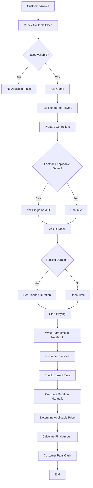

---

# 17. Current Information Sources

The current process depends on multiple manual information sources:

```text
Customer verbal information
+
Employee observation
+
Physical availability
+
Paper notebook
+
Employee's phone clock
+
Manual arithmetic
```

There is no single source of truth.

---

# 18. Current Pain Point — Manual Timing

The system currently depends on:

```text
Employee writes start time
+
Employee checks current time later
+
Employee calculates difference
```

This introduces avoidable operational risk.

---

# 19. Current Pain Point — Manual Calculation

The final amount is calculated manually.

Potential errors:

```text
Wrong start time
Wrong end time
Wrong subtraction
Wrong duration
Wrong price
Wrong Single/Multi price
Wrong PS4/PS5 price
```

---

# 20. Current Pain Point — Human Error

The confirmed business problem is that employees can:

```text
Get confused
Calculate incorrectly
Forget information
Use an incorrect time
Use an incorrect price
```

The financial impact is potentially direct because the final customer payment depends on the calculation.

---

# 21. Current Pain Point — Paper Dependency

The process depends on a physical notebook.

Potential problems:

```text
Lost information
Illegible information
Wrong entry
Missing entry
Difficult history search
No automatic reporting
```

---

# 22. Current Pain Point — No Live Session State

There is no defined digital source showing:

```text
Which console is occupied?
Which console is available?
Who started the session?
When did it start?
How long has it been running?
```

The employee must rely on observation and paper notes.

---

# 23. Current Pain Point — No Automatic Billing

The current workflow is:

```text
Record
+
Remember
+
Calculate
+
Tell Customer
```

Instead of:

```text
System
+
Automatic Tracking
+
Automatic Calculation
```

---

# 24. Current Pain Point — Pricing Risk

Since pricing depends on multiple factors:

```text
Console Type
+
Single/Multi
+
Pricing Method
```

manual selection and calculation create opportunities for incorrect pricing.

---

# 25. Current Pain Point — Operational Dependence on Employee

The current process depends heavily on the employee doing the correct thing at every step.

For example:

```text
Employee must remember to record start time.
Employee must record it correctly.
Employee must read it correctly later.
Employee must check current time.
Employee must calculate the duration.
Employee must choose the right price.
Employee must calculate the final amount.
```

The system should move as much of this responsibility as practical from the human to software.

---

# 26. AS-IS Risk Chain

The current process can be represented as:

```text
Manual Input
    ↓
Manual Record
    ↓
Manual Time Check
    ↓
Manual Calculation
    ↓
Manual Pricing Selection
    ↓
Manual Final Amount
    ↓
Cash Payment
```

Every manual step is a possible error point.

---

# 27. Main Business Problem Identified

The strongest business problem discovered so far is:

> **The shop relies on manual recording and manual arithmetic to track gaming sessions and calculate customer charges, which can lead to incorrect timing, pricing and final payment amounts.**

---

# 28. Main Opportunity for +90 PS

+90 PS can replace the manual chain with:

```text
Customer Request
       ↓
Employee selects configuration
       ↓
System starts session
       ↓
System records exact start
       ↓
System tracks state/time
       ↓
System applies correct pricing
       ↓
System calculates amount
       ↓
Employee confirms
       ↓
Cash Payment
```

---

# 29. Important Discovery Observation

The real value of +90 PS is not simply:

```text
"Digitize the notebook."
```

The deeper objective is:

```text
Reduce human calculation
+
Reduce operational mistakes
+
Create reliable records
+
Make the employee workflow faster
+
Make financial results more trustworthy
```

---

# 30. AS-IS Actors

Current process participants:

```text
Customer
   ↓
Employee / Cashier
```

The employee currently performs most of the system's operational responsibilities manually.

---

# 31. AS-IS Data Captured

Currently known information:

```text
Game
Number of Players
Controllers Required
Single / Multi where applicable
Requested Duration
Start Time
End Time
Calculated Duration
Applicable Price
Final Amount
Cash Payment
```

The exact information currently written into the notebook still needs validation.

---

# 32. AS-IS Business Rules Discovered

الوصف الحالي: مكان متاح، لعبة وعدد لاعبين، Single/Multi عند انطباقه، مدة محددة أو Open، تسجيل البداية، انتهاء بطلب العميل أو انتهاء المباراة، حساب يدوي ثم نقد.

المستخدم طلب من النظام لاحقًا حسابًا دقيقًا وتقريبًا محدودًا. لم نتحقق أن الموظف يطبق حاليًا سياسة آلية ثابتة لكل الحالات. لذلك تُوثّق السياسة في TO-BE داخل [SHARED_RULES](BUSINESS_RULES(1).md)، لا كحقيقة مشاهدة عن التشغيل اليدوي.

---

# 33. Important Questions Still Open

تم توضيح معنى Open، وطريقة استخدام مؤقت الهاتف، ومتطلب التقريب في البرنامج. لا تبقى هذه أسئلة عامة مفتوحة.

التحقق المتبقي من الواقع: طريقة إثبات نهاية المباراة، تسجيل عدة ماتشات، وجود إيصال حالي أو دفعات جزئية، متابعة الكنترولرز التالفة أو الناقصة، وآلية اختيار الجهاز عند عدم التوفر.

أسئلة تصميم البرنامج التي تُحسم قبل الجزء المعني: الثواني والتوقف والحد الأدنى والأسعار والخصومات والورديات والصلاحيات؛ راجع [DECISIONS](DECISIONS.md). لا نخلطها بوصف ممارسة المحل الحالية.

---

# 34. Discovery Conclusion

The first confirmed operational problem is not a lack of screens or lack of automation.

It is:

```text
Manual session management
+
Manual time tracking
+
Manual arithmetic
+
Manual pricing
```

This is the problem Release 1 must solve first.

---

# 35. Transition to TO-BE

الخطوة التالية وصف TO-BE لجزء الجلسة والحساب والحفظ المحلي في [FIRST_SLICE](FIRST_SLICE.md)، مع الإجابة عن أسئلة الحساب اللازمة. يمكن مراجعة الكود وأساس الحفظ والهوية أثناء انتظار إجابات قواعد التشغيل. لا يلزم إنهاء جميع وثائق الإصدارات اللاحقة.

---

---

# Part 3 — Project Outputs / Flow & Steps

# مخرجات المشروع — 56 بندًا محفوظًا

تجميع للمخرجات، لا سلسلة من 56 موافقة قبل الكود. الجمع لا يلغي بندًا؛ مستوى التفصيل يلائم الجزء الحالي.

| # | المخرج الأصلي | مجموعة العمل | متى | مكان/شكل الإنجاز |
|---|---|---|---|---|
| 01 | Discovery Document | A — Product and acceptance | M0 ثم مع كل قدرة | DISCOVERY_BRIEF + RELEASE_1 + R1_ACCEPTANCE؛ تفصيل R2/R3 عند بدء الإصدار |
| 02 | Problem Statement | A — Product and acceptance | M0 ثم مع كل قدرة | DISCOVERY_BRIEF + RELEASE_1 + R1_ACCEPTANCE؛ تفصيل R2/R3 عند بدء الإصدار |
| 03 | Business Goals | A — Product and acceptance | M0 ثم مع كل قدرة | DISCOVERY_BRIEF + RELEASE_1 + R1_ACCEPTANCE؛ تفصيل R2/R3 عند بدء الإصدار |
| 04 | Stakeholder Map | A — Product and acceptance | M0 ثم مع كل قدرة | DISCOVERY_BRIEF + RELEASE_1 + R1_ACCEPTANCE؛ تفصيل R2/R3 عند بدء الإصدار |
| 05 | Personas | A — Product and acceptance | M0 ثم مع كل قدرة | DISCOVERY_BRIEF + RELEASE_1 + R1_ACCEPTANCE؛ تفصيل R2/R3 عند بدء الإصدار |
| 06 | AS-IS Process | A — Product and acceptance | M0 ثم مع كل قدرة | DISCOVERY_BRIEF + RELEASE_1 + R1_ACCEPTANCE؛ تفصيل R2/R3 عند بدء الإصدار |
| 07 | TO-BE Process | A — Product and acceptance | M0 ثم مع كل قدرة | DISCOVERY_BRIEF + RELEASE_1 + R1_ACCEPTANCE؛ تفصيل R2/R3 عند بدء الإصدار |
| 08 | BRD | A — Product and acceptance | M0 ثم مع كل قدرة | DISCOVERY_BRIEF + RELEASE_1 + R1_ACCEPTANCE؛ تفصيل R2/R3 عند بدء الإصدار |
| 09 | Scope | A — Product and acceptance | M0 ثم مع كل قدرة | DISCOVERY_BRIEF + RELEASE_1 + R1_ACCEPTANCE؛ تفصيل R2/R3 عند بدء الإصدار |
| 10 | Product Vision | A — Product and acceptance | M0 ثم مع كل قدرة | DISCOVERY_BRIEF + RELEASE_1 + R1_ACCEPTANCE؛ تفصيل R2/R3 عند بدء الإصدار |
| 11 | PRD | A — Product and acceptance | M0 ثم مع كل قدرة | DISCOVERY_BRIEF + RELEASE_1 + R1_ACCEPTANCE؛ تفصيل R2/R3 عند بدء الإصدار |
| 12 | Functional Requirements | A — Product and acceptance | M0 ثم مع كل قدرة | DISCOVERY_BRIEF + RELEASE_1 + R1_ACCEPTANCE؛ تفصيل R2/R3 عند بدء الإصدار |
| 13 | Non-Functional Requirements | A — Product and acceptance | M0 ثم مع كل قدرة | DISCOVERY_BRIEF + RELEASE_1 + R1_ACCEPTANCE؛ تفصيل R2/R3 عند بدء الإصدار |
| 14 | User Stories | A — Product and acceptance | M0 ثم مع كل قدرة | DISCOVERY_BRIEF + RELEASE_1 + R1_ACCEPTANCE؛ تفصيل R2/R3 عند بدء الإصدار |
| 15 | Acceptance Criteria | A — Product and acceptance | M0 ثم مع كل قدرة | DISCOVERY_BRIEF + RELEASE_1 + R1_ACCEPTANCE؛ تفصيل R2/R3 عند بدء الإصدار |
| 16 | MVP Definition | A — Product and acceptance | M0 ثم مع كل قدرة | DISCOVERY_BRIEF + RELEASE_1 + R1_ACCEPTANCE؛ تفصيل R2/R3 عند بدء الإصدار |
| 17 | Product Backlog | A — Product and acceptance | M0 ثم مع كل قدرة | DISCOVERY_BRIEF + RELEASE_1 + R1_ACCEPTANCE؛ تفصيل R2/R3 عند بدء الإصدار |
| 18 | User Journey | A — Product and acceptance | M0 ثم مع كل قدرة | DISCOVERY_BRIEF + RELEASE_1 + R1_ACCEPTANCE؛ تفصيل R2/R3 عند بدء الإصدار |
| 19 | Information Architecture | B — UX/UI | M1 ثم M3 | تدفق كاشير وشاشات الجزء أولًا؛ توسيع النظام البصري مع الحاجة |
| 20 | UX Flows | B — UX/UI | M1 ثم M3 | تدفق كاشير وشاشات الجزء أولًا؛ توسيع النظام البصري مع الحاجة |
| 21 | Wireframes | B — UX/UI | M1 ثم M3 | تدفق كاشير وشاشات الجزء أولًا؛ توسيع النظام البصري مع الحاجة |
| 22 | UI Design | B — UX/UI | M1 ثم M3 | تدفق كاشير وشاشات الجزء أولًا؛ توسيع النظام البصري مع الحاجة |
| 23 | Design System | B — UX/UI | M1 ثم M3 | تدفق كاشير وشاشات الجزء أولًا؛ توسيع النظام البصري مع الحاجة |
| 24 | System Context | C — Architecture/data/contracts | M0–M2 ثم مع كل تغيير | SHARED_RULES + عقد وERD/رسم للجزء عند الحاجة |
| 25 | Use Cases | C — Architecture/data/contracts | M0–M2 ثم مع كل تغيير | SHARED_RULES + عقد وERD/رسم للجزء عند الحاجة |
| 26 | Activity Diagrams | C — Architecture/data/contracts | M0–M2 ثم مع كل تغيير | SHARED_RULES + عقد وERD/رسم للجزء عند الحاجة |
| 27 | Sequence Diagrams | C — Architecture/data/contracts | M0–M2 ثم مع كل تغيير | SHARED_RULES + عقد وERD/رسم للجزء عند الحاجة |
| 28 | State Diagrams | C — Architecture/data/contracts | M0–M2 ثم مع كل تغيير | SHARED_RULES + عقد وERD/رسم للجزء عند الحاجة |
| 29 | C4 Architecture | C — Architecture/data/contracts | M0–M2 ثم مع كل تغيير | SHARED_RULES + عقد وERD/رسم للجزء عند الحاجة |
| 30 | Component Diagram | C — Architecture/data/contracts | M0–M2 ثم مع كل تغيير | SHARED_RULES + عقد وERD/رسم للجزء عند الحاجة |
| 31 | Deployment Diagram | C — Architecture/data/contracts | M0–M2 ثم مع كل تغيير | SHARED_RULES + عقد وERD/رسم للجزء عند الحاجة |
| 32 | ERD | C — Architecture/data/contracts | M0–M2 ثم مع كل تغيير | SHARED_RULES + عقد وERD/رسم للجزء عند الحاجة |
| 33 | Data Dictionary | C — Architecture/data/contracts | M0–M2 ثم مع كل تغيير | SHARED_RULES + عقد وERD/رسم للجزء عند الحاجة |
| 34 | API Specification | C — Architecture/data/contracts | M0–M2 ثم مع كل تغيير | SHARED_RULES + عقد وERD/رسم للجزء عند الحاجة |
| 35 | ADRs | C — Architecture/data/contracts | M0–M2 ثم مع كل تغيير | SHARED_RULES + عقد وERD/رسم للجزء عند الحاجة |
| 36 | Threat Model | D — Security/audit | قبل تنفيذ القدرة وفي كل معلم | قرارات الثقة وPIN والصلاحيات وأحداث السجل مع اختبارات الرفض |
| 37 | Security Requirements | D — Security/audit | قبل تنفيذ القدرة وفي كل معلم | قرارات الثقة وPIN والصلاحيات وأحداث السجل مع اختبارات الرفض |
| 38 | RBAC Model | D — Security/audit | قبل تنفيذ القدرة وفي كل معلم | قرارات الثقة وPIN والصلاحيات وأحداث السجل مع اختبارات الرفض |
| 39 | Audit Strategy | D — Security/audit | قبل تنفيذ القدرة وفي كل معلم | قرارات الثقة وPIN والصلاحيات وأحداث السجل مع اختبارات الرفض |
| 40 | Test Plan | E — Verification | M1–M4 | R1_ACCEPTANCE + نتائج الاختبارات عند تنفيذها + UAT قبل Pilot |
| 41 | Test Cases | E — Verification | M1–M4 | R1_ACCEPTANCE + نتائج الاختبارات عند تنفيذها + UAT قبل Pilot |
| 42 | UAT Plan | E — Verification | M1–M4 | R1_ACCEPTANCE + نتائج الاختبارات عند تنفيذها + UAT قبل Pilot |
| 43 | CI/CD Plan | F — Delivery/operations | تجربة M2، إقفال M4 | خطة ترحيل واستعادة وتثبيت وتجربة وتشغيل قبل الإطلاق |
| 44 | Deployment Plan | F — Delivery/operations | تجربة M2، إقفال M4 | خطة ترحيل واستعادة وتثبيت وتجربة وتشغيل قبل الإطلاق |
| 45 | Backup Plan | F — Delivery/operations | تجربة M2، إقفال M4 | خطة ترحيل واستعادة وتثبيت وتجربة وتشغيل قبل الإطلاق |
| 46 | Disaster Recovery | F — Delivery/operations | تجربة M2، إقفال M4 | خطة ترحيل واستعادة وتثبيت وتجربة وتشغيل قبل الإطلاق |
| 47 | Monitoring | F — Delivery/operations | تجربة M2، إقفال M4 | خطة ترحيل واستعادة وتثبيت وتجربة وتشغيل قبل الإطلاق |
| 48 | Logging | F — Delivery/operations | تجربة M2، إقفال M4 | خطة ترحيل واستعادة وتثبيت وتجربة وتشغيل قبل الإطلاق |
| 49 | Branch Onboarding | F — Delivery/operations | تجربة M2، إقفال M4 | خطة ترحيل واستعادة وتثبيت وتجربة وتشغيل قبل الإطلاق |
| 50 | Pilot Plan | F — Delivery/operations | تجربة M2، إقفال M4 | خطة ترحيل واستعادة وتثبيت وتجربة وتشغيل قبل الإطلاق |
| 51 | Rollout Plan | F — Delivery/operations | تجربة M2، إقفال M4 | خطة ترحيل واستعادة وتثبيت وتجربة وتشغيل قبل الإطلاق |
| 52 | Support Process | G — Support/improvement | M4 وما بعده | مسار البلاغات والإصدارات والمؤشرات والتحسين بعد التغذية الراجعة |
| 53 | Incident Management | G — Support/improvement | M4 وما بعده | مسار البلاغات والإصدارات والمؤشرات والتحسين بعد التغذية الراجعة |
| 54 | Release Management | G — Support/improvement | M4 وما بعده | مسار البلاغات والإصدارات والمؤشرات والتحسين بعد التغذية الراجعة |
| 55 | Product Metrics | G — Support/improvement | M4 وما بعده | مسار البلاغات والإصدارات والمؤشرات والتحسين بعد التغذية الراجعة |
| 56 | Continuous Improvement | G — Support/improvement | M4 وما بعده | مسار البلاغات والإصدارات والمؤشرات والتحسين بعد التغذية الراجعة |

---

# Merge Notes

- The original source text has been preserved.
- This merge does not itself resolve open decisions or change requirement status.
- Cross-file links that still reference the former standalone files can be updated later after the final folder structure is applied.
````

### Source 057 — Project.Docs/Discovery/TO_BE_PROCESS(2).md

Original size: 41298 bytes. SHA-256: `db1d3b051d1135265054f503386c12d9a80eb90b054862fee5a01f0dd93de02f`.

````text
# +90 PS — Release 1 TO-BE Process

**Document Type:** Target Operating Process / Business Process Design  
**Release:** Release 1 — Operational MVP  
**Status:** Pre-Code Draft for Approval  
**Last Updated:** 2026-09-09
**Purpose:** Define how the shop is expected to operate after Release 1 is introduced, before UX, system analysis, architecture, database, API, security implementation, or code are finalized.

---

# 1. Document Purpose

This document describes the **TO-BE operational process** for +90 PS Release 1.

It answers:

> How should a real PlayStation shop operate after +90 PS Release 1 is introduced?

It does **not** define the final database schema, API endpoints, C4 architecture, classes, or implementation details. Those are separate documents that come later.

This TO-BE process is the business/process bridge between:

```text
AS-IS
(Current manual operation)
        ↓
TO-BE
(Target operational process)
        ↓
Business Rules
        ↓
BRD / PRD / Requirements
        ↓
UX / System Analysis
        ↓
Architecture / Database / API / Security
        ↓
Development
```

---

# 2. Current Problem Being Replaced

The AS-IS process depends heavily on manual work:

```text
Manual session management
+
Manual time tracking
+
Manual arithmetic
+
Manual pricing
+
Limited structured history
+
High dependency on employee attention
```

Release 1 changes the operational model so that the system becomes the operational source used by the branch for sessions, timing, billing, cash records, expenses, shifts, reporting, local persistence, and synchronization.

---

# 3. Release 1 TO-BE Objective

Release 1 must allow a real branch to perform its daily core operation through +90 PS.

The expected operational outcome is:

```text
Staff Authentication
        ↓
Branch Operation
        ↓
Console Availability
        ↓
Session
        ↓
Accurate Timing
        ↓
Billing
        ↓
Invoice
        ↓
Cash Payment
        ↓
Persistent Local Record
        ↓
Synchronization
        ↓
Reports / Audit
```

The shop must continue core approved operation when Internet connectivity is unavailable.

A sudden application crash, Internet failure, or power interruption must not make the system depend only on temporary UI state or an in-memory timer.

---

# 4. Release 1 Actors

## 4.1 Cashier

The Cashier handles daily customer-facing operation.

Main responsibilities:

- Log in using a personal PIN.
- View console availability.
- Start eligible sessions.
- Select the required console/mode/pricing method.
- Pause and resume a session when the customer requests it.
- Complete sessions.
- Record cash payment.
- View the operational status needed to perform the job.
- Continue approved core work during OfflineOperational state.

The Cashier does not automatically receive management permissions.

## 4.2 Manager

The Manager is an administrative user for the branch.

Depending on the permission matrix finalized later, the Manager can perform administrative operations such as:

- Start and end shifts.
- Manage branch consoles.
- Manage branch pricing.
- Manage employees/users.
- Reset an employee PIN.
- Create expenses.
- View branch reports.
- Authorize protected actions.
- Review operational problems.
- Review sync/error status.

The exact permission matrix will be finalized in the Authorization/RBAC document.

## 4.3 Owner

The Owner has ownership-level access.

The Owner is expected to:

- View authorized business information.
- Manage higher-level branch access.
- Perform or authorize administrative actions.
- Review reports.
- Manage branch subscription/entitlement state through the owner/platform administration flow.
- Unlock a branch after supported security-lock recovery where authorized.
- Access operations within the ownership boundary.

Owner access must not silently bypass branch/ownership isolation.

## 4.4 Customer

The customer does not have a Release 1 account or login.

In Release 1 the customer interacts operationally through the Cashier:

```text
Customer Request
      ↓
Cashier
      ↓
+90 PS
```

Customer accounts, customer history, full booking features, and customer login are not part of Release 1.

---

# 5. Core TO-BE Principles

## 5.1 Local Save Before Success

A business operation is not shown to the employee as successful until the required local persistent save succeeds.

```text
Employee Action
      ↓
Validate
      ↓
Persist Locally
      ↓
Persistence Success?
   /             \
 No               Yes
 ↓                 ↓
Show Error       Show Success
```

## 5.2 Same Core Operational Path Online and Offline

Core branch operations must not use two different business processes based only on connectivity.

```text
Business Action
      ↓
Local Persistent Save
      ↓
Pending Sync Record
      ↓
Internet Available?
   /               \
 No                 Yes
 ↓                   ↓
Continue Locally    Background Sync
```

Internet connectivity changes synchronization timing, not whether the core branch operation can be created locally.

## 5.3 Timer UI Is Not the Source of Truth

The displayed timer is not the permanent record.

The process preserves actual timestamps/events such as:

```text
StartAt
PauseAt
ResumeAt
CompletedAt
```

Example:

```text
StartAt = 5:10:23 PM
EndAt   = 6:28:03 PM

Actual elapsed:
1:17:40
```

The seconds may be preserved internally for recovery and audit accuracy.

Billing itself is minute-based.

```text
1:17:00 → 1:17 billable base
1:17:01 → 1:18 billable base
1:17:40 → 1:18 billable base
```

The user-facing cashier workflow does not need to display billing in seconds.

## 5.4 Financial Records Are Persistent and Non-Destructive

A completed financial event must not depend on temporary memory.

Financial history should be preserved. Protected cancel/void behavior is preferred over unrestricted destructive deletion.

## 5.5 Branch Isolation

Every branch operation is associated with the correct branch context.

A user must not gain access to unrelated branch data merely by changing a branch identifier in the UI or request.

Detailed enforcement belongs to the later Security and API documents.

---

# 6. High-Level Release 1 TO-BE Flow

```text
Employee Arrives
      ↓
Open +90 PS
      ↓
System Determines Operational State
      ↓
Employee Login / PIN
      ↓
Authorized?
   /        \
 No          Yes
 ↓            ↓
Reject      Dashboard
              ↓
       Administrative Shift State
              ↓
       Console Availability
              ↓
      Customer Requests Play
              ↓
         Select Console
              ↓
       Select Session Context
              ↓
        Start Session
              ↓
       Persist Immediately
              ↓
     Session Active / Paused
              ↓
       Customer Finishes
              ↓
       Complete Session
              ↓
        Calculate Charge
              ↓
         Create Invoice
              ↓
       Record Cash Payment
              ↓
       Persist Transaction
              ↓
       Pending/Background Sync
              ↓
            Reports
```

---

# 7. System Startup TO-BE Process

When +90 PS starts:

```text
Application Starts
      ↓
Load Required Local State
      ↓
Check Local Data Availability
      ↓
Recover Persisted Operational State
      ↓
Determine System State
      ↓
Check Connectivity
      ↓
If Online:
    Perform required central verification/checks
      ↓
If Offline:
    Evaluate valid offline permissions/license state
      ↓
Show Correct Login / Lock / Maintenance State
```

The application must not assume that every startup begins from an empty operational state.

If a previous session was active before a crash or power interruption, the application must be able to identify that persisted state.

---

# 8. System Operational States

Release 1 uses explicit conceptual system states.

## 8.1 Operational
Normal operation is available and required online verification state is valid.

## 8.2 OfflineOperational
Internet is unavailable, but the branch has valid offline authority/license to continue approved core operations.

## 8.3 RestrictedOffline
The branch is offline and can continue approved essential operations, while sensitive administrative operations are restricted according to the later Security/RBAC design.

## 8.4 SecurityLocked
The branch is locked because of a security event such as repeated invalid PIN attempts. This is different from subscription suspension.

## 8.5 SubscriptionSuspended
The central platform has confirmed that the branch subscription/entitlement is suspended. Business data must remain preserved.

## 8.6 LicenseExpired
The locally valid offline license window has expired and the system has not obtained the required successful renewal/verification.

## 8.7 Maintenance
The system is intentionally unavailable for a controlled maintenance condition.

---

# 9. Employee Authentication TO-BE Process

```text
Employee Opens Login
      ↓
Enter Personal PIN
      ↓
System Identifies Employee
      ↓
Validate Local/Allowed Authentication State
      ↓
Check User Status + Role + Permissions
      ↓
Authorized?
   /        \
 No          Yes
 ↓            ↓
Reject      Create Active User Context
              ↓
           Dashboard
```

Each employee uses a personal identity/PIN.

The current active user must always be known for operational and audit purposes.

---

# 10. PIN Failure and Security Lock Process

## 10.1 First Five Failed Attempts

```text
Wrong PIN
   ↓
Count Failure
   ↓
5 Failed Attempts?
   /          \
 No            Yes
 ↓              ↓
Retry       20-Second Lock
                +
          Warning Sound
                +
        Security Event Saved
```

After the 20-second lock finishes, another attempt cycle may begin.

## 10.2 Second Five Failed Attempts

```text
Another 5 Invalid Attempts
        ↓
SecurityLocked
        ↓
Show Center-Screen Message
        ↓
"Contact Engineer Ziyad to restore access"
```

The lock must not delete sessions, invoices, payments, or branch data.

---

# 11. Security Lock Recovery — Online

```text
Branch = SecurityLocked
       ↓
Owner / Authorized Recovery Action
       ↓
Central Verification
       ↓
Unlock Instruction
       ↓
Branch Receives Valid Unlock
       ↓
Security Lock Cleared
       ↓
Operational State Restored
```

The later Security/API design will define the exact authorization and protocol.

---

# 12. Security Lock Recovery — Offline

If the branch is completely offline, the branch must still have a controlled recovery process without using a permanent master PIN.

```text
SecurityLocked
      ↓
Branch Generates One-Time Challenge
      ↓
Employee Communicates Challenge to Ziyad
      ↓
Authorized Owner/Engineer Tool Generates Recovery Response
      ↓
Employee Enters One-Time Recovery Code
      ↓
Local Cryptographic Verification
      ↓
Valid?
   /      \
 No        Yes
 ↓          ↓
Reject     Clear Security Lock
             ↓
       Resume Allowed Operation
```

Requirements of the recovery concept:

- One-time.
- Branch-specific.
- Challenge-specific.
- Not a universal fixed master PIN.
- Must not bypass SubscriptionSuspended or LicenseExpired state.
- Must be auditable.

---

# 13. Shift TO-BE Process

The administrative Start/End Shift action is performed by an authorized Manager or Owner.

## 13.1 Start Shift

```text
Manager/Owner Login
      ↓
Select Start Shift
      ↓
Validate Permission
      ↓
Record Branch + Actor + Start Time
      ↓
Persist Shift
      ↓
Shift = Open
```

## 13.2 End Shift

```text
Manager/Owner Selects End Shift
      ↓
Validate Permission
      ↓
Active Sessions Assigned to Closing Cashier?
   /                         \
 No                           Yes
 ↓                            ↓
Continue                Select Receiving Cashier
                              ↓
                      Transfer Responsibility
                              ↓
                      Preserve Original OpenedBy
                              ↓
                      Audit Handover
                              ↓
                    Continue Shift Close
      ↓
Record End Time
      ↓
Persist
      ↓
Shift = Closed
```

The session remains historical under its original opener, but current responsibility after transfer belongs to the receiving Cashier. The remaining operational/session responsibility is attributed to that receiving Cashier.

---

# 14. Dashboard / Console Availability Process

After successful login:

```text
Dashboard
     ↓
Load Branch Consoles
     ↓
Display Current Operational Status
```

A console must have a clear usable state.

At minimum, the process must distinguish whether it is available for a new session or already occupied/unavailable.

The exact final console state machine belongs in System Analysis.

---

# 15. Start Session — Common TO-BE Process

```text
Customer Requests Service
      ↓
Cashier Checks Available Consoles
      ↓
Select Console
      ↓
Select Console Type Context
      ↓
PS4 / PS5
      ↓
Select Mode
      ↓
Single / Multi
      ↓
Select Pricing Method
      ↓
Hourly / Match
      ↓
If Hourly:
    Select Open or Fixed Duration behavior
      ↓
Validate Console Availability
      ↓
Validate Applicable Branch Price
      ↓
Capture Pricing Snapshot
      ↓
Capture Opening Cashier
      ↓
Persist Session Locally
      ↓
Create Pending Sync Operation
      ↓
Local Commit Successful?
   /             \
 No               Yes
 ↓                 ↓
Show Failure    Mark Console Occupied
                   ↓
               Show Session Started
```

A second active session on the same occupied console must not be started.

---

# 16. Pricing Snapshot TO-BE Process

```text
Session Start
     ↓
Resolve Branch Price
     ↓
Capture Selected Combination
     ↓
Capture Price Snapshot
     ↓
Persist with Session
```

If a Manager changes pricing later:

```text
Existing Active Session
→ continues with its captured price

New Session
→ uses the new valid price
```

---

# 17. Hourly Open Session Process

```text
Start Open Session
      ↓
Persist Start Timestamp
      ↓
Session = Active
      ↓
Customer Plays
      ↓
Possible Pause / Resume
      ↓
Customer Requests End
      ↓
Cashier Selects Complete
      ↓
Persist Actual End Timestamp
      ↓
Calculate Billable Duration
      ↓
Calculate Amount
      ↓
Invoice + Cash Payment Flow
```

The system does not automatically stop an Open session.

---

# 18. Fixed Duration Session Process

```text
Start Fixed Session
      ↓
Save Start + Intended Duration
      ↓
Session Active
      ↓
Duration Reached
      ↓
Show Clear Center-Screen Alert
      ↓
"Console X reserved duration has ended"
```

The system **does not automatically terminate the session** merely because the intended duration was reached.

The employee remains responsible for the operational follow-up.

Detailed early-exit/extension business rules can be finalized in Business Rules if still required.

---

# 19. Match Session Process

```text
Cashier Selects Match
      ↓
Select Console + Mode + Valid Match Price
      ↓
Start/Register Match
      ↓
Persist Match Session
      ↓
Customer Plays Match
      ↓
Employee Determines Match Has Finished
      ↓
Employee Completes Match
      ↓
Use Match Price
      ↓
Invoice
      ↓
Cash Payment
```

The system does not calculate Match price from elapsed match time.

A match is not automatically ended by a timer in the agreed process.

---

# 20. Pause Process

```text
Active Session
      ↓
Customer Requests Pause
      ↓
Cashier Selects Pause
      ↓
Validate Session Is Active
      ↓
Persist Pause Timestamp/Event
      ↓
Session = Paused
```

The paused period is free and does not contribute to billable active duration.

---

# 21. Resume Process

```text
Paused Session
      ↓
Customer Resumes
      ↓
Cashier Selects Resume
      ↓
Persist Resume Timestamp/Event
      ↓
Session = Active
```

Multiple pause/resume events must remain traceable without counting paused time twice.

---

# 22. Mode Change Process

Single/Multi is not changed in-place inside the existing session context.

```text
Current Session/Mode
      ↓
Complete Current Context Properly
      ↓
Persist Completion
      ↓
Select New Mode
      ↓
Start New Valid Session/Context
```

---

# 23. Complete Session TO-BE Process

```text
Cashier Selects Complete
      ↓
Validate Session State
      ↓
Capture Actual CompletedAt
      ↓
Calculate Active Elapsed Time
      ↓
Exclude Paused Periods
      ↓
Convert Seconds to Billable Minute Base
      ↓
Apply Approved Time Rounding Rule
      ↓
Apply Pricing Snapshot
      ↓
Calculate Raw Amount
      ↓
Apply Approved Money Rounding
      ↓
Generate Final Amount
      ↓
Create Invoice
      ↓
Record Cash Payment
      ↓
Persist Financial Operation
      ↓
Mark Console Available
      ↓
Queue Sync
```

For Match, billing follows the match price rather than hourly elapsed-time pricing.

---

# 24. Time Calculation Process

Actual timestamps can preserve seconds.

```text
StartAt = 5:10:23 PM
EndAt   = 6:28:03 PM

Actual elapsed = 1:17:40
```

The billable base duration is minute-based.

```text
Seconds == 0
→ keep completed minute

Seconds > 0
→ move to next minute
```

Therefore:

```text
1:17:00 → 1:17
1:17:01 → 1:18
1:17:40 → 1:18
```

After this base-minute conversion, the approved hourly rounding rule is applied:

- If the remaining time to the next quarter-hour mark is 3 minutes or less, round upward to that quarter-hour.
- Otherwise, keep the actual billable minute duration.
- A duration already on the quarter-hour mark remains unchanged.

Examples already used in the project:

```text
2:27 → 2:30
2:20 → 2:20
2:42 → 2:45
2:57 → 3:00
```

No minimum charge is applied.

---

# 25. Money Rounding Process

The system may calculate an internal amount containing piasters, but the cashier/customer-facing final amount is whole EGP.

First, round to a whole EGP using 50 piasters as the threshold:

```text
100.00 → 100
100.01 → 100
100.49 → 100
100.50 → 101
100.99 → 101
```

Then apply the upward-only rule for the next multiple of 5:

- Never reduce the whole-EGP amount merely to reach a multiple of 5.
- If the next multiple of 5 is only 1 or 2 EGP above the amount, round upward to it.
- Otherwise keep the amount.

Examples:

```text
100 → 100
101 → 101
102 → 102
103 → 105
104 → 105
105 → 105
106 → 106
107 → 107
108 → 110
109 → 110
110 → 110
```

Invalid example:

```text
102 → 100  ❌
```

The UI should display the final whole-EGP amount rather than piasters.

---

# 26. Invoice + Cash Payment TO-BE Process

The Release 1 payment method is cash.

```text
Valid Completed Session
      ↓
Final Charge Calculated
      ↓
Create Invoice
      ↓
Record Cash Payment
      ↓
Persist Related Financial Records Safely
      ↓
Persist Pending Sync Record
      ↓
Commit
      ↓
Show Payment/Completion Success
```

Sensitive Cancel/Void behavior follows an authorized non-destructive process rather than unrestricted deletion. The UI may offer a cancellation reason, but that reason is optional; if provided, it is preserved with the history/audit context.

---

# 27. Financial Atomicity Process Requirement

Where the operation is treated as one business completion, related local records should succeed together.

```text
Complete Session
+
Create Invoice
+
Create Payment
+
Create Pending Sync Operation
        ↓
One Controlled Local Transaction
        ↓
Commit
```

If the commit fails, the UI must not report a successful completed financial operation.

---

# 28. Expense TO-BE Process

Expenses are created by an authorized Manager/Owner according to the finalized permission matrix.

```text
Authorized Admin User
      ↓
Create Expense
      ↓
Enter Amount
      ↓
Enter Category/Description
      ↓
Optional/Required Note according to final validation
      ↓
Persist Branch + Actor + Timestamp
      ↓
Queue Sync
```

If controllers or other equipment need repair, Release 1 does not require a separate damage-management subsystem.

Example:

```text
Expense:
"Repair of 2 controllers"

Amount:
Repair cost

Note:
Relevant repair details
```

The cost is handled through Expenses.

---

# 29. Pricing Management TO-BE Process

```text
Manager/Owner with Permission
      ↓
Open Pricing Management
      ↓
Select Branch Pricing Combination
      ↓
PS4/PS5
+
Single/Multi
+
Hourly/Match
      ↓
Enter/Update Price
      ↓
Validate
      ↓
Persist Change
      ↓
Audit Who/What/When
      ↓
New Sessions Use New Price
```

An already-running session keeps its captured pricing snapshot.

---

# 30. Console Management TO-BE Process

Authorized administration can:

```text
Add Console
Edit Console
Set Console Type
Activate / Deactivate
Set Allowed Operational Status
```

Every console belongs to its branch context.

A console that is not available must not start a new active session.

The detailed final console state machine will be defined later.

---

# 31. Reports TO-BE Process

Release 1 must support operational reporting for:

```text
Daily
Weekly
Monthly
Yearly
```

Core financial reporting includes:

```text
Revenue
Expenses
Profit
```

Revenue is derived from valid financial operations rather than being created only at month-end.

```text
Payments / Valid Financial Records
      ↓
Period Filter
      ↓
Revenue
      ↓
Expenses
      ↓
Profit
```

---

# 32. Optional Monthly Review

The Owner may choose to perform a month-end review.

This is a business review/reporting action and does not replace normal continuous recording of revenue and expenses.

```text
End of Month
      ↓
Owner Selects Monthly Review
      ↓
Review Period Financial Data
      ↓
Review Revenue / Expenses / Profit
      ↓
Exit / Finish Review
```

Release 1 does not create a financial closing state, lock the month, or mutate invoices/payments merely because the monthly review occurred.

---

# 33. Offline Operation TO-BE Process

When Internet access becomes unavailable, the user's role does not change and offline mode does not grant extra permissions. Protected operations remain subject to the same Cashier / Manager / Owner boundaries.

```text
Connectivity Lost
      ↓
System Detects Offline
      ↓
Validate Offline License / Permission State
      ↓
Allowed?
   /        \
 No          Yes
 ↓            ↓
Show Lock/   OfflineOperational
Restriction      ↓
            Core Work Continues
                 ↓
         Every Operation Saves Locally
                 ↓
           Pending Sync Queue
```

The Cashier must be able to tell that:

- The business operation is saved locally.
- Synchronization may still be pending.
- Local success and central synchronization are different states.

---

# 34. Offline Local Persistence Process

```text
Employee Action
      ↓
Local Validation
      ↓
Local Persistent Transaction
      ↓
Business Record
+
Pending Sync Operation
      ↓
Commit
      ↓
Show "Saved Locally / Pending Sync"
```

The shop does not wait for Internet connectivity to complete approved core branch operation.

---

# 35. Reconnection and Synchronization TO-BE Process

```text
Internet Restored
      ↓
System Detects Connection
      ↓
Perform Required Security/Subscription Checks
      ↓
Background Sync Starts
      ↓
Read Pending Operations
      ↓
Send Operation with Stable Identifier
      ↓
Central Validation
      ↓
Accepted?
   /        \
 No          Yes
 ↓            ↓
Rejected/   Central Save
Conflict       ↓
Status         Acknowledgement
 ↓              ↓
Keep Local    Mark Local = Synced
Evidence
```

A cashier should not have to manually recreate the original session or invoice merely because synchronization was delayed.

---

# 36. Retry / Lost Acknowledgement Process

```text
Branch Sends Operation
      ↓
Server Successfully Saves It
      ↓
Connection Drops Before ACK Reaches Branch
      ↓
Branch Still Thinks Operation Is Pending
      ↓
Retry Same Operation Identifier
      ↓
Server Detects Already-Processed Operation
      ↓
Return Existing Success / ACK
```

The result must not be:

```text
Duplicate Invoice
Duplicate Payment
Duplicate Session
```

Detailed idempotency design belongs in Offline/Sync Architecture and API Contracts.

---

# 37. Sync Conflict / Rejection Process

```text
Pending Operation
      ↓
Central Validation Fails / Conflict Exists
      ↓
Local Status = Conflict or Rejected
      ↓
Preserve Local Evidence
      ↓
Show Authorized User
      ↓
Resolve According to Defined Conflict Policy
```

Financial data must not be silently overwritten to hide a conflict.

---

# 38. Application Crash / Power Failure TO-BE Process

```text
Session Starts at 5:00 PM
      ↓
Start Event Persisted
      ↓
Power Fails at 5:37 PM
      ↓
Application/PC Stops
      ↓
Power Returns
      ↓
Application Starts
      ↓
Read Local Persistent State
      ↓
Find Active Session
      ↓
Restore Original Start Context
      ↓
Recalculate Displayed Duration from Persisted Time Data
```

The session must not restart from zero merely because the application restarted.

---

# 39. Event Persistence Process

The system does not need to write the timer value every second.

Instead it persists meaningful events:

```text
Start
Pause
Resume
Complete
```

The displayed elapsed time is derived from persisted timestamps/events.

---

# 40. Local Database Operational Requirement

When database implementation begins, the agreed branch persistence direction is:

```text
SQLite
+
WAL Mode
+
synchronous = FULL
```

This belongs technically to the later Database/Offline Architecture documents, but it is recorded here because it directly supports the TO-BE requirement that a local operation be persisted before success is shown.

---

# 41. Local Backup TO-BE Operational Process

The current agreed direction is an automatic local SQLite backup approximately every 30 minutes.

No extra branch hardware such as an external SSD, NAS, or UPS is required by Release 1.

```text
Running Local Database
      ↓
Scheduled Local Backup
      ↓
Backup Copy on Branch Machine
```

This local backup is a recovery layer, not a replacement for central synchronization or central backup.

A total loss of the branch machine/storage requires recovery from centrally synchronized information to the extent available.

---

# 42. Subscription Check TO-BE Process

The branch must not be able to use permanent offline mode to avoid subscription enforcement.

Subscription/entitlement verification occurs at appropriate opportunities such as:

```text
Application Startup
+
Internet Reconnection
+
Periodic Online Verification
+
At Least Daily Check While Connectivity Exists
```

When a successful online verification occurs:

```text
Server Verifies Subscription
      ↓
Server Issues/Refreshes Signed Offline License
      ↓
Branch Stores Verifiable License
      ↓
Branch Can Continue Offline Within Allowed Window
```

---

# 43. Offline License Rule

## 43.1 More Than 10 Days Remaining

```text
Remaining Subscription > 10 Days
      ↓
Maximum Offline Lease = 72 Hours
```

Example:

```text
20 Days Remaining
      ↓
Successful Check
      ↓
Offline Allowed Up To 72 Hours Without New Verification
```

## 43.2 Ten Days or Less Remaining

```text
Offline Allowed Until
=
Subscription Remaining Time
+
10-Hour Payment Grace Period
```

Examples:

```text
10 days remaining → 10 days + 10 hours
8 days remaining  → 8 days + 10 hours
7 days remaining  → 7 days + 10 hours
3 days remaining  → 3 days + 10 hours
1 day remaining   → 1 day + 10 hours
```

The extra 10 hours are a payment grace period, not an extension of the paid subscription term.

---

# 44. License Expiration While Offline

```text
Offline License Window Ends
      ↓
No Successful Renewal
      ↓
LicenseExpired
      ↓
Operational Use Locked
```

This lock can occur even when the branch is still offline.

Business data remains preserved.

---

# 45. Subscription Suspension

```text
Successful Online Check
      ↓
Subscription = Suspended
      ↓
SubscriptionSuspended
      ↓
Operational System Locked
```

Suspending the branch must not delete local or central business history.

---

# 46. Clock Tampering TO-BE Requirement

A user must not be able to bypass offline license expiration simply by changing the Windows clock backward.

```text
Trusted Previous Time/License State
      ↓
Machine Time Moves Back Suspiciously
      ↓
Clock Tampering Suspected
      ↓
Do Not Extend Offline Authority
      ↓
Restricted / Require Online Verification
```

Detailed cryptographic and secure-storage design belongs in Security Design.

---

# 47. Security Lock vs Subscription Lock

These states must remain separate.

```text
PIN Recovery → SecurityLocked        ✅
PIN Recovery → Subscription Lock     ❌
PIN Recovery → LicenseExpired        ❌
```

---

# 48. Audit TO-BE Process

Sensitive operations should create audit evidence.

Candidate auditable actions include:

- Login failures.
- Security lock.
- Security unlock.
- PIN reset.
- Pricing changes.
- User/permission changes.
- Expense creation.
- Protected financial cancellation/void.
- Session ownership/authorized administrative changes.
- Subscription/entitlement state changes where relevant.
- Sync conflicts/rejections where operationally important.

Audit evidence should identify, where relevant:

```text
Actor
Branch
Action
Timestamp
Affected Record
Reason
Before / After where appropriate
Operation Identifier
```

PINs, passwords, secrets, and private signing keys must not be written into audit/log output.

---

# 49. Error TO-BE Principle

Errors must not create false success.

```text
Local save fails
→ Do not say "Session Started"

Invoice transaction fails
→ Do not say "Payment Complete"

Sync fails
→ Keep local committed operation and show Pending/Failed Sync

Unauthorized action
→ Reject operation

Invalid console state
→ Reject second active session

Invalid price configuration
→ Prevent session start that cannot be billed correctly
```

---

# 50. Daily Operational TO-BE Summary

```text
Manager/Owner Starts Shift
        ↓
Cashiers Log In Individually
        ↓
Customers Arrive
        ↓
Consoles Selected
        ↓
Sessions Started
        ↓
Local Persistence
        ↓
Pause / Resume / Complete as Needed
        ↓
Invoices
        ↓
Cash Payments
        ↓
Expenses Recorded by Authorized Admin
        ↓
Data Synchronizes in Background
        ↓
Reports Available
        ↓
Manager/Owner Ends Shift
```

Internet loss during this day does not replace the workflow with a separate manual process; approved operations continue locally and synchronize later.

---

# 51. Release 1 Out of Scope for This TO-BE

The following must not be silently introduced into Release 1 TO-BE:

- Customer accounts.
- Customer history.
- Full booking system.
- Booking deposits.
- Customer website/login.
- Mobile application.
- Public website as an R1 client.
- Food/drink/cafeteria sales.
- General product sales.
- Printer integration.
- Barcode integration.
- POS hardware integration.
- Membership.
- Advanced inter-branch transfers.
- Advanced accounting integration.
- Advanced customer analytics.

Discounts are currently deferred from Release 1 based on the latest working decision and should not be treated as a required R1 operational flow.

---

# 52. Controllers / Assets Clarification

Release 1 retains a basic branch-scoped quantity model for internal equipment:

```text
Controllers
Accessories
Equipment
Assets
```

Consoles continue to be managed by Console Management and are not duplicated as quantity-only equipment entries.

Authorized Manager/Owner users maintain the approved quantity records. Release 1 does not require a specialized per-controller damage lifecycle or advanced inter-branch transfer.

If equipment repair creates a cost:

```text
Repair Event
      ↓
Authorized Expense
      ↓
Amount + Description/Note
      ↓
Persist
```

---

# 53. TO-BE Data Created by Core Operation

The target process is expected to create/maintain business information such as:

```text
Branch Context
Current Employee Identity
Console Context
Session Context
Session Status
Actual Timestamps
Pause/Resume Events
Pricing Snapshot
Calculated Amount
Invoice
Cash Payment
Shift
Expense
Audit Event
Sync Status
Subscription/Offline License State
Security Lock State
```

This list is a process-level data view, **not** the final ERD.

The final entities/tables/relationships belong to Database Design.

---

# 54. TO-BE Success Criteria

The TO-BE process is acceptable for Release 1 when the documented target operation can support the following business journey without relying on R2/R3 functionality:

```text
Employee Login
      ↓
Correct Branch Context
      ↓
Console Availability
      ↓
Session Start
      ↓
Local Save
      ↓
Pause / Resume if needed
      ↓
Session Completion
      ↓
Correct Billing
      ↓
Invoice
      ↓
Cash Payment
      ↓
Reportable Financial Record
      ↓
Offline Continuation if Internet Fails
      ↓
Synchronization after Reconnection
      ↓
Recovery after Application/Power Interruption
      ↓
Protected Security/Subscription Behavior
```

---

# 55. Process Invariants

1. An occupied console cannot silently receive a second active session.
2. A session has an identifiable opening employee.
3. The applicable session price is preserved for that session.
4. Paused time is not billed.
5. Match billing does not become hourly billing.
6. A Match ends through the employee action in the agreed R1 process.
7. Fixed-duration expiry produces an alert, not an automatic forced stop.
8. The system preserves actual timestamps even though billing is minute-based.
9. Any seconds beyond a complete minute push the billable base to the next minute.
10. There is no minimum charge.
11. Money is shown as whole EGP according to the approved rounding rules.
12. The final multiple-of-five rule never reduces an amount.
13. A financial completion is not shown as successful before required persistence succeeds.
14. Internet loss does not erase locally committed work.
15. Retry must not create duplicate financial records.
16. A power/application interruption must not reset a persisted active session to zero.
17. A security lock must not delete business data.
18. Subscription suspension/expiry must not delete business data.
19. PIN security recovery must not bypass subscription enforcement.
20. A user must not be able to bypass offline subscription enforcement indefinitely by disconnecting the Internet.
21. Cashier/Manager/Owner access must be constrained by the later finalized permission and branch/ownership rules.
22. Release 1 must not silently expand into Release 2 customer/booking scope.

---

# 56. Items Intentionally Deferred to Later Documents

The TO-BE process defines **what the target operation does**.

The following are intentionally finalized elsewhere:

## Business Rules Finalization
- Formal BR identifiers for the latest agreed rules.
- Protected-action enforcement details that belong to Security/RBAC.
- Cancel/Void reason is already fixed as optional for R1 UX.
- Shift-close handover behavior is already fixed for R1 UX.
- Basic asset quantity scope is already fixed for R1 UX.

## BRD / PRD
- Formal business requirements.
- Product feature specifications.
- Business success metrics.
- Product acceptance definition.

## UX / UI
- Screen layouts.
- Number of clicks.
- Dialog placement.
- Exact alert appearance.
- Offline/status indicators.
- Error-state visual behavior.

## System Analysis
- Final Use Cases.
- Activity flows.
- State Machines.
- Sequence flows.
- Entity behavior.

## Architecture
- C4 Context/Container/Component.
- Component boundaries.
- Deployment topology.
- Background-service design.

## Database
- Final entities/tables.
- ERD.
- Data Dictionary.
- Keys.
- Indexes.
- Constraints.
- SQLite/SQL Server schema mapping.

## API
- Endpoint paths.
- DTO contracts.
- Error model.
- Idempotency contract.
- OpenAPI definition.

## Security
- PIN hashing implementation.
- Token/session model.
- Permission matrix.
- Device identity.
- Challenge-response cryptography.
- Signed offline-license format.
- Secure key storage.
- Threat model.
- Anti-tampering controls.

## Offline / Sync
- Outbox schema.
- Retry/backoff.
- Conflict categories.
- Server acknowledgement protocol.
- Idempotency implementation.
- Recovery states.

## Testing
- Unit/integration/E2E cases.
- Offline tests.
- Sync tests.
- Power-failure tests.
- Security tests.
- UAT.

---

# 57. Recommended Traceability from This Document

```text
TO-BE: Start Session
      ↓
Business Rule
      ↓
Functional Requirement
      ↓
User Story
      ↓
Acceptance Criteria
      ↓
Use Case / Activity
      ↓
Sequence Diagram
      ↓
Domain / ERD
      ↓
API Contract
      ↓
Security Requirement
      ↓
Offline Rule
      ↓
Test Case
```

This prevents a feature from being designed in the UI or code without a clear business/process origin.

---

# 58. Next Step After Approval

The TO-BE decisions are already reflected through Business Rules, BRD, PRD, Requirements, User Stories, and Acceptance Criteria.

Current next step:

```text
TO-BE / Business Rules / Requirements   ✅
RBAC / IA / UX Flows                    ✅
      ↓
Correct current 74-screen UI            ⏭️ NEXT
      ↓
UI Review + Design System
      ↓
System Analysis
```

Do **not** jump from the current UX/UI stage directly into code.

---

# 59. Document Ownership / Placement

Recommended filename:

```text
TO_BE_PROCESS.md
```

For the project's **current flat-file structure**, keep it as its own file beside the current Discovery and business documents:

```text
+90PS/
├── DISCOVERY(1).md
├── TO_BE_PROCESS.md
├── BUSINESS_RULES(1).md
├── R1_OPERATIONAL_MVP.md
├── R1_ACCEPTANCE.md
├── DECISIONS.md
├── ROADMAP.md
└── ...
```

Do not merge this file into `DISCOVERY(1).md` if the project rule is now **one major artifact per file**.

If the repository is later reorganized into folders without renaming files, this file belongs conceptually under:

```text
docs/
└── 01_Discovery/
    └── TO_BE_PROCESS.md
```

---

# 60. Status

```text
AS-IS                              ✅
TO-BE                              ✅ Updated
Business Rules                     ✅
BRD / PRD                          ✅
FR / NFR                           ✅
User Stories / Acceptance          ✅
RBAC / IA / UX Flows               ✅
Current 74-screen UI correction    ⏭️ NEXT
UI Review / Design System          ⏳
System Analysis                    ⏳
Code                               0%
```

No implementation status is claimed by this document.
````

### Source 058 — Project.Docs/Governance/CHANGELOG.md

Original size: 9897 bytes. SHA-256: `3cd682db55ada98e28de6ae7682cdce56d284614047aad3e9a61e88d556a328c`.

````text
# سجل التغييرات

> **Historical documentation changelog.** Entries below describe an older planning-copy reconciliation, not the present repository implementation or today's open R1 decisions. Match is now one per Session with employee completion (no timer auto-completion); see [DECISION_REQUESTS_R1.md](DECISION_REQUESTS_R1.md) and [CURRENT_STATE.md](../Reviews/CURRENT_STATE.md).

تغييرات هذه المهمة منفذة في النسخة المستقلة، ولا تعني تنفيذ البرنامج. كل الأقسام غير المعدلة محفوظة نصيًا من الأصل. نطاق R1 الأصلي محفوظ؛ لا إضافة AI أو موقع كاشير أو حذف وظيفة.

| التغيير | السابق | الحالي | السبب/الملفات |
|---|---|---|---|
| الوقت | Open والتقريب مفتوحان أو بدائل عامة | قاعدة المستخدم مع أسئلة التفاصيل | AS_IS، RELEASE_1، RELEASE_3، SHARED_RULES |
| الفصل بين الواقع والمطلوب | احتمال نسبة قاعدة البرنامج للمحل | تمييز AS-IS وTO-BE | AS_IS، DISCOVERY_BRIEF |
| الماتش | تعريف قطعي كمدة ثابتة | القدرة محفوظة؛ الإنهاء يحتاج قرارًا | MASTER، RELEASE_1، RELEASE_3، DISCOVERY_BRIEF |
| الحفظ | مساران Online/Offline | Local-first للنواة + API sync | ملفات المعمارية وSHARED_RULES |
| الترتيب | Sync/اختبارات متأخرة | M1/M2 مبكرًا واختبارات كل جزء | ROADMAP، ملفا التدفق، MASTER، RELEASE_1، RELEASE_2 |
| الملكية | قواعد مكررة | مرجع مشترك وإحالات لكل إصدار | الملفات الستة |
| تغطية النطاق | قوائم دون معالم دقيقة | 30 مجموعة قدرات وقبول | R1_ACCEPTANCE |
| جاهزية الكود | غير محددة | فحص مصدر وحدود إعادة استخدام | CODE_REVIEW |

## سجل كل قسم عُدّل
- C001: [MASTER.md](MASTER.md) — # 44. Offline-First Architecture: Unify branch operational writes and remove connectivity-based dual write paths (ADR-01).
- C002: [MASTER.md](MASTER.md) — # 45. Online Mode: Unify branch operational writes and remove connectivity-based dual write paths (ADR-01).
- C003: [MASTER.md](MASTER.md) — # 46. Offline Mode: Unify branch operational writes and remove connectivity-based dual write paths (ADR-01).
- C004: [RELEASE_1.md](R1_OPERATIONAL_MVP.md) — # 53. Online Architecture: Unify branch operational writes and remove connectivity-based dual write paths (ADR-01).
- C005: [RELEASE_1.md](R1_OPERATIONAL_MVP.md) — # 54. Offline Architecture: Unify branch operational writes and remove connectivity-based dual write paths (ADR-01).
- C006: [RELEASE_1.md](R1_OPERATIONAL_MVP.md) — # 115. Technical Flow — Session: Unify branch operational writes and remove connectivity-based dual write paths (ADR-01).
- C007: [RELEASE_3.md](R3_FULL_PRODUCT.md) — # 80. Offline Architecture: Unify branch operational writes and remove connectivity-based dual write paths (ADR-01).
- C008: [RELEASE_3.md](R3_FULL_PRODUCT.md) — # 81. Online Flow: Unify branch operational writes and remove connectivity-based dual write paths (ADR-01).
- C009: [RELEASE_3.md](R3_FULL_PRODUCT.md) — # 82. Offline Flow: Unify branch operational writes and remove connectivity-based dual write paths (ADR-01).
- C010: [RELEASE_3.md](R3_FULL_PRODUCT.md) — # 233. Final Offline Flow: Unify branch operational writes and remove connectivity-based dual write paths (ADR-01).
- C011: [DISCOVERY_BRIEF.md](DISCOVERY(1).md) — # 25. Offline Requirement: Unify branch operational writes and remove connectivity-based dual write paths (ADR-01).
- C012: [DISCOVERY_BRIEF.md](DISCOVERY(1).md) — # 26. Online Requirement: Unify branch operational writes and remove connectivity-based dual write paths (ADR-01).
- C013: [DISCOVERY_BRIEF.md](DISCOVERY(1).md) — # 34. High-Level Architecture: Unify branch operational writes and remove connectivity-based dual write paths (ADR-01).
- C014: [DISCOVERY_BRIEF.md](DISCOVERY(1).md) — # 38. First Release Offline Flow: Unify branch operational writes and remove connectivity-based dual write paths (ADR-01).
- C015: [MASTER.md](MASTER.md) — # 68. Sequence Diagram — Start Session: Align start-session sequence with atomic local write and asynchronous sync.
- C016: [RELEASE_1.md](R1_OPERATIONAL_MVP.md) — # 78. Sequence Diagram — Start Session: Align start-session sequence with atomic local write and asynchronous sync.
- C017: [RELEASE_1.md](R1_OPERATIONAL_MVP.md) — # 26. Hourly Pricing: Replace open/alternative rounding policy with latest explicit user instruction; preserve remaining questions.
- C018: [RELEASE_3.md](R3_FULL_PRODUCT.md) — # 25. Hourly Pricing: Replace open/alternative rounding policy with latest explicit user instruction; preserve remaining questions.
- C019: [MASTER.md](MASTER.md) — # 25. Match-Based Pricing: Distinguish proposed fixed duration from observed timer use and unresolved completion semantics.
- C020: [RELEASE_1.md](R1_OPERATIONAL_MVP.md) — # 27. Match Pricing: Distinguish proposed fixed duration from observed timer use and unresolved completion semantics.
- C021: [RELEASE_1.md](R1_OPERATIONAL_MVP.md) — # 28. Match Business Rule: Distinguish proposed fixed duration from observed timer use and unresolved completion semantics.
- C022: [RELEASE_3.md](R3_FULL_PRODUCT.md) — # 26. Match Pricing: Distinguish proposed fixed duration from observed timer use and unresolved completion semantics.
- C023: [DISCOVERY_BRIEF.md](DISCOVERY(1).md) — # 11. Match Pricing: Distinguish proposed fixed duration from observed timer use and unresolved completion semantics.
- C024: [MASTER.md](MASTER.md) — # 166. Recommended First Development Order: Move local operation, sync and verification early without reducing Release 1 scope.
- C025: [MASTER.md](MASTER.md) — # 167. Recommended Release 1 Development Slices: Move local operation, sync and verification early without reducing Release 1 scope.
- C026: [MASTER.md](MASTER.md) — # 178. Recommended Next Work Item: Move local operation, sync and verification early without reducing Release 1 scope.
- C027: [RELEASE_1.md](R1_OPERATIONAL_MVP.md) — # 157. Release 1 Development Order: Move local operation, sync and verification early without reducing Release 1 scope.
- C028: [RELEASE_1.md](R1_OPERATIONAL_MVP.md) — # 158. Release 1 Milestones: Move local operation, sync and verification early without reducing Release 1 scope.
- C029: [MASTER.md](MASTER.md) — # 0. Purpose of This Document: Define documentation ownership and provenance.
- C030: [RELEASE_1.md](R1_OPERATIONAL_MVP.md) — # 0. How to Use This File: Keep release-specific source of truth without duplicating shared policy.
- C031: [RELEASE_1.md](R1_OPERATIONAL_MVP.md) — # 185. Open Decisions Before Final Implementation: Replace stale open items with staged decision register and trace old IDs.
- C032: [AS_IS.md](DISCOVERY(1).md) — # 6. Determine Session Duration: Apply actual user clarification on Open; avoid inventing automatic match end.
- C033: [AS_IS.md](DISCOVERY(1).md) — # 8. During the Session: Add described manual timer behavior.
- C034: [AS_IS.md](DISCOVERY(1).md) — # 32. AS-IS Business Rules Discovered: Separate observed operation from desired software behavior.
- C035: [AS_IS.md](DISCOVERY(1).md) — # 33. Important Questions Still Open: Close answered questions while preserving genuine discovery gaps.
- C036: [AS_IS.md](DISCOVERY(1).md) — # 35. Transition to TO-BE: Replace linear documentation gate with just-in-time first slice.
- C037: [DISCOVERY_BRIEF.md](DISCOVERY(1).md) — # 44. Current Discovery Status: State accurate planning vs implementation status.
- C038: [DISCOVERY_BRIEF.md](DISCOVERY(1).md) — # 45. Approval State: Avoid equating legacy assistant suggestions with user approval.
- C039: [MASTER.md](MASTER.md) — # 176. Final Current Source of Truth: Centralize authority, preserve roadmap boundaries and distinguish inherited facts.
- C040: [RELEASE_1.md](R1_OPERATIONAL_MVP.md) — # 184. Final Release 1 Source of Truth: Remove duplicated baseline and qualify candidate models.
- C041: [MASTER.md](MASTER.md) — # 30. Refunds: Centralize Release 2 policy rather than duplicate it.
- C042: [MASTER.md](MASTER.md) — # 168. Release 2 Development Slices: Clarify customer reporting vs advanced analytics boundary.
- C043: [RELEASE_2.md](R2_EXPANDED_MVP.md) — # 159. Release 2 Milestones: Apply early sync policy to incremental Release 2 without expanding scope.
- C044: [RELEASE_3.md](R3_FULL_PRODUCT.md) — # 36. Booking Deposit: Replace repeated Release 2 policy with release-owner reference.
- C045: [RELEASE_3.md](R3_FULL_PRODUCT.md) — # 38. Late Arrival Policy: Replace repeated Release 2 policy with release-owner reference.
- C046: [RELEASE_3.md](R3_FULL_PRODUCT.md) — # 39. Late Arrival Calculation: Replace repeated Release 2 policy with release-owner reference.
- C047: [RELEASE_3.md](R3_FULL_PRODUCT.md) — # 66. Deposit Financial Integrity: Replace repeated Release 2 policy with release-owner reference.
- C048: [RELEASE_3.md](R3_FULL_PRODUCT.md) — # 231. Final End-to-End Product Flow: Align final flow with local-first and optional customer context.

السجل التفصيلي الآلي [changes.json](changes.json) يحفظ النص الكامل السابق والجديد لكل قسم. [original_sources.zip](original_sources.zip) يحفظ الملفات الثمانية الأصلية بأسمائها وبصماتها في manifest.json. الإضافات الجديدة مثل خريطة القبول لم يكن لها ملف مقابل سابق.
````

### Source 059 — Project.Docs/Governance/DECISIONS.md

Original size: 8292 bytes. SHA-256: `e8103bd2d1cb7a87a8362d37e8212bdfcbd01849c95bfedf190362784b0979d5`.

````text
# سجل القرارات والأسئلة المفتوحة

> **Historical question register (2026-09-06).** The table below preserves the original questions and is not the current open-decision list. For current blockers use [DECISION_REQUESTS_R1.md](DECISION_REQUESTS_R1.md). BE-06 owner decisions supersede old questions: Pause/Resume applies to Open/Fixed, not Match; a successfully paid Invoice cannot be cancelled; eligible unpaid cancellation remains protected, optional-reason, historical. Invoices may precede Cash Payment; one Match per Session, employee completion, Fixed expiry alert only, and no R1 discounts remain approved. Technical storage/security/sync decisions are documented—not implemented—in [TECHNICAL_DECISIONS_R1.md](TECHNICAL_DECISIONS_R1.md).

**Previously open IDs now resolved for R1:** O-01 (minute/quarter time rounding), O-02 (free Pause and multiple intervals, now limited to Open/Fixed), O-03 (no minimum and approved money rounding; production prices remain separate), O-04 (one Match per Session, staff completion and no timer), O-05 (Fixed alert, no auto-stop), O-06 (R1 discounts removed; eligible unpaid Cancel reason optional; paid Invoice cannot be cancelled), O-07 (authorized shift handover), and O-08 (basic internal-asset quantities). O-10/O-11 technical offline/security baselines are now approved; ownership and deployment/reporting details remain open in the current decision requests. Do not reopen resolved parts merely because historical question text remains below.

قرارات U المؤكدة وADR الهندسية في [SHARED_RULES](BUSINESS_RULES(1).md). الجدول لا يعيد فتحها. صاحب القرار التشغيلي: المستخدم بعد التحقق من المحل؛ صاحب التفصيل الهندسي: المطور ضمن المتطلبات. لا يلزم حسم أسئلة R2/R3 لبدء R1.

| ID | السؤال الحقيقي المتبقي | النوع/صاحب القرار | بوابة الحسم | العمل المستقل المسموح |
|---|---|---|---|---|
| O-01 | **RESOLVED R1:** billable time uses whole minutes (positive remainder rounds up), then the approved upward quarter-hour threshold. | تشغيل/المستخدم | مغلق للنطاق الحالي | BE-01 tested; no second-by-second billing |
| O-02 | **RESOLVED R1:** Pause is free, multiple intervals are summed once, and only Open/Fixed may Pause/Resume; Match may not. | تشغيل/المستخدم | مغلق للنطاق الحالي | Full Session enforcement later; BE-02 timing mechanism unchanged |
| O-03 | **RESOLVED in part:** no minimum charge; EGP rounding approved; storage uses integer piasters with configured values at most two decimals. Production price amounts remain a separate decision. | تشغيل/المستخدم | أسعار الإنتاج لاحقًا | BE-04 rounds only a supplied amount; storage baseline documented, not implemented |
| O-04 | **RESOLVED R1:** one Match per Session, second Match needs new Session, fixed captured Match price, employee completion, no timer auto-completion. | تشغيل/المستخدم | مغلق للنطاق الحالي | BE-03 captures terms; full aggregate later |
| O-05 | **RESOLVED R1:** Fixed intended duration triggers an alert only, never automatic stop. Extension/early-exit workflow details remain later design. | تشغيل/المستخدم | تفاصيل UI لاحقًا | BE-03 captures planned duration |
| O-06 | [Historical] أنواع الخصومات وحدودها وترتيب الحساب والسبب المطلوب للإلغاء؟ | تشغيل/المستخدم | Superseded for R1: no discounts; eligible unpaid Cancel reason optional; paid Invoice cannot be cancelled | لا تنفيذ خصومات R1؛ unpaid Cancel/Void distinction remains a separate narrow question |
| O-07 | **RESOLVED R1:** authorized Manager/Owner starts/ends selected employee shift; active assigned sessions need authorized handover before close, retaining original opener. | تشغيل/المستخدم | مغلق للنطاق الحالي | implementation later |
| O-08 | **RESOLVED R1:** branch-scoped internal quantities for Controllers/Accessories/Equipment/Assets; repair is Expense, not product inventory or per-unit damage lifecycle. | تشغيل/المستخدم | مغلق للنطاق الحالي | implementation later |
| O-09 | بداية يوم العمل وفترة التقارير وتعريف الإيراد المسدد/غير المسدد؟ | تشغيل/المستخدم | قبل تقارير M3 | بيانات اختبار للتجميع |
| O-10 | **TECHNICAL BASELINE APPROVED R1:** core actions offline; sensitive administration online-only; bounded signed authority and periodic central refresh. Ownership/first-device rollout details still require later review. | تشغيل وأمان/المستخدم والمطور | Technical baseline closed; rollout later | Design documented, not implemented |
| O-11 | **TECHNICAL BASELINE APPROVED R1:** PIN verifier, durable per-branch/device/employee attempts, device identity, signed one-time recovery, distinct SecurityLocked. | أمان/المطور | Technical baseline closed; implementation later | No auth/security code in BE-06 |
| O-12 | **RESOLVED in part:** Single/Multi cannot change in-place; captured pricing stays stable. Console transfer procedure remains open. | تشغيل/المستخدم | نقل الجهاز لاحقًا | جلسات بإعداد ثابت ولقطة سعر |
| O-13 | سياسة الحجز دون اتصال وتعارض المورد والوقت، وتوحيد رقم الهاتف؟ | تشغيل/المستخدم | قبل حجز R2 | R1 بالكامل |
| O-14 | نسبة العربون، معالجة المصادرة والإلغاء، تداخل حدّي 10/15 دقيقة؟ | تشغيل/المستخدم | قبل مالية R2 | R1 بالكامل |
| O-15 | مزود الاستضافة والتحديث ومكان النسخ الاحتياطي وRPO/RTO ومقاييس الأداء؟ | تشغيل وهندسة/المستخدم والمطور | قبل خروج M4 | تنفيذ استعادة محلية تجريبية |
| O-16 | هل قاعدة بيانات الكود الحالي فيها بيانات حقيقية؟ الأجهزة المستهدفة وإصدارات Windows/.NET؟ | تحقق/المستخدم والمطور | قبل ترحيل أو تثبيت M0/M4 | فحص المصدر بلا اتصال أو تعديل قاعدة البيانات |

## تعارضات حُسمت أو كُشفت

- C-01: ملف AS-IS القديم يترك Open مجهولًا؛ حُسم من U-02.
- C-02: «أقرب علامة» قد تُفهم تقريبًا لأسفل؛ عُوّضت بقاعدة للأعلى عند بقاء ≤3 دقائق.
- C-03: المساعد القديم نسب سياسة البرنامج للتشغيل اليدوي؛ فُصل AS-IS عن TO-BE.
- C-04: الحفظ المباشر Online مقابل Local-first؛ حُسم هندسيًا ADR-01 لعمليات الفرع الأساسية.
- C-05: الأوفلاين والاختبارات متأخران رغم كونهما أساسيين؛ عدّل ترتيب M1/M2 وكل جزء.
- C-06: [Historical status] Match duration/timer question was open in O-04; current R1 uses a configured reference duration, exactly one Match per Session, fixed Match price, and employee completion without timer auto-stop.
- C-07: مبيعات المنتجات والعضويات/الاشتراكات الموجودة بالكود لا توسع R1؛ راجع CODE_REVIEW.
- C-08: تكرار قواعد R2 في R3/العام؛ مرجع السياسة R2. صفة Confirmed في مستند سابق لا تعني تحققًا جديدًا.

## آلية الإقفال

تُضاف إجابة السؤال ومصدرها وتاريخها، وتُحدّث القاعدة واختبارات القبول ومهام الجزء المتأثر معًا. لا يعتبر سكوت المستخدم اعتمادًا لسياسة مالية. الأسئلة لا تمنع المهام المستقلة المذكورة. خيارات الباقات والتحويلات المتقدمة تبقى ضمن مستند R3 عند بدء الإصدار، ولا تُفرض الآن.
````

### Source 060 — Project.Docs/Governance/DECISION_REQUESTS_R1.md

Original size: 6261 bytes. SHA-256: `cf5fd61ff08221e112e658ec9dc9832c78a9636f355bfc5684e9acf9672f1a90`.

````text
# +90 PS R1 — Final approval requests (only genuine blockers)

**Status: only the questions still listed below need answers.** The fixed decisions below override older open-question wording in `DECISIONS.md`; neither assistant nor Codex may quietly choose a remaining business rule. Technical options are examples, not default approval.

## Already FIXED — don't ask these again

R1 Windows WPF, branch SQLite first (online/offline), ASP.NET Core API→central SQL Server, EF Core Code First; no R1 discounts/customers/bookings/product/cafe/web/mobile; Cash-only payment method; Invoice may be issued before Payment; employee PIN on shared PC; protected Manager/Owner invoice **Cancel only** with OPTIONAL reason and non-destructive history **only for eligible unpaid invoices**; a successfully paid invoice cannot be cancelled and Cancel is not a refund/reversal; at most one full Cash Payment per Invoice, never partial/installments; explicit Start Day/End Day and at most one open BusinessDay per Branch, with no midnight auto-close; first 5 failed PINs 20-second lock+warning/event and another five SecurityLocked separate from license; offline lease >10 paid days max72h, <=10 days paid remaining+10h grace; free Pause only for Open/Fixed (not Match), with total paused duration shown on a future Invoice; positive seconds ceil whole minute then if 1–3 minutes to next quarter-hour round UP, never down; money .49/.50 rounding to whole EGP then only 1/2 EGP upward to next 5; fixed-hour expiry alert only, never auto-stop; one Match per Session, with a second Match requiring a new Session, fixed Match price with branch-configured reference duration and manual staff finish, never timer auto-completion; opened-by preserved and active-session responsibility handover before shift closes; assets quantities not products; monthly closing read-only review. Q-ORG-01's ownership/staffing/device-scope answer is recorded below. The approved technical baseline is [TECHNICAL_DECISIONS_R1.md](TECHNICAL_DECISIONS_R1.md), not implemented Database/Auth/Sync code.

## Required decision tickets

| ID | Missing answer | Why it matters | Suggested choices to discuss (NOT chosen) | Blocks |
|---|---|---|---|---|
| Q-OPS-01 | Which hosting/provider, actual Windows/.NET supported targets and safe branch/central backup destinations and key custodian? | Deployment, migrations, DR and real RTO test | choose after budget/device check | Deployment/rollout (may be after first independent domain slice) |

**Resolved tickets Q-BIZ-01 / Q-BIZ-02 / Q-REPORT-01 — DB-01.1:** Q-BIZ-01 is one protected Cancel action for eligible unpaid invoices; no Void state/action/column, reason optional, cancelled record retained and excluded from active revenue, paid Invoice cannot be cancelled, no automatic refund/reversal. Q-BIZ-02 allows zero or one full Cash Payment after an Invoice is issued, amount equal to the Invoice final amount and strictly positive; unique InvoiceId prevents a second Payment, no partial/installments. Q-REPORT-01 uses an explicitly started and ended BusinessDay, never an automatic midnight cutoff; one open day per Branch; branch timezone defaults to Africa/Cairo and serves calendar display/period labels. Daily report is one BusinessDay; longer periods are month, selected six calendar months and year. Revenue follows successful Payment.BusinessDayId, expenses follow Expense.BusinessDayId; Invoice.BusinessDayId records issuance and may differ from the Payment day. These are approved design decisions, not implemented features.

**Resolved ticket Q-BIZ-03:** exactly one Match per Session; a second Match needs a new Session. Match uses captured Match pricing, is not billed by elapsed time, and is completed by staff rather than a timer. The configured duration is a reference, not automatic completion. Invoice-before-Payment and the full settlement rule are resolved in Q-BIZ-02.

**Resolved ticket Q-ORG-01 — owner approval for BE-08, 2026-09-25:** one Business may contain many Branches. Owner is an Employee role, not a separate entity. An Employee belongs to one Business, not a permanent Branch; the same identity/PIN must later be recognizable at any Branch of that Business, subject to active status and future authentication/permissions. Deactivation is Business-wide, not physical deletion; historical employee references remain. Each installed Windows device is bound to one Branch at a time. Device replacement keeps the existing BranchId but creates a new DeviceId through authorized online provisioning and revokes the old device where appropriate. Moving the same machine to another Branch requires controlled reprovisioning, not editing BranchId in place or merging local Branch databases. Device, PIN and reprovisioning workflows are **not implemented** by BE-08.

**Resolved in BE-06:** Q-OFF-01 (core operations offline; sensitive administration online-only; central checks and bounded signed authority), Q-SEC-01 (durable BranchId+DeviceId+EmployeeId failed-attempt scope, device-bound verifier and signed one-time recovery), and the technical storage part of Q-DATA-01 (UTC instants, integer EGP piasters, explicit branch reporting-timezone configuration). DB-01.1 resolves the remaining Q-BIZ-01/02 and Q-REPORT-01 business choices above. See [TECHNICAL_DECISIONS_R1.md](TECHNICAL_DECISIONS_R1.md). These are approvals for design, not claims that security/database/sync code exists.

## Engineering proposals requiring design review, not user to invent code

The storage/provider, inbox identity, durable timing direction, migrations, secret-storage, and retention baselines are approved in [TECHNICAL_DECISIONS_R1.md](TECHNICAL_DECISIONS_R1.md). Later tasks still need concrete schema, API/DTO/error contracts, operational tests, and production review; do not treat the baseline as implemented or as an answer to the remaining business tickets.

## Recording an answer

`Ticket ID | User decision in exact terms | approved date | affected rules/docs/diagrams/tests | reviewer | status`. Never convert silence or “يلا” into consent for irreversible money/security behavior. A paid invoice cannot be cancelled in R1; no automatic refund/reversal follows from the unpaid cancellation flow.
````

### Source 061 — Project.Docs/Governance/PROJECT_CONTEXT.md

Original size: 4254 bytes. SHA-256: `37202da459201bb84f70ef60d1668ab2ac73ae23f9a72d74484f75c80a59e67f`.

````text
# +90 PS — Project Context for Codex and reviewers

**Document origin:** Release 1 pre-code design snapshot. BE-00 through BE-06 now have explicitly approved narrow code slices; see [CURRENT_STATE.md](../Reviews/CURRENT_STATE.md). The BE-06 [technical baseline](TECHNICAL_DECISIONS_R1.md) is documented, not implemented Database/Auth/Sync. Never read old `Final` as implemented. Developer/user: Zeyad; collaboration preferences are in root `AboutZeyad.md` (share only facts he explicitly wants in repo, and keep personal details out of public repositories).

## Product

Multi-branch-capable PlayStation shop management product, initial single shared Windows PC per branch, personal employee PIN and explicit branch/Owner/Manager/Cashier permissions. **R1:** operational sessions/PS4/PS5/Single/Multi/Open/Fixed Hours/Match/pricing/invoice/cash/shift/expenses/quantity-based internal assets/reports. Offline-first: WPF→local SQLite transaction (+outbox) online/offline; background sync→authorized ASP.NET Core API→central SQL Server. EF Core Code First is approved implementation approach **not yet implemented**. R2 customers/history/bookings/deposits; R3 advanced later. R1 no web/mobile/customer login/food/drink/product sales/discounts/new peripherals.

## Binding rules

- Billable positive seconds ceil minute, then round UP to next quarter hour only if 1–3 minutes remain; free Pause only for Open/Fixed, never Match; future Invoice shows total paused duration; no minimum. EGP .00–.49 drop fraction, .50–.99 up whole EGP, then move UP to next multiple of five only if +1 or +2 EGP.
- Fixed Hours expiry = alert only; Match = fixed branch price/defined duration and employee-ended; mode frozen during session.
- Owner/Manager can start/end shift for selected employee; handover before closing when sessions active, original opener retained.
- Protected Manager/Owner Cancel applies only to eligible unpaid Invoices, with optional reason and historical retention; an Invoice with successful recorded Payment cannot be cancelled. Unpaid Cancel/Void distinction remains a narrow open question. Monthly closing is read-only financial review.
- First 5 PIN failures→warning+20s temporary lock/security event; another five→SecurityLocked/engineer process. Separate subscription lock. Offline paid lease >10d→max72h; <=10d→remaining paid time+10h; no local time tampering extension.
- UI target modifications in `UX_UI/UI_IMPLEMENTATION_OVERRIDE_R1.md` OVERRIDE old PNG control behavior; original images are visual/style references only.

## How we reached this state

Original broad roadmap contains multiple old/duplicated .md versions and outdated discounts/settings. Current newer R1 requirements and business decisions supersede those **for conflicting behaviors only**, not wholesale entire documents. Zeyad authored all requested R1 Use Case/Activity/Sequence/State/C4/Deployment/Logical ERD/DFD diagrams. Pictures of ERD/DFD have readability/contract gaps: targeted diagram edits after related designs. The previous `PROJECT_REVIEW_AND_CHANGE_REGISTER.md` tracks named corrections. Source-tree inventory and true repository code state have NOT been verified in this design-only deliverable. Current pack is a reviewable **draft**, not a branch deployment or signed-off API/schema/security plan.

## Reference priority BEFORE reconciliation

1. Explicit latest user-approved decisions listed above and `Reviews/PROJECT_REVIEW_AND_CHANGE_REGISTER.md` (when placed in repo).
2. Latest validated governance decisions and R1 business/acceptance rules; check duplicates/old versions, never blindly trust filename `Final`.
3. Approved R1 UX target override, plus specific up-to-date requirements; old PNGs only styling reference if they contradict target behavior.
4. This design pack: technical drafts where marked Proposed/TBD; any unresolved business question **blocks dependent coding**.
5. Editable diagram sources; diagrams and images do not independently create business policies.

`CURRENT_STATE.md` lists the gate/next steps. Codex should inventory actual Git repo read-only before asserting existing code, services, migrations, secrets or DB data; do not delete/rewrite without owner approval.
````

### Source 062 — Project.Docs/Governance/TECHNICAL_DECISIONS_R1.md

Original size: 17925 bytes. SHA-256: `8e979d8623407fcc794389167fe157fe6b015522c7ce00091f06ae98219ed8ae`.

````text
# +90 PS — R1 Approved Technical Decisions

**Status:** APPROVED TECHNICAL BASELINE for future R1 implementation, recorded with BE-06 on 2026-09-25. This document approves design direction; it does **not** claim that EF Core, databases, authentication, security recovery, offline authority, or synchronization code exists. Each later implementation slice still needs explicit authorization, provider-specific design, tests, and review. The wider [pre-code gate](../Reviews/PRE_CODE_GATE_R1.md) is not globally lifted.

**Business decisions recorded alongside this baseline:** Pause/Resume only for Open/Fixed, never Match; paused time is free and a future customer Invoice displays only total paused duration; an Invoice with any successful recorded Payment cannot be cancelled. An eligible unpaid Invoice may use protected Cancel with an optional reason, remains historical, and is excluded from active revenue. These are requirements for later workflows, not BE-06 code. See [business rules](../Requirements/BUSINESS_RULES_R1(1).md) and [open decisions](DECISION_REQUESTS_R1.md).

## 1. Local-first persistence and provider separation

- R1 path: WPF Branch Desktop → local SQLite transaction + transactional Outbox → background synchronization → authenticated/authorized ASP.NET Core API → central SQL Server. WPF never writes central SQL Server directly. Internet availability changes synchronization timing, not the authoritative local commit path for core branch operations.
- Future Infrastructure uses two explicit contexts: `BranchDbContext` for SQLite and `CentralDbContext` for SQL Server. Do not make one runtime context switch providers blindly. Reuse shared entity configuration only where appropriate; keep provider mappings explicit.
- Maintain separate SQLite and SQL Server migration sets, for example `Migrations/Sqlite/` and `Migrations/SqlServer/` or separate assemblies. Never apply one provider's migration to the other or assume identical DDL. Validate every later model change against both providers; handle provider-specific SQL explicitly.

## 2. Identity, time, duration, money, and enum mapping

- Persistent business IDs and sync `OperationId` are `Guid`. The Application/Infrastructure boundary generates offline-originating IDs before persistence, normally with .NET 10 `Guid.CreateVersion7()`. Pure Domain constructors accept supplied IDs; do not conceal generation inside entities. SQLite maps Guid to 16-byte `BLOB`; SQL Server maps Guid to `uniqueidentifier`. Chronology uses timestamps and/or explicit sequence/revision, not GUID ordering.
- Domain APIs may use `DateTimeOffset`. Persist all operational instants normalized to UTC: SQLite `INTEGER` Unix epoch milliseconds; SQL Server UTC `datetime2(3)`. Never rely on server/PC local timezone for critical instants. Reporting uses explicit Branch reporting timezone configuration; the exact timezone and business-day cutoff still require an owner answer (`Q-REPORT-01`).
- Domain durations use `TimeSpan`. Store an explicit persisted duration as signed `long` milliseconds, not a formatted string such as `2h 20m`.
- Domain money calculations use `decimal`. R1 currency is EGP, with 100 piasters per EGP. Persist exact minor units as `long` piasters: SQLite `INTEGER`, SQL Server `BIGINT`. Configured monetary values must have at most two decimal places before conversion. Never use `double` or `float` for money. BE-04 rounding behavior is unchanged.
- Persist enums as numeric integral values, not names. Keep persisted numeric meanings stable after deployment and use database constraints against unsupported values where practical.

## 3. Schema invariants, history, concurrency, and indexes

- Required invariant fields use `NOT NULL`; `NULL` means valid absence. For example, an active Session has `CompletedAt = NULL`, while a completed Session requires it. Do not use `Guid.Empty`, `DateTime.MinValue`, or `-1` as missing-value sentinels.
- Default business/financial/audit foreign-key deletion is `Restrict`/`NoAction` for Branch, Employee, Console, Session, Invoice, Payment, Expense, Audit, and Pricing references. Prefer deactivation/status/historical retention over physical deletion. A later schema task may approve cascade only for purely technical owned records with no business-history loss.
- Mutable records use an application-managed `Guid VersionToken` as EF Core optimistic concurrency token, regenerated after every accepted meaningful mutation. Do not use SQL Server `rowversion` as the shared model. Aggregates needing event order additionally use `long AggregateRevision`; this is not interchangeable with the concurrency token. Example Session revisions: Start 1, Pause 2, Resume 3, Complete 4.
- Add indexes for actual queries/invariants, not blindly. Known uniqueness directions: Pricing `(BranchId, ConsoleGeneration, PlayMode, PricingMethod)`; SessionEvents `(SessionId, Sequence/Revision)`; local Outbox `OperationId`; central Inbox `(BranchId, OperationId)`. Index foreign keys where operationally useful; reporting indexes follow observed query patterns.
- Future physical indexes use query-driven B-Tree/B+Tree design. DB-01/later must justify each non-constraint index with a real query, invariant, join, sort, or measured plan; choose composite column order for actual predicates and ordering, and account for write/storage cost. Do not index every column. Validate SQLite query plans and SQL Server execution plans independently. Candidate BranchId, BusinessId, ConsoleId, EmployeeId, Session state/time, pricing, invoice/payment, report, Outbox, OperationId, and Inbox keys are **not** approvals to create indexes without that review. BE-08 implements no database indexes.

## 4. Console occupancy and Session durability — future work

- `GameConsole.IsActive` is configuration status, **not** a mutable `IsBusy`/`IsAvailable` flag. A future persisted technical `ConsoleOccupancy` record provides provider-neutral double-session protection: `ConsoleId` primary/unique and `SessionId` unique.
- Future Session Start validates an active Console and, in **one local SQLite transaction**, creates Session, ConsoleOccupancy, SessionEvent, and Outbox operation. Completion releases ConsoleOccupancy within its controlled transaction. BE-06 does not create this record or these transactions.
- Future persistence keeps both a current durable `Sessions` snapshot/state and append-only important `SessionEvents` (at least Start, Pause, Resume, Complete, ResponsibilityTransfer), each with explicit sequence/revision. Do not persist visible timer updates every second. Restart must reconstruct state from persisted state/events and original timestamps. BE-06 does not implement these tables.

## 5. Local SQLite runtime and backup safety — future work

- Production SQLite lives on local storage, not in the repository, Git, OneDrive, or a network share. Prefer `%ProgramData%\Plus90PS\...` with installer-created restricted ACLs. Enforce foreign keys; use short write transactions and approximately 5-second busy timeout, not long-lived writes.
- WAL is preferred for concurrent UI reads/background sync **only after verifying** the bundled native SQLite contains the WAL-reset fix: SQLite `>= 3.51.3` or an officially patched backport. When enabled, use `journal_mode=WAL` and `synchronous=FULL` for branch business writes. Do not switch to `NORMAL` merely for performance without explicit benchmark/reliability approval.
- Never back up an open WAL database by copying only its main `.db` file; committed state may still be in WAL. Use a safe SQLite backup mechanism or controlled checkpoint-backed backup in a later operations task.

## 6. PIN, device, and online authentication baseline — future work

- Never store plaintext PIN. Baseline verifier: PBKDF2-HMAC-SHA256, 600,000 iterations, random per-credential salt `>=16` bytes, 32-byte derived hash; store algorithm/version/work factor metadata for upgrades. Use cryptographically secure randomness and constant-time comparison.
- PIN has limited entropy, so use a pepper in addition to salt. Central pepper stays outside SQL in protected server secret storage; a **separate** offline branch-device pepper stays outside SQLite under Windows DPAPI. Never put raw pepper in database, logs, or audit. An approved construction may pre-hash PIN with peppered HMAC-SHA256, then PBKDF2 with random user salt.
- Never copy a reusable central plaintext secret to SQLite. Create a device-bound offline verifier during employee/PIN provisioning on that Branch device or after successful online authentication there. Offline login requires a valid local verifier **and** valid offline authority. PIN reset invalidates the prior verifier/version.
- Failed-attempt state is persisted locally with scope `(BranchId, DeviceId, EmployeeId)` across application/Windows restart. First five failures produce 20-second temporary lock and warning/security event; another five after that lock cycle without successful authentication produce durable branch-device `SecurityLocked`. Successful valid authentication resets that employee/device cycle; RAM-only counting is insufficient.
- `SecurityLocked` never deletes Session, Invoice, Payment, Expense, Audit, or configuration data and remains separate from `LicenseExpired` and `SubscriptionSuspended`. Recovering one state must not automatically recover another.
- Every installed Branch device receives a `DeviceId` and cryptographically random 256-bit credential. Protect the client secret using Windows DPAPI plus restricted filesystem ACL. Store only a one-way credential hash centrally; support revocation/rotation.
- One installed Windows device is bound to exactly one Branch at a time. A Branch may later have multiple authorized devices if deployment requires them. If a PC is replaced, keep the BranchId, assign the replacement a new DeviceId through Owner-authorized online provisioning, revoke the old binding where appropriate, restore centrally synchronized Branch data, restore a safe local backup if available, recover backed-up Pending Outbox operations, then reconcile/synchronize. Do not create a new Branch merely because hardware changed.
- Moving the same machine to another Branch requires controlled online Owner-authorized reprovisioning: first ensure no active Session remains on the old Branch, sync or safely recover Pending Outbox, take a safe local backup, revoke the old binding, and preserve/archive the old Branch database. Then bind the device to the target Branch, provision a fresh target-Branch database, and sync target data. Never directly edit local BranchId or merge two Branch databases. This is a design baseline, not BE-08 Device code.
- If the old disk is permanently lost, operations never synchronized centrally and absent from any usable local backup cannot be guaranteed recoverable. Future encrypted backup/recovery design must reduce this risk without claiming impossible recovery.
- Do not invent long-lived homemade JWTs. Prefer short-lived cryptographically random opaque reference tokens for first-party desktop API sessions; centrally store only token hashes. An employee token binds at least EmployeeId, BranchId, DeviceId, expiry, and authorization/security version. Baseline lifetime is approximately 15 minutes. Background Sync uses device authorization separately from the logged-in employee UI session. Require HTTPS for all API traffic.

## 7. Signed offline authority, clock defense, recovery, and revocation — future work

- Successful central verification issues asymmetric signed offline authority for BranchId and DeviceId. It contains at least Version, AuthorityId, BranchId, DeviceId, IssuedAtUtc, OfflineAllowedUntilUtc, subscription/security state or version, and KeyId. Baseline signature: ECDSA P-256 + SHA-256 (ES256-compatible). Central private key never ships to Branch; desktop trusts only public verification key(s). KeyId supports rotation.
- Existing lease rule is unchanged: with **more than 10 paid days** remaining, maximum offline authority is 72 hours; with **10 days or less**, `OfflineAllowedUntil` equals remaining paid subscription time plus 10 hours payment grace. Clock rollback must not extend authority.
- Persist a trusted-time floor (`LastTrustedUtc`) from successful central contact. A material backward Windows-clock move cannot extend authority; enter restricted behavior and require trusted verification when needed. Within a running process, use monotonic elapsed-time measurement for short waits/locks where practical.
- No permanent master PIN. Offline `SecurityLocked` recovery uses a one-time challenge containing at least ChallengeId, BranchId, DeviceId, random nonce `>=32` bytes, security-state version, and created time. Authorized central/engineer service signs a response for that **exact** branch/device/challenge/action. Locally verify central ECDSA signature with pinned public key, expiration, and one-time use; persist consumed ChallengeId. Reject mismatched responses.
- Refresh central authorization/subscription on startup, reconnect, appropriate API interactions, and periodic background checks (approximately every 60 seconds online). Server may reject revoked access on next request; no SignalR dependency is required. Offline stale authority remains bounded by its signed allowed-until/security policy.
- Offline core actions include valid cached-authority login, required local views, eligible Session Start/Pause/Resume/Complete (Pause/Resume only for Open/Fixed), charge calculation, Invoice creation, and Cash Payment. Sensitive administration requires current online central verification: no offline employee create/edit/deactivate, role/permission changes, PIN reset, pricing/Branch configuration change, security unlock configuration, subscription/license administration, or sensitive Console configuration change.

## 8. Transactional Outbox, Central Inbox, and sync behavior — future work

- Each approved syncable local command commits business state, required Session/Audit event, and Pending OutboxOperation in **one SQLite transaction**. Roll back all if any required write fails. UI may report `SavedLocally` only after this commit; never commit business state then insert Outbox best-effort.
- Give each command one stable Guid/UUIDv7 `OperationId` created once and reused across HTTP timeout, lost ACK, process restart, and retry. Never regenerate an ID just for retry.
- Future local OutboxOperation fields conceptually include `LocalSequence`, `OperationId`, `BranchId`, `AggregateType`, `AggregateId`, `AggregateRevision`, `OperationType`, `SchemaVersion`, `OccurredAtUtc`, `PayloadJson`, `PayloadHash`, `Status`, `AttemptCount`, `NextAttemptAtUtc`, `LastErrorCode`, `CreatedAtUtc`, and `AcknowledgedAtUtc`. `LocalSequence` is monotonic for local diagnostics/processing; `OperationId` is unique; committed payload is immutable.
- Store SHA-256 hash of the canonical serialized payload. Same operation identity with a **different** payload hash is conflict/integrity failure, never an idempotent retry.
- Central Inbox/Receipt has unique `(BranchId, OperationId)`. For a new operation, central Inbox receipt and business effect commit atomically in **one SQL Server transaction**. Same branch/operation/hash retry returns the stored accepted result/receipt, with no duplicate Session/Invoice/Payment; same identity with different hash is rejected.
- Lost ACK case: central commit succeeds, network disconnects before Branch receives ACK, Branch retries **same** OperationId, Inbox returns previous receipt/result with no second business effect.
- Do not rely on global HTTP arrival order. Use AggregateId + AggregateRevision; required revision `N` precedes `N+1` for one aggregate. Independent aggregates may sync independently; one permanently failed unrelated aggregate must not block every Branch operation.
- Retryable failures include network, timeout, HTTP 408/429/5xx. Baseline delays: 2s, 5s, 15s, 30s, 60s, then cap around 5 minutes, with small random jitter. For expired authentication, refresh/re-authenticate then retry with the **same** OperationId. Permanent validation/authorization failures become explicit `Rejected` or `Conflict`, retained as evidence, not retried forever.
- Never silently overwrite financial/operational facts. Locally committed facts stay visible if central rejects sync. Branch is creation source for operational records; central is synchronized copy/authority check. Central is authoritative for sensitive configuration (online-only in R1). Correct committed facts through a **new** explicit correction/compensating operation later; never mutate original Outbox payload to hide conflict.
- Distinguish `SavedLocally`, `PendingSync`, `Syncing`, `Synced`, `Rejected`, and `Conflict`. Local commit does not imply `Synced`; central downtime does not undo a successful local commit. Do not use distributed two-phase commit between SQLite and SQL Server.
- Never auto-delete Failed/Rejected/Conflict local operations. Acknowledged local Outbox rows may be cleaned in controlled batches after **at least 30 days**. Retain central Inbox/idempotency receipts long-term with business-record retention; do not aggressively remove financial deduplication evidence.

## 9. Implementation boundary

BE-06 implements only minimal pure Domain `Branch` and `GameConsole` identity/configuration/activation; BE-07 adds the pure Domain Session aggregate core. BE-08 adds pure Domain Business, Branch.BusinessId, Employee/EmployeeRole, and active same-Business scope policy. BE-08 does **not** implement ConsoleOccupancy, Session persistence/events, EF Core contexts/migrations/indexes, SQLite/SQL Server mapping/runtime, PIN/auth/permission enforcement/device/provisioning/offline authority, Outbox/Inbox/sync, API endpoints, Invoice/Payment/Cancel, or WPF. This document cannot be cited as proof any of those systems are running or tested.
````

### Source 063 — Project.Docs/MASTER.md

Original size: 94304 bytes. SHA-256: `64468c5a9c4857c85aa436f8fb73dc9945fa8c16d79e8eba40644334da87ebbe`.

````text
# تحديث الخطة — 2026-09-06

> **HISTORICAL WORKING MASTER / SUPERSEDED FOR CURRENT R1 SCOPE.** This long-form planning snapshot retains old proposals and is not the implementation contract. Every R1 predefined/manual/manager-authorized discount reference below is superseded: discounts are outside Release 1. Invoice may precede Cash Payment; one Match represents one Session and a second Match needs a new Session; Match ends by employee action, Fixed expiry alerts without auto-stop. Use [CURRENT_STATE.md](Reviews/CURRENT_STATE.md), [PRE_CODE_GATE_R1.md](Reviews/PRE_CODE_GATE_R1.md), and [BUSINESS_RULES_R1(1).md](Requirements/BUSINESS_RULES_R1(1).md) for current status and rules. Paid-invoice cash reversal and exact Pause eligibility remain open.

نسخة مراجعة مستقلة؛ الأصول لم تُعدّل. [ابدأ هنا](README(1).md) · [القواعد المشتركة](BUSINESS_RULES(1).md) · [القرارات المفتوحة](DECISIONS.md) · [التغييرات](CHANGELOG.md).

حالة الدليل: المتطلبات الجديدة المؤكدة من المستخدم مذكورة بمصدرها في SHARED_RULES. بقية المحتوى الموروث يحتفظ بحالته السابقة، وليس اعتمادًا جديدًا. مخططات البنية العامة تمثل اتصال المكونات؛ ترتيب كتابة عمليات الفرع تحدده ADR-01 والمخططات المحدّثة، ولا يُستنتج من سهم عام WPF/API.

---

# +90 PS — Master Project Documentation
## Product, Business, Requirements, Architecture, Security, Development, QA, Deployment & Operations

> **Document Status:** Master Working Specification  
> **Project:** +90 PS  
> **Current Planning Date:** 2026-09-04  
> **Primary Goal:** Build a professional multi-branch PlayStation shop management product, initially as a WPF Desktop Application + ASP.NET Core API + Central SQL Server, with local offline storage/synchronization, and evolve it through three major product releases toward a complete 40+ branch platform.

---

# 0. Purpose of This Document

هذا المستند مرجع الرؤية وحدود المنتج والقرارات المشتركة. تفاصيل كل إصدار في [R1](R1_OPERATIONAL_MVP.md)، [R2](R2_EXPANDED_MVP.md)، [R3](R3_FULL_PRODUCT.md). قواعد الحساب ومسار الحفظ لا تُنسخ كسياسات مستقلة؛ مرجعها [SHARED_RULES](BUSINESS_RULES(1).md).

المصادر القديمة محفوظة بأكملها في original_sources.zip. تعليمات المحادثة المعتمدة لهذه المراجعة مبيّنة في سجل القرارات؛ نصوص المستندات السابقة أدلة ومقترحات وليست تعليمات تنفيذ مستقلة.

اختيار المستخدم: إطلاق أسرع مع الحفاظ على كل مميزات R1. التوثيق يخدم التنفيذ ويُحدّث معه.

---

# 1. Executive Summary

+90 PS is a multi-branch management system for PlayStation gaming shops.

The system is intended to manage the core operation of a gaming shop:

- Customers
- Customer accounts
- Customer history
- Bookings
- PlayStation consoles
- Pricing
- Single / Multi modes
- Hourly pricing
- Match-based pricing
- Gaming sessions
- Pause / Resume / Complete
- Cash payments
- Invoices
- Shifts
- Expenses
- Revenue
- Profit
- Discounts
- Asset / Equipment inventory
- Manager and cashier permissions
- Manager overrides
- Audit records for sensitive actions
- Offline operation
- Local storage
- Synchronization with a central server
- Branch-level management
- Multi-branch management
- Reports
- Future automated report delivery
- Future plan/package entitlements
- Future Web/Mobile clients through the same API

The initial product deliberately avoids building a Website and avoids food/cafeteria/product-sales functionality.

The first customer-facing model is intended to be a **usable operational MVP** that can run a real shop without relying on later advanced capabilities.

The product then evolves through:

```text
Release 1 — Operational MVP
        ↓
Release 2 — Expanded MVP
        ↓
Release 3 — Full Product
```

The exact commercial package system will be defined later, but the architecture should be able to support feature/plan entitlements.

---

# 2. Core Product Vision

> +90 PS is an integrated multi-branch management platform for PlayStation gaming shops, designed to simplify daily branch operations, accurately manage gaming sessions and bookings, centralize financial visibility, support offline operation, and scale from one shop to 40+ branches.

The system should be designed as a real product rather than as a one-off desktop application.

---

# 3. Fundamental Product Principles

## 3.1 Product, Not Just Application

+90 PS is one product composed of multiple technical parts:

```text
+90 PS Product
    |
    +-- WPF Desktop Client
    |
    +-- ASP.NET Core Web API
    |
    +-- Central SQL Server
    |
    +-- Local SQLite
    |
    +-- Synchronization Engine
    |
    +-- Security / Authorization
    |
    +-- Reporting
    |
    +-- Deployment / Update
    |
    +-- Monitoring / Operations
```

---

## 3.2 Desktop and Backend Are the Phase 1 Core

Phase 1 intentionally contains:

```text
WPF Desktop App
+
ASP.NET Core API
+
Central SQL Server
+
Local SQLite
+
Synchronization
```

There is **no Website in Phase 1**.

---

## 3.3 Business Logic Must Not Live Only in WPF

The WPF application is a client.

The central API is responsible for important server-side business rules, authorization, data integrity, and centralized operations.

A user must not be able to bypass permissions simply by manipulating the WPF interface.

Example:

```text
WPF says "Delete Invoice" is hidden
        +
API independently rejects unauthorized deletion
```

Both layers matter.

---

## 3.4 Offline Is a Core Requirement

Offline capability is not a future add-on.

A branch must continue core operations when the Internet is unavailable.

The system should support:

```text
Online
+
Offline
+
Later Synchronization
```

---

## 3.5 Release-Based Development

The project will not attempt to build everything before the customer sees anything.

Instead:

```text
Discover
    ↓
Design enough for current release
    ↓
Develop
    ↓
Test
    ↓
Deliver
    ↓
Collect Bugs / Feedback
    ↓
Build next release
```

---

# 4. Current Business Situation

Current number of branches:

```text
0
```

Future target:

```text
40+ branches
```

The target is future expansion, not an existing 40-branch customer.

---

# 5. Business Structure

+90 PS is not necessarily one legal company with a single branch.

The product must support a business/owner having:

```text
Owner / Business
    |
    +-- Branch 01
    +-- Branch 02
    +-- Branch 03
    +-- ...
    +-- Branch 40+
```

A person/business can operate one branch today and add another branch later.

The architecture should make that transition possible without rebuilding the system.

---

# 6. Single-Branch vs Multi-Branch Experience

The product is intended to behave like a feature/plan-based product.

Example:

### Single-location customer

```text
Owner
  |
  +-- Branch A
```

They should not necessarily see or use multi-branch functionality such as:

- Cross-branch reporting
- Branch-to-branch transfers
- Employee transfers
- Asset transfers between branches
- Cross-branch management

### Multi-branch customer

```text
Owner
  |
  +-- Branch A
  +-- Branch B
```

They can gain access to multi-branch capabilities.

If the same owner expands from one branch to two branches later, the system should be able to enable the relevant functionality without rebuilding the product.

This is intended to become part of a future **4-package commercial model**.

The 4 packages are intentionally not finalized yet.

---

# 7. Confirmed Scope

## 7.1 Included in the Overall MVP Program

The project will eventually contain:

- Authentication
- Users
- Roles
- Permissions
- Owner concept
- Branches
- Consoles
- Pricing
- Single/Multi modes
- Hourly pricing
- Match pricing
- Sessions
- Pause / Resume / Complete
- Bookings
- Customers
- Customer accounts
- Customer history
- Invoices
- Cash payments
- Discounts
- Shifts
- Expenses
- Revenue
- Profit
- Asset / Equipment inventory
- Inter-branch quantity transfers where applicable
- Manager overrides
- Audit logging for sensitive operations
- Offline operation
- Local SQLite
- Synchronization
- Reporting
- Multi-branch architecture
- Deployment/update mechanism
- Monitoring/operations capabilities as the system matures

---

# 8. Explicitly Out of Scope for the Initial Product

The following are not part of the initial product scope:

- Website
- Mobile application
- Customer website
- Food sales
- Drinks sales
- Cafeteria
- General product sales
- Printer integration
- Barcode scanner integration
- POS hardware integration
- Membership system

Website and Mobile are future clients, not current requirements.

The API architecture must allow them to be added later.

---

# 9. Important Scope Clarification

There is a difference between:

```text
Overall MVP Program
```

and:

```text
Release 1 Operational MVP
```

Customer Accounts, Customer History, and Bookings are part of the broader MVP roadmap, but the intended first deliverable is focused on the minimum features necessary for a shop to operate reliably.

Therefore:

```text
Release 1
= Operational MVP

Release 2
= Expanded MVP
  including Customer/Booking functionality

Release 3
= Full Product
```

This keeps the first deployment practical while still treating the broader MVP as a staged product.

---

# 10. Product Release Strategy

## Release 1 — Operational MVP

Goal:

> Give a real shop a usable system that can run its core operations without depending on later advanced features.

Core capabilities:

- Authentication
- Manager / Cashier access
- PIN login
- Lock screen
- User switching
- Branch context
- Console management
- Pricing
- PS4 / PS5 or other console categories
- Single / Multi modes
- Hourly pricing
- Match pricing
- Gaming sessions
- Start
- Pause
- Resume
- Complete
- Cash payments
- Invoice generation
- Basic discounts
- Shifts
- Manager-only expenses
- Basic revenue
- Basic profit
- Basic reporting
- Offline operation
- Local SQLite
- Synchronization
- Sensitive action authorization
- Initial audit logging
- Core asset/equipment tracking

The first release should be able to support an actual shop's basic daily operation.

---

# 11. Release 2 — Expanded MVP

This release builds on Release 1.

Expected features include:

- Customer Accounts
- Customer History
- Bookings
- Booking lifecycle
- Booking deposit handling
- Late arrival rules
- No-show behavior
- Customer lookup by phone
- Booking history
- Expanded customer reporting
- More advanced discounts where justified
- Improved reports
- More advanced asset management
- Additional configuration
- Improvements discovered through Release 1 usage

Release 2 also incorporates:

```text
Bug fixes from Release 1
+
Real customer feedback
+
Observed operational improvements
```

---

# 12. Release 3 — Full Product

Release 3 represents the complete mature product.

Potential components, depending on validated business demand:

- Advanced analytics
- Advanced reports
- Automated report delivery
- More complete multi-branch management
- Asset transfers
- Employee transfers
- Advanced financial functions
- Accounting integration
- Advanced booking
- Advanced discounts
- Advanced asset management
- Feature/package management
- More robust deployment/update management
- More mature monitoring
- Additional automation
- Other high-value capabilities discovered after real usage

"Full Product" does not mean every hypothetical feature in the world. It means the agreed complete +90 PS product scope at that time.

---

# 13. Release Lifecycle

Each release follows its own mini-product cycle:

```text
Customer / Business Need
        ↓
Discovery
        ↓
Requirement Definition
        ↓
Impact Analysis
        ↓
UX/UI Changes
        ↓
Architecture Changes
        ↓
Development
        ↓
Testing
        ↓
UAT
        ↓
Deployment
        ↓
Customer Usage
        ↓
Bug Reports / Feedback
        ↓
Next Release
```

A bug found in Release 1 can be fixed as:

```text
Release 1.0.1
```

while Release 2 continues independently.

The fix should also be merged/forward-ported appropriately so the same bug does not remain in the newer release.

---

# 14. Professional Project Lifecycle

The overall engineering lifecycle is:

```text
1. Discovery
2. Business Analysis
3. Product Requirements
4. UX Research
5. UX/UI Design
6. System Analysis
7. Architecture
8. Database Design
9. API Design
10. Security / Threat Modeling
11. Offline / Synchronization Design
12. Development Foundation
13. Feature Development
14. Testing / QA
15. UAT
16. Deployment
17. Pilot
18. Production
19. Monitoring
20. Support
21. Feedback
22. Continuous Improvement
23. Multi-Branch Rollout
24. Scale
```

These are not one giant waterfall block.

They are repeated at the appropriate scope for each release.

---

# 15. Discovery Phase

Discovery answers:

> What problem are we solving?

Not:

> Which WPF button should we build?

---

# 16. Discovery Objectives

- Understand the business
- Understand current workflow
- Identify users
- Identify responsibilities
- Identify pain points
- Define business goals
- Define scope
- Define assumptions
- Identify risks
- Identify future needs
- Identify what must be in Release 1
- Identify what can wait

---

# 17. Stakeholders

Initial stakeholder model:

```text
Owner
  |
  +-- Manager
        |
        +-- Cashier
```

Additional stakeholders may include:

- Business owner
- Branch manager
- Cashier
- Future accountant
- Future support/operations personnel
- Future system administrator

---

# 18. Roles

## Owner

May own one or more branches.

Can view authorized branches and aggregated information according to the plan and permissions.

Owner-level capabilities may include:

- Multi-branch reporting
- Branch management
- Future inter-branch transfers
- Future employee transfers
- Future centralized configuration

---

## Manager

Belongs to a specific branch.

Can perform branch management and sensitive manager actions according to permissions.

Examples:

- Change pricing
- Manage branch settings
- Manage users in branch
- View branch reports
- Create/manage expenses
- Approve protected actions
- Cancel/void invoices
- Approve session transfers
- Apply/authorize manual discounts as designed

---

## Cashier

Performs normal daily branch operations.

Examples:

- Start sessions
- Pause/resume sessions
- Complete sessions
- Create invoices
- Receive cash
- Apply allowed predefined discounts
- Work with customers according to permissions
- Work with bookings according to permissions
- Start/end shifts according to the chosen workflow

Cashier must not be able to perform manager-only actions.

---

# 19. PIN-Based Shared Device Model

Each branch uses one physical PC.

Multiple cashiers can use the same device.

Therefore the product needs personal identification inside the application.

Example:

```text
Cashier A
    ↓
Uses application
    ↓
Lock Screen
    ↓
Cashier B enters PIN
    ↓
Cashier B becomes Active User
```

The active user identity affects:

- Permissions
- Session ownership
- Shift responsibility
- Audit logging
- Protected actions

---

# 20. Authentication Requirements

Authentication must work in offline mode for branch operation.

Conceptual flow:

```text
Enter PIN
    ↓
Local credential verification
    ↓
Identify user
    ↓
Load branch
    ↓
Load role
    ↓
Load permissions
    ↓
Start local user session
```

Sensitive credentials must not be stored in plain text.

The final credential storage and key-protection mechanism should be selected during Security Design.

---

# 21. Authorization

Authorization is separate from authentication.

Authentication answers:

> Who are you?

Authorization answers:

> What are you allowed to do?

Examples:

```text
Cashier
  Start Session       ✅
  Complete Session    ✅
  Change Price        ❌
  Delete/Cancel Invoice without manager auth ❌

Manager
  Start Session       ✅
  Change Price        ✅
  Cancel/void invoice ✅
  Manage Expenses     ✅
```

The backend must enforce authorization even if the WPF interface hides the feature.

---

# 22. Customer Accounts

Customer Accounts are part of the broader MVP roadmap.

Confirmed requirements:

- Customer has an account record
- Phone number is the primary lookup/key
- Customer name is required
- History is associated with the customer
- Bookings are associated with the customer
- Customer accounts do not imply customer authentication
- No membership system in the initial scope

Potential model:

```text
Customer
    |
    +-- Phone
    +-- Name
    +-- Notes
    +-- History
    +-- Bookings
    +-- Session History
```

---

# 23. Customer History

The system should eventually answer:

- When did the customer visit?
- What sessions did they have?
- What bookings did they make?
- Which branch did they visit?
- What was paid?
- What was cancelled?
- What was completed?

Exact data visibility depends on permissions.

---

# 24. Pricing Model

Pricing varies by:

```text
Console Type
+
Mode
+
Pricing Method
```

Console type examples:

```text
PS4
PS5
```

Mode:

```text
Single
Multi
```

Pricing methods:

```text
Hourly
Match
```

Therefore the model must be capable of representing combinations such as:

```text
PS4 + Single + Hourly
PS4 + Multi  + Hourly
PS5 + Single + Hourly
PS5 + Multi  + Hourly

PS4 + Single + Match
PS4 + Multi  + Match
PS5 + Single + Match
PS5 + Multi  + Match
```

A branch can configure its own prices.

Example:

```text
Branch A
PS4 Single Hourly = 100
PS4 Multi Hourly  = 150
PS5 Single Hourly = 150
PS5 Multi Hourly  = 200

Branch B
PS4 Single Hourly = 120
PS4 Multi Hourly  = 170
PS5 Single Hourly = 170
PS5 Multi Hourly  = 220
```

Not every possible combination must be enabled.

---

# 25. Match-Based Pricing

Match تسعير مستقل عن Hourly. المستندات السابقة تقترح سعرًا ثابتًا ومدة يضبطها الفرع. وصف المستخدم يثبت أن الموظف قد يستخدم مؤقتًا تقريبيًا مثل 10 دقائق أو ينهي العملاء المباراة بأنفسهم؛ لا يثبت أن انتهاء المؤقت يجب أن ينهي الجلسة آليًا.

نحتفظ بقدرة التسعير بالماتش في Release 1. تحديد النهاية، وعدّ الماتشات المتتالية، والتمديد، والفاتورة المجمعة ينتظر O-04 في [سجل القرارات](DECISIONS.md). أرقام 10 و12 أمثلة إعدادات وليست مدة إلزامية أو تعريفًا نهائيًا للمباراة.

---

# 26. Session Model

Session state should be explicit.

Candidate states:

```text
Available
Reserved
Active
Paused
Completed
Cancelled
```

Example:

```text
Available
    ↓
Active
    ↓
Paused
    ↓
Active
    ↓
Completed
```

With booking:

```text
Available
    ↓
Reserved
    ↓
Active
```

State transitions must be validated by business rules.

---

# 27. Session Ownership

When Cashier A starts a session:

```text
Session.OpenedBy = Cashier A
```

The system should know who initiated the operational responsibility.

If the cashier needs to leave with active sessions:

```text
Cashier A
   ↓
Attempts shift end
   ↓
Active sessions detected
   ↓
Manager PIN
   ↓
Manager authorizes
   ↓
Select replacement cashier
   ↓
Transfer responsibility
```

The transfer should preserve historical ownership.

Recommended recorded information:

- Original cashier
- New cashier
- Manager approver
- Session ID
- Timestamp
- Reason, if required

---

# 28. Booking

Booking is planned for the broader MVP and is expected in Release 2.

Confirmed business rules:

## VIP / Standard

If a branch offers different categories, e.g.:

```text
VIP
Standard
```

the customer can choose.

If all places are the same, the system should not force an unnecessary category choice.

---

## Deposit

The customer pays a deposit for the booking.

---

## Late Arrival

Current rule:

```text
10 minutes late
    ↓
10% of booking price is charged
```

At:

```text
15 minutes late
    ↓
Booking is cancelled
    ↓
Payment is forfeited
```

These rules should be configurable per branch where appropriate rather than hardcoded globally.

---

# 29. Booking State Model

Candidate:

```text
Pending
   ↓
Confirmed
   ↓
Active
   ↓
Completed
```

Possible:

```text
Cancelled
No-Show
Expired
```

Need final business validation before implementation.

---

# 30. Refunds

الاسترجاع والحجز والعربون يتبعان [Release 2](R2_EXPANDED_MVP.md)، وليسا وظائف R1 جديدة. الاسترجاع العادي مستبعد في النطاق السابق؛ الحالات الاستثنائية والمعالجة المالية ومصادرة العربون تظل مرتبطة بقرار الحجز O-14.

---

# 31. Discounts

> **SUPERSEDED FOR R1:** The following discount rules are retained as historical proposal text only. No discount workflow, permission, endpoint, or test is authorized for Release 1.

Confirmed logic:

```text
Predefined / Allowed Discount
    ↓
Cashier can apply
```

Manual/arbitrary discount:

```text
Manual Discount
    ↓
Manager PIN
    ↓
Authorization
    ↓
Apply discount
```

Recommended initial rule:

Manager defines allowed discounts; cashier can only use configured discounts.

---

# 32. Invoices

Invoices are financial records.

Cashiers cannot freely delete invoices.

Recommended policy:

```text
Invoice
    ↓
Manager Authorization
    ↓
Cancelled / Voided
```

rather than physically deleting the record.

Why:

- Preserve history
- Preserve financial traceability
- Reduce fraud risk
- Keep reports consistent
- Allow investigation

---

# 33. Invoice Cancellation Audit

When a manager cancels an invoice, the system should preserve:

```text
Invoice ID
Original Amount
Cashier
Branch
Manager
Timestamp
Reason (where required)
Status = Cancelled/Voided
```

Cancelled invoices remain part of the historical record but are excluded from active revenue calculations according to the financial rules.

---

# 34. Payments

Phase 1 payment method:

```text
Cash
```

No:

- Card gateway
- Online payment gateway
- POS terminal integration

unless later added.

---

# 35. Shifts

Shifts are part of the operating model.

A shift is associated with:

- Branch
- Cashier
- Start time
- End time
- Operational transactions

The detailed cash-reconciliation model is intentionally deferred from the initial release.

A future version may include:

```text
Opening Cash
+
Cash Revenue
-
Cash Expenses
=
Expected Closing Cash
```

Then:

```text
Expected Cash
vs
Actual Cash
```

and a difference.

This feature should be added only when required, not used to block the initial system.

---

# 36. Expenses

Expenses are manager-only in the current model.

Cashier:

```text
Create Expense
❌
```

Manager:

```text
Create Expense
✅
```

Expenses affect profitability reporting.

The exact approval workflow is intentionally simple in the current scope because the manager is already the authorized actor.

---

# 37. Revenue

Primary revenue source:

```text
Gaming Sessions
+
Applicable Booking-related transactions
```

No food/drink/product sales are included.

---

# 38. Profit

Basic financial calculation:

```text
Revenue
-
Expenses
=
Profit
```

The exact accounting treatment of capital assets, depreciation, taxes, or accounting-system concepts is beyond the initial MVP unless later required.

---

# 39. Asset / Inventory Management

Inventory in +90 PS is NOT traditional product-sales inventory.

It is an internal asset/equipment management feature.

Initial categories:

```text
Consoles
Controllers
Accessories
Equipment
Assets
```

For items such as controllers/accessories, the current decision is quantity-based rather than creating a separate record for every physical unit.

Example:

```text
Controllers
Quantity = 12
```

rather than:

```text
Controller #001
Controller #002
...
```

The system should track quantities by branch.

---

# 40. Asset Transfer

If an owner has multiple branches, quantities may be transferred between branches.

Example:

```text
Branch A
Controllers = 12

Transfer 3

Branch A
Controllers = 9

Branch B
Controllers = +3
```

This becomes an important multi-branch capability.

The transfer should have history and authorization rules in the mature system.

---

# 41. Asset Status

For future deeper tracking, possible statuses include:

```text
Available
In Use
Maintenance
Damaged
Lost
Transferred
Retired
Disposed
```

These are candidates for deeper asset management and should not all be forced into Release 1 if not operationally necessary.

---

# 42. Branch Management

Each branch should have a unique identity.

Branch-specific data may include:

- Branch ID
- Name
- Address
- Contact details
- Pricing
- Console configuration
- Employees
- Branch settings
- Assets/quantities
- Sessions
- Bookings
- Invoices
- Expenses
- Reports

Managers should not automatically access unrelated branches.

---

# 43. Multi-Branch Data Model Direction

Conceptually:

```text
Owner
  |
  +-- Branch 01
  |
  +-- Branch 02
  |
  +-- Branch 03
```

Operational data should have branch context where appropriate.

Important security rule:

> The user interface must never be treated as the only branch-isolation mechanism. Branch authorization must be enforced by the API/business layer.

---

# 44. Offline-First Architecture

```text
WPF → Local authorization + shared business rules
    → SQLite transaction: operational record + pending sync operation
    → Local success shown to cashier
    → Sync when online → API authentication/branch validation/idempotency
    → SQL Server transaction → acknowledgement → local sync status
```

قرار هندسي معتمد لهذه الخطة: عمليات الفرع الأساسية تكتب محليًا أولًا في الحالتين Online وOffline؛ الاتصال يغيّر توقيت المزامنة ولا يبدّل مكان إنشاء الفاتورة. التقرير المركزي والتهيئة المركزية لهما API، ولا يعني ذلك إعادة إرسال إنشاء الجلسة كعملية جديدة.
التفاصيل والحدود في [القرارات المشتركة](BUSINESS_RULES(1).md). المزامنة الناجحة تختلف عن نجاح الحفظ المحلي، وتظهر الحالتان للمستخدم.

---

# 45. Online Mode

```text
WPF → Local authorization + shared business rules
    → SQLite transaction: operational record + pending sync operation
    → Local success shown to cashier
    → Sync when online → API authentication/branch validation/idempotency
    → SQL Server transaction → acknowledgement → local sync status
```

قرار هندسي معتمد لهذه الخطة: عمليات الفرع الأساسية تكتب محليًا أولًا في الحالتين Online وOffline؛ الاتصال يغيّر توقيت المزامنة ولا يبدّل مكان إنشاء الفاتورة. التقرير المركزي والتهيئة المركزية لهما API، ولا يعني ذلك إعادة إرسال إنشاء الجلسة كعملية جديدة.
التفاصيل والحدود في [القرارات المشتركة](BUSINESS_RULES(1).md). المزامنة الناجحة تختلف عن نجاح الحفظ المحلي، وتظهر الحالتان للمستخدم.

---

# 46. Offline Mode

```text
WPF → Local authorization + shared business rules
    → SQLite transaction: operational record + pending sync operation
    → Local success shown to cashier
    → Sync when online → API authentication/branch validation/idempotency
    → SQL Server transaction → acknowledgement → local sync status
```

قرار هندسي معتمد لهذه الخطة: عمليات الفرع الأساسية تكتب محليًا أولًا في الحالتين Online وOffline؛ الاتصال يغيّر توقيت المزامنة ولا يبدّل مكان إنشاء الفاتورة. التقرير المركزي والتهيئة المركزية لهما API، ولا يعني ذلك إعادة إرسال إنشاء الجلسة كعملية جديدة.
التفاصيل والحدود في [القرارات المشتركة](BUSINESS_RULES(1).md). المزامنة الناجحة تختلف عن نجاح الحفظ المحلي، وتظهر الحالتان للمستخدم.

---

# 47. Synchronization

When connectivity returns:

```text
Pending Local Changes
        ↓
Sync Queue
        ↓
Sync Engine
        ↓
ASP.NET Core API
        ↓
Central SQL Server
        ↓
Acknowledgment
        ↓
Local Record Marked Synchronized
```

The final design must define:

- Change IDs
- Idempotency
- Retries
- Conflict handling
- Ordering
- Duplicate detection
- Failure recovery
- Partial synchronization
- Sync status
- Error visibility

---

# 48. Sync Queue

A local queue is recommended.

Conceptual record:

```text
SyncItem
------------------------
Id
EntityType
EntityId
Operation
Payload
CreatedAt
AttemptCount
LastAttemptAt
Status
Error
```

Possible statuses:

```text
Pending
Processing
Synced
Failed
Conflict
```

This is an implementation concept, not yet a final database schema.

---

# 49. Conflict Handling

A central problem:

```text
Branch modifies data offline
        +
Central data may have changed
        ↓
Conflict
```

Conflicts must not be silently overwritten.

The final design should define which data is:

- Branch-owned
- Central-owned
- Mergeable
- Append-only
- Server-authoritative

Financial events should generally prefer append-only event records rather than destructive overwrites.

---

# 50. Idempotency

Synchronization must tolerate repeated requests.

Example:

```text
Branch sends InvoiceSync #ABC
Server succeeds
Branch does not receive acknowledgment
Branch retries
```

The server must recognize the same operation and avoid creating duplicate financial records.

A stable client-generated operation/event ID is recommended.

---

# 51. Local Authentication

Because the branch must work offline, the device must contain enough protected identity information to verify active branch users locally.

Conceptual:

```text
Central User Data
       ↓
Secure Local Sync
       ↓
Local User Credential Data
       ↓
Offline Authentication
```

The final credential and secret-storage design must be security-reviewed.

---

# 52. Security Strategy

Security is not a final step.

It appears throughout the project:

```text
Discovery
   ↓
Security Requirements
   ↓
Architecture
   ↓
Threat Modeling
   ↓
Implementation
   ↓
Testing
   ↓
Deployment
   ↓
Monitoring
   ↓
Incident Response
```

---

# 53. Security Requirements

Initial requirements include:

- Authentication
- Authorization
- Branch isolation
- Role and permission checks
- Protected manager actions
- Secure credential handling
- TLS for network communication
- Input validation
- Secure API design
- Audit logging for sensitive actions
- No hard-coded secrets
- Secure configuration
- Database protection
- Backup protection
- Logging and monitoring

---

# 54. Threat Modeling

Threat modeling should be performed around trust boundaries.

Example:

```text
Untrusted / Branch Device
        |
        | HTTPS / API
        v
Central API
        |
        v
Database
```

Questions:

- Can a compromised branch request another branch's data?
- Can a cashier bypass the UI and call restricted APIs?
- Can duplicate requests create duplicate financial records?
- Can an attacker forge a synchronization operation?
- Can sensitive PIN material be extracted?
- Can offline local data be tampered with?
- Can an unauthorized manager-like operation be performed?
- Can historical financial data be altered?
- Can logs be deleted or manipulated?
- Can secrets leak into code or Git?

---

# 55. STRIDE

A useful threat-modeling framework:

```text
S = Spoofing
T = Tampering
R = Repudiation
I = Information Disclosure
D = Denial of Service
E = Elevation of Privilege
```

Use the framework selectively; not every component requires identical analysis.

---

# 56. Audit Logging

Audit logging is recommended specifically for sensitive/high-value actions.

Do not log every UI click.

Useful audit events include:

```text
Invoice cancellation
Price change
Manual discount authorization
Manager override
Session transfer
User creation
User deactivation
Permission changes
Sensitive expense changes
Security-sensitive actions
```

Example:

```text
Actor: Manager Mohamed
Action: Changed Pricing
Entity: PS5 Hourly Price
Old Value: 150
New Value: 170
Branch: Branch 04
Timestamp: 2026-09-04 20:30
```

---

# 57. Audit vs Application Logs

These are different.

## Application Logs

Useful for troubleshooting:

```text
Exception
Warning
API failure
Sync failure
Database error
```

## Audit Logs

Useful for accountability:

```text
Who
did what
to which business object
when
and optionally why
```

Do not confuse the two.

---

# 58. Manager Override Model

General flow:

```text
Cashier requests protected operation
             ↓
Operation requires elevated permission
             ↓
Manager PIN requested
             ↓
Local/authorized manager authentication
             ↓
Permission checked
             ↓
Action performed
             ↓
Audit event written
```

Examples:

- Invoice cancellation
- Manual discount
- Session transfer
- Other future sensitive actions

---

# 59. Data Integrity

Important financial/business records should not rely on the client alone.

Examples:

- Invoice totals
- Session ownership
- Branch identity
- Pricing
- Permissions
- Cancellation authorization
- Sync operation identity

The backend must validate business invariants where applicable.

---

# 60. System Architecture

Recommended conceptual architecture:

```text
                 +---------------------+
                 |   WPF Desktop App   |
                 +----------+----------+
                            |
                            v
                 +---------------------+
                 |   ASP.NET Core API  |
                 +----------+----------+
                            |
             +--------------+--------------+
             |              |              |
             v              v              v
          Identity       Business       Reporting
          / Auth         Services        Services
             |              |              |
             +--------------+--------------+
                            |
                            v
                 +---------------------+
                 |   SQL Server        |
                 +---------------------+
```

Branch side:

```text
WPF
 |
 +-- Local SQLite
 |
 +-- Sync Engine
 |
 +-- Offline-capable business operations
 |
 +-- API client
```

---

# 61. Architecture Boundaries

Do not build:

```text
WPF → Direct Central SQL
```

as the final multi-branch architecture.

Prefer:

```text
WPF → API → Central SQL
```

and for local resilience:

```text
WPF → Local SQLite
WPF → API
Sync → API
API → Central SQL
```

---

# 62. Future Client Expansion

Future:

```text
WPF
Website
Mobile App
Other Clients
```

all communicate with:

```text
ASP.NET Core API
```

The goal is that future clients do not require rewriting the central business system.

---

# 63. C4 Model

## C1 — System Context

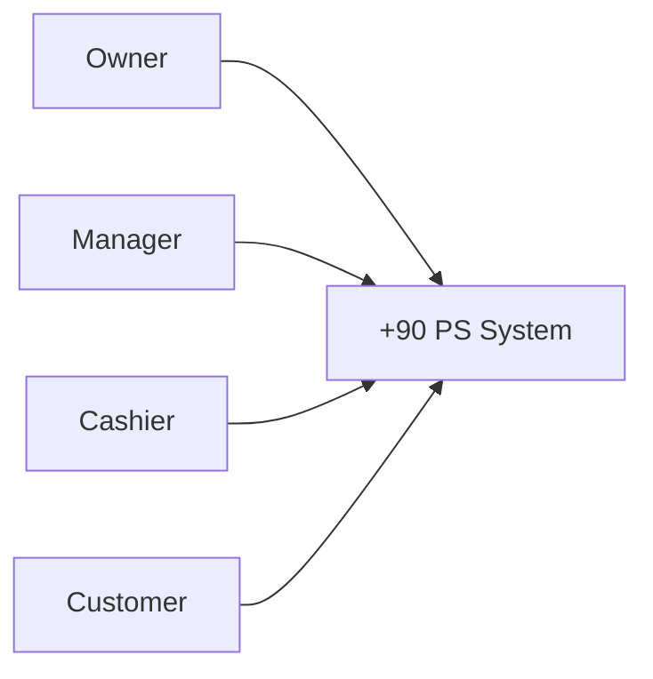

---

## C2 — Containers

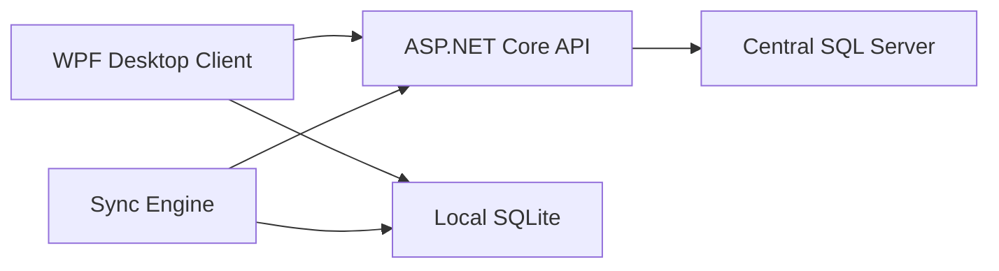

---

## C3 — Components

```text
ASP.NET Core API
|
+-- Authentication
+-- Authorization
+-- Branch Management
+-- User Management
+-- Console Management
+-- Pricing
+-- Session Management
+-- Booking Management
+-- Customer Management
+-- Invoice Management
+-- Payment Management
+-- Expense Management
+-- Shift Management
+-- Asset Management
+-- Reporting
+-- Audit Logging
+-- Synchronization
+-- Configuration / Entitlements
```

---

# 64. System Context Diagram

```text
                +----------------+
                |     Owner      |
                +-------+--------+
                        |
                        v
+-----------+      +----+-----+      +-------------+
|  Cashier  | ---> | +90 PS   | <--- |   Manager   |
+-----------+      |  System  |      +-------------+
                   +----+-----+
                        ^
                        |
                 +------+------+
                 |  Customer   |
                 +-------------+
```

---

# 65. Use Case Diagram — High Level

```text
Cashier
 |
 +-- Login
 +-- Lock / Unlock
 +-- Start Session
 +-- Pause Session
 +-- Resume Session
 +-- Complete Session
 +-- Create Invoice
 +-- Receive Cash
 +-- Apply Allowed Discount
 +-- Manage Customer (according to permission)
 +-- Create Booking (according to release/permission)
 +-- Start / End Shift
```

```text
Manager
 |
 +-- Login
 +-- Manage Users
 +-- Manage Consoles
 +-- Change Pricing
 +-- Manage Expenses
 +-- View Branch Reports
 +-- Authorize Manual Discount
 +-- Authorize Invoice Cancellation
 +-- Approve Session Transfer
 +-- Manage Branch Settings
```

```text
Owner
 |
 +-- View Authorized Branches
 +-- View Aggregated Reports
 +-- Manage Multi-Branch Features
 +-- Future Branch Transfers
 +-- Future Employee Transfers
```

---

# 66. Example Use Case — Start Session

```text
Actor:
Cashier

Preconditions:
- User is authenticated
- User has permission
- Console is available

Main Flow:
1. Cashier selects console.
2. Cashier selects pricing combination.
3. System validates console availability.
4. System validates pricing.
5. System creates session.
6. System records start time.
7. System assigns current cashier as session opener.
8. Console becomes occupied/active.
9. UI displays active session.

Failure examples:
- Console is already active.
- Pricing is unavailable.
- User does not have permission.
- Local database is unavailable.
- Server is unavailable while offline policy is used.
```

---

# 67. Activity Diagram — Start Session

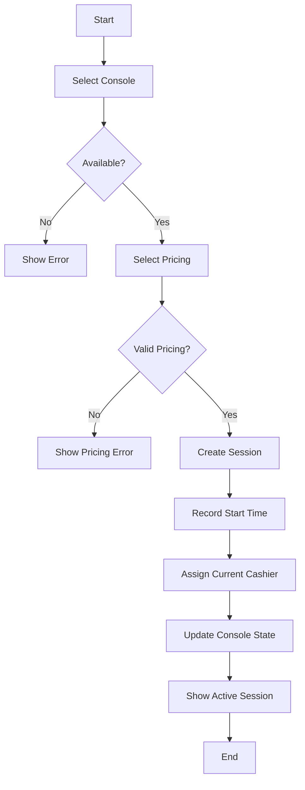

---

# 68. Sequence Diagram — Start Session

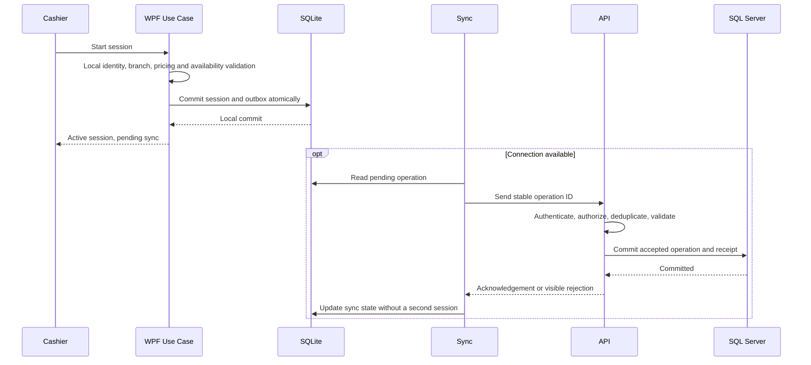

See [ADR-01](BUSINESS_RULES(1).md). A central rejection does not erase a locally recorded payment.

---

# 69. State Diagram — Console

```text
Available
   |
   v
Reserved
   |
   v
Active
   |
   +----> Maintenance
   |
   v
Available
```

A more detailed implementation can separate equipment operational state from booking state.

---

# 70. State Diagram — Session

```text
             +------------+
             | Available  |
             +-----+------+
                   |
                   v
             +------------+
             |   Active   |
             +-----+------+
                   |
           +-------+-------+
           |               |
           v               v
      +---------+     +-----------+
      | Paused  | --> |  Active   |
      +---------+     +-----------+
                           |
                           v
                     +-----------+
                     | Completed |
                     +-----------+
```

---

# 71. State Diagram — Booking

```text
Pending
   ↓
Confirmed
   ↓
Active
   ↓
Completed
```

Possible alternate exits:

```text
Confirmed → Cancelled
Confirmed → No-Show
Confirmed → Expired
```

---

# 72. Data Flow Diagram

```text
Customer / Cashier
        |
        v
      WPF
        |
        +----------------------+
        |                      |
        v                      v
 Local SQLite              ASP.NET API
        |                      |
        |                      v
        |                Business Rules
        |                      |
        |                      v
        |                Central SQL
        |                      |
        +<---- Synchronization-+
```

---

# 73. ERD — High Level

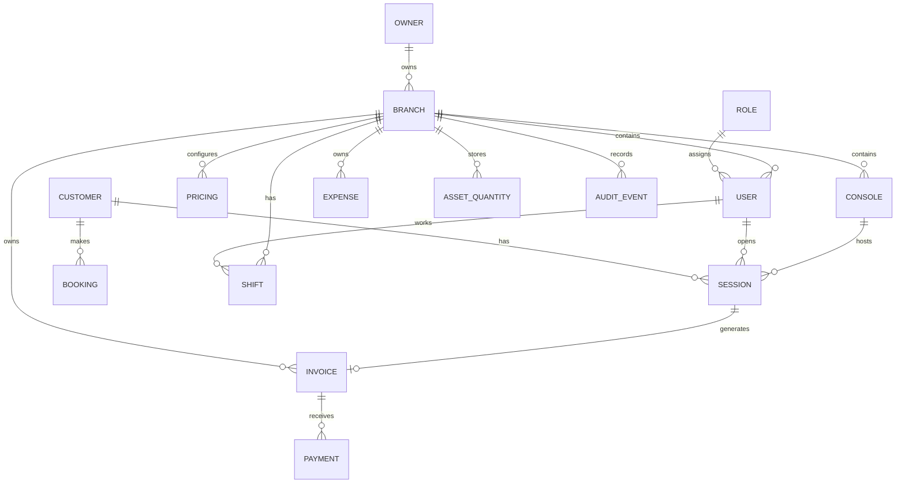

This is conceptual only. The final schema may split entities further.

---

# 74. Suggested Core Entities

Potential domain entities:

```text
Owner
Business / Organization (optional abstraction if needed)
Branch
User
Role
Permission
UserPermission / RolePermission
Console
ConsoleType
Pricing
PricingMode
PricingType
Session
Booking
Customer
Invoice
Payment
Discount
Shift
Expense
AssetCategory
AssetQuantity
Transfer
AuditEvent
SyncItem
BranchSetting
SystemSetting
FeatureEntitlement
Plan
```

The actual domain model should be designed from finalized business requirements rather than copied blindly.

---

# 75. Example Session Entity

Conceptually:

```text
Session
---------------------------
Id
BranchId
ConsoleId
OpenedByUserId
CurrentResponsibleUserId
BookingId (nullable)
PricingId
StartTime
PausedAt (nullable)
EndTime (nullable)
Status
Price
CreatedAt
UpdatedAt
```

The exact fields depend on the final pricing/timing design.

---

# 76. Example Customer Entity

```text
Customer
---------------------------
Id
Phone
Name
Notes
CreatedAt
UpdatedAt
```

Phone is the primary lookup/key according to the current business requirement.

The final database uniqueness rules must be decided explicitly.

---

# 77. Example Booking Entity

```text
Booking
---------------------------
Id
BranchId
CustomerId
ConsoleId (nullable)
CategoryId (nullable)
StartAt
EndAt
DepositAmount
BookingPrice
LateMinutes
LateCharge
Status
CreatedByUserId
CreatedAt
UpdatedAt
```

This is conceptual and must be validated against the final booking policy.

---

# 78. Example Pricing Entity

```text
Pricing
---------------------------
Id
BranchId
ConsoleTypeId
Mode
PricingMethod
Price
Duration
IsActive
EffectiveFrom
EffectiveTo
```

For hourly pricing:

```text
PricingMethod = Hourly
Price = hourly rate
```

For match:

```text
PricingMethod = Match
Price = match price
Duration = configured match duration
```

---

# 79. Example Invoice Entity

```text
Invoice
---------------------------
Id
BranchId
SessionId
CustomerId (nullable)
CashierUserId
Subtotal
DiscountAmount
Total
Status
IssuedAt
CancelledAt (nullable)
CancelledByUserId (nullable)
CancellationReason (nullable)
```

---

# 80. Example Audit Event

```text
AuditEvent
---------------------------
Id
BranchId
ActorUserId
Action
EntityType
EntityId
OldValue (nullable)
NewValue (nullable)
Reason (nullable)
Timestamp
CorrelationId
```

Sensitive data should not be placed blindly into audit fields. The exact serialization and privacy model must be reviewed during security design.

---

# 81. Example Sync Item

```text
SyncItem
---------------------------
Id
OperationId
EntityType
EntityId
OperationType
Payload
CreatedAt
AttemptCount
LastAttemptAt
Status
Error
```

This is a conceptual design.

---

# 82. Component Architecture — WPF

```text
WPF Desktop
|
+-- Presentation
|   +-- Views
|   +-- ViewModels
|   +-- Navigation
|
+-- Application
|   +-- Session Use Cases
|   +-- Booking Use Cases
|   +-- Customer Use Cases
|   +-- Invoice Use Cases
|
+-- Domain / Business Contracts
|
+-- Infrastructure
|   +-- API Client
|   +-- SQLite
|   +-- Sync
|   +-- Secure Local Storage
|   +-- Logging
```

The final internal architecture can use MVVM and appropriate layering.

---

# 83. Component Architecture — Backend

```text
ASP.NET Core API
|
+-- API / Controllers / Endpoints
|
+-- Application
|   +-- Commands
|   +-- Queries
|   +-- Services
|   +-- Validators
|
+-- Domain
|   +-- Entities
|   +-- Value Objects
|   +-- Domain Rules
|
+-- Infrastructure
|   +-- EF Core
|   +-- SQL Server
|   +-- Authentication
|   +-- Email
|   +-- Logging
|   +-- Background Jobs
```

The exact architecture style can be chosen after the domain and feature complexity are known.

---

# 84. API Design

The API is the central backend contract.

Candidate endpoint groups:

```text
/api/auth
/api/users
/api/roles
/api/permissions
/api/owners
/api/branches
/api/consoles
/api/pricing
/api/sessions
/api/bookings
/api/customers
/api/invoices
/api/payments
/api/discounts
/api/shifts
/api/expenses
/api/assets
/api/transfers
/api/reports
/api/audit
/api/sync
/api/plans
/api/entitlements
```

Not all endpoints belong in Release 1.

---

# 85. API Endpoint Example

```http
POST /api/sessions
```

Request example:

```json
{
  "consoleId": "…",
  "pricingId": "…"
}
```

Response example:

```json
{
  "sessionId": "…",
  "status": "Active",
  "startedAt": "…"
}
```

---

# 86. API Contract Documentation

For each endpoint document:

```text
HTTP Method
URL
Authentication
Authorization
Request
Response
Validation
Status Codes
Errors
Idempotency requirements
Business rules
```

OpenAPI / Swagger should be used where practical.

---

# 87. Database Strategy

Central database:

```text
SQL Server
```

Branch local database:

```text
SQLite
```

Central SQL Server is the central source of truth for synchronized data.

Local SQLite provides branch resilience and offline operation.

---

# 88. Database Design Principles

Use:

- Primary keys
- Foreign keys
- Unique constraints
- Indexes
- Appropriate nullability
- Transaction boundaries
- Concurrency handling
- Audit data for sensitive operations
- Branch scoping where appropriate

Avoid putting all business logic only into the database.

---

# 89. Data Dictionary

A formal data dictionary should exist.

Example:

| Field | Type | Nullable | Description |
|---|---|---:|---|
| SessionId | GUID/UUID | No | Session identifier |
| BranchId | GUID/UUID | No | Branch context |
| StartTime | DateTime | No | Session start |
| EndTime | DateTime | Yes | Session completion time |
| Status | Enum | No | Session state |
| Price | Decimal | No | Calculated/recorded charge |

The final types depend on the implementation.

---

# 90. Architecture Decision Records (ADR)

Important technical decisions should be documented.

Examples:

### ADR-001 — API Boundary

Decision:

```text
WPF does not connect directly to the central SQL Server.
```

Reason:

- Security
- Business-rule centralization
- Multi-client support
- Multi-branch support
- Better observability

---

### ADR-002 — Local Database

Decision:

```text
Use SQLite for branch-local resilience.
```

Reason:

- Offline operation
- Fast local transactions
- Low operational overhead

---

### ADR-003 — Central Database

Decision:

```text
Use SQL Server centrally.
```

Reason:

- Robust relational system
- Reporting
- Centralized data
- Familiar ecosystem

---

# 91. Requirements Documentation

Core documentation should include:

```text
Problem Statement
Business Goals
Business Requirements
Product Requirements
Functional Requirements
Non-Functional Requirements
User Stories
Acceptance Criteria
Scope
Assumptions
Risks
Dependencies
```

---

# 92. BRD — Business Requirements Document

BRD should explain:

- Current business situation
- Business problem
- Stakeholders
- Business goals
- Current workflow
- Desired workflow
- Business requirements
- Scope
- Constraints
- Success criteria

---

# 93. PRD — Product Requirements Document

PRD should explain each feature in product terms.

Example:

```text
Feature:
Gaming Session Management

Problem:
Manual timing and billing can create operational errors.

Goal:
Allow branch staff to start, control, and complete gaming sessions accurately.

Users:
Cashier
Manager

Requirements:
- Start session
- Pause
- Resume
- Complete
- Automatic pricing
- User responsibility
- Offline support
```

---

# 94. User Stories

Example:

```text
As a cashier,
I want to start a session on an available console,
so that the system can track the session and calculate the correct charge.
```

Example:

```text
As a manager,
I want to change branch pricing,
so that the system reflects my branch's current prices.
```

---

# 95. Acceptance Criteria

Example:

```text
Given the console is available
When the cashier starts a session
Then the system creates an active session
And records the cashier
And records the start time
And marks the console as occupied
```

Acceptance criteria should be testable.

---

# 96. Non-Functional Requirements

Examples:

```text
Performance
Security
Reliability
Offline resilience
Scalability
Maintainability
Usability
Auditability
Backup
Recovery
```

Example:

```text
Unauthorized users must not access data outside their authorized branch.
```

---

# 97. UX Research

Before high-fidelity UI:

Understand:

- User behavior
- Frequency of actions
- Common mistakes
- Working environment
- Number of clicks
- Keyboard/mouse behavior
- Cashier speed
- Manager workflows
- Error conditions

A cashier may need a much faster workflow than a back-office administrator.

---

# 98. Personas

Candidate personas:

## Cashier

Goals:

- Start sessions quickly
- Avoid mistakes
- Switch users easily
- Complete payments quickly

Pain points:

- Manual timing
- Repetitive data entry
- Confusing workflows
- Shared device

---

## Manager

Goals:

- Manage branch
- Change pricing
- Monitor operations
- Control sensitive operations
- View reports

---

## Owner

Goals:

- See authorized branches
- Compare branches
- Monitor financial performance
- Manage growth

---

# 99. Customer Journey

Candidate customer journey:

```text
Arrive
  ↓
Choose service/device/category
  ↓
Book or start session
  ↓
Play
  ↓
Finish
  ↓
Receive invoice
  ↓
Pay cash
  ↓
History updated
```

---

# 100. Information Architecture

Candidate WPF navigation:

```text
Dashboard

Operations
├── Sessions
├── Bookings
├── Customers
└── Invoices

Management
├── Consoles
├── Pricing
├── Employees
├── Assets
└── Branch Settings

Finance
├── Expenses
├── Revenue
├── Profit
└── Reports

System
├── Users
├── Roles
├── Permissions
├── Audit
└── Settings
```

The actual menu shown depends on permissions and product entitlements.

---

# 101. UI / Design System

High-fidelity UI should define:

- Typography
- Spacing
- Buttons
- Inputs
- Tables
- Cards
- Dialogs
- Navigation
- Status indicators
- Error states
- Loading states
- Empty states
- Offline states
- Permission denied states

---

# 102. Required UI States

Every important screen should consider:

```text
Loading
Success
Empty
Error
Offline
Unauthorized
Forbidden
Saving
Saved
Syncing
Sync Failed
```

---

# 103. Technical Flow

High-level technical flow:

```text
User Action
    ↓
WPF Input Event
    ↓
ViewModel / Application Use Case
    ↓
Local or API Operation
    ↓
Business Validation
    ↓
Persistence
    ↓
Result
    ↓
UI Update
```

Online:

```text
WPF
 ↓
API
 ↓
Application Service
 ↓
Domain Rules
 ↓
EF Core
 ↓
SQL Server
```

Offline:

```text
WPF
 ↓
Local Application Logic
 ↓
SQLite
 ↓
Sync Queue
```

---

# 104. Work Flow — Cashier

Candidate normal workflow:

```text
Open application
    ↓
Select / authenticate user
    ↓
Dashboard
    ↓
Check available consoles
    ↓
Customer arrives
    ↓
Start session or booking
    ↓
Select console/category
    ↓
Select Single/Multi
    ↓
Select pricing
    ↓
Start
    ↓
Customer plays
    ↓
Pause/Resume if supported
    ↓
Complete
    ↓
Calculate charge
    ↓
Create invoice
    ↓
Receive cash
    ↓
Close transaction
```

---

# 105. Work Flow — Manager

```text
Manager PIN / Login
    ↓
Manager Dashboard
    ↓
View branch
    ↓
Manage users
    ↓
Manage consoles
    ↓
Change pricing
    ↓
View reports
    ↓
Manage expenses
    ↓
Authorize protected operations
```

---

# 106. Work Flow — Session Transfer

```text
Cashier A wants to end work
        ↓
System checks active sessions
        ↓
Active sessions exist?
     /       \
   No         Yes
   |           |
End Shift   Manager PIN
               ↓
        Validate Manager
               ↓
       Select replacement
               ↓
        Transfer sessions
               ↓
           Audit event
               ↓
          Cashier A exits
```

---

# 107. Work Flow — Invoice Cancellation

```text
Cashier requests cancellation
        ↓
System checks permission
        ↓
Manager authorization required
        ↓
Manager enters PIN
        ↓
Validate manager + permission
        ↓
Record cancellation reason
        ↓
Mark invoice Cancelled
        ↓
Write Audit Event
        ↓
Update financial calculations
```

---

# 108. Work Flow — Booking

```text
Customer requests booking
        ↓
Find/identify customer
        ↓
Select branch/category if applicable
        ↓
Select date/time
        ↓
Check availability
        ↓
Calculate booking price
        ↓
Collect deposit
        ↓
Confirm booking
        ↓
At arrival:
    |
    +-- On time → Start
    |
    +-- 10 min late → Apply 10% charge rule
    |
    +-- 15 min late → Cancel / forfeit payment
```

The final timing calculation and edge cases must be encoded in business rules.

---

# 109. Work Flow — Shift Handover

Current Release 1 does not require full cash reconciliation.

Operational handover can still use:

```text
Cashier A
   ↓
Lock / attempt exit
   ↓
Active sessions check
   ↓
Manager authorization if needed
   ↓
Transfer to Cashier B
   ↓
Cashier B continues responsibility
```

---

# 110. Multi-Branch Features

Multi-branch customers may gain:

```text
Central branch list
Branch switching
Aggregated reports
Branch-to-branch asset quantity transfer
Future employee transfer
Future central configuration
Cross-branch monitoring
```

Single-branch customers should not be presented with functionality they cannot use.

---

# 111. Feature Entitlements / Packages

Future commercial model:

```text
Package 1
Package 2
Package 3
Package 4
```

The exact package contents are TBD.

Architecture concept:

```text
Plan
  ↓
Entitlements
  ↓
Feature availability
  ↓
Authorization
  ↓
UI visibility
```

Do not implement plan logic using scattered UI conditions like:

```csharp
if (HasTwoBranches)
{
    ...
}
```

Instead, use a centralized feature/entitlement concept.

---

# 112. Feature Flags vs Permissions vs Entitlements

Keep concepts distinct:

### Permissions

What a user is allowed to do.

Example:

```text
Manager.ChangePricing
```

### Entitlements

What the customer's plan includes.

Example:

```text
MultiBranch.TransferAssets
```

### Feature Flags

Whether a product feature is temporarily enabled for rollout/testing.

Example:

```text
NewReportingV2 = true
```

These should not be mixed into one uncontrolled mechanism.

---

# 113. Reports

Initial/reporting direction:

```text
Daily Revenue
Weekly Revenue
Monthly Revenue
Daily Expenses
Weekly Expenses
Monthly Expenses
Daily Profit
Weekly Profit
Monthly Profit
```

Release evolution may add:

- Branch comparisons
- Console utilization
- Session counts
- Average session duration
- Booking analytics
- Customer activity
- Cancellation analytics
- Other product metrics

---

# 114. Email Reports

The business requested daily/weekly/monthly reports to be sent by email.

This is a confirmed product direction, but the exact automation design should be finalized before implementing.

Possible architecture:

```text
Report Scheduler
        ↓
Report Service
        ↓
Generate Report
        ↓
Email Service
        ↓
Recipient
```

Possible future implementation:

- Background jobs
- Scheduled reports
- Email templates
- Failure/retry handling

---

# 115. Accounting Integration

Accounting integration is a possible future feature.

It should not block the initial product.

If implemented later:

```text
+90 PS
   ↓
Accounting Export / Integration
   ↓
External Accounting System
```

The specific provider is not yet selected.

---

# 116. Testing Strategy

Testing is continuous.

Types:

```text
Unit Tests
Integration Tests
API Tests
Database Tests
UI Tests
End-to-End Tests
Security Tests
Performance Tests
Regression Tests
UAT
```

---

# 117. Test Pyramid

Conceptual:

```text
        E2E
      /     \
 Integration
   /         \
 Unit Tests
```

Most logic should be covered by fast unit/integration tests.

---

# 118. Example Test Cases — Session

```text
TC-001
Available console → session starts

TC-002
Occupied console → start rejected

TC-003
Unauthorized user → forbidden

TC-004
Missing pricing → validation error

TC-005
Offline mode → local session creation

TC-006
Sync after reconnect → record reaches central server

TC-007
Duplicate sync request → no duplicate session
```

---

# 119. Edge Cases

Important edge cases include:

```text
Internet disconnects during session
Internet disconnects during completion
Application crashes
PC restarts
Double-click Start
Two requests attempt same console
Session crosses midnight
Price changes during an active session
Booking customer is late
Booking reaches 15-minute threshold
Sync fails halfway
Sync retries
Central API unavailable
Local DB unavailable
Cashier changes user
Manager override attempted with wrong PIN
Unauthorized branch access attempted
```

These must become specific business/test cases as the relevant features are implemented.

---

# 120. Concurrency

Important scenarios:

```text
Two cashier actions hit the same resource
Two sync requests duplicate the same operation
Same console is attempted by multiple flows
Session state changes while another action is in progress
```

The system needs appropriate database/API concurrency controls.

---

# 121. Performance

Future scale target:

```text
40+ branches
Multiple consoles per branch
Multiple cashiers over time
Large session history
Large invoice history
Large customer history
Large audit history
```

The system must use:

- Proper indexes
- Efficient queries
- Pagination
- Query projections where appropriate
- Connection pooling
- Background processing where useful
- Caching where justified

Do not prematurely optimize before real measurements.

---

# 122. Observability

Production must eventually provide:

## Logs

- Application errors
- Warnings
- Sync failures
- API failures

## Metrics

- API response time
- Error rate
- Sync backlog
- Branch connectivity
- Job failures
- Database health

## Health Checks

```text
API health
Database health
Sync health
```

---

# 123. Deployment Architecture

Conceptual:

```text
                        Internet
                           |
                    +------+------+
                    | Central API |
                    +------+------+
                           |
                    +------+------+
                    | SQL Server  |
                    +-------------+

Branch 01
   |
 WPF
   |
SQLite
   |
Sync

Branch 02
   |
 WPF
   |
SQLite
   |
Sync

...

Branch 40+
   |
 WPF
   |
SQLite
   |
Sync
```

---

# 124. Deployment Environments

Use:

```text
Development
    ↓
Testing
    ↓
Staging
    ↓
Production
```

Do not test new experimental behavior directly in production.

---

# 125. CI/CD

Target flow:

```text
Git Push
   ↓
Build
   ↓
Unit Tests
   ↓
Integration Tests
   ↓
Security Checks
   ↓
Package
   ↓
Deploy to Staging
   ↓
UAT
   ↓
Production
```

The exact CI/CD tool can be chosen later.

---

# 126. Desktop Auto Update

At 40+ branches, manual installation on every machine becomes impractical.

Future target:

```text
Update Available
      ↓
Download
      ↓
Verify
      ↓
Install
      ↓
Restart
      ↓
Verify
```

Must include a rollback/recovery strategy.

---

# 127. Database Migration Strategy

Production databases change over time.

Use controlled migrations.

Example:

```text
v1 schema
    ↓
Migration
    ↓
v2 schema
```

Migrations must be:

- Tested
- Versioned
- Reviewed
- Safe for production
- Compatible with deployment strategy

---

# 128. Backup Strategy

Need explicit decisions for:

- What is backed up?
- Frequency
- Retention
- Storage location
- Encryption
- Who can restore?
- Restore verification
- Backup monitoring

Backups that have never been restored/tested should not be treated as proven recovery.

---

# 129. Disaster Recovery

Future production plan must define:

## RPO

Maximum acceptable data loss window.

## RTO

Maximum acceptable recovery time.

Example targets are not yet approved; they must be defined according to actual business needs.

---

# 130. Incident Management

Production incident lifecycle:

```text
Detect
  ↓
Investigate
  ↓
Contain
  ↓
Fix
  ↓
Verify
  ↓
Recover
  ↓
Postmortem
  ↓
Prevent recurrence
```

---

# 131. Root Cause Analysis

Do not only fix symptoms.

Example:

```text
Invoice incorrect
    ↓ Why?
Duplicate operation
    ↓ Why?
Retry created duplicate
    ↓ Why?
No idempotency
    ↓
Architecture improvement
```

5 Whys is a useful simple method.

---

# 132. Support Severity

Candidate model:

```text
P1 — Critical
Whole system unavailable / severe data risk

P2 — High
Major branch functionality unavailable

P3 — Medium
Important feature issue with workaround

P4 — Low
Minor bug / cosmetic issue
```

---

# 133. Product Metrics

Possible metrics:

```text
Revenue per branch
Sessions per day
Average session duration
Console utilization
Peak hours
Booking conversion
Booking cancellation
No-show rate
Average transaction value
Expense trends
Profit trends
Sync failures
Offline duration
System availability
```

Not every metric belongs in the first release.

---

# 134. North Star / Product Outcome

The product should be evaluated primarily by business value, not number of features.

Potential product outcomes:

```text
Reliable branch operation
Accurate session billing
Reduced operational errors
Better owner visibility
Lower staff friction
Safe multi-branch management
```

---

# 135. Risk Register

Initial risks:

| Risk | Probability | Impact | Mitigation |
|---|---:|---:|---|
| Internet outage | High | High | Offline-first architecture |
| Sync conflicts | Medium | High | Explicit sync model + tests |
| Duplicate operations | Medium | High | Idempotency |
| Unauthorized access | Medium | Critical | Backend authorization |
| Financial data alteration | Medium | Critical | Append/void model + audit |
| Scope creep | High | High | Release scope + change control |
| Manual deployments to many branches | High | High | Auto-update |
| Data loss | Low | Critical | Backup + restore testing |
| Inconsistent branch data | Medium | High | Branch isolation + sync controls |

---

# 136. Scope Creep Policy

Any new idea should go through:

```text
Request
   ↓
Why?
   ↓
Who needs it?
   ↓
Business value
   ↓
Impact
   ↓
Priority
   ↓
Release assignment
```

Not:

```text
"Customer asked for it"
      ↓
"Build immediately"
```

---

# 137. Change Request

Candidate fields:

```text
Change ID
Request
Reason
Requester
Business Value
Impact
Affected Modules
Security Impact
Database Impact
Release
Priority
Decision
Status
```

---

# 138. Definition of Ready

A feature should be ready for development when:

```text
Requirement understood
User(s) identified
Acceptance criteria written
Dependencies known
UX flow understood
Security considerations identified
Data impact understood
API contract reasonably defined
```

---

# 139. Definition of Done

A feature is not done just because the code works.

Candidate Definition of Done:

```text
Requirement implemented
Validation implemented
Authorization implemented
Error handling implemented
Relevant tests pass
UI states handled
Database changes migrated
Documentation updated
Code reviewed (self-review if solo)
No known critical issue
```

---

# 140. Definition of Production Ready

Before production:

```text
Security reviewed
Backups configured
Monitoring configured
Logging configured
Deployment tested
Rollback considered
Database migration tested
Critical test cases pass
UAT passed
Documentation ready
Support process ready
```

---

# 141. Git Strategy

Suggested:

```text
main
develop
feature/*
bugfix/*
release/*
hotfix/*
```

This should remain simple enough for a solo developer.

---

# 142. Pull Requests as Self-Review

Even when working alone:

```text
Feature branch
    ↓
Implementation
    ↓
Tests
    ↓
PR
    ↓
Self-review
    ↓
Merge
```

PR template can include:

```text
What changed?
Why?
How tested?
Risks?
Screenshots?
Migration notes?
```

---

# 143. Repository Structure

Suggested:

```text
+90PS/
|
├── docs/
│   ├── 01-discovery/
│   ├── 02-business/
│   ├── 03-requirements/
│   ├── 04-product/
│   ├── 05-ux/
│   ├── 06-ui/
│   ├── 07-architecture/
│   ├── 08-database/
│   ├── 09-api/
│   ├── 10-security/
│   ├── 11-development/
│   ├── 12-testing/
│   ├── 13-deployment/
│   ├── 14-operations/
│   ├── 15-support/
│   ├── 16-releases/
│   └── 17-decisions/
│
├── backend/
├── desktop/
├── tests/
├── infrastructure/
└── scripts/
```

---

# 144. Documentation Inventory

The project should eventually contain:

## Discovery

```text
stakeholder-interviews.md
business-problems.md
as-is-process.md
```

## Business

```text
brd.md
business-goals.md
scope.md
business-rules.md
```

## Requirements

```text
functional-requirements.md
non-functional-requirements.md
user-stories.md
acceptance-criteria.md
```

## Product

```text
prd.md
roadmap.md
backlog.md
prioritization.md
release-plan.md
```

## UX

```text
personas.md
user-journeys.md
information-architecture.md
ux-flows.md
wireframes/
```

## UI

```text
design-system.md
screens.md
interaction-specs.md
```

## Architecture

```text
system-context.md
c4-context.md
c4-container.md
c4-component.md
component-diagram.md
deployment-diagram.md
technical-flow.md
work-flow.md
architecture-overview.md
```

## Database

```text
erd.md
schema.md
data-dictionary.md
database-guidelines.md
migration-strategy.md
```

## API

```text
openapi.yaml
api-guidelines.md
auth.md
error-model.md
```

## Security

```text
security-requirements.md
threat-model.md
trust-boundaries.md
rbac.md
audit-logging.md
secure-development.md
```

## Development

```text
coding-standards.md
git-workflow.md
branching-strategy.md
code-review.md
```

## Testing

```text
test-plan.md
test-cases.md
integration-tests.md
regression-plan.md
uat.md
performance-testing.md
security-testing.md
```

## Deployment

```text
environments.md
deployment-plan.md
desktop-update.md
database-migrations.md
rollback.md
```

## Operations

```text
monitoring.md
logging.md
backup.md
disaster-recovery.md
runbooks/
```

## Support

```text
support-process.md
incident-management.md
severity.md
```

## Releases

```text
release-notes/
release-checklists/
```

## Decisions

```text
ADR-001-...
ADR-002-...
```

---

# 145. Business Diagrams to Produce

The project should include diagrams where they provide real value.

## Business / Product

- Business Process Diagram
- AS-IS Process
- TO-BE Process
- Customer Journey
- User Journey
- Service Blueprint (if needed)
- User Story Map

## Requirements

- Use Case Diagram
- Feature Map

## Architecture

- System Context
- C4 Context
- C4 Container
- C4 Component
- Deployment Diagram
- Component Diagram

## Behavior

- Activity Diagram
- Sequence Diagram
- State Machine Diagram

## Data

- ERD
- Data Flow Diagram
- Data Dictionary

## Security

- Threat Model
- Trust Boundary Diagram
- Attack Surface Map
- Security Architecture Diagram

Not every feature needs every diagram.

---

# 146. Diagram Strategy

The goal is clarity, not diagram quantity.

Use diagrams when the diagram answers a real question.

Examples:

```text
What systems interact?
→ System Context

How does the application communicate?
→ C4 Container

What happens during Start Session?
→ Sequence Diagram

What states can a session have?
→ State Diagram

What tables and relationships exist?
→ ERD

How does data move?
→ Data Flow

Where are security trust boundaries?
→ Threat Model
```

---

# 147. Project Phase Exit Criteria

## Discovery Exit

```text
Problem defined
Stakeholders identified
Current workflow understood
Goals defined
Constraints known
```

## Requirements Exit

```text
Scope defined
MVP defined
Requirements documented
Acceptance criteria started
Critical ambiguities resolved
```

## Design Exit

```text
User flows defined
Wireframes validated
UI direction defined
```

## Architecture Exit

```text
System architecture defined
Database direction defined
API boundaries defined
Security direction defined
Offline/sync direction defined
Key ADRs recorded
```

## Development Exit

```text
Feature complete
Relevant tests pass
Known critical bugs resolved
```

## Release Exit

```text
UAT complete
Deployment verified
Rollback plan ready
Documentation ready
```

---

# 148. Pilot Strategy

Do not deploy directly to 40 branches.

Recommended progression:

```text
Internal Test
    ↓
1 Pilot Branch
    ↓
2–3 Branches
    ↓
5 Branches
    ↓
10 Branches
    ↓
20 Branches
    ↓
40+
```

The first real branch is used to discover operational problems not visible during isolated development.

---

# 149. Branch Onboarding Checklist

Candidate checklist:

```text
Install WPF application
Register branch
Configure branch identity
Create manager
Create cashier users
Configure consoles
Configure pricing
Configure local database
Test offline mode
Test sync
Test session flow
Test invoice
Test cash
Train staff
Verify support process
Go live
```

---

# 150. User Training

Deliverables can include:

## Cashier Guide

```text
Login
Lock screen
Switch user
Start session
Pause/resume
Complete
Invoice
Cash payment
Allowed discount
Customer lookup
Booking
```

## Manager Guide

```text
Users
Pricing
Consoles
Reports
Expenses
Protected actions
Branch settings
```

---

# 151. Support Runbooks

Example:

## API Down

```text
1. Check health endpoint.
2. Check service status.
3. Check logs.
4. Check database connection.
5. Verify infrastructure.
6. Apply recovery procedure.
7. Verify.
8. Record incident.
```

## Sync Failure

```text
1. Check branch connectivity.
2. Check sync backlog.
3. Inspect failed operation.
4. Check API.
5. Retry safe operations.
6. Resolve conflicts where needed.
7. Verify central state.
8. Record incident.
```

---

# 152. Product Feedback Loop

After Release 1:

```text
Real usage
   ↓
Bug reports
   ↓
Feature requests
   ↓
Operational observations
   ↓
Prioritization
   ↓
Release 2 backlog
```

Feedback must be classified:

```text
Bug
Change Request
Feature Request
Usability Problem
Performance Problem
Security Issue
Operational Issue
```

---

# 153. Release Versioning

Example:

```text
Release 1:
1.0.0

Bug fix:
1.0.1

Feature-compatible improvement:
1.1.0

Major product release:
2.0.0
```

Actual versioning conventions may be adjusted.

---

# 154. Bug Management

Each bug should record:

```text
Bug ID
Title
Severity
Environment
Branch
User
Steps to reproduce
Expected result
Actual result
Evidence
Root cause
Fix
Regression test
Release
```

---

# 155. Production Bug + New Feature Parallel Work

Example:

```text
Production Release 1
        |
        +------ Hotfix Branch
        |          ↓
        |       Release 1.0.1
        |
        +------ Release 2 Development
                   ↓
                Release 2.0
```

Hotfixes should also be reflected in the active development branch.

---

# 156. Future Multi-Branch Scaling

The architecture should support:

```text
Branch 01
Branch 02
...
Branch 40+
```

without changing fundamental business concepts.

Central backend:

```text
One API
+
Central data
+
Branch isolation
```

Branch side:

```text
One local WPF deployment per branch
+
One local SQLite environment per branch
```

---

# 157. Future Website / Mobile Architecture

Not Phase 1.

Future:

```text
Website
   |
Mobile
   |
WPF
   |
   v
ASP.NET Core API
   |
   v
Central SQL Server
```

The API should remain the stable central integration layer.

---

# 158. Future Feature Roadmap Candidates

Potential future features include:

```text
Website
Mobile App
Advanced booking
Advanced reports
Advanced analytics
Accounting integration
Advanced package system
Automated desktop updates
Advanced asset transfers
Employee transfers
Advanced customer functions
More payment methods
```

Only validated needs should enter development.

---

# 159. What Is Not Yet Finalized

Open decisions include:

## Match

- Can multiple matches be combined into one continuous customer transaction?
- How is a match started/finished operationally?
- Can the match duration be changed while active?
- Are match prices independent per console type/mode?
- Are different games allowed to have different match pricing?

## Booking

- Specific console vs category
- Exact deposit percentage/fixed amount
- Whether deposit amount is configurable
- What happens if the branch is unable to honor a booking
- Whether a booking can be rescheduled
- Exact No-Show state
- Exact VIP/Standard data model

## Customer

- Phone uniqueness rules
- Whether phone changes are allowed
- Customer merge handling
- Customer deletion/anonymization policy

## Assets

- Exact list of asset categories
- Whether consoles have serial numbers
- Whether all quantities require adjustment history
- Who can perform inter-branch transfer
- Whether transfer requires approval

## Shifts

- Full cash reconciliation timing
- Opening/closing cash
- Difference handling
- Future cash discrepancy reporting

## Reports

- Exact contents
- Email recipients
- Scheduling
- Templates
- Export formats

## Accounting

- Integration provider
- Export vs direct integration
- Accounting period rules

## Packages

- Four package names
- Feature matrix
- Pricing
- Upgrade/downgrade behavior
- Feature entitlements
- Billing mechanics

---

# 160. Deferred Features vs Forgotten Features

A feature marked deferred is intentional.

Examples:

```text
Website → Deferred
Mobile → Deferred
Food Sales → Excluded
Membership → Excluded
Full Cash Reconciliation → Deferred
Accounting Integration → Later
```

Deferred does not mean "forgotten."

Each deferred item should have a place in the product roadmap.

---

# 161. Superseded Decisions

The original project discussion explored:

```text
WPF + Website
```

This was superseded.

Current:

```text
WPF + ASP.NET Core API + SQL Server + SQLite
```

The project also originally discussed food/cafeteria sales.

This was superseded.

Current:

```text
No Food Sales
No Drinks Sales
No Product Sales
```

Inventory still exists but means:

```text
Assets / Equipment / Quantities
```

not product-sales inventory.

---

# 162. Architecture Principles for a Solo Developer

The product is intentionally being built by one developer.

Therefore:

- Avoid unnecessary microservices
- Avoid premature distributed complexity
- Keep deployment manageable
- Keep documentation useful
- Use clear boundaries
- Prefer maintainability
- Automate repetitive operations
- Build only validated features
- Keep security centralized
- Test critical business logic

Recommended initial architecture is a modular monolith/backend rather than many independent services unless future scale proves otherwise.

---

# 163. Why the API Matters Even Without a Website

The API provides:

- Central business rules
- Security boundary
- Multi-branch access control
- Shared data access
- Future mobile/web support
- Central reporting
- Sync endpoint
- Easier deployment strategy
- Better logging and monitoring

Therefore removing the Website does NOT make the API unnecessary.

---

# 164. What the First Prototype Must Prove

Release 1 should prove:

```text
Can a real cashier operate the shop?
Can sessions be managed correctly?
Can pricing be calculated correctly?
Can invoices be generated?
Can cash payments be recorded?
Can managers protect sensitive operations?
Can the branch keep operating offline?
Can data synchronize safely?
Can one physical PC support multiple cashiers?
Can the central API keep branch data isolated?
```

These are much more important than visual polish alone.

---

# 165. MVP Success Criteria

> **Current R1 override:** Any discount line in the historical checklist below is retired; it is not an R1 success criterion.

A successful Release 1 is not:

```text
"It has many screens."
```

It is:

```text
A real shop can use it for normal operations
without requiring the later features.
```

---

# 166. Recommended First Development Order

المرجع التنفيذي هو [خريطة التنفيذ](ROADMAP.md) و[تغطية Release 1](R1_ACCEPTANCE.md).

M0 تثبيت قواعد الجزء الأول ومراجعة الموجود → M1 جلسة وفاتورة ودفع محلي مع أساس الهوية → M2 استعادة ومزامنة مبكرة → M3 استكمال جميع وظائف Release 1 → M4 اختبار المستخدم وتجربة الفرع والإطلاق.

تُنفّذ الاختبارات والصلاحيات وسجل العمليات مع كل جزء. M1 وM2 معالم داخلية وليسا تقليصًا للإصدار. لا يؤجل الحفظ المحلي أو المزامنة إلى ما بعد جميع الشاشات، ولا تكون كل وثائق المشروع شرطًا مسبقًا للبرمجة.

---

# 167. Recommended Release 1 Development Slices

المرجع التنفيذي هو [خريطة التنفيذ](ROADMAP.md) و[تغطية Release 1](R1_ACCEPTANCE.md).

M0 تثبيت قواعد الجزء الأول ومراجعة الموجود → M1 جلسة وفاتورة ودفع محلي مع أساس الهوية → M2 استعادة ومزامنة مبكرة → M3 استكمال جميع وظائف Release 1 → M4 اختبار المستخدم وتجربة الفرع والإطلاق.

تُنفّذ الاختبارات والصلاحيات وسجل العمليات مع كل جزء. M1 وM2 معالم داخلية وليسا تقليصًا للإصدار. لا يؤجل الحفظ المحلي أو المزامنة إلى ما بعد جميع الشاشات، ولا تكون كل وثائق المشروع شرطًا مسبقًا للبرمجة.

---

# 168. Release 2 Development Slices

انظر [Release 2](R2_EXPANDED_MVP.md): العملاء ثم التاريخ ثم الحجز والعربون وتسجيل الوصول. تُفحص المزامنة والصلاحيات والاختبارات مع كل إضافة. التقارير في R2 تخص العملاء والحجوزات؛ التحليلات المتقدمة الشاملة تظل R3.

---

# 169. Release 3 Development Slices

Release 3 should start with a new product review rather than assuming every future feature is fixed today.

Potential:

```text
Multi-branch advanced operations
Advanced analytics
Advanced reports
Automated emailing
Inter-branch transfer
Employee transfer
Accounting integration
Feature/package management
Advanced deployment
Advanced monitoring
```

---

# 170. Important Engineering Rule

Do not implement unresolved requirements by guessing.

Instead:

```text
Open Decision
    ↓
Business Decision
    ↓
Requirement
    ↓
Design
    ↓
Implementation
```

This prevents an assumption from becoming permanent architecture.

---

# 171. Project Management Model

The project emulates a larger team using explicit responsibilities.

Even when working alone, mentally separate:

```text
Product Management
Business Analysis
UX/UI
Architecture
Backend
Desktop
Database
Security
QA
DevOps
Operations
Support
```

One person can perform all these roles, but the outputs should remain distinguishable.

---

# 172. Project Master Checklist

## Discovery

```text
[ ] Problem Statement
[ ] Stakeholders
[ ] Business Goals
[ ] Current Workflow
[ ] Target Workflow
[ ] Risks
[ ] Scope
```

## Product

```text
[ ] PRD
[ ] MVP boundaries
[ ] User stories
[ ] Acceptance criteria
[ ] Release plan
```

## UX/UI

```text
[ ] Personas
[ ] User journeys
[ ] Information architecture
[ ] Wireframes
[ ] High fidelity design
[ ] Design system
[ ] Error/empty/offline states
```

## Architecture

```text
[ ] Context
[ ] C4
[ ] Components
[ ] Deployment
[ ] Technical flow
[ ] Work flows
[ ] ADRs
```

## Data/API

```text
[ ] ERD
[ ] Data dictionary
[ ] Schema
[ ] API contracts
[ ] OpenAPI
```

## Security

```text
[ ] Security requirements
[ ] Threat model
[ ] RBAC
[ ] Audit
[ ] Secret management
[ ] Security tests
```

## QA

```text
[ ] Test plan
[ ] Test cases
[ ] Integration
[ ] Regression
[ ] Performance
[ ] UAT
```

## Deployment

```text
[ ] Environment strategy
[ ] Build pipeline
[ ] Deployment
[ ] Backup
[ ] Rollback
[ ] Update strategy
```

## Operations

```text
[ ] Monitoring
[ ] Logs
[ ] Health checks
[ ] Runbooks
[ ] Incident response
[ ] Support
```

---

# 173. Recommended Long-Term Product Model

```text
                         +90 PS
                            |
        +-------------------+-------------------+
        |                   |                   |
     Product              Plans              Releases
        |                   |                   |
        |             4 future packages        |
        |                                       |
   +----+----+                         +--------+--------+
   |         |                         |        |        |
  Core   Modules                    R1       R2       R3
   |         |
   |     Customer
   |     Booking
   |     Assets
   |     Reports
   |
Sessions
Pricing
Invoices
Payments
Users
Branches
```

---

# 174. Final Target Architecture

```text
                              +90 PS
                                |
             +------------------+------------------+
             |                                     |
      Client Applications                    Future Clients
             |                                     |
        +----+----+                           +----+----+
        |         |                           |         |
       WPF     Future UI                   Web      Mobile
        |         |                           |         |
        +---------+---------------------------+---------+
                                |
                                v
                      +--------------------+
                      | ASP.NET Core API   |
                      +---------+----------+
                                |
          +---------------------+----------------------+
          |                     |                      |
          v                     v                      v
     Auth / RBAC           Business Logic          Reporting
          |                     |                      |
          +---------------------+----------------------+
                                |
                                v
                      +--------------------+
                      | Central SQL Server |
                      +--------------------+

Branch side:
WPF
 |
 +-- SQLite
 |
 +-- Offline Logic
 |
 +-- Sync Queue
 |
 +-- Sync Engine
 |
 +-- Secure Local Authentication
```

---

# 175. Final End-to-End Product Lifecycle

```text
IDEA
  ↓
Discovery
  ↓
Problem Definition
  ↓
Business Analysis
  ↓
BRD
  ↓
PRD
  ↓
Scope
  ↓
UX Research
  ↓
User Journeys
  ↓
Wireframes
  ↓
UI Design
  ↓
System Analysis
  ↓
Use Cases
  ↓
Activity Diagrams
  ↓
Sequence Diagrams
  ↓
State Diagrams
  ↓
C4 Architecture
  ↓
ERD
  ↓
API Design
  ↓
Security / Threat Model
  ↓
Offline / Sync Architecture
  ↓
Development
  ↓
Testing
  ↓
UAT
  ↓
Release 1
  ↓
Pilot
  ↓
Real Users
  ↓
Bug Fixes
  ↓
Feedback
  ↓
Release 2
  ↓
Expanded Product
  ↓
Release 3
  ↓
Full Product
  ↓
40+ Branch Rollout
  ↓
Monitoring
  ↓
Support
  ↓
Continuous Improvement
```

---

# 176. Final Current Source of Truth

المرجع المشترك الحالي هو [SHARED_RULES](BUSINESS_RULES(1).md). النطاق التفصيلي لكل إصدار في ملفه. الرؤية: محل واحد ثم عدة فروع، مع ملكية وعزل فروع وأدوار Cashier/Manager/Owner.

المستندات السابقة تصف صفر فروع فعلية وهدفًا مستقبليًا 40+؛ هذه حالة موروثة من وقت التوثيق وليست تحققًا جديدًا من الوضع التجاري.

سياسات العملاء والحجوزات والعربون والتأخير تقع في Release 2؛ الباقات والتحويلات والتوسع المتقدم في Release 3. لا تدخل تلقائيًا في R1، ولا تصبح اقتراحات قديمة قرارات معتمدة لمجرد ورودها تحت عنوان Confirmed.

---

# 177. The Most Important Mental Model

Do not think:

```text
"I am making a WPF project."
```

Think:

```text
"I am building a multi-branch product."
```

The WPF application is only one client.

The real product is:

```text
Business Model
+
Requirements
+
Domain
+
API
+
Security
+
Data
+
Offline/Sync
+
Desktop Client
+
Operations
+
Support
+
Release Process
```

---

# 178. Recommended Next Work Item

المرجع التنفيذي هو [خريطة التنفيذ](ROADMAP.md) و[تغطية Release 1](R1_ACCEPTANCE.md).

M0 تثبيت قواعد الجزء الأول ومراجعة الموجود → M1 جلسة وفاتورة ودفع محلي مع أساس الهوية → M2 استعادة ومزامنة مبكرة → M3 استكمال جميع وظائف Release 1 → M4 اختبار المستخدم وتجربة الفرع والإطلاق.

تُنفّذ الاختبارات والصلاحيات وسجل العمليات مع كل جزء. M1 وM2 معالم داخلية وليسا تقليصًا للإصدار. لا يؤجل الحفظ المحلي أو المزامنة إلى ما بعد جميع الشاشات، ولا تكون كل وثائق المشروع شرطًا مسبقًا للبرمجة.

---

# 179. End of Master Working Specification

This document is intended to evolve.

When a new requirement is approved:

```text
Decision
   ↓
Update source of truth
   ↓
Update PRD
   ↓
Update affected diagrams
   ↓
Update architecture if needed
   ↓
Update database/API contracts
   ↓
Implement
   ↓
Test
   ↓
Release
```

Never change an important business rule silently in code without updating the relevant documentation.
````

### Source 064 — Project.Docs/Planning/FIRST_SLICE.md

Original size: 3497 bytes. SHA-256: `f75704b7748ec6b0f6edfb28a76c9025846d1a70d1a05d69b90d66e2078dc7c7`.

````text
# الجزء التشغيلي الأول — مهام قابلة للتنفيذ

## النتيجة

كاشير معروف في فرع محدد يبدأ Open/Hourly على جهاز متاح، ينهيه، يرى المدة الفعلية ومدة الفوترة، ويصدر فاتورة ويسجل النقد محليًا. حفظ البيانات لا ينتظر الشبكة. توسعة كل ميزات R1 تستمر بعدها حسب ROADMAP.

## المهام المرتبة

| المهمة | الاعتماد | الناتج ومعيار الإغلاق |
|---|---|---|
| S-01 تثبيت مدخلات التجربة | لا شيء | تحديد فرع/جهاز/نوع/Single أو Multi وأسعار اختبار معلّمة، لا بيانات عملاء حقيقية |
| S-02 إغلاق أسئلة الحساب | O-01,O-03 | أمثلة الثواني ودقة المبلغ والحد الأدنى مع إجابة موثقة؛ يمنع اعتماد الفوترة قبلها |
| S-03 أساس الهوية والصلاحيات | O-10,O-11 | دخول محلي وسياسة فرع واختبارات رفض؛ لا مسار تشغيل نهائي بلا هوية |
| S-04 حاسبة مستقلة | S-02 | input: بداية/نهاية ولقطة سعر؛ output: actual/billable/amount/rule version؛ اختبارات T-01 وT-05 |
| S-05 تخزين الجلسة والصندوق | ADR-01 | Session وOperationId وحالة إرسال بمعاملة واحدة؛ اختبار T-07 |
| S-06 بدء وإنهاء الجلسة | S-03..05 | يمنع الجهاز المشغول، يحفظ الفاتح والمسؤول، ويمنع الإنهاء المكرر |
| S-07 الفاتورة والنقد | S-06 | ربط محفوظ بين الجلسة والفاتورة والدفع، وعدم مضاعفته عند إعادة الطلب |
| S-08 شاشة WPF صغيرة | S-06..07 | جهاز متاح/مشغول، بدء/إنهاء، مدة وحساب، حالة حفظ/إرسال وخطأ واضح |
| S-09 تجربة الاستعادة | S-05..08 | T-02: استعادة الحالة من التخزين، لا من عداد الشاشة |
| S-10 نقل الجزء إلى M2 | S-09 | مزامنة API بتكرار آمن واختبارات T-03/T-04/T-06/T-08 |

يمكن البدء في S-01 والتصميم الأولي لـS-05 أثناء انتظار قرارات S-02/S-03. لا نضيف سياسة مالية من عندنا كي يبدو الجزء مكتملًا.

## واجهات التصميم الدنيا

Use cases: StartSession، CompleteSession، RecordCashPayment، RetrySync. تحمل هوية المستخدم ونطاق الفرع ومعرف العملية؛ لا تُمرّر مبلغًا موثوقًا من واجهة المستخدم. تحسب طبقة المجال المبلغ ويعيد الخادم التحقق.

العقود النهائية لأسماء HTTP والحقول وإصدارات payload تُكتب مع S-05/S-10؛ أمثلة endpoints في الوثائق الأصلية ليست واجهة منشورة. لا تغيير فعلي لأي API في هذه المهمة. تفاصيل Pause وMatch وFixed خارج هذا الجزء الداخلي وتبقى ضمن M3؛ الخصومات خارج نطاق R1 بالكامل.

## الإغلاق

يُراجع الجزء مقابل R1-01 وR1-03..08 وR1-13..14 وR1-21..26 بالقدر المنفذ. الإغلاق لا يعني اكتمال R1 ولا الإطلاق؛ لا Pilot قبل M4.
````

### Source 065 — Project.Docs/Planning/IMPLEMENTATION_SLICES_R1.md

Original size: 2176 bytes. SHA-256: `b4d455496c6f5e6ff078349cbce43ef591c79f713033fae945f50701517c1ff0`.

````text
# R1 — Proposed Codex implementation slices AFTER approved gate

**NOT an order to code now.** Start only after `Reviews/PRE_CODE_GATE_R1.md` is explicitly marked approved by Zeyad; preserve actual repo/data. Scope each slice with exact paths, acceptance tests and rollback; no shotgun multi-release implementation.

| Slice | Proposed content | Must be approved beforehand |
|---|---|---|
| C0 read-only | Inspect git status/tree, actual .NET solution, migration/db state, backup/restore risks; report discrepancies with docs; no edits | Zeyad authorizes Codex repo access; safe even before implementation gate if read-only |
| C1 foundation | domain state/value contracts, local/central EF Core Code First plans, provider-specific migrations and test harness, explicit branch/device identity contracts | DB dictionary, ownership, security architecture and approval for files/migrations |
| C2 local branch operations | SQLite transaction+outbox, Console/Pricing/Session events, duration rules, free pause and fixed alert with local recovery tests | Session time/money/pricing schema and local permissions |
| C3 financial/shift | Complete/invoice/cash, protected cancel, payment/reversal semantics, selected employee shift+handover, expenses/assets | Open Q-BIZ-01 and narrowed Q-BIZ-02 plus affected states/tests; Q-BIZ-03 is resolved (one Match per Session) |
| C4 API/central sync | Server auth+branch scoping, central SQL schema, idempotent receipt, replay/ack/conflict and signed reference config | API/Security/Sync contract, offline admin decisions |
| C5 WPF | EN/AR MVVM screens implementing **intended corrected UI**, not old PNG mismatches | UX target override and relevant slice use cases |
| C6 operations/pilot | hosting config, protected secrets, migrations, backup/restore, monitoring/UAT, branch deployment | Q-OPS-01, security review, DR verification |

**Every slice exit:** changed code/DB paths, named approved requirement IDs, tests with actual outputs, real migration safeguards, security/offline effects, updated CURRENT_STATE and CHANGELOG. Do not mark R1 Complete from generated diagrams, README or a successful isolated unit test.
````

### Source 066 — Project.Docs/Planning/INFORMATION_ARCHITECTURE_R1.md

Original size: 12314 bytes. SHA-256: `ac972122b05d27eb3e89833286be28305e83470d48acbe7fe2b0618e77a8c4d4`.

````text
# +90 PS — Release 1 Information Architecture

**Document Type:** Information Architecture / Role-Based Navigation Specification  
**Release:** Release 1 — Operational MVP  
**Status:** Pre-Code UI/UX Baseline  
**UI Baseline:** `+90PS_UI.zip` — 37 English screens + 37 Arabic screens  
**Last Updated:** 2026-09-10

## 1. Purpose

This document defines how Release 1 information and screens are organized inside the desktop application.

It answers:

- What are the main navigation areas?
- Which role sees which area?
- Which screens belong together?
- What is a root page versus a modal/detail/action page?
- How should the English and Arabic versions mirror each other?
- Which current ZIP screens are not part of the approved final user-facing architecture?

This document does not define database tables, API routes, or implementation classes.

## 2. Global Navigation Model

The application is one product with role-aware navigation.

Approved R1 top-level areas:

```text
Dashboard
Sessions
Invoices
Shift
Management
Reports
Settings
```

`Management` contains the administrative areas that must not appear as normal Cashier capabilities.

### Management children

```text
Devices / Consoles
Pricing
Employees
Roles & Permissions
Assets
Expenses
```

There is no normal R1 navigation for:

```text
Customers
Customer Accounts
Customer History
Bookings
Food / Drinks / Cafeteria
Product Sales
Membership
Discount Management
Technical Sync Center
API / Database / Outbox Administration
```

## 3. Cashier Information Architecture

Cashier navigation should be operational and short.

```text
Dashboard
Sessions
  ├── Live Sessions
  └── Session History
Invoices
  ├── All / Relevant Invoices
  └── Invoice Details
Shift
  └── My Current Shift (view only where applicable)
Settings
  ├── General user-facing settings
  └── Language
```

The Cashier must not receive normal navigation to:

- Device management.
- Pricing management.
- Employee management.
- Roles & Permissions.
- Asset management.
- Expense management.
- Full Shift administration.
- Reports.
- Security-policy editing.
- Owner-level subscription/recovery functions.

## 4. Manager Information Architecture

Manager navigation is branch-administrative.

```text
Dashboard
Sessions
  ├── Live Sessions
  └── Session History
Invoices
  ├── All Invoices
  ├── Invoice Details
  └── Cancelled Invoices
Shift
  ├── Current / Employee Shifts
  ├── Start Shift
  ├── End Shift
  └── Shift History
Management
  ├── Devices
  ├── Pricing
  ├── Employees
  ├── Roles & Permissions (only if permission allows)
  ├── Assets
  └── Expenses
Reports
  ├── Statistics
  ├── Details
  ├── Revenue
  ├── Expenses
  └── Shifts
Settings
  ├── General user-facing settings
  └── Language
```

The Manager remains branch-scoped.

## 5. Owner Information Architecture

Owner may use the Manager areas where authorized and also has ownership-level functions.

```text
Dashboard / Authorized Business Overview
Sessions / Invoices / Shift
Management
Reports
Settings
Ownership-level Security Recovery
Subscription / Entitlement Administration
```

The current 37-screen UI pack does not yet provide complete dedicated Owner-level subscription/recovery screens. Those requirements must be covered before the R1 UI is declared complete.

## 6. Dashboard Architecture

### Screen 03 — Dashboard

The Dashboard is the operational console grid and must remain the fastest path to session start.

For an available device, the main action is:

```text
START
```

The device card must not make the user choose `Single` or `Multi` directly on the card.

Expected flow:

```text
Available Device
      ↓
START
      ↓
Screen 05 — Session Start
```

For an active device, the card may expose only valid active-session actions.

`Add Order` is not part of R1 because food/product ordering is outside scope.

## 7. Session Start Information Structure

### Screen 05 — Session Start

The session-start form should contain:

```text
Device
Mode
Billing
Conditional Duration
```

### Mode

```text
Single
Multi
```

### Billing dropdown

```text
Open Time
Hours
Match
```

Behavior:

- `Open Time` = Hourly/Open session.
- `Hours` = Hourly/Fixed intended duration.
- `Match` = Match pricing.
- If `Hours` is selected, a duration field appears below Billing so the Cashier can enter the intended number of hours (for example 2 or 3).
- Match must not be calculated from elapsed time.
- Fixed Hours expiry alerts the employee; it does not force automatic stop.

## 8. Session Area

```text
Sessions
  ├── Screen 04 — Live Sessions
  ├── Screen 05 — Session Start
  ├── Screen 06 — Active Session Details
  ├── Screen 07 — Session Transfer
  ├── Screen 08 — End / Invoice
  ├── Screen 09 — Fixed Time Alert
  └── Screen 10 — Session History
```

Session History must preserve and expose relevant cancelled/void-related historical records instead of making them disappear.

## 9. Invoice Area

```text
Invoices
  ├── Screen 11 — All Invoices
  ├── Screen 12 — Invoice Details
  ├── Screen 13 — Cancel/Void
  └── Screen 14 — Cancelled Invoices
```

Rules:

- Cashier may view invoices needed for normal operation.
- Cancel/Void is protected for authorized Manager/Owner.
- Reason is optional.
- Cancelled/Voided records stay historically visible.
- There is no unrestricted destructive financial delete.

## 10. Shift Area

Shift administration is separate from Employee Management.

### Employee Management

`Management > Employees` manages employee records.

### Shift

`Shift` manages operational work periods.

The Shift area for Manager/Owner must be able to display the employees relevant to the branch and allow:

```text
Start Shift for selected employee
End Shift for selected employee
View current/open shifts
View shift history
```

If an employee being ended still owns active sessions:

```text
End Shift
   ↓
Active Sessions?
   ↓ Yes
Select receiving Cashier
   ↓
Transfer responsibility
   ↓
Close Shift
```

The Cashier may see the Cashier's own current-shift information but must not receive full shift administration.

## 11. Management Area

### Devices

```text
19 Management Devices
20 Device Add/Edit
21 Device Delete/Deactivate Confirm
```

### Pricing

```text
22 Management Pricing
```

### Employees

```text
23 Management Employees
24 Employee Add/Edit
```

This remains separate from the Shift employee list.

### Roles & Permissions

```text
25 Roles & Permissions
```

This is a protected administration area and must not appear as a Cashier capability.

### Assets

```text
26 Management Assets
27 Asset Add/Edit
```

Asset tracking is internal branch equipment/quantity tracking, not product-sales inventory.

### Expenses

```text
28 Management Expenses
29 Expense Add/Edit
```

Cashier must not create/manage expenses.

## 12. Reports Area

Current report screens:

```text
30 Reports Statistics
31 Reports Details
32 Reports Revenue
33 Reports Expenses
34 Reports Shifts
```

The Reports experience must support:

```text
Daily
Weekly
Monthly
Yearly
```

And the explicit display mode:

```text
Statistics
Details
```

Core business views include Revenue, Expenses, Profit, and Shift reporting as defined by R1 requirements.

Monthly Review is review-only. It does not close or mutate financial records.

## 13. Settings Area

Settings must contain only normal user-facing options.

### Screen 35 — General Settings

- Branch name is displayed read-only.
- Business/security policy constants must not be editable here.
- Keep only reasonable user-facing settings.

### Screen 36 — Settings Security

This screen exists in the current ZIP baseline, but it is not part of the approved final normal user-facing information architecture.

Security thresholds/policies such as PIN-attempt limits and lock timings must not be editable through an ordinary Settings page.

### Screen 37 — Language

Language selection is valid user-facing Settings.

English and Arabic must provide the same functionality with LTR/RTL mirroring.

## 14. Global Back Navigation

Every non-root detail/action/modal flow must provide a clear Back/Close/Cancel path to the immediately previous valid screen.

Examples:

```text
Invoice Details → Back → Invoices
Session History → Back → Sessions
Device Add/Edit → Back → Device Management
Report Details → Back → Reports
Settings Language → Back → Settings
```

Back navigation must not bypass permission checks.

## 15. Current Screen Inventory

| # | Screen | Area | Final IA Status |
|---:|---|---|---|
| 01 | Login | Authentication | Keep |
| 02 | Login Lockout | Authentication | Keep |
| 03 | Dashboard | Dashboard | Keep; revise actions |
| 04 | Sessions Live | Sessions | Keep |
| 05 | Session Start | Sessions | Keep; revise Billing flow |
| 06 | Session Active Details | Sessions | Keep |
| 07 | Session Transfer | Sessions | Keep; protected |
| 08 | Session End Invoice | Sessions/Invoices | Keep |
| 09 | Session Fixed Time Alert | Sessions | Keep |
| 10 | Session History | Sessions | Keep; include cancelled history |
| 11 | Invoices All | Invoices | Keep |
| 12 | Invoice Details | Invoices | Keep |
| 13 | Invoice Cancel | Invoices | Keep; protected; optional reason |
| 14 | Invoices Cancelled | Invoices | Keep |
| 15 | Shift Current | Shift | Keep; role-specific |
| 16 | Shift Start | Shift | Keep; Manager/Owner |
| 17 | Shift End | Shift | Keep; Manager/Owner |
| 18 | Shift History | Shift | Keep; Manager/Owner |
| 19 | Management Devices | Management | Keep |
| 20 | Device Add/Edit | Management | Keep |
| 21 | Device Delete Confirm | Management | Keep; review deactivate semantics later |
| 22 | Management Pricing | Management | Keep |
| 23 | Management Employees | Management | Keep |
| 24 | Employee Add/Edit | Management | Keep |
| 25 | Roles & Permissions | Management | Keep; protected |
| 26 | Management Assets | Management | Keep |
| 27 | Asset Add/Edit | Management | Keep |
| 28 | Management Expenses | Management | Keep |
| 29 | Expense Add/Edit | Management | Keep |
| 30 | Reports Statistics | Reports | Keep |
| 31 | Reports Details | Reports | Keep |
| 32 | Reports Revenue | Reports | Keep |
| 33 | Reports Expenses | Reports | Keep |
| 34 | Reports Shifts | Reports | Keep |
| 35 | Settings General | Settings | Keep; branch name read-only |
| 36 | Settings Security | Settings | Remove from normal final UI |
| 37 | Settings Language | Settings | Keep |

## 16. Arabic / English Parity

The EN and AR folders are one product, not two separate feature sets.

Requirements:

- Same screen coverage.
- Same permission rules.
- Same actions.
- Same validation.
- Same state transitions.
- Same navigation meaning.
- Arabic mirrors the layout RTL.
- English remains LTR.

## 17. UI Alignment Notes Before Final UI Approval

The current ZIP is the visual baseline, but the next UI correction pass must align it with this IA:

- Dashboard: remove `Add Order`.
- Dashboard available-device action: use `Start`, not direct `Single/Multi`.
- Session Start: Billing dropdown = Open Time / Hours / Match; Hours reveals duration input.
- Keep Match visible.
- Add Back navigation throughout.
- Session History: preserve/show cancelled history.
- Shift: Manager/Owner can start/end shifts for selected employees; keep Employees Management separate.
- Cashier must not receive Manager/Owner administration.
- Screen 35 branch name must not be editable.
- Screen 36 must not remain as normal editable user Settings.
- Keep the existing design language; IA changes behavior/structure, not the visual identity.
````

### Source 067 — Project.Docs/Planning/PROJECT_LIFECYCLE.md

Original size: 1328 bytes. SHA-256: `633aa40045a7bd8e2a4d5df15a93eed4895772bdd71fff11c2a03522bd63be49`.

````text
# دورة حياة المشروع المحدّثة

M0 Discovery للجزء الأول + متطلبات قبول + مراجعة المصدر + قرارات المخاطر
→ M1 جلسة محلية كاملة
→ M2 استعادة ومزامنة مبكرة
→ M3 استكمال نطاق R1
→ M4 QA/UAT/Pilot/Production
→ دعم وتغذية راجعة
→ دورة R2 مستقلة
→ دورة R3 والتوسع التدريجي

داخل كل معلم: تحليل → تصميم كافٍ → تنفيذ → أمن/اختبار → مراجعة → تحديث الوثائق. التطوير لا ينتظر إكمال كل رسومات المنتج المستقبلي. المراقبة والنسخ والتهيئة تُجهّز وتُختبر قبل الإطلاق، ثم تستمر أثناء التشغيل.

مراحل المخطط القديم Discovery/Business/PRD/UX/UI/System/Architecture/Database/API/Security/Offline/Foundation/Development/QA/UAT/Pilot/Production/Operations/Multi-branch/Scale/Web-Mobile محفوظة كأنشطة. Security وOffline وQA انتقلت لتكون مبكرة ومتكررة؛ Web/Mobile يظلان خارج R1.

[الخروج من كل معلم](ROADMAP.md) · [كل المخرجات الـ56](DISCOVERY(1).md) · [تغطية المميزات](R1_ACCEPTANCE.md).
````

### Source 068 — Project.Docs/Planning/ROADMAP.md

Original size: 4900 bytes. SHA-256: `ae7b1926f881e27365b361a2d34c77cfaff5a9fef2bd9d3fb046a6eb34074685`.

````text
# خريطة التنفيذ — الحفاظ على R1 وتسريع التجربة

## M0 — تثبيت الجزء الأول ومراجعة الموجود

المخرجات: قرارات U/ADR، TO-BE الأول، إجابات O-01/O-03 وسياسة النواة O-10/O-11 قبل اعتماد الجزء المالي، مراجعة المصدر، اختيار نسخة تشغيل مدعومة قبل الإنشاء، تثبيت العقود الدنيا للجزء الأول فقط. لا ننتظر تصميم كل شاشات R2/R3.
الخروج: الجزء الأول له معيار قبول، والأسئلة التي تمنع اعتماده مميزة عن العمل المستقل.

## M1 — عملية محلية كاملة

هوية كاشير محلية آمنة ونطاق فرع، جهاز وسعر محددان، Open/Hourly → بدء → إنهاء → فاتورة → نقد، مع SQLite ومعاملة تربط السجل وصندوق المزامنة، ولقطة السعر وسجل الفاعل. شاشة بسيطة تعرض حالة الجهاز ومدة الجلسة وحالة الحفظ. بيانات التجربة معلّمة بوضوح، ولا تصبح إعدادات محل افتراضية.
الخروج: العملية تعمل بلا شبكة، مع اختبارات الحساب والحفظ ومنع جلسة ثانية على جهاز مشغول. هذه تجربة داخلية وليست إصدارًا جاهزًا للعميل.

## M2 — الاستعادة والمزامنة المبكرة

استرجاع الجلسة بعد إعادة تشغيل التطبيق/الجهاز؛ API يتحقق من الهوية والفرع والسعر وحالة السجل؛ إعادة محاولة بنفس المعرف؛ إيصال مركزي يمنع التكرار؛ حالة رفض/تعارض ظاهرة؛ ترحيل تجريبي محلي ومركزي واستعادة نسخة احتياطية تجريبية.
الخروج: انقطاع قبل/بعد التزام الخادم لا يفقد العملية ولا يضاعف الفاتورة أو النقد. لا فرق في مسار إنشاء الجلسة عند تغير الاتصال.

## M3 — استكمال كل نطاق R1

استكمال إدارة المستخدمين والأدوار وPIN والقفل والتبديل، الفروع والملكية، الأجهزة والأسعار بكل تركيباتها، Pause/Resume/Fixed/Match، مسؤولية الجلسة وتسليم المدير، الإلغاء المحمي للفواتير، الورديات الأساسية، المصروفات، كميات الأصول، التقارير. الخصومات خارج نطاق R1. كل قدرة تأتي بصلاحيتها وسجلها واختبارها وسلوكها دون اتصال؛ التفاصيل في [R1_ACCEPTANCE](../Requirements/R1_ACCEPTANCE.md).
الخروج: جميع صفوف المصفوفة لها اختبار ناجح، وجميع أسئلة M3 مغلقة. لم يُنقل أي بند R1 لإصدار لاحق.

## M4 — جاهزية التشغيل والتجربة والإطلاق

اختبار كاشير ومدير ببيانات واقعية؛ رفض العمليات غير المصرحة؛ نسخة احتياطية واستعادة مثبتة؛ ترحيل وتراجع مجربان؛ تعليمات تثبيت وتهيئة فرع وتدريب؛ سجلات ومؤشرات صحة ومزامنة؛ تجربة فرع ثم إصلاح الملاحظات وإطلاق تدريجي. تحدد بيئة التشغيل ومقاييس الأداء والاسترجاع قبل هذه البوابة، ولا تُختلق أرقام SLA.
الخروج: توقيع المستخدم على سيناريو التشغيل، لا عيوب حرجة معلومة في الحساب/الحفظ/العزل، وإمكانية استرجاع مجربة. لا وعد بتاريخ إطلاق قبل تقدير المهام وحسم البيانات الناقصة.

## R2 وR3

R2 يضيف العملاء والبحث بالهاتف والتاريخ والحجز/VIP/Standard والعربون والتأخير والتحويل لجلسة. R3 يضيف التوسع المتقدم والتحويلات والتقارير/التحليلات والباقات والتشغيل المتقدم. التفاصيل الأصلية محفوظة في ملفي الإصدارين؛ لا تطوير لهما ضمن تحديث الوثائق الحالي.

## دورة كل مهمة

متطلب بمعرف → شروط قبول → قرار/تصميم صغير عند الحاجة → تنفيذ → اختبار مناسب → مراجعة → تحديث المستند → إغلاق. لا تُنشأ مهمة ضخمة «ابنِ النظام كله». الأمن والسجل والاختبارات جزء من المهمة، وليست مرحلة تجميل أخيرة.
````

### Source 069 — Project.Docs/Planning/UX_FLOWS_R1(2).md

Original size: 15619 bytes. SHA-256: `493044a23afc7ff325ee7ee0a92aa76d23b7c881f6a5d532633e90f186eed292`.

````text
# +90 PS — Release 1 UX Flows

**Document Type:** UX Flow Specification  
**Release:** Release 1 — Operational MVP  
**Status:** Pre-Code Baseline  
**UI Baseline:** `+90PS_UI.zip` — 37 English screens + 37 Arabic screens  
**Last Updated:** 2026-09-10

## 1. Purpose

This document connects the approved Release 1 business behavior to the current UI screen set.

It defines:

- Entry and authentication.
- Cashier session operation.
- Open / Hours / Match selection.
- Pause / Resume / Fixed expiry.
- Session handover.
- Invoice and Cancel/Void behavior.
- Shift administration.
- Management flows.
- Reports.
- Settings.
- Back navigation.
- Arabic/English parity.

## 2. Global UX Rules

1. Cashier must not be presented as Manager/Owner.
2. The active user, branch, and role context must remain clear.
3. Available consoles start through a single `START` action.
4. `Single/Multi` selection belongs in the Session Start flow, not directly on an available-device card.
5. Billing/session choice is made inside Screen 05.
6. `Match` must be available.
7. `Hours` reveals a duration input.
8. Fixed duration expiry alerts; it does not auto-stop.
9. Cancel/Void is protected and its reason is optional.
10. Financial history is preserved.
11. Shift management and Employee Management are separate.
12. Every non-root flow has Back/Close/Cancel navigation.
13. Offline operation never elevates permissions.
14. Arabic and English behavior is identical.

## 3. Authentication Flow

### Primary screens

```text
01 Login
02 Login Lockout
03 Dashboard
```

### Flow

```text
Open +90 PS
    ↓
01 — Login
    ↓
Enter personal Employee PIN
    ↓
Validate identity + branch + role + permission + applicable authority
    ↓
Success?
 ┌──────No────────────────────────┐
 ↓                                │
Failed attempt                    │
 ↓                                │
Threshold reached?                │
 ↓                                │
02 — Login Lockout / security flow│
                                  │
Yes                               │
 ↓                                │
03 — Role-appropriate Dashboard
```

The normal employee login is PIN-based. Windows login is not the application identity.

## 4. Dashboard → Start Session

### Screen

`03_Dashboard`

### Available device behavior

```text
Available Device
      ↓
START
      ↓
05 — Session Start
```

Do not use direct `Single` / `Multi` buttons on the available-device card.

Do not show `Add Order` because customer food/product ordering is outside R1.

## 5. Session Start Flow

### Screen

`05_Session_Start`

### Required fields

```text
Device
Mode
Billing
Conditional Duration
```

### Mode

```text
Single
Multi
```

### Billing dropdown

```text
Open Time
Hours
Match
```

### Behavior

```text
Billing = Open Time
    ↓
Hourly + Open
    ↓
No intended end time

Billing = Hours
    ↓
Hourly + Fixed
    ↓
Show "Hours" input below Billing
    ↓
Cashier enters intended hours (for example 2 or 3)

Billing = Match
    ↓
Match pricing
    ↓
No hourly amount calculation
```

### Start validation

```text
START
  ↓
Validate console availability
  ↓
Validate selected mode
  ↓
Validate applicable price
  ↓
If Hours → validate intended duration
  ↓
Persist session start
  ↓
06 — Active Session Details
```

## 6. Open Time Flow

```text
03 Dashboard
   ↓ START
05 Session Start
   ↓ Billing = Open Time
START
   ↓
06 Active Session Details
   ↓
Customer plays
   ├── Pause
   ├── Resume
   └── Complete
          ↓
08 Session End / Invoice
```

Open Time has no automatic end.

## 7. Fixed Hours Flow

```text
03 Dashboard
   ↓ START
05 Session Start
   ↓ Billing = Hours
Enter intended hours
   ↓
START
   ↓
06 Active Session Details
   ↓
Time reaches intended duration
   ↓
09 Fixed Time Alert
   ↓
Employee acknowledges / returns to session
   ↓
06 Active Session Details
```

The alert does not automatically complete the session.

The employee still chooses when to complete it.

## 8. Match Flow

```text
03 Dashboard
   ↓ START
05 Session Start
   ↓ Billing = Match
Select Mode = Single / Multi
   ↓
START
   ↓
06 Active Session Details
   ↓
Players finish match
   ↓
Cashier completes match
   ↓
Use captured Match price
   ↓
08 Session End / Invoice
```

Match price is not calculated from elapsed time.

## 9. Pause / Resume Flow

```text
06 Active Session Details
   ↓
Pause
   ↓
Persist pause timestamp/state
   ↓
Paused
   ↓
Resume
   ↓
Persist resume timestamp/state
   ↓
Active
```

Paused time is excluded from billable active duration according to the approved R1 rule.

## 10. Complete Session → Invoice → Cash

```text
06 Active Session Details
   ↓
Complete / Stop & Invoice
   ↓
Calculate approved charge
   ↓
08 Session End Invoice
   ↓
Confirm invoice
   ↓
Record Cash payment
   ↓
Persist local financial completion
   ↓
Return to Dashboard / Invoice Details
```

The UI must not show a successful financial completion before required local persistence succeeds.

## 11. Session Transfer Flow

### Screen

`07_Session_Transfer`

### Normal case

```text
Active session belongs to Cashier A
       ↓
Handover required
       ↓
Authorized Manager/Owner
       ↓
07 Session Transfer
       ↓
Select receiving Cashier B
       ↓
Confirm
       ↓
OpenedBy remains Cashier A
CurrentResponsibleUser becomes Cashier B
       ↓
Audit/trace
```

The original opener must remain historically visible.

## 12. Session History Flow

### Screen

`10_Session_History`

```text
Sessions
  ↓
Session History
  ↓
Filter / inspect history
```

History must include records related to operations that were later cancelled/voided. They must not disappear simply because a linked financial record was cancelled.

## 13. Invoice Browsing Flow

```text
11 Invoices All
    ↓ select invoice
12 Invoice Details
    ↓
Back → 11 Invoices All
```

Cashier may inspect normal authorized invoice history.

Protected Cancel/Void is not a normal Cashier action.

## 14. Invoice Cancel/Void Flow

### Screens

```text
12 Invoice Details
13 Invoice Cancel
14 Invoices Cancelled
```

### Flow

```text
12 Invoice Details
    ↓
Authorized Manager/Owner selects Cancel/Void
    ↓
Permission check
    ↓
13 Invoice Cancel
    ↓
Reason field (Optional)
    ↓
Confirm
    ↓
Mark Cancelled/Voided
    ↓
Preserve original record/history
    ↓
Update reporting treatment
    ↓
14 Cancelled Invoices / 12 Invoice Details
```

The flow must succeed with a blank reason when every other requirement is valid.

There is no unrestricted destructive invoice deletion.

## 15. Shift Overview Flow

### Screens

```text
15 Shift Current
16 Shift Start
17 Shift End
18 Shift History
```

Shift management is an operational employee-work-period function and is separate from `Management > Employees`.

### Cashier

```text
Shift
  ↓
View own current shift only
```

### Manager / Owner

```text
Shift
  ↓
See relevant branch employees / shifts
  ├── Start selected employee shift
  ├── End selected employee shift
  ├── View current shifts
  └── View shift history
```

## 16. Start Shift for an Employee

```text
Manager/Owner opens Shift
   ↓
Select employee
   ↓
16 Shift Start
   ↓
Confirm
   ↓
Persist Branch + Employee + Starting Actor + Start Time
   ↓
Shift Open
```

## 17. End Shift with No Active Sessions

```text
Manager/Owner selects employee
   ↓
17 Shift End
   ↓
No active sessions assigned?
   ↓ Yes
Confirm End Shift
   ↓
Persist End Time
   ↓
Shift Closed
```

## 18. End Shift with Active Sessions

```text
Manager/Owner selects End Shift for Cashier A
       ↓
System detects active sessions
       ↓
Select receiving Cashier B
       ↓
07 Session Transfer / handover flow
       ↓
Transfer all required active-session responsibility
       ↓
OpenedBy remains original opener
       ↓
Close Cashier A shift
```

The remaining session responsibility is attributed to the receiving Cashier.

## 19. Device Management Flow

### Screens

```text
19 Management Devices
20 Device Add/Edit
21 Device Delete/Deactivate Confirm
```

```text
Manager/Owner
   ↓
19 Devices
   ├── Add → 20
   ├── Edit → 20
   └── Deactivate/protected removal → 21
```

Cashier does not receive this management flow.

## 20. Pricing Management Flow

### Screen

`22_Management_Pricing`

```text
Manager/Owner
   ↓
Pricing
   ↓
Select branch pricing context
   ↓
Set/update PS4/PS5 + Single/Multi + Hourly/Match price
   ↓
Validate
   ↓
Save
   ↓
Audit/trace
```

A price change must not retroactively change a running session's captured price snapshot.

## 21. Employee Management Flow

### Screens

```text
23 Management Employees
24 Employee Add/Edit
25 Roles & Permissions
```

```text
Authorized Manager/Owner
   ↓
Employees
   ├── Add/Edit employee
   ├── Activate/Deactivate where supported
   ├── Reset PIN through authorized flow
   └── Roles & Permissions if permission allows
```

This is not the same as the Shift employee list.

The Shift area manages work periods; Employee Management manages employee records/access.

## 22. Asset Management Flow

### Screens

```text
26 Management Assets
27 Asset Add/Edit
```

```text
Manager/Owner
   ↓
Assets
   ↓
Choose internal asset/equipment category
   ↓
View / add / update branch quantity
   ↓
Save
```

R1 assets are internal equipment tracking, not customer product-sales inventory.

A dedicated per-controller damage lifecycle is not required. Repair cost may be recorded as an Expense.

## 23. Expense Flow

### Screens

```text
28 Management Expenses
29 Expense Add/Edit
```

```text
Manager/Owner
   ↓
Expenses
   ↓
Add/Edit allowed expense information
   ↓
Amount + Category/Description + optional note
   ↓
Save with Branch + Actor + Timestamp
```

Cashier must not create expenses.

## 24. Reports Flow

### Screens

```text
30 Reports Statistics
31 Reports Details
32 Reports Revenue
33 Reports Expenses
34 Reports Shifts
```

```text
Authorized Manager/Owner
       ↓
Reports
       ↓
Choose period:
Daily / Weekly / Monthly / Yearly
       ↓
Choose presentation:
Statistics / Details
       ↓
Open relevant report:
Revenue / Expenses / Profit / Shifts
```

Monthly Review is a review-only flow. It must not lock a period or mutate financial records.

## 25. General Settings Flow

### Screen

`35_Settings_General`

```text
Settings
   ↓
General
```

Rules:

- Branch name is visible but read-only.
- Keep only normal user-facing settings.
- Do not expose security-policy constants as editable fields.
- Back returns to the previous valid screen.

## 26. Security Settings Screen

### Current ZIP screen

`36_Settings_Security`

This screen is present in the current ZIP, but it must not be part of the approved normal user-facing flow.

PIN thresholds, security lock timings, and similar security-policy constants are not ordinary user settings.

Security recovery is a separate protected security flow, not a normal editable Settings page.

## 27. Language Flow

### Screen

`37_Settings_Language`

```text
Settings
   ↓
Language
   ↓
Choose English / Arabic
   ↓
Apply
   ↓
Reload/mirror UI direction
```

English = LTR.  
Arabic = RTL.

The feature set and permissions must remain identical after language change.

## 28. Global Back Flow

Every non-root page/action must offer a clear Back/Close/Cancel route.

Examples:

```text
05 Session Start → Back/Cancel → 03 Dashboard
06 Active Session Details → Back → 04 Live Sessions / previous valid screen
07 Session Transfer → Back/Cancel → previous session/shift screen
08 End Invoice → Back/Cancel where valid → 06 Active Session Details
10 Session History → Back → Sessions
12 Invoice Details → Back → 11 Invoices
13 Invoice Cancel → Cancel/Back → 12 Invoice Details
16/17 Shift action → Back/Cancel → Shift
20/21 Device action → Back/Cancel → 19 Devices
24 Employee action → Back/Cancel → 23 Employees
27 Asset action → Back/Cancel → 26 Assets
29 Expense action → Back/Cancel → 28 Expenses
31-34 Report details → Back → Reports
35/37 Settings → Back → previous Settings/root screen
```

Back navigation must never bypass role/permission checks.

## 29. Offline Flow

```text
Internet unavailable
      ↓
Check valid offline authority
      ↓
Allowed?
 ┌────No──────────────┐
 ↓                    │
Blocking/restricted   │
state                 │
                      │
Yes                   │
 ↓                    │
Continue only role-authorized local operation
 ↓
Persist locally
 ↓
Show clear saved/pending state
 ↓
Synchronize later
```

Offline mode does not turn Cashier into Manager/Owner.

## 30. UI States Still Required for Final R1 Coverage

Before UI approval, important flows must account for the applicable states:

```text
Loading
Empty
Saving
Saved
Offline
Service unavailable
Permission denied
Validation error
Sync pending
Sync failed/conflict
Security temporary lock
SecurityLocked
LicenseExpired
SubscriptionSuspended
```

These states should use user-facing language, not infrastructure terminology.

## 31. Arabic / English Parity

Every flow in this file applies to both:

```text
+90PS_UI/EN/
+90PS_UI/AR/
```

The Arabic version mirrors direction and layout but must not change:

- Permission.
- Required fields.
- Session behavior.
- Financial behavior.
- Shift behavior.
- History.
- Settings scope.
- Error/lock meaning.

## 32. Current UI Alignment Checklist

The next UI correction pass should verify:

- [ ] Dashboard uses `START` for an available device.
- [ ] `Add Order` is removed.
- [ ] Session Start includes Mode = Single/Multi.
- [ ] Billing is a dropdown with Open Time / Hours / Match.
- [ ] Hours reveals duration input.
- [ ] Match is visible.
- [ ] Back navigation exists throughout.
- [ ] Session History includes cancelled/void-related historical records.
- [ ] Shift area allows Manager/Owner to Start/End selected employee shifts.
- [ ] Shift employee list is separate from Management > Employees.
- [ ] Cashier does not receive Management/Reports/Expense/Pricing privileges.
- [ ] Invoice Cancel/Void is Manager/Owner protected.
- [ ] Cancel/Void reason is optional.
- [ ] Screen 35 branch name is read-only.
- [ ] Screen 36 is not part of normal editable Settings.
- [ ] Settings remain normal user-facing settings.
- [ ] English and Arabic behavior match.
- [ ] Existing visual identity is preserved while these behavior/structure changes are applied.
````

### Source 070 — Project.Docs/Releases/R2_EXPANDED_MVP.md

Original size: 74632 bytes. SHA-256: `ef2d61614227ff33aedee2395be32dfb646172f0ee956ca154a3db306e19174f`.

````text
# تحديث الخطة — 2026-09-06

نسخة مراجعة مستقلة؛ الأصول لم تُعدّل. [ابدأ هنا](README(1).md) · [القواعد المشتركة](BUSINESS_RULES(1).md) · [القرارات المفتوحة](DECISIONS.md) · [التغييرات](CHANGELOG.md).

حالة الدليل: المتطلبات الجديدة المؤكدة من المستخدم مذكورة بمصدرها في SHARED_RULES. بقية المحتوى الموروث يحتفظ بحالته السابقة، وليس اعتمادًا جديدًا. مخططات البنية العامة تمثل اتصال المكونات؛ ترتيب كتابة عمليات الفرع تحدده ADR-01 والمخططات المحدّثة، ولا يُستنتج من سهم عام WPF/API.

---

# +90 PS — Release 2 Master Project File
## Expanded MVP — Customer Accounts, Customer History, Bookings & Release 2 Engineering

> **Project:** +90 PS  
> **Release:** Release 2 — Expanded MVP  
> **Document Type:** Master Release Specification  
> **Planning Date:** 2026-09-04  
> **Development Model:** Solo Developer  
> **Scope Rule:** This document defines Release 2 only. Release 1 is treated only as the existing operational baseline; Release 3 is intentionally excluded from this document.

---

# 1. Purpose of This File

This file is the master working specification for **Release 2 of +90 PS**.

Release 2 is not a rewrite.

It is an incremental product release that starts from the already-operational Release 1 baseline and adds the next validated layer of business capability.

The central Release 2 objective is:

> **Turn +90 PS from a basic operational shop system into a richer customer-aware booking and history system while preserving the stability, security, offline behavior, and financial integrity of the existing product.**

Release 2 is therefore about:

```text
Existing Operational Product
        ↓
New Customer-Centric Requirements
        ↓
Customer Accounts
        ↓
Customer History
        ↓
Booking
        ↓
Booking Rules
        ↓
Deposit Handling
        ↓
Late Arrival Rules
        ↓
Booking-to-Session Flow
        ↓
Expanded Reporting / UX where required
        ↓
Regression Testing
        ↓
Release 2
```

This file does not define Release 1 or Release 3.

---

# 2. Release 2 Definition

## 2.1 Release 2 is an Expanded MVP

Release 2 should not be treated as:

```text
"Build every missing feature."
```

It should be treated as:

```text
"Add the next set of high-value capabilities to the working product."
```

The major product capabilities introduced in this release are:

```text
Customer Accounts
Customer History
Bookings
Booking lifecycle
Deposit handling
Late-arrival rules
Customer-to-booking relationship
Customer-to-session relationship
Booking-to-session relationship
Customer-aware operational workflows
```

---

# 3. Release 2 Objectives

Release 2 aims to:

```text
Make customers identifiable
Reduce repeated customer data entry
Preserve customer history
Allow future sessions/bookings to be associated with customers
Allow shops to manage reservations
Support branch-specific booking rules
Support VIP/Standard selection when applicable
Handle deposits
Handle late arrivals
Handle no-show behavior
Connect bookings to actual sessions
Keep financial data accurate
Keep offline operation reliable
Preserve Release 1 stability
```

---

# 4. Release 2 Product Principle

The system should evolve from:

```text
Operational Transaction
```

toward:

```text
Operational Transaction
+
Customer Context
+
Booking Context
+
Historical Context
```

Example:

```text
Customer
   ↓
Booking
   ↓
Session
   ↓
Invoice
   ↓
Payment
```

And historically:

```text
Customer
   ├── Past Bookings
   ├── Past Sessions
   └── Past Financial Transactions
```

---

# 5. Release 2 Scope

## 5.1 In Scope

```text
Customer
Customer Account
Customer Lookup
Customer Profile
Customer History
Customer Session History
Customer Booking History
Booking
Booking Availability
Booking Confirmation
Booking Deposit
Booking Status
Booking Time
Booking Category
VIP / Standard where applicable
Late Arrival Rules
No-Show Handling
Booking Cancellation Rules
Booking-to-Session Conversion
Customer-to-Session Association
Customer-aware Invoice Flow
Customer-aware Reporting
Booking UI
Customer UI
History UI
Offline Customer/Booking handling where required
Synchronization for new entities
Release 2 regression protection
Release 2 UAT
Release 2 deployment
```

---

# 6. Release 2 Scope Boundary

Release 2 is focused on customer and booking capabilities.

Do not expand this release into unrelated product areas.

Release 2 should not become a container for arbitrary future ideas.

Every requested feature should be evaluated against:

```text
Does it improve customer management?
Does it improve booking?
Does it improve customer history?
Does it directly support those workflows?
Does it fix a Release 1 issue?
```

If the answer is no, it should not automatically enter Release 2.

---

# 7. Release 2 Relationship to Existing Product

Release 2 assumes a stable operational foundation already exists.

Conceptually:

```text
Release 1 Operational Baseline
        ↓
Release 2 Change Set
        ↓
Customer Domain
+
Booking Domain
+
History
+
Integration
```

The important engineering rule is:

> **Do not rewrite stable Release 1 systems just to add Release 2 features.**

Prefer incremental changes.

---

# 8. Release 2 Change Management

Any Release 2 feature must pass:

```text
Requirement
   ↓
Business Rule
   ↓
UX
   ↓
Technical Impact Analysis
   ↓
Database Impact
   ↓
API Impact
   ↓
Offline/Sync Impact
   ↓
Security Impact
   ↓
Implementation
   ↓
Testing
```

---

# 9. Customer Domain

The Customer becomes a first-class business entity in Release 2.

A customer can have:

```text
Customer
   ├── Account
   ├── Session History
   ├── Booking History
   └── Transaction Context
```

---

# 10. Customer Identity

Confirmed business requirement:

> The customer's phone number is the primary lookup/key.

The customer's name is mandatory.

Candidate model:

```text
Customer
---------------------------
Id
Phone
Name
Notes
CreatedAt
UpdatedAt
```

The exact physical uniqueness rule for phone numbers must be confirmed during database design.

---

# 11. Customer Creation

Candidate workflow:

```text
Cashier selects Customer
        ↓
Search by Phone
        ↓
Customer found?
      /       \
    Yes        No
    |           |
Open Profile  Create Customer
                 ↓
              Enter Name
                 ↓
              Save
```

The system should minimize duplicate customers.

---

# 12. Customer Lookup

Primary lookup:

```text
Phone Number
```

Search should support rapid cashier use.

Typical flow:

```text
Enter phone
     ↓
Search
     ↓
Customer found
     ↓
Select customer
```

If not found:

```text
Create customer
```

---

# 13. Customer Name Requirement

Customer name is required.

Customer creation should not complete without a valid name.

Potential validation:

```text
Empty → Reject
Whitespace-only → Reject
```

Further name validation should remain practical and avoid unnecessarily restrictive rules.

---

# 14. Customer Account Meaning

"Customer Account" in Release 2 means a persistent customer record inside +90 PS.

It does not mean:

```text
Customer Login
Customer Website
Customer Mobile Authentication
Membership
Loyalty Points
```

The customer exists as a business record used by staff.

---

# 15. Customer History

Release 2 introduces persistent customer history.

The history should allow authorized users to see relevant previous activity.

Potential information:

```text
Previous Sessions
Previous Bookings
Session Dates
Booking Dates
Branch
Console / Category context
Amounts
Invoice references
Payment status
Booking status
```

Exact visibility depends on role.

---

# 16. Customer History Goal

The system should answer:

```text
Who is this customer?

When did they visit?

What sessions did they have?

What bookings did they make?

What bookings were completed?

What bookings were cancelled?

What did they pay?

What branch activity is associated with them?
```

---

# 17. Customer-Specific Data Access

Customer history must respect authorization.

For example:

```text
Cashier
→ Access only data permitted for operational use.

Manager
→ Access branch customer history according to branch permissions.
```

No user should gain access to unrelated branch customer data.

---

# 18. Booking Domain

Booking becomes a first-class Release 2 feature.

Booking represents:

> A customer's reservation for future gaming availability.

Relationship:

```text
Customer
   |
   +-- Booking
         |
         +-- Branch
         +-- Category / Console
         +-- Time
         +-- Deposit
         +-- Status
```

---

# 19. Booking Categories

Some shops may have:

```text
VIP
Standard
```

When a branch actually offers these categories, the customer can select one.

If the branch has no category distinction, the UI should not force an unnecessary selection.

Therefore:

```text
Branch configuration
       ↓
Does branch use categories?
   /             \
 Yes              No
  |                |
Show choice     Hide choice
```

---

# 20. Booking Target

The system may need to support two operating models:

### Category-based booking

```text
Customer
   ↓
VIP / Standard
   ↓
Branch allocates suitable console
```

### Console-specific booking

```text
Customer
   ↓
Specific console
```

The current business requirement establishes category selection where categories exist, but the exact console-selection policy must be finalized before implementation.

The database should not unnecessarily block either model.

---

# 21. Booking Date / Time

A booking must carry a planned start time.

Candidate data:

```text
StartAt
EndAt
```

or:

```text
BookingDate
StartTime
Duration
```

The final representation should match the actual booking UI and conflict logic.

---

# 22. Booking Availability

Before creating a booking:

```text
Select branch
    ↓
Select date/time
    ↓
Select category/console if applicable
    ↓
Check availability
    ↓
Available?
   /     \
 Yes      No
 |         |
Confirm    Reject / choose another time
```

Availability must account for existing reservations and operational constraints.

---

# 23. Booking Deposit

Confirmed requirement:

> Customer pays a deposit for the booking.

The deposit amount must be captured.

Candidate fields:

```text
DepositAmount
BookingPrice
DepositStatus
PaidAt
ReceivedByUserId
```

The exact deposit percentage/fixed-value rule remains an implementation/business decision.

---

# 24. Deposit Business Purpose

The deposit exists to:

```text
Reserve availability
Reduce unnecessary no-shows
Create a financial commitment
Connect booking to a customer
```

---

# 25. Late Arrival Rule

Confirmed business rule:

```text
At 10 minutes late:
→ Customer is charged 10% of booking price.

At 15 minutes late:
→ Booking is cancelled.
→ Payment/deposit is forfeited.
```

This must be implemented as a clear business rule rather than buried in UI code.

---

# 26. Late Arrival Example

Example:

```text
Booking Time:
18:00

Customer Arrival:
18:08
```

No 10-minute threshold crossed.

Example:

```text
Booking Time:
18:00

Customer Arrival:
18:10
```

The current rule applies:

```text
Late Charge = 10% of booking price
```

Example:

```text
Booking Time:
18:00

Arrival:
18:15
```

Current rule:

```text
Booking cancelled
Deposit/payment forfeited
```

Exact boundary semantics at exactly 10 and exactly 15 minutes must be explicitly tested.

---

# 27. Booking Status Model

Candidate states:

```text
Pending
Confirmed
Arrived
Active
Completed
Cancelled
No-Show
Expired
```

Release 2 should use explicit states rather than a single boolean.

---

# 28. Booking State Flow

Candidate:

```text
Pending
   ↓
Confirmed
   ↓
Arrived
   ↓
Active
   ↓
Completed
```

Alternative exits:

```text
Confirmed → Cancelled
Confirmed → No-Show
Confirmed → Expired
```

The exact state machine must be finalized before coding.

---

# 29. Booking-to-Session Conversion

A booking eventually becomes an actual gaming session.

Conceptual flow:

```text
Booking
   ↓
Customer arrives
   ↓
Booking validated
   ↓
Console/category allocated
   ↓
Session starts
   ↓
Booking linked to session
```

This creates:

```text
Customer
   ↓
Booking
   ↓
Session
   ↓
Invoice
```

---

# 30. Booking and Session Relationship

Recommended:

```text
Session.BookingId
```

nullable.

Reason:

Not every session originates from a booking.

Therefore:

```text
Walk-in session
Session.BookingId = null

Booked session
Session.BookingId = Booking.Id
```

---

# 31. Customer and Session Relationship

Recommended:

```text
Session.CustomerId
```

nullable where the business allows anonymous walk-ins.

When a known customer is selected:

```text
Session.CustomerId = Customer.Id
```

This enables history.

---

# 32. Customer and Invoice Relationship

If the session belongs to a customer:

```text
Invoice.CustomerId = Customer.Id
```

This lets the system connect financial records to customer history.

The final duplication/normalization strategy should be reviewed during database design.

---

# 33. Booking and Invoice Relationship

A booking may produce:

```text
Deposit transaction
+
Final session invoice
```

The exact financial architecture needs careful design so the deposit is not accidentally counted twice as revenue.

---

# 34. Financial Rule for Deposit

Important:

> Deposit accounting must be defined separately from session revenue to avoid double counting.

Example conceptual:

```text
Customer pays deposit
        ↓
Deposit recorded
        ↓
Customer arrives
        ↓
Final session invoice created
        ↓
Deposit applied/recognized according to business rule
```

This needs explicit business treatment before production implementation.

---

# 35. No-Show Financial Rule

Current rule:

```text
15 minutes late
    ↓
Booking cancelled
    ↓
Payment/deposit forfeited
```

The final financial behavior must decide:

```text
Is the forfeited deposit recognized as revenue?
Is it recorded as a specific income category?
Is it treated differently?
```

This must not be guessed during coding.

---

# 36. Booking Cancellation

Release 2 must distinguish:

```text
Customer cancellation
Manager/system cancellation
No-show cancellation
Operational cancellation
```

Each may have different rules.

The current confirmed no-show rule is:

```text
15+ minutes late
→ cancellation
→ payment forfeited
```

---

# 37. Booking Availability & Conflict Detection

The system must prevent invalid overlapping reservations.

Potential conflict:

```text
Booking A
18:00–19:00
VIP

Booking B
18:30–19:30
Same exclusive resource
```

If the same resource/category cannot support both:

```text
Reject Booking B
```

The conflict algorithm depends on whether the branch books a specific console or a shared category pool.

---

# 38. Booking UI

Candidate screens:

```text
Booking List
Create Booking
Edit Booking
Booking Details
Booking Calendar / Schedule
Booking Check-In
Booking Cancellation
Booking Late Status
Booking History
```

Release 2 should not add a complex calendar interface unless it materially improves the shop workflow.

A simple schedule/list UI may be preferable initially.

---

# 39. Customer UI

Candidate screens:

```text
Customer Search
Customer List
Create Customer
Edit Customer
Customer Details
Customer History
Customer Bookings
Customer Sessions
```

---

# 40. Customer Search UX

Cashier workflow should be fast:

```text
Customer Search
   ↓
Enter Phone
   ↓
Results
   ↓
Select
```

Avoid forcing the cashier to fill a long customer form for every walk-in.

---

# 41. Existing Customer Workflow

```text
Customer arrives
   ↓
Cashier asks for phone
   ↓
Search
   ↓
Customer found
   ↓
Open customer
   ↓
Continue booking/session
```

---

# 42. New Customer Workflow

```text
Customer arrives
   ↓
Search phone
   ↓
Not found
   ↓
Create customer
   ↓
Enter required name
   ↓
Save
   ↓
Continue session/booking
```

---

# 43. Booking Creation Workflow

```text
Start Booking
    ↓
Select Customer
    ↓
Select Branch Context
    ↓
Select Category if applicable
    ↓
Select Date/Time
    ↓
Check Availability
    ↓
Calculate Booking Price
    ↓
Calculate Deposit
    ↓
Collect Deposit
    ↓
Confirm Booking
    ↓
Save Booking
```

---

# 44. Booking Check-In Workflow

```text
Booking List
    ↓
Find Booking
    ↓
Verify Customer
    ↓
Check Arrival Time
    ↓
Calculate Late Status
    ↓
Apply business rule
    ↓
Eligible?
   /     \
 Yes      No
 |         |
Start     Cancel/Forfeit
Session
```

---

# 45. Late Arrival Workflow

```text
Booking scheduled at 18:00
        ↓
Customer arrives
        ↓
System calculates delay
        ↓
Delay < 10 min
        ↓
Normal check-in

Delay >= 10 min
        ↓
10% rule

Delay >= 15 min
        ↓
Cancel
        ↓
Forfeit payment
```

Boundary conditions must be encoded consistently.

---

# 46. Booking-to-Session Workflow

```text
Confirmed Booking
      ↓
Customer Arrives
      ↓
Booking Validated
      ↓
Eligible
      ↓
Allocate Console / Resource
      ↓
Create Session
      ↓
Link Session.CustomerId
      ↓
Link Session.BookingId
      ↓
Session Active
```

---

# 47. Customer History Workflow

```text
Search Customer
      ↓
Open Profile
      ↓
History
   ├── Sessions
   ├── Bookings
   └── Transactions
```

Clicking an item should open the relevant detailed record where permission allows.

---

# 48. Technical Architecture Impact

Release 2 adds a customer/booking domain to the existing backend.

Conceptually:

```text
ASP.NET Core API
|
+-- Existing Operational Modules
|
+-- Customer Module
|
+-- Booking Module
|
+-- History Queries
|
+-- Pricing Integration
|
+-- Invoice Integration
|
+-- Reporting Integration
|
+-- Synchronization
```

---

# 49. Release 2 Backend Modules

New/expanded modules:

```text
Customer Management
Booking Management
Customer History Queries
Booking Availability
Booking Lifecycle
Deposit Management
Late Arrival Rules
Booking-to-Session Integration
Customer-aware Reporting
```

---

# 50. Customer Service Responsibilities

Customer service/application layer should handle:

```text
Create Customer
Find Customer
Update Customer
Search Customer
Get Customer History
Get Customer Bookings
Get Customer Sessions
```

Validation:

```text
Required name
Phone lookup
Branch/access scope
Duplicate detection
```

---

# 51. Booking Service Responsibilities

Booking service should handle:

```text
Create booking
Validate availability
Calculate booking data
Record deposit
Confirm booking
Check in
Calculate late duration
Apply late rule
Cancel booking
Mark no-show
Convert booking to session
```

---

# 52. Booking Availability Service

Responsibilities:

```text
Find conflicting bookings
Check capacity
Check console/category availability
Validate booking time
```

The exact algorithm depends on branch configuration.

---

# 53. Customer History Query Model

History is mostly read-oriented.

Potential query groups:

```text
Customer Summary
Customer Sessions
Customer Bookings
Customer Invoices
Customer Activity Timeline
```

Use efficient queries and pagination for larger histories.

---

# 54. Customer Activity Timeline

Candidate conceptual output:

```text
2026-09-04 18:00
Booking Created

2026-09-04 18:00
Booking Confirmed

2026-09-04 18:08
Customer Arrived

2026-09-04 18:10
Session Started

2026-09-04 19:00
Session Completed

2026-09-04 19:05
Invoice Paid
```

This is a product/UX concept; it does not require a separate database table if existing events can be queried efficiently.

---

# 55. Database Additions

Likely new entities:

```text
Customer
Booking
BookingStatusHistory (if needed)
Deposit / BookingPayment (depending on financial design)
```

Potential extensions:

```text
Session.CustomerId
Session.BookingId
Invoice.CustomerId
```

The exact financial schema must be reviewed carefully.

---

# 56. Customer Entity — Conceptual

```text
Customer
---------------------------
Id
Phone
Name
Notes
CreatedAt
UpdatedAt
```

The phone number is the primary lookup/key.

---

# 57. Booking Entity — Conceptual

```text
Booking
---------------------------
Id
BranchId
CustomerId
ConsoleId (nullable)
CategoryId (nullable)
StartAt
EndAt
BookingPrice
DepositAmount
DepositStatus
Status
CreatedByUserId
ConfirmedAt
ArrivedAt
CancelledAt
CancellationReason
CreatedAt
UpdatedAt
```

This is conceptual and should not be treated as final schema.

---

# 58. Booking Status History — Optional

If status changes need complete history:

```text
BookingStatusHistory
---------------------------
Id
BookingId
OldStatus
NewStatus
ChangedByUserId
ChangedAt
Reason
```

This is useful for auditability.

---

# 59. Customer History Without a Separate History Table

Do not automatically create:

```text
CustomerHistory
```

as a giant duplicate table.

History can often be derived from:

```text
Sessions
Bookings
Invoices
Payments
Audit Events
```

A query/view/read model may be better.

---

# 60. API Additions

Candidate endpoints:

```http
GET  /api/customers
GET  /api/customers/search
GET  /api/customers/{id}
POST /api/customers
PUT  /api/customers/{id}

GET  /api/customers/{id}/history
GET  /api/customers/{id}/sessions
GET  /api/customers/{id}/bookings

GET  /api/bookings
GET  /api/bookings/{id}
POST /api/bookings
PUT  /api/bookings/{id}
POST /api/bookings/{id}/confirm
POST /api/bookings/{id}/check-in
POST /api/bookings/{id}/cancel
POST /api/bookings/{id}/no-show
```

Actual REST design may use different resource naming and should be finalized before implementation.

---

# 61. Booking API Rules

The API must validate:

```text
Customer exists
Customer is accessible
Branch is authorized
Requested time is valid
Requested resource/category is valid
Availability exists
Pricing is valid
Deposit rules are valid
Status transition is valid
```

---

# 62. Customer API Rules

Customer endpoints must enforce:

```text
Branch scope
Role permissions
Input validation
Duplicate handling
Safe search
Pagination
```

---

# 63. Offline Customer Support

Release 2 must decide how much customer functionality remains usable offline.

Recommended:

```text
Search locally synchronized customers
Create customer locally
Update allowed local customer data
Associate customer with offline session
Create/manage applicable offline booking data
Queue synchronization
```

The exact offline booking policy must be carefully designed because bookings can conflict with changes that occurred elsewhere.

---

# 64. Offline Booking Challenge

Bookings introduce a difficult new offline problem.

Example:

```text
Branch offline
        ↓
Cashier creates Booking A
```

At the same time:

```text
Central/other state
        ↓
Same resource/time is already booked
```

When synchronization occurs:

```text
Conflict
```

Therefore offline booking creation may need stricter rules than ordinary walk-in session creation.

---

# 65. Offline Booking Strategy Options

Possible strategies:

### Strategy A — Allow offline booking

Requires conflict detection and resolution after sync.

### Strategy B — Require online connection

Simpler and safer for reservations.

### Strategy C — Allow offline booking only from pre-synced availability

Possible but more complex.

The final strategy must be chosen before Release 2 booking goes live.

---

# 66. Recommended Direction for Release 2

For a solo developer, a safer initial strategy is:

```text
Normal Walk-in Sessions
→ Fully offline

Bookings
→ Offline support only within explicitly safe boundaries
```

Do not assume offline booking is as simple as offline sessions.

The availability problem makes it materially more complex.

---

# 67. Synchronization — Customer

Offline customer creation:

```text
Create Customer
      ↓
Local SQLite
      ↓
Sync Queue
      ↓
API
      ↓
Deduplication
      ↓
Central SQL
```

Phone-number collision must be handled safely.

---

# 68. Synchronization — Booking

```text
Booking Created Locally
        ↓
Sync Queue
        ↓
API
        ↓
Validate Availability / Version
        ↓
Conflict?
   /          \
 No            Yes
 |              |
Save         Conflict State
```

Do not silently overwrite booking conflicts.

---

# 69. Customer Duplicate Problem

A major Release 2 risk:

```text
Branch offline
   ↓
Customer "Ahmed"
Phone = 010...
```

At the same time:

```text
Another local operation
   ↓
Same phone
```

The server needs deterministic duplicate handling.

Phone number is the key lookup signal, but the final merge/update rules must be explicit.

---

# 70. Booking Concurrency

Two cashiers may attempt the same slot.

Therefore availability checking must be protected by:

```text
Validation
+
Concurrency control
+
Database constraints/transactions where appropriate
```

A UI-only "Available" indicator is insufficient.

---

# 71. Customer Concurrency

Two local/offline or online operations may attempt to edit the same customer.

Release 2 should define a reasonable concurrency strategy.

For a simple first implementation:

```text
Last-write-wins
```

may be possible for low-risk fields, but this must not be used blindly for bookings or financial information.

---

# 72. Security — Customer Data

Customer data must be protected.

At minimum:

```text
Authentication
Authorization
Branch isolation
Controlled customer search
Minimal data exposure
Safe logging
```

Do not log raw customer phone numbers unnecessarily in application logs.

---

# 73. Security — Booking

Booking actions should respect:

```text
Branch
Role
Permission
Booking ownership/context
Status
```

A cashier should not be able to modify an arbitrary unrelated booking outside their authorization scope.

---

# 74. Audit — Booking

Sensitive booking changes may be audited.

Useful events:

```text
Booking created
Booking confirmed
Booking cancelled
Booking manually overridden
Booking marked no-show
Deposit changed
Booking linked to session
```

---

# 75. Audit — Customer

Not every customer search requires an audit entry.

Potentially sensitive operations:

```text
Customer data edited
Customer record merged
Sensitive customer data changed
```

Search itself should not automatically create excessive audit noise.

---

# 76. Reporting Changes

Release 2 may add customer-aware reports such as:

```text
Bookings per day
Bookings completed
Bookings cancelled
No-shows
Customer visits
Customer booking activity
```

Reports must preserve existing financial correctness.

---

# 77. Booking Metrics

Useful Release 2 metrics:

```text
Booking count
Confirmed bookings
Completed bookings
Cancelled bookings
No-shows
Late arrivals
Average booking value
Deposit value
Booking conversion to session
```

Do not introduce metrics that cannot be reliably calculated from the data.

---

# 78. Customer Metrics

Possible:

```text
New customers
Returning customers
Sessions per customer
Bookings per customer
Customer visit frequency
```

These are optional reporting outputs within the customer/booking domain, not unrelated analytics.

---

# 79. UX States — Customer

Customer screens should handle:

```text
Loading
Found
Not Found
Duplicate Candidate
Offline
Saving
Saved
Sync Pending
Sync Failed
Unauthorized
```

---

# 80. UX States — Booking

Booking screens should handle:

```text
Available
Unavailable
Pending
Confirmed
Arriving
Late
Cancelled
No-Show
Completed
Offline
Syncing
Conflict
```

---

# 81. UX Requirements for Booking

The cashier should immediately understand:

```text
Who
When
Where
What
Price
Deposit
Status
Late status
Next action
```

Avoid overly complicated reservation screens.

---

# 82. Booking List Example

```text
---------------------------------------------------------
Time    Customer       Type       Status       Deposit
---------------------------------------------------------
18:00   Ahmed          VIP        Confirmed     100
18:30   Mohamed        Standard   Arrived       50
19:00   Ali            VIP        Cancelled     100
---------------------------------------------------------
```

This is a conceptual UI representation.

---

# 83. Customer Details Example

```text
Customer: Ahmed
Phone: 010xxxxxxx

Summary
-------------------------
Sessions: 18
Bookings: 7
Completed: 6
Cancelled: 1

History
-------------------------
Today     Session
Yesterday Booking
...
```

---

# 84. Customer History Query Design

For large histories:

```text
Pagination
Date filters
Type filters
Branch filters where authorized
```

Avoid loading a customer's entire history into the client in one request.

---

# 85. API Pagination

Customer/history endpoints should support a pagination strategy.

Example conceptual:

```http
GET /api/customers/{id}/history?page=1&pageSize=20
```

The exact contract is decided during API design.

---

# 86. Database Indexes

Release 2 likely needs indexes on:

```text
Customer.Phone
Customer.Name where useful
Booking.BranchId
Booking.CustomerId
Booking.StartAt
Booking.Status
Booking.ConsoleId
Session.CustomerId
Session.BookingId
Invoice.CustomerId
```

Exact indexes must be based on real query patterns.

---

# 87. Customer Phone Uniqueness

Need explicit business rule:

```text
Is phone globally unique?
```

Possible choices:

```text
Global uniqueness
Branch-level uniqueness
Allow duplicates
```

Because customer accounts are useful across a multi-branch business, global uniqueness is attractive, but the final business rule must be approved.

---

# 88. Recommended Customer Identity Direction

Preferred:

```text
Customer.Id = internal stable identifier
Phone = unique lookup key if the business allows it
```

Do not make a phone number the actual database primary key.

"Phone is the primary lookup/key" should be interpreted as:

```text
Primary business lookup identity
```

while the database can still use a stable internal ID.

---

# 89. Customer Merge

Potential future edge case:

```text
Two customer records
same person
```

Release 2 should at least recognize this as a risk.

A merge workflow should not be added unless required, because it is a high-risk data operation.

If implemented, it must be audited.

---

# 90. Booking Price and Current Pricing

A booking is created at a particular price.

Recommended:

```text
BookingPriceSnapshot
```

or equivalent.

Reason:

If branch pricing changes after a booking is created, the booking should not unexpectedly change price.

Example:

```text
Booking created:
300 EGP

Manager changes current pricing:
350 EGP

Existing booking:
still based on its captured booking pricing
```

Final rule must be approved.

---

# 91. Booking Deposit and Pricing Snapshot

The system should preserve:

```text
Booking price at creation
Deposit amount at creation
Applicable category
Applicable console/resource
```

This protects the customer's contractual booking expectation.

---

# 92. Booking Lifecycle and Financial Integrity

Do not allow:

```text
Cancelled booking
    ↓
Active invoice
```

without an explicit business reason.

Financial state transitions need validation.

---

# 93. Release 2 Domain Diagram

```text
                 +-------------+
                 |  Customer   |
                 +------+------+
                        |
            +-----------+-----------+
            |                       |
            v                       v
      +-----------+           +-----------+
      |  Booking  |           |  Session  |
      +-----+-----+           +-----+-----+
            |                       |
            |                       v
            |                  +-----------+
            +----------------> |  Invoice  |
                               +-----+-----+
                                     |
                                     v
                                +---------+
                                | Payment |
                                +---------+
```

---

# 94. Booking Domain Diagram

```text
Customer
   |
   v
Booking
   |
   +-- Branch
   +-- Category / Console
   +-- Time
   +-- Price
   +-- Deposit
   +-- Status
   |
   v
Session
```

---

# 95. Release 2 Context Diagram

```text
Owner
  |
Manager
  |
Cashier
  |
  v
+---------------------------+
| +90 PS — Release 2        |
| Customer + Booking MVP    |
+-------------+-------------+
              |
              v
        Existing API
              |
              v
        Central Database
```

---

# 96. Release 2 C4 Container Diagram

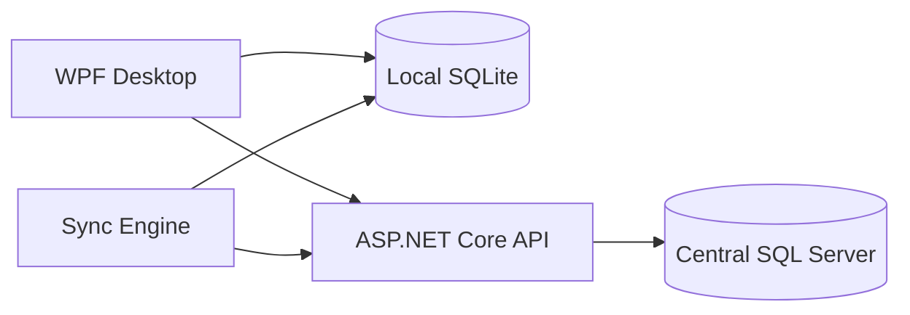

The important Release 2 change is the expanded domain inside the API and synchronized local data.

---

# 97. Release 2 C4 Component View

```text
ASP.NET Core API
|
+-- Authentication
+-- Authorization
|
+-- Customer Management
|   +-- Search
|   +-- Create
|   +-- Update
|   +-- History
|
+-- Booking Management
|   +-- Availability
|   +-- Create
|   +-- Confirm
|   +-- Check-in
|   +-- Cancel
|   +-- No-show
|   +-- Deposit
|
+-- Session Integration
|
+-- Invoice Integration
|
+-- Reporting
|
+-- Audit
|
+-- Synchronization
```

---

# 98. Release 2 Sequence — Create Customer

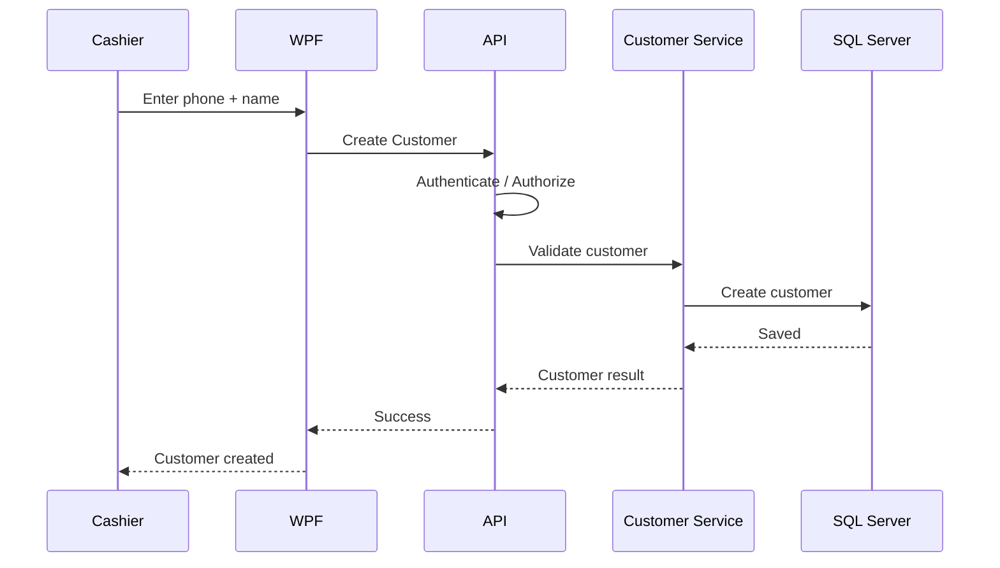

Offline version:

```text
Cashier
 ↓
WPF
 ↓
SQLite
 ↓
Sync Queue
```

---

# 99. Release 2 Sequence — Create Booking

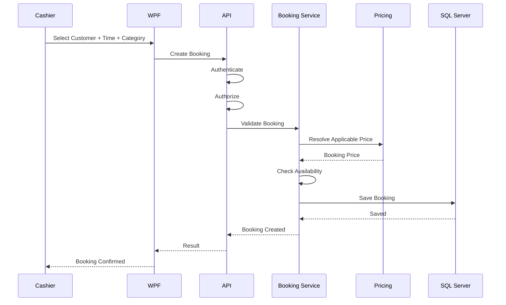

---

# 100. Release 2 Sequence — Booking Check-In

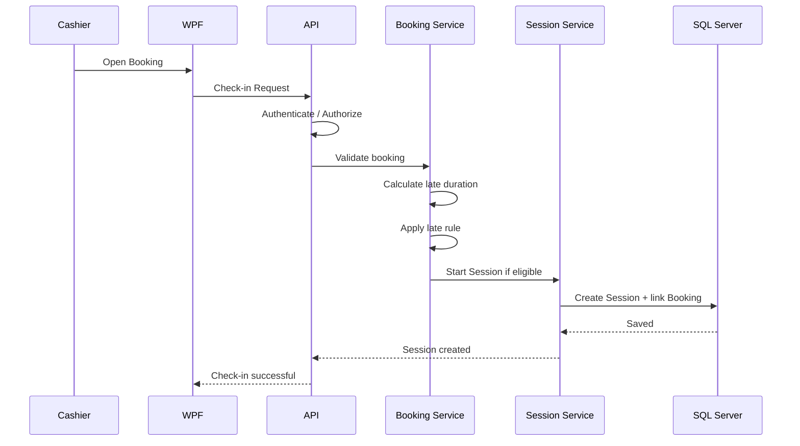

---

# 101. Release 2 Sequence — No-Show

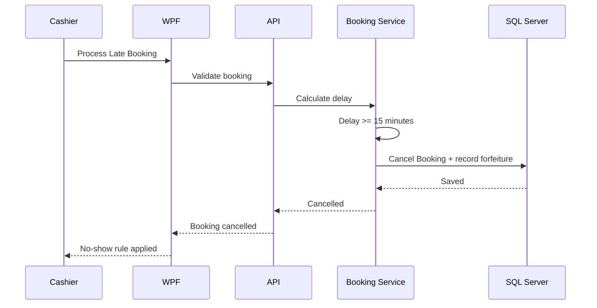

---

# 102. Release 2 Activity Diagram — Create Booking

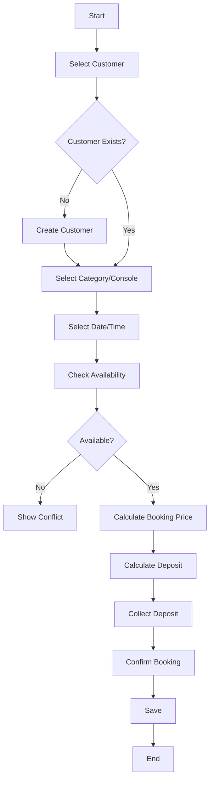

---

# 103. Release 2 Activity Diagram — Check-In

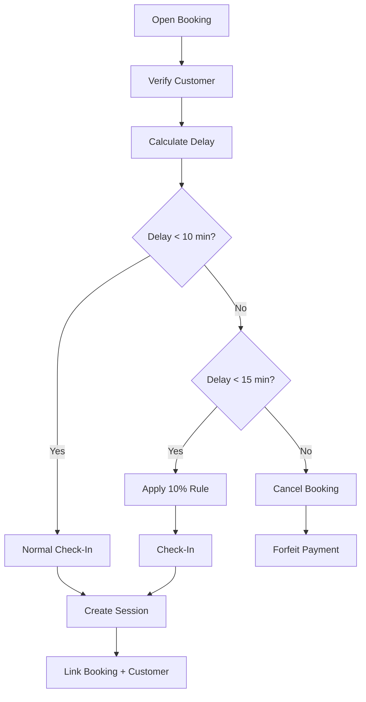

Boundary handling at exactly 10 and 15 minutes must be explicitly tested.

---

# 104. Release 2 State Diagram — Booking

```text
Pending
   ↓
Confirmed
   ↓
Arrived
   ↓
Active
   ↓
Completed

Confirmed
   ├──> Cancelled
   ├──> No-Show
   └──> Expired
```

---

# 105. Release 2 State Diagram — Customer Record

Customer itself is not a business workflow state machine in the same way as a booking.

Useful record status could be:

```text
Active
Inactive
```

Do not invent complex customer states unless the business needs them.

---

# 106. Release 2 ERD — Customer/Booking Extension

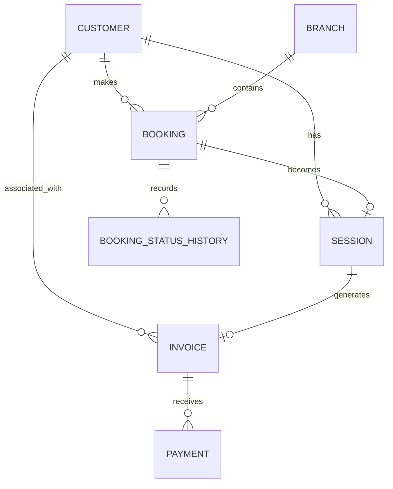

This should be merged into the actual database ERD during implementation.

---

# 107. Release 2 API Architecture

The API becomes a richer central boundary:

```text
Client
  ↓
ASP.NET Core API
  |
  +-- Customer
  +-- Booking
  +-- Session
  +-- Invoice
  +-- Payment
  +-- Reporting
  +-- Sync
  +-- Audit
  ↓
SQL Server
```

---

# 108. Release 2 Local Architecture

```text
WPF
 |
 +-- Customer data cache
 |
 +-- Booking data where offline-supported
 |
 +-- Local session data
 |
 +-- Local invoice data
 |
 +-- Sync queue
 |
 +-- Local authentication
```

The local data set must be minimized while remaining operationally sufficient.

---

# 109. Offline Customer Workflow

```text
Cashier enters phone
       ↓
Search local customer index
       ↓
Found?
   /       \
 Yes        No
 |           |
Open       Create local
profile    customer
             ↓
          Queue Sync
```

---

# 110. Offline Booking Workflow

Release 2 must not assume all booking operations are safe offline.

Conceptually:

```text
Booking Request
    ↓
Offline?
   /       \
 No         Yes
 |           |
Normal     Check offline policy
online        ↓
flow       Allowed?
           /      \
         Yes       No
          |         |
     Local booking  Explain
     + sync queue   unavailable
```

---

# 111. Synchronization — Customer History

Customer history is derived from synchronized entities.

Do not sync a giant "history" blob if it can be derived from:

```text
Customer
Bookings
Sessions
Invoices
Payments
Audit Events
```

Prefer synchronized source-of-truth entities.

---

# 112. Synchronization — Booking History

Booking status transitions should be represented safely.

A local update must preserve:

```text
Booking ID
Version / operation ID
Status transition
Actor
Timestamp
```

---

# 113. Duplicate Customer Handling

When a local customer is synchronized:

```text
Client Customer ID
+
Phone
```

should be used to detect whether the customer already exists.

Do not create a duplicate central customer just because the server did not immediately acknowledge the first operation.

---

# 114. Booking Sync Conflict

Example:

```text
Local Branch:
Booking slot A created offline

Central state:
Same slot already occupied

Sync:
Conflict detected
```

The system needs:

```text
Conflict status
Operational notification
Resolution path
Audit if manually resolved
```

Do not silently move the booking.

---

# 115. Security — Customer Search

The customer search API should return only data needed by the user.

Avoid returning:

```text
Entire customer history
All branches
Unnecessary financial details
```

for a simple phone lookup.

Use appropriate projections.

---

# 116. Security — Booking Changes

Booking modification must validate:

```text
User
Role
Permission
Branch
Booking status
Allowed transition
```

---

# 117. Audit Requirements

Release 2 should audit:

```text
Booking cancellation
Booking manual override
Booking deposit modification
No-show processing if manually triggered
Customer important-profile changes
Booking-to-session override
```

Not every customer search.

---

# 118. Release 2 Testing Strategy

Testing expands from operational behavior to customer/booking behavior.

Test layers:

```text
Unit
Integration
API
Database
UI
E2E
Offline
Sync
Security
Regression
UAT
```

---

# 119. Customer Test Cases

```text
TC-CUSTOMER-001
Create customer with valid phone + name.

TC-CUSTOMER-002
Reject customer without name.

TC-CUSTOMER-003
Find customer by phone.

TC-CUSTOMER-004
Handle existing customer lookup.

TC-CUSTOMER-005
Prevent or correctly handle duplicate customer.

TC-CUSTOMER-006
Customer history returns correct sessions.

TC-CUSTOMER-007
Customer history returns correct bookings.

TC-CUSTOMER-008
Unauthorized user cannot view unauthorized customer data.
```

---

# 120. Booking Test Cases

```text
TC-BOOKING-001
Create valid booking.

TC-BOOKING-002
Reject unavailable slot.

TC-BOOKING-003
VIP category appears only when configured.

TC-BOOKING-004
Standard category appears only when configured.

TC-BOOKING-005
Deposit is recorded correctly.

TC-BOOKING-006
Booking price is captured correctly.

TC-BOOKING-007
Customer can be linked to booking.

TC-BOOKING-008
Booking can be confirmed.

TC-BOOKING-009
Eligible booking can check in.

TC-BOOKING-010
Booking converts to session correctly.

TC-BOOKING-011
Late rule applies correctly.

TC-BOOKING-012
15-minute rule cancels booking.

TC-BOOKING-013
Forfeiture is recorded correctly.

TC-BOOKING-014
Booking state transitions are enforced.
```

---

# 121. Boundary Tests

Test exactly:

```text
9:59 late
10:00 late
10:01 late

14:59 late
15:00 late
15:01 late
```

The expected result must be documented and consistent.

---

# 122. Pricing Tests for Booking

Verify that a booking uses the correct:

```text
Branch
Console type
Category
Single/Multi if applicable
Pricing method
Price snapshot
Deposit calculation
```

---

# 123. Regression Testing

Every Release 2 change must ensure that existing operational behavior still works.

Regression should cover at minimum:

```text
Session creation
Session completion
Invoice creation
Cash payment
Pricing
Manager authorization
Offline operation
Synchronization
```

No Release 2 feature should silently break the existing session/invoice flow.

---

# 124. Offline Regression

Test:

```text
Release 1 operational workflow still works offline
+
Release 2 customer association works offline where allowed
```

Example:

```text
Offline
↓
Find customer
↓
Start session
↓
Complete
↓
Invoice
↓
Sync
```

---

# 125. Security Testing

Release 2 must verify:

```text
Customer branch isolation
Booking branch isolation
Unauthorized booking modification
Unauthorized customer modification
Manager-only booking overrides
Sensitive audit protections
API authorization
```

---

# 126. Performance Testing

Focus on:

```text
Customer search response
Booking availability queries
Customer history queries
Booking list queries
Large customer histories
Large booking histories
Sync backlog after offline activity
```

---

# 127. UAT — Customer Scenario

```text
Cashier receives customer
    ↓
Search phone
    ↓
Customer found
    ↓
Open history
    ↓
Create booking
    ↓
Select category if applicable
    ↓
Select time
    ↓
Pay deposit
    ↓
Confirm
```

---

# 128. UAT — Booking Arrival Scenario

```text
Open booking
    ↓
Customer arrives
    ↓
Check arrival time
    ↓
If on time → check in
    ↓
Start session
    ↓
Complete session
    ↓
Invoice
    ↓
Cash payment
    ↓
Customer history updated
```

---

# 129. UAT — Late Scenario

```text
Booking at 18:00
Customer arrives at 18:10
    ↓
Apply 10% rule

Booking at 18:00
Customer arrives at 18:15
    ↓
Cancel booking
    ↓
Forfeit payment
```

Exact boundary conditions must be tested.

---

# 130. UAT — Offline Customer Scenario

```text
Internet disconnects
    ↓
Search locally synchronized customer
    ↓
Associate customer with session
    ↓
Complete session
    ↓
Save locally
    ↓
Reconnect
    ↓
Sync
    ↓
Verify central history
```

---

# 131. UAT — Offline Booking Scenario

Only test offline booking according to the approved offline policy.

Possible:

```text
Offline booking allowed
    ↓
Create
    ↓
Queue
    ↓
Sync
    ↓
Conflict handling
```

or:

```text
Offline booking not allowed
    ↓
System clearly explains why
```

The chosen rule must be explicit before UAT.

---

# 132. Release 2 Documentation Set

The Release 2 documentation should contain:

## Product

```text
prd-release-2.md
release-2-scope.md
release-2-backlog.md
user-stories.md
acceptance-criteria.md
```

## Customer

```text
customer-domain.md
customer-rules.md
customer-history.md
```

## Booking

```text
booking-domain.md
booking-rules.md
booking-state-machine.md
booking-availability.md
booking-financial-rules.md
```

## UX

```text
customer-flows.md
booking-flows.md
wireframes/
screens.md
```

## Architecture

```text
release-2-architecture-impact.md
booking-sequence.md
customer-sequence.md
offline-booking.md
sync-design.md
```

## Database

```text
customer-schema.md
booking-schema.md
migration.md
data-dictionary-update.md
```

## API

```text
customer-api.md
booking-api.md
openapi-update.yaml
error-model-update.md
```

## Security

```text
customer-data-security.md
booking-security.md
authorization-update.md
audit-update.md
threat-model-update.md
```

## Testing

```text
release-2-test-plan.md
customer-test-cases.md
booking-test-cases.md
regression-plan.md
uat-release-2.md
offline-test-plan.md
sync-test-plan.md
```

## Deployment

```text
release-2-migration-plan.md
release-2-deployment.md
rollback-plan.md
```

---

# 133. Release 2 Backlog Structure

Recommended:

```text
EPIC: Customer Management
    Feature: Customer Search
    Feature: Customer Creation
    Feature: Customer Profile
    Feature: Customer History

EPIC: Booking
    Feature: Availability
    Feature: Booking Creation
    Feature: Deposit
    Feature: Confirmation
    Feature: Check-in
    Feature: Late Rules
    Feature: No-show
    Feature: Cancellation
    Feature: Booking-to-Session

EPIC: Integration
    Feature: Customer ↔ Session
    Feature: Customer ↔ Invoice
    Feature: Booking ↔ Session
    Feature: Booking ↔ Financials

EPIC: Offline / Sync
    Feature: Customer Offline
    Feature: Booking Offline Policy
    Feature: Sync
    Feature: Conflict Handling

EPIC: QA
    Feature: Regression
    Feature: UAT
    Feature: Security Testing
```

---

# 134. User Stories — Customer

```text
US-CUSTOMER-001

As a cashier,
I want to search for a customer by phone number,
so that I can quickly find their account.
```

```text
US-CUSTOMER-002

As a cashier,
I want to create a customer with a required name,
so that the customer can be reused in future visits.
```

```text
US-CUSTOMER-003

As a manager,
I want to view customer history within my authorized branch,
so that I can understand customer activity.
```

---

# 135. User Stories — Booking

```text
US-BOOKING-001

As a cashier,
I want to create a booking for a customer,
so that the customer can reserve gaming time.
```

```text
US-BOOKING-002

As a cashier,
I want the system to check booking availability,
so that I cannot create conflicting reservations.
```

```text
US-BOOKING-003

As a cashier,
I want to record the booking deposit,
so that the reservation has a financial commitment.
```

```text
US-BOOKING-004

As a cashier,
I want the system to apply the late-arrival rule,
so that the shop follows its booking policy consistently.
```

```text
US-BOOKING-005

As a cashier,
I want an eligible booking to become a gaming session,
so that the reservation flows into normal shop operation.
```

---

# 136. Acceptance Criteria — Customer Search

```text
Given a valid phone number
When the cashier searches
Then the matching customer is displayed.

Given no matching customer
When the cashier searches
Then the system offers customer creation.

Given an unauthorized branch context
When the user requests customer data
Then unauthorized records are not returned.
```

---

# 137. Acceptance Criteria — Create Booking

```text
Given an authorized user
And a valid customer
And a valid time
And available capacity

When the user creates a booking

Then:
- Booking is created
- Correct customer is linked
- Correct branch is linked
- Correct price is captured
- Deposit is recorded
- Booking status is correct
```

---

# 138. Acceptance Criteria — Late Rule

```text
Given a booking scheduled at a known time

When the customer is 10 minutes late

Then the configured 10% rule is applied according to the approved boundary rule.
```

```text
Given a booking scheduled at a known time

When the customer reaches the 15-minute cancellation threshold

Then:
- Booking is cancelled
- Payment/deposit is forfeited according to the approved financial rule
- Status is recorded
- Relevant audit data is recorded
```

---

# 139. Acceptance Criteria — Booking to Session

```text
Given a confirmed and eligible booking

When the customer checks in

Then:
- Booking becomes active/arrived according to the state model
- Session is created
- Customer is linked
- Booking is linked
- Correct branch is retained
- Billing uses the correct pricing context
```

---

# 140. Release 2 Security Design Questions

Before implementation, resolve:

```text
Is customer phone globally unique?
Who can edit customer name/phone?
Can cashier view all customer history?
Can manager view all customer history in branch?
Can customers be searched across branches?
Who can cancel a booking?
Who can edit a confirmed booking?
Who can change deposit?
Can booking price be manually overridden?
Does manual booking override require manager PIN?
```

---

# 141. Recommended Authorization Matrix

| Action | Cashier | Manager |
|---|---:|---:|
| Search Customer | Yes | Yes |
| Create Customer | Yes | Yes |
| Edit Basic Customer Data | Yes* | Yes |
| View Customer History | Limited | Yes |
| Create Booking | Yes | Yes |
| Confirm Booking | Yes/Configured | Yes |
| Cancel Booking | Limited | Yes |
| Manual Booking Override | Manager PIN | Yes |
| Change Deposit | No/Manager | Yes |
| Change Booking Price | No/Manager | Yes |
| Process No-Show | Yes/Configured | Yes |

`*` Exact editable fields must be approved.

---

# 142. Booking Financial Controls

Because booking introduces money before the session, Release 2 needs strict financial rules.

Questions to resolve:

```text
How is deposit recorded?
How is deposit applied to final invoice?
When is deposit considered revenue?
What happens at cancellation?
What happens at no-show?
What happens if the final session costs less than the deposit?
What happens if the final session costs more?
```

These are not UI questions. They are accounting/business rules.

---

# 143. Recommended Financial Concept

Conceptually:

```text
Booking
   ↓
Deposit Transaction
   ↓
Final Session
   ↓
Final Invoice
   ↓
Deposit Applied / Accounted For
   ↓
Remaining Amount Collected
```

The exact accounting entry depends on the business's policy.

---

# 144. Release 2 Data Integrity Rules

```text
A booking must belong to a valid customer.
A booking must belong to a valid branch.
A booking cannot use an invalid resource/category.
A booking cannot illegally overlap an exclusive allocation.
A booking cancellation must obey authorization.
A booking status transition must be valid.
A session linked to a booking must reference the correct booking.
A customer history query must derive correct source data.
```

---

# 145. Release 2 Migration Strategy

Database change process:

```text
Finalize Customer schema
        ↓
Finalize Booking schema
        ↓
Review existing Session/Invoice relationships
        ↓
Create migration
        ↓
Test migration on copy
        ↓
Test rollback/recovery strategy
        ↓
Deploy to staging
        ↓
Run regression
        ↓
Production
```

Never manually patch production schema without recording the change.

---

# 146. Backward Compatibility

Existing Release 1 records must remain valid.

Example:

```text
Old Session
CustomerId = NULL
BookingId = NULL
```

This is valid.

A walk-in transaction should not become invalid just because Release 2 introduces customers/bookings.

---

# 147. Nullable Customer Relationship

Customer should likely be optional for historical walk-ins:

```text
Session.CustomerId = NULL
```

unless the business decides every session must require a customer.

This is an explicit design choice.

---

# 148. Booking-to-Session Consistency

For a session created from booking:

```text
Session.BookingId = Booking.Id
Session.CustomerId = Booking.CustomerId
```

unless there is an approved operational exception.

The API must validate consistency.

---

# 149. Booking Cancellation Consistency

When a booking is cancelled:

```text
Booking.Status = Cancelled
```

It must not accidentally create or modify an unrelated active session.

---

# 150. Customer History Consistency

When an old session exists:

```text
CustomerId = NULL
```

it should remain valid and simply not appear in a customer's history.

When a new session has:

```text
CustomerId = X
```

it should appear in that customer's history after synchronization.

---

# 151. Release 2 Observability

Monitor new operational signals:

```text
Customer API errors
Booking creation failures
Availability conflicts
Deposit processing failures
Booking sync conflicts
Customer sync duplicates
Customer history query latency
```

---

# 152. Release 2 Support Runbooks

Create runbooks for:

## Booking Conflict

```text
Check booking state
Check resource/category
Check central availability
Check sync status
Determine source of conflict
Resolve according to approved policy
Record resolution
```

## Customer Duplicate

```text
Identify records
Validate phone
Determine authoritative record
Preserve history
Apply approved merge procedure if available
Audit action
```

## Booking Deposit Problem

```text
Check booking
Check deposit record
Check payment state
Check invoice state
Determine financial discrepancy
Escalate if required
```

---

# 153. Release 2 Performance Targets

The exact numeric targets are TBD.

Measure:

```text
Customer search latency
Booking availability latency
Booking creation latency
Customer history latency
Booking list latency
Offline sync throughput
Conflict processing time
```

---

# 154. Release 2 Pilot Strategy

Release 2 should first go to:

```text
Existing pilot/customer environment
```

before a broad rollout.

Recommended:

```text
Staging
   ↓
Pilot
   ↓
Observe customer/booking workflows
   ↓
Fix critical issues
   ↓
Release
```

---

# 155. Release 2 Rollback Strategy

Because Release 2 includes database changes:

```text
Backup
   ↓
Migration
   ↓
Deploy
   ↓
Validate
```

If deployment fails:

```text
Stop rollout
   ↓
Assess data state
   ↓
Rollback application or apply corrective migration
   ↓
Restore service
   ↓
Verify customer/booking data
```

Database rollback must not be assumed to be a simple "down migration"; financial/customer data needs careful recovery planning.

---

# 156. Release 2 Definition of Ready

Customer/Booking feature is Ready when:

```text
Business rule understood
UX flow defined
Acceptance criteria defined
Security impact known
Database impact known
API impact known
Offline impact known
Sync impact known
Financial impact known
```

---

# 157. Release 2 Definition of Done

```text
Feature implemented
API implemented
WPF implemented
Validation implemented
Authorization implemented
Offline behavior handled where applicable
Sync handled
Relevant tests pass
Regression passes
Documentation updated
Audit rules implemented where required
No critical known issues
```

---

# 158. Release 2 Production Readiness

Before deployment:

```text
Customer schema reviewed
Booking schema reviewed
Financial booking rules reviewed
Security reviewed
API authorization reviewed
Offline policy reviewed
Sync conflict strategy tested
Regression passed
UAT passed
Backup verified
Migration tested
Rollback/recovery documented
Training updated
Support runbooks updated
```

---

# 159. Release 2 Milestones

معالم Release 2: العملاء والبحث → التاريخ → الحجز والعربون → التأخير/الإلغاء والتحويل لجلسة → اختبار المستخدم والإطلاق.

في كل معلم تُنفّذ الصلاحيات والاختبارات وسياسة الأوفلاين والمزامنة المتعلقة به. سياسة حجز دون اتصال يجب حسمها قبل بناء الحجز، ولا يكفي توفر بيانات قديمة لضمان حجز مؤكد. يعتمد الإصدار على [R1](R1_OPERATIONAL_MVP.md) و[ADR-01](BUSINESS_RULES(1).md) ولا يعيد تصميمهما.

---

# 160. Release 2 Deliverables

The product deliverable includes:

```text
Updated WPF application
Updated ASP.NET Core API
Updated SQL Server schema
Updated SQLite schema
Database migrations
Customer module
Customer history
Booking module
Deposit handling
Booking/session integration
Updated reports where required
Updated sync
Updated security policies
Updated tests
Updated documentation
Updated user/manager guides
Deployment package
```

---

# 161. Release 2 UI Screen Inventory

## Customer

```text
Customer Search
Customer List
Customer Create
Customer Edit
Customer Details
Customer History
```

## Booking

```text
Booking List
Create Booking
Booking Details
Check-In
Late Status
Cancel Booking
```

## Existing Operational Screens

Existing session/invoice screens should be updated only where required for:

```text
Customer selection
Booking context
Customer history access
```

Do not redesign unrelated stable screens without a validated reason.

---

# 162. UI Information Architecture

Candidate:

```text
Dashboard

Operations
├── Sessions
├── Bookings
├── Customers
└── Invoices

Management
├── Consoles
├── Pricing
├── Users
├── Expenses
└── Assets

Reports
├── Revenue
├── Expenses
├── Profit
├── Sessions
└── Booking / Customer reports
```

Exact navigation depends on permissions and usability testing.

---

# 163. Customer Interaction Design

The cashier workflow should prefer:

```text
Phone-first search
```

rather than:

```text
Long customer form first
```

Reason:

Most existing customers should be found quickly.

---

# 164. Booking Interaction Design

The cashier should complete booking with as few unnecessary steps as possible:

```text
Customer
→ Time
→ Category/resource
→ Price
→ Deposit
→ Confirm
```

Availability feedback should appear before payment where practical.

---

# 165. Booking Error Messages

Examples:

```text
This time slot is no longer available.

This booking has already been checked in.

This booking is outside the allowed arrival window.

Manager authorization is required for this action.

The booking could not be synchronized.
```

Do not expose raw exceptions.

---

# 166. Offline UI

For customer/booking functions:

```text
Customer data available offline
Booking operation available offline
Booking operation unavailable offline
Pending synchronization
Conflict detected
```

The UI must clearly communicate which state applies.

---

# 167. Documentation Traceability

For every Release 2 feature:

```text
Business Requirement
      ↓
PRD
      ↓
User Story
      ↓
UX Flow
      ↓
API
      ↓
Database
      ↓
Security
      ↓
Implementation
      ↓
Test
      ↓
UAT
```

---

# 168. ADR Candidates for Release 2

Create ADRs for decisions such as:

```text
ADR-R2-001
Customer phone lookup strategy

ADR-R2-002
Customer identity vs internal database ID

ADR-R2-003
Booking pricing snapshot

ADR-R2-004
Booking deposit representation

ADR-R2-005
Booking availability algorithm

ADR-R2-006
Offline booking policy

ADR-R2-007
Booking sync conflict strategy

ADR-R2-008
Customer duplicate handling

ADR-R2-009
Booking-to-session relationship
```

---

# 169. Release 2 Risks

| Risk | Probability | Impact | Mitigation |
|---|---:|---:|---|
| Booking conflict | High | High | Availability + concurrency |
| Offline booking conflict | High | High | Explicit offline policy |
| Customer duplicates | Medium | High | Phone-based lookup + deduplication |
| Deposit double-counting | Medium | Critical | Explicit financial model |
| Late-rule ambiguity | Medium | High | Boundary requirements + tests |
| Customer data leakage | Medium | High | Authorization + projections |
| Release 1 regression | Medium | High | Regression suite |
| Sync failure | Medium | High | Idempotency + retry |
| Scope creep | High | High | Release 2 scope control |

---

# 170. Release 2 Quality Gates

## Gate 1 — Requirements

```text
Customer requirements clear
Booking requirements clear
Financial deposit rules clear
Late rules clear
```

## Gate 2 — Design

```text
UX approved
Database reviewed
API reviewed
Security reviewed
Offline policy decided
```

## Gate 3 — Development

```text
Feature complete
Tests passing
Migration tested
```

## Gate 4 — UAT

```text
Customer workflows pass
Booking workflows pass
Offline workflows pass
Financial workflows pass
```

## Gate 5 — Production

```text
Backup verified
Migration ready
Rollback/recovery ready
Support ready
```

---

# 171. Release 2 Change Log Model

Maintain:

```text
R2-CHANGE-001
Description
Reason
Affected Modules
Database Impact
API Impact
Security Impact
Offline Impact
Decision
Status
```

This keeps the release controlled.

---

# 172. Release 2 Bug Workflow

Production bug:

```text
Bug Report
   ↓
Severity
   ↓
Reproduce
   ↓
Root Cause
   ↓
Fix
   ↓
Regression Test
   ↓
Patch
```

Customer/booking critical financial bugs should receive priority.

---

# 173. Release 2 Regression Baseline

Before each release candidate verify:

```text
Login
Lock / user switching
Console management
Pricing
Session
Invoice
Cash payment
Manager override
Expenses
Basic reports
Offline operation
Synchronization
```

Then add:

```text
Customer
Customer history
Booking
Deposit
Late rules
Booking-session flow
```

---

# 174. Release 2 Release Candidate Checklist

```text
[ ] Customer search works
[ ] Customer creation works
[ ] Customer profile works
[ ] Customer history works
[ ] Booking creation works
[ ] Availability works
[ ] Deposit works
[ ] Booking price captured
[ ] Confirmation works
[ ] Check-in works
[ ] Late rule works
[ ] 15-minute cancellation rule works
[ ] Booking-to-session works
[ ] Customer-session relation works
[ ] Customer-invoice relation works
[ ] Offline customer behavior works
[ ] Offline booking policy works
[ ] Synchronization works
[ ] Duplicate handling works
[ ] Security tests pass
[ ] Regression passes
[ ] UAT passes
[ ] Migration tested
[ ] Backup verified
[ ] Deployment ready
```

---

# 175. Release 2 Customer Guide Updates

Update customer-facing operational training for staff.

## Cashier

```text
Search customer
Create customer
Open customer
Create booking
Check booking
Check-in
Handle late customer
Complete booking session
```

## Manager

```text
Customer history
Booking oversight
Booking cancellation
Deposit oversight
Manual booking overrides
Reports
```

---

# 176. Release 2 Support Runbooks

At minimum:

```text
Customer duplicate
Booking conflict
Booking not visible
Booking check-in failure
Deposit mismatch
Booking sync failure
Customer sync failure
Customer history mismatch
```

---

# 177. Release 2 Monitoring

Monitor:

```text
Customer search failures
Booking creation failures
Availability conflicts
Booking sync conflicts
Customer duplicate conflicts
Deposit processing failures
Customer history query latency
Booking API latency
```

---

# 178. Release 2 Release Notes

Release notes should explain:

```text
New Customer Accounts
Customer History
Bookings
Deposit handling
Late arrival rules
Booking-to-session workflow
Offline/sync updates
Bug fixes
Known issues
```

Do not include features that are not actually in the release.

---

# 179. Final Release 2 Architecture

```text
                         +90 PS Release 2
                                |
                +---------------+---------------+
                |                               |
          WPF Desktop                       Central API
                |                               |
        +-------+-------+                +------+------+
        |               |                |             |
     SQLite         Sync Engine      Customer       Booking
                                        |             |
                                        +------+------+
                                               |
                                      Session / Invoice
                                               |
                                               v
                                           SQL Server
```

---

# 180. Final Release 2 Domain Model

```text
Owner / Branch Context
        |
        +-- Customer
        |     |
        |     +-- Booking
        |     |
        |     +-- Session
        |     |
        |     +-- Invoice
        |
        +-- Console
        |
        +-- Pricing
        |
        +-- Expenses
```

The customer/booking domain integrates with the existing operational domain instead of replacing it.

---

# 181. Final Release 2 End-to-End Flow

```text
Customer
   ↓
Phone Lookup
   ↓
Customer Account
   ↓
Booking
   ↓
Availability
   ↓
Deposit
   ↓
Confirmation
   ↓
Arrival
   ↓
Late Rule
   ↓
Check-In
   ↓
Session
   ↓
Invoice
   ↓
Cash Payment
   ↓
Customer History
   ↓
Synchronization
```

---

# 182. Release 2 Success Definition

Release 2 is successful when the shop can:

```text
Recognize customers quickly
Maintain customer accounts
View relevant customer history
Create bookings
Check availability
Collect and track deposits
Apply late-arrival rules
Handle no-shows
Convert eligible bookings into sessions
Connect customers to sessions
Connect customers to invoices
Keep financial state correct
Keep branch data secure
Continue approved offline workflows
Synchronize safely
```

---

# 183. Final Release 2 Source of Truth

The following are confirmed Release 2 requirements:

```text
1. Release 2 is an incremental release, not a rewrite.
2. Customer Accounts are part of Release 2.
3. Customer History is part of Release 2.
4. Bookings are part of Release 2.
5. Customer phone number is the primary lookup/key.
6. Customer name is required.
7. Customer accounts do not imply customer login.
8. Membership is not part of this release.
9. Booking supports VIP/Standard when a branch offers those categories.
10. If a branch does not differentiate categories, unnecessary category selection should be hidden.
11. Booking requires a customer.
12. Booking requires a time.
13. Booking requires availability validation.
14. Customer pays a booking deposit.
15. At 10 minutes late, the current rule is a 10% charge.
16. At 15 minutes late, the booking is cancelled.
17. At the 15-minute threshold, payment/deposit is forfeited according to the approved financial rule.
18. Booking has explicit states.
19. Booking can become a session.
20. Session should retain Booking context when applicable.
21. Session can retain Customer context when applicable.
22. Customer history should be derived from operational source records where practical.
23. Booking pricing should be captured rather than silently changing with future branch pricing.
24. Customer data must respect branch/role authorization.
25. Booking changes must respect branch/role authorization.
26. Sensitive booking operations should be auditable.
27. Release 2 must preserve existing operational behavior.
28. Existing walk-in sessions may remain without customer/booking links if allowed.
29. Customer/booking synchronization must be idempotent.
30. Customer duplicates must be handled explicitly.
31. Booking conflicts must not be silently overwritten.
32. Offline booking requires an explicit policy because availability conflicts make it harder than ordinary offline sessions.
33. Release 2 requires regression testing against the existing operational baseline.
34. Release 2 requires UAT.
35. Release 2 requires migration planning.
36. Release 2 requires updated documentation.
```

---

# 184. Final Release 2 Principle

The guiding principle is:

> **Add customer and booking intelligence to a working operational product without destabilizing the system that the shop already depends on.**

The Release 2 lifecycle is:

```text
Customer Need
   ↓
Business Rule
   ↓
PRD
   ↓
Customer/Booking UX
   ↓
Domain Design
   ↓
Database/API Design
   ↓
Security
   ↓
Offline/Sync Design
   ↓
Development
   ↓
Regression
   ↓
UAT
   ↓
Pilot
   ↓
Production
```

---

# 185. End of Release 2 Master Specification

This document intentionally stops at Release 2 scope.

The purpose of this file is to define the customer/account/booking expansion of +90 PS as a controlled, testable, secure, and deployable product release.
````

### Source 071 — Project.Docs/Releases/R3_FULL_PRODUCT.md

Original size: 87341 bytes. SHA-256: `f1984e011b00f79182a4e8bac404f5d07d5e0e59b9499a67f346cdd5c8cc60c1`.

````text
# تحديث الخطة — 2026-09-06

نسخة مراجعة مستقلة؛ الأصول لم تُعدّل. [ابدأ هنا](README(1).md) · [القواعد المشتركة](BUSINESS_RULES(1).md) · [القرارات المفتوحة](DECISIONS.md) · [التغييرات](CHANGELOG.md).

حالة الدليل: المتطلبات الجديدة المؤكدة من المستخدم مذكورة بمصدرها في SHARED_RULES. بقية المحتوى الموروث يحتفظ بحالته السابقة، وليس اعتمادًا جديدًا. مخططات البنية العامة تمثل اتصال المكونات؛ ترتيب كتابة عمليات الفرع تحدده ADR-01 والمخططات المحدّثة، ولا يُستنتج من سهم عام WPF/API.

---

# +90 PS — Release 3 Master Project File
## Full Product — Complete Multi-Branch Platform, Architecture, Security, Finance, Customers, Booking, Assets, Plans, Analytics & Operations

> **Project:** +90 PS  
> **Release:** Release 3 — Full Product  
> **Document Type:** Master Full-Product Specification  
> **Planning Date:** 2026-09-04  
> **Development Model:** Solo Developer with professional engineering practices  
> **Product Goal:** Build the complete mature +90 PS platform capable of supporting PlayStation shops, owners, managers and employees across a scalable multi-branch environment with strong financial controls, customer management, bookings, asset management, offline operation, synchronization, reporting, security, deployment, support, and future client applications.

---

# 0. Purpose

This document defines **Release 3 only**.

Release 3 represents the intended **complete +90 PS product** rather than a limited operational MVP.

The product is designed to support:

- One shop
- Multiple branches
- Owners with multiple locations
- Branch-specific configuration
- Branch-specific pricing
- Console management
- Single/Multi pricing
- Hourly pricing
- Match pricing
- Customer accounts
- Customer history
- Bookings
- VIP / Standard configurations
- Deposits
- Late-arrival rules
- Session management
- Invoices
- Cash payments
- Discounts
- Shifts
- Cash reconciliation
- Expenses
- Revenue
- Profit
- Asset/equipment management
- Quantity-based inventory
- Inter-branch transfers
- Employee/assignment transfers
- Advanced reports
- Email report delivery
- Advanced analytics
- Strong role/permission security
- Manager authorization
- Audit logging
- Offline operation
- Local SQLite
- Central ASP.NET Core API
- Central SQL Server
- Reliable synchronization
- Conflict handling
- Idempotency
- Monitoring
- Backups
- Disaster recovery
- Automated deployment/update
- Product plans/packages
- Feature entitlements
- Optional accounting integration
- Future web client
- Future mobile client
- Centralized operations and support

---

# 1. Full Product Mission

The final product should allow an owner to operate and understand their PlayStation business without depending on manual spreadsheets or disconnected systems.

The final platform must answer:

```text
What branches exist?
Who owns them?
Who works in each branch?
What consoles exist?
What are the current prices?
What sessions are active?
What bookings are coming?
Which customers are returning?
What revenue was generated?
What expenses were recorded?
What is the profit?
What assets does each branch have?
What was transferred between branches?
Who performed a sensitive action?
What happened while a branch was offline?
Did all offline data synchronize correctly?
Which branches are healthy?
Which branches are offline?
How is the business performing?
```

---

# 2. Product Definition

+90 PS is a multi-client business platform.

Core architecture:

```text
                       +90 PS
                          |
          +---------------+---------------+
          |               |               |
       Desktop          Web            Mobile
          |               |               |
          +---------------+---------------+
                          |
                          v
                 ASP.NET Core API
                          |
              +-----------+-----------+
              |                       |
              v                       v
         Business Domain          Reporting
              |
              v
        Central SQL Server
```

Branch resilience:

```text
Branch PC
   |
   +-- WPF Desktop
   |
   +-- Local SQLite
   |
   +-- Offline Operations
   |
   +-- Sync Engine
```

---

# 3. Product Philosophy

The final product follows these principles:

```text
Correctness
Security
Reliability
Auditability
Offline resilience
Scalability
Maintainability
Usability
Traceability
Recoverability
```

The objective is not maximum feature count.

The objective is a complete product where every business capability has a coherent:

```text
Requirement
+
Workflow
+
Domain Model
+
UI
+
API
+
Database
+
Security
+
Testing
+
Operational support
```

---

# 4. Business Structure

The platform supports owners/businesses with one or multiple branches.

Conceptual structure:

```text
Owner / Business
        |
        +-- Branch 01
        +-- Branch 02
        +-- Branch 03
        +-- ...
        +-- Branch 40+
```

Each branch has its own:

- Employees
- Consoles
- Pricing
- Sessions
- Bookings
- Customers/activity
- Invoices
- Expenses
- Assets
- Operational settings

The owner can view authorized cross-branch information.

---

# 5. Branch Model

Every branch has a unique identity.

Potential branch data:

```text
BranchId
OwnerId
Name
Address
Phone
Timezone
Currency
Opening configuration
Pricing configuration
Booking configuration
Operational settings
Status
CreatedAt
UpdatedAt
```

A branch must never be confused with the owner/business itself.

---

# 6. Ownership Model

An owner can have:

```text
One branch
```

or:

```text
Multiple branches
```

The product must support the transition from:

```text
Owner
  └── Branch A
```

to:

```text
Owner
  ├── Branch A
  └── Branch B
```

without redesigning the core system.

---

# 7. Multi-Branch Capability

For businesses with multiple branches, the product can support capabilities such as:

```text
Branch switching
Aggregated reporting
Cross-branch visibility
Asset quantity transfers
Employee transfers/assignments
Centralized management
Cross-branch monitoring
Centralized configuration
```

Access must always be constrained by ownership and authorization.

---

# 8. Plan / Package System

The product should support four commercial packages.

The exact package names, pricing and commercial terms are intentionally not fixed in this technical specification.

Conceptually:

```text
Package 1
Package 2
Package 3
Package 4
```

A plan contains:

```text
Entitlements
Feature Availability
Usage Limits where applicable
```

Example:

```text
Plan
  |
  +-- Multi-Branch
  +-- Asset Transfer
  +-- Advanced Reports
  +-- Advanced Analytics
  +-- Email Reports
  +-- Accounting Integration
```

The actual feature matrix is defined by the product/business team.

---

# 9. Entitlement Architecture

Do not scatter plan checks throughout the application.

Use:

```text
Plan
   ↓
Entitlements
   ↓
Feature Access
```

Separately:

```text
User
   ↓
Role
   ↓
Permission
```

Therefore final authorization concept:

```text
User
+
Role
+
Permission
+
Branch Scope
+
Product Entitlement
```

---

# 10. Permission vs Entitlement

## Permission

Answers:

> Is this user allowed to perform this action?

Example:

```text
Manager.ChangePricing
```

## Entitlement

Answers:

> Does this customer's plan include this capability?

Example:

```text
MultiBranch.TransferAssets
```

## Feature Flag

Answers:

> Is this capability currently enabled for rollout/testing?

These concepts remain separate.

---

# 11. Users and Roles

Final role hierarchy can include:

```text
Owner
Manager
Cashier
```

Additional administrative/system roles can be introduced only when justified.

Roles are not enough by themselves.

Use explicit permissions.

---

# 12. Owner

Owner can access authorized business/branch information.

Potential capabilities:

```text
View branches
View aggregated reports
Manage branch relationships
Review financial performance
Review sensitive audit events
Manage plans/entitlements where applicable
Review operational health
```

Owner access must never expose an unrelated business.

---

# 13. Manager

Manager operates within one or more explicitly authorized branches.

Potential capabilities:

```text
Manage users
Manage consoles
Manage pricing
Manage bookings
Manage customers
Manage expenses
Manage assets
View reports
Approve protected operations
Cancel/void invoices
Authorize manual discounts
Approve session transfers
Perform branch administration
```

---

# 14. Cashier

Cashier performs daily operational work:

```text
Login
Lock/unlock
Start session
Pause
Resume
Complete
Create invoice
Receive cash
Apply allowed discount
Work with customers
Work with bookings
Work with shifts
```

Any sensitive operation requiring elevated authorization must be protected.

---

# 15. Shared Device Identity

A branch may use one physical PC with many cashiers.

The product uses application-level identities.

Example:

```text
Cashier A
    ↓
Working
    ↓
Lock Screen
    ↓
Cashier B enters PIN
    ↓
Cashier B becomes Active User
```

The current application user determines:

```text
Permissions
Session responsibility
Shift responsibility
Audit identity
```

---

# 16. Authentication

Authentication supports:

```text
Manager
Cashier
Owner where appropriate
```

Local branch authentication must remain usable during approved offline conditions.

Credential requirements:

```text
No plaintext PINs
Protected local storage
Secure verification
Failed-attempt policy
Lockout policy
Secure reset/recovery
```

---

# 17. Authorization

Authorization must be enforced server-side.

The WPF UI may hide unavailable operations, but the API must independently enforce:

```text
Role
Permission
Branch
Entity ownership
Plan entitlement
Business state
```

---

# 18. Branch Isolation

A user must never obtain another branch's data by changing a client-supplied ID.

Example:

```text
User authorized for Branch A

Request:
GET /api/invoices?branchId=Branch B

Result:
Forbidden
```

The backend must derive and validate branch scope.

---

# 19. Console Management

Each branch can have a variable number of consoles.

Examples:

```text
PS4-01
PS4-02
PS5-01
PS5-02
```

Console information may include:

```text
Id
BranchId
Name
ConsoleType
Category
Status
IsActive
Asset reference
Notes
CreatedAt
UpdatedAt
```

---

# 20. Console States

Candidate operational states:

```text
Available
Reserved
Active
Maintenance
Disabled
```

The final state model should distinguish:

```text
Physical equipment status
```

from:

```text
Session/booking status
```

so that a console is not forced into one overloaded status field.

---

# 21. Pricing Model

Pricing depends on:

```text
Branch
+
Console Type
+
Mode
+
Pricing Method
```

Minimum types:

```text
PS4
PS5
```

Modes:

```text
Single
Multi
```

Methods:

```text
Hourly
Match
```

---

# 22. Pricing Matrix

Possible combinations:

```text
PS4 + Single + Hourly
PS4 + Multi  + Hourly
PS5 + Single + Hourly
PS5 + Multi  + Hourly

PS4 + Single + Match
PS4 + Multi  + Match
PS5 + Single + Match
PS5 + Multi  + Match
```

A branch can enable only the combinations it actually uses.

---

# 23. Branch-Specific Pricing

Example:

```text
Branch A
PS4 Single Hourly = 100
PS4 Multi  Hourly = 150
PS5 Single Hourly = 150
PS5 Multi  Hourly = 200
```

Branch B can use completely different values.

Only authorized users can modify pricing.

---

# 24. Pricing History

Price changes must not erase historical financial meaning.

Recommended approach:

```text
Pricing Version
     ↓
Effective From
     ↓
Effective To
```

A completed/active transaction should preserve the price that was applicable to that transaction.

This prevents later price changes from altering historical invoices.

---

# 25. Hourly Pricing

المرجع الوحيد للحساب هو [BR-TIME-001 وBR-TIME-002](BUSINESS_RULES(1).md).

Open: يبدأ بلا نهاية محددة، وينتهي بطلب العميل. للوقت بالساعات نحسب المدة الفعلية أولًا، ثم نقرب **للأعلى فقط** إذا كان المتبقي إلى ربع الساعة التالي ثلاث دقائق أو أقل؛ خلاف ذلك نستخدم المدة الفعلية. المدة الموجودة بالفعل على علامة ربع ساعة تبقى كما هي.

أمثلة بصيغة ساعات:دقائق: `2:27 → 2:30`، `2:20 → 2:20`، `2:42 → 2:45`، `2:57 → 3:00`. لا تقريب لأسفل ولا إهمال تلقائي للساعة غير المكتملة.

التعامل مع الثواني، والتوقف المؤقت، والحد الأدنى، وتقريب مبلغ العملة ما زال مفتوحًا في [سجل القرارات](DECISIONS.md). تلك الأسئلة تمنع إقفال الحساب الإنتاجي فقط، وليس العمل المستقل.

---

# 26. Match Pricing

Match تسعير مستقل عن Hourly. المستندات السابقة تقترح سعرًا ثابتًا ومدة يضبطها الفرع. وصف المستخدم يثبت أن الموظف قد يستخدم مؤقتًا تقريبيًا مثل 10 دقائق أو ينهي العملاء المباراة بأنفسهم؛ لا يثبت أن انتهاء المؤقت يجب أن ينهي الجلسة آليًا.

نحتفظ بقدرة التسعير بالماتش في Release 1. تحديد النهاية، وعدّ الماتشات المتتالية، والتمديد، والفاتورة المجمعة ينتظر O-04 في [سجل القرارات](DECISIONS.md). أرقام 10 و12 أمثلة إعدادات وليست مدة إلزامية أو تعريفًا نهائيًا للمباراة.

---

# 27. Single / Multi

Single and Multi must be independent pricing contexts.

Example:

```text
PS4 Single = 100
PS4 Multi  = 150

PS5 Single = 150
PS5 Multi  = 200
```

The data model must not assume one price per console type.

---

# 28. Session Management

A gaming session can move through states such as:

```text
Available
Active
Paused
Completed
Cancelled
```

Flow:

```text
Available
    ↓
Active
    ↓
Paused
    ↓
Active
    ↓
Completed
```

Only valid transitions are allowed.

---

# 29. Session Ownership

Session records preserve:

```text
OpenedByUser
CurrentResponsibleUser
Branch
Console
Pricing
Customer where applicable
Booking where applicable
```

This enables operational accountability.

---

# 30. Session Timing

The system must support:

```text
Start
Pause
Resume
Complete
```

Multiple pauses should be modeled correctly rather than overwriting one timestamp.

A timing-history design may be required:

```text
Session
    |
    +-- SessionInterval
            |
            +-- Start
            +-- End
```

This is a design option and should be chosen based on the final billing algorithm.

---

# 31. Session Price Snapshot

When a session begins, it should normally preserve the applicable pricing context.

Example:

```text
Session starts:
150 EGP/hour

Current price later changes:
170 EGP/hour
```

The active session remains financially consistent with its captured pricing context.

---

# 32. Booking

Booking represents a reservation of gaming availability for a customer.

Core relationship:

```text
Customer
   ↓
Booking
   ↓
Session
   ↓
Invoice
   ↓
Payment
```

---

# 33. Booking Categories

A branch can offer categories such as:

```text
VIP
Standard
```

If the branch has these categories:

```text
Customer selects category
```

If not:

```text
Do not show an unnecessary category choice
```

---

# 34. Booking Target

The product may support:

```text
Category-based booking
```

and, where configured:

```text
Specific-console booking
```

Category-based booking example:

```text
Customer
  ↓
VIP
  ↓
System allocates suitable available console
```

Console-specific:

```text
Customer
  ↓
PS5-04
```

---

# 35. Booking Availability

Before confirming a booking:

```text
Branch
  ↓
Category/Console
  ↓
Date/Time
  ↓
Availability
```

The system must prevent invalid overlapping reservations.

---

# 36. Booking Deposit

هذه قدرة موروثة من [Release 2](R2_EXPANDED_MVP.md)، الذي يملك تعريف العربون والتأخير وحدود 10/15 دقيقة والمعالجة المالية. لا يعرّف R3 سياسة بديلة؛ أي تغيير لاحق يُسجّل كتغيير صريح مع اختبارات ترحيل ورجوع. المعالجة النهائية والأسئلة غير المحسومة في O-14 داخل [DECISIONS](DECISIONS.md).

---

# 37. Booking Price Snapshot

A booking should preserve the agreed price when created.

Example:

```text
Booking Price:
300 EGP
```

Later branch pricing:

```text
350 EGP
```

The existing booking should remain at its captured price unless an authorized business change is made.

---

# 38. Late Arrival Policy

هذه قدرة موروثة من [Release 2](R2_EXPANDED_MVP.md)، الذي يملك تعريف العربون والتأخير وحدود 10/15 دقيقة والمعالجة المالية. لا يعرّف R3 سياسة بديلة؛ أي تغيير لاحق يُسجّل كتغيير صريح مع اختبارات ترحيل ورجوع. المعالجة النهائية والأسئلة غير المحسومة في O-14 داخل [DECISIONS](DECISIONS.md).

---

# 39. Late Arrival Calculation

هذه قدرة موروثة من [Release 2](R2_EXPANDED_MVP.md)، الذي يملك تعريف العربون والتأخير وحدود 10/15 دقيقة والمعالجة المالية. لا يعرّف R3 سياسة بديلة؛ أي تغيير لاحق يُسجّل كتغيير صريح مع اختبارات ترحيل ورجوع. المعالجة النهائية والأسئلة غير المحسومة في O-14 داخل [DECISIONS](DECISIONS.md).

---

# 40. Booking State Machine

Candidate states:

```text
Pending
Confirmed
Arrived
Active
Completed
Cancelled
No-Show
Expired
```

Flow:

```text
Pending
   ↓
Confirmed
   ↓
Arrived
   ↓
Active
   ↓
Completed
```

Alternative exits:

```text
Confirmed → Cancelled
Confirmed → No-Show
Confirmed → Expired
```

---

# 41. Booking Check-In

Flow:

```text
Open Booking
    ↓
Verify Customer
    ↓
Calculate Arrival Delay
    ↓
Apply Late Policy
    ↓
Eligible?
   /     \
 Yes      No
 |         |
Check-in  Cancel/Forfeit
 ↓
Start Session
```

---

# 42. Booking to Session

A valid booking may become a session.

```text
Booking
   ↓
Customer Arrives
   ↓
Validate
   ↓
Allocate Console/Category
   ↓
Create Session
   ↓
Session.BookingId = Booking.Id
   ↓
Session.CustomerId = Booking.CustomerId
```

---

# 43. Walk-In Sessions

Not every session needs a booking.

Therefore:

```text
Walk-in Session
BookingId = NULL
```

Customer relationship may also be optional if the business permits anonymous walk-ins.

---

# 44. Customer Accounts

Customer account means a persistent business record.

It does not mean:

```text
Customer Login
Customer Website
Customer Mobile Login
Membership
Loyalty
```

unless separately enabled by the product specification.

---

# 45. Customer Identity

Confirmed:

```text
Phone number = primary business lookup/key
Customer name = required
```

Recommended technical model:

```text
Customer.Id = internal stable ID
Phone = business lookup/unique key according to final business rule
```

Do not use a phone number itself as the database primary key.

---

# 46. Customer Profile

Candidate fields:

```text
CustomerId
Phone
Name
Notes
CreatedAt
UpdatedAt
Status
```

Avoid collecting unnecessary personal data.

---

# 47. Customer Search

Primary workflow:

```text
Enter Phone
    ↓
Search
    ↓
Customer Found?
   /       \
 Yes        No
 |           |
Open       Create
Profile    Customer
```

Search must be fast enough for cashier use.

---

# 48. Customer Creation

Required:

```text
Phone
Name
```

Validation:

```text
Phone valid enough for business rules
Name required
Duplicate handling
```

---

# 49. Customer History

Customer history should expose relevant:

```text
Sessions
Bookings
Invoices
Payments
Visits
```

Potential timeline:

```text
Booking Created
     ↓
Booking Confirmed
     ↓
Session Started
     ↓
Session Completed
     ↓
Invoice Paid
```

---

# 50. History Architecture

Do not automatically duplicate all transactions into a giant `CustomerHistory` table.

Prefer deriving history from source records:

```text
Customer
Bookings
Sessions
Invoices
Payments
Audit Events
```

Use query/read models when needed for performance.

---

# 51. Customer History Filters

Possible:

```text
Date range
Activity type
Branch
Status
```

Authorization must determine which filters/data are available.

---

# 52. Customer Data Authorization

Customer data must obey:

```text
Role
Permission
Branch scope
Business ownership
```

A simple customer search should not return the customer's entire history by default.

Use minimal responses for each endpoint.

---

# 53. Customer Data Security

Protect:

```text
Phone number
Name
History
Financial information
Bookings
```

Avoid exposing customer information in unnecessary logs.

---

# 54. Invoice Model

Invoice is a persistent financial record.

Conceptual:

```text
Invoice
   |
   +-- Session
   +-- Customer
   +-- Branch
   +-- Cashier
   +-- Discount
   +-- Payment
```

---

# 55. Invoice State

Candidate:

```text
Draft
Issued
Paid
Cancelled
Voided
```

Only authorized transitions are allowed.

---

# 56. Invoice Cancellation

Never rely on destructive delete as the normal financial workflow.

Use:

```text
Invoice
   ↓
Manager Authorization
   ↓
Cancelled / Voided
```

Preserve:

```text
Original amount
Cashier
Branch
Manager
Timestamp
Reason
```

---

# 57. Cash Payments

Initial payment type:

```text
Cash
```

The final mature product may support additional methods only if included in the commercial/product scope.

Payment should remain traceable to:

```text
Invoice
User
Branch
Timestamp
Amount
```

---

# 58. Discounts

Discount layers:

```text
Configured Discount
    ↓
Cashier can apply

Manual Discount
    ↓
Manager authorization
```

Final product should support:

```text
Fixed amount
Percentage
Maximum limits
Validity
Eligibility
Audit
```

only where required by approved business rules.

---

# 59. Cashier Shift

Final product includes a complete shift concept.

A shift belongs to:

```text
Branch
+
Cashier
```

Potential data:

```text
ShiftId
CashierId
BranchId
OpenedAt
ClosedAt
OpeningCash
ExpectedCash
ActualCash
Difference
Status
```

---

# 60. Cash Reconciliation

The final system supports:

```text
Opening Cash
+
Cash Revenue
-
Cash Expenses
=
Expected Closing Cash
```

Then:

```text
Expected Closing Cash
vs
Actual Counted Cash
```

Difference:

```text
Actual
-
Expected
=
Variance
```

---

# 61. Shift Closing

Flow:

```text
Cashier starts shift
    ↓
Daily operations
    ↓
Sessions
    ↓
Invoices
    ↓
Cash
    ↓
Expenses if applicable
    ↓
Cashier attempts close
    ↓
Check active sessions
    ↓
Resolve active sessions
    ↓
Calculate expected cash
    ↓
Enter actual cash
    ↓
Calculate variance
    ↓
Close shift
```

---

# 62. Shift Handover

If active sessions remain:

```text
Cashier A
   ↓
Attempts to close
   ↓
Active sessions exist
   ↓
Manager Authorization
   ↓
Select Cashier B
   ↓
Transfer responsibility
   ↓
Audit
```

---

# 63. Expenses

Manager-authorized users can create expenses.

Expense contains:

```text
Branch
Amount
Category
Description
CreatedBy
Timestamp
Status
```

The final product may include approval/status workflows if required.

---

# 64. Revenue

Revenue sources:

```text
Gaming Sessions
Booking-related financial events where applicable
```

Any deposit/no-show treatment must be defined so revenue is not double counted.

---

# 65. Profit

Operational profit:

```text
Revenue
-
Expenses
=
Profit
```

Advanced accounting concepts should only be introduced according to the finalized accounting model.

---

# 66. Deposit Financial Integrity

هذه قدرة موروثة من [Release 2](R2_EXPANDED_MVP.md)، الذي يملك تعريف العربون والتأخير وحدود 10/15 دقيقة والمعالجة المالية. لا يعرّف R3 سياسة بديلة؛ أي تغيير لاحق يُسجّل كتغيير صريح مع اختبارات ترحيل ورجوع. المعالجة النهائية والأسئلة غير المحسومة في O-14 داخل [DECISIONS](DECISIONS.md).

---

# 67. No-Show Financial Integrity

At the no-show threshold:

```text
Booking cancelled
Payment/deposit forfeited
```

The system must explicitly determine whether the forfeited amount is:

```text
Revenue
Other income
Penalty
Liability release
```

according to the approved accounting policy.

Never infer the accounting meaning from UI behavior.

---

# 68. Asset / Inventory Management

Inventory is internal asset/equipment management.

Categories:

```text
Consoles
Controllers
Accessories
Equipment
Assets
```

It is not product-sales inventory.

---

# 69. Quantity-Based Asset Model

Controllers/accessories/equipment are tracked as quantities where appropriate.

Example:

```text
Branch A
Controllers = 12
```

The final product does not require individual serial-number records for every accessory unless business requirements justify them.

---

# 70. Console Asset Model

Consoles may be tracked more deeply than consumable quantities.

Potential:

```text
AssetId
BranchId
ConsoleId
Category
PurchaseDate
PurchaseCost
Condition
Status
SerialNumber (if available)
```

Exact fields depend on operational needs.

---

# 71. Asset Status

Possible:

```text
Available
In Use
Maintenance
Damaged
Lost
Transferred
Retired
Disposed
```

Use only states that correspond to real operational processes.

---

# 72. Asset Transfer

For multiple branches:

```text
Branch A
   ↓
Transfer Quantity
   ↓
Branch B
```

The system must record:

```text
Source Branch
Destination Branch
Asset Category
Quantity
Requested By
Approved By
Created At
Completed At
Status
```

---

# 73. Employee Transfer

The mature multi-branch model may support moving/assigning an employee between branches.

Important:

```text
Employee identity remains the same.
Branch assignment changes historically.
```

Maintain an effective history rather than overwriting all prior branch relationships.

---

# 74. Multi-Branch Reporting

Owner-level reports may aggregate:

```text
All Revenue
All Expenses
All Profit
Sessions
Bookings
Customers
Assets
```

Branch managers only receive authorized branch information.

---

# 75. Advanced Reports

Final reporting may include:

```text
Revenue by day/week/month
Expenses by day/week/month
Profit by day/week/month
Revenue by branch
Profit by branch
Session count
Session duration
Console utilization
Booking count
Booking conversion
No-show rate
Late arrivals
Discount usage
Cash variance
Expense trends
Customer activity
Asset quantities
Transfer activity
```

---

# 76. Email Reports

The platform should support scheduled report delivery.

Possible schedules:

```text
Daily
Weekly
Monthly
```

Flow:

```text
Scheduler
   ↓
Report Generator
   ↓
Generate Report
   ↓
Email Service
   ↓
Recipients
```

Need:

```text
Retry
Failure handling
Template
Recipient configuration
Audit
```

---

# 77. Advanced Analytics

The mature product can calculate:

```text
Branch performance
Peak hours
Console utilization
Revenue trends
Booking conversion
Customer return rate
No-show rate
Average transaction
Expense trends
Cash variance
```

Analytics must be based on reliable data.

Do not create metrics whose definitions are ambiguous.

---

# 78. Business Intelligence Model

Potential dashboard hierarchy:

```text
Owner Dashboard
   |
   +-- Business Overview
   +-- Branch Comparison
   +-- Revenue
   +-- Profit
   +-- Booking
   +-- Customer
   +-- Operational Health
```

Manager dashboard:

```text
Branch Overview
Sessions
Bookings
Revenue
Expenses
Profit
Staff
Assets
```

Cashier dashboard:

```text
Current sessions
Available consoles
Bookings requiring attention
Current shift
```

---

# 79. Product Health Dashboard

Central operators should eventually see:

```text
Branches Online
Branches Offline
Sync Backlog
Sync Failures
API Health
Database Health
Error Rate
Active Sessions
```

---

# 80. Offline Architecture

```text
WPF → Local authorization + shared business rules
    → SQLite transaction: operational record + pending sync operation
    → Local success shown to cashier
    → Sync when online → API authentication/branch validation/idempotency
    → SQL Server transaction → acknowledgement → local sync status
```

قرار هندسي معتمد لهذه الخطة: عمليات الفرع الأساسية تكتب محليًا أولًا في الحالتين Online وOffline؛ الاتصال يغيّر توقيت المزامنة ولا يبدّل مكان إنشاء الفاتورة. التقرير المركزي والتهيئة المركزية لهما API، ولا يعني ذلك إعادة إرسال إنشاء الجلسة كعملية جديدة.
التفاصيل والحدود في [القرارات المشتركة](BUSINESS_RULES(1).md). المزامنة الناجحة تختلف عن نجاح الحفظ المحلي، وتظهر الحالتان للمستخدم.

---

# 81. Online Flow

```text
WPF → Local authorization + shared business rules
    → SQLite transaction: operational record + pending sync operation
    → Local success shown to cashier
    → Sync when online → API authentication/branch validation/idempotency
    → SQL Server transaction → acknowledgement → local sync status
```

قرار هندسي معتمد لهذه الخطة: عمليات الفرع الأساسية تكتب محليًا أولًا في الحالتين Online وOffline؛ الاتصال يغيّر توقيت المزامنة ولا يبدّل مكان إنشاء الفاتورة. التقرير المركزي والتهيئة المركزية لهما API، ولا يعني ذلك إعادة إرسال إنشاء الجلسة كعملية جديدة.
التفاصيل والحدود في [القرارات المشتركة](BUSINESS_RULES(1).md). المزامنة الناجحة تختلف عن نجاح الحفظ المحلي، وتظهر الحالتان للمستخدم.

---

# 82. Offline Flow

```text
WPF → Local authorization + shared business rules
    → SQLite transaction: operational record + pending sync operation
    → Local success shown to cashier
    → Sync when online → API authentication/branch validation/idempotency
    → SQL Server transaction → acknowledgement → local sync status
```

قرار هندسي معتمد لهذه الخطة: عمليات الفرع الأساسية تكتب محليًا أولًا في الحالتين Online وOffline؛ الاتصال يغيّر توقيت المزامنة ولا يبدّل مكان إنشاء الفاتورة. التقرير المركزي والتهيئة المركزية لهما API، ولا يعني ذلك إعادة إرسال إنشاء الجلسة كعملية جديدة.
التفاصيل والحدود في [القرارات المشتركة](BUSINESS_RULES(1).md). المزامنة الناجحة تختلف عن نجاح الحفظ المحلي، وتظهر الحالتان للمستخدم.

---

# 83. Sync Engine

Responsibilities:

```text
Detect connectivity
Read pending operations
Send changes
Receive remote changes where applicable
Retry failures
Deduplicate operations
Handle conflicts
Mark synchronization state
Record errors
```

---

# 84. Sync Item

Conceptual:

```text
SyncItem
----------------------------
Id
OperationId
EntityType
EntityId
OperationType
Payload
CreatedAt
AttemptCount
LastAttemptAt
Status
Error
```

Statuses:

```text
Pending
Processing
Synced
Failed
Conflict
```

---

# 85. Idempotency

Example:

```text
Client sends operation
   ↓
Server stores it
   ↓
Acknowledgment lost
   ↓
Client retries
```

The server must recognize the operation ID and avoid duplicate business actions.

---

# 86. Conflict Handling

Conflicts must be explicit.

Potential conflict categories:

```text
Customer conflict
Booking conflict
Pricing conflict
Asset quantity conflict
Configuration conflict
```

Financial data should be especially strict.

---

# 87. Sync Strategy by Entity

Not every entity should synchronize identically.

Possible:

```text
Customer
→ Merge/update rules

Booking
→ Strong conflict rules

Session
→ Event/operation based

Invoice
→ Strong idempotency

Payment
→ Strong idempotency / append-only preference

Audit
→ Append-only

Configuration
→ Versioned / server-authoritative where appropriate
```

---

# 88. Local Data Protection

The local database contains operational data.

Protect:

```text
User credential material
Customer data
Financial data
Pending sync data
```

Use OS/storage security appropriate to the deployment platform.

Do not store:

```text
Plaintext PIN
Plaintext secrets
API keys
Database passwords
```

---

# 89. Sync Security

Each sync operation must be authenticated and authorized.

Validate:

```text
Device / branch identity
User or service identity
Operation ID
Payload integrity
Branch scope
Entity state
```

Never trust a branch simply because it provides a branch ID.

---

# 90. Central API Architecture

Backend modules:

```text
Authentication
Authorization
Owner / Business
Branch
User
Role
Permission
Console
Pricing
Session
Customer
Booking
Invoice
Payment
Discount
Shift
Expense
Asset
Transfer
Reporting
Analytics
Audit
Synchronization
Configuration
Plan / Entitlement
```

---

# 91. Backend Architecture Pattern

Recommended:

```text
API
 ↓
Application
 ↓
Domain
 ↓
Infrastructure
```

Possible structure:

```text
API
Application
Domain
Infrastructure
```

This keeps business rules testable.

---

# 92. WPF Architecture

Recommended:

```text
Presentation
Application
Domain / Contracts
Infrastructure
```

Presentation:

```text
Views
ViewModels
Navigation
Converters
UI state
```

Infrastructure:

```text
API client
SQLite
Sync
Local security
Logging
```

Use MVVM.

---

# 93. Future Web Client

A Web client can connect to the same API:

```text
Web
  ↓
ASP.NET Core API
  ↓
Domain / Data
```

The web client should not contain duplicate authoritative business rules.

---

# 94. Future Mobile Client

Mobile can use:

```text
Mobile
  ↓
ASP.NET Core API
  ↓
Central Platform
```

The mobile client should use the same authorization and domain rules.

---

# 95. API as Stable Product Boundary

All clients:

```text
WPF
Web
Mobile
```

should use:

```text
ASP.NET Core API
```

This keeps the central product independent from any single client.

---

# 96. REST API Design

API resource groups:

```text
/auth
/users
/roles
/permissions
/owners
/branches
/consoles
/pricing
/sessions
/customers
/bookings
/invoices
/payments
/discounts
/shifts
/expenses
/assets
/transfers
/reports
/analytics
/audit
/sync
/plans
/entitlements
```

---

# 97. API Contract

Every endpoint needs:

```text
Method
Route
Authentication
Authorization
Request
Validation
Response
Errors
Status codes
Idempotency
Business rules
```

Use OpenAPI/Swagger.

---

# 98. API Error Model

Example:

```json
{
  "code": "BOOKING_SLOT_UNAVAILABLE",
  "message": "The selected time is no longer available.",
  "traceId": "..."
}
```

Do not expose:

```text
Stack traces
Secrets
SQL errors
Internal architecture details
```

---

# 99. Validation

Validate on multiple levels:

```text
UI validation
Application validation
API validation
Domain validation
Database constraints
```

The API/domain are authoritative.

---

# 100. Database Strategy

Central:

```text
SQL Server
```

Local:

```text
SQLite
```

EF Core can be used for the central data access layer.

---

# 101. Database Principles

Use:

```text
Primary Keys
Foreign Keys
Indexes
Unique Constraints
Transactions
Concurrency Controls
Proper nullability
Audit references
Branch scoping
```

Do not use a generic "everything table".

Keep business entities explicit.

---

# 102. Core Domain Entities

Potential final model:

```text
Owner
Business
Branch

User
Role
Permission
RolePermission
UserBranchAssignment

Console
ConsoleType
ConsoleCategory

Pricing
PricingVersion

Session
SessionInterval

Customer
Booking
BookingStatusHistory

Invoice
Payment
Discount

Shift
ShiftCashSummary
CashAdjustment

Expense

AssetCategory
AssetQuantity
AssetTransfer
EmployeeTransfer

AuditEvent
SyncItem

Plan
Entitlement

ReportSchedule
ReportDelivery
```

The final physical schema must follow the approved domain model.

---

# 103. Owner / Business Entity

A logical business/organization entity may be useful:

```text
Business
---------------------------
Id
Name
OwnerId / Ownership model
Status
CreatedAt
```

Whether `Owner` and `Business` are combined or separated is a domain design decision.

---

# 104. Customer Entity

```text
Customer
---------------------------
Id
Phone
Name
Notes
Status
CreatedAt
UpdatedAt
```

Phone is the primary business lookup key.

---

# 105. Booking Entity

```text
Booking
---------------------------
Id
BranchId
CustomerId
ConsoleId nullable
CategoryId nullable
StartAt
EndAt
PriceSnapshot
DepositAmount
DepositStatus
Status
CreatedByUserId
ConfirmedAt
ArrivedAt
CancelledAt
CancellationReason
CreatedAt
UpdatedAt
```

---

# 106. Session Entity

```text
Session
---------------------------
Id
BranchId
ConsoleId
CustomerId nullable
BookingId nullable
PricingId / PricingSnapshot
OpenedByUserId
CurrentResponsibleUserId
Status
StartTime
EndTime
CalculatedPrice
CreatedAt
UpdatedAt
```

---

# 107. Session Interval Entity

If multiple pauses are supported:

```text
SessionInterval
---------------------------
Id
SessionId
StartedAt
EndedAt
Type
```

Possible type:

```text
Active
Paused
```

The billing engine can calculate billable time from intervals.

---

# 108. Invoice Entity

```text
Invoice
---------------------------
Id
BranchId
SessionId nullable
CustomerId nullable
CashierUserId
Subtotal
DiscountAmount
Total
Status
IssuedAt
PaidAt
CancelledAt
CancelledByUserId
CancellationReason
```

---

# 109. Payment Entity

```text
Payment
---------------------------
Id
InvoiceId
Method
Amount
ReceivedByUserId
ReceivedAt
Reference
Status
```

Release 1 business started with Cash, but the final model may support additional methods only when officially enabled.

---

# 110. Expense Entity

```text
Expense
---------------------------
Id
BranchId
CreatedByUserId
Amount
Category
Description
OccurredAt
Status
CreatedAt
UpdatedAt
```

---

# 111. Shift Entity

```text
Shift
---------------------------
Id
BranchId
CashierUserId
StartedAt
EndedAt
OpeningCash
ExpectedClosingCash
ActualClosingCash
Variance
Status
```

---

# 112. Asset Quantity Entity

```text
AssetQuantity
---------------------------
Id
BranchId
CategoryId
Name
Quantity
Unit
Status
UpdatedAt
```

---

# 113. Asset Transfer Entity

```text
AssetTransfer
---------------------------
Id
SourceBranchId
DestinationBranchId
AssetCategoryId
Quantity
RequestedByUserId
ApprovedByUserId
Status
CreatedAt
CompletedAt
```

---

# 114. Employee Transfer Entity

```text
EmployeeTransfer
---------------------------
Id
UserId
SourceBranchId
DestinationBranchId
ApprovedByUserId
EffectiveAt
Status
CreatedAt
```

---

# 115. Audit Event Entity

```text
AuditEvent
---------------------------
Id
BusinessId
BranchId nullable
ActorUserId
Action
EntityType
EntityId
OldValue
NewValue
Reason
Timestamp
CorrelationId
```

Sensitive information must be handled carefully.

---

# 116. Plan / Entitlement Entities

Conceptual:

```text
Plan
---------------------------
Id
Name
Status
```

```text
Entitlement
---------------------------
Id
Key
Description
```

```text
PlanEntitlement
---------------------------
PlanId
EntitlementId
Value / Limit
```

---

# 117. Report Schedule

```text
ReportSchedule
---------------------------
Id
OwnerId / BranchId
ReportType
Frequency
Recipients
IsActive
NextRunAt
CreatedAt
```

---

# 118. Report Delivery

```text
ReportDelivery
---------------------------
Id
ReportScheduleId
StartedAt
CompletedAt
Status
Recipient
Error
```

---

# 119. Database Constraints

Examples:

```text
Branch must belong to valid owner/business
Session must reference valid branch/console
Invoice must belong to valid branch
Payment must reference valid invoice
Booking must reference valid customer
Booking category/console must be valid for branch
```

---

# 120. Database Concurrency

Critical operations may require concurrency controls:

```text
Booking availability
Console start
Session state change
Asset transfer
Cash reconciliation
Sync operations
Invoice cancellation
```

Use transactions and appropriate consistency mechanisms.

---

# 121. Security Architecture

Security boundaries:

```text
Client
  |
  | HTTPS
  v
API
  |
  | Authorized data access
  v
Database
```

Branch local:

```text
WPF
  |
Protected Local Store
  |
SQLite
```

---

# 122. Security Requirements

Final product security includes:

```text
Authentication
Authorization
RBAC
Branch isolation
Credential protection
Secure communication
Input validation
Secrets management
Audit
Logging
Rate limiting where applicable
Session security
Data protection
Backup protection
Operational monitoring
```

---

# 123. Threat Model

Threats include:

```text
Spoofing
Tampering
Repudiation
Information Disclosure
Denial of Service
Elevation of Privilege
```

Areas:

```text
WPF → API
Branch → Central
API → SQL
Sync Engine → API
Manager Override
Customer data
Financial records
Audit data
Plans/entitlements
```

---

# 124. Manager Override Security

Sensitive action:

```text
Cashier
   ↓
Protected Action
   ↓
Manager PIN
   ↓
Authenticate
   ↓
Authorize
   ↓
Execute
   ↓
Audit
```

Manager PIN must be verified using secure protected credentials.

---

# 125. Audit Policy

Audit sensitive business actions:

```text
Price changes
Invoice cancellation
Manual discounts
Session transfer
Expense sensitive changes
User/role changes
Permission changes
Booking overrides
Deposit changes
Asset transfers
Employee transfers
Security events
```

Do not log every mouse click.

---

# 126. Application Logging

Technical logs:

```text
Exceptions
Warnings
API failures
Database failures
Sync failures
Background job errors
Health failures
```

Avoid logging:

```text
PINs
Passwords
Secrets
Tokens
Unnecessary full customer data
```

---

# 127. Security Testing

Test:

```text
Authentication bypass
Authorization bypass
Branch isolation
Privilege escalation
Input validation
Injection
Credential protection
API access
Manager override
Customer privacy
Booking authorization
Financial record manipulation
Sync tampering
```

---

# 128. Privacy Principle

Only collect and display customer data necessary for business operation.

Use:

```text
Least privilege
Least data exposure
Least logging
```

---

# 129. Product Observability

Central platform should expose:

```text
API health
Database health
Queue health
Sync health
Branch connectivity
Error rate
Latency
Job failures
```

---

# 130. Branch Health

Owner/operations may see:

```text
Branch Online
Branch Offline
Last Sync
Pending Operations
Sync Error
Application Version
```

---

# 131. Monitoring Architecture

```text
Applications
    ↓
Logs / Metrics
    ↓
Monitoring System
    ↓
Alerts
    ↓
Operator
```

The exact monitoring stack can be selected based on deployment environment.

---

# 132. Alerting

Possible alerts:

```text
API unavailable
Database unavailable
Sync backlog too large
Repeated sync failures
High error rate
Branch offline too long
Backup failure
Report delivery failure
```

---

# 133. Backup

Central database backups must define:

```text
Frequency
Retention
Encryption
Storage
Verification
Restore test
Access control
```

Local SQLite backup/recovery should also be considered based on branch recovery strategy.

---

# 134. Disaster Recovery

Recover from:

```text
API outage
Database outage
Data corruption
Server loss
Branch PC failure
Local database corruption
Sync failure
Configuration failure
Bad deployment
```

---

# 135. RPO / RTO

Define business targets:

```text
RPO = maximum acceptable data loss
RTO = maximum acceptable recovery time
```

Do not select arbitrary values without customer/business validation.

---

# 136. CI/CD

Target:

```text
Git Push
   ↓
Build
   ↓
Unit Tests
   ↓
Integration Tests
   ↓
Security Checks
   ↓
Package
   ↓
Staging
   ↓
UAT
   ↓
Production
```

---

# 137. Environments

```text
Development
Testing
Staging
Production
```

Do not experiment directly in production.

---

# 138. Desktop Deployment

The final desktop system should support:

```text
Versioned builds
Repeatable installation
Configuration management
Migration
Update
Rollback
```

---

# 139. Auto Update

At scale, manual updates are undesirable.

Target:

```text
Check Version
   ↓
Download
   ↓
Verify
   ↓
Install
   ↓
Restart
   ↓
Health Check
```

Must support safe rollback.

---

# 140. Database Migration

Every schema change:

```text
Migration
   ↓
Test
   ↓
Staging
   ↓
Backup
   ↓
Production
```

Never make undocumented manual schema changes.

---

# 141. Feature Flags

Feature flags may be used for controlled rollout.

Example:

```text
BookingV2 = Enabled
```

But feature flags should not replace:

```text
Permissions
Entitlements
Business Rules
```

---

# 142. Product Configuration

Branch-configurable values should not be hardcoded.

Examples:

```text
Prices
Match duration
Booking late thresholds
Discount rules
Opening settings
Report schedules
```

Configuration should be versioned where historical consistency matters.

---

# 143. System Context Diagram

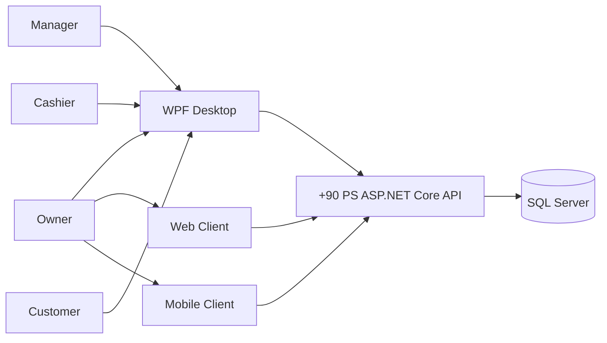

---

# 144. C4 Context

```text
                    +----------------+
                    |     Owner      |
                    +-------+--------+
                            |
                            v
                +-----------+-----------+
                |       +90 PS          |
                |    Full Product       |
                +-----------+-----------+
                            ^
                            |
                  +---------+---------+
                  |                   |
               Manager             Cashier
```

---

# 145. C4 Container

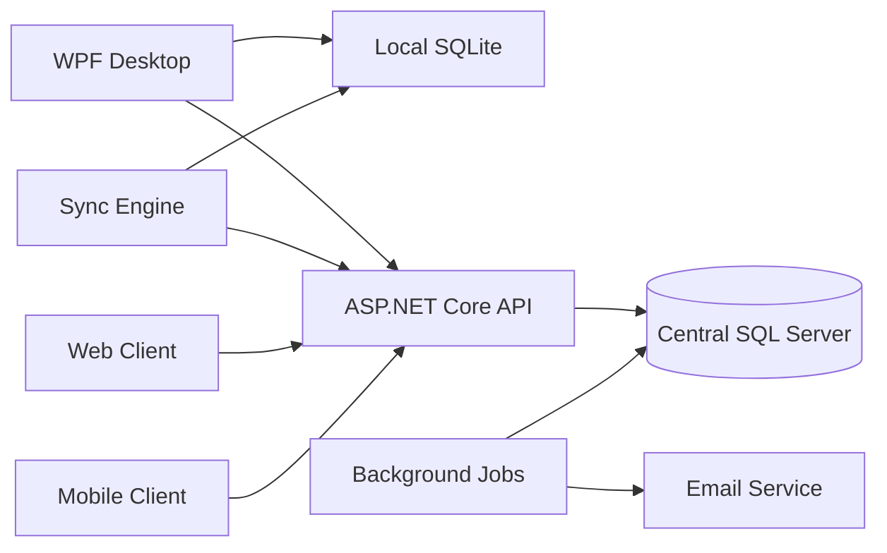

---

# 146. C4 Component

```text
ASP.NET Core API
|
+-- Identity
+-- Authorization
+-- Owner/Business
+-- Branch
+-- User
+-- Console
+-- Pricing
+-- Session
+-- Customer
+-- Booking
+-- Invoice
+-- Payment
+-- Discount
+-- Shift
+-- Expense
+-- Asset
+-- Transfer
+-- Reporting
+-- Analytics
+-- Audit
+-- Synchronization
+-- Plans
+-- Entitlements
+-- Configuration
```

---

# 147. Deployment Diagram

```text
                          Internet
                             |
                 +-----------+-----------+
                 |       API Server      |
                 |   ASP.NET Core API    |
                 +-----------+-----------+
                             |
                     +-------+-------+
                     | SQL Server    |
                     +---------------+
                             |
                  +----------+----------+
                  |                     |
             Background Jobs         Email
                  |
                  |
--------------------------------------------------

Branch A
  |
  +-- Windows PC
      |
      +-- WPF
      +-- SQLite
      +-- Sync Engine

Branch B
  |
  +-- Windows PC
      |
      +-- WPF
      +-- SQLite
      +-- Sync Engine

...
```

---

# 148. Data Flow Diagram

```text
User
 ↓
Client
 ├── Online → API → Database
 │
 └── Offline → Local SQLite
                    ↓
                 Sync Queue
                    ↓
                   API
                    ↓
                Database
```

---

# 149. ERD — High Level

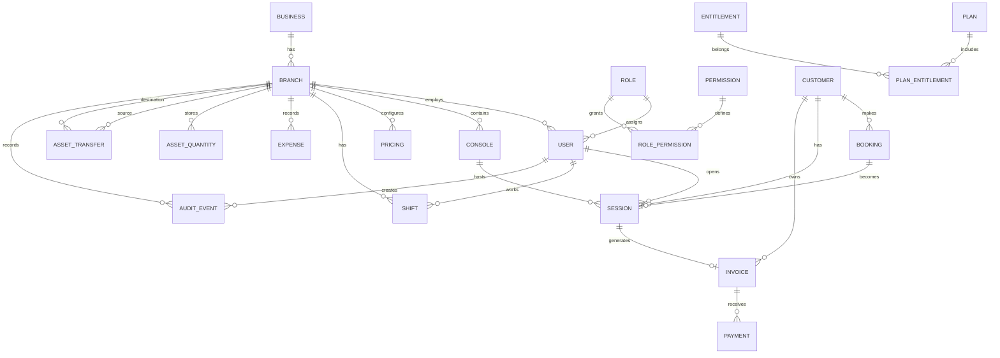

---

# 150. Use Case Diagram — Full Product

```text
Owner
 |
 +-- View Business
 +-- View Branches
 +-- View Aggregated Reports
 +-- View Financial Performance
 +-- Manage Authorized Business Configuration
 +-- Review Audit

Manager
 |
 +-- Manage Users
 +-- Manage Consoles
 +-- Manage Pricing
 +-- Manage Customers
 +-- Manage Bookings
 +-- Manage Expenses
 +-- Manage Assets
 +-- Manage Shifts
 +-- View Reports
 +-- Authorize Protected Actions
 +-- Cancel/void Invoice
 +-- Approve Transfer

Cashier
 |
 +-- Login
 +-- Lock/Unlock
 +-- Start Session
 +-- Pause Session
 +-- Resume Session
 +-- Complete Session
 +-- Create Invoice
 +-- Receive Cash
 +-- Apply Allowed Discount
 +-- Find Customer
 +-- Create Customer
 +-- Create Booking
 +-- Check Booking
 +-- Start Shift
 +-- End Shift
```

---

# 151. Activity Diagram — Customer Booking

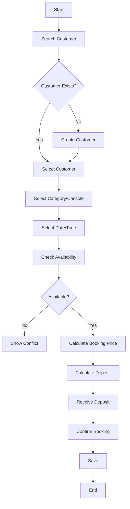

---

# 152. Activity Diagram — Booking Check-In

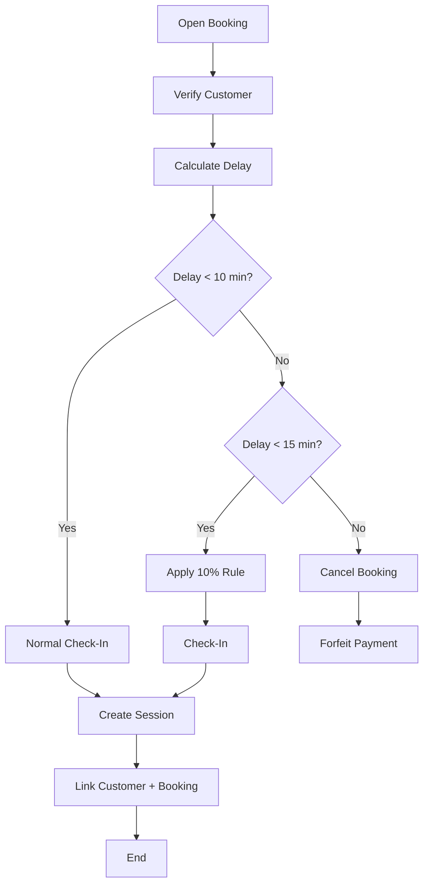

---

# 153. Sequence Diagram — Customer Creation

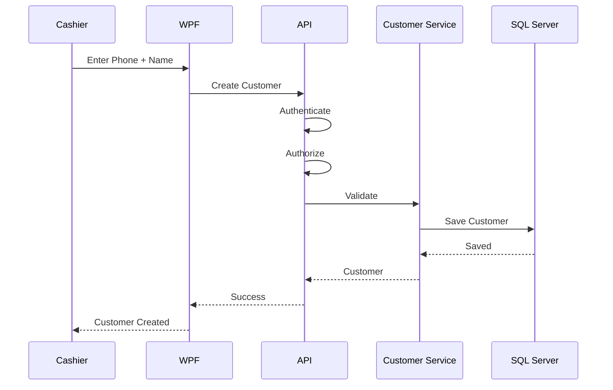

---

# 154. Sequence Diagram — Booking

```mermaid
sequenceDiagram
    participant C as Cashier
    participant W as WPF
    participant A as API
    participant B as Booking Service
    participant P as Pricing Service
    participant D as SQL Server

    C->>W: Select customer/time/category
    W->>A: Create booking
    A->>A: Authenticate
    A->>A: Authorize
    A->>B: Validate booking
    B->>P: Resolve price
    P-->>B: Price
    B->>B: Check availability
    B->>D: Save booking/deposit
    D-->>B: Saved
    B-->>A: Booking result
    A-->>W: Success
    W-->>C: Booking confirmed
```

---

# 155. Sequence Diagram — Booking Check-In

```mermaid
sequenceDiagram
    participant C as Cashier
    participant W as WPF
    participant A as API
    participant B as Booking Service
    participant S as Session Service
    participant D as SQL Server

    C->>W: Open booking
    W->>A: Check-in
    A->>A: Authenticate / Authorize
    A->>B: Validate arrival
    B->>B: Calculate delay
    B->>B: Apply late rule
    B->>S: Start session
    S->>D: Save session + booking link
    D-->>S: Saved
    S-->>A: Session
    A-->>W: Success
    W-->>C: Session active
```

---

# 156. Sequence Diagram — Offline Sync

```mermaid
sequenceDiagram
    participant L as Local SQLite
    participant S as Sync Engine
    participant A as ASP.NET API
    participant D as SQL Server

    L->>S: Pending operation
    S->>A: Submit operation
    A->>A: Authenticate
    A->>A: Validate branch scope
    A->>A: Check idempotency
    A->>D: Persist
    D-->>A: Saved
    A-->>S: Acknowledgment
    S->>L: Mark synced
```

---

# 157. State Diagram — Booking

```text
Pending
   ↓
Confirmed
   ↓
Arrived
   ↓
Active
   ↓
Completed

Confirmed
   ├──> Cancelled
   ├──> No-Show
   └──> Expired
```

---

# 158. State Diagram — Invoice

```text
Draft
  ↓
Issued
  ↓
Paid

Issued / Paid
  ↓
Authorized cancellation
  ↓
Cancelled / Voided
```

---

# 159. State Diagram — Session

```text
Available
   ↓
Active
   ↓
Paused
   ↓
Active
   ↓
Completed
```

Possible:

```text
Active → Cancelled
```

---

# 160. State Diagram — Shift

```text
Not Started
    ↓
Open
    ↓
Closing
    ↓
Closed
```

Potential blocked state:

```text
Open
 ↓
Active Sessions
 ↓
Manager Handover
```

---

# 161. Work Flow — Owner

```text
Login
  ↓
Business Dashboard
  ↓
View Branches
  ↓
Select Branch
  ↓
View Financials
  ↓
View Operations
  ↓
Review Bookings
  ↓
Review Customers
  ↓
Review Assets
  ↓
Review Audit
```

---

# 162. Work Flow — Manager

```text
Login
  ↓
Manager Dashboard
  ↓
Monitor Sessions
  ↓
Manage Consoles
  ↓
Manage Pricing
  ↓
Manage Users
  ↓
Manage Customers/Bookings
  ↓
Create Expenses
  ↓
Manage Assets
  ↓
Review Reports
  ↓
Authorize Protected Actions
```

---

# 163. Work Flow — Cashier

```text
PIN Login
  ↓
Dashboard
  ↓
Open/Continue Shift
  ↓
View Console Availability
  ↓
Find/Create Customer
  ↓
Start Walk-In Session
       OR
Create/Check Booking
  ↓
Session
  ↓
Pause/Resume
  ↓
Complete
  ↓
Invoice
  ↓
Discount if allowed
  ↓
Cash Payment
  ↓
Transaction Complete
```

---

# 164. Work Flow — Shift Closing

```text
Cashier
  ↓
Request Shift Close
  ↓
Check Active Sessions
  ↓
Active sessions?
  /        \
No          Yes
|            |
Continue   Manager Authorization
             ↓
       Transfer responsibility
             ↓
       Calculate shift totals
             ↓
       Calculate expected cash
             ↓
       Count actual cash
             ↓
       Calculate variance
             ↓
       Close shift
```

---

# 165. Work Flow — Asset Transfer

```text
Manager
   ↓
Select Source Branch
   ↓
Select Destination Branch
   ↓
Select Asset Category
   ↓
Enter Quantity
   ↓
Validate Available Quantity
   ↓
Create Transfer
   ↓
Authorization
   ↓
Source Decrease
   ↓
Destination Increase
   ↓
Audit
```

---

# 166. Work Flow — Employee Transfer

```text
Authorized Manager/Owner
   ↓
Select Employee
   ↓
Select Destination Branch
   ↓
Validate authorization
   ↓
Create transfer
   ↓
Approve
   ↓
Effective date
   ↓
Update current assignment
   ↓
Preserve historical assignment
```

---

# 167. Work Flow — Plan Entitlement

```text
Customer / Business
      ↓
Current Plan
      ↓
Entitlements
      ↓
Feature availability
      ↓
User permission
      ↓
Allowed / Denied
```

---

# 168. Background Jobs

Potential jobs:

```text
Report generation
Email reports
Sync cleanup
Data consistency checks
Notification jobs
Health checks
Audit maintenance
Backup verification
Update metadata
```

Every job needs:

```text
Retry
Failure handling
Logging
Monitoring
```

---

# 169. Email Service

Email can support:

```text
Scheduled reports
Operational notifications
Security alerts
System notifications
```

Emails should not contain unnecessary sensitive information.

---

# 170. Reporting Architecture

```text
Transactional Data
      ↓
Reporting Queries / Read Models
      ↓
Report Service
      ↓
Dashboard / Export / Email
```

Avoid making every dashboard query scan huge transaction tables unnecessarily.

---

# 171. Analytics Data Model

For high-scale analytics, consider read-optimized models.

Examples:

```text
DailyBranchRevenue
DailyBranchExpense
DailyBranchProfit
ConsoleUtilization
BookingMetrics
CustomerMetrics
```

Only introduce precomputed models when measured data volume justifies them.

---

# 172. Search

Final product may need efficient search for:

```text
Customer phone
Customer name
Invoice number
Booking
Console
Employee
Asset
```

Use indexed queries.

---

# 173. Pagination

Large datasets must support pagination:

```text
Customers
Bookings
Invoices
Sessions
Audit
Expenses
Assets
```

Do not load entire historical tables into WPF.

---

# 174. API Rate / Abuse Protection

Publicly exposed API components should consider:

```text
Rate limits
Request validation
Authentication
Lockout
Abuse detection
```

Internal branch traffic should still be protected from malformed or excessive operations.

---

# 175. Correlation IDs

Use correlation IDs to connect:

```text
Client Request
API Request
Database Action
Audit Event
Sync Operation
Background Job
```

This makes production troubleshooting far easier.

---

# 176. Incident Management

Incident lifecycle:

```text
Detect
   ↓
Investigate
   ↓
Contain
   ↓
Fix
   ↓
Verify
   ↓
Recover
   ↓
Document
   ↓
Prevent
```

---

# 177. Postmortem

For major incidents:

```text
What happened?
When?
Impact?
Root cause?
Why not detected earlier?
How fixed?
How prevented?
```

Do not blame individuals.

Fix systems and processes.

---

# 178. Product Support

Support categories:

```text
P1 Critical
P2 High
P3 Medium
P4 Low
```

Examples:

```text
P1 — Central system unavailable
P2 — Major branch operation unavailable
P3 — Important feature issue with workaround
P4 — Minor bug
```

---

# 179. Release/Deployment Documentation

Maintain:

```text
Deployment Guide
Release Checklist
Migration Guide
Rollback Guide
Branch Onboarding Guide
Troubleshooting Guide
Monitoring Guide
Backup Guide
Recovery Guide
```

---

# 180. Project Documentation Set

The final product documentation should include:

## Product

```text
product-vision.md
prd-full-product.md
requirements.md
business-rules.md
roadmap.md
```

## Business

```text
business-model.md
stakeholders.md
processes.md
service-blueprint.md
```

## UX

```text
personas.md
journeys.md
information-architecture.md
ux-flows.md
design-system.md
screen-specifications.md
```

## Architecture

```text
system-context.md
c4-context.md
c4-container.md
c4-component.md
component-diagram.md
deployment-diagram.md
data-flow.md
technical-flow.md
work-flow.md
```

## Database

```text
erd.md
schema.md
data-dictionary.md
migration-strategy.md
```

## API

```text
openapi.yaml
api-guidelines.md
authentication.md
authorization.md
error-model.md
pagination.md
```

## Security

```text
security-requirements.md
threat-model.md
rbac.md
audit-logging.md
data-protection.md
security-testing.md
```

## Offline

```text
offline-policy.md
sync-architecture.md
sync-conflicts.md
idempotency.md
recovery.md
```

## QA

```text
test-plan.md
test-cases.md
regression-plan.md
performance-plan.md
security-test-plan.md
uat.md
```

## Deployment

```text
environments.md
ci-cd.md
deployment.md
database-migrations.md
desktop-updates.md
rollback.md
```

## Operations

```text
monitoring.md
logging.md
backup.md
disaster-recovery.md
incident-management.md
runbooks/
```

## Product Plans

```text
plans.md
entitlements.md
feature-matrix.md
```

---

# 181. UX/UI Screen Inventory

Final product may include:

```text
Authentication
Login
PIN
Lock Screen

Owner
Owner Dashboard
Branch Overview
Financial Dashboard
Operational Health

Manager
Manager Dashboard
Console Management
Pricing
Users
Customers
Bookings
Expenses
Assets
Reports
Audit

Cashier
Cashier Dashboard
Console Board
Session
Invoice
Payment
Customer Search
Booking
Shift

System
Settings
Sync Status
Diagnostics
```

---

# 182. Design System Requirements

Define:

```text
Typography
Colors
Spacing
Buttons
Inputs
Tables
Cards
Dialogs
Navigation
Status
Notifications
Error states
Loading states
Empty states
Offline states
Permission denied states
```

---

# 183. Accessibility

Final product should consider:

```text
Readable typography
Keyboard navigation
Clear focus states
Sufficient contrast
Meaningful status indicators
Non-color-only status communication
Accessible error messages
```

---

# 184. UX Principle for Cashier

The cashier workflow is operational and time-sensitive.

Optimize for:

```text
Few clicks
Large clear actions
Fast customer lookup
Fast console selection
Clear session state
Clear payment amount
Minimal typing
Immediate feedback
```

---

# 185. UX Principle for Manager

Manager workflows should prioritize:

```text
Control
Visibility
Filters
Reports
Approvals
Auditability
```

---

# 186. UX Principle for Owner

Owner workflows should prioritize:

```text
Business overview
Branch comparison
Profitability
Operational health
Exceptions
```

---

# 187. Testing Strategy

Testing covers:

```text
Unit
Integration
API
Database
UI
E2E
Offline
Sync
Security
Performance
Regression
UAT
```

---

# 188. Test Pyramid

```text
            E2E
          /     \
      Integration
       /         \
     Unit Tests
```

Use fast lower-level tests extensively.

---

# 189. Unit Testing

Test:

```text
Pricing
Billing
Late rules
Discount calculations
State transitions
Permission checks
Booking availability logic
Cash reconciliation
Profit calculation
```

---

# 190. Integration Testing

Test:

```text
EF Core
SQL Server
API
Transactions
Authentication
Authorization
Sync
```

---

# 191. E2E Testing

Full flows:

```text
Login
→ Session
→ Invoice
→ Payment
```

and:

```text
Customer
→ Booking
→ Check-in
→ Session
→ Invoice
```

---

# 192. Offline Testing

Test:

```text
Internet drops
Internet returns
Local persistence
Sync
Retries
Duplicate operations
Conflicts
Application restart
PC restart
```

---

# 193. Security Testing

Test:

```text
Unauthorized endpoint
Unauthorized branch
Unauthorized operation
Privilege escalation
Credential handling
Sensitive data exposure
Manager override bypass
Sync tampering
```

---

# 194. Performance Testing

Test:

```text
Session responsiveness
Customer search
Booking availability
Invoice creation
Reports
Sync throughput
API latency
Database query speed
```

---

# 195. Load Testing

Final platform should be tested against plausible scale:

```text
Many branches
Many consoles
Many sessions
Many invoices
Large customer history
Large audit history
Large sync queues
```

Scale targets should be based on actual deployment forecasts.

---

# 196. Regression Testing

Every change must protect:

```text
Authentication
Authorization
Sessions
Pricing
Invoices
Cash
Expenses
Reports
Offline
Sync
Customers
Bookings
```

---

# 197. UAT

UAT should run realistic workflows.

## Cashier

```text
Login
Start shift
Find customer
Start session
Pause/resume
Complete
Invoice
Cash
Lock
Switch user
```

## Manager

```text
Login
Change pricing
Create expense
Review report
Authorize cancellation
Transfer session
Review booking
Review customer
```

## Owner

```text
View business
View branches
View financials
Review audit
Review health
```

---

# 198. Booking UAT

```text
Create customer
Create booking
Select category
Select time
Check availability
Pay deposit
Confirm
Customer arrives
Calculate delay
Apply 10-minute rule
Check-in
Start session
Complete
Invoice
```

---

# 199. No-Show UAT

```text
Booking at 18:00
Customer reaches threshold
System cancels
Payment forfeiture rule applies
Status recorded
Audit available
Reports remain financially consistent
```

---

# 200. Cash Reconciliation UAT

```text
Opening cash
+
Cash revenue
-
Cash expenses
=
Expected closing cash

Count actual cash
Compare
Record variance
Close shift
```

---

# 201. Asset Transfer UAT

```text
Branch A quantity = 10
Transfer = 3
Branch A becomes 7
Branch B increases by 3
Transfer history recorded
Authorization recorded
```

---

# 202. Employee Transfer UAT

```text
Employee A
Current branch = A
Transfer to B
Effective date reached
Current assignment = B
Historical assignment preserved
```

---

# 203. Plan/Entitlement UAT

Verify:

```text
Plan grants feature
Plan denies feature
User has permission but plan denies feature
Plan allows feature but user lacks permission
Both must be satisfied where required
```

---

# 204. Backup/Recovery Test

Verify:

```text
Backup exists
Backup can be restored
Restore is valid
Application reconnects
Data integrity remains intact
```

---

# 205. Migration Testing

Before production migration:

```text
Create test copy
Apply migration
Verify data
Run integration tests
Run reports
Test application
Test rollback/recovery strategy
```

---

# 206. Release Readiness

Final product readiness:

```text
Requirements signed off
UX complete
Architecture complete
Database complete
API complete
Security reviewed
Offline/sync tested
Functional tests pass
Regression passes
Performance acceptable
UAT passes
Backup verified
Deployment verified
Support ready
Runbooks ready
```

---

# 207. Production Rollout

For a large deployment:

```text
Staging
   ↓
Pilot
   ↓
Controlled rollout
   ↓
Progressive rollout
   ↓
Full deployment
```

Monitor each stage.

---

# 208. Canary / Progressive Rollout

Where practical:

```text
Small group
   ↓
More branches
   ↓
Larger group
   ↓
All branches
```

Do not risk all branches at once when a safer rollout is possible.

---

# 209. Product Versioning

Use controlled semantic versions.

Example:

```text
3.0.0
3.0.1
3.1.0
```

Actual versioning policy should be documented.

---

# 210. Release Notes

Each production release records:

```text
New features
Bug fixes
Security changes
Database changes
Migration notes
Known issues
Rollback notes
```

---

# 211. Risk Register

| Risk | Probability | Impact | Mitigation |
|---|---:|---:|---|
| Sync conflict | High | High | Explicit conflict engine |
| Duplicate financial operation | Medium | Critical | Idempotency |
| Branch data leakage | Medium | Critical | Backend authorization |
| Booking conflict | High | High | Concurrency control |
| Deposit double counting | Medium | Critical | Explicit financial model |
| Offline data corruption | Low/Medium | Critical | Recovery + validation |
| Deployment failure | Medium | High | Staging + rollback |
| Backup failure | Low/Medium | Critical | Verification + restore test |
| Scope growth | Medium | High | Product governance |
| Customer data exposure | Medium | High | Least privilege |
| Pricing inconsistency | Medium | High | Pricing snapshots |
| PC failure | Medium | High | Recovery process |

---

# 212. Product Governance

For every new product request:

```text
Request
   ↓
Business value
   ↓
Customer/user impact
   ↓
Technical impact
   ↓
Security impact
   ↓
Data impact
   ↓
Offline impact
   ↓
Cost/maintenance
   ↓
Priority
   ↓
Decision
```

---

# 213. Change Management

A change request contains:

```text
Change ID
Description
Reason
Requester
Business Value
Affected Modules
Database Impact
API Impact
Security Impact
Offline Impact
Migration Impact
Testing Impact
Decision
```

---

# 214. Definition of Ready

Feature is ready when:

```text
Business purpose clear
Requirements clear
Acceptance criteria defined
UX defined
Data impact known
API impact known
Security impact known
Offline impact known
Dependencies known
```

---

# 215. Definition of Done

Feature is done when:

```text
Implemented
Validated
Authorized
Tested
Documented
Migrated
Observable
Recoverable where needed
No critical known issue
```

---

# 216. Production Ready Definition

```text
Security
+
Reliability
+
Performance
+
Observability
+
Backup
+
Recovery
+
Testing
+
Documentation
+
Support
```

---

# 217. Support Runbooks

Required:

```text
API down
Database down
Branch offline
Sync failure
Sync conflict
Duplicate transaction
Booking conflict
Customer duplicate
Invoice cancellation issue
Pricing issue
Login/PIN issue
Deployment issue
Backup/restore
```

---

# 218. Troubleshooting Principles

When an issue occurs:

```text
Observe
   ↓
Collect evidence
   ↓
Reproduce
   ↓
Identify scope
   ↓
Determine root cause
   ↓
Fix
   ↓
Test
   ↓
Monitor
   ↓
Document
```

Do not patch blindly.

---

# 219. Audit Investigation

An investigation should be able to answer:

```text
Who did it?
What happened?
When?
Where?
Which branch?
Which entity?
What was the old value?
What became the new value?
Was approval required?
Who approved it?
```

---

# 220. Financial Integrity Principle

Financial records should favor:

```text
Traceability
Immutability where practical
Explicit reversals
Audit
```

Avoid destructive deletion.

---

# 221. Data Retention

Define retention for:

```text
Invoices
Payments
Audit events
Logs
Reports
Sync failures
Customer records
Bookings
```

Retention must satisfy business and legal requirements applicable to the deployment.

---

# 222. Business Continuity

The system should allow:

```text
Branch offline
Central service outage
Temporary network loss
PC restart
Recovery
Synchronization
```

The branch should degrade gracefully rather than simply stopping.

---

# 223. Operational Health

The mature platform should make abnormal states obvious:

```text
Branch offline
Sync backlog
Failed report
Failed backup
API errors
Database issues
Unexpected cash variance
Booking conflicts
```

---

# 224. Feature Quality Gate

Every major feature must answer:

```text
What problem?
Who uses it?
What is the workflow?
What are the states?
What data?
What API?
What security?
What happens offline?
How tested?
How monitored?
How recovered?
```

---

# 225. Full Product Component Map

```text
+90 PS
|
+-- Identity
|   +-- Authentication
|   +-- PIN
|   +-- Users
|   +-- Roles
|   +-- Permissions
|
+-- Business
|   +-- Owners
|   +-- Businesses
|   +-- Branches
|
+-- Gaming
|   +-- Consoles
|   +-- Pricing
|   +-- Sessions
|   +-- Match
|   +-- Hourly
|
+-- Customer
|   +-- Accounts
|   +-- Search
|   +-- History
|
+-- Booking
|   +-- Availability
|   +-- Deposit
|   +-- Late rules
|   +-- Check-in
|   +-- No-show
|
+-- Finance
|   +-- Invoices
|   +-- Payments
|   +-- Discounts
|   +-- Shifts
|   +-- Cash Reconciliation
|   +-- Expenses
|   +-- Revenue
|   +-- Profit
|
+-- Assets
|   +-- Consoles
|   +-- Controllers
|   +-- Accessories
|   +-- Equipment
|   +-- Quantities
|   +-- Transfers
|
+-- Reporting
|   +-- Reports
|   +-- Analytics
|   +-- Email
|
+-- Platform
|   +-- API
|   +-- SQL Server
|   +-- SQLite
|   +-- Sync
|   +-- Monitoring
|   +-- Backup
|   +-- Deployment
|
+-- Commercial
    +-- Plans
    +-- Entitlements
```

---

# 226. Full Product Documentation Map

```text
docs/
|
├── discovery/
├── business/
├── product/
├── requirements/
├── ux/
├── ui/
├── architecture/
├── database/
├── api/
├── security/
├── offline-sync/
├── testing/
├── deployment/
├── operations/
├── support/
├── commercial/
└── decisions/
```

---

# 227. Architecture Decision Records

Important decisions should be recorded as ADRs.

Examples:

```text
ADR-001 — WPF/API Boundary
ADR-002 — SQLite Offline Store
ADR-003 — SQL Server Central Store
ADR-004 — Modular Monolith
ADR-005 — Invoice Void Instead of Delete
ADR-006 — Pricing Snapshot
ADR-007 — Session Timing Model
ADR-008 — Sync Idempotency
ADR-009 — Booking Conflict Strategy
ADR-010 — Customer Identity Strategy
ADR-011 — Asset Quantity Model
ADR-012 — Plan/Entitlement Model
ADR-013 — Reporting Architecture
ADR-014 — Desktop Update Strategy
```

---

# 228. Product Documentation Traceability

Every major capability should map:

```text
Requirement
   ↓
Business Rule
   ↓
User Story
   ↓
UX Flow
   ↓
UI
   ↓
API
   ↓
Database
   ↓
Security
   ↓
Implementation
   ↓
Test
   ↓
Deployment
   ↓
Monitoring
```

---

# 229. Final Product Principles

The mature +90 PS product should:

```text
Never trust the client for critical authorization.
Never store plaintext PINs.
Never silently overwrite sync conflicts.
Never duplicate a financial operation because of a retry.
Never destroy financial history casually.
Never rely only on UI visibility for security.
Never hardcode branch-specific prices.
Never make the branch unusable solely because the Internet is unavailable.
Never make a production schema change without migration control.
Never deploy a risky update without rollback/recovery consideration.
Never collect more customer data than necessary.
```

---

# 230. Final Full Product Success Definition

The complete product succeeds when an owner can operate a growing PlayStation business through +90 PS and the system provides:

```text
Reliable branch operation
+
Accurate gaming billing
+
Customer management
+
Booking management
+
Financial visibility
+
Cash accountability
+
Asset management
+
Multi-branch control
+
Offline resilience
+
Safe synchronization
+
Security
+
Auditability
+
Advanced reporting
+
Analytics
+
Operational monitoring
+
Deployment automation
+
Recovery
+
Scalable architecture
```

---

# 231. Final End-to-End Product Flow

Owner → Branch → Users → Console/Pricing → Walk-in or customer/booking → Session → Invoice/Payment → Shift → Reports → Owner review.

الحجز اختياري في هذا التدفق، وليس شرطًا لجلسة عميل عابر. البنية المشتركة للحفظ تتبع [ADR-01](BUSINESS_RULES(1).md)، والتحويلات والباقات والتقارير المتقدمة إضافات R3. لا يمثل المخطط وعدًا بأن Web/Mobile نُفّذا.

---

# 232. Final Security Flow

```text
Identity
   ↓
Authentication
   ↓
Role
   ↓
Permission
   ↓
Branch Scope
   ↓
Plan Entitlement
   ↓
Business State Validation
   ↓
Operation
   ↓
Audit
```

---

# 233. Final Offline Flow

```text
WPF → Local authorization + shared business rules
    → SQLite transaction: operational record + pending sync operation
    → Local success shown to cashier
    → Sync when online → API authentication/branch validation/idempotency
    → SQL Server transaction → acknowledgement → local sync status
```

قرار هندسي معتمد لهذه الخطة: عمليات الفرع الأساسية تكتب محليًا أولًا في الحالتين Online وOffline؛ الاتصال يغيّر توقيت المزامنة ولا يبدّل مكان إنشاء الفاتورة. التقرير المركزي والتهيئة المركزية لهما API، ولا يعني ذلك إعادة إرسال إنشاء الجلسة كعملية جديدة.
التفاصيل والحدود في [القرارات المشتركة](BUSINESS_RULES(1).md). المزامنة الناجحة تختلف عن نجاح الحفظ المحلي، وتظهر الحالتان للمستخدم.

---

# 234. Final Booking Flow

```text
Customer
   ↓
Search/Create
   ↓
Choose Category/Console
   ↓
Choose Date/Time
   ↓
Availability
   ↓
Price
   ↓
Deposit
   ↓
Confirm
   ↓
Arrival
   ↓
Late Rule
   ↓
Check-In
   ↓
Session
   ↓
Invoice
   ↓
Payment
```

---

# 235. Final Financial Flow

```text
Session / Booking
     ↓
Price
     ↓
Discount if applicable
     ↓
Invoice
     ↓
Cash Payment
     ↓
Revenue
     ↓
Expenses
     ↓
Profit
     ↓
Shift Reconciliation
     ↓
Reports
```

---

# 236. Final Asset Flow

```text
Asset / Quantity
      ↓
Branch
      ↓
Current Status
      ↓
Maintenance / Use
      ↓
Transfer if authorized
      ↓
Destination Branch
      ↓
Historical Record
```

---

# 237. Final Branch Scaling Flow

```text
Owner
   ↓
Branch A
   ↓
Additional Branch
   ↓
Centralized Branch Management
   ↓
Transfers
   ↓
Aggregated Reporting
   ↓
Monitoring
   ↓
Scalable Operations
```

---

# 238. Final Operational Lifecycle

```text
Plan
 ↓
Configure
 ↓
Deploy
 ↓
Operate
 ↓
Monitor
 ↓
Collect Data
 ↓
Report
 ↓
Improve
 ↓
Update
 ↓
Recover when required
```

---

# 239. Full Product Master Checklist

## Business

```text
[ ] Business model documented
[ ] Ownership model documented
[ ] Branch model documented
[ ] User roles documented
[ ] Business rules documented
```

## Customer

```text
[ ] Customer account
[ ] Phone lookup
[ ] Required name
[ ] History
[ ] Security
```

## Booking

```text
[ ] Availability
[ ] VIP/Standard
[ ] Deposit
[ ] Price snapshot
[ ] Late rules
[ ] No-show
[ ] Check-in
[ ] Session conversion
```

## Gaming

```text
[ ] Consoles
[ ] Single/Multi
[ ] Hourly
[ ] Match
[ ] Pause/Resume
[ ] Session ownership
```

## Finance

```text
[ ] Invoice
[ ] Cash
[ ] Discount
[ ] Shift
[ ] Cash reconciliation
[ ] Expenses
[ ] Revenue
[ ] Profit
[ ] Deposit accounting
```

## Assets

```text
[ ] Consoles
[ ] Controllers
[ ] Accessories
[ ] Equipment
[ ] Quantities
[ ] Transfers
[ ] History
```

## Security

```text
[ ] Authentication
[ ] Authorization
[ ] RBAC
[ ] Branch isolation
[ ] Manager override
[ ] Audit
[ ] Threat model
[ ] Security testing
```

## Offline

```text
[ ] SQLite
[ ] Local auth
[ ] Offline operation
[ ] Sync queue
[ ] Idempotency
[ ] Conflict handling
[ ] Recovery
```

## Platform

```text
[ ] API
[ ] SQL Server
[ ] Background jobs
[ ] Email
[ ] Monitoring
[ ] Backup
[ ] Disaster recovery
[ ] CI/CD
[ ] Desktop update
```

## Reporting

```text
[ ] Daily
[ ] Weekly
[ ] Monthly
[ ] Branch
[ ] Business
[ ] Advanced analytics
[ ] Email delivery
```

## Product

```text
[ ] Plans
[ ] Entitlements
[ ] Feature management
[ ] Documentation
[ ] Support
[ ] Incident management
```

---

# 240. Final Full Product Documentation Checklist

```text
[ ] Product Vision
[ ] Business Model
[ ] Stakeholder Map
[ ] Requirements
[ ] Business Rules
[ ] PRD
[ ] User Stories
[ ] Acceptance Criteria
[ ] Personas
[ ] User Journeys
[ ] Information Architecture
[ ] Wireframes
[ ] Design System
[ ] Screen Specifications
[ ] System Context
[ ] Use Case
[ ] Activity
[ ] Sequence
[ ] State
[ ] C4
[ ] Component
[ ] Deployment
[ ] Data Flow
[ ] ERD
[ ] Database Schema
[ ] Data Dictionary
[ ] API Specification
[ ] OpenAPI
[ ] Authentication
[ ] Authorization
[ ] Threat Model
[ ] RBAC
[ ] Audit
[ ] Offline Policy
[ ] Sync Design
[ ] Conflict Strategy
[ ] Idempotency
[ ] Test Plan
[ ] Test Cases
[ ] Security Test Plan
[ ] Performance Plan
[ ] UAT
[ ] CI/CD
[ ] Deployment
[ ] Migration
[ ] Rollback
[ ] Backup
[ ] Disaster Recovery
[ ] Monitoring
[ ] Runbooks
[ ] Incident Process
[ ] Support Process
[ ] Plans
[ ] Entitlements
[ ] Release Notes
[ ] User Guide
[ ] Manager Guide
[ ] Owner Guide
```

---

# 241. Final Engineering Rule

Every important capability follows this lifecycle:

```text
Business Need
   ↓
Requirement
   ↓
Business Rule
   ↓
UX
   ↓
Domain Model
   ↓
Architecture
   ↓
API
   ↓
Database
   ↓
Security
   ↓
Implementation
   ↓
Testing
   ↓
Deployment
   ↓
Monitoring
   ↓
Support
```

Do not let important business behavior exist only inside source code.

---

# 242. End of Release 3 Master Specification

Release 3 represents the intended complete +90 PS platform.

The product is considered mature when the business can operate its branches, customers, bookings, sessions, financial records, assets, employees, reporting and operations through a coherent secure platform with reliable offline behavior, synchronization, monitoring and recovery.

The final architecture must remain understandable and maintainable even though the platform has grown substantially.
````

### Source 072 — Project.Docs/Releases/Release 1/DATABASE_DESIGN_R1.md

Original size: 18907 bytes. SHA-256: `d15428bdee088fa267819acda8f0fc740aba021b052420da62a99bd08699b2f0`.

````text
# +90 PS — R1 Physical Database Design (DB-01 + DB-01.1)

Status: DB-01.1 FINANCIAL + BUSINESS DAY DESIGN COMPLETED / READY FOR REVIEW, not implemented. No EF mapping, migration, SQLite file, SQL Server database, or physical index exists from this document. BE-09 requires separate authorization.

## Authority and boundaries

This design applies the actual BE-01–BE-08 Domain, BUSINESS_RULES_R1(1), FUNCTIONAL_REQUIREMENTS_R1(2), ACCEPTANCE_CRITERIA_R1(2), BRD_R1(2), PRD_R1(2), TECHNICAL_DECISIONS_R1, and current DECISION_REQUESTS_R1. Historical DECISIONS.md and old UI screenshots are not authority over current decisions. The companion [dictionary](DATA_DICTIONARY_R1.md) defines columns; the [index plan](INDEX_QUERY_PLAN_R1.md) defines query-backed candidates.

Path: WPF → one-Branch local SQLite transaction + durable Outbox → immediate SavedLocally → background authenticated/authorized API synchronization → central SQL Server. WPF never writes SQL Server directly. Core Branch actions use the same local path online and offline; sensitive administration is online-only under the approved baseline. Central rejection/conflict never silently erases locally committed financial evidence.

FROZEN means approved shape/invariant, not implemented DDL. PROVISIONAL means reasonable technical shape requiring implementation/security review. BLOCKED means a named owner decision prevents final state/constraint design. A BLOCKED table may contain stable base fields.

## Type and mapping contract

| Concept | Domain | SQLite | SQL Server | Boundary |
|---|---|---|---|---|
| Persistent ID | Guid | BLOB(16) | uniqueidentifier | Application generates Guid v7 outside Domain; preserve 16 bytes; never use ID order as chronology |
| UTC instant | DateTimeOffset | INTEGER epoch milliseconds | datetime2(3) UTC | Normalize before write; no PC/server local time as authoritative history |
| Money | decimal EGP | INTEGER signed piasters | bigint piasters | Validate at most 2 decimals before exact ×100 conversion; never REAL/FLOAT |
| Duration | TimeSpan | INTEGER signed milliseconds | bigint milliseconds | Validate range; no formatted string storage |
| Enum | Domain enum | INTEGER | int | Stable numeric meanings; EmployeeRole Owner=1, Manager=2, Cashier=3 |
| Boolean | bool | INTEGER 0/1 | bit | SQLite CHECK 0/1 |
| SHA-256 | byte[32] | BLOB(32) | binary(32) | Exact 32 bytes |
| JSON envelope | structured data | TEXT | nvarchar(max) | Versioned canonical UTF-8 sync serialization; not a query key |

String limits are explicit per column in the dictionary. Current Domain constructors do not enforce all proposed storage lengths; BE-09/Application validation must align before migration. Command-supplied IDs, timestamps, amounts, revisions, and actors must not be silently fabricated by database defaults.

## Table inventory and local/central authority

Sync arrows show intended direction, not an implemented pipeline. Shared logical rows keep the same Guid identity but have provider-specific physical mapping. Central configuration can be cached locally; caching does not authorize offline edits.

| Table/structure | Status | Local SQLite | Central SQL Server | Creation source → sync | Authority/reason |
|---|---|---|---|---|---|
| Businesses | FROZEN | Yes, cache | Yes | Central → local | Central Business identity |
| Branches | FROZEN | Yes, selected Branch cache | Yes | Central → local | Central ownership; TimeZoneId defaults to Africa/Cairo in R1 |
| BusinessDays | PROVISIONAL | Yes | Yes | Local → central | Explicit Start Day / End Day operational interval; one open per Branch |
| Employees | FROZEN | Yes, business-scope cache | Yes | Central → local | Business-wide identity/deactivation; no Employee.BranchId |
| GameConsoles | FROZEN | Yes | Yes | Central config → local | IsActive is not occupancy |
| PricingEntries | FROZEN | Yes | Yes | Central config → local | Current price; Session price snapshot remains stable |
| Sessions | PROVISIONAL | Yes | Yes | Local → central | Branch operational creation source |
| SessionEvents | PROVISIONAL | Yes | Yes | Local → central | Append-only lifecycle/revision evidence |
| ConsoleOccupancies | PROVISIONAL | Yes | No | Local only | Local double-session guard; central derives current state |
| Invoices | PROVISIONAL | Yes | Yes | Local → central | Cancel-only historical invoice; no separate Void or duplicate paid state |
| Payments | PROVISIONAL | Yes | Yes | Local → central | Zero or one full Cash receipt per Invoice |
| Shifts | PROVISIONAL | Yes | Yes | Local → central | Operational shift, not payroll |
| Expenses | PROVISIONAL | Yes | Yes | Local → central | Branch profit evidence |
| BranchAssets | PROVISIONAL | Yes | Yes | Local → central | Branch equipment quantities only |
| AuditEvents | PROVISIONAL | Yes | Yes | Local → central for local actions; central creates central actions | Append-oriented, redacted evidence |
| OutboxOperations | PROVISIONAL | Yes | No | Local → API | Atomic durable queue and retry evidence |
| InboxReceipts | PROVISIONAL | No | Yes | API only | Central dedup/result, atomic with effect |
| Devices | PROVISIONAL | No | Yes | Central → local binding metadata | Credential hash, revocation, Branch binding |
| LocalDeviceBindings | PROVISIONAL | Yes | No | Provisioning → local | One installed Device bound to one Branch |
| PinVerifiers | PROVISIONAL | No | Yes | Central provisioning | Central hash metadata, no plaintext PIN/pepper |
| OfflinePinVerifiers | PROVISIONAL | Yes | No | Controlled provisioning → local | Device-bound local hash metadata |
| PinAttemptStates | PROVISIONAL | Yes | No | Local only | Durable Branch+Device+Employee failure cycle |
| DeviceSecurityStates | PROVISIONAL | Yes | No | Authority/recovery → local | SecurityLocked/version/trusted-time floor |
| OfflineAuthorities | PROVISIONAL | Yes | No | Central signed grant → local | Bounded signed authority; no private key |
| UsedRecoveryChallenges | PROVISIONAL | Yes | No | Local recovery | One-time replay defense |
| ApiSessionTokens | PROVISIONAL | No | Yes | API only | Opaque reference token hash/expiry, never plaintext |
| SubscriptionStates | PROVISIONAL | No | Yes | Central billing/admin → grant | Paid-through/suspension facts for bounded authority |

Shared logical tables are Businesses, Branches, BusinessDays, Employees, GameConsoles, PricingEntries, Sessions, SessionEvents, Invoices, Payments, Shifts, Expenses, BranchAssets, and AuditEvents; their logical shape is mostly shared, physical mapping provider-specific. Outbox/Inbox and security structures differ by purpose. Q-REPORT-01 is resolved: an operational Business Day is the explicit Start Day → End Day interval, not midnight-to-midnight. Branches.TimeZoneId uses the R1 IANA baseline Africa/Cairo for display and calendar-period selection, not to replace that interval.

## Relationships and deletion

Business/history foreign keys default to NO ACTION/RESTRICT in both providers: Business→Branch/Employee; Branch→BusinessDay/Console/Pricing/Session/Invoice/Payment/Shift/Expense/Asset/Audit; BusinessDay→Session/Invoice/Payment/Expense; Employee→BusinessDay starter/ender, Session opener/responsible, Invoice issuer/canceller, Payment receiver, Shift actor, Expense actor, Audit actor; Console→Session/Occupancy; Session→Events/Occupancy/Invoice; Invoice→Payment. Local/central FK targets exist only when both rows exist in that provider. Technical queue/security FKs also use NO ACTION; no cascade is proposed. Nullable end actor/Branch fields are FKs only when present. Same-Branch links need provider-specific composite-FK or transactional validation review. Use deactivation/status/history retention, not normal physical deletion. No Employee delete → Sessions, Branch delete → Invoices, BusinessDay delete → Payments, or Session delete → Payments path may exist.

Business Id/Name; Branch Id/BusinessId/Name; Employee Id/BusinessId/Name/Role/IsActive; and GameConsole Id/BranchId/Name/Generation/IsActive mirror actual Domain. Branches.TimeZoneId is new R1 reporting configuration (default Africa/Cairo), not an authoritative day-boundary clock. Owner is EmployeeRole.Owner, not Business.OwnerId. Employee has no BranchId and may operate across active same-Business Branches subject to future authorization. Console IsActive is configuration, not IsBusy. No unapproved name uniqueness.

PricingEntries add a stable persistence Guid row Id for later management/audit and enforce UNIQUE (BranchId, ConsoleGeneration, PlayMode, PricingMethod). A Branch may configure a subset; missing means no valid price, not zero/default. Updates to current pricing never rewrite Sessions.CapturedPricePiasters.

BusinessDays is a new shared logical operational record: Id, BranchId, StartedByEmployeeId, StartedAtUtc, nullable EndedByEmployeeId/EndedAtUtc, and application-managed VersionToken. Id is supplied Guid, never database-generated. An authorized employee explicitly starts and ends the day; exact Cashier/Manager/Owner permission is deferred to RBAC. Open means EndedAtUtc is NULL; Closed means it is populated. There is no redundant IsOpen or Status column. A provider CHECK should require end actor and end instant to be both NULL or both present, and EndedAtUtc >= StartedAtUtc when closed. A unique partial SQLite index and unique filtered SQL Server index on BranchId WHERE EndedAtUtc IS NULL enforce at most one open BusinessDay per Branch (alongside Application checks). Midnight, Windows date change, minimize, network loss, crash or restart never auto-close or auto-start a day. Restart reads the persisted open row. End Day changes VersionToken; closed days remain historical, not casually reopened/reset/deleted. StartDay/EndDay later commit state + required Audit + Outbox atomically with stable OperationId, and central Inbox/replay cannot create a second day or double-close with conflicting data. Two offline devices may conflict centrally; retain local evidence and surface Conflict, never silently merge.

Sessions.BusinessDayId records the open day at Session start; Invoices.BusinessDayId records the day of issue; Payments.BusinessDayId records the day cash is actually received; Expenses.BusinessDayId records the day of recording. These are required same-Branch FKs, not inferred from wall-clock midnight. The operation's local transaction must select/validate the applicable open day; if no day is open, the later Application workflow must handle that explicitly rather than inventing a date. Shifts.BusinessDayId is intentionally omitted: a Shift may straddle explicit days, and no one-Shift-to-one-day rule is approved. Whether End Day is allowed while Sessions remain active, blocks, hands over, or completes them is **not decided**; this does not block the BusinessDays table and must not be inferred from the separate Shift-close handover rule.

Sessions preserve BE-07 identity, opening/current responsible employee, SessionType Open/Fixed/Match, captured generation/mode/method/price, optional fixed or Match reference duration, UTC lifecycle/state, VersionToken and AggregateRevision. One Match Session is exactly one Match; there is no MatchCount. Match reference duration is not an automatic end or hourly bill. The hourly final-charge formula remains unapproved. Sessions hold current durable state; SessionEvents hold ordered append-only Start/Pause/Resume/Complete and later ResponsibilityTransfer evidence. UNIQUE (SessionId, Revision), with revision N following N−1. Display timer derives from timestamps/events, not per-second writes.

ConsoleOccupancies has ConsoleId as PK and SessionId UNIQUE, both FKs NO ACTION. Session Start must atomically write Session + Start event + occupancy + Outbox in one local SQLite transaction; duplicate ConsoleId fails. Completion removes the technical occupancy row in a controlled local transaction without deleting history. Central may derive active occupancy from synchronized Sessions; it does not enforce the local immediate lock.

Invoices retain one issued record for each completed Session, its issue BusinessDayId, piaster amount, total paused duration, and nullable CancelledAtUtc/CancelledByEmployeeId/CancelReason. Invoice can precede Payment. Only eligible unpaid Invoice may be cancelled; any successful recorded Payment prohibits cancellation. Cancelled record remains and is excluded from active revenue; no refund is implied. UNIQUE SessionId prevents a second Invoice for the same R1 Session; no reissue workflow is approved. Cancel is the only R1 cancellation action: all three cancellation fields are NULL before Cancel; when Cancelled, timestamp and actor are required while reason remains optional. Derive cancellation from CancelledAtUtc, and payment state from presence of the one Payment; no StatusCode/IsPaid/IsOpen duplication. Provider CHECKs can enforce cancellation-field nullability and timestamp chronology, but **cannot** check another table. An Invoice with any successful Payment cannot be cancelled: later Application + local database transaction/concurrency + central sync validation must reject that race. Cancelled history remains, with no destructive delete, refund or Payment reversal.

Payments are separate Cash receipts linked to Invoice, with UNIQUE InvoiceId in both providers: zero or one successful Payment per Invoice, never partial/installment/split receipts. Cash is the only R1 method, so no MethodCode column or speculative other method is stored. AmountPiasters must be positive and equal Invoice.AmountPiasters, but cross-table equality is checked by later Application and database transaction, not a false CHECK. Creation later verifies Invoice exists, is not Cancelled, has no Payment, amount equals the final Invoice amount, then inserts and commits atomically; central replay repeats these validations under its own transaction and Inbox idempotency. Invoice can precede Payment. Example: Invoice.BusinessDayId = Day A, paid later Payment.BusinessDayId = Day B; never rewrite the Invoice's day. The hourly charge formula and actual workflow remain unimplemented.

Shifts record Branch, start/end actor/time and VersionToken, without payroll or an assumed one-day link. Expenses store Branch, recording BusinessDayId, actor, piaster amount, description/category/note, UTC time and token. BranchAssets store named category quantity and token, without product stock, serial lifecycle, or inter-Branch transfer. Audits are append-oriented/redacted; never put plaintext PIN, pepper, raw device credential, private key, or plaintext access token in Audit or any database.

Revenue is the sum of valid successful Cash Payments assigned to the selected BusinessDay(s), **not** all issued Invoices. An unpaid Invoice contributes no received-cash revenue; a Cancelled Invoice contributes none and cannot have a Payment under the transaction rule. Expense total comes from Expenses assigned to those same day IDs; operational Profit = Revenue − Expenses. One selected BusinessDay is the Daily report, even if its interval crosses midnight. Monthly, selected six-calendar-month, and Yearly reports select BusinessDays for the Branch using its TimeZoneId to interpret calendar labels/range boundaries, then aggregate Payment/Expense rows by BusinessDayId. R1 makes no DailyReports/MonthlyReports/SixMonthReports/YearlyReports tables or precomputed totals. A BusinessDay crossing a calendar-period edge needs an explicit display/period-attribution convention in later report/UI review; provisional design groups by its local Start Day label, never splits cash across midnight. This is a technical/report presentation detail, not the old Q-REPORT-01 day-boundary blocker.

## Concurrency, atomicity, retention

Application-managed Guid VersionToken is proposed on mutable Businesses, Branches, BusinessDays, Employees, GameConsoles, PricingEntries, Sessions, Invoices, Shifts, Expenses, BranchAssets, Devices, LocalDeviceBindings, PinVerifiers, OfflinePinVerifiers, PinAttemptStates, DeviceSecurityStates and SubscriptionStates. Regenerate after accepted meaningful mutation, including End Day; EF later treats it as concurrency token in both contexts. It is not SQL Server rowversion. Sessions also have signed 64-bit AggregateRevision for event order; these are different mechanisms. Append-only SessionEvents, AuditEvents and InboxReceipts have no VersionToken. Outbox status/attempt metadata can change, but identity/payload/hash never change; worker uses controlled compare-and-update.

One local SQLite transaction commits business state, required event/audit, and Pending OutboxOperation; UI success follows commit only. Stable OperationId survives retries. Central uses one SQL Server transaction for new InboxReceipt plus business effect. Same BranchId+OperationId+PayloadHash replays stored accepted result after lost ACK; same identity/different hash is integrity Conflict. Rejected/conflicted local evidence remains visible. Acknowledged Outbox cleanup is controlled after at least 30 days; central receipts remain long-term with business retention.

Production SQLite belongs on protected local storage, not repository/OneDrive/share. Future runtime enables foreign_keys, short transactions and busy timeout; WAL/synchronous/backup details follow TECHNICAL_DECISIONS_R1 and verified bundled SQLite version. Never back up an open WAL database by copying only its main file. Backup and RTO/RPO targets have not been operationally proven by DB-01.

## Migration and review gate (design only)

Future BranchDbContext owns SQLite-specific mappings/migrations; CentralDbContext owns SQL Server-specific mappings/migrations. Share configuration only where compatible. Use separate ordered provider sets (for example Sqlite/R1_YYYYMMDD_Description and SqlServer/R1_YYYYMMDD_Description), record applied version per provider, and review both DDL outputs for every change. Prefer additive expand-then-contract upgrades; verify client/API compatibility, safe backup/restore, staged migration on representative data, and rollback/forward-fix before destructive production changes. Never run one provider's migration on the other.

Before BE-09: Q-BIZ-01, Q-BIZ-02 and Q-REPORT-01 are resolved and reflected here. Clarify End Day while Sessions are active before coding that workflow (it does not block schema design); review provisional cross-period BusinessDay labeling and Shift/day relationship if needed; security-review Device/PIN/lease/recovery/token schema and external secret protection; align string bounds with Domain/Application; review actual FK/CHECK/partial-filtered-index DDL, UTC/Guid/money conversion and overflow, atomicity, idempotency, both-provider plans and backup. Q-OPS-01 blocks rollout/DR proof. BE-09 requires separate explicit authorization. DB-01.1 does not lift PRE_CODE_GATE_R1.
````

### Source 073 — Project.Docs/Releases/Release 1/DATA_DICTIONARY_R1.md

Original size: 45658 bytes. SHA-256: `82bd739027f8a834b664cd7d41040c71290c25ff3da088c055a6747dd9772c43`.

````text
# +90 PS — R1 Physical Data Dictionary (DB-01 + DB-01.1)

Status: DB-01.1 FINANCIAL + BUSINESS DAY DESIGN COMPLETED / READY FOR REVIEW; no table exists yet. Companion [physical design](DATABASE_DESIGN_R1.md) defines authority/status, and [query/index plan](INDEX_QUERY_PLAN_R1.md) defines candidate index IDs. Source shorthand: BE = actual Domain slice; BR = approved Business Rule; TD = TECHNICAL_DECISIONS_R1 section. Q-BIZ-01/02 and Q-REPORT-01 are resolved by the Product Owner on 2026-09-26.

Each row below is one proposed physical column. SQLite type modifiers such as BLOB(16) and TEXT CHECK length<=N are design constraints to express in provider DDL/EF mapping; SQLite affinity alone does not enforce them. All local UTC integers are Unix epoch milliseconds. SQL Server datetime2(3) values are UTC by application contract. Monetary bigint/INTEGER values are EGP piasters, duration bigint/INTEGER values milliseconds. N/Y in nullable, PK, mutable and sensitive are explicit; C means a composite PK member. Unique lists candidate IDs when part of a unique key; Index membership includes PK/UX/IX candidates. “—” means none. “Application” generation occurs outside pure Domain. Unless explicitly stated, Default is none: future commands supply all required data.

String bounds are proposed to keep operational names/codes reasonable: 160 for Business/Branch/Employee names, 80 for Console/Audit action, 120 for asset name, 300 for expense description, 500 for optional prose reason/note, 16–80 for controlled codes. JSON is intentionally unbounded for versioned payloads/context, not generic names. Validate existing Domain/Application inputs against these limits before BE-09 migrations. Sensitive means restrict access/redact output, not that storage contains a raw secret. For a one-provider table, the other provider's type cell is only a mapping comparison; the local/central matrix determines where a physical column is actually deployed.

| Table | Column | Business meaning | Domain type | SQLite type | SQL Server type | Nullable? | PK? | FK? | Unique? | Default? | Generated? | Mutable? | Sync direction | Sensitive? | Index membership | Notes/source |
|---|---|---|---|---|---|---|---|---|---|---|---|---|---|---|---|---|
| Businesses | Id | Business identity | Guid | BLOB(16) | uniqueidentifier | N | Y | — | PK | none | Application | N | C→L | N | PK_Businesses | BE-08; BR-BRANCH-007 |
| Businesses | Name | Business display name | string max 160 | TEXT CHECK length<=160 | nvarchar(160) | N | N | — | — | none | — | Y | C→L | N | — | Limit 160 display characters; BE-08; BR-BRANCH-007 |
| Businesses | VersionToken | Optimistic token | Guid | BLOB(16) | uniqueidentifier | N | N | — | — | none | Application | Y | C→L | N | — | Regenerate on update; BE-08; BR-BRANCH-007 |
| Branches | Id | Branch identity | Guid | BLOB(16) | uniqueidentifier | N | Y | — | PK | none | Application | N | C→L | N | PK_Branches | BE-08; BR-BRANCH-007; Q-REPORT-01 |
| Branches | BusinessId | Owning Business | Guid | BLOB(16) | uniqueidentifier | N | N | Businesses.Id | — | none | — | N | C→L | N | — | BE-08; BR-BRANCH-007; Q-REPORT-01 |
| Branches | Name | Branch display name | string max 160 | TEXT CHECK length<=160 | nvarchar(160) | N | N | — | — | none | — | Y | C→L | N | — | Limit 160 display characters; BE-08; BR-BRANCH-007; Q-REPORT-01 |
| Branches | TimeZoneId | Reporting/display timezone | string max 64 | TEXT CHECK length<=64 | nvarchar(64) | N | N | — | — | Africa/Cairo | — | Y | C→L | N | — | IANA ID; R1 provisioning/default value; day boundaries remain explicit; Q-REPORT-01 |
| Branches | VersionToken | Optimistic token | Guid | BLOB(16) | uniqueidentifier | N | N | — | — | none | Application | Y | C→L | N | — | Timezone config changes require version; BE-08; Q-REPORT-01 |
| BusinessDays | Id | Explicit operational day identity | Guid | BLOB(16) | uniqueidentifier | N | Y | — | PK | none | Application | N | L→C | N | PK_BusinessDays | New DB-01.1 shared table; Start Day |
| BusinessDays | BranchId | Owning Branch and open-day uniqueness scope | Guid | BLOB(16) | uniqueidentifier | N | N | Branches.Id | L14/C15 open-only | none | — | N | L→C | N | L14, C15, C16 | NO ACTION; one open row per Branch |
| BusinessDays | StartedByEmployeeId | Authorized employee who started day | Guid | BLOB(16) | uniqueidentifier | N | N | Employees.Id | — | none | — | N | L→C | Y | — | Exact RBAC deferred |
| BusinessDays | StartedAtUtc | Explicit Start Day instant | DateTimeOffset UTC | INTEGER epoch-ms | datetime2(3) UTC | N | N | — | — | none | — | N | L→C | N | L15, C16 | Not derived from midnight |
| BusinessDays | EndedByEmployeeId | Authorized employee who ended day | Guid | BLOB(16) | uniqueidentifier | Y | N | Employees.Id | — | none | — | Y | L→C | Y | — | Null exactly while open |
| BusinessDays | EndedAtUtc | Explicit End Day instant | DateTimeOffset UTC | INTEGER epoch-ms | datetime2(3) UTC | Y | N | — | — | none | — | Y | L→C | N | L14, C15 | Null exactly while open; when set >= StartedAtUtc |
| BusinessDays | VersionToken | Optimistic concurrency token | Guid | BLOB(16) | uniqueidentifier | N | N | — | — | none | Application | Y | L→C | N | — | Regenerate when End Day closes row |
| Employees | Id | Business-wide employee identity | Guid | BLOB(16) | uniqueidentifier | N | Y | — | PK | none | Application | N | C→L | N | PK_Employees | BE-08; Q-ORG-01 |
| Employees | BusinessId | Owning Business | Guid | BLOB(16) | uniqueidentifier | N | N | Businesses.Id | — | none | — | N | C→L | N | C06 | No Employee.BranchId; BE-08; Q-ORG-01 |
| Employees | Name | Employee display name | string max 160 | TEXT CHECK length<=160 | nvarchar(160) | N | N | — | — | none | — | Y | C→L | Y | — | Personal data; BE-08; Q-ORG-01 |
| Employees | Role | Owner 1 Manager 2 Cashier 3 | enum numeric | INTEGER | int | N | N | — | — | none | — | Y | C→L | N | C06 | Validate known role; BE-08; Q-ORG-01 |
| Employees | IsActive | Business-wide activation | bool | INTEGER 0/1 | bit | N | N | — | — | none | — | Y | C→L | N | C06 | BE-08; Q-ORG-01 |
| Employees | VersionToken | Optimistic token | Guid | BLOB(16) | uniqueidentifier | N | N | — | — | none | Application | Y | C→L | N | — | BE-08; Q-ORG-01 |
| GameConsoles | Id | Console identity | Guid | BLOB(16) | uniqueidentifier | N | Y | — | PK | none | Application | N | C→L | N | PK_GameConsoles | BE-06; BR-CONSOLE-001/003 |
| GameConsoles | BranchId | Owning Branch | Guid | BLOB(16) | uniqueidentifier | N | N | Branches.Id | — | none | — | N | C→L | N | C07 | BE-06; BR-CONSOLE-001/003 |
| GameConsoles | Name | Console display label | string max 80 | TEXT CHECK length<=80 | nvarchar(80) | N | N | — | — | none | — | Y | C→L | N | C07 | Not unique; BE-06; BR-CONSOLE-001/003 |
| GameConsoles | Generation | PS4 or PS5 numeric | enum numeric | INTEGER | int | N | N | — | — | none | — | Y | C→L | N | — | Validate enum; BE-06; BR-CONSOLE-001/003 |
| GameConsoles | IsActive | Configuration enabled | bool | INTEGER 0/1 | bit | N | N | — | — | none | — | Y | C→L | N | C07 | Not occupancy; BE-06; BR-CONSOLE-001/003 |
| GameConsoles | VersionToken | Optimistic token | Guid | BLOB(16) | uniqueidentifier | N | N | — | — | none | Application | Y | C→L | N | — | BE-06; BR-CONSOLE-001/003 |
| PricingEntries | Id | Persistence row identity | Guid | BLOB(16) | uniqueidentifier | N | Y | — | PK | none | Application | N | C→L | N | PK_PricingEntries | Not a new Domain field; BE-05; BR-PRICE-001/005/009 |
| PricingEntries | BranchId | Price owning Branch | Guid | BLOB(16) | uniqueidentifier | N | N | Branches.Id | L01, C01 | none | — | N | C→L | N | L01, C01 | BE-05; BR-PRICE-001/005/009 |
| PricingEntries | ConsoleGeneration | PS4 or PS5 key | enum numeric | INTEGER | int | N | N | — | L01, C01 | none | — | N | C→L | N | L01, C01 | BE-05; BR-PRICE-001/005/009 |
| PricingEntries | PlayMode | Single or Multi key | enum numeric | INTEGER | int | N | N | — | L01, C01 | none | — | N | C→L | N | L01, C01 | BE-05; BR-PRICE-001/005/009 |
| PricingEntries | PricingMethod | Hourly or Match key | enum numeric | INTEGER | int | N | N | — | L01, C01 | none | — | N | C→L | N | L01, C01 | BE-05; BR-PRICE-001/005/009 |
| PricingEntries | PricePiasters | Current configured price | decimal EGP | INTEGER piasters | bigint piasters | N | N | — | — | none | — | Y | C→L | N | — | Positive and exact minor units; BE-05; BR-PRICE-001/005/009 |
| PricingEntries | VersionToken | Optimistic token | Guid | BLOB(16) | uniqueidentifier | N | N | — | — | none | Application | Y | C→L | N | — | Snapshot never rewritten; BE-05; BR-PRICE-001/005/009 |
| Sessions | Id | Session identity | Guid | BLOB(16) | uniqueidentifier | N | Y | — | PK | none | Application | N | L→C | N | PK_Sessions | BE-07; TD §3-4 |
| Sessions | BranchId | Operational Branch | Guid | BLOB(16) | uniqueidentifier | N | N | Branches.Id | — | none | — | N | L→C | N | C04, C05 | BE-07; TD §3-4 |
| Sessions | BusinessDayId | Day on which Session started | Guid | BLOB(16) | uniqueidentifier | N | N | BusinessDays.Id | — | none | — | N | L→C | N | — | Same Branch required; no index until a day-scoped Session query is approved |
| Sessions | ConsoleId | Played Console | Guid | BLOB(16) | uniqueidentifier | N | N | GameConsoles.Id | — | none | — | N | L→C | N | — | BE-07; TD §3-4 |
| Sessions | OpenedByEmployeeId | Original opener | Guid | BLOB(16) | uniqueidentifier | N | N | Employees.Id | — | none | — | N | L→C | Y | — | Never replace on handover; BE-07; TD §3-4 |
| Sessions | CurrentResponsibleEmployeeId | Current responsible employee | Guid | BLOB(16) | uniqueidentifier | N | N | Employees.Id | — | none | — | Y | L→C | Y | — | Same-Business scope; BE-07; TD §3-4 |
| Sessions | SessionType | Open Fixed Match numeric | enum numeric | INTEGER | int | N | N | — | — | none | — | N | L→C | N | — | BE-07; TD §3-4 |
| Sessions | ConsoleGeneration | Captured generation | enum numeric | INTEGER | int | N | N | — | — | none | — | N | L→C | N | — | Snapshot; BE-07; TD §3-4 |
| Sessions | PlayMode | Captured mode | enum numeric | INTEGER | int | N | N | — | — | none | — | N | L→C | N | — | Snapshot; BE-07; TD §3-4 |
| Sessions | PricingMethod | Captured method | enum numeric | INTEGER | int | N | N | — | — | none | — | N | L→C | N | — | Snapshot; BE-07; TD §3-4 |
| Sessions | CapturedPricePiasters | Captured price | decimal EGP | INTEGER piasters | bigint piasters | N | N | — | — | none | — | N | L→C | N | — | Do not reference current price for history; BE-07; TD §3-4 |
| Sessions | StartedAtUtc | Actual start | DateTimeOffset UTC | INTEGER epoch-ms | datetime2(3) UTC | N | N | — | — | none | — | N | L→C | N | L06, C04 | BE-07; TD §3-4 |
| Sessions | CompletedAtUtc | Actual completion | DateTimeOffset UTC | INTEGER epoch-ms | datetime2(3) UTC | Y | N | — | — | none | — | Y | L→C | N | L07, C05 | Null until Completed; BE-07; TD §3-4 |
| Sessions | State | Active Paused Completed numeric | enum numeric | INTEGER | int | N | N | — | — | none | — | Y | L→C | N | L06, C04 | State-time CHECK later; BE-07; TD §3-4 |
| Sessions | FixedDurationMs | Intended Fixed duration | TimeSpan | INTEGER ms | bigint ms | Y | N | — | — | none | — | N | L→C | N | — | Only Fixed; BE-07; TD §3-4 |
| Sessions | MatchReferenceDurationMs | Match reference duration | TimeSpan | INTEGER ms | bigint ms | Y | N | — | — | none | — | N | L→C | N | — | Not auto-end; BE-07; TD §3-4 |
| Sessions | VersionToken | Optimistic token | Guid | BLOB(16) | uniqueidentifier | N | N | — | — | none | Application | Y | L→C | N | — | BE-07; TD §3-4 |
| Sessions | AggregateRevision | Event sequence head | long | INTEGER | bigint | N | N | — | — | none | — | Y | L→C | N | — | Separate from VersionToken; BE-07; TD §3-4 |
| SessionEvents | Id | Event identity | Guid | BLOB(16) | uniqueidentifier | N | Y | — | PK | none | Application | N | L→C | N | PK_SessionEvents | TD §3-4; BR-RECOVERY-002 |
| SessionEvents | SessionId | Parent Session | Guid | BLOB(16) | uniqueidentifier | N | N | Sessions.Id | L02, C02 | none | — | N | L→C | N | L02, C02 | TD §3-4; BR-RECOVERY-002 |
| SessionEvents | BranchId | Branch scope for replay | Guid | BLOB(16) | uniqueidentifier | N | N | Branches.Id | — | none | — | N | L→C | N | — | TD §3-4; BR-RECOVERY-002 |
| SessionEvents | Revision | Per-Session event order | long | INTEGER | bigint | N | N | — | L02, C02 | none | — | N | L→C | N | L02, C02 | Starts at 1; TD §3-4; BR-RECOVERY-002 |
| SessionEvents | EventType | Start Pause Resume Complete Transfer | string max 32 | TEXT CHECK length<=32 | nvarchar(32) | N | N | — | — | none | — | N | L→C | N | — | Versioned event vocabulary; TD §3-4; BR-RECOVERY-002 |
| SessionEvents | OccurredAtUtc | Actual event time | DateTimeOffset UTC | INTEGER epoch-ms | datetime2(3) UTC | N | N | — | — | none | — | N | L→C | N | — | TD §3-4; BR-RECOVERY-002 |
| SessionEvents | ActorEmployeeId | Acting employee if applicable | Guid | BLOB(16) | uniqueidentifier | Y | N | Employees.Id | — | none | — | N | L→C | Y | — | Null for system action; TD §3-4; BR-RECOVERY-002 |
| SessionEvents | DetailsJson | Structured nonsecret event detail | versioned JSON | TEXT | nvarchar(max) | Y | N | — | — | none | — | N | L→C | Y | — | Schema version in event payload; TD §3-4; BR-RECOVERY-002 |
| ConsoleOccupancies | ConsoleId | Occupied Console and PK | Guid | BLOB(16) | uniqueidentifier | N | Y | GameConsoles.Id | PK | none | — | N | Local | N | PK_ConsoleOccupancies | One occupancy per Console; TD §4; BR-CONSOLE-004 |
| ConsoleOccupancies | SessionId | Current occupying Session | Guid | BLOB(16) | uniqueidentifier | N | N | Sessions.Id | L03 | none | — | N | Local | N | L03 | Unique; TD §4; BR-CONSOLE-004 |
| ConsoleOccupancies | AcquiredAtUtc | Occupancy start evidence | DateTimeOffset UTC | INTEGER epoch-ms | datetime2(3) UTC | N | N | — | — | none | — | N | Local | N | — | Technical row removed on complete; TD §4; BR-CONSOLE-004 |
| Invoices | Id | Invoice identity | Guid | BLOB(16) | uniqueidentifier | N | Y | — | PK | none | Application | N | L→C | N | PK_Invoices | BR-INVOICE-001/010/011; Q-BIZ-01 |
| Invoices | BranchId | Issuing Branch | Guid | BLOB(16) | uniqueidentifier | N | N | Branches.Id | — | none | — | N | L→C | N | C08 | BR-INVOICE-001/010/011; Q-BIZ-01 |
| Invoices | BusinessDayId | Day Invoice was issued | Guid | BLOB(16) | uniqueidentifier | N | N | BusinessDays.Id | — | none | — | N | L→C | N | L08, C08 | Same Branch; never rewritten when paid later |
| Invoices | SessionId | Completed Session | Guid | BLOB(16) | uniqueidentifier | N | N | Sessions.Id | L04, C03 | none | — | N | L→C | N | L04, C03 | One R1 Invoice per Session; no reissue workflow; BR-INVOICE-003 |
| Invoices | IssuedByEmployeeId | Issuing employee | Guid | BLOB(16) | uniqueidentifier | N | N | Employees.Id | — | none | — | N | L→C | Y | — | BR-INVOICE-001/010/011; Q-BIZ-01 |
| Invoices | IssuedAtUtc | Issue time | DateTimeOffset UTC | INTEGER epoch-ms | datetime2(3) UTC | N | N | — | — | none | — | N | L→C | N | L08, C08 | BR-INVOICE-001/010/011; Q-BIZ-01 |
| Invoices | AmountPiasters | Final invoice amount | decimal EGP | INTEGER piasters | bigint piasters | N | N | — | — | none | — | N | L→C | N | — | Formula not defined here; BR-INVOICE-001/010/011; Q-BIZ-01 |
| Invoices | TotalPausedDurationMs | Paused time displayed | TimeSpan | INTEGER ms | bigint ms | N | N | — | — | none | — | N | L→C | N | — | Zero for non-paused; BR-INVOICE-001/010/011; Q-BIZ-01 |
| Invoices | CancelledAtUtc | Protected Cancel instant | DateTimeOffset UTC | INTEGER epoch-ms | datetime2(3) UTC | Y | N | — | — | none | — | Y | L→C | N | — | Null while issued; nonnull when cancelled; Q-BIZ-01 |
| Invoices | CancelledByEmployeeId | Protected Cancel actor | Guid | BLOB(16) | uniqueidentifier | Y | N | Employees.Id | — | none | — | Y | L→C | Y | — | Null while issued; required when cancelled; Q-BIZ-01 |
| Invoices | CancelReason | Optional Cancel reason | string max 500 | TEXT CHECK length<=500 | nvarchar(500) | Y | N | — | — | none | — | Y | L→C | Y | — | Null permitted even when cancelled; Q-BIZ-01 |
| Invoices | VersionToken | Optimistic token | Guid | BLOB(16) | uniqueidentifier | N | N | — | — | none | Application | Y | L→C | N | — | BR-INVOICE-001/010/011; Q-BIZ-01 |
| Payments | Id | Cash receipt identity | Guid | BLOB(16) | uniqueidentifier | N | Y | — | PK | none | Application | N | L→C | N | PK_Payments | BR-PAY-001/002; Q-BIZ-02 |
| Payments | BranchId | Receiving Branch | Guid | BLOB(16) | uniqueidentifier | N | N | Branches.Id | — | none | — | N | L→C | N | C10 | BR-PAY-001/002; Q-BIZ-02 |
| Payments | BusinessDayId | Day Cash was received | Guid | BLOB(16) | uniqueidentifier | N | N | BusinessDays.Id | — | none | — | N | L→C | N | L10, C10 | Same Branch; may differ from Invoice.BusinessDayId |
| Payments | InvoiceId | Invoice fully settled | Guid | BLOB(16) | uniqueidentifier | N | N | Invoices.Id | L09, C09 | none | — | N | L→C | N | L09, C09 | One full Cash Payment per Invoice, no partial; Q-BIZ-02 |
| Payments | ReceivedByEmployeeId | Cash receiving employee | Guid | BLOB(16) | uniqueidentifier | N | N | Employees.Id | — | none | — | N | L→C | Y | — | BR-PAY-001/002; Q-BIZ-02 |
| Payments | AmountPiasters | Full Cash settlement | decimal EGP | INTEGER piasters | bigint piasters | N | N | — | — | none | — | N | L→C | N | — | >0 and equals Invoice.AmountPiasters transactionally; Q-BIZ-02 |
| Payments | PaidAtUtc | Receipt time | DateTimeOffset UTC | INTEGER epoch-ms | datetime2(3) UTC | N | N | — | — | none | — | N | L→C | N | L10, C10 | BR-PAY-001/002; Q-BIZ-02 |
| Shifts | Id | Shift identity | Guid | BLOB(16) | uniqueidentifier | N | Y | — | PK | none | Application | N | L→C | N | PK_Shifts | BR-SHIFT-001/003/005 |
| Shifts | BranchId | Shift Branch | Guid | BLOB(16) | uniqueidentifier | N | N | Branches.Id | — | none | — | N | L→C | N | C14 | BR-SHIFT-001/003/005 |
| Shifts | StartedByEmployeeId | Administrative starter | Guid | BLOB(16) | uniqueidentifier | N | N | Employees.Id | — | none | — | N | L→C | Y | — | BR-SHIFT-001/003/005 |
| Shifts | StartedAtUtc | Start time | DateTimeOffset UTC | INTEGER epoch-ms | datetime2(3) UTC | N | N | — | — | none | — | N | L→C | N | — | BR-SHIFT-001/003/005 |
| Shifts | EndedByEmployeeId | Administrative closer | Guid | BLOB(16) | uniqueidentifier | Y | N | Employees.Id | — | none | — | Y | L→C | Y | — | Null while open; BR-SHIFT-001/003/005 |
| Shifts | EndedAtUtc | End time | DateTimeOffset UTC | INTEGER epoch-ms | datetime2(3) UTC | Y | N | — | — | none | — | Y | L→C | N | C14 | Null while open; BR-SHIFT-001/003/005 |
| Shifts | VersionToken | Optimistic token | Guid | BLOB(16) | uniqueidentifier | N | N | — | — | none | Application | Y | L→C | N | — | No payroll; BR-SHIFT-001/003/005 |
| Expenses | Id | Expense identity | Guid | BLOB(16) | uniqueidentifier | N | Y | — | PK | none | Application | N | L→C | N | PK_Expenses | BR-EXP-001/003; Q-REPORT-01 |
| Expenses | BranchId | Expense Branch | Guid | BLOB(16) | uniqueidentifier | N | N | Branches.Id | — | none | — | N | L→C | N | C11 | BR-EXP-001/003; Q-REPORT-01 |
| Expenses | BusinessDayId | Day Expense was recorded | Guid | BLOB(16) | uniqueidentifier | N | N | BusinessDays.Id | — | none | — | N | L→C | N | L11, C11 | Same Branch; drives day expense/profit report |
| Expenses | AmountPiasters | Expense amount | decimal EGP | INTEGER piasters | bigint piasters | N | N | — | — | none | — | N | L→C | N | — | Positive; BR-EXP-001/003; Q-REPORT-01 |
| Expenses | CategoryCode | Optional category label | string max 32 | TEXT CHECK length<=32 | nvarchar(32) | Y | N | — | — | none | — | Y | L→C | N | — | No elaborate accounting taxonomy; BR-EXP-001/003; Q-REPORT-01 |
| Expenses | Description | Expense description | string max 300 | TEXT CHECK length<=300 | nvarchar(300) | N | N | — | — | none | — | Y | L→C | Y | — | Bounded 300; BR-EXP-001/003; Q-REPORT-01 |
| Expenses | Note | Optional repair/context note | string max 500 | TEXT CHECK length<=500 | nvarchar(500) | Y | N | — | — | none | — | Y | L→C | Y | — | Bounded 500; BR-EXP-001/003; Q-REPORT-01 |
| Expenses | CreatedByEmployeeId | Recording employee | Guid | BLOB(16) | uniqueidentifier | N | N | Employees.Id | — | none | — | N | L→C | Y | — | BR-EXP-001/003; Q-REPORT-01 |
| Expenses | OccurredAtUtc | Expense time | DateTimeOffset UTC | INTEGER epoch-ms | datetime2(3) UTC | N | N | — | — | none | — | N | L→C | N | L11, C11 | BR-EXP-001/003; Q-REPORT-01 |
| Expenses | VersionToken | Optimistic token | Guid | BLOB(16) | uniqueidentifier | N | N | — | — | none | Application | Y | L→C | N | — | BR-EXP-001/003; Q-REPORT-01 |
| BranchAssets | Id | Quantity row identity | Guid | BLOB(16) | uniqueidentifier | N | Y | — | PK | none | Application | N | L→C | N | PK_BranchAssets | BR-ASSET-002/005 |
| BranchAssets | BranchId | Owning Branch | Guid | BLOB(16) | uniqueidentifier | N | N | Branches.Id | — | none | — | N | L→C | N | C12 | BR-ASSET-002/005 |
| BranchAssets | CategoryCode | Controller Accessory Equipment Asset | string max 24 | TEXT CHECK length<=24 | nvarchar(24) | N | N | — | — | none | — | Y | L→C | N | — | Controlled R1 categories; BR-ASSET-002/005 |
| BranchAssets | Name | Equipment display name | string max 120 | TEXT CHECK length<=120 | nvarchar(120) | N | N | — | — | none | — | Y | L→C | N | — | Not unique; BR-ASSET-002/005 |
| BranchAssets | Quantity | Nonnegative count | int | INTEGER | int | N | N | — | — | none | — | Y | L→C | N | — | No serial tracking; BR-ASSET-002/005 |
| BranchAssets | VersionToken | Optimistic token | Guid | BLOB(16) | uniqueidentifier | N | N | — | — | none | Application | Y | L→C | N | — | BR-ASSET-002/005 |
| AuditEvents | Id | Audit identity | Guid | BLOB(16) | uniqueidentifier | N | Y | — | PK | none | Application | N | L→C or central | N | PK_AuditEvents | BR-AUDIT-001/004; TD §6 |
| AuditEvents | BusinessId | Business scope | Guid | BLOB(16) | uniqueidentifier | N | N | Businesses.Id | — | none | — | N | L→C or central | N | — | BR-AUDIT-001/004; TD §6 |
| AuditEvents | BranchId | Branch scope if applicable | Guid | BLOB(16) | uniqueidentifier | Y | N | Branches.Id | — | none | — | N | L→C or central | N | C13 | Null for business-wide central action; BR-AUDIT-001/004; TD §6 |
| AuditEvents | ActorEmployeeId | Actor if person | Guid | BLOB(16) | uniqueidentifier | Y | N | Employees.Id | — | none | — | N | L→C or central | Y | — | Null for system actor; BR-AUDIT-001/004; TD §6 |
| AuditEvents | Action | Stable action name | string max 80 | TEXT CHECK length<=80 | nvarchar(80) | N | N | — | — | none | — | N | L→C or central | N | — | No secrets; BR-AUDIT-001/004; TD §6 |
| AuditEvents | EntityType | Target kind | string max 64 | TEXT CHECK length<=64 | nvarchar(64) | N | N | — | — | none | — | N | L→C or central | N | — | BR-AUDIT-001/004; TD §6 |
| AuditEvents | EntityId | Target identity if applicable | Guid | BLOB(16) | uniqueidentifier | Y | N | — | — | none | — | N | L→C or central | N | — | Polymorphic target no FK; BR-AUDIT-001/004; TD §6 |
| AuditEvents | OccurredAtUtc | Audit time | DateTimeOffset UTC | INTEGER epoch-ms | datetime2(3) UTC | N | N | — | — | none | — | N | L→C or central | N | L12, C13 | BR-AUDIT-001/004; TD §6 |
| AuditEvents | Reason | Optional protected-action reason | string max 500 | TEXT CHECK length<=500 | nvarchar(500) | Y | N | — | — | none | — | N | L→C or central | Y | — | BR-AUDIT-001/004; TD §6 |
| AuditEvents | BeforeJson | Redacted before context | versioned JSON | TEXT | nvarchar(max) | Y | N | — | — | none | — | N | L→C or central | Y | — | Never secrets; BR-AUDIT-001/004; TD §6 |
| AuditEvents | AfterJson | Redacted after context | versioned JSON | TEXT | nvarchar(max) | Y | N | — | — | none | — | N | L→C or central | Y | — | Never secrets; BR-AUDIT-001/004; TD §6 |
| OutboxOperations | LocalSequence | Monotonic local processing key | long | INTEGER | bigint | N | Y | — | PK | none | SQLite rowid | N | Local→API | N | PK_OutboxOperations, L13 | Only local integer identity exception; TD §8; BR-SYNC-001/005 |
| OutboxOperations | OperationId | Stable retry identity | Guid | BLOB(16) | uniqueidentifier | N | N | — | L05 | none | Application | N | Local→API | N | L05 | Unique; TD §8; BR-SYNC-001/005 |
| OutboxOperations | BranchId | Origin Branch | Guid | BLOB(16) | uniqueidentifier | N | N | Branches.Id | — | none | — | N | Local→API | N | — | TD §8; BR-SYNC-001/005 |
| OutboxOperations | AggregateType | Aggregate kind | string max 64 | TEXT CHECK length<=64 | nvarchar(64) | N | N | — | — | none | — | N | Local→API | N | — | TD §8; BR-SYNC-001/005 |
| OutboxOperations | AggregateId | Aggregate identity | Guid | BLOB(16) | uniqueidentifier | N | N | — | — | none | — | N | Local→API | N | — | TD §8; BR-SYNC-001/005 |
| OutboxOperations | AggregateRevision | Ordered aggregate revision | long | INTEGER | bigint | N | N | — | — | none | — | N | Local→API | N | — | TD §8; BR-SYNC-001/005 |
| OutboxOperations | OperationType | Versioned operation name | string max 80 | TEXT CHECK length<=80 | nvarchar(80) | N | N | — | — | none | — | N | Local→API | N | — | TD §8; BR-SYNC-001/005 |
| OutboxOperations | SchemaVersion | Payload schema version | int | INTEGER | int | N | N | — | — | none | — | N | Local→API | N | — | Positive; TD §8; BR-SYNC-001/005 |
| OutboxOperations | OccurredAtUtc | Business occurrence time | DateTimeOffset UTC | INTEGER epoch-ms | datetime2(3) UTC | N | N | — | — | none | — | N | Local→API | N | — | TD §8; BR-SYNC-001/005 |
| OutboxOperations | PayloadJson | Immutable canonical payload | versioned JSON | TEXT | nvarchar(max) | N | N | — | — | none | — | N | Local→API | Y | — | Sensitive business data possible; TD §8; BR-SYNC-001/005 |
| OutboxOperations | PayloadHash | Immutable SHA-256 payload digest | byte[32] | BLOB(32) | binary(32) | N | N | — | — | none | — | N | Local→API | Y | — | 32 bytes; TD §8; BR-SYNC-001/005 |
| OutboxOperations | Status | Pending Syncing Synced Rejected Conflict | enum numeric | INTEGER | int | N | N | — | — | none | — | Y | Local→API | N | L13 | Persist numeric stable codes after status design; retry remains Pending with AttemptCount; TD §8; BR-SYNC-001/005 |
| OutboxOperations | AttemptCount | Worker attempts | int | INTEGER | int | N | N | — | — | none | — | Y | Local→API | N | — | Nonnegative; TD §8; BR-SYNC-001/005 |
| OutboxOperations | NextAttemptAtUtc | Next due attempt | DateTimeOffset UTC | INTEGER epoch-ms | datetime2(3) UTC | Y | N | — | — | none | — | Y | Local→API | N | L13 | Null when terminal; TD §8; BR-SYNC-001/005 |
| OutboxOperations | LastErrorCode | Last retry/rejection code | string max 48 | TEXT CHECK length<=48 | nvarchar(48) | Y | N | — | — | none | — | Y | Local→API | N | — | No secret/detail; TD §8; BR-SYNC-001/005 |
| OutboxOperations | CreatedAtUtc | Local commit time | DateTimeOffset UTC | INTEGER epoch-ms | datetime2(3) UTC | N | N | — | — | none | — | N | Local→API | N | — | TD §8; BR-SYNC-001/005 |
| OutboxOperations | AcknowledgedAtUtc | Central receipt time | DateTimeOffset UTC | INTEGER epoch-ms | datetime2(3) UTC | Y | N | — | — | none | — | Y | Local→API | N | — | Null until accepted; TD §8; BR-SYNC-001/005 |
| InboxReceipts | BranchId | Idempotency scope and PK part | Guid | BLOB(16) | uniqueidentifier | N | C | Branches.Id | PK | none | — | N | API central | N | PK_InboxReceipts | TD §8; BR-SYNC-004 |
| InboxReceipts | OperationId | Operation key and PK part | Guid | BLOB(16) | uniqueidentifier | N | C | — | PK | none | — | N | API central | N | PK_InboxReceipts | TD §8; BR-SYNC-004 |
| InboxReceipts | PayloadHash | Accepted canonical digest | byte[32] | BLOB(32) | binary(32) | N | N | — | — | none | — | N | API central | Y | — | Different hash is conflict; TD §8; BR-SYNC-004 |
| InboxReceipts | ResultCode | Stored accepted result code | string max 48 | TEXT CHECK length<=48 | nvarchar(48) | N | N | — | — | none | — | N | API central | N | — | TD §8; BR-SYNC-004 |
| InboxReceipts | ResultJson | Stored replay result | versioned JSON | TEXT | nvarchar(max) | Y | N | — | — | none | — | N | API central | Y | — | No secret tokens; TD §8; BR-SYNC-004 |
| InboxReceipts | ReceivedAtUtc | Server receipt time | DateTimeOffset UTC | INTEGER epoch-ms | datetime2(3) UTC | N | N | — | — | none | — | N | API central | N | — | TD §8; BR-SYNC-004 |
| InboxReceipts | AppliedAtUtc | Atomic effect completion time | DateTimeOffset UTC | INTEGER epoch-ms | datetime2(3) UTC | N | N | — | — | none | — | N | API central | N | — | Receipt/effect same transaction; TD §8; BR-SYNC-004 |
| Devices | Id | Provisioned Device identity | Guid | BLOB(16) | uniqueidentifier | N | Y | — | PK | none | Application | N | Central→binding | N | PK_Devices | TD §6-7 |
| Devices | BranchId | Bound Branch | Guid | BLOB(16) | uniqueidentifier | N | N | Branches.Id | — | none | — | N | Central→binding | N | — | Reprovision creates new DeviceId/binding, never edit BranchId in place; TD §6-7 |
| Devices | CredentialHash | One-way device credential digest | byte[32] | BLOB(32) | binary(32) | N | N | — | — | none | — | Y | Central→binding | Y | — | Raw 256-bit secret outside DB; TD §6-7 |
| Devices | SecurityVersion | Central auth/security version | long | INTEGER | bigint | N | N | — | — | none | — | Y | Central→binding | N | — | TD §6-7 |
| Devices | IsRevoked | Revocation state | bool | INTEGER 0/1 | bit | N | N | — | — | none | — | Y | Central→binding | N | — | TD §6-7 |
| Devices | ProvisionedAtUtc | Provision time | DateTimeOffset UTC | INTEGER epoch-ms | datetime2(3) UTC | N | N | — | — | none | — | N | Central→binding | N | — | TD §6-7 |
| Devices | RevokedAtUtc | Revocation time | DateTimeOffset UTC | INTEGER epoch-ms | datetime2(3) UTC | Y | N | — | — | none | — | Y | Central→binding | N | — | TD §6-7 |
| Devices | VersionToken | Optimistic token | Guid | BLOB(16) | uniqueidentifier | N | N | — | — | none | Application | Y | Central→binding | N | — | TD §6-7 |
| LocalDeviceBindings | DeviceId | Local installed Device | Guid | BLOB(16) | uniqueidentifier | N | Y | — | PK | none | Provisioning | N | Provisioning local | N | PK_LocalDeviceBindings | Matches central Devices.Id; TD §6; Q-ORG-01 |
| LocalDeviceBindings | BranchId | Sole bound Branch | Guid | BLOB(16) | uniqueidentifier | N | N | Branches.Id | — | none | — | N | Provisioning local | N | — | No in-place branch swap; TD §6; Q-ORG-01 |
| LocalDeviceBindings | ProvisionedAtUtc | Local provision time | DateTimeOffset UTC | INTEGER epoch-ms | datetime2(3) UTC | N | N | — | — | none | — | N | Provisioning local | N | — | TD §6; Q-ORG-01 |
| LocalDeviceBindings | VersionToken | Optimistic token | Guid | BLOB(16) | uniqueidentifier | N | N | — | — | none | Application | Y | Provisioning local | N | — | Raw secret in DPAPI-protected store outside SQLite; TD §6; Q-ORG-01 |
| PinVerifiers | EmployeeId | Credential owner and PK | Guid | BLOB(16) | uniqueidentifier | N | Y | Employees.Id | PK | none | — | N | Central | Y | PK_PinVerifiers | TD §6 |
| PinVerifiers | Salt | Per-credential random salt | byte[16] | BLOB(16) | binary(16) | N | N | — | — | none | — | Y | Central | Y | — | Minimum 16 bytes; TD §6 |
| PinVerifiers | DerivedHash | PBKDF2 derived verifier | byte[32] | BLOB(32) | binary(32) | N | N | — | — | none | — | Y | Central | Y | — | No plaintext PIN/pepper; TD §6 |
| PinVerifiers | AlgorithmCode | Verifier algorithm ID | string max 32 | TEXT CHECK length<=32 | nvarchar(32) | N | N | — | — | none | — | Y | Central | N | — | PBKDF2-HMAC-SHA256 baseline; TD §6 |
| PinVerifiers | WorkFactor | Iteration count | int | INTEGER | int | N | N | — | — | none | — | Y | Central | N | — | Baseline 600000; TD §6 |
| PinVerifiers | CredentialVersion | PIN reset version | long | INTEGER | bigint | N | N | — | — | none | — | Y | Central | N | — | TD §6 |
| PinVerifiers | VersionToken | Optimistic token | Guid | BLOB(16) | uniqueidentifier | N | N | — | — | none | Application | Y | Central | N | — | Central pepper outside SQL; TD §6 |
| OfflinePinVerifiers | BranchId | Verifier Branch scope and PK part | Guid | BLOB(16) | uniqueidentifier | N | C | Branches.Id | PK | none | — | N | Provisioning local | Y | PK_OfflinePinVerifiers | TD §6 |
| OfflinePinVerifiers | DeviceId | Verifier Device scope and PK part | Guid | BLOB(16) | uniqueidentifier | N | C | LocalDeviceBindings.DeviceId | PK | none | — | N | Provisioning local | Y | PK_OfflinePinVerifiers | TD §6 |
| OfflinePinVerifiers | EmployeeId | Verifier Employee and PK part | Guid | BLOB(16) | uniqueidentifier | N | C | Employees.Id | PK | none | — | N | Provisioning local | Y | PK_OfflinePinVerifiers | TD §6 |
| OfflinePinVerifiers | Salt | Device-specific random salt | byte[16] | BLOB(16) | binary(16) | N | N | — | — | none | — | Y | Provisioning local | Y | — | TD §6 |
| OfflinePinVerifiers | DerivedHash | Device-bound verifier | byte[32] | BLOB(32) | binary(32) | N | N | — | — | none | — | Y | Provisioning local | Y | — | TD §6 |
| OfflinePinVerifiers | AlgorithmCode | Verifier algorithm ID | string max 32 | TEXT CHECK length<=32 | nvarchar(32) | N | N | — | — | none | — | Y | Provisioning local | N | — | TD §6 |
| OfflinePinVerifiers | WorkFactor | Iteration count | int | INTEGER | int | N | N | — | — | none | — | Y | Provisioning local | N | — | TD §6 |
| OfflinePinVerifiers | CredentialVersion | PIN reset version | long | INTEGER | bigint | N | N | — | — | none | — | Y | Provisioning local | N | — | TD §6 |
| OfflinePinVerifiers | VersionToken | Optimistic token | Guid | BLOB(16) | uniqueidentifier | N | N | — | — | none | Application | Y | Provisioning local | N | — | Offline pepper outside SQLite under DPAPI; TD §6 |
| PinAttemptStates | BranchId | Attempt scope and PK part | Guid | BLOB(16) | uniqueidentifier | N | C | Branches.Id | PK | none | — | N | Local | Y | PK_PinAttemptStates | TD §6; BR-PIN-001/002 |
| PinAttemptStates | DeviceId | Attempt scope and PK part | Guid | BLOB(16) | uniqueidentifier | N | C | LocalDeviceBindings.DeviceId | PK | none | — | N | Local | Y | PK_PinAttemptStates | TD §6; BR-PIN-001/002 |
| PinAttemptStates | EmployeeId | Attempt scope and PK part | Guid | BLOB(16) | uniqueidentifier | N | C | Employees.Id | PK | none | — | N | Local | Y | PK_PinAttemptStates | TD §6; BR-PIN-001/002 |
| PinAttemptStates | CycleNumber | First or second cycle | int | INTEGER | int | N | N | — | — | none | — | Y | Local | N | — | TD §6; BR-PIN-001/002 |
| PinAttemptStates | FailuresInCycle | Failures in current cycle | int | INTEGER | int | N | N | — | — | none | — | Y | Local | N | — | TD §6; BR-PIN-001/002 |
| PinAttemptStates | TemporaryLockedUntilUtc | 20-second lock expiry | DateTimeOffset UTC | INTEGER epoch-ms | datetime2(3) UTC | Y | N | — | — | none | — | Y | Local | N | — | TD §6; BR-PIN-001/002 |
| PinAttemptStates | VersionToken | Optimistic token | Guid | BLOB(16) | uniqueidentifier | N | N | — | — | none | Application | Y | Local | N | — | Persist across restart; TD §6; BR-PIN-001/002 |
| DeviceSecurityStates | BranchId | State scope and PK part | Guid | BLOB(16) | uniqueidentifier | N | C | Branches.Id | PK | none | — | N | Local | N | PK_DeviceSecurityStates | TD §6-7; BR-PIN-003 |
| DeviceSecurityStates | DeviceId | State scope and PK part | Guid | BLOB(16) | uniqueidentifier | N | C | LocalDeviceBindings.DeviceId | PK | none | — | N | Local | N | PK_DeviceSecurityStates | TD §6-7; BR-PIN-003 |
| DeviceSecurityStates | SecurityVersion | Signed recovery version | long | INTEGER | bigint | N | N | — | — | none | — | Y | Local | N | — | TD §6-7; BR-PIN-003 |
| DeviceSecurityStates | IsSecurityLocked | Security lock only | bool | INTEGER 0/1 | bit | N | N | — | — | none | — | Y | Local | N | — | Separate from license lock; TD §6-7; BR-PIN-003 |
| DeviceSecurityStates | LastTrustedUtc | Clock rollback defense floor | DateTimeOffset UTC | INTEGER epoch-ms | datetime2(3) UTC | Y | N | — | — | none | — | Y | Local | N | — | TD §6-7; BR-PIN-003 |
| DeviceSecurityStates | VersionToken | Optimistic token | Guid | BLOB(16) | uniqueidentifier | N | N | — | — | none | Application | Y | Local | N | — | TD §6-7; BR-PIN-003 |
| OfflineAuthorities | AuthorityId | Signed grant identity | Guid | BLOB(16) | uniqueidentifier | N | Y | — | PK | none | Central | N | Central→local | N | PK_OfflineAuthorities | TD §7; BR-SUB-003 |
| OfflineAuthorities | BranchId | Authorized Branch | Guid | BLOB(16) | uniqueidentifier | N | N | Branches.Id | — | none | — | N | Central→local | N | — | TD §7; BR-SUB-003 |
| OfflineAuthorities | DeviceId | Authorized Device | Guid | BLOB(16) | uniqueidentifier | N | N | LocalDeviceBindings.DeviceId | — | none | — | N | Central→local | N | — | TD §7; BR-SUB-003 |
| OfflineAuthorities | GrantVersion | Signed format version | int | INTEGER | int | N | N | — | — | none | — | N | Central→local | N | — | TD §7; BR-SUB-003 |
| OfflineAuthorities | KeyId | Public verification key selector | string max 64 | TEXT CHECK length<=64 | nvarchar(64) | N | N | — | — | none | — | N | Central→local | N | — | TD §7; BR-SUB-003 |
| OfflineAuthorities | IssuedAtUtc | Grant issue time | DateTimeOffset UTC | INTEGER epoch-ms | datetime2(3) UTC | N | N | — | — | none | — | N | Central→local | N | — | TD §7; BR-SUB-003 |
| OfflineAuthorities | OfflineAllowedUntilUtc | Signed expiry | DateTimeOffset UTC | INTEGER epoch-ms | datetime2(3) UTC | N | N | — | — | none | — | N | Central→local | N | — | TD §7; BR-SUB-003 |
| OfflineAuthorities | SecurityVersion | Signed security state version | long | INTEGER | bigint | N | N | — | — | none | — | N | Central→local | N | — | TD §7; BR-SUB-003 |
| OfflineAuthorities | SignedEnvelope | Signed grant payload/signature | signed bytes | BLOB | varbinary(max) | N | N | — | — | none | — | N | Central→local | Y | — | No private key; TD §7; BR-SUB-003 |
| UsedRecoveryChallenges | ChallengeId | Consumed challenge identity | Guid | BLOB(16) | uniqueidentifier | N | Y | — | PK | none | Local | N | Local | N | PK_UsedRecoveryChallenges | Reject reuse; TD §7; BR-PIN-006 |
| UsedRecoveryChallenges | BranchId | Challenge Branch | Guid | BLOB(16) | uniqueidentifier | N | N | Branches.Id | — | none | — | N | Local | N | — | TD §7; BR-PIN-006 |
| UsedRecoveryChallenges | DeviceId | Challenge Device | Guid | BLOB(16) | uniqueidentifier | N | N | LocalDeviceBindings.DeviceId | — | none | — | N | Local | N | — | TD §7; BR-PIN-006 |
| UsedRecoveryChallenges | SecurityVersion | Matched lock version | long | INTEGER | bigint | N | N | — | — | none | — | N | Local | N | — | TD §7; BR-PIN-006 |
| UsedRecoveryChallenges | ConsumedAtUtc | Consumption time | DateTimeOffset UTC | INTEGER epoch-ms | datetime2(3) UTC | N | N | — | — | none | — | N | Local | N | — | TD §7; BR-PIN-006 |
| ApiSessionTokens | TokenHash | Opaque token SHA-256 and PK | byte[32] | BLOB(32) | binary(32) | N | Y | — | PK | none | API | N | API central | Y | PK_ApiSessionTokens | Plaintext token never stored; TD §6 |
| ApiSessionTokens | EmployeeId | Authenticated employee | Guid | BLOB(16) | uniqueidentifier | N | N | Employees.Id | — | none | — | N | API central | Y | — | TD §6 |
| ApiSessionTokens | BranchId | Authorized Branch | Guid | BLOB(16) | uniqueidentifier | N | N | Branches.Id | — | none | — | N | API central | N | — | TD §6 |
| ApiSessionTokens | DeviceId | Authorized Device | Guid | BLOB(16) | uniqueidentifier | N | N | Devices.Id | — | none | — | N | API central | N | — | TD §6 |
| ApiSessionTokens | SecurityVersion | Authorization version | long | INTEGER | bigint | N | N | — | — | none | — | N | API central | N | — | TD §6 |
| ApiSessionTokens | CreatedAtUtc | Token issue time | DateTimeOffset UTC | INTEGER epoch-ms | datetime2(3) UTC | N | N | — | — | none | — | N | API central | N | — | TD §6 |
| ApiSessionTokens | ExpiresAtUtc | Short-lived expiry | DateTimeOffset UTC | INTEGER epoch-ms | datetime2(3) UTC | N | N | — | — | none | — | N | API central | N | — | About 15 minutes baseline; TD §6 |
| SubscriptionStates | BranchId | Subscription scope and PK | Guid | BLOB(16) | uniqueidentifier | N | Y | Branches.Id | PK | none | — | N | Central | N | PK_SubscriptionStates | TD §7; BR-SUB-001/007 |
| SubscriptionStates | PaidThroughUtc | Paid period end | DateTimeOffset UTC | INTEGER epoch-ms | datetime2(3) UTC | Y | N | — | — | none | — | Y | Central | N | — | Null if no paid period yet; commercial source later review; TD §7; BR-SUB-001/007 |
| SubscriptionStates | IsSuspended | Central suspension | bool | INTEGER 0/1 | bit | N | N | — | — | none | — | Y | Central | N | — | TD §7; BR-SUB-001/007 |
| SubscriptionStates | VersionToken | Optimistic token | Guid | BLOB(16) | uniqueidentifier | N | N | — | — | none | Application | Y | Central | N | — | No local editable subscription; TD §7; BR-SUB-001/007 |
## Conditional constraints and scope notes

- Sessions: CompletedAtUtc is NULL exactly while not Completed, non-NULL when Completed; FixedDurationMs is positive only for Fixed, MatchReferenceDurationMs positive only for Match, and Open has neither. The exact provider CHECK expressions and event replay mapping need BE-09 review. No MatchCount or hourly charge formula.
- BusinessDays: Open is EndedAtUtc=NULL, with no duplicate state column. Provider CHECK: (EndedAtUtc IS NULL AND EndedByEmployeeId IS NULL) OR (EndedAtUtc IS NOT NULL AND EndedByEmployeeId IS NOT NULL AND EndedAtUtc >= StartedAtUtc). L14/C15 enforce one open day per Branch. A closed day is historical. VersionToken changes on End Day. No midnight auto-close or auto-open after restart.
- Invoices: UNIQUE SessionId (L04/C03). Provider CHECK: (CancelledAtUtc IS NULL AND CancelledByEmployeeId IS NULL AND CancelReason IS NULL) OR (CancelledAtUtc IS NOT NULL AND CancelledByEmployeeId IS NOT NULL AND CancelledAtUtc >= IssuedAtUtc). Reason remains optional. Cancel state derives from cancellation fields; Paid derives from existence of Payment. No duplicate StatusCode. A successful Payment blocks Cancel through future local/central transaction and concurrency checks, not a cross-table CHECK. Cancel never refunds/reverses cash.
- Payments: UNIQUE InvoiceId (L09/C09) means at most one full Cash receipt. AmountPiasters > 0 and must equal Invoice.AmountPiasters, verified in the future local and central transaction, not a cross-table CHECK. No partial settlement, remaining balance, or speculative payment method column.
- Reporting: stored instants remain UTC. Explicit BusinessDays, not wall-clock midnight, define Daily. Payment.BusinessDayId represents cash receipt day, independently from Invoice.BusinessDayId; Expense.BusinessDayId represents recording day. Branches.TimeZoneId defaults to Africa/Cairo for calendar labels/range interpretation. Monthly, selected six-calendar-month and Yearly aggregates use selected BusinessDays; no report tables.
- FKs are NO ACTION/RESTRICT, including BusinessDays.BranchId/StartedByEmployeeId/nullable EndedByEmployeeId and Sessions/Invoices/Payments/Expenses.BusinessDayId. Same-Branch/same-Business cross-row checks and composite security FKs require provider review. No historical/audit cascade. Shifts.BusinessDayId is deliberately absent pending an approved shift/day association.
- Unique candidate IDs L01/C01 price combination, L02/C02 SessionId+Revision, L03 occupancy SessionId, L04/C03 Invoice.SessionId, L05 Outbox OperationId, L09/C09 Payment.InvoiceId, L14/C15 one open BusinessDay per Branch; ConsoleOccupancies.ConsoleId is PK, and InboxReceipts(BranchId,OperationId) is composite PK. No uniqueness on names.
- No raw PIN, PIN pepper, raw DeviceCredential, private ECDSA key or plaintext API token is a column. Device secret and offline pepper are protected outside databases; central pepper/key are protected outside SQL Server. Password/verifier hashes, token hashes, signed grants, financial rows and personal data remain sensitive even without raw secrets.
````

### Source 074 — Project.Docs/Releases/Release 1/INDEX_QUERY_PLAN_R1.md

Original size: 23117 bytes. SHA-256: `56f062a855f0893580f5612ff54c757f286ffe3c6d514763d249fb71ace931cf`.

````text
# +90 PS — R1 Query-Driven B-Tree Index Plan (DB-01 + DB-01.1)

Status: DB-01.1 FINANCIAL + BUSINESS DAY DESIGN COMPLETED / READY FOR REVIEW, unimplemented candidates. No physical database, representative data, EXPLAIN output, SQL Server Actual Execution Plan, or measured latency exists yet. See [physical design](DATABASE_DESIGN_R1.md) and [dictionary](DATA_DICTIONARY_R1.md). Frequency and growth are qualitative hypotheses from R1 use cases, not production measurements.

## Ground rules and naming

Use provider-native ordinary row-store indexes: SQLite B-tree and SQL Server row-store B-tree/B+tree access paths. No custom tree or default hash strategy. PK_Table denotes the primary-key access path; UX_Table_Columns a uniqueness invariant; IX_Table_Columns a query-driven nonunique candidate. L and C IDs below identify SQLite-local and SQL Server-central designs; identical names may live in separate databases. PKs and UNIQUE constraints already provide useful paths and must not be duplicated by another IX. SQLite BLOB Guid PK normally has a unique autoindex; SQLite OutboxOperations.LocalSequence INTEGER PRIMARY KEY is the rowid access path. SQL Server PK uniqueness is indexed, but clustered/nonclustered placement is a BE-09 physical review decision. GUID order is not time order.

In the one-Branch local file, BranchId often has low selectivity; central queries MUST carry trusted BranchId or BusinessId scope. Authorization is still enforced by future API/Application code, not by an index. Equality keys lead composites, then range/order keys. State/Role/IsActive alone are low-cardinality and intentionally not indexed. Some scans are correct for tiny configuration sets, broad exports, or queries returning most rows. No INCLUDE or wide covering index is proposed before plan evidence. The **one exception for filtered/partial indexes** is the approved one-open-BusinessDay-per-Branch uniqueness invariant; it is not a speculative speed optimization. SQLite has no SQL Server INCLUDE syntax. No non-PK index is allowed without a Query ID below.

## Query catalog

L = local SQLite, C = central SQL Server. “Hot” means cashier or worker repeated use, “regular” means management/report use, “rare” means administration. Growth Low/Medium/High is qualitative. Projection lists the important columns, not an exact DTO contract. UTC range is half-open [start,end) after interpreting selected calendar labels using Branches.TimeZoneId (R1 default Africa/Cairo). Explicit Start/End timestamps define a BusinessDay; calendar midnight never closes it. Central predicates always receive a trusted scope. Write/storage costs of each candidate are in the ledger below.

| ID | Use, provider, frequency/growth | Filters and joins | Sort and projection | Transaction sensitivity | Candidate and scan/order rationale |
|---|---|---|---|---|---|
| Q-CONSOLE-01 | Operational consoles; L hot/low, C regular/low–medium | GameConsoles.BranchId=?, IsActive=1 | Name; Id, Generation, IsActive | Read before Start, recheck in write transaction | L tiny one-Branch scan; C07 equality BranchId+IsActive then Name avoids multi-Branch scan/sort |
| Q-CONSOLE-02 | Current occupancy check; L hot/low active set | ConsoleOccupancies.ConsoleId=? | none; SessionId | Must recheck/insert atomically on Start | ConsoleId PK unique seek; no duplicate IX |
| Q-DAY-01 | Find current open BusinessDay; L hot/low, C regular/medium | BranchId=? AND EndedAtUtc IS NULL | none; Id, StartedAtUtc, VersionToken | Start Day must atomically reject duplicate; End Day updates row | L14/C15 open-only unique BranchId seek; close removes filtered entry; small write/storage cost |
| Q-DAY-02 | List BusinessDays for Branch/period; L/C regular, growing history | BranchId=? centrally; StartedAtUtc in selected UTC range derived from Branch TimeZoneId | StartedAtUtc; Id, EndedAtUtc, started/ended actor | Historical/report read | L15/C16 time range, central Branch equality first; each Start writes one narrow key |
| Q-DAY-03 | One BusinessDay with financial detail; L/C regular, growing operations | BusinessDays.Id=? plus trusted BranchId; join Payments/Expenses/Invoices by BusinessDayId | PaidAtUtc/OccurredAtUtc/IssuedAtUtc; Id, amount and actor | Consistent financial read | Day PK + L10/C10, L11/C11, L08/C08; only child inserts maintain those keys |
| Q-PRICE-01 | Exact configured price; L hot/low, C regular/medium | BranchId=?, ConsoleGeneration=?, PlayMode=?, PricingMethod=? | none; PricePiasters | Snapshot captured in Start transaction from valid config | L01/C01 exact composite unique seek, also prevents duplicate combos |
| Q-SESSION-01 | Current active/paused Sessions; L hot/growing, C regular/high | BranchId=? centrally, State IN (Active,Paused); join Console/Employee by PK as needed | StartedAtUtc descending; Id, ConsoleId, State, StartedAtUtc | Read then revalidate current state for writes | L06 State first; C04 BranchId then State then time. Two State ranges may need merge/small sort, measured later |
| Q-SESSION-02 | Active Session for a Console; L hot/low active set | Occupancy.ConsoleId=?, join Sessions.Id=SessionId | none; Session state/terms | Occupancy unique constraint is write guard | Occupancy PK + Sessions PK; no ConsoleId index on Sessions |
| Q-SESSION-03 | Replay one Session's events; L recovery/append-heavy, C support/append-heavy | SessionEvents.SessionId=? | Revision ascending; EventType, OccurredAtUtc, DetailsJson | Ordered replay; revision insert atomic with Session | L02/C02 unique (SessionId,Revision) both orders and guards event sequence |
| Q-SESSION-04 | Recent/completed Sessions; L regular/growing, C regular/high | CompletedAtUtc in UTC range; C adds BranchId=? | CompletedAtUtc descending; Id, ConsoleId, State | Historical read | L07 time range; C05 Branch equality then time range; avoids long history scan |
| Q-SESSION-05 | Release occupancy by Session; L on Complete/low active set | ConsoleOccupancies.SessionId=? | none; ConsoleId | Delete only in controlled completion transaction | L03 UNIQUE SessionId seek, also forbids one Session occupying two Consoles |
| Q-EMP-01 | Active Employees of Business; L login/low, C regular/medium | BusinessId=?, IsActive=1 | optional Name; Id, Name, Role | Authorization requires fresh central checks for protected work | L small cached scan; C06 left prefix BusinessId+IsActive avoids cross-Business scan |
| Q-EMP-02 | Role-filtered active Employees; L rare/low, C admin/medium | BusinessId=?, IsActive=1, Role=? | optional Name; Id, Name, Role | Centrally authorized admin read | C06 all equality keys; L cached scan, no separate Role/IsActive index |
| Q-INVOICE-01 | Issued invoices for selected BusinessDay(s); L/C regular, growing financial history | Invoices.BusinessDayId=? (or selected IDs); C BranchId=? | IssuedAtUtc; Id, CancelledAtUtc, AmountPiasters | Historical read, never cash-revenue source | L08/C08 day equality then issue order; replaces pure timestamp index |
| Q-INVOICE-02 | Eligible unpaid invoices; L/C regular, growing | C BranchId=?; CancelledAtUtc IS NULL AND NOT EXISTS Payment on InvoiceId | IssuedAtUtc; Id, AmountPiasters | Must recheck under Cancel transaction against concurrent Payment | L09/C09 unique Payment lookup makes NOT EXISTS cheap; no low-cardinality cancellation-only index; day-specific list may use L08/C08 |
| Q-INVOICE-03 | Invoice by completed Session; L/C on completion/retry, growing | Invoices.SessionId=?, central trusted Branch scope verified | none; Id, CancelledAtUtc | Duplicate-completion guard in transaction | L04/C03 UNIQUE SessionId prevents second R1 Invoice for one Session |
| Q-PAY-01 | Full Cash Payment for Invoice; L/C on receipt/detail, growing | Payments.InvoiceId=?, join Invoices.Id and verify BranchId centrally | none; Id, PaidAtUtc, AmountPiasters | Local/central transactions recheck cancellation/full amount | L09/C09 UNIQUE InvoiceId, one row maximum; replaces InvoiceId+PaidAtUtc |
| Q-PAY-02 | Cash receipts for selected BusinessDay; L/C regular, growing | BusinessDayId=?; C BranchId=? | PaidAtUtc; Id, InvoiceId, AmountPiasters | Daily/longer report read | L10/C10 day equality then receipt order; replaces pure timestamp range index |
| Q-EXP-01 | Expenses for selected BusinessDay; L/C regular, growing | BusinessDayId=?; C BranchId=? | OccurredAtUtc; Id, AmountPiasters, CategoryCode | Daily/longer report read | L11/C11 day equality then occurrence order; replaces pure timestamp range index |
| Q-ASSET-01 | Branch quantities; L regular/low, C regular/medium | BranchAssets.BranchId=? | optional Name; Id, CategoryCode, Quantity | Edit uses VersionToken | L small one-Branch scan; C12 Branch seek avoids unrelated branches |
| Q-AUDIT-01 | Branch audit history; L/C regular, append-heavy | BranchId=? centrally, OccurredAtUtc range | OccurredAtUtc descending; Id, Action, ActorEmployeeId | Evidence read, redact sensitive context | L12/C13 time range; narrow keys avoid indexing JSON |
| Q-OUTBOX-01 | Next due Pending/retry batch; L background hot, write-heavy | Status=Pending and NextAttemptAtUtc<=now; retries remain Pending with AttemptCount>0 | NextAttemptAtUtc, LocalSequence; OperationId, PayloadHash, PayloadJson | Claim/update carefully, business UI does not wait for network | L13 equality Status then due range/order; one worker IX only |
| Q-OUTBOX-02 | Retry/ACK lookup by stable OperationId; L hot on response, write-heavy | OperationId=? | none; Status, PayloadHash | Same ID across retries/ACK | L05 UNIQUE OperationId seek, prevents duplicate identity |
| Q-INBOX-01 | Idempotency replay; C hot, write-heavy | BranchId=?, OperationId=? | none; PayloadHash, ResultCode, ResultJson | Receipt and effect in one SQL transaction | composite Inbox PK exact seek; same hash returns saved result, different hash conflicts |
| Q-REPORT-01 | Received Cash revenue for Branch/day; L/C periodic, growing | Payments.BusinessDayId=?; C BranchId=?; validate linked Invoice not cancelled | PaidAtUtc; AmountPiasters | Snapshot-consistent report; Payment day may differ from issue day | Reuse L10/C10, not Invoice issue index; extra write cost already paid by Q-PAY-02 |
| Q-REPORT-02 | Recorded expenses for Branch/day; L/C periodic, growing | Expenses.BusinessDayId=?; C BranchId=? | OccurredAtUtc; AmountPiasters | Snapshot-consistent read | Reuse L11/C11, no duplicate report IX |
| Q-REPORT-DAY-01 | One explicit BusinessDay Revenue/Expenses/Profit; L/C regular, growing | Day.Id=? plus trusted Branch scope; Payment/Expense.BusinessDayId=Day.Id | per-day receipt/expense time; SUM piasters | Consistent aggregates, no materialized report table | Day PK + L10/C10 + L11/C11; row insert index cost already justified; avoids all-history scan |
| Q-REPORT-MONTH-01 | Selected Branch calendar month; L/C periodic, growing | Branch timezone maps month to UTC start range of BusinessDays; join Payment/Expense by selected day IDs | BusinessDays.StartedAtUtc; SUM piasters | Read-only, may include selected open day as live figures | L15/C16 day range then L10/C10 + L11/C11; one Start key plus operational write costs |
| Q-REPORT-6M-01 | Selected six-calendar-month range; L/C periodic, growing | Same Branch/timezone day selection over chosen six months, not fixed half-year | Day start; SUM piasters | Read-only | Reuse L15/C16 + L10/C10 + L11/C11; no new index/write cost |
| Q-REPORT-YEAR-01 | Selected Branch calendar year; L/C periodic, growing | Same Branch/timezone day selection over year | Day start; SUM piasters | Read-only | Reuse L15/C16 + L10/C10 + L11/C11; no new index/write cost |
| Q-SHIFT-01 | Find current open Shift; L regular/low, C admin/medium | BranchId=?, EndedAtUtc IS NULL | StartedAtUtc optional; Id, StartedByEmployeeId | Closing checks handover/current responsibility | L small Branch scan; C14 Branch equality then NULL seek, no standalone status index |
| Q-AUTH-01 | Validate opaque API token; C hot/transient | ApiSessionTokens.TokenHash=?; later joins Employee/Device PK with trusted scope | none; EmployeeId, BranchId, DeviceId, ExpiresAtUtc | Authorization check before protected API work | TokenHash PK; no extra IX or plaintext token |

## Candidate index ledger

These are all proposed indexes beyond the table PK paths. Each row names affected table, provider, actual column order, linked Query IDs, expected read benefit and write/storage tradeoff. “Key bytes” means storage grows with row count and key width; it is not a measured size. DESC on time can be requested in DDL where supported, but a forward/backward range scan may make it unnecessary; BE-09 plan verification decides. No standalone BranchId local IX, IsActive/State/Role-only IX, or blind FK IX is added.

| ID | Provider / physical name / affected table and keys | Query IDs / read benefit and order | Write cost / storage cost |
|---|---|---|---|
| L01 | SQLite UX_PricingEntries_BranchId_ConsoleGeneration_PlayMode_PricingMethod — PricingEntries (BranchId, ConsoleGeneration, PlayMode, PricingMethod) | Q-PRICE-01: exact equality and uniqueness; dimensions all necessary | Price config insert/update/delete maintains one 4-key B-tree; low config storage |
| C01 | SQL Server same UX — PricingEntries (BranchId, ConsoleGeneration, PlayMode, PricingMethod) | Q-PRICE-01: Branch isolation then exact dimensions; uniqueness | Same maintenance/logging centrally; low–medium config storage |
| L02 | SQLite UX_SessionEvents_SessionId_Revision — SessionEvents (SessionId, Revision) | Q-SESSION-03: one-Session ordered replay and unique revision | Every append writes key; append-heavy key storage, deliberately no extra event IX |
| C02 | SQL Server same UX — SessionEvents (SessionId, Revision) | Q-SESSION-03: same ordered replay/revision guard | Every central replay inserts key/log; high history storage |
| L03 | SQLite UX_ConsoleOccupancies_SessionId — ConsoleOccupancies (SessionId) | Q-SESSION-05: completion lookup and one-Session occupancy | Start/complete insert/delete key; tiny active-set storage |
| L04 | SQLite UX_Invoices_SessionId — Invoices (SessionId) | Q-INVOICE-03: exact Session lookup and one R1 Invoice per Session | Every Invoice insert maintains unique key; growing financial storage |
| C03 | SQL Server same UX — Invoices (SessionId) | Q-INVOICE-03: same unique invariant; central Inbox separately deduplicates OperationId | Every central Invoice effect maintains unique key/log; growing storage |
| L05 | SQLite UX_OutboxOperations_OperationId — OutboxOperations (OperationId) | Q-OUTBOX-02: stable ACK/retry identity | Every Outbox insert maintains unique key; write-heavy queue/history storage |
| L06 | SQLite IX_Sessions_State_StartedAtUtc — Sessions (State, StartedAtUtc) | Q-SESSION-01: State equality before start order; two-state merge/sort may remain | Start/transition updates key; growing Session storage |
| C04 | SQL Server IX_Sessions_BranchId_State_StartedAtUtc — Sessions (BranchId, State, StartedAtUtc) | Q-SESSION-01: trusted Branch then State then time | Start/transition updates/logs key; central multi-Branch history storage |
| L07 | SQLite IX_Sessions_CompletedAtUtc — Sessions (CompletedAtUtc) | Q-SESSION-04: completion range/order without full history scan | Completion changes NULL→time; growing time-key storage |
| C05 | SQL Server IX_Sessions_BranchId_CompletedAtUtc — Sessions (BranchId, CompletedAtUtc) | Q-SESSION-04: Branch equality then completion range | Completion update/log; multi-Branch history storage |
| C06 | SQL Server IX_Employees_BusinessId_IsActive_Role — Employees (BusinessId, IsActive, Role) | Q-EMP-01/02: active Business prefix then optional Role equality | Admin role/activation updates; medium employee-key storage; no local copy |
| C07 | SQL Server IX_GameConsoles_BranchId_IsActive_Name — GameConsoles (BranchId, IsActive, Name) | Q-CONSOLE-01: Branch+active seek, Name order | Config edits maintain wider Name key; low–medium config storage |
| L08 | SQLite IX_Invoices_BusinessDayId_IssuedAtUtc — Invoices (BusinessDayId, IssuedAtUtc) | Q-INVOICE-01/Q-DAY-03: day equality then issued order; issued totals are not Cash revenue | Each Invoice insert writes one day/time key; growing financial storage |
| C08 | SQL Server IX_Invoices_BranchId_BusinessDayId_IssuedAtUtc — Invoices (BranchId, BusinessDayId, IssuedAtUtc) | Q-INVOICE-01/Q-DAY-03: trusted Branch equality then day then order | Each central invoice insert logs day/time key; growing storage |
| L09 | SQLite UX_Payments_InvoiceId — Payments (InvoiceId) | Q-PAY-01/Q-INVOICE-02: one full Cash receipt and fast unpaid NOT EXISTS | Every Payment insert writes unique key; growing history storage, no duplicate InvoiceId+time IX |
| C09 | SQL Server same UX — Payments (InvoiceId) | Q-PAY-01/Q-INVOICE-02: same invariant and lookup | Every central Payment effect logs unique key; growing history storage |
| L10 | SQLite IX_Payments_BusinessDayId_PaidAtUtc — Payments (BusinessDayId, PaidAtUtc) | Q-PAY-02/Q-REPORT-01/Q-REPORT-DAY-01/Q-REPORT-MONTH-01/Q-REPORT-6M-01/Q-REPORT-YEAR-01/Q-DAY-03: day equality then Cash receipt order | Second Payment key increases insert/WAL work; growing storage; different leading key from L09 |
| C10 | SQL Server IX_Payments_BranchId_BusinessDayId_PaidAtUtc — Payments (BranchId, BusinessDayId, PaidAtUtc) | Q-PAY-02/Q-REPORT-01/Q-REPORT-DAY-01/Q-REPORT-MONTH-01/Q-REPORT-6M-01/Q-REPORT-YEAR-01/Q-DAY-03: trusted Branch then day equality then receipt order | Second central Payment key/log; growing storage; not duplicated by C09 |
| L11 | SQLite IX_Expenses_BusinessDayId_OccurredAtUtc — Expenses (BusinessDayId, OccurredAtUtc) | Q-EXP-01/Q-REPORT-02/Q-REPORT-DAY-01/Q-REPORT-MONTH-01/Q-REPORT-6M-01/Q-REPORT-YEAR-01/Q-DAY-03: day then occurrence | Every Expense insert writes day/time key; growing storage |
| C11 | SQL Server IX_Expenses_BranchId_BusinessDayId_OccurredAtUtc — Expenses (BranchId, BusinessDayId, OccurredAtUtc) | Q-EXP-01/Q-REPORT-02/Q-REPORT-DAY-01/Q-REPORT-MONTH-01/Q-REPORT-6M-01/Q-REPORT-YEAR-01/Q-DAY-03: trusted Branch then day then time | Every central Expense insert logs day/time key; growing storage |
| C12 | SQL Server IX_BranchAssets_BranchId — BranchAssets (BranchId) | Q-ASSET-01: Branch isolation of quantity rows | Asset row insert/Branch reassignment maintains key; medium storage, no local copy |
| L12 | SQLite IX_AuditEvents_OccurredAtUtc — AuditEvents (OccurredAtUtc) | Q-AUDIT-01: local audit range, narrow time key | Every audit append writes key; append-heavy storage, no JSON covering |
| C13 | SQL Server IX_AuditEvents_BranchId_OccurredAtUtc — AuditEvents (BranchId, OccurredAtUtc) | Q-AUDIT-01: Branch scope then audit range | Every central audit append logs key; high storage |
| L13 | SQLite IX_OutboxOperations_Status_NextAttemptAtUtc_LocalSequence — OutboxOperations (Status, NextAttemptAtUtc, LocalSequence) | Q-OUTBOX-01: Pending equality, due range, stable sequence order | Each insert/retry/ACK changes key and WAL; write-heavy; intentionally only one worker index |
| C14 | SQL Server IX_Shifts_BranchId_EndedAtUtc — Shifts (BranchId, EndedAtUtc) | Q-SHIFT-01: Branch equality then NULL open-Shift seek | Start/close key maintenance/log; medium shift storage, local scan accepted |
| L14 | SQLite UX_BusinessDays_OneOpenPerBranch — BusinessDays (BranchId) WHERE EndedAtUtc IS NULL, UNIQUE partial | Q-DAY-01: at most one open day per Branch and current-open lookup | Start inserts one narrow key, End removes it; only open rows stored |
| C15 | SQL Server UX_BusinessDays_OneOpenPerBranch — BusinessDays (BranchId) WHERE EndedAtUtc IS NULL, UNIQUE filtered | Q-DAY-01: same invariant centrally across devices, Branch seek | Start/End key maintenance/log; only open rows stored |
| L15 | SQLite IX_BusinessDays_StartedAtUtc — BusinessDays (StartedAtUtc) | Q-DAY-02/Q-REPORT-MONTH-01/Q-REPORT-6M-01/Q-REPORT-YEAR-01: local period range and order | One key per Start; growing but narrow day-history storage |
| C16 | SQL Server IX_BusinessDays_BranchId_StartedAtUtc — BusinessDays (BranchId, StartedAtUtc) | Q-DAY-02/Q-REPORT-MONTH-01/Q-REPORT-6M-01/Q-REPORT-YEAR-01: Branch equality then period range | One central key/log per Start; multi-Branch day-history storage |

Count: SQLite 15 proposed non-PK indexes (7 uniqueness, 8 nonunique query indexes); SQL Server 16 proposed non-PK indexes (5 uniqueness, 11 nonunique query indexes). Primary-key access paths are additional and not counted here. Composite InboxReceipts (BranchId,OperationId) is a central PK, not a duplicated UX. ConsoleOccupancies.ConsoleId is the local PK, not a duplicated UX.

## Deliberate omissions and future verification

- No local BranchId-only index: the local file normally has one Branch. No index on Business/Branch/Console/asset names for uniqueness: no such business rule. No GameConsoles.IsBusy column or index: occupancy is separate.
- No State/Status/Role/IsActive/IsSynced-only index: low cardinality. Unpaid means uncancelled Invoice with no Payment, so Q-INVOICE-02 uses unique InvoiceId Payment probes rather than an invented Invoice status index. No index on every FK: Session.ConsoleId lookups use occupancy; Employee actor and audit polymorphic target scans/joins need measured justification. No payload/JSON index or broad INCLUDE columns on write-heavy Outbox, Inbox, Events, Audit or Payments.
- No local asset/console/employee/shift extra index: small one-Branch sets can scan. No duplicate reporting index: day-based Payment and Expense indexes serve operations and reports. No standalone Sessions.BusinessDayId index until a query needs it. No index on Id beyond PK/unique key. No blanket “all scans bad” rule.
- DB-01.1 replaces old timestamp-first Invoice/Payment/Expense report candidates L08/C08, L10/C10 and L11/C11 with BusinessDayId-led keys; L09/C09 becomes unique InvoiceId and L04/C03 becomes unique SessionId. L07/C05 remains a Session completion-time index for Q-SESSION-04. L14/C15 is the one approved predicate-specific exception: open BusinessDays only.
- SQLite later: create representative local data without secrets, run ANALYZE as appropriate, use EXPLAIN QUERY PLAN for each SQL shape, record SEARCH/USING INDEX or justified SCAN, rows returned, sort/temp B-tree, write latency, WAL growth and file size. Verify the partial-index predicate EndedAtUtc IS NULL is used for Q-DAY-01.
- SQL Server later: use approved Actual Execution Plan/SHOWPLAN tooling with representative multi-Business/Branch data; inspect Index Seek/range versus Clustered/Table Scan, estimated vs actual rows, Key Lookups, Sorts, statistics, transaction log and index size. Verify the filtered-index predicate EndedAtUtc IS NULL; consider other INCLUDE/filtered indexes only after evidence shows material benefit beyond added write cost.
- Record query text, parameter distribution, row counts, before/after plan, read/write measurements and provider version in BE-09 or later performance review. Neither provider has been benchmarked in DB-01. If scans win for small tables or wide result sets, keep them.
````

### Source 075 — Project.Docs/Releases/Release 1/R1 Steps&Architecture/Disaster Recovery Principle.txt

Original size: 405 bytes. SHA-256: `b6fc0f442f043b714b504c0b2b91f1582abf05a1c79e8062867fe69ba707f396`.

````text
Never trust RAM as permanent state.

Every important business action
must become persistent before
the UI reports success.

Local operation must not depend
on Internet availability.

Central failure must not stop
core branch operation.

Retry must not duplicate money.

A power failure must not reset
an existing session.

Security and subscription locks
must never delete business data.
````

### Source 076 — Project.Docs/Releases/Release 1/R1 Steps&Architecture/Project Status.txt

Original size: 1845 bytes. SHA-256: `118ea949778d0e900df4d1d9bef228531b84c9b8420f4c3613b57f9d57971948`.

````text
Idea / Product Vision        ✅
Initial Scope                ✅
Release Strategy             ✅
AS-IS Discovery              ✅ بدرجة كبيرة
Initial Business Rules       ✅ لكن تحتاج تحديث
Open Decisions Register      ✅
Release 1 Spec               ✅ Draft كبير يحتاج تنقية
Acceptance Matrix            ✅ Draft يحتاج تحديث
Roadmap                      ⚠️ يحتاج تعديل لطريقة Docs-First

TO-BE                        ⏳
BRD                          ⏳
PRD Final                    ⏳
User Stories                 ⏳
Acceptance Final             ⏳

UX Flows                     ⏳
Wireframes / final UI review ⏳
Design System                ⏳

Use Case Diagram             ❌
Activity Diagrams            ❌
Sequence Diagrams            ❌
State Diagrams               ❌
C4                           ❌
Deployment Diagram           ❌
ERD                          ❌
Data Flow                    ❌

Database Design              ❌
Data Dictionary              ❌

API Design                   ❌
Endpoint Specification       ❌
DTO Contracts                ❌
OpenAPI Design               ❌

Security Requirements        ❌
Authentication Design        ❌
Authorization/RBAC           ❌
Threat Model                 ❌
Audit Design                 ❌

Offline/Sync Detailed Design ❌

Test Plan                    ❌
Security Test Plan           ❌
Offline/Sync Test Plan       ❌
UAT Plan                     ❌

Hosting Design               ❌
Backup/Restore Plan          ❌
Deployment Plan              ❌
Monitoring Plan              ❌

Code                         0%
Database Implementation      0%
WPF Implementation           0%
API Implementation           0%
````

### Source 077 — Project.Docs/Releases/Release 1/R1 Steps&Architecture/R1 Architecture Direction.txt

Original size: 3884 bytes. SHA-256: `f020fef798fcce4d88f5195f6bc52591a368472f91993dbb258e151ce37517d1`.

````text
                         +90 PS — Release 1
                                │
                                ▼
                      WPF Desktop Application
                                │
                                ▼
                 Application / Business Layer
                                │
       ┌────────────────────────┼────────────────────────┐
       │                        │                        │
       ▼                        ▼                        ▼
 Authentication           Session Logic             Billing
 Permissions              Pricing Rules             Invoice
 PIN Security             Pause/Resume              Payment
 Subscription             Fixed/Match               Reports
       │                        │                        │
       └────────────────────────┼────────────────────────┘
                                │
                                ▼
                         Local SQLite DB
                                │
                    WAL Mode + synchronous FULL
                                │
          ┌─────────────────────┼─────────────────────┐
          │                     │                     │
          ▼                     ▼                     ▼
      Business Data          Audit Data            Outbox
      Sessions              Security Events       Pending Sync
      Invoices              User Actions          Operation IDs
      Payments
      Pricing Snapshot
                                │
                                ▼
                        LOCAL COMMIT FIRST
                                │
                ┌───────────────┴───────────────┐
                │                               │
           No Internet                     Internet
                │                               │
                ▼                               ▼
       Continue Approved                Background Sync
       Offline Operation                      │
                                               ▼
                                     ASP.NET Core Web API
                                               │
                        ┌──────────────────────┼──────────────────────┐
                        │                      │                      │
                        ▼                      ▼                      ▼
                 Authentication           Authorization          Validation
                 Branch Identity          Permissions            Idempotency
                 Subscription             Branch Isolation      Conflict Check
                        │                      │                      │
                        └──────────────────────┼──────────────────────┘
                                               │
                                               ▼
                                          SQL Server
                                               │
                                               ▼
                                      Sync Acknowledgement
                                               │
                                               ▼
                                      Local Record = Synced
````

### Source 078 — Project.Docs/Releases/Release 1/R1 Steps&Architecture/Steps R1.txt

Original size: 843 bytes. SHA-256: `d08383380b735b531b48e3c242a5f24877c193143dae6b3276df3595e2f61648`.

````text
1. Discovery Finalization
        ↓
2. Business Rules Finalization
        ↓
3. BRD
        ↓
4. R1 PRD
        ↓
5. Functional + Non-Functional Requirements
        ↓
6. User Stories + Acceptance Criteria
        ↓
7. UX Flows
        ↓
8. UI Review / Design System
        ↓
9. System Analysis
        ↓
10. Use Cases
        ↓
11. Activity / State / Sequence
        ↓
12. Architecture + C4
        ↓
13. Database + ERD + Data Dictionary
        ↓
14. API Specification
        ↓
15. Security + Threat Model
        ↓
16. Offline / Sync Detailed Architecture
        ↓
17. Testing Strategy
        ↓
18. Deployment / Backup / Monitoring Design
        ↓
19. Full R1 Review
        ↓
PRE-CODE GATE ✅
        ↓
أنت: "ابدأ الكود"
        ↓
Codex
````

### Source 079 — Project.Docs/Releases/Release 1/R1_OPERATIONAL_MVP.md

Original size: 82717 bytes. SHA-256: `3c9eae1ed9abf15918476eaad9ea8b8149d0bc8b622ca8124fedd8d15153c06f`.

````text
# تحديث الخطة — 2026-09-06

> **HISTORICAL R1 MASTER / SUPERSEDED WHERE CONFLICTING.** This planning snapshot preserves earlier proposals, not the current implementation contract. Every R1 predefined/manual/manager-authorized discount reference below is superseded; discounts are outside Release 1. Invoice may be issued before Cash Payment. One Match Session is exactly one match; another match needs a new Session; Match ends by employee action, not a timer. Fixed expiry alerts but never auto-stops. Use [CURRENT_STATE.md](../../Reviews/CURRENT_STATE.md), [PRE_CODE_GATE_R1.md](../../Reviews/PRE_CODE_GATE_R1.md), and [BUSINESS_RULES_R1(1).md](../../Requirements/BUSINESS_RULES_R1(1).md) for current status/rules. Paid-invoice cash reversal and exact Pause eligibility remain open.

نسخة مراجعة مستقلة؛ الأصول لم تُعدّل. [ابدأ هنا](README(1).md) · [القواعد المشتركة](BUSINESS_RULES(1).md) · [القرارات المفتوحة](DECISIONS.md) · [التغييرات](CHANGELOG.md).

حالة الدليل: المتطلبات الجديدة المؤكدة من المستخدم مذكورة بمصدرها في SHARED_RULES. بقية المحتوى الموروث يحتفظ بحالته السابقة، وليس اعتمادًا جديدًا. مخططات البنية العامة تمثل اتصال المكونات؛ ترتيب كتابة عمليات الفرع تحدده ADR-01 والمخططات المحدّثة، ولا يُستنتج من سهم عام WPF/API.

---

# +90 PS — Release 1 Master Project File

> **Project:** +90 PS  
> **Release:** Release 1 — Operational MVP  
> **Document Type:** Master Product / Business / Technical / Delivery Specification  
> **Planning Date:** 2026-09-04  
> **Development Model:** Solo Developer  
> **Primary Goal:** Build the first real, usable version of +90 PS that can run the core operation of a PlayStation shop safely, reliably, and offline when necessary.

---

# 0. How to Use This File

هذا مرجع نطاق Release 1 التشغيلي فقط. جميع المميزات والاستبعادات الأصلية في القسمين 3 و4 محفوظة. [مصفوفة القبول](R1_ACCEPTANCE.md) تربطها بالمعالم والاختبارات، و[خريطة التنفيذ](ROADMAP.md) تحدد ترتيبها.

القواعد المشتركة في [SHARED_RULES](BUSINESS_RULES(1).md)، والأسئلة المفتوحة في [DECISIONS](DECISIONS.md). النماذج والـendpoints الموضحة في الأقسام الأصلية مقترحات تصميم، وليست API منفذة أو عقدًا نهائيًا.

---

# 1. Release 1 Mission

Release 1 is the first customer-deliverable, operational version of +90 PS.

The goal is not to build every possible capability.

The goal is:

> **A real PlayStation shop must be able to use the system for its core daily operation without depending on later advanced functionality.**

The core business loop is:

```text
Open Shop
    ↓
Authenticate Employee
    ↓
View Console Availability
    ↓
Select Console
    ↓
Select Pricing
    ↓
Start Session
    ↓
Play
    ↓
Pause / Resume when needed
    ↓
Complete Session
    ↓
Calculate Charge
    ↓
Create Invoice
    ↓
Receive Cash
    ↓
Complete Transaction
    ↓
Report Revenue
```

The branch must also continue core operation if the Internet disappears:

```text
Internet Available
    ↓
Central API
    ↓
Central SQL Server

Internet Unavailable
    ↓
WPF
    ↓
Local SQLite
    ↓
Sync later
```

---

# 2. Release 1 Product Definition

+90 PS Release 1 is a **Desktop-first multi-branch-capable PlayStation shop management system**.

The technical product consists of:

```text
WPF Desktop Application
        +
ASP.NET Core Web API
        +
Central SQL Server
        +
Local SQLite
        +
Synchronization Engine
```

The WPF Desktop Application is the main user-facing operational application.

The ASP.NET Core API is the central application/backend boundary.

SQL Server stores centralized synchronized data.

SQLite provides local branch persistence for offline operation.

---

# 3. Release 1 Scope Summary

## 3.1 Included

```text
Authentication
PIN-based user access
Lock screen
User switching
Owner concept
Branch management foundation
User management
Roles
Permissions
Console management
Pricing management
PS4 / PS5
Single / Multi
Hourly pricing
Match pricing
Gaming sessions
Start
Pause
Resume
Complete
Session ownership
Manager session-transfer override
Invoices
Cash payments
Allowed predefined discounts
Manager-authorized manual discounts
Basic shifts
Manager-only expenses
Revenue
Profit
Asset / Equipment management
Quantity-based inventory
Basic reporting
Offline operation
Local SQLite
Synchronization
Manager overrides
Audit logging for sensitive actions
Backend branch isolation
Security controls
QA
UAT
Pilot deployment
Production deployment foundation
```

---

# 4. Explicitly Out of Scope for Release 1

The following are not part of Release 1:

```text
Website
Mobile Application
Customer Website
Food Sales
Drinks Sales
Cafeteria
General Product Sales
Printer Integration
Barcode Scanner
POS Hardware
Membership System
```

Also intentionally excluded from the operational first release:

```text
Full customer-account workflow
Full customer history workflow
Advanced booking workflow
Full cash reconciliation
Advanced accounting integration
```

These exclusions are deliberate Release 1 scope controls.

Do not expand Release 1 simply because an additional feature sounds useful.

---

# 5. Business Context

Current state:

```text
Branches today: 0
```

Expected future scale:

```text
40+ branches
```

The architecture must therefore be designed as a multi-branch product even though the first real deployment may be only one pilot branch.

A business/owner may have:

```text
Owner / Business
    |
    +-- Branch A
    +-- Branch B
    +-- Branch C
```

Each branch may have:

- Different prices
- Different consoles
- Different employees
- Different sessions
- Different invoices
- Different expenses
- Different reports
- Different equipment quantities
- Different operational settings

---

# 6. Product Principles

## 6.1 Think "Product", Not "WPF Project"

The WPF app is only one client.

The actual product is:

```text
Business Rules
+
Domain Model
+
API
+
Security
+
Database
+
Offline/Sync
+
Desktop UI
+
Testing
+
Deployment
+
Operations
```

---

## 6.2 The API Exists Even Without a Website

The API is required because it provides:

- Central business logic
- Authorization
- Branch isolation
- Centralized data access
- Synchronization
- Reporting
- Future client compatibility
- Better monitoring
- Better security boundaries

---

## 6.3 Security Is Not a Final Phase

Security appears in:

```text
Requirements
    ↓
Architecture
    ↓
Threat Modeling
    ↓
Implementation
    ↓
Testing
    ↓
Deployment
    ↓
Monitoring
```

---

## 6.4 Offline Is a Core Requirement

Offline support is not optional.

Core shop operation must survive Internet failure.

---

## 6.5 Documentation Must Follow the Product

Documentation is not created just to create files.

Each document should answer a real project question and be updated when the corresponding requirement changes.

---

# 7. Release 1 Business Goals

Release 1 aims to:

```text
Reduce manual session tracking
Reduce billing errors
Automate session charge calculation
Make console availability visible
Track who opened each session
Centralize branch data
Provide financial visibility
Protect sensitive operations
Allow the shop to work offline
Synchronize branch data
Support multiple cashiers on one PC
Provide a foundation for 40+ branches
```

---

# 8. Stakeholders

Primary stakeholders:

```text
Owner
Manager
Cashier
Customer
```

Secondary stakeholders may include:

```text
System operator
Support/maintenance person
Future accounting stakeholder
```

Only required Release 1 workflows should be implemented.

---

# 9. Roles

Release 1 uses three conceptual actors:

```text
Owner
Manager
Cashier
```

The main operational permission model is centered around:

```text
Manager
Cashier
```

The Owner represents ownership/business scope.

---

# 10. Owner

An Owner may own one branch or multiple branches.

The system must support the concept:

```text
Owner
   |
   +-- Branch 01
   +-- Branch 02
   +-- ...
```

Owner access must be restricted to owned/authorized business data.

Release 1 should keep Owner functionality focused on the business information actually required for the first release rather than creating unnecessary complexity.

---

# 11. Manager

Manager is associated with a branch.

Manager responsibilities include:

```text
Manage consoles
Change pricing
Manage users according to permission
Create expenses
View branch reports
Authorize protected actions
Cancel/void invoices
Authorize manual discounts
Approve session transfer
Manage branch settings
```

Manager cannot automatically see unrelated branches.

---

# 12. Cashier

Cashier performs daily operation:

```text
Authenticate
Lock / unlock
Start session
Pause
Resume
Complete session
Create invoice
Receive cash
Apply permitted predefined discounts
Work with operational shift
Perform other explicitly authorized actions
```

Cashier cannot perform manager-only operations.

---

# 13. Shared PC Model

Each branch uses:

```text
One physical computer
```

Multiple cashiers use that same device over time.

Therefore the system needs an application-level active-user model.

Example:

```text
Cashier A
    ↓
Working
    ↓
Lock screen
    ↓
Cashier B enters PIN
    ↓
Cashier B becomes active user
```

The physical Windows account is not the business identity.

The application user is.

---

# 14. Active User

At any moment, the application should know:

```text
Current User
Current Role
Current Branch
Permissions
```

This information affects:

```text
Session ownership
Shift responsibility
Authorization
Audit
Sensitive operations
```

---

# 15. Authentication

Each employee has a personal PIN.

The PIN must allow local/offline authentication.

Conceptual flow:

```text
Enter PIN
    ↓
Protected local verification
    ↓
Identify user
    ↓
Load branch
    ↓
Load role
    ↓
Load permissions
    ↓
Create active user context
```

PINs must never be stored as plaintext.

The final credential protection approach must be documented in the Security Design.

---

# 16. Lock Screen

The application needs an internal lock screen.

Flow:

```text
Active User
    ↓
Lock
    ↓
Application Locked
    ↓
Enter PIN
    ↓
Re-authenticate
    ↓
Resume
```

Locking must not lose:

- Active session state
- Local data
- Pending synchronization
- Unsaved recoverable operational state

---

# 17. Authorization

Authentication answers:

> Who are you?

Authorization answers:

> What can you do?

Release 1 authorization combines:

```text
User
+
Role
+
Permission
+
Branch Scope
```

Example:

```text
Cashier
    Start Session        ✅
    Pause Session        ✅
    Resume Session       ✅
    Complete Session     ✅
    Receive Cash         ✅
    Change Price         ❌
    Create Expense       ❌
    Cancel Invoice       ❌ without manager authorization
```

```text
Manager
    Start Session        ✅
    Change Price         ✅
    Create Expense       ✅
    Cancel/void Invoice  ✅
    Authorize Discount   ✅
    Approve Transfer     ✅
```

---

# 18. Backend Authorization Rule

Hiding a button is not security.

Example:

```text
WPF
   ↓
"Delete Invoice" button hidden
```

is not sufficient.

The API must also reject unauthorized callers:

```text
Unauthorized request
        ↓
API
        ↓
403 Forbidden
```

---

# 19. Branch Isolation

Every branch has a unique identity.

Sensitive data must be filtered by authorized branch context.

A Cashier from Branch A cannot access Branch B.

A Manager from Branch A cannot access Branch B unless explicitly authorized.

The Owner can access only owned/authorized branches.

---

# 20. Console Management

Console count depends on the shop.

There is no fixed number.

Examples:

```text
PS4-01
PS4-02
PS5-01
PS5-02
```

Manager can:

```text
Add Console
Edit Console
Activate / Deactivate Console
Set Console Type
Set operational status
```

Conceptual states:

```text
Available
Active
Maintenance
Disabled
```

The final state model is part of detailed system analysis.

---

# 21. Pricing Model

Pricing depends on three dimensions:

```text
Console Type
+
Mode
+
Pricing Method
```

Minimum console types:

```text
PS4
PS5
```

Modes:

```text
Single
Multi
```

Pricing methods:

```text
Hourly
Match
```

---

# 22. Pricing Matrix

The system must support independent prices for combinations such as:

```text
PS4 + Single + Hourly
PS4 + Multi  + Hourly

PS5 + Single + Hourly
PS5 + Multi  + Hourly

PS4 + Single + Match
PS4 + Multi  + Match

PS5 + Single + Match
PS5 + Multi  + Match
```

A branch does not need to enable all combinations.

---

# 23. Branch-Specific Prices

Each branch can have different prices.

Example:

```text
Branch A

PS4 Single Hourly = 100
PS4 Multi  Hourly = 150
PS5 Single Hourly = 150
PS5 Multi  Hourly = 200
```

Another branch can have different values.

Manager is the authorized role for changing pricing.

---

# 24. Price Change Audit

A pricing change should record:

```text
Who changed it
Branch
Old price
New price
What pricing entry was changed
Timestamp
```

This is a sensitive business action.

---

# 25. Pricing Snapshot Recommendation

Recommended rule:

> A session captures the pricing context applicable when it begins.

Example:

```text
Session starts:
150 EGP/hour

Manager changes current branch rate:
170 EGP/hour
```

The active session should normally continue using the captured session pricing.

This protects billing consistency.

This rule must be explicitly approved before final billing implementation.

---

# 26. Hourly Pricing

المرجع الوحيد للحساب هو [BR-TIME-001 وBR-TIME-002](BUSINESS_RULES(1).md).

Open: يبدأ بلا نهاية محددة، وينتهي بطلب العميل. للوقت بالساعات نحسب المدة الفعلية أولًا، ثم نقرب **للأعلى فقط** إذا كان المتبقي إلى ربع الساعة التالي ثلاث دقائق أو أقل؛ خلاف ذلك نستخدم المدة الفعلية. المدة الموجودة بالفعل على علامة ربع ساعة تبقى كما هي.

أمثلة بصيغة ساعات:دقائق: `2:27 → 2:30`، `2:20 → 2:20`، `2:42 → 2:45`، `2:57 → 3:00`. لا تقريب لأسفل ولا إهمال تلقائي للساعة غير المكتملة.

التعامل مع الثواني، والتوقف المؤقت، والحد الأدنى، وتقريب مبلغ العملة ما زال مفتوحًا في [سجل القرارات](DECISIONS.md). تلك الأسئلة تمنع إقفال الحساب الإنتاجي فقط، وليس العمل المستقل.

---

# 27. Match Pricing

Match تسعير مستقل عن Hourly. المستندات السابقة تقترح سعرًا ثابتًا ومدة يضبطها الفرع. وصف المستخدم يثبت أن الموظف قد يستخدم مؤقتًا تقريبيًا مثل 10 دقائق أو ينهي العملاء المباراة بأنفسهم؛ لا يثبت أن انتهاء المؤقت يجب أن ينهي الجلسة آليًا.

نحتفظ بقدرة التسعير بالماتش في Release 1. تحديد النهاية، وعدّ الماتشات المتتالية، والتمديد، والفاتورة المجمعة ينتظر O-04 في [سجل القرارات](DECISIONS.md). أرقام 10 و12 أمثلة إعدادات وليست مدة إلزامية أو تعريفًا نهائيًا للمباراة.

---

# 28. Match Business Rule

Match تسعير مستقل عن Hourly. المستندات السابقة تقترح سعرًا ثابتًا ومدة يضبطها الفرع. وصف المستخدم يثبت أن الموظف قد يستخدم مؤقتًا تقريبيًا مثل 10 دقائق أو ينهي العملاء المباراة بأنفسهم؛ لا يثبت أن انتهاء المؤقت يجب أن ينهي الجلسة آليًا.

نحتفظ بقدرة التسعير بالماتش في Release 1. تحديد النهاية، وعدّ الماتشات المتتالية، والتمديد، والفاتورة المجمعة ينتظر O-04 في [سجل القرارات](DECISIONS.md). أرقام 10 و12 أمثلة إعدادات وليست مدة إلزامية أو تعريفًا نهائيًا للمباراة.

---

# 29. Session Management

The session is one of the most important domain entities.

Core state model:

```text
Available
    ↓
Active
    ↓
Paused
    ↓
Active
    ↓
Completed
```

Potential cancellation is controlled and permission-based.

---

# 30. Session Ownership

When Cashier A starts a session:

```text
Session.OpenedBy = Cashier A
```

The system must preserve that fact.

The current responsible cashier may be changed only through an authorized workflow.

---

# 31. Session Transfer

When Cashier A wants to leave while active sessions remain:

```text
Cashier A
    ↓
Attempts to leave
    ↓
System detects active sessions
    ↓
Manager PIN
    ↓
Validate Manager
    ↓
Select Cashier B
    ↓
Transfer responsibility
    ↓
Audit event
    ↓
Cashier A exits
```

The transfer must preserve:

```text
Original cashier
New cashier
Approving manager
Session
Timestamp
Reason when required
```

---

# 32. Manager Override

General protected-operation flow:

```text
Cashier requests protected action
        ↓
Manager PIN
        ↓
Authenticate Manager
        ↓
Check Permission
        ↓
Perform Action
        ↓
Create Audit Event
```

Used for:

```text
Invoice cancellation
Manual discount
Session transfer
Other sensitive actions approved for Release 1
```

---

# 33. Invoice Policy

Invoice is a financial record.

Cashier cannot freely delete it.

Recommended approach:

```text
Issued / Paid Invoice
        ↓
Manager Authorization
        ↓
Cancelled / Voided
```

Do not physically destroy the financial record.

---

# 34. Why Void/Cancel Instead of Delete

Keeping the record provides:

```text
Traceability
Financial history
Fraud investigation
Reporting consistency
Accountability
```

Example:

```text
Invoice #1054
Amount: 300 EGP
Status: Cancelled

Cancelled By: Manager
Time: ...
Reason: ...
```

---

# 35. Invoice Test Rules

At minimum:

```text
Invoice generated correctly
Correct amount
Correct cashier
Correct branch
Correct session
Cash payment recorded
Allowed discount applied correctly
Manual discount requires manager
Cancellation requires manager
Cancelled invoice remains in history
Cancelled invoice excluded from active revenue
```

---

# 36. Cash Payment

Release 1 payment method:

```text
Cash
```

Flow:

```text
Invoice
    ↓
Customer gives cash
    ↓
Cashier records payment
    ↓
Payment completed
    ↓
Invoice paid
```

No payment gateway is required.

---

# 37. Discounts

> **SUPERSEDED FOR R1:** The following discount flow is historical proposal text. It is not an approved R1 feature or implementation instruction.

Release 1 uses two levels.

## Predefined / Allowed Discount

```text
Manager configures
       ↓
Cashier can apply
```

## Manual Discount

```text
Cashier requests
       ↓
Manager PIN
       ↓
Permission check
       ↓
Apply
       ↓
Audit
```

The exact mathematical rules for fixed vs percentage discounts remain part of detailed requirements.

---

# 38. Shifts

Release 1 contains the basic shift concept.

Shift is associated with:

```text
Branch
Cashier
Start Time
End Time
```

Shift is also relevant to shared-PC user accountability.

---

# 39. Full Cash Reconciliation

Full cash reconciliation is **not required in Release 1**.

The advanced model would be:

```text
Opening Cash
+
Cash Revenue
-
Cash Expenses
=
Expected Closing Cash
```

Then compare against:

```text
Actual Closing Cash
```

This is outside Release 1.

---

# 40. Expenses

Expenses are manager-only.

Cashier:

```text
Create Expense = NO
```

Manager:

```text
Create Expense = YES
```

A Release 1 expense should at minimum include:

```text
Branch
Amount
Category
Description
Created By
Timestamp
```

---

# 41. Revenue

Release 1 revenue comes from the core gaming operation:

```text
Gaming Sessions
```

No food, drink, or general product sales exist in this release.

---

# 42. Profit

Operational profit:

```text
Revenue
-
Expenses
=
Profit
```

This is an operational reporting model, not a complete accounting system.

---

# 43. Asset / Inventory Meaning

Inventory in Release 1 is:

> **Internal asset/equipment management.**

It is not product sales inventory.

Categories:

```text
Consoles
Controllers
Accessories
Equipment
Assets
```

---

# 44. Asset Quantity Model

Controllers/accessories/equipment use quantities where appropriate.

Example:

```text
Controllers = 12
```

rather than:

```text
Controller #001
Controller #002
Controller #003
...
```

Release 1 intentionally avoids unnecessary per-unit complexity.

---

# 45. Asset Quantities by Branch

Each branch has its own quantities.

Example:

```text
Branch A
Controllers = 12

Branch B
Controllers = 7
```

Asset ownership and quantity must be branch-aware.

---

# 46. Asset Transfer Boundary

Multi-branch quantity transfer is not a necessary first-release workflow unless required by the first real customer.

However, the data model should not make branch ownership impossible to extend.

---

# 47. Reports

Release 1 should include useful basic reporting.

Minimum targets:

```text
Daily Revenue
Daily Expenses
Daily Profit
Session Report
Invoice Report
```

Reports should respect user permissions and branch scope.

---

# 48. Reporting Data Requirements

The underlying data should make it possible to answer:

```text
How much revenue did the branch generate?
How much did the branch spend?
What is the operational profit?
How many sessions occurred?
How many invoices were generated?
Which sessions/invoices belong to which cashier?
```

---

# 49. Offline Requirement

The branch must continue its core operation when the Internet is unavailable.

Offline-required operations include:

```text
Local authentication
View required local branch data
Start session
Pause session
Resume session
Complete session
Calculate charge
Create invoice
Record cash payment
Use approved local permissions
```

The exact boundary for highly sensitive actions must be explicitly approved during security design.

---

# 50. Local SQLite

Each branch device uses a local SQLite database.

Purpose:

```text
Offline persistence
Local operational state
Pending synchronization
Local data access
```

The local database must contain enough protected information to keep the branch running.

---

# 51. Central API

Central backend:

```text
ASP.NET Core Web API
```

Responsibilities:

```text
Authentication/identity support
Authorization
Branch isolation
Business rules
Central persistence
Reporting
Synchronization
Audit
Configuration
```

---

# 52. Central SQL Server

Central data store:

```text
SQL Server
```

The WPF client must not directly connect to the central database in the final architecture.

Preferred:

```text
WPF
    ↓
ASP.NET Core API
    ↓
SQL Server
```

---

# 53. Online Architecture

```text
WPF → Local authorization + shared business rules
    → SQLite transaction: operational record + pending sync operation
    → Local success shown to cashier
    → Sync when online → API authentication/branch validation/idempotency
    → SQL Server transaction → acknowledgement → local sync status
```

قرار هندسي معتمد لهذه الخطة: عمليات الفرع الأساسية تكتب محليًا أولًا في الحالتين Online وOffline؛ الاتصال يغيّر توقيت المزامنة ولا يبدّل مكان إنشاء الفاتورة. التقرير المركزي والتهيئة المركزية لهما API، ولا يعني ذلك إعادة إرسال إنشاء الجلسة كعملية جديدة.
التفاصيل والحدود في [القرارات المشتركة](BUSINESS_RULES(1).md). المزامنة الناجحة تختلف عن نجاح الحفظ المحلي، وتظهر الحالتان للمستخدم.

---

# 54. Offline Architecture

```text
WPF → Local authorization + shared business rules
    → SQLite transaction: operational record + pending sync operation
    → Local success shown to cashier
    → Sync when online → API authentication/branch validation/idempotency
    → SQL Server transaction → acknowledgement → local sync status
```

قرار هندسي معتمد لهذه الخطة: عمليات الفرع الأساسية تكتب محليًا أولًا في الحالتين Online وOffline؛ الاتصال يغيّر توقيت المزامنة ولا يبدّل مكان إنشاء الفاتورة. التقرير المركزي والتهيئة المركزية لهما API، ولا يعني ذلك إعادة إرسال إنشاء الجلسة كعملية جديدة.
التفاصيل والحدود في [القرارات المشتركة](BUSINESS_RULES(1).md). المزامنة الناجحة تختلف عن نجاح الحفظ المحلي، وتظهر الحالتان للمستخدم.

---

# 55. Synchronization Architecture

When Internet returns:

```text
Pending Local Changes
        ↓
Sync Engine
        ↓
Operation ID
        ↓
ASP.NET Core API
        ↓
Authenticate
        ↓
Validate
        ↓
Idempotency Check
        ↓
Persist Central Data
        ↓
Acknowledgment
        ↓
Mark Local Item Synced
```

---

# 56. Sync Queue

Conceptual structure:

```text
SyncItem
----------------------------
Id
OperationId
EntityType
EntityId
OperationType
Payload
CreatedAt
AttemptCount
LastAttemptAt
Status
Error
```

Candidate statuses:

```text
Pending
Processing
Synced
Failed
Conflict
```

---

# 57. Synchronization Requirements

Sync must handle:

```text
Retries
Temporary outages
Duplicate requests
Partial failures
Ordering
Conflict detection
Error reporting
Recovery
Idempotency
```

---

# 58. Idempotency

Example:

```text
Branch sends transaction
        ↓
Server saves it
        ↓
Network fails before acknowledgment
        ↓
Branch retries
```

Without idempotency, a duplicate transaction can be created.

Therefore each sync operation needs a stable operation/event identifier or equivalent deduplication mechanism.

---

# 59. Conflict Handling

Offline changes can conflict with central data.

Do not silently overwrite data.

The design should explicitly identify data as:

```text
Branch-owned
Central-authoritative
Append-only
Mergeable
```

Financial events should prioritize traceability.

---

# 60. Local Authentication and Sync

User identity required for offline operation must be safely synchronized to the branch.

Conceptually:

```text
Central Authorized User
        ↓
Secure Sync
        ↓
Local Protected Credential Data
        ↓
Offline Authentication
```

Do not copy plaintext credentials to SQLite.

---

# 61. WPF Architecture

Recommended logical layers:

```text
WPF
|
+-- Presentation
|   +-- Views
|   +-- ViewModels
|   +-- Navigation
|
+-- Application
|   +-- Session Use Cases
|   +-- Invoice Use Cases
|   +-- Pricing Use Cases
|   +-- User Use Cases
|
+-- Domain / Contracts
|
+-- Infrastructure
    +-- SQLite
    +-- API Client
    +-- Sync Engine
    +-- Local Security
    +-- Logging
```

MVVM is recommended.

---

# 62. Backend Architecture

Recommended logical structure:

```text
ASP.NET Core API
|
+-- API
|
+-- Application
|   +-- Commands
|   +-- Queries
|   +-- Services
|   +-- Validators
|
+-- Domain
|   +-- Entities
|   +-- Business Rules
|
+-- Infrastructure
    +-- EF Core
    +-- SQL Server
    +-- Authentication
    +-- Logging
```

A modular monolith is appropriate for a solo-developer Release 1.

---

# 63. Core Architecture Principles

```text
No direct WPF → Central SQL
Central API boundary
Backend authorization
Offline resilience
Explicit domain states
Traceable financial records
Testable business logic
Manageable deployment
Simple infrastructure
No unnecessary microservices
```

---

# 64. Security Strategy

Security controls belong throughout Release 1:

```text
Requirements
   ↓
Architecture
   ↓
Threat Modeling
   ↓
Secure Implementation
   ↓
Security Testing
   ↓
Deployment
   ↓
Monitoring
```

---

# 65. Security Requirements

Release 1 requires:

```text
Authentication
Authorization
Branch isolation
PIN protection
Secure network communication
Input validation
Protected manager actions
Audit logging for sensitive actions
Secret protection
Secure configuration
Controlled error responses
Safe database access
```

---

# 66. Threat Model

Primary trust boundary:

```text
Branch PC
    |
    | Network
    v
Central API
    |
    v
SQL Server
```

Possible threats:

```text
Unauthorized access
Privilege escalation
Forged requests
PIN compromise
Local data tampering
Duplicate sync
Invoice manipulation
Price manipulation
Sensitive data disclosure
Audit manipulation
```

---

# 67. STRIDE

Use STRIDE as a structured threat-modeling method:

```text
Spoofing
Tampering
Repudiation
Information Disclosure
Denial of Service
Elevation of Privilege
```

Apply it where useful rather than mechanically to every component.

---

# 68. Audit Logging

Audit is not "record every click".

Audit sensitive actions.

Recommended Release 1 audit events:

```text
Price change
Invoice cancellation
Manual discount authorization
Manager override
Session transfer
User creation
User activation/deactivation
Permission changes
Important security events
Sensitive expense changes
```

---

# 69. Audit Event Structure

Conceptual:

```text
AuditEvent
----------------------------
Id
BranchId
ActorUserId
Action
EntityType
EntityId
OldValue
NewValue
Reason
Timestamp
CorrelationId
```

Do not store secrets or unnecessary sensitive information.

---

# 70. Application Logs vs Audit Logs

## Application Logs

For technical troubleshooting:

```text
Exception
Warning
API failure
Database failure
Sync failure
Unexpected state
```

## Audit Logs

For business accountability:

```text
Who
What
Which object
When
Why, where applicable
```

They have different purposes.

---

# 71. Data Integrity

Important values must be validated on the server.

Examples:

```text
Branch ID
Pricing ID
Session state
Session ownership
Invoice total
Discount permission
Cancellation permission
Sync operation ID
```

Do not trust values simply because they came from WPF.

---

# 72. Error Handling

Normal users should receive useful errors.

Bad:

```text
SQL exception...
500...
Stack trace...
```

Better:

```text
The server is currently unavailable.
The branch can continue operating offline.
```

Technical details belong in logs.

---

# 73. System Context Diagram

```mermaid
flowchart LR
    Owner[Owner]
    Manager[Manager]
    Cashier[Cashier]
    Customer[Customer]
    System["+90 PS Release 1"]

    Owner --> System
    Manager --> System
    Cashier --> System
    Customer --> System
```

---

# 74. Use Case Diagram — Release 1

```text
Cashier
 |
 +-- Authenticate
 +-- Unlock Application
 +-- Start Session
 +-- Pause Session
 +-- Resume Session
 +-- Complete Session
 +-- Create Invoice
 +-- Receive Cash
 +-- Apply Allowed Discount
 +-- View Permitted Operational Data
 +-- Start / End Shift

Manager
 |
 +-- Authenticate
 +-- Manage Users
 +-- Manage Consoles
 +-- Manage Pricing
 +-- Create Expenses
 +-- View Branch Reports
 +-- Cancel/Void Invoice
 +-- Authorize Manual Discount
 +-- Approve Session Transfer
 +-- Manage Branch Settings

Owner
 |
 +-- Access Authorized Business / Branch Information
```

---

# 75. Activity Diagram — Start Session

```mermaid
flowchart TD
    A[Start] --> B[Select Console]
    B --> C{Console Available?}
    C -- No --> D[Show Error]
    C -- Yes --> E[Select Pricing]
    E --> F{Pricing Valid?}
    F -- No --> G[Show Pricing Error]
    F -- Yes --> H[Create Session]
    H --> I[Record Start Time]
    I --> J[Assign Current Cashier]
    J --> K[Save]
    K --> L[Mark Console Active]
    L --> M[Display Session]
    M --> N[End]
```

---

# 76. Activity Diagram — Invoice Cancellation

```mermaid
flowchart TD
    A[Cashier Requests Cancellation] --> B[Require Manager]
    B --> C[Enter Manager PIN]
    C --> D{Manager Authorized?}
    D -- No --> E[Reject]
    D -- Yes --> F[Validate Invoice]
    F --> G[Capture Reason]
    G --> H[Cancel/Void Invoice]
    H --> I[Write Audit Event]
    I --> J[Update Reporting State]
```

---

# 77. Activity Diagram — Session Handover

```mermaid
flowchart TD
    A[Cashier Attempts Exit] --> B{Active Sessions?}
    B -- No --> C[Allow Exit]
    B -- Yes --> D[Request Manager PIN]
    D --> E{Manager Authorized?}
    E -- No --> F[Reject]
    E -- Yes --> G[Select Replacement Cashier]
    G --> H[Transfer Responsibility]
    H --> I[Write Audit Event]
    I --> J[Allow Original Cashier to Exit]
```

---

# 78. Sequence Diagram — Start Session

```mermaid
sequenceDiagram
    participant C as Cashier
    participant W as WPF Use Case
    participant L as SQLite
    participant S as Sync
    participant A as API
    participant D as SQL Server
    C->>W: Start session
    W->>W: Local identity, branch, pricing and availability validation
    W->>L: Commit session and outbox atomically
    L-->>W: Local commit
    W-->>C: Active session, pending sync
    opt Connection available
        S->>L: Read pending operation
        S->>A: Send stable operation ID
        A->>A: Authenticate, authorize, deduplicate, validate
        A->>D: Commit accepted operation and receipt
        D-->>A: Committed
        A-->>S: Acknowledgement or visible rejection
        S->>L: Update sync state without a second session
    end
```

See [ADR-01](BUSINESS_RULES(1).md). A central rejection does not erase a locally recorded payment.

---

# 79. Sequence Diagram — Offline Session

```text
Cashier
    ↓
WPF
    ↓
Local Use Case
    ↓
Local Validation
    ↓
SQLite Transaction
    ↓
Session Saved
    ↓
Sync Item Created
    ↓
UI Updated
```

---

# 80. Sequence Diagram — Invoice Cancellation

```mermaid
sequenceDiagram
    participant C as Cashier
    participant W as WPF
    participant M as Manager
    participant A as API
    participant I as Invoice Service
    participant D as SQL Server

    C->>W: Request Cancellation
    W->>M: Request Manager Authorization
    M->>W: Enter PIN
    W->>A: Protected Action Request
    A->>A: Authenticate Manager
    A->>A: Check Permission
    A->>I: Cancel Invoice
    I->>D: Update Invoice + Audit
    D-->>I: Saved
    I-->>A: Success
    A-->>W: Success
    W-->>C: Invoice Cancelled
```

---

# 81. Sequence Diagram — Synchronization

```text
Local Pending Operation
        ↓
Sync Engine
        ↓
Send Operation
        ↓
API
        ↓
Authenticate
        ↓
Validate
        ↓
Check Operation ID
        ↓
Persist
        ↓
Acknowledge
        ↓
Local Status = Synced
```

---

# 82. State Diagram — Session

```text
Available
    |
    v
Active
    |
    v
Paused
    |
    v
Active
    |
    v
Completed
```

Potential controlled transition:

```text
Active → Cancelled
```

---

# 83. State Diagram — Invoice

```text
Draft
  |
  v
Issued
  |
  v
Paid
```

Protected cancellation:

```text
Issued / Paid
      |
      v
Manager Authorization
      |
      v
Cancelled
```

---

# 84. State Diagram — User Application Session

```text
Unauthenticated
      |
      v
Authenticated
      |
      v
Active User
      |
      v
Locked
      |
      v
PIN
      |
      v
Active User
```

---

# 85. C4 Context Diagram

```text
                     +----------------+
                     |     Owner      |
                     +-------+--------+
                             |
                             v
                     +-------+--------+
                     | +90 PS Release |
                     |       1        |
                     +-------+--------+
                             ^
                             |
                  +----------+----------+
                  |                     |
              Manager                Cashier
```

---

# 86. C4 Container Diagram

```mermaid
flowchart LR
    WPF[WPF Desktop]
    SQLite[Local SQLite]
    Sync[Sync Engine]
    API[ASP.NET Core API]
    SQL[Central SQL Server]

    WPF --> SQLite
    WPF --> API
    Sync --> SQLite
    Sync --> API
    API --> SQL
```

---

# 87. C4 Component Diagram

```text
ASP.NET Core API
|
+-- Authentication
+-- Authorization
+-- User Management
+-- Branch Management
+-- Console Management
+-- Pricing
+-- Session Management
+-- Invoice Management
+-- Payment Management
+-- Discount Management
+-- Shift Management
+-- Expense Management
+-- Asset Management
+-- Reporting
+-- Audit
+-- Synchronization
```

---

# 88. Deployment Diagram

```text
                         Internet
                            |
                     +------+------+
                     | Central API |
                     +------+------+
                            |
                     +------+------+
                     | SQL Server  |
                     +-------------+

Branch
  |
  +-- Windows PC
      |
      +-- WPF Desktop
      +-- SQLite
      +-- Sync Engine
```

Release 1 can initially be deployed to one pilot branch while keeping this architecture.

---

# 89. Data Flow Diagram

```text
User
 ↓
WPF
 ├──────────────→ API → SQL Server
 │
 └──────────────→ SQLite
                       ↓
                    Sync Queue
                       ↓
                      API
                       ↓
                   SQL Server
```

---

# 90. ERD — High Level

```mermaid
erDiagram
    OWNER ||--o{ BRANCH : owns
    BRANCH ||--o{ USER : contains
    ROLE ||--o{ USER : assigns
    ROLE ||--o{ ROLE_PERMISSION : has
    PERMISSION ||--o{ ROLE_PERMISSION : grants
    BRANCH ||--o{ CONSOLE : contains
    BRANCH ||--o{ PRICING : configures
    CONSOLE ||--o{ SESSION : hosts
    USER ||--o{ SESSION : opens
    SESSION ||--o| INVOICE : generates
    INVOICE ||--o{ PAYMENT : has
    BRANCH ||--o{ INVOICE : owns
    BRANCH ||--o{ EXPENSE : owns
    BRANCH ||--o{ SHIFT : has
    USER ||--o{ SHIFT : works
    BRANCH ||--o{ ASSET_QUANTITY : stores
    BRANCH ||--o{ AUDIT_EVENT : records
    USER ||--o{ AUDIT_EVENT : creates
```

This is conceptual and must be refined before database implementation.

---

# 91. Core Domain Entities

Likely Release 1 entities:

```text
Owner
Branch
User
Role
Permission
RolePermission
Console
Pricing
Session
Invoice
Payment
Discount
Shift
Expense
AssetCategory
AssetQuantity
AuditEvent
SyncItem
BranchSetting
```

The final physical schema comes after final requirements and design review.

---

# 92. Suggested Branch Entity

```text
Branch
---------------------------
Id
OwnerId
Name
Address
Phone
IsActive
CreatedAt
UpdatedAt
```

---

# 93. Suggested User Entity

```text
User
---------------------------
Id
BranchId
Name
RoleId
ProtectedCredentialData
IsActive
CreatedAt
UpdatedAt
```

Credential fields must follow the approved security design.

---

# 94. Suggested Console Entity

```text
Console
---------------------------
Id
BranchId
Name
ConsoleType
Status
IsActive
CreatedAt
UpdatedAt
```

---

# 95. Suggested Pricing Entity

```text
Pricing
---------------------------
Id
BranchId
ConsoleType
Mode
PricingMethod
Price
MatchDuration
IsActive
EffectiveFrom
EffectiveTo
```

---

# 96. Suggested Session Entity

```text
Session
---------------------------
Id
BranchId
ConsoleId
PricingId
OpenedByUserId
CurrentResponsibleUserId
StartTime
EndTime
Status
CalculatedPrice
CreatedAt
UpdatedAt
```

A single pause timestamp is not enough if multiple pauses are allowed. The final design should use a history/timing model when required.

---

# 97. Suggested Invoice Entity

```text
Invoice
---------------------------
Id
BranchId
SessionId
CashierUserId
Subtotal
DiscountAmount
Total
Status
IssuedAt
PaidAt
CancelledAt
CancelledByUserId
CancellationReason
```

---

# 98. Suggested Payment Entity

```text
Payment
---------------------------
Id
InvoiceId
Method
Amount
ReceivedAt
ReceivedByUserId
```

Release 1 payment method:

```text
Cash
```

---

# 99. Suggested Expense Entity

```text
Expense
---------------------------
Id
BranchId
CreatedByUserId
Amount
Category
Description
CreatedAt
```

---

# 100. Suggested Asset Quantity Entity

```text
AssetQuantity
---------------------------
Id
BranchId
Category
Name
Quantity
Unit
Notes
UpdatedAt
```

---

# 101. Suggested Audit Event Entity

```text
AuditEvent
---------------------------
Id
BranchId
ActorUserId
Action
EntityType
EntityId
OldValue
NewValue
Reason
Timestamp
CorrelationId
```

---

# 102. Suggested Sync Item Entity

```text
SyncItem
---------------------------
Id
OperationId
EntityType
EntityId
OperationType
Payload
CreatedAt
AttemptCount
LastAttemptAt
Status
Error
```

---

# 103. Database Design Principles

Use:

```text
Primary Keys
Foreign Keys
Unique Constraints
Indexes
Correct Nullability
Transactions
Concurrency Controls
Branch Scoping
Audit Records
```

Avoid:

```text
Destructive financial deletes
Plaintext credentials
Client-only financial validation
Client-only branch isolation
Uncontrolled schema changes
```

---

# 104. Data Dictionary

A formal data dictionary must be created before database implementation is considered complete.

Example:

| Field | Type | Nullable | Description |
|---|---|---:|---|
| BranchId | GUID/UUID | No | Branch identity |
| SessionId | GUID/UUID | No | Session identity |
| StartTime | DateTime | No | Session start |
| EndTime | DateTime | Yes | Session completion |
| Status | Enum | No | Current session state |
| Price | Decimal | No | Session charge |
| UserId | GUID/UUID | No | Application user |

Final physical types depend on the chosen SQL Server schema.

---

# 105. API Scope

Release 1 API groups:

```text
/api/auth
/api/users
/api/roles
/api/permissions
/api/branches
/api/consoles
/api/pricing
/api/sessions
/api/invoices
/api/payments
/api/discounts
/api/shifts
/api/expenses
/api/assets
/api/reports
/api/audit
/api/sync
```

---

# 106. Candidate Release 1 Endpoints

```http
POST /api/auth/login

GET  /api/consoles
POST /api/consoles
PUT  /api/consoles/{id}

GET  /api/pricing
POST /api/pricing
PUT  /api/pricing/{id}

POST /api/sessions
GET  /api/sessions/active
POST /api/sessions/{id}/pause
POST /api/sessions/{id}/resume
POST /api/sessions/{id}/complete

POST /api/invoices
GET  /api/invoices/{id}
POST /api/invoices/{id}/cancel

POST /api/payments

GET /api/reports/revenue
GET /api/reports/expenses
GET /api/reports/profit
```

Actual endpoint names should be finalized during API design.

---

# 107. API Contract Requirements

Every endpoint should document:

```text
HTTP Method
URL
Authentication
Authorization
Request
Validation
Response
Status Codes
Error Model
Business Rules
Idempotency
```

Use OpenAPI/Swagger.

---

# 108. API Error Model

Conceptual:

```json
{
  "code": "SESSION_CONSOLE_NOT_AVAILABLE",
  "message": "The selected console is not available.",
  "traceId": "..."
}
```

Production must not expose stack traces or secrets.

---

# 109. WPF Screen Map

Candidate Release 1 screens:

```text
Login / PIN
Lock Screen
Dashboard
Console Overview
Start Session
Active Session
Pause / Resume
Complete Session
Invoice
Payment
Discount
Manager Authorization
User Management
Console Management
Pricing Management
Expense Management
Asset / Inventory
Shift
Reports
Settings
Offline / Sync Status
```

Screen availability is permission-based.

---

# 110. WPF Information Architecture

Candidate navigation:

```text
Dashboard

Operations
├── Sessions
├── Invoices
└── Shift

Management
├── Consoles
├── Pricing
├── Users
├── Expenses
└── Assets

Reports
├── Revenue
├── Expenses
├── Profit
└── Sessions

System
├── Settings
└── Audit
```

---

# 111. UI Design System

The Release 1 UI should define:

```text
Typography
Spacing
Buttons
Inputs
Tables
Cards
Dialogs
Navigation
Status Indicators
```

Also define operational states:

```text
Loading
Success
Empty
Error
Offline
Unauthorized
Forbidden
Saving
Saved
Syncing
Sync Failed
Pending Sync
```

---

# 112. UX Requirements

Before high-fidelity UI, analyze:

```text
Cashier speed
Number of clicks
Common errors
Shared-PC behavior
Manager workflow
Frequency of operations
Offline behavior
```

The cashier workflow should optimize for speed and clarity.

---

# 113. Release 1 Personas

## Cashier

Goals:

```text
Start sessions quickly
Avoid billing mistakes
Switch users quickly
Complete payment efficiently
```

## Manager

Goals:

```text
Manage branch
Manage pricing
Manage users
Manage expenses
Authorize protected actions
View reports
```

## Owner

Goals:

```text
Access authorized business information
View branch/business performance
```

---

# 114. User Journey

Core customer journey:

```text
Customer arrives
    ↓
Requests service
    ↓
Selects device/mode
    ↓
Starts/receives session
    ↓
Plays
    ↓
Finishes
    ↓
Invoice
    ↓
Cash payment
```

The customer is primarily represented through cashier-facing operations in Release 1.

---

# 115. Technical Flow — Session

```text
WPF → Local authorization + shared business rules
    → SQLite transaction: operational record + pending sync operation
    → Local success shown to cashier
    → Sync when online → API authentication/branch validation/idempotency
    → SQL Server transaction → acknowledgement → local sync status
```

قرار هندسي معتمد لهذه الخطة: عمليات الفرع الأساسية تكتب محليًا أولًا في الحالتين Online وOffline؛ الاتصال يغيّر توقيت المزامنة ولا يبدّل مكان إنشاء الفاتورة. التقرير المركزي والتهيئة المركزية لهما API، ولا يعني ذلك إعادة إرسال إنشاء الجلسة كعملية جديدة.
التفاصيل والحدود في [القرارات المشتركة](BUSINESS_RULES(1).md). المزامنة الناجحة تختلف عن نجاح الحفظ المحلي، وتظهر الحالتان للمستخدم.

---

# 116. Technical Flow — Invoice Cancellation

```text
Cashier requests cancellation
        ↓
WPF requires Manager
        ↓
Manager enters PIN
        ↓
Manager authenticated
        ↓
Permission checked
        ↓
Invoice validated
        ↓
Cancel/Void
        ↓
Audit Event
        ↓
Report state updated
```

---

# 117. Work Flow — Cashier

```text
Login
  ↓
Dashboard
  ↓
View Consoles
  ↓
Customer Requests Session
  ↓
Select Console
  ↓
Select PS4/PS5
  ↓
Select Single/Multi
  ↓
Select Pricing
  ↓
Start
  ↓
Active Session
  ↓
Pause/Resume if needed
  ↓
Complete
  ↓
Calculate Charge
  ↓
Create Invoice
  ↓
Receive Cash
  ↓
Complete Transaction
```

---

# 118. Work Flow — Manager

```text
Manager Login
  ↓
Manager Dashboard
  ↓
Select Branch Context
  ↓
Manage Consoles
  ↓
Manage Pricing
  ↓
Manage Users
  ↓
Create Expenses
  ↓
View Reports
  ↓
Authorize Protected Actions
```

---

# 119. Work Flow — Shared User Switch

```text
Cashier A Working
        ↓
Lock Screen
        ↓
Cashier B Enters PIN
        ↓
Verify User
        ↓
Load Cashier B Permissions
        ↓
Cashier B Active
```

---

# 120. Work Flow — Session Transfer

```text
Cashier A wants to leave
        ↓
Check active sessions
        ↓
Active sessions?
      /     \
    No       Yes
    |         |
 Exit      Manager PIN
               ↓
        Validate Manager
               ↓
       Choose Cashier B
               ↓
       Transfer Ownership
               ↓
          Audit Event
               ↓
          Cashier A exits
```

---

# 121. Work Flow — Invoice Cancellation

```text
Cashier requests cancellation
        ↓
Direct cancellation blocked
        ↓
Manager PIN
        ↓
Manager authenticated
        ↓
Permission verified
        ↓
Reason captured
        ↓
Invoice cancelled/voided
        ↓
Audit event
        ↓
Revenue state recalculated
```

---

# 122. Project Repository Structure

Recommended:

```text
+90PS/
|
├── docs/
│   ├── 01-discovery/
│   ├── 02-business/
│   ├── 03-requirements/
│   ├── 04-product/
│   ├── 05-ux/
│   ├── 06-ui/
│   ├── 07-architecture/
│   ├── 08-database/
│   ├── 09-api/
│   ├── 10-security/
│   ├── 11-development/
│   ├── 12-testing/
│   ├── 13-deployment/
│   ├── 14-operations/
│   ├── 15-support/
│   └── 16-releases/
|
├── backend/
├── desktop/
├── tests/
├── infrastructure/
└── scripts/
```

---

# 123. Release 1 Documentation Set

Release 1 should maintain:

## Discovery

```text
problem-statement.md
stakeholders.md
as-is-process.md
to-be-process.md
```

## Business

```text
brd.md
business-goals.md
business-rules.md
scope.md
```

## Product

```text
prd-release-1.md
mvp-scope.md
user-stories.md
acceptance-criteria.md
backlog.md
```

## UX/UI

```text
personas.md
user-journeys.md
information-architecture.md
ux-flows.md
wireframes/
design-system.md
screens.md
```

## Architecture

```text
system-context.md
technical-flow.md
work-flow.md
c4-context.md
c4-container.md
c4-component.md
component-diagram.md
deployment-diagram.md
```

## Database

```text
erd.md
schema.md
data-dictionary.md
migration-strategy.md
```

## API

```text
openapi.yaml
api-guidelines.md
error-model.md
authentication.md
authorization.md
```

## Security

```text
security-requirements.md
threat-model.md
rbac.md
audit-logging.md
secure-development.md
security-test-plan.md
```

## Development

```text
coding-standards.md
git-workflow.md
code-review.md
branching-strategy.md
```

## Testing

```text
test-plan.md
test-cases.md
regression-plan.md
uat.md
performance-test-plan.md
```

## Deployment

```text
environments.md
deployment-plan.md
rollback.md
desktop-update.md
database-migrations.md
```

## Operations

```text
monitoring.md
logging.md
backup.md
disaster-recovery.md
runbooks/
```

---

# 124. Git Workflow

Suggested:

```text
main
develop
feature/*
bugfix/*
release/*
hotfix/*
```

Examples:

```text
feature/session-management
feature/pricing
feature/invoice
bugfix/session-calculation
hotfix/invoice-cancellation
```

---

# 125. Self-Review Workflow

Even as one developer:

```text
Feature Branch
    ↓
Implementation
    ↓
Tests
    ↓
Self Review / PR
    ↓
Merge
    ↓
Regression
```

PR notes:

```text
What changed?
Why?
How tested?
Risks?
Migration notes?
```

---

# 126. Project Management Model

Even as one developer, separate responsibilities mentally:

```text
Product Management
Business Analysis
UX/UI
Architecture
Backend
Desktop
Database
Security
QA
DevOps
Operations
Support
```

The outputs stay separated even though one person performs the work.

---

# 127. Definition of Ready

A Release 1 feature is ready for implementation when:

```text
Requirement understood
User identified
Acceptance criteria defined
UX flow understood
Security impact identified
Data impact understood
API impact understood
Offline impact understood
Dependencies identified
```

---

# 128. Definition of Done

A Release 1 feature is complete when:

```text
Requirement implemented
Validation implemented
Authorization implemented
Error handling implemented
Relevant tests pass
Offline behavior handled if applicable
Database migration complete
Documentation updated
Self-review complete
No known critical issue
```

---

# 129. Production Readiness

Before Release 1 production:

```text
Security reviewed
Critical tests passed
UAT passed
Migrations verified
Backup configured
Monitoring configured
Logging configured
Deployment tested
Rollback documented
Branch onboarding ready
User training ready
Support process ready
```

---

# 130. Testing Strategy

Release 1 testing types:

```text
Unit Testing
Integration Testing
API Testing
Database Testing
UI Testing
End-to-End Testing
Security Testing
Performance Testing
Regression Testing
UAT
```

Testing starts during development.

---

# 131. Test Pyramid

```text
          E2E
        /     \
   Integration
     /       \
 Unit Tests
```

Most business logic should be covered with fast unit/integration tests.

---

# 132. Session Test Cases

```text
TC-SESSION-001
Available console starts successfully.

TC-SESSION-002
Occupied console cannot be started.

TC-SESSION-003
Unauthorized user cannot perform restricted operation.

TC-SESSION-004
Invalid pricing is rejected.

TC-SESSION-005
Session can pause.

TC-SESSION-006
Session can resume.

TC-SESSION-007
Completed session cannot be reopened arbitrarily.

TC-SESSION-008
Correct pricing is applied.

TC-SESSION-009
Offline session can be created according to offline policy.

TC-SESSION-010
Successful sync does not create duplicate data.
```

---

# 133. Pricing Test Cases

At minimum:

```text
PS4 + Single + Hourly
PS4 + Multi + Hourly
PS5 + Single + Hourly
PS5 + Multi + Hourly

PS4 + Single + Match
PS4 + Multi + Match
PS5 + Single + Match
PS5 + Multi + Match
```

Also verify:

```text
Correct branch price
Correct mode
Correct pricing method
Correct match duration
Invalid combination rejection
Manager-only price changes
Existing session price stability
```

---

# 134. Invoice Test Cases

```text
Invoice generated from completed session
Correct amount
Correct cashier
Correct branch
Cash payment recorded
Allowed discount applied
Manual discount requires manager
Invoice cancellation requires manager
Cancelled invoice remains in history
Cancelled invoice excluded from active revenue
```

---

# 135. Authorization Test Cases

```text
Cashier cannot change pricing.
Cashier cannot create expense.
Cashier cannot cancel invoice directly.
Cashier cannot access another branch.
Manager cannot access unauthorized branch.
API rejects unauthorized requests.
Manager override requires valid authorized manager.
```

---

# 136. Offline Test Cases

```text
Internet disconnects before session start
Internet disconnects during session
Internet disconnects before completion
Application restarts while offline
Local session remains saved
Local invoice remains saved
Sync resumes after reconnect
Duplicate sync request is deduplicated
Sync failure retries
```

---

# 137. Security Test Cases

```text
Authentication bypass
Authorization bypass
Branch isolation failure
Broken access control
Input validation failure
Injection
Sensitive data exposure
Credential storage weakness
API endpoint protection
Manager override bypass
Audit integrity
Secret leakage
```

---

# 138. Edge Cases

Release 1 must consider:

```text
Double-click Start
Double-click Complete
Two operations target the same console
PC restart
Application crash
Internet drops during operation
Internet returns
Session crosses midnight
Price changes during active session
Invalid PIN
Repeated invalid PIN
Manager PIN failure
Manager PIN success
Cashier changes user
Cashier exits while session is active
Local DB unavailable
Central API unavailable
SQL Server unavailable
Sync partial failure
Sync retry
```

---

# 139. Concurrency

Important cases:

```text
Two cashier operations target one console.
Two sync operations submit the same operation.
Session state changes while another request is processed.
A console is selected simultaneously by multiple operations.
```

Use appropriate transactional/concurrency controls.

---

# 140. Performance Testing

Measure:

```text
Session screen responsiveness
Console list loading
Invoice creation
Report queries
SQLite speed
API latency
Sync backlog
Central SQL query performance
```

Do not optimize without measurements.

---

# 141. UAT — Cashier Scenario

Example:

```text
Open application
↓
Cashier logs in
↓
View available consoles
↓
Select PS4 or PS5
↓
Select Single/Multi
↓
Start session
↓
Pause
↓
Resume
↓
Complete
↓
Create invoice
↓
Receive cash
↓
Apply permitted discount
↓
Lock screen
↓
Second cashier enters PIN
↓
Second cashier becomes active
↓
Continue operation
```

---

# 142. UAT — Manager Scenario

```text
Manager logs in
↓
View branch
↓
Manage console
↓
Change pricing
↓
Create expense
↓
View revenue
↓
View expenses
↓
View profit
↓
Authorize manual discount
↓
Authorize invoice cancellation
↓
Approve session transfer
```

---

# 143. UAT — Offline Scenario

```text
Branch operating normally
↓
Internet disconnects
↓
Cashier remains able to authenticate
↓
Start session
↓
Pause/resume
↓
Complete session
↓
Create invoice
↓
Receive cash
↓
Internet returns
↓
Synchronization starts
↓
Central data verified
```

---

# 144. Deployment Environments

Use:

```text
Development
    ↓
Testing
    ↓
Staging
    ↓
Production
```

Do not use production as the primary experimentation environment.

---

# 145. Release 1 Deployment

Deployment package should contain:

```text
WPF Desktop Application
Local SQLite initialization
Branch configuration
Manager account setup
Cashier account setup
Database migrations
Sync configuration
Required configuration files
User documentation
```

---

# 146. Branch Onboarding Checklist

```text
Install WPF
Register Branch
Configure Branch
Create Manager
Create Cashiers
Configure Consoles
Configure Pricing
Initialize SQLite
Verify local authentication
Test Online
Test Offline
Test Session
Test Invoice
Test Cash
Test Sync
Train Users
Go Live
```

---

# 147. Pilot Strategy

Do not deploy the first version widely immediately.

Release 1 target:

```text
Internal Testing
    ↓
1 Pilot Branch
    ↓
Observe
    ↓
Fix Critical Problems
    ↓
Stabilize
```

The pilot should validate:

```text
Real workflow
Real users
Real timing
Real billing
Offline operation
Sync
Performance
Usability
```

---

# 148. Support Model

Support issues should be classified as:

```text
P1 — Critical
P2 — High
P3 — Medium
P4 — Low
```

Examples:

### P1

```text
System unavailable
Critical financial data problem
```

### P2

```text
Major branch function unavailable
```

### P3

```text
Important issue with workaround
```

### P4

```text
Minor problem
```

---

# 149. Incident Management

```text
Detect
  ↓
Investigate
  ↓
Contain
  ↓
Fix
  ↓
Verify
  ↓
Recover
  ↓
Document
```

Serious incidents should receive root-cause analysis.

---

# 150. Root Cause Analysis

Example:

```text
Duplicate Invoice
      ↓ Why?
Sync retry
      ↓ Why?
Operation replayed
      ↓ Why?
No idempotency
      ↓
Add idempotency control
```

Fix the root cause, not only the visible symptom.

---

# 151. Monitoring

At minimum monitor:

```text
API Health
Database Health
Sync Failures
Application Errors
Authentication Failures
Critical Background Tasks
```

The local application should make synchronization/offline problems visible enough for support.

---

# 152. Backup

Define:

```text
What is backed up?
How often?
Where?
Retention?
Encryption?
Who can restore?
How is restore tested?
```

A backup is not considered reliable until restoration has been verified.

---

# 153. Disaster Recovery

Release 1 should document recovery from:

```text
Central API failure
SQL Server failure
Branch PC failure
Internet outage
Local SQLite corruption
Sync failure
```

RPO and RTO must be based on actual business requirements.

---

# 154. Risk Register

| Risk | Probability | Impact | Mitigation |
|---|---:|---:|---|
| Internet outage | High | High | Offline-first |
| Sync conflict | Medium | High | Explicit conflict model |
| Duplicate operations | Medium | High | Idempotency |
| Unauthorized branch access | Medium | Critical | Backend authorization |
| Invoice manipulation | Medium | Critical | Manager authorization + audit |
| Price manipulation | Medium | High | Manager-only pricing |
| Data loss | Low | Critical | Backup + restore testing |
| Scope creep | High | High | Release 1 scope control |
| Local DB corruption | Low/Medium | High | Recovery plan |
| Deployment error | Medium | High | Repeatable deployment |

---

# 155. Change Request Process

When a new requirement is requested during Release 1:

```text
Request
   ↓
Why is it needed?
   ↓
Who needs it?
   ↓
Business value
   ↓
Technical impact
   ↓
Security impact
   ↓
Offline impact
   ↓
Priority
   ↓
Decision
```

Do not automatically add every requested feature.

---

# 156. Requirement Traceability

Important requirements should map to:

```text
Requirement
   ↓
User Story
   ↓
Acceptance Criteria
   ↓
Design
   ↓
Implementation
   ↓
Test
```

Example:

```text
"Cashier cannot cancel invoice"
        ↓
User Story
        ↓
Authorization Rule
        ↓
API Policy
        ↓
WPF UX
        ↓
Security Test
        ↓
UAT
```

---

# 157. Release 1 Development Order

المرجع التنفيذي هو [خريطة التنفيذ](ROADMAP.md) و[تغطية Release 1](R1_ACCEPTANCE.md).

M0 تثبيت قواعد الجزء الأول ومراجعة الموجود → M1 جلسة وفاتورة ودفع محلي مع أساس الهوية → M2 استعادة ومزامنة مبكرة → M3 استكمال جميع وظائف Release 1 → M4 اختبار المستخدم وتجربة الفرع والإطلاق.

تُنفّذ الاختبارات والصلاحيات وسجل العمليات مع كل جزء. M1 وM2 معالم داخلية وليسا تقليصًا للإصدار. لا يؤجل الحفظ المحلي أو المزامنة إلى ما بعد جميع الشاشات، ولا تكون كل وثائق المشروع شرطًا مسبقًا للبرمجة.

---

# 158. Release 1 Milestones

المرجع التنفيذي هو [خريطة التنفيذ](ROADMAP.md) و[تغطية Release 1](R1_ACCEPTANCE.md).

M0 تثبيت قواعد الجزء الأول ومراجعة الموجود → M1 جلسة وفاتورة ودفع محلي مع أساس الهوية → M2 استعادة ومزامنة مبكرة → M3 استكمال جميع وظائف Release 1 → M4 اختبار المستخدم وتجربة الفرع والإطلاق.

تُنفّذ الاختبارات والصلاحيات وسجل العمليات مع كل جزء. M1 وM2 معالم داخلية وليسا تقليصًا للإصدار. لا يؤجل الحفظ المحلي أو المزامنة إلى ما بعد جميع الشاشات، ولا تكون كل وثائق المشروع شرطًا مسبقًا للبرمجة.

---

# 159. Release 1 Deliverables

The release is more than an executable.

Final deliverable set:

```text
WPF Application
ASP.NET Core API
SQL Server Database
SQLite Local Database
Synchronization
Database Migrations
Configuration
Security Controls
Automated Tests
Reports
Deployment Package
User Documentation
Manager Documentation
Troubleshooting Documentation
Operational Runbooks
```

---

# 160. Release 1 User Documentation

## Cashier Guide

Should explain:

```text
PIN Login
Lock Screen
Switch User
View Consoles
Start Session
Pause
Resume
Complete
Invoice
Cash Payment
Allowed Discount
Shift
Offline Status
```

## Manager Guide

Should explain:

```text
Login
User Management
Console Management
Pricing
Expenses
Reports
Manager Authorization
Invoice Cancellation
Session Transfer
Offline/Sync Status
```

---

# 161. Release 1 Operational Runbooks

At minimum:

## API Down

```text
Check health
Check logs
Check service
Check database
Apply recovery procedure
Verify
Record incident
```

## Sync Failure

```text
Check branch connectivity
Check sync backlog
Inspect failed operation
Check API
Retry safely
Resolve conflict when required
Verify central state
Record incident
```

---

# 162. Application Configuration

Configuration categories:

```text
API
Database
Environment
Logging
Sync
Security
Branch Settings
```

Secrets must not be committed to source control.

---

# 163. Database Migration Strategy

The database will evolve during Release 1.

Use controlled migrations.

Example:

```text
Schema V1
   ↓
Migration
   ↓
Schema V2
```

Migrations must be:

```text
Versioned
Tested
Reviewed
Repeatable
Safe for the target deployment
```

---

# 164. Desktop Update Consideration

Because deployment may eventually occur to many branch PCs, Release 1 should avoid creating an update architecture that makes future maintenance impossible.

A future-ready foundation should consider:

```text
Versioned builds
Repeatable installation
Configuration separation
Rollback capability
```

The first release does not need a sophisticated global updater if that would delay operational delivery.

---

# 165. Production Logging

The logging strategy should support:

```text
Errors
Warnings
Sync failures
Database failures
API failures
Authentication failures
Unexpected states
```

Avoid leaking:

```text
PIN
Secrets
Connection-string passwords
Sensitive credentials
```

---

# 166. Health Checks

At minimum:

```text
API Health
Database Connectivity
Critical Background Processing
```

For branch operations:

```text
Local DB Health
Sync Status
```

---

# 167. Offline User Experience

The UI should clearly communicate:

```text
Online
Offline
Syncing
Pending Sync
Sync Failed
```

A cashier should not have to guess whether data is saved locally.

---

# 168. Business Rules — Consolidated

Release 1 confirmed rules:

```text
1. One branch uses one physical PC.
2. Multiple cashiers can use the same PC.
3. Each cashier has a personal PIN.
4. Authentication must work offline.
5. Manager has elevated permissions.
6. Cashier cannot change pricing.
7. Manager changes branch pricing.
8. Cashier cannot create expenses.
9. Manager creates expenses.
10. Cashier cannot freely delete invoices.
11. Protected invoice cancellation requires manager authorization.
12. Sensitive actions should be audited.
13. Session opener is recorded.
14. Active session transfer requires authorized manager intervention.
15. PS4 and PS5 can have different prices.
16. Single and Multi have independent prices.
17. Branches can have different prices.
18. Hourly pricing is supported.
19. Match pricing is supported.
20. Match has fixed duration and fixed price.
21. Match duration is branch-configurable, such as 10 or 12 minutes.
22. Revenue comes from gaming operation.
23. Payment method is cash.
24. Profit is initially Revenue - Expenses.
25. Asset inventory is quantity-based where appropriate.
26. Inventory represents internal equipment/assets, not product sales.
27. Branch isolation is required.
28. WPF does not directly connect to central SQL Server.
29. ASP.NET Core API is the central backend.
30. SQLite is used for branch-local offline persistence.
31. Synchronization must be reliable and idempotent.
32. Cancel/void is preferred over destructive invoice deletion.
```

---

# 169. Business Rules — Session

```text
BR-SESSION-001
Only authorized users may start a session.

BR-SESSION-002
A console already occupied cannot start another active session.

BR-SESSION-003
The system records the cashier who opens the session.

BR-SESSION-004
Pause/resume state must be explicit.

BR-SESSION-005
Completed sessions cannot be reopened arbitrarily.

BR-SESSION-006
Pricing must be valid for the selected branch and combination.

BR-SESSION-007
The applicable price should be preserved for an active session according to the final approved pricing snapshot rule.

BR-SESSION-008
Session transfer requires the defined manager override process.
```

---

# 170. Business Rules — Invoices

```text
BR-INVOICE-001
Invoice belongs to a branch.

BR-INVOICE-002
Invoice is generated from a valid financial transaction/session.

BR-INVOICE-003
Cashier cannot freely cancel invoices.

BR-INVOICE-004
Protected cancellation requires manager authorization.

BR-INVOICE-005
Cancelled invoice remains in history.

BR-INVOICE-006
Cancelled invoice does not count as active revenue.

BR-INVOICE-007
Sensitive cancellation details are audited.
```

---

# 171. Business Rules — Pricing

```text
BR-PRICE-001
Pricing is branch-specific.

BR-PRICE-002
Pricing depends on console type.

BR-PRICE-003
Pricing depends on Single/Multi mode.

BR-PRICE-004
Pricing depends on Hourly/Match method.

BR-PRICE-005
Only authorized managers can change pricing.

BR-PRICE-006
Price changes are audited.

BR-PRICE-007
Match duration is branch-configurable.

BR-PRICE-008
Match price is fixed for the match.
```

---

# 172. Business Rules — Expenses

```text
BR-EXP-001
Only authorized managers may create expenses.

BR-EXP-002
Every expense belongs to a branch.

BR-EXP-003
Expense includes amount, category/description, actor and timestamp.

BR-EXP-004
Expenses are included in profit calculations.
```

---

# 173. Business Rules — Discounts

> **SUPERSEDED FOR R1:** The discount rules below are preserved only for historical traceability. No R1 discount feature, permission, API, or test is authorized.

```text
BR-DISCOUNT-001
Predefined allowed discounts may be applied by cashiers.

BR-DISCOUNT-002
Manual/arbitrary discounts require manager authorization.

BR-DISCOUNT-003
Sensitive discounts should be auditable.

BR-DISCOUNT-004
Discount must be validated server-side.
```

---

# 174. Business Rules — Offline

```text
BR-OFFLINE-001
Core shop operation must continue without Internet.

BR-OFFLINE-002
Local operation must persist to SQLite.

BR-OFFLINE-003
Offline records must become pending synchronization items.

BR-OFFLINE-004
Synchronization must be retry-safe.

BR-OFFLINE-005
Synchronization must not create duplicates.

BR-OFFLINE-006
Conflicts must not be silently overwritten.
```

---

# 175. Business Rules — Users

```text
BR-USER-001
Every cashier has a unique application identity.

BR-USER-002
Every cashier uses a personal PIN.

BR-USER-003
Current active user must be known to the application.

BR-USER-004
Permissions are evaluated from authenticated identity.

BR-USER-005
Manager authorization is required for protected operations.
```

---

# 176. Business Rules — Branches

```text
BR-BRANCH-001
Each branch has a unique identity.

BR-BRANCH-002
Operational data is branch-scoped.

BR-BRANCH-003
Manager access is branch-scoped.

BR-BRANCH-004
Cashier access is branch-scoped.

BR-BRANCH-005
Owner access is ownership-scoped.

BR-BRANCH-006
Branch-specific pricing is supported.
```

---

# 177. Documentation Required Before Release 1 Development Is Considered Complete

The project should contain finalized or appropriately versioned documents for:

```text
Problem Statement
Business Goals
Stakeholder Map
AS-IS Process
TO-BE Process
Scope
Business Rules
BRD
PRD
Functional Requirements
Non-Functional Requirements
User Stories
Acceptance Criteria
UX Flows
Wireframes
UI Design
Design System
System Context
Use Cases
Activity Diagrams
Sequence Diagrams
State Diagrams
C4 Context
C4 Container
C4 Component
Deployment Diagram
Data Flow
ERD
Data Dictionary
Database Schema
API Contract
OpenAPI
Authentication Design
Authorization/RBAC
Threat Model
Security Requirements
Audit Design
Offline/Sync Design
ADR decisions
Test Plan
Test Cases
Security Test Plan
Performance Test Plan
UAT Plan
Deployment Plan
Rollback Plan
Backup Plan
Disaster Recovery
Monitoring
Runbooks
Release Checklist
User Guide
Manager Guide
Troubleshooting Guide
```

---

# 178. Release 1 Project Flow

```text
Discovery
   ↓
Business Analysis
   ↓
Release 1 Scope
   ↓
PRD
   ↓
UX
   ↓
UI
   ↓
System Analysis
   ↓
Architecture
   ↓
Database Design
   ↓
API Design
   ↓
Security Design
   ↓
Offline/Sync Design
   ↓
Development
   ↓
Testing
   ↓
Staging
   ↓
UAT
   ↓
Pilot
   ↓
Production
```

---

# 179. The Role of Diagrams

Do not create diagrams just to increase the document count.

Each diagram answers a specific question.

```text
System Context
→ Who interacts with the product?

Use Case
→ What can each actor do?

Activity
→ How does a workflow move?

Sequence
→ How do components communicate over time?

State
→ What states can an entity have?

C4
→ How is the system structured?

Deployment
→ Where does each component run?

ERD
→ What data exists and how is it related?

Data Flow
→ How does information move?

Threat Model
→ Where can trust/security fail?
```

---

# 180. Release 1 Product Quality Model

Quality is not only:

```text
Looks good
```

Quality is:

```text
Correct
+
Secure
+
Reliable
+
Offline-capable
+
Recoverable
+
Tested
+
Maintainable
+
Usable
```

---

# 181. Release 1 Success Criteria

Release 1 succeeds if a real shop can:

```text
Authenticate staff
Manage consoles
Manage pricing
Start sessions
Pause/resume sessions
Complete sessions
Calculate charges
Create invoices
Receive cash
Apply permitted discounts
Use manager overrides
Create expenses
View revenue
View expenses
View profit
Use one shared PC with multiple cashiers
Continue core operations offline
Synchronize after reconnect
Maintain branch isolation
Maintain auditability of sensitive actions
```

---

# 182. Release 1 Final Checklist

## Business

```text
[ ] Problem validated
[ ] Stakeholders identified
[ ] Core workflow validated
[ ] Business rules documented
[ ] Scope locked
```

## Product

```text
[ ] PRD complete
[ ] Functional requirements complete
[ ] Non-functional requirements complete
[ ] User stories complete
[ ] Acceptance criteria complete
```

## UX/UI

```text
[ ] User flows
[ ] Wireframes
[ ] UI
[ ] Design system
[ ] Offline states
[ ] Error states
```

## Architecture

```text
[ ] System Context
[ ] C4 Context
[ ] C4 Container
[ ] C4 Component
[ ] Deployment
[ ] Technical Flow
[ ] Work Flow
[ ] State Diagrams
```

## Data/API

```text
[ ] ERD
[ ] Data Dictionary
[ ] Schema
[ ] Migrations
[ ] API contract
[ ] OpenAPI
```

## Security

```text
[ ] Authentication
[ ] Authorization
[ ] Branch isolation
[ ] PIN protection
[ ] Threat model
[ ] Audit
[ ] Security tests
```

## Offline

```text
[ ] SQLite
[ ] Local authentication
[ ] Offline operations
[ ] Sync queue
[ ] Retry
[ ] Idempotency
[ ] Conflict strategy
```

## QA

```text
[ ] Unit tests
[ ] Integration tests
[ ] API tests
[ ] UI tests
[ ] E2E
[ ] Offline tests
[ ] Sync tests
[ ] Security tests
[ ] Performance tests
[ ] UAT
```

## Deployment

```text
[ ] Development
[ ] Testing
[ ] Staging
[ ] Production
[ ] Backup
[ ] Rollback
[ ] Deployment package
```

## Operations

```text
[ ] Monitoring
[ ] Logging
[ ] Health checks
[ ] Runbooks
[ ] Incident process
[ ] Support process
```

---

# 183. Release 1 Completion Statement

Release 1 is complete when it stops being only a development project and becomes a dependable operational product.

The proof is:

```text
Real Branch
    ↓
Real Cashier
    ↓
Real Console
    ↓
Real Session
    ↓
Real Invoice
    ↓
Real Cash
    ↓
Real Report
    ↓
Internet Failure
    ↓
Offline Continuation
    ↓
Internet Recovery
    ↓
Synchronization
    ↓
Central Verification
```

The central objective is:

> **The shop can depend on Release 1 for its core daily operation.**

---

# 184. Final Release 1 Source of Truth

نطاق Release 1 محفوظ كاملًا في القسمين 3 و4، ويغطّيه [R1_ACCEPTANCE](R1_ACCEPTANCE.md). المرجع المشترك [SHARED_RULES](BUSINESS_RULES(1).md)، والتنفيذ [ROADMAP](ROADMAP.md).

كل فقرة تصف نموذج بيانات أو endpoint مرشحًا تظل تصميمًا أوليًا حتى إن ظهرت في قوائم قديمة باسم Final. لا يغيّر ذلك المتطلبات التشغيلية المتفق عليها أو حدود الإصدار.

---

# 185. Open Decisions Before Final Implementation

قاعدة Open واتجاه التقريب وحدّ الثلاث دقائق محسومة في [SHARED_RULES](BUSINESS_RULES(1).md). الباقي محدد بمعرّفات O-01 إلى O-16 ومرحلة حسم كل سؤال في [DECISIONS](DECISIONS.md).

لا نعيد فتح اتجاه التقريب. لا نفترض الثواني أو التوقف أو الحد الأدنى. لقطة السعر عند بدء الجلسة قرار هندسي لهذه الخطة موثق ADR-02، وليست ادعاءً بأنه كان طلبًا صريحًا قديمًا.

الأسئلة القديمة O-001..O-010 تقابل الآن: O-01..03، O-04، ADR-02، O-06، O-07، O-08، O-08، O-09، O-10، O-11 على الترتيب. راجع السجل لملكية القرار وبوابته.

---

# 186. Final Engineering Rule

Never let an assumption become permanent architecture silently.

Use:

```text
Open Decision
    ↓
Business Decision
    ↓
Requirement
    ↓
Design
    ↓
Implementation
    ↓
Test
```

When a business rule changes:

```text
Update Requirement
    ↓
Update Business Rules
    ↓
Update UX
    ↓
Update Diagram
    ↓
Update API
    ↓
Update Database
    ↓
Update Tests
    ↓
Implement
```

---

# 187. End of Release 1 Master Specification

This file is the Release 1 working master specification for +90 PS.

The defining principle of this release is:

> **Build a complete operational core that a real PlayStation shop can use, not a feature-heavy demo.**
````

### Source 080 — Project.Docs/Requirements/ACCEPTANCE_CRITERIA_R1(2).md

Original size: 50045 bytes. SHA-256: `33f99c9f9272b4c073909fbd9b62ae4783a07ba542b1f59b29055701f5d2d6a1`.

````text
# +90 PS — Release 1 Acceptance Criteria

**Document Type:** Acceptance Criteria Specification  
**Release:** Release 1 — Operational MVP  
**Status:** Pre-Code Baseline  
**Last Updated:** 2026-09-09
**Primary Input:** `USER_STORIES_R1.md`  
**Related Inputs:** `FUNCTIONAL_REQUIREMENTS_R1.md`, `NON_FUNCTIONAL_REQUIREMENTS_R1.md`, `BUSINESS_RULES_R1.md`, `PRD_R1.md`  
**Purpose:** Define testable acceptance behavior for each Release 1 user story before UX, system analysis, architecture, and implementation.

---

# 1. Acceptance Convention

Each acceptance criterion uses:

```text
AC-US-<AREA>-NNN-<LETTER>
```

The preferred format is:

```text
Given <initial state>
When <action/event>
Then <observable result>
```

Criteria marked `TBD/BLOCKED` must not be treated as final until the related open decision is closed.

---

# 2. Authentication Acceptance Criteria

## US-AUTH-001 — Login with Personal PIN

### AC-US-AUTH-001-A — Successful Login

**Given** an active employee belongs to the current Branch's Business<br>
**And** the employee has a valid personal PIN  
**And** the system state permits authentication  
**When** the employee enters the correct PIN  
**Then** the employee is authenticated  
**And** the current application user becomes that employee  
**And** the active context contains the correct branch, role, and permissions  
**And** the product opens the authorized operational experience.

### AC-US-AUTH-001-B — Wrong PIN

**Given** the login screen is available  
**When** an incorrect PIN is entered  
**Then** authentication is rejected  
**And** the incorrect user is not made active  
**And** the failed-attempt counter is updated according to the PIN-security rules.

### AC-US-AUTH-001-C — Windows Identity Does Not Replace App Identity

**Given** two cashiers use the same Windows account  
**When** Cashier B authenticates after Cashier A  
**Then** the active +90 PS user is Cashier B  
**And** future attributable actions use Cashier B's application identity.

---

## US-AUTH-002 — Login While Offline

### AC-US-AUTH-002-A — Valid Offline Login

**Given** Internet connectivity is unavailable  
**And** the employee has valid local authentication authority  
**And** the branch has valid offline license authority  
**And** no blocking system state applies  
**When** the employee enters the correct PIN  
**Then** login succeeds  
**And** the product enters the appropriate offline operational state.

### AC-US-AUTH-002-B — Offline License Not Valid

**Given** Internet connectivity is unavailable  
**And** the employee PIN is otherwise valid  
**But** the branch is `LicenseExpired`  
**When** the employee attempts operational login  
**Then** the product does not enter normal OfflineOperational use  
**And** the license-expired blocking state remains visible.

---

## US-AUTH-003 — Reject Unauthorized or Disabled Login

### AC-US-AUTH-003-A

**Given** an employee is disabled or otherwise not authorized by the applicable valid user state  
**When** that employee attempts login  
**Then** authentication is rejected  
**And** no active operational user context is created for that employee.

### AC-US-AUTH-003-B — Business-Wide Deactivation

**Given** an Employee belongs to Business X with Branch A and Branch B<br>
**When** that Employee is deactivated<br>
**Then** later authentication and operation are rejected at both Branches<br>
**And** previously recorded Session opener IDs and other historical references remain intact.

---

## US-AUTH-004 — Switch Active User

### AC-US-AUTH-004-A

**Given** Cashier A is the active application user  
**When** the application is locked/switched  
**And** Cashier B successfully authenticates  
**Then** Cashier B becomes the active application user  
**And** Cashier A remains the recorded actor for actions already performed by Cashier A.

---

## US-AUTH-005 — Reset Forgotten PIN

### AC-US-AUTH-005-A — Authorized Reset

**Given** an employee cannot remember the PIN  
**And** an authorized Manager/Owner performs the reset workflow  
**When** a valid new PIN is set  
**Then** the employee can authenticate using the new PIN subject to security policy.

### AC-US-AUTH-005-B — Old PIN Is Not Displayed

**Given** an authorized user opens PIN recovery/reset  
**Then** the product does not display the employee's old plaintext PIN.

---

# 3. PIN Security Acceptance Criteria

## US-SECLOCK-001 — First Five Failed Attempts

### AC-US-SECLOCK-001-A

**Given** the failed-attempt cycle starts below five failures  
**When** the fifth invalid PIN attempt is submitted  
**Then** PIN attempts are blocked for 20 seconds  
**And** the configured warning sound is triggered  
**And** a security event is recorded.

### AC-US-SECLOCK-001-B

**Given** the 20-second temporary lock is active  
**When** a user tries another PIN before the lock expires  
**Then** the product does not process it as a normal authentication attempt.

### AC-US-SECLOCK-001-C

**Given** the 20-second temporary lock finishes  
**Then** the next allowed attempt cycle can begin  
**And** the system has not deleted business data.

---

## US-SECLOCK-002 — Second Failure Cycle

### AC-US-SECLOCK-002-A

**Given** the first five-attempt lock already occurred  
**And** the temporary lock ended  
**When** another five invalid PIN attempts are reached  
**Then** the system enters `SecurityLocked`  
**And** normal operational access is blocked  
**And** the blocking contact/recovery message is shown.

### AC-US-SECLOCK-002-B

**Given** the system enters `SecurityLocked`  
**Then** existing sessions, invoices, payments, expenses, and audit history remain preserved.

---

## US-SECLOCK-003 — Online Security Unlock

### AC-US-SECLOCK-003-A

**Given** the branch is `SecurityLocked`  
**And** the branch is online  
**When** a valid authorized central unlock is received  
**Then** the SecurityLocked state is cleared  
**And** the product can return to an otherwise permitted operational/login state.

### AC-US-SECLOCK-003-B — Unauthorized Unlock

**Given** the branch is `SecurityLocked`  
**When** an invalid or unauthorized unlock request is received  
**Then** the security lock remains active.

---

## US-SECLOCK-004 — Offline One-Time Recovery

### AC-US-SECLOCK-004-A — Generate Challenge

**Given** the branch is `SecurityLocked`  
**And** the branch has no Internet connection  
**When** the offline recovery flow is opened  
**Then** the system produces a recovery challenge tied to that recovery attempt/branch according to Security Design.

### AC-US-SECLOCK-004-B — Valid Response

**Given** a current valid challenge exists  
**When** a valid authorized one-time recovery response for that challenge is entered  
**Then** local verification succeeds  
**And** the SecurityLocked state is cleared.

### AC-US-SECLOCK-004-C — Reuse Rejected

**Given** a recovery response has already been successfully used  
**When** the same response is submitted again  
**Then** it is rejected.

### AC-US-SECLOCK-004-D — Wrong Branch/Challenge Rejected

**Given** a response was generated for a different branch or challenge  
**When** it is entered  
**Then** verification fails  
**And** SecurityLocked remains active.

---

## US-SECLOCK-005 — No Subscription Bypass

### AC-US-SECLOCK-005-A

**Given** the branch is both subject to a subscription/license block and recovering from a security lock  
**When** a valid PIN-security recovery succeeds  
**Then** only the security lock is cleared  
**And** `SubscriptionSuspended` or `LicenseExpired` remains enforced.

---

# 4. RBAC Acceptance Criteria

## US-RBAC-001 — Role-Based Experience

### AC-US-RBAC-001-A

**Given** a Cashier is logged in  
**When** the operational UI loads  
**Then** Cashier-authorized actions are available  
**And** unauthorized administrative actions are unavailable or disabled in the UX.

### AC-US-RBAC-001-B — Backend/Trusted Rejection Direction

**Given** a user lacks permission for a protected action  
**When** the action is attempted through a non-UI path or manipulated request  
**Then** the trusted authorization layer rejects the operation.

---

## US-RBAC-002 — Protect Pricing

### AC-US-RBAC-002-A

**Given** a Cashier is logged in  
**When** the Cashier attempts to change pricing  
**Then** the action is rejected.

### AC-US-RBAC-002-B

**Given** an authorized Manager/Owner is logged in  
**When** a valid pricing change is submitted  
**Then** the change can succeed  
**And** the appropriate audit behavior occurs.

---

## US-RBAC-003 — Protect Expense

### AC-US-RBAC-003-A

**Given** a Cashier lacks expense permission  
**When** the Cashier attempts to create an expense  
**Then** the action is rejected.

### AC-US-RBAC-003-B

**Given** an authorized Manager/Owner  
**When** a valid expense is submitted  
**Then** the expense can be created for the current branch.

---

## US-RBAC-004 — Protect Invoice Cancel

### AC-US-RBAC-004-A

**Given** a Cashier lacks protected Cancel permission<br>
**When** the Cashier attempts to cancel an invoice<br>
**Then** the operation is rejected.

### AC-US-RBAC-004-B — Authorized Flow

**Given** an authorized Manager/Owner  
**When** the protected Cancel flow is completed<br>
**Then** the original invoice remains historically traceable.

**And** the Cancel reason field is optional rather than required.

---

# 5. Branch Acceptance Criteria

## US-BRANCH-001 — Correct Branch Context

### AC-US-BRANCH-001-A

**Given** an employee is operating Branch A  
**When** a session is created  
**Then** the session belongs to Branch A.

### AC-US-BRANCH-001-B

**Given** an employee is operating Branch A  
**When** pricing is resolved  
**Then** Branch A pricing is used.

### AC-US-BRANCH-001-C

**Given** a payment/expense/shift is recorded in Branch A  
**Then** the record is associated with Branch A.

---

## US-BRANCH-002 — Unauthorized Branch Access

### AC-US-BRANCH-002-A

**Given** a user authorized only for Branch A  
**When** the user attempts to request or manipulate access to Branch B operational data  
**Then** access is rejected  
**And** Branch B data is not returned/modified.

## US-BRANCH-003 — Business and Employee Scope

### AC-US-BRANCH-003-A — One Business, Multiple Branches

**Given** Branch A and Branch B belong to Business X<br>
**And** an active Employee belongs to Business X<br>
**Then** that same Employee identity is within Business scope at both Branches<br>
**Without** adding a BranchId to Employee. PIN, device authority, and action permissions remain separate checks.

### AC-US-BRANCH-003-B — Cross-Business Boundary

**Given** Branch C belongs to Business Y<br>
**When** an Employee from Business X, including an Owner, is checked against Branch C<br>
**Then** the Employee is outside Business scope; Owner role does not grant cross-Business access.

---

# 6. Console Acceptance Criteria

## US-CONSOLE-001 — Manage Consoles

### AC-US-CONSOLE-001-A

**Given** an authorized Manager/Owner  
**When** a valid PS4 or PS5 console is added  
**Then** it becomes part of the current branch's console configuration.

### AC-US-CONSOLE-001-B

**Given** an existing console  
**When** an authorized user edits valid console configuration  
**Then** the changes are saved.

### AC-US-CONSOLE-001-C

**Given** an existing console  
**When** it is deactivated by an authorized user  
**Then** it is not available for starting a new session.

---

## US-CONSOLE-002 — View Availability

### AC-US-CONSOLE-002-A

**Given** branch consoles exist with different operational states  
**When** the Cashier opens the console overview  
**Then** the product clearly identifies which consoles can accept a new session.

---

## US-CONSOLE-003 — Reject Unavailable Console

### AC-US-CONSOLE-003-A

**Given** Console PS5-01 already has an active session  
**When** another start is attempted on PS5-01  
**Then** the new session is rejected  
**And** the original active session remains unchanged.

### AC-US-CONSOLE-003-B — Double Click

**Given** a console is available  
**When** the Cashier double-clicks Start fast enough to submit two attempts  
**Then** at most one active session is created for that console.

---

# 7. Pricing Acceptance Criteria

## US-PRICE-001 — Pricing Matrix

### AC-US-PRICE-001-A

**Given** an authorized Manager/Owner  
**When** a valid price is configured for `PS5 + Multi + Hourly` in Branch A  
**Then** the price is stored as Branch A's valid pricing context for that combination.

### AC-US-PRICE-001-B

**Given** Branch A and Branch B have different prices for the same combination  
**When** a session starts in each branch  
**Then** each session uses its own branch's price.

### AC-US-PRICE-001-C — Missing Price

**Given** no valid price exists for the selected combination  
**When** the Cashier attempts to start a session  
**Then** the start is rejected  
**And** a pricing/configuration error is shown.

---

## US-PRICE-002 — Price Audit

### AC-US-PRICE-002-A

**Given** an authorized user changes a price  
**When** the update succeeds  
**Then** audit evidence can identify the actor, branch, affected pricing context, old value, new value, and timestamp where the final audit design requires them.

---

## US-PRICE-003 — Snapshot

### AC-US-PRICE-003-A

**Given** a session starts at 150 EGP/hour  
**When** the Manager changes the current branch price to 170 EGP/hour while the session is active  
**Then** the active session retains the captured 150 EGP/hour pricing context.

---

## US-PRICE-004 — Updated Price for New Session

### AC-US-PRICE-004-A

**Given** the current valid branch price has been changed to 170 EGP/hour  
**When** a new eligible session starts after that change  
**Then** the new session captures 170 EGP/hour.

---

# 8. Session Acceptance Criteria

## US-SESSION-001 — Start Session

### AC-US-SESSION-001-A — Happy Path

**Given** the Cashier is authorized  
**And** the selected console is available  
**And** the selected mode/method combination has a valid branch price  
**When** the Cashier starts the session  
**Then** the session records branch, console, mode, pricing method, price snapshot, opener, and start time  
**And** the start is persisted locally  
**And only after successful local persistence** the UI shows the session as started  
**And** the console becomes unavailable for a second active session.

### AC-US-SESSION-001-B — Local Persistence Failure

**Given** all business validation passes  
**But** the local persistent save fails  
**When** Start is submitted  
**Then** the UI does not show a successful active session  
**And** the console is not falsely presented as successfully occupied by that failed session.

---

## US-SESSION-002 — Open Hourly

### AC-US-SESSION-002-A

**Given** the Cashier selects Hourly + Open  
**When** the session starts  
**Then** no predefined completion time is required.

### AC-US-SESSION-002-B

**Given** an Open session is active  
**When** the customer requests to finish and the Cashier completes it  
**Then** the actual completion time is recorded  
**And** billing proceeds using the Hourly rules.

### AC-US-SESSION-002-C

**Given** an Open session remains active  
**When** arbitrary elapsed time passes  
**Then** the system does not auto-complete it solely because of elapsed time.

---

## US-SESSION-003 — Fixed

### AC-US-SESSION-003-A

**Given** a Fixed session has a valid intended duration  
**When** the intended duration is reached  
**Then** a prominent center-screen alert identifies that the reserved/fixed time finished.

### AC-US-SESSION-003-B

**Given** the Fixed duration has been reached  
**Then** the session remains active until the employee performs the appropriate completion/follow-up action.

---

## US-SESSION-004 — Match

### AC-US-SESSION-004-A

**Given** a valid Match price exists  
**When** the Cashier starts/registers a Match  
**Then** the Match captures the applicable price context.

### AC-US-SESSION-004-B

**Given** a Match is active  
**When** the players finish and the employee completes it  
**Then** billing uses the captured Match price  
**And** elapsed Match time is not converted into Hourly billing.

### AC-US-SESSION-004-C

**Given** a Match is active  
**When** time passes  
**Then** the system does not automatically end it based on a timer.

### AC-US-SESSION-004-D — One Match per Session

**Given** a Match Session already represents one match
**When** players request a second match
**Then** a new Session is required
**And** the first Match Session is not extended into a second match.

---

## US-SESSION-005 — Pause

### AC-US-SESSION-005-A

**Given** an eligible active Hourly session  
**When** the Cashier selects Pause  
**Then** a Pause event/timestamp is persisted  
**And** the session enters Paused state.

### AC-US-SESSION-005-B

**Given** a paused interval exists  
**When** final Hourly billing is calculated  
**Then** that paused interval is excluded from billable active time.

### AC-US-SESSION-005-C — Open/Fixed Eligible, Match Ineligible

**Given** an active Open or Fixed Session
**When** an authorized employee Pauses it
**Then** the future Session workflow accepts the Pause and records its timestamp.

**Given** an active Match Session
**When** Pause is attempted
**Then** the future Session workflow rejects it without changing Session timing.

---

## US-SESSION-006 — Resume

### AC-US-SESSION-006-A

**Given** the session is Paused  
**When** the Cashier selects Resume  
**Then** a Resume event/timestamp is persisted  
**And** the session returns to Active.

### AC-US-SESSION-006-B — Invalid Resume

**Given** the session is not Paused  
**When** Resume is attempted  
**Then** the transition is rejected.

### AC-US-SESSION-006-C — Match Cannot Resume

**Given** a Match Session
**When** Resume is attempted
**Then** the future Session workflow rejects it; Match is never made eligible for Pause/Resume.

---

## US-SESSION-007 — Multiple Pauses

### AC-US-SESSION-007-A

**Given** an Hourly session has three completed pause intervals  
**When** final billable active time is calculated  
**Then** all three pause durations are excluded  
**And** none is excluded more than once.

---

## US-SESSION-008 — Single/Multi Change

### AC-US-SESSION-008-A

**Given** an active Single session  
**When** the Cashier attempts to switch that active session directly to Multi  
**Then** the in-place change is rejected.

### AC-US-SESSION-008-B

**Given** the customer wants Multi instead  
**When** the current context is properly closed/completed and a new Multi context is started  
**Then** the old pricing/history remains unchanged  
**And** the new context captures the Multi price.

---

## US-SESSION-009 — Responsibility Transfer

### AC-US-SESSION-009-A

**Given** Cashier A opened a session  
**And** an authorized Manager transfers current responsibility to Cashier B  
**When** the transfer succeeds  
**Then** `OpenedBy` remains Cashier A  
**And** current responsibility becomes Cashier B  
**And** transfer context is auditable according to the final design.

---

# 9. Billing Acceptance Criteria

## US-BILLING-001 — Actual Timestamps

### AC-US-BILLING-001-A

**Given** a session starts at `17:10:23`  
**And** completes at `18:28:03`  
**Then** the persisted operational time can preserve those actual timestamps for audit/recovery  
**And** elapsed time can be derived as `1:17:40`.

---

## US-BILLING-002 — Partial Minute Up

Acceptance table:

| Actual elapsed | Billable base |
|---|---:|
| `1:17:00` | `1:17` |
| `1:17:01` | `1:18` |
| `1:17:40` | `1:18` |
| `1:17:59` | `1:18` |
| `1:18:00` | `1:18` |

### AC-US-BILLING-002-A

**Given** elapsed time contains positive seconds after the completed minute  
**When** billable base duration is calculated  
**Then** it moves to the next whole minute.

---

## US-BILLING-003 — Quarter-Hour Rule

Acceptance table:

| Billable base | Final billable duration |
|---|---:|
| `2:20` | `2:20` |
| `2:27` | `2:30` |
| `2:30` | `2:30` |
| `2:42` | `2:45` |
| `2:57` | `3:00` |

### AC-US-BILLING-003-A

**Given** 3 minutes or less remain to the next quarter-hour  
**When** the quarter-hour rule is applied  
**Then** duration rounds upward to that next quarter-hour.

### AC-US-BILLING-003-B

**Given** more than 3 minutes remain to the next quarter-hour  
**When** the rule is applied  
**Then** the billable minute duration remains unchanged.

### AC-US-BILLING-003-C

**Given** a duration already lies on a quarter-hour boundary  
**When** the rule is applied  
**Then** it stays unchanged.

### AC-US-BILLING-003-D

**Given** any duration  
**When** the quarter-hour rule is applied  
**Then** it never reduces the duration to an earlier quarter-hour.

---

## US-BILLING-004 — Complete Hourly Session

### AC-US-BILLING-004-A

**Given** an active Hourly session with a known price snapshot and zero/more pause intervals  
**When** the Cashier completes it  
**Then** actual completion timestamp is recorded  
**And** paused time is excluded  
**And** minute conversion is applied  
**And** quarter-hour rule is applied  
**And** captured price is applied  
**And** final money rounding is applied  
**And** a final payable amount is produced.

### AC-US-BILLING-004-B — No Minimum

**Given** a valid short Hourly session  
**When** billing is calculated  
**Then** no separate minimum charge is added.

---

## US-BILLING-005 — Whole EGP

Acceptance table:

| Internal amount | Whole-EGP stage |
|---:|---:|
| 100.00 | 100 |
| 100.01 | 100 |
| 100.20 | 100 |
| 100.49 | 100 |
| 100.50 | 101 |
| 100.99 | 101 |

### AC-US-BILLING-005-A

**Given** a fractional EGP amount below `.50`  
**Then** the whole-EGP stage rounds to the current pound.

### AC-US-BILLING-005-B

**Given** a fractional EGP amount at or above `.50`  
**Then** the whole-EGP stage rounds to the next pound.

---

## US-BILLING-006 — Upward Multiple of Five

Acceptance table:

| Whole-EGP stage | Final |
|---:|---:|
| 100 | 100 |
| 101 | 101 |
| 102 | 102 |
| 103 | 105 |
| 104 | 105 |
| 105 | 105 |
| 106 | 106 |
| 107 | 107 |
| 108 | 110 |
| 109 | 110 |
| 110 | 110 |

### AC-US-BILLING-006-A

**Given** the next multiple of 5 is 1 or 2 EGP higher  
**When** final rounding is applied  
**Then** the amount increases to that multiple.

### AC-US-BILLING-006-B

**Given** reaching a multiple of 5 would require lowering the amount  
**Then** the amount is not lowered.

---

# 10. Finance Acceptance Criteria

## US-FINANCE-001 — Invoice

### AC-US-FINANCE-001-A

**Given** a valid session completion has a final payable amount  
**When** the invoice creation step succeeds  
**Then** an invoice exists for the correct branch and operation  
**And** its amount matches the approved final charge.

### AC-US-FINANCE-001-B

**Given** an invoice already exists for the accepted operation identity  
**When** the same synchronization operation is retried  
**Then** a second invoice is not created.

### AC-US-FINANCE-001-C — Invoice Before Payment

**Given** a valid completed session has a final payable amount
**When** its invoice is issued before cash is received
**Then** the invoice can exist without a Payment record
**And** a later cash payment is a separate business step.

### AC-US-FINANCE-001-D — Total Paused Duration

**Given** an Open or Fixed Session has multiple completed Pause intervals
**When** its customer Invoice is created
**Then** it shows one total non-billable paused duration, not an itemized list of Pause intervals.

---

## US-FINANCE-002 — Cash Payment

### AC-US-FINANCE-002-A

**Given** a valid invoice exists  
**When** the Cashier records the full cash payment  
**Then** the payment is linked to the correct invoice/transaction  
**And** the payment becomes locally persistent before success is displayed.

### AC-US-FINANCE-002-B

**Given** the same accepted payment sync operation is retried  
**Then** a duplicate payment is not created.

### AC-US-FINANCE-002-C — Full Settlement Only

**Given** an unpaid, uncancelled Invoice has a positive final amount<br>
**When** a Cash Payment is accepted<br>
**Then** its amount equals the Invoice final amount<br>
**And** a partial/zero/negative amount or a second Payment for the same Invoice is rejected.

### AC-US-FINANCE-002-D — Later Business Day

**Given** an Invoice was issued on BusinessDay A without Payment<br>
**When** its full Cash Payment is accepted while BusinessDay B is open<br>
**Then** the Invoice retains BusinessDay A and the Payment records BusinessDay B<br>
**And** Cash revenue belongs to BusinessDay B, not BusinessDay A.

---

## US-FINANCE-003 — Financial Consistency

### AC-US-FINANCE-003-A

**Given** an operation requires Session completion + Invoice + Pending Sync persistence, and Payment only if cash is collected in that operation
**When** the required local commit fails before completion  
**Then** the UI does not report success for that operation
**And** the product does not intentionally present a half-completed operation as complete.

---

## US-FINANCE-004 — Cancel Only

### AC-US-FINANCE-004-A

**Given** an eligible unpaid invoice exists
**When** an authorized protected Cancel succeeds<br>
**Then** the original invoice remains historically traceable  
**And** it is not treated as a normal active-revenue invoice.

### AC-US-FINANCE-004-B — Optional Reason

**Given** an authorized Manager/Owner is completing the protected Cancel flow<br>
**When** no reason is entered  
**Then** cancellation may still succeed if every other rule is valid<br>
**And** the invoice remains historically traceable.

### AC-US-FINANCE-004-C — Reason Preserved When Supplied

**Given** an authorized Cancel flow<br>
**When** the user enters an optional reason  
**Then** the reason is preserved in the relevant history/audit context.

### AC-US-FINANCE-004-D — Paid Invoice Cannot Be Cancelled

**Given** an Invoice has a successful recorded Payment
**When** an authorized user attempts Cancel
**Then** the operation is rejected, the paid Invoice and Payment remain historical, and no automatic refund/reversal is created.

### AC-US-FINANCE-004-E — Eligible Unpaid Cancel

**Given** an eligible unpaid Invoice
**When** an authorized protected Cancel succeeds
**Then** the Invoice remains historical and is excluded from active revenue; the optional reason rule still applies.

### AC-US-FINANCE-004-F — No Void State or Cash Reversal

**Given** an eligible unpaid Invoice is cancelled<br>
**Then** its cancellation actor/time and optional reason remain historical<br>
**And** no distinct Void state/action or automatic Cash refund/reversal is created.

---

# 11. Shift Acceptance Criteria

## US-SHIFT-001 — Start Shift

### AC-US-SHIFT-001-A

**Given** an authorized Manager/Owner  
**When** Start Shift succeeds  
**Then** the shift records the branch, starting actor, and start time.

### AC-US-SHIFT-001-B

**Given** a Cashier lacks StartShift permission  
**When** the Cashier attempts to start a shift  
**Then** the operation is rejected.

---

## US-SHIFT-002 — End Shift

### AC-US-SHIFT-002-A

**Given** an authorized Manager/Owner  
**And** the shift is eligible to close under the final shift rules  
**When** End Shift succeeds  
**Then** an end time is recorded.

### AC-US-SHIFT-002-B — Active Session Handover

**Given** an authorized Manager/Owner is ending a Cashier shift  
**And** one or more active sessions are currently assigned to that Cashier  
**When** End Shift is requested  
**Then** the shift is not closed until those active sessions are transferred to another authorized Cashier  
**And** each transferred session preserves its original opener  
**And** the receiving Cashier becomes current responsible user  
**And** the handover is auditable.

### AC-US-SHIFT-002-C — Attribution After Handover

**Given** a session was transferred from Cashier A to Cashier B during shift close  
**When** the session continues after the transfer  
**Then** the remaining operational/session responsibility is attributed to Cashier B while the original `OpenedBy` history remains Cashier A.

---

# 11A. Business Day Acceptance Criteria

## US-DAY-001 — Explicit Start and End

### AC-US-DAY-001-A — Start Once

**Given** Branch A has no open BusinessDay and the actor is authorized for Start Day<br>
**When** Start Day succeeds<br>
**Then** an open day records Branch A, start actor and UTC start time<br>
**And** a concurrent or later second Start Day for Branch A is rejected until the first day is ended.

### AC-US-DAY-001-B — End Explicitly

**Given** an open BusinessDay and an actor authorized for End Day<br>
**When** End Day succeeds<br>
**Then** end actor and UTC end time are recorded together, with end not before start<br>
**And** the day is no longer open.

### AC-US-DAY-001-C — No Automatic End

**Given** a BusinessDay is open<br>
**When** calendar midnight passes or the application restarts after a crash<br>
**Then** that same day remains open and can be recovered; no new day is silently started.

### AC-US-DAY-001-D — Authorization Not Inferred

Start Day/End Day permissions and whether active Sessions block End Day require separate workflow approval; Shift permissions and Shift close rules do not silently decide either question.

---

# 12. Expense Acceptance Criteria

## US-EXPENSE-001 — Record Expense

### AC-US-EXPENSE-001-A

**Given** an authorized Manager/Owner  
**When** a valid amount and description/category are submitted  
**Then** an expense is persisted for the current branch  
**And** the actor and timestamp are attributable.

### AC-US-EXPENSE-001-B

**Given** a Cashier without expense permission  
**When** expense creation is attempted  
**Then** the action is rejected.

---

## US-EXPENSE-002 — Repair Cost

### AC-US-EXPENSE-002-A

**Given** two controllers require repair  
**When** an authorized user records the repair cost as an expense with a suitable description/note  
**Then** the expense is included in operational expense reporting  
**And** no dedicated damage lifecycle is required for that recording.

---

# 13. Asset Acceptance Criteria

## US-ASSET-001 — Basic Quantities

### AC-US-ASSET-001-A — Approved Quantity Scope

**Given** an authorized Manager/Owner is in an authorized branch  
**When** the user opens basic equipment management  
**Then** the product supports branch-scoped quantity records for Controllers, Accessories, Equipment, and Assets.

### AC-US-ASSET-001-B — Maintain Quantity Records

**Given** an approved equipment quantity record exists  
**When** an authorized Manager/Owner changes the maintained quantity  
**Then** the updated quantity remains associated with the correct branch.

### AC-US-ASSET-001-C — Scope Boundary

**Then** R1 does not treat these records as product-sales stock  
**And** does not require per-unit controller damage lifecycle or advanced inter-branch transfer.

---

# 14. Report Acceptance Criteria

## US-REPORT-001 — Period Reports

### AC-US-REPORT-001-A

**Given** valid financial activity exists in a date period  
**When** an authorized user selects one BusinessDay, a calendar Month, a selected six-calendar-month range, or a calendar Year<br>
**Then** the product can provide the corresponding period view.

### AC-US-REPORT-001-B

**Given** valid revenue and expenses exist in the selected period  
**Then** operational Profit equals Revenue minus Expenses according to the R1 model.

### AC-US-REPORT-001-C — Branch Scope

**Given** a user is authorized only for Branch A  
**When** the user views branch reports  
**Then** unauthorized Branch B data is not included.

### AC-US-REPORT-001-D — Receipt Day and Expense Day

**Given** an Invoice is issued on BusinessDay A and its successful full Cash Payment is recorded on BusinessDay B<br>
**And** an Expense is recorded on BusinessDay B<br>
**When** the daily reports for A and B are viewed<br>
**Then** that Payment contributes Revenue only to B and that Expense contributes Expenses only to B<br>
**And** an unpaid or cancelled Invoice contributes no Cash Revenue.

### AC-US-REPORT-001-E — Calendar Labels

**Given** the Branch timezone is Africa/Cairo by R1 default<br>
**When** Month, selected six-calendar-month or Year periods are selected<br>
**Then** the BusinessDays are grouped by the corresponding Branch-local calendar labels while stored instants remain UTC.

---

## US-REPORT-002 — Monthly Review

### AC-US-REPORT-002-A

**Given** the Owner chooses to review a completed month  
**When** the monthly review is opened  
**Then** the relevant period financial information can be reviewed.

### AC-US-REPORT-002-B — Review Does Not Mutate Financial State

**Given** the Owner opens or completes the monthly review  
**Then** invoices, payments, revenue, expenses, and profit records are not changed merely because the review occurred  
**And** the period is not locked by this R1 review feature.

---

# 15. Offline Acceptance Criteria

## US-OFFLINE-001 — Continue Core Work

### AC-US-OFFLINE-001-A

**Given** Internet connectivity is lost  
**And** the branch has valid offline license/security authority  
**When** the Cashier performs approved core operations  
**Then** the product continues to allow:

```text
Login
View required local operational data
Start Session
Pause
Resume
Complete
Calculate Charge
Create Invoice
Record Cash Payment
```

subject to user permissions.

### AC-US-OFFLINE-001-B

**Given** the central API is unavailable  
**When** a core approved operation is successfully committed locally  
**Then** the operation remains locally successful  
**And** central unavailability alone does not erase it.

---

## US-OFFLINE-002 — Local vs Sync Status

### AC-US-OFFLINE-002-A

**Given** an operation is successfully saved locally but not yet centrally acknowledged  
**Then** the UI indicates a local/pending sync state rather than falsely showing central synchronization.

### AC-US-OFFLINE-002-B

**Given** synchronization succeeds later  
**Then** the displayed sync state can move to Synced.

### AC-US-OFFLINE-002-C

**Given** synchronization fails or conflicts  
**Then** the UI exposes a failed/conflict state to an authorized user rather than silently claiming success.

---

## US-OFFLINE-003 — Restricted Admin

### AC-US-OFFLINE-003-A — No Permission Elevation

**Given** any Cashier, Manager, or Owner is operating offline  
**When** role/permission checks are evaluated  
**Then** the user does not gain any permission that the same user/role did not already have online.

### AC-US-OFFLINE-003-B — Central Verification Dependency

**Given** a protected action is defined by Security/RBAC Design as requiring current central verification  
**And** that verification is unavailable offline  
**When** the action is attempted  
**Then** the action is unavailable/rejected rather than being granted extra offline authority.

---

# 16. Sync Acceptance Criteria

## US-SYNC-001 — Queue Operations

### AC-US-SYNC-001-A

**Given** a core operation successfully commits locally  
**And** it requires central synchronization  
**Then** a corresponding pending sync representation exists.

### AC-US-SYNC-001-B

**Given** the local business operation fails to commit  
**Then** the system does not create a misleading successful business state solely because a sync record exists.

---

## US-SYNC-002 — Retry

### AC-US-SYNC-002-A

**Given** a pending operation fails because the network/API is unavailable  
**When** retry occurs later  
**Then** the same logical operation identity is reused according to the final sync design.

### AC-US-SYNC-002-B

**Given** connectivity returns  
**Then** pending operations can be processed without the Cashier manually recreating the original business operation.

---

## US-SYNC-003 — Lost ACK Deduplication

### AC-US-SYNC-003-A

**Given** the server successfully commits an operation  
**But** the acknowledgement is lost before the branch receives it  
**When** the branch retries the same stable operation  
**Then** the server recognizes/reconciles the existing accepted operation  
**And** does not create a duplicate financial/business effect.

### AC-US-SYNC-003-B

The same acceptance must hold for at least:

```text
Session
Invoice
Payment
```

---

## US-SYNC-004 — Conflict/Rejection

### AC-US-SYNC-004-A

**Given** a pending local operation is rejected centrally  
**Then** the local evidence remains available  
**And** its sync status becomes rejected/conflict as appropriate  
**And** it is not silently deleted.

### AC-US-SYNC-004-B

**Given** the conflict affects financial data  
**Then** the product does not silently overwrite the financial record merely to hide the conflict.

---

# 17. Subscription Acceptance Criteria

## US-SUB-001 — Online Verification

### AC-US-SUB-001-A

**Given** Internet connectivity is available when the application starts  
**Then** the system performs the required subscription/license verification according to the final implementation policy.

### AC-US-SUB-001-B

**Given** the branch transitions from offline to online  
**Then** a required subscription/license verification is triggered.

### AC-US-SUB-001-C

**Given** the branch remains online continuously  
**Then** periodic verification occurs  
**And** there is at least one successful verification opportunity per day under normal service availability.

---

## US-SUB-002 — More Than 10 Days

### AC-US-SUB-002-A

**Given** a successful verification occurs with 20 days remaining  
**Then** the issued/recorded offline authority does not exceed 72 hours from the applicable successful verification point.

### AC-US-SUB-002-B

**Given** more than 10 days remain  
**Then** the general R1 offline-lease rule is 72 hours maximum before another successful verification is required.

---

## US-SUB-003 — 10 Days or Less

Acceptance examples:

| Remaining at successful check | Offline allowed |
|---|---:|
| 10 days | 10 days + 10 hours |
| 8 days | 8 days + 10 hours |
| 7 days | 7 days + 10 hours |
| 3 days | 3 days + 10 hours |
| 1 day | 1 day + 10 hours |

### AC-US-SUB-003-A

**Given** the remaining subscription is 8 days at successful verification  
**Then** the offline authority ends after 8 days + 10 hours unless renewed earlier.

### AC-US-SUB-003-B

**Given** the paid subscription reaches its ordinary expiry during this window  
**Then** only the approved 10-hour grace remains.

---

## US-SUB-004 — LicenseExpired

### AC-US-SUB-004-A

**Given** the branch remains offline past `OfflineAllowedUntil`  
**And** no successful renewal occurred  
**When** the allowed window ends  
**Then** the system enters `LicenseExpired`  
**And** operational use is blocked according to the subscription policy even though the device remains offline.

### AC-US-SUB-004-B

**Given** business data existed before LicenseExpired  
**Then** that data remains preserved.

---

## US-SUB-005 — SubscriptionSuspended

### AC-US-SUB-005-A

**Given** the branch is online  
**And** the central platform confirms the subscription is suspended  
**Then** the system enters `SubscriptionSuspended`.

### AC-US-SUB-005-B

**Given** SubscriptionSuspended is active  
**Then** PIN security recovery cannot return the product to normal operation.

### AC-US-SUB-005-C

**Given** the subscription is later validly restored and the branch successfully receives/validates the new authority  
**Then** the product can leave SubscriptionSuspended according to the final state machine  
**Without deleting prior business data**.

---

## US-SUB-006 — Clock Rollback

### AC-US-SUB-006-A

**Given** trusted prior license/time history indicates a later time  
**When** the Windows clock is moved suspiciously backward  
**Then** the system does not extend `OfflineAllowedUntil` based on the backward clock.

### AC-US-SUB-006-B

**Given** suspicious rollback is detected  
**Then** the product enters the defined restricted/verification-required behavior rather than silently granting more offline time.

Exact trusted-time detection belongs to Security Design.

---

# 18. Audit Acceptance Criteria

## US-AUDIT-001 — Sensitive Actions

### AC-US-AUDIT-001-A

For each sensitive event selected by the final audit design, the audit evidence must be able to identify the relevant:

```text
Actor
Branch
Action
Timestamp
Affected record/reference
Reason / before-after where required
```

Candidate events include:

```text
Repeated Login Failure
Security Lock / Unlock
PIN Reset
Pricing Change
User/Permission Change
Expense Creation
Invoice Cancel
Session Responsibility Transfer
Subscription State Change
Important Sync Rejection/Conflict
```

---

## US-AUDIT-002 — No Secret Leakage

### AC-US-AUDIT-002-A

**Given** authentication or recovery activity occurs  
**When** normal logs/audit data are produced  
**Then** plaintext PINs and private signing/connection secrets are not intentionally written into them.

---

# 19. Recovery Acceptance Criteria

## US-RECOVERY-001 — Active Session Recovery

### AC-US-RECOVERY-001-A

**Given** a session starts and its Start event is locally committed  
**When** the application closes unexpectedly and restarts  
**Then** the session can be identified as still active/paused according to persisted state  
**And** its original Start timestamp remains unchanged.

### AC-US-RECOVERY-001-B

**Given** a session started at 5:00 PM  
**And** the PC loses power at 5:37 PM after the start was committed  
**When** power returns and the application restarts  
**Then** the recovered session does not restart its timing at the reboot time.

### AC-US-RECOVERY-001-C — Pause Recovery

**Given** a session was Paused and the pause event had committed before interruption  
**When** the application restarts  
**Then** the recovered state reflects the persisted pause state/history.

---

## US-RECOVERY-002 — No Per-Second Writes

### AC-US-RECOVERY-002-A

**Given** an active session timer is displayed  
**When** seconds change on screen  
**Then** the product does not require a database update every displayed second.

### AC-US-RECOVERY-002-B

**Given** Start/Pause/Resume/Complete events are persisted  
**Then** the displayed elapsed time can be derived from those timestamps/events.

---

## US-RECOVERY-003 — Local Backup

### AC-US-RECOVERY-003-A

**Given** the branch product is running under normal conditions  
**When** the configured local backup schedule reaches its interval  
**Then** the system can produce an automatic local SQLite backup approximately every 30 minutes according to the later backup implementation.

### AC-US-RECOVERY-003-B

**Given** a standard R1 branch deployment  
**Then** an external SSD, NAS, or UPS is not a mandatory requirement for the software to operate.

---

# 20. Cross-Cutting NFR Acceptance

These criteria apply across applicable stories.

## AC-NFR-001 — No False Success

**Given** a required local business persistence step fails  
**Then** the product does not show the operation as successfully committed.

Trace: `NFR-DATA-002`

## AC-NFR-002 — Offline Independence

**Given** the central API is unavailable  
**And** valid offline authority exists  
**Then** approved core branch operations remain available.

Trace: `NFR-AVL-001`, `NFR-AVL-002`

## AC-NFR-003 — Branch RTO Target

A planned branch recovery test must demonstrate the target:

```text
≤ 5 minutes
```

after power/device availability under the agreed normal recovery scenario.

Trace: `NFR-REC-001`

## AC-NFR-004 — Central RPO Target

Central backup/restore validation must be designed to verify the target:

```text
≤ 5 minutes
```

Trace: `NFR-REC-003`

## AC-NFR-005 — Central RTO Target

Central disaster-recovery exercises/plans must target:

```text
≤ 4 hours
```

Trace: `NFR-REC-002`

## AC-NFR-006 — Cashier Status Clarity

The UX must make the following states distinguishable where applicable:

```text
Online
Offline
Saved Locally
Pending Sync
Syncing
Synced
Sync Failed / Conflict
```

Trace: `NFR-UX-003`

## AC-NFR-007 — Lock-State Clarity

The UX must not present these as the same cause:

```text
SecurityLocked
SubscriptionSuspended
LicenseExpired
Maintenance
```

Trace: `NFR-UX-004`

## AC-NFR-008 — Security Secrets

Security testing must confirm that normal logs/audit output do not intentionally expose protected secrets.

Trace: `NFR-SEC-006`

## AC-NFR-009 — Authorization Negative Test

At least one non-UI/manipulated-path test must verify that UI hiding alone is not the authorization control.

Trace: `NFR-SEC-003`

## AC-NFR-010 — Price Snapshot Regression

Automated tests must verify that changing current pricing during an active session does not change that session's captured price.

Trace: `NFR-DATA-004`

---

# 21. Required Boundary Test Matrix

The final test plan must include at least the following boundaries.

## Time

```text
0 seconds remainder
1 second remainder
59 seconds remainder

Quarter boundary exactly
4 minutes before quarter
3 minutes before quarter
2 minutes before quarter
1 minute before quarter
```

## Money

```text
.00
.01
.49
.50
.51
.99

Whole amounts:
100
101
102
103
104
105
106
107
108
109
110
```

## PIN

```text
Attempt 1
Attempt 4
Attempt 5
Temporary lock
Post-lock attempt cycle
Second cycle attempt 5
SecurityLocked
Valid online recovery
Valid offline recovery
Invalid/reused recovery response
```

## Subscription

```text
>10 days remaining
Exactly 10 days
8 days
7 days
1 day
Grace boundary
OfflineAllowedUntil - 1 second
OfflineAllowedUntil exact
OfflineAllowedUntil + 1 second
Clock rollback
```

## Sync

```text
Offline before operation
Disconnect after local commit
Disconnect while sending
Server commit + lost ACK
Retry same operation
Duplicate retry
Conflict
Server rejection
Reconnect backlog
```

---

# 22. Formerly Blocked Acceptance Items — Now Resolved for UX

The five acceptance dependencies that previously blocked the UX gate are now resolved:

```text
AC-US-FINANCE-004-B → reason is optional.
AC-US-SHIFT-002-B   → active-session handover required before shift close.
AC-US-ASSET-001-*   → basic quantity scope defined.
AC-US-REPORT-002-B  → monthly review does not mutate financial state.
AC-US-OFFLINE-003-* → offline does not elevate permissions.
```

Later Security/RBAC testing will still verify central-verification requirements for protected actions in `RestrictedOffline`.

---

# 23. Definition of Acceptance Readiness

A story is ready to move from requirements into detailed design when:

```text
User Story exists
+
Trace to FR/NFR exists
+
Acceptance Criteria are testable
+
No hidden business decision remains
+
Relevant edge cases are identified
```

Stories blocked by an open decision remain visible but are not considered fully requirements-locked.

---

# 24. R1 End-to-End Acceptance Scenario

A mandatory later UAT/E2E scenario should demonstrate:

```text
Authorized Manager starts branch shift
      ↓
Cashier authenticates
      ↓
Cashier sees available consoles
      ↓
Starts a valid PS5 Multi Hourly session
      ↓
Local persistence succeeds
      ↓
Session pauses
      ↓
Session resumes
      ↓
Internet fails
      ↓
Branch continues locally
      ↓
Session completes
      ↓
Correct duration is calculated
      ↓
Correct amount is rounded
      ↓
Invoice is created
      ↓
Cash payment is recorded
      ↓
Operation remains locally saved
      ↓
Internet returns
      ↓
Pending operations synchronize
      ↓
No duplicates are created
      ↓
Manager views financial reporting
```

Additional mandatory resilience paths:

```text
Active session + application restart
SecurityLocked + recovery
Offline license expiry
Price changes during active session
Lost sync acknowledgement
```

---

# 25. Placement

Recommended filename:

```text
ACCEPTANCE_CRITERIA_R1.md
```

Place in:

```text
Project.docs/Requirements/
```

---

# 26. Next Step

The UX preparation baseline is now:

```text
RBAC_MATRIX_R1.md                 ✅
INFORMATION_ARCHITECTURE_R1.md    ✅
UX_FLOWS_R1.md                    ✅
      ↓
Correct current 74-screen UI      ⏭️ NEXT
      ↓
UI_REVIEW_R1.md
DESIGN_SYSTEM_R1.md
      ↓
SYSTEM ANALYSIS
```

No implementation or test-pass status is claimed by this document.
````

### Source 081 — Project.Docs/Requirements/BRD_R1(2).md

Original size: 31508 bytes. SHA-256: `8c786c137d23fc90f51915fbbdee298c422c494882db5d3df598a5d855720a4a`.

````text
# +90 PS — Release 1 Business Requirements Document (BRD)

**Document Type:** Business Requirements Document  
**Release:** Release 1 — Operational MVP  
**Status:** Pre-Code Draft Baseline  
**Last Updated:** 2026-09-09
**Primary Inputs:** AS-IS, TO-BE Process, Release 1 Business Rules  
**Purpose:** Define what the business needs Release 1 to achieve before product, UX, architecture, database, API, security, and implementation details are finalized.

---

# 1. Executive Summary

+90 PS Release 1 is the first operational version of a management system for PlayStation gaming shops.

The business problem being solved is the heavy dependence on manual session tracking, manual timing, manual pricing, manual arithmetic, and disconnected operational records.

Release 1 must provide a dependable daily operational system that allows a real branch to:

```text
Authenticate Staff
      ↓
See Console Availability
      ↓
Start / Manage Gaming Sessions
      ↓
Calculate Charges Correctly
      ↓
Create Invoice
      ↓
Record Cash Payment
      ↓
Record Expenses
      ↓
Produce Operational Reports
      ↓
Continue Core Operation Offline
      ↓
Synchronize When Connectivity Returns
```

Release 1 is deliberately not the full final product. Customer accounts, customer history, full booking, customer-facing web/mobile, advanced transfers, advanced accounting, and other later capabilities remain outside this release.

---

# 2. BRD Purpose

This BRD answers:

> What must Release 1 achieve for the business?

It does not answer:

```text
Which database tables exist?
Which API routes exist?
Which C# classes exist?
Which WPF controls exist?
Which exact cryptographic algorithms are used?
```

Those belong to later artifacts.

The required chain is:

```text
AS-IS
  ↓
TO-BE
  ↓
Business Rules
  ↓
BRD  ← this file
  ↓
PRD
  ↓
Functional / Non-Functional Requirements
  ↓
UX / System Analysis
  ↓
Architecture / Data / API / Security
  ↓
Testing / Implementation
```

---

# 3. Business Background

The PlayStation shop operation depends on time-sensitive, money-sensitive activities.

A typical customer visit includes:

```text
Customer Arrives
      ↓
Employee Finds Available Console
      ↓
Selects Device / Mode / Pricing Method
      ↓
Starts Play
      ↓
Tracks Time / Match
      ↓
Customer Finishes
      ↓
Employee Calculates Charge
      ↓
Cash Is Collected
```

In the current manual process, employee attention and manual calculations create avoidable operational risk.

Release 1 exists to turn the core process into a structured, persistent, auditable workflow.

---

# 4. Business Problem Statement

The current operating model creates the following core problems:

```text
Manual Session Tracking
+
Manual Time Tracking
+
Manual Arithmetic
+
Manual Pricing Lookup
+
Weak Recovery After Unexpected Interruption
+
Limited Central Visibility
+
No Reliable Offline/Sync Product Behavior
```

These problems can cause:

- Billing mistakes.
- Lost or unclear session state.
- Difficulty knowing which console is available.
- Weak accountability for who opened/changed an operation.
- Difficulty producing reliable revenue/expense/profit reporting.
- Operational interruption when Internet is unavailable if the product is designed online-only.
- Data inconsistency if offline and online behavior are implemented as unrelated workflows.

---

# 5. Business Vision

The Release 1 vision is:

> A real PlayStation shop can depend on +90 PS for its core daily operation, including sessions, billing, cash records, expenses, basic reporting, offline continuation, recovery, and synchronization.

The longer-term product should be able to evolve toward multiple branches and additional clients without forcing Release 1 to include every future feature.

---

# 6. Release 1 Business Goals

## BG-001 — Reduce Manual Session Management

Move the core session lifecycle from manual tracking into a structured system workflow.

## BG-002 — Reduce Billing Errors

Automate the approved timing and money calculation rules.

## BG-003 — Make Console Availability Visible

Employees must be able to determine which consoles are available for a new session.

## BG-004 — Improve Operational Accountability

The system must preserve who performed important operations.

## BG-005 — Create Reliable Financial Records

Valid session completion, invoice, and cash payment information must become persistent business records.

## BG-006 — Support Operational Reporting

The business must be able to review revenue, expenses, and profit over required periods.

## BG-007 — Continue Core Operation Without Internet

Internet failure must not force the branch back to a separate manual process for approved core operations.

## BG-008 — Recover After Interruption

An unexpected application or power interruption must not reset a persisted active session to zero.

## BG-009 — Protect Sensitive Actions

Administrative, financial, security, and subscription-sensitive actions require controlled authorization and audit behavior.

## BG-010 — Support Product Growth

Release 1 must establish a business foundation that can evolve into later releases without requiring the business model to be reinvented.

---

# 7. Stakeholders

## 7.1 Owner

Business interests:

- Reliable branch operation.
- Financial visibility.
- Control over branch access and authorized management.
- Subscription/commercial control.
- Recovery and support ability.
- Future multi-branch visibility.

## 7.2 Manager

Business interests:

- Operate/manage the branch.
- Manage consoles and pricing.
- Manage users according to permission.
- Start/end shifts.
- Create expenses.
- View branch reports.
- Authorize protected actions.

## 7.3 Cashier

Business interests:

- Fast login.
- Fast console selection.
- Fast session start.
- Accurate timing.
- Simple pause/resume/complete workflow.
- Correct final amount.
- Clear local/offline/save status.

## 7.4 Customer

The customer is not an authenticated Release 1 system user.

Customer interests include:

- Correct billing.
- Fast service.
- Clear handling of pause/fixed/match behavior.

## 7.5 System Operator / Engineer

Operational interests include:

- Security recovery.
- Support.
- Subscription/entitlement administration where applicable.
- Central system health/recovery.

---

# 8. Release 1 Scope — In Scope

Release 1 includes the business capability to support:

```text
Staff Authentication / PIN
Owner / Manager / Cashier Roles
Branch Context and Isolation
Console Management
PS4 / PS5
Single / Multi
Hourly Pricing
Match Pricing
Open Sessions
Fixed Sessions
Pause / Resume
Session Completion
Pricing Snapshot
Time Calculation
Money Calculation / Rounding
Invoices
Cash Payments
Basic Shifts
Expenses
Basic Asset/Equipment Quantity Tracking where retained
Daily / Weekly / Monthly / Yearly Reporting
Revenue / Expenses / Profit
Offline Core Operation
Synchronization
Security Lock / Recovery
Subscription / Offline License Enforcement
Audit of Sensitive Actions
Backup / Recovery Requirements
```

---

# 9. Release 1 Scope — Out of Scope

Release 1 excludes:

```text
Customer Accounts
Customer History
Full Booking / Reservation System
Booking Deposits
Customer Login
Customer Website
Mobile Application
Public Website as R1 Client
Food Sales
Drink Sales
Cafeteria
General Product Sales
Printer Integration
Barcode Integration
Dedicated POS Hardware Integration
Membership
Advanced Inter-Branch Transfers
Advanced Accounting Integration
Advanced Customer Analytics
```

Discounts are currently deferred from Release 1.

---

# 10. Business Operating Model

The normal Release 1 branch day is expected to follow this business pattern:

```text
Manager/Owner Starts Shift
        ↓
Employees Authenticate Individually
        ↓
Console Availability Is Visible
        ↓
Customer Requests Service
        ↓
Cashier Selects Console / Mode / Pricing
        ↓
Session Starts
        ↓
Session Is Persisted
        ↓
Pause / Resume if Needed
        ↓
Session Completes
        ↓
Charge Is Calculated
        ↓
Invoice Is Created
        ↓
Cash Payment Is Recorded
        ↓
Data Is Available for Reporting
        ↓
Synchronization Occurs in Background
        ↓
Manager/Owner Ends Shift
```

Internet availability must not create a different core business process.

---

# 11. Business Requirements — Authentication and Access

## BRQ-AUTH-001

The business requires every employee using the system to have a distinguishable application identity.

## BRQ-AUTH-002

The business requires personal PIN-based authentication for employees.

## BRQ-AUTH-003

The system must know the active employee identity during operational actions.

## BRQ-AUTH-004

Authentication must support approved offline operation.

## BRQ-AUTH-005

The business must not depend on retrieving readable old PINs from the database.

## BRQ-AUTH-006

Forgotten PIN handling must use authorized reset to a new PIN.

## BRQ-AUTH-007

Repeated invalid PIN attempts must trigger the approved security-lock workflow.

## BRQ-AUTH-008

The business requires controlled recovery of SecurityLocked branches both online and offline.

---

# 12. Business Requirements — Roles and Permissions

## BRQ-RBAC-001

Release 1 requires Owner, Manager, and Cashier business roles.

## BRQ-RBAC-002

Administrative capability may be assigned to an Owner or an authorized Manager; a separate “Admin” role is not required by the business.

## BRQ-RBAC-003

Cashiers must not gain management permissions by changing the UI/client request.

## BRQ-RBAC-004

Branch/ownership access boundaries must apply regardless of which screen or request is used.

## BRQ-RBAC-005

The Release 1 role-permission baseline used by UX is defined in `RBAC_MATRIX_R1.md`. Later Security/RBAC Design must enforce the same business boundaries through trusted authorization controls.

## BRQ-RBAC-006

The Cashier experience must not expose management capabilities as if the Cashier were a Manager or Owner. Administrative screens/actions are shown only to roles/permissions authorized for them.

---

# 13. Business Requirements — Consoles

## BRQ-CONSOLE-001

The business requires consoles to belong to branches.

## BRQ-CONSOLE-002

Release 1 must support PS4 and PS5 console types.

## BRQ-CONSOLE-003

Employees must be able to determine whether a console is available for a new session.

## BRQ-CONSOLE-004

The system must prevent a second simultaneous active session on an already occupied console.

## BRQ-CONSOLE-005

Authorized management must be able to maintain console configuration/status.

---

# 14. Business Requirements — Pricing

## BRQ-PRICE-001

The business requires branch-specific pricing.

## BRQ-PRICE-002

The business requires independent pricing by console type.

## BRQ-PRICE-003

The business requires independent pricing by Single/Multi mode.

## BRQ-PRICE-004

The business requires Hourly and Match pricing methods.

## BRQ-PRICE-005

The system must support independent valid price combinations across PS4/PS5 × Single/Multi × Hourly/Match.

## BRQ-PRICE-006

A session must not start when no valid price exists for the selected combination.

## BRQ-PRICE-007

Cashiers must not be able to change branch pricing.

## BRQ-PRICE-008

Authorized pricing changes must be traceable.

## BRQ-PRICE-009

A running session must preserve the price applicable when it began.

---

# 15. Business Requirements — Session Lifecycle

## BRQ-SESSION-001

Authorized employees must be able to start a session on an available console.

## BRQ-SESSION-002

The system must record who opened the session.

## BRQ-SESSION-003

The system must preserve the selected console, branch, mode, pricing method, and pricing snapshot.

## BRQ-SESSION-004

The system must support Open hourly sessions.

## BRQ-SESSION-005

The system must support Fixed sessions with an intended duration.

## BRQ-SESSION-006

The system must support Match sessions.

## BRQ-SESSION-007

The system must support Pause and Resume.

## BRQ-SESSION-008

Pause time must not be billed.

## BRQ-SESSION-009

Multiple Pause/Resume cycles must remain correctly represented.

## BRQ-SESSION-010

A Fixed session reaching its intended duration must generate a prominent alert and must not automatically force the session to stop.

## BRQ-SESSION-011

Match completion is employee-driven and Match charge is not calculated from elapsed match time.

## BRQ-SESSION-012

Changing Single/Multi during an existing session pricing context is not allowed; the current context must be closed and a new valid context started.

---

# 16. Business Requirements — Time and Billing

## BRQ-TIME-001

Actual timestamps must be retained with enough precision for audit and recovery.

## BRQ-TIME-002

Billing is minute-based even if seconds are stored internally.

## BRQ-TIME-003

Any positive seconds beyond a completed minute move the billable base to the next minute.

Example:

```text
1:17:00 → 1:17
1:17:40 → 1:18
```

## BRQ-TIME-004

The approved quarter-hour rule must be applied after minute conversion.

## BRQ-TIME-005

The quarter-hour rule must not round billing duration downward.

## BRQ-TIME-006

Release 1 has no minimum charge.

---

# 17. Business Requirements — Money Rounding

## BRQ-MONEY-001

The customer-facing final amount must be whole EGP.

## BRQ-MONEY-002

Amounts below 50 piasters remain at the current whole EGP; 50 piasters or more move to the next whole EGP.

## BRQ-MONEY-003

After whole-EGP rounding, an amount may move upward to the next multiple of 5 only when the increase is 1 or 2 EGP.

## BRQ-MONEY-004

The multiple-of-five rule must never reduce the amount.

---

# 18. Business Requirements — Invoice and Cash Payment

## BRQ-FIN-001

A valid completed gaming operation must produce the required invoice record.

## BRQ-FIN-002

Release 1 records cash payments.

## BRQ-FIN-003

Payment must be associated with the relevant invoice/financial operation.

An invoice may be issued before Payment; cash receipt is a separate business step. Release 1 supports Cash only. Once an Invoice has a successful recorded Payment, Cancel is prohibited; protected Cancel applies only to eligible unpaid Invoices. No automatic refund/reversal follows from Cancel. The distinction between Cancel and Void for unpaid states remains open.

## BRQ-FIN-004

Financial completion must not be shown as successful before required persistence succeeds.

## BRQ-FIN-005

Retry/synchronization must not duplicate an invoice or cash payment.

## BRQ-FIN-006

Financial records must not be freely destructively deleted.

## BRQ-FIN-007

Protected cancellation/void requires authorization and remains traceable.

## BRQ-FIN-008

A Cancel/Void reason field is optional. An authorized cancellation must not be blocked only because no reason was entered; if a reason is supplied, it is preserved in the audit/history context.

---

# 19. Business Requirements — Shifts

## BRQ-SHIFT-001

An authorized Manager or Owner starts a shift.

## BRQ-SHIFT-002

An authorized Manager or Owner ends a shift.

## BRQ-SHIFT-003

The business requires shift records to preserve branch, actor, start time, and end time where applicable.

## BRQ-SHIFT-004

If active sessions are still assigned to the Cashier whose shift is being closed, an authorized Manager/Owner must transfer those active sessions to another authorized Cashier before the shift is closed.

## BRQ-SHIFT-005

The original session opener remains preserved for history, while current responsibility changes to the receiving Cashier.

## BRQ-SHIFT-006

After handover, the remaining operational/session responsibility is attributed to the receiving Cashier; the handover itself remains auditable.

---

# 20. Business Requirements — Expenses and Assets

## BRQ-EXP-001

Only authorized Manager/Owner users create expenses.

## BRQ-EXP-002

Expenses must be branch-scoped.

## BRQ-EXP-003

Expense records must preserve amount, description/category, actor, timestamp, and branch.

## BRQ-EXP-004

Controller/equipment repair may be represented as an expense with a note rather than requiring a dedicated damage-management workflow.

## BRQ-ASSET-001

Release 1 includes basic internal equipment tracking and does not treat it as product-sales stock.

## BRQ-ASSET-002

The approved minimum model is branch-scoped quantity tracking for Controllers, Accessories, Equipment, and Assets. Consoles remain managed through Console Management.

## BRQ-ASSET-003

Authorized Manager/Owner users can maintain the approved equipment quantity records. A dedicated per-unit damage lifecycle is not required; repair cost can be recorded as an Expense.

## BRQ-ASSET-004

Advanced inter-branch asset transfer is outside Release 1.

---

# 21. Business Requirements — Reporting

## BRQ-REPORT-001

Release 1 must support Daily reporting.

## BRQ-REPORT-002

Release 1 must support Weekly reporting.

## BRQ-REPORT-003

Release 1 must support Monthly reporting.

## BRQ-REPORT-004

Release 1 must support Yearly reporting.

## BRQ-REPORT-005

Release 1 must provide operational Revenue, Expenses, and Profit views.

## BRQ-REPORT-006

Revenue must be derived from valid financial records as operations occur, not created only at month-end.

## BRQ-REPORT-007

The Owner may use an optional monthly review process.

## BRQ-REPORT-008

The Release 1 monthly review is review/reporting only. It does not lock a period or change invoice/payment/financial state.

## BRQ-REPORT-009

Report visibility must respect branch/ownership authorization.

---

# 22. Business Requirements — Offline Operation

## BRQ-OFFLINE-001

Approved core operation must continue without Internet access while valid offline security/subscription authority remains available.

## BRQ-OFFLINE-002

The branch must not return to a separate manual workflow simply because Internet is unavailable.

## BRQ-OFFLINE-003

Core local business success must be based on persistent local save, not temporary UI state.

## BRQ-OFFLINE-004

The business must distinguish local save success from central synchronization success.

## BRQ-OFFLINE-005

Approved offline capability must include the core session → invoice → cash workflow.

## BRQ-OFFLINE-006

Offline operation must preserve the same role/permission boundaries used online; offline mode must not elevate a Cashier, Manager, or Owner.

## BRQ-OFFLINE-007

Security/RBAC Design may require live central verification for specific protected operations. That technical dependency must not be interpreted as a new business role or as permission escalation.

---

# 23. Business Requirements — Synchronization

## BRQ-SYNC-001

Locally committed operations requiring central storage must be synchronized later.

## BRQ-SYNC-002

Synchronization must be retryable.

## BRQ-SYNC-003

Retry must not create duplicate business effects.

## BRQ-SYNC-004

Lost acknowledgement after successful server processing must be safely recoverable.

## BRQ-SYNC-005

Central rejection/conflict must be visible and traceable.

## BRQ-SYNC-006

Conflicts must not silently delete local financial evidence.

---

# 24. Business Requirements — Security Lock

## BRQ-SEC-001

Five failed PIN attempts trigger a 20-second temporary lock, warning sound, and security event.

## BRQ-SEC-002

A second set of five failed attempts after the first lock triggers SecurityLocked.

## BRQ-SEC-003

SecurityLocked blocks normal use but does not delete business data.

## BRQ-SEC-004

Authorized online recovery must be supported.

## BRQ-SEC-005

Authorized offline challenge-response recovery must be supported without a permanent master PIN.

## BRQ-SEC-006

PIN recovery must not bypass subscription/license locks.

---

# 25. Business Requirements — Subscription and Offline License

## BRQ-SUB-001

A shop must not be able to avoid subscription enforcement indefinitely by disconnecting Internet access.

## BRQ-SUB-002

Subscription verification occurs at suitable online opportunities, including startup, reconnection, periodic operation, and at least daily while online.

## BRQ-SUB-003

Successful verification must provide/refresh verifiable offline authority.

## BRQ-SUB-004

If more than 10 paid days remain at successful verification, the maximum offline lease is 72 hours.

## BRQ-SUB-005

If 10 days or less remain, offline allowance equals remaining subscription time + 10 hours payment grace.

## BRQ-SUB-006

When offline authority expires without successful renewal, the system enters LicenseExpired and operational use is locked even while offline.

## BRQ-SUB-007

When central suspension is received, the system enters SubscriptionSuspended.

## BRQ-SUB-008

Subscription/License locks must preserve business data.

## BRQ-SUB-009

Changing Windows time backward must not extend offline subscription authority.

---

# 26. Business Requirements — Recovery and Continuity

## BRQ-REC-001

The system must not rely only on RAM or a visible timer to preserve an active session.

## BRQ-REC-002

Important session events must be persistent.

## BRQ-REC-003

The system does not need to save timer progress every second.

## BRQ-REC-004

After an application crash or power interruption, persisted active sessions must be recoverable without resetting their original start state.

## BRQ-REC-005

Release 1 must support local backup behavior without requiring extra branch hardware as a condition of use.

## BRQ-REC-006

Central backup/recovery planning must support the approved RPO/RTO targets.

Current targets:

```text
Central RPO        ≤ 5 minutes
Branch RTO         ≤ 5 minutes after power/device availability
Central API/DB RTO ≤ 4 hours
```

---

# 27. Business Requirements — Audit

## BRQ-AUDIT-001

Sensitive actions must be traceable.

## BRQ-AUDIT-002

Audit should identify actor, branch, action, time, affected record, and reason/before-after where appropriate.

## BRQ-AUDIT-003

Plain PINs, passwords, and signing/connection secrets must not appear in normal audit output.

---

# 28. Business Information Requirements

Release 1 requires the business process to be able to preserve information such as:

```text
Branch Context
User Identity
Role / Permission Context
Console
Console Type
Session
Session State
Opening Employee
Responsible Employee where applicable
Actual Start / Pause / Resume / Complete Times
Pricing Snapshot
Mode
Pricing Method
Calculated Charge
Invoice
Cash Payment
Shift
Expense
Report Period
Audit Event
Sync Status
Security Lock State
Subscription / Offline License State
```

This is not the ERD. Exact entities, fields, relationships, indexes, keys, and storage mapping will be defined later.

---

# 29. Business Constraints

## BC-001 — Historical Code Baseline

At this document's original pre-code date, Release 1 implementation had not started. This is historical status, not the current repository state: BE-00 through BE-04 now contain tested foundation and Domain code. See [CURRENT_STATE.md](../Reviews/CURRENT_STATE.md); the full Release 1 product is not implemented.

## BC-002 — Desktop-First R1

Release 1 is focused on branch desktop operation. Public web/mobile clients are later scope.

## BC-003 — Cash Payment

Release 1 financial payment scope is cash.

## BC-004 — No Required Extra Branch Hardware

The product must not require purchase of external SSD/NAS/UPS/special backup hardware as a condition for core Release 1 use.

## BC-005 — Offline Is a Core Requirement

Offline operation is not an optional enhancement added after the online system.

## BC-006 — Security and Financial Integrity Are Core

Security, authorization, persistence, and financial integrity must be designed before Release 1 is considered ready for production.

---

# 30. Assumptions

Current working assumptions include:

- A branch has a Windows PC capable of running the Release 1 desktop application.
- Employees use individual application identities/PINs.
- Internet may be unreliable or temporarily unavailable.
- The business needs cash-session operation to continue during approved offline periods.
- Central infrastructure will eventually receive synchronized branch data.
- Later releases will extend rather than replace stable Release 1 behavior.

Assumptions that become false must be changed through the project decision/change process rather than silently implemented around.

---

# 31. Dependencies

Release 1 business success depends on later design/implementation of:

```text
UX/UI suitable for fast cashier operation
Reliable local persistence
Accurate billing logic
Authorization / branch isolation
Synchronization / idempotency
Central availability and recovery
Backup / restore
Audit
Testing / UAT
Deployment / support
```

These are dependencies of the business requirements, not claims that those systems already exist.

---

# 32. Business Risks

## RISK-001 — Billing Error

Incorrect time or money calculation directly affects customers and branch revenue.

Mitigation direction:

```text
Formal Rules
Automated Tests
Acceptance Cases
UAT
```

## RISK-002 — Offline/Sync Data Conflict

Poor offline design may create duplicates, missing data, or conflicting financial state.

Mitigation direction:

```text
Local-first policy
Stable operation identity
Idempotency
Visible conflicts
Recovery tests
```

## RISK-003 — Unauthorized Access

A cashier or unauthorized user may attempt management/financial actions.

Mitigation direction:

```text
Authentication
Authorization
Branch isolation
Audit
Security tests
```

## RISK-004 — Power/Application Interruption

Unexpected shutdown may disrupt active sessions.

Mitigation direction:

```text
Persistent events
Recovery design
Crash/power test scenarios
```

## RISK-005 — Subscription Bypass Through Offline Mode

A shop may intentionally disconnect Internet to avoid subscription enforcement.

Mitigation direction:

```text
Offline lease
Expiry
Trusted verification
Clock rollback protection
```

## RISK-006 — Scope Creep

Adding R2/R3 features to Release 1 can delay operational delivery and increase complexity.

Mitigation direction:

```text
Release boundaries
Change control
Traceability
```

---

# 33. Business Success Criteria

Release 1 satisfies the BRD when a real branch can demonstrate the business journey:

```text
Employee Authenticates
      ↓
Correct Branch Context Is Applied
      ↓
Available Console Is Selected
      ↓
Valid Session Starts
      ↓
Session Persists
      ↓
Pause / Resume Works
      ↓
Session Completes
      ↓
Approved Time Rules Produce Correct Duration
      ↓
Approved Money Rules Produce Correct Amount
      ↓
Invoice Exists
      ↓
Cash Payment Is Recorded
      ↓
Financial Data Appears in Reports
      ↓
Internet Failure Occurs
      ↓
Approved Core Operation Continues
      ↓
Internet Returns
      ↓
Pending Work Synchronizes Without Duplication
      ↓
Application/Power Interruption Is Recoverable
      ↓
Security and Subscription Controls Behave Correctly
```

---

# 34. Business Acceptance Principles

The business will not consider Release 1 acceptable merely because screens open or CRUD operations work.

Release 1 must demonstrate:

```text
Correctness
Reliability
Persistence
Offline Continuity
Financial Integrity
Security
Recoverability
Traceability
Usability for Daily Operation
```

---

# 35. Business Decisions Closed for the UX Gate

The previously open R1 business items needed before UX are now resolved:

```text
OBD-001 Shift Close with Active Sessions
→ Transfer active sessions to another authorized Cashier before closing the shift.

OBD-002 Cancel/Void Reason
→ Reason is optional. Protected authorization and historical traceability remain mandatory.

OBD-003 Basic Asset Scope
→ Branch-scoped quantity tracking for Controllers / Accessories / Equipment / Assets; no product-sales behavior, no detailed damage lifecycle, no advanced transfer.

OBD-004 Monthly Closing
→ Monthly review is review/reporting only and does not mutate financial state.

OBD-005 Offline Permission Meaning
→ Offline does not elevate role permissions. Exact operations that technically require live central verification are deferred to Security/RBAC Design.
```

No unresolved business decision in this list blocks UX flow definition or the next UI correction pass.

---

# 36. Traceability

The next artifacts should trace BRD requirements to the Business Rules.

Example:

```text
BR-TIME-003
      ↓
BRQ-TIME-003
      ↓
PRD Feature
      ↓
Functional Requirement
      ↓
Acceptance Criteria
      ↓
Test Case
```

Traceability must also work in the opposite direction so a future feature can be shown to have a valid business origin.

---

# 37. Non-Goals of This BRD

This BRD does not finalize:

```text
Screen Designs
Wireframes
API Routes
DTOs
Database Tables
ERD
C4
Sequence Diagrams
Encryption Algorithms
PIN Hash Algorithm
Offline License Token Format
Sync Payloads
Retry Backoff
SQL Indexes
Deployment Provider
```

Those are later artifacts.

---

# 38. Placement

Recommended filename:

```text
BRD_R1.md
```

Current flat project layout:

```text
+90PS/
├── DISCOVERY(1).md
├── TO_BE_PROCESS.md
├── BUSINESS_RULES_R1.md
├── BRD_R1.md
├── R1_OPERATIONAL_MVP.md
├── R1_ACCEPTANCE.md
├── DECISIONS.md
└── ...
```

If folders are introduced later without renaming the file:

```text
docs/
└── 02_Requirements/
    ├── BUSINESS_RULES_R1.md
    └── BRD_R1.md
```

---

# 39. Next Step

The BRD chain through Acceptance Criteria is now present. The current UX-preparation sequence is:

```text
BRD / PRD / Requirements / Stories / Acceptance   ✅
RBAC_MATRIX_R1.md                                  ✅
INFORMATION_ARCHITECTURE_R1.md                     ✅
UX_FLOWS_R1.md                                     ✅
      ↓
Correct current 74-screen UI                       ⏭️ NEXT
      ↓
UI_REVIEW_R1.md
      ↓
DESIGN_SYSTEM_R1.md
      ↓
System Analysis
```

No code or runtime implementation is claimed by this document.
````

### Source 082 — Project.Docs/Requirements/BUSINESS_RULES_R1(1).md

Original size: 41819 bytes. SHA-256: `11d61aa4738375f3eaefd78915003b54607be2d06e73782c0014a3851ea07b1d`.

````text
# +90 PS — Release 1 Business Rules

**Document Type:** Business Rules  
**Release:** Release 1 — Operational MVP  
**Status:** Consolidated Pre-Code Baseline  
**Last Updated:** 2026-09-09
**Purpose:** Provide one clean, release-specific source for the business and operational rules that govern Release 1.

> This file intentionally contains **rules**, not C4 diagrams, database schema, API endpoints, security implementation, or UI layouts. Those are separate artifacts.

---

# 1. Source-of-Truth Rule

For Release 1, this document is the clean business-rule baseline produced after the AS-IS and TO-BE work.

When an older document conflicts with a rule here because the product decision changed later, the later explicitly approved rule in this file should be treated as the current Release 1 rule until the older document is updated.

The intended traceability is:

```text
AS-IS
  ↓
TO-BE
  ↓
BUSINESS RULES  ← this file
  ↓
BRD
  ↓
PRD
  ↓
Requirements
  ↓
UX / System Analysis
  ↓
Architecture / Data / API / Security
  ↓
Tests
```

---

# 2. Rule ID Convention

```text
BR-SCOPE-*     Release boundaries
BR-ACTOR-*     Actors / roles
BR-BRANCH-*    Branch and ownership
BR-AUTH-*      Authentication
BR-PIN-*       PIN security
BR-SYS-*       System operational state
BR-CONSOLE-*   Console operation
BR-PRICE-*     Pricing
BR-TIME-*      Timing
BR-SESSION-*   Sessions
BR-MATCH-*     Match sessions
BR-FIXED-*     Fixed sessions
BR-PAUSE-*     Pause / resume
BR-MONEY-*     Money rounding
BR-INVOICE-*   Invoices
BR-PAY-*       Payments
BR-SHIFT-*     Shifts
BR-DAY-*       Business Days
BR-EXP-*       Expenses
BR-ASSET-*     Assets/equipment
BR-REPORT-*    Reports
BR-OFFLINE-*   Offline operation
BR-SYNC-*      Synchronization behavior
BR-SUB-*       Subscription / offline license
BR-AUDIT-*     Audit behavior
BR-RECOVERY-*  Recovery / resilience
```

---

# 3. Release 1 Scope Rules

## BR-SCOPE-001 — Operational MVP
Release 1 must be usable for the core daily operation of a real PlayStation shop without depending on Release 2 or Release 3.

## BR-SCOPE-002 — Customer Accounts Deferred
Customer accounts are not part of Release 1.

## BR-SCOPE-003 — Customer History Deferred
Customer history is not part of Release 1.

## BR-SCOPE-004 — Full Booking Deferred
The full booking/reservation system is not part of Release 1.

## BR-SCOPE-005 — Website Deferred
A public/customer Website is not part of Release 1.

## BR-SCOPE-006 — Mobile Deferred
A Mobile application is not part of Release 1.

## BR-SCOPE-007 — Product/Cafeteria Sales Excluded
Release 1 does not include food, drink, cafeteria, or general product sales.

## BR-SCOPE-008 — POS Hardware Excluded
Release 1 does not require printer, barcode, or dedicated POS hardware integration.

## BR-SCOPE-009 — Membership Excluded
Membership is not part of Release 1.

## BR-SCOPE-010 — Discounts Deferred
Discount functionality is not a required Release 1 capability in the current approved direction. Predefined discounts, manual discounts, and advanced discount controls are deferred to a later release unless explicitly re-approved for R1.

---

# 4. Actors and Roles

## BR-ACTOR-001 — Primary Staff Roles
Release 1 recognizes Owner, Manager, and Cashier.

## BR-ACTOR-002 — Admin Meaning
“Admin” is not required to be a separate business role. An administrative action may be performed by an Owner or a Manager with the required permission.

## BR-ACTOR-003 — Customer Has No R1 Login
The customer does not authenticate into Release 1. The customer's operational request is handled through the Cashier.

## BR-ACTOR-004 — Personal Staff Identity
Each staff member who uses the application must have an identifiable application user.

## BR-ACTOR-005 — Shared PC
Multiple employees may use the same branch PC over time. The Windows user account is not sufficient as the business identity.

## BR-ACTOR-006 — Business-Wide Employee Identity
An Employee belongs to one Business, not permanently to one Branch. The same active Employee identity and personal PIN must later be recognizable at Branches of that Business, subject to future authentication and authorization controls. Employee has no permanent BranchId.

## BR-ACTOR-007 — Business-Wide Deactivation and History
Deactivating an Employee disables later authentication and operation at every Branch of that Business. Normal removal is deactivation, not physical deletion; prior Sessions and other history retain the original Employee ID.

---

# 5. Branch and Ownership Rules

## BR-BRANCH-001 — Unique Branch Context
Every operational record must belong to the correct branch context where applicable.

## BR-BRANCH-002 — Branch Isolation
Users must not gain access to unrelated branch operational data.

## BR-BRANCH-003 — Ownership Isolation
An Owner may access only business/branch data within the authorized ownership scope.

## BR-BRANCH-004 — Cashier Branch Scope
A Cashier operates only within the authorized branch context.

## BR-BRANCH-005 — Manager Branch Scope
A Manager does not automatically gain access to unrelated branches.

## BR-BRANCH-006 — Branch-Specific Configuration
Release 1 must allow branch-specific operational configuration where required, especially pricing.

## BR-BRANCH-007 — Business Owns Branches
One Business may contain multiple Branches; each Branch belongs to one Business. Owner is an Employee role scoped to one Business, not a separate entity or unrestricted cross-Business identity.

---

# 6. Authentication Rules

## BR-AUTH-001 — Personal PIN
Each employee uses a personal PIN for application authentication.

## BR-AUTH-002 — Current User Is Always Known
While an authenticated operation is being performed, the application must know the current employee identity.

## BR-AUTH-003 — User Context
The active business user context must be able to determine User, Role, Branch, and Permissions.

## BR-AUTH-004 — Offline Authentication Required
Approved staff authentication must continue to work offline within the allowed offline security/license policy.

## BR-AUTH-005 — Plaintext PIN Prohibited
PINs must not be stored as readable plaintext.

## BR-AUTH-006 — Forgotten PIN Is Reset, Not Retrieved
If a PIN is forgotten, an authorized reset creates a new PIN. The system must not depend on showing the old PIN from the database.

---

# 7. PIN Security Rules

## BR-PIN-001 — First Failure Threshold
After five failed PIN attempts in the defined attempt cycle: 20-second temporary lock + warning sound + security event.

## BR-PIN-002 — Second Failure Threshold
If another five wrong PIN attempts occur after the first temporary lock cycle, the system enters `SecurityLocked`.

## BR-PIN-003 — Security Lock Message
When SecurityLocked, the system displays a clear blocking message telling the user to contact Engineer Ziyad for recovery.

## BR-PIN-004 — Security Lock Does Not Delete Data
SecurityLocked must never delete sessions, invoices, payments, expenses, audit history, or branch configuration.

## BR-PIN-005 — Online Security Unlock
When connectivity exists, an authorized central/owner recovery action may unlock the branch according to the later Security/API contract.

## BR-PIN-006 — Offline Security Unlock
If the branch is fully offline, Release 1 must support a controlled one-time challenge → authorized recovery response → local verification → unlock process.

## BR-PIN-007 — No Permanent Master PIN
A permanent universal master PIN that opens every branch must not be used.

## BR-PIN-008 — Offline Recovery Code Properties
The offline recovery code/response must be one-time, branch-specific, and challenge-specific.

## BR-PIN-009 — PIN Recovery Cannot Bypass Subscription Lock
PIN/security recovery may recover SecurityLocked, but must not bypass SubscriptionSuspended or LicenseExpired.

---

# 8. System State Rules

## BR-SYS-001 — Explicit Operational States
The Release 1 system model must distinguish at least:

```text
Operational
OfflineOperational
RestrictedOffline
SecurityLocked
SubscriptionSuspended
LicenseExpired
Maintenance
```

## BR-SYS-002 — State Meanings Must Not Be Collapsed
Security, subscription, offline, and maintenance states must not be represented as one undifferentiated “locked” state in business behavior.

## BR-SYS-003 — Data Preservation Across Locks
Entering a locked/restricted state must not erase operational or financial history.

---

# 9. Console Rules

## BR-CONSOLE-001 — Branch Ownership
Every console belongs to a branch.

## BR-CONSOLE-002 — Console Type
Release 1 supports at least PS4 and PS5.

## BR-CONSOLE-003 — Availability Required
A session may start only on a console that is operationally available for a new session.

## BR-CONSOLE-004 — No Double Active Session
A console must not have two simultaneous active gaming sessions.

## BR-CONSOLE-005 — Authorized Console Management
Only an authorized administrative user can add/edit/activate/deactivate console configuration.

## BR-CONSOLE-006 — Final State Model Deferred
The detailed console state machine will be finalized during System Analysis.

---

# 10. Pricing Rules

## BR-PRICE-001 — Branch-Specific Pricing
Pricing is branch-specific.

## BR-PRICE-002 — Console-Type Dimension
Pricing may differ between PS4 and PS5.

## BR-PRICE-003 — Mode Dimension
Pricing may differ between Single and Multi.

## BR-PRICE-004 — Pricing Method Dimension
Pricing supports Hourly and Match.

## BR-PRICE-005 — Independent Price Combinations
The system must support independent valid prices for:

```text
PS4 + Single + Hourly
PS4 + Multi  + Hourly
PS5 + Single + Hourly
PS5 + Multi  + Hourly
PS4 + Single + Match
PS4 + Multi  + Match
PS5 + Single + Match
PS5 + Multi  + Match
```

Not every branch must enable every combination.

## BR-PRICE-006 — Missing Price Blocks Start
A session must not start if a required applicable price is missing or invalid.

## BR-PRICE-007 — Authorized Price Changes
A Cashier cannot change branch pricing. An authorized Manager/Owner may change pricing according to the final permission matrix.

## BR-PRICE-008 — Price Change Audit
A sensitive price change should preserve who changed it, branch, pricing entry, old value, new value, and timestamp.

## BR-PRICE-009 — Price Snapshot
A session captures the applicable pricing context when it starts.

## BR-PRICE-010 — Running Session Is Stable
Changing the current branch price after a session starts must not silently change the captured price used by that running session.

## BR-PRICE-011 — New Session Uses New Price
A new session started after the approved price change uses the new valid price.

---

# 11. Time Recording Rules

## BR-TIME-001 — Actual Timestamps
The system preserves actual timestamps with sufficient precision for recovery and audit.

```text
StartAt = 5:10:23 PM
EndAt   = 6:28:03 PM
```

## BR-TIME-002 — Billing Is Minute-Based
Seconds may be stored internally, but billing is not performed as fractional-second billing.

## BR-TIME-003 — Partial Minute Rounds Up

```text
1:17:00 → 1:17
1:17:01 → 1:18
1:17:40 → 1:18
1:17:59 → 1:18
1:18:00 → 1:18
```

Any positive seconds beyond a completed minute push the billable base to the next minute.

## BR-TIME-004 — Quarter-Hour Rule
After converting to the billable minute base:
- If the remaining time to the next quarter-hour point is 3 minutes or less, round upward to that quarter-hour.
- Otherwise keep the billable minute duration.
- A duration already exactly on the quarter-hour stays unchanged.

Examples:

```text
2:20 → 2:20
2:27 → 2:30
2:42 → 2:45
2:57 → 3:00
3:00 → 3:00
```

## BR-TIME-005 — Never Round Time Down Under This Rule
The approved quarter-hour behavior does not reduce a duration to an earlier quarter-hour.

## BR-TIME-006 — No Minimum Charge
Release 1 has no minimum charge.

---

# 12. Session Rules

## BR-SESSION-001 — Authorized Start
Only an authorized logged-in user may start a session.

## BR-SESSION-002 — Opening User Is Recorded
The employee who opens the session must be recorded.

## BR-SESSION-003 — Branch Is Recorded
A session belongs to the correct branch.

## BR-SESSION-004 — Console Is Recorded
A session belongs to the selected console.

## BR-SESSION-005 — Pricing Context Is Recorded
The session preserves Console Type, Mode, Pricing Method, and Applicable Price Snapshot.

## BR-SESSION-006 — Session Start Is Persisted
The session start must become persistent before the UI reports a successful start.

## BR-SESSION-007 — Completed Session Is Historical
A completed session is not arbitrarily reopened as if it had never completed.

## BR-SESSION-008 — Valid State Transitions
Invalid transitions such as Resume on a non-paused session must be rejected.

## BR-SESSION-009 — Session Responsibility
The system may distinguish the original opener from the current responsible employee.

## BR-SESSION-010 — Authorized Responsibility Transfer
If session responsibility is transferred, it requires the authorized manager process and retains original opener, new responsible user, time, reason where required, and audit evidence.

## BR-SESSION-011 — Single/Multi Cannot Change In Place
Single/Multi must not be changed in-place inside the current session pricing context. The current context must be completed/closed, then a new valid context starts.

---

# 13. Open Hourly Session Rules

## BR-SESSION-OPEN-001 — Open Has No Predefined End
An Open hourly session starts without a fixed end time.

## BR-SESSION-OPEN-002 — Employee Completes on Customer Request
The customer asks to finish, and the employee completes the Open session.

## BR-SESSION-OPEN-003 — No Automatic End
The system does not automatically end an Open session.

---

# 14. Pause / Resume Rules

## BR-PAUSE-001 — Customer May Request Pause
The customer is allowed to request Pause.

## BR-PAUSE-002 — Pause Is Free
Paused time is not billable.

## BR-PAUSE-003 — Pause Event Is Persisted
The system records the pause event/timestamp.

## BR-PAUSE-004 — Resume Event Is Persisted
The system records the resume event/timestamp.

## BR-PAUSE-005 — Multiple Pauses Supported
The design must support multiple Pause/Resume cycles without losing earlier pauses.

## BR-PAUSE-006 — Paused Time Is Counted Once
Paused periods must not be double-counted when calculating billable active duration.

## BR-PAUSE-007 — Pause Eligibility by Session Type
Pause/Resume is allowed only for Open and Fixed Sessions. Match Sessions cannot Pause/Resume. The future full Session aggregate/Application workflow must enforce this; the BE-02 timing component alone does not decide eligibility.

---

# 15. Fixed Session Rules

## BR-FIXED-001 — Fixed Session Has Intended Duration
A Fixed session records an intended duration.

## BR-FIXED-002 — Expiry Generates Alert
When the intended duration is reached, the system shows a prominent center-screen message that the selected console's reserved/fixed time has finished.

## BR-FIXED-003 — No Automatic Forced Stop
Reaching the intended duration does not automatically terminate the session.

## BR-FIXED-004 — Employee Remains Responsible
The employee handles the operational follow-up after the alert.

---

# 16. Match Rules

## BR-MATCH-001 — Match Is a Separate Pricing Method
Match is not billed as Hourly.

## BR-MATCH-002 — Match Price Is Not Calculated from Elapsed Time
The system does not calculate the Match charge based on how long the football match lasted.

## BR-MATCH-003 — Employee Registers the Match
The Cashier/employee records that the customer is playing a Match.

## BR-MATCH-004 — Employee Determines Match End
The employee determines when the Match has finished.

## BR-MATCH-005 — No Automatic Timer End
The Match is not automatically ended by a system timer in the approved Release 1 business process.

## BR-MATCH-006 — Match Uses Applicable Match Price
Billing uses the valid branch/console/mode Match price captured for that match session.

## BR-MATCH-007 — One Match per Session
One Match Session represents exactly one match. A second match requires a new Session. The branch-configured Match duration is a reference, not an automatic end or a source of elapsed-time pricing.

---

# 17. Money Rounding Rules

## BR-MONEY-001 — Final Customer Amount Is Whole EGP
The displayed/collected final amount does not show piasters.

## BR-MONEY-002 — 50-Piaster Threshold

```text
100.00 → 100
100.01 → 100
100.49 → 100
100.50 → 101
100.99 → 101
```

Fraction < 0.50 keeps the current whole EGP; fraction >= 0.50 moves to the next whole EGP.

## BR-MONEY-003 — Multiple-of-Five Rule Is Upward Only
After whole-EGP rounding, the system may move the price to the next multiple of 5 only when that increase is 1 or 2 EGP.

## BR-MONEY-004 — No Downward Multiple-of-Five Rounding

```text
100 → 100
101 → 101
102 → 102
103 → 105
104 → 105
105 → 105
106 → 106
107 → 107
108 → 110
109 → 110
110 → 110
```

Invalid: `102 → 100`.

---

# 18. Invoice Rules

## BR-INVOICE-001 — Invoice Belongs to Branch
Every invoice belongs to the correct branch.

## BR-INVOICE-002 — Invoice Comes from Valid Operation
An invoice is created from a valid completed financial/session operation.

## BR-INVOICE-003 — One Accepted Completion Must Not Duplicate Invoice
Retry/synchronization must not create duplicate invoices for the same accepted operation.

## BR-INVOICE-004 — Free Destructive Delete Is Prohibited
Operational users must not freely erase financial invoice history.

## BR-INVOICE-005 — Protected Cancel Only
Cancel of an eligible unpaid Invoice is a protected operation requiring appropriate authorization. R1 has no separate Void action or state. A successfully paid Invoice cannot be cancelled (BR-INVOICE-011).

## BR-INVOICE-006 — Cancelled Record Remains Historical
A cancelled invoice remains traceable in history.

## BR-INVOICE-007 — Cancelled Revenue Treatment
A cancelled invoice is excluded from active revenue. Cash revenue is recognized from a successful Payment, not from Invoice issuance.

## BR-INVOICE-008 — Financial Completion Must Be Persisted Before Success
The UI must not report a successful invoice/payment completion before required local financial persistence succeeds.

## BR-INVOICE-009 — Cancellation Reason Is Optional
The protected Cancel flow may include a reason field, but entering a reason is optional. A valid authorized cancellation must be able to proceed without a reason. If a reason is entered, it is preserved with the cancellation/audit context.

## BR-INVOICE-010 — Invoice May Precede Payment
An invoice may be issued before cash payment. Payment is a separate business step; issuing an invoice does not require immediate cash receipt.

## BR-INVOICE-011 — Paid Invoice Cannot Be Cancelled
Once an Invoice has a successful recorded Payment, Cancel must be rejected. Protected Cancel applies only to an eligible unpaid Invoice; an unpaid cancelled Invoice remains historical and is excluded from active revenue. Cancel does not automatically refund or reverse cash, and neither paid nor cancelled invoices are destructively deleted.

## BR-INVOICE-012 — Total Paused Duration on Invoice
If an Open or Fixed Session has one or more Pause intervals, its customer-facing Invoice shows the total free/non-billable paused duration. Individual intervals may remain in history/audit but are not listed on the customer Invoice by default.

---

# 19. Payment Rules

## BR-PAY-001 — Release 1 Payment Method
Cash is the only Release 1 payment method. This does not require cash to be received at the moment an invoice is issued.

## BR-PAY-002 — Payment Is Linked to Invoice
A payment is associated with the relevant invoice/financial transaction.

## BR-PAY-003 — Payment Is Persistent
A recorded cash payment must become persistent.

## BR-PAY-004 — Payment Sync Is Idempotent
Retrying synchronization must not record the same cash payment twice.

## BR-PAY-005 — Financial Atomicity
Where Session Completion + Invoice + Pending Sync are one business completion, the local process should treat the required records as one controlled commit boundary. If cash is collected in that same operation, include Payment in its required commit boundary. An invoice may also be issued before Payment; neither path may show success before its own required local records persist.

## BR-PAY-006 — One Full Cash Payment
An Invoice may have zero or one successful Cash Payment. The Payment amount is strictly positive and equals that Invoice's final amount; partial payments and installments are not supported in R1. Payment acceptance and invoice eligibility are checked in one controlled transaction.

## BR-PAY-007 — Payment Business Day
The Payment belongs to the explicitly open BusinessDay when Cash is received; this may differ from the Invoice's issuance BusinessDay.

---

# 20. Shift Rules

## BR-SHIFT-001 — Administrative Start
A shift is started by an authorized Manager or Owner.

## BR-SHIFT-002 — Administrative End
A shift is ended by an authorized Manager or Owner.

## BR-SHIFT-003 — Shift Records Context
A shift records at least the relevant Branch, Authorized Actor, Start Time, and End Time when closed.

## BR-SHIFT-004 — Cashier Does Not Gain Admin Shift Permission by Default
A Cashier does not automatically get Start Shift / End Shift permission.

## BR-SHIFT-005 — Active Sessions Must Be Handed Over Before Shift Close
If the shift being closed still has active sessions assigned to its Cashier, an authorized Manager/Owner must transfer those active sessions to another authorized Cashier before the shift closes.

## BR-SHIFT-006 — Handover Preserves Original Opener
A shift/session handover preserves the original `OpenedBy` employee for history and audit, while `CurrentResponsibleUser` becomes the receiving Cashier.

## BR-SHIFT-007 — Responsibility After Handover
From the handover time forward, the active session is operationally the responsibility of the receiving Cashier and is attributed to that receiving Cashier for the remaining shift/session responsibility. The transfer itself must be auditable.

---

# 20A. Business Day Rules

## BR-DAY-001 — Explicit Business Day Lifecycle
An authorized Start Day opens a Branch BusinessDay, and an explicit End Day closes it. Calendar midnight and restart never close it automatically; a still-open day is recovered after a crash or restart.

## BR-DAY-002 — One Open Day and Valid End
At most one BusinessDay may be open for a Branch. The closing actor and end timestamp are either both recorded or both absent, and the end instant is not before the start instant. Do not infer Start Day/End Day permissions from Shift permissions; the authorization matrix requires its own approval.

## BR-DAY-003 — Operational Attribution
Sessions, Invoices, Payments and Expenses record their respective BusinessDay. Invoice issuance and later Cash receipt may belong to different BusinessDays. Whether active Sessions block End Day is not decided here.

---

# 21. Expense Rules

## BR-EXP-001 — Authorized Expense Creation
Expenses are created only by an authorized Manager/Owner according to the permission matrix.

## BR-EXP-002 — Expense Belongs to Branch
Every expense belongs to a branch.

## BR-EXP-003 — Expense Information
An expense preserves at least Amount, Description/Category, Actor, Timestamp, and Branch. A note may be used where relevant.

## BR-EXP-004 — Controller Repair Is an Expense
If controllers/equipment are damaged and repaired, Release 1 does not require a dedicated damage workflow. Repair cost can be recorded as an Expense with a note such as “Repair of 2 controllers”.

## BR-EXP-005 — Expenses Affect Profit
Operational profit is `Revenue - Expenses = Profit`. This is operational reporting, not a full accounting system.

---

# 22. Asset / Equipment Rules

## BR-ASSET-001 — No Product-Sales Inventory
Internal equipment/assets must not be confused with stock for product sales.

## BR-ASSET-002 — Quantity Model Where Appropriate
Release 1 retains basic branch-scoped quantity tracking for internal equipment where appropriate. The approved R1 equipment categories are Controllers, Accessories, Equipment, and Assets. Console devices continue to be managed through Console Management rather than duplicated as quantity-only equipment records.

## BR-ASSET-003 — No Dedicated Damage Lifecycle Required
Release 1 does not need a detailed per-controller damage/repair lifecycle. Repair cost can be represented through Expenses.

## BR-ASSET-004 — Advanced Transfer Deferred
Advanced inter-branch asset transfer is not required in Release 1.

## BR-ASSET-005 — Minimum R1 Asset Capability
An authorized Manager/Owner can view and maintain the approved branch-scoped quantity records for the R1 internal equipment categories. Release 1 does not require per-unit serial tracking, product-sales inventory behavior, or a dedicated damage lifecycle.

---

# 23. Reporting Rules

## BR-REPORT-001 — Daily Reports
Release 1 daily reporting selects one explicit BusinessDay, not a midnight-to-midnight interval.

## BR-REPORT-002 — Selected Six-Month Reports
Release 1 supports a selected six-calendar-month reporting range, not a Weekly report.

## BR-REPORT-003 — Monthly Reports
Release 1 supports monthly reporting.

## BR-REPORT-004 — Yearly Reports
Release 1 supports yearly reporting.

## BR-REPORT-005 — Core Financial Views
Release 1 provides Revenue, Expenses, and Profit operational views.

## BR-REPORT-006 — Revenue Comes from Successful Cash Payments
Revenue is derived from successful Cash Payments by Payment.BusinessDayId. Expenses are attributed by Expense.BusinessDayId. Invoice issuance alone is not revenue; an Invoice's issuance day may differ from its Payment day. It is not created only at month-end.

## BR-REPORT-007 — Optional Monthly Review
The Owner may use an optional month-end review function. This does not replace normal continuous recording of revenue and expenses.

## BR-REPORT-008 — Monthly Review Is Read-Only Business Review
The monthly review is a reporting/review action only. It does not lock the accounting period, mutate invoice/payment state, or create a separate financial closing state in Release 1.

## BR-REPORT-009 — Reports Respect Scope
Reports must respect authorized branch/ownership scope.

## BR-REPORT-010 — Calendar Period Labels
Monthly, selected six-calendar-month and Yearly views select BusinessDays using the Branch reporting timezone (R1 default Africa/Cairo). That timezone is for display and calendar-period selection; stored instants remain UTC. No stored report totals are required.


---

# 24. Offline Operation Rules

## BR-OFFLINE-001 — Core Operation Continues Without Internet
Approved core branch operation must continue when Internet access is unavailable, subject to valid security/subscription offline authority.

## BR-OFFLINE-002 — Same Business Path
Online and offline operation must not become two separate business processes that produce different records.

## BR-OFFLINE-003 — Local Persistence Before Success
Core branch business operations are persisted locally before success is shown.

## BR-OFFLINE-004 — Local Success Is Different from Sync Success
The business/UI state must distinguish Saved Locally, Pending Sync, Synced, and Sync Failed/Rejected/Conflict.

## BR-OFFLINE-005 — Approved Offline Operational Actions
Subject to permissions/license, offline operations include Login, View required local branch data, Start Session, Pause, Resume, Complete Session, Calculate Charge, Create Invoice, and Record Cash Payment.

## BR-OFFLINE-006 — Offline Does Not Elevate Role Permissions
Offline operation does not give a user permissions that the same role does not have online. A Cashier remains limited to Cashier-authorized actions; Manager and Owner actions remain permission-controlled.

## BR-OFFLINE-007 — Central-Verification Dependency Is a Security Design Detail
A protected administrative action that inherently requires current central verification may be unavailable while offline. The exact technical enforcement belongs to Security/RBAC Design, but the business rule is fixed: offline mode never creates extra privileges.

---

# 25. Synchronization Rules

## BR-SYNC-001 — Pending Sync Record
A locally committed operation that requires central synchronization must become a pending synchronization item.

## BR-SYNC-002 — Retry Required
Failed synchronization must support retry.

## BR-SYNC-003 — Stable Operation Identity
A synchronization operation must have a stable identity so retry can be recognized as the same operation.

## BR-SYNC-004 — No Duplicate Business Effect
Retrying the same accepted operation must not create a duplicate Session, Invoice, or Payment.

## BR-SYNC-005 — Lost Acknowledgement Is Safe
If the server commits an operation but the acknowledgement is lost, resending the same stable operation must reconcile with the existing accepted result instead of creating another financial record.

## BR-SYNC-006 — Conflict Is Visible
A central rejection/conflict must be visible to an authorized user/process.

## BR-SYNC-007 — Conflict Does Not Silently Erase Local Evidence
A rejected/conflicting local operation must not be silently deleted just to make local and central state appear equal.

## BR-SYNC-008 — Financial Conflict Is Not Silently Overwritten
Financial data must not be silently modified to hide a synchronization conflict.

---

# 26. Subscription / Offline License Rules

## BR-SUB-001 — Offline Cannot Bypass Payment Forever
A branch must not be able to avoid subscription enforcement indefinitely simply by disconnecting Internet access.

## BR-SUB-002 — Online Subscription Checks
When connectivity exists, subscription/license verification occurs at Application Startup, Internet Reconnection, Periodic Check During Operation, and at least daily while online.

## BR-SUB-003 — Verifiable Offline Authority
A successful online verification provides/refreshes verifiable offline authority for that branch. The exact signed-license format belongs to Security Design.

## BR-SUB-004 — More Than 10 Days Remaining
If the paid subscription has more than 10 days remaining when a successful verification occurs, maximum offline lease is 72 hours.

## BR-SUB-005 — 10 Days or Less Remaining
If the subscription has 10 days or less remaining:

```text
Offline Allowed Time
=
Remaining Subscription Time
+
10 Hours Payment Grace
```

Examples:

```text
10 days remaining → 10 days + 10 hours
8 days remaining  → 8 days + 10 hours
7 days remaining  → 7 days + 10 hours
3 days remaining  → 3 days + 10 hours
1 day remaining   → 1 day + 10 hours
```

## BR-SUB-006 — 10-Hour Grace Meaning
The extra 10 hours are a payment grace period, not the original paid subscription duration.

## BR-SUB-007 — Offline License Expiration Locks Operation
If the offline-authority window ends and no successful renewal/verification occurs, the system enters LicenseExpired and operational use is locked even if the branch remains offline.

## BR-SUB-008 — Central Suspension Locks Operation
If the central system successfully communicates that the branch subscription is suspended, the system enters SubscriptionSuspended.

## BR-SUB-009 — Subscription Lock Never Deletes Business Data
Subscription suspension/expiration must not delete business history.

## BR-SUB-010 — Clock Rollback Must Not Extend License
Changing the Windows clock backward must not be allowed to extend offline subscription authority. Suspicious rollback requires restricted behavior or successful trusted verification.

---

# 27. Audit Rules

## BR-AUDIT-001 — Sensitive Actions Are Auditable
Sensitive actions should create audit evidence.

## BR-AUDIT-002 — Candidate Sensitive Events
Audit coverage includes relevant events such as repeated login failure, security lock/unlock, PIN reset, pricing change, permission/user change, expense creation, protected invoice Cancel, authorized session responsibility transfer, subscription state change, and important sync conflict/rejection.

## BR-AUDIT-003 — Audit Identity
Audit records should preserve Actor, Branch, Action, Timestamp, Affected Record, Reason where required, Before/After where appropriate, and Operation Identifier.

## BR-AUDIT-004 — Secrets Are Not Audit Data
Do not store plain PINs, passwords, private signing keys, or connection secrets in normal audit/log output.

---

# 28. Recovery / Persistence Rules

## BR-RECOVERY-001 — RAM Is Not Permanent Business State
The system must not depend only on RAM/UI state to remember a business-critical active session.

## BR-RECOVERY-002 — Session Events Are Persisted
Important session events such as Start, Pause, Resume, and Complete are persisted.

## BR-RECOVERY-003 — No Per-Second Database Timer Write Required
The system does not need to write the timer value to the database every second. Elapsed display is derived from persisted timestamps/events.

## BR-RECOVERY-004 — Restart Restores Active Session
After application restart/power return, an active persisted session must be recoverable using stored state/timestamps rather than restarting from zero.

## BR-RECOVERY-005 — Business Success Requires Persistent Commit
A business action must not be presented as successfully completed if the required local persistent commit failed.

## BR-RECOVERY-006 — Local Backup Direction
The current Release 1 operational direction includes automatic local SQLite backup approximately every 30 minutes.

## BR-RECOVERY-007 — No Required Extra Branch Hardware
Release 1 does not require the shop to purchase External SSD, NAS, UPS, or special backup hardware as a condition for use.

## BR-RECOVERY-008 — Central Backup Targets
Current central SQL Server backup baseline:

```text
Full Backup            → Nightly
Differential Backup    → Every 6 Hours
Transaction Log Backup → Every 5 Minutes
```

## BR-RECOVERY-009 — Central RPO Target
Current Release 1 central RPO target: `≤ 5 Minutes`.

## BR-RECOVERY-010 — Branch RTO Target
After power/device availability returns, branch operational recovery target: `≤ 5 Minutes`.

## BR-RECOVERY-011 — Central RTO Target
Current Release 1 central API + SQL Server recovery target: `≤ 4 Hours`.

## BR-RECOVERY-012 — Central Failure Must Not Lose Committed Local Work
If the central API/database is unavailable but the branch PC/local storage remains healthy, locally committed branch operations remain available for later synchronization.

---

# 29. Superseded / Corrected Older Rules

## 29.1 Discounts in R1
Older R1 material that requires discounts in Release 1 is superseded by the current decision to defer discounts.

## 29.2 Match Duration / Timer-Based Completion
Older material that assumes Match must have a system-controlled fixed duration or automatic timer completion is superseded. Current direction: employee registers Match, employee determines Match finished, and Match price is not calculated from elapsed match time.

## 29.3 PIN Retrieval
Any design that depends on retrieving the employee's old readable PIN is superseded. Current direction is Reset PIN, not Read Old PIN.

## 29.4 Online-vs-Offline Dual Creation Path
Any process that treats central online creation and local offline creation as two separate authoritative business paths is superseded. Current direction is Persist Locally First → Sync Centrally.

---

# 30. Decisions Closed for UX / Remaining Design Detail

The following business decisions are now closed for Release 1 UX and requirements:

```text
Shift close with active sessions
→ Transfer active session responsibility to another Cashier before closing the shift.

Invoice Cancel reason
→ Reason field is optional; authorization and non-destructive history remain required.

Basic Asset scope
→ Branch-scoped quantity tracking for Controllers / Accessories / Equipment / Assets; no product-sales inventory, no per-unit damage lifecycle, no advanced transfer.

Monthly Closing
→ Review/report only; no financial-state mutation or accounting-period lock in R1.

Offline role behavior
→ Offline never elevates permissions. Role/permission boundaries remain in force.
```

Remaining later **design detail**, not an unresolved business permission decision:

- Security/RBAC Design will define which protected actions technically require live central verification and therefore cannot execute in `RestrictedOffline`.

---

# 31. Business Rule Invariants

```text
1.  A second active session cannot silently start on an occupied console.
2.  A session preserves its opening employee.
3.  A running session preserves its applicable price snapshot.
4.  Pause is free and excluded from billable active duration.
5.  A Match is not billed as Hourly.
6.  Match completion is employee-driven in the approved R1 process.
7.  Fixed-duration expiry alerts; it does not auto-stop.
8.  Seconds may be persisted, while billing is minute-based.
9.  Positive leftover seconds round the billable base to the next minute.
10. The approved quarter-hour time rule only rounds upward.
11. There is no minimum charge.
12. Final displayed payment is whole EGP.
13. The multiple-of-five money rule never lowers the amount.
14. Financial success is not shown before required persistence succeeds.
15. Internet loss does not erase locally committed work.
16. Sync retry does not duplicate money.
17. Power/app restart does not reset a persisted active session to zero.
18. Security lock does not delete business data.
19. Subscription lock does not delete business data.
20. PIN recovery cannot bypass subscription enforcement.
21. Offline mode cannot be used forever to avoid payment.
22. Branch/ownership isolation applies regardless of UI behavior.
23. Release 1 does not silently absorb Release 2 customer/booking scope.
24. Discounts are currently deferred from R1.
25. A shift with active assigned sessions is not closed until those sessions are handed to another authorized Cashier.
26. Invoice Cancel reason is optional, not mandatory.
27. Monthly review is read-only and does not create a financial closing state.
28. Offline mode never elevates a user beyond normal role/permission boundaries.
```

---

# 32. Traceability Into the Next Artifacts

Each later requirement should reference one or more rule IDs from this document.

```text
Business Rule
      ↓
Functional Requirement
      ↓
User Story
      ↓
Acceptance Criteria
      ↓
Use Case
      ↓
Sequence Diagram
      ↓
Database / API
      ↓
Security / Offline Rules
      ↓
Tests
```

---

# 33. Placement

Recommended filename:

```text
BUSINESS_RULES_R1.md
```

Keep it as its own artifact.

Historical flat-layout example (not this repository's current paths; see [README.md](../../README.md) for the actual solution and documentation locations):

```text
+90PS/
├── DISCOVERY(1).md
├── TO_BE_PROCESS.md
├── BUSINESS_RULES_R1.md
├── BUSINESS_RULES(1).md     ← keep as historical/merged source if desired
├── R1_OPERATIONAL_MVP.md
├── R1_ACCEPTANCE.md
├── DECISIONS.md
├── ROADMAP.md
└── ...
```

If folders are introduced later without renaming the file:

```text
docs/
└── 02_Requirements/
    └── BUSINESS_RULES_R1.md
```

---

# 34. Historical Pre-Code Status (as written 2026-09-09)

> This section is preserved as a historical planning snapshot. It does not describe the current repository: BE-00 through BE-04 now contain tested backend foundation and Domain code. See [CURRENT_STATE.md](../Reviews/CURRENT_STATE.md) for current implementation status; the wider R1 gate remains HOLD.

```text
AS-IS                              ✅
TO-BE                              ✅
Business Rules R1                  ✅ Updated baseline
BRD                                ✅
PRD                                ✅
Functional Requirements            ✅
Non-Functional Requirements        ✅
User Stories                       ✅
Acceptance Criteria                ✅
RBAC UX Matrix                     ✅
Information Architecture          ✅
UX Flows                           ✅

Current 74-screen UI correction    ⏭️ NEXT
UI Review                          ⏳ After corrected UI
Design System                      ⏳ After corrected UI
System Analysis                    ⏳
Architecture / Data / API / Sec   ⏳
Code                               0%
```

No code, database implementation, security implementation, or runtime test result is claimed by this document.
````

### Source 083 — Project.Docs/Requirements/DESIGN_SYSTEM_R1(1).md

Original size: 18796 bytes. SHA-256: `4855560fa0fdc4544e560dfedb64d292d73cf99ea940820c47f948a6f1a974f7`.

````text
# +90 PS — Release 1 Design System

**Document Type:** Final UI Design System Baseline  
**Release:** Release 1 — Operational MVP  
**Status:** Approved Design-System Baseline for Implementation Planning  
**Visual Source:** `+90PS_UI.zip`  
**Behavior Source:** Final R1 UI Review + current R1 requirements  
**Last Updated:** 2026-09-10

---

# 1. Purpose

This document captures the reusable visual and interaction rules of the approved +90 PS Release 1 desktop UI.

The goal is to preserve the existing visual identity when the UI is later implemented in WPF and when additional R1 states/screens are created.

This design system must **not redesign the product**. New implementation work must look and behave like the approved UI baseline.

---

# 2. Design Principles

## DS-001 — Preserve the Existing +90 PS Identity

The current dark gaming/operations visual language is the baseline.

Do not replace it with a generic Windows, Material, Fluent, Bootstrap, or web-dashboard look.

## DS-002 — Operational Clarity

The Cashier must be able to identify:

- Console state.
- Session state.
- Time.
- Billing mode.
- Amount.
- Primary action.

quickly and without unnecessary navigation.

## DS-003 — Role-Aware UI

A visible control must respect the current user's role/permission.

The design must not make a Cashier look like an Owner/Manager.

## DS-004 — Same Visual Language Everywhere

Buttons, cards, inputs, tables, dialogs, navigation, badges, and status treatments use one consistent component language across all screens.

## DS-005 — Arabic/English Parity

English and Arabic are one design system with mirrored direction, not separate products.

---

# 3. Reference Screen Size

The supplied approved UI screenshots use a desktop canvas of:

```text
1600 × 900 px
```

This size is the high-fidelity visual reference.

Implementation may adapt to supported desktop window sizes, but the proportions, hierarchy, density, and visual relationships must remain consistent with the reference screens.

---

# 4. Color System

The following palette is taken from the current UI screenshots and should be treated as the visual baseline.

## Core dark surfaces

| Token | Reference HEX | Usage |
|---|---|---|
| `Color.App.Background` | `#0B0000` | Main application background |
| `Color.Sidebar.Background` | `#090000` | Sidebar/navigation background |
| `Color.Surface.Primary` | `#100001` | Main panels/cards |
| `Color.Surface.Secondary` | `#150102` | Secondary dark surface |
| `Color.Surface.Elevated` | `#190203` | Elevated/card/form surfaces |
| `Color.Surface.Deep` | `#140102` | Nested/secondary controls |
| `Color.Border.DarkRed` | `#32060A` | Dark red separators/borders |

## Brand/action colors

| Token | Reference HEX | Usage |
|---|---|---|
| `Color.Brand.Primary` | `#F20D12` | Primary red actions, active accents, key highlights |
| `Color.Brand.Bright` | `#FF3A3E` | Bright red highlight/hover/emphasis where present |

## Text

| Token | Reference HEX | Usage |
|---|---|---|
| `Color.Text.Primary` | `#F4EEEE` | Primary readable text |
| `Color.Text.Secondary` | `#B4A7A7` | Secondary labels / muted text |
| `Color.Text.Muted` | `#6E5E5E` | Lower-emphasis text |

## Status colors

| Token | Reference HEX | Usage |
|---|---|---|
| `Color.Status.Success` | `#1E9847` | Successful/saved/positive confirmation |
| `Color.Status.Available` | `#13723C` | Available/operational positive state where used |

The design should not add unrelated bright colors unless a later approved semantic state requires them.

---

# 5. Color Usage Rules

## Primary Red

Use `#F20D12` for:

- Main primary actions.
- Active navigation indicator.
- Selected emphasis.
- Important brand accents.

Do not paint every control red. Red remains strongest when the dark UI provides contrast.

## Dark Surfaces

Use the existing hierarchy of nearly-black and burgundy surfaces to separate:

```text
App background
Sidebar
Card
Form panel
Modal
Input
Table section
```

without introducing light theme surfaces.

## Success Green

Use green only for semantic success/availability, for example:

- Saved successfully.
- Available device.
- Positive operational status.

Do not use green as a generic decorative accent.

---

# 6. Typography

The exact font-family metadata cannot be recovered reliably from raster screenshots alone, so implementation must preserve the **same approved typography source/family used to create the current UI** rather than substituting a new family based only on this document.

Visual typography characteristics that are part of the baseline:

- Strong condensed/impact-style uppercase English headings.
- Clean compact body/interface text.
- Strong numeric emphasis for timers and amounts.
- Arabic typography with clear compact dashboard readability.
- High contrast against dark backgrounds.

Semantic type roles:

```text
Brand / Product Title
Page Title
Section Title
Card Title
Body
Label
Caption
Button Label
Table Header
Table Cell
Timer / Numeric Emphasis
Money / Amount Emphasis
Status / Badge Text
```

Rules:

- Keep the same current font appearance.
- Do not replace headings with a soft rounded consumer font.
- Timer and money values must remain highly scannable.
- Arabic must not be forced into an English font fallback that damages readability.

---

# 7. Layout System

## Desktop Structure

The standard application layout uses:

```text
Sidebar Navigation
+
Main Content Area
+
Top/Page Header
+
Cards / Tables / Forms / Dialogs
```

English layout:

```text
Sidebar → Left
Content → Right
```

Arabic layout:

```text
Content ← Left
Sidebar ← Right
```

The Arabic version mirrors direction while preserving component size, hierarchy, and behavior.

## Density

The application is an operational desktop system, so the design intentionally uses compact information density.

Do not convert it into oversized mobile-style cards or excessive whitespace.

---

# 8. Sidebar Navigation Component

The sidebar keeps the current dark background, icon + label pattern, active red treatment, grouped navigation, and user/role area.

## Icon color rule

```text
Inactive item → common neutral/muted icon treatment
Active item   → primary red active treatment
```

Dashboard and Sessions use the same rule as every other navigation item. They do not receive permanent special icon colors.

## Permission rule

Navigation is role-aware.

Cashier does not receive Manager/Owner administration merely because those routes exist in the application.

---

# 9. Back Navigation Component

A common `Back` control is part of the final system navigation language.

Requirements:

- Same style across all relevant screens.
- Positioned consistently within the page/header structure.
- Uses the existing icon/button visual language.
- English direction points back according to LTR navigation.
- Arabic is mirrored for RTL.
- Returns to the previous valid UI context.
- Never bypasses role or authentication checks.

Root/entry contexts must handle Back safely rather than creating invalid navigation.

---

# 10. Button System

The current button visual language is retained.

Required semantic button families:

```text
Primary
Secondary
Neutral / Tertiary
Success / Confirm
Danger / Protected
Icon Button
Back
```

## Primary Button

Use for the main action on a screen, for example:

- START.
- Save.
- Confirm.
- Login.

Visual baseline:

- Bright red primary fill/accent.
- High-contrast light text.
- Same current corner radius and compact height.
- Strong uppercase/compact label style where used in the current UI.

## Secondary Button

Uses dark/burgundy surfaces and borders consistent with the current design.

## Danger / Protected

Cancel/Void and protected destructive-like actions must be visually distinguishable from ordinary primary actions, while still remaining inside the same red/dark design family.

## States

Every reusable button supports:

```text
Default
Hover
Pressed
Focused
Disabled
Loading (when needed)
```

---

# 11. Console / Device Card Component

The console card is one of the core R1 components.

It must preserve the current card shape, dark surface, state emphasis, typography hierarchy, and action placement.

## Available state

Shows:

- Device identity/name.
- PS4 / PS5 type where applicable.
- Available state.
- One primary action: `START`.

It must **not** contain direct `Single` and `Multi` start buttons.

## Active state

Shows the existing relevant session information such as:

- Device.
- Session state.
- Timer/duration.
- Mode/Billing context where appropriate.
- Current allowed operational actions.

`Add Order` is not a Release 1 card action.

---

# 12. Session Start Form Component

Screen 05 defines the standard session-start pattern.

## Fields

```text
Device
Mode
Billing
Hours (conditional)
```

## Mode control

```text
Single
Multi
```

Use the existing segmented/choice visual language.

## Billing control

Billing is a Drop Down List:

```text
Open Time
Hours
Match
```

## Conditional Hours input

When:

```text
Billing = Hours
```

show the Hours numeric field directly below Billing.

Examples accepted by the intended UI concept:

```text
2
3
```

When Billing is not Hours, the field is not shown.

## Match

Match is a first-class visible Billing option and must not be omitted.

---

# 13. Input System

Reusable input families:

```text
PIN Input
Text Input
Numeric Input
Dropdown / ComboBox
Search Input
Read-Only Field
Optional Textarea / Reason
Date / Period control where required
```

States:

```text
Default
Focused
Filled
Read Only
Disabled
Validation Error
```

Inputs keep the current dark/burgundy background, subdued border, light text, and red focus/accent direction.

---

# 14. PIN Input

The Login PIN input is a dedicated authentication component.

Requirements:

- Personal employee PIN.
- Masked/secure entry.
- Strong focus visibility.
- Clear error state.
- Compatible with temporary lock flow.
- No Username field in normal employee Login.
- No Password field in normal employee Login.

Desktop versus Web does not change this product authentication rule.

---

# 15. Dropdown Component

The dropdown must visually match existing form controls.

For Session Start, Billing values are exactly:

```text
Open Time
Hours
Match
```

The component must support keyboard/mouse desktop operation and clear selected-state visibility during implementation.

---

# 16. Read-Only Field Component

Read-only values must look intentionally non-editable rather than merely appearing as a broken input.

Primary R1 example:

```text
Settings → Branch Name
```

Branch Name is context information and is not editable from normal Settings.

---

# 17. Tables

Tables keep the current compact dark management/reporting style.

Common features:

- Clear header row.
- Dark row surfaces.
- Readable light text.
- Muted secondary metadata.
- Status badges.
- Row actions only when the current role has permission.

Primary table areas:

- Session History.
- Invoices.
- Shift History.
- Devices.
- Employees.
- Assets.
- Expenses.
- Reports Details.

---

# 18. Status Badge System

Status must use text plus visual treatment; do not rely on color alone.

Relevant R1 statuses include, where applicable:

```text
Available
Active
Paused
Completed
Cancelled / Voided
Saved
Offline
Pending
Error
Locked
```

Session History must visibly support Cancelled/Voided-related history.

---

# 19. Dialog / Modal System

Dialogs keep the current centered dark/burgundy panel treatment with strong page dimming/visual separation.

Common modal/action patterns:

- Confirm action.
- Cancel/Void invoice.
- Session transfer.
- Shift start/end.
- Delete/Deactivate confirmation.
- Error/alert.

Primary action and Cancel/Back placement should remain consistent.

---

# 20. Fixed Session Alert

The Fixed session expiry alert uses the existing high-visibility centered alert language.

Requirements:

- Identifies affected session/device.
- Strong visual priority.
- Does not imply that the session has automatically ended.
- Employee acknowledges and returns to the active-session workflow.

---

# 21. Session History Design Rule

Session History preserves historical visibility.

Cancelled/Voided-related records must use the normal table + status-badge system rather than being removed.

History design must make status scannable without changing the overall table style.

---

# 22. Shift Components

Shift has its own operational employee list and is not the same component as Employee Management.

## Shift employee row/card

Displays enough information to identify:

- Employee.
- Role where useful.
- Current shift status.
- Start/End action for authorized Manager/Owner.

## Employee Management row/card

Used for employee account/record administration.

These two concepts may share visual table/card components but must not share the same purpose or permissions.

---

# 23. Reports Components

Reports use the current dark analytics/table visual style.

Required period choices:

```text
Daily
Weekly
Monthly
Yearly
```

Required presentation choice:

```text
Statistics
Details
```

Common reporting components:

- Summary cards.
- Statistics/chart area where present.
- Details table.
- Period selector.
- Report-category navigation.

Monthly Review is display/review only and must not use destructive/closing-state visual semantics.

---

# 24. Settings Design Rules

Settings contains only ordinary user-facing preferences.

## Keep

- General non-critical user preferences.
- Language.
- Approved notification/sound preferences where included.

## Read Only

- Branch Name.

## Remove

- Default Start Page / choose first page.
- Editable security-policy constants.
- Security lock thresholds/timers as normal settings.
- Pricing/business-rule configuration that belongs elsewhere.
- Permission configuration that belongs in Roles & Permissions.

## Screen 36

`Settings Security` is not part of the normal approved user-facing Settings navigation.

---

# 25. Language / RTL System

English and Arabic share the same components.

## English

```text
Direction = LTR
Sidebar   = Left
```

## Arabic

```text
Direction = RTL
Sidebar   = Right
```

Mirroring applies to:

- Sidebar.
- Back direction.
- Page alignment.
- Form flow.
- Table alignment where appropriate.
- Dialog action placement where appropriate.

Do not mirror business meaning or change feature order semantically.

---

# 26. Icon System

Icons use one coherent line/compact style matching the current UI.

Rules:

- Same visual weight across sidebar icons.
- Same inactive color behavior.
- Same active red behavior.
- Do not make Dashboard or Sessions permanently brighter/different.
- Icon meaning must remain recognizable at desktop sidebar size.
- Icons do not replace text labels for primary navigation.

---

# 27. Feedback and User-Facing Messages

Use short operational wording.

Examples:

```text
Data Saved
تم حفظ البيانات

No Internet Connection
لا يوجد اتصال بالإنترنت

Service temporarily unavailable
الخدمة غير متاحة مؤقتًا

Could not save changes. Try again or contact support.
تعذر حفظ التغييرات. حاول مرة أخرى أو تواصل مع الدعم.
```

Normal user UI should avoid technical infrastructure language such as:

```text
SQLite
SQL Server
Outbox
API exception
Sync protocol
Database transaction
```

unless shown inside a future authorized technical/support tool.

---

# 28. Permission-Aware Component States

The design system supports three UI outcomes for a permission-sensitive action:

```text
Visible + Enabled
Visible + Disabled with clear reason (when useful)
Hidden from normal navigation/action surface
```

Which treatment is used depends on UX context, but the UI must never imply that a Cashier is allowed to perform Manager/Owner administration.

Security enforcement remains outside visual design and must later be implemented in trusted application/backend authorization.

---

# 29. Financial Record Design Rule

Financial records use non-destructive visual semantics.

For Invoice Cancel/Void:

- Protected Manager/Owner action.
- Reason input is optional.
- Cancelled status remains visible.
- History remains accessible.
- No generic permanent Delete action for financial history.

---

# 30. Component Consistency Checklist

All implementation screens must reuse the same design language for:

- [x] Sidebar.
- [x] Navigation active state.
- [x] Back control.
- [x] Primary red button.
- [x] Secondary dark button.
- [x] Inputs.
- [x] Dropdowns.
- [x] Read-only fields.
- [x] Tables.
- [x] Status badges.
- [x] Cards.
- [x] Modals.
- [x] Session device cards.
- [x] Shift employee rows/cards.
- [x] Reports controls.
- [x] Settings controls.
- [x] English/Arabic mirrored layout.

---

# 31. Final Design-System Freeze

The Release 1 visual identity is considered frozen at this stage.

Implementation must preserve:

```text
Dark black/burgundy palette
Primary red identity
Current typography appearance
Current compact desktop density
Current button/card/form visual language
Current sidebar visual language
Arabic/English mirroring
```

The following behavioral corrections are part of the final design baseline even if the original raster ZIP still visually contains the previous state:

```text
PIN login only for normal employees
Unified navigation icon color rules
Dashboard START action
No Add Order
Session Billing = Open Time / Hours / Match
Conditional Hours input
Global Back navigation
Cancelled history visibility
Shift employee Start/End administration
Employees Management remains separate
Settings Branch Name read-only
No Default Start Page setting
No normal Settings Security screen
Role-aware access
Optional invoice-cancel reason
```

Any future visual change must be tied to an approved requirement, implementation constraint, usability finding, UAT issue, or later release scope.
````

### Source 084 — Project.Docs/Requirements/FUNCTIONAL_REQUIREMENTS_R1(2).md

Original size: 27205 bytes. SHA-256: `6098e822913145e55ec5daa6a30306bb59edb455da530681712e62b50ba07b9a`.

````text
# +90 PS — Release 1 Functional Requirements

**Document Type:** Functional Requirements Specification  
**Release:** Release 1 — Operational MVP  
**Status:** Pre-Code Baseline  
**Last Updated:** 2026-09-09
**Primary Inputs:** `BUSINESS_RULES_R1.md`, `BRD_R1.md`, `PRD_R1.md`  
**Purpose:** Define what Release 1 must functionally do without defining implementation classes, tables, or endpoint routes.

---

# 1. Requirement Format

Each functional requirement uses `FR-<AREA>-NNN`.

All requirements are `MUST` unless explicitly stated otherwise.

---

# 2. Authentication

## FR-AUTH-001
The system shall allow an active employee to authenticate using a personal PIN.

## FR-AUTH-002
The system shall identify the authenticated application user independently from the Windows account.

## FR-AUTH-003
The system shall maintain a current active-user context containing user, role, branch, and permissions.

## FR-AUTH-004
The system shall allow approved offline authentication when the branch has valid offline authority.

## FR-AUTH-005
The system shall reject authentication for a user whose applicable status/authority does not permit login.

## FR-AUTH-006
The system shall support switching the current application user on the shared branch PC.

## FR-AUTH-007
The system shall support authorized PIN reset to a new PIN.

## FR-AUTH-008
The system shall not provide a function that reveals the employee's previous readable PIN.

## FR-AUTH-009
The future authentication flow shall recognize an active Employee identity across Branches of that Employee's Business, subject to valid PIN, device/branch authority, and permissions. A deactivated Employee shall be unable to authenticate or operate in any Branch of that Business.

---

# 3. PIN Security

## FR-PIN-001
The system shall count failed PIN attempts within the defined attempt cycle.

## FR-PIN-002
After five failed attempts, the system shall block further PIN attempts for 20 seconds.

## FR-PIN-003
At the first threshold, the system shall trigger the configured warning sound.

## FR-PIN-004
At the first threshold, the system shall record a security event.

## FR-PIN-005
If another five failed attempts occur after the first temporary lock cycle, the system shall enter `SecurityLocked`.

## FR-PIN-006
While `SecurityLocked`, the system shall display a blocking recovery message.

## FR-PIN-007
The system shall support authorized online recovery from `SecurityLocked`.

## FR-PIN-008
The system shall support an offline one-time challenge/recovery flow when the branch has no connectivity.

## FR-PIN-009
An offline recovery response shall be usable only for the relevant branch/challenge according to Security Design.

## FR-PIN-010
A PIN security recovery shall not change `SubscriptionSuspended` or `LicenseExpired` into Operational.

---

# 4. Roles and Authorization

## FR-RBAC-001
The system shall recognize Owner, Manager, and Cashier roles.

## FR-RBAC-002
The system shall evaluate permission for protected operations.

## FR-RBAC-003
The system shall prevent a Cashier from changing pricing unless a later explicit permission rule authorizes it.

## FR-RBAC-004
The system shall prevent a Cashier from creating expenses unless a later explicit permission rule authorizes it.

## FR-RBAC-005
The system shall require appropriate authorization for protected invoice Cancel actions.

## FR-RBAC-006
The system shall require appropriate authorization for session-responsibility transfer.

## FR-RBAC-007
The system shall restrict branch access to authorized branch/ownership scope.

## FR-RBAC-008
The UI shall not expose Manager/Owner administration as normal Cashier functionality.

## FR-RBAC-009
The UX role visibility baseline shall follow `RBAC_MATRIX_R1.md`, while trusted authorization enforcement is finalized in Security/RBAC Design.

## FR-RBAC-010
Owner, Manager, and Cashier shall be roles of the same Business-scoped Employee model; Owner shall not gain access to another Business merely by having the Owner role.

---

# 5. Branch

## FR-BRANCH-001
The system shall maintain an active branch context for branch operations.

## FR-BRANCH-002
The system shall associate branch-scoped records with the correct branch.

## FR-BRANCH-003
The system shall prevent users from viewing or modifying unauthorized branch data through trusted controls.

## FR-BRANCH-004
The system shall associate each Branch with one Business; one Business may have multiple Branches. Employee identity shall be Business-scoped rather than permanently assigned to one Branch.

## FR-BRANCH-005
Normal Employee deactivation shall be Business-wide and shall preserve historical references to that Employee rather than physically deleting them.

---

# 6. Console Management

## FR-CONSOLE-001
An authorized administrative user shall be able to add a console.

## FR-CONSOLE-002
An authorized administrative user shall be able to edit a console.

## FR-CONSOLE-003
An authorized administrative user shall be able to activate/deactivate a console.

## FR-CONSOLE-004
The system shall support PS4 and PS5 console types.

## FR-CONSOLE-005
The system shall display whether a console is available for a new session.

## FR-CONSOLE-006
The system shall reject starting a new session on a console that is not available.

## FR-CONSOLE-007
The system shall prevent two simultaneous active sessions on the same console.

---

# 7. Pricing

## FR-PRICE-001
The system shall support branch-specific pricing.

## FR-PRICE-002
The system shall support independent prices by console type.

## FR-PRICE-003
The system shall support Single and Multi modes.

## FR-PRICE-004
The system shall support Hourly and Match pricing methods.

## FR-PRICE-005
The system shall support valid independent combinations of console type, mode, and pricing method.

## FR-PRICE-006
The system shall reject a session start when no valid applicable price exists.

## FR-PRICE-007
An authorized Manager/Owner shall be able to create/update branch pricing according to the permission model.

## FR-PRICE-008
The system shall record an auditable pricing change context.

## FR-PRICE-009
The system shall capture the applicable pricing snapshot when a session starts.

## FR-PRICE-010
The system shall preserve the active-session pricing snapshot when current pricing changes.

## FR-PRICE-011
A session started after a valid price update shall use the updated price.

---

# 8. Session Start

## FR-SESSION-001
The Cashier shall be able to select an available console for a new session.

## FR-SESSION-002
The Cashier shall be able to choose Single or Multi.

## FR-SESSION-003
The Cashier shall be able to choose Hourly or Match.

## FR-SESSION-004
For Hourly, the Cashier shall be able to choose Open or Fixed behavior.

## FR-SESSION-005
Before start, the system shall validate console availability and applicable price.

## FR-SESSION-006
The system shall capture the employee who opens the session.

## FR-SESSION-007
The system shall capture branch, console, selected mode, pricing method, and price snapshot.

## FR-SESSION-008
The system shall persist the session start locally before reporting successful start.

## FR-SESSION-009
After successful start, the selected console shall no longer be available for another active session.

---

# 9. Open Hourly Session

## FR-OPEN-001
The system shall support an Open hourly session with no predefined end time.

## FR-OPEN-002
The Cashier shall be able to complete an Open session when the customer requests to finish.

## FR-OPEN-003
The system shall not automatically complete an Open session based only on elapsed time.

---

# 10. Fixed Session

## FR-FIXED-001
The system shall allow an intended duration to be set for a Fixed session.

## FR-FIXED-002
When the intended duration is reached, the system shall display a prominent center-screen alert identifying the affected console/session.

## FR-FIXED-003
The system shall not automatically stop the session when the intended duration is reached.

---

# 11. Match Session

## FR-MATCH-001
The system shall allow the Cashier to start/register a Match session.

## FR-MATCH-002
The system shall use the applicable captured Match price.

## FR-MATCH-003
The system shall allow the employee to complete the Match when the players have finished.

## FR-MATCH-004
The system shall not calculate Match price from elapsed time.

## FR-MATCH-005
The system shall not automatically end the Match based on a system timer.

## FR-MATCH-006
One Match Session shall represent exactly one match. A second match shall require a new Session; the configured Match duration is a reference, not an automatic end or Hourly billing input.

---

# 12. Pause / Resume

## FR-PAUSE-001
The Cashier shall be able to pause an active eligible session.

## FR-PAUSE-002
The system shall persist the Pause event/timestamp.

## FR-PAUSE-003
The Cashier shall be able to resume a paused session.

## FR-PAUSE-004
The system shall persist the Resume event/timestamp.

## FR-PAUSE-005
The system shall support multiple Pause/Resume cycles.

## FR-PAUSE-006
The system shall exclude paused duration from billable active duration.

## FR-PAUSE-007
The system shall prevent invalid pause/resume state transitions.

## FR-PAUSE-008
The future full Session/Application workflow shall allow Pause/Resume only for Open and Fixed Sessions and reject Pause/Resume for Match Sessions. The existing BE-02 timing component remains type-agnostic.

---

# 13. Single/Multi Change

## FR-MODE-001
The system shall not allow Single/Multi to be changed in-place in an active session pricing context.

## FR-MODE-002
To use a different mode, the current context shall be properly completed/closed before the new mode is started.

---

# 14. Time Calculation

## FR-TIME-001
The system shall retain actual start/end timestamps with seconds precision or better as required by later data design.

## FR-TIME-002
Billing shall use minute-based billable duration.

## FR-TIME-003
If elapsed time contains positive seconds beyond a complete minute, the billable base shall move to the next minute.

Examples:

```text
1:17:00 → 1:17
1:17:01 → 1:18
1:17:40 → 1:18
```

## FR-TIME-004
After billable-base conversion, if 3 minutes or less remain to the next quarter-hour, the system shall round upward to that quarter-hour.

## FR-TIME-005
The quarter-hour rule shall not round a duration backward.

## FR-TIME-006
A duration already exactly on the relevant quarter-hour boundary shall remain unchanged.

## FR-TIME-007
The system shall not apply a minimum charge.

---

# 15. Money Calculation

## FR-MONEY-001
The system shall use a currency representation suitable for exact monetary calculation. The technical type is defined later.

## FR-MONEY-002
The customer-facing final amount shall be whole EGP.

## FR-MONEY-003
Amounts below 0.50 EGP fraction shall round to the current whole EGP.

## FR-MONEY-004
Amounts at or above 0.50 EGP fraction shall round to the next whole EGP.

## FR-MONEY-005
After whole-EGP rounding, if the next multiple of 5 is 1 or 2 EGP higher, the system shall round upward to it.

## FR-MONEY-006
The multiple-of-five rule shall never lower the amount.

---

# 16. Session Completion

## FR-COMPLETE-001
The Cashier shall be able to complete an eligible active session.

## FR-COMPLETE-002
The system shall capture the actual completion timestamp.

## FR-COMPLETE-003
For Hourly sessions, the system shall calculate active elapsed duration excluding pauses.

## FR-COMPLETE-004
The system shall apply approved time rules.

## FR-COMPLETE-005
The system shall apply the captured price snapshot.

## FR-COMPLETE-006
The system shall apply approved money-rounding rules.

## FR-COMPLETE-007
The system shall produce the final payable amount before invoice/payment completion.

---

# 17. Invoice

## FR-INVOICE-001
The system shall create an invoice for a valid completed financial operation.

## FR-INVOICE-002
The invoice shall belong to the correct branch.

## FR-INVOICE-003
The invoice shall reference the relevant operational transaction/session.

## FR-INVOICE-004
The system shall preserve invoice history.

## FR-INVOICE-005
The system shall prevent unrestricted destructive invoice deletion.

## FR-INVOICE-006
The system shall support an authorized protected Cancel action only for an eligible unpaid Invoice; an Invoice with a successful recorded Payment cannot be cancelled (FR-INVOICE-012). R1 has no separate Void action or state.

## FR-INVOICE-007
A cancelled invoice shall remain traceable.

## FR-INVOICE-008
A cancelled invoice shall not count as valid active revenue. Cash revenue comes from successful Payment, not Invoice issuance.

## FR-INVOICE-009
The Cancel workflow shall provide an optional reason field. Leaving the reason empty shall not by itself prevent an otherwise authorized valid cancellation.

## FR-INVOICE-010
If a cancellation reason is entered, the system shall preserve it with the relevant history/audit context.

## FR-INVOICE-011
The system shall allow an invoice to be issued before cash payment. Invoice creation shall not require payment in the same operation.

## FR-INVOICE-012
The system shall reject Cancel of any Invoice with a successful recorded Payment. Protected Cancel is available only for an eligible unpaid Invoice; cancelled unpaid invoices remain historical and excluded from active revenue. Cancel shall not automatically issue a cash refund/reversal.

## FR-INVOICE-013
For an Open or Fixed Session with Pause intervals, the customer Invoice shall show the total free paused duration, not each individual interval by default. Internal pause events remain available for history/audit.

---

# 18. Cash Payment

## FR-PAY-001
The system shall support Cash as the only Release 1 payment method.

## FR-PAY-002
The system shall record the cash payment for the relevant invoice/transaction.

## FR-PAY-003
The payment shall become locally persistent before success is shown.

## FR-PAY-004
A retried sync of the same accepted payment shall not create another payment.

## FR-PAY-005
The system shall permit zero or one full Cash Payment per Invoice. Payment amount shall be strictly positive and equal the Invoice final amount. Partial payments and installments shall be rejected; duplicate InvoiceId payment records shall be prevented locally and centrally.

## FR-PAY-006
The system shall record the explicitly open BusinessDay of cash receipt on the Payment, even if the Invoice was issued on an earlier BusinessDay.

---

# 19. Financial Commit Behavior

## FR-FIN-001
The system shall not report successful financial completion when required local records failed to persist.

## FR-FIN-002
The local completion workflow shall preserve consistency among the records required for that operation. Session completion, invoice, and pending-sync records must persist before their success is shown; if cash is collected in the same operation, its payment record is required too. An invoice may be issued before a separate later cash payment.

The exact transaction boundary is defined in Database/Offline Design.

---

# 20. Shift

## FR-SHIFT-001
An authorized Manager/Owner shall be able to start a shift.

## FR-SHIFT-002
The system shall record branch, starting actor, and start time.

## FR-SHIFT-003
An authorized Manager/Owner shall be able to end a shift.

## FR-SHIFT-004
The system shall record the shift end time.

## FR-SHIFT-005
The system shall not grant shift-administration capability to Cashier by default.

## FR-SHIFT-006
If active sessions are still assigned to the Cashier whose shift is being closed, the system shall require an authorized transfer of those sessions to another Cashier before the shift can close.

## FR-SHIFT-007
A handover shall preserve the original session opener and set the receiving Cashier as current responsible user.

## FR-SHIFT-008
The remaining operational/session responsibility after the handover shall be attributed to the receiving Cashier, and the transfer shall be auditable.

---

# 20A. Business Day

## FR-DAY-001
An authorized Start Day action shall create an open BusinessDay for the current Branch and capture its starting actor and UTC time. A second simultaneous open day for that Branch shall be rejected.

## FR-DAY-002
An explicit authorized End Day action shall capture ending actor and UTC time, not earlier than Start. Calendar midnight and application restart shall not close a BusinessDay automatically; an open day shall remain recoverable after restart.

## FR-DAY-003
Sessions, Invoices, Payments and Expenses shall be associated with the BusinessDay of their respective operation. An Invoice and its later Payment may have different BusinessDayIds. Start Day/End Day authorization and the effect of active Sessions on End Day need separate workflow approval; do not infer them from Shift rules.

---

# 21. Expenses

## FR-EXP-001
An authorized Manager/Owner shall be able to create an expense.

## FR-EXP-002
The expense shall include amount and description/category.

## FR-EXP-003
The system shall associate the expense with branch, actor, and timestamp.

## FR-EXP-004
The system shall allow a relevant note.

## FR-EXP-005
Controller/equipment repair cost shall be recordable as an Expense.

---

# 22. Basic Assets / Equipment

## FR-ASSET-001
The system shall support basic branch-scoped quantity tracking for the approved internal equipment categories: Controllers, Accessories, Equipment, and Assets.

## FR-ASSET-002
The system shall not treat internal equipment quantity as product-sales inventory.

## FR-ASSET-003
A dedicated per-controller damage lifecycle is not required.

## FR-ASSET-004
Advanced inter-branch transfer is not required.

## FR-ASSET-005
An authorized Manager/Owner shall be able to view and maintain the approved equipment quantity records for the current authorized branch.

## FR-ASSET-006
Console devices shall continue to use Console Management and shall not be duplicated as quantity-only equipment records.

---

# 23. Reports

## FR-REPORT-001
Authorized users shall be able to view a daily report for one selected explicit BusinessDay.

## FR-REPORT-002
Authorized users shall be able to view a selected six-calendar-month report; Weekly is not an R1 period.

## FR-REPORT-003
Authorized users shall be able to view monthly reports.

## FR-REPORT-004
Authorized users shall be able to view yearly reports.

## FR-REPORT-005
The system shall provide Revenue reporting.

## FR-REPORT-006
The system shall provide Expense reporting.

## FR-REPORT-007
The system shall provide operational Profit reporting.

## FR-REPORT-008
Operational Profit shall be derived as Revenue minus Expenses for the R1 reporting model.

Successful Cash Payments shall contribute Revenue to Payment.BusinessDayId; Expenses shall contribute to Expense.BusinessDayId. Invoice issuance alone shall not contribute Cash revenue.

## FR-REPORT-009
Reports shall respect branch/ownership authorization.

## FR-REPORT-010
The product may provide an optional Owner monthly review action.

## FR-REPORT-011
The monthly review shall be read-only with respect to financial state: it shall not lock a period or mutate invoice, payment, revenue, expense, or profit records merely because the review was opened/completed.

## FR-REPORT-012
Monthly, selected six-calendar-month and Yearly reports shall select BusinessDays by Branch timezone calendar labels (R1 default Africa/Cairo), while stored instants remain UTC. The reports shall derive totals from Payment and Expense records rather than a materialized report table.

---

# 24. Offline State

## FR-OFFLINE-001
The system shall detect loss of Internet connectivity.

## FR-OFFLINE-002
The system shall determine whether the branch has valid offline security/subscription authority.

## FR-OFFLINE-003
If allowed, the system shall enter an appropriate offline operational state.

## FR-OFFLINE-004
The system shall allow approved core offline operations.

## FR-OFFLINE-005
The system shall clearly display whether data is Saved Locally, Pending Sync, Syncing, Synced, or Failed/Conflict as applicable.

## FR-OFFLINE-006
Offline operation shall preserve the same role/permission boundaries used online and shall not elevate a user to additional permissions.

## FR-OFFLINE-007
If a protected action requires current central verification according to later Security/RBAC Design, the product shall make that action unavailable while the required verification cannot be performed rather than granting extra offline authority.

---

# 25. Local Persistence

## FR-LOCAL-001
The system shall persist approved core business operations locally.

## FR-LOCAL-002
The system shall not require central API availability before reporting an approved locally committed core operation as locally saved.

## FR-LOCAL-003
The system shall create the required pending synchronization representation for operations requiring central sync.

## FR-LOCAL-004
If local persistence fails, the UI shall not report the business operation as successful.

---

# 26. Synchronization

## FR-SYNC-001
The system shall maintain pending synchronization items for locally committed operations requiring central sync.

## FR-SYNC-002
The sync process shall retry failed operations according to later Offline/Sync Design.

## FR-SYNC-003
Each sync operation shall have a stable operation identity.

## FR-SYNC-004
Central synchronization shall be idempotent for the same accepted operation identity.

## FR-SYNC-005
If the central server has already committed an operation but the acknowledgement was lost, retrying that operation shall not duplicate the business effect.

## FR-SYNC-006
The system shall mark successful local synchronization state after accepted acknowledgement.

## FR-SYNC-007
The system shall represent rejected/conflicting synchronization explicitly.

## FR-SYNC-008
A conflict/rejection shall not silently erase the local committed business record.

---

# 27. Subscription / Offline License

## FR-SUB-001
The product shall verify subscription/license state at application startup when possible.

## FR-SUB-002
The product shall verify subscription/license state when Internet connectivity returns.

## FR-SUB-003
The product shall perform periodic subscription verification while online.

## FR-SUB-004
The product shall perform at least one verification per day while continuously online.

## FR-SUB-005
After successful verification with more than 10 days remaining, the offline-authority window shall be at most 72 hours.

## FR-SUB-006
After successful verification with 10 days or less remaining, the offline-authority window shall equal remaining subscription time plus 10 hours grace.

## FR-SUB-007
When offline authority expires without successful renewal, the system shall enter `LicenseExpired`.

## FR-SUB-008
When central suspension is successfully received, the system shall enter `SubscriptionSuspended`.

## FR-SUB-009
`LicenseExpired` and `SubscriptionSuspended` shall block operational use according to subscription policy.

## FR-SUB-010
Subscription lock shall not delete business data.

## FR-SUB-011
The system shall detect/handle suspicious local-clock rollback so it cannot extend the offline authority period.

---

# 28. System States

## FR-STATE-001
The system shall distinguish Operational, OfflineOperational, RestrictedOffline, SecurityLocked, SubscriptionSuspended, LicenseExpired, and Maintenance.

## FR-STATE-002
The UI shall communicate the current blocking/restricted system state.

## FR-STATE-003
Security recovery shall not automatically clear subscription/license states.

---

# 29. Audit

## FR-AUDIT-001
The system shall create audit evidence for defined sensitive actions.

## FR-AUDIT-002
Audit evidence shall identify relevant actor and branch when applicable.

## FR-AUDIT-003
Audit evidence shall include timestamp and action.

## FR-AUDIT-004
Audit evidence shall include affected record/reference and reason/before-after context where required.

## FR-AUDIT-005
The system shall not intentionally write plaintext PINs or private security secrets into audit output.

---

# 30. Crash / Restart Recovery

## FR-REC-001
The system shall persist the start of an active session.

## FR-REC-002
The system shall persist Pause and Resume events.

## FR-REC-003
The system shall persist session completion.

## FR-REC-004
The system shall not require saving the displayed timer every second.

## FR-REC-005
After application restart, the system shall identify persisted active/paused sessions.

## FR-REC-006
The system shall reconstruct displayed duration/state from persisted timestamps/events.

## FR-REC-007
A recovered active session shall retain its original start time rather than restarting at zero.

---

# 31. Backup / Recovery Support

## FR-BACKUP-001
The R1 operational design shall support automatic local database backup approximately every 30 minutes.

## FR-BACKUP-002
The branch product shall not require an external SSD, NAS, or UPS as a mandatory prerequisite.

## FR-BACKUP-003
Central backup/restore design shall support approved RPO/RTO targets.

---

# 32. Explicitly Excluded Functions

```text
Customer Account CRUD
Customer History
Booking CRUD
Booking Deposit
Customer Login
Customer Website
Mobile Application
Food/Drink/Product Sales
Membership
Discounts in current R1 direction
Advanced Asset Transfer
Advanced Accounting
```

---

# 33. Functional Decisions Closed for UX / Remaining Design Detail

The former `OFR-001` through `OFR-005` UX-blocking business decisions are resolved in this requirements baseline:

```text
OFR-001 → handover active sessions before shift close.
OFR-002 → Cancel reason is optional.
OFR-003 → minimum asset quantity scope is defined.
OFR-004 → monthly review is read-only.
OFR-005 → offline does not elevate permissions.
```

Remaining later technical design detail: determine which protected operations require live central verification in `RestrictedOffline`.

---

# 34. Placement

Recommended filename:

```text
FUNCTIONAL_REQUIREMENTS_R1.md
```

Suggested later folder:

```text
docs/02_Requirements/
```

---

# 35. Next

This file is already paired with `NON_FUNCTIONAL_REQUIREMENTS_R1.md`, `USER_STORIES_R1.md`, and `ACCEPTANCE_CRITERIA_R1.md`.

Current next step:

```text
RBAC / IA / UX Flows   ✅
        ↓
74-screen UI correction   ⏭️ NEXT
        ↓
UI Review + Design System
        ↓
System Analysis
```
````

### Source 085 — Project.Docs/Requirements/NON_FUNCTIONAL_REQUIREMENTS_R1(2).md

Original size: 13655 bytes. SHA-256: `5568705a7f2a999aec3c6bfa6a277c1a54be81ad08f4ac5d18531bf0f74f8f1b`.

````text
# +90 PS — Release 1 Non-Functional Requirements

**Document Type:** Non-Functional Requirements Specification  
**Release:** Release 1 — Operational MVP  
**Status:** Pre-Code Baseline  
**Last Updated:** 2026-09-09
**Primary Inputs:** `BRD_R1.md`, `PRD_R1.md`, `BUSINESS_RULES_R1.md`  
**Purpose:** Define the quality attributes and operational constraints Release 1 must satisfy.

---

# 1. Requirement Format

Requirements use `NFR-<AREA>-NNN`.

This file avoids inventing numeric performance targets that have not yet been approved. Agreed measurable thresholds are recorded; other thresholds remain TBD.

---

# 2. Reliability

## NFR-REL-001
A successfully committed local business operation shall remain available after normal application restart.

## NFR-REL-002
An active session shall not depend solely on in-memory UI timer state.

## NFR-REL-003
The system shall recover persisted active/paused sessions after restart without resetting their original start time.

## NFR-REL-004
A failed central sync shall not invalidate an already successful local commit solely because Internet connectivity is unavailable.

## NFR-REL-005
Retrying synchronization shall not create duplicate accepted financial effects.

## NFR-REL-006
The system shall prefer visible error/conflict state over silent data loss.

---

# 3. Data Integrity

## NFR-DATA-001
Financial records shall preserve business consistency appropriate to the final database design.

## NFR-DATA-002
The product shall not show a successful financial completion before required local persistence succeeds.

## NFR-DATA-003
Invoice/payment/session identifiers and sync operation identities shall support deduplication/idempotency.

## NFR-DATA-004
A price change shall not retroactively alter the captured price snapshot of a running session.

## NFR-DATA-005
Paused time shall not be counted twice.

## NFR-DATA-006
A console shall not accept two active sessions through concurrent normal operation.

---

# 4. Offline Resilience

## NFR-OFFLINE-001
The branch shall support approved core operation when Internet connectivity is unavailable.

## NFR-OFFLINE-002
Online/offline connectivity shall not cause separate authoritative business-creation models for core branch operations.

## NFR-OFFLINE-003
The UI shall clearly communicate local-save and synchronization states.

## NFR-OFFLINE-004
The product shall tolerate connection loss before, during, or after synchronization.

## NFR-OFFLINE-005
A lost server acknowledgement shall be recoverable without duplicate business effect.

## NFR-OFFLINE-006
Offline operation shall never elevate a user's role or permissions. Any protected action unavailable because current central verification cannot be performed shall fail closed and communicate that limitation clearly.

---

# 5. Recoverability

## NFR-REC-001 — Branch RTO
After branch power/device availability returns, the operational recovery target is:

```text
≤ 5 Minutes
```

## NFR-REC-002 — Central RTO
Current Release 1 target for central API + SQL Server:

```text
≤ 4 Hours
```

## NFR-REC-003 — Central RPO
Current central target:

```text
≤ 5 Minutes
```

## NFR-REC-004
The system shall support recovery testing for branch restart, local persistence, central backup restore, and sync replay scenarios.

## NFR-REC-005
Security/subscription locks shall not destroy operational history.

---

# 6. Backup

## NFR-BACKUP-001
The branch design shall support automatic local SQLite backup approximately every 30 minutes.

## NFR-BACKUP-002
Release 1 shall not require purchase of an external SSD, NAS, or UPS.

## NFR-BACKUP-003
Central backup planning baseline:

```text
Full Backup            → Nightly
Differential Backup    → Every 6 Hours
Transaction Log Backup → Every 5 Minutes
```

## NFR-BACKUP-004
Central backup design should avoid making the live database server the only failure domain protecting recoverability.

---

# 7. Security

## NFR-SEC-001
PINs shall not be stored as readable plaintext.

## NFR-SEC-002
Authentication and authorization shall be distinct controls.

## NFR-SEC-003
Authorization shall be enforced beyond merely hiding UI controls.

## NFR-SEC-004
Branch/ownership isolation shall be enforced by trusted application/backend controls.

## NFR-SEC-005
Sensitive actions shall be auditable.

## NFR-SEC-006
Normal logs/audit output shall not expose plaintext PINs, passwords, private signing keys, or connection secrets.

## NFR-SEC-007
Offline security unlock shall not use a permanent universal master PIN.

## NFR-SEC-008
Offline security recovery shall be one-time/challenge-specific/branch-specific according to later cryptographic design.

## NFR-SEC-009
PIN recovery shall not bypass subscription enforcement.

## NFR-SEC-010
The subscription/offline-license design shall resist simple local editing/tampering.

## NFR-SEC-011
Changing Windows clock backward shall not extend valid offline license authority.

## NFR-SEC-012
Central-client communication carrying sensitive/business data shall use protected transport such as HTTPS in production.

---

# 8. Auditability

## NFR-AUDIT-001
Sensitive actions shall be attributable to a user/actor where applicable.

## NFR-AUDIT-002
Audit records shall carry sufficient context to investigate important business/security changes.

## NFR-AUDIT-003
Audit records shall be append-oriented/non-destructive in product behavior.

## NFR-AUDIT-004
Audit and diagnostic logging shall be treated as separate concerns where appropriate.

---

# 9. Performance

## NFR-PERF-001
Cashier-critical interactions shall be designed for fast daily operation.

Examples:

```text
Login
Console View
Start Session
Pause / Resume
Complete
Invoice / Payment
```

## NFR-PERF-002
The application shall avoid unnecessary per-second database writes for the visible session timer.

## NFR-PERF-003
The displayed timer shall be derived from timestamps/events rather than requiring constant database updates.

## NFR-PERF-004
Synchronization shall operate in the background and shall not unnecessarily block core cashier operation.

## NFR-PERF-005
Report queries shall be designed to remain usable as operational data grows.

## NFR-PERF-006
Numeric response-time targets are TBD until expected branch hardware, dataset size, network conditions, and hosting environment are benchmarked.

No unapproved latency SLA is claimed here.

---

# 10. Usability

## NFR-UX-001
The cashier workflow shall minimize unnecessary steps for frequent operations.

## NFR-UX-002
The UI shall clearly show console availability.

## NFR-UX-003
The UI shall clearly communicate:

```text
Online
Offline
Saved Locally
Pending Sync
Syncing
Synced
Sync Failed / Conflict
```

## NFR-UX-004
The UI shall clearly distinguish:

```text
SecurityLocked
SubscriptionSuspended
LicenseExpired
Maintenance
```

## NFR-UX-005
Fixed-session expiry shall use a prominent alert identifying the affected console/session.

## NFR-UX-006
Error messages shall not falsely imply success.

## NFR-UX-007
The product shall be usable on a shared branch PC by multiple employees without requiring separate Windows accounts.

## NFR-UX-008
The UI shall present role-appropriate navigation and actions so a Cashier is not visually treated as a Manager/Owner. Hidden/disabled presentation is a usability aid only; trusted authorization remains mandatory.

## NFR-UX-009
Where Cancel/Void exposes a reason input, the UI shall make the optional nature of that field clear and shall not imply that a reason is mandatory.

---

# 11. Maintainability

## NFR-MAINT-001
Business rules shall be implemented so they can be tested independently from UI presentation where practical.

## NFR-MAINT-002
The codebase shall separate major concerns sufficiently to support future Web/Mobile clients without duplicating authoritative business rules.

## NFR-MAINT-003
Configuration shall be separated from source code where appropriate.

## NFR-MAINT-004
Secrets shall not be committed into source control.

## NFR-MAINT-005
Database schema evolution shall use controlled versioned migrations after implementation begins.

## NFR-MAINT-006
Release builds shall be versionable and repeatable.

---

# 12. Scalability

## NFR-SCALE-001
The business/domain model shall not assume that the product can only ever have one branch.

## NFR-SCALE-002
Branch-scoped data shall include sufficient branch context for multi-branch growth.

## NFR-SCALE-003
The central API/database design shall consider future growth beyond the first branch.

## NFR-SCALE-004
Future Web/Mobile clients should be able to use the central product boundary without requiring a duplicated backend business model.

## NFR-SCALE-005
No specific 40-branch performance SLA is claimed until infrastructure sizing/load testing is performed.

---

# 13. Availability

## NFR-AVL-001
Loss of Internet connectivity shall not make approved core branch operations unavailable while valid offline authority exists.

## NFR-AVL-002
Loss of the central API shall not automatically erase or invalidate locally committed branch operations.

## NFR-AVL-003
Central unavailability shall be observable through product status/monitoring behavior.

## NFR-AVL-004
The branch shall be able to use local operational data needed for approved offline workflows.

---

# 14. Compatibility

## NFR-COMPAT-001
Release 1 is Windows desktop-first through WPF.

## NFR-COMPAT-002
The exact minimum supported Windows version is TBD before Deployment Design.

## NFR-COMPAT-003
The exact .NET runtime version is finalized during Architecture/Development Foundation.

## NFR-COMPAT-004
The product shall not require a public Website or Mobile client for Release 1 operation.

---

# 15. Observability and Logging

## NFR-OBS-001
Production logging shall support investigation of:

```text
Errors
Warnings
Sync Failures
Database Failures
API Failures
Authentication Failures
Unexpected States
```

## NFR-OBS-002
The central environment shall expose health information for at least API Health, Database Connectivity, and Critical Background Processing.

## NFR-OBS-003
The branch environment shall expose/communicate Local Database Health and Sync Status.

## NFR-OBS-004
Logging shall support trace/correlation identifiers where needed for end-to-end diagnosis.

---

# 16. Testability

## NFR-TEST-001
Billing/time rules shall be testable with deterministic inputs.

## NFR-TEST-002
Money-rounding rules shall be testable independently.

## NFR-TEST-003
Offline/reconnect/lost-ack scenarios shall be testable.

## NFR-TEST-004
PIN lock/recovery behavior shall be testable.

## NFR-TEST-005
Subscription/offline-license expiry behavior shall be testable without relying only on real-time waiting in automated tests.

## NFR-TEST-006
Power/app restart recovery scenarios shall have reproducible tests.

## NFR-TEST-007
Authorization/branch-isolation behavior shall have negative tests.

---

# 17. Data Privacy / Exposure

## NFR-PRIV-001
The system shall collect only operational/staff data required for R1 business functions.

## NFR-PRIV-002
R1 shall not introduce customer-account/history data simply because later releases may need it.

## NFR-PRIV-003
Sensitive credential material shall be minimized and protected.

---

# 18. Deployment and Update Readiness

## NFR-DEPLOY-001
The desktop application shall support repeatable installation/configuration.

## NFR-DEPLOY-002
Branch-specific configuration shall be separable from application binaries where practical.

## NFR-DEPLOY-003
The update strategy shall preserve the ability to roll back/recover from a failed update.

## NFR-DEPLOY-004
The first release does not require a sophisticated global updater if it would block R1, but design must not make future managed updates impossible.

---

# 19. Operational Support

## NFR-OPS-001
Operational runbooks shall be produced before production for at least:

```text
API Down
SQL Server Down
Branch Offline
Sync Failure
SQLite / Local DB Problem
PIN Security Lock
Subscription Lock
Backup Restore
```

## NFR-OPS-002
Support procedures shall not require deleting business data as the default recovery action.

## NFR-OPS-003
The system shall provide enough diagnostic state to distinguish local-save failure from sync failure.

---

# 20. Open Non-Functional Decisions

```text
ONFR-001 Exact supported Windows versions
ONFR-002 Exact .NET runtime baseline
ONFR-003 Hosting provider/topology
ONFR-004 Central backup storage destination
ONFR-005 Numeric cashier-operation latency targets
ONFR-006 Expected branch data volumes / retention
ONFR-007 Exact technical list of protected actions that require live central verification in RestrictedOffline
```

---

# 21. Placement

Recommended filename:

```text
NON_FUNCTIONAL_REQUIREMENTS_R1.md
```

Suggested later folder:

```text
docs/02_Requirements/
```

---

# 22. Next

`USER_STORIES_R1.md` and `ACCEPTANCE_CRITERIA_R1.md` are already present and reference the requirements baseline.

Current next step:

```text
RBAC / IA / UX Flows   ✅
        ↓
74-screen UI correction   ⏭️ NEXT
        ↓
UI Review + Design System
        ↓
System Analysis
```
````

### Source 086 — Project.Docs/Requirements/PRD_R1(2).md

Original size: 24394 bytes. SHA-256: `42716bf35206c03072454240bd3f885a84cce41906525a9bed3abd51c1f14e7a`.

````text
# +90 PS — Release 1 Product Requirements Document (PRD)

**Document Type:** Product Requirements Document  
**Release:** Release 1 — Operational MVP  
**Status:** Pre-Code Product Baseline  
**Last Updated:** 2026-09-09
**Primary Inputs:** `TO_BE_PROCESS.md`, `BUSINESS_RULES_R1.md`, `BRD_R1.md`  
**Purpose:** Convert the approved Release 1 business direction into a product-level specification that can drive requirements, UX, system analysis, architecture, database, API, security, offline/sync, and testing.

---

# 1. Product Summary

+90 PS Release 1 is the first operationally usable version of a PlayStation-shop management product.

It is intended to replace manual session timing, manual pricing lookup, manual charge calculation, weak recovery, and disconnected operational records with a structured desktop-first system that can continue approved branch operation without Internet connectivity and synchronize later.

Release 1 is not the complete final product. It deliberately focuses on the shop's core daily operation.

---

# 2. Product Mission

> Enable a real PlayStation shop to operate its core daily workflow through +90 PS with correct timing, pricing, billing, cash records, expenses, reporting, offline continuity, security controls, and recovery.

The product must be dependable enough that the shop does not have to return to a notebook merely because the Internet is unavailable.

---

# 3. Product Context

Release 1 is designed around:

```text
Branch Staff
    ↓
WPF Desktop Client
    ↓
Local Operational Persistence
    ↓
Background Synchronization
    ↓
Central ASP.NET Core API
    ↓
Central SQL Server
```

This PRD describes product behavior, not the final technical architecture.

The exact C4, ERD, API contracts, cryptography, database transactions, and deployment topology are defined later.

---

# 4. Product Users

## 4.1 Cashier

Primary product goals:

- Log in quickly.
- See available consoles.
- Start a session correctly.
- Pause/resume when requested.
- Finish the session accurately.
- See the correct charge.
- Record cash payment.
- Continue core work during approved offline operation.
- Know whether data is saved locally or synchronized.

## 4.2 Manager

Primary product goals:

- Perform branch administration.
- Start/end shifts.
- Manage consoles.
- Manage pricing.
- Manage users according to permission.
- Reset employee PINs.
- Record expenses.
- View reports.
- Authorize protected actions.
- Review operational/sync problems.

## 4.3 Owner

Primary product goals:

- View authorized business information.
- Manage ownership-level access.
- Review reports.
- Perform approved branch/security recovery.
- Manage subscription/entitlement state.
- Support multiple branches in the product model.

## 4.4 Customer

The customer is not an authenticated Release 1 product user.

The customer is represented operationally through the cashier workflow.

---

# 5. Product Scope — In Scope

Release 1 includes the following product capabilities:

```text
Staff Authentication
Personal PIN
Shared-PC Active User
Owner / Manager / Cashier Context
Branch Context / Isolation Foundation

Console Management
Console Availability
PS4 / PS5

Branch Pricing
Single / Multi
Hourly Pricing
Match Pricing
Price Snapshot

Gaming Sessions
Open Hourly Session
Fixed Duration Session
Match Session
Pause
Resume
Complete
Session Responsibility / Protected Transfer

Time Calculation
Money Calculation
No Minimum Charge

Invoices
Cash Payments
Protected Cancel/Void Direction

Shifts
Expenses
Basic Asset/Equipment Quantity Foundation
Daily / Weekly / Monthly / Yearly Reports

Offline Operation
Local Persistence
Synchronization
Retry / Idempotency
Conflict Visibility

Security Lock
Online Unlock
Offline Challenge/Recovery
Subscription State
Offline License
License Expiry
Clock-Tamper Response

Audit
Recovery
Local Backup Direction
Central Backup / RPO / RTO Planning Baseline
```

---

# 6. Product Scope — Out of Scope

Release 1 does not include:

```text
Customer Accounts
Customer History
Full Booking / Reservation System
Booking Deposit
Customer Login
Public Customer Website
Mobile App
Food / Drinks / Cafeteria Sales
General Product Sales
Printer Integration
Barcode Integration
Dedicated POS Hardware
Membership
Advanced Inter-Branch Transfers
Advanced Accounting Integration
Advanced Customer Analytics
```

Discount functionality is currently deferred from Release 1.

---

# 7. Product Principles

## PP-001 — Local Success Before User Success

A product action must not be shown as successful before required local persistence succeeds.

## PP-002 — Online and Offline Use the Same Core Business Flow

Connectivity changes sync timing, not the authoritative creation path of approved branch operations.

## PP-003 — Timer UI Is Not Permanent State

Persisted timestamps/events are the source for recovery and billing derivation.

## PP-004 — Financial History Is Non-Destructive

Financial actions should preserve historical traceability.

## PP-005 — Branch Context Is Mandatory

Branch-scoped data must remain within the authorized branch/ownership boundary.

## PP-006 — Security Lock and Subscription Lock Are Different

The product must not use one generic lock state for unrelated causes.

## PP-007 — Do Not Guess Unresolved Business Rules

Any unresolved business decision stays explicit until approved.

---

# 8. Product State Model

Release 1 must represent distinct system states:

```text
Operational
OfflineOperational
RestrictedOffline
SecurityLocked
SubscriptionSuspended
LicenseExpired
Maintenance
```

The UI must communicate the relevant state clearly.

The detailed state machine is created during System Analysis.

---

# 9. Feature Catalog

```text
PF-AUTH       Authentication / Active User
PF-RBAC       Roles / Permissions
PF-BRANCH     Branch Context / Isolation
PF-CONSOLE    Console Management / Availability
PF-PRICE      Pricing
PF-SESSION    Session Lifecycle
PF-TIME       Time / Billing Duration
PF-MONEY      Money Rounding
PF-INVOICE    Invoice
PF-PAYMENT    Cash Payment
PF-SHIFT      Shift
PF-EXPENSE    Expense
PF-ASSET      Basic Asset/Equipment Foundation
PF-REPORT     Reporting
PF-OFFLINE    Offline Operation
PF-SYNC       Synchronization
PF-SECLOCK    PIN Security Lock
PF-SUB        Subscription / Offline License
PF-AUDIT      Audit
PF-RECOVERY   Crash / Power / Backup Recovery
```

---

# 10. PF-AUTH — Authentication and Active User

## Product Goal

Allow each employee to operate under a personal application identity even when multiple employees share the same Windows PC.

## Actors

```text
Cashier
Manager
Owner
```

## Core Behavior

```text
Open Login
   ↓
Enter Personal PIN
   ↓
Identify User
   ↓
Check User Status
   ↓
Load Branch / Role / Permissions
   ↓
Create Active User Context
   ↓
Open Allowed Product Experience
```

## Product Requirements

- Each staff user has a personal PIN.
- The currently active business user is always known.
- Offline authentication must work within allowed offline policy.
- Plaintext PIN storage is not allowed.
- Forgotten PIN is reset, not retrieved.
- The product supports switching the active application user on the same branch PC.

## Important Edge Cases

- Invalid PIN.
- Disabled user.
- User valid centrally but stale local state.
- Internet unavailable.
- Subscription/license state does not permit operation.
- Security lock already active.
- Application restarts.

## Dependencies

```text
PF-RBAC
PF-BRANCH
PF-OFFLINE
PF-SECLOCK
PF-SUB
```

---

# 11. PF-RBAC — Roles and Permissions

## Product Goal

Prevent users from performing actions outside their authorized role/permission scope.

## Roles

```text
Owner
Manager
Cashier
```

“Admin” is not required to be a separate role.

## Product Behavior

The product should evaluate permissions for protected actions instead of relying only on hiding buttons.

Candidate protected actions include:

```text
ManageUsers
ManagePricing
StartShift
EndShift
CreateExpense
ResetEmployeePin
CancelOrVoidInvoice
TransferSessionResponsibility
ViewSensitiveReports
SecurityUnlock
```

The exact permission matrix is finalized in Security/RBAC Design.

---

# 12. PF-BRANCH — Branch Context and Isolation

## Product Goal

Ensure operations and reporting use the correct branch context.

## Product Behavior

- Each console belongs to a branch.
- Pricing is branch-specific.
- Sessions belong to a branch.
- Invoices/payments/expenses/shifts belong to a branch.
- Cashiers and Managers operate only in authorized branches.
- Owner access is limited to authorized ownership scope.

The UI must not be treated as the security boundary.

---

# 13. PF-CONSOLE — Console Management and Availability

## Product Goal

Give staff a reliable operational view of available consoles.

## Supported Console Types

```text
PS4
PS5
```

## Manager/Authorized Admin Capabilities

```text
Add Console
Edit Console
Set Type
Activate / Deactivate
Set Operational Status
```

## Cashier Experience

The dashboard/console view must allow the cashier to determine whether a console can accept a new session.

## Product Rules

- An unavailable console cannot start a new session.
- A console cannot have two simultaneous active sessions.
- Final console state machine is deferred to System Analysis.

---

# 14. PF-PRICE — Pricing Management

## Product Goal

Apply the correct branch price automatically.

## Pricing Dimensions

```text
Console Type
+
Mode
+
Pricing Method
```

Console Type: `PS4`, `PS5`  
Mode: `Single`, `Multi`  
Pricing Method: `Hourly`, `Match`

Not every combination must be enabled in every branch.

## Price Management

An authorized Manager/Owner may change branch pricing. Cashier cannot change pricing.

## Price Snapshot

```text
Resolve Current Valid Price
      ↓
Capture Price Context
      ↓
Persist with Session
```

Changing the current price later does not modify the running session's captured price.

---

# 15. PF-SESSION — Session Lifecycle

## Product Goal

Replace manual session tracking with an explicit, persistent lifecycle.

## Supported Session Forms

```text
Hourly Open
Hourly Fixed
Match
```

## Common Start Flow

```text
Select Available Console
      ↓
Select PS4/PS5 Context
      ↓
Select Single/Multi
      ↓
Select Hourly/Match
      ↓
If Hourly: Open or Fixed
      ↓
Validate Price
      ↓
Capture Price Snapshot
      ↓
Capture Opening Employee
      ↓
Persist Start
      ↓
Show Active
```

At product level a session must preserve enough context to identify branch, console, opening employee, responsible employee where applicable, mode, pricing method, price snapshot, timestamps/events, and status.

---

# 16. PF-SESSION — Open Hourly Session

```text
Start
  ↓
Active
  ↓
Optional Pause / Resume
  ↓
Customer Requests Finish
  ↓
Cashier Completes
```

No automatic end time exists.

---

# 17. PF-SESSION — Fixed Duration Session

The cashier chooses an intended duration.

When the intended duration is reached:

```text
Show Prominent Center Alert
```

The session is **not** automatically stopped.

Detailed early-exit/extension behavior remains a business-rule follow-up if needed.

---

# 18. PF-SESSION — Match

```text
Register Match
      ↓
Customer Plays
      ↓
Employee Determines Match Finished
      ↓
Employee Completes Match
      ↓
Use Captured Match Price
```

The match is not billed by elapsed time and is not automatically ended by a timer.

---

# 19. PF-SESSION — Pause / Resume

- Customer may request Pause.
- Cashier records Pause.
- Paused time is free.
- Resume records a Resume event.
- Multiple pause/resume cycles are supported.
- Paused intervals are excluded once from billable active duration.

---

# 20. PF-SESSION — Single/Multi Change

Single/Multi cannot be changed in-place within the same active pricing context.

```text
Complete/Close Current Context
      ↓
Start New Valid Context
```

---

# 21. PF-TIME — Time Calculation

The product may retain seconds internally.

```text
StartAt = 5:10:23 PM
EndAt   = 6:28:03 PM
Elapsed = 1:17:40
```

Billable base:

```text
1:17:00 → 1:17
1:17:01 → 1:18
1:17:40 → 1:18
1:17:59 → 1:18
```

After billable-base conversion:

- If 3 minutes or less remain to the next quarter-hour, round upward to the next quarter-hour.
- Otherwise keep the billable minute duration.
- Never round backward under this rule.
- No minimum charge exists.

Examples:

```text
2:20 → 2:20
2:27 → 2:30
2:42 → 2:45
2:57 → 3:00
```

---

# 22. PF-MONEY — Money Rounding

Stage 1 — Piasters to EGP:

```text
100.00 → 100
100.01 → 100
100.49 → 100
100.50 → 101
100.99 → 101
```

Stage 2 — upward multiple of five only when increase is 1 or 2 EGP:

```text
100 → 100
101 → 101
102 → 102
103 → 105
104 → 105
105 → 105
106 → 106
107 → 107
108 → 110
109 → 110
```

Never reduce the amount to reach a multiple of 5.

---

# 23. PF-INVOICE — Invoice

```text
Valid Completion
      ↓
Final Amount
      ↓
Create Invoice
      ↓
Record Payment
      ↓
Persist
      ↓
Show Completed
```

Rules:

- Invoice belongs to branch.
- Cashier cannot freely erase invoice history.
- Protected cancel/void requires authorization.
- Cancelled/void records remain traceable.
- Retry must not duplicate invoices.

The Cancel/Void reason field is optional. Protected authorization, non-destructive history, and exclusion from valid active revenue remain required. If a reason is entered, preserve it with the audit/history context.

---

# 24. PF-PAYMENT — Cash Payment

- Payment is linked to the relevant invoice/transaction.
- Payment is persistent.
- Sync retry must not duplicate payment.
- The UI must not show payment success before required persistence succeeds.
- Cash is the only Release 1 payment method. An invoice may be issued before cash is received; Payment is a separate step.

---

# 25. PF-SHIFT — Shift

Actors: Owner or Manager with permission.

```text
Start Shift
→ Record Branch / Actor / Time

End Shift
→ Record End Time
```

Cashier does not receive administrative shift control by default.

If active sessions are still assigned to the Cashier whose shift is being closed, the Manager/Owner must hand those sessions to another authorized Cashier before closing the shift. `OpenedBy` remains the original employee; current responsibility changes to the receiving Cashier, and the transfer is audited.

---

# 26. PF-EXPENSE — Expense

Authorized Manager/Owner can record:

```text
Amount
Category / Description
Note where relevant
Branch
Actor
Timestamp
```

Controller/equipment repair is represented as an Expense rather than requiring a dedicated damage workflow.

---

# 27. PF-ASSET — Basic Asset/Equipment Foundation

Release 1 includes branch-scoped quantity tracking for internal Controllers, Accessories, Equipment, and Assets. Consoles remain managed through the Console Management feature.

This is not product-sales inventory. Authorized Manager/Owner users maintain the approved quantity records.

Advanced transfer and detailed per-unit damage lifecycle are not R1 requirements; repair cost is handled through Expenses.

---

# 28. PF-REPORT — Reporting

Required periods:

```text
Daily
Weekly
Monthly
Yearly
```

Core views:

```text
Revenue
Expenses
Profit
```

Operational Profit:

```text
Revenue - Expenses
```

An optional Owner month-end review is allowed. In Release 1 it is review/reporting only: it does not lock a period or mutate invoice, payment, revenue, expense, or profit state.

---

# 29. PF-OFFLINE — Offline Operation

Approved core offline work, subject to valid permission/license:

```text
Login
View required local branch data
Start Session
Pause
Resume
Complete Session
Calculate Charge
Create Invoice
Record Cash Payment
```

Cashier-facing states must distinguish:

```text
Saved Locally
Pending Sync
Syncing
Synced
Sync Failed / Conflict
```

Offline operation does not change the user's role. The same Cashier / Manager / Owner permission boundaries remain in force; Security/RBAC Design may require live central verification for selected protected operations.

---

# 30. PF-SYNC — Synchronization

```text
Local Commit
      ↓
Pending Sync
      ↓
Connection Available
      ↓
Send Stable Operation
      ↓
Central Validation
      ↓
Accepted / Rejected / Conflict
      ↓
Local Sync State Updated
```

Requirements:

- Retry supported.
- Stable operation identity.
- No duplicate financial effect.
- Lost acknowledgement safe.
- Conflict/rejection visible.
- Local evidence not silently erased.

Exact payloads/protocol/backoff belong to later design.

---

# 31. PF-SECLOCK — PIN Security Lock

First threshold:

```text
5 Wrong PIN Attempts
      ↓
20 Second Temporary Lock
      ↓
Warning Sound
      ↓
Security Event
```

Second threshold:

```text
Another 5 Wrong Attempts
      ↓
SecurityLocked
```

The product displays a blocking message instructing the user to contact Engineer Ziyad.

Online recovery may use authorized central/owner recovery.

Offline recovery:

```text
Generate One-Time Challenge
      ↓
Communicate Challenge
      ↓
Generate Authorized Recovery Response
      ↓
Enter Response
      ↓
Local Verification
      ↓
Unlock
```

No permanent universal master PIN is allowed. Recovery cannot bypass subscription lock.

---

# 32. PF-SUB — Subscription and Offline License

Check opportunities:

```text
Application Startup
Internet Reconnection
Periodic Online Verification
At Least Daily While Online
```

If more than 10 days remain:

```text
Maximum Offline Lease = 72 hours
```

If 10 days or less remain:

```text
Offline Allowed Time
=
Remaining Subscription Time
+
10 Hour Payment Grace
```

Examples:

```text
10 days → 10 days + 10 hours
8 days  → 8 days + 10 hours
7 days  → 7 days + 10 hours
1 day   → 1 day + 10 hours
```

If offline authority expires without successful renewal:

```text
LicenseExpired
→ Operational Lock
```

If central suspension is confirmed:

```text
SubscriptionSuspended
```

Business data remains preserved. Changing Windows time backward must not extend offline authority.

---

# 33. PF-AUDIT — Audit

Candidate events include repeated login failure, security lock/unlock, PIN reset, pricing change, user/permission change, expense creation, protected invoice cancel/void, session responsibility transfer, subscription state change, and important sync conflict/rejection.

Audit evidence should identify relevant actor, branch, action, timestamp, target, reason, and before/after context where appropriate.

Secrets and plaintext PINs must not be logged.

---

# 34. PF-RECOVERY — Crash / Power Recovery

Persist meaningful events:

```text
Start
Pause
Resume
Complete
```

Do not save the visible timer every second.

On restart:

```text
Application Starts
      ↓
Read Local Persistent State
      ↓
Find Active / Paused Sessions
      ↓
Restore Original Timestamps
      ↓
Recalculate Display
```

A persisted active session must not restart from zero.

---

# 35. PF-RECOVERY — Backup Direction

Local direction:

```text
Automatic Local SQLite Backup ≈ Every 30 Minutes
```

Release 1 does not require the branch to purchase External SSD, NAS, or UPS.

Central baseline:

```text
Full Backup            → Nightly
Differential Backup    → Every 6 Hours
Transaction Log Backup → Every 5 Minutes
```

Targets:

```text
Central RPO   ≤ 5 Minutes
Branch RTO    ≤ 5 Minutes after power/device availability
Central RTO   ≤ 4 Hours
```

---

# 36. Product-Level Error Behavior

```text
Session local save fails
→ Do not show successful start

Financial commit fails
→ Do not show payment complete

Sync fails
→ Keep local committed operation visible as pending/failed

Unauthorized action
→ Reject

Occupied console start attempt
→ Reject

Missing required price
→ Reject
```

---

# 37. Candidate Information Architecture

This is not final UI design.

```text
Login / Lock
Dashboard / Console Overview
Sessions
Invoices / Payments
Shift

Management
├── Consoles
├── Pricing
├── Users
├── Expenses
└── Basic Assets

Reports

System
├── Offline / Sync Status
├── Security / Recovery as authorized
└── Settings as authorized
```

---

# 38. Cross-Cutting Edge Cases

Later requirements/tests must cover:

```text
Double-click Start
Double-click Complete
Two operations target same console
Internet fails before local action
Internet fails after local commit
Internet fails during sync
Server commits but ACK is lost
Application crashes during active session
Power fails during active session
Price changes during active session
Session crosses midnight
Repeated invalid PIN
Branch becomes SecurityLocked
Branch is offline during SecurityLocked
Subscription expires while offline
Windows clock moves backward
Local database unavailable
Central API unavailable
Central SQL unavailable
Sync conflict
```

---

# 39. Product Decisions Closed for UX / Remaining Design Detail

The product questions that previously blocked UX are closed:

```text
Shift with active sessions
→ handover to another Cashier before shift close.

Cancel/Void reason
→ optional field.

Basic Assets
→ branch quantity tracking for Controllers / Accessories / Equipment / Assets.

Monthly Review
→ review/report only; no financial-state mutation.

Offline role behavior
→ no role elevation offline.
```

Remaining later design detail: Security/RBAC will define which protected actions require live central verification in `RestrictedOffline`.

---

# 40. Product Acceptance Direction

Release 1 is product-ready only when the branch can demonstrate:

```text
Authenticate
↓
Select Available Console
↓
Start Valid Session
↓
Persist Locally
↓
Pause / Resume
↓
Complete
↓
Correct Duration
↓
Correct Final Amount
↓
Invoice
↓
Cash Payment
↓
Reports
↓
Internet Failure
↓
Continue Approved Offline Work
↓
Reconnect
↓
Sync Without Duplicates
↓
Restart / Power Recovery
↓
Security Lock / Recovery
↓
Subscription Offline Enforcement
```

A collection of CRUD screens alone does not satisfy Release 1.

---

# 41. Traceability

Example:

```text
BR-TIME-003
      ↓
BRQ-TIME-003
      ↓
PF-TIME
      ↓
FR-TIME-003
      ↓
Acceptance Criteria
      ↓
Tests
```

---

# 42. Placement

Recommended filename:

```text
PRD_R1.md
```

Current flat layout:

```text
+90PS/
├── DISCOVERY(1).md
├── TO_BE_PROCESS.md
├── BUSINESS_RULES_R1.md
├── BRD_R1.md
├── PRD_R1.md
└── ...
```

If folders are introduced later:

```text
docs/
└── 03_Product/
    └── PRD_R1.md
```

---

# 43. Next Artifacts

The requirements chain is already present. The next product/UX artifacts are:

```text
RBAC_MATRIX_R1.md                 ✅
INFORMATION_ARCHITECTURE_R1.md    ✅
UX_FLOWS_R1.md                    ✅
      ↓
Correct current 74-screen UI      ⏭️ NEXT
      ↓
UI_REVIEW_R1.md
DESIGN_SYSTEM_R1.md
      ↓
System Analysis
```

No implementation is claimed by this PRD.
````

### Source 087 — Project.Docs/Requirements/R1_ACCEPTANCE.md

Original size: 9035 bytes. SHA-256: `3f79d1d6b83d93fb8657526ed2aec77cae7d0f6f02c84f427d089e29b378cbfe`.

````text
# Release 1 — تتبّع النطاق ومعايير القبول

الصفوف النشطة فقط مطلوبة ضمن R1؛ R1-15 وR1-16 أدناه محفوظان كمعرّفات متقاعدة للخصومات ولا يُعاد استخدامهما. M1/M2 تجارب داخلية. هذه معايير مستقبلية وليست نتائج اختبارات تشغيلية؛ حالة الكود المنفذ فعلًا في [CURRENT_STATE.md](../Reviews/CURRENT_STATE.md).

| ID | القدرة | المعلم | القرار السابق | معيار القبول |
|---|---|---|---|---|
| R1-01 | Identity/PIN; local authentication | M1/M3 | O-10,O-11 | PIN خاطئ يُرفض ولا يخزن نصًا صريحًا؛ الصحيح يحدد هوية فريدة دون شبكة. |
| R1-02 | Lock screen; user switching; shared PC | M3 | O-11 | القفل يمنع الإجراء؛ التبديل يغير الفاعل الجديد ويحافظ على فاتح الجلسة. |
| R1-03 | Owner; branch foundation; configuration; isolation | M1/M3 | — | طلب بفرع غير مسموح يرفض محليًا ومركزيًا؛ المالك لا يرى نشاطًا لا يملكه. |
| R1-04 | Users; roles; permissions; manager/cashier | M1/M3 | O-10 | الكاشير لا ينفذ عملية مدير بتجاوز الواجهة؛ سياسة الإبطال المختارة تختبر دون شبكة. |
| R1-05 | Console management; availability; PS4/PS5 | M1/M3 | O-08 | الجهاز مرتبط بفرعه ونوعه؛ بدء جلستين نشطتين على نفس الجهاز يُرفض. |
| R1-06 | Pricing management; branch prices; Single/Multi; Hourly/Match | M1/M3 | O-03,O-04 | كل تركيبات 2×2×2 تستخدم السعر المختار للفرع؛ سعر ناقص لا يسمح بالبدء. |
| R1-07 | Price snapshot; price-change audit | M1/M3 | ADR-02,O-12 | تغيير السعر أثناء جلسة لا يعدّل فاتورتها؛ جلسة جديدة تستخدم الجديد ويسجل من غيّره. |
| R1-08 | Start; Open; timer; complete | M1 | O-01,O-03 | تحفظ البداية والنهاية؛ أمثلة التقريب في SHARED_RULES تمر، وينتهي Open بطلب الموظف نيابة عن العميل. |
| R1-09 | Fixed duration | M3 | Resolved: alert-only | انتهاء المدة المخططة ينتج تنبيهًا؛ لا إيقاف أو إكمال تلقائي. |
| R1-10 | Pause; resume; multiple pauses | M3 | O-02 | الانتقالات صالحة وفترات التوقف محفوظة؛ لا تعدّ فترة مرتين ويطابق المبلغ سياسة التوقف. |
| R1-11 | Match pricing and completion | M3 | Resolved: one Match per Session | المباراة الثانية تحتاج Session جديدة؛ السعر Match ثابت لا يُحسب من الزمن، والموظف ينهيها دون auto-complete بالمؤقت. |
| R1-12 | Session ownership; manager session-transfer override | M1/M3 | O-07 | يبقى OpenedBy ثابتًا؛ يتغير المسؤول بصلاحية المدير مع السبب والوقت وسجل التسليم. |
| R1-13 | Invoices; controlled cancel/void | M1/M3 | Cancel reason resolved; paid-cancel cash effect open | فاتورة واحدة لكل إنهاء مقبول وقد تصدر قبل الدفع؛ الإلغاء محمي ويحفظ التاريخ ويستبعدها من الإيراد الفعال؛ لا حذف مالي حر ولا Refund مفترض. |
| R1-14 | Cash payments; persistent transactions | M1/M2 | O-03 | الدفع يرتبط بالفاتورة؛ إعادة الطلب/المزامنة لا تحصّل أو تسجل نقدًا مرتين. |
| R1-15 | Removed from R1 scope — superseded: predefined discounts | — | BR-SCOPE-010 | Historical ID only; no R1 implementation or acceptance test. |
| R1-16 | Removed from R1 scope — superseded: manual discounts | — | BR-SCOPE-010 | Historical ID only; no R1 implementation or acceptance test. |
| R1-17 | Basic shifts | M3 | O-07 | تحفظ الوردية والفرع والكاشير والبداية والنهاية؛ الجلسة النشطة تتبع سياسة التسليم. |
| R1-18 | Manager-only expenses | M3 | — | الكاشير يُرفض؛ المصروف يحفظ الفرع والمبلغ والوصف/الفئة والفاعل والوقت. |
| R1-19 | Assets/equipment; quantity inventory | M3 | O-08 | تعديل الكميات صحيح ومقيد بالفرع؛ لا يضيف مبيعات منتجات أو تحويل فروع متقدم. |
| R1-20 | Revenue; expenses; profit; basic reports; sessions/invoices reports | M3 | O-09 | تتطابق التقارير مع سجلات الفترة والفرع وسياسة الإيراد؛ لا تكرار مبلغ بعد المزامنة. |
| R1-21 | SQLite; local storage; offline operation | M1/M2 | ADR-01 | العملية وصندوق الإرسال معاملة واحدة؛ فشل الحفظ لا يظهر نجاحًا. |
| R1-22 | ASP.NET Core API; SQL Server; shared rules | M2 | ADR-01 | الخادم يتحقق من الهوية والفرع وحالة السجل واللقطة؛ لا اتصال SQL مباشر من WPF. |
| R1-23 | Sync; retry; idempotency; duplicate detection | M2 | ADR-01 | انقطاع الإقرار بعد نجاح الخادم ثم تكرار الإرسال ينتج سجلًا ماليًا واحدًا. |
| R1-24 | Sync conflicts; failure recovery; visible status | M2 | O-10 | رفض الخادم يظهر كتعارض/رفض، ويحفظ المحلي؛ لا تحديث مالي صامت. |
| R1-25 | Audit; logging; security controls | M1–M4 | O-10,O-11 | الأحداث الحساسة تحمل هوية وفرعًا ووقتًا وسببًا عند الحاجة؛ لا PIN/أسرار في السجلات. |
| R1-26 | WPF/MVVM; navigation; error/offline UI | M1–M3 | — | الكاشير يرى الجهاز والجلسة والحفظ المحلي والمزامنة والأخطاء بوضوح. |
| R1-27 | QA; automated tests; regression; UAT | M1–M4 | — | تمر حالات الحساب والهوية والحفظ والمزامنة والسيناريوهات التشغيلية قبل Pilot. |
| R1-28 | Deployment; pilot; production foundation; training | M4 | O-15,O-16 | تثبيت تجريبي وتهيئة فرع وكاشير ومدير وتشغيل يوم نموذجي ثم اعتماد المستخدم. |
| R1-29 | Backups; restore; migrations; update/rollback | M2/M4 | O-15,O-16 | استعادة بيانات تجريبية ومقارنتها؛ تحديث وفشل تحديث مجربان دون فقد المدفوعات. |
| R1-30 | Monitoring; support; documentation; configuration | M1/M4 | O-15 | مؤشر صحة ومزامنة مع تعليمات تشخيص ونسخ وتدريب؛ كل ميزة لها مستند واختبار. |

## استبعادات محفوظة

Website، Mobile، مبيعات طعام/مشروبات/كافتيريا/منتجات، طابعة وباركود وأجهزة POS، Membership؛ العملاء والتاريخ والحجز الكامل في R2، والتسوية النقدية الكاملة والتحويلات المتقدمة في R3. وجود كود تجريبي لهذه الأفكار لا يغيّر النطاق.

## سيناريوهات قبول عابرة للقدرات

- T-01: جميع أمثلة الدقائق في SHARED_RULES، قبل الحد/عنده/بعده؛ اختبارات الثواني تضاف بعد O-01.
- T-02: تشغيل جلسة وإغلاق التطبيق وإعادة فتحه؛ البداية الأصلية باقية والمدة لا تبدأ من الصفر.
- T-03: فصل الشبكة قبل إرسال العملية وأثناءه وبعد التزام الخادم وقبل الإقرار؛ لا فقد ولا تكرار.
- T-04: إعادة مزامنة نفس الجلسة والفاتورة والدفع عدة مرات؛ نفس المعرفات ونفس الإجمالي.
- T-05: تغيير سعر الفرع وسط جلسة؛ القديمة بلقطتها والجديدة بالسعر الجديد.
- T-06: تعديل BranchId/طلب إجراء مالي محمي يدويًا؛ رفض الخادم دون تغيير البيانات.
- T-07: فشل معاملة SQLite؛ لا فاتورة نصف محفوظة ولا نجاح كاذب.
- T-08: تعارض مركزي؛ يظهر قابلًا للتتبع دون حذف محلي أو مضاعفة الدفع.
- T-09: استعادة نسخة تجريبية ثم مقارنة الفواتير والمدفوعات والجلسات مع المتوقع.
- T-10: انتقالات Pause/Resume/Complete غير الصالحة تُرفض، وسيناريوهات عدة توقفات بعد O-02.

تُسجّل نتيجة كل اختبار مع رقم النسخة والدليل عند تنفيذ البرنامج؛ لا تُعلّم هذه البنود ناجحة بمجرد كتابة الوثيقة.
````

### Source 088 — Project.Docs/Requirements/RBAC_MATRIX_R1.md

Original size: 11456 bytes. SHA-256: `573723b5b58a7c3996ffb84ac334600c59d3188d741a37e74042be63c6f4aee3`.

````text
# +90 PS — Release 1 RBAC Matrix

**Document Type:** Role-Based Access Control / UX Permission Baseline  
**Release:** Release 1 — Operational MVP  
**Status:** Pre-Code Baseline  
**UI Baseline:** `+90PS_UI.zip` — 37 English screens + 37 Arabic screens  
**Last Updated:** 2026-09-10

## 1. Purpose

This document defines the Release 1 business/UX permission boundaries for the three official application roles:

- Owner
- Manager
- Cashier

It exists to prevent the UI from treating a Cashier as a Manager/Owner and to give the UI, later Security Design, API authorization, and testing one consistent permission baseline.

Hiding a button is not a security boundary. The final application/API must enforce the same permission rules.

## 2. Core Role Model

### Cashier

The Cashier is the primary day-to-day session operator.

Core responsibilities:

- Login with a personal PIN.
- View console availability.
- Start eligible gaming sessions.
- Choose Single / Multi.
- Choose the approved billing/session option.
- Pause / Resume.
- Complete sessions.
- Create the resulting invoice.
- Record cash payment.
- View operational session/invoice history needed for the job.
- View the Cashier's own current-shift information.
- Switch user / logout.

The Cashier must not receive Manager/Owner administration merely because the same desktop application is being used.

### Manager

The Manager is the branch-administration role.

Core responsibilities:

- Manage branch consoles/devices.
- Manage branch pricing.
- Manage employees according to permission.
- Reset employee PINs where authorized.
- Manage employee shifts.
- Create/manage expenses.
- Manage basic branch assets/equipment quantities.
- View branch reports.
- Authorize protected branch actions.
- Cancel/Void invoices through a protected flow.
- Approve/perform session responsibility transfer.

### Owner

The Owner has ownership-level access within the authorized ownership scope.

Core responsibilities:

- Perform authorized Manager-level administration.
- View authorized business/branch information.
- Manage higher-level access where allowed.
- Review reports across the authorized ownership scope.
- Perform supported security/subscription/recovery actions.
- Access protected Owner-level operations.

Owner access must still respect branch/ownership isolation.

## 3. Permission Legend

| Symbol | Meaning |
|---|---|
| ✅ | Allowed by the current R1 baseline |
| 👁 | View-only / limited visibility |
| 🔐 | Protected action; explicit authorization required |
| ❌ | Not granted to this role by default |
| — | Not a normal function for this role |

## 4. R1 Capability Matrix

| Capability | Cashier | Manager | Owner | Notes |
|---|:---:|:---:|:---:|---|
| Login with personal PIN | ✅ | ✅ | ✅ | Personal application identity |
| Switch user / logout | ✅ | ✅ | ✅ | Shared branch PC |
| View dashboard / console availability | ✅ | ✅ | ✅ | Content/actions remain role-specific |
| View live sessions | ✅ | 👁 | 👁 | Manager/Owner may supervise; operational controls stay permission-based |
| Start session | ✅ | — | — | Primary Cashier operation; do not assume inheritance unless explicitly granted later |
| Choose Single / Multi | ✅ | — | — | Session-start flow |
| Choose Open Time / Hours / Match | ✅ | — | — | UI billing/session selection |
| Pause / Resume session | ✅ | — | — | Cashier operation |
| Complete session | ✅ | — | — | Cashier operation |
| Create invoice from valid completion | ✅ | — | — | Part of Cashier completion flow |
| Record cash payment | ✅ | — | — | R1 payment method = Cash |
| View session history | ✅ | ✅ | ✅ | Scope follows branch/ownership authorization |
| View cancelled/void-related history | ✅ | ✅ | ✅ | Historical records are not deleted |
| View invoices | ✅ | ✅ | ✅ | Scope follows authorization |
| Cancel/Void invoice | ❌ | 🔐 | 🔐 | Reason is optional |
| Physically delete financial invoice history | ❌ | ❌ | ❌ | Non-destructive financial history |
| Request session transfer/handover | ✅ | ✅ | ✅ | Approval/perform step is protected |
| Approve/perform session responsibility transfer | ❌ | 🔐 | 🔐 | Preserve original opener |
| View own current shift | ✅ | ✅ | ✅ | Cashier limited to own operational shift view |
| Start shift for employee | ❌ | ✅ | ✅ | Manager/Owner selects employee |
| End shift for employee | ❌ | ✅ | ✅ | Active sessions must be handed over first |
| View shift history / all employees | ❌ | ✅ | ✅ | Separate from Employee Management |
| Add/Edit/Activate/Deactivate console | ❌ | ✅ | ✅ | Branch administration |
| Change pricing | ❌ | ✅ | ✅ | Cashier must not change pricing |
| Manage employees | ❌ | ✅ | ✅ | According to branch/ownership permission |
| Reset employee PIN | ❌ | 🔐 | 🔐 | Old readable PIN is never shown |
| Edit role/permission configuration | ❌ | 🔐 | 🔐 | High-sensitivity administration |
| Manage asset/equipment quantities | ❌ | ✅ | ✅ | Internal equipment, not product stock |
| Create/manage expenses | ❌ | ✅ | ✅ | Cashier cannot create expenses |
| View reports | ❌ | ✅ | ✅ | Manager = branch scope; Owner = authorized ownership scope |
| Monthly review | ❌ | 👁 | ✅ | Review only; no financial-state mutation |
| Change branch name from normal Settings | ❌ | ❌ | ❌ | Branch name is read-only in normal user Settings |
| Change normal user-facing language | ✅ | ✅ | ✅ | English/Arabic parity |
| Edit security-policy constants from Settings | ❌ | ❌ | ❌ | Security policy is not a normal editable Settings page |
| SecurityLocked recovery | ❌ | — | 🔐 | Authorized recovery flow |
| Subscription/entitlement administration | ❌ | ❌ | 🔐 | Ownership/platform-sensitive |
| Operate offline within existing permission | ✅ | ✅ | ✅ | Offline never elevates permissions |

## 5. Session Responsibility / Shift Handover

When a Cashier with active sessions needs to leave or a Manager/Owner ends that Cashier's shift:

```text
Cashier A has active sessions
        ↓
Manager/Owner selects End Shift / Handover
        ↓
Select receiving Cashier B
        ↓
Transfer active session responsibility
        ↓
OpenedBy remains Cashier A
CurrentResponsibleUser becomes Cashier B
        ↓
Record handover/audit
        ↓
Close Cashier A shift
```

The remaining operational responsibility after the handover is attributed to the receiving Cashier.

## 6. Invoice Cancel/Void

```text
Cashier direct Cancel/Void          ❌
Authorized Manager/Owner            ✅
Reason field                        Optional
Physical delete                     ❌
Historical trace                    Required
```

If a reason is entered, it is preserved with the cancellation/audit information. An empty reason does not by itself block an otherwise authorized Cancel/Void.

## 7. Offline Permission Rule

Offline mode must keep the same role boundary:

```text
Cashier offline → Cashier permissions only
Manager offline → Manager permissions only
Owner offline   → Owner permissions only
```

Offline mode must never be used to bypass role restrictions.

## 8. Current UI Screen Access Baseline

This table maps the current `+90PS_UI.zip` screen set to the intended R1 role boundary. It does not mean the current screenshots are already fully permission-correct.

| # | Screen | Cashier | Manager | Owner | Permission note |
|---:|---|:---:|:---:|:---:|---|
| 01 | Login | ✅ | ✅ | ✅ | PIN entry |
| 02 | Login Lockout | ✅ | ✅ | ✅ | Security state |
| 03 | Dashboard | ✅ | ✅ | ✅ | Role-specific actions |
| 04 | Sessions Live | ✅ | 👁 | 👁 | Cashier operates; admin roles may supervise |
| 05 | Session Start | ✅ | — | — | Cashier operation |
| 06 | Session Active Details | ✅ | 👁 | 👁 | Operational actions permission-based |
| 07 | Session Transfer | ❌ | 🔐 | 🔐 | Protected approval/perform step |
| 08 | Session End Invoice | ✅ | — | — | Cashier completion/payment flow |
| 09 | Session Fixed Time Alert | ✅ | 👁 | 👁 | No automatic stop |
| 10 | Session History | ✅ | ✅ | ✅ | Include cancelled/void-related history |
| 11 | Invoices All | ✅ | ✅ | ✅ | Scope-limited |
| 12 | Invoice Details | ✅ | ✅ | ✅ | Cancel action hidden from Cashier |
| 13 | Invoice Cancel | ❌ | 🔐 | 🔐 | Optional reason |
| 14 | Invoices Cancelled | ✅ | ✅ | ✅ | Historical visibility |
| 15 | Shift Current | 👁 | ✅ | ✅ | Cashier sees own shift only |
| 16 | Shift Start | ❌ | ✅ | ✅ | Start shift for selected employee |
| 17 | Shift End | ❌ | ✅ | ✅ | End selected employee shift |
| 18 | Shift History | ❌ | ✅ | ✅ | All authorized employees/shifts |
| 19 | Management Devices | ❌ | ✅ | ✅ | Administration |
| 20 | Device Add/Edit | ❌ | ✅ | ✅ | Administration |
| 21 | Device Delete/Deactivate Confirm | ❌ | 🔐 | 🔐 | Prefer deactivate where appropriate |
| 22 | Management Pricing | ❌ | ✅ | ✅ | Administration |
| 23 | Management Employees | ❌ | ✅ | ✅ | Keep separate from Shift employee list |
| 24 | Employee Add/Edit | ❌ | ✅ | ✅ | Administration |
| 25 | Roles & Permissions | ❌ | 🔐 | 🔐 | High-sensitivity |
| 26 | Management Assets | ❌ | ✅ | ✅ | Quantity-based internal assets |
| 27 | Asset Add/Edit | ❌ | ✅ | ✅ | Quantity-based |
| 28 | Management Expenses | ❌ | ✅ | ✅ | Administration |
| 29 | Expense Add/Edit | ❌ | ✅ | ✅ | Administration |
| 30 | Reports Statistics | ❌ | ✅ | ✅ | Statistics mode |
| 31 | Reports Details | ❌ | ✅ | ✅ | Details mode |
| 32 | Reports Revenue | ❌ | ✅ | ✅ | Period/branch scoped |
| 33 | Reports Expenses | ❌ | ✅ | ✅ | Period/branch scoped |
| 34 | Reports Shifts | ❌ | ✅ | ✅ | Period/branch scoped |
| 35 | Settings General | ✅ | ✅ | ✅ | User-facing only; branch name read-only |
| 36 | Settings Security | ❌ | ❌ | ❌ | Must not be a normal user-facing editable page |
| 37 | Settings Language | ✅ | ✅ | ✅ | English/Arabic selection |

## 9. UI Alignment Rules for the Next UI Pass

The final UI must:

- Never expose all management pages/actions merely because a Cashier is logged in.
- Keep Management, Expenses, Pricing, Employees, Assets, Reports, protected Shift administration, and Roles/Permissions behind the correct role/permission.
- Keep Invoice Cancel/Void protected.
- Keep the Cancel/Void reason optional.
- Keep Screen 36 security policy outside normal editable Settings.
- Keep normal Settings simple and user-facing.
- Keep Arabic and English role behavior identical.
- Enforce the same permission rules even if a screen is reached through Back navigation or a direct internal route.

## 10. Source Documents

This RBAC baseline is aligned with the current R1 documentation set:

- `BUSINESS_RULES_R1.md`
- `BRD_R1.md`
- `PRD_R1.md`
- `FUNCTIONAL_REQUIREMENTS_R1.md`
- `NON_FUNCTIONAL_REQUIREMENTS_R1.md`
- `USER_STORIES_R1.md`
- `ACCEPTANCE_CRITERIA_R1.md`
- `TO_BE_PROCESS.md`
- Current user-approved decisions
- Current `+90PS_UI.zip` screen baseline
````

### Source 089 — Project.Docs/Requirements/USER_STORIES_R1(2).md

Original size: 28862 bytes. SHA-256: `4b67e0c1f28ee210935d408b36580140b528e62381f023daa68efd4ef06d4d0c`.

````text
# +90 PS — Release 1 User Stories

**Document Type:** User Story Backlog  
**Release:** Release 1 — Operational MVP  
**Status:** Pre-Code Baseline  
**Last Updated:** 2026-09-09
**Primary Inputs:** `PRD_R1.md`, `FUNCTIONAL_REQUIREMENTS_R1.md`, `NON_FUNCTIONAL_REQUIREMENTS_R1.md`, `BUSINESS_RULES_R1.md`  
**Purpose:** Translate Release 1 requirements into actor-centered stories that can drive UX, system analysis, acceptance criteria, design, implementation, and testing.

---

# 1. Story Convention

Each story uses:

```text
US-<AREA>-NNN
```

Format:

```text
As a <actor>
I want <capability>
So that <business value>
```

Each story includes:

```text
Priority
Trace
Dependencies
Notes
Acceptance Reference
```

Priority meanings:

```text
P0 = Required for the core operational loop / release viability
P1 = Required for complete R1 operation
P2 = Required but can follow the first internal slice before production
TBD = blocked by an unresolved business decision
```

This file does **not** contain the full Given/When/Then criteria. Those live in `ACCEPTANCE_CRITERIA_R1.md`.

---

# 2. Epic Map

```text
EPIC-AUTH       Authentication / Active User
EPIC-SECLOCK    PIN Security Lock / Recovery
EPIC-RBAC       Roles / Permissions
EPIC-BRANCH     Branch Context / Isolation
EPIC-CONSOLE    Console Management / Availability
EPIC-PRICE      Pricing
EPIC-SESSION    Session Lifecycle
EPIC-BILLING    Time / Money / Charge Calculation
EPIC-FINANCE    Invoice / Cash Payment
EPIC-SHIFT      Shift
EPIC-EXPENSE    Expense
EPIC-ASSET      Basic Equipment Foundation
EPIC-REPORT     Reporting
EPIC-OFFLINE    Offline Operation
EPIC-SYNC       Synchronization
EPIC-SUB        Subscription / Offline License
EPIC-AUDIT      Auditability
EPIC-RECOVERY   Crash / Power / Backup Recovery
```

---

# 3. EPIC-AUTH — Authentication and Active User

## US-AUTH-001 — Login with Personal PIN

**Priority:** P0

> As a Cashier, Manager, or Owner, I want to log in using my personal PIN so that every action I perform is associated with my own application identity.

**Trace:** `FR-AUTH-001`, `FR-AUTH-002`, `FR-AUTH-003`  
**Dependencies:** User exists and is authorized for the branch.  
**Acceptance:** `AC-US-AUTH-001-*`

---

## US-AUTH-002 — Login While Offline

**Priority:** P0

> As an authorized employee, I want to authenticate while the Internet is unavailable so that the branch can continue approved operation.

**Trace:** `FR-AUTH-004`, `FR-OFFLINE-002`, `NFR-OFFLINE-001`  
**Dependencies:** Valid cached/local authentication authority and valid offline subscription authority.  
**Acceptance:** `AC-US-AUTH-002-*`

---

## US-AUTH-003 — Reject Unauthorized or Disabled Login

**Priority:** P0

> As the business owner, I want users who are not currently authorized to be rejected so that inactive or invalid staff cannot operate the branch.

**Trace:** `FR-AUTH-005`, `FR-RBAC-007`  
**Acceptance:** `AC-US-AUTH-003-*`

---

## US-AUTH-004 — Switch Active User on Shared PC

**Priority:** P1

> As a branch employee, I want the application user to be switched without changing the Windows account so that multiple cashiers can safely share one branch PC.

**Trace:** `FR-AUTH-006`, `NFR-UX-007`  
**Acceptance:** `AC-US-AUTH-004-*`

---

## US-AUTH-005 — Reset Forgotten PIN

**Priority:** P1

> As an authorized Manager or Owner, I want to reset an employee's forgotten PIN to a new PIN so that access can be restored without exposing the old PIN.

**Trace:** `FR-AUTH-007`, `FR-AUTH-008`, `NFR-SEC-001`  
**Acceptance:** `AC-US-AUTH-005-*`

---

# 4. EPIC-SECLOCK — PIN Security Lock and Recovery

## US-SECLOCK-001 — First Five Failed Attempts

**Priority:** P1

> As the business owner, I want the system to temporarily block PIN attempts after five failures, play a warning sound, and record the event so that repeated guessing is detected.

**Trace:** `FR-PIN-001` through `FR-PIN-004`  
**Acceptance:** `AC-US-SECLOCK-001-*`

---

## US-SECLOCK-002 — Security Lock after Second Failure Cycle

**Priority:** P1

> As the business owner, I want the branch application to enter SecurityLocked after another five failed attempts so that suspicious repeated access attempts stop normal operation.

**Trace:** `FR-PIN-005`, `FR-PIN-006`  
**Acceptance:** `AC-US-SECLOCK-002-*`

---

## US-SECLOCK-003 — Online Security Unlock

**Priority:** P1

> As an authorized Owner/support operator, I want to unlock a SecurityLocked branch when it is online so that legitimate branch operation can resume.

**Trace:** `FR-PIN-007`  
**Acceptance:** `AC-US-SECLOCK-003-*`

---

## US-SECLOCK-004 — Offline One-Time Recovery

**Priority:** P1

> As an authorized Owner/support operator, I want a one-time challenge/response recovery flow for a fully offline SecurityLocked branch so that legitimate access can be restored without a permanent master PIN.

**Trace:** `FR-PIN-008`, `FR-PIN-009`, `NFR-SEC-007`, `NFR-SEC-008`  
**Acceptance:** `AC-US-SECLOCK-004-*`

---

## US-SECLOCK-005 — Prevent Security Recovery from Bypassing Subscription

**Priority:** P0

> As the product owner, I want PIN recovery to clear only the security lock and never bypass subscription/license restrictions so that the support mechanism cannot be used to avoid payment enforcement.

**Trace:** `FR-PIN-010`, `FR-STATE-003`, `NFR-SEC-009`  
**Acceptance:** `AC-US-SECLOCK-005-*`

---

# 5. EPIC-RBAC — Roles and Permissions

## US-RBAC-001 — Role-Based Experience

**Priority:** P0

> As a logged-in user, I want the product to expose only actions appropriate to my authorized role/permissions so that I can operate safely without unnecessary administrative controls.

**Trace:** `FR-RBAC-001`, `FR-RBAC-002`  
**Acceptance:** `AC-US-RBAC-001-*`

---

## US-RBAC-002 — Protect Pricing Management

**Priority:** P0

> As an Owner, I want pricing changes to require authorized Manager/Owner permission so that a Cashier cannot alter branch prices.

**Trace:** `FR-RBAC-003`, `FR-PRICE-007`  
**Acceptance:** `AC-US-RBAC-002-*`

---

## US-RBAC-003 — Protect Expense Creation

**Priority:** P1

> As an Owner, I want expense creation to require authorized Manager/Owner permission so that branch spending records cannot be created by unauthorized staff.

**Trace:** `FR-RBAC-004`, `FR-EXP-001`  
**Acceptance:** `AC-US-RBAC-003-*`

---

## US-RBAC-004 — Protect Financial Cancel/Void

**Priority:** P1

> As an Owner, I want invoice cancel/void to require protected authorization so that financial history cannot be casually altered.

**Trace:** `FR-RBAC-005`, `FR-INVOICE-006`  
**Acceptance:** `AC-US-RBAC-004-*`  
**Note:** Cancel/Void reason is optional; authorization, traceability, and valid revenue treatment remain required.

---

# 6. EPIC-BRANCH — Branch Context and Isolation

## US-BRANCH-001 — Correct Branch Context

**Priority:** P0

> As an employee, I want every operation to use the correct branch context so that sessions, prices, payments, expenses, and reports belong to the right location.

**Trace:** `FR-BRANCH-001`, `FR-BRANCH-002`  
**Acceptance:** `AC-US-BRANCH-001-*`

---

## US-BRANCH-002 — Prevent Unauthorized Branch Access

**Priority:** P0

> As an Owner, I want users blocked from unrelated branch data so that one branch cannot access another branch's protected operational information.

**Trace:** `FR-BRANCH-003`, `FR-RBAC-007`, `NFR-SEC-004`  
**Acceptance:** `AC-US-BRANCH-002-*`

---

# 7. EPIC-CONSOLE — Console Management and Availability

## US-CONSOLE-001 — Manage Consoles

**Priority:** P1

> As an authorized Manager/Owner, I want to add, edit, activate, and deactivate consoles so that the branch inventory of playable stations reflects reality.

**Trace:** `FR-CONSOLE-001` through `FR-CONSOLE-004`  
**Acceptance:** `AC-US-CONSOLE-001-*`

---

## US-CONSOLE-002 — View Console Availability

**Priority:** P0

> As a Cashier, I want to see which consoles are available so that I can place the next customer quickly.

**Trace:** `FR-CONSOLE-005`, `NFR-UX-002`  
**Acceptance:** `AC-US-CONSOLE-002-*`

---

## US-CONSOLE-003 — Reject Session on Unavailable Console

**Priority:** P0

> As the business owner, I want the system to reject a new session on an unavailable/occupied console so that two customers are not assigned to the same station.

**Trace:** `FR-CONSOLE-006`, `FR-CONSOLE-007`, `NFR-DATA-006`  
**Acceptance:** `AC-US-CONSOLE-003-*`

---

# 8. EPIC-PRICE — Pricing

## US-PRICE-001 — Configure Branch Pricing Matrix

**Priority:** P0

> As an authorized Manager/Owner, I want to configure prices by branch, console type, Single/Multi mode, and Hourly/Match method so that the system can calculate the correct charge.

**Trace:** `FR-PRICE-001` through `FR-PRICE-007`  
**Acceptance:** `AC-US-PRICE-001-*`

---

## US-PRICE-002 — Audit Pricing Changes

**Priority:** P1

> As an Owner, I want pricing changes to be auditable so that I can identify who changed a price and what changed.

**Trace:** `FR-PRICE-008`, `FR-AUDIT-001`  
**Acceptance:** `AC-US-PRICE-002-*`

---

## US-PRICE-003 — Preserve Session Price Snapshot

**Priority:** P0

> As a Cashier, I want a running session to keep the price it started with even if the current branch price changes so that the customer's bill remains consistent.

**Trace:** `FR-PRICE-009`, `FR-PRICE-010`, `NFR-DATA-004`  
**Acceptance:** `AC-US-PRICE-003-*`

---

## US-PRICE-004 — New Sessions Use Updated Price

**Priority:** P0

> As a Manager, I want sessions started after a valid price update to use the new price so that new business follows current pricing.

**Trace:** `FR-PRICE-011`  
**Acceptance:** `AC-US-PRICE-004-*`

---

# 9. EPIC-SESSION — Session Start and Lifecycle

## US-SESSION-001 — Start a Valid Session

**Priority:** P0

> As a Cashier, I want to start a session on an available console with the selected mode and pricing method so that the customer can begin playing and the system starts tracking the operation.

**Trace:** `FR-SESSION-001` through `FR-SESSION-009`  
**Acceptance:** `AC-US-SESSION-001-*`

---

## US-SESSION-002 — Start Open Hourly Session

**Priority:** P0

> As a Cashier, I want to start an Open hourly session with no predefined end time so that the customer can play until requesting to stop.

**Trace:** `FR-OPEN-001`, `FR-OPEN-002`, `FR-OPEN-003`  
**Acceptance:** `AC-US-SESSION-002-*`

---

## US-SESSION-003 — Start Fixed Session and Receive Expiry Alert

**Priority:** P1

> As a Cashier, I want to set an intended duration for a Fixed session and receive a clear alert when the time finishes so that I can respond without the system forcibly ending the session.

**Trace:** `FR-FIXED-001`, `FR-FIXED-002`, `FR-FIXED-003`  
**Acceptance:** `AC-US-SESSION-003-*`

---

## US-SESSION-004 — Run Match Session

**Priority:** P0

> As a Cashier, I want to register a Match session and complete it when the players finish so that the system charges the captured Match price rather than elapsed-time billing.

**Trace:** `FR-MATCH-001` through `FR-MATCH-005`  
**Acceptance:** `AC-US-SESSION-004-*`

---

## US-SESSION-005 — Pause Session

**Priority:** P0

> As a Cashier, I want to pause an eligible active session when the customer requests it so that paused time is not charged.

**Trace:** `FR-PAUSE-001`, `FR-PAUSE-002`, `FR-PAUSE-006`  
**Acceptance:** `AC-US-SESSION-005-*`

---

## US-SESSION-006 — Resume Session

**Priority:** P0

> As a Cashier, I want to resume a paused session so that active billable play continues from the correct state.

**Trace:** `FR-PAUSE-003` through `FR-PAUSE-007`  
**Acceptance:** `AC-US-SESSION-006-*`

---

## US-SESSION-007 — Multiple Pause/Resume Cycles

**Priority:** P1

> As a Cashier, I want the system to preserve multiple pause/resume cycles so that the final bill excludes every paused interval exactly once.

**Trace:** `FR-PAUSE-005`, `FR-PAUSE-006`, `NFR-DATA-005`  
**Acceptance:** `AC-US-SESSION-007-*`

---

## US-SESSION-008 — Change Single/Multi via New Context

**Priority:** P1

> As a Cashier, I want a requested Single/Multi change to close the current context and start a new valid context so that pricing and history remain clear.

**Trace:** `FR-MODE-001`, `FR-MODE-002`  
**Acceptance:** `AC-US-SESSION-008-*`

---

## US-SESSION-009 — Transfer Session Responsibility

**Priority:** P1

> As an authorized Manager, I want to transfer current session responsibility while preserving the original opener and audit context so that employee handover is traceable.

**Trace:** `FR-RBAC-006`, Business Rule `BR-SESSION-010`  
**Acceptance:** `AC-US-SESSION-009-*`

---

# 10. EPIC-BILLING — Time, Completion, and Money

## US-BILLING-001 — Preserve Actual Timestamps

**Priority:** P0

> As the business owner, I want actual session timestamps preserved with seconds internally so that billing, audit, and recovery use accurate events.

**Trace:** `FR-TIME-001`, `NFR-REL-002`  
**Acceptance:** `AC-US-BILLING-001-*`

---

## US-BILLING-002 — Convert Partial Minute Upward

**Priority:** P0

> As a Cashier, I want any positive seconds after a full minute converted to the next billable minute so that the approved minute-billing rule is consistent.

**Trace:** `FR-TIME-002`, `FR-TIME-003`  
**Acceptance:** `AC-US-BILLING-002-*`

---

## US-BILLING-003 — Apply Quarter-Hour Rule

**Priority:** P0

> As a Cashier, I want the approved three-minute-to-next-quarter rule applied consistently so that time billing is predictable and never rounded backward.

**Trace:** `FR-TIME-004` through `FR-TIME-007`  
**Acceptance:** `AC-US-BILLING-003-*`

---

## US-BILLING-004 — Complete Hourly Session and Calculate Charge

**Priority:** P0

> As a Cashier, I want to complete an Hourly session and have active time, pauses, price snapshot, and rounding rules applied automatically so that the final charge is correct.

**Trace:** `FR-COMPLETE-001` through `FR-COMPLETE-007`  
**Acceptance:** `AC-US-BILLING-004-*`

---

## US-BILLING-005 — Apply Whole-EGP Rounding

**Priority:** P0

> As a Cashier, I want piasters rounded using the approved 50-piaster threshold so that the displayed customer amount is a whole number of EGP.

**Trace:** `FR-MONEY-001` through `FR-MONEY-004`  
**Acceptance:** `AC-US-BILLING-005-*`

---

## US-BILLING-006 — Apply Upward Multiple-of-Five Rule

**Priority:** P0

> As a Cashier, I want the next-multiple-of-five rule to increase only by one or two EGP and never decrease the amount so that the agreed final-payment rule is preserved.

**Trace:** `FR-MONEY-005`, `FR-MONEY-006`  
**Acceptance:** `AC-US-BILLING-006-*`

---

# 11. EPIC-FINANCE — Invoice and Cash Payment

## US-FINANCE-001 — Create Invoice from Completed Operation

**Priority:** P0

> As a Cashier, I want an invoice created from the valid completed session so that the customer charge is recorded.

**Trace:** `FR-INVOICE-001` through `FR-INVOICE-004`  
**Acceptance:** `AC-US-FINANCE-001-*`

---

## US-FINANCE-002 — Record Cash Payment

**Priority:** P0

> As a Cashier, I want to record the customer's cash payment against the invoice so that the transaction is financially complete.

**Trace:** `FR-PAY-001` through `FR-PAY-003`  
**Acceptance:** `AC-US-FINANCE-002-*`

---

## US-FINANCE-003 — Prevent Half-Completed Financial Success

**Priority:** P0

> As the business owner, I want the product to avoid reporting success if required session-completion, invoice, local sync-intent, or payment persistence (when cash is actually collected) fails so that financial records remain consistent. Issuing an invoice does not require immediate payment.

**Trace:** `FR-FIN-001`, `FR-FIN-002`, `NFR-DATA-002`  
**Acceptance:** `AC-US-FINANCE-003-*`

---

## US-FINANCE-004 — Protected Cancel/Void

**Priority:** P1 / partially TBD

> As an authorized Manager/Owner, I want to cancel/void an invoice through a protected non-destructive flow so that corrections remain traceable.

**Trace:** `FR-INVOICE-005` through `FR-INVOICE-009`  
**Acceptance:** `AC-US-FINANCE-004-*`  
**Decision:** Cancel/Void reason is optional. Authorization, historical traceability, and valid revenue treatment remain required.

---

# 12. EPIC-SHIFT — Shift

## US-SHIFT-001 — Start Shift

**Priority:** P1

> As an authorized Manager/Owner, I want to start a branch shift so that the operational period has an identifiable start and actor.

**Trace:** `FR-SHIFT-001`, `FR-SHIFT-002`  
**Acceptance:** `AC-US-SHIFT-001-*`

---

## US-SHIFT-002 — End Shift

**Priority:** P1 / partially TBD

> As an authorized Manager/Owner, I want to end a branch shift so that the operational period has an identifiable end.

**Trace:** `FR-SHIFT-003`, `FR-SHIFT-004`, `FR-SHIFT-006`  
**Acceptance:** `AC-US-SHIFT-002-*`  
**Decision:** Active sessions assigned to the closing Cashier are handed to another authorized Cashier before the shift closes; original opener remains historical and current responsibility moves to the receiving Cashier.

---

# 13. EPIC-EXPENSE — Expenses

## US-EXPENSE-001 — Record Branch Expense

**Priority:** P1

> As an authorized Manager/Owner, I want to record a branch expense with amount and description so that operational spending is included in reports.

**Trace:** `FR-EXP-001` through `FR-EXP-004`  
**Acceptance:** `AC-US-EXPENSE-001-*`

---

## US-EXPENSE-002 — Record Equipment Repair Cost

**Priority:** P1

> As an authorized Manager/Owner, I want to record controller/equipment repair cost as an Expense so that repairs affect profit without requiring a separate damage subsystem.

**Trace:** `FR-EXP-005`  
**Acceptance:** `AC-US-EXPENSE-002-*`

---

# 14. EPIC-ASSET — Basic Equipment Foundation

## US-ASSET-001 — Track Basic Equipment Quantities

**Priority:** P1

> As an authorized Manager/Owner, I want to track approved internal equipment quantities by branch so that basic equipment visibility exists without turning R1 into a product-inventory system.

**Trace:** `FR-ASSET-001` through `FR-ASSET-006`  
**Acceptance:** `AC-US-ASSET-001-*`  
**Decision:** R1 tracks branch quantities for Controllers, Accessories, Equipment, and Assets; no product-sales behavior, detailed per-unit damage lifecycle, or advanced transfer.

---

# 15. EPIC-REPORT — Reports

## US-REPORT-001 — View Revenue / Expenses / Profit by Period

**Priority:** P1

> As an authorized Manager/Owner, I want to view Revenue, Expenses, and operational Profit for daily, weekly, monthly, and yearly periods so that I can understand branch performance.

**Trace:** `FR-REPORT-001` through `FR-REPORT-009`  
**Acceptance:** `AC-US-REPORT-001-*`

---

## US-REPORT-002 — Optional Monthly Review

**Priority:** P1

> As an Owner, I want an optional month-end review view so that I can review the completed month's business performance when needed.

**Trace:** `FR-REPORT-010`, `FR-REPORT-011`  
**Acceptance:** `AC-US-REPORT-002-*`  
**Decision:** The monthly review is reporting/review only and does not mutate financial state or lock the period.

---

# 16. EPIC-OFFLINE — Offline Operation

## US-OFFLINE-001 — Continue Core Work Offline

**Priority:** P0

> As a Cashier, I want approved core operations to continue when Internet access fails so that the shop can keep serving customers.

**Trace:** `FR-OFFLINE-001` through `FR-OFFLINE-004`, `NFR-AVL-001`  
**Acceptance:** `AC-US-OFFLINE-001-*`

---

## US-OFFLINE-002 — Know Local Save vs Sync State

**Priority:** P0

> As a Cashier, I want to know whether an operation is saved locally, pending sync, syncing, synced, or failed/conflicted so that I never confuse local success with central synchronization.

**Trace:** `FR-OFFLINE-005`, `NFR-UX-003`  
**Acceptance:** `AC-US-OFFLINE-002-*`

---

## US-OFFLINE-003 — Restrict Sensitive Offline Admin Actions

**Priority:** P1

> As an Owner, I want offline operation to preserve the same role/permission boundaries used online so that losing Internet access never gives any user extra authority.

**Trace:** `FR-OFFLINE-006`, `FR-OFFLINE-007`, `NFR-OFFLINE-006`  
**Acceptance:** `AC-US-OFFLINE-003-*`  
**Design Note:** Security/RBAC will identify protected actions that require current central verification and therefore cannot execute offline.

---

# 17. EPIC-SYNC — Synchronization

## US-SYNC-001 — Queue Local Operations for Sync

**Priority:** P0

> As the system, I want locally committed operations queued for central synchronization so that offline work eventually reaches the central platform.

**Trace:** `FR-LOCAL-001` through `FR-LOCAL-003`, `FR-SYNC-001`  
**Acceptance:** `AC-US-SYNC-001-*`

---

## US-SYNC-002 — Retry Failed Sync Safely

**Priority:** P0

> As the system, I want failed sync operations retried with the same stable operation identity so that transient network/server failures do not lose data.

**Trace:** `FR-SYNC-002`, `FR-SYNC-003`  
**Acceptance:** `AC-US-SYNC-002-*`

---

## US-SYNC-003 — Deduplicate Lost Acknowledgement Retry

**Priority:** P0

> As the business owner, I want a retry after a lost server acknowledgement to return/reconcile the existing result rather than create a duplicate session, invoice, or payment.

**Trace:** `FR-SYNC-004`, `FR-SYNC-005`, `NFR-REL-005`  
**Acceptance:** `AC-US-SYNC-003-*`

---

## US-SYNC-004 — Surface Conflicts and Rejections

**Priority:** P1

> As an authorized user/support operator, I want synchronization conflicts/rejections kept visible without erasing local evidence so that data problems can be investigated and resolved.

**Trace:** `FR-SYNC-007`, `FR-SYNC-008`, `NFR-REL-006`  
**Acceptance:** `AC-US-SYNC-004-*`

---

# 18. EPIC-SUB — Subscription and Offline License

## US-SUB-001 — Verify Subscription While Online

**Priority:** P0

> As the product owner, I want the branch to verify subscription/license state at startup, reconnection, periodically, and at least daily while online so that central subscription state is enforced.

**Trace:** `FR-SUB-001` through `FR-SUB-004`  
**Acceptance:** `AC-US-SUB-001-*`

---

## US-SUB-002 — Allow 72-Hour Offline Lease When More Than 10 Days Remain

**Priority:** P0

> As a paying branch, I want up to 72 hours of offline authority after a successful check when more than 10 subscription days remain so that normal Internet outages do not stop the shop.

**Trace:** `FR-SUB-005`  
**Acceptance:** `AC-US-SUB-002-*`

---

## US-SUB-003 — Use Remaining Subscription Plus 10-Hour Grace Near Expiry

**Priority:** P0

> As a paying branch close to expiry, I want offline authority equal to my remaining subscription time plus the approved 10-hour payment grace so that I have a limited payment window without unlimited free operation.

**Trace:** `FR-SUB-006`  
**Acceptance:** `AC-US-SUB-003-*`

---

## US-SUB-004 — Lock When Offline License Expires

**Priority:** P0

> As the product owner, I want the branch to enter LicenseExpired when its offline authority ends without successful renewal so that intentionally disconnecting Internet cannot bypass payment forever.

**Trace:** `FR-SUB-007`, `FR-SUB-009`  
**Acceptance:** `AC-US-SUB-004-*`

---

## US-SUB-005 — Enforce Central Subscription Suspension

**Priority:** P0

> As the product owner, I want a branch to enter SubscriptionSuspended when the central platform confirms suspension so that unpaid/suspended access can be stopped without deleting business data.

**Trace:** `FR-SUB-008` through `FR-SUB-010`  
**Acceptance:** `AC-US-SUB-005-*`

---

## US-SUB-006 — Prevent Clock Rollback Extension

**Priority:** P0

> As the product owner, I want suspicious Windows clock rollback to be prevented from extending offline authority so that a branch cannot bypass license expiry by changing local time.

**Trace:** `FR-SUB-011`, `NFR-SEC-011`  
**Acceptance:** `AC-US-SUB-006-*`

---

# 19. EPIC-AUDIT — Auditability

## US-AUDIT-001 — Audit Sensitive Actions

**Priority:** P1

> As an Owner/support reviewer, I want important sensitive actions recorded with actor, branch, time, action, and relevant context so that incidents and business changes are traceable.

**Trace:** `FR-AUDIT-001` through `FR-AUDIT-004`  
**Acceptance:** `AC-US-AUDIT-001-*`

---

## US-AUDIT-002 — Keep Secrets out of Audit/Logs

**Priority:** P0

> As the product owner, I want plaintext PINs and private secrets excluded from normal audit/log output so that diagnostics do not become a credential leak.

**Trace:** `FR-AUDIT-005`, `NFR-SEC-006`  
**Acceptance:** `AC-US-AUDIT-002-*`

---

# 20. EPIC-RECOVERY — Crash / Power / Backup Recovery

## US-RECOVERY-001 — Recover Active Session after Restart

**Priority:** P0

> As a Cashier, I want an active or paused persisted session restored after an application restart or power interruption so that the session does not start again from zero.

**Trace:** `FR-REC-001` through `FR-REC-007`, `NFR-REL-001` through `NFR-REL-003`  
**Acceptance:** `AC-US-RECOVERY-001-*`

---

## US-RECOVERY-002 — Avoid Per-Second Database Timer Writes

**Priority:** P1

> As the product owner, I want the visible timer derived from persisted events instead of writing to the database every second so that reliability and performance are improved without losing session timing.

**Trace:** `FR-REC-004`, `NFR-PERF-002`, `NFR-PERF-003`  
**Acceptance:** `AC-US-RECOVERY-002-*`

---

## US-RECOVERY-003 — Local Automatic Backup

**Priority:** P1

> As the business owner, I want the branch database backed up automatically about every 30 minutes so that there is a local recovery layer without requiring extra branch hardware.

**Trace:** `FR-BACKUP-001`, `FR-BACKUP-002`, `NFR-BACKUP-001`, `NFR-BACKUP-002`  
**Acceptance:** `AC-US-RECOVERY-003-*`

---

# 21. Non-Functional Story Constraints

Every relevant story must also satisfy the applicable NFRs.

Examples:

```text
Authentication stories
→ Security + Offline + Usability

Session stories
→ Reliability + Data Integrity + Performance + Recovery

Invoice/Payment stories
→ Data Integrity + Auditability + Idempotency

Sync stories
→ Reliability + Offline Resilience + Observability

Subscription stories
→ Security + Recoverability + Testability
```

A story is not considered complete merely because its happy-path UI works.

---

# 22. Stories Unblocked for UX

The stories that were previously waiting on the five R1 UX-blocking decisions are now requirements-ready:

```text
US-FINANCE-004 → reason optional.
US-SHIFT-002   → handover active sessions before shift close.
US-ASSET-001   → minimum quantity scope defined.
US-REPORT-002  → monthly review is read-only.
US-OFFLINE-003 → offline never elevates permissions.
```

Security/RBAC still owns the later technical question of which protected operations require live central verification in `RestrictedOffline`; this no longer blocks UX role/navigation definition.

---

# 23. R1 Core Journey Story Chain

The minimum operational story chain is:

```text
US-AUTH-001
      ↓
US-CONSOLE-002
      ↓
US-SESSION-001
      ↓
US-SESSION-005 / 006 where needed
      ↓
US-BILLING-004
      ↓
US-FINANCE-001
      ↓
US-FINANCE-002
      ↓
US-OFFLINE-001 when network fails
      ↓
US-SYNC-001 / 002 / 003 when connection returns
      ↓
US-REPORT-001
```

Release 1 is not operationally complete if this chain cannot be executed reliably.

---

# 24. Placement

Recommended filename:

```text
USER_STORIES_R1.md
```

Place in:

```text
Project.docs/Requirements/
```

---

# 25. Next

`ACCEPTANCE_CRITERIA_R1.md` is already present.

Current next step:

```text
RBAC_MATRIX_R1.md + INFORMATION_ARCHITECTURE_R1.md + UX_FLOWS_R1.md   ✅
        ↓
Correct the current 74-screen UI                                      ⏭️ NEXT
        ↓
UI_REVIEW_R1.md + DESIGN_SYSTEM_R1.md
        ↓
System Analysis
```

No code or implementation status is claimed by these user stories.
````

### Source 090 — Project.Docs/Reviews/CODE_REVIEW.md

Original size: 4117 bytes. SHA-256: `62cbe4249eac57ff8f74ca94167c59db1495f9fe83f014a87a68736def0e88cf`.

````text
# مراجعة المصدر الموجود — قراءة فقط

> **HISTORICAL REVIEW / SUPERSEDED.** This review describes an older `net8.0` API/codebase in a different project snapshot. It does **not** describe the current BE-00 through BE-04 .NET 10 solution or prove that its old findings apply here. Retain the findings below as provenance only; inspect [CURRENT_STATE.md](CURRENT_STATE.md) and the actual `Project.Code/` tree for present implementation. No current build/test claim is made by this historical review.

المصدر: Project Code/Web/+90_Web/+90_Web داخل مجلد المشروع الأصلي. تمت قراءة مشروع ASP.NET Core وProgram وDbContext وModels وControllers. لم نشغّل API أو نتصل بقاعدة البيانات أو نطبّق migrations، ولم نراجع بيانات التشغيل. لا نتائج build أو اختبار تطبيق مدّعاة.

| الموجود فعليًا | التقييم | التصرف في خطة التنفيذ |
|---|---|---|
| net8.0، EF Core وSQL Server، Swagger | أساس API موجود | إعادة استخدام التنظيم بعد فحص نسخة تشغيل مدعومة؛ لا إعادة كتابة تلقائية |
| Branch: Id/Name/IsActive | بداية نموذج فرع | إضافة علاقة الملكية ونطاق الهوية قبل التشغيل متعدد المستخدمين |
| Device: Name/Type/BranchId | بداية إدارة أجهزة | إعادة استخدام الفكرة؛ إضافة تقييد الحالة وربط الجلسات والأسعار |
| Controllers تقرأ كل الفروع/الأجهزة وتقبل entities مباشرة | CRUD تجريبي | لا تعتبر BranchId authorization؛ أضف هوية وصلاحيات وعقود إدخال مقيدة |
| UseAuthorization دون إعداد مصادقة أو [Authorize] في Controllers المقروءة | لا دليل على حماية endpoints الحالية | استكمال سياسة الهوية والفرع قبل نشرها؛ وجود middleware وحده لا يكفي |
| Customer: Phone/Name/Points/TotalHours | سياق عملاء تجريبي | الاحتفاظ كمرجع R2؛ Points لا تضيف loyalty أو membership تلقائيًا |
| Product: BuyPrice/SellPrice/Stock | نموذج مبيعات منتجات | خارج نطاق R1؛ لا يطلق ضمنه ولا يحول تلقائيًا لأصول دون تصميم؛ لا نحذف بيانات |
| Subscription: صلاحية فرع مدفوعة وانتهاء | تجربة اشتراك منصة، ليست بالضرورة عضوية لاعب | مرجع لباقات R3؛ لا يجعل انتهاء الاشتراك شرطًا للأوفلاين قبل تصميم السياسة |
| WeatherForecast | مثال القالب | ليس جزءًا من نطاق المنتج؛ يمكن استبعاده عند تنفيذ تنظيف موثق |
| Session/Invoice/Payment/Pricing/WPF/SQLite/Sync غير موجودة في ملفات المصدر المفحوصة | فجوة التنفيذ الأساسية | مهام FIRST_SLICE وM2؛ لا يُبنى تقدير التقدم على كثرة وثائق المشروع |

## قرار إعادة الاستخدام

نستفيد من أساس API وEF وفكرة Branch/Device، مع مراجعة مخطط البيانات قبل التعديل. لا نحذف migrations أو قواعد بيانات ولا نرحّل بيانات حقيقية دون حسم O-16. لا كود منتج تغيّر في هذه المهمة.

## فجوات يجب إقفالها أثناء التنفيذ

هوية محلية ومركزية، عزل الملكية/الفرع، قواعد حساب مشتركة، لقطات أسعار، معاملات مالية، تخزين محلي، معرفات مزامنة ثابتة، إعادة محاولات وإقرارات، واجهة WPF، استعادة واختبارات. الفحص هنا يحدد اتجاه إعادة الاستخدام؛ ليس تدقيق أمان كاملًا ولا إثباتًا أن المشروع يبني بنجاح.
````

### Source 091 — Project.Docs/Reviews/CURRENT_STATE.md

Original size: 4223 bytes. SHA-256: `f3d329ef73cf470914d681120990ceee8f27447c47e1955638cb10ef01ca87ce`.

````text
# +90 PS — Current State (2026-09-26)

**Status:** BE-00 backend foundation, BE-01 billable-time calculation, BE-02 pure Domain session timing/pause lifecycle, BE-03 immutable session terms/pricing snapshot, BE-04 pure Domain money rounding, BE-05 pure Domain pricing catalog, BE-06 pure Domain Branch/GameConsole identity and activation foundation, BE-07 pure Domain Session aggregate core, and BE-08 pure Domain Business/Employee/Role business-scope foundation exist. BE-01.5 configures controller-based ASP.NET Core Web API startup with development-only Swagger UI; BE-01.6 simplifies Solution Explorer. REPO-01 reconciliation is implemented. BE-06 documents the owner-approved R1 technical baseline in [TECHNICAL_DECISIONS_R1.md](../Governance/TECHNICAL_DECISIONS_R1.md). BE-08 adds Business, Branch.BusinessId, Employee/EmployeeRole, business-wide activation/deactivation and active same-Business scope; Q-ORG-01 is resolved. **DB-01 and DB-01.1 financial/BusinessDay schema, dictionary and query-driven index plan are COMPLETED / READY FOR REVIEW, NOT IMPLEMENTED.** No PIN authentication, RBAC permission enforcement, role changes, employee-management API, Device code, ConsoleOccupancy, Session persistence, hourly money formula, EF Core/databases/indexes, Invoice/Payment, Outbox/sync, or WPF exists. The wider R1 pre-code gate remains on HOLD for unapproved work.

| Area | True status |
|---|---|
| Scope/business/UX R1 | Major documents and target UX drafted/approved at requirement level; REPO-01 marks historical material and resolves the identified stale decisions, while missing design-pack sources still need recovery/review |
| Diagrams | Rendered PNGs are tracked under `Project.Digrams/R1/`; no editable `.drawio`/PlantUML source is tracked in this worktree. Logical ERD and DFD visual/contract review actions remain |
| Database | DB-01.1 revises the current [physical design](../Releases/Release%201/DATABASE_DESIGN_R1.md), [per-column dictionary](../Releases/Release%201/DATA_DICTIONARY_R1.md), and [query/index plan](../Releases/Release%201/INDEX_QUERY_PLAN_R1.md) for approved full Cash Payment, Cancel-only Invoice and explicit BusinessDay reporting. Q-BIZ-01/02 and Q-REPORT-01 are resolved at design level. No DbContext, EF mapping, migration, SQLite/SQL Server database, or physical index exists |
| Architecture/API/Security/Offline-sync | Technical baseline approved/documented; only API startup and development Swagger are coded. No business API, authentication/security, offline authority, Outbox/Inbox, or sync implementation exists |
| Tests/hosting/DR | Health, development Swagger, billable-time, session-timing, session-terms, Session aggregate, money-rounding, pricing-catalog, Business, Branch, Employee/scope, and GameConsole tests pass; no deployment or restoration validated; provider/machine details not confirmed |
| UI | Approved target corrections documented as intended. Supplied ZIP still old 37 EN + 37 AR with obsolete Screen 36; actual WPF UI not verified/implemented |
| Legacy code | Inventory before BE-00 found no existing .NET projects or database implementation here; `CODE_REVIEW.md` is explicitly a historical review of another older snapshot |
| Codex | BE-00, BE-01, BE-01.5, BE-01.6, BE-02, BE-03, BE-04, BE-05, BE-06, BE-07, and BE-08 explicitly approved / implemented; REPO-01 implemented. DB-01 and DB-01.1 documentation-only designs completed for review. BE-09 and later implementation slices remain unauthorized |

**Next:** Review/sign off DB-01.1 schema, dictionary and query-linked candidates. Full Cash Payment, Cancel-only and explicit BusinessDay decisions are recorded; do not reopen them as missing answers. Start Day/End Day permission and the effect of active Sessions on End Day still need workflow approval before those behaviors are implemented, and Q-OPS-01 deployment/provider details remain open for rollout. Approve BE-09 or each later implementation slice explicitly before PIN/Auth/RBAC enforcement, Device provisioning, responsibility transfer, hourly charge formula, pricing management, invoice/payment workflow, or persistence implementation. Candidate indexes require provider-specific plan verification on real data later.
````

### Source 092 — Project.Docs/Reviews/DOCUMENT_RECONCILIATION_R1.md

Original size: 4603 bytes. SHA-256: `9b438561a76543abe1c259e95e12b44013ea1c491cc840b371d2e496083caf93`.

````text
# R1 — Document Reconciliation checklist before Codex

**Status:** Historical patch plan; REPO-01 corrected the identified current-vs-historical decisions and paths, but full design-pack/source recovery remains open. The earlier pack claimed design docs that are not tracked in this worktree (see [PACK_MANIFEST_R1.md](PACK_MANIFEST_R1.md)); `Project.Digrams/R1/` has rendered PNGs, not editable `.drawio` sources here. Do not mark diagram/source reconciliation complete. Old `Final` labels are not proof of approval. Full issue history: [PROJECT_REVIEW_AND_CHANGE_REGISTER.md](PROJECT_REVIEW_AND_CHANGE_REGISTER.md).

| Existing path/name — locate actual placement | Section / search clue | Required exact reconciliation | Evidence before marking Done |
|---|---|---|---|
| `Project.Docs/MASTER.md`, older `MASTER(1).md` | Scope/architecture/current-status | R1 excludes Discounts/Customers/Bookings/Web/Mobile/Products/Cafe; Local-first both online/offline; Code First is approach not implemented DB; historical code review not proof | original/source diff and current status |
| `Project.Docs/Releases/Release 1/R1_OPERATIONAL_MVP.md` (tracked historical planning copy) | Included, Finance, Project Flow, acceptance | Superseded R1 predefined/manual Discounts; keep protected Cancel/Void and current source priority | no active R1 discount requirements/tests |
| `Discovery/DISCOVERY*.md`, `AS_IS.md`, `TO_BE_PROCESS.md` | Scope/AS-IS/TO-BE/operational steps | Preserve real historical AS-IS; remove outdated R1 future discounts; local completion+outbox before async central sync; handover-before-shift-end | current-vs-historical explicitly labeled |
| `Governance/BUSINESS_RULES*.md`, `SHARED_RULES.md`, `DECISIONS*.md` | open questions, shared rule aliases, Billing/Cancellation | One canonical version; mark solved seconds/pause/money/fixed/shift/reason/PIN/lease, keep cash reversal/offline staff security OPEN; fix links/old merge ambiguity | decision/status source and cross-links checked |
| `Requirements/BRD_R1.md`, `PRD_R1.md`, `FUNCTIONAL_REQUIREMENTS_R1.md`, `NON_FUNCTIONAL_REQUIREMENTS_R1.md` | role, session, invoice, monthly closing, offline, recovery | Patch only actual differences: time/rounding, fixed alert, match, shift handover, optional cancel reason, Cashier hidden/denied, daily→yearly reports, branch RTO ≤5min, central ≤4h backup targets | numbered requirement→AC→test trace |
| `Requirements/USER_STORIES_R1.md`, `ACCEPTANCE_CRITERIA_R1.md`, `R1_ACCEPTANCE.md` | UI/fin/sync/security, R1-15/R1-16 | Retire R1 discount acceptance IDs (do not reuse), ensure cancel with empty reason, paid cancellation remains BLOCKED, duplicated sync, failure/no-save, both EN/AR, 36 Settings Security absent | all active IDs mapped to tests; no unimplemented `Passed` |
| `Planning/ROADMAP.md`, `FIRST_SLICE.md`, `PROJECT_LIFECYCLE.md` | milestones/code status | pre-code docs → reconciliation → explicit gate → repo inventory → approved small Codex slices → tests/pilot; don't assert release delivered | roadmap and current status aligned |
| `Reviews/CODE_REVIEW.md`, `README.md`, `README(1).md`, `CHANGELOG.md` | header/current stack/progress | mark legacy review as historical and exact repo unverified; unique canonical README; dated design/implemented/tested tags; don't claim code works | actual repo inventory when Codex authorized |
| `UX_UI/UI_REVIEW_R1.md`, `DESIGN_SYSTEM_R1.md`, `UX_FLOWS_R1.md`, `RBAC_MATRIX_R1.md` | status or checklist, theme tokens, shift/user-facing controls | Link `UI_IMPLEMENTATION_OVERRIDE_R1.md`; say target intended behavior approved BUT old ZIP remains 37 EN+AR including 36; guessed colors/fonts not confirmed Figma tokens | WPF acceptance, not old screenshot checkboxes |
| `Project.Digrams/R1/*` | ERD/DFD and impacted sequences/states/C4/deployment | follow `DIAGRAM_RECONCILIATION_R1.md` **after** DB/API/security/sync decisions; no wholesale redraw | source diff + legible export + syntax/flow checks |
| `Project.Docs/Releases/R2/`, `R3/` | future release scopes | ensure R2 customers/bookings/deposits etc and R3 advanced remain future, no accidental R1 transposition | R1/R2/R3 separation |

**No source tree was modified by creating this pack.** A canonical-source index must record the exact paths in Zeyad's repo; do not blindly replace a document just because its name matches. Save superseded content under `Archive/` after comparison; do not delete until reviewed. If a financial/security decision remains open, mark dependent files/sections blocked rather than silently writing a policy.
````

### Source 093 — Project.Docs/Reviews/INSTALL_AND_README_PRECODE_R1.md

Original size: 3603 bytes. SHA-256: `6908f5d7726856e9929668f3f5d009389118ebd4d17d65c8d884861e5c34578f`.

````text
# +90 PS — Pre-code design pack: what to copy and where

> **HISTORICAL ARCHIVE INSTALL GUIDE.** The proposed design-pack paths below were not imported into this tracked worktree. Current Release 1 files are under `Project.Docs/Releases/Release 1/`; the proposed Database/API/Security/Sync/UI design-pack files named here are missing, not silently relocated. Do not copy over current files based on this historical guide. See [PACK_MANIFEST_R1.md](PACK_MANIFEST_R1.md) and [CURRENT_STATE.md](CURRENT_STATE.md).

**Created:** 2026-09-22. **Status:** complete draft PACK of current pre-code phases; NOT an approved Code First schema, final executable OpenAPI, closed historical-doc reconciliation, fixed diagrams, generated app, or green code gate.

1. The outer archive has folder `PLUS NINETY PS/` and contains **new/continuing design docs, the existing change register, and AGENTS.md**. Extract into a **review copy of your repo root** first and compare file names; do not blindly overwrite your actual sources. You already have `AboutZeyad.md` (keep it); this archive also includes the unchanged prior `Project.Docs/Reviews/PROJECT_REVIEW_AND_CHANGE_REGISTER.md` as context; compare before replacing any newer copy.
2. The archive proposed `DATABASE_DESIGN_R1.md` with Sections 01–05; that file is not tracked here. Obtain and compare the actual source before relying on it.
3. The archive proposed Database, Architecture, API, Security, Offline_Sync, Testing, Deployment_Operations, and UX_UI design folders. They are not present under the tracked `Project.Docs/Releases/Release 1/` folder; governance/review/planning docs and root `AGENTS.md` do exist.
4. `Project.Digrams` spelling is kept EXACTLY as Zeyad's current folder name; do not rename it accidentally. No `.drawio` or PNG was modified and no new code/DB was created.
5. Put only the project/collaboration information you're comfortable sharing with Codex in `AboutZeyad.md`. If the repo is public, review that file before committing. Never commit PINs, API keys, private signing keys, branch DB files or backups.
6. Review open decisions, update dependent design docs, reconcile canonical copies and targeted diagrams, then ask Zeyad for explicit approval. `PRE_CODE_GATE_R1.md` is **HOLD** until that happens. A request to create design files is NOT permission to start coding.

## Key paths inside your actual tree

`PLUS NINETY PS/AGENTS.md`  
`PLUS NINETY PS/Project.Docs/Governance/{PROJECT_CONTEXT.md, DECISION_REQUESTS_R1.md}`  
`PLUS NINETY PS/Project.Docs/Reviews/{PROJECT_REVIEW_AND_CHANGE_REGISTER.md, CURRENT_STATE.md, PRE_CODE_GATE_R1.md, DOCUMENT_RECONCILIATION_R1.md, TRACEABILITY_R1.md, INSTALL_AND_README_PRECODE_R1.md}`  
**Archive-only proposed files, missing from this worktree:** `DATABASE_DESIGN_R1.md`, `DATA_DICTIONARY_R1.md`, `SYSTEM_ANALYSIS_R1.md`, `ARCHITECTURE_R1.md`, `DIAGRAM_RECONCILIATION_R1.md`, `API_CONTRACT_R1.md`, `SECURITY_DESIGN_R1.md`, `OFFLINE_SYNC_DESIGN_R1.md`, `TEST_STRATEGY_R1.md`, `DEPLOYMENT_OPERATIONS_R1.md`, `UI_IMPLEMENTATION_OVERRIDE_R1.md`.
`PLUS NINETY PS/Project.Docs/Planning/IMPLEMENTATION_SLICES_R1.md`

## Source of truth warning

This pack is a **multi-phase draft with explicit blocking questions**. It does not update duplicate `MASTER(1).md`/`R1_OPERATIONAL_MVP(1).md`/`README(1).md`, old UI ZIP, or draw.io sources. Reconcile changes only after checking actual copies and their status. For pending invoice cash reversal, staff permissions offline, ownership model and lease recovery, see `DECISION_REQUESTS_R1.md` rather than letting Codex improvise.
````

### Source 094 — Project.Docs/Reviews/PACK_MANIFEST_R1.md

Original size: 2890 bytes. SHA-256: `2d0e9bd5420e41187f4205b4a2f87a43aaae0133b94a0ec79545c925636f3aa8`.

````text
# Historical pre-code artifact manifest

This is the 2026-09-22 proposed design-pack inventory, **not** proof that every historical item exists in this tracked repository. DB-01 authored two current database-design files with names from that historical list plus a new index-plan file in the real `Project.Docs/Releases/Release 1/` folder; DB-01.1 revises those same three current files for financial and BusinessDay decisions. They are **not recovered copies** of the old pack. The other nine proposed files remain missing. Historical sizes below are old pack metadata, not current file verification. See [CURRENT_STATE.md](CURRENT_STATE.md).

- `AGENTS.md` — 2917 bytes
- `Project.Docs/Governance/DECISION_REQUESTS_R1.md` — 5095 bytes
- `Project.Docs/Governance/PROJECT_CONTEXT.md` — 3783 bytes
- `Project.Docs/Planning/IMPLEMENTATION_SLICES_R1.md` — 2106 bytes
- MISSING from tracked repo: `API_CONTRACT_R1.md` — historical pack entry, 6588 bytes
- MISSING from tracked repo: `ARCHITECTURE_R1.md` — historical pack entry, 4805 bytes
- MISSING from tracked repo: `DIAGRAM_RECONCILIATION_R1.md` — historical pack entry, 2690 bytes
- MISSING from tracked repo: `SYSTEM_ANALYSIS_R1.md` — historical pack entry, 5637 bytes
- CURRENT DB-01/DB-01.1 output: [DATABASE_DESIGN_R1.md](../Releases/Release%201/DATABASE_DESIGN_R1.md) — current physical design revised for approved financial/BusinessDay decisions; historical pack entry was 15453 bytes, not a current size
- CURRENT DB-01/DB-01.1 output: [DATA_DICTIONARY_R1.md](../Releases/Release%201/DATA_DICTIONARY_R1.md) — current per-column dictionary revised for approved financial/BusinessDay decisions; historical pack entry was 15184 bytes, not a current size
- CURRENT DB-01/DB-01.1 output: [INDEX_QUERY_PLAN_R1.md](../Releases/Release%201/INDEX_QUERY_PLAN_R1.md) — query catalog and provider-specific B-tree candidates revised for day attribution; no historical pack entry
- MISSING from tracked repo: `DEPLOYMENT_OPERATIONS_R1.md` — historical pack entry, 4537 bytes
- MISSING from tracked repo: `OFFLINE_SYNC_DESIGN_R1.md` — historical pack entry, 5773 bytes
- MISSING from tracked repo: `SECURITY_DESIGN_R1.md` — historical pack entry, 5684 bytes
- MISSING from tracked repo: `TEST_STRATEGY_R1.md` — historical pack entry, 6119 bytes
- MISSING from tracked repo: `UI_IMPLEMENTATION_OVERRIDE_R1.md` — historical pack entry, 3872 bytes
- `Project.Docs/Reviews/CURRENT_STATE.md` — 1653 bytes
- `Project.Docs/Reviews/DOCUMENT_RECONCILIATION_R1.md` — 4472 bytes
- `Project.Docs/Reviews/INSTALL_AND_README_PRECODE_R1.md` — 3547 bytes
- `Project.Docs/Reviews/PACK_MANIFEST_R1.md` — 1524 bytes
- `Project.Docs/Reviews/PRE_CODE_GATE_R1.md` — 3982 bytes
- `Project.Docs/Reviews/PROJECT_REVIEW_AND_CHANGE_REGISTER.md` — 62657 bytes
- `Project.Docs/Reviews/TRACEABILITY_R1.md` — 2076 bytes
````

### Source 095 — Project.Docs/Reviews/PRE_CODE_GATE_R1.md

Original size: 8302 bytes. SHA-256: `33ea3538553895aa10ce9a7d9e13f03bd46d1a0ba1e105f991a9767049606ea5`.

````text
# +90 PS R1 — PRE-CODE GATE

**CURRENT STATE: HOLD for other business implementation.** BE-00 through BE-08 are the explicitly approved narrow slices listed below; REPO-01 is implemented. BE-06 records the approved [R1 technical baseline](../Governance/TECHNICAL_DECISIONS_R1.md); BE-07 adds only pure Domain Session aggregate core. BE-08 adds only pure Domain Business, Branch.BusinessId, Employee/EmployeeRole, and active same-Business scope; Q-ORG-01 is resolved. DB-01 and DB-01.1 document the revised financial/BusinessDay physical schema and query-driven B-Tree/B+Tree candidates **for review only**. A documented design is **not** implemented Database/Auth/Sync code or a globally approved physical schema. No PIN/authentication, RBAC permission enforcement, role changes, Employee management API, Device implementation, ConsoleOccupancy, persistence/indexes, responsibility transfer, hourly charge formula, pricing management, invoice/payment workflow, sync, or frontend work is unlocked.

| Scope | Authorization |
|---|---|
| BE-00 Backend Foundation | APPROVED FOR IMPLEMENTATION — 2026-09-25 |
| BE-01 Billable Time Domain Rules | APPROVED / IMPLEMENTED — unit tested |
| BE-02 Session Timing & Pause Lifecycle | APPROVED / IMPLEMENTED — unit tested; timing only |
| BE-03 Session Types & Pricing Context Domain | APPROVED / IMPLEMENTED — unit tested; terms and pricing snapshot only |
| BE-04 Money Rounding Domain Rules | APPROVED / IMPLEMENTED — unit tested; supplied amount only |
| BE-05 Pricing Matrix Domain | APPROVED / IMPLEMENTED — unit tested; immutable entries/catalog and existing snapshot only |
| BE-06 Branch & Console Domain Foundation | APPROVED / IMPLEMENTED — unit tested; supplied IDs, Branch, GameConsole configuration/activation only |
| BE-07 Session Aggregate Core | APPROVED / IMPLEMENTED — unit tested; pure Domain identity, terms, timing lifecycle, Pause eligibility, captured pricing only |
| BE-08 Business, Employee & Role Scope Domain Foundation | APPROVED / IMPLEMENTED — unit tested; Business, Branch.BusinessId, Employee/EmployeeRole, activation and same-Business scope only |
| R1 technical architecture baseline | APPROVED / DOCUMENTED — future design direction, **not** Database/Auth/Sync implementation |
| Device replacement/reprovisioning and query-driven B-Tree/B+Tree indexing policy | APPROVED / DOCUMENTED — future design only; no Device or database index code |
| REPO-01 Repository & Documentation Reconciliation | IMPLEMENTED — documentation/repository status only; no business code |
| DB-01 R1 Physical Database Design + Query-Driven B-Tree Index Plan | DESIGN COMPLETED / READY FOR REVIEW — IMPLEMENTATION NOT STARTED |
| DB-01.1 Financial + Business Day Database Design | DESIGN COMPLETED / READY FOR REVIEW — Cancel-only, full Cash Payment and explicit BusinessDay decisions recorded; IMPLEMENTATION NOT STARTED |
| BE-09 Database implementation slice | NOT AUTHORIZED YET |
| Database implementation | NOT AUTHORIZED YET |
| EF Core persistence | NOT AUTHORIZED YET |
| Authentication | NOT AUTHORIZED YET |
| PIN/Auth/RBAC enforcement, role changes, Employee management API | NOT AUTHORIZED YET |
| Device entity/provisioning | NOT AUTHORIZED YET |
| Database indexes | NOT AUTHORIZED YET |
| ConsoleOccupancy / Console persistence / Pricing management | NOT AUTHORIZED YET |
| Session persistence, events, occupancy, and responsibility transfer | NOT AUTHORIZED YET |
| Invoices/Payments | NOT AUTHORIZED YET |
| Offline Sync | NOT AUTHORIZED YET |
| WPF Frontend | NOT AUTHORIZED TO CODEX |

## Historical design-pack outputs (not all tracked here)

- The older pack manifest named eleven design files. DB-01 now authors current Database Design and Data Dictionary documents (not recovered historical copies), plus a new Index Query Plan. The other nine named historical files are **not tracked in this worktree**; do not infer their contents from the manifest.
- Available requirements and planning documents discuss local-first architecture and Code First. The new DB-01 physical design is for review, not yet a signed-off EF/provider implementation or deployed contract.
- QA/UAT plan and deployment/backup/DR targets (NOT test results or live backups).
- Approved intended WPF corrections (old screenshots NOT modified) and targeted diagram reconciliation plan. This worktree tracks rendered PNG diagrams only; editable `.drawio`/PlantUML sources are not present here.
- Document reconciliation plan, decision requests, Codex handoff files.

## Formal gate checklist

| Gate check | Status now | Evidence required to change to Done |
|---|---|---|
| User approves true product decisions relevant to later slices | PARTIAL | Q-BIZ-01/02 and Q-REPORT-01 resolved in DB-01.1; Start Day/End Day permission and active-Session End Day behavior need future workflow approval; Q-OPS-01 hosting remains open for rollout |
| Database dictionary: exact fields/types/FK/NULL/unique, local-central mapping, provider-specific plan | DB-01.1 DESIGNED / READY FOR REVIEW | Owner/engineering sign-off of revised dictionary & schema; SQLite/SQL Server mappings and plans tested later; no DbContext/migration exists |
| Session/financial state and cash cancellation are consistent | DECISIONS RECORDED / IMPLEMENTATION NOT STARTED | One full Cash Payment per Invoice, protected eligible unpaid Cancel only, paid Cancel rejected; future workflow/API tests and transaction proof required |
| API endpoint/DTO/error/retry/OpenAPI contract reviewed | DRAFT | Complete versioned contract with matching auth and state schemas |
| PIN/device/lease/recovery and branch ownership security reviewed | BASELINE APPROVED / IMPLEMENTATION NOT STARTED | Technical baseline recorded; concrete threat review, ownership grants, provisioning, keys, and adversarial tests remain |
| Offline-sync event/receipt/ordering/conflict resolution design reviewed | BASELINE APPROVED / IMPLEMENTATION NOT STARTED | Technical baseline recorded; concrete schema/contracts, failure tests, and rollout still remain |
| UI implementation contract accepted as target, screenshots labeled old | DOC DONE / IMPLEMENTATION NOT STARTED | UI reviewer consent; later WPF EN/AR and RBAC tests |
| Diagrams consistent with approved design and readable | PARTIAL | Editable sources are not tracked in this worktree; obtain/inspect real sources before claiming source/export reconciliation |
| Duplicate/legacy documents reconciled in actual repo | REPO-01 PARTIAL | Current-vs-historical status and identified contradictions reconciled; missing design-pack files and old historical links still require source recovery/review |
| Real Git repository inventory incl. any existing code/migrations/data | BE-00 INVENTORY DONE | Clean `codex/r1-backend` worktree before BE-00; no existing .NET projects, database code, migrations, or data found in this worktree |
| Zeyad explicitly authorizes Codex coding slices | BE-00 through BE-08 narrow slices approved as listed above; DB-01/DB-01.1 documentation-only designs authorized/completed | Direct narrow task authorization still required for BE-09 and later implementation; wider gate remains HOLD |

## Safe next order

1. Zeyad resolves genuinely unanswered business questions **once** (do not reopen already fixed policies).
2. Revise affected dictionary/architecture/API/security/sync/test documents and approve a small initial implementation slice. Determine if any open question can be legitimately deferred without touching that slice.
3. Compare with **actual** files in `PLUS NINETY PS/` and carry out reconciliation; edit only necessary diagrams, never declare old screenshots fixed.
4. Inspect actual repository without changing code; protect existing assets/data, set tests and migration plan.
5. Record explicit approval: `APPROVED BY ZEYAD | date | allowed first slice | accepted unresolved items scoped out`. **Only then** say «هنا يبدأ Codex» and give it implementation instructions.

**Important:** The assistant may prepare and review design documents before this approval. The instruction “اعملهم كلهم” to complete pre-code paperwork is **not** authorization to invent missing business rules, operate on the user's local repo, or start implementation.
````

### Source 096 — Project.Docs/Reviews/PROJECT_REVIEW_AND_CHANGE_REGISTER.md

Original size: 62497 bytes. SHA-256: `2b37250a8625761967784f8ab09ea6b077214c1229128927678ccdc0fc1441a0`.

````text
# +90 PS — Project Review & Change Register

> **REPO-01 status note:** This dated register preserves earlier review findings and proposed actions; it is not a fresh audit of every item below. Current implementation status is [CURRENT_STATE.md](CURRENT_STATE.md), and approved R1 rules take precedence over old examples. This worktree tracks rendered diagram PNGs only; editable sources and the proposed design-pack files must be obtained/verified before any source/export claim. R1 discounts are out of scope; invoice-before-payment and one Match per Session are resolved, while paid-invoice cash reversal and exact Pause eligibility remain open.

**Version:** 2.0 · **Date:** 2026-09-22 · **Scope:** Whole project; detailed immediate actions for R1, future impact on R2/R3.  
**Status:** Open tracking register, **not** a claim that fixes have been implemented.  
**Why this file exists:** One place to see precisely what we agreed to revisit, what is already inconsistent, what has yet to be designed, where to make each change, and how to verify it before coding. Never mark an item `Done` merely because it appears in a document, diagram, or screenshot.

## 0. مكان الملف داخل تقسيمتك الفعلية + طريقة استخدامه

**ضع هذا الملف تحديدًا:** `PLUS NINETY PS/Project.Docs/Reviews/PROJECT_REVIEW_AND_CHANGE_REGISTER.md`.

**تصحيح حالة المصدر في REPO-01:** `DATABASE_DESIGN_R1.md` المشار إليه في حزمة التصميم القديمة **غير متتبع في هذا الـworktree**؛ لا تنشئ مجلد Database أو ملفًا بديلًا من التخمين. مجلد الإصدار الموجود فعلًا هو `Project.Docs/Releases/Release 1/`. `Project.Digrams/R1/` يحوي PNGs متتبعة فقط، وليس مصادر `.drawio` قابلة للتعديل هنا.

```text
PLUS NINETY PS/
├── AboutZeyad.md                         # التعارف وأسلوب التعاون، ليس مصدر قواعد المنتج
├── README.md                              # نقطة الدخول، تُحدَّث لاحقًا
├── README(1).md                           # نسخة قديمة؟ تُقارن قبل اختيار المرجع
├── AGENTS.md                              # لم يُنشأ بعد، نجهزه عند تسليم Codex
├── Project.Docs/
│   ├── Discovery/                         # Discovery، AS-IS/TO-BE، بعد تحديد النسخ الحالية
│   ├── Governance/                        # BUSINESS_RULES، DECISIONS، CHANGELOG بعد التسوية
│   ├── Planning/                          # ROADMAP و milestones
│   ├── Releases/
│   │   ├── R1/
│   │   │   ├── Database/
│   │   │   │   └── DATABASE_DESIGN_R1.md   # نسخة التصميم الجاري استكمالها
│   │   │   ├── UX_UI/                      # UI_REVIEW_R1, DESIGN_SYSTEM_R1, UX_FLOWS_R1...
│   │   │   ├── Architecture/               # تحليلات ومواصفات ستُكتب
│   │   │   ├── API/                        # مواصفات ستُكتب
│   │   │   ├── Security/                   # مواصفات ستُكتب
│   │   │   ├── Offline_Sync/               # مواصفات ستُكتب
│   │   │   ├── Testing/                    # خطط ستُكتب
│   │   │   └── Deployment_Operations/      # خطط ستُكتب
│   │   ├── R2/
│   │   └── R3/
│   ├── Requirements/                      # BRD/PRD/FR/NFR/Stories/AC؛ حافظ على أسماء نسخك الفعلية
│   ├── Reviews/
│   │   └── PROJECT_REVIEW_AND_CHANGE_REGISTER.md  # THIS FILE
│   └── MASTER.md                          # مرجع عام بعد توحيد النسخ
├── Project.Digrams/
│   └── R1/
│       ├── 01_Use_Cases/
│       ├── 02_Activity_Diagrams/
│       ├── 03_Sequence_Diagrams/
│       ├── 04_State_Diagrams/
│       ├── 05_C4_Architecture/
│       ├── 06_Deployment/
│       ├── 07_Data_Model/
│       └── 08_Data_Flow/
├── UI/                                    # ملفات الـUI المرجعية القديمة + تصميم WPF لاحقًا
├── Meta/                                  # optional working notes; not a second requirements authority
├── Comments/
└── Pictures/
```

> **مهم:** تقسيمة المجلدات الفرعية داخل `Releases/R1` **اقتراح لتنظيم الملفات الجديدة فقط** لا ادعاء أنها موجودة عندك. أسماء الملفات المذكورة بالجدول قد تكون داخل مجلدات أخرى في جهازك؛ ابحث عن اسم الملف ثم انقل *النسخة الصحيحة بعد المقارنة*، ولا تعمل نسخًا مكررة بنفس الاسم في أكثر من مكان. هذا الملف لا ينشئ أي مجلد عندك تلقائيًا.

### Codex: ترتيب المراجع عند وجود تعارض

1. **قرارات المستخدم المعتمدة المسجلة في أحدث `DECISIONS.md` والـBusiness Rules الموحدة المعتمدة** بعد مرحلة Reconciliation؛ حتى ذلك الحين اعتمد القواعد المثبتة في §1 و§10 من هذا السجل لتحديد مواضع التعارض، لا تعتمد نسخة قديمة باسم `Final`.
2. مواصفات R1 المعتمدة بعد مراجعتها (`FR/NFR/AC`, Database/API/Security/Offline-Sync)، ثم **الـUX/UI المصححة في §3 و§10** وليس الرسم القديم إذا خالف التغيير المعتمد.
3. `.drawio` ولقطات الشاشة **مراجع شكلية/تصميمات مبدئية**؛ لا تجعل `ERD` تخترع سياسة محاسبية ولا تجعل `PNG` قديم يغير Workflow.
4. أي بند `DESIGN OPEN` أو `TBD` أو تناقض بلا قرار: **اسأل زياد، ولا تؤلف Business Rule ولا تعتبر مقترحنا قرارًا نهائيًا**.

**الحالات:** `CONFIRMED GAP` تعارض موثق؛ `DESIGN OPEN` تفصيل لم يُعتمد (ليس بالضرورة خطأ)؛ `VISUAL OPEN` واجهة مقصودة موثقة لكن صورة قديمة لم تُعدّل؛ `FUTURE` عمل لم يبدأ. `P0` يُحسم قبل أول كود مؤثر؛ `P1` قبل تنفيذ الجزء/إطلاقه؛ `P2` تنظيم/وضوح. كل بنود هذا السجل `Open` إلى أن يثبت تنفيذ تعديلها فعليًا؛ الموافقة على *المتطلب* لا تعني تنفيذ *الكود/الصور*.

## 1. Freeze what is already decided — do NOT reopen by accident

- R1 is **Windows WPF desktop**, ASP.NET Core API, branch-local SQLite, central SQL Server, **EF Core Code First**. Branch operational writes are local-first online and offline; background sync reaches SQL Server **through API**, not directly from WPF.
- R1 has **no** customer accounts/history/bookings, website/mobile, products, café, discounts, or new peripheral hardware. R2 expands customer/bookings, R3 adds advanced features. No extra R1 functionality is introduced just because older files or screenshots show it.
- Cashier/Manager/Owner permissions, personal employee PIN on shared branch PC; no Cashier access to Manager/Owner administration. PIN temporary/security locks and subscription/license locks are distinct.
- Open / fixed-hours / match behavior, no automatic fixed-session stop; pause is free; store original session opener and current responsible employee separately; handover before ending a shift with active sessions.
- Time billing: seconds round *up* to whole billable minute, then if **1–3 minutes** remain before the next 15-minute mark, advance to that mark; never round down. Money: agreed EGP rounding followed by upward-only possible adjustment to next multiple of 5 when difference is 1 or 2. Do not replace with a generic `Math.Round` or historical older wording.
- Invoice Cancel/Void requires authorized Manager/Owner action and retains history; **reason optional**. Paid-invoice accounting treatment still needs design; optional reason does not imply deleting payments.
- User-requested final UI behavior is **documented as intended**, but *not actually applied to every supplied screenshot*. The original ZIP is not proof that every approved change is visually implemented.
- No product code, live DB, API, WPF implementation, deployment, or real QA has been verified as delivered by the **current design workflow**. An older `CODE_REVIEW.md` describes a *different historical code snapshot*; do not equate it with a reviewed current implementation.

## 2. Immediate issues in documents / project source of truth

| ID · Priority · Status | File(s) / location | Exactly what is wrong or unfinished | Required correction / completion test |
|---|---|---|---|
| DOC-01 · P0 · CONFIRMED GAP | `MASTER.md`, `MASTER(1).md`, `R1_OPERATIONAL_MVP.md`, `R1_OPERATIONAL_MVP(1).md`, `R1_ACCEPTANCE.md`, `ROADMAP.md`, `DISCOVERY*.md`, `AS_IS.md` | Older text includes **R1 discounts**, discount authorization/acceptance, or unresolved rules that have since been decided. | During **final reconciliation**, remove R1 discount *requirements*, test rows, workflow/ERD/API assumptions; move genuinely intended discount scope to appropriate future release without accidentally deleting unrelated valid R1 content. Update any index/backlinks. |
| DOC-02 · P0 · CONFIRMED GAP | `DECISIONS.md`, copies, `SHARED_RULES.md`, merged `BUSINESS_RULES(1)(1).md`, old planning docs | Some O-01…O-16 questions are still labelled `open` even though subsequent user decisions resolved seconds, pause, money, fixed expiry, shift handover, reason optional, PIN lock, license/offline lease, etc. Other issues really **remain** unresolved. | Rewrite decision register with per-item `Resolved / Open / Partially Resolved`, dated decision and source; **do not reopen resolved rules**; retain genuine outstanding decisions (e.g. cash reversal accounting, exact permissions for offline administration) with gate/owner. |
| DOC-03 · P0 · CONFIRMED GAP | Older Master, Release 1 docs, `R1_ACCEPTANCE`, `DECISIONS` | Invoice Cancel/Void reason sometimes described as required/conditional or mixed with a discount/override reason. | Normalize **invoice cancellation reason = optional** everywhere, distinguishing separate actions that may require a reason; update validation, DTO design, UX, tests. Preserve cancellation actor/time and audit history. |
| DOC-04 · P0 · CONFIRMED GAP | Older requirement/architecture snippets, `MASTER*`, `BUSINESS_RULES*`, `R1_OPERATIONAL_MVP*` | Some diagrams/snippets may imply online WPF writes directly to API/SQL Server with fallback SQLite. | Normalize **same local-first write path** for branch operations in online and offline conditions; central write via API/sync; do not rewrite central-only queries/configuration as locally authored writes. |
| DOC-05 · P0 · CONFIRMED GAP | `CODE_REVIEW.md`, `README*.md`, `MASTER*.md`, any status dashboard | Legacy code review describes an older `net8.0` API, controllers and entities. Later planning says current product has no delivered code. A flat “0% code” and “reviewed existing code” are not the same statement. | Label old `CODE_REVIEW.md` **historical snapshot / provenance unknown for current repository**; on Codex handoff inspect the *actual Git repo* and inventory existing code/migrations/data before reuse, deletion, or migration. No claim of build/test success without running it. |
| DOC-06 · P0 · DESIGN OPEN | All duplicate `.md`, `(1)` copies and `PLUS90PS_*` doc packs | Multiple copies / “Final” labels make it unclear which edition wins, especially `UI_REVIEW_R1.md` vs `PLUS90PS_FINAL_UI_DOCS_2026-09-10/UI_REVIEW_R1.md`, `BUSINESS_RULES.md` vs merged file, and old vs new UX/IA. | Choose **one canonical file per subject**, preserve old editions under `Archive/`, add a small source-of-truth index; use latest agreed decisions rather than filename or “Final” header as approval proof. Do not bulk overwrite originals. |
| DOC-07 · P1 · CONFIRMED GAP | `BUSINESS_RULES(1)(1).md` (merged from `SHARED_RULES` + `VALIDATION`), older cross-file links | Cross-file links still point at former standalone filenames, old paths and dated validation claims. “Validation succeeded” describes *old documentation checks*, not current diagrams/code. | Repair relative links after final folder move; preserve validation evidence with its original **date/scope**; do not call it current runtime test proof. |
| DOC-08 · P1 · DESIGN OPEN | `BRD_R1`, `PRD_R1`, `FUNCTIONAL_REQUIREMENTS_R1`, `NON_FUNCTIONAL_REQUIREMENTS_R1`, `USER_STORIES_R1`, `ACCEPTANCE_CRITERIA_R1` | Baseline exists, but not yet cross-checked line-by-line against latest license/PIN policies, billing edge cases, offline handover, role visibility, and new database/API contract. | At final reconciliation make traceability table Rule → FR/NFR → User Story → AC → UX → Diagram → Test. Patch **only inconsistencies/gaps**, not rewrite approved scope from scratch. |
| DOC-09 · P1 · DESIGN OPEN | `ROADMAP.md`, `FIRST_SLICE.md`, `PROJECT_LIFECYCLE.md`, `FLOW_AND_STEPS.md`, `R1_ACCEPTANCE.md` | Earlier roadmap assumes an old code slice and marks features/milestones differently from current docs-first pre-code gate and R1 no-discount policy. | Update milestone sequence to **design → reconciliation → pre-code approval → Codex slices → tests → pilot**; keep real scope and proven coverage, correct old discounts, old open questions, and stale progress claims. |
| DOC-10 · P1 · FUTURE | `PROJECT_CONTEXT.md`, `CURRENT_STATE.md`, `AGENTS.md`, root `AboutZeyad.md`, `README.md`, `CHANGELOG.md` | Codex has no guaranteed view into all chat decisions or this exact working state. `AboutZeyad.md` is profile/collaboration context, **not** R1 source of truth. | At handoff create project context, up-to-date progress, root AGENTS with mandatory read order and non-invention rules, a decision log and versioned files in repo. Keep personal info limited to what Zeyad wants Codex to see. |

## 3. UX/UI: docs describe **intended** corrected state; supplied ZIP is **not** corrected everywhere

**Grounding:** latest intended spec: `PLUS90PS_FINAL_UI_DOCS_2026-09-10/UI_REVIEW_R1.md`, `.../DESIGN_SYSTEM_R1.md`, `PLUS90PS_R1_UX_DOCS_2026-09-10/UX_FLOWS_R1.md`, `.../INFORMATION_ARCHITECTURE_R1.md`. ZIP `+90PS_UI.zip` still contains **37 EN + 37 AR images including `36_Settings_Security.png`**. The status check below is about **screenshots**, not an assertion that product functionality exists.

| ID · Priority · Status | Existing screenshot / spec | Mismatch and implementation requirement |
|---|---|---|
| UI-01 · P0 · VISUAL OPEN | `03_Dashboard`, Cashier navigation | Cashier screenshot still shows Manager/Owner-level navigation (Management/Reports). Hide unauthorized routes/controls **and** enforce permissions in use cases/API; do not rely on hiding alone. |
| UI-02 · P1 · VISUAL OPEN | Dashboard/Sessions sidebar | Inactive Dashboard and Sessions icon colors differ from inactive nav icon style. Bring to shared inactive token; active red only. |
| UI-03 · P0 · VISUAL OPEN | `03_Dashboard` | Remove `Add Order` (product/food out of R1); available-console card has a **single START**, not Single/Multi selection. START opens Session Start. |
| UI-04 · P0 · VISUAL OPEN | `05_Session_Start` | Add/implement Session Mode Single/Multi and Billing dropdown `Open Time / Hours / Match`; Hours reveals duration field (e.g. 2,3); Match uses match price/configured duration; fixed-hour expiry **alert only**, not auto-stop. |
| UI-05 · P1 · VISUAL OPEN | Cross-screen navigation | Global Back/Close/Cancel is not consistently visible in screenshots. Implement safe navigation preserving role/login/branch context; do not bypass protected routes. |
| UI-06 · P1 · VISUAL OPEN | `10_Session_History`, invoice screens | History must show cancelled/void-related events/financial status where allowed; no silent disappearance of cancelled invoices. |
| UI-07 · P0 · VISUAL OPEN | `15–18_Shift*`, `23_Management_Employees*` | Shift page needs relevant employee list and Manager/Owner Start/End for **selected employee**, with active-session handover before close. Employee Management remains a *separate* module. |
| UI-08 · P1 · VISUAL OPEN | `13_Invoice_Cancel*` | Reason field can exist, but must be explicitly **optional**, not block cancel when empty; protected authorization and audit still required. |
| UI-09 · P1 · VISUAL OPEN | `35_Settings_General` | Branch name display is **read-only**, no branch-name save action; remove/keep absent `Default Start Page` option. Settings only expose ordinary user preferences. |
| UI-10 · P0 · VISUAL OPEN | `36_Settings_Security` | ZIP still contains and navigation references screen 36 with editable lock-policy settings; approved R1 **removes it from normal user-facing UI entirely**. Security policy is not an editable end-user setting; keep protected recovery separately. Do not describe screenshot 36 as already deleted. |
| UI-11 · P1 · DESIGN OPEN | `30–34_Reports*`, EN/AR | Final behavior requires Daily/Weekly/Monthly/Yearly filter, Statistics vs Details, and **monthly closing as read-only review**. Ensure two languages, permission gates, saved/unsynced states and error feedback are equivalent in actual WPF, not only in prose. |
| UI-12 · P1 · DESIGN OPEN | `DESIGN_SYSTEM_R1.md`, ZIP/Figma | Raster screenshots do **not prove exact original font metadata or HEX values**; documented reference tokens are implementation approximations unless confirmed against editable Figma source. Do not mislabel guessed tokens “pixel-perfect verified”. Keep approved dark/burgundy identity and AR mirroring. |
| UI-13 · P2 · FUTURE | Source screenshots vs intended docs | **No new PNG redesign requested.** During WPF implementation use corrected UX/UI docs + original visual identity as the baseline; if a precise visual ambiguity blocks implementation, ask Zeyad rather than copying an old unwanted control. |

## 4. Diagrams: all authored ≠ all validated, and not all need redrawing

**User reported authoring all requested diagrams externally.** This tracked worktree currently contains rendered PNGs only, not editable `.drawio`/PlantUML sources. Obtain and preserve real editable sources if available; do not fabricate or recreate diagrams solely for document count. Update **only impacted diagrams** after design decisions or for readable output.

| ID · Priority · Status | Diagram(s) | Exact check/correction |
|---|---|---|
| DIA-01 · P1 · DESIGN OPEN | R1 Logical ERD | Once data dictionary is finalized, update changed fields/FKs/cardinalities: session timing/snapshots; paid-invoice reversal; license/employee security; local vs central sync receipts. Current ERD is logical, **not** an approved physical SQL Server/SQLite schema. |
| DIA-02 · P1 · CONFIRMED GAP | DFD Level 0 (screenshot submitted) | Labels and arrows are overlapping; reorder external entities and use short **data names** with legible inbound/outbound arrows. Keep one process boundary and the same actors; no new system redesign. |
| DIA-03 · P1 · DESIGN OPEN | DFD Level 1 (screenshot submitted) | Re-layout unreadable, overlapping names. Check that Level-0 exchanges for **Cashier, Manager, Owner, Engineer** balance with Level 1; clearly distinguish local save/outbox, API/sync, central SQL, and local-vs-central reports. Do not imply direct WPF→SQL Server central write. |
| DIA-04 · P1 · DESIGN OPEN | C4 Level 1/2/3, technical flow | Ensure context does not show Sequence lifelines, sync uses **API**, branch ops remain local-first, roles/security vs system components are distinguished. Update after component responsibilities are finalized, not before. |
| DIA-05 · P1 · DESIGN OPEN | Sequence diagrams | After API contracts and transaction boundaries, align retries, acks, rejection, handover, protected invoice cancellation and authentication with final requests/responses. Initial sequence pictures alone do not prove real API behavior. |
| DIA-06 · P1 · DESIGN OPEN | Session/Invoice/PIN/License/Sync State diagrams | Verify allowed transitions match final business rules, including pause timing, paid invoice cancel, security lock vs license lock, retry vs conflict; do **not** force independent security/license dimensions into one false state machine. |
| DIA-07 · P1 · DESIGN OPEN | Deployment Diagram | Reconcile with actual chosen hosting, backups, restore, branch PC/Windows support and secure key handling when deployment design is ready. Do not draw unapproved extra branch hardware. |
| DIA-08 · P2 · DESIGN OPEN | All diagrams | Check PlantUML renders without warning, legibility at normal zoom, consistent names, source+export present, labels/directions/cardinality; revisions must be traceable to a real change. |

## 5. Database Design — current **first active phase**, before writing Code First models

The historical pack's `DATABASE_DESIGN_R1.md` (not tracked in this worktree), Section 01, reportedly proposed ownership for 18 logical entities; its **TBD/Proposed is not accepted automatically**. Obtain and verify that source before relying on its content. Design the **local SQLite and central SQL Server models explicitly**, even if many C# domain types are shared. Required decisions and checks:

| ID · Priority · Status | Target | Work / acceptance check |
|---|---|---|
| DB-01 · P0 · DESIGN OPEN | `DATABASE_DESIGN_R1.md` Section 01 | Approve or revise Local/Central/Shared ownership for every entity. Special decisions: offline employee create/PIN reset/role change, branch vs central pricing authority, asset-category creation, centrally issued license/role revisions. Document cached version/expiry and revocation behavior. |
| DB-02 · P0 · DESIGN OPEN | `Branch` and ownership model | Define full field-level data dictionary, IDs and branch/owner relationships; tenant/branch isolation must be expressible, centrally enforced and safe under offline cache. `Branch` being connected to many tables is **not itself an ERD error**. |
| DB-03 · P0 · DESIGN OPEN | `Employee`, `Role`, `Permission`, `RolePermission` | Define PK/FK, composite uniqueness, branch scope, secure PIN verifier (not plaintext), per-user state, revocation and offline rights; reconcile globally defined roles with ownership/branch authorization. Avoid storing sensitive secrets in audit/outbox payload. |
| DB-04 · P0 · DESIGN OPEN | `Console` | Define branch-local human-readable name uniqueness if desired, active/inactive, valid console types and rules preventing concurrent active sessions on the same console. Historic sessions must survive deactivation. |
| DB-05 · P0 · DESIGN OPEN | `Pricing` | Define uniqueness/effective intervals by Branch + ConsoleType + Single/Multi + Hourly/Match, whether amount is per hour vs per match, match duration and versioning; prevent ambiguous overlapping active prices. |
| DB-06 · P0 · DESIGN OPEN | `Session` + `SessionEvent` | Determine durable time-accounting data for multiple free pauses/restarts and correct billable calculation; timestamps in UTC; appropriate status transitions; Open/Fixed/Match vs pricing-method representation; save full **pricing snapshot** incl. relevant match duration/version, not just `PriceSnapshot`. Fixed expiry warning only, no automatic completion. |
| DB-07 · P0 · DESIGN OPEN | Session responsibility/Shift | Preserve `OpenedByEmployeeId` forever; transfer `CurrentResponsibleEmployeeId` under authorized handover and record events/attribution. Specify Shift Start/End actors and links; close only after transferring active sessions. |
| DB-08 · P0 · DESIGN OPEN | `Invoice` / `Payment` | One accepted invoice per completed session and R1 cash flow, status definitions, optional reason, authorized cancel/void, immutable history; explicitly design effects of **cancel after cash received** (reversal/adjustment/refund record vs no cash refund). Do not infer payment hard-delete or silently alter revenue. Payment cardinality and settlement timing need validation. |
| DB-09 · P0 · DESIGN OPEN | Time/money storage | Agree `Guid`/SQL Server `uniqueidentifier`/SQLite UUID representation, UTC `datetime` handling, EGP minor-unit/decimal precision strategy, exact rounding/version, calculation tests at thresholds. Logical `UUID` ≠ a type named `UUID` in SQL Server. |
| DB-10 · P0 · DESIGN OPEN | `SyncOperation` and central inbox | Clarify local outbox vs central deduplication **not identical mirrored tables**, stable OperationId unique per branch/scope as appropriate, atomic local save+outbox and central data+receipt, retries/out-of-order/dependency/conflict states, purge/retention, authenticated origin. |
| DB-11 · P0 · DESIGN OPEN | `BranchLicense`, PIN security | Store central paid-expiry, signed cached offline lease and anti-time-tamper evidence; implement approved >10-days-left / <=10-days-left lease rules without trusting editable SQLite fields; `SecurityLocked` independent from subscription lock; define offline recovery provenance. |
| DB-12 · P1 · DESIGN OPEN | `AuditEvent`, `SessionEvent` | Separate business events from security/audit; distinguish nullable system actor vs employee actor, append-only retention, local/central event origin, correlation IDs and non-secret payload policies. |
| DB-13 · P1 · DESIGN OPEN | `Expense`, `AssetCategory`, `BranchAsset`, reports | Define authority, quantity constraints (>=0), non-sales equipment semantics, optional notes, expense types and time/branch boundaries; revenue/expenses/profit query definitions; monthly closing **no financial write**. |
| DB-14 · P0 · DESIGN OPEN | All entities → Data Dictionary | For **each column** define purpose, C# type, SQL Server type, SQLite mapping, NULL/default, PK/FK, Unique/Check, index, read/write owner, delete/deactivate, history, sync behavior, retention. Do not code based on diagram labels alone. |
| DB-15 · P0 · DESIGN OPEN | Schema + Code First migration planning | Plan EF Core `DbContext` boundaries, configuration, provider-specific migrations and SQLite limitations, initial schema, seed/branch bootstrap, development vs production migration approvals, backups + rollback strategy. **No SQL/C# generation until explicit pre-code approval.** |
| DB-16 · P1 · DESIGN OPEN | Concurrency / recovery | Define active-console uniqueness under races, branch PC data-recovery/SQLite integrity and outbox replay, version/concurrency controls, failed local commit UI; central conflict must **preserve** financial evidence. |
| DB-17 · P1 · DESIGN OPEN | Relationship verification | Validate every actual FK (`Invoice.SessionId`, `Payment.InvoiceId`, shift actors, session opener/responsible, audit actor, etc.), optionality and delete behavior. Never cascade-delete historic financial/audit records because an employee/branch/console is disabled. |

## 6. System Analysis / Architecture / API / Security / Offline-Sync — still to author, not “bad finished docs”

| ID · Priority · Status | Deliverable | What must be specified before Codex |
|---|---|---|
| ARC-01 · P0 · FUTURE | `SYSTEM_ANALYSIS_R1.md` | Use-case boundaries, domain invariants, actor/permissions matrix, error and recovery cases, responsibility handover and report scope; link each to existing requirements/diagrams. |
| ARC-02 · P0 · FUTURE | `ARCHITECTURE_R1.md` + ADRs | WPF/MVVM modules, common billing domain used locally/centrally, API trust boundary, SQLite owner, sync worker, central DB, lifecycle, DI, cancellation/error behavior. Confirm what is shared C# vs provider-specific. |
| ARC-03 · P0 · FUTURE | `API_CONTRACT_R1.md`, `openapi.yaml` | Endpoints, DTOs, validation/response codes, auth, explicit branch scope, pagination/report queries, versioning, stable operation IDs, idempotent sync/acks/conflicts, protected cancellation; never expose EF entities as public API by default. |
| SEC-01 · P0 · FUTURE | `SECURITY_DESIGN_R1.md`, threat model | PIN rate limits, first five failure warning + 20-second temporary lock, next five `SecurityLocked`, engineer recovery online/offline; secure verification and auditing; distinguish security and license locks. No user-editable settings for those constants. |
| SEC-02 · P0 · FUTURE | RBAC enforcement and branch/ownership isolation | Server authorization independent of UI, effective role/permission revocation, employee reset, Manager/Owner protected actions, local offline rights expiry, device enrollment/keys and signed lease; audit and tests. |
| SYNC-01 · P0 · FUTURE | `OFFLINE_SYNC_DESIGN_R1.md` | One local-first command path, transaction/outbox format, per-entity ownership, safe sequencing, retries/timeouts/acks, central receipts, reject/conflict workflow, stale cached rights, status UI, reinstallation/replay. Never silent last-write-wins for finance/security. |
| SYNC-02 · P0 · FUTURE | Sync failure scenarios matrix | Network down before local commit, after local commit, before server commit, after server commit before ack, duplicate request, out-of-order, bad auth/lease, revoked employee, conflicting price, local/central restore. Define expected durable state for each. |

## 7. Testing, deployment, operations and later releases

| ID · Priority · Status | Area | Finish / verify |
|---|---|---|
| QA-01 · P0 · FUTURE | Test Plan / Cases / UAT | Cover every R1 acceptance criterion with unit/integration/API/UI/E2E and real-branch pilot; cases for billable-minute edges, money rounds, Match/Fixed/Pause, protected cancel, handover, security lock, offline/replay and branch isolation. No “tests passed” before running actual tests. |
| QA-02 · P1 · FUTURE | Performance / reliability tests | Define test dataset and test environment; measure branch recovery and central API/DB behavior under representative load; avoid inventing proof from documented RTO/RPO targets. |
| OPS-01 · P0 · FUTURE | Hosting / Deployment / Rollback | Select and document actual central hosting and supported Windows/.NET/provider versions, environments, encrypted secrets, onboarding, EF migrations/rollback, desktop update package, logging/health monitoring. |
| OPS-02 · P0 · FUTURE | Backup / Disaster Recovery | Test local SQLite backups about every 30m, central nightly FULL / 6h differential / 5min transaction logs, off-host retention and restore procedure; branch RTO <=5m, central RTO <=4h, central RPO <=5m are **targets to verify**, not achieved results. |
| OPS-03 · P1 · FUTURE | Runbooks / training / release gates | Incident/recovery steps, onboarding, cashier/manager guide, security unlock, failed sync, data integrity and cancellation adjustments, pilot feedback and release checklist. |
| R2-01 · P1 · FUTURE | `R2_EXPANDED_MVP.md` and future R2 design | Only **after R1 baseline exists**, derive R2 customer/account/history/booking/deposit/late-arrival/migration/booking-sync work. Correct any old R1 dependencies without adding bookings to R1. |
| R3-01 · P2 · FUTURE | `R3_FULL_PRODUCT.md` | Revisit advanced multi-branch, reports, asset transfer, packages/automation **only when R3 discovery starts**; don't promise that planning ideas are built. |
| HANDOFF-01 · P0 · FUTURE | Pre-Code Gate / Codex | Review resolved P0 decisions, canonical docs/diagrams/data contracts, current repository, tests/backups plan; Zeyad expressly approves implementation. Then deliver `AGENTS.md`, project/state files, ordered prompts. Codex implements approved **small vertical slices**, not invents scope/business rules. |

## 8. Work order; what exactly gets updated when

1. **NOW — Database Design:** review Section 01 storage/ownership mapping, then `Branch` → all entities' Data Dictionary → relationship/constraint/financial/timing design → Code First migration strategy. As decisions become approved, mark relevant DB rows; patch the ERD **only where necessary**.
2. **System Analysis + Architecture + API + Security + Offline-Sync:** write detailed contracts and scenario matrices, patch **affected** Sequence/C4/State/DFD/Deployment diagrams only after their actual design is fixed.
3. **QA + Deployment/Operations planning:** create verifiable test/deployment/restore/UAT plans; no production/test-success claim.
4. **Final reconciliation:** run DOC-01…09 across every *canonical* R1 requirement, UX/UI, diagram, decision, acceptance and milestone file. Remove R1 discounts; record optional cancel reason, latest time/money/PIN/license/offline rules; repair old links/versions; check no contradictory source of truth.
5. **Pre-Code Gate:** audit each P0 issue as resolved or explicitly blocked with an owner; confirm correct actual repository, user approval. **Only then announce “Codex starts now”** and start EF Core Code First and application implementation.
6. **During implementation:** reconcile *verified actual changes* in `CURRENT_STATE.md`, `CHANGELOG.md`, tests and the impacted spec; do not retroactively mark diagrams/screenshots as corrected until their editable sources/rendered outputs were actually updated.

## 9. Acceptance rules for this register

- A row moves to `Resolved` only with **actual file/diagram path, concrete change or approved decision, reviewer/date, and matching acceptance check**; for runtime claims, add actual test evidence.
- A `DESIGN OPEN` row is **not** an established bug and a proposed solution is **not** approved until Zeyad accepts the relevant business decision.
- The user has finished drawing the diagrams; that accomplishment stands. The separate legibility/contract checks above are *targeted review*, not a request to recreate all diagrams or edit PNGs now.
- The intended UI changes documented “as if applied” **must be implemented in WPF**; do not tell Codex the old ZIP is an already-fixed screenshot pack.
- This register is deliberately comprehensive for **known, observed, and previously named follow-up items**; an unseen source tree or future execution can reveal additional issues. Add them here with evidence rather than asserting an impossible guarantee of “every future bug.”


---

## 10. تعليمات تغيير محددة — أين تبحث وماذا تكتب بالضبط

الجدول أعلاه هو الـIssue Tracker الكامل؛ هذا القسم يعطي **نصوصًا مرجعية قابلة للنسخ** للمُصلح/ Codex. المقصود تعديل **الأقسام الموجودة** بعد العثور عليها، لا لصق النص في كل ملف عشوائيًا. بعض الملفات لم تُفحص نسخة جهازك الحية؛ لذا *موضع البحث* هو اسم القسم/العبارة وليس رقم سطر غير موثوق. احتفظ بنسخة سابقة في Archive، وسجل diff.

| الملف/المجموعة (فتش داخل النسخة الفعلية لديك) | القسم أو النص الذي تبحث عنه | المشكلة المؤكدة أو المطلوب التحقق منه | النص المعتمد/التصرف عند الإصلاح |
|---|---|---|---|
| `Project.Docs/MASTER.md` وأي `MASTER(1).md` أو master داخل `Releases` | `Confirmed Scope`, `Release 1 — Operational MVP`, `Scope`, `Architecture`, `Current status` | نسخة موروثة تسرد R1 Discounts وأحيانًا توحي بكتابة مركزية مباشرة؛ قد تتعامل مع نماذج مقترحة كأنها منفذة. | استخدم **R1 = WPF + local SQLite first + background sync → authenticated ASP.NET Core API → central SQL Server. No R1 discounts/website/mobile/bookings/customer accounts/food/products. Implementation = NOT VERIFIED until repository inspection. Code First = approved approach, NOT code written.** افصل R2/R3 في أقسامهما. |
| `Project.Docs/Releases/Release 1/R1_OPERATIONAL_MVP.md` (historical) | `3. Release 1 Scope Summary` + `Cashier/Manager permissions`, `Invoices`, `Acceptance`, `Project Flow` | `Allowed predefined discounts` و`Manager-authorized manual discounts` قديمان، وتظهر خصومات في صلاحيات وخطط/اختبارات متفرقة. | R1 discount references are superseded, not current requirements. Keep **Manager/Owner protected Invoice Cancel/Void** separate; Local-first remains the current path. |
| `Project.Docs/Discovery/DISCOVERY*.md`, `AS_IS.md` | `R1 Scope`, `Discount Requirement`, `Main Modules`, `Success Criteria`, `AS-IS` | ملف Discovery الموروث يذكر خصومات كأنها ضمن R1؛ وقد يخلط توثيق الوضع القديم مع متطلبات الإصدار المستقبلي. | احتفظ بالوصف التاريخي للواقع AS-IS **إن كان واقعيًا**، لكن انقل/احذف الخصومات من **TO-BE/R1 target scope** مع توضيح `Not in R1`. لا تعيد كتابة الوقائع التاريخية كأنها خطأ تقني. |
| `Project.Docs/Discovery/TO_BE_PROCESS.md` أو النسخة الحالية | `Invoice`, `Cash`, `Shift`, `Offline` | يلزم فحص عدم وجود خصومات أو حسم قبل رد المركز أو إغلاق وردية بموظف مسؤول عن جلسات مفتوحة. | **Completion → SQLite transaction (Session+Invoice+Cash Payment if collected+Outbox+required events) → local success → async API sync**؛ `End Shift` مع جلسات نشطة يتطلب handover مصرحًا قبل الإغلاق. |
| `Project.Docs/Governance/BUSINESS_RULES(1)(1).md` أو الملف الموحد الفعلي | sections `Billing`, `Financial`, `PIN`, `License`, `Offline`, `Invoice Cancel`, cross-links | هو مرجع القواعد المدمج وليس مبررًا لإعادة فتح الحسم؛ بعض روابط `SHARED_RULES.md`/`VALIDATION.md` أو ملخصات نسخ قديمة قد تكون غير صالحة. | ثبّت نص `Business Rules` في §11 هنا *بدون توليد صيغة رياضية مخالفة*، أصلح روابط النسخ بعد نقلها، واحتفظ بوصف `VALIDATION` كفحص Docs قديم لا إثبات Code/QA. لا تجعل النسخ القديمة تساوي هذا المرجع تلقائيًا. |
| `Project.Docs/Governance/DECISIONS.md` وأي `(1)` | كل `O-01`…`O-16` / `Open questions` | بعض المسائل التي حُسمت ما زالت `Open` في نسخ قديمة. | عيّن لكل مسألة `Resolved / Partially resolved / Open` مع القرار الفعلي والتاريخ؛ ثبّت pause/free, 3min rule, Money, PIN 5+5, lease 10d, reason optional, shift handover؛ **لا تختلق** تفصيل استرجاع كاش بعد إلغاء فاتورة مدفوعة أو صلاحيات تعديل الموظف Offline. |
| `Project.Docs/Requirements/BRD_R1.md`, `PRD_R1.md` | `Scope`, `Out of Scope`, `Cashier`, `Admin`, `Billing`, `Invoice`, `Shift` | يلزم ضمان توافقها مع آخر UI/Business Rules، وليس إثباتًا أنها كلها غلط. | Patch فقط إن وُجد تعارض: R1 لا خصومات، خصم الواجهة القديمة لا ينشئ متطلبًا؛ الـCashier لا يرى Management/Reports؛ Cancel optional reason; Fixed expiry alert only; Match سعر/مدة معتمدين؛ Local-first. |
| `Project.Docs/Requirements/FUNCTIONAL_REQUIREMENTS_R1.md` | auth/role, session create, invoice, shift, reports, settings, sync | التحقق أن كل Behavior مصحح له FR وأن FR قديم لا يطلب شيء خارج النطاق. | اربط `Screen 03 START → Screen 05 Mode+Billing`; `Hours` يُظهر duration؛ `Cancel reason nullable`; `Manager/Owner controls employee shifts with handover`; history keeps cancelled records; reports periods and read-only review; auth/API permission gates, local transaction + sync. لا تضف رقم FR بلا اتساق مع الموجود. |
| `Project.Docs/Requirements/NON_FUNCTIONAL_REQUIREMENTS_R1.md` | durability, recovery, security, performance, offline | قد تختلف أهداف الاستعادة عن الأدلة التنفيذية؛ لا تعتبر SLA/RTO محققة لمجرد كتابتها. | نوثّق الـ**targets**: local backup ~30 min؛ central FULL nightly, differential 6h, log backup 5min؛ branch RTO ≤5m, central RTO ≤4h؛ أي RPO مستنتج من جدول النسخ ليس دليلًا متحققًا؛ الاختبار والتشغيل لاحقًا. لا تمنح offline lease عبر تغيير ساعة الجهاز. |
| `Project.Docs/Requirements/USER_STORIES_R1.md`, `ACCEPTANCE_CRITERIA_R1.md` | Stories/AC المرتبطة بـDashboard, Shift, Cancel, PIN, License, Reports, offline | `Done` في مستندات التصميم لا يساوي اختبار واجهة شغالة؛ احتمالية حالات ناقصة. | حدد AC/Tests للأزرار والـpermission والوضعين EN/AR والـ`Pending/Synced/Conflict`, الرفع المتكرر, انقطاع الكهرباء, Cashier لا يصل إلى الإدارة من deep links, Cancel مع سبب فارغ. لا تعيد ترقيم كل القصص لمجرد التعديل. |
| `Project.Docs/Requirements/R1_ACCEPTANCE.md` | الصفان **`R1-15` و`R1-16`** تحديدًا، و`R1-13`/`R1-14`, جدول milestone | R1-15/16 were discount proposals. | IDs R1-15/16 are now marked **Removed from R1 scope — superseded**, not reused; R1-13/14 preserve invoice-before-payment and the separate Cash step. |
| `Project.Docs/Planning/ROADMAP.md`, `FIRST_SLICE.md`, `PROJECT_LIFECYCLE.md`, `FLOW_AND_STEPS.md`, `Steps R1.txt` إن وُجد | `milestones`, `M1-M4`, code gates, discount slices, current progress | قد تعرض مراحل Coding قبل إغلاق التصميم أو اختبارات غير منفذة كأنها مكتملة. | **Database design → Architecture/API/Security/Offline sync → QA/deployment plans → final reconciliation → pre-code gate → Codex small slices → tests → pilot**. صَحّح *الحالة الفعلية* لا مجرد التاريخ. |
| `Project.Docs/Reviews/CODE_REVIEW.md` إن نقلته للمجلد | أول العنوان/`Status`, أي `API implemented`, `build passed` | مراجعة تاريخية لكود/Repo سابق، لا دليل على تنفيذ النظام الحالي. | رأس واضح **Historical snapshot; current repo not audited.** عند التسليم يفتح Codex Git repo الحالي ويعمل inventory فعلي قبل اختيار reuse/replace؛ ممنوع حذف كود سابق دون مراجعة. |
| `README.md`, `README(1).md`, `Project.Docs/MASTER.md` | `Getting Started`, links, `Current status` | احتمال رابط نسخ قديمة أو إشارة إلى feature منتهية وهي مجرد UX/diagram. | اربط إلى **هذا السجل → أحدث Business Rules/Decision Log → R1 approved requirements/UX → DB/API/Security/Sync**. قل **Diagrams authored, Database Design ongoing, no verified deployed R1**. لا تخلط README(1) بأحدث README دون diff. |
| `Project.Docs/Governance/CHANGELOG.md` | changelog entries | توثيق إعادة كتابة Design قد يُقرأ كأنه feature coded. | استخدم وسوم `DESIGN_APPROVED`, `DOC_UPDATED`, `DIAGRAM_UPDATED`, `IMPLEMENTED`, `TESTED`; لا تضع `IMPLEMENTED` من غير repo commit + tests. |
| `Project.Docs/Releases/R2/` / `R2_EXPANDED_MVP.md`; `R3_FULL_PRODUCT.md` | R2/R3 Scope | نسخ قديمة قد تعرض فكرة مخطط لها كأنها جاهزة/ضمن R1. | R2 لاحق بعد R1 working baseline لعمل Customers/History/Bookings/Deposits؛ R3 later advanced scope. تعديل R2/R3 فقط **إن تلوث النطاق** لا إعادة تخطيطها الآن. |
| `Project.Docs/Planning/INFORMATION_ARCHITECTURE_R1.md` | Cashier nav, Management children, `There is no normal R1 navigation` | المصطلح `Discount Management` يظهر ضمن **قائمة المنع بالفعل**، وليس خطأ يتطلب حذفه؛ انتبه للـnegation. | اترك قسم الاستبعاد؛ التحقق من أن Cashier لا تظهر له management/reports وأن Employees management منفصل عن Shift. |
| `Project.Docs/Reviews/UI_REVIEW_R1(1).md` | `Purpose`, `Final Active Screen Baseline`, `Final UI Approval Checklist` | نص `as if already applied` وعلامات `[x]` تعني الموافقة على **التصميم المقصود**؛ قد يفسرها Codex خطأً كأن PNG/واجهة WPF اتعدلت بالفعل. | Approved target UI spec, not an audit of actual ZIP/WPF; old screenshots remain. `[x]` is design acceptance only, not implemented. |
| `Project.Docs/Requirements/DESIGN_SYSTEM_R1(1).md` | Color tokens/font specs + `Sources` | Raster screenshots do not prove exact Figma tokens. | Verify against the real editable design source before claiming pixel-perfect fonts/colors; preserve the approved visual identity. |
| `Project.Docs/Planning/UX_FLOWS_R1(2).md` and `Project.Docs/Requirements/RBAC_MATRIX_R1.md` | Shift, Dashboard→Start, Cancel, Settings, Back | Approved design does not mean WPF was implemented. | Shift Start/End for selected employee by authorized Manager/Owner; handover active sessions; Employee Management separate. |
| `UI/` و`Pictures/` + `+90PS_UI.zip` | PNG names in §12 | ZIP قديم لا يساوي Final screens. | **احتفظ بالـPNG كمرجع Visual فقط.** لا تعدّل PNG/ترسلها على أنها fixed. عند بناء WPF نفّذ كل التصحيحات مع نفس visual style؛ لا تنشئ شاشة 36 للمستخدم العادي. |

### نص موحد يضاف تحت مصدر الحقيقة في الـMaster/Requirements عند المصالحة (بعد اعتماد النسخ)

```md
> R1 implementation contract (current): Windows WPF desktop, personal employee PIN on a
> shared branch PC, role-aware navigation and enforced authorization; local-first SQLite
> writes both online/offline, durable outbox, ASP.NET Core API, central SQL Server.
> EF Core Code First is the approved implementation approach; design is not yet code.
> R1 excludes discounts, customer accounts/history/bookings, website/mobile,
> product/food/drink sales and new peripheral integrations. Session time/amount
> calculations, shift handover, Invoice Cancel/Void and license/PIN behavior follow
> the latest approved Business Rules/Decision Log. The corrected UI is a TARGET
> SPECIFICATION; old PNGs are only a visual reference, not an implemented screen set.
```

## 11. نص قواعد العمل التي لا يجوز للكود القديم تغييرها

**استخدم هذه الجمل كـimplementation invariants عند المصالحة، لا كبديل عن قواعد العمل التفصيلية الكاملة.**

- **R1 sessions:** `Open Time / Hours / Match`؛ `Hours` قيمة ساعات مقصودة ويصدر عند انتهائها **تنبيه فقط** دون auto-stop؛ `Match` سعر ثابت ومدته المعتمدة حسب الفرع؛ Single/Multi اختيار بداية الجلسة لا يتحول أثناء Active.
- **Time:** احسب الزمن القابل للفوترة بعد استبعاد Pause المجاني؛ لو فيه ثوانٍ ارفع الناتج لأقرب دقيقة صحيحة، ثم إذا **باقي 1 أو 2 أو 3 دقائق** فقط للوصول للربع ساعة التالي ارفع للربع؛ باقي الحالات اترك عدد الدقائق كما هو؛ **لا تقرب لأسفل**. اختبر 2:20→2:20 و2:27→2:30 و2:42→2:45 و2:59→3:00. لا تجعل UI timer tick هو حدث حفظ دائم.
- **Money:** بعد الحساب بالجنيه: الكسور `.00–.49` تهبط للجنيه الصحيح، `.50–.99` تصعد للجنيه التالي، ثم **إن الفرق إلى مضاعف الـ5 الأعلى يساوي 1 أو 2 جنيه** صعّد إليه؛ وإلا اترك الناتج الصحيح. لا تقرب ماليًا لأسفل إلى مضاعف 5 (102≠100).
- **Shift:** Manager/Owner يستطيع Start/End لوردية **موظف مختار**؛ إذا بقيت جلسات نشطة عند نهاية الوردية، يتم نقل المسؤولية لموظف مخوّل قبل الإغلاق، مع حفظ `OpenedByEmployeeId` وعدم إعادة نسبته تلقائيًا للمستلم.
- **Invoice:** protected Cancel/Void by authorized Manager/Owner؛ `CancellationReason` **Optional**، مع actor/time/audit وحفظ التاريخ، والفواتير الملغاة تُستبعد من الإيراد الفعال وفق تعريف التقرير النهائي؛ **تفاصيل مصير Payment النقدي بعد إلغاء فاتورة مدفوعة ما زالت قرارًا مفتوحًا**، لا تُنشئ Refund تلقائيًا ولا تحذف Payment.
- **PIN:** أول 5 إدخالات PIN خاطئة → تحذير + قفل مؤقت 20 ثانية + security event؛ خمس إضافية بعد دورة القفل → `SecurityLocked` واتصال بالمهندس زياد وفق recovery policy. هذا **غير** Subscription lock. لا تعرض threshold/editing في Settings.
- **Subscription lease:** إذا المتبقي من الاشتراك المدفوع **أكثر من 10 أيام** فلا تتجاوز السلطة Offline **72 ساعة** من تحقق معتمد؛ إذا المتبقي **10 أيام أو أقل** فلا تتجاوز **المتبقي من المدفوع + 10 ساعات grace** وفق قاعدتنا المعتمدة؛ لا يسمح بتعديل الساعة محليًا لمد الصلاحية. خطط توقيع السلطة والتحقق الآمن لاحقًا قبل التنفيذ.
- **Data integrity:** `SQLite transaction` تحفظ الحالة المالية والسجل والـOutbox معًا قبل رسالة Saved؛ idempotent sync via API; never SQL Server direct WPF writes; any failed/unknown ack is retried with **same ID**؛ financial/security conflicts محفوظة للمراجعة دون overwrite صامت.
- **Assets & reports:** assets معدات داخلية بالكمية لكل فرع، بلا بيع منتجات ولا lifecycle تلف لكل controller؛ Daily/Weekly/Monthly/Yearly، Statistics vs Details، monthly closing **review-only** بدون تغيير مالي.

## 12. Frontend implementation contract — مُعتمد كأنه مُنفَّذ في الـDocs، ويجب تنفيذه فعلًا في WPF

**إلى Codex:** اعتبر الحالات أدناه **الصورة المقصودة النهائية لمنتج R1** عند كتابة الواجهة، حتى لو ملف PNG قديم يخالفها. هذا **لا يعني** أن PNG نفسه عُدّل أو أن WPF موجودة. حافظ على visual identity الأصلية (dark black/burgundy + red accent + desktop proportions + EN LTR/AR RTL). بعد تنفيذ كل بند أثبت behavior + screenshots من WPF، ولا تعلّم `VISUAL OPEN` = `Resolved` قبل الاختبار.

| ID | الصور القديمة/المسار المرجعي | الخطأ المرئي أو الناقص | الـWPF النهائي المطلوب تحديدًا / Test |
|---|---|---|---|
| FE-01 | `UI/.../01_Login.png` | PIN ظاهر بالفعل؛ لا يُعد هذا بندًا ناقصًا في الـPNG، لكن UI ليس تنفيذًا. | شاشة دخول الموظف Personal PIN؛ لا تفرض username/password للموظف العادي. تحقق من هوية الموظف وفرعه وصلاحياته وقفل الـPIN. |
| FE-02 | `03_Dashboard.png`, Sidebar لكل شاشة | لقطة Cashier فيها `Management`/`Reports` وقد يستطيع رؤية عناصر لا يملكها. | إذا Cashier: لا navigation/commands إدارية أو تقارير محمية؛ Manager/Owner يظهر له المسموح فقط؛ خدمات/Backend تفرض الصلاحية أيضًا حتى مع direct route. |
| FE-03 | `03_Dashboard.png`, `04_Sessions_Live.png` وسائر Sidebar | Dashboard/Sessions inactive icons بألوان غير متسقة مع البقية. | نفس muted/inactive color لباقي icons؛ red selected state فقط للعنصر الحالي. |
| FE-04 | `03_Dashboard.png` available device card | `Add Order` موجود وSingle/Multi على بطاقة Dashboard بدل Start واحدة. | احذف `Add Order` بالكامل من R1؛ جهاز Available → زر `START` **واحد فقط** → Screen 05. لا تختَر Mode في Dashboard. |
| FE-05 | `05_Session_Start.png` | لا يوجد Billing dropdown بثلاث قيم أو Hours condition بالشكل المطلوب. | Mode = Single/Multi؛ Billing dropdown `Open Time / Hours / Match`؛ `Hours` يكشف Hours numeric input (مثل 2 أو 3)؛ `Match` يستخدم fixed match price/configured duration؛ اختيار غير صالح يمنع Start. Fixed hours → alert عند expiry لا auto-stop. |
| FE-06 | جميع الشاشات غير الرئيسية | Back/Cancel/Close غير منتظم؛ احتمال ضياع السياق. | navigation آمنة وموحّدة للعودة بدون ضياع غير مقصود لفرع/role/قيمة مدخلة، وحماية route وبيانات غير محفوظة حيث يلزم. |
| FE-07 | `10_Session_History.png`; `11–14_Invoice*.png` | تاريخ جلسات يقتصر على completed، وبعض cancellation history غير ظاهر في سياق الجلسة. | عرض سجلات الحالة المرتبطة بالإلغاء/void حسب الدور؛ وجود فاتورة ملغاة لا يمحو جلسة أو payment history؛ authorization على التفاصيل. |
| FE-08 | `15_Shift_Current.png`..`18_Shift_History.png` | لا employee list ولا اختيار شخص في Start/End ولا handover واضح عند end. | Shift UI فيها قائمة موظفين مناسبة للصلاحية وManager/Owner يستطيع Start/End للموظف **المختار**؛ عند جلسات نشطة لا ينتهي Shift قبل authorized handover لكل مسؤولية حالية. يحتفظ system بالـoriginal opener. |
| FE-09 | `23_Management_Employees.png`, `24_Employee_Add_Edit.png` | احتمال الخلط بين Shift UI وEmployee Management. | تبقى Employees CRUD/role management **وحدة منفصلة** عن Shift administration؛ Cashier لا يحصل على صلاحية إدارة الموظفين أو ورديات بقية الناس. |
| FE-10 | `13_Invoice_Cancel.png` | حقل reason موجود لكن مش مصرح أنه Optional في الصورة. | label `Reason (Optional)`/`السبب (اختياري)`، الحقل الفارغ لا يمنع protected cancel، reason إن وُجد يُحفظ، actor/time/audit دائمًا؛ قرار paid-invoice handling محجوز للتصميم المالي. |
| FE-11 | `35_Settings_General.png` | Branch Name يبدو قابلًا للتعديل وله `SAVE CHANGES`; معايير Settings قد تختلط بالتهيئة الإدارية. | Branch Name **read-only** وسلوك Save لا يغيّره؛ لا Default Start Page حتى لو ورد في نسخة قديمة؛ إعدادات شخصية عادية فقط. |
| FE-12 | `36_Settings_Security.png` + Settings navigation | الصورة القديمة موجودة حتى الآن وفيها adjustable lock rules؛ إزالتها موثقة فقط. | **لا تبنِ Screen 36 كواجهة User Settings في R1، ولا رابط لها**؛ سياسات lock ثابتة بالتصميم، recovery محفوظة في مسار محمي منفصل عند الموافقة. لا تطلب حذف الصورة المرجعية من أرشيف UI لمجرد retirement. |
| FE-13 | `37_Settings_Language.png` | موجودة فعليًا ضمن الصور القديمة (ليست بندًا ناقصًا). | English→LTR / Arabic→RTL؛ نفس الحقول/الأزرار والpermissions والـvalidations بلا اختلاف Features. |
| FE-14 | `30_Reports_Statistics.png`..`34_Reports_Shifts.png` | يجب ربط التقارير المكتوبة ببيانات حقيقية وبالصلاحيات، لا يكفي وجود tabs مرسومة. | Daily/Weekly/Monthly/Yearly؛ `Statistics` vs `Details`، Revenue/Expenses/Profit + shifts المعتمدة؛ Manager/Owner فقط؛ Monthly Closing = review-only بدون mutation؛ اقصِ cancelled invoices من active revenue بما لا يمحو تاريخها. |
| FE-15 | `26_Management_Assets.png`, `27_Asset_Add_Edit.png`, `28–29_Expense*.png` | الصور وحدها لا تثبت data model. | assets quantity-based internal equipment per branch، no shop stock/product sales/per-controller damage records. Expense controls حسب الدور وValidation. |
| FE-16 | status/errors لجميع الشاشات | PNG لا يثبت offline saved state, pending sync, conflict/error handling, save confirmations. | أظهر `Saved locally` مختلفًا عن `Synced centrally`، Offline/Retry/Conflict متى يلزم، امنع نجاح UI لو local commit فشل، امنع كشف بيانات/أزرار غير مصرّح بها. نفس المعنى EN/AR. |

**ملاحظة عن screenshots:** الـZIP المرجعي الذي فُحص في جلسة التصميم يحتوي **37 EN + 37 AR** وبينهما `36_Settings_Security.png`. التعديلات `FE-02…12` أعلاه **لم تُطبَّق على الصور القديمة بشكل كامل**. لا تقدّم صور ZIP على أنها صور الواجهة بعد التصحيح. لا حاجة لتوليد PNGs جديدة من تلقاء نفسك: المطلوب تطبيق النتيجة في WPF عند بوابة الكود فقط.

## 13. عناوين ومواضع تعديل الرسومات الحالية — لا إعادة لكل الرسومات

| الملف داخل `Project.Digrams/R1/` (ابحث عن ملفاتك الحقيقية `.drawio`/`.puml`) | أين التعديل المقصود | بعد أي مرحلة؟ | كيف تعرف أنه انتهى؟ |
|---|---|---|---|
| `07_Data_Model/Logical Release 1 ERD.drawio` | `Session`, `SessionEvent`, `Pricing`, `Invoice`, `Payment`, `Shift`, `Employee.SecurityState`, `BranchLicense`, `SyncOperation`; optionality/cardinality/delete rules | Data Dictionary + Financial/Security/Sync design | الحقول والـFK والـSnapshots تكفي للدومين، ولا يفرض الرسم physical table mirroring؛ النسخة المحفوظة source+export متطابقة. |
| `08_Data_Flow/R1_DFD_Level0_Context.drawio` | `Cashier`, `Manager`, `Owner`, `System Operator/Engineer` arrows and data labels | الآن أو في final diagrams pass | one-process context كما هو، inbound/outbound named data، لا labels متداخلة عند قراءة الرسم. |
| `08_Data_Flow/R1_DFD_Level1.drawio` | محاذاة flows لكل Actors مع Level 0؛ فصل `Local SQLite` و`Outbox` عن `Sync/API` وعن `Central SQL Server`؛ report source | بعد Architecture/Sync | لا مسار مباشر WPF/Sync→central DB، لا تبديل write path Online/Offline، تقرير branch-local vs central معلوم. |
| `03_Sequence_Diagrams/*` | completion atomics; same OperationId retries/acks; cancel protected; shift handover; PIN recovery | بعد API/Security/Sync | الطلبات/الاستجابات تطابق approved API contracts ولا يضيع حدث/Payment مع network failure. |
| `04_State_Diagrams/*` | Session/Pause, Invoice paid/cancel, PIN SecurityLocked vs lease state, Sync Pending/Conflict | بعد rules/contracts | لا transitions غير مصرح بها أو model يجمع security/license independent states في state واحد مضلل. |
| `05_C4_Architecture/*` | components and correct async branch-local first/API sync | Architecture final | Level 1/2/3 architecture لا lifelines sequence mistake ولا direct central DB write. |
| `06_Deployment/*` | chosen real host, backups/recovery, machine support | بعد deployment plan | لا تصف الاستضافة أو backup restore المنفذة قبل وجود اختبار. |
| `01_Use_Cases/*`, `02_Activity_Diagrams/*` | تحديث **المتأثر فقط** عند اكتشاف تعارض مثبت في actor/permission/shift/Invoice/Local-first | بعد related decisions | لا إضافات Scope ولا إعادة إنتاج كل الرسم من الصفر. |

## 14. Handoff contract لـCodex (يتنفذ فقط بعد إغلاق التصميم)

قبل كتابة أي كود يقرأ Codex **بالترتيب**: `AboutZeyad.md` لأسلوب التعاون → root `AGENTS.md` حين يُنشأ → `Project.Docs/Reviews/PROJECT_REVIEW_AND_CHANGE_REGISTER.md` → canonical Master/Business Rules/Decisions → Requirements/UX → Database/Architecture/API/Security/Offline-Sync → diagrams ذات الصلة؛ ويقوم بـ`git status` وrepo inventory. **أي مسودة `DESIGN OPEN` أو عقد غير موجود تمنع تنفيذ جزء يعتمد عليها**؛ لا تعني منع كتابة أي كود مستقبلًا بعد موافقة زياد على Slice مستقل مكتمل التفاصيل.

**Codex لا يصل تلقائيًا لهذا الملف من مجرد وجوده في ChatGPT.** زياد ينزله ويحطه في الـRepository الفعلي ويعمل commit. هذه النسخة سجل ملاحظات وتعليمات، **ليست تنفيذًا آليًا للتعديلات في الملفات المذكورة**. لا تعتبر بندًا مغلقًا قبل تحقق `diff + review + test` المناسب له.

### نموذج متابعة لكل بند في هذا السجل

```text
Issue ID: 
Status: Open / Resolved / Deferred (approved)
Changed file path:
Changed section/commit:
Decision or business approval:
Verification (document diff / render / test):
Reviewer and date:
```
````

### Source 097 — Project.Docs/Reviews/SECTION_REVIEW.md

Original size: 125360 bytes. SHA-256: `a58dbbe6b8b2f0417b1f107e696155bbf1a3bbafe45c9af0685a4738c2748358`.

````text
# فهرس مراجعة الأقسام

قائمة جميع الأقسام الأصلية؛ «محفوظ» يعني احتفاظًا بالنص دون إعادة اعتماد كل ادعاء أو عقد فيه. مراجعة التعارضات ركزت على الوقت والمصدر والنطاق والحفظ وترتيب التنفيذ. لا تدّعي القائمة اختبارًا لكل تصميم تفصيلي.

| الملف | القسم الأصلي | إجراء هذه النسخة |
|---|---|---|
| AS_IS.md | # 1. Process Overview | محفوظ مع إحالات وحالة المصدر الموضحة في مقدمة الملف |
| AS_IS.md | # 2. Customer Arrival | محفوظ مع إحالات وحالة المصدر الموضحة في مقدمة الملف |
| AS_IS.md | # 3. Determine Available Place | محفوظ مع إحالات وحالة المصدر الموضحة في مقدمة الملف |
| AS_IS.md | # 4. Determine Number of Players | محفوظ مع إحالات وحالة المصدر الموضحة في مقدمة الملف |
| AS_IS.md | # 5. Determine Game / Session Type | محفوظ مع إحالات وحالة المصدر الموضحة في مقدمة الملف |
| AS_IS.md | # 6. Determine Session Duration | محدّث؛ انظر changes.json |
| AS_IS.md | # 7. Record Session Start | محفوظ مع إحالات وحالة المصدر الموضحة في مقدمة الملف |
| AS_IS.md | # 8. During the Session | محدّث؛ انظر changes.json |
| AS_IS.md | # 9. Session Completion | محفوظ مع إحالات وحالة المصدر الموضحة في مقدمة الملف |
| AS_IS.md | # 10. Determine Current Time | محفوظ مع إحالات وحالة المصدر الموضحة في مقدمة الملف |
| AS_IS.md | # 11. Calculate Duration Manually | محفوظ مع إحالات وحالة المصدر الموضحة في مقدمة الملف |
| AS_IS.md | # 12. Determine Price | محفوظ مع إحالات وحالة المصدر الموضحة في مقدمة الملف |
| AS_IS.md | # 13. Final Manual Calculation | محفوظ مع إحالات وحالة المصدر الموضحة في مقدمة الملف |
| AS_IS.md | # 14. Payment | محفوظ مع إحالات وحالة المصدر الموضحة في مقدمة الملف |
| AS_IS.md | # 15. Current End-to-End AS-IS Flow | محفوظ مع إحالات وحالة المصدر الموضحة في مقدمة الملف |
| AS_IS.md | # 16. AS-IS Process Map | محفوظ مع إحالات وحالة المصدر الموضحة في مقدمة الملف |
| AS_IS.md | # 17. Current Information Sources | محفوظ مع إحالات وحالة المصدر الموضحة في مقدمة الملف |
| AS_IS.md | # 18. Current Pain Point — Manual Timing | محفوظ مع إحالات وحالة المصدر الموضحة في مقدمة الملف |
| AS_IS.md | # 19. Current Pain Point — Manual Calculation | محفوظ مع إحالات وحالة المصدر الموضحة في مقدمة الملف |
| AS_IS.md | # 20. Current Pain Point — Human Error | محفوظ مع إحالات وحالة المصدر الموضحة في مقدمة الملف |
| AS_IS.md | # 21. Current Pain Point — Paper Dependency | محفوظ مع إحالات وحالة المصدر الموضحة في مقدمة الملف |
| AS_IS.md | # 22. Current Pain Point — No Live Session State | محفوظ مع إحالات وحالة المصدر الموضحة في مقدمة الملف |
| AS_IS.md | # 23. Current Pain Point — No Automatic Billing | محفوظ مع إحالات وحالة المصدر الموضحة في مقدمة الملف |
| AS_IS.md | # 24. Current Pain Point — Pricing Risk | محفوظ مع إحالات وحالة المصدر الموضحة في مقدمة الملف |
| AS_IS.md | # 25. Current Pain Point — Operational Dependence on Employee | محفوظ مع إحالات وحالة المصدر الموضحة في مقدمة الملف |
| AS_IS.md | # 26. AS-IS Risk Chain | محفوظ مع إحالات وحالة المصدر الموضحة في مقدمة الملف |
| AS_IS.md | # 27. Main Business Problem Identified | محفوظ مع إحالات وحالة المصدر الموضحة في مقدمة الملف |
| AS_IS.md | # 28. Main Opportunity for +90 PS | محفوظ مع إحالات وحالة المصدر الموضحة في مقدمة الملف |
| AS_IS.md | # 29. Important Discovery Observation | محفوظ مع إحالات وحالة المصدر الموضحة في مقدمة الملف |
| AS_IS.md | # 30. AS-IS Actors | محفوظ مع إحالات وحالة المصدر الموضحة في مقدمة الملف |
| AS_IS.md | # 31. AS-IS Data Captured | محفوظ مع إحالات وحالة المصدر الموضحة في مقدمة الملف |
| AS_IS.md | # 32. AS-IS Business Rules Discovered | محدّث؛ انظر changes.json |
| AS_IS.md | # 33. Important Questions Still Open | محدّث؛ انظر changes.json |
| AS_IS.md | # 34. Discovery Conclusion | محفوظ مع إحالات وحالة المصدر الموضحة في مقدمة الملف |
| AS_IS.md | # 35. Transition to TO-BE | محدّث؛ انظر changes.json |
| MASTER.md | # 0. Purpose of This Document | محدّث؛ انظر changes.json |
| MASTER.md | # 1. Executive Summary | محفوظ مع إحالات وحالة المصدر الموضحة في مقدمة الملف |
| MASTER.md | # 2. Core Product Vision | محفوظ مع إحالات وحالة المصدر الموضحة في مقدمة الملف |
| MASTER.md | # 3. Fundamental Product Principles | محفوظ مع إحالات وحالة المصدر الموضحة في مقدمة الملف |
| MASTER.md | # 4. Current Business Situation | محفوظ مع إحالات وحالة المصدر الموضحة في مقدمة الملف |
| MASTER.md | # 5. Business Structure | محفوظ مع إحالات وحالة المصدر الموضحة في مقدمة الملف |
| MASTER.md | # 6. Single-Branch vs Multi-Branch Experience | محفوظ مع إحالات وحالة المصدر الموضحة في مقدمة الملف |
| MASTER.md | # 7. Confirmed Scope | محفوظ مع إحالات وحالة المصدر الموضحة في مقدمة الملف |
| MASTER.md | # 8. Explicitly Out of Scope for the Initial Product | محفوظ مع إحالات وحالة المصدر الموضحة في مقدمة الملف |
| MASTER.md | # 9. Important Scope Clarification | محفوظ مع إحالات وحالة المصدر الموضحة في مقدمة الملف |
| MASTER.md | # 10. Product Release Strategy | محفوظ مع إحالات وحالة المصدر الموضحة في مقدمة الملف |
| MASTER.md | # 11. Release 2 — Expanded MVP | محفوظ مع إحالات وحالة المصدر الموضحة في مقدمة الملف |
| MASTER.md | # 12. Release 3 — Full Product | محفوظ مع إحالات وحالة المصدر الموضحة في مقدمة الملف |
| MASTER.md | # 13. Release Lifecycle | محفوظ مع إحالات وحالة المصدر الموضحة في مقدمة الملف |
| MASTER.md | # 14. Professional Project Lifecycle | محفوظ مع إحالات وحالة المصدر الموضحة في مقدمة الملف |
| MASTER.md | # 15. Discovery Phase | محفوظ مع إحالات وحالة المصدر الموضحة في مقدمة الملف |
| MASTER.md | # 16. Discovery Objectives | محفوظ مع إحالات وحالة المصدر الموضحة في مقدمة الملف |
| MASTER.md | # 17. Stakeholders | محفوظ مع إحالات وحالة المصدر الموضحة في مقدمة الملف |
| MASTER.md | # 18. Roles | محفوظ مع إحالات وحالة المصدر الموضحة في مقدمة الملف |
| MASTER.md | # 19. PIN-Based Shared Device Model | محفوظ مع إحالات وحالة المصدر الموضحة في مقدمة الملف |
| MASTER.md | # 20. Authentication Requirements | محفوظ مع إحالات وحالة المصدر الموضحة في مقدمة الملف |
| MASTER.md | # 21. Authorization | محفوظ مع إحالات وحالة المصدر الموضحة في مقدمة الملف |
| MASTER.md | # 22. Customer Accounts | محفوظ مع إحالات وحالة المصدر الموضحة في مقدمة الملف |
| MASTER.md | # 23. Customer History | محفوظ مع إحالات وحالة المصدر الموضحة في مقدمة الملف |
| MASTER.md | # 24. Pricing Model | محفوظ مع إحالات وحالة المصدر الموضحة في مقدمة الملف |
| MASTER.md | # 25. Match-Based Pricing | محدّث؛ انظر changes.json |
| MASTER.md | # 26. Session Model | محفوظ مع إحالات وحالة المصدر الموضحة في مقدمة الملف |
| MASTER.md | # 27. Session Ownership | محفوظ مع إحالات وحالة المصدر الموضحة في مقدمة الملف |
| MASTER.md | # 28. Booking | محفوظ مع إحالات وحالة المصدر الموضحة في مقدمة الملف |
| MASTER.md | # 29. Booking State Model | محفوظ مع إحالات وحالة المصدر الموضحة في مقدمة الملف |
| MASTER.md | # 30. Refunds | محدّث؛ انظر changes.json |
| MASTER.md | # 31. Discounts | محفوظ مع إحالات وحالة المصدر الموضحة في مقدمة الملف |
| MASTER.md | # 32. Invoices | محفوظ مع إحالات وحالة المصدر الموضحة في مقدمة الملف |
| MASTER.md | # 33. Invoice Cancellation Audit | محفوظ مع إحالات وحالة المصدر الموضحة في مقدمة الملف |
| MASTER.md | # 34. Payments | محفوظ مع إحالات وحالة المصدر الموضحة في مقدمة الملف |
| MASTER.md | # 35. Shifts | محفوظ مع إحالات وحالة المصدر الموضحة في مقدمة الملف |
| MASTER.md | # 36. Expenses | محفوظ مع إحالات وحالة المصدر الموضحة في مقدمة الملف |
| MASTER.md | # 37. Revenue | محفوظ مع إحالات وحالة المصدر الموضحة في مقدمة الملف |
| MASTER.md | # 38. Profit | محفوظ مع إحالات وحالة المصدر الموضحة في مقدمة الملف |
| MASTER.md | # 39. Asset / Inventory Management | محفوظ مع إحالات وحالة المصدر الموضحة في مقدمة الملف |
| MASTER.md | # 40. Asset Transfer | محفوظ مع إحالات وحالة المصدر الموضحة في مقدمة الملف |
| MASTER.md | # 41. Asset Status | محفوظ مع إحالات وحالة المصدر الموضحة في مقدمة الملف |
| MASTER.md | # 42. Branch Management | محفوظ مع إحالات وحالة المصدر الموضحة في مقدمة الملف |
| MASTER.md | # 43. Multi-Branch Data Model Direction | محفوظ مع إحالات وحالة المصدر الموضحة في مقدمة الملف |
| MASTER.md | # 44. Offline-First Architecture | محدّث؛ انظر changes.json |
| MASTER.md | # 45. Online Mode | محدّث؛ انظر changes.json |
| MASTER.md | # 46. Offline Mode | محدّث؛ انظر changes.json |
| MASTER.md | # 47. Synchronization | محفوظ مع إحالات وحالة المصدر الموضحة في مقدمة الملف |
| MASTER.md | # 48. Sync Queue | محفوظ مع إحالات وحالة المصدر الموضحة في مقدمة الملف |
| MASTER.md | # 49. Conflict Handling | محفوظ مع إحالات وحالة المصدر الموضحة في مقدمة الملف |
| MASTER.md | # 50. Idempotency | محفوظ مع إحالات وحالة المصدر الموضحة في مقدمة الملف |
| MASTER.md | # 51. Local Authentication | محفوظ مع إحالات وحالة المصدر الموضحة في مقدمة الملف |
| MASTER.md | # 52. Security Strategy | محفوظ مع إحالات وحالة المصدر الموضحة في مقدمة الملف |
| MASTER.md | # 53. Security Requirements | محفوظ مع إحالات وحالة المصدر الموضحة في مقدمة الملف |
| MASTER.md | # 54. Threat Modeling | محفوظ مع إحالات وحالة المصدر الموضحة في مقدمة الملف |
| MASTER.md | # 55. STRIDE | محفوظ مع إحالات وحالة المصدر الموضحة في مقدمة الملف |
| MASTER.md | # 56. Audit Logging | محفوظ مع إحالات وحالة المصدر الموضحة في مقدمة الملف |
| MASTER.md | # 57. Audit vs Application Logs | محفوظ مع إحالات وحالة المصدر الموضحة في مقدمة الملف |
| MASTER.md | # 58. Manager Override Model | محفوظ مع إحالات وحالة المصدر الموضحة في مقدمة الملف |
| MASTER.md | # 59. Data Integrity | محفوظ مع إحالات وحالة المصدر الموضحة في مقدمة الملف |
| MASTER.md | # 60. System Architecture | محفوظ مع إحالات وحالة المصدر الموضحة في مقدمة الملف |
| MASTER.md | # 61. Architecture Boundaries | محفوظ مع إحالات وحالة المصدر الموضحة في مقدمة الملف |
| MASTER.md | # 62. Future Client Expansion | محفوظ مع إحالات وحالة المصدر الموضحة في مقدمة الملف |
| MASTER.md | # 63. C4 Model | محفوظ مع إحالات وحالة المصدر الموضحة في مقدمة الملف |
| MASTER.md | # 64. System Context Diagram | محفوظ مع إحالات وحالة المصدر الموضحة في مقدمة الملف |
| MASTER.md | # 65. Use Case Diagram — High Level | محفوظ مع إحالات وحالة المصدر الموضحة في مقدمة الملف |
| MASTER.md | # 66. Example Use Case — Start Session | محفوظ مع إحالات وحالة المصدر الموضحة في مقدمة الملف |
| MASTER.md | # 67. Activity Diagram — Start Session | محفوظ مع إحالات وحالة المصدر الموضحة في مقدمة الملف |
| MASTER.md | # 68. Sequence Diagram — Start Session | محدّث؛ انظر changes.json |
| MASTER.md | # 69. State Diagram — Console | محفوظ مع إحالات وحالة المصدر الموضحة في مقدمة الملف |
| MASTER.md | # 70. State Diagram — Session | محفوظ مع إحالات وحالة المصدر الموضحة في مقدمة الملف |
| MASTER.md | # 71. State Diagram — Booking | محفوظ مع إحالات وحالة المصدر الموضحة في مقدمة الملف |
| MASTER.md | # 72. Data Flow Diagram | محفوظ مع إحالات وحالة المصدر الموضحة في مقدمة الملف |
| MASTER.md | # 73. ERD — High Level | محفوظ مع إحالات وحالة المصدر الموضحة في مقدمة الملف |
| MASTER.md | # 74. Suggested Core Entities | محفوظ مع إحالات وحالة المصدر الموضحة في مقدمة الملف |
| MASTER.md | # 75. Example Session Entity | محفوظ مع إحالات وحالة المصدر الموضحة في مقدمة الملف |
| MASTER.md | # 76. Example Customer Entity | محفوظ مع إحالات وحالة المصدر الموضحة في مقدمة الملف |
| MASTER.md | # 77. Example Booking Entity | محفوظ مع إحالات وحالة المصدر الموضحة في مقدمة الملف |
| MASTER.md | # 78. Example Pricing Entity | محفوظ مع إحالات وحالة المصدر الموضحة في مقدمة الملف |
| MASTER.md | # 79. Example Invoice Entity | محفوظ مع إحالات وحالة المصدر الموضحة في مقدمة الملف |
| MASTER.md | # 80. Example Audit Event | محفوظ مع إحالات وحالة المصدر الموضحة في مقدمة الملف |
| MASTER.md | # 81. Example Sync Item | محفوظ مع إحالات وحالة المصدر الموضحة في مقدمة الملف |
| MASTER.md | # 82. Component Architecture — WPF | محفوظ مع إحالات وحالة المصدر الموضحة في مقدمة الملف |
| MASTER.md | # 83. Component Architecture — Backend | محفوظ مع إحالات وحالة المصدر الموضحة في مقدمة الملف |
| MASTER.md | # 84. API Design | محفوظ مع إحالات وحالة المصدر الموضحة في مقدمة الملف |
| MASTER.md | # 85. API Endpoint Example | محفوظ مع إحالات وحالة المصدر الموضحة في مقدمة الملف |
| MASTER.md | # 86. API Contract Documentation | محفوظ مع إحالات وحالة المصدر الموضحة في مقدمة الملف |
| MASTER.md | # 87. Database Strategy | محفوظ مع إحالات وحالة المصدر الموضحة في مقدمة الملف |
| MASTER.md | # 88. Database Design Principles | محفوظ مع إحالات وحالة المصدر الموضحة في مقدمة الملف |
| MASTER.md | # 89. Data Dictionary | محفوظ مع إحالات وحالة المصدر الموضحة في مقدمة الملف |
| MASTER.md | # 90. Architecture Decision Records (ADR) | محفوظ مع إحالات وحالة المصدر الموضحة في مقدمة الملف |
| MASTER.md | # 91. Requirements Documentation | محفوظ مع إحالات وحالة المصدر الموضحة في مقدمة الملف |
| MASTER.md | # 92. BRD — Business Requirements Document | محفوظ مع إحالات وحالة المصدر الموضحة في مقدمة الملف |
| MASTER.md | # 93. PRD — Product Requirements Document | محفوظ مع إحالات وحالة المصدر الموضحة في مقدمة الملف |
| MASTER.md | # 94. User Stories | محفوظ مع إحالات وحالة المصدر الموضحة في مقدمة الملف |
| MASTER.md | # 95. Acceptance Criteria | محفوظ مع إحالات وحالة المصدر الموضحة في مقدمة الملف |
| MASTER.md | # 96. Non-Functional Requirements | محفوظ مع إحالات وحالة المصدر الموضحة في مقدمة الملف |
| MASTER.md | # 97. UX Research | محفوظ مع إحالات وحالة المصدر الموضحة في مقدمة الملف |
| MASTER.md | # 98. Personas | محفوظ مع إحالات وحالة المصدر الموضحة في مقدمة الملف |
| MASTER.md | # 99. Customer Journey | محفوظ مع إحالات وحالة المصدر الموضحة في مقدمة الملف |
| MASTER.md | # 100. Information Architecture | محفوظ مع إحالات وحالة المصدر الموضحة في مقدمة الملف |
| MASTER.md | # 101. UI / Design System | محفوظ مع إحالات وحالة المصدر الموضحة في مقدمة الملف |
| MASTER.md | # 102. Required UI States | محفوظ مع إحالات وحالة المصدر الموضحة في مقدمة الملف |
| MASTER.md | # 103. Technical Flow | محفوظ مع إحالات وحالة المصدر الموضحة في مقدمة الملف |
| MASTER.md | # 104. Work Flow — Cashier | محفوظ مع إحالات وحالة المصدر الموضحة في مقدمة الملف |
| MASTER.md | # 105. Work Flow — Manager | محفوظ مع إحالات وحالة المصدر الموضحة في مقدمة الملف |
| MASTER.md | # 106. Work Flow — Session Transfer | محفوظ مع إحالات وحالة المصدر الموضحة في مقدمة الملف |
| MASTER.md | # 107. Work Flow — Invoice Cancellation | محفوظ مع إحالات وحالة المصدر الموضحة في مقدمة الملف |
| MASTER.md | # 108. Work Flow — Booking | محفوظ مع إحالات وحالة المصدر الموضحة في مقدمة الملف |
| MASTER.md | # 109. Work Flow — Shift Handover | محفوظ مع إحالات وحالة المصدر الموضحة في مقدمة الملف |
| MASTER.md | # 110. Multi-Branch Features | محفوظ مع إحالات وحالة المصدر الموضحة في مقدمة الملف |
| MASTER.md | # 111. Feature Entitlements / Packages | محفوظ مع إحالات وحالة المصدر الموضحة في مقدمة الملف |
| MASTER.md | # 112. Feature Flags vs Permissions vs Entitlements | محفوظ مع إحالات وحالة المصدر الموضحة في مقدمة الملف |
| MASTER.md | # 113. Reports | محفوظ مع إحالات وحالة المصدر الموضحة في مقدمة الملف |
| MASTER.md | # 114. Email Reports | محفوظ مع إحالات وحالة المصدر الموضحة في مقدمة الملف |
| MASTER.md | # 115. Accounting Integration | محفوظ مع إحالات وحالة المصدر الموضحة في مقدمة الملف |
| MASTER.md | # 116. Testing Strategy | محفوظ مع إحالات وحالة المصدر الموضحة في مقدمة الملف |
| MASTER.md | # 117. Test Pyramid | محفوظ مع إحالات وحالة المصدر الموضحة في مقدمة الملف |
| MASTER.md | # 118. Example Test Cases — Session | محفوظ مع إحالات وحالة المصدر الموضحة في مقدمة الملف |
| MASTER.md | # 119. Edge Cases | محفوظ مع إحالات وحالة المصدر الموضحة في مقدمة الملف |
| MASTER.md | # 120. Concurrency | محفوظ مع إحالات وحالة المصدر الموضحة في مقدمة الملف |
| MASTER.md | # 121. Performance | محفوظ مع إحالات وحالة المصدر الموضحة في مقدمة الملف |
| MASTER.md | # 122. Observability | محفوظ مع إحالات وحالة المصدر الموضحة في مقدمة الملف |
| MASTER.md | # 123. Deployment Architecture | محفوظ مع إحالات وحالة المصدر الموضحة في مقدمة الملف |
| MASTER.md | # 124. Deployment Environments | محفوظ مع إحالات وحالة المصدر الموضحة في مقدمة الملف |
| MASTER.md | # 125. CI/CD | محفوظ مع إحالات وحالة المصدر الموضحة في مقدمة الملف |
| MASTER.md | # 126. Desktop Auto Update | محفوظ مع إحالات وحالة المصدر الموضحة في مقدمة الملف |
| MASTER.md | # 127. Database Migration Strategy | محفوظ مع إحالات وحالة المصدر الموضحة في مقدمة الملف |
| MASTER.md | # 128. Backup Strategy | محفوظ مع إحالات وحالة المصدر الموضحة في مقدمة الملف |
| MASTER.md | # 129. Disaster Recovery | محفوظ مع إحالات وحالة المصدر الموضحة في مقدمة الملف |
| MASTER.md | # 130. Incident Management | محفوظ مع إحالات وحالة المصدر الموضحة في مقدمة الملف |
| MASTER.md | # 131. Root Cause Analysis | محفوظ مع إحالات وحالة المصدر الموضحة في مقدمة الملف |
| MASTER.md | # 132. Support Severity | محفوظ مع إحالات وحالة المصدر الموضحة في مقدمة الملف |
| MASTER.md | # 133. Product Metrics | محفوظ مع إحالات وحالة المصدر الموضحة في مقدمة الملف |
| MASTER.md | # 134. North Star / Product Outcome | محفوظ مع إحالات وحالة المصدر الموضحة في مقدمة الملف |
| MASTER.md | # 135. Risk Register | محفوظ مع إحالات وحالة المصدر الموضحة في مقدمة الملف |
| MASTER.md | # 136. Scope Creep Policy | محفوظ مع إحالات وحالة المصدر الموضحة في مقدمة الملف |
| MASTER.md | # 137. Change Request | محفوظ مع إحالات وحالة المصدر الموضحة في مقدمة الملف |
| MASTER.md | # 138. Definition of Ready | محفوظ مع إحالات وحالة المصدر الموضحة في مقدمة الملف |
| MASTER.md | # 139. Definition of Done | محفوظ مع إحالات وحالة المصدر الموضحة في مقدمة الملف |
| MASTER.md | # 140. Definition of Production Ready | محفوظ مع إحالات وحالة المصدر الموضحة في مقدمة الملف |
| MASTER.md | # 141. Git Strategy | محفوظ مع إحالات وحالة المصدر الموضحة في مقدمة الملف |
| MASTER.md | # 142. Pull Requests as Self-Review | محفوظ مع إحالات وحالة المصدر الموضحة في مقدمة الملف |
| MASTER.md | # 143. Repository Structure | محفوظ مع إحالات وحالة المصدر الموضحة في مقدمة الملف |
| MASTER.md | # 144. Documentation Inventory | محفوظ مع إحالات وحالة المصدر الموضحة في مقدمة الملف |
| MASTER.md | # 145. Business Diagrams to Produce | محفوظ مع إحالات وحالة المصدر الموضحة في مقدمة الملف |
| MASTER.md | # 146. Diagram Strategy | محفوظ مع إحالات وحالة المصدر الموضحة في مقدمة الملف |
| MASTER.md | # 147. Project Phase Exit Criteria | محفوظ مع إحالات وحالة المصدر الموضحة في مقدمة الملف |
| MASTER.md | # 148. Pilot Strategy | محفوظ مع إحالات وحالة المصدر الموضحة في مقدمة الملف |
| MASTER.md | # 149. Branch Onboarding Checklist | محفوظ مع إحالات وحالة المصدر الموضحة في مقدمة الملف |
| MASTER.md | # 150. User Training | محفوظ مع إحالات وحالة المصدر الموضحة في مقدمة الملف |
| MASTER.md | # 151. Support Runbooks | محفوظ مع إحالات وحالة المصدر الموضحة في مقدمة الملف |
| MASTER.md | # 152. Product Feedback Loop | محفوظ مع إحالات وحالة المصدر الموضحة في مقدمة الملف |
| MASTER.md | # 153. Release Versioning | محفوظ مع إحالات وحالة المصدر الموضحة في مقدمة الملف |
| MASTER.md | # 154. Bug Management | محفوظ مع إحالات وحالة المصدر الموضحة في مقدمة الملف |
| MASTER.md | # 155. Production Bug + New Feature Parallel Work | محفوظ مع إحالات وحالة المصدر الموضحة في مقدمة الملف |
| MASTER.md | # 156. Future Multi-Branch Scaling | محفوظ مع إحالات وحالة المصدر الموضحة في مقدمة الملف |
| MASTER.md | # 157. Future Website / Mobile Architecture | محفوظ مع إحالات وحالة المصدر الموضحة في مقدمة الملف |
| MASTER.md | # 158. Future Feature Roadmap Candidates | محفوظ مع إحالات وحالة المصدر الموضحة في مقدمة الملف |
| MASTER.md | # 159. What Is Not Yet Finalized | محفوظ مع إحالات وحالة المصدر الموضحة في مقدمة الملف |
| MASTER.md | # 160. Deferred Features vs Forgotten Features | محفوظ مع إحالات وحالة المصدر الموضحة في مقدمة الملف |
| MASTER.md | # 161. Superseded Decisions | محفوظ مع إحالات وحالة المصدر الموضحة في مقدمة الملف |
| MASTER.md | # 162. Architecture Principles for a Solo Developer | محفوظ مع إحالات وحالة المصدر الموضحة في مقدمة الملف |
| MASTER.md | # 163. Why the API Matters Even Without a Website | محفوظ مع إحالات وحالة المصدر الموضحة في مقدمة الملف |
| MASTER.md | # 164. What the First Prototype Must Prove | محفوظ مع إحالات وحالة المصدر الموضحة في مقدمة الملف |
| MASTER.md | # 165. MVP Success Criteria | محفوظ مع إحالات وحالة المصدر الموضحة في مقدمة الملف |
| MASTER.md | # 166. Recommended First Development Order | محدّث؛ انظر changes.json |
| MASTER.md | # 167. Recommended Release 1 Development Slices | محدّث؛ انظر changes.json |
| MASTER.md | # 168. Release 2 Development Slices | محدّث؛ انظر changes.json |
| MASTER.md | # 169. Release 3 Development Slices | محفوظ مع إحالات وحالة المصدر الموضحة في مقدمة الملف |
| MASTER.md | # 170. Important Engineering Rule | محفوظ مع إحالات وحالة المصدر الموضحة في مقدمة الملف |
| MASTER.md | # 171. Project Management Model | محفوظ مع إحالات وحالة المصدر الموضحة في مقدمة الملف |
| MASTER.md | # 172. Project Master Checklist | محفوظ مع إحالات وحالة المصدر الموضحة في مقدمة الملف |
| MASTER.md | # 173. Recommended Long-Term Product Model | محفوظ مع إحالات وحالة المصدر الموضحة في مقدمة الملف |
| MASTER.md | # 174. Final Target Architecture | محفوظ مع إحالات وحالة المصدر الموضحة في مقدمة الملف |
| MASTER.md | # 175. Final End-to-End Product Lifecycle | محفوظ مع إحالات وحالة المصدر الموضحة في مقدمة الملف |
| MASTER.md | # 176. Final Current Source of Truth | محدّث؛ انظر changes.json |
| MASTER.md | # 177. The Most Important Mental Model | محفوظ مع إحالات وحالة المصدر الموضحة في مقدمة الملف |
| MASTER.md | # 178. Recommended Next Work Item | محدّث؛ انظر changes.json |
| MASTER.md | # 179. End of Master Working Specification | محفوظ مع إحالات وحالة المصدر الموضحة في مقدمة الملف |
| RELEASE_1.md | # 0. How to Use This File | محدّث؛ انظر changes.json |
| RELEASE_1.md | # 1. Release 1 Mission | محفوظ مع إحالات وحالة المصدر الموضحة في مقدمة الملف |
| RELEASE_1.md | # 2. Release 1 Product Definition | محفوظ مع إحالات وحالة المصدر الموضحة في مقدمة الملف |
| RELEASE_1.md | # 3. Release 1 Scope Summary | محفوظ مع إحالات وحالة المصدر الموضحة في مقدمة الملف |
| RELEASE_1.md | # 4. Explicitly Out of Scope for Release 1 | محفوظ مع إحالات وحالة المصدر الموضحة في مقدمة الملف |
| RELEASE_1.md | # 5. Business Context | محفوظ مع إحالات وحالة المصدر الموضحة في مقدمة الملف |
| RELEASE_1.md | # 6. Product Principles | محفوظ مع إحالات وحالة المصدر الموضحة في مقدمة الملف |
| RELEASE_1.md | # 7. Release 1 Business Goals | محفوظ مع إحالات وحالة المصدر الموضحة في مقدمة الملف |
| RELEASE_1.md | # 8. Stakeholders | محفوظ مع إحالات وحالة المصدر الموضحة في مقدمة الملف |
| RELEASE_1.md | # 9. Roles | محفوظ مع إحالات وحالة المصدر الموضحة في مقدمة الملف |
| RELEASE_1.md | # 10. Owner | محفوظ مع إحالات وحالة المصدر الموضحة في مقدمة الملف |
| RELEASE_1.md | # 11. Manager | محفوظ مع إحالات وحالة المصدر الموضحة في مقدمة الملف |
| RELEASE_1.md | # 12. Cashier | محفوظ مع إحالات وحالة المصدر الموضحة في مقدمة الملف |
| RELEASE_1.md | # 13. Shared PC Model | محفوظ مع إحالات وحالة المصدر الموضحة في مقدمة الملف |
| RELEASE_1.md | # 14. Active User | محفوظ مع إحالات وحالة المصدر الموضحة في مقدمة الملف |
| RELEASE_1.md | # 15. Authentication | محفوظ مع إحالات وحالة المصدر الموضحة في مقدمة الملف |
| RELEASE_1.md | # 16. Lock Screen | محفوظ مع إحالات وحالة المصدر الموضحة في مقدمة الملف |
| RELEASE_1.md | # 17. Authorization | محفوظ مع إحالات وحالة المصدر الموضحة في مقدمة الملف |
| RELEASE_1.md | # 18. Backend Authorization Rule | محفوظ مع إحالات وحالة المصدر الموضحة في مقدمة الملف |
| RELEASE_1.md | # 19. Branch Isolation | محفوظ مع إحالات وحالة المصدر الموضحة في مقدمة الملف |
| RELEASE_1.md | # 20. Console Management | محفوظ مع إحالات وحالة المصدر الموضحة في مقدمة الملف |
| RELEASE_1.md | # 21. Pricing Model | محفوظ مع إحالات وحالة المصدر الموضحة في مقدمة الملف |
| RELEASE_1.md | # 22. Pricing Matrix | محفوظ مع إحالات وحالة المصدر الموضحة في مقدمة الملف |
| RELEASE_1.md | # 23. Branch-Specific Prices | محفوظ مع إحالات وحالة المصدر الموضحة في مقدمة الملف |
| RELEASE_1.md | # 24. Price Change Audit | محفوظ مع إحالات وحالة المصدر الموضحة في مقدمة الملف |
| RELEASE_1.md | # 25. Pricing Snapshot Recommendation | محفوظ مع إحالات وحالة المصدر الموضحة في مقدمة الملف |
| RELEASE_1.md | # 26. Hourly Pricing | محدّث؛ انظر changes.json |
| RELEASE_1.md | # 27. Match Pricing | محدّث؛ انظر changes.json |
| RELEASE_1.md | # 28. Match Business Rule | محدّث؛ انظر changes.json |
| RELEASE_1.md | # 29. Session Management | محفوظ مع إحالات وحالة المصدر الموضحة في مقدمة الملف |
| RELEASE_1.md | # 30. Session Ownership | محفوظ مع إحالات وحالة المصدر الموضحة في مقدمة الملف |
| RELEASE_1.md | # 31. Session Transfer | محفوظ مع إحالات وحالة المصدر الموضحة في مقدمة الملف |
| RELEASE_1.md | # 32. Manager Override | محفوظ مع إحالات وحالة المصدر الموضحة في مقدمة الملف |
| RELEASE_1.md | # 33. Invoice Policy | محفوظ مع إحالات وحالة المصدر الموضحة في مقدمة الملف |
| RELEASE_1.md | # 34. Why Void/Cancel Instead of Delete | محفوظ مع إحالات وحالة المصدر الموضحة في مقدمة الملف |
| RELEASE_1.md | # 35. Invoice Test Rules | محفوظ مع إحالات وحالة المصدر الموضحة في مقدمة الملف |
| RELEASE_1.md | # 36. Cash Payment | محفوظ مع إحالات وحالة المصدر الموضحة في مقدمة الملف |
| RELEASE_1.md | # 37. Discounts | محفوظ مع إحالات وحالة المصدر الموضحة في مقدمة الملف |
| RELEASE_1.md | # 38. Shifts | محفوظ مع إحالات وحالة المصدر الموضحة في مقدمة الملف |
| RELEASE_1.md | # 39. Full Cash Reconciliation | محفوظ مع إحالات وحالة المصدر الموضحة في مقدمة الملف |
| RELEASE_1.md | # 40. Expenses | محفوظ مع إحالات وحالة المصدر الموضحة في مقدمة الملف |
| RELEASE_1.md | # 41. Revenue | محفوظ مع إحالات وحالة المصدر الموضحة في مقدمة الملف |
| RELEASE_1.md | # 42. Profit | محفوظ مع إحالات وحالة المصدر الموضحة في مقدمة الملف |
| RELEASE_1.md | # 43. Asset / Inventory Meaning | محفوظ مع إحالات وحالة المصدر الموضحة في مقدمة الملف |
| RELEASE_1.md | # 44. Asset Quantity Model | محفوظ مع إحالات وحالة المصدر الموضحة في مقدمة الملف |
| RELEASE_1.md | # 45. Asset Quantities by Branch | محفوظ مع إحالات وحالة المصدر الموضحة في مقدمة الملف |
| RELEASE_1.md | # 46. Asset Transfer Boundary | محفوظ مع إحالات وحالة المصدر الموضحة في مقدمة الملف |
| RELEASE_1.md | # 47. Reports | محفوظ مع إحالات وحالة المصدر الموضحة في مقدمة الملف |
| RELEASE_1.md | # 48. Reporting Data Requirements | محفوظ مع إحالات وحالة المصدر الموضحة في مقدمة الملف |
| RELEASE_1.md | # 49. Offline Requirement | محفوظ مع إحالات وحالة المصدر الموضحة في مقدمة الملف |
| RELEASE_1.md | # 50. Local SQLite | محفوظ مع إحالات وحالة المصدر الموضحة في مقدمة الملف |
| RELEASE_1.md | # 51. Central API | محفوظ مع إحالات وحالة المصدر الموضحة في مقدمة الملف |
| RELEASE_1.md | # 52. Central SQL Server | محفوظ مع إحالات وحالة المصدر الموضحة في مقدمة الملف |
| RELEASE_1.md | # 53. Online Architecture | محدّث؛ انظر changes.json |
| RELEASE_1.md | # 54. Offline Architecture | محدّث؛ انظر changes.json |
| RELEASE_1.md | # 55. Synchronization Architecture | محفوظ مع إحالات وحالة المصدر الموضحة في مقدمة الملف |
| RELEASE_1.md | # 56. Sync Queue | محفوظ مع إحالات وحالة المصدر الموضحة في مقدمة الملف |
| RELEASE_1.md | # 57. Synchronization Requirements | محفوظ مع إحالات وحالة المصدر الموضحة في مقدمة الملف |
| RELEASE_1.md | # 58. Idempotency | محفوظ مع إحالات وحالة المصدر الموضحة في مقدمة الملف |
| RELEASE_1.md | # 59. Conflict Handling | محفوظ مع إحالات وحالة المصدر الموضحة في مقدمة الملف |
| RELEASE_1.md | # 60. Local Authentication and Sync | محفوظ مع إحالات وحالة المصدر الموضحة في مقدمة الملف |
| RELEASE_1.md | # 61. WPF Architecture | محفوظ مع إحالات وحالة المصدر الموضحة في مقدمة الملف |
| RELEASE_1.md | # 62. Backend Architecture | محفوظ مع إحالات وحالة المصدر الموضحة في مقدمة الملف |
| RELEASE_1.md | # 63. Core Architecture Principles | محفوظ مع إحالات وحالة المصدر الموضحة في مقدمة الملف |
| RELEASE_1.md | # 64. Security Strategy | محفوظ مع إحالات وحالة المصدر الموضحة في مقدمة الملف |
| RELEASE_1.md | # 65. Security Requirements | محفوظ مع إحالات وحالة المصدر الموضحة في مقدمة الملف |
| RELEASE_1.md | # 66. Threat Model | محفوظ مع إحالات وحالة المصدر الموضحة في مقدمة الملف |
| RELEASE_1.md | # 67. STRIDE | محفوظ مع إحالات وحالة المصدر الموضحة في مقدمة الملف |
| RELEASE_1.md | # 68. Audit Logging | محفوظ مع إحالات وحالة المصدر الموضحة في مقدمة الملف |
| RELEASE_1.md | # 69. Audit Event Structure | محفوظ مع إحالات وحالة المصدر الموضحة في مقدمة الملف |
| RELEASE_1.md | # 70. Application Logs vs Audit Logs | محفوظ مع إحالات وحالة المصدر الموضحة في مقدمة الملف |
| RELEASE_1.md | # 71. Data Integrity | محفوظ مع إحالات وحالة المصدر الموضحة في مقدمة الملف |
| RELEASE_1.md | # 72. Error Handling | محفوظ مع إحالات وحالة المصدر الموضحة في مقدمة الملف |
| RELEASE_1.md | # 73. System Context Diagram | محفوظ مع إحالات وحالة المصدر الموضحة في مقدمة الملف |
| RELEASE_1.md | # 74. Use Case Diagram — Release 1 | محفوظ مع إحالات وحالة المصدر الموضحة في مقدمة الملف |
| RELEASE_1.md | # 75. Activity Diagram — Start Session | محفوظ مع إحالات وحالة المصدر الموضحة في مقدمة الملف |
| RELEASE_1.md | # 76. Activity Diagram — Invoice Cancellation | محفوظ مع إحالات وحالة المصدر الموضحة في مقدمة الملف |
| RELEASE_1.md | # 77. Activity Diagram — Session Handover | محفوظ مع إحالات وحالة المصدر الموضحة في مقدمة الملف |
| RELEASE_1.md | # 78. Sequence Diagram — Start Session | محدّث؛ انظر changes.json |
| RELEASE_1.md | # 79. Sequence Diagram — Offline Session | محفوظ مع إحالات وحالة المصدر الموضحة في مقدمة الملف |
| RELEASE_1.md | # 80. Sequence Diagram — Invoice Cancellation | محفوظ مع إحالات وحالة المصدر الموضحة في مقدمة الملف |
| RELEASE_1.md | # 81. Sequence Diagram — Synchronization | محفوظ مع إحالات وحالة المصدر الموضحة في مقدمة الملف |
| RELEASE_1.md | # 82. State Diagram — Session | محفوظ مع إحالات وحالة المصدر الموضحة في مقدمة الملف |
| RELEASE_1.md | # 83. State Diagram — Invoice | محفوظ مع إحالات وحالة المصدر الموضحة في مقدمة الملف |
| RELEASE_1.md | # 84. State Diagram — User Application Session | محفوظ مع إحالات وحالة المصدر الموضحة في مقدمة الملف |
| RELEASE_1.md | # 85. C4 Context Diagram | محفوظ مع إحالات وحالة المصدر الموضحة في مقدمة الملف |
| RELEASE_1.md | # 86. C4 Container Diagram | محفوظ مع إحالات وحالة المصدر الموضحة في مقدمة الملف |
| RELEASE_1.md | # 87. C4 Component Diagram | محفوظ مع إحالات وحالة المصدر الموضحة في مقدمة الملف |
| RELEASE_1.md | # 88. Deployment Diagram | محفوظ مع إحالات وحالة المصدر الموضحة في مقدمة الملف |
| RELEASE_1.md | # 89. Data Flow Diagram | محفوظ مع إحالات وحالة المصدر الموضحة في مقدمة الملف |
| RELEASE_1.md | # 90. ERD — High Level | محفوظ مع إحالات وحالة المصدر الموضحة في مقدمة الملف |
| RELEASE_1.md | # 91. Core Domain Entities | محفوظ مع إحالات وحالة المصدر الموضحة في مقدمة الملف |
| RELEASE_1.md | # 92. Suggested Branch Entity | محفوظ مع إحالات وحالة المصدر الموضحة في مقدمة الملف |
| RELEASE_1.md | # 93. Suggested User Entity | محفوظ مع إحالات وحالة المصدر الموضحة في مقدمة الملف |
| RELEASE_1.md | # 94. Suggested Console Entity | محفوظ مع إحالات وحالة المصدر الموضحة في مقدمة الملف |
| RELEASE_1.md | # 95. Suggested Pricing Entity | محفوظ مع إحالات وحالة المصدر الموضحة في مقدمة الملف |
| RELEASE_1.md | # 96. Suggested Session Entity | محفوظ مع إحالات وحالة المصدر الموضحة في مقدمة الملف |
| RELEASE_1.md | # 97. Suggested Invoice Entity | محفوظ مع إحالات وحالة المصدر الموضحة في مقدمة الملف |
| RELEASE_1.md | # 98. Suggested Payment Entity | محفوظ مع إحالات وحالة المصدر الموضحة في مقدمة الملف |
| RELEASE_1.md | # 99. Suggested Expense Entity | محفوظ مع إحالات وحالة المصدر الموضحة في مقدمة الملف |
| RELEASE_1.md | # 100. Suggested Asset Quantity Entity | محفوظ مع إحالات وحالة المصدر الموضحة في مقدمة الملف |
| RELEASE_1.md | # 101. Suggested Audit Event Entity | محفوظ مع إحالات وحالة المصدر الموضحة في مقدمة الملف |
| RELEASE_1.md | # 102. Suggested Sync Item Entity | محفوظ مع إحالات وحالة المصدر الموضحة في مقدمة الملف |
| RELEASE_1.md | # 103. Database Design Principles | محفوظ مع إحالات وحالة المصدر الموضحة في مقدمة الملف |
| RELEASE_1.md | # 104. Data Dictionary | محفوظ مع إحالات وحالة المصدر الموضحة في مقدمة الملف |
| RELEASE_1.md | # 105. API Scope | محفوظ مع إحالات وحالة المصدر الموضحة في مقدمة الملف |
| RELEASE_1.md | # 106. Candidate Release 1 Endpoints | محفوظ مع إحالات وحالة المصدر الموضحة في مقدمة الملف |
| RELEASE_1.md | # 107. API Contract Requirements | محفوظ مع إحالات وحالة المصدر الموضحة في مقدمة الملف |
| RELEASE_1.md | # 108. API Error Model | محفوظ مع إحالات وحالة المصدر الموضحة في مقدمة الملف |
| RELEASE_1.md | # 109. WPF Screen Map | محفوظ مع إحالات وحالة المصدر الموضحة في مقدمة الملف |
| RELEASE_1.md | # 110. WPF Information Architecture | محفوظ مع إحالات وحالة المصدر الموضحة في مقدمة الملف |
| RELEASE_1.md | # 111. UI Design System | محفوظ مع إحالات وحالة المصدر الموضحة في مقدمة الملف |
| RELEASE_1.md | # 112. UX Requirements | محفوظ مع إحالات وحالة المصدر الموضحة في مقدمة الملف |
| RELEASE_1.md | # 113. Release 1 Personas | محفوظ مع إحالات وحالة المصدر الموضحة في مقدمة الملف |
| RELEASE_1.md | # 114. User Journey | محفوظ مع إحالات وحالة المصدر الموضحة في مقدمة الملف |
| RELEASE_1.md | # 115. Technical Flow — Session | محدّث؛ انظر changes.json |
| RELEASE_1.md | # 116. Technical Flow — Invoice Cancellation | محفوظ مع إحالات وحالة المصدر الموضحة في مقدمة الملف |
| RELEASE_1.md | # 117. Work Flow — Cashier | محفوظ مع إحالات وحالة المصدر الموضحة في مقدمة الملف |
| RELEASE_1.md | # 118. Work Flow — Manager | محفوظ مع إحالات وحالة المصدر الموضحة في مقدمة الملف |
| RELEASE_1.md | # 119. Work Flow — Shared User Switch | محفوظ مع إحالات وحالة المصدر الموضحة في مقدمة الملف |
| RELEASE_1.md | # 120. Work Flow — Session Transfer | محفوظ مع إحالات وحالة المصدر الموضحة في مقدمة الملف |
| RELEASE_1.md | # 121. Work Flow — Invoice Cancellation | محفوظ مع إحالات وحالة المصدر الموضحة في مقدمة الملف |
| RELEASE_1.md | # 122. Project Repository Structure | محفوظ مع إحالات وحالة المصدر الموضحة في مقدمة الملف |
| RELEASE_1.md | # 123. Release 1 Documentation Set | محفوظ مع إحالات وحالة المصدر الموضحة في مقدمة الملف |
| RELEASE_1.md | # 124. Git Workflow | محفوظ مع إحالات وحالة المصدر الموضحة في مقدمة الملف |
| RELEASE_1.md | # 125. Self-Review Workflow | محفوظ مع إحالات وحالة المصدر الموضحة في مقدمة الملف |
| RELEASE_1.md | # 126. Project Management Model | محفوظ مع إحالات وحالة المصدر الموضحة في مقدمة الملف |
| RELEASE_1.md | # 127. Definition of Ready | محفوظ مع إحالات وحالة المصدر الموضحة في مقدمة الملف |
| RELEASE_1.md | # 128. Definition of Done | محفوظ مع إحالات وحالة المصدر الموضحة في مقدمة الملف |
| RELEASE_1.md | # 129. Production Readiness | محفوظ مع إحالات وحالة المصدر الموضحة في مقدمة الملف |
| RELEASE_1.md | # 130. Testing Strategy | محفوظ مع إحالات وحالة المصدر الموضحة في مقدمة الملف |
| RELEASE_1.md | # 131. Test Pyramid | محفوظ مع إحالات وحالة المصدر الموضحة في مقدمة الملف |
| RELEASE_1.md | # 132. Session Test Cases | محفوظ مع إحالات وحالة المصدر الموضحة في مقدمة الملف |
| RELEASE_1.md | # 133. Pricing Test Cases | محفوظ مع إحالات وحالة المصدر الموضحة في مقدمة الملف |
| RELEASE_1.md | # 134. Invoice Test Cases | محفوظ مع إحالات وحالة المصدر الموضحة في مقدمة الملف |
| RELEASE_1.md | # 135. Authorization Test Cases | محفوظ مع إحالات وحالة المصدر الموضحة في مقدمة الملف |
| RELEASE_1.md | # 136. Offline Test Cases | محفوظ مع إحالات وحالة المصدر الموضحة في مقدمة الملف |
| RELEASE_1.md | # 137. Security Test Cases | محفوظ مع إحالات وحالة المصدر الموضحة في مقدمة الملف |
| RELEASE_1.md | # 138. Edge Cases | محفوظ مع إحالات وحالة المصدر الموضحة في مقدمة الملف |
| RELEASE_1.md | # 139. Concurrency | محفوظ مع إحالات وحالة المصدر الموضحة في مقدمة الملف |
| RELEASE_1.md | # 140. Performance Testing | محفوظ مع إحالات وحالة المصدر الموضحة في مقدمة الملف |
| RELEASE_1.md | # 141. UAT — Cashier Scenario | محفوظ مع إحالات وحالة المصدر الموضحة في مقدمة الملف |
| RELEASE_1.md | # 142. UAT — Manager Scenario | محفوظ مع إحالات وحالة المصدر الموضحة في مقدمة الملف |
| RELEASE_1.md | # 143. UAT — Offline Scenario | محفوظ مع إحالات وحالة المصدر الموضحة في مقدمة الملف |
| RELEASE_1.md | # 144. Deployment Environments | محفوظ مع إحالات وحالة المصدر الموضحة في مقدمة الملف |
| RELEASE_1.md | # 145. Release 1 Deployment | محفوظ مع إحالات وحالة المصدر الموضحة في مقدمة الملف |
| RELEASE_1.md | # 146. Branch Onboarding Checklist | محفوظ مع إحالات وحالة المصدر الموضحة في مقدمة الملف |
| RELEASE_1.md | # 147. Pilot Strategy | محفوظ مع إحالات وحالة المصدر الموضحة في مقدمة الملف |
| RELEASE_1.md | # 148. Support Model | محفوظ مع إحالات وحالة المصدر الموضحة في مقدمة الملف |
| RELEASE_1.md | # 149. Incident Management | محفوظ مع إحالات وحالة المصدر الموضحة في مقدمة الملف |
| RELEASE_1.md | # 150. Root Cause Analysis | محفوظ مع إحالات وحالة المصدر الموضحة في مقدمة الملف |
| RELEASE_1.md | # 151. Monitoring | محفوظ مع إحالات وحالة المصدر الموضحة في مقدمة الملف |
| RELEASE_1.md | # 152. Backup | محفوظ مع إحالات وحالة المصدر الموضحة في مقدمة الملف |
| RELEASE_1.md | # 153. Disaster Recovery | محفوظ مع إحالات وحالة المصدر الموضحة في مقدمة الملف |
| RELEASE_1.md | # 154. Risk Register | محفوظ مع إحالات وحالة المصدر الموضحة في مقدمة الملف |
| RELEASE_1.md | # 155. Change Request Process | محفوظ مع إحالات وحالة المصدر الموضحة في مقدمة الملف |
| RELEASE_1.md | # 156. Requirement Traceability | محفوظ مع إحالات وحالة المصدر الموضحة في مقدمة الملف |
| RELEASE_1.md | # 157. Release 1 Development Order | محدّث؛ انظر changes.json |
| RELEASE_1.md | # 158. Release 1 Milestones | محدّث؛ انظر changes.json |
| RELEASE_1.md | # 159. Release 1 Deliverables | محفوظ مع إحالات وحالة المصدر الموضحة في مقدمة الملف |
| RELEASE_1.md | # 160. Release 1 User Documentation | محفوظ مع إحالات وحالة المصدر الموضحة في مقدمة الملف |
| RELEASE_1.md | # 161. Release 1 Operational Runbooks | محفوظ مع إحالات وحالة المصدر الموضحة في مقدمة الملف |
| RELEASE_1.md | # 162. Application Configuration | محفوظ مع إحالات وحالة المصدر الموضحة في مقدمة الملف |
| RELEASE_1.md | # 163. Database Migration Strategy | محفوظ مع إحالات وحالة المصدر الموضحة في مقدمة الملف |
| RELEASE_1.md | # 164. Desktop Update Consideration | محفوظ مع إحالات وحالة المصدر الموضحة في مقدمة الملف |
| RELEASE_1.md | # 165. Production Logging | محفوظ مع إحالات وحالة المصدر الموضحة في مقدمة الملف |
| RELEASE_1.md | # 166. Health Checks | محفوظ مع إحالات وحالة المصدر الموضحة في مقدمة الملف |
| RELEASE_1.md | # 167. Offline User Experience | محفوظ مع إحالات وحالة المصدر الموضحة في مقدمة الملف |
| RELEASE_1.md | # 168. Business Rules — Consolidated | محفوظ مع إحالات وحالة المصدر الموضحة في مقدمة الملف |
| RELEASE_1.md | # 169. Business Rules — Session | محفوظ مع إحالات وحالة المصدر الموضحة في مقدمة الملف |
| RELEASE_1.md | # 170. Business Rules — Invoices | محفوظ مع إحالات وحالة المصدر الموضحة في مقدمة الملف |
| RELEASE_1.md | # 171. Business Rules — Pricing | محفوظ مع إحالات وحالة المصدر الموضحة في مقدمة الملف |
| RELEASE_1.md | # 172. Business Rules — Expenses | محفوظ مع إحالات وحالة المصدر الموضحة في مقدمة الملف |
| RELEASE_1.md | # 173. Business Rules — Discounts | محفوظ مع إحالات وحالة المصدر الموضحة في مقدمة الملف |
| RELEASE_1.md | # 174. Business Rules — Offline | محفوظ مع إحالات وحالة المصدر الموضحة في مقدمة الملف |
| RELEASE_1.md | # 175. Business Rules — Users | محفوظ مع إحالات وحالة المصدر الموضحة في مقدمة الملف |
| RELEASE_1.md | # 176. Business Rules — Branches | محفوظ مع إحالات وحالة المصدر الموضحة في مقدمة الملف |
| RELEASE_1.md | # 177. Documentation Required Before Release 1 Development Is Considered Complete | محفوظ مع إحالات وحالة المصدر الموضحة في مقدمة الملف |
| RELEASE_1.md | # 178. Release 1 Project Flow | محفوظ مع إحالات وحالة المصدر الموضحة في مقدمة الملف |
| RELEASE_1.md | # 179. The Role of Diagrams | محفوظ مع إحالات وحالة المصدر الموضحة في مقدمة الملف |
| RELEASE_1.md | # 180. Release 1 Product Quality Model | محفوظ مع إحالات وحالة المصدر الموضحة في مقدمة الملف |
| RELEASE_1.md | # 181. Release 1 Success Criteria | محفوظ مع إحالات وحالة المصدر الموضحة في مقدمة الملف |
| RELEASE_1.md | # 182. Release 1 Final Checklist | محفوظ مع إحالات وحالة المصدر الموضحة في مقدمة الملف |
| RELEASE_1.md | # 183. Release 1 Completion Statement | محفوظ مع إحالات وحالة المصدر الموضحة في مقدمة الملف |
| RELEASE_1.md | # 184. Final Release 1 Source of Truth | محدّث؛ انظر changes.json |
| RELEASE_1.md | # 185. Open Decisions Before Final Implementation | محدّث؛ انظر changes.json |
| RELEASE_1.md | # 186. Final Engineering Rule | محفوظ مع إحالات وحالة المصدر الموضحة في مقدمة الملف |
| RELEASE_1.md | # 187. End of Release 1 Master Specification | محفوظ مع إحالات وحالة المصدر الموضحة في مقدمة الملف |
| RELEASE_2.md | # 1. Purpose of This File | محفوظ مع إحالات وحالة المصدر الموضحة في مقدمة الملف |
| RELEASE_2.md | # 2. Release 2 Definition | محفوظ مع إحالات وحالة المصدر الموضحة في مقدمة الملف |
| RELEASE_2.md | # 3. Release 2 Objectives | محفوظ مع إحالات وحالة المصدر الموضحة في مقدمة الملف |
| RELEASE_2.md | # 4. Release 2 Product Principle | محفوظ مع إحالات وحالة المصدر الموضحة في مقدمة الملف |
| RELEASE_2.md | # 5. Release 2 Scope | محفوظ مع إحالات وحالة المصدر الموضحة في مقدمة الملف |
| RELEASE_2.md | # 6. Release 2 Scope Boundary | محفوظ مع إحالات وحالة المصدر الموضحة في مقدمة الملف |
| RELEASE_2.md | # 7. Release 2 Relationship to Existing Product | محفوظ مع إحالات وحالة المصدر الموضحة في مقدمة الملف |
| RELEASE_2.md | # 8. Release 2 Change Management | محفوظ مع إحالات وحالة المصدر الموضحة في مقدمة الملف |
| RELEASE_2.md | # 9. Customer Domain | محفوظ مع إحالات وحالة المصدر الموضحة في مقدمة الملف |
| RELEASE_2.md | # 10. Customer Identity | محفوظ مع إحالات وحالة المصدر الموضحة في مقدمة الملف |
| RELEASE_2.md | # 11. Customer Creation | محفوظ مع إحالات وحالة المصدر الموضحة في مقدمة الملف |
| RELEASE_2.md | # 12. Customer Lookup | محفوظ مع إحالات وحالة المصدر الموضحة في مقدمة الملف |
| RELEASE_2.md | # 13. Customer Name Requirement | محفوظ مع إحالات وحالة المصدر الموضحة في مقدمة الملف |
| RELEASE_2.md | # 14. Customer Account Meaning | محفوظ مع إحالات وحالة المصدر الموضحة في مقدمة الملف |
| RELEASE_2.md | # 15. Customer History | محفوظ مع إحالات وحالة المصدر الموضحة في مقدمة الملف |
| RELEASE_2.md | # 16. Customer History Goal | محفوظ مع إحالات وحالة المصدر الموضحة في مقدمة الملف |
| RELEASE_2.md | # 17. Customer-Specific Data Access | محفوظ مع إحالات وحالة المصدر الموضحة في مقدمة الملف |
| RELEASE_2.md | # 18. Booking Domain | محفوظ مع إحالات وحالة المصدر الموضحة في مقدمة الملف |
| RELEASE_2.md | # 19. Booking Categories | محفوظ مع إحالات وحالة المصدر الموضحة في مقدمة الملف |
| RELEASE_2.md | # 20. Booking Target | محفوظ مع إحالات وحالة المصدر الموضحة في مقدمة الملف |
| RELEASE_2.md | # 21. Booking Date / Time | محفوظ مع إحالات وحالة المصدر الموضحة في مقدمة الملف |
| RELEASE_2.md | # 22. Booking Availability | محفوظ مع إحالات وحالة المصدر الموضحة في مقدمة الملف |
| RELEASE_2.md | # 23. Booking Deposit | محفوظ مع إحالات وحالة المصدر الموضحة في مقدمة الملف |
| RELEASE_2.md | # 24. Deposit Business Purpose | محفوظ مع إحالات وحالة المصدر الموضحة في مقدمة الملف |
| RELEASE_2.md | # 25. Late Arrival Rule | محفوظ مع إحالات وحالة المصدر الموضحة في مقدمة الملف |
| RELEASE_2.md | # 26. Late Arrival Example | محفوظ مع إحالات وحالة المصدر الموضحة في مقدمة الملف |
| RELEASE_2.md | # 27. Booking Status Model | محفوظ مع إحالات وحالة المصدر الموضحة في مقدمة الملف |
| RELEASE_2.md | # 28. Booking State Flow | محفوظ مع إحالات وحالة المصدر الموضحة في مقدمة الملف |
| RELEASE_2.md | # 29. Booking-to-Session Conversion | محفوظ مع إحالات وحالة المصدر الموضحة في مقدمة الملف |
| RELEASE_2.md | # 30. Booking and Session Relationship | محفوظ مع إحالات وحالة المصدر الموضحة في مقدمة الملف |
| RELEASE_2.md | # 31. Customer and Session Relationship | محفوظ مع إحالات وحالة المصدر الموضحة في مقدمة الملف |
| RELEASE_2.md | # 32. Customer and Invoice Relationship | محفوظ مع إحالات وحالة المصدر الموضحة في مقدمة الملف |
| RELEASE_2.md | # 33. Booking and Invoice Relationship | محفوظ مع إحالات وحالة المصدر الموضحة في مقدمة الملف |
| RELEASE_2.md | # 34. Financial Rule for Deposit | محفوظ مع إحالات وحالة المصدر الموضحة في مقدمة الملف |
| RELEASE_2.md | # 35. No-Show Financial Rule | محفوظ مع إحالات وحالة المصدر الموضحة في مقدمة الملف |
| RELEASE_2.md | # 36. Booking Cancellation | محفوظ مع إحالات وحالة المصدر الموضحة في مقدمة الملف |
| RELEASE_2.md | # 37. Booking Availability & Conflict Detection | محفوظ مع إحالات وحالة المصدر الموضحة في مقدمة الملف |
| RELEASE_2.md | # 38. Booking UI | محفوظ مع إحالات وحالة المصدر الموضحة في مقدمة الملف |
| RELEASE_2.md | # 39. Customer UI | محفوظ مع إحالات وحالة المصدر الموضحة في مقدمة الملف |
| RELEASE_2.md | # 40. Customer Search UX | محفوظ مع إحالات وحالة المصدر الموضحة في مقدمة الملف |
| RELEASE_2.md | # 41. Existing Customer Workflow | محفوظ مع إحالات وحالة المصدر الموضحة في مقدمة الملف |
| RELEASE_2.md | # 42. New Customer Workflow | محفوظ مع إحالات وحالة المصدر الموضحة في مقدمة الملف |
| RELEASE_2.md | # 43. Booking Creation Workflow | محفوظ مع إحالات وحالة المصدر الموضحة في مقدمة الملف |
| RELEASE_2.md | # 44. Booking Check-In Workflow | محفوظ مع إحالات وحالة المصدر الموضحة في مقدمة الملف |
| RELEASE_2.md | # 45. Late Arrival Workflow | محفوظ مع إحالات وحالة المصدر الموضحة في مقدمة الملف |
| RELEASE_2.md | # 46. Booking-to-Session Workflow | محفوظ مع إحالات وحالة المصدر الموضحة في مقدمة الملف |
| RELEASE_2.md | # 47. Customer History Workflow | محفوظ مع إحالات وحالة المصدر الموضحة في مقدمة الملف |
| RELEASE_2.md | # 48. Technical Architecture Impact | محفوظ مع إحالات وحالة المصدر الموضحة في مقدمة الملف |
| RELEASE_2.md | # 49. Release 2 Backend Modules | محفوظ مع إحالات وحالة المصدر الموضحة في مقدمة الملف |
| RELEASE_2.md | # 50. Customer Service Responsibilities | محفوظ مع إحالات وحالة المصدر الموضحة في مقدمة الملف |
| RELEASE_2.md | # 51. Booking Service Responsibilities | محفوظ مع إحالات وحالة المصدر الموضحة في مقدمة الملف |
| RELEASE_2.md | # 52. Booking Availability Service | محفوظ مع إحالات وحالة المصدر الموضحة في مقدمة الملف |
| RELEASE_2.md | # 53. Customer History Query Model | محفوظ مع إحالات وحالة المصدر الموضحة في مقدمة الملف |
| RELEASE_2.md | # 54. Customer Activity Timeline | محفوظ مع إحالات وحالة المصدر الموضحة في مقدمة الملف |
| RELEASE_2.md | # 55. Database Additions | محفوظ مع إحالات وحالة المصدر الموضحة في مقدمة الملف |
| RELEASE_2.md | # 56. Customer Entity — Conceptual | محفوظ مع إحالات وحالة المصدر الموضحة في مقدمة الملف |
| RELEASE_2.md | # 57. Booking Entity — Conceptual | محفوظ مع إحالات وحالة المصدر الموضحة في مقدمة الملف |
| RELEASE_2.md | # 58. Booking Status History — Optional | محفوظ مع إحالات وحالة المصدر الموضحة في مقدمة الملف |
| RELEASE_2.md | # 59. Customer History Without a Separate History Table | محفوظ مع إحالات وحالة المصدر الموضحة في مقدمة الملف |
| RELEASE_2.md | # 60. API Additions | محفوظ مع إحالات وحالة المصدر الموضحة في مقدمة الملف |
| RELEASE_2.md | # 61. Booking API Rules | محفوظ مع إحالات وحالة المصدر الموضحة في مقدمة الملف |
| RELEASE_2.md | # 62. Customer API Rules | محفوظ مع إحالات وحالة المصدر الموضحة في مقدمة الملف |
| RELEASE_2.md | # 63. Offline Customer Support | محفوظ مع إحالات وحالة المصدر الموضحة في مقدمة الملف |
| RELEASE_2.md | # 64. Offline Booking Challenge | محفوظ مع إحالات وحالة المصدر الموضحة في مقدمة الملف |
| RELEASE_2.md | # 65. Offline Booking Strategy Options | محفوظ مع إحالات وحالة المصدر الموضحة في مقدمة الملف |
| RELEASE_2.md | # 66. Recommended Direction for Release 2 | محفوظ مع إحالات وحالة المصدر الموضحة في مقدمة الملف |
| RELEASE_2.md | # 67. Synchronization — Customer | محفوظ مع إحالات وحالة المصدر الموضحة في مقدمة الملف |
| RELEASE_2.md | # 68. Synchronization — Booking | محفوظ مع إحالات وحالة المصدر الموضحة في مقدمة الملف |
| RELEASE_2.md | # 69. Customer Duplicate Problem | محفوظ مع إحالات وحالة المصدر الموضحة في مقدمة الملف |
| RELEASE_2.md | # 70. Booking Concurrency | محفوظ مع إحالات وحالة المصدر الموضحة في مقدمة الملف |
| RELEASE_2.md | # 71. Customer Concurrency | محفوظ مع إحالات وحالة المصدر الموضحة في مقدمة الملف |
| RELEASE_2.md | # 72. Security — Customer Data | محفوظ مع إحالات وحالة المصدر الموضحة في مقدمة الملف |
| RELEASE_2.md | # 73. Security — Booking | محفوظ مع إحالات وحالة المصدر الموضحة في مقدمة الملف |
| RELEASE_2.md | # 74. Audit — Booking | محفوظ مع إحالات وحالة المصدر الموضحة في مقدمة الملف |
| RELEASE_2.md | # 75. Audit — Customer | محفوظ مع إحالات وحالة المصدر الموضحة في مقدمة الملف |
| RELEASE_2.md | # 76. Reporting Changes | محفوظ مع إحالات وحالة المصدر الموضحة في مقدمة الملف |
| RELEASE_2.md | # 77. Booking Metrics | محفوظ مع إحالات وحالة المصدر الموضحة في مقدمة الملف |
| RELEASE_2.md | # 78. Customer Metrics | محفوظ مع إحالات وحالة المصدر الموضحة في مقدمة الملف |
| RELEASE_2.md | # 79. UX States — Customer | محفوظ مع إحالات وحالة المصدر الموضحة في مقدمة الملف |
| RELEASE_2.md | # 80. UX States — Booking | محفوظ مع إحالات وحالة المصدر الموضحة في مقدمة الملف |
| RELEASE_2.md | # 81. UX Requirements for Booking | محفوظ مع إحالات وحالة المصدر الموضحة في مقدمة الملف |
| RELEASE_2.md | # 82. Booking List Example | محفوظ مع إحالات وحالة المصدر الموضحة في مقدمة الملف |
| RELEASE_2.md | # 83. Customer Details Example | محفوظ مع إحالات وحالة المصدر الموضحة في مقدمة الملف |
| RELEASE_2.md | # 84. Customer History Query Design | محفوظ مع إحالات وحالة المصدر الموضحة في مقدمة الملف |
| RELEASE_2.md | # 85. API Pagination | محفوظ مع إحالات وحالة المصدر الموضحة في مقدمة الملف |
| RELEASE_2.md | # 86. Database Indexes | محفوظ مع إحالات وحالة المصدر الموضحة في مقدمة الملف |
| RELEASE_2.md | # 87. Customer Phone Uniqueness | محفوظ مع إحالات وحالة المصدر الموضحة في مقدمة الملف |
| RELEASE_2.md | # 88. Recommended Customer Identity Direction | محفوظ مع إحالات وحالة المصدر الموضحة في مقدمة الملف |
| RELEASE_2.md | # 89. Customer Merge | محفوظ مع إحالات وحالة المصدر الموضحة في مقدمة الملف |
| RELEASE_2.md | # 90. Booking Price and Current Pricing | محفوظ مع إحالات وحالة المصدر الموضحة في مقدمة الملف |
| RELEASE_2.md | # 91. Booking Deposit and Pricing Snapshot | محفوظ مع إحالات وحالة المصدر الموضحة في مقدمة الملف |
| RELEASE_2.md | # 92. Booking Lifecycle and Financial Integrity | محفوظ مع إحالات وحالة المصدر الموضحة في مقدمة الملف |
| RELEASE_2.md | # 93. Release 2 Domain Diagram | محفوظ مع إحالات وحالة المصدر الموضحة في مقدمة الملف |
| RELEASE_2.md | # 94. Booking Domain Diagram | محفوظ مع إحالات وحالة المصدر الموضحة في مقدمة الملف |
| RELEASE_2.md | # 95. Release 2 Context Diagram | محفوظ مع إحالات وحالة المصدر الموضحة في مقدمة الملف |
| RELEASE_2.md | # 96. Release 2 C4 Container Diagram | محفوظ مع إحالات وحالة المصدر الموضحة في مقدمة الملف |
| RELEASE_2.md | # 97. Release 2 C4 Component View | محفوظ مع إحالات وحالة المصدر الموضحة في مقدمة الملف |
| RELEASE_2.md | # 98. Release 2 Sequence — Create Customer | محفوظ مع إحالات وحالة المصدر الموضحة في مقدمة الملف |
| RELEASE_2.md | # 99. Release 2 Sequence — Create Booking | محفوظ مع إحالات وحالة المصدر الموضحة في مقدمة الملف |
| RELEASE_2.md | # 100. Release 2 Sequence — Booking Check-In | محفوظ مع إحالات وحالة المصدر الموضحة في مقدمة الملف |
| RELEASE_2.md | # 101. Release 2 Sequence — No-Show | محفوظ مع إحالات وحالة المصدر الموضحة في مقدمة الملف |
| RELEASE_2.md | # 102. Release 2 Activity Diagram — Create Booking | محفوظ مع إحالات وحالة المصدر الموضحة في مقدمة الملف |
| RELEASE_2.md | # 103. Release 2 Activity Diagram — Check-In | محفوظ مع إحالات وحالة المصدر الموضحة في مقدمة الملف |
| RELEASE_2.md | # 104. Release 2 State Diagram — Booking | محفوظ مع إحالات وحالة المصدر الموضحة في مقدمة الملف |
| RELEASE_2.md | # 105. Release 2 State Diagram — Customer Record | محفوظ مع إحالات وحالة المصدر الموضحة في مقدمة الملف |
| RELEASE_2.md | # 106. Release 2 ERD — Customer/Booking Extension | محفوظ مع إحالات وحالة المصدر الموضحة في مقدمة الملف |
| RELEASE_2.md | # 107. Release 2 API Architecture | محفوظ مع إحالات وحالة المصدر الموضحة في مقدمة الملف |
| RELEASE_2.md | # 108. Release 2 Local Architecture | محفوظ مع إحالات وحالة المصدر الموضحة في مقدمة الملف |
| RELEASE_2.md | # 109. Offline Customer Workflow | محفوظ مع إحالات وحالة المصدر الموضحة في مقدمة الملف |
| RELEASE_2.md | # 110. Offline Booking Workflow | محفوظ مع إحالات وحالة المصدر الموضحة في مقدمة الملف |
| RELEASE_2.md | # 111. Synchronization — Customer History | محفوظ مع إحالات وحالة المصدر الموضحة في مقدمة الملف |
| RELEASE_2.md | # 112. Synchronization — Booking History | محفوظ مع إحالات وحالة المصدر الموضحة في مقدمة الملف |
| RELEASE_2.md | # 113. Duplicate Customer Handling | محفوظ مع إحالات وحالة المصدر الموضحة في مقدمة الملف |
| RELEASE_2.md | # 114. Booking Sync Conflict | محفوظ مع إحالات وحالة المصدر الموضحة في مقدمة الملف |
| RELEASE_2.md | # 115. Security — Customer Search | محفوظ مع إحالات وحالة المصدر الموضحة في مقدمة الملف |
| RELEASE_2.md | # 116. Security — Booking Changes | محفوظ مع إحالات وحالة المصدر الموضحة في مقدمة الملف |
| RELEASE_2.md | # 117. Audit Requirements | محفوظ مع إحالات وحالة المصدر الموضحة في مقدمة الملف |
| RELEASE_2.md | # 118. Release 2 Testing Strategy | محفوظ مع إحالات وحالة المصدر الموضحة في مقدمة الملف |
| RELEASE_2.md | # 119. Customer Test Cases | محفوظ مع إحالات وحالة المصدر الموضحة في مقدمة الملف |
| RELEASE_2.md | # 120. Booking Test Cases | محفوظ مع إحالات وحالة المصدر الموضحة في مقدمة الملف |
| RELEASE_2.md | # 121. Boundary Tests | محفوظ مع إحالات وحالة المصدر الموضحة في مقدمة الملف |
| RELEASE_2.md | # 122. Pricing Tests for Booking | محفوظ مع إحالات وحالة المصدر الموضحة في مقدمة الملف |
| RELEASE_2.md | # 123. Regression Testing | محفوظ مع إحالات وحالة المصدر الموضحة في مقدمة الملف |
| RELEASE_2.md | # 124. Offline Regression | محفوظ مع إحالات وحالة المصدر الموضحة في مقدمة الملف |
| RELEASE_2.md | # 125. Security Testing | محفوظ مع إحالات وحالة المصدر الموضحة في مقدمة الملف |
| RELEASE_2.md | # 126. Performance Testing | محفوظ مع إحالات وحالة المصدر الموضحة في مقدمة الملف |
| RELEASE_2.md | # 127. UAT — Customer Scenario | محفوظ مع إحالات وحالة المصدر الموضحة في مقدمة الملف |
| RELEASE_2.md | # 128. UAT — Booking Arrival Scenario | محفوظ مع إحالات وحالة المصدر الموضحة في مقدمة الملف |
| RELEASE_2.md | # 129. UAT — Late Scenario | محفوظ مع إحالات وحالة المصدر الموضحة في مقدمة الملف |
| RELEASE_2.md | # 130. UAT — Offline Customer Scenario | محفوظ مع إحالات وحالة المصدر الموضحة في مقدمة الملف |
| RELEASE_2.md | # 131. UAT — Offline Booking Scenario | محفوظ مع إحالات وحالة المصدر الموضحة في مقدمة الملف |
| RELEASE_2.md | # 132. Release 2 Documentation Set | محفوظ مع إحالات وحالة المصدر الموضحة في مقدمة الملف |
| RELEASE_2.md | # 133. Release 2 Backlog Structure | محفوظ مع إحالات وحالة المصدر الموضحة في مقدمة الملف |
| RELEASE_2.md | # 134. User Stories — Customer | محفوظ مع إحالات وحالة المصدر الموضحة في مقدمة الملف |
| RELEASE_2.md | # 135. User Stories — Booking | محفوظ مع إحالات وحالة المصدر الموضحة في مقدمة الملف |
| RELEASE_2.md | # 136. Acceptance Criteria — Customer Search | محفوظ مع إحالات وحالة المصدر الموضحة في مقدمة الملف |
| RELEASE_2.md | # 137. Acceptance Criteria — Create Booking | محفوظ مع إحالات وحالة المصدر الموضحة في مقدمة الملف |
| RELEASE_2.md | # 138. Acceptance Criteria — Late Rule | محفوظ مع إحالات وحالة المصدر الموضحة في مقدمة الملف |
| RELEASE_2.md | # 139. Acceptance Criteria — Booking to Session | محفوظ مع إحالات وحالة المصدر الموضحة في مقدمة الملف |
| RELEASE_2.md | # 140. Release 2 Security Design Questions | محفوظ مع إحالات وحالة المصدر الموضحة في مقدمة الملف |
| RELEASE_2.md | # 141. Recommended Authorization Matrix | محفوظ مع إحالات وحالة المصدر الموضحة في مقدمة الملف |
| RELEASE_2.md | # 142. Booking Financial Controls | محفوظ مع إحالات وحالة المصدر الموضحة في مقدمة الملف |
| RELEASE_2.md | # 143. Recommended Financial Concept | محفوظ مع إحالات وحالة المصدر الموضحة في مقدمة الملف |
| RELEASE_2.md | # 144. Release 2 Data Integrity Rules | محفوظ مع إحالات وحالة المصدر الموضحة في مقدمة الملف |
| RELEASE_2.md | # 145. Release 2 Migration Strategy | محفوظ مع إحالات وحالة المصدر الموضحة في مقدمة الملف |
| RELEASE_2.md | # 146. Backward Compatibility | محفوظ مع إحالات وحالة المصدر الموضحة في مقدمة الملف |
| RELEASE_2.md | # 147. Nullable Customer Relationship | محفوظ مع إحالات وحالة المصدر الموضحة في مقدمة الملف |
| RELEASE_2.md | # 148. Booking-to-Session Consistency | محفوظ مع إحالات وحالة المصدر الموضحة في مقدمة الملف |
| RELEASE_2.md | # 149. Booking Cancellation Consistency | محفوظ مع إحالات وحالة المصدر الموضحة في مقدمة الملف |
| RELEASE_2.md | # 150. Customer History Consistency | محفوظ مع إحالات وحالة المصدر الموضحة في مقدمة الملف |
| RELEASE_2.md | # 151. Release 2 Observability | محفوظ مع إحالات وحالة المصدر الموضحة في مقدمة الملف |
| RELEASE_2.md | # 152. Release 2 Support Runbooks | محفوظ مع إحالات وحالة المصدر الموضحة في مقدمة الملف |
| RELEASE_2.md | # 153. Release 2 Performance Targets | محفوظ مع إحالات وحالة المصدر الموضحة في مقدمة الملف |
| RELEASE_2.md | # 154. Release 2 Pilot Strategy | محفوظ مع إحالات وحالة المصدر الموضحة في مقدمة الملف |
| RELEASE_2.md | # 155. Release 2 Rollback Strategy | محفوظ مع إحالات وحالة المصدر الموضحة في مقدمة الملف |
| RELEASE_2.md | # 156. Release 2 Definition of Ready | محفوظ مع إحالات وحالة المصدر الموضحة في مقدمة الملف |
| RELEASE_2.md | # 157. Release 2 Definition of Done | محفوظ مع إحالات وحالة المصدر الموضحة في مقدمة الملف |
| RELEASE_2.md | # 158. Release 2 Production Readiness | محفوظ مع إحالات وحالة المصدر الموضحة في مقدمة الملف |
| RELEASE_2.md | # 159. Release 2 Milestones | محدّث؛ انظر changes.json |
| RELEASE_2.md | # 160. Release 2 Deliverables | محفوظ مع إحالات وحالة المصدر الموضحة في مقدمة الملف |
| RELEASE_2.md | # 161. Release 2 UI Screen Inventory | محفوظ مع إحالات وحالة المصدر الموضحة في مقدمة الملف |
| RELEASE_2.md | # 162. UI Information Architecture | محفوظ مع إحالات وحالة المصدر الموضحة في مقدمة الملف |
| RELEASE_2.md | # 163. Customer Interaction Design | محفوظ مع إحالات وحالة المصدر الموضحة في مقدمة الملف |
| RELEASE_2.md | # 164. Booking Interaction Design | محفوظ مع إحالات وحالة المصدر الموضحة في مقدمة الملف |
| RELEASE_2.md | # 165. Booking Error Messages | محفوظ مع إحالات وحالة المصدر الموضحة في مقدمة الملف |
| RELEASE_2.md | # 166. Offline UI | محفوظ مع إحالات وحالة المصدر الموضحة في مقدمة الملف |
| RELEASE_2.md | # 167. Documentation Traceability | محفوظ مع إحالات وحالة المصدر الموضحة في مقدمة الملف |
| RELEASE_2.md | # 168. ADR Candidates for Release 2 | محفوظ مع إحالات وحالة المصدر الموضحة في مقدمة الملف |
| RELEASE_2.md | # 169. Release 2 Risks | محفوظ مع إحالات وحالة المصدر الموضحة في مقدمة الملف |
| RELEASE_2.md | # 170. Release 2 Quality Gates | محفوظ مع إحالات وحالة المصدر الموضحة في مقدمة الملف |
| RELEASE_2.md | # 171. Release 2 Change Log Model | محفوظ مع إحالات وحالة المصدر الموضحة في مقدمة الملف |
| RELEASE_2.md | # 172. Release 2 Bug Workflow | محفوظ مع إحالات وحالة المصدر الموضحة في مقدمة الملف |
| RELEASE_2.md | # 173. Release 2 Regression Baseline | محفوظ مع إحالات وحالة المصدر الموضحة في مقدمة الملف |
| RELEASE_2.md | # 174. Release 2 Release Candidate Checklist | محفوظ مع إحالات وحالة المصدر الموضحة في مقدمة الملف |
| RELEASE_2.md | # 175. Release 2 Customer Guide Updates | محفوظ مع إحالات وحالة المصدر الموضحة في مقدمة الملف |
| RELEASE_2.md | # 176. Release 2 Support Runbooks | محفوظ مع إحالات وحالة المصدر الموضحة في مقدمة الملف |
| RELEASE_2.md | # 177. Release 2 Monitoring | محفوظ مع إحالات وحالة المصدر الموضحة في مقدمة الملف |
| RELEASE_2.md | # 178. Release 2 Release Notes | محفوظ مع إحالات وحالة المصدر الموضحة في مقدمة الملف |
| RELEASE_2.md | # 179. Final Release 2 Architecture | محفوظ مع إحالات وحالة المصدر الموضحة في مقدمة الملف |
| RELEASE_2.md | # 180. Final Release 2 Domain Model | محفوظ مع إحالات وحالة المصدر الموضحة في مقدمة الملف |
| RELEASE_2.md | # 181. Final Release 2 End-to-End Flow | محفوظ مع إحالات وحالة المصدر الموضحة في مقدمة الملف |
| RELEASE_2.md | # 182. Release 2 Success Definition | محفوظ مع إحالات وحالة المصدر الموضحة في مقدمة الملف |
| RELEASE_2.md | # 183. Final Release 2 Source of Truth | محفوظ مع إحالات وحالة المصدر الموضحة في مقدمة الملف |
| RELEASE_2.md | # 184. Final Release 2 Principle | محفوظ مع إحالات وحالة المصدر الموضحة في مقدمة الملف |
| RELEASE_2.md | # 185. End of Release 2 Master Specification | محفوظ مع إحالات وحالة المصدر الموضحة في مقدمة الملف |
| RELEASE_3.md | # 0. Purpose | محفوظ مع إحالات وحالة المصدر الموضحة في مقدمة الملف |
| RELEASE_3.md | # 1. Full Product Mission | محفوظ مع إحالات وحالة المصدر الموضحة في مقدمة الملف |
| RELEASE_3.md | # 2. Product Definition | محفوظ مع إحالات وحالة المصدر الموضحة في مقدمة الملف |
| RELEASE_3.md | # 3. Product Philosophy | محفوظ مع إحالات وحالة المصدر الموضحة في مقدمة الملف |
| RELEASE_3.md | # 4. Business Structure | محفوظ مع إحالات وحالة المصدر الموضحة في مقدمة الملف |
| RELEASE_3.md | # 5. Branch Model | محفوظ مع إحالات وحالة المصدر الموضحة في مقدمة الملف |
| RELEASE_3.md | # 6. Ownership Model | محفوظ مع إحالات وحالة المصدر الموضحة في مقدمة الملف |
| RELEASE_3.md | # 7. Multi-Branch Capability | محفوظ مع إحالات وحالة المصدر الموضحة في مقدمة الملف |
| RELEASE_3.md | # 8. Plan / Package System | محفوظ مع إحالات وحالة المصدر الموضحة في مقدمة الملف |
| RELEASE_3.md | # 9. Entitlement Architecture | محفوظ مع إحالات وحالة المصدر الموضحة في مقدمة الملف |
| RELEASE_3.md | # 10. Permission vs Entitlement | محفوظ مع إحالات وحالة المصدر الموضحة في مقدمة الملف |
| RELEASE_3.md | # 11. Users and Roles | محفوظ مع إحالات وحالة المصدر الموضحة في مقدمة الملف |
| RELEASE_3.md | # 12. Owner | محفوظ مع إحالات وحالة المصدر الموضحة في مقدمة الملف |
| RELEASE_3.md | # 13. Manager | محفوظ مع إحالات وحالة المصدر الموضحة في مقدمة الملف |
| RELEASE_3.md | # 14. Cashier | محفوظ مع إحالات وحالة المصدر الموضحة في مقدمة الملف |
| RELEASE_3.md | # 15. Shared Device Identity | محفوظ مع إحالات وحالة المصدر الموضحة في مقدمة الملف |
| RELEASE_3.md | # 16. Authentication | محفوظ مع إحالات وحالة المصدر الموضحة في مقدمة الملف |
| RELEASE_3.md | # 17. Authorization | محفوظ مع إحالات وحالة المصدر الموضحة في مقدمة الملف |
| RELEASE_3.md | # 18. Branch Isolation | محفوظ مع إحالات وحالة المصدر الموضحة في مقدمة الملف |
| RELEASE_3.md | # 19. Console Management | محفوظ مع إحالات وحالة المصدر الموضحة في مقدمة الملف |
| RELEASE_3.md | # 20. Console States | محفوظ مع إحالات وحالة المصدر الموضحة في مقدمة الملف |
| RELEASE_3.md | # 21. Pricing Model | محفوظ مع إحالات وحالة المصدر الموضحة في مقدمة الملف |
| RELEASE_3.md | # 22. Pricing Matrix | محفوظ مع إحالات وحالة المصدر الموضحة في مقدمة الملف |
| RELEASE_3.md | # 23. Branch-Specific Pricing | محفوظ مع إحالات وحالة المصدر الموضحة في مقدمة الملف |
| RELEASE_3.md | # 24. Pricing History | محفوظ مع إحالات وحالة المصدر الموضحة في مقدمة الملف |
| RELEASE_3.md | # 25. Hourly Pricing | محدّث؛ انظر changes.json |
| RELEASE_3.md | # 26. Match Pricing | محدّث؛ انظر changes.json |
| RELEASE_3.md | # 27. Single / Multi | محفوظ مع إحالات وحالة المصدر الموضحة في مقدمة الملف |
| RELEASE_3.md | # 28. Session Management | محفوظ مع إحالات وحالة المصدر الموضحة في مقدمة الملف |
| RELEASE_3.md | # 29. Session Ownership | محفوظ مع إحالات وحالة المصدر الموضحة في مقدمة الملف |
| RELEASE_3.md | # 30. Session Timing | محفوظ مع إحالات وحالة المصدر الموضحة في مقدمة الملف |
| RELEASE_3.md | # 31. Session Price Snapshot | محفوظ مع إحالات وحالة المصدر الموضحة في مقدمة الملف |
| RELEASE_3.md | # 32. Booking | محفوظ مع إحالات وحالة المصدر الموضحة في مقدمة الملف |
| RELEASE_3.md | # 33. Booking Categories | محفوظ مع إحالات وحالة المصدر الموضحة في مقدمة الملف |
| RELEASE_3.md | # 34. Booking Target | محفوظ مع إحالات وحالة المصدر الموضحة في مقدمة الملف |
| RELEASE_3.md | # 35. Booking Availability | محفوظ مع إحالات وحالة المصدر الموضحة في مقدمة الملف |
| RELEASE_3.md | # 36. Booking Deposit | محدّث؛ انظر changes.json |
| RELEASE_3.md | # 37. Booking Price Snapshot | محفوظ مع إحالات وحالة المصدر الموضحة في مقدمة الملف |
| RELEASE_3.md | # 38. Late Arrival Policy | محدّث؛ انظر changes.json |
| RELEASE_3.md | # 39. Late Arrival Calculation | محدّث؛ انظر changes.json |
| RELEASE_3.md | # 40. Booking State Machine | محفوظ مع إحالات وحالة المصدر الموضحة في مقدمة الملف |
| RELEASE_3.md | # 41. Booking Check-In | محفوظ مع إحالات وحالة المصدر الموضحة في مقدمة الملف |
| RELEASE_3.md | # 42. Booking to Session | محفوظ مع إحالات وحالة المصدر الموضحة في مقدمة الملف |
| RELEASE_3.md | # 43. Walk-In Sessions | محفوظ مع إحالات وحالة المصدر الموضحة في مقدمة الملف |
| RELEASE_3.md | # 44. Customer Accounts | محفوظ مع إحالات وحالة المصدر الموضحة في مقدمة الملف |
| RELEASE_3.md | # 45. Customer Identity | محفوظ مع إحالات وحالة المصدر الموضحة في مقدمة الملف |
| RELEASE_3.md | # 46. Customer Profile | محفوظ مع إحالات وحالة المصدر الموضحة في مقدمة الملف |
| RELEASE_3.md | # 47. Customer Search | محفوظ مع إحالات وحالة المصدر الموضحة في مقدمة الملف |
| RELEASE_3.md | # 48. Customer Creation | محفوظ مع إحالات وحالة المصدر الموضحة في مقدمة الملف |
| RELEASE_3.md | # 49. Customer History | محفوظ مع إحالات وحالة المصدر الموضحة في مقدمة الملف |
| RELEASE_3.md | # 50. History Architecture | محفوظ مع إحالات وحالة المصدر الموضحة في مقدمة الملف |
| RELEASE_3.md | # 51. Customer History Filters | محفوظ مع إحالات وحالة المصدر الموضحة في مقدمة الملف |
| RELEASE_3.md | # 52. Customer Data Authorization | محفوظ مع إحالات وحالة المصدر الموضحة في مقدمة الملف |
| RELEASE_3.md | # 53. Customer Data Security | محفوظ مع إحالات وحالة المصدر الموضحة في مقدمة الملف |
| RELEASE_3.md | # 54. Invoice Model | محفوظ مع إحالات وحالة المصدر الموضحة في مقدمة الملف |
| RELEASE_3.md | # 55. Invoice State | محفوظ مع إحالات وحالة المصدر الموضحة في مقدمة الملف |
| RELEASE_3.md | # 56. Invoice Cancellation | محفوظ مع إحالات وحالة المصدر الموضحة في مقدمة الملف |
| RELEASE_3.md | # 57. Cash Payments | محفوظ مع إحالات وحالة المصدر الموضحة في مقدمة الملف |
| RELEASE_3.md | # 58. Discounts | محفوظ مع إحالات وحالة المصدر الموضحة في مقدمة الملف |
| RELEASE_3.md | # 59. Cashier Shift | محفوظ مع إحالات وحالة المصدر الموضحة في مقدمة الملف |
| RELEASE_3.md | # 60. Cash Reconciliation | محفوظ مع إحالات وحالة المصدر الموضحة في مقدمة الملف |
| RELEASE_3.md | # 61. Shift Closing | محفوظ مع إحالات وحالة المصدر الموضحة في مقدمة الملف |
| RELEASE_3.md | # 62. Shift Handover | محفوظ مع إحالات وحالة المصدر الموضحة في مقدمة الملف |
| RELEASE_3.md | # 63. Expenses | محفوظ مع إحالات وحالة المصدر الموضحة في مقدمة الملف |
| RELEASE_3.md | # 64. Revenue | محفوظ مع إحالات وحالة المصدر الموضحة في مقدمة الملف |
| RELEASE_3.md | # 65. Profit | محفوظ مع إحالات وحالة المصدر الموضحة في مقدمة الملف |
| RELEASE_3.md | # 66. Deposit Financial Integrity | محدّث؛ انظر changes.json |
| RELEASE_3.md | # 67. No-Show Financial Integrity | محفوظ مع إحالات وحالة المصدر الموضحة في مقدمة الملف |
| RELEASE_3.md | # 68. Asset / Inventory Management | محفوظ مع إحالات وحالة المصدر الموضحة في مقدمة الملف |
| RELEASE_3.md | # 69. Quantity-Based Asset Model | محفوظ مع إحالات وحالة المصدر الموضحة في مقدمة الملف |
| RELEASE_3.md | # 70. Console Asset Model | محفوظ مع إحالات وحالة المصدر الموضحة في مقدمة الملف |
| RELEASE_3.md | # 71. Asset Status | محفوظ مع إحالات وحالة المصدر الموضحة في مقدمة الملف |
| RELEASE_3.md | # 72. Asset Transfer | محفوظ مع إحالات وحالة المصدر الموضحة في مقدمة الملف |
| RELEASE_3.md | # 73. Employee Transfer | محفوظ مع إحالات وحالة المصدر الموضحة في مقدمة الملف |
| RELEASE_3.md | # 74. Multi-Branch Reporting | محفوظ مع إحالات وحالة المصدر الموضحة في مقدمة الملف |
| RELEASE_3.md | # 75. Advanced Reports | محفوظ مع إحالات وحالة المصدر الموضحة في مقدمة الملف |
| RELEASE_3.md | # 76. Email Reports | محفوظ مع إحالات وحالة المصدر الموضحة في مقدمة الملف |
| RELEASE_3.md | # 77. Advanced Analytics | محفوظ مع إحالات وحالة المصدر الموضحة في مقدمة الملف |
| RELEASE_3.md | # 78. Business Intelligence Model | محفوظ مع إحالات وحالة المصدر الموضحة في مقدمة الملف |
| RELEASE_3.md | # 79. Product Health Dashboard | محفوظ مع إحالات وحالة المصدر الموضحة في مقدمة الملف |
| RELEASE_3.md | # 80. Offline Architecture | محدّث؛ انظر changes.json |
| RELEASE_3.md | # 81. Online Flow | محدّث؛ انظر changes.json |
| RELEASE_3.md | # 82. Offline Flow | محدّث؛ انظر changes.json |
| RELEASE_3.md | # 83. Sync Engine | محفوظ مع إحالات وحالة المصدر الموضحة في مقدمة الملف |
| RELEASE_3.md | # 84. Sync Item | محفوظ مع إحالات وحالة المصدر الموضحة في مقدمة الملف |
| RELEASE_3.md | # 85. Idempotency | محفوظ مع إحالات وحالة المصدر الموضحة في مقدمة الملف |
| RELEASE_3.md | # 86. Conflict Handling | محفوظ مع إحالات وحالة المصدر الموضحة في مقدمة الملف |
| RELEASE_3.md | # 87. Sync Strategy by Entity | محفوظ مع إحالات وحالة المصدر الموضحة في مقدمة الملف |
| RELEASE_3.md | # 88. Local Data Protection | محفوظ مع إحالات وحالة المصدر الموضحة في مقدمة الملف |
| RELEASE_3.md | # 89. Sync Security | محفوظ مع إحالات وحالة المصدر الموضحة في مقدمة الملف |
| RELEASE_3.md | # 90. Central API Architecture | محفوظ مع إحالات وحالة المصدر الموضحة في مقدمة الملف |
| RELEASE_3.md | # 91. Backend Architecture Pattern | محفوظ مع إحالات وحالة المصدر الموضحة في مقدمة الملف |
| RELEASE_3.md | # 92. WPF Architecture | محفوظ مع إحالات وحالة المصدر الموضحة في مقدمة الملف |
| RELEASE_3.md | # 93. Future Web Client | محفوظ مع إحالات وحالة المصدر الموضحة في مقدمة الملف |
| RELEASE_3.md | # 94. Future Mobile Client | محفوظ مع إحالات وحالة المصدر الموضحة في مقدمة الملف |
| RELEASE_3.md | # 95. API as Stable Product Boundary | محفوظ مع إحالات وحالة المصدر الموضحة في مقدمة الملف |
| RELEASE_3.md | # 96. REST API Design | محفوظ مع إحالات وحالة المصدر الموضحة في مقدمة الملف |
| RELEASE_3.md | # 97. API Contract | محفوظ مع إحالات وحالة المصدر الموضحة في مقدمة الملف |
| RELEASE_3.md | # 98. API Error Model | محفوظ مع إحالات وحالة المصدر الموضحة في مقدمة الملف |
| RELEASE_3.md | # 99. Validation | محفوظ مع إحالات وحالة المصدر الموضحة في مقدمة الملف |
| RELEASE_3.md | # 100. Database Strategy | محفوظ مع إحالات وحالة المصدر الموضحة في مقدمة الملف |
| RELEASE_3.md | # 101. Database Principles | محفوظ مع إحالات وحالة المصدر الموضحة في مقدمة الملف |
| RELEASE_3.md | # 102. Core Domain Entities | محفوظ مع إحالات وحالة المصدر الموضحة في مقدمة الملف |
| RELEASE_3.md | # 103. Owner / Business Entity | محفوظ مع إحالات وحالة المصدر الموضحة في مقدمة الملف |
| RELEASE_3.md | # 104. Customer Entity | محفوظ مع إحالات وحالة المصدر الموضحة في مقدمة الملف |
| RELEASE_3.md | # 105. Booking Entity | محفوظ مع إحالات وحالة المصدر الموضحة في مقدمة الملف |
| RELEASE_3.md | # 106. Session Entity | محفوظ مع إحالات وحالة المصدر الموضحة في مقدمة الملف |
| RELEASE_3.md | # 107. Session Interval Entity | محفوظ مع إحالات وحالة المصدر الموضحة في مقدمة الملف |
| RELEASE_3.md | # 108. Invoice Entity | محفوظ مع إحالات وحالة المصدر الموضحة في مقدمة الملف |
| RELEASE_3.md | # 109. Payment Entity | محفوظ مع إحالات وحالة المصدر الموضحة في مقدمة الملف |
| RELEASE_3.md | # 110. Expense Entity | محفوظ مع إحالات وحالة المصدر الموضحة في مقدمة الملف |
| RELEASE_3.md | # 111. Shift Entity | محفوظ مع إحالات وحالة المصدر الموضحة في مقدمة الملف |
| RELEASE_3.md | # 112. Asset Quantity Entity | محفوظ مع إحالات وحالة المصدر الموضحة في مقدمة الملف |
| RELEASE_3.md | # 113. Asset Transfer Entity | محفوظ مع إحالات وحالة المصدر الموضحة في مقدمة الملف |
| RELEASE_3.md | # 114. Employee Transfer Entity | محفوظ مع إحالات وحالة المصدر الموضحة في مقدمة الملف |
| RELEASE_3.md | # 115. Audit Event Entity | محفوظ مع إحالات وحالة المصدر الموضحة في مقدمة الملف |
| RELEASE_3.md | # 116. Plan / Entitlement Entities | محفوظ مع إحالات وحالة المصدر الموضحة في مقدمة الملف |
| RELEASE_3.md | # 117. Report Schedule | محفوظ مع إحالات وحالة المصدر الموضحة في مقدمة الملف |
| RELEASE_3.md | # 118. Report Delivery | محفوظ مع إحالات وحالة المصدر الموضحة في مقدمة الملف |
| RELEASE_3.md | # 119. Database Constraints | محفوظ مع إحالات وحالة المصدر الموضحة في مقدمة الملف |
| RELEASE_3.md | # 120. Database Concurrency | محفوظ مع إحالات وحالة المصدر الموضحة في مقدمة الملف |
| RELEASE_3.md | # 121. Security Architecture | محفوظ مع إحالات وحالة المصدر الموضحة في مقدمة الملف |
| RELEASE_3.md | # 122. Security Requirements | محفوظ مع إحالات وحالة المصدر الموضحة في مقدمة الملف |
| RELEASE_3.md | # 123. Threat Model | محفوظ مع إحالات وحالة المصدر الموضحة في مقدمة الملف |
| RELEASE_3.md | # 124. Manager Override Security | محفوظ مع إحالات وحالة المصدر الموضحة في مقدمة الملف |
| RELEASE_3.md | # 125. Audit Policy | محفوظ مع إحالات وحالة المصدر الموضحة في مقدمة الملف |
| RELEASE_3.md | # 126. Application Logging | محفوظ مع إحالات وحالة المصدر الموضحة في مقدمة الملف |
| RELEASE_3.md | # 127. Security Testing | محفوظ مع إحالات وحالة المصدر الموضحة في مقدمة الملف |
| RELEASE_3.md | # 128. Privacy Principle | محفوظ مع إحالات وحالة المصدر الموضحة في مقدمة الملف |
| RELEASE_3.md | # 129. Product Observability | محفوظ مع إحالات وحالة المصدر الموضحة في مقدمة الملف |
| RELEASE_3.md | # 130. Branch Health | محفوظ مع إحالات وحالة المصدر الموضحة في مقدمة الملف |
| RELEASE_3.md | # 131. Monitoring Architecture | محفوظ مع إحالات وحالة المصدر الموضحة في مقدمة الملف |
| RELEASE_3.md | # 132. Alerting | محفوظ مع إحالات وحالة المصدر الموضحة في مقدمة الملف |
| RELEASE_3.md | # 133. Backup | محفوظ مع إحالات وحالة المصدر الموضحة في مقدمة الملف |
| RELEASE_3.md | # 134. Disaster Recovery | محفوظ مع إحالات وحالة المصدر الموضحة في مقدمة الملف |
| RELEASE_3.md | # 135. RPO / RTO | محفوظ مع إحالات وحالة المصدر الموضحة في مقدمة الملف |
| RELEASE_3.md | # 136. CI/CD | محفوظ مع إحالات وحالة المصدر الموضحة في مقدمة الملف |
| RELEASE_3.md | # 137. Environments | محفوظ مع إحالات وحالة المصدر الموضحة في مقدمة الملف |
| RELEASE_3.md | # 138. Desktop Deployment | محفوظ مع إحالات وحالة المصدر الموضحة في مقدمة الملف |
| RELEASE_3.md | # 139. Auto Update | محفوظ مع إحالات وحالة المصدر الموضحة في مقدمة الملف |
| RELEASE_3.md | # 140. Database Migration | محفوظ مع إحالات وحالة المصدر الموضحة في مقدمة الملف |
| RELEASE_3.md | # 141. Feature Flags | محفوظ مع إحالات وحالة المصدر الموضحة في مقدمة الملف |
| RELEASE_3.md | # 142. Product Configuration | محفوظ مع إحالات وحالة المصدر الموضحة في مقدمة الملف |
| RELEASE_3.md | # 143. System Context Diagram | محفوظ مع إحالات وحالة المصدر الموضحة في مقدمة الملف |
| RELEASE_3.md | # 144. C4 Context | محفوظ مع إحالات وحالة المصدر الموضحة في مقدمة الملف |
| RELEASE_3.md | # 145. C4 Container | محفوظ مع إحالات وحالة المصدر الموضحة في مقدمة الملف |
| RELEASE_3.md | # 146. C4 Component | محفوظ مع إحالات وحالة المصدر الموضحة في مقدمة الملف |
| RELEASE_3.md | # 147. Deployment Diagram | محفوظ مع إحالات وحالة المصدر الموضحة في مقدمة الملف |
| RELEASE_3.md | # 148. Data Flow Diagram | محفوظ مع إحالات وحالة المصدر الموضحة في مقدمة الملف |
| RELEASE_3.md | # 149. ERD — High Level | محفوظ مع إحالات وحالة المصدر الموضحة في مقدمة الملف |
| RELEASE_3.md | # 150. Use Case Diagram — Full Product | محفوظ مع إحالات وحالة المصدر الموضحة في مقدمة الملف |
| RELEASE_3.md | # 151. Activity Diagram — Customer Booking | محفوظ مع إحالات وحالة المصدر الموضحة في مقدمة الملف |
| RELEASE_3.md | # 152. Activity Diagram — Booking Check-In | محفوظ مع إحالات وحالة المصدر الموضحة في مقدمة الملف |
| RELEASE_3.md | # 153. Sequence Diagram — Customer Creation | محفوظ مع إحالات وحالة المصدر الموضحة في مقدمة الملف |
| RELEASE_3.md | # 154. Sequence Diagram — Booking | محفوظ مع إحالات وحالة المصدر الموضحة في مقدمة الملف |
| RELEASE_3.md | # 155. Sequence Diagram — Booking Check-In | محفوظ مع إحالات وحالة المصدر الموضحة في مقدمة الملف |
| RELEASE_3.md | # 156. Sequence Diagram — Offline Sync | محفوظ مع إحالات وحالة المصدر الموضحة في مقدمة الملف |
| RELEASE_3.md | # 157. State Diagram — Booking | محفوظ مع إحالات وحالة المصدر الموضحة في مقدمة الملف |
| RELEASE_3.md | # 158. State Diagram — Invoice | محفوظ مع إحالات وحالة المصدر الموضحة في مقدمة الملف |
| RELEASE_3.md | # 159. State Diagram — Session | محفوظ مع إحالات وحالة المصدر الموضحة في مقدمة الملف |
| RELEASE_3.md | # 160. State Diagram — Shift | محفوظ مع إحالات وحالة المصدر الموضحة في مقدمة الملف |
| RELEASE_3.md | # 161. Work Flow — Owner | محفوظ مع إحالات وحالة المصدر الموضحة في مقدمة الملف |
| RELEASE_3.md | # 162. Work Flow — Manager | محفوظ مع إحالات وحالة المصدر الموضحة في مقدمة الملف |
| RELEASE_3.md | # 163. Work Flow — Cashier | محفوظ مع إحالات وحالة المصدر الموضحة في مقدمة الملف |
| RELEASE_3.md | # 164. Work Flow — Shift Closing | محفوظ مع إحالات وحالة المصدر الموضحة في مقدمة الملف |
| RELEASE_3.md | # 165. Work Flow — Asset Transfer | محفوظ مع إحالات وحالة المصدر الموضحة في مقدمة الملف |
| RELEASE_3.md | # 166. Work Flow — Employee Transfer | محفوظ مع إحالات وحالة المصدر الموضحة في مقدمة الملف |
| RELEASE_3.md | # 167. Work Flow — Plan Entitlement | محفوظ مع إحالات وحالة المصدر الموضحة في مقدمة الملف |
| RELEASE_3.md | # 168. Background Jobs | محفوظ مع إحالات وحالة المصدر الموضحة في مقدمة الملف |
| RELEASE_3.md | # 169. Email Service | محفوظ مع إحالات وحالة المصدر الموضحة في مقدمة الملف |
| RELEASE_3.md | # 170. Reporting Architecture | محفوظ مع إحالات وحالة المصدر الموضحة في مقدمة الملف |
| RELEASE_3.md | # 171. Analytics Data Model | محفوظ مع إحالات وحالة المصدر الموضحة في مقدمة الملف |
| RELEASE_3.md | # 172. Search | محفوظ مع إحالات وحالة المصدر الموضحة في مقدمة الملف |
| RELEASE_3.md | # 173. Pagination | محفوظ مع إحالات وحالة المصدر الموضحة في مقدمة الملف |
| RELEASE_3.md | # 174. API Rate / Abuse Protection | محفوظ مع إحالات وحالة المصدر الموضحة في مقدمة الملف |
| RELEASE_3.md | # 175. Correlation IDs | محفوظ مع إحالات وحالة المصدر الموضحة في مقدمة الملف |
| RELEASE_3.md | # 176. Incident Management | محفوظ مع إحالات وحالة المصدر الموضحة في مقدمة الملف |
| RELEASE_3.md | # 177. Postmortem | محفوظ مع إحالات وحالة المصدر الموضحة في مقدمة الملف |
| RELEASE_3.md | # 178. Product Support | محفوظ مع إحالات وحالة المصدر الموضحة في مقدمة الملف |
| RELEASE_3.md | # 179. Release/Deployment Documentation | محفوظ مع إحالات وحالة المصدر الموضحة في مقدمة الملف |
| RELEASE_3.md | # 180. Project Documentation Set | محفوظ مع إحالات وحالة المصدر الموضحة في مقدمة الملف |
| RELEASE_3.md | # 181. UX/UI Screen Inventory | محفوظ مع إحالات وحالة المصدر الموضحة في مقدمة الملف |
| RELEASE_3.md | # 182. Design System Requirements | محفوظ مع إحالات وحالة المصدر الموضحة في مقدمة الملف |
| RELEASE_3.md | # 183. Accessibility | محفوظ مع إحالات وحالة المصدر الموضحة في مقدمة الملف |
| RELEASE_3.md | # 184. UX Principle for Cashier | محفوظ مع إحالات وحالة المصدر الموضحة في مقدمة الملف |
| RELEASE_3.md | # 185. UX Principle for Manager | محفوظ مع إحالات وحالة المصدر الموضحة في مقدمة الملف |
| RELEASE_3.md | # 186. UX Principle for Owner | محفوظ مع إحالات وحالة المصدر الموضحة في مقدمة الملف |
| RELEASE_3.md | # 187. Testing Strategy | محفوظ مع إحالات وحالة المصدر الموضحة في مقدمة الملف |
| RELEASE_3.md | # 188. Test Pyramid | محفوظ مع إحالات وحالة المصدر الموضحة في مقدمة الملف |
| RELEASE_3.md | # 189. Unit Testing | محفوظ مع إحالات وحالة المصدر الموضحة في مقدمة الملف |
| RELEASE_3.md | # 190. Integration Testing | محفوظ مع إحالات وحالة المصدر الموضحة في مقدمة الملف |
| RELEASE_3.md | # 191. E2E Testing | محفوظ مع إحالات وحالة المصدر الموضحة في مقدمة الملف |
| RELEASE_3.md | # 192. Offline Testing | محفوظ مع إحالات وحالة المصدر الموضحة في مقدمة الملف |
| RELEASE_3.md | # 193. Security Testing | محفوظ مع إحالات وحالة المصدر الموضحة في مقدمة الملف |
| RELEASE_3.md | # 194. Performance Testing | محفوظ مع إحالات وحالة المصدر الموضحة في مقدمة الملف |
| RELEASE_3.md | # 195. Load Testing | محفوظ مع إحالات وحالة المصدر الموضحة في مقدمة الملف |
| RELEASE_3.md | # 196. Regression Testing | محفوظ مع إحالات وحالة المصدر الموضحة في مقدمة الملف |
| RELEASE_3.md | # 197. UAT | محفوظ مع إحالات وحالة المصدر الموضحة في مقدمة الملف |
| RELEASE_3.md | # 198. Booking UAT | محفوظ مع إحالات وحالة المصدر الموضحة في مقدمة الملف |
| RELEASE_3.md | # 199. No-Show UAT | محفوظ مع إحالات وحالة المصدر الموضحة في مقدمة الملف |
| RELEASE_3.md | # 200. Cash Reconciliation UAT | محفوظ مع إحالات وحالة المصدر الموضحة في مقدمة الملف |
| RELEASE_3.md | # 201. Asset Transfer UAT | محفوظ مع إحالات وحالة المصدر الموضحة في مقدمة الملف |
| RELEASE_3.md | # 202. Employee Transfer UAT | محفوظ مع إحالات وحالة المصدر الموضحة في مقدمة الملف |
| RELEASE_3.md | # 203. Plan/Entitlement UAT | محفوظ مع إحالات وحالة المصدر الموضحة في مقدمة الملف |
| RELEASE_3.md | # 204. Backup/Recovery Test | محفوظ مع إحالات وحالة المصدر الموضحة في مقدمة الملف |
| RELEASE_3.md | # 205. Migration Testing | محفوظ مع إحالات وحالة المصدر الموضحة في مقدمة الملف |
| RELEASE_3.md | # 206. Release Readiness | محفوظ مع إحالات وحالة المصدر الموضحة في مقدمة الملف |
| RELEASE_3.md | # 207. Production Rollout | محفوظ مع إحالات وحالة المصدر الموضحة في مقدمة الملف |
| RELEASE_3.md | # 208. Canary / Progressive Rollout | محفوظ مع إحالات وحالة المصدر الموضحة في مقدمة الملف |
| RELEASE_3.md | # 209. Product Versioning | محفوظ مع إحالات وحالة المصدر الموضحة في مقدمة الملف |
| RELEASE_3.md | # 210. Release Notes | محفوظ مع إحالات وحالة المصدر الموضحة في مقدمة الملف |
| RELEASE_3.md | # 211. Risk Register | محفوظ مع إحالات وحالة المصدر الموضحة في مقدمة الملف |
| RELEASE_3.md | # 212. Product Governance | محفوظ مع إحالات وحالة المصدر الموضحة في مقدمة الملف |
| RELEASE_3.md | # 213. Change Management | محفوظ مع إحالات وحالة المصدر الموضحة في مقدمة الملف |
| RELEASE_3.md | # 214. Definition of Ready | محفوظ مع إحالات وحالة المصدر الموضحة في مقدمة الملف |
| RELEASE_3.md | # 215. Definition of Done | محفوظ مع إحالات وحالة المصدر الموضحة في مقدمة الملف |
| RELEASE_3.md | # 216. Production Ready Definition | محفوظ مع إحالات وحالة المصدر الموضحة في مقدمة الملف |
| RELEASE_3.md | # 217. Support Runbooks | محفوظ مع إحالات وحالة المصدر الموضحة في مقدمة الملف |
| RELEASE_3.md | # 218. Troubleshooting Principles | محفوظ مع إحالات وحالة المصدر الموضحة في مقدمة الملف |
| RELEASE_3.md | # 219. Audit Investigation | محفوظ مع إحالات وحالة المصدر الموضحة في مقدمة الملف |
| RELEASE_3.md | # 220. Financial Integrity Principle | محفوظ مع إحالات وحالة المصدر الموضحة في مقدمة الملف |
| RELEASE_3.md | # 221. Data Retention | محفوظ مع إحالات وحالة المصدر الموضحة في مقدمة الملف |
| RELEASE_3.md | # 222. Business Continuity | محفوظ مع إحالات وحالة المصدر الموضحة في مقدمة الملف |
| RELEASE_3.md | # 223. Operational Health | محفوظ مع إحالات وحالة المصدر الموضحة في مقدمة الملف |
| RELEASE_3.md | # 224. Feature Quality Gate | محفوظ مع إحالات وحالة المصدر الموضحة في مقدمة الملف |
| RELEASE_3.md | # 225. Full Product Component Map | محفوظ مع إحالات وحالة المصدر الموضحة في مقدمة الملف |
| RELEASE_3.md | # 226. Full Product Documentation Map | محفوظ مع إحالات وحالة المصدر الموضحة في مقدمة الملف |
| RELEASE_3.md | # 227. Architecture Decision Records | محفوظ مع إحالات وحالة المصدر الموضحة في مقدمة الملف |
| RELEASE_3.md | # 228. Product Documentation Traceability | محفوظ مع إحالات وحالة المصدر الموضحة في مقدمة الملف |
| RELEASE_3.md | # 229. Final Product Principles | محفوظ مع إحالات وحالة المصدر الموضحة في مقدمة الملف |
| RELEASE_3.md | # 230. Final Full Product Success Definition | محفوظ مع إحالات وحالة المصدر الموضحة في مقدمة الملف |
| RELEASE_3.md | # 231. Final End-to-End Product Flow | محدّث؛ انظر changes.json |
| RELEASE_3.md | # 232. Final Security Flow | محفوظ مع إحالات وحالة المصدر الموضحة في مقدمة الملف |
| RELEASE_3.md | # 233. Final Offline Flow | محدّث؛ انظر changes.json |
| RELEASE_3.md | # 234. Final Booking Flow | محفوظ مع إحالات وحالة المصدر الموضحة في مقدمة الملف |
| RELEASE_3.md | # 235. Final Financial Flow | محفوظ مع إحالات وحالة المصدر الموضحة في مقدمة الملف |
| RELEASE_3.md | # 236. Final Asset Flow | محفوظ مع إحالات وحالة المصدر الموضحة في مقدمة الملف |
| RELEASE_3.md | # 237. Final Branch Scaling Flow | محفوظ مع إحالات وحالة المصدر الموضحة في مقدمة الملف |
| RELEASE_3.md | # 238. Final Operational Lifecycle | محفوظ مع إحالات وحالة المصدر الموضحة في مقدمة الملف |
| RELEASE_3.md | # 239. Full Product Master Checklist | محفوظ مع إحالات وحالة المصدر الموضحة في مقدمة الملف |
| RELEASE_3.md | # 240. Final Full Product Documentation Checklist | محفوظ مع إحالات وحالة المصدر الموضحة في مقدمة الملف |
| RELEASE_3.md | # 241. Final Engineering Rule | محفوظ مع إحالات وحالة المصدر الموضحة في مقدمة الملف |
| RELEASE_3.md | # 242. End of Release 3 Master Specification | محفوظ مع إحالات وحالة المصدر الموضحة في مقدمة الملف |
| DISCOVERY_BRIEF.md | # 1. Project Overview | محفوظ مع إحالات وحالة المصدر الموضحة في مقدمة الملف |
| DISCOVERY_BRIEF.md | # 2. Business Problem | محفوظ مع إحالات وحالة المصدر الموضحة في مقدمة الملف |
| DISCOVERY_BRIEF.md | # 3. Core Business Problem | محفوظ مع إحالات وحالة المصدر الموضحة في مقدمة الملف |
| DISCOVERY_BRIEF.md | # 4. Product Vision | محفوظ مع إحالات وحالة المصدر الموضحة في مقدمة الملف |
| DISCOVERY_BRIEF.md | # 5. Target Users | محفوظ مع إحالات وحالة المصدر الموضحة في مقدمة الملف |
| DISCOVERY_BRIEF.md | # 6. Business Structure | محفوظ مع إحالات وحالة المصدر الموضحة في مقدمة الملف |
| DISCOVERY_BRIEF.md | # 7. Current Business Status | محفوظ مع إحالات وحالة المصدر الموضحة في مقدمة الملف |
| DISCOVERY_BRIEF.md | # 8. Release 1 Mission | محفوظ مع إحالات وحالة المصدر الموضحة في مقدمة الملف |
| DISCOVERY_BRIEF.md | # 9. Release 1 Core Scope | محفوظ مع إحالات وحالة المصدر الموضحة في مقدمة الملف |
| DISCOVERY_BRIEF.md | # 10. Pricing Requirement | محفوظ مع إحالات وحالة المصدر الموضحة في مقدمة الملف |
| DISCOVERY_BRIEF.md | # 11. Match Pricing | محدّث؛ انظر changes.json |
| DISCOVERY_BRIEF.md | # 12. Session Requirements | محفوظ مع إحالات وحالة المصدر الموضحة في مقدمة الملف |
| DISCOVERY_BRIEF.md | # 13. Session Ownership | محفوظ مع إحالات وحالة المصدر الموضحة في مقدمة الملف |
| DISCOVERY_BRIEF.md | # 14. Shared PC Requirement | محفوظ مع إحالات وحالة المصدر الموضحة في مقدمة الملف |
| DISCOVERY_BRIEF.md | # 15. Authentication Requirement | محفوظ مع إحالات وحالة المصدر الموضحة في مقدمة الملف |
| DISCOVERY_BRIEF.md | # 16. Authorization Requirement | محفوظ مع إحالات وحالة المصدر الموضحة في مقدمة الملف |
| DISCOVERY_BRIEF.md | # 17. Manager-Protected Operations | محفوظ مع إحالات وحالة المصدر الموضحة في مقدمة الملف |
| DISCOVERY_BRIEF.md | # 18. Invoice Policy | محفوظ مع إحالات وحالة المصدر الموضحة في مقدمة الملف |
| DISCOVERY_BRIEF.md | # 19. Payment Requirement | محفوظ مع إحالات وحالة المصدر الموضحة في مقدمة الملف |
| DISCOVERY_BRIEF.md | # 20. Discount Requirement | محفوظ مع إحالات وحالة المصدر الموضحة في مقدمة الملف |
| DISCOVERY_BRIEF.md | # 21. Expense Requirement | محفوظ مع إحالات وحالة المصدر الموضحة في مقدمة الملف |
| DISCOVERY_BRIEF.md | # 22. Financial Model | محفوظ مع إحالات وحالة المصدر الموضحة في مقدمة الملف |
| DISCOVERY_BRIEF.md | # 23. Shift Requirement | محفوظ مع إحالات وحالة المصدر الموضحة في مقدمة الملف |
| DISCOVERY_BRIEF.md | # 24. Asset / Inventory Requirement | محفوظ مع إحالات وحالة المصدر الموضحة في مقدمة الملف |
| DISCOVERY_BRIEF.md | # 25. Offline Requirement | محدّث؛ انظر changes.json |
| DISCOVERY_BRIEF.md | # 26. Online Requirement | محدّث؛ انظر changes.json |
| DISCOVERY_BRIEF.md | # 27. Synchronization Requirement | محفوظ مع إحالات وحالة المصدر الموضحة في مقدمة الملف |
| DISCOVERY_BRIEF.md | # 28. Security Requirement | محفوظ مع إحالات وحالة المصدر الموضحة في مقدمة الملف |
| DISCOVERY_BRIEF.md | # 29. Audit Requirement | محفوظ مع إحالات وحالة المصدر الموضحة في مقدمة الملف |
| DISCOVERY_BRIEF.md | # 30. Reports | محفوظ مع إحالات وحالة المصدر الموضحة في مقدمة الملف |
| DISCOVERY_BRIEF.md | # 31. Non-Functional Requirements | محفوظ مع إحالات وحالة المصدر الموضحة في مقدمة الملف |
| DISCOVERY_BRIEF.md | # 32. Initial Technical Constraints | محفوظ مع إحالات وحالة المصدر الموضحة في مقدمة الملف |
| DISCOVERY_BRIEF.md | # 33. Core Technical Stack | محفوظ مع إحالات وحالة المصدر الموضحة في مقدمة الملف |
| DISCOVERY_BRIEF.md | # 34. High-Level Architecture | محدّث؛ انظر changes.json |
| DISCOVERY_BRIEF.md | # 35. Release 1 Main Modules | محفوظ مع إحالات وحالة المصدر الموضحة في مقدمة الملف |
| DISCOVERY_BRIEF.md | # 36. First Release Product Flow | محفوظ مع إحالات وحالة المصدر الموضحة في مقدمة الملف |
| DISCOVERY_BRIEF.md | # 37. First Release Management Flow | محفوظ مع إحالات وحالة المصدر الموضحة في مقدمة الملف |
| DISCOVERY_BRIEF.md | # 38. First Release Offline Flow | محدّث؛ انظر changes.json |
| DISCOVERY_BRIEF.md | # 39. Project Success Definition | محفوظ مع إحالات وحالة المصدر الموضحة في مقدمة الملف |
| DISCOVERY_BRIEF.md | # 40. Critical Release 1 Risks | محفوظ مع إحالات وحالة المصدر الموضحة في مقدمة الملف |
| DISCOVERY_BRIEF.md | # 41. Discovery Outputs | محفوظ مع إحالات وحالة المصدر الموضحة في مقدمة الملف |
| DISCOVERY_BRIEF.md | # 42. Next Discovery Artifacts | محفوظ مع إحالات وحالة المصدر الموضحة في مقدمة الملف |
| DISCOVERY_BRIEF.md | # 43. Discovery Principle | محفوظ مع إحالات وحالة المصدر الموضحة في مقدمة الملف |
| DISCOVERY_BRIEF.md | # 44. Current Discovery Status | محدّث؛ انظر changes.json |
| DISCOVERY_BRIEF.md | # 45. Approval State | محدّث؛ انظر changes.json |
| DISCOVERY_BRIEF.md | # 46. End of Project Charter / Discovery Brief | محفوظ مع إحالات وحالة المصدر الموضحة في مقدمة الملف |
````

### Source 098 — Project.Docs/Reviews/TRACEABILITY_R1.md

Original size: 2093 bytes. SHA-256: `8fbb870228927a8138938333e94084be47e9d4f333906563424ffe684f82a64b`.

````text
# R1 — Requirements-to-design-to-test starter matrix (NOT final reconciliation)

**Status:** Draft cross-references by topic; exact FR/AC document IDs must be read/diffed in the canonical repo before declaring coverage complete. Don't invent completed tests.

| Rule/feature | Requirement source topic | Design owner in pack | Diagram(s) to re-check | Test IDs / verification |
|---|---|---|---|---|
| PIN and separate lease | BRD R1 auth/offline; RBAC matrix | `Security/SECURITY_DESIGN_R1.md` | State/PIN/License, Sequence auth, C4 | T-PIN-01, T-LEASE-01 |
| Start/pause/fixed/match/time/money | BRD R1 §§14–17, BUSINESS_RULES latest | `Architecture/SYSTEM_ANALYSIS_R1.md`, `Database/*` | Activity, Session State, ERD | T-BILL-01..06, T-SESSION-01..03 |
| Complete/cash/invoice, cancel | BRD R1 §18; UI cancel target | `Database/*`, `API/*`, `Offline_Sync/*` | ERD, Session→Invoice→Payment Sequence | T-FIN-01..03; paid cancel BLOCKED |
| Shifts/handover | Latest approved shift UX/rules | `Architecture/*`, `UX_UI/UI_IMPLEMENTATION_OVERRIDE_R1.md` | Shift Activity/Sequence, ERD | T-SHIFT-01/02 |
| Offline/local-first and central dedup | BRD R1 §22, DB storage map | `Offline_Sync/OFFLINE_SYNC_DESIGN_R1.md` | C4, DFD Level1, Sync Sequence | T-SYNC-01/02, T-FIN-01/02 |
| Role/branch permissions | BRD R1 auth/report, RBAC Matrix | `Security/*`, `Architecture/*` | Use Cases, DFD | T-RBAC-01 |
| EN/AR fixed UI target | UI Review/UX Flows/Design System + Override | `UX_UI/UI_IMPLEMENTATION_OVERRIDE_R1.md` | UI reference/screens only | T-UI-01 |
| Reports and monthly review | BRD R1 §21 | `API/*`, `Testing/*` | Reporting Activity/DFD | T-REPORT-01 |
| Backups and recovery | NFR R1 and agreed targets | `Deployment_Operations/*` | Deployment | T-DR-01 |

**Required final verification:** each actual active FR/AC ID maps to one or more test IDs, each P0 business/security decision maps to data/API/UX if relevant; obsolete R1 discount IDs remain retired with no re-use; paths/refs in the actual repo resolve; no test claims pass without executed evidence.
````

### Source 099 — Project.Docs/Reviews/UI_REVIEW_R1(1).md

Original size: 16350 bytes. SHA-256: `0be4d93d7b095eb3ef4b44d928bf2d93ac7252f44c533214d35967257db9dac6`.

````text
# +90 PS — Release 1 UI Review

**Document Type:** Final UI Review / Release 1 UI Baseline  
**Release:** Release 1 — Operational MVP  
**Status:** Approved UI Review Baseline for the Next Analysis Stage  
**Visual Source:** `+90PS_UI.zip`  
**Review Basis:** Current R1 requirements + current UI visual language + the latest approved UI corrections  
**Last Updated:** 2026-09-10

---

# 1. Purpose

This document reviews and freezes the intended Release 1 UI behavior and screen scope before System Analysis and technical design begin.

The current `+90PS_UI.zip` is the visual reference. For this review, the latest approved corrections are treated **as if they are already applied to the final UI**. The purpose is therefore not to request another visual redesign pass, but to document the UI state that the project will use going forward.

This document does not define database tables, API routes, WPF classes, or implementation details.

---

# 2. Final UI Direction

The final Release 1 UI keeps the existing +90 PS visual identity unchanged:

- Same dark black/burgundy visual language.
- Same red primary accent.
- Same typography style.
- Same button style.
- Same card style.
- Same sidebar structure and visual density.
- Same English/Arabic mirrored visual direction.
- Same desktop-first screen proportions.

Only the approved content, permission, navigation, and workflow corrections described in this file are considered changed.

---

# 3. Authentication Review

## 3.1 Normal employee login

The normal Release 1 employee login is **Personal PIN-based authentication**.

The final Login flow is:

```text
Open +90 PS
    ↓
Employee enters personal PIN
    ↓
System identifies Employee + Role + Branch + Permissions
    ↓
Dashboard / allowed workspace
```

A normal employee **Username + Password screen is not required**.

Desktop versus Website does not determine whether authentication must use Username/Password. Authentication is a product/security decision. The approved R1 requirements explicitly use a personal employee PIN on the shared branch PC.

Therefore:

```text
Normal R1 employee login = Personal PIN
Username + Password        = Not part of the normal employee UI
```

If a future device/branch activation or platform administration flow needs separate credentials, that must be specified later as a separate protected setup flow. It must not be invented inside the normal employee Login screen.

**Final Review Result:** `KEEP PIN LOGIN`

---

# 4. Role-Aware UI Review

Official R1 roles:

```text
Owner
Manager
Cashier
```

The UI must not present the Cashier as if the Cashier is an Owner or Manager.

## Cashier UI focus

The Cashier UI is centered on daily operation:

- Dashboard / console availability.
- Start Session.
- Live Sessions.
- Pause / Resume.
- Complete Session.
- Invoice/payment workflow.
- Operational history allowed to the Cashier.
- Own current shift information where applicable.
- Normal user settings.

## Manager / Owner UI

Administrative areas are available only according to role/permission:

- Devices / Consoles.
- Pricing.
- Employees.
- Roles & Permissions.
- Assets.
- Expenses.
- Shift administration.
- Reports.
- Protected Invoice Cancel/Void.
- Protected Session responsibility transfer.

**Final Review Result:** `ROLE-AWARE NAVIGATION REQUIRED`

---

# 5. Sidebar and Icon Consistency

The Dashboard and Sessions icons must follow the same icon-color rules as the rest of the sidebar.

Final rule:

```text
Inactive navigation item → same neutral/muted icon color used by the other inactive items
Active navigation item   → primary red active treatment
```

Dashboard and Sessions must not use a permanently different icon color from other navigation items unless they are the currently active destination.

The active state can continue using the existing red highlight/bar/background treatment from the current visual design.

**Final Review Result:** `VISUAL CONSISTENCY FIXED`

---

# 6. Screen 03 — Dashboard

The Dashboard remains the main operational console-grid screen.

## Removed

`Add Order` is removed from Release 1.

Reason: R1 does not include food, drink, cafeteria, or product-ordering workflows.

## Available console action

An available console displays one primary action:

```text
START
```

The card must not ask the employee to choose `Single` or `Multi` directly on the Dashboard card.

Final flow:

```text
Available Console
      ↓
START
      ↓
Screen 05 — Session Start
```

## Active console

An active console keeps the existing operational visual language and shows only actions that are valid for the active session and current user's permission.

**Final Review Result:** `APPROVED WITH START FLOW`

---

# 7. Screen 05 — Session Start

The visual style of Screen 05 stays unchanged, but its input logic is finalized as follows.

## Required structure

```text
Console / Device
Mode
Billing
Conditional Hours Field
Primary Start Action
```

## Mode

```text
Single
Multi
```

## Billing

Billing is a Drop Down List with:

```text
Open Time
Hours
Match
```

### Open Time

Starts an Hourly/Open session with no intended fixed end time.

### Hours

When `Hours` is selected, an input appears directly below Billing.

Example:

```text
Billing: Hours
Hours:   2
```

or:

```text
Billing: Hours
Hours:   3
```

The entered value represents the intended number of hours for the Fixed session.

When the intended duration finishes, the system alerts the employee; it does not automatically force-stop the session.

### Match

`Match` is visible as a Billing option.

Match uses the applicable Match price and is not billed from elapsed Hourly time.

**Final Review Result:** `APPROVED BILLING DROPDOWN = OPEN TIME / HOURS / MATCH`

---

# 8. Global Back Navigation

A consistent Back control is part of the final Release 1 UI.

The Back action returns the user to the previous valid UI context.

Examples:

```text
Session Start      → Back → previous Dashboard/console context
Session Details    → Back → previous Sessions context
Invoice Details    → Back → Invoices
Shift action       → Back → Shift
Management form    → Back → parent Management page
Report detail      → Back → Reports
Settings subpage   → Back → Settings / previous valid screen
```

The Login screen remains the entry screen, and Back must never be used to bypass authentication or permissions.

The Back control must use the existing button/icon visual language rather than introducing a new visual style.

**Final Review Result:** `GLOBAL NAVIGATION REQUIREMENT APPROVED`

---

# 9. Screen 10 — Session History

Session History must preserve visibility of relevant historical operations that were later associated with Cancelled/Voided financial records.

The user must be able to distinguish cancelled history instead of having it disappear.

Recommended visible status treatment within the existing table/badge language:

```text
Completed
Cancelled / Voided
```

No historical financial/session record is physically removed from the UI history simply because it was cancelled.

**Final Review Result:** `CANCELLED HISTORY INCLUDED`

---

# 10. Invoice Cancel/Void UI

Cancel/Void remains a protected Manager/Owner action.

The reason field is **Optional**.

Final behavior:

```text
Authorized Cancel/Void
       ↓
Optional Reason
       ↓
Confirm
       ↓
Invoice remains historically traceable
```

The UI must not display the reason field as required.

Examples of acceptable UI wording:

```text
Reason (Optional)
سبب الإلغاء (اختياري)
```

**Final Review Result:** `OPTIONAL REASON`

---

# 11. Shift UI

Shift administration is separate from `Management > Employees`.

The existing Employees management feature remains in the Management area and is **not removed**.

## Shift area purpose

The Shift area manages employee work periods.

For an authorized Manager/Owner, the Shift page shows the relevant employees and their shift state.

The Manager/Owner can:

```text
View employees and current shift status
Start Shift for selected employee
End Shift for selected employee
View Shift History
```

## Ending a shift with active sessions

If Cashier A has active sessions when the Manager/Owner ends the shift:

```text
End Shift for Cashier A
       ↓
Active sessions detected
       ↓
Select receiving Cashier B
       ↓
Transfer current responsibility
       ↓
Preserve original opening Cashier
       ↓
End Cashier A shift
```

The active session responsibility after transfer is associated with the receiving Cashier according to the approved handover rule.

**Final Review Result:** `SHIFT EMPLOYEE LIST + START/END APPROVED`

---

# 12. Management > Employees

`Management > Employees` remains a separate feature.

It is used for employee administration, for example:

- Employee records.
- Add/Edit where authorized.
- Role assignment according to permission.
- Employee state/access management.
- PIN reset through the protected flow.

It must not be merged into Shift.

```text
Employees Management = Employee/account administration
Shift                 = Employee work-period operation
```

**Final Review Result:** `KEEP AS SEPARATE MODULE`

---

# 13. Screen 35 — General Settings

The final General Settings page contains only reasonable user-facing settings.

## Branch Name

Branch Name is visible as context, but it is **Read Only** in normal Settings.

It must not appear as a normal editable text field.

## Remove Default Start Page

The setting that lets a user choose what page opens first in the system is removed.

The system uses the approved product navigation/start behavior rather than allowing each user to change the initial page from Settings.

Therefore the following is not part of final R1 Settings:

```text
Default Start Page
Open Dashboard First
Choose Initial System Page
```

## Allowed Settings Direction

General Settings should contain only ordinary user-facing preferences that do not change business, security, pricing, branch identity, financial, or permission rules.

Examples of acceptable categories within the current visual style:

- Language.
- Approved notification/sound preferences.
- Other non-critical personal display/interaction preferences only if explicitly included in the UI.

**Final Review Result:** `USER-FACING SETTINGS ONLY`

---

# 14. Screen 36 — Settings Security

Screen 36 is removed from the normal final Release 1 UI.

Security-policy constants such as lock thresholds, lock durations, or other protected security rules:

- Must not be editable by ordinary users.
- Must not appear as normal Settings fields.
- Must not be exposed merely because a Manager or Owner can open Settings.

Security recovery remains a separate protected workflow where required; it is not the same thing as editing security-policy values.

**Final Review Result:** `REMOVE FROM NORMAL UI`

---

# 15. Screen 37 — Language

Language remains a valid user-facing setting.

```text
English → LTR
Arabic  → RTL
```

Changing language must not change permissions, business behavior, financial behavior, or available features.

**Final Review Result:** `KEEP`

---

# 16. Reports Review

R1 Reports remain Manager/Owner functionality according to authorization.

The final report UI supports:

```text
Daily
Weekly
Monthly
Yearly
```

And keeps the explicit presentation distinction:

```text
Statistics
Details
```

Core reporting remains centered on:

- Revenue.
- Expenses.
- Profit.
- Shifts / operational detail where defined.

Monthly Review is review-only and does not mutate or close financial records.

**Final Review Result:** `KEEP / ROLE-PROTECTED`

---

# 17. Assets Review

Assets remain internal branch equipment tracking, not customer product inventory.

The visual direction supports quantity-based management for approved equipment categories.

The UI must not introduce:

- Product sales stock.
- Customer shopping inventory.
- Dedicated controller damage lifecycle.

Repair cost can be handled through Expenses as already defined in R1 requirements.

**Final Review Result:** `KEEP AS INTERNAL QUANTITY-BASED ASSETS`

---

# 18. English / Arabic Parity

The final UI exists in matching English and Arabic versions.

Every approved correction in this review applies to both languages:

- Same screen capability.
- Same role permission.
- Same fields.
- Same buttons/actions.
- Same statuses.
- Same workflow.
- Same validation meaning.
- Mirrored layout direction only.

No feature may exist only in English or only in Arabic.

---

# 19. Final Active Screen Baseline

The original UI pack contains numbered screens 01–37 in both languages. For the approved final UI interpretation:

- Screen 36 (`Settings Security`) is retired from normal user-facing UI.
- Screen numbering is kept as a traceability reference; renumbering is not required for documentation.
- All other screens remain subject to the role and workflow corrections documented here.

Key final screen decisions:

| Screen | Final decision |
|---|---|
| 01 Login | Personal PIN; no normal Username/Password form |
| 02 Login Lockout | Keep security state |
| 03 Dashboard | Remove Add Order; available console uses START |
| 04 Sessions Live | Keep |
| 05 Session Start | Billing dropdown = Open Time / Hours / Match; Hours reveals Hours input |
| 06 Active Details | Keep within Cashier operational permission |
| 07 Session Transfer | Protected Manager/Owner handover |
| 08 Session End Invoice | Keep |
| 09 Fixed Time Alert | Keep; alert only, no auto-stop |
| 10 Session History | Include cancelled/void-related history |
| 11–14 Invoices | Keep; Cancel/Void protected; reason optional |
| 15–18 Shift | Show relevant employees; Manager/Owner Start/End shifts; handover active sessions |
| 19–29 Management | Keep, role-protected; Employees remains separate from Shift |
| 30–34 Reports | Keep, Manager/Owner authorized access |
| 35 General Settings | Branch name read-only; remove default start-page option |
| 36 Settings Security | Remove from normal final UI |
| 37 Language | Keep |

---

# 20. Final UI Approval Checklist

- [x] Existing visual identity preserved.
- [x] Employee authentication defined as Personal PIN.
- [x] No normal Username/Password employee login added.
- [x] Owner / Manager / Cashier role boundaries respected.
- [x] Dashboard and Sessions icon color behavior normalized with the sidebar system.
- [x] `Add Order` removed from R1 Dashboard.
- [x] Available device action is `START`.
- [x] Single/Multi moved to Session Start flow.
- [x] Billing is a dropdown with Open Time / Hours / Match.
- [x] Hours reveals intended-hours input.
- [x] Match is represented.
- [x] Back navigation is a system-wide navigation rule.
- [x] Cancelled/Voided history remains visible.
- [x] Shift employee operations are separate from Employee Management.
- [x] Manager/Owner can Start/End authorized employee shifts.
- [x] Active-session handover occurs before closing the outgoing Cashier's shift.
- [x] Invoice Cancel/Void reason is optional.
- [x] Branch name is read-only in General Settings.
- [x] Default Start Page setting removed.
- [x] Settings Security screen removed from normal UI.
- [x] Settings limited to normal user-facing preferences.
- [x] English/Arabic behavior remains equivalent.

---

# 21. UI Review Conclusion

For project-planning purposes, Release 1 UI is now treated as **reviewed against the latest approved corrections**.

No further UI-edit stage is required by this document.

Any later UI change should come from a newly approved requirement, UX issue, implementation constraint, UAT finding, or Release 2/Release 3 scope change rather than silently changing the R1 baseline.
````

### Source 100 — README(1).md

Original size: 3171 bytes. SHA-256: `b048a790c45d539cb8d9ad354bc33539e9213927adc6af752c92179611e70d25`.

````text
# +90 PS — حزمة الخطة المحدّثة

> **HISTORICAL PLANNING-PACK README (2026-09-06).** This is not the current repository entry point; its old relative links and "no code" status describe a separate planning copy. Use [README.md](README.md) and [CURRENT_STATE.md](Project.Docs/Reviews/CURRENT_STATE.md) for this worktree. The older pack's R1 discount statements are superseded; discounts are outside R1.

تم تنفيذ تحديث الوثائق والخطة في نسخة مستقلة بتاريخ 2026-09-06. الأولوية: إطلاق أسرع مع الحفاظ على كامل نطاق Release 1. لم تتغير ملفات OneDrive الأصلية أو الكود أو قاعدة البيانات.

## ابدأ هنا

1. [خريطة التنفيذ](ROADMAP.md): M0–M4 والإصدارات اللاحقة.
2. [القواعد المشتركة](BUSINESS_RULES(1).md): الوقت والحفظ المحلي ومصدر كل قرار.
3. [تغطية Release 1 ومعايير القبول](R1_ACCEPTANCE.md): كل القدرات مرتبطة بمعلم واختبار.
4. [الأسئلة المتبقية](DECISIONS.md): ما يحتاج إجابتك ومتى، والعمل المستقل الذي يمكن إنجازه.
5. [مهام الجزء الأول](FIRST_SLICE.md): أول عملية تشغيلية.
6. [مراجعة الكود](CODE_REVIEW.md): الموجود فعليًا والفجوات.

## المستندات الأصلية المحدّثة

| الأصل | النسخة المحدّثة |
|---|---|
| Master Project Documentation | [MASTER](MASTER.md) |
| Release 1 Master Project File | [RELEASE_1](R1_OPERATIONAL_MVP.md) |
| Release 2 Master Project File | [RELEASE_2](R2_EXPANDED_MVP.md) |
| Release 3 Master Project File | [RELEASE_3](R3_FULL_PRODUCT.md) |
| AS-IS Current Business Process | [AS_IS](DISCOVERY(1).md) |
| Project Charter & Discovery Brief | [DISCOVERY_BRIEF](DISCOVERY(1).md) |
| Flow&Steps.txt | [FLOW_AND_STEPS](DISCOVERY(1).md) — جميع البنود الـ56 |
| Project Lifecycle.txt | [PROJECT_LIFECYCLE](PROJECT_LIFECYCLE.md) |

الأقسام غير المتأثرة محفوظة لتجنب فقد التفاصيل، مع جعل القواعد المشتركة وإحالات الإصدارات صريحة. أمثلة النماذج والواجهات القديمة تظل مرشحة، وليست عقودًا منشورة. هذه الحزمة هي مرجع المراجعة الجديد؛ الأرشيف للتتبع فقط.

## التتبع والتحقق

[سجل التغيير](CHANGELOG.md) · [كل الأقسام](SECTION_REVIEW.md) · [نتيجة تحقق الوثائق](BUSINESS_RULES(1).md) · [الأصول الثمانية](original_sources.zip).

المهمة المنفذة هي تحديث خطة المشروع ووثائقه ومراجعة المصدر؛ لم ننفذ أو نشغّل تطبيق +90 PS، ولم ننشره. اختبارات التشغيل المكتوبة معايير قبول مستقبلية، وليست نتائج ناجحة. التفاصيل المفتوحة للحساب تُحسم قبل تنفيذ الفوترة النهائية.
````

### Source 101 — README.md

Original size: 1355 bytes. SHA-256: `3d53dbb9e92572f5b783e375410bfff489d14eafb06eca5462e734013607de27`.

````text
# Plus90PS Management System

+90 PS is a staged PlayStation shop management project. This repository contains documentation **and working backend foundation/Domain code through BE-04**, not a complete Release 1 application.

Implemented: an ASP.NET Core Web API foundation with development Swagger and health endpoint, billable-time rules, session timing lifecycle, immutable session terms/pricing snapshot, money-rounding rules, and automated tests. The solution is at [Project.Code/Plus90PS.sln](Project.Code/Plus90PS.sln).

Not implemented: the full Session aggregate, hourly charge formula, pricing management, EF Core/database persistence (local SQLite or central SQL Server), authentication/authorization, synchronization, invoices/payments, or the WPF desktop frontend. Release 1 remains on a pre-code HOLD for all slices beyond those explicitly approved.

R1's intended architecture is WPF/MVVM → branch-local SQLite + durable outbox → background sync → authorized ASP.NET Core API → central SQL Server. See [current status](Project.Docs/Reviews/CURRENT_STATE.md), [gate](Project.Docs/Reviews/PRE_CODE_GATE_R1.md), and [business rules](Project.Docs/Requirements/BUSINESS_RULES_R1(1).md) before implementing another slice. The older [README(1).md](README(1).md) is a historical planning-package note, not this repository's current status.
````

### Source 102 — UI/+90ps_UI(3)/+90ps_UI/screen_index.txt

Original size: 976 bytes. SHA-256: `c246c644bf808046175b6307373560287b3c97a7875cd9123e55eb6c35c03fbe`.

````text
+90 PS UI — Revised Screens

Folders:
EN/ = English screens
AR/ = Arabic / RTL screens

01_Login and 02_Login_Lockout remain login states and do not show a Back control.
36_Settings_Security was removed as requested.

Screens:
01_Login
02_Login_Lockout
03_Dashboard
04_Sessions_Live
05_Session_Start
06_Session_Active_Details
07_Session_Transfer
08_Session_End_Invoice
09_Session_Fixed_Time_Alert
10_Session_History
11_Invoices_All
12_Invoice_Details
13_Invoice_Cancel
14_Invoices_Cancelled
15_Shift_Current
16_Shift_Start
17_Shift_End
18_Shift_History
19_Management_Devices
20_Device_Add_Edit
21_Device_Delete_Confirm
22_Management_Pricing
23_Management_Employees
24_Employee_Add_Edit
25_Roles_Permissions
26_Management_Assets
27_Asset_Add_Edit
28_Management_Expenses
29_Expense_Add_Edit
30_Reports_Statistics
31_Reports_Details
32_Reports_Revenue
33_Reports_Expenses
34_Reports_Shifts
35_Settings_General
37_Settings_Language
````

### Source 103 — UI/SCREEN_INDEX.txt

Original size: 827 bytes. SHA-256: `02e60c489fafd1fdc58ca7d86998d964b88c78c376f1843097d1c0719b3c1705`.

````text
PLUS NINETY UI V2

EN and AR folders contain matching screens.

01_Login
02_Login_Lockout
03_Dashboard
04_Sessions_Live
05_Session_Start
06_Session_Active_Details
07_Session_Transfer
08_Session_End_Invoice
09_Session_Fixed_Time_Alert
10_Session_History
11_Invoices_All
12_Invoice_Details
13_Invoice_Cancel
14_Invoices_Cancelled
15_Shift_Current
16_Shift_Start
17_Shift_End
18_Shift_History
19_Management_Devices
20_Device_Add_Edit
21_Device_Delete_Confirm
22_Management_Pricing
23_Management_Employees
24_Employee_Add_Edit
25_Roles_Permissions
26_Management_Assets
27_Asset_Add_Edit
28_Management_Expenses
29_Expense_Add_Edit
30_Reports_Statistics
31_Reports_Details
32_Reports_Revenue
33_Reports_Expenses
34_Reports_Shifts
35_Settings_General
36_Settings_Security
37_Settings_Language
````

## Appendix B.3 — Binary image and diagram references

Filename/hash references preserve supplied assets without claiming an unavailable associated old User message. These are not synthetic image descriptions. Integrity checks inspect headers; no complete visual/correctness review is claimed.

| Path | Dimensions | SHA-256 |
|---|---|---|
| `Comments/Screenshot 2026-09-05 003439.png` | 1920×1080 | `b232417fada0755270e93929001ace3635542b165154df8fd755e91e58d0326e` |
| `Comments/future/Design_Web_DSK.png` | 917×577 | `4772754bd3e2a45eed26b053e1d3a1fa72ae747647e3e6315e839f547e37c354` |
| `Comments/future/Screenshot 2026-09-06 151732.png` | 627×677 | `c0370e75300d85626da909dcf37a7ba4d1b3e874db743cbe935be455c261372c` |
| `Pictures/Customers - Copy.jpeg` | 1600×900 | `4ba363f175c7e3fad587d6b8527b5cdd9ed1f7ea10cb232bc2023081f96137ca` |
| `Pictures/Customers.jpeg` | 1600×900 | `4ba363f175c7e3fad587d6b8527b5cdd9ed1f7ea10cb232bc2023081f96137ca` |
| `Pictures/Dashboard.jpeg` | 1600×900 | `bb61e64d088320e733c45324bbdda9b602a71c432e5f01e7d20319fb28a1f62b` |
| `Pictures/Dashboard_AR - Copy.jpeg` | 1600×900 | `d2c315fa5727c00df6f816d298e1ddeec476b9836d4b5dc41f920262c93d7570` |
| `Pictures/Dashboard_AR.jpeg` | 1600×900 | `d2c315fa5727c00df6f816d298e1ddeec476b9836d4b5dc41f920262c93d7570` |
| `Pictures/Expenses.jpeg` | 1600×900 | `26624fc00a205886a90160a911b244d54b01137f8211da8de9a33201a1503108` |
| `Pictures/Inventory - Copy.jpeg` | 1600×900 | `6974c7b83d3ce891e2f210007dcdcbccb0088ea46b0a32cd8a9574d2acd92002` |
| `Pictures/Inventory.jpeg` | 1600×900 | `6974c7b83d3ce891e2f210007dcdcbccb0088ea46b0a32cd8a9574d2acd92002` |
| `Pictures/Invoices.jpeg` | 1600×900 | `95026abec81f4d634b2ade224667ab85839b186db35ce264b136eeeabab05877` |
| `Pictures/Invoices_paper1.jpeg` | 1600×1200 | `df111b9c93e604dffd4127134f38ed79d41d01e2b1d532f14b0c26e4763f79dd` |
| `Pictures/Invoices_paper2.jpeg` | 1600×1200 | `bcc2b3e7e6ec5985027bbd438974b0be7a2f9a4fce99410a797bdd455ac881fb` |
| `Pictures/Invoices_paper3.jpeg` | 1600×1200 | `243d331f396a7952c6d119de85f6ac9b1444791c9d9fdda744099009e3a3760d` |
| `Pictures/Reports.jpeg` | 1600×900 | `809e9e0fa5fc2123bff32effa8278650ec10e86d02cc65466bd7c47e3152d956` |
| `Pictures/Settings - Copy.jpeg` | 1600×900 | `2a58259a799d64fe0b523938ec55a34eac5bb75e3ff2c92e7a55b6f85345646e` |
| `Pictures/Settings.jpeg` | 1600×900 | `2a58259a799d64fe0b523938ec55a34eac5bb75e3ff2c92e7a55b6f85345646e` |
| `Pictures/Sing Up.jpeg` | 1600×900 | `8d4baddf448e7c30b7b01f004789b8806919437250a307a565ea5392493df2b8` |
| `Project.Digrams/R1/01_Use_Cases/UseCase.drawio.png` | 442×2514 | `1a0ea3adfd223f40fcd19d6fbc6213347c4509a130f530079badf3b08389fab2` |
| `Project.Digrams/R1/02_Activity_Diagrams/Complete Session _ Invoice _ Cash Activity.drawio.png` | 460×1388 | `249e53ea7dc813526de8bed97c057e730cf9d5d864caf84bfe68d47f0748bd03` |
| `Project.Digrams/R1/02_Activity_Diagrams/End Shift _ Session Handover Activity.drawio.png` | 556×829 | `c98b77d29786266c159d05e229239626dd7924c0b2eb2c1694e18169f3b22361` |
| `Project.Digrams/R1/02_Activity_Diagrams/Invoice Cancel _ Void Activity.drawio.png` | 462×1144 | `0f31778d96cf373b1902fd5172b27ae1a52e29f0784155b4b5bb81e0c509c04a` |
| `Project.Digrams/R1/02_Activity_Diagrams/Login _ PIN Activitydrawio.png` | 763×821 | `a9b5533125c3f3c71c376873ff4366206198856510e31828dc280563edfaf44b` |
| `Project.Digrams/R1/02_Activity_Diagrams/Offline Save and Synchronization Activity.drawio.png` | 707×1293 | `f0cd7bc0c411e22668f51b4507e654301d934374da3172333196dd0772015744` |
| `Project.Digrams/R1/02_Activity_Diagrams/Start Session Activity.drawio.png` | 768×1522 | `30847f5367dd2bfa996c9e27b3bcf2a9f04bb2d81915b8856591db7c81571306` |
| `Project.Digrams/R1/03_Sequence_Diagrams/Complete Session + Invoice + Cash Sequence.drawio.png` | 1500×1322 | `4b3c3ea3954e538da5cadca4e983b6187c31bef4e422d3710f767b311590b0bd` |
| `Project.Digrams/R1/03_Sequence_Diagrams/Invoice Cancel _ Void Sequence.drawio.png` | 1400×877 | `deb024a090cf7caf64dbee5a20e34ab0783394f4894413e7afbe04abc99f2c41` |
| `Project.Digrams/R1/03_Sequence_Diagrams/Login Sequence.drawio.png` | 928×932 | `7ba67923e98ce6f9e0cc4af08f693bd652d797b49fca1163ec3d9a2d6d3b1969` |
| `Project.Digrams/R1/03_Sequence_Diagrams/Pause _ Resume Sequence.drawio.png` | 1063×819 | `27dc2d6a697db35a798e95d9a8537ce89b2cb64eb0b3b8f6e726990fb950a661` |
| `Project.Digrams/R1/03_Sequence_Diagrams/Shift Handover Sequence.drawio.png` | 1288×725 | `54ecdaa1cd8b9c08d26bed58b5ef96998595c3ba59af433bb9f58de0179aac38` |
| `Project.Digrams/R1/03_Sequence_Diagrams/Start Session Sequence.drawio.png` | 1643×1155 | `ba9b04518857c93781dfd6972ed67bb11a23976ed0c21ae86f2127ee408505f6` |
| `Project.Digrams/R1/04_State_Diagrams/Application _ Security _ License State Diagram.drawio.png` | 773×381 | `f4d70e344708c5b83e7222d10f93e47e4e87e6453a2ed7091e28cc2be432be82` |
| `Project.Digrams/R1/04_State_Diagrams/Console State Diagram.drawio.png` | 324×370 | `a037e49179dd5e050619c3eb0a00cb22acb14a0f94b7a95195697469e3828652` |
| `Project.Digrams/R1/04_State_Diagrams/Invoice State Diagram.drawio.png` | 371×454 | `27eb249bfc5c929c33bd04dd07be010c0bca06df423dac70a5ee813f1d2b5cef` |
| `Project.Digrams/R1/04_State_Diagrams/Session State Diagram.drawio.png` | 422×455 | `1f13f1c7d4c9edbaf8e38a81d27654e1f24a204abdae1aa5ab493f85790dd560` |
| `Project.Digrams/R1/04_State_Diagrams/Shift State Diagram.drawio.png` | 296×674 | `eea5798b30a7c81e044e823912d635b1e5075a565140030629b830fb10ddbe1d` |
| `Project.Digrams/R1/05_C4_Architecture/Backend Components.drawio.png` | 1172×442 | `730e50fde8e6e4df9fa63f0cfc57ad837a9b4fb3ff6fb35ff65fa67aec74b84c` |
| `Project.Digrams/R1/05_C4_Architecture/Container Diagram.drawio.png` | 1482×199 | `00925748ce1a9d504f9534b43e3e2ca87265b2a6bb3ef9952e1c25ea72f9af0d` |
| `Project.Digrams/R1/05_C4_Architecture/System Context.drawio (1).png` | 396×504 | `34ead5f314bb17aa4b16ff1bf3b2c5807d96d65d984ecd6d20797fd893cd1527` |
| `Project.Digrams/R1/06_Deployment/Deployment Diagram.drawio.png` | 1013×1040 | `0d0b838b4b7b676f7ba79c2bbcf5cb067484cbae890bb257bc2f496ad9f1988b` |
| `Project.Digrams/R1/07_Data_Model/Logical Release 1 ERD.drawio (1).png` | 1913×2302 | `21bd4eebbacb435eacc8f274efe85cf2e9c04bdd2879623afcb49eaf94d2d153` |
| `Project.Digrams/R1/08_Data_Flow/R1_DFD_Level0_Context.drawio.drawio (1).png` | 274×513 | `f5e1489a50e17a3c67056a0419bcfbde1bdcd84af1c1c536a4e8ef3f2762d597` |
| `Project.Digrams/R1/08_Data_Flow/R1_DFD_Level1.drawio.drawio.png` | 1327×396 | `5e708a6047a736a7feebf6385ab19b4677e3b90ff68583da50c7084dc7e995b6` |
| `UI/+90ps_UI(3)/+90ps_UI/AR/01_Login.png` | 1600×900 | `57c673f2f5e361e4610645dd744ad0fb8d7f1fc2d10590454402eeaf5b1a2ec3` |
| `UI/+90ps_UI(3)/+90ps_UI/AR/02_Login_Lockout.png` | 1600×900 | `bb11f077aeaed4b1d7d7ea294374cb94b83d2dc5fa312c2c5a821c260bef2c6e` |
| `UI/+90ps_UI(3)/+90ps_UI/AR/03_Dashboard.png` | 1600×900 | `2a70c031ee3b1a19a0ffed606c1f15d5bd5b6b66a30b4b79222b6c6040d60e93` |
| `UI/+90ps_UI(3)/+90ps_UI/AR/04_Sessions_Live.png` | 1600×900 | `24f9abcc14fce5a9319eb0610fac8df1553f7ac51216f2fe09d7944b3247a5cb` |
| `UI/+90ps_UI(3)/+90ps_UI/AR/05_Session_Start.png` | 1600×900 | `15271bc20264312d0c1626d62bad76459b24064a95f99ab77b3c85c7d53b7f49` |
| `UI/+90ps_UI(3)/+90ps_UI/AR/06_Session_Active_Details.png` | 1600×900 | `1d450bc6b7f0be1df1dc751d15a9d54dfa4405c88b8282220f4c092a02192623` |
| `UI/+90ps_UI(3)/+90ps_UI/AR/07_Session_Transfer.png` | 1600×900 | `f7e2a0baa0313d98c428db484b6da2e9676ba093ed9c9145cac815c14a0afc6d` |
| `UI/+90ps_UI(3)/+90ps_UI/AR/08_Session_End_Invoice.png` | 1600×900 | `2239a8b8d597172cf0e3df3521de4b275557ac8bc6ad976c0528bac6d6072169` |
| `UI/+90ps_UI(3)/+90ps_UI/AR/09_Session_Fixed_Time_Alert.png` | 1600×900 | `dc6cc2ae50b619f8678f8168adc1c2ff2a61cce94db14f1baa5cf967b604bf26` |
| `UI/+90ps_UI(3)/+90ps_UI/AR/10_Session_History.png` | 1600×900 | `616f7d16f60461aa406924d05f1d9211686b39d14a974460695f761fe081055d` |
| `UI/+90ps_UI(3)/+90ps_UI/AR/11_Invoices_All.png` | 1600×900 | `14540f522b925390cb19a27f9ce6eff30b6820f2955b25aed49ef045bf1374ec` |
| `UI/+90ps_UI(3)/+90ps_UI/AR/12_Invoice_Details.png` | 1600×900 | `30fe377964d5c08bf5e0bd074d60f0c8ebc8c255848d81b6c01ea33cc03deb61` |
| `UI/+90ps_UI(3)/+90ps_UI/AR/13_Invoice_Cancel.png` | 1600×900 | `c767eb534a020c159b882cc081d18e4a4d9da47fe913f8139d1fbaf8d6c9b984` |
| `UI/+90ps_UI(3)/+90ps_UI/AR/14_Invoices_Cancelled.png` | 1600×900 | `e802c6dd6e9263d26bccb849fb2127fd2d96891bde3416e342c29acb4669d38f` |
| `UI/+90ps_UI(3)/+90ps_UI/AR/15_Shift_Current.png` | 1600×900 | `eec0eeccfc422d440a9008524caf6079fe9b5bc6969f6dec911430c935607367` |
| `UI/+90ps_UI(3)/+90ps_UI/AR/16_Shift_Start.png` | 1600×900 | `d804e3a8dc1382dd1c09afa02fbddb70736fbb724bdda48725f7ad3c54465cd7` |
| `UI/+90ps_UI(3)/+90ps_UI/AR/17_Shift_End.png` | 1600×900 | `0692ef293cef9dca20059a12f49ae10a9fda92530ecbffae7fdc89aff5132021` |
| `UI/+90ps_UI(3)/+90ps_UI/AR/18_Shift_History.png` | 1600×900 | `d0653b38a25a5c688264b4479b6e4c4fc8d49c3be1483ee375be36adfaa9cf69` |
| `UI/+90ps_UI(3)/+90ps_UI/AR/19_Management_Devices.png` | 1600×900 | `485b023053316ec3a7ceb4e3190ce1183b8cc3988b26fcc5237cba5de561a224` |
| `UI/+90ps_UI(3)/+90ps_UI/AR/20_Device_Add_Edit.png` | 1600×900 | `9bd372b439cf0a2dad9992ec78fab2ddb47996263311beacd54653ec82763e86` |
| `UI/+90ps_UI(3)/+90ps_UI/AR/21_Device_Delete_Confirm.png` | 1600×900 | `4e66c6a29513090af90bc584313c3772060e057eb359a9ba5d1b82f0a6537c17` |
| `UI/+90ps_UI(3)/+90ps_UI/AR/22_Management_Pricing.png` | 1600×900 | `908b3115d8ce2ce0aab070d4eaea434a3a20ddcb42a19f727d470ebf6bb215a2` |
| `UI/+90ps_UI(3)/+90ps_UI/AR/23_Management_Employees.png` | 1600×900 | `a4cbf065b9fd2f045e06837f467a42994e4b283807096f37bd0f79cbd1984049` |
| `UI/+90ps_UI(3)/+90ps_UI/AR/24_Employee_Add_Edit.png` | 1600×900 | `6d1e3ebb46d7ca52542a7869abac3dff3e9f0dca2cc283f2fa3f23168d23f155` |
| `UI/+90ps_UI(3)/+90ps_UI/AR/25_Roles_Permissions.png` | 1600×900 | `973b8f22255f28385b674dbbf63638a4b124679da56d59c771401f2e495bf812` |
| `UI/+90ps_UI(3)/+90ps_UI/AR/26_Management_Assets.png` | 1600×900 | `0182a9830a16345781441e376b850f2f6d97e8464d596be4047bd44239ce97bb` |
| `UI/+90ps_UI(3)/+90ps_UI/AR/27_Asset_Add_Edit.png` | 1600×900 | `0d18c9e2356bb6346c58146b9e78087b87ed2bc7c535a7b101a392b9fc7b5435` |
| `UI/+90ps_UI(3)/+90ps_UI/AR/28_Management_Expenses.png` | 1600×900 | `4d3f770327e98e0a3985523b5c3ecfe8943d13f273c1f37ef48b5f560e9726c0` |
| `UI/+90ps_UI(3)/+90ps_UI/AR/29_Expense_Add_Edit.png` | 1600×900 | `990d5fa1fd8573bb0109f2f96a640fd081b9c16c85ab377467eac89bb8fa4da1` |
| `UI/+90ps_UI(3)/+90ps_UI/AR/30_Reports_Statistics.png` | 1600×900 | `313ebbb5582443132e316ca2116d2d0199ba5d712455ecae877a531a9faebb46` |
| `UI/+90ps_UI(3)/+90ps_UI/AR/31_Reports_Details.png` | 1600×900 | `9f320099df7fcec7794fa8753e676237bd98e74723d03894241159dd8de97d4d` |
| `UI/+90ps_UI(3)/+90ps_UI/AR/32_Reports_Revenue.png` | 1600×900 | `6d16f18e54ad6b0aaa64083df421910bcef3f1a5abff2b978351cf7c052eb700` |
| `UI/+90ps_UI(3)/+90ps_UI/AR/33_Reports_Expenses.png` | 1600×900 | `c21acc615e9b92a947d2c69bb3f08310c17436e86b10c1b134f115a52c3c7d58` |
| `UI/+90ps_UI(3)/+90ps_UI/AR/34_Reports_Shifts.png` | 1600×900 | `957843c307761413c43380bf3e689a28c1003f81a66bdb0c6f6fbc010dce90e0` |
| `UI/+90ps_UI(3)/+90ps_UI/AR/35_Settings_General.png` | 1600×900 | `dc008b485a3f0ed5752ff2065fc19cf2885db96a295d2dca625d91c8433a7a6c` |
| `UI/+90ps_UI(3)/+90ps_UI/AR/37_Settings_Language.png` | 1600×900 | `090e13171acb52ecf1b0b2f2642d92ef29c6976e6c7ccf91d34c8a0a42dd74ef` |
| `UI/+90ps_UI(3)/+90ps_UI/EN/01_Login.png` | 1600×900 | `6326678cf54df90273b7304d6986228a44c58f5d2cf5f863a6336275df4919c1` |
| `UI/+90ps_UI(3)/+90ps_UI/EN/02_Login_Lockout.png` | 1600×900 | `865cd01f7229986c75f51bd3d731b0a9bb0164b46fe099957e06761e640a97c7` |
| `UI/+90ps_UI(3)/+90ps_UI/EN/03_Dashboard.png` | 1600×900 | `2e0ab96e206fb34826e04284c1fd3946b30f6a3b5c3598b93f8ea60578b19a67` |
| `UI/+90ps_UI(3)/+90ps_UI/EN/04_Sessions_Live.png` | 1600×900 | `f886c28afd8c3ff9b6f3b540f21c85c2ceeaeb80090890e949ff55897ad7c955` |
| `UI/+90ps_UI(3)/+90ps_UI/EN/05_Session_Start.png` | 1600×900 | `e864468ead9356c0822cadb1532ab2afc87e7112df207f99e765fcbed4e45c05` |
| `UI/+90ps_UI(3)/+90ps_UI/EN/06_Session_Active_Details.png` | 1600×900 | `8ce4e84d788dc039c86dfba35e240152108e04644dff1efa1f5af83a752e1601` |
| `UI/+90ps_UI(3)/+90ps_UI/EN/07_Session_Transfer.png` | 1600×900 | `fc7012b8b19a63866c78c6d46554e0bb7bd376f60506236cc02cd312217c7c2d` |
| `UI/+90ps_UI(3)/+90ps_UI/EN/08_Session_End_Invoice.png` | 1600×900 | `dfd6991a1f25f8bd8bec78df20c213086d2d79c6a08557a260d4b509cb42a187` |
| `UI/+90ps_UI(3)/+90ps_UI/EN/09_Session_Fixed_Time_Alert.png` | 1600×900 | `c2aa1a821d3460505edca960e54f2464b39161a613e714d257866eab807e210a` |
| `UI/+90ps_UI(3)/+90ps_UI/EN/10_Session_History.png` | 1600×900 | `b683a553a5ee516108497b961d975cee76f9725731da7a00a352b609e11efc71` |
| `UI/+90ps_UI(3)/+90ps_UI/EN/11_Invoices_All.png` | 1600×900 | `94d89852ff736fa9219a930d3a8d9557803c7e41b7ff0130f4730d6f35cd3098` |
| `UI/+90ps_UI(3)/+90ps_UI/EN/12_Invoice_Details.png` | 1600×900 | `e7d49cd38a0063e94e216eef02ea03d37274519dc90903ed4ade59c5d4f27e4d` |
| `UI/+90ps_UI(3)/+90ps_UI/EN/13_Invoice_Cancel.png` | 1600×900 | `d8d475a0c7d2b637d996fded7a5e11cede1fe02a00a37f259af124d6e324e59f` |
| `UI/+90ps_UI(3)/+90ps_UI/EN/14_Invoices_Cancelled.png` | 1600×900 | `989bdc1e1ae13f853c49418c429fa6d513acd1a137ec1b9d7384a5f2d82d0483` |
| `UI/+90ps_UI(3)/+90ps_UI/EN/15_Shift_Current.png` | 1600×900 | `a20a1f1d9f81fd2aa2f075a3018094f9980cf246196e745c4c64a05fb3620251` |
| `UI/+90ps_UI(3)/+90ps_UI/EN/16_Shift_Start.png` | 1600×900 | `c2bec6f01f782a9a8e6558aa545a77be6ba3b5fb4a39a8707feeed1c166ae402` |
| `UI/+90ps_UI(3)/+90ps_UI/EN/17_Shift_End.png` | 1600×900 | `1c9aefee4156bda5d6eae56d3fab88dd8ddff39c1267f1fc383d19f14e029903` |
| `UI/+90ps_UI(3)/+90ps_UI/EN/18_Shift_History.png` | 1600×900 | `677e68f5e4fdf30a8bbc1ed5cf5752baa078a4943f7a6e8b74cd4304daf0fcbf` |
| `UI/+90ps_UI(3)/+90ps_UI/EN/19_Management_Devices.png` | 1600×900 | `645af746469b762c8e6559212c4abd4a9db98009627df628c9750174ae7a8c83` |
| `UI/+90ps_UI(3)/+90ps_UI/EN/20_Device_Add_Edit.png` | 1600×900 | `1caeb69367839216902605b92c709e57a4ea0ec7d8f8e6c16b8e15f438d45156` |
| `UI/+90ps_UI(3)/+90ps_UI/EN/21_Device_Delete_Confirm.png` | 1600×900 | `9f17d3047e8f51fcafb4289f2f2e78d5f2a260877c61fec584830d4084c61874` |
| `UI/+90ps_UI(3)/+90ps_UI/EN/22_Management_Pricing.png` | 1600×900 | `1e97242c33965c98c2096f8c8df5b58a58830aed1d0edbd16b48f3dca5e739f8` |
| `UI/+90ps_UI(3)/+90ps_UI/EN/23_Management_Employees.png` | 1600×900 | `5f2b55a178ca4835cd9408e3df7170e4370a3c746b0a5db3199d9767e23f780c` |
| `UI/+90ps_UI(3)/+90ps_UI/EN/24_Employee_Add_Edit.png` | 1600×900 | `9f11eb80264b00cb50e9cb8b3d9decc38d4eeb4e3d68273bdaaef0cca02b7aff` |
| `UI/+90ps_UI(3)/+90ps_UI/EN/25_Roles_Permissions.png` | 1600×900 | `8a913a158c8a09c2e4cbbe090ae0f8eda1a259975e753a09145e8489bffd505f` |
| `UI/+90ps_UI(3)/+90ps_UI/EN/26_Management_Assets.png` | 1600×900 | `35e17dba3cbde138e43621266f711a31f195bce82dd267d33f0acb2eaace054b` |
| `UI/+90ps_UI(3)/+90ps_UI/EN/27_Asset_Add_Edit.png` | 1600×900 | `978747bcdb0294a48fd7ddd15ee588b4270d5de47dfb52048f8d32724a61da10` |
| `UI/+90ps_UI(3)/+90ps_UI/EN/28_Management_Expenses.png` | 1600×900 | `07e4acc618eab3ce631a5d01b7a5778053da4a153663ffcffd0bb3c98e374330` |
| `UI/+90ps_UI(3)/+90ps_UI/EN/29_Expense_Add_Edit.png` | 1600×900 | `e7484153c10ac521f93bab1bbc3a0c7c9d7c4dea0f3b71dfda7517a632fd5951` |
| `UI/+90ps_UI(3)/+90ps_UI/EN/30_Reports_Statistics.png` | 1600×900 | `89fd73916e936551347ae30746c69518edaef18029e035b6b143727447c3b0d1` |
| `UI/+90ps_UI(3)/+90ps_UI/EN/31_Reports_Details.png` | 1600×900 | `05f625947f9b228df72ebefd9c771d4ecb8f6a57db6d7a55208f06f0c7c05ca5` |
| `UI/+90ps_UI(3)/+90ps_UI/EN/32_Reports_Revenue.png` | 1600×900 | `e54bf0123c777a840b793ac44614260554a09be4197bcef41f33988fbcdde17b` |
| `UI/+90ps_UI(3)/+90ps_UI/EN/33_Reports_Expenses.png` | 1600×900 | `4597f0a389f92a87ee9e62638fd0e1edfb6eb82ac634323d999c172c1f80ff4e` |
| `UI/+90ps_UI(3)/+90ps_UI/EN/34_Reports_Shifts.png` | 1600×900 | `d5ca71e56da1fa7662aeebd91466e3fb4a8b4d537a2bb6cf0c15f4e82a090600` |
| `UI/+90ps_UI(3)/+90ps_UI/EN/35_Settings_General.png` | 1600×900 | `e460e9db9486a20008a82dac951499ee4b318974a6cc98777262286fbcc0f5f9` |
| `UI/+90ps_UI(3)/+90ps_UI/EN/37_Settings_Language.png` | 1600×900 | `01d357824162123820756f996c9fe2d36e2788e0dc58ab87e55c2b98f1681d20` |
| `UI/AR/01_Login.png` | 1600×900 | `963d976838e282e1ee6a4c001c94654a93ebe8f572203d7d1a5f6646435c90b5` |
| `UI/AR/02_Login_Lockout.png` | 1600×900 | `cac9b5b5d805226cb810a86bdef4677ecf7f654fe96fafe53f8bb37eaa4b41dc` |
| `UI/AR/03_Dashboard.png` | 1600×900 | `6f356c10b0abb8b686b3a10105a8ee60ead17d58b9bd93cdd424fd1e09f90639` |
| `UI/AR/04_Sessions_Live.png` | 1600×900 | `dd7177ca8390257f1447f542e30c42894524339b571899d02a949dc626c5822d` |
| `UI/AR/05_Session_Start.png` | 1600×900 | `d8a2a8e75255cc8566794cbd896790c9bc3439592c66a3ea60214cf4b4299e3d` |
| `UI/AR/06_Session_Active_Details.png` | 1600×900 | `fe778fee588090040ec59b5d1004b0db73fcb7ddea9e3900df64496800c9922b` |
| `UI/AR/07_Session_Transfer.png` | 1600×900 | `1fdda322fba51397a79ae8bf1565b1e03257a608a73649fec29766b8352837fd` |
| `UI/AR/08_Session_End_Invoice.png` | 1600×900 | `eaf584c025a43f513beeb108ebf2cb7d843fb426ffcdf129e7805c88878652fd` |
| `UI/AR/09_Session_Fixed_Time_Alert.png` | 1600×900 | `0518b4689e74e251fc2c07e14f599cc994611ebd7f24acaabd1e6b042eff7c50` |
| `UI/AR/10_Session_History.png` | 1600×900 | `70ef68774c0da4caa5fd96750e9f52ac2a76c7e5cf125e95660bdd2c094ac956` |
| `UI/AR/11_Invoices_All.png` | 1600×900 | `0344e0b51cd9057eda2c72d48a21a5f16ce0acd6975fd332d6f16a71b672f183` |
| `UI/AR/12_Invoice_Details.png` | 1600×900 | `9ac5b959409c0781d469b2c721a37f15221bb26bb62685c7428c02621968b2b8` |
| `UI/AR/13_Invoice_Cancel.png` | 1600×900 | `f15f2f1b23748eeb74bfe08bd441ce91fdce4c6a8d638a70851c29d06083446b` |
| `UI/AR/14_Invoices_Cancelled.png` | 1600×900 | `066ca375630a4e8118a5e3ddbc901be6c5595241d4aab46a96ffc1f0edc3ab35` |
| `UI/AR/15_Shift_Current.png` | 1600×900 | `f00c7a32a7ebda041564188fed7b5c257be67ce4bb811dcd991c0ae830b09f8e` |
| `UI/AR/16_Shift_Start.png` | 1600×900 | `1e1a0394ac7f3c6cfa5b0da0bc78fe4ecf840adf9bb3ed418c47995ba8c5af39` |
| `UI/AR/17_Shift_End.png` | 1600×900 | `5d8b129e0d89f4eb392c2c351a3eebf796aab578b03427869f700ffa6dd986c6` |
| `UI/AR/18_Shift_History.png` | 1600×900 | `79186c259a7512b7c50b5ad8dc6785808bbdd869e3e204062974178233de8728` |
| `UI/AR/19_Management_Devices.png` | 1600×900 | `8cd341594ea7d21cc44d11bef09c0f08c47eebab119b32beb9361ab3eab8f6d8` |
| `UI/AR/20_Device_Add_Edit.png` | 1600×900 | `5f4260ac00ac83dc55c6436400475cb92c7e5f83e2272ab63906b6adefbaa0eb` |
| `UI/AR/21_Device_Delete_Confirm.png` | 1600×900 | `318feb7427fdb7a876098658538d6eea802c5809c80cb7249b7a2df3dff0ac52` |
| `UI/AR/22_Management_Pricing.png` | 1600×900 | `96e705adfd47489078c83672d6930afd50e9aae018f4abcbfff2702e74bd864f` |
| `UI/AR/23_Management_Employees.png` | 1600×900 | `bccac89a44528eed577311b131a9ddf36050ab44b8bdd698d01fffc5e051378e` |
| `UI/AR/24_Employee_Add_Edit.png` | 1600×900 | `a0e0ccd0dfde0ffe7f34fbd9fffb97a5631518c1e4ecfe1e15e362deef8571c5` |
| `UI/AR/25_Roles_Permissions.png` | 1600×900 | `d0f3300305361d9f31b403fc39448715103b7e769dc7c8856f9e87d2931a48d3` |
| `UI/AR/26_Management_Assets.png` | 1600×900 | `183a910b8b1c7e21c509da5f7ee9dfc198352e46043242b0ca3e63af1d54452f` |
| `UI/AR/27_Asset_Add_Edit.png` | 1600×900 | `90357491a68bc0f618464693dbd7bb061ed44e49273a2696a58ba08d2bffd532` |
| `UI/AR/28_Management_Expenses.png` | 1600×900 | `9b1237c9bb3b1b683737627be14e7b35929891b9c19f1fc191703b7661792e40` |
| `UI/AR/29_Expense_Add_Edit.png` | 1600×900 | `f586269e3c2f9a553b59d93c7086cb478d30b9cfec1a11d226d9c73af091db06` |
| `UI/AR/30_Reports_Statistics.png` | 1600×900 | `a3d9b4def2747ad0ca9ca766c7702ec46d041acc1598aaa409b377d85ceec5f0` |
| `UI/AR/31_Reports_Details.png` | 1600×900 | `b3251ce33b9b18dffeee8233cb4ee4c6bcc85f05aa9cd5858b23cd375613d9bb` |
| `UI/AR/32_Reports_Revenue.png` | 1600×900 | `b474e409f6a10a9d000117ecbad70d5d4b6cae32715c343156e5941cc143ee47` |
| `UI/AR/33_Reports_Expenses.png` | 1600×900 | `f3dfcba5e872772d0cfbea6b5a799b666b8682b0078218b77efd5b55d5c0c6b4` |
| `UI/AR/34_Reports_Shifts.png` | 1600×900 | `4962108b83359c4ad8ec1d327a0711fd76648a22008ad4e964a7e1105c981f73` |
| `UI/AR/35_Settings_General.png` | 1600×900 | `df848aae33302b02ea0e09b4e1e2abffc9048fba60f75927ab6c8abb7127a4ff` |
| `UI/AR/36_Settings_Security.png` | 1600×900 | `c51559f5c80978d5bccd6b767301977ec19123c0126e884959f7de0cf856aff4` |
| `UI/AR/37_Settings_Language.png` | 1600×900 | `ecba20ab689c6c980dcad370abb918f783ad05e76c373e771c26b25c07648dd8` |
| `UI/CONTACT_SHEET_AR.jpg` | 1590×2674 | `f1a59f4212b816b2f7987c825827a5a9efde3759f64612dc3974bd8412f3ba40` |
| `UI/CONTACT_SHEET_EN.jpg` | 1590×2674 | `e147676a144d77eccdea26c141ca161e3e6cdbb22382c49718ded9710d85182a` |
| `UI/EN/01_Login.png` | 1600×900 | `7a0e67f09dd862b44d0eb7631e1d0e929e28d26621732be51da0910a4d175de8` |
| `UI/EN/02_Login_Lockout.png` | 1600×900 | `0632ced64bb8d0625a3c3c195f1a3543e6e571aab8e5088e63afc864e49da317` |
| `UI/EN/03_Dashboard.png` | 1600×900 | `a49603d3f345714568931bb1cdc96bc2552db9913e1ae59c5670000efc4446c0` |
| `UI/EN/04_Sessions_Live.png` | 1600×900 | `016ba6a3de52e4760921664e58c7b786f9b226fc171b6d1022d4768297b928fa` |
| `UI/EN/05_Session_Start.png` | 1600×900 | `8ae4d04e0abe75620d51d59c8c94394b835122d443b9258047172c9d71e22865` |
| `UI/EN/06_Session_Active_Details.png` | 1600×900 | `392c4313dea9ac9a2f4dfcf727777a9b7c1f45e7f96ac6ea46f5a7f678bc9faf` |
| `UI/EN/07_Session_Transfer.png` | 1600×900 | `ca9ae03cd3ec59033d4cc0c08468d5bd0e5e0cb03525733b27c20a82761752ea` |
| `UI/EN/08_Session_End_Invoice.png` | 1600×900 | `2a5c3e95220a56536264897d046b7cbf1bc6416b13cbe97f9a178b1f5ac9fcf7` |
| `UI/EN/09_Session_Fixed_Time_Alert.png` | 1600×900 | `c43a6b012406724b71da115e8f422d629dbb3b656ad0e1e4b76ebd941dab15ca` |
| `UI/EN/10_Session_History.png` | 1600×900 | `7f45b5da638b9c3758626bae63b715764a330976812671032032ab20a05f9417` |
| `UI/EN/11_Invoices_All.png` | 1600×900 | `20d73ae333395d364bd1f81d812ce169e3cdfb11d28eaeff0271e7e11449af36` |
| `UI/EN/12_Invoice_Details.png` | 1600×900 | `5232471e592815c8ebe8d1068bb301b5feab7928f5349abbd864060d0fa2fe4c` |
| `UI/EN/13_Invoice_Cancel.png` | 1600×900 | `357f72e3ace0fa5c5d0fccf36437e3dbacd41f26e11c9428658273ebb3985726` |
| `UI/EN/14_Invoices_Cancelled.png` | 1600×900 | `0031690ab9b271c0d6003279222df8a7f9d431deb24de68868f23274371a3b3d` |
| `UI/EN/15_Shift_Current.png` | 1600×900 | `2817a7c87d1b21e79da43b622bd089d363a5687b3d939518f7ad11b786d403f2` |
| `UI/EN/16_Shift_Start.png` | 1600×900 | `22b67db6f189e9f7188d220555ccc48233553899ecd70647a5dd8777f94f17b0` |
| `UI/EN/17_Shift_End.png` | 1600×900 | `6e8fe6116f0867637ececcff370868d2288b7e26f49b5620719316436d601c47` |
| `UI/EN/18_Shift_History.png` | 1600×900 | `410253256acdb2747867488e57d38d37666e7edfbcef92b5e484bf78758be1c9` |
| `UI/EN/19_Management_Devices.png` | 1600×900 | `49d4804cb2087e87561b11dd06037f0ef25e8af988d468ac9d64095e041bb813` |
| `UI/EN/20_Device_Add_Edit.png` | 1600×900 | `3f3d015119dedb7d5cdb94e1fe81009af68aa38710689e7c3ed270dc9686585f` |
| `UI/EN/21_Device_Delete_Confirm.png` | 1600×900 | `9835f2c6db82ebbde93b26494a005a88c78abc1752c732c34da493f63a2f2886` |
| `UI/EN/22_Management_Pricing.png` | 1600×900 | `c0198995f67fae2ccf8a7d3f37fecbaa42a077f7bbc87f71976b012c5c817607` |
| `UI/EN/23_Management_Employees.png` | 1600×900 | `1744fada75e4a4db4e82a9ba86d9ce93e5d6f3bdccbbc26f2fc8f001321dfab5` |
| `UI/EN/24_Employee_Add_Edit.png` | 1600×900 | `c0e2f972ea679ebeb56c3fe06e6243667824819e7ad722b737c381414b53e5d5` |
| `UI/EN/25_Roles_Permissions.png` | 1600×900 | `9a9354dde446fab768a9a36ea08d8d779cb96f69c4846ba92bad17c7b07be046` |
| `UI/EN/26_Management_Assets.png` | 1600×900 | `e12f8e6eb11ad813d595dcb62d86c3690d631ec9ef599913b9b31761f94b2959` |
| `UI/EN/27_Asset_Add_Edit.png` | 1600×900 | `f68b8f01ae807ac206ab73850ad7579fb45ee9d3527752d195dbbd68513bb2ea` |
| `UI/EN/28_Management_Expenses.png` | 1600×900 | `12a31568cb2cc8ad018bf8b5f66c04a7fc563948f23a62b0bb1b2f93db0e8c0d` |
| `UI/EN/29_Expense_Add_Edit.png` | 1600×900 | `8fa636d86979f5fa5f97df3e5de74f31ad5c12fdebe8898807e6b94c5601192b` |
| `UI/EN/30_Reports_Statistics.png` | 1600×900 | `4681049cc6ee96778910a2d98682bbf44fc9423280bc855799d3bfe6b0c0e068` |
| `UI/EN/31_Reports_Details.png` | 1600×900 | `bd7ef99a5b7b62c3db0bbb133a103f166a268b0a2cd0bd467d5780bb51ea3f9f` |
| `UI/EN/32_Reports_Revenue.png` | 1600×900 | `68e574f50147128c14553f6c4153810de37d51be0ed984460e2af84f44c12723` |
| `UI/EN/33_Reports_Expenses.png` | 1600×900 | `24da1880159c393564a08b35af192bf9ca690d92671627492705f19edbce1f0d` |
| `UI/EN/34_Reports_Shifts.png` | 1600×900 | `9a1a6e6a0cb063b8a0114d7db8f0c1724abf5429efa54a189980abe55624df50` |
| `UI/EN/35_Settings_General.png` | 1600×900 | `ffc2e9d60c824c5ae7544e3768661a22d5f69b0c7b9c5e78d152a25129ccf7cb` |
| `UI/EN/36_Settings_Security.png` | 1600×900 | `d02086841085f674505f346e20f4eb22b51f5502b9e5888fe613f27e2e136ce6` |
| `UI/EN/37_Settings_Language.png` | 1600×900 | `6f2ba449ee6f5a5b2396ba27f2e057d0af4dcf05329e03819af2eaccaf8ce64d` |

## Appendix B.4 — Nested UI archive inventory

### UI/+90PS_UI.zip

All entries CRC checked. These archives contain reference assets, not an old conversation transcript.

```text
+90PS_UI/	0
+90PS_UI/AR/	0
+90PS_UI/AR/01_Login.png	383656
+90PS_UI/AR/02_Login_Lockout.png	387220
+90PS_UI/AR/03_Dashboard.png	57299
+90PS_UI/AR/04_Sessions_Live.png	58583
+90PS_UI/AR/05_Session_Start.png	57402
+90PS_UI/AR/06_Session_Active_Details.png	41581
+90PS_UI/AR/07_Session_Transfer.png	39713
+90PS_UI/AR/08_Session_End_Invoice.png	46120
+90PS_UI/AR/09_Session_Fixed_Time_Alert.png	57191
+90PS_UI/AR/10_Session_History.png	52780
+90PS_UI/AR/11_Invoices_All.png	51455
+90PS_UI/AR/12_Invoice_Details.png	47499
+90PS_UI/AR/13_Invoice_Cancel.png	48027
+90PS_UI/AR/14_Invoices_Cancelled.png	40861
+90PS_UI/AR/15_Shift_Current.png	44388
+90PS_UI/AR/16_Shift_Start.png	48566
+90PS_UI/AR/17_Shift_End.png	49940
+90PS_UI/AR/18_Shift_History.png	42600
+90PS_UI/AR/19_Management_Devices.png	50152
+90PS_UI/AR/20_Device_Add_Edit.png	42235
+90PS_UI/AR/21_Device_Delete_Confirm.png	48962
+90PS_UI/AR/22_Management_Pricing.png	51540
+90PS_UI/AR/23_Management_Employees.png	46434
+90PS_UI/AR/24_Employee_Add_Edit.png	41445
+90PS_UI/AR/25_Roles_Permissions.png	47606
+90PS_UI/AR/26_Management_Assets.png	45610
+90PS_UI/AR/27_Asset_Add_Edit.png	41631
+90PS_UI/AR/28_Management_Expenses.png	45893
+90PS_UI/AR/29_Expense_Add_Edit.png	42631
+90PS_UI/AR/30_Reports_Statistics.png	45690
+90PS_UI/AR/31_Reports_Details.png	49129
+90PS_UI/AR/32_Reports_Revenue.png	44265
+90PS_UI/AR/33_Reports_Expenses.png	46832
+90PS_UI/AR/34_Reports_Shifts.png	43815
+90PS_UI/AR/35_Settings_General.png	37793
+90PS_UI/AR/36_Settings_Security.png	35951
+90PS_UI/AR/37_Settings_Language.png	32594
+90PS_UI/CONTACT_SHEET_AR.jpg	371709
+90PS_UI/CONTACT_SHEET_EN.jpg	374708
+90PS_UI/EN/	0
+90PS_UI/EN/01_Login.png	383979
+90PS_UI/EN/02_Login_Lockout.png	386009
+90PS_UI/EN/03_Dashboard.png	61440
+90PS_UI/EN/04_Sessions_Live.png	63439
+90PS_UI/EN/05_Session_Start.png	64158
+90PS_UI/EN/06_Session_Active_Details.png	47442
+90PS_UI/EN/07_Session_Transfer.png	48346
+90PS_UI/EN/08_Session_End_Invoice.png	52834
+90PS_UI/EN/09_Session_Fixed_Time_Alert.png	60619
+90PS_UI/EN/10_Session_History.png	59879
+90PS_UI/EN/11_Invoices_All.png	57564
+90PS_UI/EN/12_Invoice_Details.png	49106
+90PS_UI/EN/13_Invoice_Cancel.png	50787
+90PS_UI/EN/14_Invoices_Cancelled.png	45334
+90PS_UI/EN/15_Shift_Current.png	49831
+90PS_UI/EN/16_Shift_Start.png	52147
+90PS_UI/EN/17_Shift_End.png	52767
+90PS_UI/EN/18_Shift_History.png	45237
+90PS_UI/EN/19_Management_Devices.png	53454
+90PS_UI/EN/20_Device_Add_Edit.png	43744
+90PS_UI/EN/21_Device_Delete_Confirm.png	51539
+90PS_UI/EN/22_Management_Pricing.png	55002
+90PS_UI/EN/23_Management_Employees.png	49069
+90PS_UI/EN/24_Employee_Add_Edit.png	44126
+90PS_UI/EN/25_Roles_Permissions.png	52295
+90PS_UI/EN/26_Management_Assets.png	48245
+90PS_UI/EN/27_Asset_Add_Edit.png	43855
+90PS_UI/EN/28_Management_Expenses.png	49074
+90PS_UI/EN/29_Expense_Add_Edit.png	44796
+90PS_UI/EN/30_Reports_Statistics.png	50074
+90PS_UI/EN/31_Reports_Details.png	53263
+90PS_UI/EN/32_Reports_Revenue.png	49074
+90PS_UI/EN/33_Reports_Expenses.png	51124
+90PS_UI/EN/34_Reports_Shifts.png	47130
+90PS_UI/EN/35_Settings_General.png	42774
+90PS_UI/EN/36_Settings_Security.png	42215
+90PS_UI/EN/37_Settings_Language.png	37952
+90PS_UI/SCREEN_INDEX.txt	786
```

### UI/+90ps_UI(3).zip

All entries CRC checked. These archives contain reference assets, not an old conversation transcript.

```text
+90ps_UI/screen_index.txt	930
+90ps_UI/EN/21_Device_Delete_Confirm.png	52932
+90ps_UI/EN/28_Management_Expenses.png	50530
+90ps_UI/EN/34_Reports_Shifts.png	48735
+90ps_UI/EN/30_Reports_Statistics.png	51801
+90ps_UI/EN/09_Session_Fixed_Time_Alert.png	56436
+90ps_UI/EN/06_Session_Active_Details.png	45401
+90ps_UI/EN/33_Reports_Expenses.png	52738
+90ps_UI/EN/02_Login_Lockout.png	399260
+90ps_UI/EN/19_Management_Devices.png	55229
+90ps_UI/EN/05_Session_Start.png	64771
+90ps_UI/EN/13_Invoice_Cancel.png	53851
+90ps_UI/EN/22_Management_Pricing.png	56665
+90ps_UI/EN/10_Session_History.png	58958
+90ps_UI/EN/17_Shift_End.png	62034
+90ps_UI/EN/31_Reports_Details.png	54832
+90ps_UI/EN/24_Employee_Add_Edit.png	45448
+90ps_UI/EN/26_Management_Assets.png	49728
+90ps_UI/EN/03_Dashboard.png	57919
+90ps_UI/EN/11_Invoices_All.png	55972
+90ps_UI/EN/12_Invoice_Details.png	46710
+90ps_UI/EN/01_Login.png	397717
+90ps_UI/EN/08_Session_End_Invoice.png	51820
+90ps_UI/EN/23_Management_Employees.png	50530
+90ps_UI/EN/35_Settings_General.png	44648
+90ps_UI/EN/16_Shift_Start.png	53759
+90ps_UI/EN/20_Device_Add_Edit.png	45063
+90ps_UI/EN/14_Invoices_Cancelled.png	43422
+90ps_UI/EN/27_Asset_Add_Edit.png	45173
+90ps_UI/EN/15_Shift_Current.png	56164
+90ps_UI/EN/32_Reports_Revenue.png	50854
+90ps_UI/EN/18_Shift_History.png	46414
+90ps_UI/EN/37_Settings_Language.png	38053
+90ps_UI/EN/07_Session_Transfer.png	47283
+90ps_UI/EN/25_Roles_Permissions.png	60851
+90ps_UI/EN/29_Expense_Add_Edit.png	46036
+90ps_UI/EN/04_Sessions_Live.png	60417
+90ps_UI/AR/21_Device_Delete_Confirm.png	50423
+90ps_UI/AR/28_Management_Expenses.png	47505
+90ps_UI/AR/34_Reports_Shifts.png	45417
+90ps_UI/AR/30_Reports_Statistics.png	47158
+90ps_UI/AR/09_Session_Fixed_Time_Alert.png	52279
+90ps_UI/AR/06_Session_Active_Details.png	40288
+90ps_UI/AR/33_Reports_Expenses.png	48522
+90ps_UI/AR/02_Login_Lockout.png	400341
+90ps_UI/AR/19_Management_Devices.png	52034
+90ps_UI/AR/05_Session_Start.png	55860
+90ps_UI/AR/13_Invoice_Cancel.png	49966
+90ps_UI/AR/22_Management_Pricing.png	53269
+90ps_UI/AR/10_Session_History.png	52341
+90ps_UI/AR/17_Shift_End.png	57941
+90ps_UI/AR/31_Reports_Details.png	50750
+90ps_UI/AR/24_Employee_Add_Edit.png	42860
+90ps_UI/AR/26_Management_Assets.png	47286
+90ps_UI/AR/03_Dashboard.png	52269
+90ps_UI/AR/11_Invoices_All.png	50354
+90ps_UI/AR/12_Invoice_Details.png	45663
+90ps_UI/AR/01_Login.png	397190
+90ps_UI/AR/08_Session_End_Invoice.png	45246
+90ps_UI/AR/23_Management_Employees.png	47989
+90ps_UI/AR/35_Settings_General.png	40996
+90ps_UI/AR/16_Shift_Start.png	50121
+90ps_UI/AR/20_Device_Add_Edit.png	43652
+90ps_UI/AR/14_Invoices_Cancelled.png	39679
+90ps_UI/AR/27_Asset_Add_Edit.png	43137
+90ps_UI/AR/15_Shift_Current.png	51421
+90ps_UI/AR/32_Reports_Revenue.png	45864
+90ps_UI/AR/18_Shift_History.png	43036
+90ps_UI/AR/37_Settings_Language.png	33433
+90ps_UI/AR/07_Session_Transfer.png	38869
+90ps_UI/AR/25_Roles_Permissions.png	54041
+90ps_UI/AR/29_Expense_Add_Edit.png	44165
+90ps_UI/AR/04_Sessions_Live.png	53649
```

## Appendix B.5 — Complete outer-ZIP file inventory

Includes all generated/binary files for exact structural preservation. These hashes certify supplied bytes, not Git commits. Info.md is newly created and is not an original ZIP entry.

| Exact repository-relative path | Bytes | SHA-256 |
|---|---:|---|
| `.git` | 99 | `4ae9b36b3dacb5adacb50523fd2f994f1c8e78f43cb768ff17981ba537d0227a` |
| `.gitignore` | 7883 | `909a139ccb6e836160b890f80ca1d09b252d849aff64c0101073a078c00942d8` |
| `AGENTS.md` | 3509 | `bad713157c8e177e2e3238a9d1aae8ccd0449925254efabe2ae3ebbb5483ca64` |
| `AboutZeyad.md` | 14209 | `6cb71b53236e41de05c506ee240311e5824f0f1d830f8dc39ddb10ea5d348411` |
| `Comments/Screenshot 2026-09-05 003439.png` | 85425 | `b232417fada0755270e93929001ace3635542b165154df8fd755e91e58d0326e` |
| `Comments/future/Design_Web_DSK.png` | 32033 | `4772754bd3e2a45eed26b053e1d3a1fa72ae747647e3e6315e839f547e37c354` |
| `Comments/future/Screenshot 2026-09-06 151732.png` | 25953 | `c0370e75300d85626da909dcf37a7ba4d1b3e874db743cbe935be455c261372c` |
| `Comments/future/desktop.ini` | 162 | `bf66c1aa19c988497cd213b33010f6f1b13f23bde5c848e08512352e6b445390` |
| `Meta/changes.json` | 78533 | `b25c4f08ea9e282fdf85b7f36576c39a911683da7a5f1267e3ff471c71b9e8df` |
| `Meta/manifest.json` | 2744 | `f20d91e8130068711dc93c7dab332aa9a739759f29f45868ca969928f1d85f40` |
| `Pictures/Customers - Copy.jpeg` | 33573 | `4ba363f175c7e3fad587d6b8527b5cdd9ed1f7ea10cb232bc2023081f96137ca` |
| `Pictures/Customers.jpeg` | 33573 | `4ba363f175c7e3fad587d6b8527b5cdd9ed1f7ea10cb232bc2023081f96137ca` |
| `Pictures/Dashboard.jpeg` | 66504 | `bb61e64d088320e733c45324bbdda9b602a71c432e5f01e7d20319fb28a1f62b` |
| `Pictures/Dashboard_AR - Copy.jpeg` | 59085 | `d2c315fa5727c00df6f816d298e1ddeec476b9836d4b5dc41f920262c93d7570` |
| `Pictures/Dashboard_AR.jpeg` | 59085 | `d2c315fa5727c00df6f816d298e1ddeec476b9836d4b5dc41f920262c93d7570` |
| `Pictures/Expenses.jpeg` | 29389 | `26624fc00a205886a90160a911b244d54b01137f8211da8de9a33201a1503108` |
| `Pictures/Inventory - Copy.jpeg` | 50904 | `6974c7b83d3ce891e2f210007dcdcbccb0088ea46b0a32cd8a9574d2acd92002` |
| `Pictures/Inventory.jpeg` | 50904 | `6974c7b83d3ce891e2f210007dcdcbccb0088ea46b0a32cd8a9574d2acd92002` |
| `Pictures/Invoices.jpeg` | 55471 | `95026abec81f4d634b2ade224667ab85839b186db35ce264b136eeeabab05877` |
| `Pictures/Invoices_paper1.jpeg` | 180163 | `df111b9c93e604dffd4127134f38ed79d41d01e2b1d532f14b0c26e4763f79dd` |
| `Pictures/Invoices_paper2.jpeg` | 151375 | `bcc2b3e7e6ec5985027bbd438974b0be7a2f9a4fce99410a797bdd455ac881fb` |
| `Pictures/Invoices_paper3.jpeg` | 153955 | `243d331f396a7952c6d119de85f6ac9b1444791c9d9fdda744099009e3a3760d` |
| `Pictures/Reports.jpeg` | 68304 | `809e9e0fa5fc2123bff32effa8278650ec10e86d02cc65466bd7c47e3152d956` |
| `Pictures/Settings - Copy.jpeg` | 58571 | `2a58259a799d64fe0b523938ec55a34eac5bb75e3ff2c92e7a55b6f85345646e` |
| `Pictures/Settings.jpeg` | 58571 | `2a58259a799d64fe0b523938ec55a34eac5bb75e3ff2c92e7a55b6f85345646e` |
| `Pictures/Sing Up.jpeg` | 42008 | `8d4baddf448e7c30b7b01f004789b8806919437250a307a565ea5392493df2b8` |
| `Project.Code/.vs/Plus90PS/DesignTimeBuild/.dtbcache.v2` | 331487 | `3ebb7fa418c09800e2ad313329c3a00b0b80240aa5ee4c70f6e90390f53174bc` |
| `Project.Code/.vs/Plus90PS/FileContentIndex/06132d27-d2a6-42f9-a0b9-b7082c2a55b0.vsidx` | 24401 | `5ee30253de69bde25cc709ecb5646394c164fde5580a46fe7e2b256e3f4cda25` |
| `Project.Code/.vs/Plus90PS/FileContentIndex/433cabaf-d7a5-42d2-a451-f3f9da218664.vsidx` | 9553 | `7e1d6d3a1ef776b42d720fca5569ada525d139748f836df55053aec9991ad860` |
| `Project.Code/.vs/Plus90PS/FileContentIndex/9cd85a6d-33be-46e8-989d-f131bad6241f.vsidx` | 11996 | `73b94e354d69774f5dee7fac21b7227cad634682ff200c393432efe7d9253478` |
| `Project.Code/.vs/Plus90PS/FileContentIndex/a36aa815-87fb-4407-8b23-aad8d39be4d6.vsidx` | 8218 | `6dbb8a8a83e6d7630eeaedfc5178df56144ceebd9a6449133f1ae4f778824085` |
| `Project.Code/.vs/Plus90PS/FileContentIndex/dc512d5a-d701-4f4f-9c63-e5716e2034c4.vsidx` | 31200 | `ec9eb4d59d591ec4154e658a48c26b600b55a04396c8e4c8254eeb25c8c4e1a6` |
| `Project.Code/.vs/Plus90PS/config/applicationhost.config` | 83168 | `5745a639393218f1d62d18fe5295d87274ac14f375d06d047c401c22ed73374f` |
| `Project.Code/.vs/Plus90PS/v18/.futdcache.v2` | 1514 | `b5d01dd697c69d380ddae33c96c72c28e85cc5b44a67e611b1efa0f7a9e74158` |
| `Project.Code/.vs/Plus90PS/v18/.suo` | 80896 | `bb2fef4dde6dfb38d207ffed51c5168a43adddc4330b77a814ec385df38d8a79` |
| `Project.Code/.vs/Plus90PS/v18/DocumentLayout.backup.json` | 5373 | `e8e56e03e8b1f0510ff80b9baafedc4a1167d162310f5ab864379f585be56e4f` |
| `Project.Code/.vs/Plus90PS/v18/DocumentLayout.json` | 5373 | `3b9a6b546a0fbd995a1c8f5bd8166ae66ff38ada9372b6961d9fe9b4e3bca334` |
| `Project.Code/.vs/ProjectEvaluation/plus90ps.metadata.v10.bin` | 5179 | `a87a6612cdcfd9f96157e601449e79d365444bbc5af94178591ce2edb9abb10c` |
| `Project.Code/.vs/ProjectEvaluation/plus90ps.projects.v10.bin` | 411587 | `2093765ae630c1664a9694f8ee7192659ae2c4eef6024a183d8fef5f9692cc3f` |
| `Project.Code/.vs/ProjectEvaluation/plus90ps.strings.v10.bin` | 227155 | `29c6d072938c03c21cacd50cefd07d5ceef0ec02adea9dfa5b6485483a35860d` |
| `Project.Code/Backend/Plus90PS.Api/Controllers/HealthController.cs` | 240 | `87088c4884284f18d9044ed78a3bf68cb1be812b6f773065532413bdfbe479b7` |
| `Project.Code/Backend/Plus90PS.Api/Plus90PS.Api.csproj` | 544 | `057f551134e4b24a54b429021cb98195b7b50fae6f16dc93bef2f0ddc609e3c9` |
| `Project.Code/Backend/Plus90PS.Api/Plus90PS.Api.csproj.user` | 238 | `a7aa504322d6c8938a15e2552de43f74af29633849b03c50a3135caccdf935d9` |
| `Project.Code/Backend/Plus90PS.Api/Program.cs` | 343 | `7fcc9e94b723e59e3d3e707a8cff7e3f7f9b8b9187b0a024cb27340a054f5a54` |
| `Project.Code/Backend/Plus90PS.Api/Properties/launchSettings.json` | 700 | `f9f6cd3e74bb687129ffde978c629065ba333b06bdd1f301f2b86d937ef7a2d9` |
| `Project.Code/Backend/Plus90PS.Api/appsettings.Development.json` | 127 | `73f95f9e0ceb205fc1c4dc50c07697fcfa29d7087868c2aef1d504cb38c771ec` |
| `Project.Code/Backend/Plus90PS.Api/appsettings.json` | 151 | `200332b434757a0054a3d356c91cde01f2c48712be8aa2bcb0f3e973619f06e3` |
| `Project.Code/Backend/Plus90PS.Api/bin/Debug/net10.0/Microsoft.OpenApi.dll` | 486752 | `64497b0a954493014d15494bb89f09dbed059b13efe64cdf008d5f0f6bf197e5` |
| `Project.Code/Backend/Plus90PS.Api/bin/Debug/net10.0/Plus90PS.Api.deps.json` | 4956 | `82160249862d6d6adb471bbfeb506a6d95e473db1be8ff4c8a689a5a7356936a` |
| `Project.Code/Backend/Plus90PS.Api/bin/Debug/net10.0/Plus90PS.Api.dll` | 7168 | `d0bddb3f4c329b33ee4276edf791146881fe5353ad3db44e5dc7f3303a0808a0` |
| `Project.Code/Backend/Plus90PS.Api/bin/Debug/net10.0/Plus90PS.Api.exe` | 162304 | `085a6247c9a1c5e7c8f75fc697f755dc3908ddc03d6b4ef852c2213041aed574` |
| `Project.Code/Backend/Plus90PS.Api/bin/Debug/net10.0/Plus90PS.Api.pdb` | 23340 | `4a8109c5f475cbfc67b30cf9b1b45f3a1694c24c4d44328fe7acf1e96a00b33e` |
| `Project.Code/Backend/Plus90PS.Api/bin/Debug/net10.0/Plus90PS.Api.runtimeconfig.json` | 419 | `4699b89914821b4aaa757dc3c03b351529227815650e58c5ed23be88e28d3ae1` |
| `Project.Code/Backend/Plus90PS.Api/bin/Debug/net10.0/Plus90PS.Api.staticwebassets.endpoints.json` | 51 | `eb6525c892afda953a2560f151f9c5e5bc6e79ef6741d886488ac450262c91e3` |
| `Project.Code/Backend/Plus90PS.Api/bin/Debug/net10.0/Plus90PS.Application.dll` | 4096 | `07eb3ce8d133c53ecc92c6c1604aa00c50b293431e01b3dca80d002b102bc873` |
| `Project.Code/Backend/Plus90PS.Api/bin/Debug/net10.0/Plus90PS.Application.pdb` | 11668 | `a3cd7e7e53aba1feb9314b8a7fd2fc5e745b0ce0a8163278ff426a11b9d24e4f` |
| `Project.Code/Backend/Plus90PS.Api/bin/Debug/net10.0/Plus90PS.Domain.dll` | 21504 | `4e2da5b4e5bb842d1f4b0a969e94e7cec2dd329862004aaa3d6bdb479fc97c3c` |
| `Project.Code/Backend/Plus90PS.Api/bin/Debug/net10.0/Plus90PS.Domain.pdb` | 18560 | `7d0d4fe9eba12f95b06b67de555e08a4bccc788fe235a844422111f5458573c6` |
| `Project.Code/Backend/Plus90PS.Api/bin/Debug/net10.0/Plus90PS.Infrastructure.dll` | 4096 | `f08b02cd250785f88b05ab951674d114ff01688183c478723b95f7e69f6a4d39` |
| `Project.Code/Backend/Plus90PS.Api/bin/Debug/net10.0/Plus90PS.Infrastructure.pdb` | 11732 | `f7cd3be5175323e69257a6d125a6c6f98892bcb76a4fc576804d8e481ddf4937` |
| `Project.Code/Backend/Plus90PS.Api/bin/Debug/net10.0/Swashbuckle.AspNetCore.Swagger.dll` | 23040 | `846276be474e07728eee6c60f586959c4d13f40df730c3645107d3ff115c622b` |
| `Project.Code/Backend/Plus90PS.Api/bin/Debug/net10.0/Swashbuckle.AspNetCore.SwaggerGen.dll` | 157696 | `5c28c464b321683a220364e1aafc9d07d38dcc3ff4e361e0e41c5176ccee23d9` |
| `Project.Code/Backend/Plus90PS.Api/bin/Debug/net10.0/Swashbuckle.AspNetCore.SwaggerUI.dll` | 727552 | `2b986a27c1ce3bf2508eb100e4971380833bd52319f6b7b769016efe8e138e73` |
| `Project.Code/Backend/Plus90PS.Api/bin/Debug/net10.0/appsettings.Development.json` | 127 | `73f95f9e0ceb205fc1c4dc50c07697fcfa29d7087868c2aef1d504cb38c771ec` |
| `Project.Code/Backend/Plus90PS.Api/bin/Debug/net10.0/appsettings.json` | 151 | `200332b434757a0054a3d356c91cde01f2c48712be8aa2bcb0f3e973619f06e3` |
| `Project.Code/Backend/Plus90PS.Api/bin/Release/net10.0/Microsoft.OpenApi.dll` | 486752 | `64497b0a954493014d15494bb89f09dbed059b13efe64cdf008d5f0f6bf197e5` |
| `Project.Code/Backend/Plus90PS.Api/bin/Release/net10.0/Plus90PS.Api.deps.json` | 4956 | `82160249862d6d6adb471bbfeb506a6d95e473db1be8ff4c8a689a5a7356936a` |
| `Project.Code/Backend/Plus90PS.Api/bin/Release/net10.0/Plus90PS.Api.dll` | 7168 | `8a8658fef972084532db777de161afa5859e3664bbc90789fd57f0fa40043180` |
| `Project.Code/Backend/Plus90PS.Api/bin/Release/net10.0/Plus90PS.Api.exe` | 162304 | `df3dd5d394d949801e2d0f5747c6144b2d3476cf5898415a84ba53d798e7a924` |
| `Project.Code/Backend/Plus90PS.Api/bin/Release/net10.0/Plus90PS.Api.pdb` | 23288 | `2cf35f85f87e9195171d6a2ebea892e4bcd69290325af1ef892a4ccd607b25dd` |
| `Project.Code/Backend/Plus90PS.Api/bin/Release/net10.0/Plus90PS.Api.runtimeconfig.json` | 491 | `41442586a8262bc96a1c80f82f4d9384c03bfd465d221cbf01fb3563170f9e65` |
| `Project.Code/Backend/Plus90PS.Api/bin/Release/net10.0/Plus90PS.Api.staticwebassets.endpoints.json` | 51 | `eb6525c892afda953a2560f151f9c5e5bc6e79ef6741d886488ac450262c91e3` |
| `Project.Code/Backend/Plus90PS.Api/bin/Release/net10.0/Plus90PS.Application.dll` | 4096 | `322c07f0e2e38f102adfcb28186be63115b1e9821d00b2f81dc0a505164d23ef` |
| `Project.Code/Backend/Plus90PS.Api/bin/Release/net10.0/Plus90PS.Application.pdb` | 11672 | `864dc9cbab2037f991ce2639ae970885c7cbc44764a09fdcb90508c08c3e376d` |
| `Project.Code/Backend/Plus90PS.Api/bin/Release/net10.0/Plus90PS.Domain.dll` | 4608 | `08916ce51827e5fa512d262944928f6ae93e298d1f1458c824903ec4fbf6af10` |
| `Project.Code/Backend/Plus90PS.Api/bin/Release/net10.0/Plus90PS.Domain.pdb` | 12008 | `2491e4f413bd22d6111cb1006e1b4222890ebe8481e01414673c419e41d9bd8a` |
| `Project.Code/Backend/Plus90PS.Api/bin/Release/net10.0/Plus90PS.Infrastructure.dll` | 4096 | `8caecd802150250d1a09616f0e319968a05cfc0682749a7e8fdaea487ba1440a` |
| `Project.Code/Backend/Plus90PS.Api/bin/Release/net10.0/Plus90PS.Infrastructure.pdb` | 11732 | `d623c0db95c60ccf4df581ef5481a826208c3e228fbed7c1eb3e2bfe3fd14968` |
| `Project.Code/Backend/Plus90PS.Api/bin/Release/net10.0/Swashbuckle.AspNetCore.Swagger.dll` | 23040 | `846276be474e07728eee6c60f586959c4d13f40df730c3645107d3ff115c622b` |
| `Project.Code/Backend/Plus90PS.Api/bin/Release/net10.0/Swashbuckle.AspNetCore.SwaggerGen.dll` | 157696 | `5c28c464b321683a220364e1aafc9d07d38dcc3ff4e361e0e41c5176ccee23d9` |
| `Project.Code/Backend/Plus90PS.Api/bin/Release/net10.0/Swashbuckle.AspNetCore.SwaggerUI.dll` | 727552 | `2b986a27c1ce3bf2508eb100e4971380833bd52319f6b7b769016efe8e138e73` |
| `Project.Code/Backend/Plus90PS.Api/bin/Release/net10.0/appsettings.Development.json` | 127 | `73f95f9e0ceb205fc1c4dc50c07697fcfa29d7087868c2aef1d504cb38c771ec` |
| `Project.Code/Backend/Plus90PS.Api/bin/Release/net10.0/appsettings.json` | 151 | `200332b434757a0054a3d356c91cde01f2c48712be8aa2bcb0f3e973619f06e3` |
| `Project.Code/Backend/Plus90PS.Api/obj/Debug/net10.0/.NETCoreApp,Version=v10.0.AssemblyAttributes.cs` | 200 | `93d67476196ebfc80d1d7d8844b91146cfd678d105f5ce635eb900ca40610c9b` |
| `Project.Code/Backend/Plus90PS.Api/obj/Debug/net10.0/ApiEndpoints.json` | 251 | `198a27b8a0515dfeb64e165e9afbdee573e3982aa3bef3c45f0d8fd14d562d7a` |
| `Project.Code/Backend/Plus90PS.Api/obj/Debug/net10.0/EndpointInfo/Plus90PS.Api.OpenApiFiles.cache` | 19 | `485eb48a0cb7a110075dea9f85a68233336c31fc634a9c8ef59ad2f3e2ef3f2a` |
| `Project.Code/Backend/Plus90PS.Api/obj/Debug/net10.0/EndpointInfo/Plus90PS.Api.json` | 372 | `54a1282a9d0866b87a8291bddb9d714573bf83e654897d04884601216b52c7dd` |
| `Project.Code/Backend/Plus90PS.Api/obj/Debug/net10.0/Plus90PS.Api.AssemblyInfo.cs` | 1010 | `852c2220ab5b183d786ecd3468c0054ebfc933469b88025419ab6746acb276f9` |
| `Project.Code/Backend/Plus90PS.Api/obj/Debug/net10.0/Plus90PS.Api.AssemblyInfoInputs.cache` | 66 | `0006ce81d7d6fc509d0e884d458393a827d64c0b2ac398c7caecf767aeee72a8` |
| `Project.Code/Backend/Plus90PS.Api/obj/Debug/net10.0/Plus90PS.Api.GeneratedMSBuildEditorConfig.editorconfig` | 1277 | `5d201326a047d233c06dba3d54e24f426b7e3934ce6950cfc27ab1032d6fcdd5` |
| `Project.Code/Backend/Plus90PS.Api/obj/Debug/net10.0/Plus90PS.Api.GlobalUsings.g.cs` | 642 | `dcdf55702e02f3cc88efc9a8ec2b6881891f8821df27db90157ba496ae9813a1` |
| `Project.Code/Backend/Plus90PS.Api/obj/Debug/net10.0/Plus90PS.Api.MvcApplicationPartsAssemblyInfo.cache` | 0 | `e3b0c44298fc1c149afbf4c8996fb92427ae41e4649b934ca495991b7852b855` |
| `Project.Code/Backend/Plus90PS.Api/obj/Debug/net10.0/Plus90PS.Api.MvcApplicationPartsAssemblyInfo.cs` | 585 | `71474ee9ef8331d1d1a298dba48434aaef3051d28cc637e072b371f04da59586` |
| `Project.Code/Backend/Plus90PS.Api/obj/Debug/net10.0/Plus90PS.Api.assets.cache` | 3676 | `27e644322fb05475e93692af459899d9bcd636e0084fe83d38d4e5539d8ac338` |
| `Project.Code/Backend/Plus90PS.Api/obj/Debug/net10.0/Plus90PS.Api.csproj.AssemblyReference.cache` | 3986 | `2bcbdc2230ef1bd6cc71706ed57856acb06404e910d1b3bae0b7fc86564269fd` |
| `Project.Code/Backend/Plus90PS.Api/obj/Debug/net10.0/Plus90PS.Api.csproj.BuildWithSkipAnalyzers` | 0 | `e3b0c44298fc1c149afbf4c8996fb92427ae41e4649b934ca495991b7852b855` |
| `Project.Code/Backend/Plus90PS.Api/obj/Debug/net10.0/Plus90PS.Api.csproj.CoreCompileInputs.cache` | 66 | `3d26ae9a73f9402cf12be1834b9e0d97ed02d7cccc2adebff2869d2e2d60a4d8` |
| `Project.Code/Backend/Plus90PS.Api/obj/Debug/net10.0/Plus90PS.Api.csproj.FileListAbsolute.txt` | 7039 | `a97a1a74f17cc1a3a51fa4a534bd5c70a0f2451ae4ba0e2f3d65ef17669236ca` |
| `Project.Code/Backend/Plus90PS.Api/obj/Debug/net10.0/Plus90PS.Api.dll` | 7168 | `d0bddb3f4c329b33ee4276edf791146881fe5353ad3db44e5dc7f3303a0808a0` |
| `Project.Code/Backend/Plus90PS.Api/obj/Debug/net10.0/Plus90PS.Api.genruntimeconfig.cache` | 66 | `c18f8d88b1060d58489c3caab770f7a8fbd68d291d3339b06e02bf9ad4e63c11` |
| `Project.Code/Backend/Plus90PS.Api/obj/Debug/net10.0/Plus90PS.Api.pdb` | 23340 | `4a8109c5f475cbfc67b30cf9b1b45f3a1694c24c4d44328fe7acf1e96a00b33e` |
| `Project.Code/Backend/Plus90PS.Api/obj/Debug/net10.0/Plus90PS.Api.sourcelink.json` | 234 | `aeac6b09a0962725f811f074c9997290920282c3a6a42dcbd1428bfae07d99e7` |
| `Project.Code/Backend/Plus90PS.Api/obj/Debug/net10.0/Plus90PS.D356E3CF.Up2Date` | 0 | `e3b0c44298fc1c149afbf4c8996fb92427ae41e4649b934ca495991b7852b855` |
| `Project.Code/Backend/Plus90PS.Api/obj/Debug/net10.0/apphost.exe` | 162304 | `085a6247c9a1c5e7c8f75fc697f755dc3908ddc03d6b4ef852c2213041aed574` |
| `Project.Code/Backend/Plus90PS.Api/obj/Debug/net10.0/ref/Plus90PS.Api.dll` | 6144 | `0cb6ee422ed40f87c7a76305f83d321a223bd3ac8e670a73512f1e9752cafc2b` |
| `Project.Code/Backend/Plus90PS.Api/obj/Debug/net10.0/refint/Plus90PS.Api.dll` | 6144 | `0cb6ee422ed40f87c7a76305f83d321a223bd3ac8e670a73512f1e9752cafc2b` |
| `Project.Code/Backend/Plus90PS.Api/obj/Debug/net10.0/rjsmcshtml.dswa.cache.json` | 488 | `02e9457f642001df6022da4d30d64b001c79532040b8dadb424d9015545ed66b` |
| `Project.Code/Backend/Plus90PS.Api/obj/Debug/net10.0/rjsmrazor.dswa.cache.json` | 488 | `4e9f05fc60ad68002c515757b35fa9903392566fcaf11e945aafe13ca22449e4` |
| `Project.Code/Backend/Plus90PS.Api/obj/Debug/net10.0/rpswa.dswa.cache.json` | 384 | `59f98981db066ae41f841516efe2d6f8bcc83644f4c4cce80415932afca2fbd4` |
| `Project.Code/Backend/Plus90PS.Api/obj/Debug/net10.0/staticwebassets.build.endpoints.json` | 51 | `eb6525c892afda953a2560f151f9c5e5bc6e79ef6741d886488ac450262c91e3` |
| `Project.Code/Backend/Plus90PS.Api/obj/Debug/net10.0/staticwebassets.build.json` | 230 | `aaceb65b8c3cb31573c61919ba5dc3b492b6f77df7e3c79a51fefb2863052420` |
| `Project.Code/Backend/Plus90PS.Api/obj/Debug/net10.0/staticwebassets.build.json.cache` | 44 | `7a2324e99d359b5e2ee4b051a5d12fe949dc278d62b621cd29da3373c36190ce` |
| `Project.Code/Backend/Plus90PS.Api/obj/Debug/net10.0/staticwebassets.references.upToDateCheck.txt` | 0 | `e3b0c44298fc1c149afbf4c8996fb92427ae41e4649b934ca495991b7852b855` |
| `Project.Code/Backend/Plus90PS.Api/obj/Debug/net10.0/staticwebassets.removed.txt` | 0 | `e3b0c44298fc1c149afbf4c8996fb92427ae41e4649b934ca495991b7852b855` |
| `Project.Code/Backend/Plus90PS.Api/obj/Debug/net10.0/swae.build.ex.cache` | 0 | `e3b0c44298fc1c149afbf4c8996fb92427ae41e4649b934ca495991b7852b855` |
| `Project.Code/Backend/Plus90PS.Api/obj/Plus90PS.Api.csproj.nuget.dgspec.json` | 100591 | `d408994c2a376b43db9cbc393a536d0e843bdd2ef6a6303a5f3080d2b28dcec0` |
| `Project.Code/Backend/Plus90PS.Api/obj/Plus90PS.Api.csproj.nuget.g.props` | 2274 | `5e7be70c1c47b5291e8857fcbf665fbb413cf3364a6bd9fb37ee760d3929eeba` |
| `Project.Code/Backend/Plus90PS.Api/obj/Plus90PS.Api.csproj.nuget.g.targets` | 553 | `a947257b391c655438fa2606b280b522ad0899c8731270d0c4663fd18e5b9353` |
| `Project.Code/Backend/Plus90PS.Api/obj/Release/net10.0/.NETCoreApp,Version=v10.0.AssemblyAttributes.cs` | 200 | `93d67476196ebfc80d1d7d8844b91146cfd678d105f5ce635eb900ca40610c9b` |
| `Project.Code/Backend/Plus90PS.Api/obj/Release/net10.0/Plus90PS.Api.AssemblyInfo.cs` | 1012 | `3d05005f9ea26815d1ff2e90c75651333851bb6865e105ef5b0cf2b8e95e4edf` |
| `Project.Code/Backend/Plus90PS.Api/obj/Release/net10.0/Plus90PS.Api.AssemblyInfoInputs.cache` | 66 | `42d6c9a4170118ccc85def538025edce796320ea7fc4f40e2c2ff362487bc4d6` |
| `Project.Code/Backend/Plus90PS.Api/obj/Release/net10.0/Plus90PS.Api.GeneratedMSBuildEditorConfig.editorconfig` | 1277 | `5d201326a047d233c06dba3d54e24f426b7e3934ce6950cfc27ab1032d6fcdd5` |
| `Project.Code/Backend/Plus90PS.Api/obj/Release/net10.0/Plus90PS.Api.GlobalUsings.g.cs` | 642 | `dcdf55702e02f3cc88efc9a8ec2b6881891f8821df27db90157ba496ae9813a1` |
| `Project.Code/Backend/Plus90PS.Api/obj/Release/net10.0/Plus90PS.Api.MvcApplicationPartsAssemblyInfo.cache` | 0 | `e3b0c44298fc1c149afbf4c8996fb92427ae41e4649b934ca495991b7852b855` |
| `Project.Code/Backend/Plus90PS.Api/obj/Release/net10.0/Plus90PS.Api.MvcApplicationPartsAssemblyInfo.cs` | 585 | `71474ee9ef8331d1d1a298dba48434aaef3051d28cc637e072b371f04da59586` |
| `Project.Code/Backend/Plus90PS.Api/obj/Release/net10.0/Plus90PS.Api.assets.cache` | 3676 | `95b9e4d3846d89d7f010bbe96d5b4f3a3587d4cd5ce88c61eb1394693e4922b2` |
| `Project.Code/Backend/Plus90PS.Api/obj/Release/net10.0/Plus90PS.Api.csproj.AssemblyReference.cache` | 3403 | `ca91781debf2ce2a070238456ad2f0c0eb8e32f83193804a9ffcc3e906ad544a` |
| `Project.Code/Backend/Plus90PS.Api/obj/Release/net10.0/Plus90PS.Api.csproj.CoreCompileInputs.cache` | 66 | `e41300a0ea72585facaac06a91e7011d152ce01750972293bd39249d24df117b` |
| `Project.Code/Backend/Plus90PS.Api/obj/Release/net10.0/Plus90PS.Api.csproj.FileListAbsolute.txt` | 7123 | `c0c24ead6b3cfd3d6404dd3e1d19f719e7b86012e32c5fb49e137046d7b863dc` |
| `Project.Code/Backend/Plus90PS.Api/obj/Release/net10.0/Plus90PS.Api.dll` | 7168 | `8a8658fef972084532db777de161afa5859e3664bbc90789fd57f0fa40043180` |
| `Project.Code/Backend/Plus90PS.Api/obj/Release/net10.0/Plus90PS.Api.genruntimeconfig.cache` | 66 | `35452e1393baeadd6c08fb6b380603b4607afd6a9407fae042aaa9f087cda099` |
| `Project.Code/Backend/Plus90PS.Api/obj/Release/net10.0/Plus90PS.Api.pdb` | 23288 | `2cf35f85f87e9195171d6a2ebea892e4bcd69290325af1ef892a4ccd607b25dd` |
| `Project.Code/Backend/Plus90PS.Api/obj/Release/net10.0/Plus90PS.Api.sourcelink.json` | 234 | `427535326db55c313c657b787aa33302cb5394138c83acf1b67d9eeef6d690d5` |
| `Project.Code/Backend/Plus90PS.Api/obj/Release/net10.0/Plus90PS.D356E3CF.Up2Date` | 0 | `e3b0c44298fc1c149afbf4c8996fb92427ae41e4649b934ca495991b7852b855` |
| `Project.Code/Backend/Plus90PS.Api/obj/Release/net10.0/apphost.exe` | 162304 | `df3dd5d394d949801e2d0f5747c6144b2d3476cf5898415a84ba53d798e7a924` |
| `Project.Code/Backend/Plus90PS.Api/obj/Release/net10.0/ref/Plus90PS.Api.dll` | 6144 | `bc8ce55c3d4574e3f0cfee88b0a3b37282d5d8157962307d03d692def3774910` |
| `Project.Code/Backend/Plus90PS.Api/obj/Release/net10.0/refint/Plus90PS.Api.dll` | 6144 | `bc8ce55c3d4574e3f0cfee88b0a3b37282d5d8157962307d03d692def3774910` |
| `Project.Code/Backend/Plus90PS.Api/obj/Release/net10.0/rjsmcshtml.dswa.cache.json` | 483 | `43899dd8d36aa0cc3b526332a2460bebbd6c468d008ce914d08d5c550d668499` |
| `Project.Code/Backend/Plus90PS.Api/obj/Release/net10.0/rjsmrazor.dswa.cache.json` | 483 | `727761e7c59068b75a74916bad9154f09b7f4c039f466a2662b64be6c9457aa3` |
| `Project.Code/Backend/Plus90PS.Api/obj/Release/net10.0/rpswa.dswa.cache.json` | 384 | `59f98981db066ae41f841516efe2d6f8bcc83644f4c4cce80415932afca2fbd4` |
| `Project.Code/Backend/Plus90PS.Api/obj/Release/net10.0/staticwebassets.build.endpoints.json` | 51 | `eb6525c892afda953a2560f151f9c5e5bc6e79ef6741d886488ac450262c91e3` |
| `Project.Code/Backend/Plus90PS.Api/obj/Release/net10.0/staticwebassets.build.json` | 230 | `aaceb65b8c3cb31573c61919ba5dc3b492b6f77df7e3c79a51fefb2863052420` |
| `Project.Code/Backend/Plus90PS.Api/obj/Release/net10.0/staticwebassets.build.json.cache` | 44 | `7a2324e99d359b5e2ee4b051a5d12fe949dc278d62b621cd29da3373c36190ce` |
| `Project.Code/Backend/Plus90PS.Api/obj/Release/net10.0/swae.build.ex.cache` | 0 | `e3b0c44298fc1c149afbf4c8996fb92427ae41e4649b934ca495991b7852b855` |
| `Project.Code/Backend/Plus90PS.Api/obj/project.assets.json` | 56277 | `6c180e8952947399ec29ab8cfe7a6666cca1f2772637ea60c87add2e39e94e3c` |
| `Project.Code/Backend/Plus90PS.Api/obj/project.nuget.cache` | 1133 | `b5d6198dd8d1c85767cab23f255d65c5cb9da19ee20736ee9ef2e164f234131a` |
| `Project.Code/Backend/Plus90PS.Application/Plus90PS.Application.csproj` | 330 | `61be58f45b4fa9fd9f3c174f7ca31314c41f2472e27cbfde86b8a1a5a0427bcd` |
| `Project.Code/Backend/Plus90PS.Application/bin/Debug/net10.0/Plus90PS.Application.deps.json` | 853 | `f52ceccf70ff3d892b13422086de17c99ea759bca0ce7b889e03e5e7b87a28ba` |
| `Project.Code/Backend/Plus90PS.Application/bin/Debug/net10.0/Plus90PS.Application.dll` | 4096 | `07eb3ce8d133c53ecc92c6c1604aa00c50b293431e01b3dca80d002b102bc873` |
| `Project.Code/Backend/Plus90PS.Application/bin/Debug/net10.0/Plus90PS.Application.pdb` | 11668 | `a3cd7e7e53aba1feb9314b8a7fd2fc5e745b0ce0a8163278ff426a11b9d24e4f` |
| `Project.Code/Backend/Plus90PS.Application/bin/Debug/net10.0/Plus90PS.Domain.dll` | 21504 | `4e2da5b4e5bb842d1f4b0a969e94e7cec2dd329862004aaa3d6bdb479fc97c3c` |
| `Project.Code/Backend/Plus90PS.Application/bin/Debug/net10.0/Plus90PS.Domain.pdb` | 18560 | `7d0d4fe9eba12f95b06b67de555e08a4bccc788fe235a844422111f5458573c6` |
| `Project.Code/Backend/Plus90PS.Application/bin/Release/net10.0/Plus90PS.Application.deps.json` | 853 | `f52ceccf70ff3d892b13422086de17c99ea759bca0ce7b889e03e5e7b87a28ba` |
| `Project.Code/Backend/Plus90PS.Application/bin/Release/net10.0/Plus90PS.Application.dll` | 4096 | `322c07f0e2e38f102adfcb28186be63115b1e9821d00b2f81dc0a505164d23ef` |
| `Project.Code/Backend/Plus90PS.Application/bin/Release/net10.0/Plus90PS.Application.pdb` | 11672 | `864dc9cbab2037f991ce2639ae970885c7cbc44764a09fdcb90508c08c3e376d` |
| `Project.Code/Backend/Plus90PS.Application/bin/Release/net10.0/Plus90PS.Domain.dll` | 4608 | `08916ce51827e5fa512d262944928f6ae93e298d1f1458c824903ec4fbf6af10` |
| `Project.Code/Backend/Plus90PS.Application/bin/Release/net10.0/Plus90PS.Domain.pdb` | 12008 | `2491e4f413bd22d6111cb1006e1b4222890ebe8481e01414673c419e41d9bd8a` |
| `Project.Code/Backend/Plus90PS.Application/obj/Debug/net10.0/.NETCoreApp,Version=v10.0.AssemblyAttributes.cs` | 200 | `93d67476196ebfc80d1d7d8844b91146cfd678d105f5ce635eb900ca40610c9b` |
| `Project.Code/Backend/Plus90PS.Application/obj/Debug/net10.0/Plus90PS.76B808B0.Up2Date` | 0 | `e3b0c44298fc1c149afbf4c8996fb92427ae41e4649b934ca495991b7852b855` |
| `Project.Code/Backend/Plus90PS.Application/obj/Debug/net10.0/Plus90PS.Application.AssemblyInfo.cs` | 1034 | `3a70093d24ba774d4c558bc71777392add737be512a6995d4f22be8d8776c1ed` |
| `Project.Code/Backend/Plus90PS.Application/obj/Debug/net10.0/Plus90PS.Application.AssemblyInfoInputs.cache` | 66 | `3ecfc3a33413b65fe18cc80f44f1ddf0b92fb2c86c737f1ea4221835ffdc5e69` |
| `Project.Code/Backend/Plus90PS.Application/obj/Debug/net10.0/Plus90PS.Application.GeneratedMSBuildEditorConfig.editorconfig` | 883 | `bc3c4388134b21036dd09ef4d07499a65400a1cbde9351a61e0e64b724135029` |
| `Project.Code/Backend/Plus90PS.Application/obj/Debug/net10.0/Plus90PS.Application.GlobalUsings.g.cs` | 239 | `a3c6048bb4d922b1799a9977f84362a3787b68810cac67aa86ac3aa23295f227` |
| `Project.Code/Backend/Plus90PS.Application/obj/Debug/net10.0/Plus90PS.Application.assets.cache` | 234 | `04100514a72e9722b0230a4b21d7c45013e54b62d6897850ff9395acc864e69b` |
| `Project.Code/Backend/Plus90PS.Application/obj/Debug/net10.0/Plus90PS.Application.csproj.AssemblyReference.cache` | 540 | `2014c86fdf2886c66072354ee162b28f292b00abf7341047ece1a3cfb2852fcb` |
| `Project.Code/Backend/Plus90PS.Application/obj/Debug/net10.0/Plus90PS.Application.csproj.BuildWithSkipAnalyzers` | 0 | `e3b0c44298fc1c149afbf4c8996fb92427ae41e4649b934ca495991b7852b855` |
| `Project.Code/Backend/Plus90PS.Application/obj/Debug/net10.0/Plus90PS.Application.csproj.CoreCompileInputs.cache` | 66 | `7b22f5e5ee4b7155859f8724bfcb8217ad635144499894e88712d5e93689a50a` |
| `Project.Code/Backend/Plus90PS.Application/obj/Debug/net10.0/Plus90PS.Application.csproj.FileListAbsolute.txt` | 2881 | `e912778b23d868e0ba124a8d77a60dbff1be6c043db4d4f24665f5d7530d6fc7` |
| `Project.Code/Backend/Plus90PS.Application/obj/Debug/net10.0/Plus90PS.Application.dll` | 4096 | `07eb3ce8d133c53ecc92c6c1604aa00c50b293431e01b3dca80d002b102bc873` |
| `Project.Code/Backend/Plus90PS.Application/obj/Debug/net10.0/Plus90PS.Application.pdb` | 11668 | `a3cd7e7e53aba1feb9314b8a7fd2fc5e745b0ce0a8163278ff426a11b9d24e4f` |
| `Project.Code/Backend/Plus90PS.Application/obj/Debug/net10.0/Plus90PS.Application.sourcelink.json` | 234 | `aeac6b09a0962725f811f074c9997290920282c3a6a42dcbd1428bfae07d99e7` |
| `Project.Code/Backend/Plus90PS.Application/obj/Debug/net10.0/ref/Plus90PS.Application.dll` | 4608 | `abfb0c4813d94f6c6796ab80f18a16a97cbdb32d542df0f02977836efbb5fbc4` |
| `Project.Code/Backend/Plus90PS.Application/obj/Debug/net10.0/refint/Plus90PS.Application.dll` | 4608 | `abfb0c4813d94f6c6796ab80f18a16a97cbdb32d542df0f02977836efbb5fbc4` |
| `Project.Code/Backend/Plus90PS.Application/obj/Plus90PS.Application.csproj.nuget.dgspec.json` | 44695 | `6706c035dcda2ed75e41e594f31905c695768fc57b48501a2ba7a58ddcafdb23` |
| `Project.Code/Backend/Plus90PS.Application/obj/Plus90PS.Application.csproj.nuget.g.props` | 1314 | `61d7dac6c403a0cafc1ec1d436fa178fb0120ed0329624089c014a2f83ebde11` |
| `Project.Code/Backend/Plus90PS.Application/obj/Plus90PS.Application.csproj.nuget.g.targets` | 150 | `971cc9b535384849b5c661d776cd7a80833a416265e32e8968e06c367368b8b5` |
| `Project.Code/Backend/Plus90PS.Application/obj/Release/net10.0/.NETCoreApp,Version=v10.0.AssemblyAttributes.cs` | 200 | `93d67476196ebfc80d1d7d8844b91146cfd678d105f5ce635eb900ca40610c9b` |
| `Project.Code/Backend/Plus90PS.Application/obj/Release/net10.0/Plus90PS.76B808B0.Up2Date` | 0 | `e3b0c44298fc1c149afbf4c8996fb92427ae41e4649b934ca495991b7852b855` |
| `Project.Code/Backend/Plus90PS.Application/obj/Release/net10.0/Plus90PS.Application.AssemblyInfo.cs` | 1036 | `ff602c02350fd1aee02e0568b86afb0580712cdb7109a4b32b7e5dcc101de52c` |
| `Project.Code/Backend/Plus90PS.Application/obj/Release/net10.0/Plus90PS.Application.AssemblyInfoInputs.cache` | 66 | `d36d475dee28e21eb44ddf8e07a8ba2817bf5d1e469acdd2b0f20f66f0ede31b` |
| `Project.Code/Backend/Plus90PS.Application/obj/Release/net10.0/Plus90PS.Application.GeneratedMSBuildEditorConfig.editorconfig` | 883 | `bc3c4388134b21036dd09ef4d07499a65400a1cbde9351a61e0e64b724135029` |
| `Project.Code/Backend/Plus90PS.Application/obj/Release/net10.0/Plus90PS.Application.GlobalUsings.g.cs` | 239 | `a3c6048bb4d922b1799a9977f84362a3787b68810cac67aa86ac3aa23295f227` |
| `Project.Code/Backend/Plus90PS.Application/obj/Release/net10.0/Plus90PS.Application.assets.cache` | 234 | `25664a86b68fa393fa8819ebf013f20886b60257a5a99a75a03d6c31b06f5f18` |
| `Project.Code/Backend/Plus90PS.Application/obj/Release/net10.0/Plus90PS.Application.csproj.AssemblyReference.cache` | 458 | `b3dee197c1ebb50e96f19807cb7c36cc1f40d0560bb7c80a3abb34ad9720a530` |
| `Project.Code/Backend/Plus90PS.Application/obj/Release/net10.0/Plus90PS.Application.csproj.CoreCompileInputs.cache` | 66 | `1b3f45a657754d39a26270f8cdda75bd594dc50d9c52fb44751b4aee5bef7774` |
| `Project.Code/Backend/Plus90PS.Application/obj/Release/net10.0/Plus90PS.Application.csproj.FileListAbsolute.txt` | 2913 | `d54ad1ebb832be98890b11ddb166ddf61579bc29dbe780442683ce766381b0d6` |
| `Project.Code/Backend/Plus90PS.Application/obj/Release/net10.0/Plus90PS.Application.dll` | 4096 | `322c07f0e2e38f102adfcb28186be63115b1e9821d00b2f81dc0a505164d23ef` |
| `Project.Code/Backend/Plus90PS.Application/obj/Release/net10.0/Plus90PS.Application.pdb` | 11672 | `864dc9cbab2037f991ce2639ae970885c7cbc44764a09fdcb90508c08c3e376d` |
| `Project.Code/Backend/Plus90PS.Application/obj/Release/net10.0/Plus90PS.Application.sourcelink.json` | 234 | `427535326db55c313c657b787aa33302cb5394138c83acf1b67d9eeef6d690d5` |
| `Project.Code/Backend/Plus90PS.Application/obj/Release/net10.0/ref/Plus90PS.Application.dll` | 4608 | `aae8ff9f3b7f3d35db379a43ed2f3d23f5da4b9f2fb9c0babd045d9094b1b414` |
| `Project.Code/Backend/Plus90PS.Application/obj/Release/net10.0/refint/Plus90PS.Application.dll` | 4608 | `aae8ff9f3b7f3d35db379a43ed2f3d23f5da4b9f2fb9c0babd045d9094b1b414` |
| `Project.Code/Backend/Plus90PS.Application/obj/project.assets.json` | 22450 | `e36617920ab40261c8c5f5f054a5ea08c631d85d0e8a853b30c6ecc103a347a1` |
| `Project.Code/Backend/Plus90PS.Application/obj/project.nuget.cache` | 310 | `a8b24003908a9a4562b12a3e5b8cf96bd2a9c338cbe6dce859932c3be707f5cc` |
| `Project.Code/Backend/Plus90PS.Domain/Billing/BillableMinutesCalculator.cs` | 907 | `a914e313f18137a77d24bb3b701d10203968223c558e2959a76523e7f672fbcc` |
| `Project.Code/Backend/Plus90PS.Domain/Billing/MoneyRoundingCalculator.cs` | 531 | `05102175a2b1f34778164cb995279de49140a14ed9c770ca6ed627cf242937ad` |
| `Project.Code/Backend/Plus90PS.Domain/Branches/Branch.cs` | 792 | `f49153dde2af05255312e275543cdd350bdd25ff0a9f85a46a5b54b8143f7167` |
| `Project.Code/Backend/Plus90PS.Domain/Businesses/Business.cs` | 582 | `7dc073ccbfb74a8fbfed6a7cb8a7002b4f788f0e9cecfa2108e8f56e1ef3b789` |
| `Project.Code/Backend/Plus90PS.Domain/Consoles/GameConsole.cs` | 1239 | `e32f8295891cf952e5b11c4a157d91fdd8ba780a19f59f07b544488d6c981be0` |
| `Project.Code/Backend/Plus90PS.Domain/Employees/Employee.cs` | 1171 | `fc23b00fdbbc896ce709dcecff1a228b5b598c47fcc37bc52fce7c17732840e6` |
| `Project.Code/Backend/Plus90PS.Domain/Employees/EmployeeBranchScope.cs` | 389 | `197ddd1d6bf8813a7bbca2b859be36f9f299c8adc88a6c8f6a9a1452236c1bf2` |
| `Project.Code/Backend/Plus90PS.Domain/Employees/EmployeeRole.cs` | 115 | `a0d939aab00e47effb94c6f7eebb6f0f751b829fc5f8af3e906ff5c36170666d` |
| `Project.Code/Backend/Plus90PS.Domain/Plus90PS.Domain.csproj` | 219 | `61e3f2d043e37f0db4be1d8083dd31bebbfbb8fde2cf027327db2556c16bc385` |
| `Project.Code/Backend/Plus90PS.Domain/Pricing/PricingCatalog.cs` | 2920 | `263d63abbe977c6cfa339fff4d8ec7da425c65b13297740ae2c8b25963a28db5` |
| `Project.Code/Backend/Plus90PS.Domain/Pricing/PricingEntry.cs` | 1076 | `daebdd9f3f0dfa4184c225b1378fb406bb3cbe2cecddd187b85c3b8da981616e` |
| `Project.Code/Backend/Plus90PS.Domain/Sessions/ConsoleGeneration.cs` | 88 | `132e056aca46e723aa54dc8aa80571e22fdf7adc1f781ae5754e76d031096453` |
| `Project.Code/Backend/Plus90PS.Domain/Sessions/PauseInterval.cs` | 536 | `2fb8bcb6d58f58e9bfc2d61209b75c728a2f3ac8014b448df5c2fe339e84b766` |
| `Project.Code/Backend/Plus90PS.Domain/Sessions/PlayMode.cs` | 84 | `63f0a8e5571e136a19552b13ff671c2c742741332e64495f155faf242c146071` |
| `Project.Code/Backend/Plus90PS.Domain/Sessions/PricingMethod.cs` | 89 | `5b3a96c51d44b146c68d019313adbe014c3d29028c6bccd2c445f54aa4816bec` |
| `Project.Code/Backend/Plus90PS.Domain/Sessions/Session.cs` | 2726 | `e2acf1583742e7ac016a9618efb0bb279953f70b7953d6e158c03d14263d71fb` |
| `Project.Code/Backend/Plus90PS.Domain/Sessions/SessionPricingSnapshot.cs` | 1061 | `cfb5ac396b8dc97967f7616fb1188abcc72c2765ddf1f969c4b154dad6d52efb` |
| `Project.Code/Backend/Plus90PS.Domain/Sessions/SessionTerms.cs` | 2905 | `e40be50bbd77f1f276d4b8bd76cfde2d86923589a6ccb76199f400b5890e0e4d` |
| `Project.Code/Backend/Plus90PS.Domain/Sessions/SessionTiming.cs` | 2969 | `0ef81f193c50d7145c2571bab8b3ec45fcf26e2fd6ef4931302bd87d25de36d2` |
| `Project.Code/Backend/Plus90PS.Domain/Sessions/SessionTimingState.cs` | 110 | `4670ee9657c3a4753aa54aafa7a18fc16289d1f25da2090fe2f99e19004eebf0` |
| `Project.Code/Backend/Plus90PS.Domain/Sessions/SessionType.cs` | 96 | `007a2d9e2b20d49b3a1c660a302462fb50168af691e8715c3d55a3736b400789` |
| `Project.Code/Backend/Plus90PS.Domain/bin/Debug/net10.0/Plus90PS.Domain.deps.json` | 439 | `4dcb38438290810e46d208f5e658187517a3caf61989333d1066df401b8ac344` |
| `Project.Code/Backend/Plus90PS.Domain/bin/Debug/net10.0/Plus90PS.Domain.dll` | 21504 | `4e2da5b4e5bb842d1f4b0a969e94e7cec2dd329862004aaa3d6bdb479fc97c3c` |
| `Project.Code/Backend/Plus90PS.Domain/bin/Debug/net10.0/Plus90PS.Domain.pdb` | 18560 | `7d0d4fe9eba12f95b06b67de555e08a4bccc788fe235a844422111f5458573c6` |
| `Project.Code/Backend/Plus90PS.Domain/bin/Release/net10.0/Plus90PS.Domain.deps.json` | 439 | `4dcb38438290810e46d208f5e658187517a3caf61989333d1066df401b8ac344` |
| `Project.Code/Backend/Plus90PS.Domain/bin/Release/net10.0/Plus90PS.Domain.dll` | 4608 | `08916ce51827e5fa512d262944928f6ae93e298d1f1458c824903ec4fbf6af10` |
| `Project.Code/Backend/Plus90PS.Domain/bin/Release/net10.0/Plus90PS.Domain.pdb` | 12008 | `2491e4f413bd22d6111cb1006e1b4222890ebe8481e01414673c419e41d9bd8a` |
| `Project.Code/Backend/Plus90PS.Domain/obj/Debug/net10.0/.NETCoreApp,Version=v10.0.AssemblyAttributes.cs` | 200 | `93d67476196ebfc80d1d7d8844b91146cfd678d105f5ce635eb900ca40610c9b` |
| `Project.Code/Backend/Plus90PS.Domain/obj/Debug/net10.0/Plus90PS.Domain.AssemblyInfo.cs` | 1019 | `cc4c408c1e14b6cd82ce3cd82f01216acc61285b5be9a76098643e9eb62b7504` |
| `Project.Code/Backend/Plus90PS.Domain/obj/Debug/net10.0/Plus90PS.Domain.AssemblyInfoInputs.cache` | 66 | `8dd4410684e467644e4b45db3c1dc30ed76d215fa679763cec2844104a92760d` |
| `Project.Code/Backend/Plus90PS.Domain/obj/Debug/net10.0/Plus90PS.Domain.GeneratedMSBuildEditorConfig.editorconfig` | 873 | `e7d9a1076a06368c16efe3bf8a0760f24fef45de3e651dc48e7cac46a2778f09` |
| `Project.Code/Backend/Plus90PS.Domain/obj/Debug/net10.0/Plus90PS.Domain.GlobalUsings.g.cs` | 239 | `a3c6048bb4d922b1799a9977f84362a3787b68810cac67aa86ac3aa23295f227` |
| `Project.Code/Backend/Plus90PS.Domain/obj/Debug/net10.0/Plus90PS.Domain.assets.cache` | 234 | `eb6b15fe8d2752517a21d9c04556053275ca639b0017745cf060b37750c6dc21` |
| `Project.Code/Backend/Plus90PS.Domain/obj/Debug/net10.0/Plus90PS.Domain.csproj.BuildWithSkipAnalyzers` | 0 | `e3b0c44298fc1c149afbf4c8996fb92427ae41e4649b934ca495991b7852b855` |
| `Project.Code/Backend/Plus90PS.Domain/obj/Debug/net10.0/Plus90PS.Domain.csproj.CoreCompileInputs.cache` | 66 | `1a4323c08a4ce34573604fd47d2008fbea877d4058692e33e0bff1bedfa39c1a` |
| `Project.Code/Backend/Plus90PS.Domain/obj/Debug/net10.0/Plus90PS.Domain.csproj.FileListAbsolute.txt` | 2059 | `c19cceec5735c2f5fa2172845cdf1464a6ad65fa26d994fde42182f5de47feda` |
| `Project.Code/Backend/Plus90PS.Domain/obj/Debug/net10.0/Plus90PS.Domain.dll` | 21504 | `4e2da5b4e5bb842d1f4b0a969e94e7cec2dd329862004aaa3d6bdb479fc97c3c` |
| `Project.Code/Backend/Plus90PS.Domain/obj/Debug/net10.0/Plus90PS.Domain.pdb` | 18560 | `7d0d4fe9eba12f95b06b67de555e08a4bccc788fe235a844422111f5458573c6` |
| `Project.Code/Backend/Plus90PS.Domain/obj/Debug/net10.0/Plus90PS.Domain.sourcelink.json` | 234 | `aeac6b09a0962725f811f074c9997290920282c3a6a42dcbd1428bfae07d99e7` |
| `Project.Code/Backend/Plus90PS.Domain/obj/Debug/net10.0/ref/Plus90PS.Domain.dll` | 10240 | `0c43bc1d593198977203dd485aab603eefadc37735f9bb7b20596b0583b3b698` |
| `Project.Code/Backend/Plus90PS.Domain/obj/Debug/net10.0/refint/Plus90PS.Domain.dll` | 10240 | `0c43bc1d593198977203dd485aab603eefadc37735f9bb7b20596b0583b3b698` |
| `Project.Code/Backend/Plus90PS.Domain/obj/Plus90PS.Domain.csproj.nuget.dgspec.json` | 22239 | `0f07d1a9c873a12b4488b53c910634812eb5f783a0823fbe6abf0e23a7b1f258` |
| `Project.Code/Backend/Plus90PS.Domain/obj/Plus90PS.Domain.csproj.nuget.g.props` | 1314 | `61d7dac6c403a0cafc1ec1d436fa178fb0120ed0329624089c014a2f83ebde11` |
| `Project.Code/Backend/Plus90PS.Domain/obj/Plus90PS.Domain.csproj.nuget.g.targets` | 150 | `971cc9b535384849b5c661d776cd7a80833a416265e32e8968e06c367368b8b5` |
| `Project.Code/Backend/Plus90PS.Domain/obj/Release/net10.0/.NETCoreApp,Version=v10.0.AssemblyAttributes.cs` | 200 | `93d67476196ebfc80d1d7d8844b91146cfd678d105f5ce635eb900ca40610c9b` |
| `Project.Code/Backend/Plus90PS.Domain/obj/Release/net10.0/Plus90PS.Domain.AssemblyInfo.cs` | 1021 | `3215de571fe541e56cf728b426b89af24dacb7ba89debea02d11434ec52ecf64` |
| `Project.Code/Backend/Plus90PS.Domain/obj/Release/net10.0/Plus90PS.Domain.AssemblyInfoInputs.cache` | 66 | `8b68273785f73d338ee591b00cfce8d5a6736c1317d397fed6de17bb38ab5a5a` |
| `Project.Code/Backend/Plus90PS.Domain/obj/Release/net10.0/Plus90PS.Domain.GeneratedMSBuildEditorConfig.editorconfig` | 873 | `e7d9a1076a06368c16efe3bf8a0760f24fef45de3e651dc48e7cac46a2778f09` |
| `Project.Code/Backend/Plus90PS.Domain/obj/Release/net10.0/Plus90PS.Domain.GlobalUsings.g.cs` | 239 | `a3c6048bb4d922b1799a9977f84362a3787b68810cac67aa86ac3aa23295f227` |
| `Project.Code/Backend/Plus90PS.Domain/obj/Release/net10.0/Plus90PS.Domain.assets.cache` | 234 | `5f3ebff0e5c023cfa93a110dff4f380a37cc80abbc929143fa5a6c01ffbe91ea` |
| `Project.Code/Backend/Plus90PS.Domain/obj/Release/net10.0/Plus90PS.Domain.csproj.CoreCompileInputs.cache` | 66 | `f1984b57880f5669cfb4125a5ae3681d235ef48fb91dac27c563ef90436f2484` |
| `Project.Code/Backend/Plus90PS.Domain/obj/Release/net10.0/Plus90PS.Domain.csproj.FileListAbsolute.txt` | 2083 | `dc12c3bbac59f2471b43aeab31697733c03e290a9c6cd92b817bc98b5f3028af` |
| `Project.Code/Backend/Plus90PS.Domain/obj/Release/net10.0/Plus90PS.Domain.dll` | 4608 | `08916ce51827e5fa512d262944928f6ae93e298d1f1458c824903ec4fbf6af10` |
| `Project.Code/Backend/Plus90PS.Domain/obj/Release/net10.0/Plus90PS.Domain.pdb` | 12008 | `2491e4f413bd22d6111cb1006e1b4222890ebe8481e01414673c419e41d9bd8a` |
| `Project.Code/Backend/Plus90PS.Domain/obj/Release/net10.0/Plus90PS.Domain.sourcelink.json` | 234 | `427535326db55c313c657b787aa33302cb5394138c83acf1b67d9eeef6d690d5` |
| `Project.Code/Backend/Plus90PS.Domain/obj/Release/net10.0/ref/Plus90PS.Domain.dll` | 5120 | `e33384ccf2fff083cfae3c30431d0fa57a5c825054106274fe224b3a685a97dd` |
| `Project.Code/Backend/Plus90PS.Domain/obj/Release/net10.0/refint/Plus90PS.Domain.dll` | 5120 | `e33384ccf2fff083cfae3c30431d0fa57a5c825054106274fe224b3a685a97dd` |
| `Project.Code/Backend/Plus90PS.Domain/obj/project.assets.json` | 21492 | `ff0081b0b54b2f3db8ba9d64c4eb33c7f2cebf3ccb7cd8b0fc3c35ff94b91fbc` |
| `Project.Code/Backend/Plus90PS.Domain/obj/project.nuget.cache` | 300 | `bfb387b0186a078605cc9025c202f96b64c31b8039cf6b027c9946863f8c194b` |
| `Project.Code/Backend/Plus90PS.Infrastructure/Plus90PS.Infrastructure.csproj` | 418 | `8e2c6af8a606ef557125909cd90fa9392263ab69a7a427e505c3bede5d5842b6` |
| `Project.Code/Backend/Plus90PS.Infrastructure/bin/Debug/net10.0/Plus90PS.Application.dll` | 4096 | `07eb3ce8d133c53ecc92c6c1604aa00c50b293431e01b3dca80d002b102bc873` |
| `Project.Code/Backend/Plus90PS.Infrastructure/bin/Debug/net10.0/Plus90PS.Application.pdb` | 11668 | `a3cd7e7e53aba1feb9314b8a7fd2fc5e745b0ce0a8163278ff426a11b9d24e4f` |
| `Project.Code/Backend/Plus90PS.Infrastructure/bin/Debug/net10.0/Plus90PS.Domain.dll` | 21504 | `4e2da5b4e5bb842d1f4b0a969e94e7cec2dd329862004aaa3d6bdb479fc97c3c` |
| `Project.Code/Backend/Plus90PS.Infrastructure/bin/Debug/net10.0/Plus90PS.Domain.pdb` | 18560 | `7d0d4fe9eba12f95b06b67de555e08a4bccc788fe235a844422111f5458573c6` |
| `Project.Code/Backend/Plus90PS.Infrastructure/bin/Debug/net10.0/Plus90PS.Infrastructure.deps.json` | 1320 | `0795c236dbcef9d4a840893e00a601fe47c3f48f3a3f8807f8fa2004b0394220` |
| `Project.Code/Backend/Plus90PS.Infrastructure/bin/Debug/net10.0/Plus90PS.Infrastructure.dll` | 4096 | `f08b02cd250785f88b05ab951674d114ff01688183c478723b95f7e69f6a4d39` |
| `Project.Code/Backend/Plus90PS.Infrastructure/bin/Debug/net10.0/Plus90PS.Infrastructure.pdb` | 11732 | `f7cd3be5175323e69257a6d125a6c6f98892bcb76a4fc576804d8e481ddf4937` |
| `Project.Code/Backend/Plus90PS.Infrastructure/bin/Release/net10.0/Plus90PS.Application.dll` | 4096 | `322c07f0e2e38f102adfcb28186be63115b1e9821d00b2f81dc0a505164d23ef` |
| `Project.Code/Backend/Plus90PS.Infrastructure/bin/Release/net10.0/Plus90PS.Application.pdb` | 11672 | `864dc9cbab2037f991ce2639ae970885c7cbc44764a09fdcb90508c08c3e376d` |
| `Project.Code/Backend/Plus90PS.Infrastructure/bin/Release/net10.0/Plus90PS.Domain.dll` | 4608 | `08916ce51827e5fa512d262944928f6ae93e298d1f1458c824903ec4fbf6af10` |
| `Project.Code/Backend/Plus90PS.Infrastructure/bin/Release/net10.0/Plus90PS.Domain.pdb` | 12008 | `2491e4f413bd22d6111cb1006e1b4222890ebe8481e01414673c419e41d9bd8a` |
| `Project.Code/Backend/Plus90PS.Infrastructure/bin/Release/net10.0/Plus90PS.Infrastructure.deps.json` | 1320 | `0795c236dbcef9d4a840893e00a601fe47c3f48f3a3f8807f8fa2004b0394220` |
| `Project.Code/Backend/Plus90PS.Infrastructure/bin/Release/net10.0/Plus90PS.Infrastructure.dll` | 4096 | `8caecd802150250d1a09616f0e319968a05cfc0682749a7e8fdaea487ba1440a` |
| `Project.Code/Backend/Plus90PS.Infrastructure/bin/Release/net10.0/Plus90PS.Infrastructure.pdb` | 11732 | `d623c0db95c60ccf4df581ef5481a826208c3e228fbed7c1eb3e2bfe3fd14968` |
| `Project.Code/Backend/Plus90PS.Infrastructure/obj/Debug/net10.0/.NETCoreApp,Version=v10.0.AssemblyAttributes.cs` | 200 | `93d67476196ebfc80d1d7d8844b91146cfd678d105f5ce635eb900ca40610c9b` |
| `Project.Code/Backend/Plus90PS.Infrastructure/obj/Debug/net10.0/Plus90PS.0BB718DA.Up2Date` | 0 | `e3b0c44298fc1c149afbf4c8996fb92427ae41e4649b934ca495991b7852b855` |
| `Project.Code/Backend/Plus90PS.Infrastructure/obj/Debug/net10.0/Plus90PS.Infrastructure.AssemblyInfo.cs` | 1043 | `4a7e95afd525614f3087d5223f01009d75103a3ea8e3c2cae7bc7d9bf98496c5` |
| `Project.Code/Backend/Plus90PS.Infrastructure/obj/Debug/net10.0/Plus90PS.Infrastructure.AssemblyInfoInputs.cache` | 66 | `20de4879dfabef4d5ca31cc5922e22c601db7be8a946f4e68b0058ab5ee54e22` |
| `Project.Code/Backend/Plus90PS.Infrastructure/obj/Debug/net10.0/Plus90PS.Infrastructure.GeneratedMSBuildEditorConfig.editorconfig` | 889 | `f46e999ea866f9572a10406c1e2cca0c61c3d75c7abfc2b959d4f186433e9bc0` |
| `Project.Code/Backend/Plus90PS.Infrastructure/obj/Debug/net10.0/Plus90PS.Infrastructure.GlobalUsings.g.cs` | 239 | `a3c6048bb4d922b1799a9977f84362a3787b68810cac67aa86ac3aa23295f227` |
| `Project.Code/Backend/Plus90PS.Infrastructure/obj/Debug/net10.0/Plus90PS.Infrastructure.assets.cache` | 234 | `fe7833802a2699229c5a6415e50810298f7ce03a91551af27dc5259e1a9972c2` |
| `Project.Code/Backend/Plus90PS.Infrastructure/obj/Debug/net10.0/Plus90PS.Infrastructure.csproj.AssemblyReference.cache` | 1010 | `67a96ca785319cb581bace0d91421b107dadab178e95b7c4af42198e439a7d9b` |
| `Project.Code/Backend/Plus90PS.Infrastructure/obj/Debug/net10.0/Plus90PS.Infrastructure.csproj.BuildWithSkipAnalyzers` | 0 | `e3b0c44298fc1c149afbf4c8996fb92427ae41e4649b934ca495991b7852b855` |
| `Project.Code/Backend/Plus90PS.Infrastructure/obj/Debug/net10.0/Plus90PS.Infrastructure.csproj.CoreCompileInputs.cache` | 66 | `480faf210268f0d263299822f12f3a6c6f6f89179ca3a94aede85088fa6aca02` |
| `Project.Code/Backend/Plus90PS.Infrastructure/obj/Debug/net10.0/Plus90PS.Infrastructure.csproj.FileListAbsolute.txt` | 3316 | `61f583e37796123d8ac8cb6569546d0690e530bc425cffea8f6b5cadd3f4028e` |
| `Project.Code/Backend/Plus90PS.Infrastructure/obj/Debug/net10.0/Plus90PS.Infrastructure.dll` | 4096 | `f08b02cd250785f88b05ab951674d114ff01688183c478723b95f7e69f6a4d39` |
| `Project.Code/Backend/Plus90PS.Infrastructure/obj/Debug/net10.0/Plus90PS.Infrastructure.pdb` | 11732 | `f7cd3be5175323e69257a6d125a6c6f98892bcb76a4fc576804d8e481ddf4937` |
| `Project.Code/Backend/Plus90PS.Infrastructure/obj/Debug/net10.0/Plus90PS.Infrastructure.sourcelink.json` | 234 | `aeac6b09a0962725f811f074c9997290920282c3a6a42dcbd1428bfae07d99e7` |
| `Project.Code/Backend/Plus90PS.Infrastructure/obj/Debug/net10.0/ref/Plus90PS.Infrastructure.dll` | 4608 | `b888733be01d0aac73452b2408d0e5cba2a8c587b87ceb32c66853c135ee8ed7` |
| `Project.Code/Backend/Plus90PS.Infrastructure/obj/Debug/net10.0/refint/Plus90PS.Infrastructure.dll` | 4608 | `b888733be01d0aac73452b2408d0e5cba2a8c587b87ceb32c66853c135ee8ed7` |
| `Project.Code/Backend/Plus90PS.Infrastructure/obj/Plus90PS.Infrastructure.csproj.nuget.dgspec.json` | 67575 | `69e2ded17a8d587f9b7199932eb8736e41dbdd0234a8258615dbe9570826c059` |
| `Project.Code/Backend/Plus90PS.Infrastructure/obj/Plus90PS.Infrastructure.csproj.nuget.g.props` | 1314 | `61d7dac6c403a0cafc1ec1d436fa178fb0120ed0329624089c014a2f83ebde11` |
| `Project.Code/Backend/Plus90PS.Infrastructure/obj/Plus90PS.Infrastructure.csproj.nuget.g.targets` | 150 | `971cc9b535384849b5c661d776cd7a80833a416265e32e8968e06c367368b8b5` |
| `Project.Code/Backend/Plus90PS.Infrastructure/obj/Release/net10.0/.NETCoreApp,Version=v10.0.AssemblyAttributes.cs` | 200 | `93d67476196ebfc80d1d7d8844b91146cfd678d105f5ce635eb900ca40610c9b` |
| `Project.Code/Backend/Plus90PS.Infrastructure/obj/Release/net10.0/Plus90PS.0BB718DA.Up2Date` | 0 | `e3b0c44298fc1c149afbf4c8996fb92427ae41e4649b934ca495991b7852b855` |
| `Project.Code/Backend/Plus90PS.Infrastructure/obj/Release/net10.0/Plus90PS.Infrastructure.AssemblyInfo.cs` | 1045 | `11c383b877a0255c2b8085ecc8f2a91954323c7b2cbdc67978c3596e8c858b74` |
| `Project.Code/Backend/Plus90PS.Infrastructure/obj/Release/net10.0/Plus90PS.Infrastructure.AssemblyInfoInputs.cache` | 66 | `312b3fc91ecbc3675bc3680a74993e0ddf097fde249829ced0a1d89979cd1c94` |
| `Project.Code/Backend/Plus90PS.Infrastructure/obj/Release/net10.0/Plus90PS.Infrastructure.GeneratedMSBuildEditorConfig.editorconfig` | 889 | `f46e999ea866f9572a10406c1e2cca0c61c3d75c7abfc2b959d4f186433e9bc0` |
| `Project.Code/Backend/Plus90PS.Infrastructure/obj/Release/net10.0/Plus90PS.Infrastructure.GlobalUsings.g.cs` | 239 | `a3c6048bb4d922b1799a9977f84362a3787b68810cac67aa86ac3aa23295f227` |
| `Project.Code/Backend/Plus90PS.Infrastructure/obj/Release/net10.0/Plus90PS.Infrastructure.assets.cache` | 234 | `a210df6b9a3a6b7b4b7f3bd809428d234ab8d77322c6cd3826a29a0c42c80527` |
| `Project.Code/Backend/Plus90PS.Infrastructure/obj/Release/net10.0/Plus90PS.Infrastructure.csproj.AssemblyReference.cache` | 930 | `1172ecbd14436d27f5fef75366fb7be091653f5a2e2a3698df8f72696945a339` |
| `Project.Code/Backend/Plus90PS.Infrastructure/obj/Release/net10.0/Plus90PS.Infrastructure.csproj.CoreCompileInputs.cache` | 66 | `2ba9f2da1e01d19b91c5f0357ec1c46b14e15ca997ae5ebe6317792ead11b5da` |
| `Project.Code/Backend/Plus90PS.Infrastructure/obj/Release/net10.0/Plus90PS.Infrastructure.csproj.FileListAbsolute.txt` | 3352 | `643869e54df19aa163d38d1cf1dfe1d4bed8c601ea3405d65fff04218ee67b56` |
| `Project.Code/Backend/Plus90PS.Infrastructure/obj/Release/net10.0/Plus90PS.Infrastructure.dll` | 4096 | `8caecd802150250d1a09616f0e319968a05cfc0682749a7e8fdaea487ba1440a` |
| `Project.Code/Backend/Plus90PS.Infrastructure/obj/Release/net10.0/Plus90PS.Infrastructure.pdb` | 11732 | `d623c0db95c60ccf4df581ef5481a826208c3e228fbed7c1eb3e2bfe3fd14968` |
| `Project.Code/Backend/Plus90PS.Infrastructure/obj/Release/net10.0/Plus90PS.Infrastructure.sourcelink.json` | 234 | `427535326db55c313c657b787aa33302cb5394138c83acf1b67d9eeef6d690d5` |
| `Project.Code/Backend/Plus90PS.Infrastructure/obj/Release/net10.0/ref/Plus90PS.Infrastructure.dll` | 4608 | `52f5e91f3a6f3a5876a07c48f634281e6d77f61fe13bfd1c9d66bbba638deaec` |
| `Project.Code/Backend/Plus90PS.Infrastructure/obj/Release/net10.0/refint/Plus90PS.Infrastructure.dll` | 4608 | `52f5e91f3a6f3a5876a07c48f634281e6d77f61fe13bfd1c9d66bbba638deaec` |
| `Project.Code/Backend/Plus90PS.Infrastructure/obj/project.assets.json` | 23514 | `3f919f0b41167c5ba236737ac79a22bf5c70f39641bbc68bda7fcfb8bb7ebae6` |
| `Project.Code/Backend/Plus90PS.Infrastructure/obj/project.nuget.cache` | 316 | `e6cbf617ab35629482379eab5d62d8a825fa0645d3f24ece8fc0e73917cfc072` |
| `Project.Code/Plus90PS.sln` | 8708 | `96811f547bd60f210b54d47905c7b5149d8a5b2f901880b054570be59cd028dd` |
| `Project.Code/Tests/Plus90PS.Application.Tests/Plus90PS.Application.Tests.csproj` | 696 | `18ed56597c992f7c18ebccb11cdce707bdc4d60892044bef15eaafacc85ed866` |
| `Project.Code/Tests/Plus90PS.Application.Tests/bin/Debug/net10.0/.msCoverageSourceRootsMapping_Plus90PS.Application.Tests` | 3358 | `46d6ab3f2a9634ea1b2ab80f4a326452d3a09f38b1e813ef4d5373f4e125a10d` |
| `Project.Code/Tests/Plus90PS.Application.Tests/bin/Debug/net10.0/Microsoft.TestPlatform.CommunicationUtilities.dll` | 137776 | `e38a359aa502bb1867d6092dca9aba5c130dd6f9111decea8156aa746b2c69e6` |
| `Project.Code/Tests/Plus90PS.Application.Tests/bin/Debug/net10.0/Microsoft.TestPlatform.CoreUtilities.dll` | 98336 | `f6e2495c44640d8915b2aefc938f391c970300266da014350ff35512a448ee84` |
| `Project.Code/Tests/Plus90PS.Application.Tests/bin/Debug/net10.0/Microsoft.TestPlatform.CrossPlatEngine.dll` | 316960 | `d55399bc66dc5b451d60ad82662452ca4a5f735918135dfc91ca9b5e3e38a6ab` |
| `Project.Code/Tests/Plus90PS.Application.Tests/bin/Debug/net10.0/Microsoft.TestPlatform.PlatformAbstractions.dll` | 51232 | `7b919ce4429c3b7b8fa2c36fd641b70b2f459a30ecb7c65fd80f437673cec930` |
| `Project.Code/Tests/Plus90PS.Application.Tests/bin/Debug/net10.0/Microsoft.TestPlatform.Utilities.dll` | 67104 | `01ffd64d25a4bd905aef9594d2aa700e020273a90a77a8720af6bec8b4fd5444` |
| `Project.Code/Tests/Plus90PS.Application.Tests/bin/Debug/net10.0/Microsoft.VisualStudio.CodeCoverage.Shim.dll` | 17464 | `a753bc15f23a957f4f91a059376e4472c6bacd1503622de4b9b2b079ad8ea289` |
| `Project.Code/Tests/Plus90PS.Application.Tests/bin/Debug/net10.0/Microsoft.VisualStudio.TestPlatform.Common.dll` | 248352 | `059aa2f335c3f7b14ac3fb7caa1625bc2767581b9548e9ff53a246c7f2f94d6a` |
| `Project.Code/Tests/Plus90PS.Application.Tests/bin/Debug/net10.0/Microsoft.VisualStudio.TestPlatform.ObjectModel.dll` | 334392 | `f83e38ee9020baa42e284e2299e233070ffa86ce4b10213583f9b7c8a521bcd0` |
| `Project.Code/Tests/Plus90PS.Application.Tests/bin/Debug/net10.0/Newtonsoft.Json.dll` | 712464 | `22c649f75fce5be7c7ccda8880473b634ef69ecf33f5d1ab8ad892caf47d5a07` |
| `Project.Code/Tests/Plus90PS.Application.Tests/bin/Debug/net10.0/Plus90PS.Application.Tests.deps.json` | 17302 | `4840074dee1e45750026a9f0d0de57eba2b1827624066a218f15d6fc23105204` |
| `Project.Code/Tests/Plus90PS.Application.Tests/bin/Debug/net10.0/Plus90PS.Application.Tests.dll` | 5120 | `6a79199cea3622defb5f2de3402763a9077c170c565f7d2d03ee45469b019a5d` |
| `Project.Code/Tests/Plus90PS.Application.Tests/bin/Debug/net10.0/Plus90PS.Application.Tests.pdb` | 13128 | `81d794a61d16c35e15bbe7f186907a43296805b41cf5ef27d39ad0d32822423b` |
| `Project.Code/Tests/Plus90PS.Application.Tests/bin/Debug/net10.0/Plus90PS.Application.Tests.runtimeconfig.json` | 318 | `f0c3aeb0de8768c419a86c1dc92e79d302ce70a018d1a86de3efb13bd0f00a4c` |
| `Project.Code/Tests/Plus90PS.Application.Tests/bin/Debug/net10.0/Plus90PS.Application.dll` | 4096 | `07eb3ce8d133c53ecc92c6c1604aa00c50b293431e01b3dca80d002b102bc873` |
| `Project.Code/Tests/Plus90PS.Application.Tests/bin/Debug/net10.0/Plus90PS.Application.pdb` | 11668 | `a3cd7e7e53aba1feb9314b8a7fd2fc5e745b0ce0a8163278ff426a11b9d24e4f` |
| `Project.Code/Tests/Plus90PS.Application.Tests/bin/Debug/net10.0/Plus90PS.Domain.dll` | 21504 | `4e2da5b4e5bb842d1f4b0a969e94e7cec2dd329862004aaa3d6bdb479fc97c3c` |
| `Project.Code/Tests/Plus90PS.Application.Tests/bin/Debug/net10.0/Plus90PS.Domain.pdb` | 18560 | `7d0d4fe9eba12f95b06b67de555e08a4bccc788fe235a844422111f5458573c6` |
| `Project.Code/Tests/Plus90PS.Application.Tests/bin/Debug/net10.0/cs/Microsoft.TestPlatform.CommunicationUtilities.resources.dll` | 16440 | `b983773dc5112854fe411fa22223e929c7fa230a1a843fcc58023237aca326f4` |
| `Project.Code/Tests/Plus90PS.Application.Tests/bin/Debug/net10.0/cs/Microsoft.TestPlatform.CoreUtilities.resources.dll` | 16944 | `26be9bb3a8932ba04014e4ae9b8f20a0222a3e2c1a1b41cec11d49bff609ce72` |
| `Project.Code/Tests/Plus90PS.Application.Tests/bin/Debug/net10.0/cs/Microsoft.TestPlatform.CrossPlatEngine.resources.dll` | 21040 | `2f776bf0e946ffcd3f8a38af2653137785eb55db3cdb0c5a392bbe07d2ccc082` |
| `Project.Code/Tests/Plus90PS.Application.Tests/bin/Debug/net10.0/cs/Microsoft.VisualStudio.TestPlatform.Common.resources.dll` | 20520 | `cd637384e1b3973be3c18409ed886f8234e2e3c3a65edf7d721d154e26aa64f3` |
| `Project.Code/Tests/Plus90PS.Application.Tests/bin/Debug/net10.0/cs/Microsoft.VisualStudio.TestPlatform.ObjectModel.resources.dll` | 23624 | `12b0829d24f6f53f0e22fcbe370d3f91b67bbcaca7f0d82323d08cd7752f4519` |
| `Project.Code/Tests/Plus90PS.Application.Tests/bin/Debug/net10.0/de/Microsoft.TestPlatform.CommunicationUtilities.resources.dll` | 16928 | `d11f2a5262947fc1b6d426a6e1828325cedf40fee28e29ed856804ec9ef3f15c` |
| `Project.Code/Tests/Plus90PS.Application.Tests/bin/Debug/net10.0/de/Microsoft.TestPlatform.CoreUtilities.resources.dll` | 16952 | `403e0eaf8528656c0b47c31cd5fe9a25b8fd733adccb8e6d47a09f28658b5283` |
| `Project.Code/Tests/Plus90PS.Application.Tests/bin/Debug/net10.0/de/Microsoft.TestPlatform.CrossPlatEngine.resources.dll` | 21048 | `7ad3c45f58aa4d030fd5d65d9d4ac9cabbc06d79d071c29727b5376cd3459d77` |
| `Project.Code/Tests/Plus90PS.Application.Tests/bin/Debug/net10.0/de/Microsoft.VisualStudio.TestPlatform.Common.resources.dll` | 21064 | `ca308a5d314fa7d7e9cae94083cc1f62375ac225094d289961d9bce49b564b65` |
| `Project.Code/Tests/Plus90PS.Application.Tests/bin/Debug/net10.0/de/Microsoft.VisualStudio.TestPlatform.ObjectModel.resources.dll` | 24136 | `e91489bb7ec3e2e97d19cf32bc5e3f7fc57e994e0315f0870fd2024ccb2cf337` |
| `Project.Code/Tests/Plus90PS.Application.Tests/bin/Debug/net10.0/es/Microsoft.TestPlatform.CommunicationUtilities.resources.dll` | 16928 | `ddbdd3bf9afe6ddd3babd4f0358ab2f4697fc5d5ec72b60cb772085af9bf9859` |
| `Project.Code/Tests/Plus90PS.Application.Tests/bin/Debug/net10.0/es/Microsoft.TestPlatform.CoreUtilities.resources.dll` | 16952 | `7ec8e83494a8a50f1158c85d29b98e87c85d74ad5c4d94e2e9656e1cf60b0dff` |
| `Project.Code/Tests/Plus90PS.Application.Tests/bin/Debug/net10.0/es/Microsoft.TestPlatform.CrossPlatEngine.resources.dll` | 21032 | `67063a36cfcae95b3ea4646b88c3cf3642f0914dfc06ecc5fc4d3f77e0e97e64` |
| `Project.Code/Tests/Plus90PS.Application.Tests/bin/Debug/net10.0/es/Microsoft.VisualStudio.TestPlatform.Common.resources.dll` | 21040 | `b5340851bd9cb979d497f67123d09f91ba20ac9d2b3e0e17076fd2abd615c933` |
| `Project.Code/Tests/Plus90PS.Application.Tests/bin/Debug/net10.0/es/Microsoft.VisualStudio.TestPlatform.ObjectModel.resources.dll` | 24120 | `f19c11474e9074d5407f9b5a78cfb0bc1b4aeb90ffec819a676f63509cec443a` |
| `Project.Code/Tests/Plus90PS.Application.Tests/bin/Debug/net10.0/fr/Microsoft.TestPlatform.CommunicationUtilities.resources.dll` | 16952 | `044cf1373cc4527fff78adb5ad70489532303b58ba0de2c059c422926af46c4b` |
| `Project.Code/Tests/Plus90PS.Application.Tests/bin/Debug/net10.0/fr/Microsoft.TestPlatform.CoreUtilities.resources.dll` | 16944 | `78d675cbab45a56cc8916466ba13f16fab18a44fd3ad4481c8f5f4e13b1f8b5d` |
| `Project.Code/Tests/Plus90PS.Application.Tests/bin/Debug/net10.0/fr/Microsoft.TestPlatform.CrossPlatEngine.resources.dll` | 21040 | `3fe869c312793444f9509af17ca0b14f444cbddef60a47251f441a5d7859a05f` |
| `Project.Code/Tests/Plus90PS.Application.Tests/bin/Debug/net10.0/fr/Microsoft.VisualStudio.TestPlatform.Common.resources.dll` | 21048 | `5a8f4f4ea8b5a332883a67202877bd19100b21d766bf0443ffec21610dfb2ecf` |
| `Project.Code/Tests/Plus90PS.Application.Tests/bin/Debug/net10.0/fr/Microsoft.VisualStudio.TestPlatform.ObjectModel.resources.dll` | 24096 | `ba030af725dea6bceb72c4eb49ccc3520222a97ea0fae812e16b7ba78450b98a` |
| `Project.Code/Tests/Plus90PS.Application.Tests/bin/Debug/net10.0/it/Microsoft.TestPlatform.CommunicationUtilities.resources.dll` | 16928 | `b023b85f510d1e5c6d5183ba51614ea1b6dee5c25ab287773bebc8cdb36e3168` |
| `Project.Code/Tests/Plus90PS.Application.Tests/bin/Debug/net10.0/it/Microsoft.TestPlatform.CoreUtilities.resources.dll` | 16928 | `a1ac732615a7dc5c59e01a1570da23210ede65ef24d5bb101294cf68481fe984` |
| `Project.Code/Tests/Plus90PS.Application.Tests/bin/Debug/net10.0/it/Microsoft.TestPlatform.CrossPlatEngine.resources.dll` | 21048 | `b6b4b25e77f51f4ef5252512d1ea2cd8025ff388852ea93897b136bcc33bb5e0` |
| `Project.Code/Tests/Plus90PS.Application.Tests/bin/Debug/net10.0/it/Microsoft.VisualStudio.TestPlatform.Common.resources.dll` | 21040 | `b9f6be59cc1c05594f9b19db9e72add58d6b37661397f81a62d4fee37e7be621` |
| `Project.Code/Tests/Plus90PS.Application.Tests/bin/Debug/net10.0/it/Microsoft.VisualStudio.TestPlatform.ObjectModel.resources.dll` | 24096 | `93911f7a3c20cecd88ddb85dfdaaa9bf768e72a0fa5f745f3f3ae40dc78da66b` |
| `Project.Code/Tests/Plus90PS.Application.Tests/bin/Debug/net10.0/ja/Microsoft.TestPlatform.CommunicationUtilities.resources.dll` | 16928 | `5db61a11e8c40176f0293658e48bc955ebed6a3dd46d3808aacc762f71732544` |
| `Project.Code/Tests/Plus90PS.Application.Tests/bin/Debug/net10.0/ja/Microsoft.TestPlatform.CoreUtilities.resources.dll` | 17440 | `1ded53cdfde469bbb90d12f371891d3789a835e976557541c43166f027f7f111` |
| `Project.Code/Tests/Plus90PS.Application.Tests/bin/Debug/net10.0/ja/Microsoft.TestPlatform.CrossPlatEngine.resources.dll` | 22088 | `f6d2748ee250f131374c306d7dc8a905464dbda3f75e857d333946c7ff89494c` |
| `Project.Code/Tests/Plus90PS.Application.Tests/bin/Debug/net10.0/ja/Microsoft.VisualStudio.TestPlatform.Common.resources.dll` | 21552 | `c55083e71e3a5bb8dbe36e10eb12b301ccfd809e8fe1187350beb6774c7f794b` |
| `Project.Code/Tests/Plus90PS.Application.Tests/bin/Debug/net10.0/ja/Microsoft.VisualStudio.TestPlatform.ObjectModel.resources.dll` | 24632 | `c2c077136e3ccfd8a249758979c0f754fe3c8a35b0c6478aa7a87ea38a817690` |
| `Project.Code/Tests/Plus90PS.Application.Tests/bin/Debug/net10.0/ko/Microsoft.TestPlatform.CommunicationUtilities.resources.dll` | 16944 | `7026d9d93b3fb7b521fc4a35fcb8348020fe466c054309e8ec0d27e84a555cb9` |
| `Project.Code/Tests/Plus90PS.Application.Tests/bin/Debug/net10.0/ko/Microsoft.TestPlatform.CoreUtilities.resources.dll` | 16936 | `fdc5422bb6f99cb357515ac6edd47c6f495da1da0eca43b7f85fdb7fd1c2492a` |
| `Project.Code/Tests/Plus90PS.Application.Tests/bin/Debug/net10.0/ko/Microsoft.TestPlatform.CrossPlatEngine.resources.dll` | 21560 | `e5231e879c215210cfe0b6d8f5740f8ecb2b08afa98ee4055fff6ba10ddac96c` |
| `Project.Code/Tests/Plus90PS.Application.Tests/bin/Debug/net10.0/ko/Microsoft.VisualStudio.TestPlatform.Common.resources.dll` | 21048 | `e90ac368f79ea0e99f44fe1133db10af08c3653749056362822b2c8f414ccd64` |
| `Project.Code/Tests/Plus90PS.Application.Tests/bin/Debug/net10.0/ko/Microsoft.VisualStudio.TestPlatform.ObjectModel.resources.dll` | 24120 | `4f427ed5c7c78043c7a9a7c9dc659133d96f6100ca9ba8719857709832e4bb58` |
| `Project.Code/Tests/Plus90PS.Application.Tests/bin/Debug/net10.0/pl/Microsoft.TestPlatform.CommunicationUtilities.resources.dll` | 16928 | `0d1c05f1c3dfa21fbaca7537910bea9a54a52a9a800caf1c7d46691fb3a41eaa` |
| `Project.Code/Tests/Plus90PS.Application.Tests/bin/Debug/net10.0/pl/Microsoft.TestPlatform.CoreUtilities.resources.dll` | 16936 | `4b7843359aea21962c73c7474d374410fe8d039a30ac7902f5f09a19a52c778a` |
| `Project.Code/Tests/Plus90PS.Application.Tests/bin/Debug/net10.0/pl/Microsoft.TestPlatform.CrossPlatEngine.resources.dll` | 21536 | `2f82d58fb67a8261ad060a2633b872c7867f48608368144db3a93bf4debe2444` |
| `Project.Code/Tests/Plus90PS.Application.Tests/bin/Debug/net10.0/pl/Microsoft.VisualStudio.TestPlatform.Common.resources.dll` | 21048 | `911ef37ee7d78eb7132581aeaeb7753e81589600535c3c2244b1c447b61e1a5a` |
| `Project.Code/Tests/Plus90PS.Application.Tests/bin/Debug/net10.0/pl/Microsoft.VisualStudio.TestPlatform.ObjectModel.resources.dll` | 24136 | `88993b0056f183385a9e9e67931932bce0e564d288164ad43b2cc1bf6cacfb1c` |
| `Project.Code/Tests/Plus90PS.Application.Tests/bin/Debug/net10.0/pt-BR/Microsoft.TestPlatform.CommunicationUtilities.resources.dll` | 16416 | `f2292ef0dd72f1a95892714f17e5d49259452e27332d54dbff308236a50d7d40` |
| `Project.Code/Tests/Plus90PS.Application.Tests/bin/Debug/net10.0/pt-BR/Microsoft.TestPlatform.CoreUtilities.resources.dll` | 16928 | `119f896f964ce17da4558c72b728d832fa19abc2dcf12bbed7cc386b741edd6b` |
| `Project.Code/Tests/Plus90PS.Application.Tests/bin/Debug/net10.0/pt-BR/Microsoft.TestPlatform.CrossPlatEngine.resources.dll` | 21048 | `ea5d8ecffcb9371d3e559e1d477ebdf5e7c3bd0663746fdccebd9330df2b9008` |
| `Project.Code/Tests/Plus90PS.Application.Tests/bin/Debug/net10.0/pt-BR/Microsoft.VisualStudio.TestPlatform.Common.resources.dll` | 21048 | `b33e6b979805fa9047ebfb7722c4c3b07b1d3706acc108883b8c30d77d10db72` |
| `Project.Code/Tests/Plus90PS.Application.Tests/bin/Debug/net10.0/pt-BR/Microsoft.VisualStudio.TestPlatform.ObjectModel.resources.dll` | 24120 | `976fae7c172b9170340633a3fe1a3f0ec6fc0731f4bf089ddaf611d60d446f40` |
| `Project.Code/Tests/Plus90PS.Application.Tests/bin/Debug/net10.0/ru/Microsoft.TestPlatform.CommunicationUtilities.resources.dll` | 17440 | `4b29d6fadb5b709c5c90f25a8934e6c3c58027cf35aa28c6ef7100ab30f9cd39` |
| `Project.Code/Tests/Plus90PS.Application.Tests/bin/Debug/net10.0/ru/Microsoft.TestPlatform.CoreUtilities.resources.dll` | 17464 | `67820043048cca339e29b563b1ed9da9f7d702b67c0cadd0b643f5781bc78789` |
| `Project.Code/Tests/Plus90PS.Application.Tests/bin/Debug/net10.0/ru/Microsoft.TestPlatform.CrossPlatEngine.resources.dll` | 23072 | `4970c26bed952eccea42fbd3c7064bdd690eb5a7e538a77ce78ffed487877d9b` |
| `Project.Code/Tests/Plus90PS.Application.Tests/bin/Debug/net10.0/ru/Microsoft.VisualStudio.TestPlatform.Common.resources.dll` | 23096 | `fcaedb770d94be752a6c9befe5d2b8219bb8d1bfce83f2dc9011fa4b7eebd00a` |
| `Project.Code/Tests/Plus90PS.Application.Tests/bin/Debug/net10.0/ru/Microsoft.VisualStudio.TestPlatform.ObjectModel.resources.dll` | 26168 | `f7084df5889cd4a8d141f73be63b267519ae4daa75c6394cf39c4a96fba35d68` |
| `Project.Code/Tests/Plus90PS.Application.Tests/bin/Debug/net10.0/testhost.dll` | 49696 | `92cbdf52db5249112f9f53f1fcdaf9f9aa3fce467141c688a31a7fe095e4d304` |
| `Project.Code/Tests/Plus90PS.Application.Tests/bin/Debug/net10.0/testhost.exe` | 150576 | `fb63eb314f25584a532683de7abf4ca8a0b43103f3699f5d5d87317338eeda76` |
| `Project.Code/Tests/Plus90PS.Application.Tests/bin/Debug/net10.0/tr/Microsoft.TestPlatform.CommunicationUtilities.resources.dll` | 16952 | `ef6bf78a0fd4613b1ffe8dc560b0f2f5cf2c05724fc8aed314f9ced18a90cf03` |
| `Project.Code/Tests/Plus90PS.Application.Tests/bin/Debug/net10.0/tr/Microsoft.TestPlatform.CoreUtilities.resources.dll` | 16928 | `a4d0c1d36f10425e39cdaade487220a9808e6f6954998644c57011fbeb3a33a0` |
| `Project.Code/Tests/Plus90PS.Application.Tests/bin/Debug/net10.0/tr/Microsoft.TestPlatform.CrossPlatEngine.resources.dll` | 21024 | `6ad665b04f30253b05acdbcf02196af45332a95091e112e55d2f2379273d9cac` |
| `Project.Code/Tests/Plus90PS.Application.Tests/bin/Debug/net10.0/tr/Microsoft.VisualStudio.TestPlatform.Common.resources.dll` | 20536 | `96efbcb535b02ad348598505210ae60b3d24ba7b8d364547ec89d353e891fae2` |
| `Project.Code/Tests/Plus90PS.Application.Tests/bin/Debug/net10.0/tr/Microsoft.VisualStudio.TestPlatform.ObjectModel.resources.dll` | 23608 | `5a392fba8650b4b574e5e7c42615f5c6d2a879c3838cf5b5219856185b33c8f5` |
| `Project.Code/Tests/Plus90PS.Application.Tests/bin/Debug/net10.0/xunit.abstractions.dll` | 21928 | `3166dc70323fb30ccf1cedb0fe86f2ad122c46d254542342d90386efc4c9285c` |
| `Project.Code/Tests/Plus90PS.Application.Tests/bin/Debug/net10.0/xunit.assert.dll` | 187088 | `bcd9711b22d227ac8cd4c1568e72433a0f576d2ec8aae64ac508081892015b1d` |
| `Project.Code/Tests/Plus90PS.Application.Tests/bin/Debug/net10.0/xunit.core.dll` | 70352 | `2f7feeec8c6dec7df684c25fb80aadb292b963d09723460f03d53c5ad2088acc` |
| `Project.Code/Tests/Plus90PS.Application.Tests/bin/Debug/net10.0/xunit.execution.dotnet.dll` | 279760 | `e70febe547c15f8155db3e2d95c3ba4445a59cbc21a3e7541ab22ed49d3dcf7b` |
| `Project.Code/Tests/Plus90PS.Application.Tests/bin/Debug/net10.0/xunit.runner.visualstudio.testadapter.dll` | 1251840 | `98a7395cd6abd03d0ac8eeb82d720c24db00602f047ca49bd6e88e77fc6d1153` |
| `Project.Code/Tests/Plus90PS.Application.Tests/bin/Debug/net10.0/zh-Hans/Microsoft.TestPlatform.CommunicationUtilities.resources.dll` | 16416 | `61e5b362940ca90e3b89a452218fb1d3882aea679a1b73e6ad868d0ac1bb88fc` |
| `Project.Code/Tests/Plus90PS.Application.Tests/bin/Debug/net10.0/zh-Hans/Microsoft.TestPlatform.CoreUtilities.resources.dll` | 16928 | `4a8c0ef1c60069942082fa7493dbe683033e14e15dff09c8ba8c230e2a4443c6` |
| `Project.Code/Tests/Plus90PS.Application.Tests/bin/Debug/net10.0/zh-Hans/Microsoft.TestPlatform.CrossPlatEngine.resources.dll` | 20008 | `0b12a586cd3759757f641a6219f491aff7c5fbdf603a6339b98faa57ce6eb7c0` |
| `Project.Code/Tests/Plus90PS.Application.Tests/bin/Debug/net10.0/zh-Hans/Microsoft.VisualStudio.TestPlatform.Common.resources.dll` | 20040 | `8fb34ecf4343a77647006f0ad1fb41e8c4dd48cf38fe97b93c345b743f538908` |
| `Project.Code/Tests/Plus90PS.Application.Tests/bin/Debug/net10.0/zh-Hans/Microsoft.VisualStudio.TestPlatform.ObjectModel.resources.dll` | 23072 | `396cc3c959cfc9f24bbe7a2d38846dfb97b696a9610eb95234306cbcdebd4f06` |
| `Project.Code/Tests/Plus90PS.Application.Tests/bin/Debug/net10.0/zh-Hant/Microsoft.TestPlatform.CommunicationUtilities.resources.dll` | 16416 | `b411fe26d281ec982d0432f1b0bce2c1c86f200d17e837bbbe91086f8e38270f` |
| `Project.Code/Tests/Plus90PS.Application.Tests/bin/Debug/net10.0/zh-Hant/Microsoft.TestPlatform.CoreUtilities.resources.dll` | 16952 | `a9012f419d3b66a730d635760f63fea1721a63b2105a4146c2d1309bb6f31b14` |
| `Project.Code/Tests/Plus90PS.Application.Tests/bin/Debug/net10.0/zh-Hant/Microsoft.TestPlatform.CrossPlatEngine.resources.dll` | 20552 | `540bee11c69534fc48bb4a9626683a6203e9f1f4bae15ff72069eaf9f65f5e81` |
| `Project.Code/Tests/Plus90PS.Application.Tests/bin/Debug/net10.0/zh-Hant/Microsoft.VisualStudio.TestPlatform.Common.resources.dll` | 20024 | `d69e7127de46141b6406fd968d4a66271dda99271701f912d56ce6813af48cf2` |
| `Project.Code/Tests/Plus90PS.Application.Tests/bin/Debug/net10.0/zh-Hant/Microsoft.VisualStudio.TestPlatform.ObjectModel.resources.dll` | 23096 | `b90f264a4d72987fd0aa0d11fc51dd248f831740bcd72d281045e16936fda16b` |
| `Project.Code/Tests/Plus90PS.Application.Tests/bin/Release/net10.0/.msCoverageSourceRootsMapping_Plus90PS.Application.Tests` | 3358 | `46d6ab3f2a9634ea1b2ab80f4a326452d3a09f38b1e813ef4d5373f4e125a10d` |
| `Project.Code/Tests/Plus90PS.Application.Tests/bin/Release/net10.0/Microsoft.TestPlatform.CommunicationUtilities.dll` | 137776 | `e38a359aa502bb1867d6092dca9aba5c130dd6f9111decea8156aa746b2c69e6` |
| `Project.Code/Tests/Plus90PS.Application.Tests/bin/Release/net10.0/Microsoft.TestPlatform.CoreUtilities.dll` | 98336 | `f6e2495c44640d8915b2aefc938f391c970300266da014350ff35512a448ee84` |
| `Project.Code/Tests/Plus90PS.Application.Tests/bin/Release/net10.0/Microsoft.TestPlatform.CrossPlatEngine.dll` | 316960 | `d55399bc66dc5b451d60ad82662452ca4a5f735918135dfc91ca9b5e3e38a6ab` |
| `Project.Code/Tests/Plus90PS.Application.Tests/bin/Release/net10.0/Microsoft.TestPlatform.PlatformAbstractions.dll` | 51232 | `7b919ce4429c3b7b8fa2c36fd641b70b2f459a30ecb7c65fd80f437673cec930` |
| `Project.Code/Tests/Plus90PS.Application.Tests/bin/Release/net10.0/Microsoft.TestPlatform.Utilities.dll` | 67104 | `01ffd64d25a4bd905aef9594d2aa700e020273a90a77a8720af6bec8b4fd5444` |
| `Project.Code/Tests/Plus90PS.Application.Tests/bin/Release/net10.0/Microsoft.VisualStudio.CodeCoverage.Shim.dll` | 17464 | `a753bc15f23a957f4f91a059376e4472c6bacd1503622de4b9b2b079ad8ea289` |
| `Project.Code/Tests/Plus90PS.Application.Tests/bin/Release/net10.0/Microsoft.VisualStudio.TestPlatform.Common.dll` | 248352 | `059aa2f335c3f7b14ac3fb7caa1625bc2767581b9548e9ff53a246c7f2f94d6a` |
| `Project.Code/Tests/Plus90PS.Application.Tests/bin/Release/net10.0/Microsoft.VisualStudio.TestPlatform.ObjectModel.dll` | 334392 | `f83e38ee9020baa42e284e2299e233070ffa86ce4b10213583f9b7c8a521bcd0` |
| `Project.Code/Tests/Plus90PS.Application.Tests/bin/Release/net10.0/Newtonsoft.Json.dll` | 712464 | `22c649f75fce5be7c7ccda8880473b634ef69ecf33f5d1ab8ad892caf47d5a07` |
| `Project.Code/Tests/Plus90PS.Application.Tests/bin/Release/net10.0/Plus90PS.Application.Tests.deps.json` | 17302 | `4840074dee1e45750026a9f0d0de57eba2b1827624066a218f15d6fc23105204` |
| `Project.Code/Tests/Plus90PS.Application.Tests/bin/Release/net10.0/Plus90PS.Application.Tests.dll` | 5120 | `33a1e89fe9ffa9bf5ac8141bcba18a3d25223b04880b41e7b6bde3d01dc30310` |
| `Project.Code/Tests/Plus90PS.Application.Tests/bin/Release/net10.0/Plus90PS.Application.Tests.pdb` | 13136 | `ffba81c2044b22baab17fc14d506dd399aa04d843ca6a8767f192409f225b632` |
| `Project.Code/Tests/Plus90PS.Application.Tests/bin/Release/net10.0/Plus90PS.Application.Tests.runtimeconfig.json` | 390 | `a217d17be0661abf2717a26937c6e379c33542cb6f292fd3fc5a2d5113a9d6dc` |
| `Project.Code/Tests/Plus90PS.Application.Tests/bin/Release/net10.0/Plus90PS.Application.dll` | 4096 | `322c07f0e2e38f102adfcb28186be63115b1e9821d00b2f81dc0a505164d23ef` |
| `Project.Code/Tests/Plus90PS.Application.Tests/bin/Release/net10.0/Plus90PS.Application.pdb` | 11672 | `864dc9cbab2037f991ce2639ae970885c7cbc44764a09fdcb90508c08c3e376d` |
| `Project.Code/Tests/Plus90PS.Application.Tests/bin/Release/net10.0/Plus90PS.Domain.dll` | 4608 | `08916ce51827e5fa512d262944928f6ae93e298d1f1458c824903ec4fbf6af10` |
| `Project.Code/Tests/Plus90PS.Application.Tests/bin/Release/net10.0/Plus90PS.Domain.pdb` | 12008 | `2491e4f413bd22d6111cb1006e1b4222890ebe8481e01414673c419e41d9bd8a` |
| `Project.Code/Tests/Plus90PS.Application.Tests/bin/Release/net10.0/cs/Microsoft.TestPlatform.CommunicationUtilities.resources.dll` | 16440 | `b983773dc5112854fe411fa22223e929c7fa230a1a843fcc58023237aca326f4` |
| `Project.Code/Tests/Plus90PS.Application.Tests/bin/Release/net10.0/cs/Microsoft.TestPlatform.CoreUtilities.resources.dll` | 16944 | `26be9bb3a8932ba04014e4ae9b8f20a0222a3e2c1a1b41cec11d49bff609ce72` |
| `Project.Code/Tests/Plus90PS.Application.Tests/bin/Release/net10.0/cs/Microsoft.TestPlatform.CrossPlatEngine.resources.dll` | 21040 | `2f776bf0e946ffcd3f8a38af2653137785eb55db3cdb0c5a392bbe07d2ccc082` |
| `Project.Code/Tests/Plus90PS.Application.Tests/bin/Release/net10.0/cs/Microsoft.VisualStudio.TestPlatform.Common.resources.dll` | 20520 | `cd637384e1b3973be3c18409ed886f8234e2e3c3a65edf7d721d154e26aa64f3` |
| `Project.Code/Tests/Plus90PS.Application.Tests/bin/Release/net10.0/cs/Microsoft.VisualStudio.TestPlatform.ObjectModel.resources.dll` | 23624 | `12b0829d24f6f53f0e22fcbe370d3f91b67bbcaca7f0d82323d08cd7752f4519` |
| `Project.Code/Tests/Plus90PS.Application.Tests/bin/Release/net10.0/de/Microsoft.TestPlatform.CommunicationUtilities.resources.dll` | 16928 | `d11f2a5262947fc1b6d426a6e1828325cedf40fee28e29ed856804ec9ef3f15c` |
| `Project.Code/Tests/Plus90PS.Application.Tests/bin/Release/net10.0/de/Microsoft.TestPlatform.CoreUtilities.resources.dll` | 16952 | `403e0eaf8528656c0b47c31cd5fe9a25b8fd733adccb8e6d47a09f28658b5283` |
| `Project.Code/Tests/Plus90PS.Application.Tests/bin/Release/net10.0/de/Microsoft.TestPlatform.CrossPlatEngine.resources.dll` | 21048 | `7ad3c45f58aa4d030fd5d65d9d4ac9cabbc06d79d071c29727b5376cd3459d77` |
| `Project.Code/Tests/Plus90PS.Application.Tests/bin/Release/net10.0/de/Microsoft.VisualStudio.TestPlatform.Common.resources.dll` | 21064 | `ca308a5d314fa7d7e9cae94083cc1f62375ac225094d289961d9bce49b564b65` |
| `Project.Code/Tests/Plus90PS.Application.Tests/bin/Release/net10.0/de/Microsoft.VisualStudio.TestPlatform.ObjectModel.resources.dll` | 24136 | `e91489bb7ec3e2e97d19cf32bc5e3f7fc57e994e0315f0870fd2024ccb2cf337` |
| `Project.Code/Tests/Plus90PS.Application.Tests/bin/Release/net10.0/es/Microsoft.TestPlatform.CommunicationUtilities.resources.dll` | 16928 | `ddbdd3bf9afe6ddd3babd4f0358ab2f4697fc5d5ec72b60cb772085af9bf9859` |
| `Project.Code/Tests/Plus90PS.Application.Tests/bin/Release/net10.0/es/Microsoft.TestPlatform.CoreUtilities.resources.dll` | 16952 | `7ec8e83494a8a50f1158c85d29b98e87c85d74ad5c4d94e2e9656e1cf60b0dff` |
| `Project.Code/Tests/Plus90PS.Application.Tests/bin/Release/net10.0/es/Microsoft.TestPlatform.CrossPlatEngine.resources.dll` | 21032 | `67063a36cfcae95b3ea4646b88c3cf3642f0914dfc06ecc5fc4d3f77e0e97e64` |
| `Project.Code/Tests/Plus90PS.Application.Tests/bin/Release/net10.0/es/Microsoft.VisualStudio.TestPlatform.Common.resources.dll` | 21040 | `b5340851bd9cb979d497f67123d09f91ba20ac9d2b3e0e17076fd2abd615c933` |
| `Project.Code/Tests/Plus90PS.Application.Tests/bin/Release/net10.0/es/Microsoft.VisualStudio.TestPlatform.ObjectModel.resources.dll` | 24120 | `f19c11474e9074d5407f9b5a78cfb0bc1b4aeb90ffec819a676f63509cec443a` |
| `Project.Code/Tests/Plus90PS.Application.Tests/bin/Release/net10.0/fr/Microsoft.TestPlatform.CommunicationUtilities.resources.dll` | 16952 | `044cf1373cc4527fff78adb5ad70489532303b58ba0de2c059c422926af46c4b` |
| `Project.Code/Tests/Plus90PS.Application.Tests/bin/Release/net10.0/fr/Microsoft.TestPlatform.CoreUtilities.resources.dll` | 16944 | `78d675cbab45a56cc8916466ba13f16fab18a44fd3ad4481c8f5f4e13b1f8b5d` |
| `Project.Code/Tests/Plus90PS.Application.Tests/bin/Release/net10.0/fr/Microsoft.TestPlatform.CrossPlatEngine.resources.dll` | 21040 | `3fe869c312793444f9509af17ca0b14f444cbddef60a47251f441a5d7859a05f` |
| `Project.Code/Tests/Plus90PS.Application.Tests/bin/Release/net10.0/fr/Microsoft.VisualStudio.TestPlatform.Common.resources.dll` | 21048 | `5a8f4f4ea8b5a332883a67202877bd19100b21d766bf0443ffec21610dfb2ecf` |
| `Project.Code/Tests/Plus90PS.Application.Tests/bin/Release/net10.0/fr/Microsoft.VisualStudio.TestPlatform.ObjectModel.resources.dll` | 24096 | `ba030af725dea6bceb72c4eb49ccc3520222a97ea0fae812e16b7ba78450b98a` |
| `Project.Code/Tests/Plus90PS.Application.Tests/bin/Release/net10.0/it/Microsoft.TestPlatform.CommunicationUtilities.resources.dll` | 16928 | `b023b85f510d1e5c6d5183ba51614ea1b6dee5c25ab287773bebc8cdb36e3168` |
| `Project.Code/Tests/Plus90PS.Application.Tests/bin/Release/net10.0/it/Microsoft.TestPlatform.CoreUtilities.resources.dll` | 16928 | `a1ac732615a7dc5c59e01a1570da23210ede65ef24d5bb101294cf68481fe984` |
| `Project.Code/Tests/Plus90PS.Application.Tests/bin/Release/net10.0/it/Microsoft.TestPlatform.CrossPlatEngine.resources.dll` | 21048 | `b6b4b25e77f51f4ef5252512d1ea2cd8025ff388852ea93897b136bcc33bb5e0` |
| `Project.Code/Tests/Plus90PS.Application.Tests/bin/Release/net10.0/it/Microsoft.VisualStudio.TestPlatform.Common.resources.dll` | 21040 | `b9f6be59cc1c05594f9b19db9e72add58d6b37661397f81a62d4fee37e7be621` |
| `Project.Code/Tests/Plus90PS.Application.Tests/bin/Release/net10.0/it/Microsoft.VisualStudio.TestPlatform.ObjectModel.resources.dll` | 24096 | `93911f7a3c20cecd88ddb85dfdaaa9bf768e72a0fa5f745f3f3ae40dc78da66b` |
| `Project.Code/Tests/Plus90PS.Application.Tests/bin/Release/net10.0/ja/Microsoft.TestPlatform.CommunicationUtilities.resources.dll` | 16928 | `5db61a11e8c40176f0293658e48bc955ebed6a3dd46d3808aacc762f71732544` |
| `Project.Code/Tests/Plus90PS.Application.Tests/bin/Release/net10.0/ja/Microsoft.TestPlatform.CoreUtilities.resources.dll` | 17440 | `1ded53cdfde469bbb90d12f371891d3789a835e976557541c43166f027f7f111` |
| `Project.Code/Tests/Plus90PS.Application.Tests/bin/Release/net10.0/ja/Microsoft.TestPlatform.CrossPlatEngine.resources.dll` | 22088 | `f6d2748ee250f131374c306d7dc8a905464dbda3f75e857d333946c7ff89494c` |
| `Project.Code/Tests/Plus90PS.Application.Tests/bin/Release/net10.0/ja/Microsoft.VisualStudio.TestPlatform.Common.resources.dll` | 21552 | `c55083e71e3a5bb8dbe36e10eb12b301ccfd809e8fe1187350beb6774c7f794b` |
| `Project.Code/Tests/Plus90PS.Application.Tests/bin/Release/net10.0/ja/Microsoft.VisualStudio.TestPlatform.ObjectModel.resources.dll` | 24632 | `c2c077136e3ccfd8a249758979c0f754fe3c8a35b0c6478aa7a87ea38a817690` |
| `Project.Code/Tests/Plus90PS.Application.Tests/bin/Release/net10.0/ko/Microsoft.TestPlatform.CommunicationUtilities.resources.dll` | 16944 | `7026d9d93b3fb7b521fc4a35fcb8348020fe466c054309e8ec0d27e84a555cb9` |
| `Project.Code/Tests/Plus90PS.Application.Tests/bin/Release/net10.0/ko/Microsoft.TestPlatform.CoreUtilities.resources.dll` | 16936 | `fdc5422bb6f99cb357515ac6edd47c6f495da1da0eca43b7f85fdb7fd1c2492a` |
| `Project.Code/Tests/Plus90PS.Application.Tests/bin/Release/net10.0/ko/Microsoft.TestPlatform.CrossPlatEngine.resources.dll` | 21560 | `e5231e879c215210cfe0b6d8f5740f8ecb2b08afa98ee4055fff6ba10ddac96c` |
| `Project.Code/Tests/Plus90PS.Application.Tests/bin/Release/net10.0/ko/Microsoft.VisualStudio.TestPlatform.Common.resources.dll` | 21048 | `e90ac368f79ea0e99f44fe1133db10af08c3653749056362822b2c8f414ccd64` |
| `Project.Code/Tests/Plus90PS.Application.Tests/bin/Release/net10.0/ko/Microsoft.VisualStudio.TestPlatform.ObjectModel.resources.dll` | 24120 | `4f427ed5c7c78043c7a9a7c9dc659133d96f6100ca9ba8719857709832e4bb58` |
| `Project.Code/Tests/Plus90PS.Application.Tests/bin/Release/net10.0/pl/Microsoft.TestPlatform.CommunicationUtilities.resources.dll` | 16928 | `0d1c05f1c3dfa21fbaca7537910bea9a54a52a9a800caf1c7d46691fb3a41eaa` |
| `Project.Code/Tests/Plus90PS.Application.Tests/bin/Release/net10.0/pl/Microsoft.TestPlatform.CoreUtilities.resources.dll` | 16936 | `4b7843359aea21962c73c7474d374410fe8d039a30ac7902f5f09a19a52c778a` |
| `Project.Code/Tests/Plus90PS.Application.Tests/bin/Release/net10.0/pl/Microsoft.TestPlatform.CrossPlatEngine.resources.dll` | 21536 | `2f82d58fb67a8261ad060a2633b872c7867f48608368144db3a93bf4debe2444` |
| `Project.Code/Tests/Plus90PS.Application.Tests/bin/Release/net10.0/pl/Microsoft.VisualStudio.TestPlatform.Common.resources.dll` | 21048 | `911ef37ee7d78eb7132581aeaeb7753e81589600535c3c2244b1c447b61e1a5a` |
| `Project.Code/Tests/Plus90PS.Application.Tests/bin/Release/net10.0/pl/Microsoft.VisualStudio.TestPlatform.ObjectModel.resources.dll` | 24136 | `88993b0056f183385a9e9e67931932bce0e564d288164ad43b2cc1bf6cacfb1c` |
| `Project.Code/Tests/Plus90PS.Application.Tests/bin/Release/net10.0/pt-BR/Microsoft.TestPlatform.CommunicationUtilities.resources.dll` | 16416 | `f2292ef0dd72f1a95892714f17e5d49259452e27332d54dbff308236a50d7d40` |
| `Project.Code/Tests/Plus90PS.Application.Tests/bin/Release/net10.0/pt-BR/Microsoft.TestPlatform.CoreUtilities.resources.dll` | 16928 | `119f896f964ce17da4558c72b728d832fa19abc2dcf12bbed7cc386b741edd6b` |
| `Project.Code/Tests/Plus90PS.Application.Tests/bin/Release/net10.0/pt-BR/Microsoft.TestPlatform.CrossPlatEngine.resources.dll` | 21048 | `ea5d8ecffcb9371d3e559e1d477ebdf5e7c3bd0663746fdccebd9330df2b9008` |
| `Project.Code/Tests/Plus90PS.Application.Tests/bin/Release/net10.0/pt-BR/Microsoft.VisualStudio.TestPlatform.Common.resources.dll` | 21048 | `b33e6b979805fa9047ebfb7722c4c3b07b1d3706acc108883b8c30d77d10db72` |
| `Project.Code/Tests/Plus90PS.Application.Tests/bin/Release/net10.0/pt-BR/Microsoft.VisualStudio.TestPlatform.ObjectModel.resources.dll` | 24120 | `976fae7c172b9170340633a3fe1a3f0ec6fc0731f4bf089ddaf611d60d446f40` |
| `Project.Code/Tests/Plus90PS.Application.Tests/bin/Release/net10.0/ru/Microsoft.TestPlatform.CommunicationUtilities.resources.dll` | 17440 | `4b29d6fadb5b709c5c90f25a8934e6c3c58027cf35aa28c6ef7100ab30f9cd39` |
| `Project.Code/Tests/Plus90PS.Application.Tests/bin/Release/net10.0/ru/Microsoft.TestPlatform.CoreUtilities.resources.dll` | 17464 | `67820043048cca339e29b563b1ed9da9f7d702b67c0cadd0b643f5781bc78789` |
| `Project.Code/Tests/Plus90PS.Application.Tests/bin/Release/net10.0/ru/Microsoft.TestPlatform.CrossPlatEngine.resources.dll` | 23072 | `4970c26bed952eccea42fbd3c7064bdd690eb5a7e538a77ce78ffed487877d9b` |
| `Project.Code/Tests/Plus90PS.Application.Tests/bin/Release/net10.0/ru/Microsoft.VisualStudio.TestPlatform.Common.resources.dll` | 23096 | `fcaedb770d94be752a6c9befe5d2b8219bb8d1bfce83f2dc9011fa4b7eebd00a` |
| `Project.Code/Tests/Plus90PS.Application.Tests/bin/Release/net10.0/ru/Microsoft.VisualStudio.TestPlatform.ObjectModel.resources.dll` | 26168 | `f7084df5889cd4a8d141f73be63b267519ae4daa75c6394cf39c4a96fba35d68` |
| `Project.Code/Tests/Plus90PS.Application.Tests/bin/Release/net10.0/testhost.dll` | 49696 | `92cbdf52db5249112f9f53f1fcdaf9f9aa3fce467141c688a31a7fe095e4d304` |
| `Project.Code/Tests/Plus90PS.Application.Tests/bin/Release/net10.0/testhost.exe` | 150576 | `fb63eb314f25584a532683de7abf4ca8a0b43103f3699f5d5d87317338eeda76` |
| `Project.Code/Tests/Plus90PS.Application.Tests/bin/Release/net10.0/tr/Microsoft.TestPlatform.CommunicationUtilities.resources.dll` | 16952 | `ef6bf78a0fd4613b1ffe8dc560b0f2f5cf2c05724fc8aed314f9ced18a90cf03` |
| `Project.Code/Tests/Plus90PS.Application.Tests/bin/Release/net10.0/tr/Microsoft.TestPlatform.CoreUtilities.resources.dll` | 16928 | `a4d0c1d36f10425e39cdaade487220a9808e6f6954998644c57011fbeb3a33a0` |
| `Project.Code/Tests/Plus90PS.Application.Tests/bin/Release/net10.0/tr/Microsoft.TestPlatform.CrossPlatEngine.resources.dll` | 21024 | `6ad665b04f30253b05acdbcf02196af45332a95091e112e55d2f2379273d9cac` |
| `Project.Code/Tests/Plus90PS.Application.Tests/bin/Release/net10.0/tr/Microsoft.VisualStudio.TestPlatform.Common.resources.dll` | 20536 | `96efbcb535b02ad348598505210ae60b3d24ba7b8d364547ec89d353e891fae2` |
| `Project.Code/Tests/Plus90PS.Application.Tests/bin/Release/net10.0/tr/Microsoft.VisualStudio.TestPlatform.ObjectModel.resources.dll` | 23608 | `5a392fba8650b4b574e5e7c42615f5c6d2a879c3838cf5b5219856185b33c8f5` |
| `Project.Code/Tests/Plus90PS.Application.Tests/bin/Release/net10.0/xunit.abstractions.dll` | 21928 | `3166dc70323fb30ccf1cedb0fe86f2ad122c46d254542342d90386efc4c9285c` |
| `Project.Code/Tests/Plus90PS.Application.Tests/bin/Release/net10.0/xunit.assert.dll` | 187088 | `bcd9711b22d227ac8cd4c1568e72433a0f576d2ec8aae64ac508081892015b1d` |
| `Project.Code/Tests/Plus90PS.Application.Tests/bin/Release/net10.0/xunit.core.dll` | 70352 | `2f7feeec8c6dec7df684c25fb80aadb292b963d09723460f03d53c5ad2088acc` |
| `Project.Code/Tests/Plus90PS.Application.Tests/bin/Release/net10.0/xunit.execution.dotnet.dll` | 279760 | `e70febe547c15f8155db3e2d95c3ba4445a59cbc21a3e7541ab22ed49d3dcf7b` |
| `Project.Code/Tests/Plus90PS.Application.Tests/bin/Release/net10.0/xunit.runner.visualstudio.testadapter.dll` | 1251840 | `98a7395cd6abd03d0ac8eeb82d720c24db00602f047ca49bd6e88e77fc6d1153` |
| `Project.Code/Tests/Plus90PS.Application.Tests/bin/Release/net10.0/zh-Hans/Microsoft.TestPlatform.CommunicationUtilities.resources.dll` | 16416 | `61e5b362940ca90e3b89a452218fb1d3882aea679a1b73e6ad868d0ac1bb88fc` |
| `Project.Code/Tests/Plus90PS.Application.Tests/bin/Release/net10.0/zh-Hans/Microsoft.TestPlatform.CoreUtilities.resources.dll` | 16928 | `4a8c0ef1c60069942082fa7493dbe683033e14e15dff09c8ba8c230e2a4443c6` |
| `Project.Code/Tests/Plus90PS.Application.Tests/bin/Release/net10.0/zh-Hans/Microsoft.TestPlatform.CrossPlatEngine.resources.dll` | 20008 | `0b12a586cd3759757f641a6219f491aff7c5fbdf603a6339b98faa57ce6eb7c0` |
| `Project.Code/Tests/Plus90PS.Application.Tests/bin/Release/net10.0/zh-Hans/Microsoft.VisualStudio.TestPlatform.Common.resources.dll` | 20040 | `8fb34ecf4343a77647006f0ad1fb41e8c4dd48cf38fe97b93c345b743f538908` |
| `Project.Code/Tests/Plus90PS.Application.Tests/bin/Release/net10.0/zh-Hans/Microsoft.VisualStudio.TestPlatform.ObjectModel.resources.dll` | 23072 | `396cc3c959cfc9f24bbe7a2d38846dfb97b696a9610eb95234306cbcdebd4f06` |
| `Project.Code/Tests/Plus90PS.Application.Tests/bin/Release/net10.0/zh-Hant/Microsoft.TestPlatform.CommunicationUtilities.resources.dll` | 16416 | `b411fe26d281ec982d0432f1b0bce2c1c86f200d17e837bbbe91086f8e38270f` |
| `Project.Code/Tests/Plus90PS.Application.Tests/bin/Release/net10.0/zh-Hant/Microsoft.TestPlatform.CoreUtilities.resources.dll` | 16952 | `a9012f419d3b66a730d635760f63fea1721a63b2105a4146c2d1309bb6f31b14` |
| `Project.Code/Tests/Plus90PS.Application.Tests/bin/Release/net10.0/zh-Hant/Microsoft.TestPlatform.CrossPlatEngine.resources.dll` | 20552 | `540bee11c69534fc48bb4a9626683a6203e9f1f4bae15ff72069eaf9f65f5e81` |
| `Project.Code/Tests/Plus90PS.Application.Tests/bin/Release/net10.0/zh-Hant/Microsoft.VisualStudio.TestPlatform.Common.resources.dll` | 20024 | `d69e7127de46141b6406fd968d4a66271dda99271701f912d56ce6813af48cf2` |
| `Project.Code/Tests/Plus90PS.Application.Tests/bin/Release/net10.0/zh-Hant/Microsoft.VisualStudio.TestPlatform.ObjectModel.resources.dll` | 23096 | `b90f264a4d72987fd0aa0d11fc51dd248f831740bcd72d281045e16936fda16b` |
| `Project.Code/Tests/Plus90PS.Application.Tests/obj/Debug/net10.0/.NETCoreApp,Version=v10.0.AssemblyAttributes.cs` | 200 | `93d67476196ebfc80d1d7d8844b91146cfd678d105f5ce635eb900ca40610c9b` |
| `Project.Code/Tests/Plus90PS.Application.Tests/obj/Debug/net10.0/Plus90PS.Application.Tests.AssemblyInfo.cs` | 1052 | `2ee8087180929c8125cb27a50b0a218323df6ed4ea634e837801ee9ecd1d3bf2` |
| `Project.Code/Tests/Plus90PS.Application.Tests/obj/Debug/net10.0/Plus90PS.Application.Tests.AssemblyInfoInputs.cache` | 66 | `d51e47a96682ff484ab207d05c903eb351308c3bf152030be47db610eae44c3c` |
| `Project.Code/Tests/Plus90PS.Application.Tests/obj/Debug/net10.0/Plus90PS.Application.Tests.GeneratedMSBuildEditorConfig.editorconfig` | 893 | `05d50000960f2abade9ad76b8a631eff5624d26a60810637572ea9ffd4d01ae6` |
| `Project.Code/Tests/Plus90PS.Application.Tests/obj/Debug/net10.0/Plus90PS.Application.Tests.GlobalUsings.g.cs` | 260 | `bc157bfcc147099886e678131c99ae69211e8650751a8d7b5fe5b410a5b6e421` |
| `Project.Code/Tests/Plus90PS.Application.Tests/obj/Debug/net10.0/Plus90PS.Application.Tests.assets.cache` | 31990 | `5ea78025544af05769b02f4e6e6d32d812f288c31699d83e9026f9a058ea80af` |
| `Project.Code/Tests/Plus90PS.Application.Tests/obj/Debug/net10.0/Plus90PS.Application.Tests.csproj.AssemblyReference.cache` | 9331 | `af066ff5142500a56522ba5f6cb66ab49c85ff91c4291942c81695fd604b361a` |
| `Project.Code/Tests/Plus90PS.Application.Tests/obj/Debug/net10.0/Plus90PS.Application.Tests.csproj.CoreCompileInputs.cache` | 66 | `b6ed15ba28e94b84e350a1292c876197b855e1e9fdc3cebd8fae1724ee1b6d5f` |
| `Project.Code/Tests/Plus90PS.Application.Tests/obj/Debug/net10.0/Plus90PS.Application.Tests.csproj.FileListAbsolute.txt` | 20598 | `0630ddecd1468a66c1401a2e23b428e3fbcc4fa012d2f9115969e2ddc6424d15` |
| `Project.Code/Tests/Plus90PS.Application.Tests/obj/Debug/net10.0/Plus90PS.Application.Tests.dll` | 5120 | `6a79199cea3622defb5f2de3402763a9077c170c565f7d2d03ee45469b019a5d` |
| `Project.Code/Tests/Plus90PS.Application.Tests/obj/Debug/net10.0/Plus90PS.Application.Tests.genruntimeconfig.cache` | 66 | `bd6f359ffe423211ae02c259c50c434c4c889a6f2c46f3125fc6f4e1c24e2bdf` |
| `Project.Code/Tests/Plus90PS.Application.Tests/obj/Debug/net10.0/Plus90PS.Application.Tests.pdb` | 13128 | `81d794a61d16c35e15bbe7f186907a43296805b41cf5ef27d39ad0d32822423b` |
| `Project.Code/Tests/Plus90PS.Application.Tests/obj/Debug/net10.0/Plus90PS.Application.Tests.sourcelink.json` | 234 | `aeac6b09a0962725f811f074c9997290920282c3a6a42dcbd1428bfae07d99e7` |
| `Project.Code/Tests/Plus90PS.Application.Tests/obj/Debug/net10.0/Plus90PS.E2DE5273.Up2Date` | 0 | `e3b0c44298fc1c149afbf4c8996fb92427ae41e4649b934ca495991b7852b855` |
| `Project.Code/Tests/Plus90PS.Application.Tests/obj/Debug/net10.0/ref/Plus90PS.Application.Tests.dll` | 6144 | `a57a0e0031768455083449c1be8569a3803887c91a6ded184595caeac5301e59` |
| `Project.Code/Tests/Plus90PS.Application.Tests/obj/Debug/net10.0/refint/Plus90PS.Application.Tests.dll` | 6144 | `a57a0e0031768455083449c1be8569a3803887c91a6ded184595caeac5301e59` |
| `Project.Code/Tests/Plus90PS.Application.Tests/obj/Plus90PS.Application.Tests.csproj.nuget.dgspec.json` | 67634 | `bcc1854f5215f1bbfed3d2f06378bf9d4bcae59a34fc9e3bf4fa1f895fc5a806` |
| `Project.Code/Tests/Plus90PS.Application.Tests/obj/Plus90PS.Application.Tests.csproj.nuget.g.props` | 2808 | `75d6a272f3f728339baa478904d6968a5de68169e21e0895b671803fa1970eee` |
| `Project.Code/Tests/Plus90PS.Application.Tests/obj/Plus90PS.Application.Tests.csproj.nuget.g.targets` | 1183 | `4b5930b4f9b354f5f072bdb75e4c3f83e9d95f1c03b4f92b34fe7964620bd2c4` |
| `Project.Code/Tests/Plus90PS.Application.Tests/obj/Release/net10.0/.NETCoreApp,Version=v10.0.AssemblyAttributes.cs` | 200 | `93d67476196ebfc80d1d7d8844b91146cfd678d105f5ce635eb900ca40610c9b` |
| `Project.Code/Tests/Plus90PS.Application.Tests/obj/Release/net10.0/Plus90PS.Application.Tests.AssemblyInfo.cs` | 1054 | `61a277d4e261e6d6fd438b6462397f68f502e8a9ec02cb522a71a2b815543f19` |
| `Project.Code/Tests/Plus90PS.Application.Tests/obj/Release/net10.0/Plus90PS.Application.Tests.AssemblyInfoInputs.cache` | 66 | `e9b7641616c807b44766d1120e30b8b6774c451555a08c4e0bdfacc3a814060c` |
| `Project.Code/Tests/Plus90PS.Application.Tests/obj/Release/net10.0/Plus90PS.Application.Tests.GeneratedMSBuildEditorConfig.editorconfig` | 893 | `05d50000960f2abade9ad76b8a631eff5624d26a60810637572ea9ffd4d01ae6` |
| `Project.Code/Tests/Plus90PS.Application.Tests/obj/Release/net10.0/Plus90PS.Application.Tests.GlobalUsings.g.cs` | 260 | `bc157bfcc147099886e678131c99ae69211e8650751a8d7b5fe5b410a5b6e421` |
| `Project.Code/Tests/Plus90PS.Application.Tests/obj/Release/net10.0/Plus90PS.Application.Tests.assets.cache` | 31990 | `562d15b40d93d8c87e34152b85666172f2f4a4a06e810910e5ff72e42f614d9e` |
| `Project.Code/Tests/Plus90PS.Application.Tests/obj/Release/net10.0/Plus90PS.Application.Tests.csproj.AssemblyReference.cache` | 9251 | `7ae9ad73b993da8cc11beeffadaf2e69f668828ceea9e4095ddac53548429fae` |
| `Project.Code/Tests/Plus90PS.Application.Tests/obj/Release/net10.0/Plus90PS.Application.Tests.csproj.CoreCompileInputs.cache` | 66 | `51f34840a3bfaeda180eb99b7c31c6ea920dbec4dc503e1ef4cf37389ee67db8` |
| `Project.Code/Tests/Plus90PS.Application.Tests/obj/Release/net10.0/Plus90PS.Application.Tests.csproj.FileListAbsolute.txt` | 20802 | `1cf0d37d86e50b0469e4db8359163136dc33012c2ac3f48df2edcab39e4244cb` |
| `Project.Code/Tests/Plus90PS.Application.Tests/obj/Release/net10.0/Plus90PS.Application.Tests.dll` | 5120 | `33a1e89fe9ffa9bf5ac8141bcba18a3d25223b04880b41e7b6bde3d01dc30310` |
| `Project.Code/Tests/Plus90PS.Application.Tests/obj/Release/net10.0/Plus90PS.Application.Tests.genruntimeconfig.cache` | 66 | `1c8a27101684426315a9b213fab561f63c196d5d8a6be046a2dd8373fba4f018` |
| `Project.Code/Tests/Plus90PS.Application.Tests/obj/Release/net10.0/Plus90PS.Application.Tests.pdb` | 13136 | `ffba81c2044b22baab17fc14d506dd399aa04d843ca6a8767f192409f225b632` |
| `Project.Code/Tests/Plus90PS.Application.Tests/obj/Release/net10.0/Plus90PS.Application.Tests.sourcelink.json` | 234 | `427535326db55c313c657b787aa33302cb5394138c83acf1b67d9eeef6d690d5` |
| `Project.Code/Tests/Plus90PS.Application.Tests/obj/Release/net10.0/Plus90PS.E2DE5273.Up2Date` | 0 | `e3b0c44298fc1c149afbf4c8996fb92427ae41e4649b934ca495991b7852b855` |
| `Project.Code/Tests/Plus90PS.Application.Tests/obj/Release/net10.0/ref/Plus90PS.Application.Tests.dll` | 6144 | `6ac532ae4c2fcb0dacaeb6b423fb861789c3bee7892fd05775304532ca67dda4` |
| `Project.Code/Tests/Plus90PS.Application.Tests/obj/Release/net10.0/refint/Plus90PS.Application.Tests.dll` | 6144 | `6ac532ae4c2fcb0dacaeb6b423fb861789c3bee7892fd05775304532ca67dda4` |
| `Project.Code/Tests/Plus90PS.Application.Tests/obj/project.assets.json` | 63604 | `3970cfbdd95f342f4403db4e9a251a9608939f0b437c60aa2bc67fc7e418ed50` |
| `Project.Code/Tests/Plus90PS.Application.Tests/obj/project.nuget.cache` | 1894 | `7e6ae40c7158c1eaed5a0e1eeecfd311a48dcf5cdd1e07ec4b0790e991a9d4e1` |
| `Project.Code/Tests/Plus90PS.Domain.Tests/Billing/BillableMinutesCalculatorTests.cs` | 2183 | `8912584c7fb80b67a7f71e11272efd077165120f2558eb6d5fbb223020a84021` |
| `Project.Code/Tests/Plus90PS.Domain.Tests/Billing/MoneyRoundingCalculatorTests.cs` | 2042 | `9748c56a592ec9c20a7483f009e591221ef03346a36acd2c550af6c5fb47e235` |
| `Project.Code/Tests/Plus90PS.Domain.Tests/Branches/BranchTests.cs` | 1791 | `d41e93a55d927a42bc3f7f41f17418a264081d026d9559637ff93634b44e49bc` |
| `Project.Code/Tests/Plus90PS.Domain.Tests/Businesses/BusinessTests.cs` | 1217 | `b5d37d65b7e85a3227d3ca5b7c53f189b5a7c23b050af956b1bdd08e920c79ef` |
| `Project.Code/Tests/Plus90PS.Domain.Tests/Consoles/GameConsoleTests.cs` | 3886 | `8ec232c9464e196eb5f3b5debbf751a01e26e8309b6bd7418477e5bec126b123` |
| `Project.Code/Tests/Plus90PS.Domain.Tests/Employees/EmployeeBranchScopeTests.cs` | 4067 | `3bb822e0e6a4f4cf2b427c176265ec5611d174510c77a86f646433b513a5c373` |
| `Project.Code/Tests/Plus90PS.Domain.Tests/Employees/EmployeeTests.cs` | 4515 | `7346ba3fef1adcfba16c23851dd4c942e2ac7f2f598a1434bdf80e5404bbb5d3` |
| `Project.Code/Tests/Plus90PS.Domain.Tests/Plus90PS.Domain.Tests.csproj` | 686 | `a96aa3da83f61f2b27606f84c9c9e84ad1305c373ce8afa048dea7cb76c8ea25` |
| `Project.Code/Tests/Plus90PS.Domain.Tests/Pricing/PricingCatalogTests.cs` | 7583 | `bd8187ce0ef27afc17bad84517efaa49c8611bcc3c5fea1661a02613527fbde2` |
| `Project.Code/Tests/Plus90PS.Domain.Tests/Pricing/PricingEntryTests.cs` | 1838 | `5bc5c1d719aed8c10e4e1cb3ad467bc81573a33f286e4c87932e787868d83cb1` |
| `Project.Code/Tests/Plus90PS.Domain.Tests/Sessions/SessionPricingSnapshotTests.cs` | 1813 | `18d1baf915a34954563a004c6f09f965e13b28d7f3d5e7618e92c51764c0128a` |
| `Project.Code/Tests/Plus90PS.Domain.Tests/Sessions/SessionTermsTests.cs` | 6238 | `86583ca1aedcbb89eeafe36b14288a74c9723344c7cf646e16917fd7d5c64b0a` |
| `Project.Code/Tests/Plus90PS.Domain.Tests/Sessions/SessionTests.cs` | 13486 | `c89bdec025db1d9fa50433ffa0acf12c181686c5117cbf1e0bb206a63692c3cc` |
| `Project.Code/Tests/Plus90PS.Domain.Tests/Sessions/SessionTimingTests.cs` | 9087 | `cf3582de582daa7bb05a6b5c4cdcc057e5dbfe82d46244815bbe778b609ec140` |
| `Project.Code/Tests/Plus90PS.Domain.Tests/bin/Debug/net10.0/.msCoverageSourceRootsMapping_Plus90PS.Domain.Tests` | 1650 | `0519ba1fddf1b39382969802207d4ac5705c327c59310223923c44eb7105f761` |
| `Project.Code/Tests/Plus90PS.Domain.Tests/bin/Debug/net10.0/Microsoft.TestPlatform.CommunicationUtilities.dll` | 137776 | `e38a359aa502bb1867d6092dca9aba5c130dd6f9111decea8156aa746b2c69e6` |
| `Project.Code/Tests/Plus90PS.Domain.Tests/bin/Debug/net10.0/Microsoft.TestPlatform.CoreUtilities.dll` | 98336 | `f6e2495c44640d8915b2aefc938f391c970300266da014350ff35512a448ee84` |
| `Project.Code/Tests/Plus90PS.Domain.Tests/bin/Debug/net10.0/Microsoft.TestPlatform.CrossPlatEngine.dll` | 316960 | `d55399bc66dc5b451d60ad82662452ca4a5f735918135dfc91ca9b5e3e38a6ab` |
| `Project.Code/Tests/Plus90PS.Domain.Tests/bin/Debug/net10.0/Microsoft.TestPlatform.PlatformAbstractions.dll` | 51232 | `7b919ce4429c3b7b8fa2c36fd641b70b2f459a30ecb7c65fd80f437673cec930` |
| `Project.Code/Tests/Plus90PS.Domain.Tests/bin/Debug/net10.0/Microsoft.TestPlatform.Utilities.dll` | 67104 | `01ffd64d25a4bd905aef9594d2aa700e020273a90a77a8720af6bec8b4fd5444` |
| `Project.Code/Tests/Plus90PS.Domain.Tests/bin/Debug/net10.0/Microsoft.VisualStudio.CodeCoverage.Shim.dll` | 17464 | `a753bc15f23a957f4f91a059376e4472c6bacd1503622de4b9b2b079ad8ea289` |
| `Project.Code/Tests/Plus90PS.Domain.Tests/bin/Debug/net10.0/Microsoft.VisualStudio.TestPlatform.Common.dll` | 248352 | `059aa2f335c3f7b14ac3fb7caa1625bc2767581b9548e9ff53a246c7f2f94d6a` |
| `Project.Code/Tests/Plus90PS.Domain.Tests/bin/Debug/net10.0/Microsoft.VisualStudio.TestPlatform.ObjectModel.dll` | 334392 | `f83e38ee9020baa42e284e2299e233070ffa86ce4b10213583f9b7c8a521bcd0` |
| `Project.Code/Tests/Plus90PS.Domain.Tests/bin/Debug/net10.0/Newtonsoft.Json.dll` | 712464 | `22c649f75fce5be7c7ccda8880473b634ef69ecf33f5d1ab8ad892caf47d5a07` |
| `Project.Code/Tests/Plus90PS.Domain.Tests/bin/Debug/net10.0/Plus90PS.Domain.Tests.deps.json` | 16868 | `b7eefa2ebe8f296c42b39a2bfa5b06ea31f373cce6e199a46dc29d9257fec04a` |
| `Project.Code/Tests/Plus90PS.Domain.Tests/bin/Debug/net10.0/Plus90PS.Domain.Tests.dll` | 62976 | `9d4472742615d088525a9254d2d79bef9f0f2916e18fe347b556e6b9878b8bf4` |
| `Project.Code/Tests/Plus90PS.Domain.Tests/bin/Debug/net10.0/Plus90PS.Domain.Tests.pdb` | 28272 | `deaec4fa89a4e30cb43e8cfd6d510871e162349a6d9ca3b26473045cf114ad07` |
| `Project.Code/Tests/Plus90PS.Domain.Tests/bin/Debug/net10.0/Plus90PS.Domain.Tests.runtimeconfig.json` | 318 | `f0c3aeb0de8768c419a86c1dc92e79d302ce70a018d1a86de3efb13bd0f00a4c` |
| `Project.Code/Tests/Plus90PS.Domain.Tests/bin/Debug/net10.0/Plus90PS.Domain.dll` | 21504 | `4e2da5b4e5bb842d1f4b0a969e94e7cec2dd329862004aaa3d6bdb479fc97c3c` |
| `Project.Code/Tests/Plus90PS.Domain.Tests/bin/Debug/net10.0/Plus90PS.Domain.pdb` | 18560 | `7d0d4fe9eba12f95b06b67de555e08a4bccc788fe235a844422111f5458573c6` |
| `Project.Code/Tests/Plus90PS.Domain.Tests/bin/Debug/net10.0/cs/Microsoft.TestPlatform.CommunicationUtilities.resources.dll` | 16440 | `b983773dc5112854fe411fa22223e929c7fa230a1a843fcc58023237aca326f4` |
| `Project.Code/Tests/Plus90PS.Domain.Tests/bin/Debug/net10.0/cs/Microsoft.TestPlatform.CoreUtilities.resources.dll` | 16944 | `26be9bb3a8932ba04014e4ae9b8f20a0222a3e2c1a1b41cec11d49bff609ce72` |
| `Project.Code/Tests/Plus90PS.Domain.Tests/bin/Debug/net10.0/cs/Microsoft.TestPlatform.CrossPlatEngine.resources.dll` | 21040 | `2f776bf0e946ffcd3f8a38af2653137785eb55db3cdb0c5a392bbe07d2ccc082` |
| `Project.Code/Tests/Plus90PS.Domain.Tests/bin/Debug/net10.0/cs/Microsoft.VisualStudio.TestPlatform.Common.resources.dll` | 20520 | `cd637384e1b3973be3c18409ed886f8234e2e3c3a65edf7d721d154e26aa64f3` |
| `Project.Code/Tests/Plus90PS.Domain.Tests/bin/Debug/net10.0/cs/Microsoft.VisualStudio.TestPlatform.ObjectModel.resources.dll` | 23624 | `12b0829d24f6f53f0e22fcbe370d3f91b67bbcaca7f0d82323d08cd7752f4519` |
| `Project.Code/Tests/Plus90PS.Domain.Tests/bin/Debug/net10.0/de/Microsoft.TestPlatform.CommunicationUtilities.resources.dll` | 16928 | `d11f2a5262947fc1b6d426a6e1828325cedf40fee28e29ed856804ec9ef3f15c` |
| `Project.Code/Tests/Plus90PS.Domain.Tests/bin/Debug/net10.0/de/Microsoft.TestPlatform.CoreUtilities.resources.dll` | 16952 | `403e0eaf8528656c0b47c31cd5fe9a25b8fd733adccb8e6d47a09f28658b5283` |
| `Project.Code/Tests/Plus90PS.Domain.Tests/bin/Debug/net10.0/de/Microsoft.TestPlatform.CrossPlatEngine.resources.dll` | 21048 | `7ad3c45f58aa4d030fd5d65d9d4ac9cabbc06d79d071c29727b5376cd3459d77` |
| `Project.Code/Tests/Plus90PS.Domain.Tests/bin/Debug/net10.0/de/Microsoft.VisualStudio.TestPlatform.Common.resources.dll` | 21064 | `ca308a5d314fa7d7e9cae94083cc1f62375ac225094d289961d9bce49b564b65` |
| `Project.Code/Tests/Plus90PS.Domain.Tests/bin/Debug/net10.0/de/Microsoft.VisualStudio.TestPlatform.ObjectModel.resources.dll` | 24136 | `e91489bb7ec3e2e97d19cf32bc5e3f7fc57e994e0315f0870fd2024ccb2cf337` |
| `Project.Code/Tests/Plus90PS.Domain.Tests/bin/Debug/net10.0/es/Microsoft.TestPlatform.CommunicationUtilities.resources.dll` | 16928 | `ddbdd3bf9afe6ddd3babd4f0358ab2f4697fc5d5ec72b60cb772085af9bf9859` |
| `Project.Code/Tests/Plus90PS.Domain.Tests/bin/Debug/net10.0/es/Microsoft.TestPlatform.CoreUtilities.resources.dll` | 16952 | `7ec8e83494a8a50f1158c85d29b98e87c85d74ad5c4d94e2e9656e1cf60b0dff` |
| `Project.Code/Tests/Plus90PS.Domain.Tests/bin/Debug/net10.0/es/Microsoft.TestPlatform.CrossPlatEngine.resources.dll` | 21032 | `67063a36cfcae95b3ea4646b88c3cf3642f0914dfc06ecc5fc4d3f77e0e97e64` |
| `Project.Code/Tests/Plus90PS.Domain.Tests/bin/Debug/net10.0/es/Microsoft.VisualStudio.TestPlatform.Common.resources.dll` | 21040 | `b5340851bd9cb979d497f67123d09f91ba20ac9d2b3e0e17076fd2abd615c933` |
| `Project.Code/Tests/Plus90PS.Domain.Tests/bin/Debug/net10.0/es/Microsoft.VisualStudio.TestPlatform.ObjectModel.resources.dll` | 24120 | `f19c11474e9074d5407f9b5a78cfb0bc1b4aeb90ffec819a676f63509cec443a` |
| `Project.Code/Tests/Plus90PS.Domain.Tests/bin/Debug/net10.0/fr/Microsoft.TestPlatform.CommunicationUtilities.resources.dll` | 16952 | `044cf1373cc4527fff78adb5ad70489532303b58ba0de2c059c422926af46c4b` |
| `Project.Code/Tests/Plus90PS.Domain.Tests/bin/Debug/net10.0/fr/Microsoft.TestPlatform.CoreUtilities.resources.dll` | 16944 | `78d675cbab45a56cc8916466ba13f16fab18a44fd3ad4481c8f5f4e13b1f8b5d` |
| `Project.Code/Tests/Plus90PS.Domain.Tests/bin/Debug/net10.0/fr/Microsoft.TestPlatform.CrossPlatEngine.resources.dll` | 21040 | `3fe869c312793444f9509af17ca0b14f444cbddef60a47251f441a5d7859a05f` |
| `Project.Code/Tests/Plus90PS.Domain.Tests/bin/Debug/net10.0/fr/Microsoft.VisualStudio.TestPlatform.Common.resources.dll` | 21048 | `5a8f4f4ea8b5a332883a67202877bd19100b21d766bf0443ffec21610dfb2ecf` |
| `Project.Code/Tests/Plus90PS.Domain.Tests/bin/Debug/net10.0/fr/Microsoft.VisualStudio.TestPlatform.ObjectModel.resources.dll` | 24096 | `ba030af725dea6bceb72c4eb49ccc3520222a97ea0fae812e16b7ba78450b98a` |
| `Project.Code/Tests/Plus90PS.Domain.Tests/bin/Debug/net10.0/it/Microsoft.TestPlatform.CommunicationUtilities.resources.dll` | 16928 | `b023b85f510d1e5c6d5183ba51614ea1b6dee5c25ab287773bebc8cdb36e3168` |
| `Project.Code/Tests/Plus90PS.Domain.Tests/bin/Debug/net10.0/it/Microsoft.TestPlatform.CoreUtilities.resources.dll` | 16928 | `a1ac732615a7dc5c59e01a1570da23210ede65ef24d5bb101294cf68481fe984` |
| `Project.Code/Tests/Plus90PS.Domain.Tests/bin/Debug/net10.0/it/Microsoft.TestPlatform.CrossPlatEngine.resources.dll` | 21048 | `b6b4b25e77f51f4ef5252512d1ea2cd8025ff388852ea93897b136bcc33bb5e0` |
| `Project.Code/Tests/Plus90PS.Domain.Tests/bin/Debug/net10.0/it/Microsoft.VisualStudio.TestPlatform.Common.resources.dll` | 21040 | `b9f6be59cc1c05594f9b19db9e72add58d6b37661397f81a62d4fee37e7be621` |
| `Project.Code/Tests/Plus90PS.Domain.Tests/bin/Debug/net10.0/it/Microsoft.VisualStudio.TestPlatform.ObjectModel.resources.dll` | 24096 | `93911f7a3c20cecd88ddb85dfdaaa9bf768e72a0fa5f745f3f3ae40dc78da66b` |
| `Project.Code/Tests/Plus90PS.Domain.Tests/bin/Debug/net10.0/ja/Microsoft.TestPlatform.CommunicationUtilities.resources.dll` | 16928 | `5db61a11e8c40176f0293658e48bc955ebed6a3dd46d3808aacc762f71732544` |
| `Project.Code/Tests/Plus90PS.Domain.Tests/bin/Debug/net10.0/ja/Microsoft.TestPlatform.CoreUtilities.resources.dll` | 17440 | `1ded53cdfde469bbb90d12f371891d3789a835e976557541c43166f027f7f111` |
| `Project.Code/Tests/Plus90PS.Domain.Tests/bin/Debug/net10.0/ja/Microsoft.TestPlatform.CrossPlatEngine.resources.dll` | 22088 | `f6d2748ee250f131374c306d7dc8a905464dbda3f75e857d333946c7ff89494c` |
| `Project.Code/Tests/Plus90PS.Domain.Tests/bin/Debug/net10.0/ja/Microsoft.VisualStudio.TestPlatform.Common.resources.dll` | 21552 | `c55083e71e3a5bb8dbe36e10eb12b301ccfd809e8fe1187350beb6774c7f794b` |
| `Project.Code/Tests/Plus90PS.Domain.Tests/bin/Debug/net10.0/ja/Microsoft.VisualStudio.TestPlatform.ObjectModel.resources.dll` | 24632 | `c2c077136e3ccfd8a249758979c0f754fe3c8a35b0c6478aa7a87ea38a817690` |
| `Project.Code/Tests/Plus90PS.Domain.Tests/bin/Debug/net10.0/ko/Microsoft.TestPlatform.CommunicationUtilities.resources.dll` | 16944 | `7026d9d93b3fb7b521fc4a35fcb8348020fe466c054309e8ec0d27e84a555cb9` |
| `Project.Code/Tests/Plus90PS.Domain.Tests/bin/Debug/net10.0/ko/Microsoft.TestPlatform.CoreUtilities.resources.dll` | 16936 | `fdc5422bb6f99cb357515ac6edd47c6f495da1da0eca43b7f85fdb7fd1c2492a` |
| `Project.Code/Tests/Plus90PS.Domain.Tests/bin/Debug/net10.0/ko/Microsoft.TestPlatform.CrossPlatEngine.resources.dll` | 21560 | `e5231e879c215210cfe0b6d8f5740f8ecb2b08afa98ee4055fff6ba10ddac96c` |
| `Project.Code/Tests/Plus90PS.Domain.Tests/bin/Debug/net10.0/ko/Microsoft.VisualStudio.TestPlatform.Common.resources.dll` | 21048 | `e90ac368f79ea0e99f44fe1133db10af08c3653749056362822b2c8f414ccd64` |
| `Project.Code/Tests/Plus90PS.Domain.Tests/bin/Debug/net10.0/ko/Microsoft.VisualStudio.TestPlatform.ObjectModel.resources.dll` | 24120 | `4f427ed5c7c78043c7a9a7c9dc659133d96f6100ca9ba8719857709832e4bb58` |
| `Project.Code/Tests/Plus90PS.Domain.Tests/bin/Debug/net10.0/pl/Microsoft.TestPlatform.CommunicationUtilities.resources.dll` | 16928 | `0d1c05f1c3dfa21fbaca7537910bea9a54a52a9a800caf1c7d46691fb3a41eaa` |
| `Project.Code/Tests/Plus90PS.Domain.Tests/bin/Debug/net10.0/pl/Microsoft.TestPlatform.CoreUtilities.resources.dll` | 16936 | `4b7843359aea21962c73c7474d374410fe8d039a30ac7902f5f09a19a52c778a` |
| `Project.Code/Tests/Plus90PS.Domain.Tests/bin/Debug/net10.0/pl/Microsoft.TestPlatform.CrossPlatEngine.resources.dll` | 21536 | `2f82d58fb67a8261ad060a2633b872c7867f48608368144db3a93bf4debe2444` |
| `Project.Code/Tests/Plus90PS.Domain.Tests/bin/Debug/net10.0/pl/Microsoft.VisualStudio.TestPlatform.Common.resources.dll` | 21048 | `911ef37ee7d78eb7132581aeaeb7753e81589600535c3c2244b1c447b61e1a5a` |
| `Project.Code/Tests/Plus90PS.Domain.Tests/bin/Debug/net10.0/pl/Microsoft.VisualStudio.TestPlatform.ObjectModel.resources.dll` | 24136 | `88993b0056f183385a9e9e67931932bce0e564d288164ad43b2cc1bf6cacfb1c` |
| `Project.Code/Tests/Plus90PS.Domain.Tests/bin/Debug/net10.0/pt-BR/Microsoft.TestPlatform.CommunicationUtilities.resources.dll` | 16416 | `f2292ef0dd72f1a95892714f17e5d49259452e27332d54dbff308236a50d7d40` |
| `Project.Code/Tests/Plus90PS.Domain.Tests/bin/Debug/net10.0/pt-BR/Microsoft.TestPlatform.CoreUtilities.resources.dll` | 16928 | `119f896f964ce17da4558c72b728d832fa19abc2dcf12bbed7cc386b741edd6b` |
| `Project.Code/Tests/Plus90PS.Domain.Tests/bin/Debug/net10.0/pt-BR/Microsoft.TestPlatform.CrossPlatEngine.resources.dll` | 21048 | `ea5d8ecffcb9371d3e559e1d477ebdf5e7c3bd0663746fdccebd9330df2b9008` |
| `Project.Code/Tests/Plus90PS.Domain.Tests/bin/Debug/net10.0/pt-BR/Microsoft.VisualStudio.TestPlatform.Common.resources.dll` | 21048 | `b33e6b979805fa9047ebfb7722c4c3b07b1d3706acc108883b8c30d77d10db72` |
| `Project.Code/Tests/Plus90PS.Domain.Tests/bin/Debug/net10.0/pt-BR/Microsoft.VisualStudio.TestPlatform.ObjectModel.resources.dll` | 24120 | `976fae7c172b9170340633a3fe1a3f0ec6fc0731f4bf089ddaf611d60d446f40` |
| `Project.Code/Tests/Plus90PS.Domain.Tests/bin/Debug/net10.0/ru/Microsoft.TestPlatform.CommunicationUtilities.resources.dll` | 17440 | `4b29d6fadb5b709c5c90f25a8934e6c3c58027cf35aa28c6ef7100ab30f9cd39` |
| `Project.Code/Tests/Plus90PS.Domain.Tests/bin/Debug/net10.0/ru/Microsoft.TestPlatform.CoreUtilities.resources.dll` | 17464 | `67820043048cca339e29b563b1ed9da9f7d702b67c0cadd0b643f5781bc78789` |
| `Project.Code/Tests/Plus90PS.Domain.Tests/bin/Debug/net10.0/ru/Microsoft.TestPlatform.CrossPlatEngine.resources.dll` | 23072 | `4970c26bed952eccea42fbd3c7064bdd690eb5a7e538a77ce78ffed487877d9b` |
| `Project.Code/Tests/Plus90PS.Domain.Tests/bin/Debug/net10.0/ru/Microsoft.VisualStudio.TestPlatform.Common.resources.dll` | 23096 | `fcaedb770d94be752a6c9befe5d2b8219bb8d1bfce83f2dc9011fa4b7eebd00a` |
| `Project.Code/Tests/Plus90PS.Domain.Tests/bin/Debug/net10.0/ru/Microsoft.VisualStudio.TestPlatform.ObjectModel.resources.dll` | 26168 | `f7084df5889cd4a8d141f73be63b267519ae4daa75c6394cf39c4a96fba35d68` |
| `Project.Code/Tests/Plus90PS.Domain.Tests/bin/Debug/net10.0/testhost.dll` | 49696 | `92cbdf52db5249112f9f53f1fcdaf9f9aa3fce467141c688a31a7fe095e4d304` |
| `Project.Code/Tests/Plus90PS.Domain.Tests/bin/Debug/net10.0/testhost.exe` | 150576 | `fb63eb314f25584a532683de7abf4ca8a0b43103f3699f5d5d87317338eeda76` |
| `Project.Code/Tests/Plus90PS.Domain.Tests/bin/Debug/net10.0/tr/Microsoft.TestPlatform.CommunicationUtilities.resources.dll` | 16952 | `ef6bf78a0fd4613b1ffe8dc560b0f2f5cf2c05724fc8aed314f9ced18a90cf03` |
| `Project.Code/Tests/Plus90PS.Domain.Tests/bin/Debug/net10.0/tr/Microsoft.TestPlatform.CoreUtilities.resources.dll` | 16928 | `a4d0c1d36f10425e39cdaade487220a9808e6f6954998644c57011fbeb3a33a0` |
| `Project.Code/Tests/Plus90PS.Domain.Tests/bin/Debug/net10.0/tr/Microsoft.TestPlatform.CrossPlatEngine.resources.dll` | 21024 | `6ad665b04f30253b05acdbcf02196af45332a95091e112e55d2f2379273d9cac` |
| `Project.Code/Tests/Plus90PS.Domain.Tests/bin/Debug/net10.0/tr/Microsoft.VisualStudio.TestPlatform.Common.resources.dll` | 20536 | `96efbcb535b02ad348598505210ae60b3d24ba7b8d364547ec89d353e891fae2` |
| `Project.Code/Tests/Plus90PS.Domain.Tests/bin/Debug/net10.0/tr/Microsoft.VisualStudio.TestPlatform.ObjectModel.resources.dll` | 23608 | `5a392fba8650b4b574e5e7c42615f5c6d2a879c3838cf5b5219856185b33c8f5` |
| `Project.Code/Tests/Plus90PS.Domain.Tests/bin/Debug/net10.0/xunit.abstractions.dll` | 21928 | `3166dc70323fb30ccf1cedb0fe86f2ad122c46d254542342d90386efc4c9285c` |
| `Project.Code/Tests/Plus90PS.Domain.Tests/bin/Debug/net10.0/xunit.assert.dll` | 187088 | `bcd9711b22d227ac8cd4c1568e72433a0f576d2ec8aae64ac508081892015b1d` |
| `Project.Code/Tests/Plus90PS.Domain.Tests/bin/Debug/net10.0/xunit.core.dll` | 70352 | `2f7feeec8c6dec7df684c25fb80aadb292b963d09723460f03d53c5ad2088acc` |
| `Project.Code/Tests/Plus90PS.Domain.Tests/bin/Debug/net10.0/xunit.execution.dotnet.dll` | 279760 | `e70febe547c15f8155db3e2d95c3ba4445a59cbc21a3e7541ab22ed49d3dcf7b` |
| `Project.Code/Tests/Plus90PS.Domain.Tests/bin/Debug/net10.0/xunit.runner.visualstudio.testadapter.dll` | 1251840 | `98a7395cd6abd03d0ac8eeb82d720c24db00602f047ca49bd6e88e77fc6d1153` |
| `Project.Code/Tests/Plus90PS.Domain.Tests/bin/Debug/net10.0/zh-Hans/Microsoft.TestPlatform.CommunicationUtilities.resources.dll` | 16416 | `61e5b362940ca90e3b89a452218fb1d3882aea679a1b73e6ad868d0ac1bb88fc` |
| `Project.Code/Tests/Plus90PS.Domain.Tests/bin/Debug/net10.0/zh-Hans/Microsoft.TestPlatform.CoreUtilities.resources.dll` | 16928 | `4a8c0ef1c60069942082fa7493dbe683033e14e15dff09c8ba8c230e2a4443c6` |
| `Project.Code/Tests/Plus90PS.Domain.Tests/bin/Debug/net10.0/zh-Hans/Microsoft.TestPlatform.CrossPlatEngine.resources.dll` | 20008 | `0b12a586cd3759757f641a6219f491aff7c5fbdf603a6339b98faa57ce6eb7c0` |
| `Project.Code/Tests/Plus90PS.Domain.Tests/bin/Debug/net10.0/zh-Hans/Microsoft.VisualStudio.TestPlatform.Common.resources.dll` | 20040 | `8fb34ecf4343a77647006f0ad1fb41e8c4dd48cf38fe97b93c345b743f538908` |
| `Project.Code/Tests/Plus90PS.Domain.Tests/bin/Debug/net10.0/zh-Hans/Microsoft.VisualStudio.TestPlatform.ObjectModel.resources.dll` | 23072 | `396cc3c959cfc9f24bbe7a2d38846dfb97b696a9610eb95234306cbcdebd4f06` |
| `Project.Code/Tests/Plus90PS.Domain.Tests/bin/Debug/net10.0/zh-Hant/Microsoft.TestPlatform.CommunicationUtilities.resources.dll` | 16416 | `b411fe26d281ec982d0432f1b0bce2c1c86f200d17e837bbbe91086f8e38270f` |
| `Project.Code/Tests/Plus90PS.Domain.Tests/bin/Debug/net10.0/zh-Hant/Microsoft.TestPlatform.CoreUtilities.resources.dll` | 16952 | `a9012f419d3b66a730d635760f63fea1721a63b2105a4146c2d1309bb6f31b14` |
| `Project.Code/Tests/Plus90PS.Domain.Tests/bin/Debug/net10.0/zh-Hant/Microsoft.TestPlatform.CrossPlatEngine.resources.dll` | 20552 | `540bee11c69534fc48bb4a9626683a6203e9f1f4bae15ff72069eaf9f65f5e81` |
| `Project.Code/Tests/Plus90PS.Domain.Tests/bin/Debug/net10.0/zh-Hant/Microsoft.VisualStudio.TestPlatform.Common.resources.dll` | 20024 | `d69e7127de46141b6406fd968d4a66271dda99271701f912d56ce6813af48cf2` |
| `Project.Code/Tests/Plus90PS.Domain.Tests/bin/Debug/net10.0/zh-Hant/Microsoft.VisualStudio.TestPlatform.ObjectModel.resources.dll` | 23096 | `b90f264a4d72987fd0aa0d11fc51dd248f831740bcd72d281045e16936fda16b` |
| `Project.Code/Tests/Plus90PS.Domain.Tests/bin/Release/net10.0/.msCoverageSourceRootsMapping_Plus90PS.Domain.Tests` | 1650 | `0519ba1fddf1b39382969802207d4ac5705c327c59310223923c44eb7105f761` |
| `Project.Code/Tests/Plus90PS.Domain.Tests/bin/Release/net10.0/Microsoft.TestPlatform.CommunicationUtilities.dll` | 137776 | `e38a359aa502bb1867d6092dca9aba5c130dd6f9111decea8156aa746b2c69e6` |
| `Project.Code/Tests/Plus90PS.Domain.Tests/bin/Release/net10.0/Microsoft.TestPlatform.CoreUtilities.dll` | 98336 | `f6e2495c44640d8915b2aefc938f391c970300266da014350ff35512a448ee84` |
| `Project.Code/Tests/Plus90PS.Domain.Tests/bin/Release/net10.0/Microsoft.TestPlatform.CrossPlatEngine.dll` | 316960 | `d55399bc66dc5b451d60ad82662452ca4a5f735918135dfc91ca9b5e3e38a6ab` |
| `Project.Code/Tests/Plus90PS.Domain.Tests/bin/Release/net10.0/Microsoft.TestPlatform.PlatformAbstractions.dll` | 51232 | `7b919ce4429c3b7b8fa2c36fd641b70b2f459a30ecb7c65fd80f437673cec930` |
| `Project.Code/Tests/Plus90PS.Domain.Tests/bin/Release/net10.0/Microsoft.TestPlatform.Utilities.dll` | 67104 | `01ffd64d25a4bd905aef9594d2aa700e020273a90a77a8720af6bec8b4fd5444` |
| `Project.Code/Tests/Plus90PS.Domain.Tests/bin/Release/net10.0/Microsoft.VisualStudio.CodeCoverage.Shim.dll` | 17464 | `a753bc15f23a957f4f91a059376e4472c6bacd1503622de4b9b2b079ad8ea289` |
| `Project.Code/Tests/Plus90PS.Domain.Tests/bin/Release/net10.0/Microsoft.VisualStudio.TestPlatform.Common.dll` | 248352 | `059aa2f335c3f7b14ac3fb7caa1625bc2767581b9548e9ff53a246c7f2f94d6a` |
| `Project.Code/Tests/Plus90PS.Domain.Tests/bin/Release/net10.0/Microsoft.VisualStudio.TestPlatform.ObjectModel.dll` | 334392 | `f83e38ee9020baa42e284e2299e233070ffa86ce4b10213583f9b7c8a521bcd0` |
| `Project.Code/Tests/Plus90PS.Domain.Tests/bin/Release/net10.0/Newtonsoft.Json.dll` | 712464 | `22c649f75fce5be7c7ccda8880473b634ef69ecf33f5d1ab8ad892caf47d5a07` |
| `Project.Code/Tests/Plus90PS.Domain.Tests/bin/Release/net10.0/Plus90PS.Domain.Tests.deps.json` | 16868 | `b7eefa2ebe8f296c42b39a2bfa5b06ea31f373cce6e199a46dc29d9257fec04a` |
| `Project.Code/Tests/Plus90PS.Domain.Tests/bin/Release/net10.0/Plus90PS.Domain.Tests.dll` | 8192 | `72fafcc32462546387974f1601c983fc85da7750813335a5f2ba8ee7ce365b9b` |
| `Project.Code/Tests/Plus90PS.Domain.Tests/bin/Release/net10.0/Plus90PS.Domain.Tests.pdb` | 13596 | `b2fd80f11e021dbe8a69142a35595c92aca526dca69eafba5c3b7f8180ae14b7` |
| `Project.Code/Tests/Plus90PS.Domain.Tests/bin/Release/net10.0/Plus90PS.Domain.Tests.runtimeconfig.json` | 390 | `a217d17be0661abf2717a26937c6e379c33542cb6f292fd3fc5a2d5113a9d6dc` |
| `Project.Code/Tests/Plus90PS.Domain.Tests/bin/Release/net10.0/Plus90PS.Domain.dll` | 4608 | `08916ce51827e5fa512d262944928f6ae93e298d1f1458c824903ec4fbf6af10` |
| `Project.Code/Tests/Plus90PS.Domain.Tests/bin/Release/net10.0/Plus90PS.Domain.pdb` | 12008 | `2491e4f413bd22d6111cb1006e1b4222890ebe8481e01414673c419e41d9bd8a` |
| `Project.Code/Tests/Plus90PS.Domain.Tests/bin/Release/net10.0/cs/Microsoft.TestPlatform.CommunicationUtilities.resources.dll` | 16440 | `b983773dc5112854fe411fa22223e929c7fa230a1a843fcc58023237aca326f4` |
| `Project.Code/Tests/Plus90PS.Domain.Tests/bin/Release/net10.0/cs/Microsoft.TestPlatform.CoreUtilities.resources.dll` | 16944 | `26be9bb3a8932ba04014e4ae9b8f20a0222a3e2c1a1b41cec11d49bff609ce72` |
| `Project.Code/Tests/Plus90PS.Domain.Tests/bin/Release/net10.0/cs/Microsoft.TestPlatform.CrossPlatEngine.resources.dll` | 21040 | `2f776bf0e946ffcd3f8a38af2653137785eb55db3cdb0c5a392bbe07d2ccc082` |
| `Project.Code/Tests/Plus90PS.Domain.Tests/bin/Release/net10.0/cs/Microsoft.VisualStudio.TestPlatform.Common.resources.dll` | 20520 | `cd637384e1b3973be3c18409ed886f8234e2e3c3a65edf7d721d154e26aa64f3` |
| `Project.Code/Tests/Plus90PS.Domain.Tests/bin/Release/net10.0/cs/Microsoft.VisualStudio.TestPlatform.ObjectModel.resources.dll` | 23624 | `12b0829d24f6f53f0e22fcbe370d3f91b67bbcaca7f0d82323d08cd7752f4519` |
| `Project.Code/Tests/Plus90PS.Domain.Tests/bin/Release/net10.0/de/Microsoft.TestPlatform.CommunicationUtilities.resources.dll` | 16928 | `d11f2a5262947fc1b6d426a6e1828325cedf40fee28e29ed856804ec9ef3f15c` |
| `Project.Code/Tests/Plus90PS.Domain.Tests/bin/Release/net10.0/de/Microsoft.TestPlatform.CoreUtilities.resources.dll` | 16952 | `403e0eaf8528656c0b47c31cd5fe9a25b8fd733adccb8e6d47a09f28658b5283` |
| `Project.Code/Tests/Plus90PS.Domain.Tests/bin/Release/net10.0/de/Microsoft.TestPlatform.CrossPlatEngine.resources.dll` | 21048 | `7ad3c45f58aa4d030fd5d65d9d4ac9cabbc06d79d071c29727b5376cd3459d77` |
| `Project.Code/Tests/Plus90PS.Domain.Tests/bin/Release/net10.0/de/Microsoft.VisualStudio.TestPlatform.Common.resources.dll` | 21064 | `ca308a5d314fa7d7e9cae94083cc1f62375ac225094d289961d9bce49b564b65` |
| `Project.Code/Tests/Plus90PS.Domain.Tests/bin/Release/net10.0/de/Microsoft.VisualStudio.TestPlatform.ObjectModel.resources.dll` | 24136 | `e91489bb7ec3e2e97d19cf32bc5e3f7fc57e994e0315f0870fd2024ccb2cf337` |
| `Project.Code/Tests/Plus90PS.Domain.Tests/bin/Release/net10.0/es/Microsoft.TestPlatform.CommunicationUtilities.resources.dll` | 16928 | `ddbdd3bf9afe6ddd3babd4f0358ab2f4697fc5d5ec72b60cb772085af9bf9859` |
| `Project.Code/Tests/Plus90PS.Domain.Tests/bin/Release/net10.0/es/Microsoft.TestPlatform.CoreUtilities.resources.dll` | 16952 | `7ec8e83494a8a50f1158c85d29b98e87c85d74ad5c4d94e2e9656e1cf60b0dff` |
| `Project.Code/Tests/Plus90PS.Domain.Tests/bin/Release/net10.0/es/Microsoft.TestPlatform.CrossPlatEngine.resources.dll` | 21032 | `67063a36cfcae95b3ea4646b88c3cf3642f0914dfc06ecc5fc4d3f77e0e97e64` |
| `Project.Code/Tests/Plus90PS.Domain.Tests/bin/Release/net10.0/es/Microsoft.VisualStudio.TestPlatform.Common.resources.dll` | 21040 | `b5340851bd9cb979d497f67123d09f91ba20ac9d2b3e0e17076fd2abd615c933` |
| `Project.Code/Tests/Plus90PS.Domain.Tests/bin/Release/net10.0/es/Microsoft.VisualStudio.TestPlatform.ObjectModel.resources.dll` | 24120 | `f19c11474e9074d5407f9b5a78cfb0bc1b4aeb90ffec819a676f63509cec443a` |
| `Project.Code/Tests/Plus90PS.Domain.Tests/bin/Release/net10.0/fr/Microsoft.TestPlatform.CommunicationUtilities.resources.dll` | 16952 | `044cf1373cc4527fff78adb5ad70489532303b58ba0de2c059c422926af46c4b` |
| `Project.Code/Tests/Plus90PS.Domain.Tests/bin/Release/net10.0/fr/Microsoft.TestPlatform.CoreUtilities.resources.dll` | 16944 | `78d675cbab45a56cc8916466ba13f16fab18a44fd3ad4481c8f5f4e13b1f8b5d` |
| `Project.Code/Tests/Plus90PS.Domain.Tests/bin/Release/net10.0/fr/Microsoft.TestPlatform.CrossPlatEngine.resources.dll` | 21040 | `3fe869c312793444f9509af17ca0b14f444cbddef60a47251f441a5d7859a05f` |
| `Project.Code/Tests/Plus90PS.Domain.Tests/bin/Release/net10.0/fr/Microsoft.VisualStudio.TestPlatform.Common.resources.dll` | 21048 | `5a8f4f4ea8b5a332883a67202877bd19100b21d766bf0443ffec21610dfb2ecf` |
| `Project.Code/Tests/Plus90PS.Domain.Tests/bin/Release/net10.0/fr/Microsoft.VisualStudio.TestPlatform.ObjectModel.resources.dll` | 24096 | `ba030af725dea6bceb72c4eb49ccc3520222a97ea0fae812e16b7ba78450b98a` |
| `Project.Code/Tests/Plus90PS.Domain.Tests/bin/Release/net10.0/it/Microsoft.TestPlatform.CommunicationUtilities.resources.dll` | 16928 | `b023b85f510d1e5c6d5183ba51614ea1b6dee5c25ab287773bebc8cdb36e3168` |
| `Project.Code/Tests/Plus90PS.Domain.Tests/bin/Release/net10.0/it/Microsoft.TestPlatform.CoreUtilities.resources.dll` | 16928 | `a1ac732615a7dc5c59e01a1570da23210ede65ef24d5bb101294cf68481fe984` |
| `Project.Code/Tests/Plus90PS.Domain.Tests/bin/Release/net10.0/it/Microsoft.TestPlatform.CrossPlatEngine.resources.dll` | 21048 | `b6b4b25e77f51f4ef5252512d1ea2cd8025ff388852ea93897b136bcc33bb5e0` |
| `Project.Code/Tests/Plus90PS.Domain.Tests/bin/Release/net10.0/it/Microsoft.VisualStudio.TestPlatform.Common.resources.dll` | 21040 | `b9f6be59cc1c05594f9b19db9e72add58d6b37661397f81a62d4fee37e7be621` |
| `Project.Code/Tests/Plus90PS.Domain.Tests/bin/Release/net10.0/it/Microsoft.VisualStudio.TestPlatform.ObjectModel.resources.dll` | 24096 | `93911f7a3c20cecd88ddb85dfdaaa9bf768e72a0fa5f745f3f3ae40dc78da66b` |
| `Project.Code/Tests/Plus90PS.Domain.Tests/bin/Release/net10.0/ja/Microsoft.TestPlatform.CommunicationUtilities.resources.dll` | 16928 | `5db61a11e8c40176f0293658e48bc955ebed6a3dd46d3808aacc762f71732544` |
| `Project.Code/Tests/Plus90PS.Domain.Tests/bin/Release/net10.0/ja/Microsoft.TestPlatform.CoreUtilities.resources.dll` | 17440 | `1ded53cdfde469bbb90d12f371891d3789a835e976557541c43166f027f7f111` |
| `Project.Code/Tests/Plus90PS.Domain.Tests/bin/Release/net10.0/ja/Microsoft.TestPlatform.CrossPlatEngine.resources.dll` | 22088 | `f6d2748ee250f131374c306d7dc8a905464dbda3f75e857d333946c7ff89494c` |
| `Project.Code/Tests/Plus90PS.Domain.Tests/bin/Release/net10.0/ja/Microsoft.VisualStudio.TestPlatform.Common.resources.dll` | 21552 | `c55083e71e3a5bb8dbe36e10eb12b301ccfd809e8fe1187350beb6774c7f794b` |
| `Project.Code/Tests/Plus90PS.Domain.Tests/bin/Release/net10.0/ja/Microsoft.VisualStudio.TestPlatform.ObjectModel.resources.dll` | 24632 | `c2c077136e3ccfd8a249758979c0f754fe3c8a35b0c6478aa7a87ea38a817690` |
| `Project.Code/Tests/Plus90PS.Domain.Tests/bin/Release/net10.0/ko/Microsoft.TestPlatform.CommunicationUtilities.resources.dll` | 16944 | `7026d9d93b3fb7b521fc4a35fcb8348020fe466c054309e8ec0d27e84a555cb9` |
| `Project.Code/Tests/Plus90PS.Domain.Tests/bin/Release/net10.0/ko/Microsoft.TestPlatform.CoreUtilities.resources.dll` | 16936 | `fdc5422bb6f99cb357515ac6edd47c6f495da1da0eca43b7f85fdb7fd1c2492a` |
| `Project.Code/Tests/Plus90PS.Domain.Tests/bin/Release/net10.0/ko/Microsoft.TestPlatform.CrossPlatEngine.resources.dll` | 21560 | `e5231e879c215210cfe0b6d8f5740f8ecb2b08afa98ee4055fff6ba10ddac96c` |
| `Project.Code/Tests/Plus90PS.Domain.Tests/bin/Release/net10.0/ko/Microsoft.VisualStudio.TestPlatform.Common.resources.dll` | 21048 | `e90ac368f79ea0e99f44fe1133db10af08c3653749056362822b2c8f414ccd64` |
| `Project.Code/Tests/Plus90PS.Domain.Tests/bin/Release/net10.0/ko/Microsoft.VisualStudio.TestPlatform.ObjectModel.resources.dll` | 24120 | `4f427ed5c7c78043c7a9a7c9dc659133d96f6100ca9ba8719857709832e4bb58` |
| `Project.Code/Tests/Plus90PS.Domain.Tests/bin/Release/net10.0/pl/Microsoft.TestPlatform.CommunicationUtilities.resources.dll` | 16928 | `0d1c05f1c3dfa21fbaca7537910bea9a54a52a9a800caf1c7d46691fb3a41eaa` |
| `Project.Code/Tests/Plus90PS.Domain.Tests/bin/Release/net10.0/pl/Microsoft.TestPlatform.CoreUtilities.resources.dll` | 16936 | `4b7843359aea21962c73c7474d374410fe8d039a30ac7902f5f09a19a52c778a` |
| `Project.Code/Tests/Plus90PS.Domain.Tests/bin/Release/net10.0/pl/Microsoft.TestPlatform.CrossPlatEngine.resources.dll` | 21536 | `2f82d58fb67a8261ad060a2633b872c7867f48608368144db3a93bf4debe2444` |
| `Project.Code/Tests/Plus90PS.Domain.Tests/bin/Release/net10.0/pl/Microsoft.VisualStudio.TestPlatform.Common.resources.dll` | 21048 | `911ef37ee7d78eb7132581aeaeb7753e81589600535c3c2244b1c447b61e1a5a` |
| `Project.Code/Tests/Plus90PS.Domain.Tests/bin/Release/net10.0/pl/Microsoft.VisualStudio.TestPlatform.ObjectModel.resources.dll` | 24136 | `88993b0056f183385a9e9e67931932bce0e564d288164ad43b2cc1bf6cacfb1c` |
| `Project.Code/Tests/Plus90PS.Domain.Tests/bin/Release/net10.0/pt-BR/Microsoft.TestPlatform.CommunicationUtilities.resources.dll` | 16416 | `f2292ef0dd72f1a95892714f17e5d49259452e27332d54dbff308236a50d7d40` |
| `Project.Code/Tests/Plus90PS.Domain.Tests/bin/Release/net10.0/pt-BR/Microsoft.TestPlatform.CoreUtilities.resources.dll` | 16928 | `119f896f964ce17da4558c72b728d832fa19abc2dcf12bbed7cc386b741edd6b` |
| `Project.Code/Tests/Plus90PS.Domain.Tests/bin/Release/net10.0/pt-BR/Microsoft.TestPlatform.CrossPlatEngine.resources.dll` | 21048 | `ea5d8ecffcb9371d3e559e1d477ebdf5e7c3bd0663746fdccebd9330df2b9008` |
| `Project.Code/Tests/Plus90PS.Domain.Tests/bin/Release/net10.0/pt-BR/Microsoft.VisualStudio.TestPlatform.Common.resources.dll` | 21048 | `b33e6b979805fa9047ebfb7722c4c3b07b1d3706acc108883b8c30d77d10db72` |
| `Project.Code/Tests/Plus90PS.Domain.Tests/bin/Release/net10.0/pt-BR/Microsoft.VisualStudio.TestPlatform.ObjectModel.resources.dll` | 24120 | `976fae7c172b9170340633a3fe1a3f0ec6fc0731f4bf089ddaf611d60d446f40` |
| `Project.Code/Tests/Plus90PS.Domain.Tests/bin/Release/net10.0/ru/Microsoft.TestPlatform.CommunicationUtilities.resources.dll` | 17440 | `4b29d6fadb5b709c5c90f25a8934e6c3c58027cf35aa28c6ef7100ab30f9cd39` |
| `Project.Code/Tests/Plus90PS.Domain.Tests/bin/Release/net10.0/ru/Microsoft.TestPlatform.CoreUtilities.resources.dll` | 17464 | `67820043048cca339e29b563b1ed9da9f7d702b67c0cadd0b643f5781bc78789` |
| `Project.Code/Tests/Plus90PS.Domain.Tests/bin/Release/net10.0/ru/Microsoft.TestPlatform.CrossPlatEngine.resources.dll` | 23072 | `4970c26bed952eccea42fbd3c7064bdd690eb5a7e538a77ce78ffed487877d9b` |
| `Project.Code/Tests/Plus90PS.Domain.Tests/bin/Release/net10.0/ru/Microsoft.VisualStudio.TestPlatform.Common.resources.dll` | 23096 | `fcaedb770d94be752a6c9befe5d2b8219bb8d1bfce83f2dc9011fa4b7eebd00a` |
| `Project.Code/Tests/Plus90PS.Domain.Tests/bin/Release/net10.0/ru/Microsoft.VisualStudio.TestPlatform.ObjectModel.resources.dll` | 26168 | `f7084df5889cd4a8d141f73be63b267519ae4daa75c6394cf39c4a96fba35d68` |
| `Project.Code/Tests/Plus90PS.Domain.Tests/bin/Release/net10.0/testhost.dll` | 49696 | `92cbdf52db5249112f9f53f1fcdaf9f9aa3fce467141c688a31a7fe095e4d304` |
| `Project.Code/Tests/Plus90PS.Domain.Tests/bin/Release/net10.0/testhost.exe` | 150576 | `fb63eb314f25584a532683de7abf4ca8a0b43103f3699f5d5d87317338eeda76` |
| `Project.Code/Tests/Plus90PS.Domain.Tests/bin/Release/net10.0/tr/Microsoft.TestPlatform.CommunicationUtilities.resources.dll` | 16952 | `ef6bf78a0fd4613b1ffe8dc560b0f2f5cf2c05724fc8aed314f9ced18a90cf03` |
| `Project.Code/Tests/Plus90PS.Domain.Tests/bin/Release/net10.0/tr/Microsoft.TestPlatform.CoreUtilities.resources.dll` | 16928 | `a4d0c1d36f10425e39cdaade487220a9808e6f6954998644c57011fbeb3a33a0` |
| `Project.Code/Tests/Plus90PS.Domain.Tests/bin/Release/net10.0/tr/Microsoft.TestPlatform.CrossPlatEngine.resources.dll` | 21024 | `6ad665b04f30253b05acdbcf02196af45332a95091e112e55d2f2379273d9cac` |
| `Project.Code/Tests/Plus90PS.Domain.Tests/bin/Release/net10.0/tr/Microsoft.VisualStudio.TestPlatform.Common.resources.dll` | 20536 | `96efbcb535b02ad348598505210ae60b3d24ba7b8d364547ec89d353e891fae2` |
| `Project.Code/Tests/Plus90PS.Domain.Tests/bin/Release/net10.0/tr/Microsoft.VisualStudio.TestPlatform.ObjectModel.resources.dll` | 23608 | `5a392fba8650b4b574e5e7c42615f5c6d2a879c3838cf5b5219856185b33c8f5` |
| `Project.Code/Tests/Plus90PS.Domain.Tests/bin/Release/net10.0/xunit.abstractions.dll` | 21928 | `3166dc70323fb30ccf1cedb0fe86f2ad122c46d254542342d90386efc4c9285c` |
| `Project.Code/Tests/Plus90PS.Domain.Tests/bin/Release/net10.0/xunit.assert.dll` | 187088 | `bcd9711b22d227ac8cd4c1568e72433a0f576d2ec8aae64ac508081892015b1d` |
| `Project.Code/Tests/Plus90PS.Domain.Tests/bin/Release/net10.0/xunit.core.dll` | 70352 | `2f7feeec8c6dec7df684c25fb80aadb292b963d09723460f03d53c5ad2088acc` |
| `Project.Code/Tests/Plus90PS.Domain.Tests/bin/Release/net10.0/xunit.execution.dotnet.dll` | 279760 | `e70febe547c15f8155db3e2d95c3ba4445a59cbc21a3e7541ab22ed49d3dcf7b` |
| `Project.Code/Tests/Plus90PS.Domain.Tests/bin/Release/net10.0/xunit.runner.visualstudio.testadapter.dll` | 1251840 | `98a7395cd6abd03d0ac8eeb82d720c24db00602f047ca49bd6e88e77fc6d1153` |
| `Project.Code/Tests/Plus90PS.Domain.Tests/bin/Release/net10.0/zh-Hans/Microsoft.TestPlatform.CommunicationUtilities.resources.dll` | 16416 | `61e5b362940ca90e3b89a452218fb1d3882aea679a1b73e6ad868d0ac1bb88fc` |
| `Project.Code/Tests/Plus90PS.Domain.Tests/bin/Release/net10.0/zh-Hans/Microsoft.TestPlatform.CoreUtilities.resources.dll` | 16928 | `4a8c0ef1c60069942082fa7493dbe683033e14e15dff09c8ba8c230e2a4443c6` |
| `Project.Code/Tests/Plus90PS.Domain.Tests/bin/Release/net10.0/zh-Hans/Microsoft.TestPlatform.CrossPlatEngine.resources.dll` | 20008 | `0b12a586cd3759757f641a6219f491aff7c5fbdf603a6339b98faa57ce6eb7c0` |
| `Project.Code/Tests/Plus90PS.Domain.Tests/bin/Release/net10.0/zh-Hans/Microsoft.VisualStudio.TestPlatform.Common.resources.dll` | 20040 | `8fb34ecf4343a77647006f0ad1fb41e8c4dd48cf38fe97b93c345b743f538908` |
| `Project.Code/Tests/Plus90PS.Domain.Tests/bin/Release/net10.0/zh-Hans/Microsoft.VisualStudio.TestPlatform.ObjectModel.resources.dll` | 23072 | `396cc3c959cfc9f24bbe7a2d38846dfb97b696a9610eb95234306cbcdebd4f06` |
| `Project.Code/Tests/Plus90PS.Domain.Tests/bin/Release/net10.0/zh-Hant/Microsoft.TestPlatform.CommunicationUtilities.resources.dll` | 16416 | `b411fe26d281ec982d0432f1b0bce2c1c86f200d17e837bbbe91086f8e38270f` |
| `Project.Code/Tests/Plus90PS.Domain.Tests/bin/Release/net10.0/zh-Hant/Microsoft.TestPlatform.CoreUtilities.resources.dll` | 16952 | `a9012f419d3b66a730d635760f63fea1721a63b2105a4146c2d1309bb6f31b14` |
| `Project.Code/Tests/Plus90PS.Domain.Tests/bin/Release/net10.0/zh-Hant/Microsoft.TestPlatform.CrossPlatEngine.resources.dll` | 20552 | `540bee11c69534fc48bb4a9626683a6203e9f1f4bae15ff72069eaf9f65f5e81` |
| `Project.Code/Tests/Plus90PS.Domain.Tests/bin/Release/net10.0/zh-Hant/Microsoft.VisualStudio.TestPlatform.Common.resources.dll` | 20024 | `d69e7127de46141b6406fd968d4a66271dda99271701f912d56ce6813af48cf2` |
| `Project.Code/Tests/Plus90PS.Domain.Tests/bin/Release/net10.0/zh-Hant/Microsoft.VisualStudio.TestPlatform.ObjectModel.resources.dll` | 23096 | `b90f264a4d72987fd0aa0d11fc51dd248f831740bcd72d281045e16936fda16b` |
| `Project.Code/Tests/Plus90PS.Domain.Tests/obj/Debug/net10.0/.NETCoreApp,Version=v10.0.AssemblyAttributes.cs` | 200 | `93d67476196ebfc80d1d7d8844b91146cfd678d105f5ce635eb900ca40610c9b` |
| `Project.Code/Tests/Plus90PS.Domain.Tests/obj/Debug/net10.0/Plus90PS.B5836C67.Up2Date` | 0 | `e3b0c44298fc1c149afbf4c8996fb92427ae41e4649b934ca495991b7852b855` |
| `Project.Code/Tests/Plus90PS.Domain.Tests/obj/Debug/net10.0/Plus90PS.Domain.Tests.AssemblyInfo.cs` | 1037 | `7dc7eec1a828427dd20fa5a6ca79db3a45cb36505fe3fb8612a4be2974174bc7` |
| `Project.Code/Tests/Plus90PS.Domain.Tests/obj/Debug/net10.0/Plus90PS.Domain.Tests.AssemblyInfoInputs.cache` | 66 | `f1365cca13b1bbf4792d31b9225d6d3f6f46367ac888a3e3a0c42661468dd6e2` |
| `Project.Code/Tests/Plus90PS.Domain.Tests/obj/Debug/net10.0/Plus90PS.Domain.Tests.GeneratedMSBuildEditorConfig.editorconfig` | 883 | `de179863b3c58cb3227f94dfcec4c135decb6f107c1098571bf1eae8ec955503` |
| `Project.Code/Tests/Plus90PS.Domain.Tests/obj/Debug/net10.0/Plus90PS.Domain.Tests.GlobalUsings.g.cs` | 260 | `bc157bfcc147099886e678131c99ae69211e8650751a8d7b5fe5b410a5b6e421` |
| `Project.Code/Tests/Plus90PS.Domain.Tests/obj/Debug/net10.0/Plus90PS.Domain.Tests.assets.cache` | 31895 | `2231897e48216c9360a94d59b6a0064f384898b1724f7c6d53b4c1fce6350fca` |
| `Project.Code/Tests/Plus90PS.Domain.Tests/obj/Debug/net10.0/Plus90PS.Domain.Tests.csproj.AssemblyReference.cache` | 8861 | `2101ea8357c5511b87cf0309afcde53014105af0e8f0e02f354967da442f8aa6` |
| `Project.Code/Tests/Plus90PS.Domain.Tests/obj/Debug/net10.0/Plus90PS.Domain.Tests.csproj.CoreCompileInputs.cache` | 66 | `4c2b55411ec3245b505697f4179b12b22eb8c3943804f7c25a9324128a5e5c70` |
| `Project.Code/Tests/Plus90PS.Domain.Tests/obj/Debug/net10.0/Plus90PS.Domain.Tests.csproj.FileListAbsolute.txt` | 19668 | `0037b94e72531ea3399845e92d29a2dbaccdd3e13cdf969a3ca523069007094d` |
| `Project.Code/Tests/Plus90PS.Domain.Tests/obj/Debug/net10.0/Plus90PS.Domain.Tests.dll` | 62976 | `9d4472742615d088525a9254d2d79bef9f0f2916e18fe347b556e6b9878b8bf4` |
| `Project.Code/Tests/Plus90PS.Domain.Tests/obj/Debug/net10.0/Plus90PS.Domain.Tests.genruntimeconfig.cache` | 66 | `29a7e9b701e893f6d009f8af055da4ffea349ba3dc8c652a7432c63116c6ea3e` |
| `Project.Code/Tests/Plus90PS.Domain.Tests/obj/Debug/net10.0/Plus90PS.Domain.Tests.pdb` | 28272 | `deaec4fa89a4e30cb43e8cfd6d510871e162349a6d9ca3b26473045cf114ad07` |
| `Project.Code/Tests/Plus90PS.Domain.Tests/obj/Debug/net10.0/Plus90PS.Domain.Tests.sourcelink.json` | 234 | `aeac6b09a0962725f811f074c9997290920282c3a6a42dcbd1428bfae07d99e7` |
| `Project.Code/Tests/Plus90PS.Domain.Tests/obj/Debug/net10.0/ref/Plus90PS.Domain.Tests.dll` | 32768 | `0403dc60e0f897289567966bc639a72a3236d2a70868069f181a932574ad39bf` |
| `Project.Code/Tests/Plus90PS.Domain.Tests/obj/Debug/net10.0/refint/Plus90PS.Domain.Tests.dll` | 32768 | `0403dc60e0f897289567966bc639a72a3236d2a70868069f181a932574ad39bf` |
| `Project.Code/Tests/Plus90PS.Domain.Tests/obj/Plus90PS.Domain.Tests.csproj.nuget.dgspec.json` | 45118 | `2ccc37295316deb6d0381b7731dcd101ca9e524e7fa00b32d8bdfce9d7f7e2aa` |
| `Project.Code/Tests/Plus90PS.Domain.Tests/obj/Plus90PS.Domain.Tests.csproj.nuget.g.props` | 2808 | `75d6a272f3f728339baa478904d6968a5de68169e21e0895b671803fa1970eee` |
| `Project.Code/Tests/Plus90PS.Domain.Tests/obj/Plus90PS.Domain.Tests.csproj.nuget.g.targets` | 1183 | `4b5930b4f9b354f5f072bdb75e4c3f83e9d95f1c03b4f92b34fe7964620bd2c4` |
| `Project.Code/Tests/Plus90PS.Domain.Tests/obj/Release/net10.0/.NETCoreApp,Version=v10.0.AssemblyAttributes.cs` | 200 | `93d67476196ebfc80d1d7d8844b91146cfd678d105f5ce635eb900ca40610c9b` |
| `Project.Code/Tests/Plus90PS.Domain.Tests/obj/Release/net10.0/Plus90PS.B5836C67.Up2Date` | 0 | `e3b0c44298fc1c149afbf4c8996fb92427ae41e4649b934ca495991b7852b855` |
| `Project.Code/Tests/Plus90PS.Domain.Tests/obj/Release/net10.0/Plus90PS.Domain.Tests.AssemblyInfo.cs` | 1039 | `dc4ec345e01945e7a6290cc0a7f51a82f0ab757551e4c78cdf91afc61d0b0161` |
| `Project.Code/Tests/Plus90PS.Domain.Tests/obj/Release/net10.0/Plus90PS.Domain.Tests.AssemblyInfoInputs.cache` | 66 | `512338163e440b62cd60f7d69e80936872bdc0906ef9f0e514ff5efcc9c8a70f` |
| `Project.Code/Tests/Plus90PS.Domain.Tests/obj/Release/net10.0/Plus90PS.Domain.Tests.GeneratedMSBuildEditorConfig.editorconfig` | 883 | `de179863b3c58cb3227f94dfcec4c135decb6f107c1098571bf1eae8ec955503` |
| `Project.Code/Tests/Plus90PS.Domain.Tests/obj/Release/net10.0/Plus90PS.Domain.Tests.GlobalUsings.g.cs` | 260 | `bc157bfcc147099886e678131c99ae69211e8650751a8d7b5fe5b410a5b6e421` |
| `Project.Code/Tests/Plus90PS.Domain.Tests/obj/Release/net10.0/Plus90PS.Domain.Tests.assets.cache` | 31895 | `1ba0aaaf5f0054434162bcbdc79bc2ee9522c1b3d91fdf60ecda68c2ddd6f069` |
| `Project.Code/Tests/Plus90PS.Domain.Tests/obj/Release/net10.0/Plus90PS.Domain.Tests.csproj.AssemblyReference.cache` | 8779 | `c4e4cb74ca7f07a5f228bfaf23bebe7437a687e9316f085317eb23cfe4b08c52` |
| `Project.Code/Tests/Plus90PS.Domain.Tests/obj/Release/net10.0/Plus90PS.Domain.Tests.csproj.CoreCompileInputs.cache` | 66 | `8907d7698a8a317b2749a218a59cf0f93245babe4779d6b854be6118811db893` |
| `Project.Code/Tests/Plus90PS.Domain.Tests/obj/Release/net10.0/Plus90PS.Domain.Tests.csproj.FileListAbsolute.txt` | 19868 | `e435a898bc0979b8c7d9f08c3446d61ae8e58daacb6ed4bb5213dcafce2bbed5` |
| `Project.Code/Tests/Plus90PS.Domain.Tests/obj/Release/net10.0/Plus90PS.Domain.Tests.dll` | 8192 | `72fafcc32462546387974f1601c983fc85da7750813335a5f2ba8ee7ce365b9b` |
| `Project.Code/Tests/Plus90PS.Domain.Tests/obj/Release/net10.0/Plus90PS.Domain.Tests.genruntimeconfig.cache` | 66 | `3372bcf87bb9b767ea6ae7b8b2267026d0f9597613c97272adab135bd2af2624` |
| `Project.Code/Tests/Plus90PS.Domain.Tests/obj/Release/net10.0/Plus90PS.Domain.Tests.pdb` | 13596 | `b2fd80f11e021dbe8a69142a35595c92aca526dca69eafba5c3b7f8180ae14b7` |
| `Project.Code/Tests/Plus90PS.Domain.Tests/obj/Release/net10.0/Plus90PS.Domain.Tests.sourcelink.json` | 234 | `427535326db55c313c657b787aa33302cb5394138c83acf1b67d9eeef6d690d5` |
| `Project.Code/Tests/Plus90PS.Domain.Tests/obj/Release/net10.0/ref/Plus90PS.Domain.Tests.dll` | 7680 | `e170fa363e318959b03bfab81ed22ccd71c2f800bf6175245f0a5675e0c62e95` |
| `Project.Code/Tests/Plus90PS.Domain.Tests/obj/Release/net10.0/refint/Plus90PS.Domain.Tests.dll` | 7680 | `e170fa363e318959b03bfab81ed22ccd71c2f800bf6175245f0a5675e0c62e95` |
| `Project.Code/Tests/Plus90PS.Domain.Tests/obj/project.assets.json` | 62919 | `af3bda0b590b2f0da534d09ecc80db7921c7c5c5f4865696e2ad95a20f83749d` |
| `Project.Code/Tests/Plus90PS.Domain.Tests/obj/project.nuget.cache` | 1884 | `3234f5e647b76bd69f08c6429bc76932a929c931738b815b414594f49ca11a84` |
| `Project.Code/Tests/Plus90PS.IntegrationTests/HealthEndpointTests.cs` | 1627 | `bda3a4e5c63ddb868eb5252c44b97c049ddc1f0a6e928b8e5f0a8d30174603c1` |
| `Project.Code/Tests/Plus90PS.IntegrationTests/Plus90PS.IntegrationTests.csproj` | 766 | `9e5ba916330d11c74c676ac6a3984eb90de48d7f3b1e7c229be298f584e7f190` |
| `Project.Code/Tests/Plus90PS.IntegrationTests/bin/Debug/net10.0/.msCoverageSourceRootsMapping_Plus90PS.IntegrationTests` | 6714 | `85c5063c58b77deb9ac91ea712b7dead88f54ab4c68099ab176901d6abd4af2f` |
| `Project.Code/Tests/Plus90PS.IntegrationTests/bin/Debug/net10.0/Microsoft.AspNetCore.Mvc.Testing.dll` | 67344 | `1156f93f495c26272f815e954988ef760ad21db606c21ee6795cf3a5e004fb66` |
| `Project.Code/Tests/Plus90PS.IntegrationTests/bin/Debug/net10.0/Microsoft.AspNetCore.TestHost.dll` | 84744 | `a796af0551a9b59e186117bc40d8b11b910a932a1c43326c9f67991762aeeeb5` |
| `Project.Code/Tests/Plus90PS.IntegrationTests/bin/Debug/net10.0/Microsoft.Extensions.DependencyModel.dll` | 85256 | `3a39ec75b47ea48175fe0586dc7513bb4f56423d2946662b8dac24afde925d8f` |
| `Project.Code/Tests/Plus90PS.IntegrationTests/bin/Debug/net10.0/Microsoft.OpenApi.dll` | 486752 | `64497b0a954493014d15494bb89f09dbed059b13efe64cdf008d5f0f6bf197e5` |
| `Project.Code/Tests/Plus90PS.IntegrationTests/bin/Debug/net10.0/Microsoft.TestPlatform.CommunicationUtilities.dll` | 137776 | `e38a359aa502bb1867d6092dca9aba5c130dd6f9111decea8156aa746b2c69e6` |
| `Project.Code/Tests/Plus90PS.IntegrationTests/bin/Debug/net10.0/Microsoft.TestPlatform.CoreUtilities.dll` | 98336 | `f6e2495c44640d8915b2aefc938f391c970300266da014350ff35512a448ee84` |
| `Project.Code/Tests/Plus90PS.IntegrationTests/bin/Debug/net10.0/Microsoft.TestPlatform.CrossPlatEngine.dll` | 316960 | `d55399bc66dc5b451d60ad82662452ca4a5f735918135dfc91ca9b5e3e38a6ab` |
| `Project.Code/Tests/Plus90PS.IntegrationTests/bin/Debug/net10.0/Microsoft.TestPlatform.PlatformAbstractions.dll` | 51232 | `7b919ce4429c3b7b8fa2c36fd641b70b2f459a30ecb7c65fd80f437673cec930` |
| `Project.Code/Tests/Plus90PS.IntegrationTests/bin/Debug/net10.0/Microsoft.TestPlatform.Utilities.dll` | 67104 | `01ffd64d25a4bd905aef9594d2aa700e020273a90a77a8720af6bec8b4fd5444` |
| `Project.Code/Tests/Plus90PS.IntegrationTests/bin/Debug/net10.0/Microsoft.VisualStudio.CodeCoverage.Shim.dll` | 17464 | `a753bc15f23a957f4f91a059376e4472c6bacd1503622de4b9b2b079ad8ea289` |
| `Project.Code/Tests/Plus90PS.IntegrationTests/bin/Debug/net10.0/Microsoft.VisualStudio.TestPlatform.Common.dll` | 248352 | `059aa2f335c3f7b14ac3fb7caa1625bc2767581b9548e9ff53a246c7f2f94d6a` |
| `Project.Code/Tests/Plus90PS.IntegrationTests/bin/Debug/net10.0/Microsoft.VisualStudio.TestPlatform.ObjectModel.dll` | 334392 | `f83e38ee9020baa42e284e2299e233070ffa86ce4b10213583f9b7c8a521bcd0` |
| `Project.Code/Tests/Plus90PS.IntegrationTests/bin/Debug/net10.0/MvcTestingAppManifest.json` | 871 | `5309f92665b7c863c80fe4d7fd7469a727e8d4f123d55326ad0289723b1d2455` |
| `Project.Code/Tests/Plus90PS.IntegrationTests/bin/Debug/net10.0/Newtonsoft.Json.dll` | 712464 | `22c649f75fce5be7c7ccda8880473b634ef69ecf33f5d1ab8ad892caf47d5a07` |
| `Project.Code/Tests/Plus90PS.IntegrationTests/bin/Debug/net10.0/Plus90PS.Api.deps.json` | 4956 | `82160249862d6d6adb471bbfeb506a6d95e473db1be8ff4c8a689a5a7356936a` |
| `Project.Code/Tests/Plus90PS.IntegrationTests/bin/Debug/net10.0/Plus90PS.Api.dll` | 7168 | `d0bddb3f4c329b33ee4276edf791146881fe5353ad3db44e5dc7f3303a0808a0` |
| `Project.Code/Tests/Plus90PS.IntegrationTests/bin/Debug/net10.0/Plus90PS.Api.exe` | 162304 | `085a6247c9a1c5e7c8f75fc697f755dc3908ddc03d6b4ef852c2213041aed574` |
| `Project.Code/Tests/Plus90PS.IntegrationTests/bin/Debug/net10.0/Plus90PS.Api.pdb` | 23340 | `4a8109c5f475cbfc67b30cf9b1b45f3a1694c24c4d44328fe7acf1e96a00b33e` |
| `Project.Code/Tests/Plus90PS.IntegrationTests/bin/Debug/net10.0/Plus90PS.Api.runtimeconfig.json` | 419 | `4699b89914821b4aaa757dc3c03b351529227815650e58c5ed23be88e28d3ae1` |
| `Project.Code/Tests/Plus90PS.IntegrationTests/bin/Debug/net10.0/Plus90PS.Api.staticwebassets.endpoints.json` | 51 | `eb6525c892afda953a2560f151f9c5e5bc6e79ef6741d886488ac450262c91e3` |
| `Project.Code/Tests/Plus90PS.IntegrationTests/bin/Debug/net10.0/Plus90PS.Application.deps.json` | 853 | `f52ceccf70ff3d892b13422086de17c99ea759bca0ce7b889e03e5e7b87a28ba` |
| `Project.Code/Tests/Plus90PS.IntegrationTests/bin/Debug/net10.0/Plus90PS.Application.dll` | 4096 | `07eb3ce8d133c53ecc92c6c1604aa00c50b293431e01b3dca80d002b102bc873` |
| `Project.Code/Tests/Plus90PS.IntegrationTests/bin/Debug/net10.0/Plus90PS.Application.pdb` | 11668 | `a3cd7e7e53aba1feb9314b8a7fd2fc5e745b0ce0a8163278ff426a11b9d24e4f` |
| `Project.Code/Tests/Plus90PS.IntegrationTests/bin/Debug/net10.0/Plus90PS.Domain.deps.json` | 439 | `4dcb38438290810e46d208f5e658187517a3caf61989333d1066df401b8ac344` |
| `Project.Code/Tests/Plus90PS.IntegrationTests/bin/Debug/net10.0/Plus90PS.Domain.dll` | 21504 | `4e2da5b4e5bb842d1f4b0a969e94e7cec2dd329862004aaa3d6bdb479fc97c3c` |
| `Project.Code/Tests/Plus90PS.IntegrationTests/bin/Debug/net10.0/Plus90PS.Domain.pdb` | 18560 | `7d0d4fe9eba12f95b06b67de555e08a4bccc788fe235a844422111f5458573c6` |
| `Project.Code/Tests/Plus90PS.IntegrationTests/bin/Debug/net10.0/Plus90PS.Infrastructure.deps.json` | 1320 | `0795c236dbcef9d4a840893e00a601fe47c3f48f3a3f8807f8fa2004b0394220` |
| `Project.Code/Tests/Plus90PS.IntegrationTests/bin/Debug/net10.0/Plus90PS.Infrastructure.dll` | 4096 | `f08b02cd250785f88b05ab951674d114ff01688183c478723b95f7e69f6a4d39` |
| `Project.Code/Tests/Plus90PS.IntegrationTests/bin/Debug/net10.0/Plus90PS.Infrastructure.pdb` | 11732 | `f7cd3be5175323e69257a6d125a6c6f98892bcb76a4fc576804d8e481ddf4937` |
| `Project.Code/Tests/Plus90PS.IntegrationTests/bin/Debug/net10.0/Plus90PS.IntegrationTests.deps.json` | 165908 | `0886c80125bcbe3411a579897d8348b4e224cce5ac43ff605ff1af4e5885c70f` |
| `Project.Code/Tests/Plus90PS.IntegrationTests/bin/Debug/net10.0/Plus90PS.IntegrationTests.dll` | 11264 | `6249710361646ad21f2ff2f593f332e3b8c433e5b8b4cd55d8ae5eb13744b607` |
| `Project.Code/Tests/Plus90PS.IntegrationTests/bin/Debug/net10.0/Plus90PS.IntegrationTests.pdb` | 24388 | `f5159027fc1348485c9563cdfb87dbfb41b41725668787df3f7b7ff22eab4c85` |
| `Project.Code/Tests/Plus90PS.IntegrationTests/bin/Debug/net10.0/Plus90PS.IntegrationTests.runtimeconfig.json` | 434 | `ee95badd7e621cdaef9fe6b9e8f4b0505db173c9d1f0c621ed4929d801508dd0` |
| `Project.Code/Tests/Plus90PS.IntegrationTests/bin/Debug/net10.0/Swashbuckle.AspNetCore.Swagger.dll` | 23040 | `846276be474e07728eee6c60f586959c4d13f40df730c3645107d3ff115c622b` |
| `Project.Code/Tests/Plus90PS.IntegrationTests/bin/Debug/net10.0/Swashbuckle.AspNetCore.SwaggerGen.dll` | 157696 | `5c28c464b321683a220364e1aafc9d07d38dcc3ff4e361e0e41c5176ccee23d9` |
| `Project.Code/Tests/Plus90PS.IntegrationTests/bin/Debug/net10.0/Swashbuckle.AspNetCore.SwaggerUI.dll` | 727552 | `2b986a27c1ce3bf2508eb100e4971380833bd52319f6b7b769016efe8e138e73` |
| `Project.Code/Tests/Plus90PS.IntegrationTests/bin/Debug/net10.0/appsettings.Development.json` | 127 | `73f95f9e0ceb205fc1c4dc50c07697fcfa29d7087868c2aef1d504cb38c771ec` |
| `Project.Code/Tests/Plus90PS.IntegrationTests/bin/Debug/net10.0/appsettings.json` | 151 | `200332b434757a0054a3d356c91cde01f2c48712be8aa2bcb0f3e973619f06e3` |
| `Project.Code/Tests/Plus90PS.IntegrationTests/bin/Debug/net10.0/cs/Microsoft.TestPlatform.CommunicationUtilities.resources.dll` | 16440 | `b983773dc5112854fe411fa22223e929c7fa230a1a843fcc58023237aca326f4` |
| `Project.Code/Tests/Plus90PS.IntegrationTests/bin/Debug/net10.0/cs/Microsoft.TestPlatform.CoreUtilities.resources.dll` | 16944 | `26be9bb3a8932ba04014e4ae9b8f20a0222a3e2c1a1b41cec11d49bff609ce72` |
| `Project.Code/Tests/Plus90PS.IntegrationTests/bin/Debug/net10.0/cs/Microsoft.TestPlatform.CrossPlatEngine.resources.dll` | 21040 | `2f776bf0e946ffcd3f8a38af2653137785eb55db3cdb0c5a392bbe07d2ccc082` |
| `Project.Code/Tests/Plus90PS.IntegrationTests/bin/Debug/net10.0/cs/Microsoft.VisualStudio.TestPlatform.Common.resources.dll` | 20520 | `cd637384e1b3973be3c18409ed886f8234e2e3c3a65edf7d721d154e26aa64f3` |
| `Project.Code/Tests/Plus90PS.IntegrationTests/bin/Debug/net10.0/cs/Microsoft.VisualStudio.TestPlatform.ObjectModel.resources.dll` | 23624 | `12b0829d24f6f53f0e22fcbe370d3f91b67bbcaca7f0d82323d08cd7752f4519` |
| `Project.Code/Tests/Plus90PS.IntegrationTests/bin/Debug/net10.0/de/Microsoft.TestPlatform.CommunicationUtilities.resources.dll` | 16928 | `d11f2a5262947fc1b6d426a6e1828325cedf40fee28e29ed856804ec9ef3f15c` |
| `Project.Code/Tests/Plus90PS.IntegrationTests/bin/Debug/net10.0/de/Microsoft.TestPlatform.CoreUtilities.resources.dll` | 16952 | `403e0eaf8528656c0b47c31cd5fe9a25b8fd733adccb8e6d47a09f28658b5283` |
| `Project.Code/Tests/Plus90PS.IntegrationTests/bin/Debug/net10.0/de/Microsoft.TestPlatform.CrossPlatEngine.resources.dll` | 21048 | `7ad3c45f58aa4d030fd5d65d9d4ac9cabbc06d79d071c29727b5376cd3459d77` |
| `Project.Code/Tests/Plus90PS.IntegrationTests/bin/Debug/net10.0/de/Microsoft.VisualStudio.TestPlatform.Common.resources.dll` | 21064 | `ca308a5d314fa7d7e9cae94083cc1f62375ac225094d289961d9bce49b564b65` |
| `Project.Code/Tests/Plus90PS.IntegrationTests/bin/Debug/net10.0/de/Microsoft.VisualStudio.TestPlatform.ObjectModel.resources.dll` | 24136 | `e91489bb7ec3e2e97d19cf32bc5e3f7fc57e994e0315f0870fd2024ccb2cf337` |
| `Project.Code/Tests/Plus90PS.IntegrationTests/bin/Debug/net10.0/es/Microsoft.TestPlatform.CommunicationUtilities.resources.dll` | 16928 | `ddbdd3bf9afe6ddd3babd4f0358ab2f4697fc5d5ec72b60cb772085af9bf9859` |
| `Project.Code/Tests/Plus90PS.IntegrationTests/bin/Debug/net10.0/es/Microsoft.TestPlatform.CoreUtilities.resources.dll` | 16952 | `7ec8e83494a8a50f1158c85d29b98e87c85d74ad5c4d94e2e9656e1cf60b0dff` |
| `Project.Code/Tests/Plus90PS.IntegrationTests/bin/Debug/net10.0/es/Microsoft.TestPlatform.CrossPlatEngine.resources.dll` | 21032 | `67063a36cfcae95b3ea4646b88c3cf3642f0914dfc06ecc5fc4d3f77e0e97e64` |
| `Project.Code/Tests/Plus90PS.IntegrationTests/bin/Debug/net10.0/es/Microsoft.VisualStudio.TestPlatform.Common.resources.dll` | 21040 | `b5340851bd9cb979d497f67123d09f91ba20ac9d2b3e0e17076fd2abd615c933` |
| `Project.Code/Tests/Plus90PS.IntegrationTests/bin/Debug/net10.0/es/Microsoft.VisualStudio.TestPlatform.ObjectModel.resources.dll` | 24120 | `f19c11474e9074d5407f9b5a78cfb0bc1b4aeb90ffec819a676f63509cec443a` |
| `Project.Code/Tests/Plus90PS.IntegrationTests/bin/Debug/net10.0/fr/Microsoft.TestPlatform.CommunicationUtilities.resources.dll` | 16952 | `044cf1373cc4527fff78adb5ad70489532303b58ba0de2c059c422926af46c4b` |
| `Project.Code/Tests/Plus90PS.IntegrationTests/bin/Debug/net10.0/fr/Microsoft.TestPlatform.CoreUtilities.resources.dll` | 16944 | `78d675cbab45a56cc8916466ba13f16fab18a44fd3ad4481c8f5f4e13b1f8b5d` |
| `Project.Code/Tests/Plus90PS.IntegrationTests/bin/Debug/net10.0/fr/Microsoft.TestPlatform.CrossPlatEngine.resources.dll` | 21040 | `3fe869c312793444f9509af17ca0b14f444cbddef60a47251f441a5d7859a05f` |
| `Project.Code/Tests/Plus90PS.IntegrationTests/bin/Debug/net10.0/fr/Microsoft.VisualStudio.TestPlatform.Common.resources.dll` | 21048 | `5a8f4f4ea8b5a332883a67202877bd19100b21d766bf0443ffec21610dfb2ecf` |
| `Project.Code/Tests/Plus90PS.IntegrationTests/bin/Debug/net10.0/fr/Microsoft.VisualStudio.TestPlatform.ObjectModel.resources.dll` | 24096 | `ba030af725dea6bceb72c4eb49ccc3520222a97ea0fae812e16b7ba78450b98a` |
| `Project.Code/Tests/Plus90PS.IntegrationTests/bin/Debug/net10.0/it/Microsoft.TestPlatform.CommunicationUtilities.resources.dll` | 16928 | `b023b85f510d1e5c6d5183ba51614ea1b6dee5c25ab287773bebc8cdb36e3168` |
| `Project.Code/Tests/Plus90PS.IntegrationTests/bin/Debug/net10.0/it/Microsoft.TestPlatform.CoreUtilities.resources.dll` | 16928 | `a1ac732615a7dc5c59e01a1570da23210ede65ef24d5bb101294cf68481fe984` |
| `Project.Code/Tests/Plus90PS.IntegrationTests/bin/Debug/net10.0/it/Microsoft.TestPlatform.CrossPlatEngine.resources.dll` | 21048 | `b6b4b25e77f51f4ef5252512d1ea2cd8025ff388852ea93897b136bcc33bb5e0` |
| `Project.Code/Tests/Plus90PS.IntegrationTests/bin/Debug/net10.0/it/Microsoft.VisualStudio.TestPlatform.Common.resources.dll` | 21040 | `b9f6be59cc1c05594f9b19db9e72add58d6b37661397f81a62d4fee37e7be621` |
| `Project.Code/Tests/Plus90PS.IntegrationTests/bin/Debug/net10.0/it/Microsoft.VisualStudio.TestPlatform.ObjectModel.resources.dll` | 24096 | `93911f7a3c20cecd88ddb85dfdaaa9bf768e72a0fa5f745f3f3ae40dc78da66b` |
| `Project.Code/Tests/Plus90PS.IntegrationTests/bin/Debug/net10.0/ja/Microsoft.TestPlatform.CommunicationUtilities.resources.dll` | 16928 | `5db61a11e8c40176f0293658e48bc955ebed6a3dd46d3808aacc762f71732544` |
| `Project.Code/Tests/Plus90PS.IntegrationTests/bin/Debug/net10.0/ja/Microsoft.TestPlatform.CoreUtilities.resources.dll` | 17440 | `1ded53cdfde469bbb90d12f371891d3789a835e976557541c43166f027f7f111` |
| `Project.Code/Tests/Plus90PS.IntegrationTests/bin/Debug/net10.0/ja/Microsoft.TestPlatform.CrossPlatEngine.resources.dll` | 22088 | `f6d2748ee250f131374c306d7dc8a905464dbda3f75e857d333946c7ff89494c` |
| `Project.Code/Tests/Plus90PS.IntegrationTests/bin/Debug/net10.0/ja/Microsoft.VisualStudio.TestPlatform.Common.resources.dll` | 21552 | `c55083e71e3a5bb8dbe36e10eb12b301ccfd809e8fe1187350beb6774c7f794b` |
| `Project.Code/Tests/Plus90PS.IntegrationTests/bin/Debug/net10.0/ja/Microsoft.VisualStudio.TestPlatform.ObjectModel.resources.dll` | 24632 | `c2c077136e3ccfd8a249758979c0f754fe3c8a35b0c6478aa7a87ea38a817690` |
| `Project.Code/Tests/Plus90PS.IntegrationTests/bin/Debug/net10.0/ko/Microsoft.TestPlatform.CommunicationUtilities.resources.dll` | 16944 | `7026d9d93b3fb7b521fc4a35fcb8348020fe466c054309e8ec0d27e84a555cb9` |
| `Project.Code/Tests/Plus90PS.IntegrationTests/bin/Debug/net10.0/ko/Microsoft.TestPlatform.CoreUtilities.resources.dll` | 16936 | `fdc5422bb6f99cb357515ac6edd47c6f495da1da0eca43b7f85fdb7fd1c2492a` |
| `Project.Code/Tests/Plus90PS.IntegrationTests/bin/Debug/net10.0/ko/Microsoft.TestPlatform.CrossPlatEngine.resources.dll` | 21560 | `e5231e879c215210cfe0b6d8f5740f8ecb2b08afa98ee4055fff6ba10ddac96c` |
| `Project.Code/Tests/Plus90PS.IntegrationTests/bin/Debug/net10.0/ko/Microsoft.VisualStudio.TestPlatform.Common.resources.dll` | 21048 | `e90ac368f79ea0e99f44fe1133db10af08c3653749056362822b2c8f414ccd64` |
| `Project.Code/Tests/Plus90PS.IntegrationTests/bin/Debug/net10.0/ko/Microsoft.VisualStudio.TestPlatform.ObjectModel.resources.dll` | 24120 | `4f427ed5c7c78043c7a9a7c9dc659133d96f6100ca9ba8719857709832e4bb58` |
| `Project.Code/Tests/Plus90PS.IntegrationTests/bin/Debug/net10.0/pl/Microsoft.TestPlatform.CommunicationUtilities.resources.dll` | 16928 | `0d1c05f1c3dfa21fbaca7537910bea9a54a52a9a800caf1c7d46691fb3a41eaa` |
| `Project.Code/Tests/Plus90PS.IntegrationTests/bin/Debug/net10.0/pl/Microsoft.TestPlatform.CoreUtilities.resources.dll` | 16936 | `4b7843359aea21962c73c7474d374410fe8d039a30ac7902f5f09a19a52c778a` |
| `Project.Code/Tests/Plus90PS.IntegrationTests/bin/Debug/net10.0/pl/Microsoft.TestPlatform.CrossPlatEngine.resources.dll` | 21536 | `2f82d58fb67a8261ad060a2633b872c7867f48608368144db3a93bf4debe2444` |
| `Project.Code/Tests/Plus90PS.IntegrationTests/bin/Debug/net10.0/pl/Microsoft.VisualStudio.TestPlatform.Common.resources.dll` | 21048 | `911ef37ee7d78eb7132581aeaeb7753e81589600535c3c2244b1c447b61e1a5a` |
| `Project.Code/Tests/Plus90PS.IntegrationTests/bin/Debug/net10.0/pl/Microsoft.VisualStudio.TestPlatform.ObjectModel.resources.dll` | 24136 | `88993b0056f183385a9e9e67931932bce0e564d288164ad43b2cc1bf6cacfb1c` |
| `Project.Code/Tests/Plus90PS.IntegrationTests/bin/Debug/net10.0/pt-BR/Microsoft.TestPlatform.CommunicationUtilities.resources.dll` | 16416 | `f2292ef0dd72f1a95892714f17e5d49259452e27332d54dbff308236a50d7d40` |
| `Project.Code/Tests/Plus90PS.IntegrationTests/bin/Debug/net10.0/pt-BR/Microsoft.TestPlatform.CoreUtilities.resources.dll` | 16928 | `119f896f964ce17da4558c72b728d832fa19abc2dcf12bbed7cc386b741edd6b` |
| `Project.Code/Tests/Plus90PS.IntegrationTests/bin/Debug/net10.0/pt-BR/Microsoft.TestPlatform.CrossPlatEngine.resources.dll` | 21048 | `ea5d8ecffcb9371d3e559e1d477ebdf5e7c3bd0663746fdccebd9330df2b9008` |
| `Project.Code/Tests/Plus90PS.IntegrationTests/bin/Debug/net10.0/pt-BR/Microsoft.VisualStudio.TestPlatform.Common.resources.dll` | 21048 | `b33e6b979805fa9047ebfb7722c4c3b07b1d3706acc108883b8c30d77d10db72` |
| `Project.Code/Tests/Plus90PS.IntegrationTests/bin/Debug/net10.0/pt-BR/Microsoft.VisualStudio.TestPlatform.ObjectModel.resources.dll` | 24120 | `976fae7c172b9170340633a3fe1a3f0ec6fc0731f4bf089ddaf611d60d446f40` |
| `Project.Code/Tests/Plus90PS.IntegrationTests/bin/Debug/net10.0/refs/Microsoft.AspNetCore.Antiforgery.dll` | 34104 | `587fa3e18f8d967f32c34a15348bb4e2d6975715df7b80b7237b9084f40f5ea8` |
| `Project.Code/Tests/Plus90PS.IntegrationTests/bin/Debug/net10.0/refs/Microsoft.AspNetCore.Authentication.Abstractions.dll` | 28936 | `cb0ef6dfcb25e03c7c81a6e11c1d8aea1cdf127eab0b9af7afc5412a8889a17e` |
| `Project.Code/Tests/Plus90PS.IntegrationTests/bin/Debug/net10.0/refs/Microsoft.AspNetCore.Authentication.BearerToken.dll` | 24336 | `d809b6252545f1e2ac821936968954069a01a08ab14a9c1f27ea2be99083d60d` |
| `Project.Code/Tests/Plus90PS.IntegrationTests/bin/Debug/net10.0/refs/Microsoft.AspNetCore.Authentication.Cookies.dll` | 29456 | `539ccfd031d0b65f2f2746a5758c0528cec7ecaa9cb05d19eb1a68ef538a9ffc` |
| `Project.Code/Tests/Plus90PS.IntegrationTests/bin/Debug/net10.0/refs/Microsoft.AspNetCore.Authentication.Core.dll` | 31496 | `c7f0bd0a1cab191ac1f30cdb0596fde196f758dc54c88873e4393a91aac38344` |
| `Project.Code/Tests/Plus90PS.IntegrationTests/bin/Debug/net10.0/refs/Microsoft.AspNetCore.Authentication.OAuth.dll` | 28976 | `20848b5fe6a52062528450841d4b105bad3f8e9e6773ca16a1926b8114a9c201` |
| `Project.Code/Tests/Plus90PS.IntegrationTests/bin/Debug/net10.0/refs/Microsoft.AspNetCore.Authentication.dll` | 40712 | `8333ff9716ae3821e6b0ff2f26b11d884fe7b6019a6f32832bed9272a312d488` |
| `Project.Code/Tests/Plus90PS.IntegrationTests/bin/Debug/net10.0/refs/Microsoft.AspNetCore.Authorization.Policy.dll` | 24336 | `d2283dede92e36248f56a8875e96600d8e484d63714c7b41cf589ed10ec700ec` |
| `Project.Code/Tests/Plus90PS.IntegrationTests/bin/Debug/net10.0/refs/Microsoft.AspNetCore.Authorization.dll` | 34616 | `14facf40f497ba6bf2fd21ce41448b52cebc671b1fb6bda67cd83d34c4532a93` |
| `Project.Code/Tests/Plus90PS.IntegrationTests/bin/Debug/net10.0/refs/Microsoft.AspNetCore.Components.Authorization.dll` | 24376 | `68e8bfdf0ec22bba72e0c6e3c3d4ccb7111a3e392c8b2bbf1489d35fff619c8d` |
| `Project.Code/Tests/Plus90PS.IntegrationTests/bin/Debug/net10.0/refs/Microsoft.AspNetCore.Components.Endpoints.dll` | 122120 | `efa42c656330354c62e498af67bb5a8547fa350cb6deb106284c632a484db075` |
| `Project.Code/Tests/Plus90PS.IntegrationTests/bin/Debug/net10.0/refs/Microsoft.AspNetCore.Components.Forms.dll` | 28976 | `23e76d845c2423083899b0f7987537ce1d1544e9c21a04b4043cd448b3f5dd90` |
| `Project.Code/Tests/Plus90PS.IntegrationTests/bin/Debug/net10.0/refs/Microsoft.AspNetCore.Components.Server.dll` | 143120 | `abe1c0084870717f7fd34863e34ce7a2b70f368751bd3223561688746750f676` |
| `Project.Code/Tests/Plus90PS.IntegrationTests/bin/Debug/net10.0/refs/Microsoft.AspNetCore.Components.Web.dll` | 87344 | `f0cab564aed602e41bd918646e723c8e0b5584ff02091dc8296d8465c0fcf7aa` |
| `Project.Code/Tests/Plus90PS.IntegrationTests/bin/Debug/net10.0/refs/Microsoft.AspNetCore.Components.dll` | 165640 | `06b1d198670860b26e895512b733f19e9801ed388e6bff0c6989f778f61045c6` |
| `Project.Code/Tests/Plus90PS.IntegrationTests/bin/Debug/net10.0/refs/Microsoft.AspNetCore.Connections.Abstractions.dll` | 35128 | `561d66ec8d9dec2dd742278030c75037c2a4b8d80778102eb6a8086271f2d85c` |
| `Project.Code/Tests/Plus90PS.IntegrationTests/bin/Debug/net10.0/refs/Microsoft.AspNetCore.CookiePolicy.dll` | 23304 | `f67c7d8b15897163567ecb9cb8a36d2e9b07d689606685a2bd56d086b4c86192` |
| `Project.Code/Tests/Plus90PS.IntegrationTests/bin/Debug/net10.0/refs/Microsoft.AspNetCore.Cors.dll` | 29448 | `371d391e4dd27c48b870539793a7026f4b7b109d3c7512887d8f30884779329a` |
| `Project.Code/Tests/Plus90PS.IntegrationTests/bin/Debug/net10.0/refs/Microsoft.AspNetCore.Cryptography.Internal.dll` | 40760 | `58e3a3814e5b2c8d14c23a496bdcc448f38e2bc11dbd351041acf78749549667` |
| `Project.Code/Tests/Plus90PS.IntegrationTests/bin/Debug/net10.0/refs/Microsoft.AspNetCore.Cryptography.KeyDerivation.dll` | 19720 | `51323affd8646852b7d2935c1608ab9d68903ddc9575cb77ddf265ac6da31084` |
| `Project.Code/Tests/Plus90PS.IntegrationTests/bin/Debug/net10.0/refs/Microsoft.AspNetCore.DataProtection.Abstractions.dll` | 22840 | `476e45815e4f9154057702be5ee793322ade82873effc5cd808042c9f592893c` |
| `Project.Code/Tests/Plus90PS.IntegrationTests/bin/Debug/net10.0/refs/Microsoft.AspNetCore.DataProtection.Extensions.dll` | 21768 | `7d2994d134b845b6a830be52b636afcf4f9761a5f3b56eecbb1d3677609706af` |
| `Project.Code/Tests/Plus90PS.IntegrationTests/bin/Debug/net10.0/refs/Microsoft.AspNetCore.DataProtection.dll` | 87312 | `e733a3d4823d027249b5f3261cb39539b3465507c634bb47e2feedd71082960c` |
| `Project.Code/Tests/Plus90PS.IntegrationTests/bin/Debug/net10.0/refs/Microsoft.AspNetCore.Diagnostics.Abstractions.dll` | 19720 | `a0fe1f5a898d41c18c39a20825abc3745c7c3f77835baa4ad39d7a2828a4bf71` |
| `Project.Code/Tests/Plus90PS.IntegrationTests/bin/Debug/net10.0/refs/Microsoft.AspNetCore.Diagnostics.HealthChecks.dll` | 20232 | `f0ce7e39b301b7ca9997ec2f2d1239e857beb14321a12f2d1ed1b56aeca31d6c` |
| `Project.Code/Tests/Plus90PS.IntegrationTests/bin/Debug/net10.0/refs/Microsoft.AspNetCore.Diagnostics.dll` | 57608 | `b5a2434372d75241af36ad223d151d3e7e1da88be083f979745ae680e7b5a856` |
| `Project.Code/Tests/Plus90PS.IntegrationTests/bin/Debug/net10.0/refs/Microsoft.AspNetCore.HostFiltering.dll` | 22280 | `b96267d2dbd7b6104ab8c3a940dd6fff325f266d0be05e970f4b4bbf6c575121` |
| `Project.Code/Tests/Plus90PS.IntegrationTests/bin/Debug/net10.0/refs/Microsoft.AspNetCore.Hosting.Abstractions.dll` | 23816 | `90137167e0a4b61cae5eeb0e909c83ba6878f45c38df48ac804fff41224066af` |
| `Project.Code/Tests/Plus90PS.IntegrationTests/bin/Debug/net10.0/refs/Microsoft.AspNetCore.Hosting.Server.Abstractions.dll` | 18696 | `ae7511c4a1221c091395e393e9c36db7d14a44ec85c1849d7a5138ca1e3cef0f` |
| `Project.Code/Tests/Plus90PS.IntegrationTests/bin/Debug/net10.0/refs/Microsoft.AspNetCore.Hosting.dll` | 87816 | `c9e5e78d6ebb4cd402942bec135b1ad85a33c08dd4ceefa7cae9ef61f27233f0` |
| `Project.Code/Tests/Plus90PS.IntegrationTests/bin/Debug/net10.0/refs/Microsoft.AspNetCore.Html.Abstractions.dll` | 20784 | `821d0980171595afe4ac3d8b7687389d4333ec45044724d2300832ee2be56772` |
| `Project.Code/Tests/Plus90PS.IntegrationTests/bin/Debug/net10.0/refs/Microsoft.AspNetCore.Http.Abstractions.dll` | 87304 | `51513860ed52e48d6d9a7d3d502ee871bd8732396b101478398412ffb79f4597` |
| `Project.Code/Tests/Plus90PS.IntegrationTests/bin/Debug/net10.0/refs/Microsoft.AspNetCore.Http.Connections.Common.dll` | 20744 | `4fe7a70cc96d7b7290944ef31952a1bb17d72b19afd8a511bc844c0d0b1be5c2` |
| `Project.Code/Tests/Plus90PS.IntegrationTests/bin/Debug/net10.0/refs/Microsoft.AspNetCore.Http.Connections.dll` | 64304 | `591a9a7cddf5e3edbccca041540b4cba4addd798f96b53260f1ee5907b311191` |
| `Project.Code/Tests/Plus90PS.IntegrationTests/bin/Debug/net10.0/refs/Microsoft.AspNetCore.Http.Extensions.dll` | 124680 | `f0d9ea025550c56b8137b9aed705c526826ec4d71a9aa781bd78b0969b7a242f` |
| `Project.Code/Tests/Plus90PS.IntegrationTests/bin/Debug/net10.0/refs/Microsoft.AspNetCore.Http.Features.dll` | 37640 | `f36ec0f26f4062c6d8443d8ac9ad2a753cd9529f7e0cabcaeb3eab7b6bea232b` |
| `Project.Code/Tests/Plus90PS.IntegrationTests/bin/Debug/net10.0/refs/Microsoft.AspNetCore.Http.Results.dll` | 69896 | `b1d13b0fe7f8e9e7547da181351dbbf924246c9d8e572a47c4d7630107f57cbe` |
| `Project.Code/Tests/Plus90PS.IntegrationTests/bin/Debug/net10.0/refs/Microsoft.AspNetCore.Http.dll` | 66832 | `d1fa08af2b514a50f5e31d58688469cc97666f3537e294e1d74a5577cc1a09a0` |
| `Project.Code/Tests/Plus90PS.IntegrationTests/bin/Debug/net10.0/refs/Microsoft.AspNetCore.HttpLogging.dll` | 43784 | `f5f0205058873e9b542fa9b29f841aa66fbe05284ccda506dc92aa02fbd03710` |
| `Project.Code/Tests/Plus90PS.IntegrationTests/bin/Debug/net10.0/refs/Microsoft.AspNetCore.HttpOverrides.dll` | 28936 | `04807c8efe187fd449712699064ab35a25234606bcb9ae750019e10e1f9c3cc7` |
| `Project.Code/Tests/Plus90PS.IntegrationTests/bin/Debug/net10.0/refs/Microsoft.AspNetCore.HttpsPolicy.dll` | 21256 | `b38332212a7ec5150e0374227b8d28184ee9ba19fef1b9a30b26c13641f1236a` |
| `Project.Code/Tests/Plus90PS.IntegrationTests/bin/Debug/net10.0/refs/Microsoft.AspNetCore.Identity.dll` | 153904 | `a484ecddbe10fad77a6690a57ea6fafec61116555b632b7df3c1e6c7d951d24f` |
| `Project.Code/Tests/Plus90PS.IntegrationTests/bin/Debug/net10.0/refs/Microsoft.AspNetCore.Localization.Routing.dll` | 17680 | `d6ecf06dedcd944c2461f1dc1cef8e6501e12bdcbaf6fa2e03cb508688b930cc` |
| `Project.Code/Tests/Plus90PS.IntegrationTests/bin/Debug/net10.0/refs/Microsoft.AspNetCore.Localization.dll` | 25360 | `aceb6fc3cbd9a31236612f686796c0b119e20ce9100c692e9009f5d1177cc995` |
| `Project.Code/Tests/Plus90PS.IntegrationTests/bin/Debug/net10.0/refs/Microsoft.AspNetCore.Metadata.dll` | 17160 | `6b15a3ce5ee861c0541bd8ea7b2909b4630c49c9d78cc16ea06e3616f93e2028` |
| `Project.Code/Tests/Plus90PS.IntegrationTests/bin/Debug/net10.0/refs/Microsoft.AspNetCore.Mvc.Abstractions.dll` | 86280 | `1fb1f570db1b85d0850d977297b27755199fa5549be60e8c3246357edf79020a` |
| `Project.Code/Tests/Plus90PS.IntegrationTests/bin/Debug/net10.0/refs/Microsoft.AspNetCore.Mvc.ApiExplorer.dll` | 32056 | `7ace0fc427626e8b0ede0061a2e6d47a68454427b937f3361dc3b35ac06c5d02` |
| `Project.Code/Tests/Plus90PS.IntegrationTests/bin/Debug/net10.0/refs/Microsoft.AspNetCore.Mvc.Core.dll` | 354064 | `163f52a48d4b622801b5e8d03a9265dc3c4ccd303ae2c77a2d824e9b2120f4f9` |
| `Project.Code/Tests/Plus90PS.IntegrationTests/bin/Debug/net10.0/refs/Microsoft.AspNetCore.Mvc.Cors.dll` | 22280 | `120d0a48d4bf116086b9e418013d142dcedf423a84d772ec42145d82e93d312e` |
| `Project.Code/Tests/Plus90PS.IntegrationTests/bin/Debug/net10.0/refs/Microsoft.AspNetCore.Mvc.DataAnnotations.dll` | 30984 | `a336fa2063332a7551c367d472f113f53df27ea675bde0cc1e119de2681fab2b` |
| `Project.Code/Tests/Plus90PS.IntegrationTests/bin/Debug/net10.0/refs/Microsoft.AspNetCore.Mvc.Formatters.Json.dll` | 17200 | `33d1d201d1dc3772cbe5d315bc2bbe77c087220a0b9acba0952c4dc59ef8a634` |
| `Project.Code/Tests/Plus90PS.IntegrationTests/bin/Debug/net10.0/refs/Microsoft.AspNetCore.Mvc.Formatters.Xml.dll` | 31032 | `58363c399891a74f8e9d16ac4f7bfde046132b660cf9492157ae2b2278f33155` |
| `Project.Code/Tests/Plus90PS.IntegrationTests/bin/Debug/net10.0/refs/Microsoft.AspNetCore.Mvc.Localization.dll` | 23816 | `519c363d2ca61f5b5a7a08849699b1a8d38df2dd5f7edc24304a74476e3edf66` |
| `Project.Code/Tests/Plus90PS.IntegrationTests/bin/Debug/net10.0/refs/Microsoft.AspNetCore.Mvc.Razor.dll` | 62736 | `30501cef22612f8bd0ce8cfc98d1cd7fdf3e79451c040e295cc2a456f8cd8745` |
| `Project.Code/Tests/Plus90PS.IntegrationTests/bin/Debug/net10.0/refs/Microsoft.AspNetCore.Mvc.RazorPages.dll` | 97592 | `7f077cf820a4c55e95ac52f42f5750965fe34f54949b3edd8ae1e1c12dc795b5` |
| `Project.Code/Tests/Plus90PS.IntegrationTests/bin/Debug/net10.0/refs/Microsoft.AspNetCore.Mvc.TagHelpers.dll` | 62216 | `fa8a2b7dd397168f8f63e79ab73d1960732da2538714e00f5f075f5873c60ee1` |
| `Project.Code/Tests/Plus90PS.IntegrationTests/bin/Debug/net10.0/refs/Microsoft.AspNetCore.Mvc.ViewFeatures.dll` | 128272 | `72e9852d6d752d7534c82952c73e3a794937018ce5e29d718e2cb620771210da` |
| `Project.Code/Tests/Plus90PS.IntegrationTests/bin/Debug/net10.0/refs/Microsoft.AspNetCore.Mvc.dll` | 21304 | `6294bc9b096b9b0d6de2f08f486fb68edbebc532668542d11c956aee96475cf7` |
| `Project.Code/Tests/Plus90PS.IntegrationTests/bin/Debug/net10.0/refs/Microsoft.AspNetCore.OutputCaching.dll` | 53048 | `7d2cedb024b8f087ba61ec9d47c6641accd9a61ae5d34b2f1d95ab4f0d888caa` |
| `Project.Code/Tests/Plus90PS.IntegrationTests/bin/Debug/net10.0/refs/Microsoft.AspNetCore.RateLimiting.dll` | 34568 | `5cec5406d4562891f321206446afc24fa9d176a897ccdb85d864eb1d7a7078ee` |
| `Project.Code/Tests/Plus90PS.IntegrationTests/bin/Debug/net10.0/refs/Microsoft.AspNetCore.Razor.Runtime.dll` | 27408 | `67914177c5c446545ac4973e65c2cc397e11a645c5dfd66950cf0c1a810f4c31` |
| `Project.Code/Tests/Plus90PS.IntegrationTests/bin/Debug/net10.0/refs/Microsoft.AspNetCore.Razor.dll` | 27448 | `569dd15bbbb91252b16102608eeb506600320df73294923b0219864f12540710` |
| `Project.Code/Tests/Plus90PS.IntegrationTests/bin/Debug/net10.0/refs/Microsoft.AspNetCore.RequestDecompression.dll` | 22280 | `e79ad2728da306df8409f2a5a987018850743d82e95081ae0bae3a788f5e72d8` |
| `Project.Code/Tests/Plus90PS.IntegrationTests/bin/Debug/net10.0/refs/Microsoft.AspNetCore.ResponseCaching.Abstractions.dll` | 17160 | `1d142947f3379e596de4df4229bd0bda361144f365dca7c14d596c62f19db326` |
| `Project.Code/Tests/Plus90PS.IntegrationTests/bin/Debug/net10.0/refs/Microsoft.AspNetCore.ResponseCaching.dll` | 38152 | `3a3ac945fe63fb7369d34d2b5bc17cf76daa8dbf1ed2729fc8c07b060e08103b` |
| `Project.Code/Tests/Plus90PS.IntegrationTests/bin/Debug/net10.0/refs/Microsoft.AspNetCore.ResponseCompression.dll` | 28464 | `0da876624b16e395d590c686dff5cc877071a7e1f8871836a376facd01ca743a` |
| `Project.Code/Tests/Plus90PS.IntegrationTests/bin/Debug/net10.0/refs/Microsoft.AspNetCore.Rewrite.dll` | 46904 | `5c6047b947a464bf6749ba683695c3f17924969f33f38c100528354dbc65ed7e` |
| `Project.Code/Tests/Plus90PS.IntegrationTests/bin/Debug/net10.0/refs/Microsoft.AspNetCore.Routing.Abstractions.dll` | 26376 | `a08721aae51c09bff40ae6ec542a464bd9c548003a6f805fdbc143896ab4dca0` |
| `Project.Code/Tests/Plus90PS.IntegrationTests/bin/Debug/net10.0/refs/Microsoft.AspNetCore.Routing.dll` | 140552 | `0fe072cada56a7b21a5514a74763bb3e4d862cbd166ee015bd8c55af215d7e13` |
| `Project.Code/Tests/Plus90PS.IntegrationTests/bin/Debug/net10.0/refs/Microsoft.AspNetCore.Server.HttpSys.dll` | 305416 | `76689ff4fc0c34ca0614f9325b72fa04b01c518558d987584713aba12a6b0fcb` |
| `Project.Code/Tests/Plus90PS.IntegrationTests/bin/Debug/net10.0/refs/Microsoft.AspNetCore.Server.IIS.dll` | 127760 | `aeb5135217c7cf89b9f3a1139eb370d8071a867de7b8e114bc89831eaf172b6a` |
| `Project.Code/Tests/Plus90PS.IntegrationTests/bin/Debug/net10.0/refs/Microsoft.AspNetCore.Server.IISIntegration.dll` | 22800 | `f1b48c7b57f0e977f3fdd36d0246a9f54bfa8dc0ed6c87bf3915ea083aa7496e` |
| `Project.Code/Tests/Plus90PS.IntegrationTests/bin/Debug/net10.0/refs/Microsoft.AspNetCore.Server.Kestrel.Core.dll` | 423688 | `634580c1000c1dd824171dabea2264888c239e93d4c2ece1ce199dc603ee88b3` |
| `Project.Code/Tests/Plus90PS.IntegrationTests/bin/Debug/net10.0/refs/Microsoft.AspNetCore.Server.Kestrel.Transport.NamedPipes.dll` | 39224 | `d43e8725f144d5c2d9a9f686d1cc9e65b0621268cdacf77e2285b5f0299fde31` |
| `Project.Code/Tests/Plus90PS.IntegrationTests/bin/Debug/net10.0/refs/Microsoft.AspNetCore.Server.Kestrel.Transport.Quic.dll` | 49416 | `bdefd10492a6715e4142ca00c8e0495b12d5c095d264d4bb8fb571dc92e0db3b` |
| `Project.Code/Tests/Plus90PS.IntegrationTests/bin/Debug/net10.0/refs/Microsoft.AspNetCore.Server.Kestrel.Transport.Sockets.dll` | 39688 | `b9d01a9ccaba9cb8fdbb4737c1bced2ff00fe68decba8fd9b92f155a81c50728` |
| `Project.Code/Tests/Plus90PS.IntegrationTests/bin/Debug/net10.0/refs/Microsoft.AspNetCore.Server.Kestrel.dll` | 18736 | `b103bc9941678d77a6697bbe36ccad815809f7b5ddfff51826b1b46719734a32` |
| `Project.Code/Tests/Plus90PS.IntegrationTests/bin/Debug/net10.0/refs/Microsoft.AspNetCore.Session.dll` | 26424 | `c75fe08aebf223186cddc466b9780348f8b7c50c63303ee3817f2e33128e3fa2` |
| `Project.Code/Tests/Plus90PS.IntegrationTests/bin/Debug/net10.0/refs/Microsoft.AspNetCore.SignalR.Common.dll` | 29448 | `8bcccaa71ba2e198f8c30d7df789239518db70b9dec47efe99dfe98dfd5229d7` |
| `Project.Code/Tests/Plus90PS.IntegrationTests/bin/Debug/net10.0/refs/Microsoft.AspNetCore.SignalR.Core.dll` | 97032 | `2c009547ff3aced4c7c366016cbca56da6f2f58cf39c9a7a9b01c36e6182d51d` |
| `Project.Code/Tests/Plus90PS.IntegrationTests/bin/Debug/net10.0/refs/Microsoft.AspNetCore.SignalR.Protocols.Json.dll` | 21256 | `2076f3f7fcf92f7d86a765ea8a5dfccafa2d8d8e452dc2abff1716d3f3ac5ec2` |
| `Project.Code/Tests/Plus90PS.IntegrationTests/bin/Debug/net10.0/refs/Microsoft.AspNetCore.SignalR.dll` | 19208 | `159a6d869850e4d6a5e0406fdf08ef60f33a1b898243e30e8bdcd16547b701bb` |
| `Project.Code/Tests/Plus90PS.IntegrationTests/bin/Debug/net10.0/refs/Microsoft.AspNetCore.StaticAssets.dll` | 41232 | `b39604b54a0afde417a56c95206e1e7fb424c935273a87d240b346f4677eecd4` |
| `Project.Code/Tests/Plus90PS.IntegrationTests/bin/Debug/net10.0/refs/Microsoft.AspNetCore.StaticFiles.dll` | 32008 | `54e49cc77c272ff151ca3aab24bf08a3ec45730bd5471edb6215c99364411606` |
| `Project.Code/Tests/Plus90PS.IntegrationTests/bin/Debug/net10.0/refs/Microsoft.AspNetCore.WebSockets.dll` | 27400 | `13c9568fce7cc19731510f46493794bf44b7cc2e85ef2fe9965274e4d7231f53` |
| `Project.Code/Tests/Plus90PS.IntegrationTests/bin/Debug/net10.0/refs/Microsoft.AspNetCore.WebUtilities.dll` | 44856 | `f4e34daad4fe361288b58b7a2f4f4dc3d80d310ef656b484d399407d51804b61` |
| `Project.Code/Tests/Plus90PS.IntegrationTests/bin/Debug/net10.0/refs/Microsoft.AspNetCore.dll` | 34096 | `fdd2e262194150986a517bd29e2c4e56589790baec1c322fd9497a643a291495` |
| `Project.Code/Tests/Plus90PS.IntegrationTests/bin/Debug/net10.0/refs/Microsoft.CSharp.dll` | 18736 | `21a3421ed28d7ba9dff49f3632ebc765b37b4001a66b2440d699a35f6967bfce` |
| `Project.Code/Tests/Plus90PS.IntegrationTests/bin/Debug/net10.0/refs/Microsoft.Extensions.Caching.Abstractions.dll` | 26384 | `87235eae28cd61aa7b979b4d4e5bd8c7a5107c88f0ad734ff46709d31305154e` |
| `Project.Code/Tests/Plus90PS.IntegrationTests/bin/Debug/net10.0/refs/Microsoft.Extensions.Caching.Memory.dll` | 19720 | `d8b9b628d083e4ae4cab885135cfbd16389157d021f3944e178670a722ad94de` |
| `Project.Code/Tests/Plus90PS.IntegrationTests/bin/Debug/net10.0/refs/Microsoft.Extensions.Configuration.Abstractions.dll` | 19256 | `2bec8a636109198c4758857a57a64251c01ada9570a58e5682498d301a58426b` |
| `Project.Code/Tests/Plus90PS.IntegrationTests/bin/Debug/net10.0/refs/Microsoft.Extensions.Configuration.Binder.dll` | 17672 | `3c8d2e1cdc433ff8a2619dac5c0194c9289c0a9ac0ace538b485e3ae6f50b1b8` |
| `Project.Code/Tests/Plus90PS.IntegrationTests/bin/Debug/net10.0/refs/Microsoft.Extensions.Configuration.CommandLine.dll` | 17160 | `0807ab8d1950aad511b07ecaf8bd972904d7e760b52ad22e35457d370a780148` |
| `Project.Code/Tests/Plus90PS.IntegrationTests/bin/Debug/net10.0/refs/Microsoft.Extensions.Configuration.EnvironmentVariables.dll` | 16656 | `02910ec69fae42b4e04951dd2fd3946c47341a89b8cdc5128ee382e8279a40d0` |
| `Project.Code/Tests/Plus90PS.IntegrationTests/bin/Debug/net10.0/refs/Microsoft.Extensions.Configuration.FileExtensions.dll` | 18184 | `45551b94504a2f5ca00547274512254c8a316bdbfda9c3390f75989681cbaa71` |
| `Project.Code/Tests/Plus90PS.IntegrationTests/bin/Debug/net10.0/refs/Microsoft.Extensions.Configuration.Ini.dll` | 17208 | `41931bf0644b9c8c9c195f7fcdf77797f1a324993c318a1f1aec898aa1a1a1a3` |
| `Project.Code/Tests/Plus90PS.IntegrationTests/bin/Debug/net10.0/refs/Microsoft.Extensions.Configuration.Json.dll` | 17160 | `29b7dfd3b14fb34a5f785dccd88fd34ae0434b088ec3f48e47dad508845ede88` |
| `Project.Code/Tests/Plus90PS.IntegrationTests/bin/Debug/net10.0/refs/Microsoft.Extensions.Configuration.KeyPerFile.dll` | 19216 | `0392abde67471f9638a37d94e9f711933deb3a23ac0441c28c281d5609a944cc` |
| `Project.Code/Tests/Plus90PS.IntegrationTests/bin/Debug/net10.0/refs/Microsoft.Extensions.Configuration.UserSecrets.dll` | 16688 | `f8e13016d3f85658e72dcb776be7c450dc45618734a06d8980b3feed6d4966f4` |
| `Project.Code/Tests/Plus90PS.IntegrationTests/bin/Debug/net10.0/refs/Microsoft.Extensions.Configuration.Xml.dll` | 18736 | `ce5f334666d2dca7dd787abb837fd52e294bf023dceec52496004395075ab44f` |
| `Project.Code/Tests/Plus90PS.IntegrationTests/bin/Debug/net10.0/refs/Microsoft.Extensions.Configuration.dll` | 21816 | `3dc49fb3f93de361ce807d89e4ae98440ab7be0d9a965e06a0347edafe5555fd` |
| `Project.Code/Tests/Plus90PS.IntegrationTests/bin/Debug/net10.0/refs/Microsoft.Extensions.DependencyInjection.Abstractions.dll` | 30008 | `cb7c9a787dcfb4bceed29b4c1758eebfda64107a17ed92d3ce3e8c4d509ce4b1` |
| `Project.Code/Tests/Plus90PS.IntegrationTests/bin/Debug/net10.0/refs/Microsoft.Extensions.DependencyInjection.dll` | 17160 | `7b2845e8b98b33ef2b21c3581e51402d6e4d5c4e7179a2ca6465468710cc8c76` |
| `Project.Code/Tests/Plus90PS.IntegrationTests/bin/Debug/net10.0/refs/Microsoft.Extensions.Diagnostics.Abstractions.dll` | 20232 | `bfc88cbb7ac7657a89c51aaac1dba5dbe3a257733daeece43f47513c15ef8749` |
| `Project.Code/Tests/Plus90PS.IntegrationTests/bin/Debug/net10.0/refs/Microsoft.Extensions.Diagnostics.HealthChecks.Abstractions.dll` | 21768 | `36d756de75cca43f730ae661b2803a776802006ee2a58e7195df38d7b3ca6304` |
| `Project.Code/Tests/Plus90PS.IntegrationTests/bin/Debug/net10.0/refs/Microsoft.Extensions.Diagnostics.HealthChecks.dll` | 34064 | `5bb905af910bcf37656f3bbc9106e50a3a1a1a2909f78edb2aa4b90e717f65f2` |
| `Project.Code/Tests/Plus90PS.IntegrationTests/bin/Debug/net10.0/refs/Microsoft.Extensions.Diagnostics.dll` | 16656 | `1b390842e24011a072321e737e133f75f28a482c52d0136c236698f4e6469a8a` |
| `Project.Code/Tests/Plus90PS.IntegrationTests/bin/Debug/net10.0/refs/Microsoft.Extensions.Features.dll` | 22832 | `c85369900ee312fe4aa72a514f4e1a1ae3548009220466c007b515ba9539ec23` |
| `Project.Code/Tests/Plus90PS.IntegrationTests/bin/Debug/net10.0/refs/Microsoft.Extensions.FileProviders.Abstractions.dll` | 17672 | `89ab76aa6e22d908b74430082159a57ada525ac6994479ca3c75443b8b5bfcaf` |
| `Project.Code/Tests/Plus90PS.IntegrationTests/bin/Debug/net10.0/refs/Microsoft.Extensions.FileProviders.Composite.dll` | 16648 | `588bcfad03f9977482510d7f5203ae5c540a25e7a39ce99e344753b9821f088e` |
| `Project.Code/Tests/Plus90PS.IntegrationTests/bin/Debug/net10.0/refs/Microsoft.Extensions.FileProviders.Embedded.dll` | 22800 | `4b9037968039f22140aa860c8eb571848c1f61a17cdfb3e0c7c5ff29316c96d3` |
| `Project.Code/Tests/Plus90PS.IntegrationTests/bin/Debug/net10.0/refs/Microsoft.Extensions.FileProviders.Physical.dll` | 19256 | `738b22451698e733747654de36981a9a9c7d6625cd20f6284cc45a975aeb75d0` |
| `Project.Code/Tests/Plus90PS.IntegrationTests/bin/Debug/net10.0/refs/Microsoft.Extensions.FileSystemGlobbing.dll` | 23344 | `7bf5994ca16220c221ea2f393deaa3bbbe4dbc3da6febff591e3367361ea02d6` |
| `Project.Code/Tests/Plus90PS.IntegrationTests/bin/Debug/net10.0/refs/Microsoft.Extensions.Hosting.Abstractions.dll` | 22280 | `b355c82f69b02ec3e6b20e41e77da0e808c85614879ae6391c720624ae7a0411` |
| `Project.Code/Tests/Plus90PS.IntegrationTests/bin/Debug/net10.0/refs/Microsoft.Extensions.Hosting.dll` | 22792 | `333ee69f4f1e4fcd44d5fbf7ea362376b373e2832cc58ad28d9b6fc956c1fb90` |
| `Project.Code/Tests/Plus90PS.IntegrationTests/bin/Debug/net10.0/refs/Microsoft.Extensions.Http.dll` | 23816 | `38a8e025e4d7b467e9971abefa72c3f9f00db586bec8fde143da81778624a5f6` |
| `Project.Code/Tests/Plus90PS.IntegrationTests/bin/Debug/net10.0/refs/Microsoft.Extensions.Identity.Core.dll` | 92936 | `a4afa6410f37efeb26b5dd9065a8c435e449c8adf88f4f046224238a5bec0d35` |
| `Project.Code/Tests/Plus90PS.IntegrationTests/bin/Debug/net10.0/refs/Microsoft.Extensions.Identity.Stores.dll` | 35592 | `3bf1986bcfc5f25cd6bed6f0dcaadfd0c322d60e6abc6502fa0b34c5e6d73374` |
| `Project.Code/Tests/Plus90PS.IntegrationTests/bin/Debug/net10.0/refs/Microsoft.Extensions.Localization.Abstractions.dll` | 19720 | `22a5037a247de588b72d92081225cd11f3b8a3c66c0ef2251359decf93d20a07` |
| `Project.Code/Tests/Plus90PS.IntegrationTests/bin/Debug/net10.0/refs/Microsoft.Extensions.Localization.dll` | 24328 | `ade2faed2a0770c4e6f74637b06ef55b02c2ba1b0b9d9344d97048be96d7db0b` |
| `Project.Code/Tests/Plus90PS.IntegrationTests/bin/Debug/net10.0/refs/Microsoft.Extensions.Logging.Abstractions.dll` | 26888 | `932821b6a05023e39ef841b9c57cc9b9d6af9a7fd36e50d781100b1e4bd34ce3` |
| `Project.Code/Tests/Plus90PS.IntegrationTests/bin/Debug/net10.0/refs/Microsoft.Extensions.Logging.Configuration.dll` | 17672 | `e0f54a982441f80956562d2db6102e400b83e015f8e0c65a2052afecd6b0d9c6` |
| `Project.Code/Tests/Plus90PS.IntegrationTests/bin/Debug/net10.0/refs/Microsoft.Extensions.Logging.Console.dll` | 23352 | `bc1829c37b879d029d64e32c4661c6c64faa88822963d16e8d7db8a6c51388da` |
| `Project.Code/Tests/Plus90PS.IntegrationTests/bin/Debug/net10.0/refs/Microsoft.Extensions.Logging.Debug.dll` | 16648 | `a3aed5fe74ff5a6bf552fc21f8e8a1c0cd19a799aca0b42ae97af88210f14925` |
| `Project.Code/Tests/Plus90PS.IntegrationTests/bin/Debug/net10.0/refs/Microsoft.Extensions.Logging.EventLog.dll` | 17672 | `2056ac35a0566d79646cf859bb4482b09812796415bc806065a4fbbb3f4f378f` |
| `Project.Code/Tests/Plus90PS.IntegrationTests/bin/Debug/net10.0/refs/Microsoft.Extensions.Logging.EventSource.dll` | 17208 | `8a67d76806ad64082686a5832663aed5ad6b34cdd68be2efc750e3a37d8ffe81` |
| `Project.Code/Tests/Plus90PS.IntegrationTests/bin/Debug/net10.0/refs/Microsoft.Extensions.Logging.TraceSource.dll` | 17200 | `c5852d7f54f0eb47c78d6b40fe9d921176f718e9f12a7927de46667c7b572dc9` |
| `Project.Code/Tests/Plus90PS.IntegrationTests/bin/Debug/net10.0/refs/Microsoft.Extensions.Logging.dll` | 20280 | `b260bd7869c70142dbb811f3a9a01e32219438d78bda826755b41931b4985c9d` |
| `Project.Code/Tests/Plus90PS.IntegrationTests/bin/Debug/net10.0/refs/Microsoft.Extensions.ObjectPool.dll` | 20752 | `92364494acb7c4a3fb6f0041c852c26d12b6da38c770c831e6a3da035e13a071` |
| `Project.Code/Tests/Plus90PS.IntegrationTests/bin/Debug/net10.0/refs/Microsoft.Extensions.Options.ConfigurationExtensions.dll` | 18224 | `7b9887bfe77b3c44943e87995097766f95043a555037cf7a17152201265e6422` |
| `Project.Code/Tests/Plus90PS.IntegrationTests/bin/Debug/net10.0/refs/Microsoft.Extensions.Options.DataAnnotations.dll` | 17160 | `8ec245aeafbbeb71cf480a471707760b658f4b6bbcc0ddfb6343b9e6e3f5ff27` |
| `Project.Code/Tests/Plus90PS.IntegrationTests/bin/Debug/net10.0/refs/Microsoft.Extensions.Options.dll` | 31496 | `8d51f555ee33ccccbe3afe7e3925c654801983dc78a5a13aba0425ceff7e07f6` |
| `Project.Code/Tests/Plus90PS.IntegrationTests/bin/Debug/net10.0/refs/Microsoft.Extensions.Primitives.dll` | 24376 | `3ad56522c45fd1665f8d38500164cc43dcaeb883b05e29e19eca18b7222f4234` |
| `Project.Code/Tests/Plus90PS.IntegrationTests/bin/Debug/net10.0/refs/Microsoft.Extensions.Validation.dll` | 29960 | `5451d346c461af0b681dbc8e0e755f89d732c54650119f2ca76a1cdfd0a6a48d` |
| `Project.Code/Tests/Plus90PS.IntegrationTests/bin/Debug/net10.0/refs/Microsoft.Extensions.WebEncoders.dll` | 20232 | `2b8d7e680ba040e519f20d64d16b5ac53dcbb8c3d18b2a5cc5b7aacaba843a09` |
| `Project.Code/Tests/Plus90PS.IntegrationTests/bin/Debug/net10.0/refs/Microsoft.JSInterop.dll` | 42288 | `e24adc0e3af003b77f6ee3c2f5a554e9c6f5ce104325cbdb055ed596b675d94f` |
| `Project.Code/Tests/Plus90PS.IntegrationTests/bin/Debug/net10.0/refs/Microsoft.Net.Http.Headers.dll` | 36624 | `32c5b0cac757dfa6481c5d9d55b44222c4f2a9589a7fed6dcab0bd88fee3436e` |
| `Project.Code/Tests/Plus90PS.IntegrationTests/bin/Debug/net10.0/refs/Microsoft.VisualBasic.Core.dll` | 59704 | `94218c1bf7aea6946759200c8477fdb0310a9300ff09ad51c87cf1e229bfb2fb` |
| `Project.Code/Tests/Plus90PS.IntegrationTests/bin/Debug/net10.0/refs/Microsoft.VisualBasic.dll` | 17672 | `2d332647624c5b26369f607affe64f31f9ca94e22b26f324caeba5ef8856a9a0` |
| `Project.Code/Tests/Plus90PS.IntegrationTests/bin/Debug/net10.0/refs/Microsoft.Win32.Primitives.dll` | 16648 | `8ac7edff123af0d40057889524cc2f84ca97cc47c59b3f7cf0d5aba2bc5a049b` |
| `Project.Code/Tests/Plus90PS.IntegrationTests/bin/Debug/net10.0/refs/Microsoft.Win32.Registry.dll` | 21768 | `bae30efd930696992bfc6067f5b2a4f7a45711c3f6923e7ec0cf30fbe3dd3119` |
| `Project.Code/Tests/Plus90PS.IntegrationTests/bin/Debug/net10.0/refs/System.AppContext.dll` | 15632 | `ce6680f8c426d4faf30d2dcd56e0303803519bdfb7b853c854ea035fde8a0e76` |
| `Project.Code/Tests/Plus90PS.IntegrationTests/bin/Debug/net10.0/refs/System.Buffers.dll` | 15624 | `c5fd49c6c5b30b07f8a8c2d4b7de36974f5da3554edd07eba56e90d7a7b971d8` |
| `Project.Code/Tests/Plus90PS.IntegrationTests/bin/Debug/net10.0/refs/System.Collections.Concurrent.dll` | 27952 | `90abeca5b8eb664a9175af09e58d7b1471fff0a9d8a5f7e91e56fad773701366` |
| `Project.Code/Tests/Plus90PS.IntegrationTests/bin/Debug/net10.0/refs/System.Collections.Immutable.dll` | 75536 | `dcbb7a75470ad51452a4c952ae42e16a89c1e22db134413652161dc2f53b4c1e` |
| `Project.Code/Tests/Plus90PS.IntegrationTests/bin/Debug/net10.0/refs/System.Collections.NonGeneric.dll` | 23304 | `a43005abdc6f90bc80309f08da82971224fe44e66f67cfbafab3df44b2afe189` |
| `Project.Code/Tests/Plus90PS.IntegrationTests/bin/Debug/net10.0/refs/System.Collections.Specialized.dll` | 26376 | `b7b8d51a90fafc38c25fcf9c0b96dfe56cebda276d568f20403e907b0152d914` |
| `Project.Code/Tests/Plus90PS.IntegrationTests/bin/Debug/net10.0/refs/System.Collections.dll` | 55608 | `9c59597227a20bed240ec80456d91d565c430113c25ec6946cf7984afe58aa71` |
| `Project.Code/Tests/Plus90PS.IntegrationTests/bin/Debug/net10.0/refs/System.ComponentModel.Annotations.dll` | 32056 | `6d0fd8a0671425be515baf5e166a3f69dcde63b968710c6b41d6210d17b5904b` |
| `Project.Code/Tests/Plus90PS.IntegrationTests/bin/Debug/net10.0/refs/System.ComponentModel.DataAnnotations.dll` | 17200 | `cbe648bc8e2fc7deeb0b71d1bf30cd17fa36bc6fca88e8cd73d456a31fc1f91f` |
| `Project.Code/Tests/Plus90PS.IntegrationTests/bin/Debug/net10.0/refs/System.ComponentModel.EventBasedAsync.dll` | 19768 | `5eb334342441d74b2c2866c0e6d82debc8b2c6f81354094d2be9db3ae598603c` |
| `Project.Code/Tests/Plus90PS.IntegrationTests/bin/Debug/net10.0/refs/System.ComponentModel.Primitives.dll` | 26416 | `36c6ed2569dceebb7cc34e2ce22417f67692e84084ce23ac5657b7062304b2fc` |
| `Project.Code/Tests/Plus90PS.IntegrationTests/bin/Debug/net10.0/refs/System.ComponentModel.TypeConverter.dll` | 105272 | `e0e0e526fdfac5a31e7046cac9d09ed9cc27cc762e628fca7f3fa819e7789edc` |
| `Project.Code/Tests/Plus90PS.IntegrationTests/bin/Debug/net10.0/refs/System.ComponentModel.dll` | 16176 | `f0eb9eb4f121d3272af0c01a747bfc83f135d7d441eb72fa57dbb26c8b71929c` |
| `Project.Code/Tests/Plus90PS.IntegrationTests/bin/Debug/net10.0/refs/System.Configuration.dll` | 19720 | `633cf7e263cae05eaf52c9c10cf7b3e7b35b643781f81b0b2ab1ac75ca5caf53` |
| `Project.Code/Tests/Plus90PS.IntegrationTests/bin/Debug/net10.0/refs/System.Console.dll` | 26896 | `556860e269f3759bb64d215849568eded301ca5a8fe1b35b16584a03329a7c49` |
| `Project.Code/Tests/Plus90PS.IntegrationTests/bin/Debug/net10.0/refs/System.Core.dll` | 23864 | `1492e32a17b2596098eb824ecf35b4a8c3beee104309ec376b44f64fac26bc8c` |
| `Project.Code/Tests/Plus90PS.IntegrationTests/bin/Debug/net10.0/refs/System.Data.Common.dll` | 154936 | `1a662e03a914d6cf5bb5750dba13a869c4e0838a8368c7718d050c70ee1fb779` |
| `Project.Code/Tests/Plus90PS.IntegrationTests/bin/Debug/net10.0/refs/System.Data.DataSetExtensions.dll` | 16136 | `78c2cb1d66ea4dafa74199c0ba8429877a6689abf0bcc8a94feb36c578008c4d` |
| `Project.Code/Tests/Plus90PS.IntegrationTests/bin/Debug/net10.0/refs/System.Data.dll` | 24328 | `8ba6068aedde6495982940d21df6b3d3531b9068370fcd84f4c369f62f26390b` |
| `Project.Code/Tests/Plus90PS.IntegrationTests/bin/Debug/net10.0/refs/System.Diagnostics.Contracts.dll` | 20272 | `9d1f733ba09a679d525258604c38ee7941ed329da8ad542c8f29c22b8062438a` |
| `Project.Code/Tests/Plus90PS.IntegrationTests/bin/Debug/net10.0/refs/System.Diagnostics.Debug.dll` | 16136 | `67c47156faaf5c3d05cc58dc0746c7ce6d752acd4e984d18d95f4d17a8413142` |
| `Project.Code/Tests/Plus90PS.IntegrationTests/bin/Debug/net10.0/refs/System.Diagnostics.DiagnosticSource.dll` | 43832 | `46589b2852eb02797abdd81e2cd0a08658d59d24d889cfe590d020d44b89a530` |
| `Project.Code/Tests/Plus90PS.IntegrationTests/bin/Debug/net10.0/refs/System.Diagnostics.EventLog.dll` | 36624 | `fd8b0c89e26867b6a6ca3644aee13ad91c88e88bb17c50f937e68702c8b2c109` |
| `Project.Code/Tests/Plus90PS.IntegrationTests/bin/Debug/net10.0/refs/System.Diagnostics.FileVersionInfo.dll` | 17160 | `884b30cde594fadf11d143d00f2d0526cee4f6066fe8a34470d967dba4cf9d4c` |
| `Project.Code/Tests/Plus90PS.IntegrationTests/bin/Debug/net10.0/refs/System.Diagnostics.Process.dll` | 32048 | `0f696e6e83a9e946ab645c42e5b376f57df6e562f7ed265233f220f334c7fae1` |
| `Project.Code/Tests/Plus90PS.IntegrationTests/bin/Debug/net10.0/refs/System.Diagnostics.StackTrace.dll` | 23344 | `e01f1325675409611eddf8885713e1f15dd774bcc22b0c0da1b19684d68cf3e5` |
| `Project.Code/Tests/Plus90PS.IntegrationTests/bin/Debug/net10.0/refs/System.Diagnostics.TextWriterTraceListener.dll` | 18184 | `bff4fe0e1017c38ddca98048fbd8984ef6031fccfa65a3f3990a1e3a56952113` |
| `Project.Code/Tests/Plus90PS.IntegrationTests/bin/Debug/net10.0/refs/System.Diagnostics.Tools.dll` | 15664 | `f662787dfd4770572b07b47456861f2bbe11389fd23f57d2c60c6e82c513c8ef` |
| `Project.Code/Tests/Plus90PS.IntegrationTests/bin/Debug/net10.0/refs/System.Diagnostics.TraceSource.dll` | 28424 | `7e1046637ef22100b1c4a63cd97e07cd077edf08336d3c9ea35bec5417d9bb7f` |
| `Project.Code/Tests/Plus90PS.IntegrationTests/bin/Debug/net10.0/refs/System.Diagnostics.Tracing.dll` | 29496 | `e46735ef9a815fc38b44126eae4e36e89cb88431982b045285a83c06c891fad8` |
| `Project.Code/Tests/Plus90PS.IntegrationTests/bin/Debug/net10.0/refs/System.Drawing.Primitives.dll` | 36104 | `a6e84969f59c06acc50cdcf30470bab75a8d1c25a8a90620c67d8628e1773864` |
| `Project.Code/Tests/Plus90PS.IntegrationTests/bin/Debug/net10.0/refs/System.Drawing.dll` | 20784 | `97c156452c5a19365f6957438928ecbd7eac787bdaefeb0407676a66519ce1e9` |
| `Project.Code/Tests/Plus90PS.IntegrationTests/bin/Debug/net10.0/refs/System.Dynamic.Runtime.dll` | 16648 | `67c7a1f6874a948aee4f6879793e5f134309f268a99c8e58819b715e5f574b89` |
| `Project.Code/Tests/Plus90PS.IntegrationTests/bin/Debug/net10.0/refs/System.Formats.Asn1.dll` | 26888 | `1c5644ef096b390f49565e797be274ae12bd7116ee7f7e82c9f79c03c1d02a55` |
| `Project.Code/Tests/Plus90PS.IntegrationTests/bin/Debug/net10.0/refs/System.Formats.Cbor.dll` | 21768 | `7c61a2b98b3dcc7d3fada428b8d6448af1b3b5697d448d46caef9cf2a0fc23fc` |
| `Project.Code/Tests/Plus90PS.IntegrationTests/bin/Debug/net10.0/refs/System.Formats.Tar.dll` | 20744 | `f15623c4c41ba02d58b9212a3102029e17ffd1dccd70a5dcba561db0e979246f` |
| `Project.Code/Tests/Plus90PS.IntegrationTests/bin/Debug/net10.0/refs/System.Globalization.Calendars.dll` | 16176 | `127810ad24d10baa543903cabda821b7f934b6dda4bbb2dc46cb948e00130b84` |
| `Project.Code/Tests/Plus90PS.IntegrationTests/bin/Debug/net10.0/refs/System.Globalization.Extensions.dll` | 15624 | `9ca281dcf2234807fc0302429ff19ad30fe94dce5a4d589effa093e01173cf56` |
| `Project.Code/Tests/Plus90PS.IntegrationTests/bin/Debug/net10.0/refs/System.Globalization.dll` | 16136 | `8d8b45c7e12310ffdd4e5c9159051721e1814b3dc88e3841a6c31c181b4458b5` |
| `Project.Code/Tests/Plus90PS.IntegrationTests/bin/Debug/net10.0/refs/System.IO.Compression.Brotli.dll` | 18696 | `1eebce5de1e48415c348289a91c99fd9a28684a84313f594c7d0a1b3edb6731f` |
| `Project.Code/Tests/Plus90PS.IntegrationTests/bin/Debug/net10.0/refs/System.IO.Compression.FileSystem.dll` | 15624 | `64f6f7335253cc9ab6c5a961575ec988bd4b54b9235acda97cb4853076a53be6` |
| `Project.Code/Tests/Plus90PS.IntegrationTests/bin/Debug/net10.0/refs/System.IO.Compression.ZipFile.dll` | 19208 | `ba1da5ff7c5e861d6539c1bb4b38e7946042725cd6145cbc501943493ba600a9` |
| `Project.Code/Tests/Plus90PS.IntegrationTests/bin/Debug/net10.0/refs/System.IO.Compression.dll` | 22280 | `9ccb777492e95e7ac0394afac384b70da4c23ad34f86b38be9263629f229f66a` |
| `Project.Code/Tests/Plus90PS.IntegrationTests/bin/Debug/net10.0/refs/System.IO.FileSystem.AccessControl.dll` | 20744 | `a4866ff4a2c09c2a43d70df7487858e6015e4bc39c463935b1f2a529c821af55` |
| `Project.Code/Tests/Plus90PS.IntegrationTests/bin/Debug/net10.0/refs/System.IO.FileSystem.DriveInfo.dll` | 17672 | `ecd135ed8788c43feb21a8321a20f6ab38fdab9bbc4e2541b9d4eb240c9915f6` |
| `Project.Code/Tests/Plus90PS.IntegrationTests/bin/Debug/net10.0/refs/System.IO.FileSystem.Primitives.dll` | 15632 | `2428d1c27f8b5513ef51a318f312a35880fb1c8c765e811dce0316bdda32a355` |
| `Project.Code/Tests/Plus90PS.IntegrationTests/bin/Debug/net10.0/refs/System.IO.FileSystem.Watcher.dll` | 21256 | `b38cabe3e1fe4b3d23c035194a33bc763a46a96d6ca226550712d2472a410817` |
| `Project.Code/Tests/Plus90PS.IntegrationTests/bin/Debug/net10.0/refs/System.IO.FileSystem.dll` | 16136 | `a469caa71ceab26dabc7beafb86badf0780c84927f0880516323435dff357998` |
| `Project.Code/Tests/Plus90PS.IntegrationTests/bin/Debug/net10.0/refs/System.IO.IsolatedStorage.dll` | 22800 | `f75c77d645c02f1130891962375cf924dd87f9dec4400d2e11995b2f5f36b6be` |
| `Project.Code/Tests/Plus90PS.IntegrationTests/bin/Debug/net10.0/refs/System.IO.MemoryMappedFiles.dll` | 18696 | `8d28bed42367fe158c79d49a0f0317e7069b278676f236b7f6d873ac74686337` |
| `Project.Code/Tests/Plus90PS.IntegrationTests/bin/Debug/net10.0/refs/System.IO.Pipelines.dll` | 20744 | `1cfff68257e56b692367792c7517d9cf3a515e97138bfdcfab845f47b0dd8d05` |
| `Project.Code/Tests/Plus90PS.IntegrationTests/bin/Debug/net10.0/refs/System.IO.Pipes.AccessControl.dll` | 18704 | `ff1e700000e51975adaa621d0362e39aca6ede06d32b6d020aa5e433e9bed35a` |
| `Project.Code/Tests/Plus90PS.IntegrationTests/bin/Debug/net10.0/refs/System.IO.Pipes.dll` | 22792 | `25723304c4852fb7f81d834bf44592c1edaa0e75dbd47029473705174e737927` |
| `Project.Code/Tests/Plus90PS.IntegrationTests/bin/Debug/net10.0/refs/System.IO.UnmanagedMemoryStream.dll` | 16136 | `c1e8ee1588f0f9011c0bb3fc6c8b781457f20d82da1060c70c9886c995bdc50e` |
| `Project.Code/Tests/Plus90PS.IntegrationTests/bin/Debug/net10.0/refs/System.IO.dll` | 16136 | `86c8f28afd8f46e401c329f10d534245ae318fd529fc35b074e925ad60ed4f70` |
| `Project.Code/Tests/Plus90PS.IntegrationTests/bin/Debug/net10.0/refs/System.Linq.AsyncEnumerable.dll` | 36616 | `322020358751c1e6ec98f0e929822a37c17b812f8da2048d5a47a4cbed213c07` |
| `Project.Code/Tests/Plus90PS.IntegrationTests/bin/Debug/net10.0/refs/System.Linq.Expressions.dll` | 63752 | `0e5e028dddcd0481f91046298e4c46244e7621648dc0720ec5b418a17ced5b1d` |
| `Project.Code/Tests/Plus90PS.IntegrationTests/bin/Debug/net10.0/refs/System.Linq.Parallel.dll` | 31496 | `c512dd159ea03d85847bc915b1f22d6581d8ffa6947df21f645084802855fdb0` |
| `Project.Code/Tests/Plus90PS.IntegrationTests/bin/Debug/net10.0/refs/System.Linq.Queryable.dll` | 32520 | `d2339f4e64779eb6bf437ec7c316780817e2c078f691001fb582cc18bc7f0244` |
| `Project.Code/Tests/Plus90PS.IntegrationTests/bin/Debug/net10.0/refs/System.Linq.dll` | 34056 | `b7dfaeca0149a19986ee8f975325386c606a432bd15b39bce8b68e2fbcf6f944` |
| `Project.Code/Tests/Plus90PS.IntegrationTests/bin/Debug/net10.0/refs/System.Memory.dll` | 57608 | `c642483c3534bffd64106f48e3bb020ef071abb8d38e432918ccca8b04265fa6` |
| `Project.Code/Tests/Plus90PS.IntegrationTests/bin/Debug/net10.0/refs/System.Net.Http.Json.dll` | 23816 | `88b6ddc2cac6cbd3354db2175d0d31f00470a0a9db58190c956e3e7c9603a23a` |
| `Project.Code/Tests/Plus90PS.IntegrationTests/bin/Debug/net10.0/refs/System.Net.Http.dll` | 60680 | `c104daf907907d7902882c3e34bfe805109edb3c8ce7d8bc8139595075c45025` |
| `Project.Code/Tests/Plus90PS.IntegrationTests/bin/Debug/net10.0/refs/System.Net.HttpListener.dll` | 25864 | `cb78dc595e45ae3764aeafbbc93df8cc8a3cf35fcb1b84fbea1bd24fa37f685f` |
| `Project.Code/Tests/Plus90PS.IntegrationTests/bin/Debug/net10.0/refs/System.Net.Mail.dll` | 32520 | `b533d67874365656e7fa4db9bb934be13c19a80090c38ccfe4d2427dcfdb3de5` |
| `Project.Code/Tests/Plus90PS.IntegrationTests/bin/Debug/net10.0/refs/System.Net.NameResolution.dll` | 18232 | `589da29678410932588338de593a4c5f32c575ca4eba91ce4edf35434de4f665` |
| `Project.Code/Tests/Plus90PS.IntegrationTests/bin/Debug/net10.0/refs/System.Net.NetworkInformation.dll` | 34096 | `5dccb468dc8c13b046a8f41f165cd6f4a31526aac3dbee3ca14e8fc66e24d401` |
| `Project.Code/Tests/Plus90PS.IntegrationTests/bin/Debug/net10.0/refs/System.Net.Ping.dll` | 20744 | `7fdaf28b696d46d2558bc4afcfdd406435111e6eda87c8637de81270c80ec45f` |
| `Project.Code/Tests/Plus90PS.IntegrationTests/bin/Debug/net10.0/refs/System.Net.Primitives.dll` | 37680 | `8922a5444de9dbd613b4cc79934712a85be72575899a2cf182c6baea13bb7a8b` |
| `Project.Code/Tests/Plus90PS.IntegrationTests/bin/Debug/net10.0/refs/System.Net.Quic.dll` | 24376 | `794fe663556d99d17303fa1b2e4582283b3600442e99e70409e82e58a5eb3593` |
| `Project.Code/Tests/Plus90PS.IntegrationTests/bin/Debug/net10.0/refs/System.Net.Requests.dll` | 41736 | `c310e449a94e7eb0a8541ca88881c8acf31ba3103f43f6664e88bad73efa1e7b` |
| `Project.Code/Tests/Plus90PS.IntegrationTests/bin/Debug/net10.0/refs/System.Net.Security.dll` | 54064 | `6417cbda207200708c9f9836d5ac5d6c38801739d5b74bff409763979792291c` |
| `Project.Code/Tests/Plus90PS.IntegrationTests/bin/Debug/net10.0/refs/System.Net.ServerSentEvents.dll` | 17672 | `c1237e6307cde2f8efd8b7dd612e9fdfa110c9910d241b6e6aab45fb0b4ac68c` |
| `Project.Code/Tests/Plus90PS.IntegrationTests/bin/Debug/net10.0/refs/System.Net.ServicePoint.dll` | 15624 | `0ee26316320eb7e653519ed8ab9ed3130943de238ea64a4c54ae97c7bddf06dd` |
| `Project.Code/Tests/Plus90PS.IntegrationTests/bin/Debug/net10.0/refs/System.Net.Sockets.dll` | 47888 | `1e94cc0a7e70a54647c44733035686b2921982fa439e2da3be7e1b986425dbcc` |
| `Project.Code/Tests/Plus90PS.IntegrationTests/bin/Debug/net10.0/refs/System.Net.WebClient.dll` | 28424 | `9e7910f56ea58e6a3d4a72b3f3271802639ceceff8730f4e1a6f9bcabb465e1c` |
| `Project.Code/Tests/Plus90PS.IntegrationTests/bin/Debug/net10.0/refs/System.Net.WebHeaderCollection.dll` | 19720 | `1bdf2bbb2ccd3f59c6aeb9db400c59b94608e5e01986370e1c738e0f4d1f48ab` |
| `Project.Code/Tests/Plus90PS.IntegrationTests/bin/Debug/net10.0/refs/System.Net.WebProxy.dll` | 18744 | `4f29173f7e626ed3f304cbe8b563ae3691272a8a36f170cca9ff58371dacfb37` |
| `Project.Code/Tests/Plus90PS.IntegrationTests/bin/Debug/net10.0/refs/System.Net.WebSockets.Client.dll` | 19720 | `628c05ac2695959fd6adc3a032f9706f30b279cee851c7634f393a14559e2851` |
| `Project.Code/Tests/Plus90PS.IntegrationTests/bin/Debug/net10.0/refs/System.Net.WebSockets.dll` | 24368 | `fa4f02360ebeaab20edae0620f5d55d2f7fafdf55d41f76d0c6b370894fdf372` |
| `Project.Code/Tests/Plus90PS.IntegrationTests/bin/Debug/net10.0/refs/System.Net.dll` | 17712 | `0bcc1a6b5b6ef78fc077f9c9cba323e3918655c1c5611b9329dade6d58749700` |
| `Project.Code/Tests/Plus90PS.IntegrationTests/bin/Debug/net10.0/refs/System.Numerics.Vectors.dll` | 58680 | `cdf81d6574e72537e2027f6fb761839697b1ffb9de1ac6a4154c3ae3a4207c1d` |
| `Project.Code/Tests/Plus90PS.IntegrationTests/bin/Debug/net10.0/refs/System.Numerics.dll` | 15624 | `e0b64fad960ef94c2b0e1e3cd7cb349337d5f338cdcdf84528af53dd74f2bef9` |
| `Project.Code/Tests/Plus90PS.IntegrationTests/bin/Debug/net10.0/refs/System.ObjectModel.dll` | 23856 | `033ddba897ce38fb8a883eecebab59d6da62335d45f407c248787716fbc5994e` |
| `Project.Code/Tests/Plus90PS.IntegrationTests/bin/Debug/net10.0/refs/System.Reflection.DispatchProxy.dll` | 16176 | `e5d7179f49a5ce679160c43d320201ca66517de46e1e928d12331b3a51f1f46a` |
| `Project.Code/Tests/Plus90PS.IntegrationTests/bin/Debug/net10.0/refs/System.Reflection.Emit.ILGeneration.dll` | 21296 | `74d4f9b4e6459b7a369ba985fd8bf6dd9a019e418951d39457354336b42ebc81` |
| `Project.Code/Tests/Plus90PS.IntegrationTests/bin/Debug/net10.0/refs/System.Reflection.Emit.Lightweight.dll` | 19720 | `62442df281f8d64ea35ffe48dd2b82757d80c553ef0df800eca8a18c81c532d8` |
| `Project.Code/Tests/Plus90PS.IntegrationTests/bin/Debug/net10.0/refs/System.Reflection.Emit.dll` | 44856 | `bf90beac08471246c206f26acbd37a31c3723ccb33367d8351b1760158084395` |
| `Project.Code/Tests/Plus90PS.IntegrationTests/bin/Debug/net10.0/refs/System.Reflection.Extensions.dll` | 15672 | `c2fa29380bfd9f79f1448a098e11061951bd20fb71e2d2acfa8c9abef6c07e94` |
| `Project.Code/Tests/Plus90PS.IntegrationTests/bin/Debug/net10.0/refs/System.Reflection.Metadata.dll` | 122672 | `c79cb22259062fea37248d8ac6de559b832611a852c66b0d2eda5e241f0e7918` |
| `Project.Code/Tests/Plus90PS.IntegrationTests/bin/Debug/net10.0/refs/System.Reflection.Primitives.dll` | 22280 | `1b5ec7016fedab8f532cf5a1aea27bee3d9c2553988a0085941e0db8b9230ea3` |
| `Project.Code/Tests/Plus90PS.IntegrationTests/bin/Debug/net10.0/refs/System.Reflection.TypeExtensions.dll` | 20232 | `4e462426671cf5fcac8ea75c9488cff4f5c3b64da5f9a647d0ca69ae0bb3899a` |
| `Project.Code/Tests/Plus90PS.IntegrationTests/bin/Debug/net10.0/refs/System.Reflection.dll` | 16648 | `7200a865a15397c510d0befbc56a8cb1470a4909d8b6ff3fe5369b0f15455094` |
| `Project.Code/Tests/Plus90PS.IntegrationTests/bin/Debug/net10.0/refs/System.Resources.Reader.dll` | 15624 | `a2d4266f4c92d14ab3108e75acbe174fdf14a92157ffaf4b8bedd66ce257cfc9` |
| `Project.Code/Tests/Plus90PS.IntegrationTests/bin/Debug/net10.0/refs/System.Resources.ResourceManager.dll` | 16184 | `fe3395fc58df26ba95e63ae751e973efc6e1b45016107fb4e43b9039e5f6e2d3` |
| `Project.Code/Tests/Plus90PS.IntegrationTests/bin/Debug/net10.0/refs/System.Resources.Writer.dll` | 16648 | `1551ea69b83d5edf0489f84cbe8a213a34dc1a4d8c50de659fca9a1b3663dd86` |
| `Project.Code/Tests/Plus90PS.IntegrationTests/bin/Debug/net10.0/refs/System.Runtime.CompilerServices.Unsafe.dll` | 15624 | `01e005456e184302e2abed7a82ad438804e9fd66230cf8d558dac28d6963ca2b` |
| `Project.Code/Tests/Plus90PS.IntegrationTests/bin/Debug/net10.0/refs/System.Runtime.CompilerServices.VisualC.dll` | 17672 | `d9f9808d946bada23d3188cd9e1f52d77b84897f6134432711eb1a67f3ae0a48` |
| `Project.Code/Tests/Plus90PS.IntegrationTests/bin/Debug/net10.0/refs/System.Runtime.Extensions.dll` | 18184 | `90cb058739ffe22ab509f4a6fcd1ac9a2a8482d95b664274387e4a5fda129025` |
| `Project.Code/Tests/Plus90PS.IntegrationTests/bin/Debug/net10.0/refs/System.Runtime.Handles.dll` | 16136 | `f2c39a6c50b0e7164a908e581f014eef12adc666de4b6dbd825305d236d978f9` |
| `Project.Code/Tests/Plus90PS.IntegrationTests/bin/Debug/net10.0/refs/System.Runtime.InteropServices.JavaScript.dll` | 26416 | `7b55050f6aab66f557c08cfd77753fcc7b7354ad28dab12dba655a0491d5399f` |
| `Project.Code/Tests/Plus90PS.IntegrationTests/bin/Debug/net10.0/refs/System.Runtime.InteropServices.RuntimeInformation.dll` | 15624 | `5e5cd672d7fccebc611f667255f41a9dc96072ecd7e15a7e75d8c73d03b89bed` |
| `Project.Code/Tests/Plus90PS.IntegrationTests/bin/Debug/net10.0/refs/System.Runtime.InteropServices.dll` | 101688 | `e252946f30f7b3204cafe20f371ae208d3b58c12169076360df9760aff2f0203` |
| `Project.Code/Tests/Plus90PS.IntegrationTests/bin/Debug/net10.0/refs/System.Runtime.Intrinsics.dll` | 466696 | `aaced5c78e6e47222d2a4c2c3a6c4fe9e591d0109512e06dce7a5fcb39495e71` |
| `Project.Code/Tests/Plus90PS.IntegrationTests/bin/Debug/net10.0/refs/System.Runtime.Loader.dll` | 20280 | `3c4834860aee84e521a28a123667ebaee3c6949285d0d0311f5e984bc3085f69` |
| `Project.Code/Tests/Plus90PS.IntegrationTests/bin/Debug/net10.0/refs/System.Runtime.Numerics.dll` | 36624 | `bccb104548c91e8fc5cbab1025154a403ea9e97cb5686b8d3020eb7cb1eb11b3` |
| `Project.Code/Tests/Plus90PS.IntegrationTests/bin/Debug/net10.0/refs/System.Runtime.Serialization.Formatters.dll` | 23864 | `da35ac8d908b283fbb192d6678ccd55c657d0ba3eb2b6df8d4fa0511de27c2ec` |
| `Project.Code/Tests/Plus90PS.IntegrationTests/bin/Debug/net10.0/refs/System.Runtime.Serialization.Json.dll` | 21256 | `659571e76a185f28c65e11afdb029a8cd64df6b40b525060dd60997d3fccadb0` |
| `Project.Code/Tests/Plus90PS.IntegrationTests/bin/Debug/net10.0/refs/System.Runtime.Serialization.Primitives.dll` | 20232 | `374860e1c75a4a6d30354e9f417be2be163ed1c34cef3e76245dffe1de171c82` |
| `Project.Code/Tests/Plus90PS.IntegrationTests/bin/Debug/net10.0/refs/System.Runtime.Serialization.Xml.dll` | 40208 | `f28a9c6f18a1045faae0770ee8fc93de1c2a7c4c50db37132d1005a5421c0a1d` |
| `Project.Code/Tests/Plus90PS.IntegrationTests/bin/Debug/net10.0/refs/System.Runtime.Serialization.dll` | 17672 | `69a3b1ca73e92eb7667e37caf7308f4ec7e058a9cf1734ed59d2d12cbafdd127` |
| `Project.Code/Tests/Plus90PS.IntegrationTests/bin/Debug/net10.0/refs/System.Runtime.dll` | 862984 | `9e2ebf22193fd7ae5d6a2558c71533dff110d3113cdfd225cea2c5f29cde8650` |
| `Project.Code/Tests/Plus90PS.IntegrationTests/bin/Debug/net10.0/refs/System.Security.AccessControl.dll` | 37640 | `df45070e21a7048ca3f2718adb64815a44e406e82d3323f431221a8a457c82f1` |
| `Project.Code/Tests/Plus90PS.IntegrationTests/bin/Debug/net10.0/refs/System.Security.Claims.dll` | 33032 | `6ff1ed710f59b99310ddff1800a92271029871e9bac7ededbd190bee2ad886ab` |
| `Project.Code/Tests/Plus90PS.IntegrationTests/bin/Debug/net10.0/refs/System.Security.Cryptography.Algorithms.dll` | 17680 | `5e6f143876c7caf8fe3763301c9f3ce97a2bdc00f10bb713b26a21704da146e2` |
| `Project.Code/Tests/Plus90PS.IntegrationTests/bin/Debug/net10.0/refs/System.Security.Cryptography.Cng.dll` | 16648 | `9b495de22e989e1b62a909b30a065d6ad45c96e6bb13d2f92be4e435d4262b76` |
| `Project.Code/Tests/Plus90PS.IntegrationTests/bin/Debug/net10.0/refs/System.Security.Cryptography.Csp.dll` | 16696 | `7572cf5ea1bd7b1052deda0ff8688b5603aeaed011f561a2d4b55a145e1301bf` |
| `Project.Code/Tests/Plus90PS.IntegrationTests/bin/Debug/net10.0/refs/System.Security.Cryptography.Encoding.dll` | 16136 | `905ec1b237ebeb3d2d55a38c8161a0648a169873f218f1e90093ae553aa6b476` |
| `Project.Code/Tests/Plus90PS.IntegrationTests/bin/Debug/net10.0/refs/System.Security.Cryptography.OpenSsl.dll` | 16144 | `642c46b067e36a52ce3a940fae00b7be00742348828463b35cb2b059381ecd17` |
| `Project.Code/Tests/Plus90PS.IntegrationTests/bin/Debug/net10.0/refs/System.Security.Cryptography.Primitives.dll` | 16176 | `950225eceb44c3eacb83eb127966e9db89dd449c8e2617024a8a0e52567e50c3` |
| `Project.Code/Tests/Plus90PS.IntegrationTests/bin/Debug/net10.0/refs/System.Security.Cryptography.X509Certificates.dll` | 17160 | `78176db6faa6daed742ad64e7d23f01b4704b34669167f3f4dff672a77543c33` |
| `Project.Code/Tests/Plus90PS.IntegrationTests/bin/Debug/net10.0/refs/System.Security.Cryptography.Xml.dll` | 40200 | `88585e4fa65f09c9e371635d44c2e691fac7cb7e12e17538e9a50479bf6cf9c5` |
| `Project.Code/Tests/Plus90PS.IntegrationTests/bin/Debug/net10.0/refs/System.Security.Cryptography.dll` | 163592 | `63857e327c6a8c7ed4d3ad864eae3bf025254b258a8d276debc86ce09f151f16` |
| `Project.Code/Tests/Plus90PS.IntegrationTests/bin/Debug/net10.0/refs/System.Security.Principal.Windows.dll` | 27400 | `7c775fc404714d9daa833ad626d79416666bde230435f64ce7d60eb134190882` |
| `Project.Code/Tests/Plus90PS.IntegrationTests/bin/Debug/net10.0/refs/System.Security.Principal.dll` | 15664 | `2062cb052e3b129de61269679b3f6009067d6bd2ba36abfa112d11871f68d0ed` |
| `Project.Code/Tests/Plus90PS.IntegrationTests/bin/Debug/net10.0/refs/System.Security.SecureString.dll` | 16184 | `8592f385033e5957f5557cff208cb012746f98f81b7b618cc73f2707ccc1fc0f` |
| `Project.Code/Tests/Plus90PS.IntegrationTests/bin/Debug/net10.0/refs/System.Security.dll` | 18744 | `e4b159f946cd8a24f150e644b4a252d2283854e6803fbdf792deef1eedf43869` |
| `Project.Code/Tests/Plus90PS.IntegrationTests/bin/Debug/net10.0/refs/System.ServiceModel.Web.dll` | 17160 | `d981d76cfc8be110b817c65f5eaf3d1ae7bbcb991f22a8a4908ef3729cfe6569` |
| `Project.Code/Tests/Plus90PS.IntegrationTests/bin/Debug/net10.0/refs/System.ServiceProcess.dll` | 16184 | `b1f211075bd6f647a933e93767ccac1dd983f84cd7bb783863818b62dada7ecb` |
| `Project.Code/Tests/Plus90PS.IntegrationTests/bin/Debug/net10.0/refs/System.Text.Encoding.CodePages.dll` | 16144 | `96741284ce0b15a8335ba999317c9b8be5eb4aa125a6f50c8a9858d4a553911d` |
| `Project.Code/Tests/Plus90PS.IntegrationTests/bin/Debug/net10.0/refs/System.Text.Encoding.Extensions.dll` | 21256 | `3c32fdd084afc2dbd68fdb5d4120f3bae14c71ceab54b0d480216626b177daba` |
| `Project.Code/Tests/Plus90PS.IntegrationTests/bin/Debug/net10.0/refs/System.Text.Encoding.dll` | 16136 | `e61784fabfefaefbe965eef809ee24608c57b003af7bbd2a6a4a7b7498196acd` |
| `Project.Code/Tests/Plus90PS.IntegrationTests/bin/Debug/net10.0/refs/System.Text.Encodings.Web.dll` | 26888 | `659f9dc9f147c088abef027bc3191b44a93960954660a902da9ed9f058dd786b` |
| `Project.Code/Tests/Plus90PS.IntegrationTests/bin/Debug/net10.0/refs/System.Text.Json.dll` | 82704 | `90bc7b2ae0edfae8b086a96039e0c6954457f98f573bf661ae49a706ac7bacbf` |
| `Project.Code/Tests/Plus90PS.IntegrationTests/bin/Debug/net10.0/refs/System.Text.RegularExpressions.dll` | 37128 | `2b4bbcb56937ff377fe5dfc1f10b19f315051002610e3746e49240b3eca2b988` |
| `Project.Code/Tests/Plus90PS.IntegrationTests/bin/Debug/net10.0/refs/System.Threading.AccessControl.dll` | 21256 | `9b21af8c1c103bba8f59430dc87376a9400cf2305166bf08ad405892ad221f57` |
| `Project.Code/Tests/Plus90PS.IntegrationTests/bin/Debug/net10.0/refs/System.Threading.Channels.dll` | 19760 | `26ebc51db13d1ff7327bf761c423775cf7bc044cc5541de015210cabd8dd1f19` |
| `Project.Code/Tests/Plus90PS.IntegrationTests/bin/Debug/net10.0/refs/System.Threading.Overlapped.dll` | 19248 | `86ebc8c2e3c05ea89c79e87b9406441307c5657d613d901150b28a5b4bfaa856` |
| `Project.Code/Tests/Plus90PS.IntegrationTests/bin/Debug/net10.0/refs/System.Threading.RateLimiting.dll` | 23312 | `4ee31e0074a427bd39c2294e4e4992d418c75fdccea72873a2a9b5404633fbec` |
| `Project.Code/Tests/Plus90PS.IntegrationTests/bin/Debug/net10.0/refs/System.Threading.Tasks.Dataflow.dll` | 32520 | `2910e0a00bf595531146dd8e49b721735c4dfbb9fe84c9bc3a24cfe17029e28e` |
| `Project.Code/Tests/Plus90PS.IntegrationTests/bin/Debug/net10.0/refs/System.Threading.Tasks.Extensions.dll` | 16136 | `cebb24b2937ed931c9cbce38cd67967c950c2f810bc2d4be7ffcc849a4f47485` |
| `Project.Code/Tests/Plus90PS.IntegrationTests/bin/Debug/net10.0/refs/System.Threading.Tasks.Parallel.dll` | 20744 | `f8d8473f89c8d478a4d0c9902477de38cf61b95f2f0856dec6ffa91ecae34020` |
| `Project.Code/Tests/Plus90PS.IntegrationTests/bin/Debug/net10.0/refs/System.Threading.Tasks.dll` | 17168 | `b327cbaa317092db3d1c0c4471a7d070bc5ff9bfad1ee23667dcd0d4a08479b6` |
| `Project.Code/Tests/Plus90PS.IntegrationTests/bin/Debug/net10.0/refs/System.Threading.Thread.dll` | 24328 | `90dd03856f549745d9bce30d97939c02d4ca597c7ca5f020f6b65de750953755` |
| `Project.Code/Tests/Plus90PS.IntegrationTests/bin/Debug/net10.0/refs/System.Threading.ThreadPool.dll` | 18696 | `9c5863464188af96f125b04cd06016ad796a70d40e512af49a38d015656f511d` |
| `Project.Code/Tests/Plus90PS.IntegrationTests/bin/Debug/net10.0/refs/System.Threading.Timer.dll` | 15632 | `03d13fb126f20a364b84297b6c73d25671cca39a761db58688a50136792b2dc0` |
| `Project.Code/Tests/Plus90PS.IntegrationTests/bin/Debug/net10.0/refs/System.Threading.dll` | 34056 | `82a54326bf4a1d618d767538a8c991148af8e8e965ef97850449375ed75a7292` |
| `Project.Code/Tests/Plus90PS.IntegrationTests/bin/Debug/net10.0/refs/System.Transactions.Local.dll` | 26376 | `bc8ca9de33f85b2cd2d401410538789753794fb3396dfd3e4bb496241b6ebb7b` |
| `Project.Code/Tests/Plus90PS.IntegrationTests/bin/Debug/net10.0/refs/System.Transactions.dll` | 17160 | `40b23da0a35c918c0da534452275441ab5609e826d87e669b59de7432a56214f` |
| `Project.Code/Tests/Plus90PS.IntegrationTests/bin/Debug/net10.0/refs/System.ValueTuple.dll` | 16136 | `da2ad4c7c25f925c574b5a22a5b563b182f2a0b4e3158880127daaf34d259391` |
| `Project.Code/Tests/Plus90PS.IntegrationTests/bin/Debug/net10.0/refs/System.Web.HttpUtility.dll` | 17672 | `d73b21f9b51982fad4646cc93fdad9a8a68d302d6fbda0e3b435963d0e14f498` |
| `Project.Code/Tests/Plus90PS.IntegrationTests/bin/Debug/net10.0/refs/System.Web.dll` | 15632 | `7cc51af426e403d999bdd17d6cfe2df61077697d1ae6a2d6ede88a8c657f1cff` |
| `Project.Code/Tests/Plus90PS.IntegrationTests/bin/Debug/net10.0/refs/System.Windows.dll` | 16136 | `6f0cf8721f31a497d14bf71cba65102ae42046ef4fad48e02bea12a1c5c11044` |
| `Project.Code/Tests/Plus90PS.IntegrationTests/bin/Debug/net10.0/refs/System.Xml.Linq.dll` | 16136 | `5047d733af46e3bb072a349a00548832b77a4377676ef83a50e2af9ecae7623b` |
| `Project.Code/Tests/Plus90PS.IntegrationTests/bin/Debug/net10.0/refs/System.Xml.ReaderWriter.dll` | 116488 | `5615dc3c35e823732d01f9ae7d2b3d37367b2b9acf9cdb85b60500c88927898d` |
| `Project.Code/Tests/Plus90PS.IntegrationTests/bin/Debug/net10.0/refs/System.Xml.Serialization.dll` | 16648 | `d42a4c387092fe2acaf9ebfd06b003b28b36f05dbdf660cf06bc75f9e0cf2c19` |
| `Project.Code/Tests/Plus90PS.IntegrationTests/bin/Debug/net10.0/refs/System.Xml.XDocument.dll` | 34568 | `e0a24728e179c74dca35b617cfbbb6efc32fc08849418ac974b1bf7d72ad6bd1` |
| `Project.Code/Tests/Plus90PS.IntegrationTests/bin/Debug/net10.0/refs/System.Xml.XPath.XDocument.dll` | 16688 | `c91508982049d7d731a09d40859c0b02c47e6edbe1f3b30d0921dc6fb9202d45` |
| `Project.Code/Tests/Plus90PS.IntegrationTests/bin/Debug/net10.0/refs/System.Xml.XPath.dll` | 17160 | `f3ab3a58a59b7fa152fb791c12c26b832c21430fa9625dcbb1d7ae8d3bb2099b` |
| `Project.Code/Tests/Plus90PS.IntegrationTests/bin/Debug/net10.0/refs/System.Xml.XmlDocument.dll` | 16136 | `21894f464c6a4b05e92f0493da5dfbe5d16bbe6e24592e8b5c6f663b88680625` |
| `Project.Code/Tests/Plus90PS.IntegrationTests/bin/Debug/net10.0/refs/System.Xml.XmlSerializer.dll` | 51464 | `3a86abe43befe74a086ba19016e927bdaa7e7d8bc194937072271db304d6f94d` |
| `Project.Code/Tests/Plus90PS.IntegrationTests/bin/Debug/net10.0/refs/System.Xml.dll` | 23816 | `dbffe2d21148e35f9a2f588c2c35288771030148b75c83cbf1ecc2beefbec6f5` |
| `Project.Code/Tests/Plus90PS.IntegrationTests/bin/Debug/net10.0/refs/System.dll` | 49928 | `5408ad485251f5a59c77773515811f127d60ebd9ee70dad639287d5d82067f7c` |
| `Project.Code/Tests/Plus90PS.IntegrationTests/bin/Debug/net10.0/refs/WindowsBase.dll` | 16648 | `2d078879ef7d948d5d251a954e23a8604e943898f6502afebe0718df97d95974` |
| `Project.Code/Tests/Plus90PS.IntegrationTests/bin/Debug/net10.0/refs/mscorlib.dll` | 56072 | `4aae7132d27ffd55f511a3848497af4057aad370271626db28897e9762b4ac0b` |
| `Project.Code/Tests/Plus90PS.IntegrationTests/bin/Debug/net10.0/refs/netstandard.dll` | 101128 | `9f64ad816fe6ba25b271d52aa2055131988dddedb8afacad0716ac01334cbcea` |
| `Project.Code/Tests/Plus90PS.IntegrationTests/bin/Debug/net10.0/ru/Microsoft.TestPlatform.CommunicationUtilities.resources.dll` | 17440 | `4b29d6fadb5b709c5c90f25a8934e6c3c58027cf35aa28c6ef7100ab30f9cd39` |
| `Project.Code/Tests/Plus90PS.IntegrationTests/bin/Debug/net10.0/ru/Microsoft.TestPlatform.CoreUtilities.resources.dll` | 17464 | `67820043048cca339e29b563b1ed9da9f7d702b67c0cadd0b643f5781bc78789` |
| `Project.Code/Tests/Plus90PS.IntegrationTests/bin/Debug/net10.0/ru/Microsoft.TestPlatform.CrossPlatEngine.resources.dll` | 23072 | `4970c26bed952eccea42fbd3c7064bdd690eb5a7e538a77ce78ffed487877d9b` |
| `Project.Code/Tests/Plus90PS.IntegrationTests/bin/Debug/net10.0/ru/Microsoft.VisualStudio.TestPlatform.Common.resources.dll` | 23096 | `fcaedb770d94be752a6c9befe5d2b8219bb8d1bfce83f2dc9011fa4b7eebd00a` |
| `Project.Code/Tests/Plus90PS.IntegrationTests/bin/Debug/net10.0/ru/Microsoft.VisualStudio.TestPlatform.ObjectModel.resources.dll` | 26168 | `f7084df5889cd4a8d141f73be63b267519ae4daa75c6394cf39c4a96fba35d68` |
| `Project.Code/Tests/Plus90PS.IntegrationTests/bin/Debug/net10.0/testhost.dll` | 49696 | `92cbdf52db5249112f9f53f1fcdaf9f9aa3fce467141c688a31a7fe095e4d304` |
| `Project.Code/Tests/Plus90PS.IntegrationTests/bin/Debug/net10.0/testhost.exe` | 150576 | `fb63eb314f25584a532683de7abf4ca8a0b43103f3699f5d5d87317338eeda76` |
| `Project.Code/Tests/Plus90PS.IntegrationTests/bin/Debug/net10.0/tr/Microsoft.TestPlatform.CommunicationUtilities.resources.dll` | 16952 | `ef6bf78a0fd4613b1ffe8dc560b0f2f5cf2c05724fc8aed314f9ced18a90cf03` |
| `Project.Code/Tests/Plus90PS.IntegrationTests/bin/Debug/net10.0/tr/Microsoft.TestPlatform.CoreUtilities.resources.dll` | 16928 | `a4d0c1d36f10425e39cdaade487220a9808e6f6954998644c57011fbeb3a33a0` |
| `Project.Code/Tests/Plus90PS.IntegrationTests/bin/Debug/net10.0/tr/Microsoft.TestPlatform.CrossPlatEngine.resources.dll` | 21024 | `6ad665b04f30253b05acdbcf02196af45332a95091e112e55d2f2379273d9cac` |
| `Project.Code/Tests/Plus90PS.IntegrationTests/bin/Debug/net10.0/tr/Microsoft.VisualStudio.TestPlatform.Common.resources.dll` | 20536 | `96efbcb535b02ad348598505210ae60b3d24ba7b8d364547ec89d353e891fae2` |
| `Project.Code/Tests/Plus90PS.IntegrationTests/bin/Debug/net10.0/tr/Microsoft.VisualStudio.TestPlatform.ObjectModel.resources.dll` | 23608 | `5a392fba8650b4b574e5e7c42615f5c6d2a879c3838cf5b5219856185b33c8f5` |
| `Project.Code/Tests/Plus90PS.IntegrationTests/bin/Debug/net10.0/xunit.abstractions.dll` | 21928 | `3166dc70323fb30ccf1cedb0fe86f2ad122c46d254542342d90386efc4c9285c` |
| `Project.Code/Tests/Plus90PS.IntegrationTests/bin/Debug/net10.0/xunit.assert.dll` | 187088 | `bcd9711b22d227ac8cd4c1568e72433a0f576d2ec8aae64ac508081892015b1d` |
| `Project.Code/Tests/Plus90PS.IntegrationTests/bin/Debug/net10.0/xunit.core.dll` | 70352 | `2f7feeec8c6dec7df684c25fb80aadb292b963d09723460f03d53c5ad2088acc` |
| `Project.Code/Tests/Plus90PS.IntegrationTests/bin/Debug/net10.0/xunit.execution.dotnet.dll` | 279760 | `e70febe547c15f8155db3e2d95c3ba4445a59cbc21a3e7541ab22ed49d3dcf7b` |
| `Project.Code/Tests/Plus90PS.IntegrationTests/bin/Debug/net10.0/xunit.runner.visualstudio.testadapter.dll` | 1251840 | `98a7395cd6abd03d0ac8eeb82d720c24db00602f047ca49bd6e88e77fc6d1153` |
| `Project.Code/Tests/Plus90PS.IntegrationTests/bin/Debug/net10.0/zh-Hans/Microsoft.TestPlatform.CommunicationUtilities.resources.dll` | 16416 | `61e5b362940ca90e3b89a452218fb1d3882aea679a1b73e6ad868d0ac1bb88fc` |
| `Project.Code/Tests/Plus90PS.IntegrationTests/bin/Debug/net10.0/zh-Hans/Microsoft.TestPlatform.CoreUtilities.resources.dll` | 16928 | `4a8c0ef1c60069942082fa7493dbe683033e14e15dff09c8ba8c230e2a4443c6` |
| `Project.Code/Tests/Plus90PS.IntegrationTests/bin/Debug/net10.0/zh-Hans/Microsoft.TestPlatform.CrossPlatEngine.resources.dll` | 20008 | `0b12a586cd3759757f641a6219f491aff7c5fbdf603a6339b98faa57ce6eb7c0` |
| `Project.Code/Tests/Plus90PS.IntegrationTests/bin/Debug/net10.0/zh-Hans/Microsoft.VisualStudio.TestPlatform.Common.resources.dll` | 20040 | `8fb34ecf4343a77647006f0ad1fb41e8c4dd48cf38fe97b93c345b743f538908` |
| `Project.Code/Tests/Plus90PS.IntegrationTests/bin/Debug/net10.0/zh-Hans/Microsoft.VisualStudio.TestPlatform.ObjectModel.resources.dll` | 23072 | `396cc3c959cfc9f24bbe7a2d38846dfb97b696a9610eb95234306cbcdebd4f06` |
| `Project.Code/Tests/Plus90PS.IntegrationTests/bin/Debug/net10.0/zh-Hant/Microsoft.TestPlatform.CommunicationUtilities.resources.dll` | 16416 | `b411fe26d281ec982d0432f1b0bce2c1c86f200d17e837bbbe91086f8e38270f` |
| `Project.Code/Tests/Plus90PS.IntegrationTests/bin/Debug/net10.0/zh-Hant/Microsoft.TestPlatform.CoreUtilities.resources.dll` | 16952 | `a9012f419d3b66a730d635760f63fea1721a63b2105a4146c2d1309bb6f31b14` |
| `Project.Code/Tests/Plus90PS.IntegrationTests/bin/Debug/net10.0/zh-Hant/Microsoft.TestPlatform.CrossPlatEngine.resources.dll` | 20552 | `540bee11c69534fc48bb4a9626683a6203e9f1f4bae15ff72069eaf9f65f5e81` |
| `Project.Code/Tests/Plus90PS.IntegrationTests/bin/Debug/net10.0/zh-Hant/Microsoft.VisualStudio.TestPlatform.Common.resources.dll` | 20024 | `d69e7127de46141b6406fd968d4a66271dda99271701f912d56ce6813af48cf2` |
| `Project.Code/Tests/Plus90PS.IntegrationTests/bin/Debug/net10.0/zh-Hant/Microsoft.VisualStudio.TestPlatform.ObjectModel.resources.dll` | 23096 | `b90f264a4d72987fd0aa0d11fc51dd248f831740bcd72d281045e16936fda16b` |
| `Project.Code/Tests/Plus90PS.IntegrationTests/bin/Release/net10.0/.msCoverageSourceRootsMapping_Plus90PS.IntegrationTests` | 6714 | `85c5063c58b77deb9ac91ea712b7dead88f54ab4c68099ab176901d6abd4af2f` |
| `Project.Code/Tests/Plus90PS.IntegrationTests/bin/Release/net10.0/Microsoft.AspNetCore.Mvc.Testing.dll` | 67344 | `1156f93f495c26272f815e954988ef760ad21db606c21ee6795cf3a5e004fb66` |
| `Project.Code/Tests/Plus90PS.IntegrationTests/bin/Release/net10.0/Microsoft.AspNetCore.TestHost.dll` | 84744 | `a796af0551a9b59e186117bc40d8b11b910a932a1c43326c9f67991762aeeeb5` |
| `Project.Code/Tests/Plus90PS.IntegrationTests/bin/Release/net10.0/Microsoft.Extensions.DependencyModel.dll` | 85256 | `3a39ec75b47ea48175fe0586dc7513bb4f56423d2946662b8dac24afde925d8f` |
| `Project.Code/Tests/Plus90PS.IntegrationTests/bin/Release/net10.0/Microsoft.OpenApi.dll` | 486752 | `64497b0a954493014d15494bb89f09dbed059b13efe64cdf008d5f0f6bf197e5` |
| `Project.Code/Tests/Plus90PS.IntegrationTests/bin/Release/net10.0/Microsoft.TestPlatform.CommunicationUtilities.dll` | 137776 | `e38a359aa502bb1867d6092dca9aba5c130dd6f9111decea8156aa746b2c69e6` |
| `Project.Code/Tests/Plus90PS.IntegrationTests/bin/Release/net10.0/Microsoft.TestPlatform.CoreUtilities.dll` | 98336 | `f6e2495c44640d8915b2aefc938f391c970300266da014350ff35512a448ee84` |
| `Project.Code/Tests/Plus90PS.IntegrationTests/bin/Release/net10.0/Microsoft.TestPlatform.CrossPlatEngine.dll` | 316960 | `d55399bc66dc5b451d60ad82662452ca4a5f735918135dfc91ca9b5e3e38a6ab` |
| `Project.Code/Tests/Plus90PS.IntegrationTests/bin/Release/net10.0/Microsoft.TestPlatform.PlatformAbstractions.dll` | 51232 | `7b919ce4429c3b7b8fa2c36fd641b70b2f459a30ecb7c65fd80f437673cec930` |
| `Project.Code/Tests/Plus90PS.IntegrationTests/bin/Release/net10.0/Microsoft.TestPlatform.Utilities.dll` | 67104 | `01ffd64d25a4bd905aef9594d2aa700e020273a90a77a8720af6bec8b4fd5444` |
| `Project.Code/Tests/Plus90PS.IntegrationTests/bin/Release/net10.0/Microsoft.VisualStudio.CodeCoverage.Shim.dll` | 17464 | `a753bc15f23a957f4f91a059376e4472c6bacd1503622de4b9b2b079ad8ea289` |
| `Project.Code/Tests/Plus90PS.IntegrationTests/bin/Release/net10.0/Microsoft.VisualStudio.TestPlatform.Common.dll` | 248352 | `059aa2f335c3f7b14ac3fb7caa1625bc2767581b9548e9ff53a246c7f2f94d6a` |
| `Project.Code/Tests/Plus90PS.IntegrationTests/bin/Release/net10.0/Microsoft.VisualStudio.TestPlatform.ObjectModel.dll` | 334392 | `f83e38ee9020baa42e284e2299e233070ffa86ce4b10213583f9b7c8a521bcd0` |
| `Project.Code/Tests/Plus90PS.IntegrationTests/bin/Release/net10.0/MvcTestingAppManifest.json` | 871 | `5309f92665b7c863c80fe4d7fd7469a727e8d4f123d55326ad0289723b1d2455` |
| `Project.Code/Tests/Plus90PS.IntegrationTests/bin/Release/net10.0/Newtonsoft.Json.dll` | 712464 | `22c649f75fce5be7c7ccda8880473b634ef69ecf33f5d1ab8ad892caf47d5a07` |
| `Project.Code/Tests/Plus90PS.IntegrationTests/bin/Release/net10.0/Plus90PS.Api.deps.json` | 4956 | `82160249862d6d6adb471bbfeb506a6d95e473db1be8ff4c8a689a5a7356936a` |
| `Project.Code/Tests/Plus90PS.IntegrationTests/bin/Release/net10.0/Plus90PS.Api.dll` | 7168 | `8a8658fef972084532db777de161afa5859e3664bbc90789fd57f0fa40043180` |
| `Project.Code/Tests/Plus90PS.IntegrationTests/bin/Release/net10.0/Plus90PS.Api.exe` | 162304 | `df3dd5d394d949801e2d0f5747c6144b2d3476cf5898415a84ba53d798e7a924` |
| `Project.Code/Tests/Plus90PS.IntegrationTests/bin/Release/net10.0/Plus90PS.Api.pdb` | 23288 | `2cf35f85f87e9195171d6a2ebea892e4bcd69290325af1ef892a4ccd607b25dd` |
| `Project.Code/Tests/Plus90PS.IntegrationTests/bin/Release/net10.0/Plus90PS.Api.runtimeconfig.json` | 491 | `41442586a8262bc96a1c80f82f4d9384c03bfd465d221cbf01fb3563170f9e65` |
| `Project.Code/Tests/Plus90PS.IntegrationTests/bin/Release/net10.0/Plus90PS.Api.staticwebassets.endpoints.json` | 51 | `eb6525c892afda953a2560f151f9c5e5bc6e79ef6741d886488ac450262c91e3` |
| `Project.Code/Tests/Plus90PS.IntegrationTests/bin/Release/net10.0/Plus90PS.Application.deps.json` | 853 | `f52ceccf70ff3d892b13422086de17c99ea759bca0ce7b889e03e5e7b87a28ba` |
| `Project.Code/Tests/Plus90PS.IntegrationTests/bin/Release/net10.0/Plus90PS.Application.dll` | 4096 | `322c07f0e2e38f102adfcb28186be63115b1e9821d00b2f81dc0a505164d23ef` |
| `Project.Code/Tests/Plus90PS.IntegrationTests/bin/Release/net10.0/Plus90PS.Application.pdb` | 11672 | `864dc9cbab2037f991ce2639ae970885c7cbc44764a09fdcb90508c08c3e376d` |
| `Project.Code/Tests/Plus90PS.IntegrationTests/bin/Release/net10.0/Plus90PS.Domain.deps.json` | 439 | `4dcb38438290810e46d208f5e658187517a3caf61989333d1066df401b8ac344` |
| `Project.Code/Tests/Plus90PS.IntegrationTests/bin/Release/net10.0/Plus90PS.Domain.dll` | 4608 | `08916ce51827e5fa512d262944928f6ae93e298d1f1458c824903ec4fbf6af10` |
| `Project.Code/Tests/Plus90PS.IntegrationTests/bin/Release/net10.0/Plus90PS.Domain.pdb` | 12008 | `2491e4f413bd22d6111cb1006e1b4222890ebe8481e01414673c419e41d9bd8a` |
| `Project.Code/Tests/Plus90PS.IntegrationTests/bin/Release/net10.0/Plus90PS.Infrastructure.deps.json` | 1320 | `0795c236dbcef9d4a840893e00a601fe47c3f48f3a3f8807f8fa2004b0394220` |
| `Project.Code/Tests/Plus90PS.IntegrationTests/bin/Release/net10.0/Plus90PS.Infrastructure.dll` | 4096 | `8caecd802150250d1a09616f0e319968a05cfc0682749a7e8fdaea487ba1440a` |
| `Project.Code/Tests/Plus90PS.IntegrationTests/bin/Release/net10.0/Plus90PS.Infrastructure.pdb` | 11732 | `d623c0db95c60ccf4df581ef5481a826208c3e228fbed7c1eb3e2bfe3fd14968` |
| `Project.Code/Tests/Plus90PS.IntegrationTests/bin/Release/net10.0/Plus90PS.IntegrationTests.deps.json` | 165909 | `2b41b5f8eb9b54c1edd1eb3b43d54a8ae85d57d19b94b0dee1b4916086f63782` |
| `Project.Code/Tests/Plus90PS.IntegrationTests/bin/Release/net10.0/Plus90PS.IntegrationTests.dll` | 10752 | `d90f2690c485d8df3ccd2f68ff6510afee56ad2a5391348f5735fb2c23c4f34f` |
| `Project.Code/Tests/Plus90PS.IntegrationTests/bin/Release/net10.0/Plus90PS.IntegrationTests.pdb` | 24224 | `c928f70f8468f84e0c4abd617ecc28d8c3c4f9d4206670c1311d66614fd2047a` |
| `Project.Code/Tests/Plus90PS.IntegrationTests/bin/Release/net10.0/Plus90PS.IntegrationTests.runtimeconfig.json` | 506 | `9989aeb90eb7848fe07380e268f78d7cfdca761b6e8798431e87bceba4afc73c` |
| `Project.Code/Tests/Plus90PS.IntegrationTests/bin/Release/net10.0/Swashbuckle.AspNetCore.Swagger.dll` | 23040 | `846276be474e07728eee6c60f586959c4d13f40df730c3645107d3ff115c622b` |
| `Project.Code/Tests/Plus90PS.IntegrationTests/bin/Release/net10.0/Swashbuckle.AspNetCore.SwaggerGen.dll` | 157696 | `5c28c464b321683a220364e1aafc9d07d38dcc3ff4e361e0e41c5176ccee23d9` |
| `Project.Code/Tests/Plus90PS.IntegrationTests/bin/Release/net10.0/Swashbuckle.AspNetCore.SwaggerUI.dll` | 727552 | `2b986a27c1ce3bf2508eb100e4971380833bd52319f6b7b769016efe8e138e73` |
| `Project.Code/Tests/Plus90PS.IntegrationTests/bin/Release/net10.0/appsettings.Development.json` | 127 | `73f95f9e0ceb205fc1c4dc50c07697fcfa29d7087868c2aef1d504cb38c771ec` |
| `Project.Code/Tests/Plus90PS.IntegrationTests/bin/Release/net10.0/appsettings.json` | 151 | `200332b434757a0054a3d356c91cde01f2c48712be8aa2bcb0f3e973619f06e3` |
| `Project.Code/Tests/Plus90PS.IntegrationTests/bin/Release/net10.0/cs/Microsoft.TestPlatform.CommunicationUtilities.resources.dll` | 16440 | `b983773dc5112854fe411fa22223e929c7fa230a1a843fcc58023237aca326f4` |
| `Project.Code/Tests/Plus90PS.IntegrationTests/bin/Release/net10.0/cs/Microsoft.TestPlatform.CoreUtilities.resources.dll` | 16944 | `26be9bb3a8932ba04014e4ae9b8f20a0222a3e2c1a1b41cec11d49bff609ce72` |
| `Project.Code/Tests/Plus90PS.IntegrationTests/bin/Release/net10.0/cs/Microsoft.TestPlatform.CrossPlatEngine.resources.dll` | 21040 | `2f776bf0e946ffcd3f8a38af2653137785eb55db3cdb0c5a392bbe07d2ccc082` |
| `Project.Code/Tests/Plus90PS.IntegrationTests/bin/Release/net10.0/cs/Microsoft.VisualStudio.TestPlatform.Common.resources.dll` | 20520 | `cd637384e1b3973be3c18409ed886f8234e2e3c3a65edf7d721d154e26aa64f3` |
| `Project.Code/Tests/Plus90PS.IntegrationTests/bin/Release/net10.0/cs/Microsoft.VisualStudio.TestPlatform.ObjectModel.resources.dll` | 23624 | `12b0829d24f6f53f0e22fcbe370d3f91b67bbcaca7f0d82323d08cd7752f4519` |
| `Project.Code/Tests/Plus90PS.IntegrationTests/bin/Release/net10.0/de/Microsoft.TestPlatform.CommunicationUtilities.resources.dll` | 16928 | `d11f2a5262947fc1b6d426a6e1828325cedf40fee28e29ed856804ec9ef3f15c` |
| `Project.Code/Tests/Plus90PS.IntegrationTests/bin/Release/net10.0/de/Microsoft.TestPlatform.CoreUtilities.resources.dll` | 16952 | `403e0eaf8528656c0b47c31cd5fe9a25b8fd733adccb8e6d47a09f28658b5283` |
| `Project.Code/Tests/Plus90PS.IntegrationTests/bin/Release/net10.0/de/Microsoft.TestPlatform.CrossPlatEngine.resources.dll` | 21048 | `7ad3c45f58aa4d030fd5d65d9d4ac9cabbc06d79d071c29727b5376cd3459d77` |
| `Project.Code/Tests/Plus90PS.IntegrationTests/bin/Release/net10.0/de/Microsoft.VisualStudio.TestPlatform.Common.resources.dll` | 21064 | `ca308a5d314fa7d7e9cae94083cc1f62375ac225094d289961d9bce49b564b65` |
| `Project.Code/Tests/Plus90PS.IntegrationTests/bin/Release/net10.0/de/Microsoft.VisualStudio.TestPlatform.ObjectModel.resources.dll` | 24136 | `e91489bb7ec3e2e97d19cf32bc5e3f7fc57e994e0315f0870fd2024ccb2cf337` |
| `Project.Code/Tests/Plus90PS.IntegrationTests/bin/Release/net10.0/es/Microsoft.TestPlatform.CommunicationUtilities.resources.dll` | 16928 | `ddbdd3bf9afe6ddd3babd4f0358ab2f4697fc5d5ec72b60cb772085af9bf9859` |
| `Project.Code/Tests/Plus90PS.IntegrationTests/bin/Release/net10.0/es/Microsoft.TestPlatform.CoreUtilities.resources.dll` | 16952 | `7ec8e83494a8a50f1158c85d29b98e87c85d74ad5c4d94e2e9656e1cf60b0dff` |
| `Project.Code/Tests/Plus90PS.IntegrationTests/bin/Release/net10.0/es/Microsoft.TestPlatform.CrossPlatEngine.resources.dll` | 21032 | `67063a36cfcae95b3ea4646b88c3cf3642f0914dfc06ecc5fc4d3f77e0e97e64` |
| `Project.Code/Tests/Plus90PS.IntegrationTests/bin/Release/net10.0/es/Microsoft.VisualStudio.TestPlatform.Common.resources.dll` | 21040 | `b5340851bd9cb979d497f67123d09f91ba20ac9d2b3e0e17076fd2abd615c933` |
| `Project.Code/Tests/Plus90PS.IntegrationTests/bin/Release/net10.0/es/Microsoft.VisualStudio.TestPlatform.ObjectModel.resources.dll` | 24120 | `f19c11474e9074d5407f9b5a78cfb0bc1b4aeb90ffec819a676f63509cec443a` |
| `Project.Code/Tests/Plus90PS.IntegrationTests/bin/Release/net10.0/fr/Microsoft.TestPlatform.CommunicationUtilities.resources.dll` | 16952 | `044cf1373cc4527fff78adb5ad70489532303b58ba0de2c059c422926af46c4b` |
| `Project.Code/Tests/Plus90PS.IntegrationTests/bin/Release/net10.0/fr/Microsoft.TestPlatform.CoreUtilities.resources.dll` | 16944 | `78d675cbab45a56cc8916466ba13f16fab18a44fd3ad4481c8f5f4e13b1f8b5d` |
| `Project.Code/Tests/Plus90PS.IntegrationTests/bin/Release/net10.0/fr/Microsoft.TestPlatform.CrossPlatEngine.resources.dll` | 21040 | `3fe869c312793444f9509af17ca0b14f444cbddef60a47251f441a5d7859a05f` |
| `Project.Code/Tests/Plus90PS.IntegrationTests/bin/Release/net10.0/fr/Microsoft.VisualStudio.TestPlatform.Common.resources.dll` | 21048 | `5a8f4f4ea8b5a332883a67202877bd19100b21d766bf0443ffec21610dfb2ecf` |
| `Project.Code/Tests/Plus90PS.IntegrationTests/bin/Release/net10.0/fr/Microsoft.VisualStudio.TestPlatform.ObjectModel.resources.dll` | 24096 | `ba030af725dea6bceb72c4eb49ccc3520222a97ea0fae812e16b7ba78450b98a` |
| `Project.Code/Tests/Plus90PS.IntegrationTests/bin/Release/net10.0/it/Microsoft.TestPlatform.CommunicationUtilities.resources.dll` | 16928 | `b023b85f510d1e5c6d5183ba51614ea1b6dee5c25ab287773bebc8cdb36e3168` |
| `Project.Code/Tests/Plus90PS.IntegrationTests/bin/Release/net10.0/it/Microsoft.TestPlatform.CoreUtilities.resources.dll` | 16928 | `a1ac732615a7dc5c59e01a1570da23210ede65ef24d5bb101294cf68481fe984` |
| `Project.Code/Tests/Plus90PS.IntegrationTests/bin/Release/net10.0/it/Microsoft.TestPlatform.CrossPlatEngine.resources.dll` | 21048 | `b6b4b25e77f51f4ef5252512d1ea2cd8025ff388852ea93897b136bcc33bb5e0` |
| `Project.Code/Tests/Plus90PS.IntegrationTests/bin/Release/net10.0/it/Microsoft.VisualStudio.TestPlatform.Common.resources.dll` | 21040 | `b9f6be59cc1c05594f9b19db9e72add58d6b37661397f81a62d4fee37e7be621` |
| `Project.Code/Tests/Plus90PS.IntegrationTests/bin/Release/net10.0/it/Microsoft.VisualStudio.TestPlatform.ObjectModel.resources.dll` | 24096 | `93911f7a3c20cecd88ddb85dfdaaa9bf768e72a0fa5f745f3f3ae40dc78da66b` |
| `Project.Code/Tests/Plus90PS.IntegrationTests/bin/Release/net10.0/ja/Microsoft.TestPlatform.CommunicationUtilities.resources.dll` | 16928 | `5db61a11e8c40176f0293658e48bc955ebed6a3dd46d3808aacc762f71732544` |
| `Project.Code/Tests/Plus90PS.IntegrationTests/bin/Release/net10.0/ja/Microsoft.TestPlatform.CoreUtilities.resources.dll` | 17440 | `1ded53cdfde469bbb90d12f371891d3789a835e976557541c43166f027f7f111` |
| `Project.Code/Tests/Plus90PS.IntegrationTests/bin/Release/net10.0/ja/Microsoft.TestPlatform.CrossPlatEngine.resources.dll` | 22088 | `f6d2748ee250f131374c306d7dc8a905464dbda3f75e857d333946c7ff89494c` |
| `Project.Code/Tests/Plus90PS.IntegrationTests/bin/Release/net10.0/ja/Microsoft.VisualStudio.TestPlatform.Common.resources.dll` | 21552 | `c55083e71e3a5bb8dbe36e10eb12b301ccfd809e8fe1187350beb6774c7f794b` |
| `Project.Code/Tests/Plus90PS.IntegrationTests/bin/Release/net10.0/ja/Microsoft.VisualStudio.TestPlatform.ObjectModel.resources.dll` | 24632 | `c2c077136e3ccfd8a249758979c0f754fe3c8a35b0c6478aa7a87ea38a817690` |
| `Project.Code/Tests/Plus90PS.IntegrationTests/bin/Release/net10.0/ko/Microsoft.TestPlatform.CommunicationUtilities.resources.dll` | 16944 | `7026d9d93b3fb7b521fc4a35fcb8348020fe466c054309e8ec0d27e84a555cb9` |
| `Project.Code/Tests/Plus90PS.IntegrationTests/bin/Release/net10.0/ko/Microsoft.TestPlatform.CoreUtilities.resources.dll` | 16936 | `fdc5422bb6f99cb357515ac6edd47c6f495da1da0eca43b7f85fdb7fd1c2492a` |
| `Project.Code/Tests/Plus90PS.IntegrationTests/bin/Release/net10.0/ko/Microsoft.TestPlatform.CrossPlatEngine.resources.dll` | 21560 | `e5231e879c215210cfe0b6d8f5740f8ecb2b08afa98ee4055fff6ba10ddac96c` |
| `Project.Code/Tests/Plus90PS.IntegrationTests/bin/Release/net10.0/ko/Microsoft.VisualStudio.TestPlatform.Common.resources.dll` | 21048 | `e90ac368f79ea0e99f44fe1133db10af08c3653749056362822b2c8f414ccd64` |
| `Project.Code/Tests/Plus90PS.IntegrationTests/bin/Release/net10.0/ko/Microsoft.VisualStudio.TestPlatform.ObjectModel.resources.dll` | 24120 | `4f427ed5c7c78043c7a9a7c9dc659133d96f6100ca9ba8719857709832e4bb58` |
| `Project.Code/Tests/Plus90PS.IntegrationTests/bin/Release/net10.0/pl/Microsoft.TestPlatform.CommunicationUtilities.resources.dll` | 16928 | `0d1c05f1c3dfa21fbaca7537910bea9a54a52a9a800caf1c7d46691fb3a41eaa` |
| `Project.Code/Tests/Plus90PS.IntegrationTests/bin/Release/net10.0/pl/Microsoft.TestPlatform.CoreUtilities.resources.dll` | 16936 | `4b7843359aea21962c73c7474d374410fe8d039a30ac7902f5f09a19a52c778a` |
| `Project.Code/Tests/Plus90PS.IntegrationTests/bin/Release/net10.0/pl/Microsoft.TestPlatform.CrossPlatEngine.resources.dll` | 21536 | `2f82d58fb67a8261ad060a2633b872c7867f48608368144db3a93bf4debe2444` |
| `Project.Code/Tests/Plus90PS.IntegrationTests/bin/Release/net10.0/pl/Microsoft.VisualStudio.TestPlatform.Common.resources.dll` | 21048 | `911ef37ee7d78eb7132581aeaeb7753e81589600535c3c2244b1c447b61e1a5a` |
| `Project.Code/Tests/Plus90PS.IntegrationTests/bin/Release/net10.0/pl/Microsoft.VisualStudio.TestPlatform.ObjectModel.resources.dll` | 24136 | `88993b0056f183385a9e9e67931932bce0e564d288164ad43b2cc1bf6cacfb1c` |
| `Project.Code/Tests/Plus90PS.IntegrationTests/bin/Release/net10.0/pt-BR/Microsoft.TestPlatform.CommunicationUtilities.resources.dll` | 16416 | `f2292ef0dd72f1a95892714f17e5d49259452e27332d54dbff308236a50d7d40` |
| `Project.Code/Tests/Plus90PS.IntegrationTests/bin/Release/net10.0/pt-BR/Microsoft.TestPlatform.CoreUtilities.resources.dll` | 16928 | `119f896f964ce17da4558c72b728d832fa19abc2dcf12bbed7cc386b741edd6b` |
| `Project.Code/Tests/Plus90PS.IntegrationTests/bin/Release/net10.0/pt-BR/Microsoft.TestPlatform.CrossPlatEngine.resources.dll` | 21048 | `ea5d8ecffcb9371d3e559e1d477ebdf5e7c3bd0663746fdccebd9330df2b9008` |
| `Project.Code/Tests/Plus90PS.IntegrationTests/bin/Release/net10.0/pt-BR/Microsoft.VisualStudio.TestPlatform.Common.resources.dll` | 21048 | `b33e6b979805fa9047ebfb7722c4c3b07b1d3706acc108883b8c30d77d10db72` |
| `Project.Code/Tests/Plus90PS.IntegrationTests/bin/Release/net10.0/pt-BR/Microsoft.VisualStudio.TestPlatform.ObjectModel.resources.dll` | 24120 | `976fae7c172b9170340633a3fe1a3f0ec6fc0731f4bf089ddaf611d60d446f40` |
| `Project.Code/Tests/Plus90PS.IntegrationTests/bin/Release/net10.0/refs/Microsoft.AspNetCore.Antiforgery.dll` | 34104 | `587fa3e18f8d967f32c34a15348bb4e2d6975715df7b80b7237b9084f40f5ea8` |
| `Project.Code/Tests/Plus90PS.IntegrationTests/bin/Release/net10.0/refs/Microsoft.AspNetCore.Authentication.Abstractions.dll` | 28936 | `cb0ef6dfcb25e03c7c81a6e11c1d8aea1cdf127eab0b9af7afc5412a8889a17e` |
| `Project.Code/Tests/Plus90PS.IntegrationTests/bin/Release/net10.0/refs/Microsoft.AspNetCore.Authentication.BearerToken.dll` | 24336 | `d809b6252545f1e2ac821936968954069a01a08ab14a9c1f27ea2be99083d60d` |
| `Project.Code/Tests/Plus90PS.IntegrationTests/bin/Release/net10.0/refs/Microsoft.AspNetCore.Authentication.Cookies.dll` | 29456 | `539ccfd031d0b65f2f2746a5758c0528cec7ecaa9cb05d19eb1a68ef538a9ffc` |
| `Project.Code/Tests/Plus90PS.IntegrationTests/bin/Release/net10.0/refs/Microsoft.AspNetCore.Authentication.Core.dll` | 31496 | `c7f0bd0a1cab191ac1f30cdb0596fde196f758dc54c88873e4393a91aac38344` |
| `Project.Code/Tests/Plus90PS.IntegrationTests/bin/Release/net10.0/refs/Microsoft.AspNetCore.Authentication.OAuth.dll` | 28976 | `20848b5fe6a52062528450841d4b105bad3f8e9e6773ca16a1926b8114a9c201` |
| `Project.Code/Tests/Plus90PS.IntegrationTests/bin/Release/net10.0/refs/Microsoft.AspNetCore.Authentication.dll` | 40712 | `8333ff9716ae3821e6b0ff2f26b11d884fe7b6019a6f32832bed9272a312d488` |
| `Project.Code/Tests/Plus90PS.IntegrationTests/bin/Release/net10.0/refs/Microsoft.AspNetCore.Authorization.Policy.dll` | 24336 | `d2283dede92e36248f56a8875e96600d8e484d63714c7b41cf589ed10ec700ec` |
| `Project.Code/Tests/Plus90PS.IntegrationTests/bin/Release/net10.0/refs/Microsoft.AspNetCore.Authorization.dll` | 34616 | `14facf40f497ba6bf2fd21ce41448b52cebc671b1fb6bda67cd83d34c4532a93` |
| `Project.Code/Tests/Plus90PS.IntegrationTests/bin/Release/net10.0/refs/Microsoft.AspNetCore.Components.Authorization.dll` | 24376 | `68e8bfdf0ec22bba72e0c6e3c3d4ccb7111a3e392c8b2bbf1489d35fff619c8d` |
| `Project.Code/Tests/Plus90PS.IntegrationTests/bin/Release/net10.0/refs/Microsoft.AspNetCore.Components.Endpoints.dll` | 122120 | `efa42c656330354c62e498af67bb5a8547fa350cb6deb106284c632a484db075` |
| `Project.Code/Tests/Plus90PS.IntegrationTests/bin/Release/net10.0/refs/Microsoft.AspNetCore.Components.Forms.dll` | 28976 | `23e76d845c2423083899b0f7987537ce1d1544e9c21a04b4043cd448b3f5dd90` |
| `Project.Code/Tests/Plus90PS.IntegrationTests/bin/Release/net10.0/refs/Microsoft.AspNetCore.Components.Server.dll` | 143120 | `abe1c0084870717f7fd34863e34ce7a2b70f368751bd3223561688746750f676` |
| `Project.Code/Tests/Plus90PS.IntegrationTests/bin/Release/net10.0/refs/Microsoft.AspNetCore.Components.Web.dll` | 87344 | `f0cab564aed602e41bd918646e723c8e0b5584ff02091dc8296d8465c0fcf7aa` |
| `Project.Code/Tests/Plus90PS.IntegrationTests/bin/Release/net10.0/refs/Microsoft.AspNetCore.Components.dll` | 165640 | `06b1d198670860b26e895512b733f19e9801ed388e6bff0c6989f778f61045c6` |
| `Project.Code/Tests/Plus90PS.IntegrationTests/bin/Release/net10.0/refs/Microsoft.AspNetCore.Connections.Abstractions.dll` | 35128 | `561d66ec8d9dec2dd742278030c75037c2a4b8d80778102eb6a8086271f2d85c` |
| `Project.Code/Tests/Plus90PS.IntegrationTests/bin/Release/net10.0/refs/Microsoft.AspNetCore.CookiePolicy.dll` | 23304 | `f67c7d8b15897163567ecb9cb8a36d2e9b07d689606685a2bd56d086b4c86192` |
| `Project.Code/Tests/Plus90PS.IntegrationTests/bin/Release/net10.0/refs/Microsoft.AspNetCore.Cors.dll` | 29448 | `371d391e4dd27c48b870539793a7026f4b7b109d3c7512887d8f30884779329a` |
| `Project.Code/Tests/Plus90PS.IntegrationTests/bin/Release/net10.0/refs/Microsoft.AspNetCore.Cryptography.Internal.dll` | 40760 | `58e3a3814e5b2c8d14c23a496bdcc448f38e2bc11dbd351041acf78749549667` |
| `Project.Code/Tests/Plus90PS.IntegrationTests/bin/Release/net10.0/refs/Microsoft.AspNetCore.Cryptography.KeyDerivation.dll` | 19720 | `51323affd8646852b7d2935c1608ab9d68903ddc9575cb77ddf265ac6da31084` |
| `Project.Code/Tests/Plus90PS.IntegrationTests/bin/Release/net10.0/refs/Microsoft.AspNetCore.DataProtection.Abstractions.dll` | 22840 | `476e45815e4f9154057702be5ee793322ade82873effc5cd808042c9f592893c` |
| `Project.Code/Tests/Plus90PS.IntegrationTests/bin/Release/net10.0/refs/Microsoft.AspNetCore.DataProtection.Extensions.dll` | 21768 | `7d2994d134b845b6a830be52b636afcf4f9761a5f3b56eecbb1d3677609706af` |
| `Project.Code/Tests/Plus90PS.IntegrationTests/bin/Release/net10.0/refs/Microsoft.AspNetCore.DataProtection.dll` | 87312 | `e733a3d4823d027249b5f3261cb39539b3465507c634bb47e2feedd71082960c` |
| `Project.Code/Tests/Plus90PS.IntegrationTests/bin/Release/net10.0/refs/Microsoft.AspNetCore.Diagnostics.Abstractions.dll` | 19720 | `a0fe1f5a898d41c18c39a20825abc3745c7c3f77835baa4ad39d7a2828a4bf71` |
| `Project.Code/Tests/Plus90PS.IntegrationTests/bin/Release/net10.0/refs/Microsoft.AspNetCore.Diagnostics.HealthChecks.dll` | 20232 | `f0ce7e39b301b7ca9997ec2f2d1239e857beb14321a12f2d1ed1b56aeca31d6c` |
| `Project.Code/Tests/Plus90PS.IntegrationTests/bin/Release/net10.0/refs/Microsoft.AspNetCore.Diagnostics.dll` | 57608 | `b5a2434372d75241af36ad223d151d3e7e1da88be083f979745ae680e7b5a856` |
| `Project.Code/Tests/Plus90PS.IntegrationTests/bin/Release/net10.0/refs/Microsoft.AspNetCore.HostFiltering.dll` | 22280 | `b96267d2dbd7b6104ab8c3a940dd6fff325f266d0be05e970f4b4bbf6c575121` |
| `Project.Code/Tests/Plus90PS.IntegrationTests/bin/Release/net10.0/refs/Microsoft.AspNetCore.Hosting.Abstractions.dll` | 23816 | `90137167e0a4b61cae5eeb0e909c83ba6878f45c38df48ac804fff41224066af` |
| `Project.Code/Tests/Plus90PS.IntegrationTests/bin/Release/net10.0/refs/Microsoft.AspNetCore.Hosting.Server.Abstractions.dll` | 18696 | `ae7511c4a1221c091395e393e9c36db7d14a44ec85c1849d7a5138ca1e3cef0f` |
| `Project.Code/Tests/Plus90PS.IntegrationTests/bin/Release/net10.0/refs/Microsoft.AspNetCore.Hosting.dll` | 87816 | `c9e5e78d6ebb4cd402942bec135b1ad85a33c08dd4ceefa7cae9ef61f27233f0` |
| `Project.Code/Tests/Plus90PS.IntegrationTests/bin/Release/net10.0/refs/Microsoft.AspNetCore.Html.Abstractions.dll` | 20784 | `821d0980171595afe4ac3d8b7687389d4333ec45044724d2300832ee2be56772` |
| `Project.Code/Tests/Plus90PS.IntegrationTests/bin/Release/net10.0/refs/Microsoft.AspNetCore.Http.Abstractions.dll` | 87304 | `51513860ed52e48d6d9a7d3d502ee871bd8732396b101478398412ffb79f4597` |
| `Project.Code/Tests/Plus90PS.IntegrationTests/bin/Release/net10.0/refs/Microsoft.AspNetCore.Http.Connections.Common.dll` | 20744 | `4fe7a70cc96d7b7290944ef31952a1bb17d72b19afd8a511bc844c0d0b1be5c2` |
| `Project.Code/Tests/Plus90PS.IntegrationTests/bin/Release/net10.0/refs/Microsoft.AspNetCore.Http.Connections.dll` | 64304 | `591a9a7cddf5e3edbccca041540b4cba4addd798f96b53260f1ee5907b311191` |
| `Project.Code/Tests/Plus90PS.IntegrationTests/bin/Release/net10.0/refs/Microsoft.AspNetCore.Http.Extensions.dll` | 124680 | `f0d9ea025550c56b8137b9aed705c526826ec4d71a9aa781bd78b0969b7a242f` |
| `Project.Code/Tests/Plus90PS.IntegrationTests/bin/Release/net10.0/refs/Microsoft.AspNetCore.Http.Features.dll` | 37640 | `f36ec0f26f4062c6d8443d8ac9ad2a753cd9529f7e0cabcaeb3eab7b6bea232b` |
| `Project.Code/Tests/Plus90PS.IntegrationTests/bin/Release/net10.0/refs/Microsoft.AspNetCore.Http.Results.dll` | 69896 | `b1d13b0fe7f8e9e7547da181351dbbf924246c9d8e572a47c4d7630107f57cbe` |
| `Project.Code/Tests/Plus90PS.IntegrationTests/bin/Release/net10.0/refs/Microsoft.AspNetCore.Http.dll` | 66832 | `d1fa08af2b514a50f5e31d58688469cc97666f3537e294e1d74a5577cc1a09a0` |
| `Project.Code/Tests/Plus90PS.IntegrationTests/bin/Release/net10.0/refs/Microsoft.AspNetCore.HttpLogging.dll` | 43784 | `f5f0205058873e9b542fa9b29f841aa66fbe05284ccda506dc92aa02fbd03710` |
| `Project.Code/Tests/Plus90PS.IntegrationTests/bin/Release/net10.0/refs/Microsoft.AspNetCore.HttpOverrides.dll` | 28936 | `04807c8efe187fd449712699064ab35a25234606bcb9ae750019e10e1f9c3cc7` |
| `Project.Code/Tests/Plus90PS.IntegrationTests/bin/Release/net10.0/refs/Microsoft.AspNetCore.HttpsPolicy.dll` | 21256 | `b38332212a7ec5150e0374227b8d28184ee9ba19fef1b9a30b26c13641f1236a` |
| `Project.Code/Tests/Plus90PS.IntegrationTests/bin/Release/net10.0/refs/Microsoft.AspNetCore.Identity.dll` | 153904 | `a484ecddbe10fad77a6690a57ea6fafec61116555b632b7df3c1e6c7d951d24f` |
| `Project.Code/Tests/Plus90PS.IntegrationTests/bin/Release/net10.0/refs/Microsoft.AspNetCore.Localization.Routing.dll` | 17680 | `d6ecf06dedcd944c2461f1dc1cef8e6501e12bdcbaf6fa2e03cb508688b930cc` |
| `Project.Code/Tests/Plus90PS.IntegrationTests/bin/Release/net10.0/refs/Microsoft.AspNetCore.Localization.dll` | 25360 | `aceb6fc3cbd9a31236612f686796c0b119e20ce9100c692e9009f5d1177cc995` |
| `Project.Code/Tests/Plus90PS.IntegrationTests/bin/Release/net10.0/refs/Microsoft.AspNetCore.Metadata.dll` | 17160 | `6b15a3ce5ee861c0541bd8ea7b2909b4630c49c9d78cc16ea06e3616f93e2028` |
| `Project.Code/Tests/Plus90PS.IntegrationTests/bin/Release/net10.0/refs/Microsoft.AspNetCore.Mvc.Abstractions.dll` | 86280 | `1fb1f570db1b85d0850d977297b27755199fa5549be60e8c3246357edf79020a` |
| `Project.Code/Tests/Plus90PS.IntegrationTests/bin/Release/net10.0/refs/Microsoft.AspNetCore.Mvc.ApiExplorer.dll` | 32056 | `7ace0fc427626e8b0ede0061a2e6d47a68454427b937f3361dc3b35ac06c5d02` |
| `Project.Code/Tests/Plus90PS.IntegrationTests/bin/Release/net10.0/refs/Microsoft.AspNetCore.Mvc.Core.dll` | 354064 | `163f52a48d4b622801b5e8d03a9265dc3c4ccd303ae2c77a2d824e9b2120f4f9` |
| `Project.Code/Tests/Plus90PS.IntegrationTests/bin/Release/net10.0/refs/Microsoft.AspNetCore.Mvc.Cors.dll` | 22280 | `120d0a48d4bf116086b9e418013d142dcedf423a84d772ec42145d82e93d312e` |
| `Project.Code/Tests/Plus90PS.IntegrationTests/bin/Release/net10.0/refs/Microsoft.AspNetCore.Mvc.DataAnnotations.dll` | 30984 | `a336fa2063332a7551c367d472f113f53df27ea675bde0cc1e119de2681fab2b` |
| `Project.Code/Tests/Plus90PS.IntegrationTests/bin/Release/net10.0/refs/Microsoft.AspNetCore.Mvc.Formatters.Json.dll` | 17200 | `33d1d201d1dc3772cbe5d315bc2bbe77c087220a0b9acba0952c4dc59ef8a634` |
| `Project.Code/Tests/Plus90PS.IntegrationTests/bin/Release/net10.0/refs/Microsoft.AspNetCore.Mvc.Formatters.Xml.dll` | 31032 | `58363c399891a74f8e9d16ac4f7bfde046132b660cf9492157ae2b2278f33155` |
| `Project.Code/Tests/Plus90PS.IntegrationTests/bin/Release/net10.0/refs/Microsoft.AspNetCore.Mvc.Localization.dll` | 23816 | `519c363d2ca61f5b5a7a08849699b1a8d38df2dd5f7edc24304a74476e3edf66` |
| `Project.Code/Tests/Plus90PS.IntegrationTests/bin/Release/net10.0/refs/Microsoft.AspNetCore.Mvc.Razor.dll` | 62736 | `30501cef22612f8bd0ce8cfc98d1cd7fdf3e79451c040e295cc2a456f8cd8745` |
| `Project.Code/Tests/Plus90PS.IntegrationTests/bin/Release/net10.0/refs/Microsoft.AspNetCore.Mvc.RazorPages.dll` | 97592 | `7f077cf820a4c55e95ac52f42f5750965fe34f54949b3edd8ae1e1c12dc795b5` |
| `Project.Code/Tests/Plus90PS.IntegrationTests/bin/Release/net10.0/refs/Microsoft.AspNetCore.Mvc.TagHelpers.dll` | 62216 | `fa8a2b7dd397168f8f63e79ab73d1960732da2538714e00f5f075f5873c60ee1` |
| `Project.Code/Tests/Plus90PS.IntegrationTests/bin/Release/net10.0/refs/Microsoft.AspNetCore.Mvc.ViewFeatures.dll` | 128272 | `72e9852d6d752d7534c82952c73e3a794937018ce5e29d718e2cb620771210da` |
| `Project.Code/Tests/Plus90PS.IntegrationTests/bin/Release/net10.0/refs/Microsoft.AspNetCore.Mvc.dll` | 21304 | `6294bc9b096b9b0d6de2f08f486fb68edbebc532668542d11c956aee96475cf7` |
| `Project.Code/Tests/Plus90PS.IntegrationTests/bin/Release/net10.0/refs/Microsoft.AspNetCore.OutputCaching.dll` | 53048 | `7d2cedb024b8f087ba61ec9d47c6641accd9a61ae5d34b2f1d95ab4f0d888caa` |
| `Project.Code/Tests/Plus90PS.IntegrationTests/bin/Release/net10.0/refs/Microsoft.AspNetCore.RateLimiting.dll` | 34568 | `5cec5406d4562891f321206446afc24fa9d176a897ccdb85d864eb1d7a7078ee` |
| `Project.Code/Tests/Plus90PS.IntegrationTests/bin/Release/net10.0/refs/Microsoft.AspNetCore.Razor.Runtime.dll` | 27408 | `67914177c5c446545ac4973e65c2cc397e11a645c5dfd66950cf0c1a810f4c31` |
| `Project.Code/Tests/Plus90PS.IntegrationTests/bin/Release/net10.0/refs/Microsoft.AspNetCore.Razor.dll` | 27448 | `569dd15bbbb91252b16102608eeb506600320df73294923b0219864f12540710` |
| `Project.Code/Tests/Plus90PS.IntegrationTests/bin/Release/net10.0/refs/Microsoft.AspNetCore.RequestDecompression.dll` | 22280 | `e79ad2728da306df8409f2a5a987018850743d82e95081ae0bae3a788f5e72d8` |
| `Project.Code/Tests/Plus90PS.IntegrationTests/bin/Release/net10.0/refs/Microsoft.AspNetCore.ResponseCaching.Abstractions.dll` | 17160 | `1d142947f3379e596de4df4229bd0bda361144f365dca7c14d596c62f19db326` |
| `Project.Code/Tests/Plus90PS.IntegrationTests/bin/Release/net10.0/refs/Microsoft.AspNetCore.ResponseCaching.dll` | 38152 | `3a3ac945fe63fb7369d34d2b5bc17cf76daa8dbf1ed2729fc8c07b060e08103b` |
| `Project.Code/Tests/Plus90PS.IntegrationTests/bin/Release/net10.0/refs/Microsoft.AspNetCore.ResponseCompression.dll` | 28464 | `0da876624b16e395d590c686dff5cc877071a7e1f8871836a376facd01ca743a` |
| `Project.Code/Tests/Plus90PS.IntegrationTests/bin/Release/net10.0/refs/Microsoft.AspNetCore.Rewrite.dll` | 46904 | `5c6047b947a464bf6749ba683695c3f17924969f33f38c100528354dbc65ed7e` |
| `Project.Code/Tests/Plus90PS.IntegrationTests/bin/Release/net10.0/refs/Microsoft.AspNetCore.Routing.Abstractions.dll` | 26376 | `a08721aae51c09bff40ae6ec542a464bd9c548003a6f805fdbc143896ab4dca0` |
| `Project.Code/Tests/Plus90PS.IntegrationTests/bin/Release/net10.0/refs/Microsoft.AspNetCore.Routing.dll` | 140552 | `0fe072cada56a7b21a5514a74763bb3e4d862cbd166ee015bd8c55af215d7e13` |
| `Project.Code/Tests/Plus90PS.IntegrationTests/bin/Release/net10.0/refs/Microsoft.AspNetCore.Server.HttpSys.dll` | 305416 | `76689ff4fc0c34ca0614f9325b72fa04b01c518558d987584713aba12a6b0fcb` |
| `Project.Code/Tests/Plus90PS.IntegrationTests/bin/Release/net10.0/refs/Microsoft.AspNetCore.Server.IIS.dll` | 127760 | `aeb5135217c7cf89b9f3a1139eb370d8071a867de7b8e114bc89831eaf172b6a` |
| `Project.Code/Tests/Plus90PS.IntegrationTests/bin/Release/net10.0/refs/Microsoft.AspNetCore.Server.IISIntegration.dll` | 22800 | `f1b48c7b57f0e977f3fdd36d0246a9f54bfa8dc0ed6c87bf3915ea083aa7496e` |
| `Project.Code/Tests/Plus90PS.IntegrationTests/bin/Release/net10.0/refs/Microsoft.AspNetCore.Server.Kestrel.Core.dll` | 423688 | `634580c1000c1dd824171dabea2264888c239e93d4c2ece1ce199dc603ee88b3` |
| `Project.Code/Tests/Plus90PS.IntegrationTests/bin/Release/net10.0/refs/Microsoft.AspNetCore.Server.Kestrel.Transport.NamedPipes.dll` | 39224 | `d43e8725f144d5c2d9a9f686d1cc9e65b0621268cdacf77e2285b5f0299fde31` |
| `Project.Code/Tests/Plus90PS.IntegrationTests/bin/Release/net10.0/refs/Microsoft.AspNetCore.Server.Kestrel.Transport.Quic.dll` | 49416 | `bdefd10492a6715e4142ca00c8e0495b12d5c095d264d4bb8fb571dc92e0db3b` |
| `Project.Code/Tests/Plus90PS.IntegrationTests/bin/Release/net10.0/refs/Microsoft.AspNetCore.Server.Kestrel.Transport.Sockets.dll` | 39688 | `b9d01a9ccaba9cb8fdbb4737c1bced2ff00fe68decba8fd9b92f155a81c50728` |
| `Project.Code/Tests/Plus90PS.IntegrationTests/bin/Release/net10.0/refs/Microsoft.AspNetCore.Server.Kestrel.dll` | 18736 | `b103bc9941678d77a6697bbe36ccad815809f7b5ddfff51826b1b46719734a32` |
| `Project.Code/Tests/Plus90PS.IntegrationTests/bin/Release/net10.0/refs/Microsoft.AspNetCore.Session.dll` | 26424 | `c75fe08aebf223186cddc466b9780348f8b7c50c63303ee3817f2e33128e3fa2` |
| `Project.Code/Tests/Plus90PS.IntegrationTests/bin/Release/net10.0/refs/Microsoft.AspNetCore.SignalR.Common.dll` | 29448 | `8bcccaa71ba2e198f8c30d7df789239518db70b9dec47efe99dfe98dfd5229d7` |
| `Project.Code/Tests/Plus90PS.IntegrationTests/bin/Release/net10.0/refs/Microsoft.AspNetCore.SignalR.Core.dll` | 97032 | `2c009547ff3aced4c7c366016cbca56da6f2f58cf39c9a7a9b01c36e6182d51d` |
| `Project.Code/Tests/Plus90PS.IntegrationTests/bin/Release/net10.0/refs/Microsoft.AspNetCore.SignalR.Protocols.Json.dll` | 21256 | `2076f3f7fcf92f7d86a765ea8a5dfccafa2d8d8e452dc2abff1716d3f3ac5ec2` |
| `Project.Code/Tests/Plus90PS.IntegrationTests/bin/Release/net10.0/refs/Microsoft.AspNetCore.SignalR.dll` | 19208 | `159a6d869850e4d6a5e0406fdf08ef60f33a1b898243e30e8bdcd16547b701bb` |
| `Project.Code/Tests/Plus90PS.IntegrationTests/bin/Release/net10.0/refs/Microsoft.AspNetCore.StaticAssets.dll` | 41232 | `b39604b54a0afde417a56c95206e1e7fb424c935273a87d240b346f4677eecd4` |
| `Project.Code/Tests/Plus90PS.IntegrationTests/bin/Release/net10.0/refs/Microsoft.AspNetCore.StaticFiles.dll` | 32008 | `54e49cc77c272ff151ca3aab24bf08a3ec45730bd5471edb6215c99364411606` |
| `Project.Code/Tests/Plus90PS.IntegrationTests/bin/Release/net10.0/refs/Microsoft.AspNetCore.WebSockets.dll` | 27400 | `13c9568fce7cc19731510f46493794bf44b7cc2e85ef2fe9965274e4d7231f53` |
| `Project.Code/Tests/Plus90PS.IntegrationTests/bin/Release/net10.0/refs/Microsoft.AspNetCore.WebUtilities.dll` | 44856 | `f4e34daad4fe361288b58b7a2f4f4dc3d80d310ef656b484d399407d51804b61` |
| `Project.Code/Tests/Plus90PS.IntegrationTests/bin/Release/net10.0/refs/Microsoft.AspNetCore.dll` | 34096 | `fdd2e262194150986a517bd29e2c4e56589790baec1c322fd9497a643a291495` |
| `Project.Code/Tests/Plus90PS.IntegrationTests/bin/Release/net10.0/refs/Microsoft.CSharp.dll` | 18736 | `21a3421ed28d7ba9dff49f3632ebc765b37b4001a66b2440d699a35f6967bfce` |
| `Project.Code/Tests/Plus90PS.IntegrationTests/bin/Release/net10.0/refs/Microsoft.Extensions.Caching.Abstractions.dll` | 26384 | `87235eae28cd61aa7b979b4d4e5bd8c7a5107c88f0ad734ff46709d31305154e` |
| `Project.Code/Tests/Plus90PS.IntegrationTests/bin/Release/net10.0/refs/Microsoft.Extensions.Caching.Memory.dll` | 19720 | `d8b9b628d083e4ae4cab885135cfbd16389157d021f3944e178670a722ad94de` |
| `Project.Code/Tests/Plus90PS.IntegrationTests/bin/Release/net10.0/refs/Microsoft.Extensions.Configuration.Abstractions.dll` | 19256 | `2bec8a636109198c4758857a57a64251c01ada9570a58e5682498d301a58426b` |
| `Project.Code/Tests/Plus90PS.IntegrationTests/bin/Release/net10.0/refs/Microsoft.Extensions.Configuration.Binder.dll` | 17672 | `3c8d2e1cdc433ff8a2619dac5c0194c9289c0a9ac0ace538b485e3ae6f50b1b8` |
| `Project.Code/Tests/Plus90PS.IntegrationTests/bin/Release/net10.0/refs/Microsoft.Extensions.Configuration.CommandLine.dll` | 17160 | `0807ab8d1950aad511b07ecaf8bd972904d7e760b52ad22e35457d370a780148` |
| `Project.Code/Tests/Plus90PS.IntegrationTests/bin/Release/net10.0/refs/Microsoft.Extensions.Configuration.EnvironmentVariables.dll` | 16656 | `02910ec69fae42b4e04951dd2fd3946c47341a89b8cdc5128ee382e8279a40d0` |
| `Project.Code/Tests/Plus90PS.IntegrationTests/bin/Release/net10.0/refs/Microsoft.Extensions.Configuration.FileExtensions.dll` | 18184 | `45551b94504a2f5ca00547274512254c8a316bdbfda9c3390f75989681cbaa71` |
| `Project.Code/Tests/Plus90PS.IntegrationTests/bin/Release/net10.0/refs/Microsoft.Extensions.Configuration.Ini.dll` | 17208 | `41931bf0644b9c8c9c195f7fcdf77797f1a324993c318a1f1aec898aa1a1a1a3` |
| `Project.Code/Tests/Plus90PS.IntegrationTests/bin/Release/net10.0/refs/Microsoft.Extensions.Configuration.Json.dll` | 17160 | `29b7dfd3b14fb34a5f785dccd88fd34ae0434b088ec3f48e47dad508845ede88` |
| `Project.Code/Tests/Plus90PS.IntegrationTests/bin/Release/net10.0/refs/Microsoft.Extensions.Configuration.KeyPerFile.dll` | 19216 | `0392abde67471f9638a37d94e9f711933deb3a23ac0441c28c281d5609a944cc` |
| `Project.Code/Tests/Plus90PS.IntegrationTests/bin/Release/net10.0/refs/Microsoft.Extensions.Configuration.UserSecrets.dll` | 16688 | `f8e13016d3f85658e72dcb776be7c450dc45618734a06d8980b3feed6d4966f4` |
| `Project.Code/Tests/Plus90PS.IntegrationTests/bin/Release/net10.0/refs/Microsoft.Extensions.Configuration.Xml.dll` | 18736 | `ce5f334666d2dca7dd787abb837fd52e294bf023dceec52496004395075ab44f` |
| `Project.Code/Tests/Plus90PS.IntegrationTests/bin/Release/net10.0/refs/Microsoft.Extensions.Configuration.dll` | 21816 | `3dc49fb3f93de361ce807d89e4ae98440ab7be0d9a965e06a0347edafe5555fd` |
| `Project.Code/Tests/Plus90PS.IntegrationTests/bin/Release/net10.0/refs/Microsoft.Extensions.DependencyInjection.Abstractions.dll` | 30008 | `cb7c9a787dcfb4bceed29b4c1758eebfda64107a17ed92d3ce3e8c4d509ce4b1` |
| `Project.Code/Tests/Plus90PS.IntegrationTests/bin/Release/net10.0/refs/Microsoft.Extensions.DependencyInjection.dll` | 17160 | `7b2845e8b98b33ef2b21c3581e51402d6e4d5c4e7179a2ca6465468710cc8c76` |
| `Project.Code/Tests/Plus90PS.IntegrationTests/bin/Release/net10.0/refs/Microsoft.Extensions.Diagnostics.Abstractions.dll` | 20232 | `bfc88cbb7ac7657a89c51aaac1dba5dbe3a257733daeece43f47513c15ef8749` |
| `Project.Code/Tests/Plus90PS.IntegrationTests/bin/Release/net10.0/refs/Microsoft.Extensions.Diagnostics.HealthChecks.Abstractions.dll` | 21768 | `36d756de75cca43f730ae661b2803a776802006ee2a58e7195df38d7b3ca6304` |
| `Project.Code/Tests/Plus90PS.IntegrationTests/bin/Release/net10.0/refs/Microsoft.Extensions.Diagnostics.HealthChecks.dll` | 34064 | `5bb905af910bcf37656f3bbc9106e50a3a1a1a2909f78edb2aa4b90e717f65f2` |
| `Project.Code/Tests/Plus90PS.IntegrationTests/bin/Release/net10.0/refs/Microsoft.Extensions.Diagnostics.dll` | 16656 | `1b390842e24011a072321e737e133f75f28a482c52d0136c236698f4e6469a8a` |
| `Project.Code/Tests/Plus90PS.IntegrationTests/bin/Release/net10.0/refs/Microsoft.Extensions.Features.dll` | 22832 | `c85369900ee312fe4aa72a514f4e1a1ae3548009220466c007b515ba9539ec23` |
| `Project.Code/Tests/Plus90PS.IntegrationTests/bin/Release/net10.0/refs/Microsoft.Extensions.FileProviders.Abstractions.dll` | 17672 | `89ab76aa6e22d908b74430082159a57ada525ac6994479ca3c75443b8b5bfcaf` |
| `Project.Code/Tests/Plus90PS.IntegrationTests/bin/Release/net10.0/refs/Microsoft.Extensions.FileProviders.Composite.dll` | 16648 | `588bcfad03f9977482510d7f5203ae5c540a25e7a39ce99e344753b9821f088e` |
| `Project.Code/Tests/Plus90PS.IntegrationTests/bin/Release/net10.0/refs/Microsoft.Extensions.FileProviders.Embedded.dll` | 22800 | `4b9037968039f22140aa860c8eb571848c1f61a17cdfb3e0c7c5ff29316c96d3` |
| `Project.Code/Tests/Plus90PS.IntegrationTests/bin/Release/net10.0/refs/Microsoft.Extensions.FileProviders.Physical.dll` | 19256 | `738b22451698e733747654de36981a9a9c7d6625cd20f6284cc45a975aeb75d0` |
| `Project.Code/Tests/Plus90PS.IntegrationTests/bin/Release/net10.0/refs/Microsoft.Extensions.FileSystemGlobbing.dll` | 23344 | `7bf5994ca16220c221ea2f393deaa3bbbe4dbc3da6febff591e3367361ea02d6` |
| `Project.Code/Tests/Plus90PS.IntegrationTests/bin/Release/net10.0/refs/Microsoft.Extensions.Hosting.Abstractions.dll` | 22280 | `b355c82f69b02ec3e6b20e41e77da0e808c85614879ae6391c720624ae7a0411` |
| `Project.Code/Tests/Plus90PS.IntegrationTests/bin/Release/net10.0/refs/Microsoft.Extensions.Hosting.dll` | 22792 | `333ee69f4f1e4fcd44d5fbf7ea362376b373e2832cc58ad28d9b6fc956c1fb90` |
| `Project.Code/Tests/Plus90PS.IntegrationTests/bin/Release/net10.0/refs/Microsoft.Extensions.Http.dll` | 23816 | `38a8e025e4d7b467e9971abefa72c3f9f00db586bec8fde143da81778624a5f6` |
| `Project.Code/Tests/Plus90PS.IntegrationTests/bin/Release/net10.0/refs/Microsoft.Extensions.Identity.Core.dll` | 92936 | `a4afa6410f37efeb26b5dd9065a8c435e449c8adf88f4f046224238a5bec0d35` |
| `Project.Code/Tests/Plus90PS.IntegrationTests/bin/Release/net10.0/refs/Microsoft.Extensions.Identity.Stores.dll` | 35592 | `3bf1986bcfc5f25cd6bed6f0dcaadfd0c322d60e6abc6502fa0b34c5e6d73374` |
| `Project.Code/Tests/Plus90PS.IntegrationTests/bin/Release/net10.0/refs/Microsoft.Extensions.Localization.Abstractions.dll` | 19720 | `22a5037a247de588b72d92081225cd11f3b8a3c66c0ef2251359decf93d20a07` |
| `Project.Code/Tests/Plus90PS.IntegrationTests/bin/Release/net10.0/refs/Microsoft.Extensions.Localization.dll` | 24328 | `ade2faed2a0770c4e6f74637b06ef55b02c2ba1b0b9d9344d97048be96d7db0b` |
| `Project.Code/Tests/Plus90PS.IntegrationTests/bin/Release/net10.0/refs/Microsoft.Extensions.Logging.Abstractions.dll` | 26888 | `932821b6a05023e39ef841b9c57cc9b9d6af9a7fd36e50d781100b1e4bd34ce3` |
| `Project.Code/Tests/Plus90PS.IntegrationTests/bin/Release/net10.0/refs/Microsoft.Extensions.Logging.Configuration.dll` | 17672 | `e0f54a982441f80956562d2db6102e400b83e015f8e0c65a2052afecd6b0d9c6` |
| `Project.Code/Tests/Plus90PS.IntegrationTests/bin/Release/net10.0/refs/Microsoft.Extensions.Logging.Console.dll` | 23352 | `bc1829c37b879d029d64e32c4661c6c64faa88822963d16e8d7db8a6c51388da` |
| `Project.Code/Tests/Plus90PS.IntegrationTests/bin/Release/net10.0/refs/Microsoft.Extensions.Logging.Debug.dll` | 16648 | `a3aed5fe74ff5a6bf552fc21f8e8a1c0cd19a799aca0b42ae97af88210f14925` |
| `Project.Code/Tests/Plus90PS.IntegrationTests/bin/Release/net10.0/refs/Microsoft.Extensions.Logging.EventLog.dll` | 17672 | `2056ac35a0566d79646cf859bb4482b09812796415bc806065a4fbbb3f4f378f` |
| `Project.Code/Tests/Plus90PS.IntegrationTests/bin/Release/net10.0/refs/Microsoft.Extensions.Logging.EventSource.dll` | 17208 | `8a67d76806ad64082686a5832663aed5ad6b34cdd68be2efc750e3a37d8ffe81` |
| `Project.Code/Tests/Plus90PS.IntegrationTests/bin/Release/net10.0/refs/Microsoft.Extensions.Logging.TraceSource.dll` | 17200 | `c5852d7f54f0eb47c78d6b40fe9d921176f718e9f12a7927de46667c7b572dc9` |
| `Project.Code/Tests/Plus90PS.IntegrationTests/bin/Release/net10.0/refs/Microsoft.Extensions.Logging.dll` | 20280 | `b260bd7869c70142dbb811f3a9a01e32219438d78bda826755b41931b4985c9d` |
| `Project.Code/Tests/Plus90PS.IntegrationTests/bin/Release/net10.0/refs/Microsoft.Extensions.ObjectPool.dll` | 20752 | `92364494acb7c4a3fb6f0041c852c26d12b6da38c770c831e6a3da035e13a071` |
| `Project.Code/Tests/Plus90PS.IntegrationTests/bin/Release/net10.0/refs/Microsoft.Extensions.Options.ConfigurationExtensions.dll` | 18224 | `7b9887bfe77b3c44943e87995097766f95043a555037cf7a17152201265e6422` |
| `Project.Code/Tests/Plus90PS.IntegrationTests/bin/Release/net10.0/refs/Microsoft.Extensions.Options.DataAnnotations.dll` | 17160 | `8ec245aeafbbeb71cf480a471707760b658f4b6bbcc0ddfb6343b9e6e3f5ff27` |
| `Project.Code/Tests/Plus90PS.IntegrationTests/bin/Release/net10.0/refs/Microsoft.Extensions.Options.dll` | 31496 | `8d51f555ee33ccccbe3afe7e3925c654801983dc78a5a13aba0425ceff7e07f6` |
| `Project.Code/Tests/Plus90PS.IntegrationTests/bin/Release/net10.0/refs/Microsoft.Extensions.Primitives.dll` | 24376 | `3ad56522c45fd1665f8d38500164cc43dcaeb883b05e29e19eca18b7222f4234` |
| `Project.Code/Tests/Plus90PS.IntegrationTests/bin/Release/net10.0/refs/Microsoft.Extensions.Validation.dll` | 29960 | `5451d346c461af0b681dbc8e0e755f89d732c54650119f2ca76a1cdfd0a6a48d` |
| `Project.Code/Tests/Plus90PS.IntegrationTests/bin/Release/net10.0/refs/Microsoft.Extensions.WebEncoders.dll` | 20232 | `2b8d7e680ba040e519f20d64d16b5ac53dcbb8c3d18b2a5cc5b7aacaba843a09` |
| `Project.Code/Tests/Plus90PS.IntegrationTests/bin/Release/net10.0/refs/Microsoft.JSInterop.dll` | 42288 | `e24adc0e3af003b77f6ee3c2f5a554e9c6f5ce104325cbdb055ed596b675d94f` |
| `Project.Code/Tests/Plus90PS.IntegrationTests/bin/Release/net10.0/refs/Microsoft.Net.Http.Headers.dll` | 36624 | `32c5b0cac757dfa6481c5d9d55b44222c4f2a9589a7fed6dcab0bd88fee3436e` |
| `Project.Code/Tests/Plus90PS.IntegrationTests/bin/Release/net10.0/refs/Microsoft.VisualBasic.Core.dll` | 59704 | `94218c1bf7aea6946759200c8477fdb0310a9300ff09ad51c87cf1e229bfb2fb` |
| `Project.Code/Tests/Plus90PS.IntegrationTests/bin/Release/net10.0/refs/Microsoft.VisualBasic.dll` | 17672 | `2d332647624c5b26369f607affe64f31f9ca94e22b26f324caeba5ef8856a9a0` |
| `Project.Code/Tests/Plus90PS.IntegrationTests/bin/Release/net10.0/refs/Microsoft.Win32.Primitives.dll` | 16648 | `8ac7edff123af0d40057889524cc2f84ca97cc47c59b3f7cf0d5aba2bc5a049b` |
| `Project.Code/Tests/Plus90PS.IntegrationTests/bin/Release/net10.0/refs/Microsoft.Win32.Registry.dll` | 21768 | `bae30efd930696992bfc6067f5b2a4f7a45711c3f6923e7ec0cf30fbe3dd3119` |
| `Project.Code/Tests/Plus90PS.IntegrationTests/bin/Release/net10.0/refs/System.AppContext.dll` | 15632 | `ce6680f8c426d4faf30d2dcd56e0303803519bdfb7b853c854ea035fde8a0e76` |
| `Project.Code/Tests/Plus90PS.IntegrationTests/bin/Release/net10.0/refs/System.Buffers.dll` | 15624 | `c5fd49c6c5b30b07f8a8c2d4b7de36974f5da3554edd07eba56e90d7a7b971d8` |
| `Project.Code/Tests/Plus90PS.IntegrationTests/bin/Release/net10.0/refs/System.Collections.Concurrent.dll` | 27952 | `90abeca5b8eb664a9175af09e58d7b1471fff0a9d8a5f7e91e56fad773701366` |
| `Project.Code/Tests/Plus90PS.IntegrationTests/bin/Release/net10.0/refs/System.Collections.Immutable.dll` | 75536 | `dcbb7a75470ad51452a4c952ae42e16a89c1e22db134413652161dc2f53b4c1e` |
| `Project.Code/Tests/Plus90PS.IntegrationTests/bin/Release/net10.0/refs/System.Collections.NonGeneric.dll` | 23304 | `a43005abdc6f90bc80309f08da82971224fe44e66f67cfbafab3df44b2afe189` |
| `Project.Code/Tests/Plus90PS.IntegrationTests/bin/Release/net10.0/refs/System.Collections.Specialized.dll` | 26376 | `b7b8d51a90fafc38c25fcf9c0b96dfe56cebda276d568f20403e907b0152d914` |
| `Project.Code/Tests/Plus90PS.IntegrationTests/bin/Release/net10.0/refs/System.Collections.dll` | 55608 | `9c59597227a20bed240ec80456d91d565c430113c25ec6946cf7984afe58aa71` |
| `Project.Code/Tests/Plus90PS.IntegrationTests/bin/Release/net10.0/refs/System.ComponentModel.Annotations.dll` | 32056 | `6d0fd8a0671425be515baf5e166a3f69dcde63b968710c6b41d6210d17b5904b` |
| `Project.Code/Tests/Plus90PS.IntegrationTests/bin/Release/net10.0/refs/System.ComponentModel.DataAnnotations.dll` | 17200 | `cbe648bc8e2fc7deeb0b71d1bf30cd17fa36bc6fca88e8cd73d456a31fc1f91f` |
| `Project.Code/Tests/Plus90PS.IntegrationTests/bin/Release/net10.0/refs/System.ComponentModel.EventBasedAsync.dll` | 19768 | `5eb334342441d74b2c2866c0e6d82debc8b2c6f81354094d2be9db3ae598603c` |
| `Project.Code/Tests/Plus90PS.IntegrationTests/bin/Release/net10.0/refs/System.ComponentModel.Primitives.dll` | 26416 | `36c6ed2569dceebb7cc34e2ce22417f67692e84084ce23ac5657b7062304b2fc` |
| `Project.Code/Tests/Plus90PS.IntegrationTests/bin/Release/net10.0/refs/System.ComponentModel.TypeConverter.dll` | 105272 | `e0e0e526fdfac5a31e7046cac9d09ed9cc27cc762e628fca7f3fa819e7789edc` |
| `Project.Code/Tests/Plus90PS.IntegrationTests/bin/Release/net10.0/refs/System.ComponentModel.dll` | 16176 | `f0eb9eb4f121d3272af0c01a747bfc83f135d7d441eb72fa57dbb26c8b71929c` |
| `Project.Code/Tests/Plus90PS.IntegrationTests/bin/Release/net10.0/refs/System.Configuration.dll` | 19720 | `633cf7e263cae05eaf52c9c10cf7b3e7b35b643781f81b0b2ab1ac75ca5caf53` |
| `Project.Code/Tests/Plus90PS.IntegrationTests/bin/Release/net10.0/refs/System.Console.dll` | 26896 | `556860e269f3759bb64d215849568eded301ca5a8fe1b35b16584a03329a7c49` |
| `Project.Code/Tests/Plus90PS.IntegrationTests/bin/Release/net10.0/refs/System.Core.dll` | 23864 | `1492e32a17b2596098eb824ecf35b4a8c3beee104309ec376b44f64fac26bc8c` |
| `Project.Code/Tests/Plus90PS.IntegrationTests/bin/Release/net10.0/refs/System.Data.Common.dll` | 154936 | `1a662e03a914d6cf5bb5750dba13a869c4e0838a8368c7718d050c70ee1fb779` |
| `Project.Code/Tests/Plus90PS.IntegrationTests/bin/Release/net10.0/refs/System.Data.DataSetExtensions.dll` | 16136 | `78c2cb1d66ea4dafa74199c0ba8429877a6689abf0bcc8a94feb36c578008c4d` |
| `Project.Code/Tests/Plus90PS.IntegrationTests/bin/Release/net10.0/refs/System.Data.dll` | 24328 | `8ba6068aedde6495982940d21df6b3d3531b9068370fcd84f4c369f62f26390b` |
| `Project.Code/Tests/Plus90PS.IntegrationTests/bin/Release/net10.0/refs/System.Diagnostics.Contracts.dll` | 20272 | `9d1f733ba09a679d525258604c38ee7941ed329da8ad542c8f29c22b8062438a` |
| `Project.Code/Tests/Plus90PS.IntegrationTests/bin/Release/net10.0/refs/System.Diagnostics.Debug.dll` | 16136 | `67c47156faaf5c3d05cc58dc0746c7ce6d752acd4e984d18d95f4d17a8413142` |
| `Project.Code/Tests/Plus90PS.IntegrationTests/bin/Release/net10.0/refs/System.Diagnostics.DiagnosticSource.dll` | 43832 | `46589b2852eb02797abdd81e2cd0a08658d59d24d889cfe590d020d44b89a530` |
| `Project.Code/Tests/Plus90PS.IntegrationTests/bin/Release/net10.0/refs/System.Diagnostics.EventLog.dll` | 36624 | `fd8b0c89e26867b6a6ca3644aee13ad91c88e88bb17c50f937e68702c8b2c109` |
| `Project.Code/Tests/Plus90PS.IntegrationTests/bin/Release/net10.0/refs/System.Diagnostics.FileVersionInfo.dll` | 17160 | `884b30cde594fadf11d143d00f2d0526cee4f6066fe8a34470d967dba4cf9d4c` |
| `Project.Code/Tests/Plus90PS.IntegrationTests/bin/Release/net10.0/refs/System.Diagnostics.Process.dll` | 32048 | `0f696e6e83a9e946ab645c42e5b376f57df6e562f7ed265233f220f334c7fae1` |
| `Project.Code/Tests/Plus90PS.IntegrationTests/bin/Release/net10.0/refs/System.Diagnostics.StackTrace.dll` | 23344 | `e01f1325675409611eddf8885713e1f15dd774bcc22b0c0da1b19684d68cf3e5` |
| `Project.Code/Tests/Plus90PS.IntegrationTests/bin/Release/net10.0/refs/System.Diagnostics.TextWriterTraceListener.dll` | 18184 | `bff4fe0e1017c38ddca98048fbd8984ef6031fccfa65a3f3990a1e3a56952113` |
| `Project.Code/Tests/Plus90PS.IntegrationTests/bin/Release/net10.0/refs/System.Diagnostics.Tools.dll` | 15664 | `f662787dfd4770572b07b47456861f2bbe11389fd23f57d2c60c6e82c513c8ef` |
| `Project.Code/Tests/Plus90PS.IntegrationTests/bin/Release/net10.0/refs/System.Diagnostics.TraceSource.dll` | 28424 | `7e1046637ef22100b1c4a63cd97e07cd077edf08336d3c9ea35bec5417d9bb7f` |
| `Project.Code/Tests/Plus90PS.IntegrationTests/bin/Release/net10.0/refs/System.Diagnostics.Tracing.dll` | 29496 | `e46735ef9a815fc38b44126eae4e36e89cb88431982b045285a83c06c891fad8` |
| `Project.Code/Tests/Plus90PS.IntegrationTests/bin/Release/net10.0/refs/System.Drawing.Primitives.dll` | 36104 | `a6e84969f59c06acc50cdcf30470bab75a8d1c25a8a90620c67d8628e1773864` |
| `Project.Code/Tests/Plus90PS.IntegrationTests/bin/Release/net10.0/refs/System.Drawing.dll` | 20784 | `97c156452c5a19365f6957438928ecbd7eac787bdaefeb0407676a66519ce1e9` |
| `Project.Code/Tests/Plus90PS.IntegrationTests/bin/Release/net10.0/refs/System.Dynamic.Runtime.dll` | 16648 | `67c7a1f6874a948aee4f6879793e5f134309f268a99c8e58819b715e5f574b89` |
| `Project.Code/Tests/Plus90PS.IntegrationTests/bin/Release/net10.0/refs/System.Formats.Asn1.dll` | 26888 | `1c5644ef096b390f49565e797be274ae12bd7116ee7f7e82c9f79c03c1d02a55` |
| `Project.Code/Tests/Plus90PS.IntegrationTests/bin/Release/net10.0/refs/System.Formats.Cbor.dll` | 21768 | `7c61a2b98b3dcc7d3fada428b8d6448af1b3b5697d448d46caef9cf2a0fc23fc` |
| `Project.Code/Tests/Plus90PS.IntegrationTests/bin/Release/net10.0/refs/System.Formats.Tar.dll` | 20744 | `f15623c4c41ba02d58b9212a3102029e17ffd1dccd70a5dcba561db0e979246f` |
| `Project.Code/Tests/Plus90PS.IntegrationTests/bin/Release/net10.0/refs/System.Globalization.Calendars.dll` | 16176 | `127810ad24d10baa543903cabda821b7f934b6dda4bbb2dc46cb948e00130b84` |
| `Project.Code/Tests/Plus90PS.IntegrationTests/bin/Release/net10.0/refs/System.Globalization.Extensions.dll` | 15624 | `9ca281dcf2234807fc0302429ff19ad30fe94dce5a4d589effa093e01173cf56` |
| `Project.Code/Tests/Plus90PS.IntegrationTests/bin/Release/net10.0/refs/System.Globalization.dll` | 16136 | `8d8b45c7e12310ffdd4e5c9159051721e1814b3dc88e3841a6c31c181b4458b5` |
| `Project.Code/Tests/Plus90PS.IntegrationTests/bin/Release/net10.0/refs/System.IO.Compression.Brotli.dll` | 18696 | `1eebce5de1e48415c348289a91c99fd9a28684a84313f594c7d0a1b3edb6731f` |
| `Project.Code/Tests/Plus90PS.IntegrationTests/bin/Release/net10.0/refs/System.IO.Compression.FileSystem.dll` | 15624 | `64f6f7335253cc9ab6c5a961575ec988bd4b54b9235acda97cb4853076a53be6` |
| `Project.Code/Tests/Plus90PS.IntegrationTests/bin/Release/net10.0/refs/System.IO.Compression.ZipFile.dll` | 19208 | `ba1da5ff7c5e861d6539c1bb4b38e7946042725cd6145cbc501943493ba600a9` |
| `Project.Code/Tests/Plus90PS.IntegrationTests/bin/Release/net10.0/refs/System.IO.Compression.dll` | 22280 | `9ccb777492e95e7ac0394afac384b70da4c23ad34f86b38be9263629f229f66a` |
| `Project.Code/Tests/Plus90PS.IntegrationTests/bin/Release/net10.0/refs/System.IO.FileSystem.AccessControl.dll` | 20744 | `a4866ff4a2c09c2a43d70df7487858e6015e4bc39c463935b1f2a529c821af55` |
| `Project.Code/Tests/Plus90PS.IntegrationTests/bin/Release/net10.0/refs/System.IO.FileSystem.DriveInfo.dll` | 17672 | `ecd135ed8788c43feb21a8321a20f6ab38fdab9bbc4e2541b9d4eb240c9915f6` |
| `Project.Code/Tests/Plus90PS.IntegrationTests/bin/Release/net10.0/refs/System.IO.FileSystem.Primitives.dll` | 15632 | `2428d1c27f8b5513ef51a318f312a35880fb1c8c765e811dce0316bdda32a355` |
| `Project.Code/Tests/Plus90PS.IntegrationTests/bin/Release/net10.0/refs/System.IO.FileSystem.Watcher.dll` | 21256 | `b38cabe3e1fe4b3d23c035194a33bc763a46a96d6ca226550712d2472a410817` |
| `Project.Code/Tests/Plus90PS.IntegrationTests/bin/Release/net10.0/refs/System.IO.FileSystem.dll` | 16136 | `a469caa71ceab26dabc7beafb86badf0780c84927f0880516323435dff357998` |
| `Project.Code/Tests/Plus90PS.IntegrationTests/bin/Release/net10.0/refs/System.IO.IsolatedStorage.dll` | 22800 | `f75c77d645c02f1130891962375cf924dd87f9dec4400d2e11995b2f5f36b6be` |
| `Project.Code/Tests/Plus90PS.IntegrationTests/bin/Release/net10.0/refs/System.IO.MemoryMappedFiles.dll` | 18696 | `8d28bed42367fe158c79d49a0f0317e7069b278676f236b7f6d873ac74686337` |
| `Project.Code/Tests/Plus90PS.IntegrationTests/bin/Release/net10.0/refs/System.IO.Pipelines.dll` | 20744 | `1cfff68257e56b692367792c7517d9cf3a515e97138bfdcfab845f47b0dd8d05` |
| `Project.Code/Tests/Plus90PS.IntegrationTests/bin/Release/net10.0/refs/System.IO.Pipes.AccessControl.dll` | 18704 | `ff1e700000e51975adaa621d0362e39aca6ede06d32b6d020aa5e433e9bed35a` |
| `Project.Code/Tests/Plus90PS.IntegrationTests/bin/Release/net10.0/refs/System.IO.Pipes.dll` | 22792 | `25723304c4852fb7f81d834bf44592c1edaa0e75dbd47029473705174e737927` |
| `Project.Code/Tests/Plus90PS.IntegrationTests/bin/Release/net10.0/refs/System.IO.UnmanagedMemoryStream.dll` | 16136 | `c1e8ee1588f0f9011c0bb3fc6c8b781457f20d82da1060c70c9886c995bdc50e` |
| `Project.Code/Tests/Plus90PS.IntegrationTests/bin/Release/net10.0/refs/System.IO.dll` | 16136 | `86c8f28afd8f46e401c329f10d534245ae318fd529fc35b074e925ad60ed4f70` |
| `Project.Code/Tests/Plus90PS.IntegrationTests/bin/Release/net10.0/refs/System.Linq.AsyncEnumerable.dll` | 36616 | `322020358751c1e6ec98f0e929822a37c17b812f8da2048d5a47a4cbed213c07` |
| `Project.Code/Tests/Plus90PS.IntegrationTests/bin/Release/net10.0/refs/System.Linq.Expressions.dll` | 63752 | `0e5e028dddcd0481f91046298e4c46244e7621648dc0720ec5b418a17ced5b1d` |
| `Project.Code/Tests/Plus90PS.IntegrationTests/bin/Release/net10.0/refs/System.Linq.Parallel.dll` | 31496 | `c512dd159ea03d85847bc915b1f22d6581d8ffa6947df21f645084802855fdb0` |
| `Project.Code/Tests/Plus90PS.IntegrationTests/bin/Release/net10.0/refs/System.Linq.Queryable.dll` | 32520 | `d2339f4e64779eb6bf437ec7c316780817e2c078f691001fb582cc18bc7f0244` |
| `Project.Code/Tests/Plus90PS.IntegrationTests/bin/Release/net10.0/refs/System.Linq.dll` | 34056 | `b7dfaeca0149a19986ee8f975325386c606a432bd15b39bce8b68e2fbcf6f944` |
| `Project.Code/Tests/Plus90PS.IntegrationTests/bin/Release/net10.0/refs/System.Memory.dll` | 57608 | `c642483c3534bffd64106f48e3bb020ef071abb8d38e432918ccca8b04265fa6` |
| `Project.Code/Tests/Plus90PS.IntegrationTests/bin/Release/net10.0/refs/System.Net.Http.Json.dll` | 23816 | `88b6ddc2cac6cbd3354db2175d0d31f00470a0a9db58190c956e3e7c9603a23a` |
| `Project.Code/Tests/Plus90PS.IntegrationTests/bin/Release/net10.0/refs/System.Net.Http.dll` | 60680 | `c104daf907907d7902882c3e34bfe805109edb3c8ce7d8bc8139595075c45025` |
| `Project.Code/Tests/Plus90PS.IntegrationTests/bin/Release/net10.0/refs/System.Net.HttpListener.dll` | 25864 | `cb78dc595e45ae3764aeafbbc93df8cc8a3cf35fcb1b84fbea1bd24fa37f685f` |
| `Project.Code/Tests/Plus90PS.IntegrationTests/bin/Release/net10.0/refs/System.Net.Mail.dll` | 32520 | `b533d67874365656e7fa4db9bb934be13c19a80090c38ccfe4d2427dcfdb3de5` |
| `Project.Code/Tests/Plus90PS.IntegrationTests/bin/Release/net10.0/refs/System.Net.NameResolution.dll` | 18232 | `589da29678410932588338de593a4c5f32c575ca4eba91ce4edf35434de4f665` |
| `Project.Code/Tests/Plus90PS.IntegrationTests/bin/Release/net10.0/refs/System.Net.NetworkInformation.dll` | 34096 | `5dccb468dc8c13b046a8f41f165cd6f4a31526aac3dbee3ca14e8fc66e24d401` |
| `Project.Code/Tests/Plus90PS.IntegrationTests/bin/Release/net10.0/refs/System.Net.Ping.dll` | 20744 | `7fdaf28b696d46d2558bc4afcfdd406435111e6eda87c8637de81270c80ec45f` |
| `Project.Code/Tests/Plus90PS.IntegrationTests/bin/Release/net10.0/refs/System.Net.Primitives.dll` | 37680 | `8922a5444de9dbd613b4cc79934712a85be72575899a2cf182c6baea13bb7a8b` |
| `Project.Code/Tests/Plus90PS.IntegrationTests/bin/Release/net10.0/refs/System.Net.Quic.dll` | 24376 | `794fe663556d99d17303fa1b2e4582283b3600442e99e70409e82e58a5eb3593` |
| `Project.Code/Tests/Plus90PS.IntegrationTests/bin/Release/net10.0/refs/System.Net.Requests.dll` | 41736 | `c310e449a94e7eb0a8541ca88881c8acf31ba3103f43f6664e88bad73efa1e7b` |
| `Project.Code/Tests/Plus90PS.IntegrationTests/bin/Release/net10.0/refs/System.Net.Security.dll` | 54064 | `6417cbda207200708c9f9836d5ac5d6c38801739d5b74bff409763979792291c` |
| `Project.Code/Tests/Plus90PS.IntegrationTests/bin/Release/net10.0/refs/System.Net.ServerSentEvents.dll` | 17672 | `c1237e6307cde2f8efd8b7dd612e9fdfa110c9910d241b6e6aab45fb0b4ac68c` |
| `Project.Code/Tests/Plus90PS.IntegrationTests/bin/Release/net10.0/refs/System.Net.ServicePoint.dll` | 15624 | `0ee26316320eb7e653519ed8ab9ed3130943de238ea64a4c54ae97c7bddf06dd` |
| `Project.Code/Tests/Plus90PS.IntegrationTests/bin/Release/net10.0/refs/System.Net.Sockets.dll` | 47888 | `1e94cc0a7e70a54647c44733035686b2921982fa439e2da3be7e1b986425dbcc` |
| `Project.Code/Tests/Plus90PS.IntegrationTests/bin/Release/net10.0/refs/System.Net.WebClient.dll` | 28424 | `9e7910f56ea58e6a3d4a72b3f3271802639ceceff8730f4e1a6f9bcabb465e1c` |
| `Project.Code/Tests/Plus90PS.IntegrationTests/bin/Release/net10.0/refs/System.Net.WebHeaderCollection.dll` | 19720 | `1bdf2bbb2ccd3f59c6aeb9db400c59b94608e5e01986370e1c738e0f4d1f48ab` |
| `Project.Code/Tests/Plus90PS.IntegrationTests/bin/Release/net10.0/refs/System.Net.WebProxy.dll` | 18744 | `4f29173f7e626ed3f304cbe8b563ae3691272a8a36f170cca9ff58371dacfb37` |
| `Project.Code/Tests/Plus90PS.IntegrationTests/bin/Release/net10.0/refs/System.Net.WebSockets.Client.dll` | 19720 | `628c05ac2695959fd6adc3a032f9706f30b279cee851c7634f393a14559e2851` |
| `Project.Code/Tests/Plus90PS.IntegrationTests/bin/Release/net10.0/refs/System.Net.WebSockets.dll` | 24368 | `fa4f02360ebeaab20edae0620f5d55d2f7fafdf55d41f76d0c6b370894fdf372` |
| `Project.Code/Tests/Plus90PS.IntegrationTests/bin/Release/net10.0/refs/System.Net.dll` | 17712 | `0bcc1a6b5b6ef78fc077f9c9cba323e3918655c1c5611b9329dade6d58749700` |
| `Project.Code/Tests/Plus90PS.IntegrationTests/bin/Release/net10.0/refs/System.Numerics.Vectors.dll` | 58680 | `cdf81d6574e72537e2027f6fb761839697b1ffb9de1ac6a4154c3ae3a4207c1d` |
| `Project.Code/Tests/Plus90PS.IntegrationTests/bin/Release/net10.0/refs/System.Numerics.dll` | 15624 | `e0b64fad960ef94c2b0e1e3cd7cb349337d5f338cdcdf84528af53dd74f2bef9` |
| `Project.Code/Tests/Plus90PS.IntegrationTests/bin/Release/net10.0/refs/System.ObjectModel.dll` | 23856 | `033ddba897ce38fb8a883eecebab59d6da62335d45f407c248787716fbc5994e` |
| `Project.Code/Tests/Plus90PS.IntegrationTests/bin/Release/net10.0/refs/System.Reflection.DispatchProxy.dll` | 16176 | `e5d7179f49a5ce679160c43d320201ca66517de46e1e928d12331b3a51f1f46a` |
| `Project.Code/Tests/Plus90PS.IntegrationTests/bin/Release/net10.0/refs/System.Reflection.Emit.ILGeneration.dll` | 21296 | `74d4f9b4e6459b7a369ba985fd8bf6dd9a019e418951d39457354336b42ebc81` |
| `Project.Code/Tests/Plus90PS.IntegrationTests/bin/Release/net10.0/refs/System.Reflection.Emit.Lightweight.dll` | 19720 | `62442df281f8d64ea35ffe48dd2b82757d80c553ef0df800eca8a18c81c532d8` |
| `Project.Code/Tests/Plus90PS.IntegrationTests/bin/Release/net10.0/refs/System.Reflection.Emit.dll` | 44856 | `bf90beac08471246c206f26acbd37a31c3723ccb33367d8351b1760158084395` |
| `Project.Code/Tests/Plus90PS.IntegrationTests/bin/Release/net10.0/refs/System.Reflection.Extensions.dll` | 15672 | `c2fa29380bfd9f79f1448a098e11061951bd20fb71e2d2acfa8c9abef6c07e94` |
| `Project.Code/Tests/Plus90PS.IntegrationTests/bin/Release/net10.0/refs/System.Reflection.Metadata.dll` | 122672 | `c79cb22259062fea37248d8ac6de559b832611a852c66b0d2eda5e241f0e7918` |
| `Project.Code/Tests/Plus90PS.IntegrationTests/bin/Release/net10.0/refs/System.Reflection.Primitives.dll` | 22280 | `1b5ec7016fedab8f532cf5a1aea27bee3d9c2553988a0085941e0db8b9230ea3` |
| `Project.Code/Tests/Plus90PS.IntegrationTests/bin/Release/net10.0/refs/System.Reflection.TypeExtensions.dll` | 20232 | `4e462426671cf5fcac8ea75c9488cff4f5c3b64da5f9a647d0ca69ae0bb3899a` |
| `Project.Code/Tests/Plus90PS.IntegrationTests/bin/Release/net10.0/refs/System.Reflection.dll` | 16648 | `7200a865a15397c510d0befbc56a8cb1470a4909d8b6ff3fe5369b0f15455094` |
| `Project.Code/Tests/Plus90PS.IntegrationTests/bin/Release/net10.0/refs/System.Resources.Reader.dll` | 15624 | `a2d4266f4c92d14ab3108e75acbe174fdf14a92157ffaf4b8bedd66ce257cfc9` |
| `Project.Code/Tests/Plus90PS.IntegrationTests/bin/Release/net10.0/refs/System.Resources.ResourceManager.dll` | 16184 | `fe3395fc58df26ba95e63ae751e973efc6e1b45016107fb4e43b9039e5f6e2d3` |
| `Project.Code/Tests/Plus90PS.IntegrationTests/bin/Release/net10.0/refs/System.Resources.Writer.dll` | 16648 | `1551ea69b83d5edf0489f84cbe8a213a34dc1a4d8c50de659fca9a1b3663dd86` |
| `Project.Code/Tests/Plus90PS.IntegrationTests/bin/Release/net10.0/refs/System.Runtime.CompilerServices.Unsafe.dll` | 15624 | `01e005456e184302e2abed7a82ad438804e9fd66230cf8d558dac28d6963ca2b` |
| `Project.Code/Tests/Plus90PS.IntegrationTests/bin/Release/net10.0/refs/System.Runtime.CompilerServices.VisualC.dll` | 17672 | `d9f9808d946bada23d3188cd9e1f52d77b84897f6134432711eb1a67f3ae0a48` |
| `Project.Code/Tests/Plus90PS.IntegrationTests/bin/Release/net10.0/refs/System.Runtime.Extensions.dll` | 18184 | `90cb058739ffe22ab509f4a6fcd1ac9a2a8482d95b664274387e4a5fda129025` |
| `Project.Code/Tests/Plus90PS.IntegrationTests/bin/Release/net10.0/refs/System.Runtime.Handles.dll` | 16136 | `f2c39a6c50b0e7164a908e581f014eef12adc666de4b6dbd825305d236d978f9` |
| `Project.Code/Tests/Plus90PS.IntegrationTests/bin/Release/net10.0/refs/System.Runtime.InteropServices.JavaScript.dll` | 26416 | `7b55050f6aab66f557c08cfd77753fcc7b7354ad28dab12dba655a0491d5399f` |
| `Project.Code/Tests/Plus90PS.IntegrationTests/bin/Release/net10.0/refs/System.Runtime.InteropServices.RuntimeInformation.dll` | 15624 | `5e5cd672d7fccebc611f667255f41a9dc96072ecd7e15a7e75d8c73d03b89bed` |
| `Project.Code/Tests/Plus90PS.IntegrationTests/bin/Release/net10.0/refs/System.Runtime.InteropServices.dll` | 101688 | `e252946f30f7b3204cafe20f371ae208d3b58c12169076360df9760aff2f0203` |
| `Project.Code/Tests/Plus90PS.IntegrationTests/bin/Release/net10.0/refs/System.Runtime.Intrinsics.dll` | 466696 | `aaced5c78e6e47222d2a4c2c3a6c4fe9e591d0109512e06dce7a5fcb39495e71` |
| `Project.Code/Tests/Plus90PS.IntegrationTests/bin/Release/net10.0/refs/System.Runtime.Loader.dll` | 20280 | `3c4834860aee84e521a28a123667ebaee3c6949285d0d0311f5e984bc3085f69` |
| `Project.Code/Tests/Plus90PS.IntegrationTests/bin/Release/net10.0/refs/System.Runtime.Numerics.dll` | 36624 | `bccb104548c91e8fc5cbab1025154a403ea9e97cb5686b8d3020eb7cb1eb11b3` |
| `Project.Code/Tests/Plus90PS.IntegrationTests/bin/Release/net10.0/refs/System.Runtime.Serialization.Formatters.dll` | 23864 | `da35ac8d908b283fbb192d6678ccd55c657d0ba3eb2b6df8d4fa0511de27c2ec` |
| `Project.Code/Tests/Plus90PS.IntegrationTests/bin/Release/net10.0/refs/System.Runtime.Serialization.Json.dll` | 21256 | `659571e76a185f28c65e11afdb029a8cd64df6b40b525060dd60997d3fccadb0` |
| `Project.Code/Tests/Plus90PS.IntegrationTests/bin/Release/net10.0/refs/System.Runtime.Serialization.Primitives.dll` | 20232 | `374860e1c75a4a6d30354e9f417be2be163ed1c34cef3e76245dffe1de171c82` |
| `Project.Code/Tests/Plus90PS.IntegrationTests/bin/Release/net10.0/refs/System.Runtime.Serialization.Xml.dll` | 40208 | `f28a9c6f18a1045faae0770ee8fc93de1c2a7c4c50db37132d1005a5421c0a1d` |
| `Project.Code/Tests/Plus90PS.IntegrationTests/bin/Release/net10.0/refs/System.Runtime.Serialization.dll` | 17672 | `69a3b1ca73e92eb7667e37caf7308f4ec7e058a9cf1734ed59d2d12cbafdd127` |
| `Project.Code/Tests/Plus90PS.IntegrationTests/bin/Release/net10.0/refs/System.Runtime.dll` | 862984 | `9e2ebf22193fd7ae5d6a2558c71533dff110d3113cdfd225cea2c5f29cde8650` |
| `Project.Code/Tests/Plus90PS.IntegrationTests/bin/Release/net10.0/refs/System.Security.AccessControl.dll` | 37640 | `df45070e21a7048ca3f2718adb64815a44e406e82d3323f431221a8a457c82f1` |
| `Project.Code/Tests/Plus90PS.IntegrationTests/bin/Release/net10.0/refs/System.Security.Claims.dll` | 33032 | `6ff1ed710f59b99310ddff1800a92271029871e9bac7ededbd190bee2ad886ab` |
| `Project.Code/Tests/Plus90PS.IntegrationTests/bin/Release/net10.0/refs/System.Security.Cryptography.Algorithms.dll` | 17680 | `5e6f143876c7caf8fe3763301c9f3ce97a2bdc00f10bb713b26a21704da146e2` |
| `Project.Code/Tests/Plus90PS.IntegrationTests/bin/Release/net10.0/refs/System.Security.Cryptography.Cng.dll` | 16648 | `9b495de22e989e1b62a909b30a065d6ad45c96e6bb13d2f92be4e435d4262b76` |
| `Project.Code/Tests/Plus90PS.IntegrationTests/bin/Release/net10.0/refs/System.Security.Cryptography.Csp.dll` | 16696 | `7572cf5ea1bd7b1052deda0ff8688b5603aeaed011f561a2d4b55a145e1301bf` |
| `Project.Code/Tests/Plus90PS.IntegrationTests/bin/Release/net10.0/refs/System.Security.Cryptography.Encoding.dll` | 16136 | `905ec1b237ebeb3d2d55a38c8161a0648a169873f218f1e90093ae553aa6b476` |
| `Project.Code/Tests/Plus90PS.IntegrationTests/bin/Release/net10.0/refs/System.Security.Cryptography.OpenSsl.dll` | 16144 | `642c46b067e36a52ce3a940fae00b7be00742348828463b35cb2b059381ecd17` |
| `Project.Code/Tests/Plus90PS.IntegrationTests/bin/Release/net10.0/refs/System.Security.Cryptography.Primitives.dll` | 16176 | `950225eceb44c3eacb83eb127966e9db89dd449c8e2617024a8a0e52567e50c3` |
| `Project.Code/Tests/Plus90PS.IntegrationTests/bin/Release/net10.0/refs/System.Security.Cryptography.X509Certificates.dll` | 17160 | `78176db6faa6daed742ad64e7d23f01b4704b34669167f3f4dff672a77543c33` |
| `Project.Code/Tests/Plus90PS.IntegrationTests/bin/Release/net10.0/refs/System.Security.Cryptography.Xml.dll` | 40200 | `88585e4fa65f09c9e371635d44c2e691fac7cb7e12e17538e9a50479bf6cf9c5` |
| `Project.Code/Tests/Plus90PS.IntegrationTests/bin/Release/net10.0/refs/System.Security.Cryptography.dll` | 163592 | `63857e327c6a8c7ed4d3ad864eae3bf025254b258a8d276debc86ce09f151f16` |
| `Project.Code/Tests/Plus90PS.IntegrationTests/bin/Release/net10.0/refs/System.Security.Principal.Windows.dll` | 27400 | `7c775fc404714d9daa833ad626d79416666bde230435f64ce7d60eb134190882` |
| `Project.Code/Tests/Plus90PS.IntegrationTests/bin/Release/net10.0/refs/System.Security.Principal.dll` | 15664 | `2062cb052e3b129de61269679b3f6009067d6bd2ba36abfa112d11871f68d0ed` |
| `Project.Code/Tests/Plus90PS.IntegrationTests/bin/Release/net10.0/refs/System.Security.SecureString.dll` | 16184 | `8592f385033e5957f5557cff208cb012746f98f81b7b618cc73f2707ccc1fc0f` |
| `Project.Code/Tests/Plus90PS.IntegrationTests/bin/Release/net10.0/refs/System.Security.dll` | 18744 | `e4b159f946cd8a24f150e644b4a252d2283854e6803fbdf792deef1eedf43869` |
| `Project.Code/Tests/Plus90PS.IntegrationTests/bin/Release/net10.0/refs/System.ServiceModel.Web.dll` | 17160 | `d981d76cfc8be110b817c65f5eaf3d1ae7bbcb991f22a8a4908ef3729cfe6569` |
| `Project.Code/Tests/Plus90PS.IntegrationTests/bin/Release/net10.0/refs/System.ServiceProcess.dll` | 16184 | `b1f211075bd6f647a933e93767ccac1dd983f84cd7bb783863818b62dada7ecb` |
| `Project.Code/Tests/Plus90PS.IntegrationTests/bin/Release/net10.0/refs/System.Text.Encoding.CodePages.dll` | 16144 | `96741284ce0b15a8335ba999317c9b8be5eb4aa125a6f50c8a9858d4a553911d` |
| `Project.Code/Tests/Plus90PS.IntegrationTests/bin/Release/net10.0/refs/System.Text.Encoding.Extensions.dll` | 21256 | `3c32fdd084afc2dbd68fdb5d4120f3bae14c71ceab54b0d480216626b177daba` |
| `Project.Code/Tests/Plus90PS.IntegrationTests/bin/Release/net10.0/refs/System.Text.Encoding.dll` | 16136 | `e61784fabfefaefbe965eef809ee24608c57b003af7bbd2a6a4a7b7498196acd` |
| `Project.Code/Tests/Plus90PS.IntegrationTests/bin/Release/net10.0/refs/System.Text.Encodings.Web.dll` | 26888 | `659f9dc9f147c088abef027bc3191b44a93960954660a902da9ed9f058dd786b` |
| `Project.Code/Tests/Plus90PS.IntegrationTests/bin/Release/net10.0/refs/System.Text.Json.dll` | 82704 | `90bc7b2ae0edfae8b086a96039e0c6954457f98f573bf661ae49a706ac7bacbf` |
| `Project.Code/Tests/Plus90PS.IntegrationTests/bin/Release/net10.0/refs/System.Text.RegularExpressions.dll` | 37128 | `2b4bbcb56937ff377fe5dfc1f10b19f315051002610e3746e49240b3eca2b988` |
| `Project.Code/Tests/Plus90PS.IntegrationTests/bin/Release/net10.0/refs/System.Threading.AccessControl.dll` | 21256 | `9b21af8c1c103bba8f59430dc87376a9400cf2305166bf08ad405892ad221f57` |
| `Project.Code/Tests/Plus90PS.IntegrationTests/bin/Release/net10.0/refs/System.Threading.Channels.dll` | 19760 | `26ebc51db13d1ff7327bf761c423775cf7bc044cc5541de015210cabd8dd1f19` |
| `Project.Code/Tests/Plus90PS.IntegrationTests/bin/Release/net10.0/refs/System.Threading.Overlapped.dll` | 19248 | `86ebc8c2e3c05ea89c79e87b9406441307c5657d613d901150b28a5b4bfaa856` |
| `Project.Code/Tests/Plus90PS.IntegrationTests/bin/Release/net10.0/refs/System.Threading.RateLimiting.dll` | 23312 | `4ee31e0074a427bd39c2294e4e4992d418c75fdccea72873a2a9b5404633fbec` |
| `Project.Code/Tests/Plus90PS.IntegrationTests/bin/Release/net10.0/refs/System.Threading.Tasks.Dataflow.dll` | 32520 | `2910e0a00bf595531146dd8e49b721735c4dfbb9fe84c9bc3a24cfe17029e28e` |
| `Project.Code/Tests/Plus90PS.IntegrationTests/bin/Release/net10.0/refs/System.Threading.Tasks.Extensions.dll` | 16136 | `cebb24b2937ed931c9cbce38cd67967c950c2f810bc2d4be7ffcc849a4f47485` |
| `Project.Code/Tests/Plus90PS.IntegrationTests/bin/Release/net10.0/refs/System.Threading.Tasks.Parallel.dll` | 20744 | `f8d8473f89c8d478a4d0c9902477de38cf61b95f2f0856dec6ffa91ecae34020` |
| `Project.Code/Tests/Plus90PS.IntegrationTests/bin/Release/net10.0/refs/System.Threading.Tasks.dll` | 17168 | `b327cbaa317092db3d1c0c4471a7d070bc5ff9bfad1ee23667dcd0d4a08479b6` |
| `Project.Code/Tests/Plus90PS.IntegrationTests/bin/Release/net10.0/refs/System.Threading.Thread.dll` | 24328 | `90dd03856f549745d9bce30d97939c02d4ca597c7ca5f020f6b65de750953755` |
| `Project.Code/Tests/Plus90PS.IntegrationTests/bin/Release/net10.0/refs/System.Threading.ThreadPool.dll` | 18696 | `9c5863464188af96f125b04cd06016ad796a70d40e512af49a38d015656f511d` |
| `Project.Code/Tests/Plus90PS.IntegrationTests/bin/Release/net10.0/refs/System.Threading.Timer.dll` | 15632 | `03d13fb126f20a364b84297b6c73d25671cca39a761db58688a50136792b2dc0` |
| `Project.Code/Tests/Plus90PS.IntegrationTests/bin/Release/net10.0/refs/System.Threading.dll` | 34056 | `82a54326bf4a1d618d767538a8c991148af8e8e965ef97850449375ed75a7292` |
| `Project.Code/Tests/Plus90PS.IntegrationTests/bin/Release/net10.0/refs/System.Transactions.Local.dll` | 26376 | `bc8ca9de33f85b2cd2d401410538789753794fb3396dfd3e4bb496241b6ebb7b` |
| `Project.Code/Tests/Plus90PS.IntegrationTests/bin/Release/net10.0/refs/System.Transactions.dll` | 17160 | `40b23da0a35c918c0da534452275441ab5609e826d87e669b59de7432a56214f` |
| `Project.Code/Tests/Plus90PS.IntegrationTests/bin/Release/net10.0/refs/System.ValueTuple.dll` | 16136 | `da2ad4c7c25f925c574b5a22a5b563b182f2a0b4e3158880127daaf34d259391` |
| `Project.Code/Tests/Plus90PS.IntegrationTests/bin/Release/net10.0/refs/System.Web.HttpUtility.dll` | 17672 | `d73b21f9b51982fad4646cc93fdad9a8a68d302d6fbda0e3b435963d0e14f498` |
| `Project.Code/Tests/Plus90PS.IntegrationTests/bin/Release/net10.0/refs/System.Web.dll` | 15632 | `7cc51af426e403d999bdd17d6cfe2df61077697d1ae6a2d6ede88a8c657f1cff` |
| `Project.Code/Tests/Plus90PS.IntegrationTests/bin/Release/net10.0/refs/System.Windows.dll` | 16136 | `6f0cf8721f31a497d14bf71cba65102ae42046ef4fad48e02bea12a1c5c11044` |
| `Project.Code/Tests/Plus90PS.IntegrationTests/bin/Release/net10.0/refs/System.Xml.Linq.dll` | 16136 | `5047d733af46e3bb072a349a00548832b77a4377676ef83a50e2af9ecae7623b` |
| `Project.Code/Tests/Plus90PS.IntegrationTests/bin/Release/net10.0/refs/System.Xml.ReaderWriter.dll` | 116488 | `5615dc3c35e823732d01f9ae7d2b3d37367b2b9acf9cdb85b60500c88927898d` |
| `Project.Code/Tests/Plus90PS.IntegrationTests/bin/Release/net10.0/refs/System.Xml.Serialization.dll` | 16648 | `d42a4c387092fe2acaf9ebfd06b003b28b36f05dbdf660cf06bc75f9e0cf2c19` |
| `Project.Code/Tests/Plus90PS.IntegrationTests/bin/Release/net10.0/refs/System.Xml.XDocument.dll` | 34568 | `e0a24728e179c74dca35b617cfbbb6efc32fc08849418ac974b1bf7d72ad6bd1` |
| `Project.Code/Tests/Plus90PS.IntegrationTests/bin/Release/net10.0/refs/System.Xml.XPath.XDocument.dll` | 16688 | `c91508982049d7d731a09d40859c0b02c47e6edbe1f3b30d0921dc6fb9202d45` |
| `Project.Code/Tests/Plus90PS.IntegrationTests/bin/Release/net10.0/refs/System.Xml.XPath.dll` | 17160 | `f3ab3a58a59b7fa152fb791c12c26b832c21430fa9625dcbb1d7ae8d3bb2099b` |
| `Project.Code/Tests/Plus90PS.IntegrationTests/bin/Release/net10.0/refs/System.Xml.XmlDocument.dll` | 16136 | `21894f464c6a4b05e92f0493da5dfbe5d16bbe6e24592e8b5c6f663b88680625` |
| `Project.Code/Tests/Plus90PS.IntegrationTests/bin/Release/net10.0/refs/System.Xml.XmlSerializer.dll` | 51464 | `3a86abe43befe74a086ba19016e927bdaa7e7d8bc194937072271db304d6f94d` |
| `Project.Code/Tests/Plus90PS.IntegrationTests/bin/Release/net10.0/refs/System.Xml.dll` | 23816 | `dbffe2d21148e35f9a2f588c2c35288771030148b75c83cbf1ecc2beefbec6f5` |
| `Project.Code/Tests/Plus90PS.IntegrationTests/bin/Release/net10.0/refs/System.dll` | 49928 | `5408ad485251f5a59c77773515811f127d60ebd9ee70dad639287d5d82067f7c` |
| `Project.Code/Tests/Plus90PS.IntegrationTests/bin/Release/net10.0/refs/WindowsBase.dll` | 16648 | `2d078879ef7d948d5d251a954e23a8604e943898f6502afebe0718df97d95974` |
| `Project.Code/Tests/Plus90PS.IntegrationTests/bin/Release/net10.0/refs/mscorlib.dll` | 56072 | `4aae7132d27ffd55f511a3848497af4057aad370271626db28897e9762b4ac0b` |
| `Project.Code/Tests/Plus90PS.IntegrationTests/bin/Release/net10.0/refs/netstandard.dll` | 101128 | `9f64ad816fe6ba25b271d52aa2055131988dddedb8afacad0716ac01334cbcea` |
| `Project.Code/Tests/Plus90PS.IntegrationTests/bin/Release/net10.0/ru/Microsoft.TestPlatform.CommunicationUtilities.resources.dll` | 17440 | `4b29d6fadb5b709c5c90f25a8934e6c3c58027cf35aa28c6ef7100ab30f9cd39` |
| `Project.Code/Tests/Plus90PS.IntegrationTests/bin/Release/net10.0/ru/Microsoft.TestPlatform.CoreUtilities.resources.dll` | 17464 | `67820043048cca339e29b563b1ed9da9f7d702b67c0cadd0b643f5781bc78789` |
| `Project.Code/Tests/Plus90PS.IntegrationTests/bin/Release/net10.0/ru/Microsoft.TestPlatform.CrossPlatEngine.resources.dll` | 23072 | `4970c26bed952eccea42fbd3c7064bdd690eb5a7e538a77ce78ffed487877d9b` |
| `Project.Code/Tests/Plus90PS.IntegrationTests/bin/Release/net10.0/ru/Microsoft.VisualStudio.TestPlatform.Common.resources.dll` | 23096 | `fcaedb770d94be752a6c9befe5d2b8219bb8d1bfce83f2dc9011fa4b7eebd00a` |
| `Project.Code/Tests/Plus90PS.IntegrationTests/bin/Release/net10.0/ru/Microsoft.VisualStudio.TestPlatform.ObjectModel.resources.dll` | 26168 | `f7084df5889cd4a8d141f73be63b267519ae4daa75c6394cf39c4a96fba35d68` |
| `Project.Code/Tests/Plus90PS.IntegrationTests/bin/Release/net10.0/testhost.dll` | 49696 | `92cbdf52db5249112f9f53f1fcdaf9f9aa3fce467141c688a31a7fe095e4d304` |
| `Project.Code/Tests/Plus90PS.IntegrationTests/bin/Release/net10.0/testhost.exe` | 150576 | `fb63eb314f25584a532683de7abf4ca8a0b43103f3699f5d5d87317338eeda76` |
| `Project.Code/Tests/Plus90PS.IntegrationTests/bin/Release/net10.0/tr/Microsoft.TestPlatform.CommunicationUtilities.resources.dll` | 16952 | `ef6bf78a0fd4613b1ffe8dc560b0f2f5cf2c05724fc8aed314f9ced18a90cf03` |
| `Project.Code/Tests/Plus90PS.IntegrationTests/bin/Release/net10.0/tr/Microsoft.TestPlatform.CoreUtilities.resources.dll` | 16928 | `a4d0c1d36f10425e39cdaade487220a9808e6f6954998644c57011fbeb3a33a0` |
| `Project.Code/Tests/Plus90PS.IntegrationTests/bin/Release/net10.0/tr/Microsoft.TestPlatform.CrossPlatEngine.resources.dll` | 21024 | `6ad665b04f30253b05acdbcf02196af45332a95091e112e55d2f2379273d9cac` |
| `Project.Code/Tests/Plus90PS.IntegrationTests/bin/Release/net10.0/tr/Microsoft.VisualStudio.TestPlatform.Common.resources.dll` | 20536 | `96efbcb535b02ad348598505210ae60b3d24ba7b8d364547ec89d353e891fae2` |
| `Project.Code/Tests/Plus90PS.IntegrationTests/bin/Release/net10.0/tr/Microsoft.VisualStudio.TestPlatform.ObjectModel.resources.dll` | 23608 | `5a392fba8650b4b574e5e7c42615f5c6d2a879c3838cf5b5219856185b33c8f5` |
| `Project.Code/Tests/Plus90PS.IntegrationTests/bin/Release/net10.0/xunit.abstractions.dll` | 21928 | `3166dc70323fb30ccf1cedb0fe86f2ad122c46d254542342d90386efc4c9285c` |
| `Project.Code/Tests/Plus90PS.IntegrationTests/bin/Release/net10.0/xunit.assert.dll` | 187088 | `bcd9711b22d227ac8cd4c1568e72433a0f576d2ec8aae64ac508081892015b1d` |
| `Project.Code/Tests/Plus90PS.IntegrationTests/bin/Release/net10.0/xunit.core.dll` | 70352 | `2f7feeec8c6dec7df684c25fb80aadb292b963d09723460f03d53c5ad2088acc` |
| `Project.Code/Tests/Plus90PS.IntegrationTests/bin/Release/net10.0/xunit.execution.dotnet.dll` | 279760 | `e70febe547c15f8155db3e2d95c3ba4445a59cbc21a3e7541ab22ed49d3dcf7b` |
| `Project.Code/Tests/Plus90PS.IntegrationTests/bin/Release/net10.0/xunit.runner.visualstudio.testadapter.dll` | 1251840 | `98a7395cd6abd03d0ac8eeb82d720c24db00602f047ca49bd6e88e77fc6d1153` |
| `Project.Code/Tests/Plus90PS.IntegrationTests/bin/Release/net10.0/zh-Hans/Microsoft.TestPlatform.CommunicationUtilities.resources.dll` | 16416 | `61e5b362940ca90e3b89a452218fb1d3882aea679a1b73e6ad868d0ac1bb88fc` |
| `Project.Code/Tests/Plus90PS.IntegrationTests/bin/Release/net10.0/zh-Hans/Microsoft.TestPlatform.CoreUtilities.resources.dll` | 16928 | `4a8c0ef1c60069942082fa7493dbe683033e14e15dff09c8ba8c230e2a4443c6` |
| `Project.Code/Tests/Plus90PS.IntegrationTests/bin/Release/net10.0/zh-Hans/Microsoft.TestPlatform.CrossPlatEngine.resources.dll` | 20008 | `0b12a586cd3759757f641a6219f491aff7c5fbdf603a6339b98faa57ce6eb7c0` |
| `Project.Code/Tests/Plus90PS.IntegrationTests/bin/Release/net10.0/zh-Hans/Microsoft.VisualStudio.TestPlatform.Common.resources.dll` | 20040 | `8fb34ecf4343a77647006f0ad1fb41e8c4dd48cf38fe97b93c345b743f538908` |
| `Project.Code/Tests/Plus90PS.IntegrationTests/bin/Release/net10.0/zh-Hans/Microsoft.VisualStudio.TestPlatform.ObjectModel.resources.dll` | 23072 | `396cc3c959cfc9f24bbe7a2d38846dfb97b696a9610eb95234306cbcdebd4f06` |
| `Project.Code/Tests/Plus90PS.IntegrationTests/bin/Release/net10.0/zh-Hant/Microsoft.TestPlatform.CommunicationUtilities.resources.dll` | 16416 | `b411fe26d281ec982d0432f1b0bce2c1c86f200d17e837bbbe91086f8e38270f` |
| `Project.Code/Tests/Plus90PS.IntegrationTests/bin/Release/net10.0/zh-Hant/Microsoft.TestPlatform.CoreUtilities.resources.dll` | 16952 | `a9012f419d3b66a730d635760f63fea1721a63b2105a4146c2d1309bb6f31b14` |
| `Project.Code/Tests/Plus90PS.IntegrationTests/bin/Release/net10.0/zh-Hant/Microsoft.TestPlatform.CrossPlatEngine.resources.dll` | 20552 | `540bee11c69534fc48bb4a9626683a6203e9f1f4bae15ff72069eaf9f65f5e81` |
| `Project.Code/Tests/Plus90PS.IntegrationTests/bin/Release/net10.0/zh-Hant/Microsoft.VisualStudio.TestPlatform.Common.resources.dll` | 20024 | `d69e7127de46141b6406fd968d4a66271dda99271701f912d56ce6813af48cf2` |
| `Project.Code/Tests/Plus90PS.IntegrationTests/bin/Release/net10.0/zh-Hant/Microsoft.VisualStudio.TestPlatform.ObjectModel.resources.dll` | 23096 | `b90f264a4d72987fd0aa0d11fc51dd248f831740bcd72d281045e16936fda16b` |
| `Project.Code/Tests/Plus90PS.IntegrationTests/obj/Debug/net10.0/.NETCoreApp,Version=v10.0.AssemblyAttributes.cs` | 200 | `93d67476196ebfc80d1d7d8844b91146cfd678d105f5ce635eb900ca40610c9b` |
| `Project.Code/Tests/Plus90PS.IntegrationTests/obj/Debug/net10.0/MvcTestingAppManifest.json` | 871 | `5309f92665b7c863c80fe4d7fd7469a727e8d4f123d55326ad0289723b1d2455` |
| `Project.Code/Tests/Plus90PS.IntegrationTests/obj/Debug/net10.0/Plus90PS.E2376FC5.Up2Date` | 0 | `e3b0c44298fc1c149afbf4c8996fb92427ae41e4649b934ca495991b7852b855` |
| `Project.Code/Tests/Plus90PS.IntegrationTests/obj/Debug/net10.0/Plus90PS.IntegrationTests.AssemblyInfo.cs` | 1049 | `a0a2740caf1aefbd748716bc0585733fed390d09060a8b7b3517e9b0cbd0505a` |
| `Project.Code/Tests/Plus90PS.IntegrationTests/obj/Debug/net10.0/Plus90PS.IntegrationTests.AssemblyInfoInputs.cache` | 66 | `0d2816aa89c954d6bc01d06c47022e554ce72d60c0db95079abe6d0477f96d38` |
| `Project.Code/Tests/Plus90PS.IntegrationTests/obj/Debug/net10.0/Plus90PS.IntegrationTests.GeneratedMSBuildEditorConfig.editorconfig` | 891 | `b2f67eb0584fda785491cf3a73c8977b9a3a8fc6db0d2a4e981c9d9c1a9a9f40` |
| `Project.Code/Tests/Plus90PS.IntegrationTests/obj/Debug/net10.0/Plus90PS.IntegrationTests.GlobalUsings.g.cs` | 260 | `bc157bfcc147099886e678131c99ae69211e8650751a8d7b5fe5b410a5b6e421` |
| `Project.Code/Tests/Plus90PS.IntegrationTests/obj/Debug/net10.0/Plus90PS.IntegrationTests.assets.cache` | 58637 | `52a2f34f227c215bab7bd578cefb386bb5a14b128bf8f51cb9ecb5ca42fdca27` |
| `Project.Code/Tests/Plus90PS.IntegrationTests/obj/Debug/net10.0/Plus90PS.IntegrationTests.csproj.AssemblyReference.cache` | 15690 | `74a6c47d4b0f461880e0252a4fb7bf253e56d7b776d47a7e06b097a44b0cc722` |
| `Project.Code/Tests/Plus90PS.IntegrationTests/obj/Debug/net10.0/Plus90PS.IntegrationTests.csproj.CoreCompileInputs.cache` | 66 | `b8e781d5cd6a27e30051eeff4c4ed1cda036b91a36c17d3327b9a5139ed6c9cc` |
| `Project.Code/Tests/Plus90PS.IntegrationTests/obj/Debug/net10.0/Plus90PS.IntegrationTests.csproj.FileListAbsolute.txt` | 82000 | `5447af18881320971bf44f780a6391834f024b4f38fef17a3bc957ffa252b06c` |
| `Project.Code/Tests/Plus90PS.IntegrationTests/obj/Debug/net10.0/Plus90PS.IntegrationTests.dll` | 11264 | `6249710361646ad21f2ff2f593f332e3b8c433e5b8b4cd55d8ae5eb13744b607` |
| `Project.Code/Tests/Plus90PS.IntegrationTests/obj/Debug/net10.0/Plus90PS.IntegrationTests.genruntimeconfig.cache` | 66 | `10c0a5e295a07b2d8b2a05400c432624d79948f6276b4ec4f97369af201fcac2` |
| `Project.Code/Tests/Plus90PS.IntegrationTests/obj/Debug/net10.0/Plus90PS.IntegrationTests.pdb` | 24388 | `f5159027fc1348485c9563cdfb87dbfb41b41725668787df3f7b7ff22eab4c85` |
| `Project.Code/Tests/Plus90PS.IntegrationTests/obj/Debug/net10.0/Plus90PS.IntegrationTests.sourcelink.json` | 234 | `aeac6b09a0962725f811f074c9997290920282c3a6a42dcbd1428bfae07d99e7` |
| `Project.Code/Tests/Plus90PS.IntegrationTests/obj/Debug/net10.0/ref/Plus90PS.IntegrationTests.dll` | 8192 | `8085de4fe736c119822aa618fac1c62b88539a093b6f9e6284304249ffb67243` |
| `Project.Code/Tests/Plus90PS.IntegrationTests/obj/Debug/net10.0/refint/Plus90PS.IntegrationTests.dll` | 8192 | `8085de4fe736c119822aa618fac1c62b88539a093b6f9e6284304249ffb67243` |
| `Project.Code/Tests/Plus90PS.IntegrationTests/obj/Plus90PS.IntegrationTests.csproj.nuget.dgspec.json` | 123646 | `e264345045f76fce1f2f5ce2103f2479efcee20758681459bc7b75903d3dc4b8` |
| `Project.Code/Tests/Plus90PS.IntegrationTests/obj/Plus90PS.IntegrationTests.csproj.nuget.g.props` | 3412 | `f7dcd7d751f6310c5eab256ff6d5635ca45dee08b90deaf86420c66e46090c12` |
| `Project.Code/Tests/Plus90PS.IntegrationTests/obj/Plus90PS.IntegrationTests.csproj.nuget.g.targets` | 2783 | `a89d35f89ac66af176e152069ac6a26a41fbc5a1931a0a5f64e4aa4521027de9` |
| `Project.Code/Tests/Plus90PS.IntegrationTests/obj/Release/net10.0/.NETCoreApp,Version=v10.0.AssemblyAttributes.cs` | 200 | `93d67476196ebfc80d1d7d8844b91146cfd678d105f5ce635eb900ca40610c9b` |
| `Project.Code/Tests/Plus90PS.IntegrationTests/obj/Release/net10.0/MvcTestingAppManifest.json` | 871 | `5309f92665b7c863c80fe4d7fd7469a727e8d4f123d55326ad0289723b1d2455` |
| `Project.Code/Tests/Plus90PS.IntegrationTests/obj/Release/net10.0/Plus90PS.E2376FC5.Up2Date` | 0 | `e3b0c44298fc1c149afbf4c8996fb92427ae41e4649b934ca495991b7852b855` |
| `Project.Code/Tests/Plus90PS.IntegrationTests/obj/Release/net10.0/Plus90PS.IntegrationTests.AssemblyInfo.cs` | 1051 | `70881f535d171d271189715749a58ae1e272a88fc33c1e7da35419a0f3637ec8` |
| `Project.Code/Tests/Plus90PS.IntegrationTests/obj/Release/net10.0/Plus90PS.IntegrationTests.AssemblyInfoInputs.cache` | 66 | `1f18ba8c118aa120c3053174ba8ba79766d18615c23f81b823224149f82f2a14` |
| `Project.Code/Tests/Plus90PS.IntegrationTests/obj/Release/net10.0/Plus90PS.IntegrationTests.GeneratedMSBuildEditorConfig.editorconfig` | 891 | `b2f67eb0584fda785491cf3a73c8977b9a3a8fc6db0d2a4e981c9d9c1a9a9f40` |
| `Project.Code/Tests/Plus90PS.IntegrationTests/obj/Release/net10.0/Plus90PS.IntegrationTests.GlobalUsings.g.cs` | 260 | `bc157bfcc147099886e678131c99ae69211e8650751a8d7b5fe5b410a5b6e421` |
| `Project.Code/Tests/Plus90PS.IntegrationTests/obj/Release/net10.0/Plus90PS.IntegrationTests.assets.cache` | 58637 | `c0a40d3ce7450cfb8a8755a2c47cc89fb575b84c5f26141b5d22eac21fbf5486` |
| `Project.Code/Tests/Plus90PS.IntegrationTests/obj/Release/net10.0/Plus90PS.IntegrationTests.csproj.AssemblyReference.cache` | 15109 | `3e10a88cdaef35f4b866638994643d309136d558863140ec418dd36d606c1d7d` |
| `Project.Code/Tests/Plus90PS.IntegrationTests/obj/Release/net10.0/Plus90PS.IntegrationTests.csproj.CoreCompileInputs.cache` | 66 | `c9fbf9c6ced3c2c4e289e5ee328f859bc133d4db451ceb41e61c0281f26e12cc` |
| `Project.Code/Tests/Plus90PS.IntegrationTests/obj/Release/net10.0/Plus90PS.IntegrationTests.csproj.FileListAbsolute.txt` | 82856 | `1329380af506e2a4d203e729b4ca5fae20bdcfa585897e293bed1ff4b4c1f54b` |
| `Project.Code/Tests/Plus90PS.IntegrationTests/obj/Release/net10.0/Plus90PS.IntegrationTests.dll` | 10752 | `d90f2690c485d8df3ccd2f68ff6510afee56ad2a5391348f5735fb2c23c4f34f` |
| `Project.Code/Tests/Plus90PS.IntegrationTests/obj/Release/net10.0/Plus90PS.IntegrationTests.genruntimeconfig.cache` | 66 | `64c109d1279397a01febcf2dab5652a56d4abd3dcf9256d49d529b85eeea3e92` |
| `Project.Code/Tests/Plus90PS.IntegrationTests/obj/Release/net10.0/Plus90PS.IntegrationTests.pdb` | 24224 | `c928f70f8468f84e0c4abd617ecc28d8c3c4f9d4206670c1311d66614fd2047a` |
| `Project.Code/Tests/Plus90PS.IntegrationTests/obj/Release/net10.0/Plus90PS.IntegrationTests.sourcelink.json` | 234 | `427535326db55c313c657b787aa33302cb5394138c83acf1b67d9eeef6d690d5` |
| `Project.Code/Tests/Plus90PS.IntegrationTests/obj/Release/net10.0/ref/Plus90PS.IntegrationTests.dll` | 8192 | `f42035994d327a7ab889ddc889250db5f2ac5ad809d8ea28b162cf61b11854ce` |
| `Project.Code/Tests/Plus90PS.IntegrationTests/obj/Release/net10.0/refint/Plus90PS.IntegrationTests.dll` | 8192 | `f42035994d327a7ab889ddc889250db5f2ac5ad809d8ea28b162cf61b11854ce` |
| `Project.Code/Tests/Plus90PS.IntegrationTests/obj/project.assets.json` | 165765 | `54ee359d9043390d5be409150f49623e55ac513e6604e67b97093ec7c4088085` |
| `Project.Code/Tests/Plus90PS.IntegrationTests/obj/project.nuget.cache` | 7675 | `a59777034573ba107ec830400d1cc3599279a509de58ee6af22f5d6edae07461` |
| `Project.Digrams/R1/01_Use_Cases/UseCase.drawio.png` | 409368 | `1a0ea3adfd223f40fcd19d6fbc6213347c4509a130f530079badf3b08389fab2` |
| `Project.Digrams/R1/02_Activity_Diagrams/Complete Session _ Invoice _ Cash Activity.drawio.png` | 137904 | `249e53ea7dc813526de8bed97c057e730cf9d5d864caf84bfe68d47f0748bd03` |
| `Project.Digrams/R1/02_Activity_Diagrams/End Shift _ Session Handover Activity.drawio.png` | 89884 | `c98b77d29786266c159d05e229239626dd7924c0b2eb2c1694e18169f3b22361` |
| `Project.Digrams/R1/02_Activity_Diagrams/Invoice Cancel _ Void Activity.drawio.png` | 109147 | `0f31778d96cf373b1902fd5172b27ae1a52e29f0784155b4b5bb81e0c509c04a` |
| `Project.Digrams/R1/02_Activity_Diagrams/Login _ PIN Activitydrawio.png` | 123347 | `a9b5533125c3f3c71c376873ff4366206198856510e31828dc280563edfaf44b` |
| `Project.Digrams/R1/02_Activity_Diagrams/Offline Save and Synchronization Activity.drawio.png` | 145994 | `f0cd7bc0c411e22668f51b4507e654301d934374da3172333196dd0772015744` |
| `Project.Digrams/R1/02_Activity_Diagrams/Start Session Activity.drawio.png` | 169538 | `30847f5367dd2bfa996c9e27b3bcf2a9f04bb2d81915b8856591db7c81571306` |
| `Project.Digrams/R1/03_Sequence_Diagrams/Complete Session + Invoice + Cash Sequence.drawio.png` | 219866 | `4b3c3ea3954e538da5cadca4e983b6187c31bef4e422d3710f767b311590b0bd` |
| `Project.Digrams/R1/03_Sequence_Diagrams/Invoice Cancel _ Void Sequence.drawio.png` | 145454 | `deb024a090cf7caf64dbee5a20e34ab0783394f4894413e7afbe04abc99f2c41` |
| `Project.Digrams/R1/03_Sequence_Diagrams/Login Sequence.drawio.png` | 144488 | `7ba67923e98ce6f9e0cc4af08f693bd652d797b49fca1163ec3d9a2d6d3b1969` |
| `Project.Digrams/R1/03_Sequence_Diagrams/Pause _ Resume Sequence.drawio.png` | 124624 | `27dc2d6a697db35a798e95d9a8537ce89b2cb64eb0b3b8f6e726990fb950a661` |
| `Project.Digrams/R1/03_Sequence_Diagrams/Shift Handover Sequence.drawio.png` | 114579 | `54ecdaa1cd8b9c08d26bed58b5ef96998595c3ba59af433bb9f58de0179aac38` |
| `Project.Digrams/R1/03_Sequence_Diagrams/Start Session Sequence.drawio.png` | 198714 | `ba9b04518857c93781dfd6972ed67bb11a23976ed0c21ae86f2127ee408505f6` |
| `Project.Digrams/R1/04_State_Diagrams/Application _ Security _ License State Diagram.drawio.png` | 74685 | `f4d70e344708c5b83e7222d10f93e47e4e87e6453a2ed7091e28cc2be432be82` |
| `Project.Digrams/R1/04_State_Diagrams/Console State Diagram.drawio.png` | 32907 | `a037e49179dd5e050619c3eb0a00cb22acb14a0f94b7a95195697469e3828652` |
| `Project.Digrams/R1/04_State_Diagrams/Invoice State Diagram.drawio.png` | 35632 | `27eb249bfc5c929c33bd04dd07be010c0bca06df423dac70a5ee813f1d2b5cef` |
| `Project.Digrams/R1/04_State_Diagrams/Session State Diagram.drawio.png` | 39857 | `1f13f1c7d4c9edbaf8e38a81d27654e1f24a204abdae1aa5ab493f85790dd560` |
| `Project.Digrams/R1/04_State_Diagrams/Shift State Diagram.drawio.png` | 43186 | `eea5798b30a7c81e044e823912d635b1e5075a565140030629b830fb10ddbe1d` |
| `Project.Digrams/R1/05_C4_Architecture/Backend Components.drawio.png` | 73417 | `730e50fde8e6e4df9fa63f0cfc57ad837a9b4fb3ff6fb35ff65fa67aec74b84c` |
| `Project.Digrams/R1/05_C4_Architecture/Container Diagram.drawio.png` | 57864 | `00925748ce1a9d504f9534b43e3e2ca87265b2a6bb3ef9952e1c25ea72f9af0d` |
| `Project.Digrams/R1/05_C4_Architecture/System Context.drawio (1).png` | 40707 | `34ead5f314bb17aa4b16ff1bf3b2c5807d96d65d984ecd6d20797fd893cd1527` |
| `Project.Digrams/R1/06_Deployment/Deployment Diagram.drawio.png` | 131979 | `0d0b838b4b7b676f7ba79c2bbcf5cb067484cbae890bb257bc2f496ad9f1988b` |
| `Project.Digrams/R1/07_Data_Model/Logical Release 1 ERD.drawio (1).png` | 722308 | `21bd4eebbacb435eacc8f274efe85cf2e9c04bdd2879623afcb49eaf94d2d153` |
| `Project.Digrams/R1/08_Data_Flow/R1_DFD_Level0_Context.drawio.drawio (1).png` | 46781 | `f5e1489a50e17a3c67056a0419bcfbde1bdcd84af1c1c536a4e8ef3f2762d597` |
| `Project.Digrams/R1/08_Data_Flow/R1_DFD_Level1.drawio.drawio.png` | 113757 | `5e708a6047a736a7feebf6385ab19b4677e3b90ff68583da50c7084dc7e995b6` |
| `Project.Docs/Discovery/DISCOVERY(1).md` | 47960 | `0302365ea4e75f5a1799bd02626d4128579f1f3c7fb08457a0183afafbc8e100` |
| `Project.Docs/Discovery/TO_BE_PROCESS(2).md` | 41298 | `db1d3b051d1135265054f503386c12d9a80eb90b054862fee5a01f0dd93de02f` |
| `Project.Docs/Governance/CHANGELOG.md` | 9897 | `3cd682db55ada98e28de6ae7682cdce56d284614047aad3e9a61e88d556a328c` |
| `Project.Docs/Governance/DECISIONS.md` | 8292 | `e8103bd2d1cb7a87a8362d37e8212bdfcbd01849c95bfedf190362784b0979d5` |
| `Project.Docs/Governance/DECISION_REQUESTS_R1.md` | 6261 | `cf5fd61ff08221e112e658ec9dc9832c78a9636f355bfc5684e9acf9672f1a90` |
| `Project.Docs/Governance/PROJECT_CONTEXT.md` | 4254 | `37202da459201bb84f70ef60d1668ab2ac73ae23f9a72d74484f75c80a59e67f` |
| `Project.Docs/Governance/TECHNICAL_DECISIONS_R1.md` | 17925 | `8e979d8623407fcc794389167fe157fe6b015522c7ce00091f06ae98219ed8ae` |
| `Project.Docs/MASTER.md` | 94304 | `64468c5a9c4857c85aa436f8fb73dc9945fa8c16d79e8eba40644334da87ebbe` |
| `Project.Docs/Planning/FIRST_SLICE.md` | 3497 | `f75704b7748ec6b0f6edfb28a76c9025846d1a70d1a05d69b90d66e2078dc7c7` |
| `Project.Docs/Planning/IMPLEMENTATION_SLICES_R1.md` | 2176 | `b4d455496c6f5e6ff078349cbce43ef591c79f713033fae945f50701517c1ff0` |
| `Project.Docs/Planning/INFORMATION_ARCHITECTURE_R1.md` | 12314 | `ac972122b05d27eb3e89833286be28305e83470d48acbe7fe2b0618e77a8c4d4` |
| `Project.Docs/Planning/PROJECT_LIFECYCLE.md` | 1328 | `633aa40045a7bd8e2a4d5df15a93eed4895772bdd71fff11c2a03522bd63be49` |
| `Project.Docs/Planning/ROADMAP.md` | 4900 | `ae7b1926f881e27365b361a2d34c77cfaff5a9fef2bd9d3fb046a6eb34074685` |
| `Project.Docs/Planning/UX_FLOWS_R1(2).md` | 15619 | `493044a23afc7ff325ee7ee0a92aa76d23b7c881f6a5d532633e90f186eed292` |
| `Project.Docs/Releases/R2_EXPANDED_MVP.md` | 74632 | `ef2d61614227ff33aedee2395be32dfb646172f0ee956ca154a3db306e19174f` |
| `Project.Docs/Releases/R3_FULL_PRODUCT.md` | 87341 | `f1984e011b00f79182a4e8bac404f5d07d5e0e59b9499a67f346cdd5c8cc60c1` |
| `Project.Docs/Releases/Release 1/DATABASE_DESIGN_R1.md` | 18907 | `d15428bdee088fa267819acda8f0fc740aba021b052420da62a99bd08699b2f0` |
| `Project.Docs/Releases/Release 1/DATA_DICTIONARY_R1.md` | 45658 | `82bd739027f8a834b664cd7d41040c71290c25ff3da088c055a6747dd9772c43` |
| `Project.Docs/Releases/Release 1/INDEX_QUERY_PLAN_R1.md` | 23117 | `56f062a855f0893580f5612ff54c757f286ffe3c6d514763d249fb71ace931cf` |
| `Project.Docs/Releases/Release 1/R1 Steps&Architecture/Disaster Recovery Principle.txt` | 405 | `b6fc0f442f043b714b504c0b2b91f1582abf05a1c79e8062867fe69ba707f396` |
| `Project.Docs/Releases/Release 1/R1 Steps&Architecture/Project Status.txt` | 1845 | `118ea949778d0e900df4d1d9bef228531b84c9b8420f4c3613b57f9d57971948` |
| `Project.Docs/Releases/Release 1/R1 Steps&Architecture/R1 Architecture Direction.txt` | 3884 | `f020fef798fcce4d88f5195f6bc52591a368472f91993dbb258e151ce37517d1` |
| `Project.Docs/Releases/Release 1/R1 Steps&Architecture/Steps R1.txt` | 843 | `d08383380b735b531b48e3c242a5f24877c193143dae6b3276df3595e2f61648` |
| `Project.Docs/Releases/Release 1/R1_OPERATIONAL_MVP.md` | 82717 | `3c9eae1ed9abf15918476eaad9ea8b8149d0bc8b622ca8124fedd8d15153c06f` |
| `Project.Docs/Requirements/ACCEPTANCE_CRITERIA_R1(2).md` | 50045 | `33f99c9f9272b4c073909fbd9b62ae4783a07ba542b1f59b29055701f5d2d6a1` |
| `Project.Docs/Requirements/BRD_R1(2).md` | 31508 | `8c786c137d23fc90f51915fbbdee298c422c494882db5d3df598a5d855720a4a` |
| `Project.Docs/Requirements/BUSINESS_RULES_R1(1).md` | 41819 | `11d61aa4738375f3eaefd78915003b54607be2d06e73782c0014a3851ea07b1d` |
| `Project.Docs/Requirements/DESIGN_SYSTEM_R1(1).md` | 18796 | `4855560fa0fdc4544e560dfedb64d292d73cf99ea940820c47f948a6f1a974f7` |
| `Project.Docs/Requirements/FUNCTIONAL_REQUIREMENTS_R1(2).md` | 27205 | `6098e822913145e55ec5daa6a30306bb59edb455da530681712e62b50ba07b9a` |
| `Project.Docs/Requirements/NON_FUNCTIONAL_REQUIREMENTS_R1(2).md` | 13655 | `5568705a7f2a999aec3c6bfa6a277c1a54be81ad08f4ac5d18531bf0f74f8f1b` |
| `Project.Docs/Requirements/PRD_R1(2).md` | 24394 | `42716bf35206c03072454240bd3f885a84cce41906525a9bed3abd51c1f14e7a` |
| `Project.Docs/Requirements/R1_ACCEPTANCE.md` | 9035 | `3f79d1d6b83d93fb8657526ed2aec77cae7d0f6f02c84f427d089e29b378cbfe` |
| `Project.Docs/Requirements/RBAC_MATRIX_R1.md` | 11456 | `573723b5b58a7c3996ffb84ac334600c59d3188d741a37e74042be63c6f4aee3` |
| `Project.Docs/Requirements/USER_STORIES_R1(2).md` | 28862 | `4b67e0c1f28ee210935d408b36580140b528e62381f023daa68efd4ef06d4d0c` |
| `Project.Docs/Reviews/CODE_REVIEW.md` | 4117 | `62cbe4249eac57ff8f74ca94167c59db1495f9fe83f014a87a68736def0e88cf` |
| `Project.Docs/Reviews/CURRENT_STATE.md` | 4223 | `f3d329ef73cf470914d681120990ceee8f27447c47e1955638cb10ef01ca87ce` |
| `Project.Docs/Reviews/DOCUMENT_RECONCILIATION_R1.md` | 4603 | `9b438561a76543abe1c259e95e12b44013ea1c491cc840b371d2e496083caf93` |
| `Project.Docs/Reviews/INSTALL_AND_README_PRECODE_R1.md` | 3603 | `6908f5d7726856e9929668f3f5d009389118ebd4d17d65c8d884861e5c34578f` |
| `Project.Docs/Reviews/PACK_MANIFEST_R1.md` | 2890 | `2d0e9bd5420e41187f4205b4a2f87a43aaae0133b94a0ec79545c925636f3aa8` |
| `Project.Docs/Reviews/PRE_CODE_GATE_R1.md` | 8302 | `33ea3538553895aa10ce9a7d9e13f03bd46d1a0ba1e105f991a9767049606ea5` |
| `Project.Docs/Reviews/PROJECT_REVIEW_AND_CHANGE_REGISTER.md` | 62497 | `2b37250a8625761967784f8ab09ea6b077214c1229128927678ccdc0fc1441a0` |
| `Project.Docs/Reviews/SECTION_REVIEW.md` | 125360 | `a58dbbe6b8b2f0417b1f107e696155bbf1a3bbafe45c9af0685a4738c2748358` |
| `Project.Docs/Reviews/TRACEABILITY_R1.md` | 2093 | `8fbb870228927a8138938333e94084be47e9d4f333906563424ffe684f82a64b` |
| `Project.Docs/Reviews/UI_REVIEW_R1(1).md` | 16350 | `0be4d93d7b095eb3ef4b44d928bf2d93ac7252f44c533214d35967257db9dac6` |
| `README(1).md` | 3171 | `b048a790c45d539cb8d9ad354bc33539e9213927adc6af752c92179611e70d25` |
| `README.md` | 1355 | `3d53dbb9e92572f5b783e375410bfff489d14eafb06eca5462e734013607de27` |
| `UI/+90PS_UI.zip` | 5136758 | `03411c7e5baac8755cea2f11fa9a5930c01d5cb407eb9a4c4bca49b562390ed8` |
| `UI/+90ps_UI(3)/+90ps_UI/AR/01_Login.png` | 397190 | `57c673f2f5e361e4610645dd744ad0fb8d7f1fc2d10590454402eeaf5b1a2ec3` |
| `UI/+90ps_UI(3)/+90ps_UI/AR/02_Login_Lockout.png` | 400341 | `bb11f077aeaed4b1d7d7ea294374cb94b83d2dc5fa312c2c5a821c260bef2c6e` |
| `UI/+90ps_UI(3)/+90ps_UI/AR/03_Dashboard.png` | 52269 | `2a70c031ee3b1a19a0ffed606c1f15d5bd5b6b66a30b4b79222b6c6040d60e93` |
| `UI/+90ps_UI(3)/+90ps_UI/AR/04_Sessions_Live.png` | 53649 | `24f9abcc14fce5a9319eb0610fac8df1553f7ac51216f2fe09d7944b3247a5cb` |
| `UI/+90ps_UI(3)/+90ps_UI/AR/05_Session_Start.png` | 55860 | `15271bc20264312d0c1626d62bad76459b24064a95f99ab77b3c85c7d53b7f49` |
| `UI/+90ps_UI(3)/+90ps_UI/AR/06_Session_Active_Details.png` | 40288 | `1d450bc6b7f0be1df1dc751d15a9d54dfa4405c88b8282220f4c092a02192623` |
| `UI/+90ps_UI(3)/+90ps_UI/AR/07_Session_Transfer.png` | 38869 | `f7e2a0baa0313d98c428db484b6da2e9676ba093ed9c9145cac815c14a0afc6d` |
| `UI/+90ps_UI(3)/+90ps_UI/AR/08_Session_End_Invoice.png` | 45246 | `2239a8b8d597172cf0e3df3521de4b275557ac8bc6ad976c0528bac6d6072169` |
| `UI/+90ps_UI(3)/+90ps_UI/AR/09_Session_Fixed_Time_Alert.png` | 52279 | `dc6cc2ae50b619f8678f8168adc1c2ff2a61cce94db14f1baa5cf967b604bf26` |
| `UI/+90ps_UI(3)/+90ps_UI/AR/10_Session_History.png` | 52341 | `616f7d16f60461aa406924d05f1d9211686b39d14a974460695f761fe081055d` |
| `UI/+90ps_UI(3)/+90ps_UI/AR/11_Invoices_All.png` | 50354 | `14540f522b925390cb19a27f9ce6eff30b6820f2955b25aed49ef045bf1374ec` |
| `UI/+90ps_UI(3)/+90ps_UI/AR/12_Invoice_Details.png` | 45663 | `30fe377964d5c08bf5e0bd074d60f0c8ebc8c255848d81b6c01ea33cc03deb61` |
| `UI/+90ps_UI(3)/+90ps_UI/AR/13_Invoice_Cancel.png` | 49966 | `c767eb534a020c159b882cc081d18e4a4d9da47fe913f8139d1fbaf8d6c9b984` |
| `UI/+90ps_UI(3)/+90ps_UI/AR/14_Invoices_Cancelled.png` | 39679 | `e802c6dd6e9263d26bccb849fb2127fd2d96891bde3416e342c29acb4669d38f` |
| `UI/+90ps_UI(3)/+90ps_UI/AR/15_Shift_Current.png` | 51421 | `eec0eeccfc422d440a9008524caf6079fe9b5bc6969f6dec911430c935607367` |
| `UI/+90ps_UI(3)/+90ps_UI/AR/16_Shift_Start.png` | 50121 | `d804e3a8dc1382dd1c09afa02fbddb70736fbb724bdda48725f7ad3c54465cd7` |
| `UI/+90ps_UI(3)/+90ps_UI/AR/17_Shift_End.png` | 57941 | `0692ef293cef9dca20059a12f49ae10a9fda92530ecbffae7fdc89aff5132021` |
| `UI/+90ps_UI(3)/+90ps_UI/AR/18_Shift_History.png` | 43036 | `d0653b38a25a5c688264b4479b6e4c4fc8d49c3be1483ee375be36adfaa9cf69` |
| `UI/+90ps_UI(3)/+90ps_UI/AR/19_Management_Devices.png` | 52034 | `485b023053316ec3a7ceb4e3190ce1183b8cc3988b26fcc5237cba5de561a224` |
| `UI/+90ps_UI(3)/+90ps_UI/AR/20_Device_Add_Edit.png` | 43652 | `9bd372b439cf0a2dad9992ec78fab2ddb47996263311beacd54653ec82763e86` |
| `UI/+90ps_UI(3)/+90ps_UI/AR/21_Device_Delete_Confirm.png` | 50423 | `4e66c6a29513090af90bc584313c3772060e057eb359a9ba5d1b82f0a6537c17` |
| `UI/+90ps_UI(3)/+90ps_UI/AR/22_Management_Pricing.png` | 53269 | `908b3115d8ce2ce0aab070d4eaea434a3a20ddcb42a19f727d470ebf6bb215a2` |
| `UI/+90ps_UI(3)/+90ps_UI/AR/23_Management_Employees.png` | 47989 | `a4cbf065b9fd2f045e06837f467a42994e4b283807096f37bd0f79cbd1984049` |
| `UI/+90ps_UI(3)/+90ps_UI/AR/24_Employee_Add_Edit.png` | 42860 | `6d1e3ebb46d7ca52542a7869abac3dff3e9f0dca2cc283f2fa3f23168d23f155` |
| `UI/+90ps_UI(3)/+90ps_UI/AR/25_Roles_Permissions.png` | 54041 | `973b8f22255f28385b674dbbf63638a4b124679da56d59c771401f2e495bf812` |
| `UI/+90ps_UI(3)/+90ps_UI/AR/26_Management_Assets.png` | 47286 | `0182a9830a16345781441e376b850f2f6d97e8464d596be4047bd44239ce97bb` |
| `UI/+90ps_UI(3)/+90ps_UI/AR/27_Asset_Add_Edit.png` | 43137 | `0d18c9e2356bb6346c58146b9e78087b87ed2bc7c535a7b101a392b9fc7b5435` |
| `UI/+90ps_UI(3)/+90ps_UI/AR/28_Management_Expenses.png` | 47505 | `4d3f770327e98e0a3985523b5c3ecfe8943d13f273c1f37ef48b5f560e9726c0` |
| `UI/+90ps_UI(3)/+90ps_UI/AR/29_Expense_Add_Edit.png` | 44165 | `990d5fa1fd8573bb0109f2f96a640fd081b9c16c85ab377467eac89bb8fa4da1` |
| `UI/+90ps_UI(3)/+90ps_UI/AR/30_Reports_Statistics.png` | 47158 | `313ebbb5582443132e316ca2116d2d0199ba5d712455ecae877a531a9faebb46` |
| `UI/+90ps_UI(3)/+90ps_UI/AR/31_Reports_Details.png` | 50750 | `9f320099df7fcec7794fa8753e676237bd98e74723d03894241159dd8de97d4d` |
| `UI/+90ps_UI(3)/+90ps_UI/AR/32_Reports_Revenue.png` | 45864 | `6d16f18e54ad6b0aaa64083df421910bcef3f1a5abff2b978351cf7c052eb700` |
| `UI/+90ps_UI(3)/+90ps_UI/AR/33_Reports_Expenses.png` | 48522 | `c21acc615e9b92a947d2c69bb3f08310c17436e86b10c1b134f115a52c3c7d58` |
| `UI/+90ps_UI(3)/+90ps_UI/AR/34_Reports_Shifts.png` | 45417 | `957843c307761413c43380bf3e689a28c1003f81a66bdb0c6f6fbc010dce90e0` |
| `UI/+90ps_UI(3)/+90ps_UI/AR/35_Settings_General.png` | 40996 | `dc008b485a3f0ed5752ff2065fc19cf2885db96a295d2dca625d91c8433a7a6c` |
| `UI/+90ps_UI(3)/+90ps_UI/AR/37_Settings_Language.png` | 33433 | `090e13171acb52ecf1b0b2f2642d92ef29c6976e6c7ccf91d34c8a0a42dd74ef` |
| `UI/+90ps_UI(3)/+90ps_UI/EN/01_Login.png` | 397717 | `6326678cf54df90273b7304d6986228a44c58f5d2cf5f863a6336275df4919c1` |
| `UI/+90ps_UI(3)/+90ps_UI/EN/02_Login_Lockout.png` | 399260 | `865cd01f7229986c75f51bd3d731b0a9bb0164b46fe099957e06761e640a97c7` |
| `UI/+90ps_UI(3)/+90ps_UI/EN/03_Dashboard.png` | 57919 | `2e0ab96e206fb34826e04284c1fd3946b30f6a3b5c3598b93f8ea60578b19a67` |
| `UI/+90ps_UI(3)/+90ps_UI/EN/04_Sessions_Live.png` | 60417 | `f886c28afd8c3ff9b6f3b540f21c85c2ceeaeb80090890e949ff55897ad7c955` |
| `UI/+90ps_UI(3)/+90ps_UI/EN/05_Session_Start.png` | 64771 | `e864468ead9356c0822cadb1532ab2afc87e7112df207f99e765fcbed4e45c05` |
| `UI/+90ps_UI(3)/+90ps_UI/EN/06_Session_Active_Details.png` | 45401 | `8ce4e84d788dc039c86dfba35e240152108e04644dff1efa1f5af83a752e1601` |
| `UI/+90ps_UI(3)/+90ps_UI/EN/07_Session_Transfer.png` | 47283 | `fc7012b8b19a63866c78c6d46554e0bb7bd376f60506236cc02cd312217c7c2d` |
| `UI/+90ps_UI(3)/+90ps_UI/EN/08_Session_End_Invoice.png` | 51820 | `dfd6991a1f25f8bd8bec78df20c213086d2d79c6a08557a260d4b509cb42a187` |
| `UI/+90ps_UI(3)/+90ps_UI/EN/09_Session_Fixed_Time_Alert.png` | 56436 | `c2aa1a821d3460505edca960e54f2464b39161a613e714d257866eab807e210a` |
| `UI/+90ps_UI(3)/+90ps_UI/EN/10_Session_History.png` | 58958 | `b683a553a5ee516108497b961d975cee76f9725731da7a00a352b609e11efc71` |
| `UI/+90ps_UI(3)/+90ps_UI/EN/11_Invoices_All.png` | 55972 | `94d89852ff736fa9219a930d3a8d9557803c7e41b7ff0130f4730d6f35cd3098` |
| `UI/+90ps_UI(3)/+90ps_UI/EN/12_Invoice_Details.png` | 46710 | `e7d49cd38a0063e94e216eef02ea03d37274519dc90903ed4ade59c5d4f27e4d` |
| `UI/+90ps_UI(3)/+90ps_UI/EN/13_Invoice_Cancel.png` | 53851 | `d8d475a0c7d2b637d996fded7a5e11cede1fe02a00a37f259af124d6e324e59f` |
| `UI/+90ps_UI(3)/+90ps_UI/EN/14_Invoices_Cancelled.png` | 43422 | `989bdc1e1ae13f853c49418c429fa6d513acd1a137ec1b9d7384a5f2d82d0483` |
| `UI/+90ps_UI(3)/+90ps_UI/EN/15_Shift_Current.png` | 56164 | `a20a1f1d9f81fd2aa2f075a3018094f9980cf246196e745c4c64a05fb3620251` |
| `UI/+90ps_UI(3)/+90ps_UI/EN/16_Shift_Start.png` | 53759 | `c2bec6f01f782a9a8e6558aa545a77be6ba3b5fb4a39a8707feeed1c166ae402` |
| `UI/+90ps_UI(3)/+90ps_UI/EN/17_Shift_End.png` | 62034 | `1c9aefee4156bda5d6eae56d3fab88dd8ddff39c1267f1fc383d19f14e029903` |
| `UI/+90ps_UI(3)/+90ps_UI/EN/18_Shift_History.png` | 46414 | `677e68f5e4fdf30a8bbc1ed5cf5752baa078a4943f7a6e8b74cd4304daf0fcbf` |
| `UI/+90ps_UI(3)/+90ps_UI/EN/19_Management_Devices.png` | 55229 | `645af746469b762c8e6559212c4abd4a9db98009627df628c9750174ae7a8c83` |
| `UI/+90ps_UI(3)/+90ps_UI/EN/20_Device_Add_Edit.png` | 45063 | `1caeb69367839216902605b92c709e57a4ea0ec7d8f8e6c16b8e15f438d45156` |
| `UI/+90ps_UI(3)/+90ps_UI/EN/21_Device_Delete_Confirm.png` | 52932 | `9f17d3047e8f51fcafb4289f2f2e78d5f2a260877c61fec584830d4084c61874` |
| `UI/+90ps_UI(3)/+90ps_UI/EN/22_Management_Pricing.png` | 56665 | `1e97242c33965c98c2096f8c8df5b58a58830aed1d0edbd16b48f3dca5e739f8` |
| `UI/+90ps_UI(3)/+90ps_UI/EN/23_Management_Employees.png` | 50530 | `5f2b55a178ca4835cd9408e3df7170e4370a3c746b0a5db3199d9767e23f780c` |
| `UI/+90ps_UI(3)/+90ps_UI/EN/24_Employee_Add_Edit.png` | 45448 | `9f11eb80264b00cb50e9cb8b3d9decc38d4eeb4e3d68273bdaaef0cca02b7aff` |
| `UI/+90ps_UI(3)/+90ps_UI/EN/25_Roles_Permissions.png` | 60851 | `8a913a158c8a09c2e4cbbe090ae0f8eda1a259975e753a09145e8489bffd505f` |
| `UI/+90ps_UI(3)/+90ps_UI/EN/26_Management_Assets.png` | 49728 | `35e17dba3cbde138e43621266f711a31f195bce82dd267d33f0acb2eaace054b` |
| `UI/+90ps_UI(3)/+90ps_UI/EN/27_Asset_Add_Edit.png` | 45173 | `978747bcdb0294a48fd7ddd15ee588b4270d5de47dfb52048f8d32724a61da10` |
| `UI/+90ps_UI(3)/+90ps_UI/EN/28_Management_Expenses.png` | 50530 | `07e4acc618eab3ce631a5d01b7a5778053da4a153663ffcffd0bb3c98e374330` |
| `UI/+90ps_UI(3)/+90ps_UI/EN/29_Expense_Add_Edit.png` | 46036 | `e7484153c10ac521f93bab1bbc3a0c7c9d7c4dea0f3b71dfda7517a632fd5951` |
| `UI/+90ps_UI(3)/+90ps_UI/EN/30_Reports_Statistics.png` | 51801 | `89fd73916e936551347ae30746c69518edaef18029e035b6b143727447c3b0d1` |
| `UI/+90ps_UI(3)/+90ps_UI/EN/31_Reports_Details.png` | 54832 | `05f625947f9b228df72ebefd9c771d4ecb8f6a57db6d7a55208f06f0c7c05ca5` |
| `UI/+90ps_UI(3)/+90ps_UI/EN/32_Reports_Revenue.png` | 50854 | `e54bf0123c777a840b793ac44614260554a09be4197bcef41f33988fbcdde17b` |
| `UI/+90ps_UI(3)/+90ps_UI/EN/33_Reports_Expenses.png` | 52738 | `4597f0a389f92a87ee9e62638fd0e1edfb6eb82ac634323d999c172c1f80ff4e` |
| `UI/+90ps_UI(3)/+90ps_UI/EN/34_Reports_Shifts.png` | 48735 | `d5ca71e56da1fa7662aeebd91466e3fb4a8b4d537a2bb6cf0c15f4e82a090600` |
| `UI/+90ps_UI(3)/+90ps_UI/EN/35_Settings_General.png` | 44648 | `e460e9db9486a20008a82dac951499ee4b318974a6cc98777262286fbcc0f5f9` |
| `UI/+90ps_UI(3)/+90ps_UI/EN/37_Settings_Language.png` | 38053 | `01d357824162123820756f996c9fe2d36e2788e0dc58ab87e55c2b98f1681d20` |
| `UI/+90ps_UI(3)/+90ps_UI/screen_index.txt` | 976 | `c246c644bf808046175b6307373560287b3c97a7875cd9123e55eb6c35c03fbe` |
| `UI/+90ps_UI(3).zip` | 4587928 | `ef06a17fd5583278e0bc556ddfc6774ac261441553d2196340316bbd82deac84` |
| `UI/AR/01_Login.png` | 383656 | `963d976838e282e1ee6a4c001c94654a93ebe8f572203d7d1a5f6646435c90b5` |
| `UI/AR/02_Login_Lockout.png` | 387220 | `cac9b5b5d805226cb810a86bdef4677ecf7f654fe96fafe53f8bb37eaa4b41dc` |
| `UI/AR/03_Dashboard.png` | 57299 | `6f356c10b0abb8b686b3a10105a8ee60ead17d58b9bd93cdd424fd1e09f90639` |
| `UI/AR/04_Sessions_Live.png` | 58583 | `dd7177ca8390257f1447f542e30c42894524339b571899d02a949dc626c5822d` |
| `UI/AR/05_Session_Start.png` | 57402 | `d8a2a8e75255cc8566794cbd896790c9bc3439592c66a3ea60214cf4b4299e3d` |
| `UI/AR/06_Session_Active_Details.png` | 41581 | `fe778fee588090040ec59b5d1004b0db73fcb7ddea9e3900df64496800c9922b` |
| `UI/AR/07_Session_Transfer.png` | 39713 | `1fdda322fba51397a79ae8bf1565b1e03257a608a73649fec29766b8352837fd` |
| `UI/AR/08_Session_End_Invoice.png` | 46120 | `eaf584c025a43f513beeb108ebf2cb7d843fb426ffcdf129e7805c88878652fd` |
| `UI/AR/09_Session_Fixed_Time_Alert.png` | 57191 | `0518b4689e74e251fc2c07e14f599cc994611ebd7f24acaabd1e6b042eff7c50` |
| `UI/AR/10_Session_History.png` | 52780 | `70ef68774c0da4caa5fd96750e9f52ac2a76c7e5cf125e95660bdd2c094ac956` |
| `UI/AR/11_Invoices_All.png` | 51455 | `0344e0b51cd9057eda2c72d48a21a5f16ce0acd6975fd332d6f16a71b672f183` |
| `UI/AR/12_Invoice_Details.png` | 47499 | `9ac5b959409c0781d469b2c721a37f15221bb26bb62685c7428c02621968b2b8` |
| `UI/AR/13_Invoice_Cancel.png` | 48027 | `f15f2f1b23748eeb74bfe08bd441ce91fdce4c6a8d638a70851c29d06083446b` |
| `UI/AR/14_Invoices_Cancelled.png` | 40861 | `066ca375630a4e8118a5e3ddbc901be6c5595241d4aab46a96ffc1f0edc3ab35` |
| `UI/AR/15_Shift_Current.png` | 44388 | `f00c7a32a7ebda041564188fed7b5c257be67ce4bb811dcd991c0ae830b09f8e` |
| `UI/AR/16_Shift_Start.png` | 48566 | `1e1a0394ac7f3c6cfa5b0da0bc78fe4ecf840adf9bb3ed418c47995ba8c5af39` |
| `UI/AR/17_Shift_End.png` | 49940 | `5d8b129e0d89f4eb392c2c351a3eebf796aab578b03427869f700ffa6dd986c6` |
| `UI/AR/18_Shift_History.png` | 42600 | `79186c259a7512b7c50b5ad8dc6785808bbdd869e3e204062974178233de8728` |
| `UI/AR/19_Management_Devices.png` | 50152 | `8cd341594ea7d21cc44d11bef09c0f08c47eebab119b32beb9361ab3eab8f6d8` |
| `UI/AR/20_Device_Add_Edit.png` | 42235 | `5f4260ac00ac83dc55c6436400475cb92c7e5f83e2272ab63906b6adefbaa0eb` |
| `UI/AR/21_Device_Delete_Confirm.png` | 48962 | `318feb7427fdb7a876098658538d6eea802c5809c80cb7249b7a2df3dff0ac52` |
| `UI/AR/22_Management_Pricing.png` | 51540 | `96e705adfd47489078c83672d6930afd50e9aae018f4abcbfff2702e74bd864f` |
| `UI/AR/23_Management_Employees.png` | 46434 | `bccac89a44528eed577311b131a9ddf36050ab44b8bdd698d01fffc5e051378e` |
| `UI/AR/24_Employee_Add_Edit.png` | 41445 | `a0e0ccd0dfde0ffe7f34fbd9fffb97a5631518c1e4ecfe1e15e362deef8571c5` |
| `UI/AR/25_Roles_Permissions.png` | 47606 | `d0f3300305361d9f31b403fc39448715103b7e769dc7c8856f9e87d2931a48d3` |
| `UI/AR/26_Management_Assets.png` | 45610 | `183a910b8b1c7e21c509da5f7ee9dfc198352e46043242b0ca3e63af1d54452f` |
| `UI/AR/27_Asset_Add_Edit.png` | 41631 | `90357491a68bc0f618464693dbd7bb061ed44e49273a2696a58ba08d2bffd532` |
| `UI/AR/28_Management_Expenses.png` | 45893 | `9b1237c9bb3b1b683737627be14e7b35929891b9c19f1fc191703b7661792e40` |
| `UI/AR/29_Expense_Add_Edit.png` | 42631 | `f586269e3c2f9a553b59d93c7086cb478d30b9cfec1a11d226d9c73af091db06` |
| `UI/AR/30_Reports_Statistics.png` | 45690 | `a3d9b4def2747ad0ca9ca766c7702ec46d041acc1598aaa409b377d85ceec5f0` |
| `UI/AR/31_Reports_Details.png` | 49129 | `b3251ce33b9b18dffeee8233cb4ee4c6bcc85f05aa9cd5858b23cd375613d9bb` |
| `UI/AR/32_Reports_Revenue.png` | 44265 | `b474e409f6a10a9d000117ecbad70d5d4b6cae32715c343156e5941cc143ee47` |
| `UI/AR/33_Reports_Expenses.png` | 46832 | `f3dfcba5e872772d0cfbea6b5a799b666b8682b0078218b77efd5b55d5c0c6b4` |
| `UI/AR/34_Reports_Shifts.png` | 43815 | `4962108b83359c4ad8ec1d327a0711fd76648a22008ad4e964a7e1105c981f73` |
| `UI/AR/35_Settings_General.png` | 37793 | `df848aae33302b02ea0e09b4e1e2abffc9048fba60f75927ab6c8abb7127a4ff` |
| `UI/AR/36_Settings_Security.png` | 35951 | `c51559f5c80978d5bccd6b767301977ec19123c0126e884959f7de0cf856aff4` |
| `UI/AR/37_Settings_Language.png` | 32594 | `ecba20ab689c6c980dcad370abb918f783ad05e76c373e771c26b25c07648dd8` |
| `UI/CONTACT_SHEET_AR.jpg` | 371709 | `f1a59f4212b816b2f7987c825827a5a9efde3759f64612dc3974bd8412f3ba40` |
| `UI/CONTACT_SHEET_EN.jpg` | 374708 | `e147676a144d77eccdea26c141ca161e3e6cdbb22382c49718ded9710d85182a` |
| `UI/EN/01_Login.png` | 383979 | `7a0e67f09dd862b44d0eb7631e1d0e929e28d26621732be51da0910a4d175de8` |
| `UI/EN/02_Login_Lockout.png` | 386009 | `0632ced64bb8d0625a3c3c195f1a3543e6e571aab8e5088e63afc864e49da317` |
| `UI/EN/03_Dashboard.png` | 61440 | `a49603d3f345714568931bb1cdc96bc2552db9913e1ae59c5670000efc4446c0` |
| `UI/EN/04_Sessions_Live.png` | 63439 | `016ba6a3de52e4760921664e58c7b786f9b226fc171b6d1022d4768297b928fa` |
| `UI/EN/05_Session_Start.png` | 64158 | `8ae4d04e0abe75620d51d59c8c94394b835122d443b9258047172c9d71e22865` |
| `UI/EN/06_Session_Active_Details.png` | 47442 | `392c4313dea9ac9a2f4dfcf727777a9b7c1f45e7f96ac6ea46f5a7f678bc9faf` |
| `UI/EN/07_Session_Transfer.png` | 48346 | `ca9ae03cd3ec59033d4cc0c08468d5bd0e5e0cb03525733b27c20a82761752ea` |
| `UI/EN/08_Session_End_Invoice.png` | 52834 | `2a5c3e95220a56536264897d046b7cbf1bc6416b13cbe97f9a178b1f5ac9fcf7` |
| `UI/EN/09_Session_Fixed_Time_Alert.png` | 60619 | `c43a6b012406724b71da115e8f422d629dbb3b656ad0e1e4b76ebd941dab15ca` |
| `UI/EN/10_Session_History.png` | 59879 | `7f45b5da638b9c3758626bae63b715764a330976812671032032ab20a05f9417` |
| `UI/EN/11_Invoices_All.png` | 57564 | `20d73ae333395d364bd1f81d812ce169e3cdfb11d28eaeff0271e7e11449af36` |
| `UI/EN/12_Invoice_Details.png` | 49106 | `5232471e592815c8ebe8d1068bb301b5feab7928f5349abbd864060d0fa2fe4c` |
| `UI/EN/13_Invoice_Cancel.png` | 50787 | `357f72e3ace0fa5c5d0fccf36437e3dbacd41f26e11c9428658273ebb3985726` |
| `UI/EN/14_Invoices_Cancelled.png` | 45334 | `0031690ab9b271c0d6003279222df8a7f9d431deb24de68868f23274371a3b3d` |
| `UI/EN/15_Shift_Current.png` | 49831 | `2817a7c87d1b21e79da43b622bd089d363a5687b3d939518f7ad11b786d403f2` |
| `UI/EN/16_Shift_Start.png` | 52147 | `22b67db6f189e9f7188d220555ccc48233553899ecd70647a5dd8777f94f17b0` |
| `UI/EN/17_Shift_End.png` | 52767 | `6e8fe6116f0867637ececcff370868d2288b7e26f49b5620719316436d601c47` |
| `UI/EN/18_Shift_History.png` | 45237 | `410253256acdb2747867488e57d38d37666e7edfbcef92b5e484bf78758be1c9` |
| `UI/EN/19_Management_Devices.png` | 53454 | `49d4804cb2087e87561b11dd06037f0ef25e8af988d468ac9d64095e041bb813` |
| `UI/EN/20_Device_Add_Edit.png` | 43744 | `3f3d015119dedb7d5cdb94e1fe81009af68aa38710689e7c3ed270dc9686585f` |
| `UI/EN/21_Device_Delete_Confirm.png` | 51539 | `9835f2c6db82ebbde93b26494a005a88c78abc1752c732c34da493f63a2f2886` |
| `UI/EN/22_Management_Pricing.png` | 55002 | `c0198995f67fae2ccf8a7d3f37fecbaa42a077f7bbc87f71976b012c5c817607` |
| `UI/EN/23_Management_Employees.png` | 49069 | `1744fada75e4a4db4e82a9ba86d9ce93e5d6f3bdccbbc26f2fc8f001321dfab5` |
| `UI/EN/24_Employee_Add_Edit.png` | 44126 | `c0e2f972ea679ebeb56c3fe06e6243667824819e7ad722b737c381414b53e5d5` |
| `UI/EN/25_Roles_Permissions.png` | 52295 | `9a9354dde446fab768a9a36ea08d8d779cb96f69c4846ba92bad17c7b07be046` |
| `UI/EN/26_Management_Assets.png` | 48245 | `e12f8e6eb11ad813d595dcb62d86c3690d631ec9ef599913b9b31761f94b2959` |
| `UI/EN/27_Asset_Add_Edit.png` | 43855 | `f68b8f01ae807ac206ab73850ad7579fb45ee9d3527752d195dbbd68513bb2ea` |
| `UI/EN/28_Management_Expenses.png` | 49074 | `12a31568cb2cc8ad018bf8b5f66c04a7fc563948f23a62b0bb1b2f93db0e8c0d` |
| `UI/EN/29_Expense_Add_Edit.png` | 44796 | `8fa636d86979f5fa5f97df3e5de74f31ad5c12fdebe8898807e6b94c5601192b` |
| `UI/EN/30_Reports_Statistics.png` | 50074 | `4681049cc6ee96778910a2d98682bbf44fc9423280bc855799d3bfe6b0c0e068` |
| `UI/EN/31_Reports_Details.png` | 53263 | `bd7ef99a5b7b62c3db0bbb133a103f166a268b0a2cd0bd467d5780bb51ea3f9f` |
| `UI/EN/32_Reports_Revenue.png` | 49074 | `68e574f50147128c14553f6c4153810de37d51be0ed984460e2af84f44c12723` |
| `UI/EN/33_Reports_Expenses.png` | 51124 | `24da1880159c393564a08b35af192bf9ca690d92671627492705f19edbce1f0d` |
| `UI/EN/34_Reports_Shifts.png` | 47130 | `9a1a6e6a0cb063b8a0114d7db8f0c1724abf5429efa54a189980abe55624df50` |
| `UI/EN/35_Settings_General.png` | 42774 | `ffc2e9d60c824c5ae7544e3768661a22d5f69b0c7b9c5e78d152a25129ccf7cb` |
| `UI/EN/36_Settings_Security.png` | 42215 | `d02086841085f674505f346e20f4eb22b51f5502b9e5888fe613f27e2e136ce6` |
| `UI/EN/37_Settings_Language.png` | 37952 | `6f2ba449ee6f5a5b2396ba27f2e057d0af4dcf05329e03819af2eaccaf8ce64d` |
| `UI/SCREEN_INDEX.txt` | 827 | `02e60c489fafd1fdc58ca7d86998d964b88c78c376f1843097d1c0719b3c1705` |

Generation validation: 1849/1849 original files byte-identical to uploaded ZIP after handoff creation preparation; 40 required state sections; 3 User / 8 Assistant available messages; 206 static test cases. No production source, migration, database, gate or original documentation changed. No hidden/system/developer message content included in transcript.
