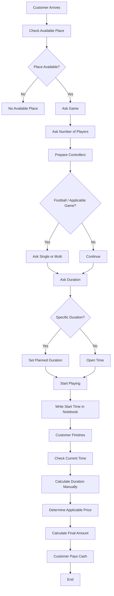

# +90 PS — Discovery

> **HISTORICAL DISCOVERY / AS-IS INPUT.** This file preserves earlier shop observations and proposed scope. Discount requirements below are superseded for Release 1; discounts are outside R1. The current decision/status sources are [BUSINESS_RULES_R1(1).md](../Requirements/BUSINESS_RULES_R1(1).md) and [CURRENT_STATE.md](../Reviews/CURRENT_STATE.md). Do not interpret older invoice/payment, Match, or Fixed proposals here as current approval.

> **Merged document**
>
> This file combines the following source documents without deleting their original content:
> - `DISCOVERY_BRIEF.md`
> - `AS_IS.md`
> - `FLOW_AND_STEPS.md`
>
> Recommended location: `docs/01_Discovery/DISCOVERY.md`

---

# Part 1 — Project Charter & Discovery Brief

# تحديث الخطة — 2026-09-06

نسخة مراجعة مستقلة؛ الأصول لم تُعدّل. [ابدأ هنا](README(1).md) · [القواعد المشتركة](BUSINESS_RULES(1).md) · [القرارات المفتوحة](DECISIONS.md) · [التغييرات](CHANGELOG.md).

حالة الدليل: المتطلبات الجديدة المؤكدة من المستخدم مذكورة بمصدرها في SHARED_RULES. بقية المحتوى الموروث يحتفظ بحالته السابقة، وليس اعتمادًا جديدًا. مخططات البنية العامة تمثل اتصال المكونات؛ ترتيب كتابة عمليات الفرع تحدده ADR-01 والمخططات المحدّثة، ولا يُستنتج من سهم عام WPF/API.

---

# +90 PS

## Project Charter & Discovery Brief

### Release 1 — Operational MVP

**Document Status:** Draft v0.1\
**Project:** +90 PS\
**Release:** Release 1 — Operational MVP\
**Project Type:** Multi-Branch PlayStation Shop Management System\
**Development Model:** Solo Developer\
**Current Branches:** 0\
**Future Target:** 40+ Branches

---

# 1. Project Overview

+90 PS هو نظام لإدارة وتشغيل محلات PlayStation، تم تصميمه ليبدأ من محل واحد ويكون قادرًا معماريًا على التوسع إلى عدة فروع مستقبلًا.

الهدف من Release 1 ليس بناء كل أفكار النظام النهائي، وإنما بناء **Operational MVP** يمكن لمحل حقيقي الاعتماد عليه في تشغيل العمليات الأساسية اليومية.

النظام في Release 1 يتكون من:

- WPF Desktop Application
- ASP.NET Core Web API
- Central SQL Server
- Local SQLite Database
- Synchronization Engine
- Authentication
- Authorization
- Reporting
- Security / Audit

ولا يوجد Website في Release 1.

---

# 2. Business Problem

البيئة المستهدفة تعتمد على تشغيل محلات PlayStation، حيث توجد عمليات متكررة مثل:

- معرفة الأجهزة المتاحة.
- بدء جلسات اللعب.
- حساب وقت/قيمة الجلسة.
- تطبيق أسعار مختلفة حسب نوع الجهاز.
- تطبيق أسعار مختلفة حسب Single / Multi.
- التعامل مع Hourly / Match pricing.
- إنهاء الجلسة وإنشاء الفاتورة.
- تحصيل النقدية.
- إدارة الكاشير والمدير.
- إدارة المصروفات.
- معرفة الإيرادات والأرباح.
- الحفاظ على التشغيل عند انقطاع الإنترنت.
- معرفة من قام بالعملية.
- حماية العمليات المالية الحساسة.

الهدف من +90 PS هو تحويل هذه العمليات من تشغيل يدوي/غير موحد إلى نظام واضح وقابل للتتبع.

---

# 3. Core Business Problem

المشكلة الأساسية التي يحاول النظام حلها هي:

> **إدارة التشغيل اليومي لمحل PlayStation بطريقة دقيقة وسريعة وآمنة، مع حساب صحيح للجلسات والفواتير والأموال، مع القدرة على الاستمرار في حالة انقطاع الإنترنت.**

---

# 4. Product Vision

الرؤية الأساسية لـ +90 PS:

> بناء نظام موحد لإدارة محلات PlayStation يبدأ كأداة تشغيل يومية بسيطة وموثوقة، ويمكنه لاحقًا التوسع إلى بيئة متعددة الفروع مع بيانات مركزية ورقابة مالية وتشغيلية قوية.

Release 1 يركز فقط على الـ Core Operational Problem.

---

# 5. Target Users

## 5.1 Cashier

المستخدم المسؤول عن التشغيل اليومي.

احتياجاته الأساسية:

- تسجيل الدخول بسرعة.
- رؤية الأجهزة.
- بدء جلسة.
- إيقاف مؤقت واستكمال.
- إنهاء جلسة.
- إصدار فاتورة.
- استلام النقد.
- استخدام Discount مسموح.
- استخدام الجهاز المشترك بأمان.

---

## 5.2 Manager

المستخدم المسؤول عن إدارة الفرع.

احتياجاته:

- إدارة الأجهزة.
- تعديل الأسعار.
- إدارة الموظفين حسب الصلاحيات.
- تسجيل المصروفات.
- مراجعة التقارير.
- تنفيذ العمليات الحساسة.
- اعتماد العمليات التي تحتاج صلاحية أعلى.

---

## 5.3 Owner

صاحب المحل/النشاط.

في Release 1 يتم تأسيس Ownership/Branch model بحيث يكون النظام قادرًا على معرفة:

```text
Owner
   ↓
Branch
```

وقد يكون لدى الـ Owner فرع واحد.

الـ Owner في Release 1 يحصل فقط على الوظائف التي تدخل في نطاق الإصدار.

---

# 6. Business Structure

النظام لا يفترض أن كل Owner يمتلك فرعًا واحدًا إلى الأبد.

البنية المستهدفة:

```text
Owner
   ├── Branch 01
   ├── Branch 02
   ├── Branch 03
   └── ...
```

Release 1 يجب أن يبني الـ Domain Model على أساس Branch-aware architecture.

---

# 7. Current Business Status

```text
Branches Today:
0

Future Target:
40+ Branches
```

لا توجد حاليًا فروع تشغيلية حقيقية مرتبطة بالنظام.

لذلك Release 1 يجب أن يكون قابلًا للاختبار أولًا ثم Pilot في فرع حقيقي.

---

# 8. Release 1 Mission

Release 1 يجب أن يمكّن محل PlayStation من:

```text
Login
  ↓
View Consoles
  ↓
Select Pricing
  ↓
Start Session
  ↓
Pause / Resume
  ↓
Complete Session
  ↓
Calculate Charge
  ↓
Create Invoice
  ↓
Receive Cash
  ↓
Record Transaction
  ↓
Manage Expenses
  ↓
View Reports
```

مع:

```text
Offline Operation
+
Local Storage
+
Synchronization
```

---

# 9. Release 1 Core Scope

## Identity

```text
Authentication
PIN
Lock Screen
User Switching
Roles
Permissions
```

## Branch

```text
Owner
Branch
Branch Configuration
Branch Isolation
```

## Gaming Operations

```text
Consoles
Console Types
Sessions
Start
Pause
Resume
Complete
Session Ownership
```

## Pricing

```text
PS4
PS5

Single
Multi

Hourly
Match
```

## Finance

```text
Invoices
Cash Payments
Discounts
Revenue
Profit
Expenses
Basic Shifts
```

## Administration

```text
Users
Consoles
Pricing
Expenses
Assets
```

## Platform

```text
Offline
SQLite
Synchronization
API
SQL Server
Audit
Logging
Security
Reports
```

---

# 10. Pricing Requirement

Pricing is NOT simply:

```text
PS4 = X
PS5 = Y
```

Pricing depends on:

```text
Console Type
+
Mode
+
Pricing Method
```

Therefore the system supports:

```text
PS4 + Single + Hourly
PS4 + Multi  + Hourly

PS5 + Single + Hourly
PS5 + Multi  + Hourly

PS4 + Single + Match
PS4 + Multi  + Match

PS5 + Single + Match
PS5 + Multi  + Match
```

Every branch can configure its own prices.

---

# 11. Match Pricing

Match تسعير مستقل عن Hourly. المستندات السابقة تقترح سعرًا ثابتًا ومدة يضبطها الفرع. وصف المستخدم يثبت أن الموظف قد يستخدم مؤقتًا تقريبيًا مثل 10 دقائق أو ينهي العملاء المباراة بأنفسهم؛ لا يثبت أن انتهاء المؤقت يجب أن ينهي الجلسة آليًا.

نحتفظ بقدرة التسعير بالماتش في Release 1. تحديد النهاية، وعدّ الماتشات المتتالية، والتمديد، والفاتورة المجمعة ينتظر O-04 في [سجل القرارات](DECISIONS.md). أرقام 10 و12 أمثلة إعدادات وليست مدة إلزامية أو تعريفًا نهائيًا للمباراة.

---

# 12. Session Requirements

Session must support:

```text
Start
Pause
Resume
Complete
```

The system must record:

```text
Branch
Console
Pricing
Opening User
Current Responsible User
Start Time
End Time
State
Final Charge
```

---

# 13. Session Ownership

When Cashier A starts a session:

```text
OpenedBy = Cashier A
```

This responsibility must remain visible in the system.

If the cashier needs to leave while sessions remain active, a protected manager handover workflow may be used.

---

# 14. Shared PC Requirement

Each branch uses one physical computer.

Multiple cashiers use the same machine.

Therefore:

```text
Cashier A
    ↓
Lock
    ↓
Cashier B enters PIN
    ↓
Cashier B becomes active
```

The application must always know the current user.

---

# 15. Authentication Requirement

Each Cashier/Manager uses a personal PIN.

PIN must not be stored as plaintext.

Authentication must work according to the offline policy when the Internet is unavailable.

---

# 16. Authorization Requirement

Authorization is based on:

```text
User
+
Role
+
Permission
+
Branch
```

The server/API must enforce authorization.

The WPF UI alone is not a security boundary.

---

# 17. Manager-Protected Operations

Sensitive operations may require:

```text
Manager PIN
+
Manager Permission
```

Examples:

```text
Invoice Cancellation
Manual Discount
Session Transfer
Other approved sensitive actions
```

---

# 18. Invoice Policy

Invoice is a financial record.

Cashier cannot freely delete it.

Recommended model:

```text
Invoice
   ↓
Manager Authorization
   ↓
Cancelled / Voided
```

The financial record remains in history.

---

# 19. Payment Requirement

Release 1 payment method:

```text
Cash
```

Flow:

```text
Invoice
   ↓
Cash
   ↓
Payment Recorded
   ↓
Invoice Paid
```

---

# 20. Discount Requirement

Two categories:

```text
Predefined Discount
→ Cashier may apply according to permission

Manual Discount
→ Manager authorization required
```

Sensitive discount actions should be auditable.

---

# 21. Expense Requirement

Only the Manager is authorized to create expenses.

Example:

```text
Manager
   ↓
Create Expense
   ↓
Branch
   ↓
Amount
   ↓
Category / Description
   ↓
Timestamp
```

Expenses affect profit calculations.

---

# 22. Financial Model

Release 1 operational calculation:

```text
Revenue
-
Expenses
=
Profit
```

Revenue comes from the gaming operation.

No food/product/cafeteria revenue exists.

---

# 23. Shift Requirement

Release 1 contains a basic Shift concept.

A Shift belongs to:

```text
Branch
+
Cashier
```

and records:

```text
Start
End
```

Full cash reconciliation is intentionally outside this release.

---

# 24. Asset / Inventory Requirement

Inventory means internal assets/equipment, not products for sale.

Categories:

```text
Consoles
Controllers
Accessories
Equipment
Assets
```

Controllers/accessories/equipment use quantity-based tracking where appropriate.

Example:

```text
Controllers = 12
```

---

# 25. Offline Requirement

```text
WPF → Local authorization + shared business rules
    → SQLite transaction: operational record + pending sync operation
    → Local success shown to cashier
    → Sync when online → API authentication/branch validation/idempotency
    → SQL Server transaction → acknowledgement → local sync status
```

قرار هندسي معتمد لهذه الخطة: عمليات الفرع الأساسية تكتب محليًا أولًا في الحالتين Online وOffline؛ الاتصال يغيّر توقيت المزامنة ولا يبدّل مكان إنشاء الفاتورة. التقرير المركزي والتهيئة المركزية لهما API، ولا يعني ذلك إعادة إرسال إنشاء الجلسة كعملية جديدة.
التفاصيل والحدود في [القرارات المشتركة](BUSINESS_RULES(1).md). المزامنة الناجحة تختلف عن نجاح الحفظ المحلي، وتظهر الحالتان للمستخدم.

---

# 26. Online Requirement

```text
WPF → Local authorization + shared business rules
    → SQLite transaction: operational record + pending sync operation
    → Local success shown to cashier
    → Sync when online → API authentication/branch validation/idempotency
    → SQL Server transaction → acknowledgement → local sync status
```

قرار هندسي معتمد لهذه الخطة: عمليات الفرع الأساسية تكتب محليًا أولًا في الحالتين Online وOffline؛ الاتصال يغيّر توقيت المزامنة ولا يبدّل مكان إنشاء الفاتورة. التقرير المركزي والتهيئة المركزية لهما API، ولا يعني ذلك إعادة إرسال إنشاء الجلسة كعملية جديدة.
التفاصيل والحدود في [القرارات المشتركة](BUSINESS_RULES(1).md). المزامنة الناجحة تختلف عن نجاح الحفظ المحلي، وتظهر الحالتان للمستخدم.

---

# 27. Synchronization Requirement

When the connection returns:

```text
SQLite
   ↓
Sync Queue
   ↓
Sync Engine
   ↓
ASP.NET Core API
   ↓
SQL Server
```

Synchronization must support:

```text
Retry
Idempotency
Duplicate detection
Conflict handling
Failure recovery
```

---

# 28. Security Requirement

Security applies to:

```text
Authentication
Authorization
PIN
Branch Isolation
Financial Operations
API
Database
Synchronization
Local Storage
Audit
Logging
```

---

# 29. Audit Requirement

Do not audit every click.

Audit sensitive actions.

Examples:

```text
Price Change
Invoice Cancellation
Manual Discount
Manager Override
Session Transfer
User/Permission Change
Sensitive Expense Action
Security Event
```

Audit should answer:

```text
Who?
What?
When?
Which branch?
Which entity?
Old value?
New value?
Why?
```

where appropriate.

---

# 30. Reports

Release 1 should provide basic reports for:

```text
Revenue
Expenses
Profit
Sessions
Invoices
```

Reports must respect branch and role permissions.

---

# 31. Non-Functional Requirements

Release 1 requires attention to:

```text
Security
Reliability
Offline resilience
Data integrity
Performance
Maintainability
Usability
Recoverability
Scalability foundation
```

---

# 32. Initial Technical Constraints

```text
One developer
One physical PC per branch
Offline requirement
Centralized backend
Local database
Cash payments
No external POS hardware
No printer
No barcode scanner
```

These constraints strongly affect the architecture.

---

# 33. Core Technical Stack

```text
Desktop:
C#
WPF
MVVM

Backend:
ASP.NET Core Web API

ORM:
Entity Framework Core

Central Database:
SQL Server

Local Database:
SQLite
```

---

# 34. High-Level Architecture

```text
WPF → Local authorization + shared business rules
    → SQLite transaction: operational record + pending sync operation
    → Local success shown to cashier
    → Sync when online → API authentication/branch validation/idempotency
    → SQL Server transaction → acknowledgement → local sync status
```

قرار هندسي معتمد لهذه الخطة: عمليات الفرع الأساسية تكتب محليًا أولًا في الحالتين Online وOffline؛ الاتصال يغيّر توقيت المزامنة ولا يبدّل مكان إنشاء الفاتورة. التقرير المركزي والتهيئة المركزية لهما API، ولا يعني ذلك إعادة إرسال إنشاء الجلسة كعملية جديدة.
التفاصيل والحدود في [القرارات المشتركة](BUSINESS_RULES(1).md). المزامنة الناجحة تختلف عن نجاح الحفظ المحلي، وتظهر الحالتان للمستخدم.

---

# 35. Release 1 Main Modules

```text
Authentication
Authorization
Owner
Branch
Users
Roles
Permissions

Console
Pricing
Session

Invoice
Payment
Discount

Shift
Expense
Asset

Reports

SQLite
Sync
Audit
Logging
Configuration
```

---

# 36. First Release Product Flow

```text
Cashier Login
      ↓
Dashboard
      ↓
Console Availability
      ↓
Select Console
      ↓
Select PS4 / PS5
      ↓
Select Single / Multi
      ↓
Select Hourly / Match
      ↓
Start Session
      ↓
Active
      ↓
Pause / Resume
      ↓
Complete
      ↓
Calculate
      ↓
Invoice
      ↓
Cash
      ↓
Complete
```

---

# 37. First Release Management Flow

```text
Manager Login
      ↓
Dashboard
      ↓
Manage Consoles
      ↓
Manage Pricing
      ↓
Manage Users
      ↓
Create Expenses
      ↓
View Reports
      ↓
Authorize Protected Actions
```

---

# 38. First Release Offline Flow

```text
WPF → Local authorization + shared business rules
    → SQLite transaction: operational record + pending sync operation
    → Local success shown to cashier
    → Sync when online → API authentication/branch validation/idempotency
    → SQL Server transaction → acknowledgement → local sync status
```

قرار هندسي معتمد لهذه الخطة: عمليات الفرع الأساسية تكتب محليًا أولًا في الحالتين Online وOffline؛ الاتصال يغيّر توقيت المزامنة ولا يبدّل مكان إنشاء الفاتورة. التقرير المركزي والتهيئة المركزية لهما API، ولا يعني ذلك إعادة إرسال إنشاء الجلسة كعملية جديدة.
التفاصيل والحدود في [القرارات المشتركة](BUSINESS_RULES(1).md). المزامنة الناجحة تختلف عن نجاح الحفظ المحلي، وتظهر الحالتان للمستخدم.

---

# 39. Project Success Definition

Release 1 is successful when a real PlayStation shop can:

```text
Log employees in
Manage consoles
Configure pricing
Start sessions
Pause/resume
Complete sessions
Calculate charges
Create invoices
Receive cash
Use approved discounts
Create expenses
View revenue
View expenses
View profit
Use one shared PC
Continue operating offline
Synchronize later
Protect sensitive actions
Maintain branch isolation
```

---

# 40. Critical Release 1 Risks

## Risk 1 — Scope Creep

The project can become too large because of additional feature requests.

Mitigation:

```text
Release 1 scope lock
Change request process
Prioritization
```

## Risk 2 — Offline Complexity

Offline operation creates synchronization and conflict problems.

Mitigation:

```text
Explicit offline architecture
Idempotency
Sync queue
Conflict handling
```

## Risk 3 — Financial Bugs

Billing errors directly affect the customer.

Mitigation:

```text
Unit tests
Integration tests
Pricing tests
Invoice tests
UAT
```

## Risk 4 — Security

Unauthorized access to branch or financial data is high impact.

Mitigation:

```text
Backend authorization
RBAC
Branch isolation
Audit
Security tests
```

---

# 41. Discovery Outputs

Before development begins, the Release 1 Discovery phase should produce:

```text
Project Charter
Problem Statement
Stakeholder Map
AS-IS Process
TO-BE Process
Business Goals
Business Rules
Scope
Non-Goals
Success Criteria
Risks
Assumptions
Initial Requirements
```

---

# 42. Next Discovery Artifacts

The immediate next documents are:

```text
01. Project Charter
02. Problem Statement
03. Stakeholder Map
04. AS-IS Process
05. TO-BE Process
06. Business Goals
07. Business Rules
08. Release 1 Scope
09. Non-Functional Requirements
10. Initial Risk Register
```

Only after those are sufficiently stable should the project move into:

```text
BRD
→ PRD
→ UX
→ System Analysis
→ Architecture
```

---

# 43. Discovery Principle

The team must not design a technical solution for a business problem that has not been properly understood.

The correct direction is:

```text
Understand
   ↓
Document
   ↓
Validate
   ↓
Design
   ↓
Build
```

not:

```text
Code
   ↓
Discover what the business needed
```

---

# 44. Current Discovery Status

النطاق والتقنيات واتجاه Open والتقريب موثقة. ما زالت تفاصيل الحساب والماتش والخصومات والورديات بحاجة إلى قرارات عند بواباتها؛ [DECISIONS](DECISIONS.md).

هذا تحديث تخطيط ووثائق؛ لا يعني أن البرنامج نُفّذ أو أن اختبارات التشغيل اجتازت. الحالة الفعلية للكود في [CODE_REVIEW](CODE_REVIEW.md).

---

# 45. Approval State

المستخدم اعتمد تنفيذ تحديث الخطة، وأكد الحفاظ على نطاق Release 1 وأولوية الإطلاق. هذا اعتماد لاتجاه المراجعة، وليس اعتمادًا تلقائيًا لكل مقترحات النماذج والأسعار في الوثائق السابقة. القرارات الجديدة مفصولة بين متطلبات مؤكدة وقرارات هندسية وأسئلة مفتوحة.

---

# 46. End of Project Charter / Discovery Brief

---

# Part 2 — AS-IS Current Business Process

# تحديث الخطة — 2026-09-06

نسخة مراجعة مستقلة؛ الأصول لم تُعدّل. [ابدأ هنا](README(1).md) · [القواعد المشتركة](BUSINESS_RULES(1).md) · [القرارات المفتوحة](DECISIONS.md) · [التغييرات](CHANGELOG.md).

حالة الدليل: المتطلبات الجديدة المؤكدة من المستخدم مذكورة بمصدرها في SHARED_RULES. بقية المحتوى الموروث يحتفظ بحالته السابقة، وليس اعتمادًا جديدًا. مخططات البنية العامة تمثل اتصال المكونات؛ ترتيب كتابة عمليات الفرع تحدده ADR-01 والمخططات المحدّثة، ولا يُستنتج من سهم عام WPF/API.

---

# +90 PS
## AS-IS Current Business Process
### Current Manual Shop Operation — Before +90 PS

**Document Status:** Discovery Draft v0.1

---

# 1. Process Overview

العملية الحالية داخل محل PlayStation تعتمد بشكل أساسي على:

```text
Employee
+
Paper Notebook
+
Manual Time Calculation
+
Manual Price Calculation
```

لا يوجد نظام مركزي يقوم بإدارة الجلسة أو حساب التكلفة تلقائيًا.

---

# 2. Customer Arrival

تبدأ العملية عندما يدخل العميل إلى المحل.

يقوم الموظف بالسؤال عن احتياج العميل.

الأسئلة الأساسية:

```text
"هتلعب لعبة إيه؟"
"إنتوا كام واحد؟"
"هتلعبوا قد إيه؟"
```

---

# 3. Determine Available Place

الموظف يبحث عن مكان/جهاز متاح.

العملية الحالية:

```text
Customer Arrives
       ↓
Employee checks available place
       ↓
Available?
   /        \
 Yes         No
  |           |
Continue    Customer waits /
            chooses another option
```

لا يوجد حاليًا نظام رقمي مركزي يوضح حالة كل جهاز بشكل موحد.

---

# 4. Determine Number of Players

الموظف يسأل:

```text
كام واحد هتلعبوا؟
```

وبناءً على العدد يتم تجهيز العدد المناسب من الـ Controllers.

مثال:

```text
4 Players
   ↓
Provide required controllers
```

---

# 5. Determine Game / Session Type

الموظف يسأل العميل عن اللعبة.

في حالة ألعاب كرة القدم، يسأل عن:

```text
Single
أو
Multi
```

وهذا الاختيار يؤثر على السعر.

---

# 6. Determine Session Duration

العميل إما يحدد مدة، أو يطلب Open: اللعب بلا مدة محددة مسبقًا حتى يطلب التوقف. مثال: يبدأ 1:00 وينتهي بطلبه 2:15، فالمدة 1:15.

في الماتش قد يستخدم الموظف مؤقت الهاتف لمدة تقريبية، أو ينتهي اللعب عندما ينهي العملاء المباراة. تحديد إنهاء آلي في البرنامج قرار TO-BE غير محسوم.

---

# 7. Record Session Start

بعد بداية اللعب، الموظف يقوم بتسجيل وقت البداية يدويًا في كشكول.

مثال:

```text
Customer
PS5
Multi

Start Time:
18:30
```

المصدر الأساسي للوقت هو التسجيل اليدوي.

---

# 8. During the Session

الموظف يعتمد على تسجيل البداية والملاحظة وساعة الهاتف أو Stopwatch/Timer. العملاء يلعبون، وعند طلب الحساب تُحسب المدة يدويًا. مؤقت الماتش مثال لأداة الموظف الحالية، وليس دليلًا على إلزام النظام بإنهاء الجلسة عند انقضائه.

---

# 9. Session Completion

عندما ينتهي العميل من اللعب، يتوجه إلى الموظف ويطلب إنهاء الحساب.

الموظف يحتاج إلى معرفة:

```text
متى بدأ العميل؟
متى انتهى؟
```

---

# 10. Determine Current Time

الموظف قد يستخدم هاتفه لمعرفة الوقت الحالي.

مثال:

```text
Phone Clock:
21:10
```

وبالتالي:

```text
End Time = Current Time
```

---

# 11. Calculate Duration Manually

الموظف يرجع إلى وقت البداية المسجل في الكشكول ويحسب الفرق.

مثال:

```text
Start:
18:30

End:
21:10
```

ثم:

```text
21:10 - 18:30
=
2h 40m
```

الحساب يتم يدويًا.

---

# 12. Determine Price

بعد معرفة مدة اللعب، الموظف يستخدم السعر المناسب.

السعر يعتمد على قواعد المحل، ومنها:

```text
Console Type
+
Single / Multi
+
Pricing Method
```

مثلًا:

```text
PS4 + Single
PS4 + Multi

PS5 + Single
PS5 + Multi
```

وقد تختلف الأسعار بين المحلات/الفروع.

---

# 13. Final Manual Calculation

الموظف يحسب المبلغ المستحق يدويًا.

Conceptually:

```text
Start Time
      ↓
End Time
      ↓
Duration
      ↓
Pricing
      ↓
Final Amount
```

---

# 14. Payment

بعد إتمام الحساب:

```text
Employee tells customer the amount
        ↓
Customer pays
        ↓
Transaction completed
```

طريقة الدفع الأساسية هي:

```text
Cash
```

---

# 15. Current End-to-End AS-IS Flow

```text
Customer Arrives
       ↓
Employee checks available place
       ↓
Ask what game?
       ↓
Ask number of players
       ↓
Prepare controllers
       ↓
Ask Single / Multi when applicable
       ↓
Ask how long?
       ↓
Specific duration OR open time
       ↓
Start playing
       ↓
Employee writes start time in notebook
       ↓
Customer finishes
       ↓
Customer asks for bill
       ↓
Employee checks current time
       ↓
Employee subtracts start from end
       ↓
Employee determines price
       ↓
Employee calculates amount
       ↓
Customer pays cash
       ↓
Transaction ends
```

---

# 16. AS-IS Process Map



---

# 17. Current Information Sources

The current process depends on multiple manual information sources:

```text
Customer verbal information
+
Employee observation
+
Physical availability
+
Paper notebook
+
Employee's phone clock
+
Manual arithmetic
```

There is no single source of truth.

---

# 18. Current Pain Point — Manual Timing

The system currently depends on:

```text
Employee writes start time
+
Employee checks current time later
+
Employee calculates difference
```

This introduces avoidable operational risk.

---

# 19. Current Pain Point — Manual Calculation

The final amount is calculated manually.

Potential errors:

```text
Wrong start time
Wrong end time
Wrong subtraction
Wrong duration
Wrong price
Wrong Single/Multi price
Wrong PS4/PS5 price
```

---

# 20. Current Pain Point — Human Error

The confirmed business problem is that employees can:

```text
Get confused
Calculate incorrectly
Forget information
Use an incorrect time
Use an incorrect price
```

The financial impact is potentially direct because the final customer payment depends on the calculation.

---

# 21. Current Pain Point — Paper Dependency

The process depends on a physical notebook.

Potential problems:

```text
Lost information
Illegible information
Wrong entry
Missing entry
Difficult history search
No automatic reporting
```

---

# 22. Current Pain Point — No Live Session State

There is no defined digital source showing:

```text
Which console is occupied?
Which console is available?
Who started the session?
When did it start?
How long has it been running?
```

The employee must rely on observation and paper notes.

---

# 23. Current Pain Point — No Automatic Billing

The current workflow is:

```text
Record
+
Remember
+
Calculate
+
Tell Customer
```

Instead of:

```text
System
+
Automatic Tracking
+
Automatic Calculation
```

---

# 24. Current Pain Point — Pricing Risk

Since pricing depends on multiple factors:

```text
Console Type
+
Single/Multi
+
Pricing Method
```

manual selection and calculation create opportunities for incorrect pricing.

---

# 25. Current Pain Point — Operational Dependence on Employee

The current process depends heavily on the employee doing the correct thing at every step.

For example:

```text
Employee must remember to record start time.
Employee must record it correctly.
Employee must read it correctly later.
Employee must check current time.
Employee must calculate the duration.
Employee must choose the right price.
Employee must calculate the final amount.
```

The system should move as much of this responsibility as practical from the human to software.

---

# 26. AS-IS Risk Chain

The current process can be represented as:

```text
Manual Input
    ↓
Manual Record
    ↓
Manual Time Check
    ↓
Manual Calculation
    ↓
Manual Pricing Selection
    ↓
Manual Final Amount
    ↓
Cash Payment
```

Every manual step is a possible error point.

---

# 27. Main Business Problem Identified

The strongest business problem discovered so far is:

> **The shop relies on manual recording and manual arithmetic to track gaming sessions and calculate customer charges, which can lead to incorrect timing, pricing and final payment amounts.**

---

# 28. Main Opportunity for +90 PS

+90 PS can replace the manual chain with:

```text
Customer Request
       ↓
Employee selects configuration
       ↓
System starts session
       ↓
System records exact start
       ↓
System tracks state/time
       ↓
System applies correct pricing
       ↓
System calculates amount
       ↓
Employee confirms
       ↓
Cash Payment
```

---

# 29. Important Discovery Observation

The real value of +90 PS is not simply:

```text
"Digitize the notebook."
```

The deeper objective is:

```text
Reduce human calculation
+
Reduce operational mistakes
+
Create reliable records
+
Make the employee workflow faster
+
Make financial results more trustworthy
```

---

# 30. AS-IS Actors

Current process participants:

```text
Customer
   ↓
Employee / Cashier
```

The employee currently performs most of the system's operational responsibilities manually.

---

# 31. AS-IS Data Captured

Currently known information:

```text
Game
Number of Players
Controllers Required
Single / Multi where applicable
Requested Duration
Start Time
End Time
Calculated Duration
Applicable Price
Final Amount
Cash Payment
```

The exact information currently written into the notebook still needs validation.

---

# 32. AS-IS Business Rules Discovered

الوصف الحالي: مكان متاح، لعبة وعدد لاعبين، Single/Multi عند انطباقه، مدة محددة أو Open، تسجيل البداية، انتهاء بطلب العميل أو انتهاء المباراة، حساب يدوي ثم نقد.

المستخدم طلب من النظام لاحقًا حسابًا دقيقًا وتقريبًا محدودًا. لم نتحقق أن الموظف يطبق حاليًا سياسة آلية ثابتة لكل الحالات. لذلك تُوثّق السياسة في TO-BE داخل [SHARED_RULES](BUSINESS_RULES(1).md)، لا كحقيقة مشاهدة عن التشغيل اليدوي.

---

# 33. Important Questions Still Open

تم توضيح معنى Open، وطريقة استخدام مؤقت الهاتف، ومتطلب التقريب في البرنامج. لا تبقى هذه أسئلة عامة مفتوحة.

التحقق المتبقي من الواقع: طريقة إثبات نهاية المباراة، تسجيل عدة ماتشات، وجود إيصال حالي أو دفعات جزئية، متابعة الكنترولرز التالفة أو الناقصة، وآلية اختيار الجهاز عند عدم التوفر.

أسئلة تصميم البرنامج التي تُحسم قبل الجزء المعني: الثواني والتوقف والحد الأدنى والأسعار والخصومات والورديات والصلاحيات؛ راجع [DECISIONS](DECISIONS.md). لا نخلطها بوصف ممارسة المحل الحالية.

---

# 34. Discovery Conclusion

The first confirmed operational problem is not a lack of screens or lack of automation.

It is:

```text
Manual session management
+
Manual time tracking
+
Manual arithmetic
+
Manual pricing
```

This is the problem Release 1 must solve first.

---

# 35. Transition to TO-BE

الخطوة التالية وصف TO-BE لجزء الجلسة والحساب والحفظ المحلي في [FIRST_SLICE](FIRST_SLICE.md)، مع الإجابة عن أسئلة الحساب اللازمة. يمكن مراجعة الكود وأساس الحفظ والهوية أثناء انتظار إجابات قواعد التشغيل. لا يلزم إنهاء جميع وثائق الإصدارات اللاحقة.

---

---

# Part 3 — Project Outputs / Flow & Steps

# مخرجات المشروع — 56 بندًا محفوظًا

تجميع للمخرجات، لا سلسلة من 56 موافقة قبل الكود. الجمع لا يلغي بندًا؛ مستوى التفصيل يلائم الجزء الحالي.

| # | المخرج الأصلي | مجموعة العمل | متى | مكان/شكل الإنجاز |
|---|---|---|---|---|
| 01 | Discovery Document | A — Product and acceptance | M0 ثم مع كل قدرة | DISCOVERY_BRIEF + RELEASE_1 + R1_ACCEPTANCE؛ تفصيل R2/R3 عند بدء الإصدار |
| 02 | Problem Statement | A — Product and acceptance | M0 ثم مع كل قدرة | DISCOVERY_BRIEF + RELEASE_1 + R1_ACCEPTANCE؛ تفصيل R2/R3 عند بدء الإصدار |
| 03 | Business Goals | A — Product and acceptance | M0 ثم مع كل قدرة | DISCOVERY_BRIEF + RELEASE_1 + R1_ACCEPTANCE؛ تفصيل R2/R3 عند بدء الإصدار |
| 04 | Stakeholder Map | A — Product and acceptance | M0 ثم مع كل قدرة | DISCOVERY_BRIEF + RELEASE_1 + R1_ACCEPTANCE؛ تفصيل R2/R3 عند بدء الإصدار |
| 05 | Personas | A — Product and acceptance | M0 ثم مع كل قدرة | DISCOVERY_BRIEF + RELEASE_1 + R1_ACCEPTANCE؛ تفصيل R2/R3 عند بدء الإصدار |
| 06 | AS-IS Process | A — Product and acceptance | M0 ثم مع كل قدرة | DISCOVERY_BRIEF + RELEASE_1 + R1_ACCEPTANCE؛ تفصيل R2/R3 عند بدء الإصدار |
| 07 | TO-BE Process | A — Product and acceptance | M0 ثم مع كل قدرة | DISCOVERY_BRIEF + RELEASE_1 + R1_ACCEPTANCE؛ تفصيل R2/R3 عند بدء الإصدار |
| 08 | BRD | A — Product and acceptance | M0 ثم مع كل قدرة | DISCOVERY_BRIEF + RELEASE_1 + R1_ACCEPTANCE؛ تفصيل R2/R3 عند بدء الإصدار |
| 09 | Scope | A — Product and acceptance | M0 ثم مع كل قدرة | DISCOVERY_BRIEF + RELEASE_1 + R1_ACCEPTANCE؛ تفصيل R2/R3 عند بدء الإصدار |
| 10 | Product Vision | A — Product and acceptance | M0 ثم مع كل قدرة | DISCOVERY_BRIEF + RELEASE_1 + R1_ACCEPTANCE؛ تفصيل R2/R3 عند بدء الإصدار |
| 11 | PRD | A — Product and acceptance | M0 ثم مع كل قدرة | DISCOVERY_BRIEF + RELEASE_1 + R1_ACCEPTANCE؛ تفصيل R2/R3 عند بدء الإصدار |
| 12 | Functional Requirements | A — Product and acceptance | M0 ثم مع كل قدرة | DISCOVERY_BRIEF + RELEASE_1 + R1_ACCEPTANCE؛ تفصيل R2/R3 عند بدء الإصدار |
| 13 | Non-Functional Requirements | A — Product and acceptance | M0 ثم مع كل قدرة | DISCOVERY_BRIEF + RELEASE_1 + R1_ACCEPTANCE؛ تفصيل R2/R3 عند بدء الإصدار |
| 14 | User Stories | A — Product and acceptance | M0 ثم مع كل قدرة | DISCOVERY_BRIEF + RELEASE_1 + R1_ACCEPTANCE؛ تفصيل R2/R3 عند بدء الإصدار |
| 15 | Acceptance Criteria | A — Product and acceptance | M0 ثم مع كل قدرة | DISCOVERY_BRIEF + RELEASE_1 + R1_ACCEPTANCE؛ تفصيل R2/R3 عند بدء الإصدار |
| 16 | MVP Definition | A — Product and acceptance | M0 ثم مع كل قدرة | DISCOVERY_BRIEF + RELEASE_1 + R1_ACCEPTANCE؛ تفصيل R2/R3 عند بدء الإصدار |
| 17 | Product Backlog | A — Product and acceptance | M0 ثم مع كل قدرة | DISCOVERY_BRIEF + RELEASE_1 + R1_ACCEPTANCE؛ تفصيل R2/R3 عند بدء الإصدار |
| 18 | User Journey | A — Product and acceptance | M0 ثم مع كل قدرة | DISCOVERY_BRIEF + RELEASE_1 + R1_ACCEPTANCE؛ تفصيل R2/R3 عند بدء الإصدار |
| 19 | Information Architecture | B — UX/UI | M1 ثم M3 | تدفق كاشير وشاشات الجزء أولًا؛ توسيع النظام البصري مع الحاجة |
| 20 | UX Flows | B — UX/UI | M1 ثم M3 | تدفق كاشير وشاشات الجزء أولًا؛ توسيع النظام البصري مع الحاجة |
| 21 | Wireframes | B — UX/UI | M1 ثم M3 | تدفق كاشير وشاشات الجزء أولًا؛ توسيع النظام البصري مع الحاجة |
| 22 | UI Design | B — UX/UI | M1 ثم M3 | تدفق كاشير وشاشات الجزء أولًا؛ توسيع النظام البصري مع الحاجة |
| 23 | Design System | B — UX/UI | M1 ثم M3 | تدفق كاشير وشاشات الجزء أولًا؛ توسيع النظام البصري مع الحاجة |
| 24 | System Context | C — Architecture/data/contracts | M0–M2 ثم مع كل تغيير | SHARED_RULES + عقد وERD/رسم للجزء عند الحاجة |
| 25 | Use Cases | C — Architecture/data/contracts | M0–M2 ثم مع كل تغيير | SHARED_RULES + عقد وERD/رسم للجزء عند الحاجة |
| 26 | Activity Diagrams | C — Architecture/data/contracts | M0–M2 ثم مع كل تغيير | SHARED_RULES + عقد وERD/رسم للجزء عند الحاجة |
| 27 | Sequence Diagrams | C — Architecture/data/contracts | M0–M2 ثم مع كل تغيير | SHARED_RULES + عقد وERD/رسم للجزء عند الحاجة |
| 28 | State Diagrams | C — Architecture/data/contracts | M0–M2 ثم مع كل تغيير | SHARED_RULES + عقد وERD/رسم للجزء عند الحاجة |
| 29 | C4 Architecture | C — Architecture/data/contracts | M0–M2 ثم مع كل تغيير | SHARED_RULES + عقد وERD/رسم للجزء عند الحاجة |
| 30 | Component Diagram | C — Architecture/data/contracts | M0–M2 ثم مع كل تغيير | SHARED_RULES + عقد وERD/رسم للجزء عند الحاجة |
| 31 | Deployment Diagram | C — Architecture/data/contracts | M0–M2 ثم مع كل تغيير | SHARED_RULES + عقد وERD/رسم للجزء عند الحاجة |
| 32 | ERD | C — Architecture/data/contracts | M0–M2 ثم مع كل تغيير | SHARED_RULES + عقد وERD/رسم للجزء عند الحاجة |
| 33 | Data Dictionary | C — Architecture/data/contracts | M0–M2 ثم مع كل تغيير | SHARED_RULES + عقد وERD/رسم للجزء عند الحاجة |
| 34 | API Specification | C — Architecture/data/contracts | M0–M2 ثم مع كل تغيير | SHARED_RULES + عقد وERD/رسم للجزء عند الحاجة |
| 35 | ADRs | C — Architecture/data/contracts | M0–M2 ثم مع كل تغيير | SHARED_RULES + عقد وERD/رسم للجزء عند الحاجة |
| 36 | Threat Model | D — Security/audit | قبل تنفيذ القدرة وفي كل معلم | قرارات الثقة وPIN والصلاحيات وأحداث السجل مع اختبارات الرفض |
| 37 | Security Requirements | D — Security/audit | قبل تنفيذ القدرة وفي كل معلم | قرارات الثقة وPIN والصلاحيات وأحداث السجل مع اختبارات الرفض |
| 38 | RBAC Model | D — Security/audit | قبل تنفيذ القدرة وفي كل معلم | قرارات الثقة وPIN والصلاحيات وأحداث السجل مع اختبارات الرفض |
| 39 | Audit Strategy | D — Security/audit | قبل تنفيذ القدرة وفي كل معلم | قرارات الثقة وPIN والصلاحيات وأحداث السجل مع اختبارات الرفض |
| 40 | Test Plan | E — Verification | M1–M4 | R1_ACCEPTANCE + نتائج الاختبارات عند تنفيذها + UAT قبل Pilot |
| 41 | Test Cases | E — Verification | M1–M4 | R1_ACCEPTANCE + نتائج الاختبارات عند تنفيذها + UAT قبل Pilot |
| 42 | UAT Plan | E — Verification | M1–M4 | R1_ACCEPTANCE + نتائج الاختبارات عند تنفيذها + UAT قبل Pilot |
| 43 | CI/CD Plan | F — Delivery/operations | تجربة M2، إقفال M4 | خطة ترحيل واستعادة وتثبيت وتجربة وتشغيل قبل الإطلاق |
| 44 | Deployment Plan | F — Delivery/operations | تجربة M2، إقفال M4 | خطة ترحيل واستعادة وتثبيت وتجربة وتشغيل قبل الإطلاق |
| 45 | Backup Plan | F — Delivery/operations | تجربة M2، إقفال M4 | خطة ترحيل واستعادة وتثبيت وتجربة وتشغيل قبل الإطلاق |
| 46 | Disaster Recovery | F — Delivery/operations | تجربة M2، إقفال M4 | خطة ترحيل واستعادة وتثبيت وتجربة وتشغيل قبل الإطلاق |
| 47 | Monitoring | F — Delivery/operations | تجربة M2، إقفال M4 | خطة ترحيل واستعادة وتثبيت وتجربة وتشغيل قبل الإطلاق |
| 48 | Logging | F — Delivery/operations | تجربة M2، إقفال M4 | خطة ترحيل واستعادة وتثبيت وتجربة وتشغيل قبل الإطلاق |
| 49 | Branch Onboarding | F — Delivery/operations | تجربة M2، إقفال M4 | خطة ترحيل واستعادة وتثبيت وتجربة وتشغيل قبل الإطلاق |
| 50 | Pilot Plan | F — Delivery/operations | تجربة M2، إقفال M4 | خطة ترحيل واستعادة وتثبيت وتجربة وتشغيل قبل الإطلاق |
| 51 | Rollout Plan | F — Delivery/operations | تجربة M2، إقفال M4 | خطة ترحيل واستعادة وتثبيت وتجربة وتشغيل قبل الإطلاق |
| 52 | Support Process | G — Support/improvement | M4 وما بعده | مسار البلاغات والإصدارات والمؤشرات والتحسين بعد التغذية الراجعة |
| 53 | Incident Management | G — Support/improvement | M4 وما بعده | مسار البلاغات والإصدارات والمؤشرات والتحسين بعد التغذية الراجعة |
| 54 | Release Management | G — Support/improvement | M4 وما بعده | مسار البلاغات والإصدارات والمؤشرات والتحسين بعد التغذية الراجعة |
| 55 | Product Metrics | G — Support/improvement | M4 وما بعده | مسار البلاغات والإصدارات والمؤشرات والتحسين بعد التغذية الراجعة |
| 56 | Continuous Improvement | G — Support/improvement | M4 وما بعده | مسار البلاغات والإصدارات والمؤشرات والتحسين بعد التغذية الراجعة |

---

# Merge Notes

- The original source text has been preserved.
- This merge does not itself resolve open decisions or change requirement status.
- Cross-file links that still reference the former standalone files can be updated later after the final folder structure is applied.
