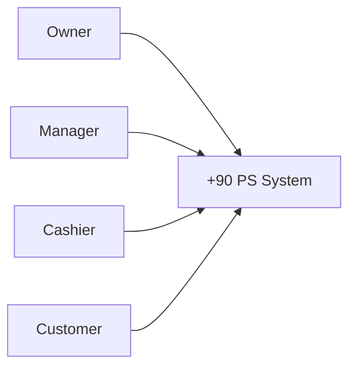
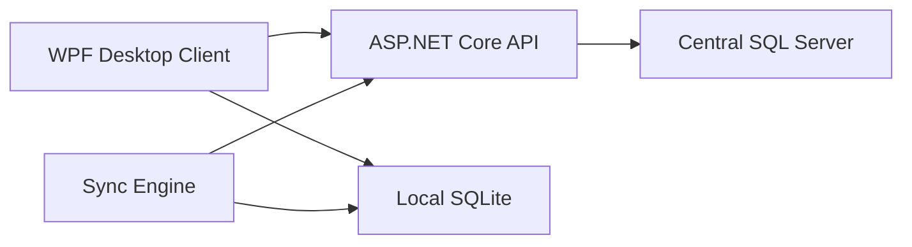
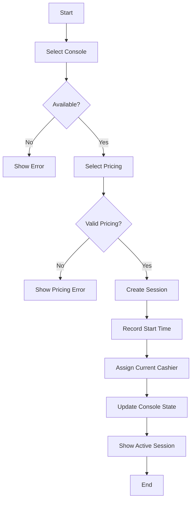
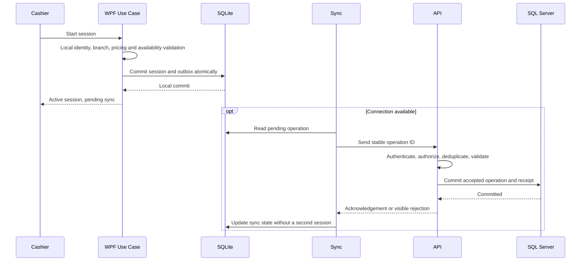
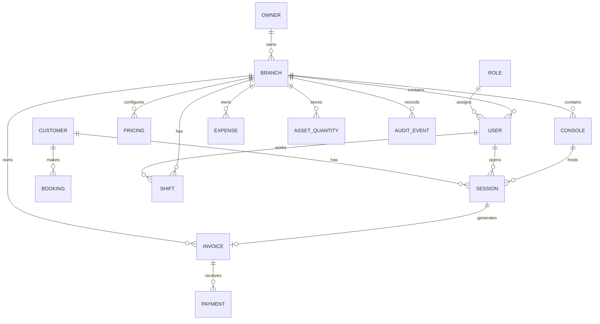

# تحديث الخطة — 2026-09-06

نسخة مراجعة مستقلة؛ الأصول لم تُعدّل. [ابدأ هنا](README(1).md) · [القواعد المشتركة](BUSINESS_RULES(1).md) · [القرارات المفتوحة](DECISIONS.md) · [التغييرات](CHANGELOG.md).

حالة الدليل: المتطلبات الجديدة المؤكدة من المستخدم مذكورة بمصدرها في SHARED_RULES. بقية المحتوى الموروث يحتفظ بحالته السابقة، وليس اعتمادًا جديدًا. مخططات البنية العامة تمثل اتصال المكونات؛ ترتيب كتابة عمليات الفرع تحدده ADR-01 والمخططات المحدّثة، ولا يُستنتج من سهم عام WPF/API.

---

# +90 PS — Master Project Documentation
## Product, Business, Requirements, Architecture, Security, Development, QA, Deployment & Operations

> **Document Status:** Master Working Specification  
> **Project:** +90 PS  
> **Current Planning Date:** 2026-09-04  
> **Primary Goal:** Build a professional multi-branch PlayStation shop management product, initially as a WPF Desktop Application + ASP.NET Core API + Central SQL Server, with local offline storage/synchronization, and evolve it through three major product releases toward a complete 40+ branch platform.

---

# 0. Purpose of This Document

هذا المستند مرجع الرؤية وحدود المنتج والقرارات المشتركة. تفاصيل كل إصدار في [R1](R1_OPERATIONAL_MVP.md)، [R2](R2_EXPANDED_MVP.md)، [R3](R3_FULL_PRODUCT.md). قواعد الحساب ومسار الحفظ لا تُنسخ كسياسات مستقلة؛ مرجعها [SHARED_RULES](BUSINESS_RULES(1).md).

المصادر القديمة محفوظة بأكملها في original_sources.zip. تعليمات المحادثة المعتمدة لهذه المراجعة مبيّنة في سجل القرارات؛ نصوص المستندات السابقة أدلة ومقترحات وليست تعليمات تنفيذ مستقلة.

اختيار المستخدم: إطلاق أسرع مع الحفاظ على كل مميزات R1. التوثيق يخدم التنفيذ ويُحدّث معه.

---

# 1. Executive Summary

+90 PS is a multi-branch management system for PlayStation gaming shops.

The system is intended to manage the core operation of a gaming shop:

- Customers
- Customer accounts
- Customer history
- Bookings
- PlayStation consoles
- Pricing
- Single / Multi modes
- Hourly pricing
- Match-based pricing
- Gaming sessions
- Pause / Resume / Complete
- Cash payments
- Invoices
- Shifts
- Expenses
- Revenue
- Profit
- Discounts
- Asset / Equipment inventory
- Manager and cashier permissions
- Manager overrides
- Audit records for sensitive actions
- Offline operation
- Local storage
- Synchronization with a central server
- Branch-level management
- Multi-branch management
- Reports
- Future automated report delivery
- Future plan/package entitlements
- Future Web/Mobile clients through the same API

The initial product deliberately avoids building a Website and avoids food/cafeteria/product-sales functionality.

The first customer-facing model is intended to be a **usable operational MVP** that can run a real shop without relying on later advanced capabilities.

The product then evolves through:

```text
Release 1 — Operational MVP
        ↓
Release 2 — Expanded MVP
        ↓
Release 3 — Full Product
```

The exact commercial package system will be defined later, but the architecture should be able to support feature/plan entitlements.

---

# 2. Core Product Vision

> +90 PS is an integrated multi-branch management platform for PlayStation gaming shops, designed to simplify daily branch operations, accurately manage gaming sessions and bookings, centralize financial visibility, support offline operation, and scale from one shop to 40+ branches.

The system should be designed as a real product rather than as a one-off desktop application.

---

# 3. Fundamental Product Principles

## 3.1 Product, Not Just Application

+90 PS is one product composed of multiple technical parts:

```text
+90 PS Product
    |
    +-- WPF Desktop Client
    |
    +-- ASP.NET Core Web API
    |
    +-- Central SQL Server
    |
    +-- Local SQLite
    |
    +-- Synchronization Engine
    |
    +-- Security / Authorization
    |
    +-- Reporting
    |
    +-- Deployment / Update
    |
    +-- Monitoring / Operations
```

---

## 3.2 Desktop and Backend Are the Phase 1 Core

Phase 1 intentionally contains:

```text
WPF Desktop App
+
ASP.NET Core API
+
Central SQL Server
+
Local SQLite
+
Synchronization
```

There is **no Website in Phase 1**.

---

## 3.3 Business Logic Must Not Live Only in WPF

The WPF application is a client.

The central API is responsible for important server-side business rules, authorization, data integrity, and centralized operations.

A user must not be able to bypass permissions simply by manipulating the WPF interface.

Example:

```text
WPF says "Delete Invoice" is hidden
        +
API independently rejects unauthorized deletion
```

Both layers matter.

---

## 3.4 Offline Is a Core Requirement

Offline capability is not a future add-on.

A branch must continue core operations when the Internet is unavailable.

The system should support:

```text
Online
+
Offline
+
Later Synchronization
```

---

## 3.5 Release-Based Development

The project will not attempt to build everything before the customer sees anything.

Instead:

```text
Discover
    ↓
Design enough for current release
    ↓
Develop
    ↓
Test
    ↓
Deliver
    ↓
Collect Bugs / Feedback
    ↓
Build next release
```

---

# 4. Current Business Situation

Current number of branches:

```text
0
```

Future target:

```text
40+ branches
```

The target is future expansion, not an existing 40-branch customer.

---

# 5. Business Structure

+90 PS is not necessarily one legal company with a single branch.

The product must support a business/owner having:

```text
Owner / Business
    |
    +-- Branch 01
    +-- Branch 02
    +-- Branch 03
    +-- ...
    +-- Branch 40+
```

A person/business can operate one branch today and add another branch later.

The architecture should make that transition possible without rebuilding the system.

---

# 6. Single-Branch vs Multi-Branch Experience

The product is intended to behave like a feature/plan-based product.

Example:

### Single-location customer

```text
Owner
  |
  +-- Branch A
```

They should not necessarily see or use multi-branch functionality such as:

- Cross-branch reporting
- Branch-to-branch transfers
- Employee transfers
- Asset transfers between branches
- Cross-branch management

### Multi-branch customer

```text
Owner
  |
  +-- Branch A
  +-- Branch B
```

They can gain access to multi-branch capabilities.

If the same owner expands from one branch to two branches later, the system should be able to enable the relevant functionality without rebuilding the product.

This is intended to become part of a future **4-package commercial model**.

The 4 packages are intentionally not finalized yet.

---

# 7. Confirmed Scope

## 7.1 Included in the Overall MVP Program

The project will eventually contain:

- Authentication
- Users
- Roles
- Permissions
- Owner concept
- Branches
- Consoles
- Pricing
- Single/Multi modes
- Hourly pricing
- Match pricing
- Sessions
- Pause / Resume / Complete
- Bookings
- Customers
- Customer accounts
- Customer history
- Invoices
- Cash payments
- Discounts
- Shifts
- Expenses
- Revenue
- Profit
- Asset / Equipment inventory
- Inter-branch quantity transfers where applicable
- Manager overrides
- Audit logging for sensitive operations
- Offline operation
- Local SQLite
- Synchronization
- Reporting
- Multi-branch architecture
- Deployment/update mechanism
- Monitoring/operations capabilities as the system matures

---

# 8. Explicitly Out of Scope for the Initial Product

The following are not part of the initial product scope:

- Website
- Mobile application
- Customer website
- Food sales
- Drinks sales
- Cafeteria
- General product sales
- Printer integration
- Barcode scanner integration
- POS hardware integration
- Membership system

Website and Mobile are future clients, not current requirements.

The API architecture must allow them to be added later.

---

# 9. Important Scope Clarification

There is a difference between:

```text
Overall MVP Program
```

and:

```text
Release 1 Operational MVP
```

Customer Accounts, Customer History, and Bookings are part of the broader MVP roadmap, but the intended first deliverable is focused on the minimum features necessary for a shop to operate reliably.

Therefore:

```text
Release 1
= Operational MVP

Release 2
= Expanded MVP
  including Customer/Booking functionality

Release 3
= Full Product
```

This keeps the first deployment practical while still treating the broader MVP as a staged product.

---

# 10. Product Release Strategy

## Release 1 — Operational MVP

Goal:

> Give a real shop a usable system that can run its core operations without depending on later advanced features.

Core capabilities:

- Authentication
- Manager / Cashier access
- PIN login
- Lock screen
- User switching
- Branch context
- Console management
- Pricing
- PS4 / PS5 or other console categories
- Single / Multi modes
- Hourly pricing
- Match pricing
- Gaming sessions
- Start
- Pause
- Resume
- Complete
- Cash payments
- Invoice generation
- Basic discounts
- Shifts
- Manager-only expenses
- Basic revenue
- Basic profit
- Basic reporting
- Offline operation
- Local SQLite
- Synchronization
- Sensitive action authorization
- Initial audit logging
- Core asset/equipment tracking

The first release should be able to support an actual shop's basic daily operation.

---

# 11. Release 2 — Expanded MVP

This release builds on Release 1.

Expected features include:

- Customer Accounts
- Customer History
- Bookings
- Booking lifecycle
- Booking deposit handling
- Late arrival rules
- No-show behavior
- Customer lookup by phone
- Booking history
- Expanded customer reporting
- More advanced discounts where justified
- Improved reports
- More advanced asset management
- Additional configuration
- Improvements discovered through Release 1 usage

Release 2 also incorporates:

```text
Bug fixes from Release 1
+
Real customer feedback
+
Observed operational improvements
```

---

# 12. Release 3 — Full Product

Release 3 represents the complete mature product.

Potential components, depending on validated business demand:

- Advanced analytics
- Advanced reports
- Automated report delivery
- More complete multi-branch management
- Asset transfers
- Employee transfers
- Advanced financial functions
- Accounting integration
- Advanced booking
- Advanced discounts
- Advanced asset management
- Feature/package management
- More robust deployment/update management
- More mature monitoring
- Additional automation
- Other high-value capabilities discovered after real usage

"Full Product" does not mean every hypothetical feature in the world. It means the agreed complete +90 PS product scope at that time.

---

# 13. Release Lifecycle

Each release follows its own mini-product cycle:

```text
Customer / Business Need
        ↓
Discovery
        ↓
Requirement Definition
        ↓
Impact Analysis
        ↓
UX/UI Changes
        ↓
Architecture Changes
        ↓
Development
        ↓
Testing
        ↓
UAT
        ↓
Deployment
        ↓
Customer Usage
        ↓
Bug Reports / Feedback
        ↓
Next Release
```

A bug found in Release 1 can be fixed as:

```text
Release 1.0.1
```

while Release 2 continues independently.

The fix should also be merged/forward-ported appropriately so the same bug does not remain in the newer release.

---

# 14. Professional Project Lifecycle

The overall engineering lifecycle is:

```text
1. Discovery
2. Business Analysis
3. Product Requirements
4. UX Research
5. UX/UI Design
6. System Analysis
7. Architecture
8. Database Design
9. API Design
10. Security / Threat Modeling
11. Offline / Synchronization Design
12. Development Foundation
13. Feature Development
14. Testing / QA
15. UAT
16. Deployment
17. Pilot
18. Production
19. Monitoring
20. Support
21. Feedback
22. Continuous Improvement
23. Multi-Branch Rollout
24. Scale
```

These are not one giant waterfall block.

They are repeated at the appropriate scope for each release.

---

# 15. Discovery Phase

Discovery answers:

> What problem are we solving?

Not:

> Which WPF button should we build?

---

# 16. Discovery Objectives

- Understand the business
- Understand current workflow
- Identify users
- Identify responsibilities
- Identify pain points
- Define business goals
- Define scope
- Define assumptions
- Identify risks
- Identify future needs
- Identify what must be in Release 1
- Identify what can wait

---

# 17. Stakeholders

Initial stakeholder model:

```text
Owner
  |
  +-- Manager
        |
        +-- Cashier
```

Additional stakeholders may include:

- Business owner
- Branch manager
- Cashier
- Future accountant
- Future support/operations personnel
- Future system administrator

---

# 18. Roles

## Owner

May own one or more branches.

Can view authorized branches and aggregated information according to the plan and permissions.

Owner-level capabilities may include:

- Multi-branch reporting
- Branch management
- Future inter-branch transfers
- Future employee transfers
- Future centralized configuration

---

## Manager

Belongs to a specific branch.

Can perform branch management and sensitive manager actions according to permissions.

Examples:

- Change pricing
- Manage branch settings
- Manage users in branch
- View branch reports
- Create/manage expenses
- Approve protected actions
- Cancel/void invoices
- Approve session transfers
- Apply/authorize manual discounts as designed

---

## Cashier

Performs normal daily branch operations.

Examples:

- Start sessions
- Pause/resume sessions
- Complete sessions
- Create invoices
- Receive cash
- Apply allowed predefined discounts
- Work with customers according to permissions
- Work with bookings according to permissions
- Start/end shifts according to the chosen workflow

Cashier must not be able to perform manager-only actions.

---

# 19. PIN-Based Shared Device Model

Each branch uses one physical PC.

Multiple cashiers can use the same device.

Therefore the product needs personal identification inside the application.

Example:

```text
Cashier A
    ↓
Uses application
    ↓
Lock Screen
    ↓
Cashier B enters PIN
    ↓
Cashier B becomes Active User
```

The active user identity affects:

- Permissions
- Session ownership
- Shift responsibility
- Audit logging
- Protected actions

---

# 20. Authentication Requirements

Authentication must work in offline mode for branch operation.

Conceptual flow:

```text
Enter PIN
    ↓
Local credential verification
    ↓
Identify user
    ↓
Load branch
    ↓
Load role
    ↓
Load permissions
    ↓
Start local user session
```

Sensitive credentials must not be stored in plain text.

The final credential storage and key-protection mechanism should be selected during Security Design.

---

# 21. Authorization

Authorization is separate from authentication.

Authentication answers:

> Who are you?

Authorization answers:

> What are you allowed to do?

Examples:

```text
Cashier
  Start Session       ✅
  Complete Session    ✅
  Change Price        ❌
  Delete/Cancel Invoice without manager auth ❌

Manager
  Start Session       ✅
  Change Price        ✅
  Cancel/void invoice ✅
  Manage Expenses     ✅
```

The backend must enforce authorization even if the WPF interface hides the feature.

---

# 22. Customer Accounts

Customer Accounts are part of the broader MVP roadmap.

Confirmed requirements:

- Customer has an account record
- Phone number is the primary lookup/key
- Customer name is required
- History is associated with the customer
- Bookings are associated with the customer
- Customer accounts do not imply customer authentication
- No membership system in the initial scope

Potential model:

```text
Customer
    |
    +-- Phone
    +-- Name
    +-- Notes
    +-- History
    +-- Bookings
    +-- Session History
```

---

# 23. Customer History

The system should eventually answer:

- When did the customer visit?
- What sessions did they have?
- What bookings did they make?
- Which branch did they visit?
- What was paid?
- What was cancelled?
- What was completed?

Exact data visibility depends on permissions.

---

# 24. Pricing Model

Pricing varies by:

```text
Console Type
+
Mode
+
Pricing Method
```

Console type examples:

```text
PS4
PS5
```

Mode:

```text
Single
Multi
```

Pricing methods:

```text
Hourly
Match
```

Therefore the model must be capable of representing combinations such as:

```text
PS4 + Single + Hourly
PS4 + Multi  + Hourly
PS5 + Single + Hourly
PS5 + Multi  + Hourly

PS4 + Single + Match
PS4 + Multi  + Match
PS5 + Single + Match
PS5 + Multi  + Match
```

A branch can configure its own prices.

Example:

```text
Branch A
PS4 Single Hourly = 100
PS4 Multi Hourly  = 150
PS5 Single Hourly = 150
PS5 Multi Hourly  = 200

Branch B
PS4 Single Hourly = 120
PS4 Multi Hourly  = 170
PS5 Single Hourly = 170
PS5 Multi Hourly  = 220
```

Not every possible combination must be enabled.

---

# 25. Match-Based Pricing

Match تسعير مستقل عن Hourly. المستندات السابقة تقترح سعرًا ثابتًا ومدة يضبطها الفرع. وصف المستخدم يثبت أن الموظف قد يستخدم مؤقتًا تقريبيًا مثل 10 دقائق أو ينهي العملاء المباراة بأنفسهم؛ لا يثبت أن انتهاء المؤقت يجب أن ينهي الجلسة آليًا.

نحتفظ بقدرة التسعير بالماتش في Release 1. تحديد النهاية، وعدّ الماتشات المتتالية، والتمديد، والفاتورة المجمعة ينتظر O-04 في [سجل القرارات](DECISIONS.md). أرقام 10 و12 أمثلة إعدادات وليست مدة إلزامية أو تعريفًا نهائيًا للمباراة.

---

# 26. Session Model

Session state should be explicit.

Candidate states:

```text
Available
Reserved
Active
Paused
Completed
Cancelled
```

Example:

```text
Available
    ↓
Active
    ↓
Paused
    ↓
Active
    ↓
Completed
```

With booking:

```text
Available
    ↓
Reserved
    ↓
Active
```

State transitions must be validated by business rules.

---

# 27. Session Ownership

When Cashier A starts a session:

```text
Session.OpenedBy = Cashier A
```

The system should know who initiated the operational responsibility.

If the cashier needs to leave with active sessions:

```text
Cashier A
   ↓
Attempts shift end
   ↓
Active sessions detected
   ↓
Manager PIN
   ↓
Manager authorizes
   ↓
Select replacement cashier
   ↓
Transfer responsibility
```

The transfer should preserve historical ownership.

Recommended recorded information:

- Original cashier
- New cashier
- Manager approver
- Session ID
- Timestamp
- Reason, if required

---

# 28. Booking

Booking is planned for the broader MVP and is expected in Release 2.

Confirmed business rules:

## VIP / Standard

If a branch offers different categories, e.g.:

```text
VIP
Standard
```

the customer can choose.

If all places are the same, the system should not force an unnecessary category choice.

---

## Deposit

The customer pays a deposit for the booking.

---

## Late Arrival

Current rule:

```text
10 minutes late
    ↓
10% of booking price is charged
```

At:

```text
15 minutes late
    ↓
Booking is cancelled
    ↓
Payment is forfeited
```

These rules should be configurable per branch where appropriate rather than hardcoded globally.

---

# 29. Booking State Model

Candidate:

```text
Pending
   ↓
Confirmed
   ↓
Active
   ↓
Completed
```

Possible:

```text
Cancelled
No-Show
Expired
```

Need final business validation before implementation.

---

# 30. Refunds

الاسترجاع والحجز والعربون يتبعان [Release 2](R2_EXPANDED_MVP.md)، وليسا وظائف R1 جديدة. الاسترجاع العادي مستبعد في النطاق السابق؛ الحالات الاستثنائية والمعالجة المالية ومصادرة العربون تظل مرتبطة بقرار الحجز O-14.

---

# 31. Discounts

Confirmed logic:

```text
Predefined / Allowed Discount
    ↓
Cashier can apply
```

Manual/arbitrary discount:

```text
Manual Discount
    ↓
Manager PIN
    ↓
Authorization
    ↓
Apply discount
```

Recommended initial rule:

Manager defines allowed discounts; cashier can only use configured discounts.

---

# 32. Invoices

Invoices are financial records.

Cashiers cannot freely delete invoices.

Recommended policy:

```text
Invoice
    ↓
Manager Authorization
    ↓
Cancelled / Voided
```

rather than physically deleting the record.

Why:

- Preserve history
- Preserve financial traceability
- Reduce fraud risk
- Keep reports consistent
- Allow investigation

---

# 33. Invoice Cancellation Audit

When a manager cancels an invoice, the system should preserve:

```text
Invoice ID
Original Amount
Cashier
Branch
Manager
Timestamp
Reason (where required)
Status = Cancelled/Voided
```

Cancelled invoices remain part of the historical record but are excluded from active revenue calculations according to the financial rules.

---

# 34. Payments

Phase 1 payment method:

```text
Cash
```

No:

- Card gateway
- Online payment gateway
- POS terminal integration

unless later added.

---

# 35. Shifts

Shifts are part of the operating model.

A shift is associated with:

- Branch
- Cashier
- Start time
- End time
- Operational transactions

The detailed cash-reconciliation model is intentionally deferred from the initial release.

A future version may include:

```text
Opening Cash
+
Cash Revenue
-
Cash Expenses
=
Expected Closing Cash
```

Then:

```text
Expected Cash
vs
Actual Cash
```

and a difference.

This feature should be added only when required, not used to block the initial system.

---

# 36. Expenses

Expenses are manager-only in the current model.

Cashier:

```text
Create Expense
❌
```

Manager:

```text
Create Expense
✅
```

Expenses affect profitability reporting.

The exact approval workflow is intentionally simple in the current scope because the manager is already the authorized actor.

---

# 37. Revenue

Primary revenue source:

```text
Gaming Sessions
+
Applicable Booking-related transactions
```

No food/drink/product sales are included.

---

# 38. Profit

Basic financial calculation:

```text
Revenue
-
Expenses
=
Profit
```

The exact accounting treatment of capital assets, depreciation, taxes, or accounting-system concepts is beyond the initial MVP unless later required.

---

# 39. Asset / Inventory Management

Inventory in +90 PS is NOT traditional product-sales inventory.

It is an internal asset/equipment management feature.

Initial categories:

```text
Consoles
Controllers
Accessories
Equipment
Assets
```

For items such as controllers/accessories, the current decision is quantity-based rather than creating a separate record for every physical unit.

Example:

```text
Controllers
Quantity = 12
```

rather than:

```text
Controller #001
Controller #002
...
```

The system should track quantities by branch.

---

# 40. Asset Transfer

If an owner has multiple branches, quantities may be transferred between branches.

Example:

```text
Branch A
Controllers = 12

Transfer 3

Branch A
Controllers = 9

Branch B
Controllers = +3
```

This becomes an important multi-branch capability.

The transfer should have history and authorization rules in the mature system.

---

# 41. Asset Status

For future deeper tracking, possible statuses include:

```text
Available
In Use
Maintenance
Damaged
Lost
Transferred
Retired
Disposed
```

These are candidates for deeper asset management and should not all be forced into Release 1 if not operationally necessary.

---

# 42. Branch Management

Each branch should have a unique identity.

Branch-specific data may include:

- Branch ID
- Name
- Address
- Contact details
- Pricing
- Console configuration
- Employees
- Branch settings
- Assets/quantities
- Sessions
- Bookings
- Invoices
- Expenses
- Reports

Managers should not automatically access unrelated branches.

---

# 43. Multi-Branch Data Model Direction

Conceptually:

```text
Owner
  |
  +-- Branch 01
  |
  +-- Branch 02
  |
  +-- Branch 03
```

Operational data should have branch context where appropriate.

Important security rule:

> The user interface must never be treated as the only branch-isolation mechanism. Branch authorization must be enforced by the API/business layer.

---

# 44. Offline-First Architecture

```text
WPF → Local authorization + shared business rules
    → SQLite transaction: operational record + pending sync operation
    → Local success shown to cashier
    → Sync when online → API authentication/branch validation/idempotency
    → SQL Server transaction → acknowledgement → local sync status
```

قرار هندسي معتمد لهذه الخطة: عمليات الفرع الأساسية تكتب محليًا أولًا في الحالتين Online وOffline؛ الاتصال يغيّر توقيت المزامنة ولا يبدّل مكان إنشاء الفاتورة. التقرير المركزي والتهيئة المركزية لهما API، ولا يعني ذلك إعادة إرسال إنشاء الجلسة كعملية جديدة.
التفاصيل والحدود في [القرارات المشتركة](BUSINESS_RULES(1).md). المزامنة الناجحة تختلف عن نجاح الحفظ المحلي، وتظهر الحالتان للمستخدم.

---

# 45. Online Mode

```text
WPF → Local authorization + shared business rules
    → SQLite transaction: operational record + pending sync operation
    → Local success shown to cashier
    → Sync when online → API authentication/branch validation/idempotency
    → SQL Server transaction → acknowledgement → local sync status
```

قرار هندسي معتمد لهذه الخطة: عمليات الفرع الأساسية تكتب محليًا أولًا في الحالتين Online وOffline؛ الاتصال يغيّر توقيت المزامنة ولا يبدّل مكان إنشاء الفاتورة. التقرير المركزي والتهيئة المركزية لهما API، ولا يعني ذلك إعادة إرسال إنشاء الجلسة كعملية جديدة.
التفاصيل والحدود في [القرارات المشتركة](BUSINESS_RULES(1).md). المزامنة الناجحة تختلف عن نجاح الحفظ المحلي، وتظهر الحالتان للمستخدم.

---

# 46. Offline Mode

```text
WPF → Local authorization + shared business rules
    → SQLite transaction: operational record + pending sync operation
    → Local success shown to cashier
    → Sync when online → API authentication/branch validation/idempotency
    → SQL Server transaction → acknowledgement → local sync status
```

قرار هندسي معتمد لهذه الخطة: عمليات الفرع الأساسية تكتب محليًا أولًا في الحالتين Online وOffline؛ الاتصال يغيّر توقيت المزامنة ولا يبدّل مكان إنشاء الفاتورة. التقرير المركزي والتهيئة المركزية لهما API، ولا يعني ذلك إعادة إرسال إنشاء الجلسة كعملية جديدة.
التفاصيل والحدود في [القرارات المشتركة](BUSINESS_RULES(1).md). المزامنة الناجحة تختلف عن نجاح الحفظ المحلي، وتظهر الحالتان للمستخدم.

---

# 47. Synchronization

When connectivity returns:

```text
Pending Local Changes
        ↓
Sync Queue
        ↓
Sync Engine
        ↓
ASP.NET Core API
        ↓
Central SQL Server
        ↓
Acknowledgment
        ↓
Local Record Marked Synchronized
```

The final design must define:

- Change IDs
- Idempotency
- Retries
- Conflict handling
- Ordering
- Duplicate detection
- Failure recovery
- Partial synchronization
- Sync status
- Error visibility

---

# 48. Sync Queue

A local queue is recommended.

Conceptual record:

```text
SyncItem
------------------------
Id
EntityType
EntityId
Operation
Payload
CreatedAt
AttemptCount
LastAttemptAt
Status
Error
```

Possible statuses:

```text
Pending
Processing
Synced
Failed
Conflict
```

This is an implementation concept, not yet a final database schema.

---

# 49. Conflict Handling

A central problem:

```text
Branch modifies data offline
        +
Central data may have changed
        ↓
Conflict
```

Conflicts must not be silently overwritten.

The final design should define which data is:

- Branch-owned
- Central-owned
- Mergeable
- Append-only
- Server-authoritative

Financial events should generally prefer append-only event records rather than destructive overwrites.

---

# 50. Idempotency

Synchronization must tolerate repeated requests.

Example:

```text
Branch sends InvoiceSync #ABC
Server succeeds
Branch does not receive acknowledgment
Branch retries
```

The server must recognize the same operation and avoid creating duplicate financial records.

A stable client-generated operation/event ID is recommended.

---

# 51. Local Authentication

Because the branch must work offline, the device must contain enough protected identity information to verify active branch users locally.

Conceptual:

```text
Central User Data
       ↓
Secure Local Sync
       ↓
Local User Credential Data
       ↓
Offline Authentication
```

The final credential and secret-storage design must be security-reviewed.

---

# 52. Security Strategy

Security is not a final step.

It appears throughout the project:

```text
Discovery
   ↓
Security Requirements
   ↓
Architecture
   ↓
Threat Modeling
   ↓
Implementation
   ↓
Testing
   ↓
Deployment
   ↓
Monitoring
   ↓
Incident Response
```

---

# 53. Security Requirements

Initial requirements include:

- Authentication
- Authorization
- Branch isolation
- Role and permission checks
- Protected manager actions
- Secure credential handling
- TLS for network communication
- Input validation
- Secure API design
- Audit logging for sensitive actions
- No hard-coded secrets
- Secure configuration
- Database protection
- Backup protection
- Logging and monitoring

---

# 54. Threat Modeling

Threat modeling should be performed around trust boundaries.

Example:

```text
Untrusted / Branch Device
        |
        | HTTPS / API
        v
Central API
        |
        v
Database
```

Questions:

- Can a compromised branch request another branch's data?
- Can a cashier bypass the UI and call restricted APIs?
- Can duplicate requests create duplicate financial records?
- Can an attacker forge a synchronization operation?
- Can sensitive PIN material be extracted?
- Can offline local data be tampered with?
- Can an unauthorized manager-like operation be performed?
- Can historical financial data be altered?
- Can logs be deleted or manipulated?
- Can secrets leak into code or Git?

---

# 55. STRIDE

A useful threat-modeling framework:

```text
S = Spoofing
T = Tampering
R = Repudiation
I = Information Disclosure
D = Denial of Service
E = Elevation of Privilege
```

Use the framework selectively; not every component requires identical analysis.

---

# 56. Audit Logging

Audit logging is recommended specifically for sensitive/high-value actions.

Do not log every UI click.

Useful audit events include:

```text
Invoice cancellation
Price change
Manual discount authorization
Manager override
Session transfer
User creation
User deactivation
Permission changes
Sensitive expense changes
Security-sensitive actions
```

Example:

```text
Actor: Manager Mohamed
Action: Changed Pricing
Entity: PS5 Hourly Price
Old Value: 150
New Value: 170
Branch: Branch 04
Timestamp: 2026-09-04 20:30
```

---

# 57. Audit vs Application Logs

These are different.

## Application Logs

Useful for troubleshooting:

```text
Exception
Warning
API failure
Sync failure
Database error
```

## Audit Logs

Useful for accountability:

```text
Who
did what
to which business object
when
and optionally why
```

Do not confuse the two.

---

# 58. Manager Override Model

General flow:

```text
Cashier requests protected operation
             ↓
Operation requires elevated permission
             ↓
Manager PIN requested
             ↓
Local/authorized manager authentication
             ↓
Permission checked
             ↓
Action performed
             ↓
Audit event written
```

Examples:

- Invoice cancellation
- Manual discount
- Session transfer
- Other future sensitive actions

---

# 59. Data Integrity

Important financial/business records should not rely on the client alone.

Examples:

- Invoice totals
- Session ownership
- Branch identity
- Pricing
- Permissions
- Cancellation authorization
- Sync operation identity

The backend must validate business invariants where applicable.

---

# 60. System Architecture

Recommended conceptual architecture:

```text
                 +---------------------+
                 |   WPF Desktop App   |
                 +----------+----------+
                            |
                            v
                 +---------------------+
                 |   ASP.NET Core API  |
                 +----------+----------+
                            |
             +--------------+--------------+
             |              |              |
             v              v              v
          Identity       Business       Reporting
          / Auth         Services        Services
             |              |              |
             +--------------+--------------+
                            |
                            v
                 +---------------------+
                 |   SQL Server        |
                 +---------------------+
```

Branch side:

```text
WPF
 |
 +-- Local SQLite
 |
 +-- Sync Engine
 |
 +-- Offline-capable business operations
 |
 +-- API client
```

---

# 61. Architecture Boundaries

Do not build:

```text
WPF → Direct Central SQL
```

as the final multi-branch architecture.

Prefer:

```text
WPF → API → Central SQL
```

and for local resilience:

```text
WPF → Local SQLite
WPF → API
Sync → API
API → Central SQL
```

---

# 62. Future Client Expansion

Future:

```text
WPF
Website
Mobile App
Other Clients
```

all communicate with:

```text
ASP.NET Core API
```

The goal is that future clients do not require rewriting the central business system.

---

# 63. C4 Model

## C1 — System Context



---

## C2 — Containers



---

## C3 — Components

```text
ASP.NET Core API
|
+-- Authentication
+-- Authorization
+-- Branch Management
+-- User Management
+-- Console Management
+-- Pricing
+-- Session Management
+-- Booking Management
+-- Customer Management
+-- Invoice Management
+-- Payment Management
+-- Expense Management
+-- Shift Management
+-- Asset Management
+-- Reporting
+-- Audit Logging
+-- Synchronization
+-- Configuration / Entitlements
```

---

# 64. System Context Diagram

```text
                +----------------+
                |     Owner      |
                +-------+--------+
                        |
                        v
+-----------+      +----+-----+      +-------------+
|  Cashier  | ---> | +90 PS   | <--- |   Manager   |
+-----------+      |  System  |      +-------------+
                   +----+-----+
                        ^
                        |
                 +------+------+
                 |  Customer   |
                 +-------------+
```

---

# 65. Use Case Diagram — High Level

```text
Cashier
 |
 +-- Login
 +-- Lock / Unlock
 +-- Start Session
 +-- Pause Session
 +-- Resume Session
 +-- Complete Session
 +-- Create Invoice
 +-- Receive Cash
 +-- Apply Allowed Discount
 +-- Manage Customer (according to permission)
 +-- Create Booking (according to release/permission)
 +-- Start / End Shift
```

```text
Manager
 |
 +-- Login
 +-- Manage Users
 +-- Manage Consoles
 +-- Change Pricing
 +-- Manage Expenses
 +-- View Branch Reports
 +-- Authorize Manual Discount
 +-- Authorize Invoice Cancellation
 +-- Approve Session Transfer
 +-- Manage Branch Settings
```

```text
Owner
 |
 +-- View Authorized Branches
 +-- View Aggregated Reports
 +-- Manage Multi-Branch Features
 +-- Future Branch Transfers
 +-- Future Employee Transfers
```

---

# 66. Example Use Case — Start Session

```text
Actor:
Cashier

Preconditions:
- User is authenticated
- User has permission
- Console is available

Main Flow:
1. Cashier selects console.
2. Cashier selects pricing combination.
3. System validates console availability.
4. System validates pricing.
5. System creates session.
6. System records start time.
7. System assigns current cashier as session opener.
8. Console becomes occupied/active.
9. UI displays active session.

Failure examples:
- Console is already active.
- Pricing is unavailable.
- User does not have permission.
- Local database is unavailable.
- Server is unavailable while offline policy is used.
```

---

# 67. Activity Diagram — Start Session



---

# 68. Sequence Diagram — Start Session



See [ADR-01](BUSINESS_RULES(1).md). A central rejection does not erase a locally recorded payment.

---

# 69. State Diagram — Console

```text
Available
   |
   v
Reserved
   |
   v
Active
   |
   +----> Maintenance
   |
   v
Available
```

A more detailed implementation can separate equipment operational state from booking state.

---

# 70. State Diagram — Session

```text
             +------------+
             | Available  |
             +-----+------+
                   |
                   v
             +------------+
             |   Active   |
             +-----+------+
                   |
           +-------+-------+
           |               |
           v               v
      +---------+     +-----------+
      | Paused  | --> |  Active   |
      +---------+     +-----------+
                           |
                           v
                     +-----------+
                     | Completed |
                     +-----------+
```

---

# 71. State Diagram — Booking

```text
Pending
   ↓
Confirmed
   ↓
Active
   ↓
Completed
```

Possible alternate exits:

```text
Confirmed → Cancelled
Confirmed → No-Show
Confirmed → Expired
```

---

# 72. Data Flow Diagram

```text
Customer / Cashier
        |
        v
      WPF
        |
        +----------------------+
        |                      |
        v                      v
 Local SQLite              ASP.NET API
        |                      |
        |                      v
        |                Business Rules
        |                      |
        |                      v
        |                Central SQL
        |                      |
        +<---- Synchronization-+
```

---

# 73. ERD — High Level



This is conceptual only. The final schema may split entities further.

---

# 74. Suggested Core Entities

Potential domain entities:

```text
Owner
Business / Organization (optional abstraction if needed)
Branch
User
Role
Permission
UserPermission / RolePermission
Console
ConsoleType
Pricing
PricingMode
PricingType
Session
Booking
Customer
Invoice
Payment
Discount
Shift
Expense
AssetCategory
AssetQuantity
Transfer
AuditEvent
SyncItem
BranchSetting
SystemSetting
FeatureEntitlement
Plan
```

The actual domain model should be designed from finalized business requirements rather than copied blindly.

---

# 75. Example Session Entity

Conceptually:

```text
Session
---------------------------
Id
BranchId
ConsoleId
OpenedByUserId
CurrentResponsibleUserId
BookingId (nullable)
PricingId
StartTime
PausedAt (nullable)
EndTime (nullable)
Status
Price
CreatedAt
UpdatedAt
```

The exact fields depend on the final pricing/timing design.

---

# 76. Example Customer Entity

```text
Customer
---------------------------
Id
Phone
Name
Notes
CreatedAt
UpdatedAt
```

Phone is the primary lookup/key according to the current business requirement.

The final database uniqueness rules must be decided explicitly.

---

# 77. Example Booking Entity

```text
Booking
---------------------------
Id
BranchId
CustomerId
ConsoleId (nullable)
CategoryId (nullable)
StartAt
EndAt
DepositAmount
BookingPrice
LateMinutes
LateCharge
Status
CreatedByUserId
CreatedAt
UpdatedAt
```

This is conceptual and must be validated against the final booking policy.

---

# 78. Example Pricing Entity

```text
Pricing
---------------------------
Id
BranchId
ConsoleTypeId
Mode
PricingMethod
Price
Duration
IsActive
EffectiveFrom
EffectiveTo
```

For hourly pricing:

```text
PricingMethod = Hourly
Price = hourly rate
```

For match:

```text
PricingMethod = Match
Price = match price
Duration = configured match duration
```

---

# 79. Example Invoice Entity

```text
Invoice
---------------------------
Id
BranchId
SessionId
CustomerId (nullable)
CashierUserId
Subtotal
DiscountAmount
Total
Status
IssuedAt
CancelledAt (nullable)
CancelledByUserId (nullable)
CancellationReason (nullable)
```

---

# 80. Example Audit Event

```text
AuditEvent
---------------------------
Id
BranchId
ActorUserId
Action
EntityType
EntityId
OldValue (nullable)
NewValue (nullable)
Reason (nullable)
Timestamp
CorrelationId
```

Sensitive data should not be placed blindly into audit fields. The exact serialization and privacy model must be reviewed during security design.

---

# 81. Example Sync Item

```text
SyncItem
---------------------------
Id
OperationId
EntityType
EntityId
OperationType
Payload
CreatedAt
AttemptCount
LastAttemptAt
Status
Error
```

This is a conceptual design.

---

# 82. Component Architecture — WPF

```text
WPF Desktop
|
+-- Presentation
|   +-- Views
|   +-- ViewModels
|   +-- Navigation
|
+-- Application
|   +-- Session Use Cases
|   +-- Booking Use Cases
|   +-- Customer Use Cases
|   +-- Invoice Use Cases
|
+-- Domain / Business Contracts
|
+-- Infrastructure
|   +-- API Client
|   +-- SQLite
|   +-- Sync
|   +-- Secure Local Storage
|   +-- Logging
```

The final internal architecture can use MVVM and appropriate layering.

---

# 83. Component Architecture — Backend

```text
ASP.NET Core API
|
+-- API / Controllers / Endpoints
|
+-- Application
|   +-- Commands
|   +-- Queries
|   +-- Services
|   +-- Validators
|
+-- Domain
|   +-- Entities
|   +-- Value Objects
|   +-- Domain Rules
|
+-- Infrastructure
|   +-- EF Core
|   +-- SQL Server
|   +-- Authentication
|   +-- Email
|   +-- Logging
|   +-- Background Jobs
```

The exact architecture style can be chosen after the domain and feature complexity are known.

---

# 84. API Design

The API is the central backend contract.

Candidate endpoint groups:

```text
/api/auth
/api/users
/api/roles
/api/permissions
/api/owners
/api/branches
/api/consoles
/api/pricing
/api/sessions
/api/bookings
/api/customers
/api/invoices
/api/payments
/api/discounts
/api/shifts
/api/expenses
/api/assets
/api/transfers
/api/reports
/api/audit
/api/sync
/api/plans
/api/entitlements
```

Not all endpoints belong in Release 1.

---

# 85. API Endpoint Example

```http
POST /api/sessions
```

Request example:

```json
{
  "consoleId": "…",
  "pricingId": "…"
}
```

Response example:

```json
{
  "sessionId": "…",
  "status": "Active",
  "startedAt": "…"
}
```

---

# 86. API Contract Documentation

For each endpoint document:

```text
HTTP Method
URL
Authentication
Authorization
Request
Response
Validation
Status Codes
Errors
Idempotency requirements
Business rules
```

OpenAPI / Swagger should be used where practical.

---

# 87. Database Strategy

Central database:

```text
SQL Server
```

Branch local database:

```text
SQLite
```

Central SQL Server is the central source of truth for synchronized data.

Local SQLite provides branch resilience and offline operation.

---

# 88. Database Design Principles

Use:

- Primary keys
- Foreign keys
- Unique constraints
- Indexes
- Appropriate nullability
- Transaction boundaries
- Concurrency handling
- Audit data for sensitive operations
- Branch scoping where appropriate

Avoid putting all business logic only into the database.

---

# 89. Data Dictionary

A formal data dictionary should exist.

Example:

| Field | Type | Nullable | Description |
|---|---|---:|---|
| SessionId | GUID/UUID | No | Session identifier |
| BranchId | GUID/UUID | No | Branch context |
| StartTime | DateTime | No | Session start |
| EndTime | DateTime | Yes | Session completion time |
| Status | Enum | No | Session state |
| Price | Decimal | No | Calculated/recorded charge |

The final types depend on the implementation.

---

# 90. Architecture Decision Records (ADR)

Important technical decisions should be documented.

Examples:

### ADR-001 — API Boundary

Decision:

```text
WPF does not connect directly to the central SQL Server.
```

Reason:

- Security
- Business-rule centralization
- Multi-client support
- Multi-branch support
- Better observability

---

### ADR-002 — Local Database

Decision:

```text
Use SQLite for branch-local resilience.
```

Reason:

- Offline operation
- Fast local transactions
- Low operational overhead

---

### ADR-003 — Central Database

Decision:

```text
Use SQL Server centrally.
```

Reason:

- Robust relational system
- Reporting
- Centralized data
- Familiar ecosystem

---

# 91. Requirements Documentation

Core documentation should include:

```text
Problem Statement
Business Goals
Business Requirements
Product Requirements
Functional Requirements
Non-Functional Requirements
User Stories
Acceptance Criteria
Scope
Assumptions
Risks
Dependencies
```

---

# 92. BRD — Business Requirements Document

BRD should explain:

- Current business situation
- Business problem
- Stakeholders
- Business goals
- Current workflow
- Desired workflow
- Business requirements
- Scope
- Constraints
- Success criteria

---

# 93. PRD — Product Requirements Document

PRD should explain each feature in product terms.

Example:

```text
Feature:
Gaming Session Management

Problem:
Manual timing and billing can create operational errors.

Goal:
Allow branch staff to start, control, and complete gaming sessions accurately.

Users:
Cashier
Manager

Requirements:
- Start session
- Pause
- Resume
- Complete
- Automatic pricing
- User responsibility
- Offline support
```

---

# 94. User Stories

Example:

```text
As a cashier,
I want to start a session on an available console,
so that the system can track the session and calculate the correct charge.
```

Example:

```text
As a manager,
I want to change branch pricing,
so that the system reflects my branch's current prices.
```

---

# 95. Acceptance Criteria

Example:

```text
Given the console is available
When the cashier starts a session
Then the system creates an active session
And records the cashier
And records the start time
And marks the console as occupied
```

Acceptance criteria should be testable.

---

# 96. Non-Functional Requirements

Examples:

```text
Performance
Security
Reliability
Offline resilience
Scalability
Maintainability
Usability
Auditability
Backup
Recovery
```

Example:

```text
Unauthorized users must not access data outside their authorized branch.
```

---

# 97. UX Research

Before high-fidelity UI:

Understand:

- User behavior
- Frequency of actions
- Common mistakes
- Working environment
- Number of clicks
- Keyboard/mouse behavior
- Cashier speed
- Manager workflows
- Error conditions

A cashier may need a much faster workflow than a back-office administrator.

---

# 98. Personas

Candidate personas:

## Cashier

Goals:

- Start sessions quickly
- Avoid mistakes
- Switch users easily
- Complete payments quickly

Pain points:

- Manual timing
- Repetitive data entry
- Confusing workflows
- Shared device

---

## Manager

Goals:

- Manage branch
- Change pricing
- Monitor operations
- Control sensitive operations
- View reports

---

## Owner

Goals:

- See authorized branches
- Compare branches
- Monitor financial performance
- Manage growth

---

# 99. Customer Journey

Candidate customer journey:

```text
Arrive
  ↓
Choose service/device/category
  ↓
Book or start session
  ↓
Play
  ↓
Finish
  ↓
Receive invoice
  ↓
Pay cash
  ↓
History updated
```

---

# 100. Information Architecture

Candidate WPF navigation:

```text
Dashboard

Operations
├── Sessions
├── Bookings
├── Customers
└── Invoices

Management
├── Consoles
├── Pricing
├── Employees
├── Assets
└── Branch Settings

Finance
├── Expenses
├── Revenue
├── Profit
└── Reports

System
├── Users
├── Roles
├── Permissions
├── Audit
└── Settings
```

The actual menu shown depends on permissions and product entitlements.

---

# 101. UI / Design System

High-fidelity UI should define:

- Typography
- Spacing
- Buttons
- Inputs
- Tables
- Cards
- Dialogs
- Navigation
- Status indicators
- Error states
- Loading states
- Empty states
- Offline states
- Permission denied states

---

# 102. Required UI States

Every important screen should consider:

```text
Loading
Success
Empty
Error
Offline
Unauthorized
Forbidden
Saving
Saved
Syncing
Sync Failed
```

---

# 103. Technical Flow

High-level technical flow:

```text
User Action
    ↓
WPF Input Event
    ↓
ViewModel / Application Use Case
    ↓
Local or API Operation
    ↓
Business Validation
    ↓
Persistence
    ↓
Result
    ↓
UI Update
```

Online:

```text
WPF
 ↓
API
 ↓
Application Service
 ↓
Domain Rules
 ↓
EF Core
 ↓
SQL Server
```

Offline:

```text
WPF
 ↓
Local Application Logic
 ↓
SQLite
 ↓
Sync Queue
```

---

# 104. Work Flow — Cashier

Candidate normal workflow:

```text
Open application
    ↓
Select / authenticate user
    ↓
Dashboard
    ↓
Check available consoles
    ↓
Customer arrives
    ↓
Start session or booking
    ↓
Select console/category
    ↓
Select Single/Multi
    ↓
Select pricing
    ↓
Start
    ↓
Customer plays
    ↓
Pause/Resume if supported
    ↓
Complete
    ↓
Calculate charge
    ↓
Create invoice
    ↓
Receive cash
    ↓
Close transaction
```

---

# 105. Work Flow — Manager

```text
Manager PIN / Login
    ↓
Manager Dashboard
    ↓
View branch
    ↓
Manage users
    ↓
Manage consoles
    ↓
Change pricing
    ↓
View reports
    ↓
Manage expenses
    ↓
Authorize protected operations
```

---

# 106. Work Flow — Session Transfer

```text
Cashier A wants to end work
        ↓
System checks active sessions
        ↓
Active sessions exist?
     /       \
   No         Yes
   |           |
End Shift   Manager PIN
               ↓
        Validate Manager
               ↓
       Select replacement
               ↓
        Transfer sessions
               ↓
           Audit event
               ↓
          Cashier A exits
```

---

# 107. Work Flow — Invoice Cancellation

```text
Cashier requests cancellation
        ↓
System checks permission
        ↓
Manager authorization required
        ↓
Manager enters PIN
        ↓
Validate manager + permission
        ↓
Record cancellation reason
        ↓
Mark invoice Cancelled
        ↓
Write Audit Event
        ↓
Update financial calculations
```

---

# 108. Work Flow — Booking

```text
Customer requests booking
        ↓
Find/identify customer
        ↓
Select branch/category if applicable
        ↓
Select date/time
        ↓
Check availability
        ↓
Calculate booking price
        ↓
Collect deposit
        ↓
Confirm booking
        ↓
At arrival:
    |
    +-- On time → Start
    |
    +-- 10 min late → Apply 10% charge rule
    |
    +-- 15 min late → Cancel / forfeit payment
```

The final timing calculation and edge cases must be encoded in business rules.

---

# 109. Work Flow — Shift Handover

Current Release 1 does not require full cash reconciliation.

Operational handover can still use:

```text
Cashier A
   ↓
Lock / attempt exit
   ↓
Active sessions check
   ↓
Manager authorization if needed
   ↓
Transfer to Cashier B
   ↓
Cashier B continues responsibility
```

---

# 110. Multi-Branch Features

Multi-branch customers may gain:

```text
Central branch list
Branch switching
Aggregated reports
Branch-to-branch asset quantity transfer
Future employee transfer
Future central configuration
Cross-branch monitoring
```

Single-branch customers should not be presented with functionality they cannot use.

---

# 111. Feature Entitlements / Packages

Future commercial model:

```text
Package 1
Package 2
Package 3
Package 4
```

The exact package contents are TBD.

Architecture concept:

```text
Plan
  ↓
Entitlements
  ↓
Feature availability
  ↓
Authorization
  ↓
UI visibility
```

Do not implement plan logic using scattered UI conditions like:

```csharp
if (HasTwoBranches)
{
    ...
}
```

Instead, use a centralized feature/entitlement concept.

---

# 112. Feature Flags vs Permissions vs Entitlements

Keep concepts distinct:

### Permissions

What a user is allowed to do.

Example:

```text
Manager.ChangePricing
```

### Entitlements

What the customer's plan includes.

Example:

```text
MultiBranch.TransferAssets
```

### Feature Flags

Whether a product feature is temporarily enabled for rollout/testing.

Example:

```text
NewReportingV2 = true
```

These should not be mixed into one uncontrolled mechanism.

---

# 113. Reports

Initial/reporting direction:

```text
Daily Revenue
Weekly Revenue
Monthly Revenue
Daily Expenses
Weekly Expenses
Monthly Expenses
Daily Profit
Weekly Profit
Monthly Profit
```

Release evolution may add:

- Branch comparisons
- Console utilization
- Session counts
- Average session duration
- Booking analytics
- Customer activity
- Cancellation analytics
- Other product metrics

---

# 114. Email Reports

The business requested daily/weekly/monthly reports to be sent by email.

This is a confirmed product direction, but the exact automation design should be finalized before implementing.

Possible architecture:

```text
Report Scheduler
        ↓
Report Service
        ↓
Generate Report
        ↓
Email Service
        ↓
Recipient
```

Possible future implementation:

- Background jobs
- Scheduled reports
- Email templates
- Failure/retry handling

---

# 115. Accounting Integration

Accounting integration is a possible future feature.

It should not block the initial product.

If implemented later:

```text
+90 PS
   ↓
Accounting Export / Integration
   ↓
External Accounting System
```

The specific provider is not yet selected.

---

# 116. Testing Strategy

Testing is continuous.

Types:

```text
Unit Tests
Integration Tests
API Tests
Database Tests
UI Tests
End-to-End Tests
Security Tests
Performance Tests
Regression Tests
UAT
```

---

# 117. Test Pyramid

Conceptual:

```text
        E2E
      /     \
 Integration
   /         \
 Unit Tests
```

Most logic should be covered by fast unit/integration tests.

---

# 118. Example Test Cases — Session

```text
TC-001
Available console → session starts

TC-002
Occupied console → start rejected

TC-003
Unauthorized user → forbidden

TC-004
Missing pricing → validation error

TC-005
Offline mode → local session creation

TC-006
Sync after reconnect → record reaches central server

TC-007
Duplicate sync request → no duplicate session
```

---

# 119. Edge Cases

Important edge cases include:

```text
Internet disconnects during session
Internet disconnects during completion
Application crashes
PC restarts
Double-click Start
Two requests attempt same console
Session crosses midnight
Price changes during an active session
Booking customer is late
Booking reaches 15-minute threshold
Sync fails halfway
Sync retries
Central API unavailable
Local DB unavailable
Cashier changes user
Manager override attempted with wrong PIN
Unauthorized branch access attempted
```

These must become specific business/test cases as the relevant features are implemented.

---

# 120. Concurrency

Important scenarios:

```text
Two cashier actions hit the same resource
Two sync requests duplicate the same operation
Same console is attempted by multiple flows
Session state changes while another action is in progress
```

The system needs appropriate database/API concurrency controls.

---

# 121. Performance

Future scale target:

```text
40+ branches
Multiple consoles per branch
Multiple cashiers over time
Large session history
Large invoice history
Large customer history
Large audit history
```

The system must use:

- Proper indexes
- Efficient queries
- Pagination
- Query projections where appropriate
- Connection pooling
- Background processing where useful
- Caching where justified

Do not prematurely optimize before real measurements.

---

# 122. Observability

Production must eventually provide:

## Logs

- Application errors
- Warnings
- Sync failures
- API failures

## Metrics

- API response time
- Error rate
- Sync backlog
- Branch connectivity
- Job failures
- Database health

## Health Checks

```text
API health
Database health
Sync health
```

---

# 123. Deployment Architecture

Conceptual:

```text
                        Internet
                           |
                    +------+------+
                    | Central API |
                    +------+------+
                           |
                    +------+------+
                    | SQL Server  |
                    +-------------+

Branch 01
   |
 WPF
   |
SQLite
   |
Sync

Branch 02
   |
 WPF
   |
SQLite
   |
Sync

...

Branch 40+
   |
 WPF
   |
SQLite
   |
Sync
```

---

# 124. Deployment Environments

Use:

```text
Development
    ↓
Testing
    ↓
Staging
    ↓
Production
```

Do not test new experimental behavior directly in production.

---

# 125. CI/CD

Target flow:

```text
Git Push
   ↓
Build
   ↓
Unit Tests
   ↓
Integration Tests
   ↓
Security Checks
   ↓
Package
   ↓
Deploy to Staging
   ↓
UAT
   ↓
Production
```

The exact CI/CD tool can be chosen later.

---

# 126. Desktop Auto Update

At 40+ branches, manual installation on every machine becomes impractical.

Future target:

```text
Update Available
      ↓
Download
      ↓
Verify
      ↓
Install
      ↓
Restart
      ↓
Verify
```

Must include a rollback/recovery strategy.

---

# 127. Database Migration Strategy

Production databases change over time.

Use controlled migrations.

Example:

```text
v1 schema
    ↓
Migration
    ↓
v2 schema
```

Migrations must be:

- Tested
- Versioned
- Reviewed
- Safe for production
- Compatible with deployment strategy

---

# 128. Backup Strategy

Need explicit decisions for:

- What is backed up?
- Frequency
- Retention
- Storage location
- Encryption
- Who can restore?
- Restore verification
- Backup monitoring

Backups that have never been restored/tested should not be treated as proven recovery.

---

# 129. Disaster Recovery

Future production plan must define:

## RPO

Maximum acceptable data loss window.

## RTO

Maximum acceptable recovery time.

Example targets are not yet approved; they must be defined according to actual business needs.

---

# 130. Incident Management

Production incident lifecycle:

```text
Detect
  ↓
Investigate
  ↓
Contain
  ↓
Fix
  ↓
Verify
  ↓
Recover
  ↓
Postmortem
  ↓
Prevent recurrence
```

---

# 131. Root Cause Analysis

Do not only fix symptoms.

Example:

```text
Invoice incorrect
    ↓ Why?
Duplicate operation
    ↓ Why?
Retry created duplicate
    ↓ Why?
No idempotency
    ↓
Architecture improvement
```

5 Whys is a useful simple method.

---

# 132. Support Severity

Candidate model:

```text
P1 — Critical
Whole system unavailable / severe data risk

P2 — High
Major branch functionality unavailable

P3 — Medium
Important feature issue with workaround

P4 — Low
Minor bug / cosmetic issue
```

---

# 133. Product Metrics

Possible metrics:

```text
Revenue per branch
Sessions per day
Average session duration
Console utilization
Peak hours
Booking conversion
Booking cancellation
No-show rate
Average transaction value
Expense trends
Profit trends
Sync failures
Offline duration
System availability
```

Not every metric belongs in the first release.

---

# 134. North Star / Product Outcome

The product should be evaluated primarily by business value, not number of features.

Potential product outcomes:

```text
Reliable branch operation
Accurate session billing
Reduced operational errors
Better owner visibility
Lower staff friction
Safe multi-branch management
```

---

# 135. Risk Register

Initial risks:

| Risk | Probability | Impact | Mitigation |
|---|---:|---:|---|
| Internet outage | High | High | Offline-first architecture |
| Sync conflicts | Medium | High | Explicit sync model + tests |
| Duplicate operations | Medium | High | Idempotency |
| Unauthorized access | Medium | Critical | Backend authorization |
| Financial data alteration | Medium | Critical | Append/void model + audit |
| Scope creep | High | High | Release scope + change control |
| Manual deployments to many branches | High | High | Auto-update |
| Data loss | Low | Critical | Backup + restore testing |
| Inconsistent branch data | Medium | High | Branch isolation + sync controls |

---

# 136. Scope Creep Policy

Any new idea should go through:

```text
Request
   ↓
Why?
   ↓
Who needs it?
   ↓
Business value
   ↓
Impact
   ↓
Priority
   ↓
Release assignment
```

Not:

```text
"Customer asked for it"
      ↓
"Build immediately"
```

---

# 137. Change Request

Candidate fields:

```text
Change ID
Request
Reason
Requester
Business Value
Impact
Affected Modules
Security Impact
Database Impact
Release
Priority
Decision
Status
```

---

# 138. Definition of Ready

A feature should be ready for development when:

```text
Requirement understood
User(s) identified
Acceptance criteria written
Dependencies known
UX flow understood
Security considerations identified
Data impact understood
API contract reasonably defined
```

---

# 139. Definition of Done

A feature is not done just because the code works.

Candidate Definition of Done:

```text
Requirement implemented
Validation implemented
Authorization implemented
Error handling implemented
Relevant tests pass
UI states handled
Database changes migrated
Documentation updated
Code reviewed (self-review if solo)
No known critical issue
```

---

# 140. Definition of Production Ready

Before production:

```text
Security reviewed
Backups configured
Monitoring configured
Logging configured
Deployment tested
Rollback considered
Database migration tested
Critical test cases pass
UAT passed
Documentation ready
Support process ready
```

---

# 141. Git Strategy

Suggested:

```text
main
develop
feature/*
bugfix/*
release/*
hotfix/*
```

This should remain simple enough for a solo developer.

---

# 142. Pull Requests as Self-Review

Even when working alone:

```text
Feature branch
    ↓
Implementation
    ↓
Tests
    ↓
PR
    ↓
Self-review
    ↓
Merge
```

PR template can include:

```text
What changed?
Why?
How tested?
Risks?
Screenshots?
Migration notes?
```

---

# 143. Repository Structure

Suggested:

```text
+90PS/
|
├── docs/
│   ├── 01-discovery/
│   ├── 02-business/
│   ├── 03-requirements/
│   ├── 04-product/
│   ├── 05-ux/
│   ├── 06-ui/
│   ├── 07-architecture/
│   ├── 08-database/
│   ├── 09-api/
│   ├── 10-security/
│   ├── 11-development/
│   ├── 12-testing/
│   ├── 13-deployment/
│   ├── 14-operations/
│   ├── 15-support/
│   ├── 16-releases/
│   └── 17-decisions/
│
├── backend/
├── desktop/
├── tests/
├── infrastructure/
└── scripts/
```

---

# 144. Documentation Inventory

The project should eventually contain:

## Discovery

```text
stakeholder-interviews.md
business-problems.md
as-is-process.md
```

## Business

```text
brd.md
business-goals.md
scope.md
business-rules.md
```

## Requirements

```text
functional-requirements.md
non-functional-requirements.md
user-stories.md
acceptance-criteria.md
```

## Product

```text
prd.md
roadmap.md
backlog.md
prioritization.md
release-plan.md
```

## UX

```text
personas.md
user-journeys.md
information-architecture.md
ux-flows.md
wireframes/
```

## UI

```text
design-system.md
screens.md
interaction-specs.md
```

## Architecture

```text
system-context.md
c4-context.md
c4-container.md
c4-component.md
component-diagram.md
deployment-diagram.md
technical-flow.md
work-flow.md
architecture-overview.md
```

## Database

```text
erd.md
schema.md
data-dictionary.md
database-guidelines.md
migration-strategy.md
```

## API

```text
openapi.yaml
api-guidelines.md
auth.md
error-model.md
```

## Security

```text
security-requirements.md
threat-model.md
trust-boundaries.md
rbac.md
audit-logging.md
secure-development.md
```

## Development

```text
coding-standards.md
git-workflow.md
branching-strategy.md
code-review.md
```

## Testing

```text
test-plan.md
test-cases.md
integration-tests.md
regression-plan.md
uat.md
performance-testing.md
security-testing.md
```

## Deployment

```text
environments.md
deployment-plan.md
desktop-update.md
database-migrations.md
rollback.md
```

## Operations

```text
monitoring.md
logging.md
backup.md
disaster-recovery.md
runbooks/
```

## Support

```text
support-process.md
incident-management.md
severity.md
```

## Releases

```text
release-notes/
release-checklists/
```

## Decisions

```text
ADR-001-...
ADR-002-...
```

---

# 145. Business Diagrams to Produce

The project should include diagrams where they provide real value.

## Business / Product

- Business Process Diagram
- AS-IS Process
- TO-BE Process
- Customer Journey
- User Journey
- Service Blueprint (if needed)
- User Story Map

## Requirements

- Use Case Diagram
- Feature Map

## Architecture

- System Context
- C4 Context
- C4 Container
- C4 Component
- Deployment Diagram
- Component Diagram

## Behavior

- Activity Diagram
- Sequence Diagram
- State Machine Diagram

## Data

- ERD
- Data Flow Diagram
- Data Dictionary

## Security

- Threat Model
- Trust Boundary Diagram
- Attack Surface Map
- Security Architecture Diagram

Not every feature needs every diagram.

---

# 146. Diagram Strategy

The goal is clarity, not diagram quantity.

Use diagrams when the diagram answers a real question.

Examples:

```text
What systems interact?
→ System Context

How does the application communicate?
→ C4 Container

What happens during Start Session?
→ Sequence Diagram

What states can a session have?
→ State Diagram

What tables and relationships exist?
→ ERD

How does data move?
→ Data Flow

Where are security trust boundaries?
→ Threat Model
```

---

# 147. Project Phase Exit Criteria

## Discovery Exit

```text
Problem defined
Stakeholders identified
Current workflow understood
Goals defined
Constraints known
```

## Requirements Exit

```text
Scope defined
MVP defined
Requirements documented
Acceptance criteria started
Critical ambiguities resolved
```

## Design Exit

```text
User flows defined
Wireframes validated
UI direction defined
```

## Architecture Exit

```text
System architecture defined
Database direction defined
API boundaries defined
Security direction defined
Offline/sync direction defined
Key ADRs recorded
```

## Development Exit

```text
Feature complete
Relevant tests pass
Known critical bugs resolved
```

## Release Exit

```text
UAT complete
Deployment verified
Rollback plan ready
Documentation ready
```

---

# 148. Pilot Strategy

Do not deploy directly to 40 branches.

Recommended progression:

```text
Internal Test
    ↓
1 Pilot Branch
    ↓
2–3 Branches
    ↓
5 Branches
    ↓
10 Branches
    ↓
20 Branches
    ↓
40+
```

The first real branch is used to discover operational problems not visible during isolated development.

---

# 149. Branch Onboarding Checklist

Candidate checklist:

```text
Install WPF application
Register branch
Configure branch identity
Create manager
Create cashier users
Configure consoles
Configure pricing
Configure local database
Test offline mode
Test sync
Test session flow
Test invoice
Test cash
Train staff
Verify support process
Go live
```

---

# 150. User Training

Deliverables can include:

## Cashier Guide

```text
Login
Lock screen
Switch user
Start session
Pause/resume
Complete
Invoice
Cash payment
Allowed discount
Customer lookup
Booking
```

## Manager Guide

```text
Users
Pricing
Consoles
Reports
Expenses
Protected actions
Branch settings
```

---

# 151. Support Runbooks

Example:

## API Down

```text
1. Check health endpoint.
2. Check service status.
3. Check logs.
4. Check database connection.
5. Verify infrastructure.
6. Apply recovery procedure.
7. Verify.
8. Record incident.
```

## Sync Failure

```text
1. Check branch connectivity.
2. Check sync backlog.
3. Inspect failed operation.
4. Check API.
5. Retry safe operations.
6. Resolve conflicts where needed.
7. Verify central state.
8. Record incident.
```

---

# 152. Product Feedback Loop

After Release 1:

```text
Real usage
   ↓
Bug reports
   ↓
Feature requests
   ↓
Operational observations
   ↓
Prioritization
   ↓
Release 2 backlog
```

Feedback must be classified:

```text
Bug
Change Request
Feature Request
Usability Problem
Performance Problem
Security Issue
Operational Issue
```

---

# 153. Release Versioning

Example:

```text
Release 1:
1.0.0

Bug fix:
1.0.1

Feature-compatible improvement:
1.1.0

Major product release:
2.0.0
```

Actual versioning conventions may be adjusted.

---

# 154. Bug Management

Each bug should record:

```text
Bug ID
Title
Severity
Environment
Branch
User
Steps to reproduce
Expected result
Actual result
Evidence
Root cause
Fix
Regression test
Release
```

---

# 155. Production Bug + New Feature Parallel Work

Example:

```text
Production Release 1
        |
        +------ Hotfix Branch
        |          ↓
        |       Release 1.0.1
        |
        +------ Release 2 Development
                   ↓
                Release 2.0
```

Hotfixes should also be reflected in the active development branch.

---

# 156. Future Multi-Branch Scaling

The architecture should support:

```text
Branch 01
Branch 02
...
Branch 40+
```

without changing fundamental business concepts.

Central backend:

```text
One API
+
Central data
+
Branch isolation
```

Branch side:

```text
One local WPF deployment per branch
+
One local SQLite environment per branch
```

---

# 157. Future Website / Mobile Architecture

Not Phase 1.

Future:

```text
Website
   |
Mobile
   |
WPF
   |
   v
ASP.NET Core API
   |
   v
Central SQL Server
```

The API should remain the stable central integration layer.

---

# 158. Future Feature Roadmap Candidates

Potential future features include:

```text
Website
Mobile App
Advanced booking
Advanced reports
Advanced analytics
Accounting integration
Advanced package system
Automated desktop updates
Advanced asset transfers
Employee transfers
Advanced customer functions
More payment methods
```

Only validated needs should enter development.

---

# 159. What Is Not Yet Finalized

Open decisions include:

## Match

- Can multiple matches be combined into one continuous customer transaction?
- How is a match started/finished operationally?
- Can the match duration be changed while active?
- Are match prices independent per console type/mode?
- Are different games allowed to have different match pricing?

## Booking

- Specific console vs category
- Exact deposit percentage/fixed amount
- Whether deposit amount is configurable
- What happens if the branch is unable to honor a booking
- Whether a booking can be rescheduled
- Exact No-Show state
- Exact VIP/Standard data model

## Customer

- Phone uniqueness rules
- Whether phone changes are allowed
- Customer merge handling
- Customer deletion/anonymization policy

## Assets

- Exact list of asset categories
- Whether consoles have serial numbers
- Whether all quantities require adjustment history
- Who can perform inter-branch transfer
- Whether transfer requires approval

## Shifts

- Full cash reconciliation timing
- Opening/closing cash
- Difference handling
- Future cash discrepancy reporting

## Reports

- Exact contents
- Email recipients
- Scheduling
- Templates
- Export formats

## Accounting

- Integration provider
- Export vs direct integration
- Accounting period rules

## Packages

- Four package names
- Feature matrix
- Pricing
- Upgrade/downgrade behavior
- Feature entitlements
- Billing mechanics

---

# 160. Deferred Features vs Forgotten Features

A feature marked deferred is intentional.

Examples:

```text
Website → Deferred
Mobile → Deferred
Food Sales → Excluded
Membership → Excluded
Full Cash Reconciliation → Deferred
Accounting Integration → Later
```

Deferred does not mean "forgotten."

Each deferred item should have a place in the product roadmap.

---

# 161. Superseded Decisions

The original project discussion explored:

```text
WPF + Website
```

This was superseded.

Current:

```text
WPF + ASP.NET Core API + SQL Server + SQLite
```

The project also originally discussed food/cafeteria sales.

This was superseded.

Current:

```text
No Food Sales
No Drinks Sales
No Product Sales
```

Inventory still exists but means:

```text
Assets / Equipment / Quantities
```

not product-sales inventory.

---

# 162. Architecture Principles for a Solo Developer

The product is intentionally being built by one developer.

Therefore:

- Avoid unnecessary microservices
- Avoid premature distributed complexity
- Keep deployment manageable
- Keep documentation useful
- Use clear boundaries
- Prefer maintainability
- Automate repetitive operations
- Build only validated features
- Keep security centralized
- Test critical business logic

Recommended initial architecture is a modular monolith/backend rather than many independent services unless future scale proves otherwise.

---

# 163. Why the API Matters Even Without a Website

The API provides:

- Central business rules
- Security boundary
- Multi-branch access control
- Shared data access
- Future mobile/web support
- Central reporting
- Sync endpoint
- Easier deployment strategy
- Better logging and monitoring

Therefore removing the Website does NOT make the API unnecessary.

---

# 164. What the First Prototype Must Prove

Release 1 should prove:

```text
Can a real cashier operate the shop?
Can sessions be managed correctly?
Can pricing be calculated correctly?
Can invoices be generated?
Can cash payments be recorded?
Can managers protect sensitive operations?
Can the branch keep operating offline?
Can data synchronize safely?
Can one physical PC support multiple cashiers?
Can the central API keep branch data isolated?
```

These are much more important than visual polish alone.

---

# 165. MVP Success Criteria

A successful Release 1 is not:

```text
"It has many screens."
```

It is:

```text
A real shop can use it for normal operations
without requiring the later features.
```

---

# 166. Recommended First Development Order

المرجع التنفيذي هو [خريطة التنفيذ](ROADMAP.md) و[تغطية Release 1](R1_ACCEPTANCE.md).

M0 تثبيت قواعد الجزء الأول ومراجعة الموجود → M1 جلسة وفاتورة ودفع محلي مع أساس الهوية → M2 استعادة ومزامنة مبكرة → M3 استكمال جميع وظائف Release 1 → M4 اختبار المستخدم وتجربة الفرع والإطلاق.

تُنفّذ الاختبارات والصلاحيات وسجل العمليات مع كل جزء. M1 وM2 معالم داخلية وليسا تقليصًا للإصدار. لا يؤجل الحفظ المحلي أو المزامنة إلى ما بعد جميع الشاشات، ولا تكون كل وثائق المشروع شرطًا مسبقًا للبرمجة.

---

# 167. Recommended Release 1 Development Slices

المرجع التنفيذي هو [خريطة التنفيذ](ROADMAP.md) و[تغطية Release 1](R1_ACCEPTANCE.md).

M0 تثبيت قواعد الجزء الأول ومراجعة الموجود → M1 جلسة وفاتورة ودفع محلي مع أساس الهوية → M2 استعادة ومزامنة مبكرة → M3 استكمال جميع وظائف Release 1 → M4 اختبار المستخدم وتجربة الفرع والإطلاق.

تُنفّذ الاختبارات والصلاحيات وسجل العمليات مع كل جزء. M1 وM2 معالم داخلية وليسا تقليصًا للإصدار. لا يؤجل الحفظ المحلي أو المزامنة إلى ما بعد جميع الشاشات، ولا تكون كل وثائق المشروع شرطًا مسبقًا للبرمجة.

---

# 168. Release 2 Development Slices

انظر [Release 2](R2_EXPANDED_MVP.md): العملاء ثم التاريخ ثم الحجز والعربون وتسجيل الوصول. تُفحص المزامنة والصلاحيات والاختبارات مع كل إضافة. التقارير في R2 تخص العملاء والحجوزات؛ التحليلات المتقدمة الشاملة تظل R3.

---

# 169. Release 3 Development Slices

Release 3 should start with a new product review rather than assuming every future feature is fixed today.

Potential:

```text
Multi-branch advanced operations
Advanced analytics
Advanced reports
Automated emailing
Inter-branch transfer
Employee transfer
Accounting integration
Feature/package management
Advanced deployment
Advanced monitoring
```

---

# 170. Important Engineering Rule

Do not implement unresolved requirements by guessing.

Instead:

```text
Open Decision
    ↓
Business Decision
    ↓
Requirement
    ↓
Design
    ↓
Implementation
```

This prevents an assumption from becoming permanent architecture.

---

# 171. Project Management Model

The project emulates a larger team using explicit responsibilities.

Even when working alone, mentally separate:

```text
Product Management
Business Analysis
UX/UI
Architecture
Backend
Desktop
Database
Security
QA
DevOps
Operations
Support
```

One person can perform all these roles, but the outputs should remain distinguishable.

---

# 172. Project Master Checklist

## Discovery

```text
[ ] Problem Statement
[ ] Stakeholders
[ ] Business Goals
[ ] Current Workflow
[ ] Target Workflow
[ ] Risks
[ ] Scope
```

## Product

```text
[ ] PRD
[ ] MVP boundaries
[ ] User stories
[ ] Acceptance criteria
[ ] Release plan
```

## UX/UI

```text
[ ] Personas
[ ] User journeys
[ ] Information architecture
[ ] Wireframes
[ ] High fidelity design
[ ] Design system
[ ] Error/empty/offline states
```

## Architecture

```text
[ ] Context
[ ] C4
[ ] Components
[ ] Deployment
[ ] Technical flow
[ ] Work flows
[ ] ADRs
```

## Data/API

```text
[ ] ERD
[ ] Data dictionary
[ ] Schema
[ ] API contracts
[ ] OpenAPI
```

## Security

```text
[ ] Security requirements
[ ] Threat model
[ ] RBAC
[ ] Audit
[ ] Secret management
[ ] Security tests
```

## QA

```text
[ ] Test plan
[ ] Test cases
[ ] Integration
[ ] Regression
[ ] Performance
[ ] UAT
```

## Deployment

```text
[ ] Environment strategy
[ ] Build pipeline
[ ] Deployment
[ ] Backup
[ ] Rollback
[ ] Update strategy
```

## Operations

```text
[ ] Monitoring
[ ] Logs
[ ] Health checks
[ ] Runbooks
[ ] Incident response
[ ] Support
```

---

# 173. Recommended Long-Term Product Model

```text
                         +90 PS
                            |
        +-------------------+-------------------+
        |                   |                   |
     Product              Plans              Releases
        |                   |                   |
        |             4 future packages        |
        |                                       |
   +----+----+                         +--------+--------+
   |         |                         |        |        |
  Core   Modules                    R1       R2       R3
   |         |
   |     Customer
   |     Booking
   |     Assets
   |     Reports
   |
Sessions
Pricing
Invoices
Payments
Users
Branches
```

---

# 174. Final Target Architecture

```text
                              +90 PS
                                |
             +------------------+------------------+
             |                                     |
      Client Applications                    Future Clients
             |                                     |
        +----+----+                           +----+----+
        |         |                           |         |
       WPF     Future UI                   Web      Mobile
        |         |                           |         |
        +---------+---------------------------+---------+
                                |
                                v
                      +--------------------+
                      | ASP.NET Core API   |
                      +---------+----------+
                                |
          +---------------------+----------------------+
          |                     |                      |
          v                     v                      v
     Auth / RBAC           Business Logic          Reporting
          |                     |                      |
          +---------------------+----------------------+
                                |
                                v
                      +--------------------+
                      | Central SQL Server |
                      +--------------------+

Branch side:
WPF
 |
 +-- SQLite
 |
 +-- Offline Logic
 |
 +-- Sync Queue
 |
 +-- Sync Engine
 |
 +-- Secure Local Authentication
```

---

# 175. Final End-to-End Product Lifecycle

```text
IDEA
  ↓
Discovery
  ↓
Problem Definition
  ↓
Business Analysis
  ↓
BRD
  ↓
PRD
  ↓
Scope
  ↓
UX Research
  ↓
User Journeys
  ↓
Wireframes
  ↓
UI Design
  ↓
System Analysis
  ↓
Use Cases
  ↓
Activity Diagrams
  ↓
Sequence Diagrams
  ↓
State Diagrams
  ↓
C4 Architecture
  ↓
ERD
  ↓
API Design
  ↓
Security / Threat Model
  ↓
Offline / Sync Architecture
  ↓
Development
  ↓
Testing
  ↓
UAT
  ↓
Release 1
  ↓
Pilot
  ↓
Real Users
  ↓
Bug Fixes
  ↓
Feedback
  ↓
Release 2
  ↓
Expanded Product
  ↓
Release 3
  ↓
Full Product
  ↓
40+ Branch Rollout
  ↓
Monitoring
  ↓
Support
  ↓
Continuous Improvement
```

---

# 176. Final Current Source of Truth

المرجع المشترك الحالي هو [SHARED_RULES](BUSINESS_RULES(1).md). النطاق التفصيلي لكل إصدار في ملفه. الرؤية: محل واحد ثم عدة فروع، مع ملكية وعزل فروع وأدوار Cashier/Manager/Owner.

المستندات السابقة تصف صفر فروع فعلية وهدفًا مستقبليًا 40+؛ هذه حالة موروثة من وقت التوثيق وليست تحققًا جديدًا من الوضع التجاري.

سياسات العملاء والحجوزات والعربون والتأخير تقع في Release 2؛ الباقات والتحويلات والتوسع المتقدم في Release 3. لا تدخل تلقائيًا في R1، ولا تصبح اقتراحات قديمة قرارات معتمدة لمجرد ورودها تحت عنوان Confirmed.

---

# 177. The Most Important Mental Model

Do not think:

```text
"I am making a WPF project."
```

Think:

```text
"I am building a multi-branch product."
```

The WPF application is only one client.

The real product is:

```text
Business Model
+
Requirements
+
Domain
+
API
+
Security
+
Data
+
Offline/Sync
+
Desktop Client
+
Operations
+
Support
+
Release Process
```

---

# 178. Recommended Next Work Item

المرجع التنفيذي هو [خريطة التنفيذ](ROADMAP.md) و[تغطية Release 1](R1_ACCEPTANCE.md).

M0 تثبيت قواعد الجزء الأول ومراجعة الموجود → M1 جلسة وفاتورة ودفع محلي مع أساس الهوية → M2 استعادة ومزامنة مبكرة → M3 استكمال جميع وظائف Release 1 → M4 اختبار المستخدم وتجربة الفرع والإطلاق.

تُنفّذ الاختبارات والصلاحيات وسجل العمليات مع كل جزء. M1 وM2 معالم داخلية وليسا تقليصًا للإصدار. لا يؤجل الحفظ المحلي أو المزامنة إلى ما بعد جميع الشاشات، ولا تكون كل وثائق المشروع شرطًا مسبقًا للبرمجة.

---

# 179. End of Master Working Specification

This document is intended to evolve.

When a new requirement is approved:

```text
Decision
   ↓
Update source of truth
   ↓
Update PRD
   ↓
Update affected diagrams
   ↓
Update architecture if needed
   ↓
Update database/API contracts
   ↓
Implement
   ↓
Test
   ↓
Release
```

Never change an important business rule silently in code without updating the relevant documentation.
