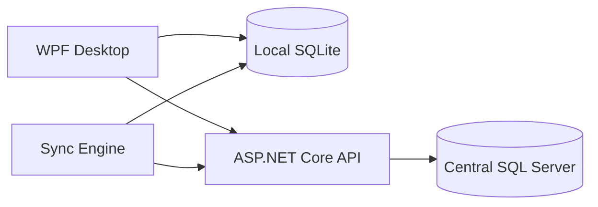
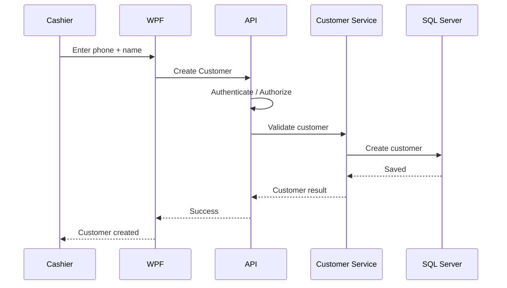
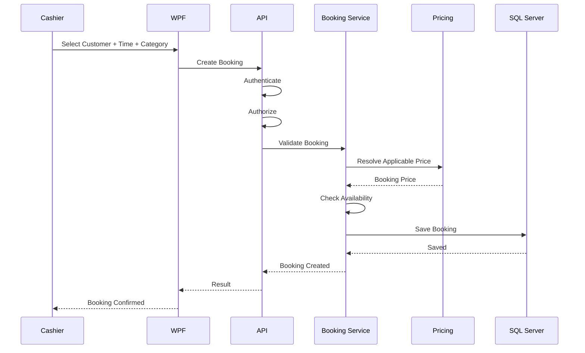
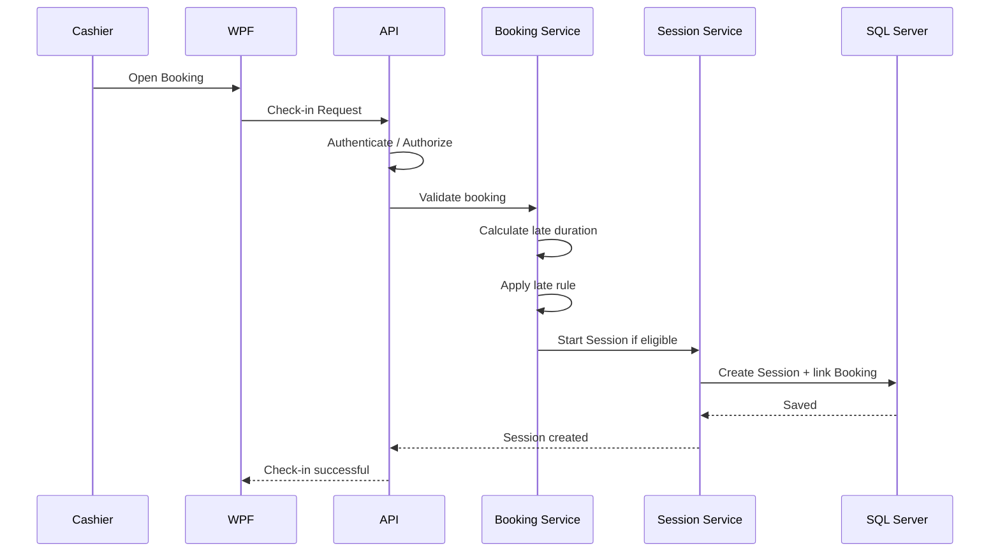
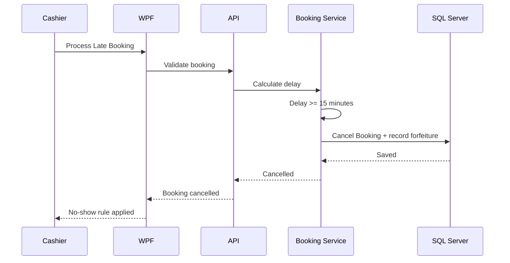
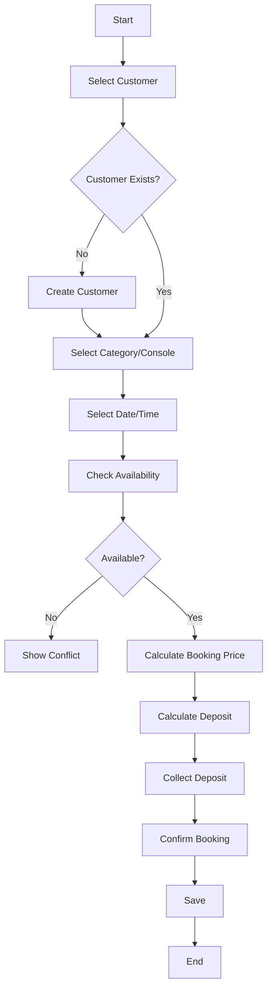
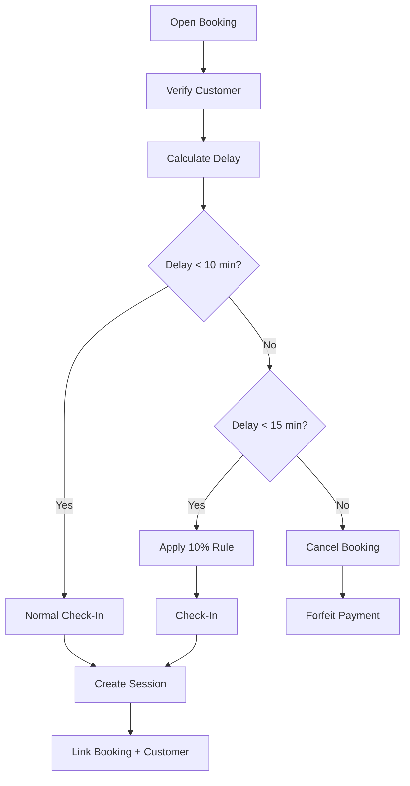
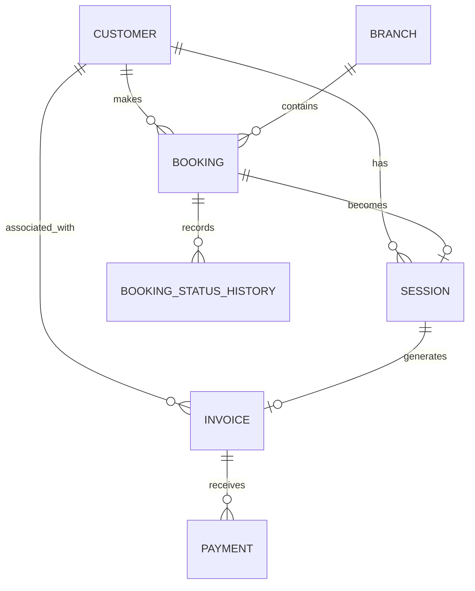

# تحديث الخطة — 2026-09-06

نسخة مراجعة مستقلة؛ الأصول لم تُعدّل. [ابدأ هنا](README(1).md) · [القواعد المشتركة](BUSINESS_RULES(1).md) · [القرارات المفتوحة](DECISIONS.md) · [التغييرات](CHANGELOG.md).

حالة الدليل: المتطلبات الجديدة المؤكدة من المستخدم مذكورة بمصدرها في SHARED_RULES. بقية المحتوى الموروث يحتفظ بحالته السابقة، وليس اعتمادًا جديدًا. مخططات البنية العامة تمثل اتصال المكونات؛ ترتيب كتابة عمليات الفرع تحدده ADR-01 والمخططات المحدّثة، ولا يُستنتج من سهم عام WPF/API.

---

# +90 PS — Release 2 Master Project File
## Expanded MVP — Customer Accounts, Customer History, Bookings & Release 2 Engineering

> **Project:** +90 PS  
> **Release:** Release 2 — Expanded MVP  
> **Document Type:** Master Release Specification  
> **Planning Date:** 2026-09-04  
> **Development Model:** Solo Developer  
> **Scope Rule:** This document defines Release 2 only. Release 1 is treated only as the existing operational baseline; Release 3 is intentionally excluded from this document.

---

# 1. Purpose of This File

This file is the master working specification for **Release 2 of +90 PS**.

Release 2 is not a rewrite.

It is an incremental product release that starts from the already-operational Release 1 baseline and adds the next validated layer of business capability.

The central Release 2 objective is:

> **Turn +90 PS from a basic operational shop system into a richer customer-aware booking and history system while preserving the stability, security, offline behavior, and financial integrity of the existing product.**

Release 2 is therefore about:

```text
Existing Operational Product
        ↓
New Customer-Centric Requirements
        ↓
Customer Accounts
        ↓
Customer History
        ↓
Booking
        ↓
Booking Rules
        ↓
Deposit Handling
        ↓
Late Arrival Rules
        ↓
Booking-to-Session Flow
        ↓
Expanded Reporting / UX where required
        ↓
Regression Testing
        ↓
Release 2
```

This file does not define Release 1 or Release 3.

---

# 2. Release 2 Definition

## 2.1 Release 2 is an Expanded MVP

Release 2 should not be treated as:

```text
"Build every missing feature."
```

It should be treated as:

```text
"Add the next set of high-value capabilities to the working product."
```

The major product capabilities introduced in this release are:

```text
Customer Accounts
Customer History
Bookings
Booking lifecycle
Deposit handling
Late-arrival rules
Customer-to-booking relationship
Customer-to-session relationship
Booking-to-session relationship
Customer-aware operational workflows
```

---

# 3. Release 2 Objectives

Release 2 aims to:

```text
Make customers identifiable
Reduce repeated customer data entry
Preserve customer history
Allow future sessions/bookings to be associated with customers
Allow shops to manage reservations
Support branch-specific booking rules
Support VIP/Standard selection when applicable
Handle deposits
Handle late arrivals
Handle no-show behavior
Connect bookings to actual sessions
Keep financial data accurate
Keep offline operation reliable
Preserve Release 1 stability
```

---

# 4. Release 2 Product Principle

The system should evolve from:

```text
Operational Transaction
```

toward:

```text
Operational Transaction
+
Customer Context
+
Booking Context
+
Historical Context
```

Example:

```text
Customer
   ↓
Booking
   ↓
Session
   ↓
Invoice
   ↓
Payment
```

And historically:

```text
Customer
   ├── Past Bookings
   ├── Past Sessions
   └── Past Financial Transactions
```

---

# 5. Release 2 Scope

## 5.1 In Scope

```text
Customer
Customer Account
Customer Lookup
Customer Profile
Customer History
Customer Session History
Customer Booking History
Booking
Booking Availability
Booking Confirmation
Booking Deposit
Booking Status
Booking Time
Booking Category
VIP / Standard where applicable
Late Arrival Rules
No-Show Handling
Booking Cancellation Rules
Booking-to-Session Conversion
Customer-to-Session Association
Customer-aware Invoice Flow
Customer-aware Reporting
Booking UI
Customer UI
History UI
Offline Customer/Booking handling where required
Synchronization for new entities
Release 2 regression protection
Release 2 UAT
Release 2 deployment
```

---

# 6. Release 2 Scope Boundary

Release 2 is focused on customer and booking capabilities.

Do not expand this release into unrelated product areas.

Release 2 should not become a container for arbitrary future ideas.

Every requested feature should be evaluated against:

```text
Does it improve customer management?
Does it improve booking?
Does it improve customer history?
Does it directly support those workflows?
Does it fix a Release 1 issue?
```

If the answer is no, it should not automatically enter Release 2.

---

# 7. Release 2 Relationship to Existing Product

Release 2 assumes a stable operational foundation already exists.

Conceptually:

```text
Release 1 Operational Baseline
        ↓
Release 2 Change Set
        ↓
Customer Domain
+
Booking Domain
+
History
+
Integration
```

The important engineering rule is:

> **Do not rewrite stable Release 1 systems just to add Release 2 features.**

Prefer incremental changes.

---

# 8. Release 2 Change Management

Any Release 2 feature must pass:

```text
Requirement
   ↓
Business Rule
   ↓
UX
   ↓
Technical Impact Analysis
   ↓
Database Impact
   ↓
API Impact
   ↓
Offline/Sync Impact
   ↓
Security Impact
   ↓
Implementation
   ↓
Testing
```

---

# 9. Customer Domain

The Customer becomes a first-class business entity in Release 2.

A customer can have:

```text
Customer
   ├── Account
   ├── Session History
   ├── Booking History
   └── Transaction Context
```

---

# 10. Customer Identity

Confirmed business requirement:

> The customer's phone number is the primary lookup/key.

The customer's name is mandatory.

Candidate model:

```text
Customer
---------------------------
Id
Phone
Name
Notes
CreatedAt
UpdatedAt
```

The exact physical uniqueness rule for phone numbers must be confirmed during database design.

---

# 11. Customer Creation

Candidate workflow:

```text
Cashier selects Customer
        ↓
Search by Phone
        ↓
Customer found?
      /       \
    Yes        No
    |           |
Open Profile  Create Customer
                 ↓
              Enter Name
                 ↓
              Save
```

The system should minimize duplicate customers.

---

# 12. Customer Lookup

Primary lookup:

```text
Phone Number
```

Search should support rapid cashier use.

Typical flow:

```text
Enter phone
     ↓
Search
     ↓
Customer found
     ↓
Select customer
```

If not found:

```text
Create customer
```

---

# 13. Customer Name Requirement

Customer name is required.

Customer creation should not complete without a valid name.

Potential validation:

```text
Empty → Reject
Whitespace-only → Reject
```

Further name validation should remain practical and avoid unnecessarily restrictive rules.

---

# 14. Customer Account Meaning

"Customer Account" in Release 2 means a persistent customer record inside +90 PS.

It does not mean:

```text
Customer Login
Customer Website
Customer Mobile Authentication
Membership
Loyalty Points
```

The customer exists as a business record used by staff.

---

# 15. Customer History

Release 2 introduces persistent customer history.

The history should allow authorized users to see relevant previous activity.

Potential information:

```text
Previous Sessions
Previous Bookings
Session Dates
Booking Dates
Branch
Console / Category context
Amounts
Invoice references
Payment status
Booking status
```

Exact visibility depends on role.

---

# 16. Customer History Goal

The system should answer:

```text
Who is this customer?

When did they visit?

What sessions did they have?

What bookings did they make?

What bookings were completed?

What bookings were cancelled?

What did they pay?

What branch activity is associated with them?
```

---

# 17. Customer-Specific Data Access

Customer history must respect authorization.

For example:

```text
Cashier
→ Access only data permitted for operational use.

Manager
→ Access branch customer history according to branch permissions.
```

No user should gain access to unrelated branch customer data.

---

# 18. Booking Domain

Booking becomes a first-class Release 2 feature.

Booking represents:

> A customer's reservation for future gaming availability.

Relationship:

```text
Customer
   |
   +-- Booking
         |
         +-- Branch
         +-- Category / Console
         +-- Time
         +-- Deposit
         +-- Status
```

---

# 19. Booking Categories

Some shops may have:

```text
VIP
Standard
```

When a branch actually offers these categories, the customer can select one.

If the branch has no category distinction, the UI should not force an unnecessary selection.

Therefore:

```text
Branch configuration
       ↓
Does branch use categories?
   /             \
 Yes              No
  |                |
Show choice     Hide choice
```

---

# 20. Booking Target

The system may need to support two operating models:

### Category-based booking

```text
Customer
   ↓
VIP / Standard
   ↓
Branch allocates suitable console
```

### Console-specific booking

```text
Customer
   ↓
Specific console
```

The current business requirement establishes category selection where categories exist, but the exact console-selection policy must be finalized before implementation.

The database should not unnecessarily block either model.

---

# 21. Booking Date / Time

A booking must carry a planned start time.

Candidate data:

```text
StartAt
EndAt
```

or:

```text
BookingDate
StartTime
Duration
```

The final representation should match the actual booking UI and conflict logic.

---

# 22. Booking Availability

Before creating a booking:

```text
Select branch
    ↓
Select date/time
    ↓
Select category/console if applicable
    ↓
Check availability
    ↓
Available?
   /     \
 Yes      No
 |         |
Confirm    Reject / choose another time
```

Availability must account for existing reservations and operational constraints.

---

# 23. Booking Deposit

Confirmed requirement:

> Customer pays a deposit for the booking.

The deposit amount must be captured.

Candidate fields:

```text
DepositAmount
BookingPrice
DepositStatus
PaidAt
ReceivedByUserId
```

The exact deposit percentage/fixed-value rule remains an implementation/business decision.

---

# 24. Deposit Business Purpose

The deposit exists to:

```text
Reserve availability
Reduce unnecessary no-shows
Create a financial commitment
Connect booking to a customer
```

---

# 25. Late Arrival Rule

Confirmed business rule:

```text
At 10 minutes late:
→ Customer is charged 10% of booking price.

At 15 minutes late:
→ Booking is cancelled.
→ Payment/deposit is forfeited.
```

This must be implemented as a clear business rule rather than buried in UI code.

---

# 26. Late Arrival Example

Example:

```text
Booking Time:
18:00

Customer Arrival:
18:08
```

No 10-minute threshold crossed.

Example:

```text
Booking Time:
18:00

Customer Arrival:
18:10
```

The current rule applies:

```text
Late Charge = 10% of booking price
```

Example:

```text
Booking Time:
18:00

Arrival:
18:15
```

Current rule:

```text
Booking cancelled
Deposit/payment forfeited
```

Exact boundary semantics at exactly 10 and exactly 15 minutes must be explicitly tested.

---

# 27. Booking Status Model

Candidate states:

```text
Pending
Confirmed
Arrived
Active
Completed
Cancelled
No-Show
Expired
```

Release 2 should use explicit states rather than a single boolean.

---

# 28. Booking State Flow

Candidate:

```text
Pending
   ↓
Confirmed
   ↓
Arrived
   ↓
Active
   ↓
Completed
```

Alternative exits:

```text
Confirmed → Cancelled
Confirmed → No-Show
Confirmed → Expired
```

The exact state machine must be finalized before coding.

---

# 29. Booking-to-Session Conversion

A booking eventually becomes an actual gaming session.

Conceptual flow:

```text
Booking
   ↓
Customer arrives
   ↓
Booking validated
   ↓
Console/category allocated
   ↓
Session starts
   ↓
Booking linked to session
```

This creates:

```text
Customer
   ↓
Booking
   ↓
Session
   ↓
Invoice
```

---

# 30. Booking and Session Relationship

Recommended:

```text
Session.BookingId
```

nullable.

Reason:

Not every session originates from a booking.

Therefore:

```text
Walk-in session
Session.BookingId = null

Booked session
Session.BookingId = Booking.Id
```

---

# 31. Customer and Session Relationship

Recommended:

```text
Session.CustomerId
```

nullable where the business allows anonymous walk-ins.

When a known customer is selected:

```text
Session.CustomerId = Customer.Id
```

This enables history.

---

# 32. Customer and Invoice Relationship

If the session belongs to a customer:

```text
Invoice.CustomerId = Customer.Id
```

This lets the system connect financial records to customer history.

The final duplication/normalization strategy should be reviewed during database design.

---

# 33. Booking and Invoice Relationship

A booking may produce:

```text
Deposit transaction
+
Final session invoice
```

The exact financial architecture needs careful design so the deposit is not accidentally counted twice as revenue.

---

# 34. Financial Rule for Deposit

Important:

> Deposit accounting must be defined separately from session revenue to avoid double counting.

Example conceptual:

```text
Customer pays deposit
        ↓
Deposit recorded
        ↓
Customer arrives
        ↓
Final session invoice created
        ↓
Deposit applied/recognized according to business rule
```

This needs explicit business treatment before production implementation.

---

# 35. No-Show Financial Rule

Current rule:

```text
15 minutes late
    ↓
Booking cancelled
    ↓
Payment/deposit forfeited
```

The final financial behavior must decide:

```text
Is the forfeited deposit recognized as revenue?
Is it recorded as a specific income category?
Is it treated differently?
```

This must not be guessed during coding.

---

# 36. Booking Cancellation

Release 2 must distinguish:

```text
Customer cancellation
Manager/system cancellation
No-show cancellation
Operational cancellation
```

Each may have different rules.

The current confirmed no-show rule is:

```text
15+ minutes late
→ cancellation
→ payment forfeited
```

---

# 37. Booking Availability & Conflict Detection

The system must prevent invalid overlapping reservations.

Potential conflict:

```text
Booking A
18:00–19:00
VIP

Booking B
18:30–19:30
Same exclusive resource
```

If the same resource/category cannot support both:

```text
Reject Booking B
```

The conflict algorithm depends on whether the branch books a specific console or a shared category pool.

---

# 38. Booking UI

Candidate screens:

```text
Booking List
Create Booking
Edit Booking
Booking Details
Booking Calendar / Schedule
Booking Check-In
Booking Cancellation
Booking Late Status
Booking History
```

Release 2 should not add a complex calendar interface unless it materially improves the shop workflow.

A simple schedule/list UI may be preferable initially.

---

# 39. Customer UI

Candidate screens:

```text
Customer Search
Customer List
Create Customer
Edit Customer
Customer Details
Customer History
Customer Bookings
Customer Sessions
```

---

# 40. Customer Search UX

Cashier workflow should be fast:

```text
Customer Search
   ↓
Enter Phone
   ↓
Results
   ↓
Select
```

Avoid forcing the cashier to fill a long customer form for every walk-in.

---

# 41. Existing Customer Workflow

```text
Customer arrives
   ↓
Cashier asks for phone
   ↓
Search
   ↓
Customer found
   ↓
Open customer
   ↓
Continue booking/session
```

---

# 42. New Customer Workflow

```text
Customer arrives
   ↓
Search phone
   ↓
Not found
   ↓
Create customer
   ↓
Enter required name
   ↓
Save
   ↓
Continue session/booking
```

---

# 43. Booking Creation Workflow

```text
Start Booking
    ↓
Select Customer
    ↓
Select Branch Context
    ↓
Select Category if applicable
    ↓
Select Date/Time
    ↓
Check Availability
    ↓
Calculate Booking Price
    ↓
Calculate Deposit
    ↓
Collect Deposit
    ↓
Confirm Booking
    ↓
Save Booking
```

---

# 44. Booking Check-In Workflow

```text
Booking List
    ↓
Find Booking
    ↓
Verify Customer
    ↓
Check Arrival Time
    ↓
Calculate Late Status
    ↓
Apply business rule
    ↓
Eligible?
   /     \
 Yes      No
 |         |
Start     Cancel/Forfeit
Session
```

---

# 45. Late Arrival Workflow

```text
Booking scheduled at 18:00
        ↓
Customer arrives
        ↓
System calculates delay
        ↓
Delay < 10 min
        ↓
Normal check-in

Delay >= 10 min
        ↓
10% rule

Delay >= 15 min
        ↓
Cancel
        ↓
Forfeit payment
```

Boundary conditions must be encoded consistently.

---

# 46. Booking-to-Session Workflow

```text
Confirmed Booking
      ↓
Customer Arrives
      ↓
Booking Validated
      ↓
Eligible
      ↓
Allocate Console / Resource
      ↓
Create Session
      ↓
Link Session.CustomerId
      ↓
Link Session.BookingId
      ↓
Session Active
```

---

# 47. Customer History Workflow

```text
Search Customer
      ↓
Open Profile
      ↓
History
   ├── Sessions
   ├── Bookings
   └── Transactions
```

Clicking an item should open the relevant detailed record where permission allows.

---

# 48. Technical Architecture Impact

Release 2 adds a customer/booking domain to the existing backend.

Conceptually:

```text
ASP.NET Core API
|
+-- Existing Operational Modules
|
+-- Customer Module
|
+-- Booking Module
|
+-- History Queries
|
+-- Pricing Integration
|
+-- Invoice Integration
|
+-- Reporting Integration
|
+-- Synchronization
```

---

# 49. Release 2 Backend Modules

New/expanded modules:

```text
Customer Management
Booking Management
Customer History Queries
Booking Availability
Booking Lifecycle
Deposit Management
Late Arrival Rules
Booking-to-Session Integration
Customer-aware Reporting
```

---

# 50. Customer Service Responsibilities

Customer service/application layer should handle:

```text
Create Customer
Find Customer
Update Customer
Search Customer
Get Customer History
Get Customer Bookings
Get Customer Sessions
```

Validation:

```text
Required name
Phone lookup
Branch/access scope
Duplicate detection
```

---

# 51. Booking Service Responsibilities

Booking service should handle:

```text
Create booking
Validate availability
Calculate booking data
Record deposit
Confirm booking
Check in
Calculate late duration
Apply late rule
Cancel booking
Mark no-show
Convert booking to session
```

---

# 52. Booking Availability Service

Responsibilities:

```text
Find conflicting bookings
Check capacity
Check console/category availability
Validate booking time
```

The exact algorithm depends on branch configuration.

---

# 53. Customer History Query Model

History is mostly read-oriented.

Potential query groups:

```text
Customer Summary
Customer Sessions
Customer Bookings
Customer Invoices
Customer Activity Timeline
```

Use efficient queries and pagination for larger histories.

---

# 54. Customer Activity Timeline

Candidate conceptual output:

```text
2026-09-04 18:00
Booking Created

2026-09-04 18:00
Booking Confirmed

2026-09-04 18:08
Customer Arrived

2026-09-04 18:10
Session Started

2026-09-04 19:00
Session Completed

2026-09-04 19:05
Invoice Paid
```

This is a product/UX concept; it does not require a separate database table if existing events can be queried efficiently.

---

# 55. Database Additions

Likely new entities:

```text
Customer
Booking
BookingStatusHistory (if needed)
Deposit / BookingPayment (depending on financial design)
```

Potential extensions:

```text
Session.CustomerId
Session.BookingId
Invoice.CustomerId
```

The exact financial schema must be reviewed carefully.

---

# 56. Customer Entity — Conceptual

```text
Customer
---------------------------
Id
Phone
Name
Notes
CreatedAt
UpdatedAt
```

The phone number is the primary lookup/key.

---

# 57. Booking Entity — Conceptual

```text
Booking
---------------------------
Id
BranchId
CustomerId
ConsoleId (nullable)
CategoryId (nullable)
StartAt
EndAt
BookingPrice
DepositAmount
DepositStatus
Status
CreatedByUserId
ConfirmedAt
ArrivedAt
CancelledAt
CancellationReason
CreatedAt
UpdatedAt
```

This is conceptual and should not be treated as final schema.

---

# 58. Booking Status History — Optional

If status changes need complete history:

```text
BookingStatusHistory
---------------------------
Id
BookingId
OldStatus
NewStatus
ChangedByUserId
ChangedAt
Reason
```

This is useful for auditability.

---

# 59. Customer History Without a Separate History Table

Do not automatically create:

```text
CustomerHistory
```

as a giant duplicate table.

History can often be derived from:

```text
Sessions
Bookings
Invoices
Payments
Audit Events
```

A query/view/read model may be better.

---

# 60. API Additions

Candidate endpoints:

```http
GET  /api/customers
GET  /api/customers/search
GET  /api/customers/{id}
POST /api/customers
PUT  /api/customers/{id}

GET  /api/customers/{id}/history
GET  /api/customers/{id}/sessions
GET  /api/customers/{id}/bookings

GET  /api/bookings
GET  /api/bookings/{id}
POST /api/bookings
PUT  /api/bookings/{id}
POST /api/bookings/{id}/confirm
POST /api/bookings/{id}/check-in
POST /api/bookings/{id}/cancel
POST /api/bookings/{id}/no-show
```

Actual REST design may use different resource naming and should be finalized before implementation.

---

# 61. Booking API Rules

The API must validate:

```text
Customer exists
Customer is accessible
Branch is authorized
Requested time is valid
Requested resource/category is valid
Availability exists
Pricing is valid
Deposit rules are valid
Status transition is valid
```

---

# 62. Customer API Rules

Customer endpoints must enforce:

```text
Branch scope
Role permissions
Input validation
Duplicate handling
Safe search
Pagination
```

---

# 63. Offline Customer Support

Release 2 must decide how much customer functionality remains usable offline.

Recommended:

```text
Search locally synchronized customers
Create customer locally
Update allowed local customer data
Associate customer with offline session
Create/manage applicable offline booking data
Queue synchronization
```

The exact offline booking policy must be carefully designed because bookings can conflict with changes that occurred elsewhere.

---

# 64. Offline Booking Challenge

Bookings introduce a difficult new offline problem.

Example:

```text
Branch offline
        ↓
Cashier creates Booking A
```

At the same time:

```text
Central/other state
        ↓
Same resource/time is already booked
```

When synchronization occurs:

```text
Conflict
```

Therefore offline booking creation may need stricter rules than ordinary walk-in session creation.

---

# 65. Offline Booking Strategy Options

Possible strategies:

### Strategy A — Allow offline booking

Requires conflict detection and resolution after sync.

### Strategy B — Require online connection

Simpler and safer for reservations.

### Strategy C — Allow offline booking only from pre-synced availability

Possible but more complex.

The final strategy must be chosen before Release 2 booking goes live.

---

# 66. Recommended Direction for Release 2

For a solo developer, a safer initial strategy is:

```text
Normal Walk-in Sessions
→ Fully offline

Bookings
→ Offline support only within explicitly safe boundaries
```

Do not assume offline booking is as simple as offline sessions.

The availability problem makes it materially more complex.

---

# 67. Synchronization — Customer

Offline customer creation:

```text
Create Customer
      ↓
Local SQLite
      ↓
Sync Queue
      ↓
API
      ↓
Deduplication
      ↓
Central SQL
```

Phone-number collision must be handled safely.

---

# 68. Synchronization — Booking

```text
Booking Created Locally
        ↓
Sync Queue
        ↓
API
        ↓
Validate Availability / Version
        ↓
Conflict?
   /          \
 No            Yes
 |              |
Save         Conflict State
```

Do not silently overwrite booking conflicts.

---

# 69. Customer Duplicate Problem

A major Release 2 risk:

```text
Branch offline
   ↓
Customer "Ahmed"
Phone = 010...
```

At the same time:

```text
Another local operation
   ↓
Same phone
```

The server needs deterministic duplicate handling.

Phone number is the key lookup signal, but the final merge/update rules must be explicit.

---

# 70. Booking Concurrency

Two cashiers may attempt the same slot.

Therefore availability checking must be protected by:

```text
Validation
+
Concurrency control
+
Database constraints/transactions where appropriate
```

A UI-only "Available" indicator is insufficient.

---

# 71. Customer Concurrency

Two local/offline or online operations may attempt to edit the same customer.

Release 2 should define a reasonable concurrency strategy.

For a simple first implementation:

```text
Last-write-wins
```

may be possible for low-risk fields, but this must not be used blindly for bookings or financial information.

---

# 72. Security — Customer Data

Customer data must be protected.

At minimum:

```text
Authentication
Authorization
Branch isolation
Controlled customer search
Minimal data exposure
Safe logging
```

Do not log raw customer phone numbers unnecessarily in application logs.

---

# 73. Security — Booking

Booking actions should respect:

```text
Branch
Role
Permission
Booking ownership/context
Status
```

A cashier should not be able to modify an arbitrary unrelated booking outside their authorization scope.

---

# 74. Audit — Booking

Sensitive booking changes may be audited.

Useful events:

```text
Booking created
Booking confirmed
Booking cancelled
Booking manually overridden
Booking marked no-show
Deposit changed
Booking linked to session
```

---

# 75. Audit — Customer

Not every customer search requires an audit entry.

Potentially sensitive operations:

```text
Customer data edited
Customer record merged
Sensitive customer data changed
```

Search itself should not automatically create excessive audit noise.

---

# 76. Reporting Changes

Release 2 may add customer-aware reports such as:

```text
Bookings per day
Bookings completed
Bookings cancelled
No-shows
Customer visits
Customer booking activity
```

Reports must preserve existing financial correctness.

---

# 77. Booking Metrics

Useful Release 2 metrics:

```text
Booking count
Confirmed bookings
Completed bookings
Cancelled bookings
No-shows
Late arrivals
Average booking value
Deposit value
Booking conversion to session
```

Do not introduce metrics that cannot be reliably calculated from the data.

---

# 78. Customer Metrics

Possible:

```text
New customers
Returning customers
Sessions per customer
Bookings per customer
Customer visit frequency
```

These are optional reporting outputs within the customer/booking domain, not unrelated analytics.

---

# 79. UX States — Customer

Customer screens should handle:

```text
Loading
Found
Not Found
Duplicate Candidate
Offline
Saving
Saved
Sync Pending
Sync Failed
Unauthorized
```

---

# 80. UX States — Booking

Booking screens should handle:

```text
Available
Unavailable
Pending
Confirmed
Arriving
Late
Cancelled
No-Show
Completed
Offline
Syncing
Conflict
```

---

# 81. UX Requirements for Booking

The cashier should immediately understand:

```text
Who
When
Where
What
Price
Deposit
Status
Late status
Next action
```

Avoid overly complicated reservation screens.

---

# 82. Booking List Example

```text
---------------------------------------------------------
Time    Customer       Type       Status       Deposit
---------------------------------------------------------
18:00   Ahmed          VIP        Confirmed     100
18:30   Mohamed        Standard   Arrived       50
19:00   Ali            VIP        Cancelled     100
---------------------------------------------------------
```

This is a conceptual UI representation.

---

# 83. Customer Details Example

```text
Customer: Ahmed
Phone: 010xxxxxxx

Summary
-------------------------
Sessions: 18
Bookings: 7
Completed: 6
Cancelled: 1

History
-------------------------
Today     Session
Yesterday Booking
...
```

---

# 84. Customer History Query Design

For large histories:

```text
Pagination
Date filters
Type filters
Branch filters where authorized
```

Avoid loading a customer's entire history into the client in one request.

---

# 85. API Pagination

Customer/history endpoints should support a pagination strategy.

Example conceptual:

```http
GET /api/customers/{id}/history?page=1&pageSize=20
```

The exact contract is decided during API design.

---

# 86. Database Indexes

Release 2 likely needs indexes on:

```text
Customer.Phone
Customer.Name where useful
Booking.BranchId
Booking.CustomerId
Booking.StartAt
Booking.Status
Booking.ConsoleId
Session.CustomerId
Session.BookingId
Invoice.CustomerId
```

Exact indexes must be based on real query patterns.

---

# 87. Customer Phone Uniqueness

Need explicit business rule:

```text
Is phone globally unique?
```

Possible choices:

```text
Global uniqueness
Branch-level uniqueness
Allow duplicates
```

Because customer accounts are useful across a multi-branch business, global uniqueness is attractive, but the final business rule must be approved.

---

# 88. Recommended Customer Identity Direction

Preferred:

```text
Customer.Id = internal stable identifier
Phone = unique lookup key if the business allows it
```

Do not make a phone number the actual database primary key.

"Phone is the primary lookup/key" should be interpreted as:

```text
Primary business lookup identity
```

while the database can still use a stable internal ID.

---

# 89. Customer Merge

Potential future edge case:

```text
Two customer records
same person
```

Release 2 should at least recognize this as a risk.

A merge workflow should not be added unless required, because it is a high-risk data operation.

If implemented, it must be audited.

---

# 90. Booking Price and Current Pricing

A booking is created at a particular price.

Recommended:

```text
BookingPriceSnapshot
```

or equivalent.

Reason:

If branch pricing changes after a booking is created, the booking should not unexpectedly change price.

Example:

```text
Booking created:
300 EGP

Manager changes current pricing:
350 EGP

Existing booking:
still based on its captured booking pricing
```

Final rule must be approved.

---

# 91. Booking Deposit and Pricing Snapshot

The system should preserve:

```text
Booking price at creation
Deposit amount at creation
Applicable category
Applicable console/resource
```

This protects the customer's contractual booking expectation.

---

# 92. Booking Lifecycle and Financial Integrity

Do not allow:

```text
Cancelled booking
    ↓
Active invoice
```

without an explicit business reason.

Financial state transitions need validation.

---

# 93. Release 2 Domain Diagram

```text
                 +-------------+
                 |  Customer   |
                 +------+------+
                        |
            +-----------+-----------+
            |                       |
            v                       v
      +-----------+           +-----------+
      |  Booking  |           |  Session  |
      +-----+-----+           +-----+-----+
            |                       |
            |                       v
            |                  +-----------+
            +----------------> |  Invoice  |
                               +-----+-----+
                                     |
                                     v
                                +---------+
                                | Payment |
                                +---------+
```

---

# 94. Booking Domain Diagram

```text
Customer
   |
   v
Booking
   |
   +-- Branch
   +-- Category / Console
   +-- Time
   +-- Price
   +-- Deposit
   +-- Status
   |
   v
Session
```

---

# 95. Release 2 Context Diagram

```text
Owner
  |
Manager
  |
Cashier
  |
  v
+---------------------------+
| +90 PS — Release 2        |
| Customer + Booking MVP    |
+-------------+-------------+
              |
              v
        Existing API
              |
              v
        Central Database
```

---

# 96. Release 2 C4 Container Diagram



The important Release 2 change is the expanded domain inside the API and synchronized local data.

---

# 97. Release 2 C4 Component View

```text
ASP.NET Core API
|
+-- Authentication
+-- Authorization
|
+-- Customer Management
|   +-- Search
|   +-- Create
|   +-- Update
|   +-- History
|
+-- Booking Management
|   +-- Availability
|   +-- Create
|   +-- Confirm
|   +-- Check-in
|   +-- Cancel
|   +-- No-show
|   +-- Deposit
|
+-- Session Integration
|
+-- Invoice Integration
|
+-- Reporting
|
+-- Audit
|
+-- Synchronization
```

---

# 98. Release 2 Sequence — Create Customer



Offline version:

```text
Cashier
 ↓
WPF
 ↓
SQLite
 ↓
Sync Queue
```

---

# 99. Release 2 Sequence — Create Booking



---

# 100. Release 2 Sequence — Booking Check-In



---

# 101. Release 2 Sequence — No-Show



---

# 102. Release 2 Activity Diagram — Create Booking



---

# 103. Release 2 Activity Diagram — Check-In



Boundary handling at exactly 10 and 15 minutes must be explicitly tested.

---

# 104. Release 2 State Diagram — Booking

```text
Pending
   ↓
Confirmed
   ↓
Arrived
   ↓
Active
   ↓
Completed

Confirmed
   ├──> Cancelled
   ├──> No-Show
   └──> Expired
```

---

# 105. Release 2 State Diagram — Customer Record

Customer itself is not a business workflow state machine in the same way as a booking.

Useful record status could be:

```text
Active
Inactive
```

Do not invent complex customer states unless the business needs them.

---

# 106. Release 2 ERD — Customer/Booking Extension



This should be merged into the actual database ERD during implementation.

---

# 107. Release 2 API Architecture

The API becomes a richer central boundary:

```text
Client
  ↓
ASP.NET Core API
  |
  +-- Customer
  +-- Booking
  +-- Session
  +-- Invoice
  +-- Payment
  +-- Reporting
  +-- Sync
  +-- Audit
  ↓
SQL Server
```

---

# 108. Release 2 Local Architecture

```text
WPF
 |
 +-- Customer data cache
 |
 +-- Booking data where offline-supported
 |
 +-- Local session data
 |
 +-- Local invoice data
 |
 +-- Sync queue
 |
 +-- Local authentication
```

The local data set must be minimized while remaining operationally sufficient.

---

# 109. Offline Customer Workflow

```text
Cashier enters phone
       ↓
Search local customer index
       ↓
Found?
   /       \
 Yes        No
 |           |
Open       Create local
profile    customer
             ↓
          Queue Sync
```

---

# 110. Offline Booking Workflow

Release 2 must not assume all booking operations are safe offline.

Conceptually:

```text
Booking Request
    ↓
Offline?
   /       \
 No         Yes
 |           |
Normal     Check offline policy
online        ↓
flow       Allowed?
           /      \
         Yes       No
          |         |
     Local booking  Explain
     + sync queue   unavailable
```

---

# 111. Synchronization — Customer History

Customer history is derived from synchronized entities.

Do not sync a giant "history" blob if it can be derived from:

```text
Customer
Bookings
Sessions
Invoices
Payments
Audit Events
```

Prefer synchronized source-of-truth entities.

---

# 112. Synchronization — Booking History

Booking status transitions should be represented safely.

A local update must preserve:

```text
Booking ID
Version / operation ID
Status transition
Actor
Timestamp
```

---

# 113. Duplicate Customer Handling

When a local customer is synchronized:

```text
Client Customer ID
+
Phone
```

should be used to detect whether the customer already exists.

Do not create a duplicate central customer just because the server did not immediately acknowledge the first operation.

---

# 114. Booking Sync Conflict

Example:

```text
Local Branch:
Booking slot A created offline

Central state:
Same slot already occupied

Sync:
Conflict detected
```

The system needs:

```text
Conflict status
Operational notification
Resolution path
Audit if manually resolved
```

Do not silently move the booking.

---

# 115. Security — Customer Search

The customer search API should return only data needed by the user.

Avoid returning:

```text
Entire customer history
All branches
Unnecessary financial details
```

for a simple phone lookup.

Use appropriate projections.

---

# 116. Security — Booking Changes

Booking modification must validate:

```text
User
Role
Permission
Branch
Booking status
Allowed transition
```

---

# 117. Audit Requirements

Release 2 should audit:

```text
Booking cancellation
Booking manual override
Booking deposit modification
No-show processing if manually triggered
Customer important-profile changes
Booking-to-session override
```

Not every customer search.

---

# 118. Release 2 Testing Strategy

Testing expands from operational behavior to customer/booking behavior.

Test layers:

```text
Unit
Integration
API
Database
UI
E2E
Offline
Sync
Security
Regression
UAT
```

---

# 119. Customer Test Cases

```text
TC-CUSTOMER-001
Create customer with valid phone + name.

TC-CUSTOMER-002
Reject customer without name.

TC-CUSTOMER-003
Find customer by phone.

TC-CUSTOMER-004
Handle existing customer lookup.

TC-CUSTOMER-005
Prevent or correctly handle duplicate customer.

TC-CUSTOMER-006
Customer history returns correct sessions.

TC-CUSTOMER-007
Customer history returns correct bookings.

TC-CUSTOMER-008
Unauthorized user cannot view unauthorized customer data.
```

---

# 120. Booking Test Cases

```text
TC-BOOKING-001
Create valid booking.

TC-BOOKING-002
Reject unavailable slot.

TC-BOOKING-003
VIP category appears only when configured.

TC-BOOKING-004
Standard category appears only when configured.

TC-BOOKING-005
Deposit is recorded correctly.

TC-BOOKING-006
Booking price is captured correctly.

TC-BOOKING-007
Customer can be linked to booking.

TC-BOOKING-008
Booking can be confirmed.

TC-BOOKING-009
Eligible booking can check in.

TC-BOOKING-010
Booking converts to session correctly.

TC-BOOKING-011
Late rule applies correctly.

TC-BOOKING-012
15-minute rule cancels booking.

TC-BOOKING-013
Forfeiture is recorded correctly.

TC-BOOKING-014
Booking state transitions are enforced.
```

---

# 121. Boundary Tests

Test exactly:

```text
9:59 late
10:00 late
10:01 late

14:59 late
15:00 late
15:01 late
```

The expected result must be documented and consistent.

---

# 122. Pricing Tests for Booking

Verify that a booking uses the correct:

```text
Branch
Console type
Category
Single/Multi if applicable
Pricing method
Price snapshot
Deposit calculation
```

---

# 123. Regression Testing

Every Release 2 change must ensure that existing operational behavior still works.

Regression should cover at minimum:

```text
Session creation
Session completion
Invoice creation
Cash payment
Pricing
Manager authorization
Offline operation
Synchronization
```

No Release 2 feature should silently break the existing session/invoice flow.

---

# 124. Offline Regression

Test:

```text
Release 1 operational workflow still works offline
+
Release 2 customer association works offline where allowed
```

Example:

```text
Offline
↓
Find customer
↓
Start session
↓
Complete
↓
Invoice
↓
Sync
```

---

# 125. Security Testing

Release 2 must verify:

```text
Customer branch isolation
Booking branch isolation
Unauthorized booking modification
Unauthorized customer modification
Manager-only booking overrides
Sensitive audit protections
API authorization
```

---

# 126. Performance Testing

Focus on:

```text
Customer search response
Booking availability queries
Customer history queries
Booking list queries
Large customer histories
Large booking histories
Sync backlog after offline activity
```

---

# 127. UAT — Customer Scenario

```text
Cashier receives customer
    ↓
Search phone
    ↓
Customer found
    ↓
Open history
    ↓
Create booking
    ↓
Select category if applicable
    ↓
Select time
    ↓
Pay deposit
    ↓
Confirm
```

---

# 128. UAT — Booking Arrival Scenario

```text
Open booking
    ↓
Customer arrives
    ↓
Check arrival time
    ↓
If on time → check in
    ↓
Start session
    ↓
Complete session
    ↓
Invoice
    ↓
Cash payment
    ↓
Customer history updated
```

---

# 129. UAT — Late Scenario

```text
Booking at 18:00
Customer arrives at 18:10
    ↓
Apply 10% rule

Booking at 18:00
Customer arrives at 18:15
    ↓
Cancel booking
    ↓
Forfeit payment
```

Exact boundary conditions must be tested.

---

# 130. UAT — Offline Customer Scenario

```text
Internet disconnects
    ↓
Search locally synchronized customer
    ↓
Associate customer with session
    ↓
Complete session
    ↓
Save locally
    ↓
Reconnect
    ↓
Sync
    ↓
Verify central history
```

---

# 131. UAT — Offline Booking Scenario

Only test offline booking according to the approved offline policy.

Possible:

```text
Offline booking allowed
    ↓
Create
    ↓
Queue
    ↓
Sync
    ↓
Conflict handling
```

or:

```text
Offline booking not allowed
    ↓
System clearly explains why
```

The chosen rule must be explicit before UAT.

---

# 132. Release 2 Documentation Set

The Release 2 documentation should contain:

## Product

```text
prd-release-2.md
release-2-scope.md
release-2-backlog.md
user-stories.md
acceptance-criteria.md
```

## Customer

```text
customer-domain.md
customer-rules.md
customer-history.md
```

## Booking

```text
booking-domain.md
booking-rules.md
booking-state-machine.md
booking-availability.md
booking-financial-rules.md
```

## UX

```text
customer-flows.md
booking-flows.md
wireframes/
screens.md
```

## Architecture

```text
release-2-architecture-impact.md
booking-sequence.md
customer-sequence.md
offline-booking.md
sync-design.md
```

## Database

```text
customer-schema.md
booking-schema.md
migration.md
data-dictionary-update.md
```

## API

```text
customer-api.md
booking-api.md
openapi-update.yaml
error-model-update.md
```

## Security

```text
customer-data-security.md
booking-security.md
authorization-update.md
audit-update.md
threat-model-update.md
```

## Testing

```text
release-2-test-plan.md
customer-test-cases.md
booking-test-cases.md
regression-plan.md
uat-release-2.md
offline-test-plan.md
sync-test-plan.md
```

## Deployment

```text
release-2-migration-plan.md
release-2-deployment.md
rollback-plan.md
```

---

# 133. Release 2 Backlog Structure

Recommended:

```text
EPIC: Customer Management
    Feature: Customer Search
    Feature: Customer Creation
    Feature: Customer Profile
    Feature: Customer History

EPIC: Booking
    Feature: Availability
    Feature: Booking Creation
    Feature: Deposit
    Feature: Confirmation
    Feature: Check-in
    Feature: Late Rules
    Feature: No-show
    Feature: Cancellation
    Feature: Booking-to-Session

EPIC: Integration
    Feature: Customer ↔ Session
    Feature: Customer ↔ Invoice
    Feature: Booking ↔ Session
    Feature: Booking ↔ Financials

EPIC: Offline / Sync
    Feature: Customer Offline
    Feature: Booking Offline Policy
    Feature: Sync
    Feature: Conflict Handling

EPIC: QA
    Feature: Regression
    Feature: UAT
    Feature: Security Testing
```

---

# 134. User Stories — Customer

```text
US-CUSTOMER-001

As a cashier,
I want to search for a customer by phone number,
so that I can quickly find their account.
```

```text
US-CUSTOMER-002

As a cashier,
I want to create a customer with a required name,
so that the customer can be reused in future visits.
```

```text
US-CUSTOMER-003

As a manager,
I want to view customer history within my authorized branch,
so that I can understand customer activity.
```

---

# 135. User Stories — Booking

```text
US-BOOKING-001

As a cashier,
I want to create a booking for a customer,
so that the customer can reserve gaming time.
```

```text
US-BOOKING-002

As a cashier,
I want the system to check booking availability,
so that I cannot create conflicting reservations.
```

```text
US-BOOKING-003

As a cashier,
I want to record the booking deposit,
so that the reservation has a financial commitment.
```

```text
US-BOOKING-004

As a cashier,
I want the system to apply the late-arrival rule,
so that the shop follows its booking policy consistently.
```

```text
US-BOOKING-005

As a cashier,
I want an eligible booking to become a gaming session,
so that the reservation flows into normal shop operation.
```

---

# 136. Acceptance Criteria — Customer Search

```text
Given a valid phone number
When the cashier searches
Then the matching customer is displayed.

Given no matching customer
When the cashier searches
Then the system offers customer creation.

Given an unauthorized branch context
When the user requests customer data
Then unauthorized records are not returned.
```

---

# 137. Acceptance Criteria — Create Booking

```text
Given an authorized user
And a valid customer
And a valid time
And available capacity

When the user creates a booking

Then:
- Booking is created
- Correct customer is linked
- Correct branch is linked
- Correct price is captured
- Deposit is recorded
- Booking status is correct
```

---

# 138. Acceptance Criteria — Late Rule

```text
Given a booking scheduled at a known time

When the customer is 10 minutes late

Then the configured 10% rule is applied according to the approved boundary rule.
```

```text
Given a booking scheduled at a known time

When the customer reaches the 15-minute cancellation threshold

Then:
- Booking is cancelled
- Payment/deposit is forfeited according to the approved financial rule
- Status is recorded
- Relevant audit data is recorded
```

---

# 139. Acceptance Criteria — Booking to Session

```text
Given a confirmed and eligible booking

When the customer checks in

Then:
- Booking becomes active/arrived according to the state model
- Session is created
- Customer is linked
- Booking is linked
- Correct branch is retained
- Billing uses the correct pricing context
```

---

# 140. Release 2 Security Design Questions

Before implementation, resolve:

```text
Is customer phone globally unique?
Who can edit customer name/phone?
Can cashier view all customer history?
Can manager view all customer history in branch?
Can customers be searched across branches?
Who can cancel a booking?
Who can edit a confirmed booking?
Who can change deposit?
Can booking price be manually overridden?
Does manual booking override require manager PIN?
```

---

# 141. Recommended Authorization Matrix

| Action | Cashier | Manager |
|---|---:|---:|
| Search Customer | Yes | Yes |
| Create Customer | Yes | Yes |
| Edit Basic Customer Data | Yes* | Yes |
| View Customer History | Limited | Yes |
| Create Booking | Yes | Yes |
| Confirm Booking | Yes/Configured | Yes |
| Cancel Booking | Limited | Yes |
| Manual Booking Override | Manager PIN | Yes |
| Change Deposit | No/Manager | Yes |
| Change Booking Price | No/Manager | Yes |
| Process No-Show | Yes/Configured | Yes |

`*` Exact editable fields must be approved.

---

# 142. Booking Financial Controls

Because booking introduces money before the session, Release 2 needs strict financial rules.

Questions to resolve:

```text
How is deposit recorded?
How is deposit applied to final invoice?
When is deposit considered revenue?
What happens at cancellation?
What happens at no-show?
What happens if the final session costs less than the deposit?
What happens if the final session costs more?
```

These are not UI questions. They are accounting/business rules.

---

# 143. Recommended Financial Concept

Conceptually:

```text
Booking
   ↓
Deposit Transaction
   ↓
Final Session
   ↓
Final Invoice
   ↓
Deposit Applied / Accounted For
   ↓
Remaining Amount Collected
```

The exact accounting entry depends on the business's policy.

---

# 144. Release 2 Data Integrity Rules

```text
A booking must belong to a valid customer.
A booking must belong to a valid branch.
A booking cannot use an invalid resource/category.
A booking cannot illegally overlap an exclusive allocation.
A booking cancellation must obey authorization.
A booking status transition must be valid.
A session linked to a booking must reference the correct booking.
A customer history query must derive correct source data.
```

---

# 145. Release 2 Migration Strategy

Database change process:

```text
Finalize Customer schema
        ↓
Finalize Booking schema
        ↓
Review existing Session/Invoice relationships
        ↓
Create migration
        ↓
Test migration on copy
        ↓
Test rollback/recovery strategy
        ↓
Deploy to staging
        ↓
Run regression
        ↓
Production
```

Never manually patch production schema without recording the change.

---

# 146. Backward Compatibility

Existing Release 1 records must remain valid.

Example:

```text
Old Session
CustomerId = NULL
BookingId = NULL
```

This is valid.

A walk-in transaction should not become invalid just because Release 2 introduces customers/bookings.

---

# 147. Nullable Customer Relationship

Customer should likely be optional for historical walk-ins:

```text
Session.CustomerId = NULL
```

unless the business decides every session must require a customer.

This is an explicit design choice.

---

# 148. Booking-to-Session Consistency

For a session created from booking:

```text
Session.BookingId = Booking.Id
Session.CustomerId = Booking.CustomerId
```

unless there is an approved operational exception.

The API must validate consistency.

---

# 149. Booking Cancellation Consistency

When a booking is cancelled:

```text
Booking.Status = Cancelled
```

It must not accidentally create or modify an unrelated active session.

---

# 150. Customer History Consistency

When an old session exists:

```text
CustomerId = NULL
```

it should remain valid and simply not appear in a customer's history.

When a new session has:

```text
CustomerId = X
```

it should appear in that customer's history after synchronization.

---

# 151. Release 2 Observability

Monitor new operational signals:

```text
Customer API errors
Booking creation failures
Availability conflicts
Deposit processing failures
Booking sync conflicts
Customer sync duplicates
Customer history query latency
```

---

# 152. Release 2 Support Runbooks

Create runbooks for:

## Booking Conflict

```text
Check booking state
Check resource/category
Check central availability
Check sync status
Determine source of conflict
Resolve according to approved policy
Record resolution
```

## Customer Duplicate

```text
Identify records
Validate phone
Determine authoritative record
Preserve history
Apply approved merge procedure if available
Audit action
```

## Booking Deposit Problem

```text
Check booking
Check deposit record
Check payment state
Check invoice state
Determine financial discrepancy
Escalate if required
```

---

# 153. Release 2 Performance Targets

The exact numeric targets are TBD.

Measure:

```text
Customer search latency
Booking availability latency
Booking creation latency
Customer history latency
Booking list latency
Offline sync throughput
Conflict processing time
```

---

# 154. Release 2 Pilot Strategy

Release 2 should first go to:

```text
Existing pilot/customer environment
```

before a broad rollout.

Recommended:

```text
Staging
   ↓
Pilot
   ↓
Observe customer/booking workflows
   ↓
Fix critical issues
   ↓
Release
```

---

# 155. Release 2 Rollback Strategy

Because Release 2 includes database changes:

```text
Backup
   ↓
Migration
   ↓
Deploy
   ↓
Validate
```

If deployment fails:

```text
Stop rollout
   ↓
Assess data state
   ↓
Rollback application or apply corrective migration
   ↓
Restore service
   ↓
Verify customer/booking data
```

Database rollback must not be assumed to be a simple "down migration"; financial/customer data needs careful recovery planning.

---

# 156. Release 2 Definition of Ready

Customer/Booking feature is Ready when:

```text
Business rule understood
UX flow defined
Acceptance criteria defined
Security impact known
Database impact known
API impact known
Offline impact known
Sync impact known
Financial impact known
```

---

# 157. Release 2 Definition of Done

```text
Feature implemented
API implemented
WPF implemented
Validation implemented
Authorization implemented
Offline behavior handled where applicable
Sync handled
Relevant tests pass
Regression passes
Documentation updated
Audit rules implemented where required
No critical known issues
```

---

# 158. Release 2 Production Readiness

Before deployment:

```text
Customer schema reviewed
Booking schema reviewed
Financial booking rules reviewed
Security reviewed
API authorization reviewed
Offline policy reviewed
Sync conflict strategy tested
Regression passed
UAT passed
Backup verified
Migration tested
Rollback/recovery documented
Training updated
Support runbooks updated
```

---

# 159. Release 2 Milestones

معالم Release 2: العملاء والبحث → التاريخ → الحجز والعربون → التأخير/الإلغاء والتحويل لجلسة → اختبار المستخدم والإطلاق.

في كل معلم تُنفّذ الصلاحيات والاختبارات وسياسة الأوفلاين والمزامنة المتعلقة به. سياسة حجز دون اتصال يجب حسمها قبل بناء الحجز، ولا يكفي توفر بيانات قديمة لضمان حجز مؤكد. يعتمد الإصدار على [R1](R1_OPERATIONAL_MVP.md) و[ADR-01](BUSINESS_RULES(1).md) ولا يعيد تصميمهما.

---

# 160. Release 2 Deliverables

The product deliverable includes:

```text
Updated WPF application
Updated ASP.NET Core API
Updated SQL Server schema
Updated SQLite schema
Database migrations
Customer module
Customer history
Booking module
Deposit handling
Booking/session integration
Updated reports where required
Updated sync
Updated security policies
Updated tests
Updated documentation
Updated user/manager guides
Deployment package
```

---

# 161. Release 2 UI Screen Inventory

## Customer

```text
Customer Search
Customer List
Customer Create
Customer Edit
Customer Details
Customer History
```

## Booking

```text
Booking List
Create Booking
Booking Details
Check-In
Late Status
Cancel Booking
```

## Existing Operational Screens

Existing session/invoice screens should be updated only where required for:

```text
Customer selection
Booking context
Customer history access
```

Do not redesign unrelated stable screens without a validated reason.

---

# 162. UI Information Architecture

Candidate:

```text
Dashboard

Operations
├── Sessions
├── Bookings
├── Customers
└── Invoices

Management
├── Consoles
├── Pricing
├── Users
├── Expenses
└── Assets

Reports
├── Revenue
├── Expenses
├── Profit
├── Sessions
└── Booking / Customer reports
```

Exact navigation depends on permissions and usability testing.

---

# 163. Customer Interaction Design

The cashier workflow should prefer:

```text
Phone-first search
```

rather than:

```text
Long customer form first
```

Reason:

Most existing customers should be found quickly.

---

# 164. Booking Interaction Design

The cashier should complete booking with as few unnecessary steps as possible:

```text
Customer
→ Time
→ Category/resource
→ Price
→ Deposit
→ Confirm
```

Availability feedback should appear before payment where practical.

---

# 165. Booking Error Messages

Examples:

```text
This time slot is no longer available.

This booking has already been checked in.

This booking is outside the allowed arrival window.

Manager authorization is required for this action.

The booking could not be synchronized.
```

Do not expose raw exceptions.

---

# 166. Offline UI

For customer/booking functions:

```text
Customer data available offline
Booking operation available offline
Booking operation unavailable offline
Pending synchronization
Conflict detected
```

The UI must clearly communicate which state applies.

---

# 167. Documentation Traceability

For every Release 2 feature:

```text
Business Requirement
      ↓
PRD
      ↓
User Story
      ↓
UX Flow
      ↓
API
      ↓
Database
      ↓
Security
      ↓
Implementation
      ↓
Test
      ↓
UAT
```

---

# 168. ADR Candidates for Release 2

Create ADRs for decisions such as:

```text
ADR-R2-001
Customer phone lookup strategy

ADR-R2-002
Customer identity vs internal database ID

ADR-R2-003
Booking pricing snapshot

ADR-R2-004
Booking deposit representation

ADR-R2-005
Booking availability algorithm

ADR-R2-006
Offline booking policy

ADR-R2-007
Booking sync conflict strategy

ADR-R2-008
Customer duplicate handling

ADR-R2-009
Booking-to-session relationship
```

---

# 169. Release 2 Risks

| Risk | Probability | Impact | Mitigation |
|---|---:|---:|---|
| Booking conflict | High | High | Availability + concurrency |
| Offline booking conflict | High | High | Explicit offline policy |
| Customer duplicates | Medium | High | Phone-based lookup + deduplication |
| Deposit double-counting | Medium | Critical | Explicit financial model |
| Late-rule ambiguity | Medium | High | Boundary requirements + tests |
| Customer data leakage | Medium | High | Authorization + projections |
| Release 1 regression | Medium | High | Regression suite |
| Sync failure | Medium | High | Idempotency + retry |
| Scope creep | High | High | Release 2 scope control |

---

# 170. Release 2 Quality Gates

## Gate 1 — Requirements

```text
Customer requirements clear
Booking requirements clear
Financial deposit rules clear
Late rules clear
```

## Gate 2 — Design

```text
UX approved
Database reviewed
API reviewed
Security reviewed
Offline policy decided
```

## Gate 3 — Development

```text
Feature complete
Tests passing
Migration tested
```

## Gate 4 — UAT

```text
Customer workflows pass
Booking workflows pass
Offline workflows pass
Financial workflows pass
```

## Gate 5 — Production

```text
Backup verified
Migration ready
Rollback/recovery ready
Support ready
```

---

# 171. Release 2 Change Log Model

Maintain:

```text
R2-CHANGE-001
Description
Reason
Affected Modules
Database Impact
API Impact
Security Impact
Offline Impact
Decision
Status
```

This keeps the release controlled.

---

# 172. Release 2 Bug Workflow

Production bug:

```text
Bug Report
   ↓
Severity
   ↓
Reproduce
   ↓
Root Cause
   ↓
Fix
   ↓
Regression Test
   ↓
Patch
```

Customer/booking critical financial bugs should receive priority.

---

# 173. Release 2 Regression Baseline

Before each release candidate verify:

```text
Login
Lock / user switching
Console management
Pricing
Session
Invoice
Cash payment
Manager override
Expenses
Basic reports
Offline operation
Synchronization
```

Then add:

```text
Customer
Customer history
Booking
Deposit
Late rules
Booking-session flow
```

---

# 174. Release 2 Release Candidate Checklist

```text
[ ] Customer search works
[ ] Customer creation works
[ ] Customer profile works
[ ] Customer history works
[ ] Booking creation works
[ ] Availability works
[ ] Deposit works
[ ] Booking price captured
[ ] Confirmation works
[ ] Check-in works
[ ] Late rule works
[ ] 15-minute cancellation rule works
[ ] Booking-to-session works
[ ] Customer-session relation works
[ ] Customer-invoice relation works
[ ] Offline customer behavior works
[ ] Offline booking policy works
[ ] Synchronization works
[ ] Duplicate handling works
[ ] Security tests pass
[ ] Regression passes
[ ] UAT passes
[ ] Migration tested
[ ] Backup verified
[ ] Deployment ready
```

---

# 175. Release 2 Customer Guide Updates

Update customer-facing operational training for staff.

## Cashier

```text
Search customer
Create customer
Open customer
Create booking
Check booking
Check-in
Handle late customer
Complete booking session
```

## Manager

```text
Customer history
Booking oversight
Booking cancellation
Deposit oversight
Manual booking overrides
Reports
```

---

# 176. Release 2 Support Runbooks

At minimum:

```text
Customer duplicate
Booking conflict
Booking not visible
Booking check-in failure
Deposit mismatch
Booking sync failure
Customer sync failure
Customer history mismatch
```

---

# 177. Release 2 Monitoring

Monitor:

```text
Customer search failures
Booking creation failures
Availability conflicts
Booking sync conflicts
Customer duplicate conflicts
Deposit processing failures
Customer history query latency
Booking API latency
```

---

# 178. Release 2 Release Notes

Release notes should explain:

```text
New Customer Accounts
Customer History
Bookings
Deposit handling
Late arrival rules
Booking-to-session workflow
Offline/sync updates
Bug fixes
Known issues
```

Do not include features that are not actually in the release.

---

# 179. Final Release 2 Architecture

```text
                         +90 PS Release 2
                                |
                +---------------+---------------+
                |                               |
          WPF Desktop                       Central API
                |                               |
        +-------+-------+                +------+------+
        |               |                |             |
     SQLite         Sync Engine      Customer       Booking
                                        |             |
                                        +------+------+
                                               |
                                      Session / Invoice
                                               |
                                               v
                                           SQL Server
```

---

# 180. Final Release 2 Domain Model

```text
Owner / Branch Context
        |
        +-- Customer
        |     |
        |     +-- Booking
        |     |
        |     +-- Session
        |     |
        |     +-- Invoice
        |
        +-- Console
        |
        +-- Pricing
        |
        +-- Expenses
```

The customer/booking domain integrates with the existing operational domain instead of replacing it.

---

# 181. Final Release 2 End-to-End Flow

```text
Customer
   ↓
Phone Lookup
   ↓
Customer Account
   ↓
Booking
   ↓
Availability
   ↓
Deposit
   ↓
Confirmation
   ↓
Arrival
   ↓
Late Rule
   ↓
Check-In
   ↓
Session
   ↓
Invoice
   ↓
Cash Payment
   ↓
Customer History
   ↓
Synchronization
```

---

# 182. Release 2 Success Definition

Release 2 is successful when the shop can:

```text
Recognize customers quickly
Maintain customer accounts
View relevant customer history
Create bookings
Check availability
Collect and track deposits
Apply late-arrival rules
Handle no-shows
Convert eligible bookings into sessions
Connect customers to sessions
Connect customers to invoices
Keep financial state correct
Keep branch data secure
Continue approved offline workflows
Synchronize safely
```

---

# 183. Final Release 2 Source of Truth

The following are confirmed Release 2 requirements:

```text
1. Release 2 is an incremental release, not a rewrite.
2. Customer Accounts are part of Release 2.
3. Customer History is part of Release 2.
4. Bookings are part of Release 2.
5. Customer phone number is the primary lookup/key.
6. Customer name is required.
7. Customer accounts do not imply customer login.
8. Membership is not part of this release.
9. Booking supports VIP/Standard when a branch offers those categories.
10. If a branch does not differentiate categories, unnecessary category selection should be hidden.
11. Booking requires a customer.
12. Booking requires a time.
13. Booking requires availability validation.
14. Customer pays a booking deposit.
15. At 10 minutes late, the current rule is a 10% charge.
16. At 15 minutes late, the booking is cancelled.
17. At the 15-minute threshold, payment/deposit is forfeited according to the approved financial rule.
18. Booking has explicit states.
19. Booking can become a session.
20. Session should retain Booking context when applicable.
21. Session can retain Customer context when applicable.
22. Customer history should be derived from operational source records where practical.
23. Booking pricing should be captured rather than silently changing with future branch pricing.
24. Customer data must respect branch/role authorization.
25. Booking changes must respect branch/role authorization.
26. Sensitive booking operations should be auditable.
27. Release 2 must preserve existing operational behavior.
28. Existing walk-in sessions may remain without customer/booking links if allowed.
29. Customer/booking synchronization must be idempotent.
30. Customer duplicates must be handled explicitly.
31. Booking conflicts must not be silently overwritten.
32. Offline booking requires an explicit policy because availability conflicts make it harder than ordinary offline sessions.
33. Release 2 requires regression testing against the existing operational baseline.
34. Release 2 requires UAT.
35. Release 2 requires migration planning.
36. Release 2 requires updated documentation.
```

---

# 184. Final Release 2 Principle

The guiding principle is:

> **Add customer and booking intelligence to a working operational product without destabilizing the system that the shop already depends on.**

The Release 2 lifecycle is:

```text
Customer Need
   ↓
Business Rule
   ↓
PRD
   ↓
Customer/Booking UX
   ↓
Domain Design
   ↓
Database/API Design
   ↓
Security
   ↓
Offline/Sync Design
   ↓
Development
   ↓
Regression
   ↓
UAT
   ↓
Pilot
   ↓
Production
```

---

# 185. End of Release 2 Master Specification

This document intentionally stops at Release 2 scope.

The purpose of this file is to define the customer/account/booking expansion of +90 PS as a controlled, testable, secure, and deployable product release.
