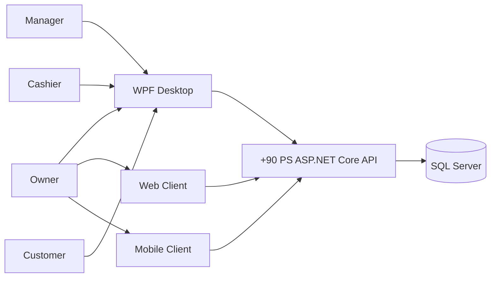
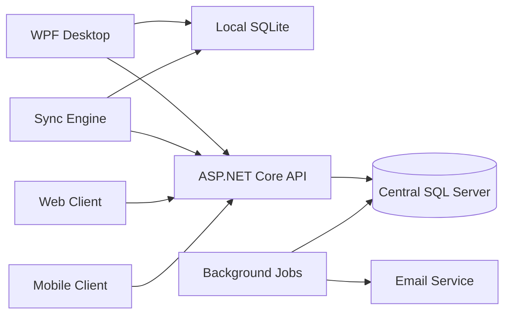
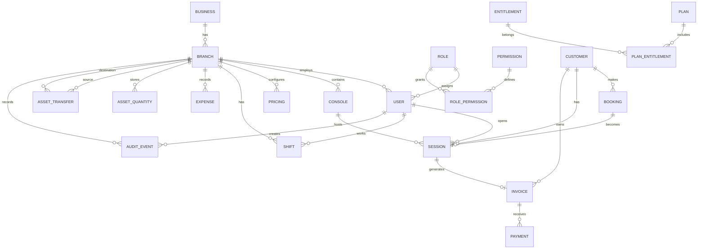
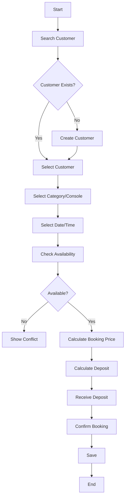
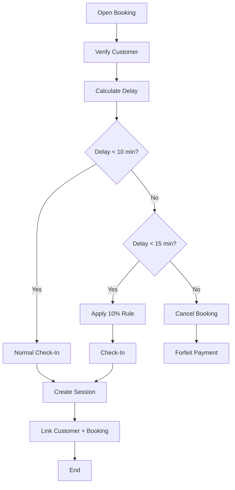
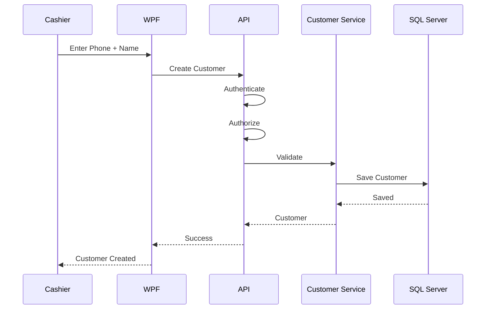
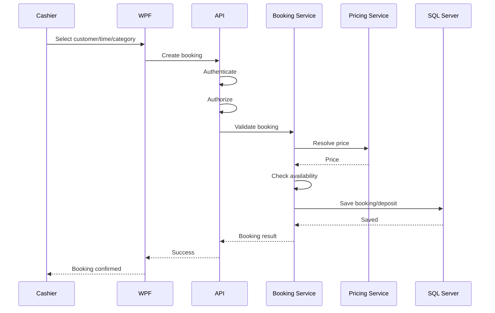
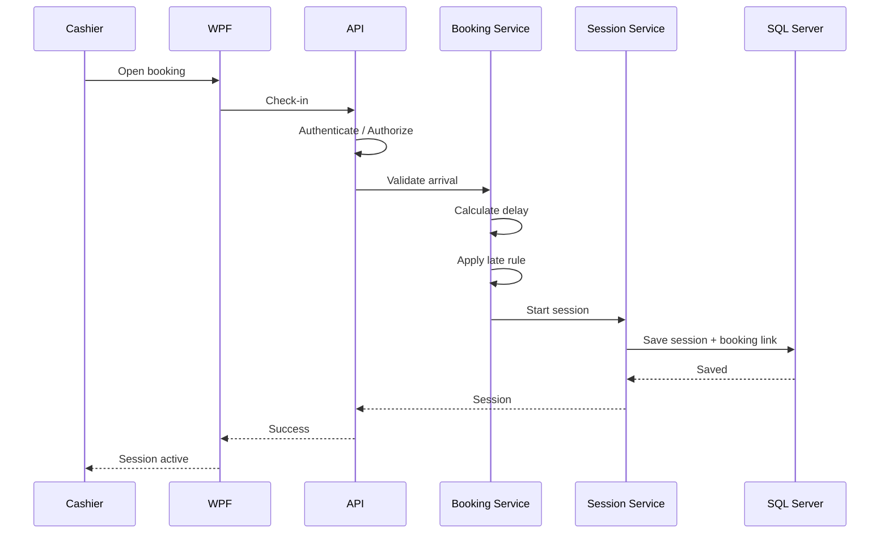
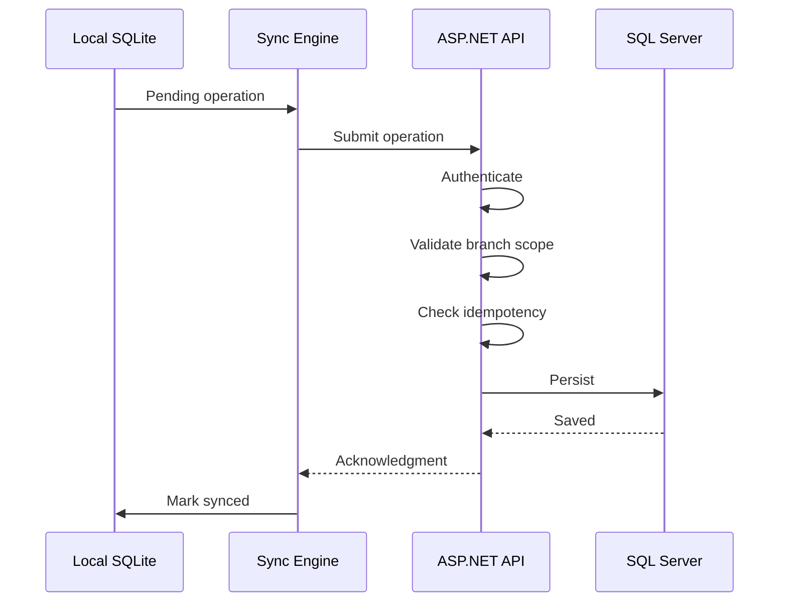

# تحديث الخطة — 2026-09-06

نسخة مراجعة مستقلة؛ الأصول لم تُعدّل. [ابدأ هنا](README(1).md) · [القواعد المشتركة](BUSINESS_RULES(1).md) · [القرارات المفتوحة](DECISIONS.md) · [التغييرات](CHANGELOG.md).

حالة الدليل: المتطلبات الجديدة المؤكدة من المستخدم مذكورة بمصدرها في SHARED_RULES. بقية المحتوى الموروث يحتفظ بحالته السابقة، وليس اعتمادًا جديدًا. مخططات البنية العامة تمثل اتصال المكونات؛ ترتيب كتابة عمليات الفرع تحدده ADR-01 والمخططات المحدّثة، ولا يُستنتج من سهم عام WPF/API.

---

# +90 PS — Release 3 Master Project File
## Full Product — Complete Multi-Branch Platform, Architecture, Security, Finance, Customers, Booking, Assets, Plans, Analytics & Operations

> **Project:** +90 PS  
> **Release:** Release 3 — Full Product  
> **Document Type:** Master Full-Product Specification  
> **Planning Date:** 2026-09-04  
> **Development Model:** Solo Developer with professional engineering practices  
> **Product Goal:** Build the complete mature +90 PS platform capable of supporting PlayStation shops, owners, managers and employees across a scalable multi-branch environment with strong financial controls, customer management, bookings, asset management, offline operation, synchronization, reporting, security, deployment, support, and future client applications.

---

# 0. Purpose

This document defines **Release 3 only**.

Release 3 represents the intended **complete +90 PS product** rather than a limited operational MVP.

The product is designed to support:

- One shop
- Multiple branches
- Owners with multiple locations
- Branch-specific configuration
- Branch-specific pricing
- Console management
- Single/Multi pricing
- Hourly pricing
- Match pricing
- Customer accounts
- Customer history
- Bookings
- VIP / Standard configurations
- Deposits
- Late-arrival rules
- Session management
- Invoices
- Cash payments
- Discounts
- Shifts
- Cash reconciliation
- Expenses
- Revenue
- Profit
- Asset/equipment management
- Quantity-based inventory
- Inter-branch transfers
- Employee/assignment transfers
- Advanced reports
- Email report delivery
- Advanced analytics
- Strong role/permission security
- Manager authorization
- Audit logging
- Offline operation
- Local SQLite
- Central ASP.NET Core API
- Central SQL Server
- Reliable synchronization
- Conflict handling
- Idempotency
- Monitoring
- Backups
- Disaster recovery
- Automated deployment/update
- Product plans/packages
- Feature entitlements
- Optional accounting integration
- Future web client
- Future mobile client
- Centralized operations and support

---

# 1. Full Product Mission

The final product should allow an owner to operate and understand their PlayStation business without depending on manual spreadsheets or disconnected systems.

The final platform must answer:

```text
What branches exist?
Who owns them?
Who works in each branch?
What consoles exist?
What are the current prices?
What sessions are active?
What bookings are coming?
Which customers are returning?
What revenue was generated?
What expenses were recorded?
What is the profit?
What assets does each branch have?
What was transferred between branches?
Who performed a sensitive action?
What happened while a branch was offline?
Did all offline data synchronize correctly?
Which branches are healthy?
Which branches are offline?
How is the business performing?
```

---

# 2. Product Definition

+90 PS is a multi-client business platform.

Core architecture:

```text
                       +90 PS
                          |
          +---------------+---------------+
          |               |               |
       Desktop          Web            Mobile
          |               |               |
          +---------------+---------------+
                          |
                          v
                 ASP.NET Core API
                          |
              +-----------+-----------+
              |                       |
              v                       v
         Business Domain          Reporting
              |
              v
        Central SQL Server
```

Branch resilience:

```text
Branch PC
   |
   +-- WPF Desktop
   |
   +-- Local SQLite
   |
   +-- Offline Operations
   |
   +-- Sync Engine
```

---

# 3. Product Philosophy

The final product follows these principles:

```text
Correctness
Security
Reliability
Auditability
Offline resilience
Scalability
Maintainability
Usability
Traceability
Recoverability
```

The objective is not maximum feature count.

The objective is a complete product where every business capability has a coherent:

```text
Requirement
+
Workflow
+
Domain Model
+
UI
+
API
+
Database
+
Security
+
Testing
+
Operational support
```

---

# 4. Business Structure

The platform supports owners/businesses with one or multiple branches.

Conceptual structure:

```text
Owner / Business
        |
        +-- Branch 01
        +-- Branch 02
        +-- Branch 03
        +-- ...
        +-- Branch 40+
```

Each branch has its own:

- Employees
- Consoles
- Pricing
- Sessions
- Bookings
- Customers/activity
- Invoices
- Expenses
- Assets
- Operational settings

The owner can view authorized cross-branch information.

---

# 5. Branch Model

Every branch has a unique identity.

Potential branch data:

```text
BranchId
OwnerId
Name
Address
Phone
Timezone
Currency
Opening configuration
Pricing configuration
Booking configuration
Operational settings
Status
CreatedAt
UpdatedAt
```

A branch must never be confused with the owner/business itself.

---

# 6. Ownership Model

An owner can have:

```text
One branch
```

or:

```text
Multiple branches
```

The product must support the transition from:

```text
Owner
  └── Branch A
```

to:

```text
Owner
  ├── Branch A
  └── Branch B
```

without redesigning the core system.

---

# 7. Multi-Branch Capability

For businesses with multiple branches, the product can support capabilities such as:

```text
Branch switching
Aggregated reporting
Cross-branch visibility
Asset quantity transfers
Employee transfers/assignments
Centralized management
Cross-branch monitoring
Centralized configuration
```

Access must always be constrained by ownership and authorization.

---

# 8. Plan / Package System

The product should support four commercial packages.

The exact package names, pricing and commercial terms are intentionally not fixed in this technical specification.

Conceptually:

```text
Package 1
Package 2
Package 3
Package 4
```

A plan contains:

```text
Entitlements
Feature Availability
Usage Limits where applicable
```

Example:

```text
Plan
  |
  +-- Multi-Branch
  +-- Asset Transfer
  +-- Advanced Reports
  +-- Advanced Analytics
  +-- Email Reports
  +-- Accounting Integration
```

The actual feature matrix is defined by the product/business team.

---

# 9. Entitlement Architecture

Do not scatter plan checks throughout the application.

Use:

```text
Plan
   ↓
Entitlements
   ↓
Feature Access
```

Separately:

```text
User
   ↓
Role
   ↓
Permission
```

Therefore final authorization concept:

```text
User
+
Role
+
Permission
+
Branch Scope
+
Product Entitlement
```

---

# 10. Permission vs Entitlement

## Permission

Answers:

> Is this user allowed to perform this action?

Example:

```text
Manager.ChangePricing
```

## Entitlement

Answers:

> Does this customer's plan include this capability?

Example:

```text
MultiBranch.TransferAssets
```

## Feature Flag

Answers:

> Is this capability currently enabled for rollout/testing?

These concepts remain separate.

---

# 11. Users and Roles

Final role hierarchy can include:

```text
Owner
Manager
Cashier
```

Additional administrative/system roles can be introduced only when justified.

Roles are not enough by themselves.

Use explicit permissions.

---

# 12. Owner

Owner can access authorized business/branch information.

Potential capabilities:

```text
View branches
View aggregated reports
Manage branch relationships
Review financial performance
Review sensitive audit events
Manage plans/entitlements where applicable
Review operational health
```

Owner access must never expose an unrelated business.

---

# 13. Manager

Manager operates within one or more explicitly authorized branches.

Potential capabilities:

```text
Manage users
Manage consoles
Manage pricing
Manage bookings
Manage customers
Manage expenses
Manage assets
View reports
Approve protected operations
Cancel/void invoices
Authorize manual discounts
Approve session transfers
Perform branch administration
```

---

# 14. Cashier

Cashier performs daily operational work:

```text
Login
Lock/unlock
Start session
Pause
Resume
Complete
Create invoice
Receive cash
Apply allowed discount
Work with customers
Work with bookings
Work with shifts
```

Any sensitive operation requiring elevated authorization must be protected.

---

# 15. Shared Device Identity

A branch may use one physical PC with many cashiers.

The product uses application-level identities.

Example:

```text
Cashier A
    ↓
Working
    ↓
Lock Screen
    ↓
Cashier B enters PIN
    ↓
Cashier B becomes Active User
```

The current application user determines:

```text
Permissions
Session responsibility
Shift responsibility
Audit identity
```

---

# 16. Authentication

Authentication supports:

```text
Manager
Cashier
Owner where appropriate
```

Local branch authentication must remain usable during approved offline conditions.

Credential requirements:

```text
No plaintext PINs
Protected local storage
Secure verification
Failed-attempt policy
Lockout policy
Secure reset/recovery
```

---

# 17. Authorization

Authorization must be enforced server-side.

The WPF UI may hide unavailable operations, but the API must independently enforce:

```text
Role
Permission
Branch
Entity ownership
Plan entitlement
Business state
```

---

# 18. Branch Isolation

A user must never obtain another branch's data by changing a client-supplied ID.

Example:

```text
User authorized for Branch A

Request:
GET /api/invoices?branchId=Branch B

Result:
Forbidden
```

The backend must derive and validate branch scope.

---

# 19. Console Management

Each branch can have a variable number of consoles.

Examples:

```text
PS4-01
PS4-02
PS5-01
PS5-02
```

Console information may include:

```text
Id
BranchId
Name
ConsoleType
Category
Status
IsActive
Asset reference
Notes
CreatedAt
UpdatedAt
```

---

# 20. Console States

Candidate operational states:

```text
Available
Reserved
Active
Maintenance
Disabled
```

The final state model should distinguish:

```text
Physical equipment status
```

from:

```text
Session/booking status
```

so that a console is not forced into one overloaded status field.

---

# 21. Pricing Model

Pricing depends on:

```text
Branch
+
Console Type
+
Mode
+
Pricing Method
```

Minimum types:

```text
PS4
PS5
```

Modes:

```text
Single
Multi
```

Methods:

```text
Hourly
Match
```

---

# 22. Pricing Matrix

Possible combinations:

```text
PS4 + Single + Hourly
PS4 + Multi  + Hourly
PS5 + Single + Hourly
PS5 + Multi  + Hourly

PS4 + Single + Match
PS4 + Multi  + Match
PS5 + Single + Match
PS5 + Multi  + Match
```

A branch can enable only the combinations it actually uses.

---

# 23. Branch-Specific Pricing

Example:

```text
Branch A
PS4 Single Hourly = 100
PS4 Multi  Hourly = 150
PS5 Single Hourly = 150
PS5 Multi  Hourly = 200
```

Branch B can use completely different values.

Only authorized users can modify pricing.

---

# 24. Pricing History

Price changes must not erase historical financial meaning.

Recommended approach:

```text
Pricing Version
     ↓
Effective From
     ↓
Effective To
```

A completed/active transaction should preserve the price that was applicable to that transaction.

This prevents later price changes from altering historical invoices.

---

# 25. Hourly Pricing

المرجع الوحيد للحساب هو [BR-TIME-001 وBR-TIME-002](BUSINESS_RULES(1).md).

Open: يبدأ بلا نهاية محددة، وينتهي بطلب العميل. للوقت بالساعات نحسب المدة الفعلية أولًا، ثم نقرب **للأعلى فقط** إذا كان المتبقي إلى ربع الساعة التالي ثلاث دقائق أو أقل؛ خلاف ذلك نستخدم المدة الفعلية. المدة الموجودة بالفعل على علامة ربع ساعة تبقى كما هي.

أمثلة بصيغة ساعات:دقائق: `2:27 → 2:30`، `2:20 → 2:20`، `2:42 → 2:45`، `2:57 → 3:00`. لا تقريب لأسفل ولا إهمال تلقائي للساعة غير المكتملة.

التعامل مع الثواني، والتوقف المؤقت، والحد الأدنى، وتقريب مبلغ العملة ما زال مفتوحًا في [سجل القرارات](DECISIONS.md). تلك الأسئلة تمنع إقفال الحساب الإنتاجي فقط، وليس العمل المستقل.

---

# 26. Match Pricing

Match تسعير مستقل عن Hourly. المستندات السابقة تقترح سعرًا ثابتًا ومدة يضبطها الفرع. وصف المستخدم يثبت أن الموظف قد يستخدم مؤقتًا تقريبيًا مثل 10 دقائق أو ينهي العملاء المباراة بأنفسهم؛ لا يثبت أن انتهاء المؤقت يجب أن ينهي الجلسة آليًا.

نحتفظ بقدرة التسعير بالماتش في Release 1. تحديد النهاية، وعدّ الماتشات المتتالية، والتمديد، والفاتورة المجمعة ينتظر O-04 في [سجل القرارات](DECISIONS.md). أرقام 10 و12 أمثلة إعدادات وليست مدة إلزامية أو تعريفًا نهائيًا للمباراة.

---

# 27. Single / Multi

Single and Multi must be independent pricing contexts.

Example:

```text
PS4 Single = 100
PS4 Multi  = 150

PS5 Single = 150
PS5 Multi  = 200
```

The data model must not assume one price per console type.

---

# 28. Session Management

A gaming session can move through states such as:

```text
Available
Active
Paused
Completed
Cancelled
```

Flow:

```text
Available
    ↓
Active
    ↓
Paused
    ↓
Active
    ↓
Completed
```

Only valid transitions are allowed.

---

# 29. Session Ownership

Session records preserve:

```text
OpenedByUser
CurrentResponsibleUser
Branch
Console
Pricing
Customer where applicable
Booking where applicable
```

This enables operational accountability.

---

# 30. Session Timing

The system must support:

```text
Start
Pause
Resume
Complete
```

Multiple pauses should be modeled correctly rather than overwriting one timestamp.

A timing-history design may be required:

```text
Session
    |
    +-- SessionInterval
            |
            +-- Start
            +-- End
```

This is a design option and should be chosen based on the final billing algorithm.

---

# 31. Session Price Snapshot

When a session begins, it should normally preserve the applicable pricing context.

Example:

```text
Session starts:
150 EGP/hour

Current price later changes:
170 EGP/hour
```

The active session remains financially consistent with its captured pricing context.

---

# 32. Booking

Booking represents a reservation of gaming availability for a customer.

Core relationship:

```text
Customer
   ↓
Booking
   ↓
Session
   ↓
Invoice
   ↓
Payment
```

---

# 33. Booking Categories

A branch can offer categories such as:

```text
VIP
Standard
```

If the branch has these categories:

```text
Customer selects category
```

If not:

```text
Do not show an unnecessary category choice
```

---

# 34. Booking Target

The product may support:

```text
Category-based booking
```

and, where configured:

```text
Specific-console booking
```

Category-based booking example:

```text
Customer
  ↓
VIP
  ↓
System allocates suitable available console
```

Console-specific:

```text
Customer
  ↓
PS5-04
```

---

# 35. Booking Availability

Before confirming a booking:

```text
Branch
  ↓
Category/Console
  ↓
Date/Time
  ↓
Availability
```

The system must prevent invalid overlapping reservations.

---

# 36. Booking Deposit

هذه قدرة موروثة من [Release 2](R2_EXPANDED_MVP.md)، الذي يملك تعريف العربون والتأخير وحدود 10/15 دقيقة والمعالجة المالية. لا يعرّف R3 سياسة بديلة؛ أي تغيير لاحق يُسجّل كتغيير صريح مع اختبارات ترحيل ورجوع. المعالجة النهائية والأسئلة غير المحسومة في O-14 داخل [DECISIONS](DECISIONS.md).

---

# 37. Booking Price Snapshot

A booking should preserve the agreed price when created.

Example:

```text
Booking Price:
300 EGP
```

Later branch pricing:

```text
350 EGP
```

The existing booking should remain at its captured price unless an authorized business change is made.

---

# 38. Late Arrival Policy

هذه قدرة موروثة من [Release 2](R2_EXPANDED_MVP.md)، الذي يملك تعريف العربون والتأخير وحدود 10/15 دقيقة والمعالجة المالية. لا يعرّف R3 سياسة بديلة؛ أي تغيير لاحق يُسجّل كتغيير صريح مع اختبارات ترحيل ورجوع. المعالجة النهائية والأسئلة غير المحسومة في O-14 داخل [DECISIONS](DECISIONS.md).

---

# 39. Late Arrival Calculation

هذه قدرة موروثة من [Release 2](R2_EXPANDED_MVP.md)، الذي يملك تعريف العربون والتأخير وحدود 10/15 دقيقة والمعالجة المالية. لا يعرّف R3 سياسة بديلة؛ أي تغيير لاحق يُسجّل كتغيير صريح مع اختبارات ترحيل ورجوع. المعالجة النهائية والأسئلة غير المحسومة في O-14 داخل [DECISIONS](DECISIONS.md).

---

# 40. Booking State Machine

Candidate states:

```text
Pending
Confirmed
Arrived
Active
Completed
Cancelled
No-Show
Expired
```

Flow:

```text
Pending
   ↓
Confirmed
   ↓
Arrived
   ↓
Active
   ↓
Completed
```

Alternative exits:

```text
Confirmed → Cancelled
Confirmed → No-Show
Confirmed → Expired
```

---

# 41. Booking Check-In

Flow:

```text
Open Booking
    ↓
Verify Customer
    ↓
Calculate Arrival Delay
    ↓
Apply Late Policy
    ↓
Eligible?
   /     \
 Yes      No
 |         |
Check-in  Cancel/Forfeit
 ↓
Start Session
```

---

# 42. Booking to Session

A valid booking may become a session.

```text
Booking
   ↓
Customer Arrives
   ↓
Validate
   ↓
Allocate Console/Category
   ↓
Create Session
   ↓
Session.BookingId = Booking.Id
   ↓
Session.CustomerId = Booking.CustomerId
```

---

# 43. Walk-In Sessions

Not every session needs a booking.

Therefore:

```text
Walk-in Session
BookingId = NULL
```

Customer relationship may also be optional if the business permits anonymous walk-ins.

---

# 44. Customer Accounts

Customer account means a persistent business record.

It does not mean:

```text
Customer Login
Customer Website
Customer Mobile Login
Membership
Loyalty
```

unless separately enabled by the product specification.

---

# 45. Customer Identity

Confirmed:

```text
Phone number = primary business lookup/key
Customer name = required
```

Recommended technical model:

```text
Customer.Id = internal stable ID
Phone = business lookup/unique key according to final business rule
```

Do not use a phone number itself as the database primary key.

---

# 46. Customer Profile

Candidate fields:

```text
CustomerId
Phone
Name
Notes
CreatedAt
UpdatedAt
Status
```

Avoid collecting unnecessary personal data.

---

# 47. Customer Search

Primary workflow:

```text
Enter Phone
    ↓
Search
    ↓
Customer Found?
   /       \
 Yes        No
 |           |
Open       Create
Profile    Customer
```

Search must be fast enough for cashier use.

---

# 48. Customer Creation

Required:

```text
Phone
Name
```

Validation:

```text
Phone valid enough for business rules
Name required
Duplicate handling
```

---

# 49. Customer History

Customer history should expose relevant:

```text
Sessions
Bookings
Invoices
Payments
Visits
```

Potential timeline:

```text
Booking Created
     ↓
Booking Confirmed
     ↓
Session Started
     ↓
Session Completed
     ↓
Invoice Paid
```

---

# 50. History Architecture

Do not automatically duplicate all transactions into a giant `CustomerHistory` table.

Prefer deriving history from source records:

```text
Customer
Bookings
Sessions
Invoices
Payments
Audit Events
```

Use query/read models when needed for performance.

---

# 51. Customer History Filters

Possible:

```text
Date range
Activity type
Branch
Status
```

Authorization must determine which filters/data are available.

---

# 52. Customer Data Authorization

Customer data must obey:

```text
Role
Permission
Branch scope
Business ownership
```

A simple customer search should not return the customer's entire history by default.

Use minimal responses for each endpoint.

---

# 53. Customer Data Security

Protect:

```text
Phone number
Name
History
Financial information
Bookings
```

Avoid exposing customer information in unnecessary logs.

---

# 54. Invoice Model

Invoice is a persistent financial record.

Conceptual:

```text
Invoice
   |
   +-- Session
   +-- Customer
   +-- Branch
   +-- Cashier
   +-- Discount
   +-- Payment
```

---

# 55. Invoice State

Candidate:

```text
Draft
Issued
Paid
Cancelled
Voided
```

Only authorized transitions are allowed.

---

# 56. Invoice Cancellation

Never rely on destructive delete as the normal financial workflow.

Use:

```text
Invoice
   ↓
Manager Authorization
   ↓
Cancelled / Voided
```

Preserve:

```text
Original amount
Cashier
Branch
Manager
Timestamp
Reason
```

---

# 57. Cash Payments

Initial payment type:

```text
Cash
```

The final mature product may support additional methods only if included in the commercial/product scope.

Payment should remain traceable to:

```text
Invoice
User
Branch
Timestamp
Amount
```

---

# 58. Discounts

Discount layers:

```text
Configured Discount
    ↓
Cashier can apply

Manual Discount
    ↓
Manager authorization
```

Final product should support:

```text
Fixed amount
Percentage
Maximum limits
Validity
Eligibility
Audit
```

only where required by approved business rules.

---

# 59. Cashier Shift

Final product includes a complete shift concept.

A shift belongs to:

```text
Branch
+
Cashier
```

Potential data:

```text
ShiftId
CashierId
BranchId
OpenedAt
ClosedAt
OpeningCash
ExpectedCash
ActualCash
Difference
Status
```

---

# 60. Cash Reconciliation

The final system supports:

```text
Opening Cash
+
Cash Revenue
-
Cash Expenses
=
Expected Closing Cash
```

Then:

```text
Expected Closing Cash
vs
Actual Counted Cash
```

Difference:

```text
Actual
-
Expected
=
Variance
```

---

# 61. Shift Closing

Flow:

```text
Cashier starts shift
    ↓
Daily operations
    ↓
Sessions
    ↓
Invoices
    ↓
Cash
    ↓
Expenses if applicable
    ↓
Cashier attempts close
    ↓
Check active sessions
    ↓
Resolve active sessions
    ↓
Calculate expected cash
    ↓
Enter actual cash
    ↓
Calculate variance
    ↓
Close shift
```

---

# 62. Shift Handover

If active sessions remain:

```text
Cashier A
   ↓
Attempts to close
   ↓
Active sessions exist
   ↓
Manager Authorization
   ↓
Select Cashier B
   ↓
Transfer responsibility
   ↓
Audit
```

---

# 63. Expenses

Manager-authorized users can create expenses.

Expense contains:

```text
Branch
Amount
Category
Description
CreatedBy
Timestamp
Status
```

The final product may include approval/status workflows if required.

---

# 64. Revenue

Revenue sources:

```text
Gaming Sessions
Booking-related financial events where applicable
```

Any deposit/no-show treatment must be defined so revenue is not double counted.

---

# 65. Profit

Operational profit:

```text
Revenue
-
Expenses
=
Profit
```

Advanced accounting concepts should only be introduced according to the finalized accounting model.

---

# 66. Deposit Financial Integrity

هذه قدرة موروثة من [Release 2](R2_EXPANDED_MVP.md)، الذي يملك تعريف العربون والتأخير وحدود 10/15 دقيقة والمعالجة المالية. لا يعرّف R3 سياسة بديلة؛ أي تغيير لاحق يُسجّل كتغيير صريح مع اختبارات ترحيل ورجوع. المعالجة النهائية والأسئلة غير المحسومة في O-14 داخل [DECISIONS](DECISIONS.md).

---

# 67. No-Show Financial Integrity

At the no-show threshold:

```text
Booking cancelled
Payment/deposit forfeited
```

The system must explicitly determine whether the forfeited amount is:

```text
Revenue
Other income
Penalty
Liability release
```

according to the approved accounting policy.

Never infer the accounting meaning from UI behavior.

---

# 68. Asset / Inventory Management

Inventory is internal asset/equipment management.

Categories:

```text
Consoles
Controllers
Accessories
Equipment
Assets
```

It is not product-sales inventory.

---

# 69. Quantity-Based Asset Model

Controllers/accessories/equipment are tracked as quantities where appropriate.

Example:

```text
Branch A
Controllers = 12
```

The final product does not require individual serial-number records for every accessory unless business requirements justify them.

---

# 70. Console Asset Model

Consoles may be tracked more deeply than consumable quantities.

Potential:

```text
AssetId
BranchId
ConsoleId
Category
PurchaseDate
PurchaseCost
Condition
Status
SerialNumber (if available)
```

Exact fields depend on operational needs.

---

# 71. Asset Status

Possible:

```text
Available
In Use
Maintenance
Damaged
Lost
Transferred
Retired
Disposed
```

Use only states that correspond to real operational processes.

---

# 72. Asset Transfer

For multiple branches:

```text
Branch A
   ↓
Transfer Quantity
   ↓
Branch B
```

The system must record:

```text
Source Branch
Destination Branch
Asset Category
Quantity
Requested By
Approved By
Created At
Completed At
Status
```

---

# 73. Employee Transfer

The mature multi-branch model may support moving/assigning an employee between branches.

Important:

```text
Employee identity remains the same.
Branch assignment changes historically.
```

Maintain an effective history rather than overwriting all prior branch relationships.

---

# 74. Multi-Branch Reporting

Owner-level reports may aggregate:

```text
All Revenue
All Expenses
All Profit
Sessions
Bookings
Customers
Assets
```

Branch managers only receive authorized branch information.

---

# 75. Advanced Reports

Final reporting may include:

```text
Revenue by day/week/month
Expenses by day/week/month
Profit by day/week/month
Revenue by branch
Profit by branch
Session count
Session duration
Console utilization
Booking count
Booking conversion
No-show rate
Late arrivals
Discount usage
Cash variance
Expense trends
Customer activity
Asset quantities
Transfer activity
```

---

# 76. Email Reports

The platform should support scheduled report delivery.

Possible schedules:

```text
Daily
Weekly
Monthly
```

Flow:

```text
Scheduler
   ↓
Report Generator
   ↓
Generate Report
   ↓
Email Service
   ↓
Recipients
```

Need:

```text
Retry
Failure handling
Template
Recipient configuration
Audit
```

---

# 77. Advanced Analytics

The mature product can calculate:

```text
Branch performance
Peak hours
Console utilization
Revenue trends
Booking conversion
Customer return rate
No-show rate
Average transaction
Expense trends
Cash variance
```

Analytics must be based on reliable data.

Do not create metrics whose definitions are ambiguous.

---

# 78. Business Intelligence Model

Potential dashboard hierarchy:

```text
Owner Dashboard
   |
   +-- Business Overview
   +-- Branch Comparison
   +-- Revenue
   +-- Profit
   +-- Booking
   +-- Customer
   +-- Operational Health
```

Manager dashboard:

```text
Branch Overview
Sessions
Bookings
Revenue
Expenses
Profit
Staff
Assets
```

Cashier dashboard:

```text
Current sessions
Available consoles
Bookings requiring attention
Current shift
```

---

# 79. Product Health Dashboard

Central operators should eventually see:

```text
Branches Online
Branches Offline
Sync Backlog
Sync Failures
API Health
Database Health
Error Rate
Active Sessions
```

---

# 80. Offline Architecture

```text
WPF → Local authorization + shared business rules
    → SQLite transaction: operational record + pending sync operation
    → Local success shown to cashier
    → Sync when online → API authentication/branch validation/idempotency
    → SQL Server transaction → acknowledgement → local sync status
```

قرار هندسي معتمد لهذه الخطة: عمليات الفرع الأساسية تكتب محليًا أولًا في الحالتين Online وOffline؛ الاتصال يغيّر توقيت المزامنة ولا يبدّل مكان إنشاء الفاتورة. التقرير المركزي والتهيئة المركزية لهما API، ولا يعني ذلك إعادة إرسال إنشاء الجلسة كعملية جديدة.
التفاصيل والحدود في [القرارات المشتركة](BUSINESS_RULES(1).md). المزامنة الناجحة تختلف عن نجاح الحفظ المحلي، وتظهر الحالتان للمستخدم.

---

# 81. Online Flow

```text
WPF → Local authorization + shared business rules
    → SQLite transaction: operational record + pending sync operation
    → Local success shown to cashier
    → Sync when online → API authentication/branch validation/idempotency
    → SQL Server transaction → acknowledgement → local sync status
```

قرار هندسي معتمد لهذه الخطة: عمليات الفرع الأساسية تكتب محليًا أولًا في الحالتين Online وOffline؛ الاتصال يغيّر توقيت المزامنة ولا يبدّل مكان إنشاء الفاتورة. التقرير المركزي والتهيئة المركزية لهما API، ولا يعني ذلك إعادة إرسال إنشاء الجلسة كعملية جديدة.
التفاصيل والحدود في [القرارات المشتركة](BUSINESS_RULES(1).md). المزامنة الناجحة تختلف عن نجاح الحفظ المحلي، وتظهر الحالتان للمستخدم.

---

# 82. Offline Flow

```text
WPF → Local authorization + shared business rules
    → SQLite transaction: operational record + pending sync operation
    → Local success shown to cashier
    → Sync when online → API authentication/branch validation/idempotency
    → SQL Server transaction → acknowledgement → local sync status
```

قرار هندسي معتمد لهذه الخطة: عمليات الفرع الأساسية تكتب محليًا أولًا في الحالتين Online وOffline؛ الاتصال يغيّر توقيت المزامنة ولا يبدّل مكان إنشاء الفاتورة. التقرير المركزي والتهيئة المركزية لهما API، ولا يعني ذلك إعادة إرسال إنشاء الجلسة كعملية جديدة.
التفاصيل والحدود في [القرارات المشتركة](BUSINESS_RULES(1).md). المزامنة الناجحة تختلف عن نجاح الحفظ المحلي، وتظهر الحالتان للمستخدم.

---

# 83. Sync Engine

Responsibilities:

```text
Detect connectivity
Read pending operations
Send changes
Receive remote changes where applicable
Retry failures
Deduplicate operations
Handle conflicts
Mark synchronization state
Record errors
```

---

# 84. Sync Item

Conceptual:

```text
SyncItem
----------------------------
Id
OperationId
EntityType
EntityId
OperationType
Payload
CreatedAt
AttemptCount
LastAttemptAt
Status
Error
```

Statuses:

```text
Pending
Processing
Synced
Failed
Conflict
```

---

# 85. Idempotency

Example:

```text
Client sends operation
   ↓
Server stores it
   ↓
Acknowledgment lost
   ↓
Client retries
```

The server must recognize the operation ID and avoid duplicate business actions.

---

# 86. Conflict Handling

Conflicts must be explicit.

Potential conflict categories:

```text
Customer conflict
Booking conflict
Pricing conflict
Asset quantity conflict
Configuration conflict
```

Financial data should be especially strict.

---

# 87. Sync Strategy by Entity

Not every entity should synchronize identically.

Possible:

```text
Customer
→ Merge/update rules

Booking
→ Strong conflict rules

Session
→ Event/operation based

Invoice
→ Strong idempotency

Payment
→ Strong idempotency / append-only preference

Audit
→ Append-only

Configuration
→ Versioned / server-authoritative where appropriate
```

---

# 88. Local Data Protection

The local database contains operational data.

Protect:

```text
User credential material
Customer data
Financial data
Pending sync data
```

Use OS/storage security appropriate to the deployment platform.

Do not store:

```text
Plaintext PIN
Plaintext secrets
API keys
Database passwords
```

---

# 89. Sync Security

Each sync operation must be authenticated and authorized.

Validate:

```text
Device / branch identity
User or service identity
Operation ID
Payload integrity
Branch scope
Entity state
```

Never trust a branch simply because it provides a branch ID.

---

# 90. Central API Architecture

Backend modules:

```text
Authentication
Authorization
Owner / Business
Branch
User
Role
Permission
Console
Pricing
Session
Customer
Booking
Invoice
Payment
Discount
Shift
Expense
Asset
Transfer
Reporting
Analytics
Audit
Synchronization
Configuration
Plan / Entitlement
```

---

# 91. Backend Architecture Pattern

Recommended:

```text
API
 ↓
Application
 ↓
Domain
 ↓
Infrastructure
```

Possible structure:

```text
API
Application
Domain
Infrastructure
```

This keeps business rules testable.

---

# 92. WPF Architecture

Recommended:

```text
Presentation
Application
Domain / Contracts
Infrastructure
```

Presentation:

```text
Views
ViewModels
Navigation
Converters
UI state
```

Infrastructure:

```text
API client
SQLite
Sync
Local security
Logging
```

Use MVVM.

---

# 93. Future Web Client

A Web client can connect to the same API:

```text
Web
  ↓
ASP.NET Core API
  ↓
Domain / Data
```

The web client should not contain duplicate authoritative business rules.

---

# 94. Future Mobile Client

Mobile can use:

```text
Mobile
  ↓
ASP.NET Core API
  ↓
Central Platform
```

The mobile client should use the same authorization and domain rules.

---

# 95. API as Stable Product Boundary

All clients:

```text
WPF
Web
Mobile
```

should use:

```text
ASP.NET Core API
```

This keeps the central product independent from any single client.

---

# 96. REST API Design

API resource groups:

```text
/auth
/users
/roles
/permissions
/owners
/branches
/consoles
/pricing
/sessions
/customers
/bookings
/invoices
/payments
/discounts
/shifts
/expenses
/assets
/transfers
/reports
/analytics
/audit
/sync
/plans
/entitlements
```

---

# 97. API Contract

Every endpoint needs:

```text
Method
Route
Authentication
Authorization
Request
Validation
Response
Errors
Status codes
Idempotency
Business rules
```

Use OpenAPI/Swagger.

---

# 98. API Error Model

Example:

```json
{
  "code": "BOOKING_SLOT_UNAVAILABLE",
  "message": "The selected time is no longer available.",
  "traceId": "..."
}
```

Do not expose:

```text
Stack traces
Secrets
SQL errors
Internal architecture details
```

---

# 99. Validation

Validate on multiple levels:

```text
UI validation
Application validation
API validation
Domain validation
Database constraints
```

The API/domain are authoritative.

---

# 100. Database Strategy

Central:

```text
SQL Server
```

Local:

```text
SQLite
```

EF Core can be used for the central data access layer.

---

# 101. Database Principles

Use:

```text
Primary Keys
Foreign Keys
Indexes
Unique Constraints
Transactions
Concurrency Controls
Proper nullability
Audit references
Branch scoping
```

Do not use a generic "everything table".

Keep business entities explicit.

---

# 102. Core Domain Entities

Potential final model:

```text
Owner
Business
Branch

User
Role
Permission
RolePermission
UserBranchAssignment

Console
ConsoleType
ConsoleCategory

Pricing
PricingVersion

Session
SessionInterval

Customer
Booking
BookingStatusHistory

Invoice
Payment
Discount

Shift
ShiftCashSummary
CashAdjustment

Expense

AssetCategory
AssetQuantity
AssetTransfer
EmployeeTransfer

AuditEvent
SyncItem

Plan
Entitlement

ReportSchedule
ReportDelivery
```

The final physical schema must follow the approved domain model.

---

# 103. Owner / Business Entity

A logical business/organization entity may be useful:

```text
Business
---------------------------
Id
Name
OwnerId / Ownership model
Status
CreatedAt
```

Whether `Owner` and `Business` are combined or separated is a domain design decision.

---

# 104. Customer Entity

```text
Customer
---------------------------
Id
Phone
Name
Notes
Status
CreatedAt
UpdatedAt
```

Phone is the primary business lookup key.

---

# 105. Booking Entity

```text
Booking
---------------------------
Id
BranchId
CustomerId
ConsoleId nullable
CategoryId nullable
StartAt
EndAt
PriceSnapshot
DepositAmount
DepositStatus
Status
CreatedByUserId
ConfirmedAt
ArrivedAt
CancelledAt
CancellationReason
CreatedAt
UpdatedAt
```

---

# 106. Session Entity

```text
Session
---------------------------
Id
BranchId
ConsoleId
CustomerId nullable
BookingId nullable
PricingId / PricingSnapshot
OpenedByUserId
CurrentResponsibleUserId
Status
StartTime
EndTime
CalculatedPrice
CreatedAt
UpdatedAt
```

---

# 107. Session Interval Entity

If multiple pauses are supported:

```text
SessionInterval
---------------------------
Id
SessionId
StartedAt
EndedAt
Type
```

Possible type:

```text
Active
Paused
```

The billing engine can calculate billable time from intervals.

---

# 108. Invoice Entity

```text
Invoice
---------------------------
Id
BranchId
SessionId nullable
CustomerId nullable
CashierUserId
Subtotal
DiscountAmount
Total
Status
IssuedAt
PaidAt
CancelledAt
CancelledByUserId
CancellationReason
```

---

# 109. Payment Entity

```text
Payment
---------------------------
Id
InvoiceId
Method
Amount
ReceivedByUserId
ReceivedAt
Reference
Status
```

Release 1 business started with Cash, but the final model may support additional methods only when officially enabled.

---

# 110. Expense Entity

```text
Expense
---------------------------
Id
BranchId
CreatedByUserId
Amount
Category
Description
OccurredAt
Status
CreatedAt
UpdatedAt
```

---

# 111. Shift Entity

```text
Shift
---------------------------
Id
BranchId
CashierUserId
StartedAt
EndedAt
OpeningCash
ExpectedClosingCash
ActualClosingCash
Variance
Status
```

---

# 112. Asset Quantity Entity

```text
AssetQuantity
---------------------------
Id
BranchId
CategoryId
Name
Quantity
Unit
Status
UpdatedAt
```

---

# 113. Asset Transfer Entity

```text
AssetTransfer
---------------------------
Id
SourceBranchId
DestinationBranchId
AssetCategoryId
Quantity
RequestedByUserId
ApprovedByUserId
Status
CreatedAt
CompletedAt
```

---

# 114. Employee Transfer Entity

```text
EmployeeTransfer
---------------------------
Id
UserId
SourceBranchId
DestinationBranchId
ApprovedByUserId
EffectiveAt
Status
CreatedAt
```

---

# 115. Audit Event Entity

```text
AuditEvent
---------------------------
Id
BusinessId
BranchId nullable
ActorUserId
Action
EntityType
EntityId
OldValue
NewValue
Reason
Timestamp
CorrelationId
```

Sensitive information must be handled carefully.

---

# 116. Plan / Entitlement Entities

Conceptual:

```text
Plan
---------------------------
Id
Name
Status
```

```text
Entitlement
---------------------------
Id
Key
Description
```

```text
PlanEntitlement
---------------------------
PlanId
EntitlementId
Value / Limit
```

---

# 117. Report Schedule

```text
ReportSchedule
---------------------------
Id
OwnerId / BranchId
ReportType
Frequency
Recipients
IsActive
NextRunAt
CreatedAt
```

---

# 118. Report Delivery

```text
ReportDelivery
---------------------------
Id
ReportScheduleId
StartedAt
CompletedAt
Status
Recipient
Error
```

---

# 119. Database Constraints

Examples:

```text
Branch must belong to valid owner/business
Session must reference valid branch/console
Invoice must belong to valid branch
Payment must reference valid invoice
Booking must reference valid customer
Booking category/console must be valid for branch
```

---

# 120. Database Concurrency

Critical operations may require concurrency controls:

```text
Booking availability
Console start
Session state change
Asset transfer
Cash reconciliation
Sync operations
Invoice cancellation
```

Use transactions and appropriate consistency mechanisms.

---

# 121. Security Architecture

Security boundaries:

```text
Client
  |
  | HTTPS
  v
API
  |
  | Authorized data access
  v
Database
```

Branch local:

```text
WPF
  |
Protected Local Store
  |
SQLite
```

---

# 122. Security Requirements

Final product security includes:

```text
Authentication
Authorization
RBAC
Branch isolation
Credential protection
Secure communication
Input validation
Secrets management
Audit
Logging
Rate limiting where applicable
Session security
Data protection
Backup protection
Operational monitoring
```

---

# 123. Threat Model

Threats include:

```text
Spoofing
Tampering
Repudiation
Information Disclosure
Denial of Service
Elevation of Privilege
```

Areas:

```text
WPF → API
Branch → Central
API → SQL
Sync Engine → API
Manager Override
Customer data
Financial records
Audit data
Plans/entitlements
```

---

# 124. Manager Override Security

Sensitive action:

```text
Cashier
   ↓
Protected Action
   ↓
Manager PIN
   ↓
Authenticate
   ↓
Authorize
   ↓
Execute
   ↓
Audit
```

Manager PIN must be verified using secure protected credentials.

---

# 125. Audit Policy

Audit sensitive business actions:

```text
Price changes
Invoice cancellation
Manual discounts
Session transfer
Expense sensitive changes
User/role changes
Permission changes
Booking overrides
Deposit changes
Asset transfers
Employee transfers
Security events
```

Do not log every mouse click.

---

# 126. Application Logging

Technical logs:

```text
Exceptions
Warnings
API failures
Database failures
Sync failures
Background job errors
Health failures
```

Avoid logging:

```text
PINs
Passwords
Secrets
Tokens
Unnecessary full customer data
```

---

# 127. Security Testing

Test:

```text
Authentication bypass
Authorization bypass
Branch isolation
Privilege escalation
Input validation
Injection
Credential protection
API access
Manager override
Customer privacy
Booking authorization
Financial record manipulation
Sync tampering
```

---

# 128. Privacy Principle

Only collect and display customer data necessary for business operation.

Use:

```text
Least privilege
Least data exposure
Least logging
```

---

# 129. Product Observability

Central platform should expose:

```text
API health
Database health
Queue health
Sync health
Branch connectivity
Error rate
Latency
Job failures
```

---

# 130. Branch Health

Owner/operations may see:

```text
Branch Online
Branch Offline
Last Sync
Pending Operations
Sync Error
Application Version
```

---

# 131. Monitoring Architecture

```text
Applications
    ↓
Logs / Metrics
    ↓
Monitoring System
    ↓
Alerts
    ↓
Operator
```

The exact monitoring stack can be selected based on deployment environment.

---

# 132. Alerting

Possible alerts:

```text
API unavailable
Database unavailable
Sync backlog too large
Repeated sync failures
High error rate
Branch offline too long
Backup failure
Report delivery failure
```

---

# 133. Backup

Central database backups must define:

```text
Frequency
Retention
Encryption
Storage
Verification
Restore test
Access control
```

Local SQLite backup/recovery should also be considered based on branch recovery strategy.

---

# 134. Disaster Recovery

Recover from:

```text
API outage
Database outage
Data corruption
Server loss
Branch PC failure
Local database corruption
Sync failure
Configuration failure
Bad deployment
```

---

# 135. RPO / RTO

Define business targets:

```text
RPO = maximum acceptable data loss
RTO = maximum acceptable recovery time
```

Do not select arbitrary values without customer/business validation.

---

# 136. CI/CD

Target:

```text
Git Push
   ↓
Build
   ↓
Unit Tests
   ↓
Integration Tests
   ↓
Security Checks
   ↓
Package
   ↓
Staging
   ↓
UAT
   ↓
Production
```

---

# 137. Environments

```text
Development
Testing
Staging
Production
```

Do not experiment directly in production.

---

# 138. Desktop Deployment

The final desktop system should support:

```text
Versioned builds
Repeatable installation
Configuration management
Migration
Update
Rollback
```

---

# 139. Auto Update

At scale, manual updates are undesirable.

Target:

```text
Check Version
   ↓
Download
   ↓
Verify
   ↓
Install
   ↓
Restart
   ↓
Health Check
```

Must support safe rollback.

---

# 140. Database Migration

Every schema change:

```text
Migration
   ↓
Test
   ↓
Staging
   ↓
Backup
   ↓
Production
```

Never make undocumented manual schema changes.

---

# 141. Feature Flags

Feature flags may be used for controlled rollout.

Example:

```text
BookingV2 = Enabled
```

But feature flags should not replace:

```text
Permissions
Entitlements
Business Rules
```

---

# 142. Product Configuration

Branch-configurable values should not be hardcoded.

Examples:

```text
Prices
Match duration
Booking late thresholds
Discount rules
Opening settings
Report schedules
```

Configuration should be versioned where historical consistency matters.

---

# 143. System Context Diagram



---

# 144. C4 Context

```text
                    +----------------+
                    |     Owner      |
                    +-------+--------+
                            |
                            v
                +-----------+-----------+
                |       +90 PS          |
                |    Full Product       |
                +-----------+-----------+
                            ^
                            |
                  +---------+---------+
                  |                   |
               Manager             Cashier
```

---

# 145. C4 Container



---

# 146. C4 Component

```text
ASP.NET Core API
|
+-- Identity
+-- Authorization
+-- Owner/Business
+-- Branch
+-- User
+-- Console
+-- Pricing
+-- Session
+-- Customer
+-- Booking
+-- Invoice
+-- Payment
+-- Discount
+-- Shift
+-- Expense
+-- Asset
+-- Transfer
+-- Reporting
+-- Analytics
+-- Audit
+-- Synchronization
+-- Plans
+-- Entitlements
+-- Configuration
```

---

# 147. Deployment Diagram

```text
                          Internet
                             |
                 +-----------+-----------+
                 |       API Server      |
                 |   ASP.NET Core API    |
                 +-----------+-----------+
                             |
                     +-------+-------+
                     | SQL Server    |
                     +---------------+
                             |
                  +----------+----------+
                  |                     |
             Background Jobs         Email
                  |
                  |
--------------------------------------------------

Branch A
  |
  +-- Windows PC
      |
      +-- WPF
      +-- SQLite
      +-- Sync Engine

Branch B
  |
  +-- Windows PC
      |
      +-- WPF
      +-- SQLite
      +-- Sync Engine

...
```

---

# 148. Data Flow Diagram

```text
User
 ↓
Client
 ├── Online → API → Database
 │
 └── Offline → Local SQLite
                    ↓
                 Sync Queue
                    ↓
                   API
                    ↓
                Database
```

---

# 149. ERD — High Level



---

# 150. Use Case Diagram — Full Product

```text
Owner
 |
 +-- View Business
 +-- View Branches
 +-- View Aggregated Reports
 +-- View Financial Performance
 +-- Manage Authorized Business Configuration
 +-- Review Audit

Manager
 |
 +-- Manage Users
 +-- Manage Consoles
 +-- Manage Pricing
 +-- Manage Customers
 +-- Manage Bookings
 +-- Manage Expenses
 +-- Manage Assets
 +-- Manage Shifts
 +-- View Reports
 +-- Authorize Protected Actions
 +-- Cancel/void Invoice
 +-- Approve Transfer

Cashier
 |
 +-- Login
 +-- Lock/Unlock
 +-- Start Session
 +-- Pause Session
 +-- Resume Session
 +-- Complete Session
 +-- Create Invoice
 +-- Receive Cash
 +-- Apply Allowed Discount
 +-- Find Customer
 +-- Create Customer
 +-- Create Booking
 +-- Check Booking
 +-- Start Shift
 +-- End Shift
```

---

# 151. Activity Diagram — Customer Booking



---

# 152. Activity Diagram — Booking Check-In



---

# 153. Sequence Diagram — Customer Creation



---

# 154. Sequence Diagram — Booking



---

# 155. Sequence Diagram — Booking Check-In



---

# 156. Sequence Diagram — Offline Sync



---

# 157. State Diagram — Booking

```text
Pending
   ↓
Confirmed
   ↓
Arrived
   ↓
Active
   ↓
Completed

Confirmed
   ├──> Cancelled
   ├──> No-Show
   └──> Expired
```

---

# 158. State Diagram — Invoice

```text
Draft
  ↓
Issued
  ↓
Paid

Issued / Paid
  ↓
Authorized cancellation
  ↓
Cancelled / Voided
```

---

# 159. State Diagram — Session

```text
Available
   ↓
Active
   ↓
Paused
   ↓
Active
   ↓
Completed
```

Possible:

```text
Active → Cancelled
```

---

# 160. State Diagram — Shift

```text
Not Started
    ↓
Open
    ↓
Closing
    ↓
Closed
```

Potential blocked state:

```text
Open
 ↓
Active Sessions
 ↓
Manager Handover
```

---

# 161. Work Flow — Owner

```text
Login
  ↓
Business Dashboard
  ↓
View Branches
  ↓
Select Branch
  ↓
View Financials
  ↓
View Operations
  ↓
Review Bookings
  ↓
Review Customers
  ↓
Review Assets
  ↓
Review Audit
```

---

# 162. Work Flow — Manager

```text
Login
  ↓
Manager Dashboard
  ↓
Monitor Sessions
  ↓
Manage Consoles
  ↓
Manage Pricing
  ↓
Manage Users
  ↓
Manage Customers/Bookings
  ↓
Create Expenses
  ↓
Manage Assets
  ↓
Review Reports
  ↓
Authorize Protected Actions
```

---

# 163. Work Flow — Cashier

```text
PIN Login
  ↓
Dashboard
  ↓
Open/Continue Shift
  ↓
View Console Availability
  ↓
Find/Create Customer
  ↓
Start Walk-In Session
       OR
Create/Check Booking
  ↓
Session
  ↓
Pause/Resume
  ↓
Complete
  ↓
Invoice
  ↓
Discount if allowed
  ↓
Cash Payment
  ↓
Transaction Complete
```

---

# 164. Work Flow — Shift Closing

```text
Cashier
  ↓
Request Shift Close
  ↓
Check Active Sessions
  ↓
Active sessions?
  /        \
No          Yes
|            |
Continue   Manager Authorization
             ↓
       Transfer responsibility
             ↓
       Calculate shift totals
             ↓
       Calculate expected cash
             ↓
       Count actual cash
             ↓
       Calculate variance
             ↓
       Close shift
```

---

# 165. Work Flow — Asset Transfer

```text
Manager
   ↓
Select Source Branch
   ↓
Select Destination Branch
   ↓
Select Asset Category
   ↓
Enter Quantity
   ↓
Validate Available Quantity
   ↓
Create Transfer
   ↓
Authorization
   ↓
Source Decrease
   ↓
Destination Increase
   ↓
Audit
```

---

# 166. Work Flow — Employee Transfer

```text
Authorized Manager/Owner
   ↓
Select Employee
   ↓
Select Destination Branch
   ↓
Validate authorization
   ↓
Create transfer
   ↓
Approve
   ↓
Effective date
   ↓
Update current assignment
   ↓
Preserve historical assignment
```

---

# 167. Work Flow — Plan Entitlement

```text
Customer / Business
      ↓
Current Plan
      ↓
Entitlements
      ↓
Feature availability
      ↓
User permission
      ↓
Allowed / Denied
```

---

# 168. Background Jobs

Potential jobs:

```text
Report generation
Email reports
Sync cleanup
Data consistency checks
Notification jobs
Health checks
Audit maintenance
Backup verification
Update metadata
```

Every job needs:

```text
Retry
Failure handling
Logging
Monitoring
```

---

# 169. Email Service

Email can support:

```text
Scheduled reports
Operational notifications
Security alerts
System notifications
```

Emails should not contain unnecessary sensitive information.

---

# 170. Reporting Architecture

```text
Transactional Data
      ↓
Reporting Queries / Read Models
      ↓
Report Service
      ↓
Dashboard / Export / Email
```

Avoid making every dashboard query scan huge transaction tables unnecessarily.

---

# 171. Analytics Data Model

For high-scale analytics, consider read-optimized models.

Examples:

```text
DailyBranchRevenue
DailyBranchExpense
DailyBranchProfit
ConsoleUtilization
BookingMetrics
CustomerMetrics
```

Only introduce precomputed models when measured data volume justifies them.

---

# 172. Search

Final product may need efficient search for:

```text
Customer phone
Customer name
Invoice number
Booking
Console
Employee
Asset
```

Use indexed queries.

---

# 173. Pagination

Large datasets must support pagination:

```text
Customers
Bookings
Invoices
Sessions
Audit
Expenses
Assets
```

Do not load entire historical tables into WPF.

---

# 174. API Rate / Abuse Protection

Publicly exposed API components should consider:

```text
Rate limits
Request validation
Authentication
Lockout
Abuse detection
```

Internal branch traffic should still be protected from malformed or excessive operations.

---

# 175. Correlation IDs

Use correlation IDs to connect:

```text
Client Request
API Request
Database Action
Audit Event
Sync Operation
Background Job
```

This makes production troubleshooting far easier.

---

# 176. Incident Management

Incident lifecycle:

```text
Detect
   ↓
Investigate
   ↓
Contain
   ↓
Fix
   ↓
Verify
   ↓
Recover
   ↓
Document
   ↓
Prevent
```

---

# 177. Postmortem

For major incidents:

```text
What happened?
When?
Impact?
Root cause?
Why not detected earlier?
How fixed?
How prevented?
```

Do not blame individuals.

Fix systems and processes.

---

# 178. Product Support

Support categories:

```text
P1 Critical
P2 High
P3 Medium
P4 Low
```

Examples:

```text
P1 — Central system unavailable
P2 — Major branch operation unavailable
P3 — Important feature issue with workaround
P4 — Minor bug
```

---

# 179. Release/Deployment Documentation

Maintain:

```text
Deployment Guide
Release Checklist
Migration Guide
Rollback Guide
Branch Onboarding Guide
Troubleshooting Guide
Monitoring Guide
Backup Guide
Recovery Guide
```

---

# 180. Project Documentation Set

The final product documentation should include:

## Product

```text
product-vision.md
prd-full-product.md
requirements.md
business-rules.md
roadmap.md
```

## Business

```text
business-model.md
stakeholders.md
processes.md
service-blueprint.md
```

## UX

```text
personas.md
journeys.md
information-architecture.md
ux-flows.md
design-system.md
screen-specifications.md
```

## Architecture

```text
system-context.md
c4-context.md
c4-container.md
c4-component.md
component-diagram.md
deployment-diagram.md
data-flow.md
technical-flow.md
work-flow.md
```

## Database

```text
erd.md
schema.md
data-dictionary.md
migration-strategy.md
```

## API

```text
openapi.yaml
api-guidelines.md
authentication.md
authorization.md
error-model.md
pagination.md
```

## Security

```text
security-requirements.md
threat-model.md
rbac.md
audit-logging.md
data-protection.md
security-testing.md
```

## Offline

```text
offline-policy.md
sync-architecture.md
sync-conflicts.md
idempotency.md
recovery.md
```

## QA

```text
test-plan.md
test-cases.md
regression-plan.md
performance-plan.md
security-test-plan.md
uat.md
```

## Deployment

```text
environments.md
ci-cd.md
deployment.md
database-migrations.md
desktop-updates.md
rollback.md
```

## Operations

```text
monitoring.md
logging.md
backup.md
disaster-recovery.md
incident-management.md
runbooks/
```

## Product Plans

```text
plans.md
entitlements.md
feature-matrix.md
```

---

# 181. UX/UI Screen Inventory

Final product may include:

```text
Authentication
Login
PIN
Lock Screen

Owner
Owner Dashboard
Branch Overview
Financial Dashboard
Operational Health

Manager
Manager Dashboard
Console Management
Pricing
Users
Customers
Bookings
Expenses
Assets
Reports
Audit

Cashier
Cashier Dashboard
Console Board
Session
Invoice
Payment
Customer Search
Booking
Shift

System
Settings
Sync Status
Diagnostics
```

---

# 182. Design System Requirements

Define:

```text
Typography
Colors
Spacing
Buttons
Inputs
Tables
Cards
Dialogs
Navigation
Status
Notifications
Error states
Loading states
Empty states
Offline states
Permission denied states
```

---

# 183. Accessibility

Final product should consider:

```text
Readable typography
Keyboard navigation
Clear focus states
Sufficient contrast
Meaningful status indicators
Non-color-only status communication
Accessible error messages
```

---

# 184. UX Principle for Cashier

The cashier workflow is operational and time-sensitive.

Optimize for:

```text
Few clicks
Large clear actions
Fast customer lookup
Fast console selection
Clear session state
Clear payment amount
Minimal typing
Immediate feedback
```

---

# 185. UX Principle for Manager

Manager workflows should prioritize:

```text
Control
Visibility
Filters
Reports
Approvals
Auditability
```

---

# 186. UX Principle for Owner

Owner workflows should prioritize:

```text
Business overview
Branch comparison
Profitability
Operational health
Exceptions
```

---

# 187. Testing Strategy

Testing covers:

```text
Unit
Integration
API
Database
UI
E2E
Offline
Sync
Security
Performance
Regression
UAT
```

---

# 188. Test Pyramid

```text
            E2E
          /     \
      Integration
       /         \
     Unit Tests
```

Use fast lower-level tests extensively.

---

# 189. Unit Testing

Test:

```text
Pricing
Billing
Late rules
Discount calculations
State transitions
Permission checks
Booking availability logic
Cash reconciliation
Profit calculation
```

---

# 190. Integration Testing

Test:

```text
EF Core
SQL Server
API
Transactions
Authentication
Authorization
Sync
```

---

# 191. E2E Testing

Full flows:

```text
Login
→ Session
→ Invoice
→ Payment
```

and:

```text
Customer
→ Booking
→ Check-in
→ Session
→ Invoice
```

---

# 192. Offline Testing

Test:

```text
Internet drops
Internet returns
Local persistence
Sync
Retries
Duplicate operations
Conflicts
Application restart
PC restart
```

---

# 193. Security Testing

Test:

```text
Unauthorized endpoint
Unauthorized branch
Unauthorized operation
Privilege escalation
Credential handling
Sensitive data exposure
Manager override bypass
Sync tampering
```

---

# 194. Performance Testing

Test:

```text
Session responsiveness
Customer search
Booking availability
Invoice creation
Reports
Sync throughput
API latency
Database query speed
```

---

# 195. Load Testing

Final platform should be tested against plausible scale:

```text
Many branches
Many consoles
Many sessions
Many invoices
Large customer history
Large audit history
Large sync queues
```

Scale targets should be based on actual deployment forecasts.

---

# 196. Regression Testing

Every change must protect:

```text
Authentication
Authorization
Sessions
Pricing
Invoices
Cash
Expenses
Reports
Offline
Sync
Customers
Bookings
```

---

# 197. UAT

UAT should run realistic workflows.

## Cashier

```text
Login
Start shift
Find customer
Start session
Pause/resume
Complete
Invoice
Cash
Lock
Switch user
```

## Manager

```text
Login
Change pricing
Create expense
Review report
Authorize cancellation
Transfer session
Review booking
Review customer
```

## Owner

```text
View business
View branches
View financials
Review audit
Review health
```

---

# 198. Booking UAT

```text
Create customer
Create booking
Select category
Select time
Check availability
Pay deposit
Confirm
Customer arrives
Calculate delay
Apply 10-minute rule
Check-in
Start session
Complete
Invoice
```

---

# 199. No-Show UAT

```text
Booking at 18:00
Customer reaches threshold
System cancels
Payment forfeiture rule applies
Status recorded
Audit available
Reports remain financially consistent
```

---

# 200. Cash Reconciliation UAT

```text
Opening cash
+
Cash revenue
-
Cash expenses
=
Expected closing cash

Count actual cash
Compare
Record variance
Close shift
```

---

# 201. Asset Transfer UAT

```text
Branch A quantity = 10
Transfer = 3
Branch A becomes 7
Branch B increases by 3
Transfer history recorded
Authorization recorded
```

---

# 202. Employee Transfer UAT

```text
Employee A
Current branch = A
Transfer to B
Effective date reached
Current assignment = B
Historical assignment preserved
```

---

# 203. Plan/Entitlement UAT

Verify:

```text
Plan grants feature
Plan denies feature
User has permission but plan denies feature
Plan allows feature but user lacks permission
Both must be satisfied where required
```

---

# 204. Backup/Recovery Test

Verify:

```text
Backup exists
Backup can be restored
Restore is valid
Application reconnects
Data integrity remains intact
```

---

# 205. Migration Testing

Before production migration:

```text
Create test copy
Apply migration
Verify data
Run integration tests
Run reports
Test application
Test rollback/recovery strategy
```

---

# 206. Release Readiness

Final product readiness:

```text
Requirements signed off
UX complete
Architecture complete
Database complete
API complete
Security reviewed
Offline/sync tested
Functional tests pass
Regression passes
Performance acceptable
UAT passes
Backup verified
Deployment verified
Support ready
Runbooks ready
```

---

# 207. Production Rollout

For a large deployment:

```text
Staging
   ↓
Pilot
   ↓
Controlled rollout
   ↓
Progressive rollout
   ↓
Full deployment
```

Monitor each stage.

---

# 208. Canary / Progressive Rollout

Where practical:

```text
Small group
   ↓
More branches
   ↓
Larger group
   ↓
All branches
```

Do not risk all branches at once when a safer rollout is possible.

---

# 209. Product Versioning

Use controlled semantic versions.

Example:

```text
3.0.0
3.0.1
3.1.0
```

Actual versioning policy should be documented.

---

# 210. Release Notes

Each production release records:

```text
New features
Bug fixes
Security changes
Database changes
Migration notes
Known issues
Rollback notes
```

---

# 211. Risk Register

| Risk | Probability | Impact | Mitigation |
|---|---:|---:|---|
| Sync conflict | High | High | Explicit conflict engine |
| Duplicate financial operation | Medium | Critical | Idempotency |
| Branch data leakage | Medium | Critical | Backend authorization |
| Booking conflict | High | High | Concurrency control |
| Deposit double counting | Medium | Critical | Explicit financial model |
| Offline data corruption | Low/Medium | Critical | Recovery + validation |
| Deployment failure | Medium | High | Staging + rollback |
| Backup failure | Low/Medium | Critical | Verification + restore test |
| Scope growth | Medium | High | Product governance |
| Customer data exposure | Medium | High | Least privilege |
| Pricing inconsistency | Medium | High | Pricing snapshots |
| PC failure | Medium | High | Recovery process |

---

# 212. Product Governance

For every new product request:

```text
Request
   ↓
Business value
   ↓
Customer/user impact
   ↓
Technical impact
   ↓
Security impact
   ↓
Data impact
   ↓
Offline impact
   ↓
Cost/maintenance
   ↓
Priority
   ↓
Decision
```

---

# 213. Change Management

A change request contains:

```text
Change ID
Description
Reason
Requester
Business Value
Affected Modules
Database Impact
API Impact
Security Impact
Offline Impact
Migration Impact
Testing Impact
Decision
```

---

# 214. Definition of Ready

Feature is ready when:

```text
Business purpose clear
Requirements clear
Acceptance criteria defined
UX defined
Data impact known
API impact known
Security impact known
Offline impact known
Dependencies known
```

---

# 215. Definition of Done

Feature is done when:

```text
Implemented
Validated
Authorized
Tested
Documented
Migrated
Observable
Recoverable where needed
No critical known issue
```

---

# 216. Production Ready Definition

```text
Security
+
Reliability
+
Performance
+
Observability
+
Backup
+
Recovery
+
Testing
+
Documentation
+
Support
```

---

# 217. Support Runbooks

Required:

```text
API down
Database down
Branch offline
Sync failure
Sync conflict
Duplicate transaction
Booking conflict
Customer duplicate
Invoice cancellation issue
Pricing issue
Login/PIN issue
Deployment issue
Backup/restore
```

---

# 218. Troubleshooting Principles

When an issue occurs:

```text
Observe
   ↓
Collect evidence
   ↓
Reproduce
   ↓
Identify scope
   ↓
Determine root cause
   ↓
Fix
   ↓
Test
   ↓
Monitor
   ↓
Document
```

Do not patch blindly.

---

# 219. Audit Investigation

An investigation should be able to answer:

```text
Who did it?
What happened?
When?
Where?
Which branch?
Which entity?
What was the old value?
What became the new value?
Was approval required?
Who approved it?
```

---

# 220. Financial Integrity Principle

Financial records should favor:

```text
Traceability
Immutability where practical
Explicit reversals
Audit
```

Avoid destructive deletion.

---

# 221. Data Retention

Define retention for:

```text
Invoices
Payments
Audit events
Logs
Reports
Sync failures
Customer records
Bookings
```

Retention must satisfy business and legal requirements applicable to the deployment.

---

# 222. Business Continuity

The system should allow:

```text
Branch offline
Central service outage
Temporary network loss
PC restart
Recovery
Synchronization
```

The branch should degrade gracefully rather than simply stopping.

---

# 223. Operational Health

The mature platform should make abnormal states obvious:

```text
Branch offline
Sync backlog
Failed report
Failed backup
API errors
Database issues
Unexpected cash variance
Booking conflicts
```

---

# 224. Feature Quality Gate

Every major feature must answer:

```text
What problem?
Who uses it?
What is the workflow?
What are the states?
What data?
What API?
What security?
What happens offline?
How tested?
How monitored?
How recovered?
```

---

# 225. Full Product Component Map

```text
+90 PS
|
+-- Identity
|   +-- Authentication
|   +-- PIN
|   +-- Users
|   +-- Roles
|   +-- Permissions
|
+-- Business
|   +-- Owners
|   +-- Businesses
|   +-- Branches
|
+-- Gaming
|   +-- Consoles
|   +-- Pricing
|   +-- Sessions
|   +-- Match
|   +-- Hourly
|
+-- Customer
|   +-- Accounts
|   +-- Search
|   +-- History
|
+-- Booking
|   +-- Availability
|   +-- Deposit
|   +-- Late rules
|   +-- Check-in
|   +-- No-show
|
+-- Finance
|   +-- Invoices
|   +-- Payments
|   +-- Discounts
|   +-- Shifts
|   +-- Cash Reconciliation
|   +-- Expenses
|   +-- Revenue
|   +-- Profit
|
+-- Assets
|   +-- Consoles
|   +-- Controllers
|   +-- Accessories
|   +-- Equipment
|   +-- Quantities
|   +-- Transfers
|
+-- Reporting
|   +-- Reports
|   +-- Analytics
|   +-- Email
|
+-- Platform
|   +-- API
|   +-- SQL Server
|   +-- SQLite
|   +-- Sync
|   +-- Monitoring
|   +-- Backup
|   +-- Deployment
|
+-- Commercial
    +-- Plans
    +-- Entitlements
```

---

# 226. Full Product Documentation Map

```text
docs/
|
├── discovery/
├── business/
├── product/
├── requirements/
├── ux/
├── ui/
├── architecture/
├── database/
├── api/
├── security/
├── offline-sync/
├── testing/
├── deployment/
├── operations/
├── support/
├── commercial/
└── decisions/
```

---

# 227. Architecture Decision Records

Important decisions should be recorded as ADRs.

Examples:

```text
ADR-001 — WPF/API Boundary
ADR-002 — SQLite Offline Store
ADR-003 — SQL Server Central Store
ADR-004 — Modular Monolith
ADR-005 — Invoice Void Instead of Delete
ADR-006 — Pricing Snapshot
ADR-007 — Session Timing Model
ADR-008 — Sync Idempotency
ADR-009 — Booking Conflict Strategy
ADR-010 — Customer Identity Strategy
ADR-011 — Asset Quantity Model
ADR-012 — Plan/Entitlement Model
ADR-013 — Reporting Architecture
ADR-014 — Desktop Update Strategy
```

---

# 228. Product Documentation Traceability

Every major capability should map:

```text
Requirement
   ↓
Business Rule
   ↓
User Story
   ↓
UX Flow
   ↓
UI
   ↓
API
   ↓
Database
   ↓
Security
   ↓
Implementation
   ↓
Test
   ↓
Deployment
   ↓
Monitoring
```

---

# 229. Final Product Principles

The mature +90 PS product should:

```text
Never trust the client for critical authorization.
Never store plaintext PINs.
Never silently overwrite sync conflicts.
Never duplicate a financial operation because of a retry.
Never destroy financial history casually.
Never rely only on UI visibility for security.
Never hardcode branch-specific prices.
Never make the branch unusable solely because the Internet is unavailable.
Never make a production schema change without migration control.
Never deploy a risky update without rollback/recovery consideration.
Never collect more customer data than necessary.
```

---

# 230. Final Full Product Success Definition

The complete product succeeds when an owner can operate a growing PlayStation business through +90 PS and the system provides:

```text
Reliable branch operation
+
Accurate gaming billing
+
Customer management
+
Booking management
+
Financial visibility
+
Cash accountability
+
Asset management
+
Multi-branch control
+
Offline resilience
+
Safe synchronization
+
Security
+
Auditability
+
Advanced reporting
+
Analytics
+
Operational monitoring
+
Deployment automation
+
Recovery
+
Scalable architecture
```

---

# 231. Final End-to-End Product Flow

Owner → Branch → Users → Console/Pricing → Walk-in or customer/booking → Session → Invoice/Payment → Shift → Reports → Owner review.

الحجز اختياري في هذا التدفق، وليس شرطًا لجلسة عميل عابر. البنية المشتركة للحفظ تتبع [ADR-01](BUSINESS_RULES(1).md)، والتحويلات والباقات والتقارير المتقدمة إضافات R3. لا يمثل المخطط وعدًا بأن Web/Mobile نُفّذا.

---

# 232. Final Security Flow

```text
Identity
   ↓
Authentication
   ↓
Role
   ↓
Permission
   ↓
Branch Scope
   ↓
Plan Entitlement
   ↓
Business State Validation
   ↓
Operation
   ↓
Audit
```

---

# 233. Final Offline Flow

```text
WPF → Local authorization + shared business rules
    → SQLite transaction: operational record + pending sync operation
    → Local success shown to cashier
    → Sync when online → API authentication/branch validation/idempotency
    → SQL Server transaction → acknowledgement → local sync status
```

قرار هندسي معتمد لهذه الخطة: عمليات الفرع الأساسية تكتب محليًا أولًا في الحالتين Online وOffline؛ الاتصال يغيّر توقيت المزامنة ولا يبدّل مكان إنشاء الفاتورة. التقرير المركزي والتهيئة المركزية لهما API، ولا يعني ذلك إعادة إرسال إنشاء الجلسة كعملية جديدة.
التفاصيل والحدود في [القرارات المشتركة](BUSINESS_RULES(1).md). المزامنة الناجحة تختلف عن نجاح الحفظ المحلي، وتظهر الحالتان للمستخدم.

---

# 234. Final Booking Flow

```text
Customer
   ↓
Search/Create
   ↓
Choose Category/Console
   ↓
Choose Date/Time
   ↓
Availability
   ↓
Price
   ↓
Deposit
   ↓
Confirm
   ↓
Arrival
   ↓
Late Rule
   ↓
Check-In
   ↓
Session
   ↓
Invoice
   ↓
Payment
```

---

# 235. Final Financial Flow

```text
Session / Booking
     ↓
Price
     ↓
Discount if applicable
     ↓
Invoice
     ↓
Cash Payment
     ↓
Revenue
     ↓
Expenses
     ↓
Profit
     ↓
Shift Reconciliation
     ↓
Reports
```

---

# 236. Final Asset Flow

```text
Asset / Quantity
      ↓
Branch
      ↓
Current Status
      ↓
Maintenance / Use
      ↓
Transfer if authorized
      ↓
Destination Branch
      ↓
Historical Record
```

---

# 237. Final Branch Scaling Flow

```text
Owner
   ↓
Branch A
   ↓
Additional Branch
   ↓
Centralized Branch Management
   ↓
Transfers
   ↓
Aggregated Reporting
   ↓
Monitoring
   ↓
Scalable Operations
```

---

# 238. Final Operational Lifecycle

```text
Plan
 ↓
Configure
 ↓
Deploy
 ↓
Operate
 ↓
Monitor
 ↓
Collect Data
 ↓
Report
 ↓
Improve
 ↓
Update
 ↓
Recover when required
```

---

# 239. Full Product Master Checklist

## Business

```text
[ ] Business model documented
[ ] Ownership model documented
[ ] Branch model documented
[ ] User roles documented
[ ] Business rules documented
```

## Customer

```text
[ ] Customer account
[ ] Phone lookup
[ ] Required name
[ ] History
[ ] Security
```

## Booking

```text
[ ] Availability
[ ] VIP/Standard
[ ] Deposit
[ ] Price snapshot
[ ] Late rules
[ ] No-show
[ ] Check-in
[ ] Session conversion
```

## Gaming

```text
[ ] Consoles
[ ] Single/Multi
[ ] Hourly
[ ] Match
[ ] Pause/Resume
[ ] Session ownership
```

## Finance

```text
[ ] Invoice
[ ] Cash
[ ] Discount
[ ] Shift
[ ] Cash reconciliation
[ ] Expenses
[ ] Revenue
[ ] Profit
[ ] Deposit accounting
```

## Assets

```text
[ ] Consoles
[ ] Controllers
[ ] Accessories
[ ] Equipment
[ ] Quantities
[ ] Transfers
[ ] History
```

## Security

```text
[ ] Authentication
[ ] Authorization
[ ] RBAC
[ ] Branch isolation
[ ] Manager override
[ ] Audit
[ ] Threat model
[ ] Security testing
```

## Offline

```text
[ ] SQLite
[ ] Local auth
[ ] Offline operation
[ ] Sync queue
[ ] Idempotency
[ ] Conflict handling
[ ] Recovery
```

## Platform

```text
[ ] API
[ ] SQL Server
[ ] Background jobs
[ ] Email
[ ] Monitoring
[ ] Backup
[ ] Disaster recovery
[ ] CI/CD
[ ] Desktop update
```

## Reporting

```text
[ ] Daily
[ ] Weekly
[ ] Monthly
[ ] Branch
[ ] Business
[ ] Advanced analytics
[ ] Email delivery
```

## Product

```text
[ ] Plans
[ ] Entitlements
[ ] Feature management
[ ] Documentation
[ ] Support
[ ] Incident management
```

---

# 240. Final Full Product Documentation Checklist

```text
[ ] Product Vision
[ ] Business Model
[ ] Stakeholder Map
[ ] Requirements
[ ] Business Rules
[ ] PRD
[ ] User Stories
[ ] Acceptance Criteria
[ ] Personas
[ ] User Journeys
[ ] Information Architecture
[ ] Wireframes
[ ] Design System
[ ] Screen Specifications
[ ] System Context
[ ] Use Case
[ ] Activity
[ ] Sequence
[ ] State
[ ] C4
[ ] Component
[ ] Deployment
[ ] Data Flow
[ ] ERD
[ ] Database Schema
[ ] Data Dictionary
[ ] API Specification
[ ] OpenAPI
[ ] Authentication
[ ] Authorization
[ ] Threat Model
[ ] RBAC
[ ] Audit
[ ] Offline Policy
[ ] Sync Design
[ ] Conflict Strategy
[ ] Idempotency
[ ] Test Plan
[ ] Test Cases
[ ] Security Test Plan
[ ] Performance Plan
[ ] UAT
[ ] CI/CD
[ ] Deployment
[ ] Migration
[ ] Rollback
[ ] Backup
[ ] Disaster Recovery
[ ] Monitoring
[ ] Runbooks
[ ] Incident Process
[ ] Support Process
[ ] Plans
[ ] Entitlements
[ ] Release Notes
[ ] User Guide
[ ] Manager Guide
[ ] Owner Guide
```

---

# 241. Final Engineering Rule

Every important capability follows this lifecycle:

```text
Business Need
   ↓
Requirement
   ↓
Business Rule
   ↓
UX
   ↓
Domain Model
   ↓
Architecture
   ↓
API
   ↓
Database
   ↓
Security
   ↓
Implementation
   ↓
Testing
   ↓
Deployment
   ↓
Monitoring
   ↓
Support
```

Do not let important business behavior exist only inside source code.

---

# 242. End of Release 3 Master Specification

Release 3 represents the intended complete +90 PS platform.

The product is considered mature when the business can operate its branches, customers, bookings, sessions, financial records, assets, employees, reporting and operations through a coherent secure platform with reliable offline behavior, synchronization, monitoring and recovery.

The final architecture must remain understandable and maintainable even though the platform has grown substantially.
