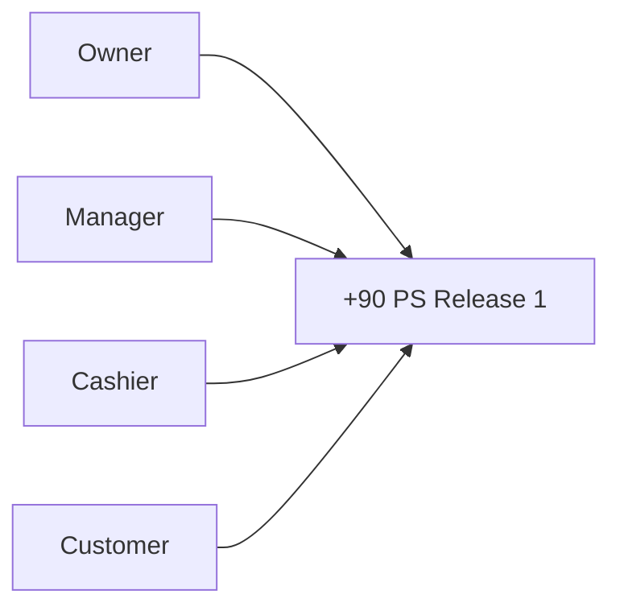
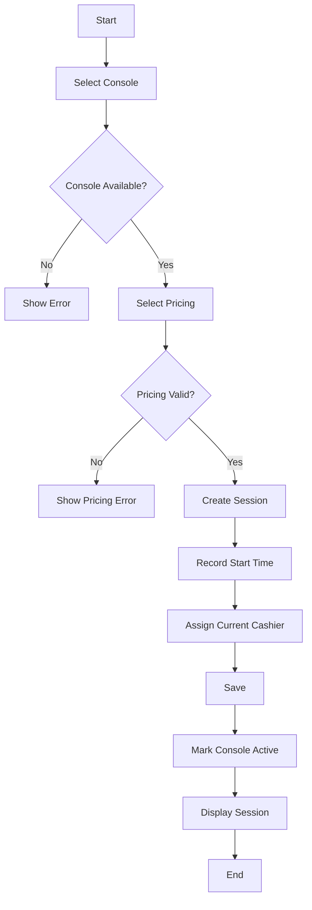
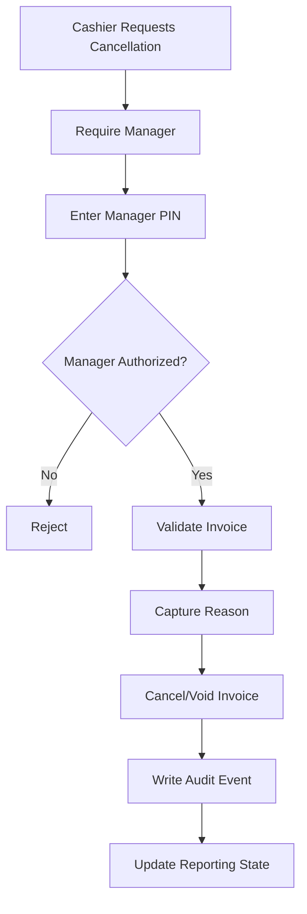
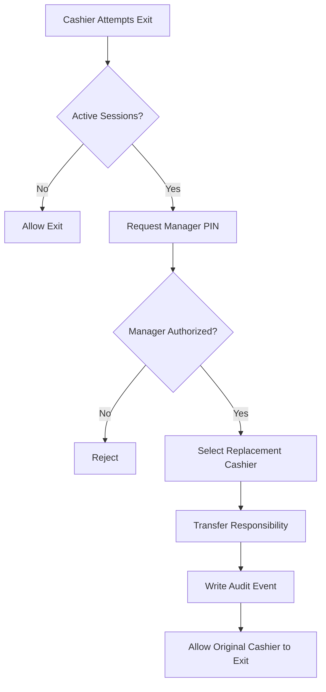
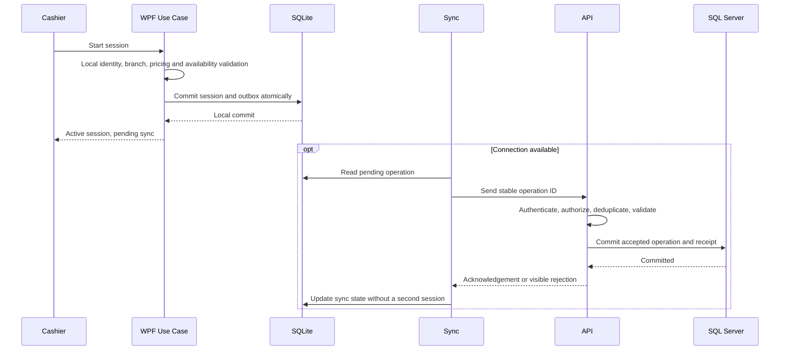
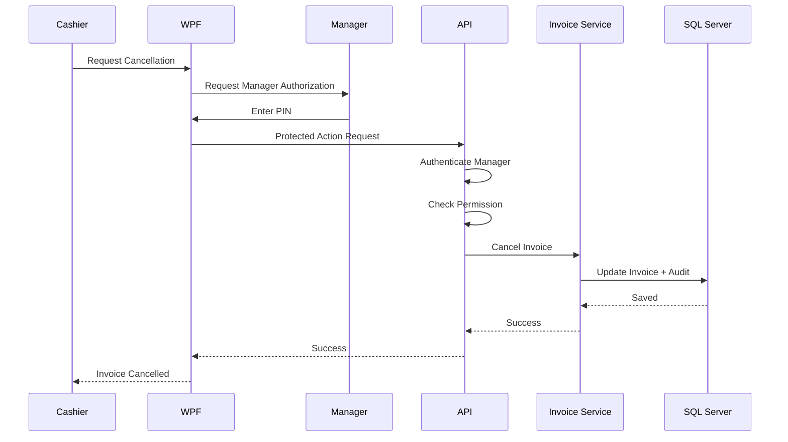
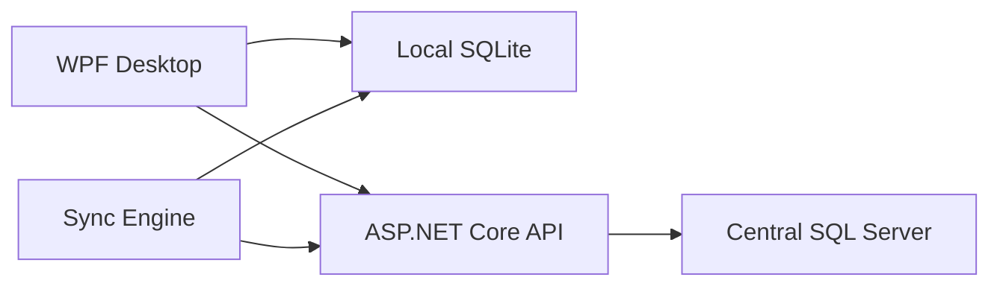
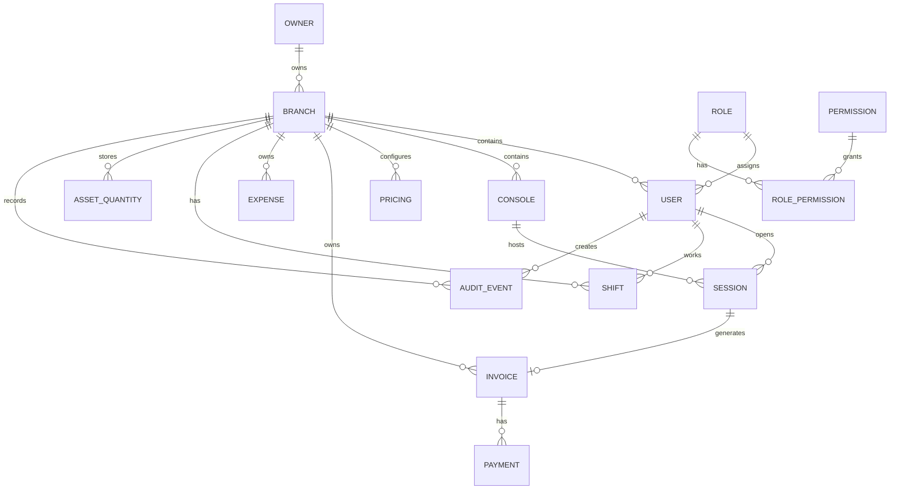

# تحديث الخطة — 2026-09-06

نسخة مراجعة مستقلة؛ الأصول لم تُعدّل. [ابدأ هنا](README(1).md) · [القواعد المشتركة](BUSINESS_RULES(1).md) · [القرارات المفتوحة](DECISIONS.md) · [التغييرات](CHANGELOG.md).

حالة الدليل: المتطلبات الجديدة المؤكدة من المستخدم مذكورة بمصدرها في SHARED_RULES. بقية المحتوى الموروث يحتفظ بحالته السابقة، وليس اعتمادًا جديدًا. مخططات البنية العامة تمثل اتصال المكونات؛ ترتيب كتابة عمليات الفرع تحدده ADR-01 والمخططات المحدّثة، ولا يُستنتج من سهم عام WPF/API.

---

# +90 PS — Release 1 Master Project File

> **Project:** +90 PS  
> **Release:** Release 1 — Operational MVP  
> **Document Type:** Master Product / Business / Technical / Delivery Specification  
> **Planning Date:** 2026-09-04  
> **Development Model:** Solo Developer  
> **Primary Goal:** Build the first real, usable version of +90 PS that can run the core operation of a PlayStation shop safely, reliably, and offline when necessary.

---

# 0. How to Use This File

هذا مرجع نطاق Release 1 التشغيلي فقط. جميع المميزات والاستبعادات الأصلية في القسمين 3 و4 محفوظة. [مصفوفة القبول](R1_ACCEPTANCE.md) تربطها بالمعالم والاختبارات، و[خريطة التنفيذ](ROADMAP.md) تحدد ترتيبها.

القواعد المشتركة في [SHARED_RULES](BUSINESS_RULES(1).md)، والأسئلة المفتوحة في [DECISIONS](DECISIONS.md). النماذج والـendpoints الموضحة في الأقسام الأصلية مقترحات تصميم، وليست API منفذة أو عقدًا نهائيًا.

---

# 1. Release 1 Mission

Release 1 is the first customer-deliverable, operational version of +90 PS.

The goal is not to build every possible capability.

The goal is:

> **A real PlayStation shop must be able to use the system for its core daily operation without depending on later advanced functionality.**

The core business loop is:

```text
Open Shop
    ↓
Authenticate Employee
    ↓
View Console Availability
    ↓
Select Console
    ↓
Select Pricing
    ↓
Start Session
    ↓
Play
    ↓
Pause / Resume when needed
    ↓
Complete Session
    ↓
Calculate Charge
    ↓
Create Invoice
    ↓
Receive Cash
    ↓
Complete Transaction
    ↓
Report Revenue
```

The branch must also continue core operation if the Internet disappears:

```text
Internet Available
    ↓
Central API
    ↓
Central SQL Server

Internet Unavailable
    ↓
WPF
    ↓
Local SQLite
    ↓
Sync later
```

---

# 2. Release 1 Product Definition

+90 PS Release 1 is a **Desktop-first multi-branch-capable PlayStation shop management system**.

The technical product consists of:

```text
WPF Desktop Application
        +
ASP.NET Core Web API
        +
Central SQL Server
        +
Local SQLite
        +
Synchronization Engine
```

The WPF Desktop Application is the main user-facing operational application.

The ASP.NET Core API is the central application/backend boundary.

SQL Server stores centralized synchronized data.

SQLite provides local branch persistence for offline operation.

---

# 3. Release 1 Scope Summary

## 3.1 Included

```text
Authentication
PIN-based user access
Lock screen
User switching
Owner concept
Branch management foundation
User management
Roles
Permissions
Console management
Pricing management
PS4 / PS5
Single / Multi
Hourly pricing
Match pricing
Gaming sessions
Start
Pause
Resume
Complete
Session ownership
Manager session-transfer override
Invoices
Cash payments
Allowed predefined discounts
Manager-authorized manual discounts
Basic shifts
Manager-only expenses
Revenue
Profit
Asset / Equipment management
Quantity-based inventory
Basic reporting
Offline operation
Local SQLite
Synchronization
Manager overrides
Audit logging for sensitive actions
Backend branch isolation
Security controls
QA
UAT
Pilot deployment
Production deployment foundation
```

---

# 4. Explicitly Out of Scope for Release 1

The following are not part of Release 1:

```text
Website
Mobile Application
Customer Website
Food Sales
Drinks Sales
Cafeteria
General Product Sales
Printer Integration
Barcode Scanner
POS Hardware
Membership System
```

Also intentionally excluded from the operational first release:

```text
Full customer-account workflow
Full customer history workflow
Advanced booking workflow
Full cash reconciliation
Advanced accounting integration
```

These exclusions are deliberate Release 1 scope controls.

Do not expand Release 1 simply because an additional feature sounds useful.

---

# 5. Business Context

Current state:

```text
Branches today: 0
```

Expected future scale:

```text
40+ branches
```

The architecture must therefore be designed as a multi-branch product even though the first real deployment may be only one pilot branch.

A business/owner may have:

```text
Owner / Business
    |
    +-- Branch A
    +-- Branch B
    +-- Branch C
```

Each branch may have:

- Different prices
- Different consoles
- Different employees
- Different sessions
- Different invoices
- Different expenses
- Different reports
- Different equipment quantities
- Different operational settings

---

# 6. Product Principles

## 6.1 Think "Product", Not "WPF Project"

The WPF app is only one client.

The actual product is:

```text
Business Rules
+
Domain Model
+
API
+
Security
+
Database
+
Offline/Sync
+
Desktop UI
+
Testing
+
Deployment
+
Operations
```

---

## 6.2 The API Exists Even Without a Website

The API is required because it provides:

- Central business logic
- Authorization
- Branch isolation
- Centralized data access
- Synchronization
- Reporting
- Future client compatibility
- Better monitoring
- Better security boundaries

---

## 6.3 Security Is Not a Final Phase

Security appears in:

```text
Requirements
    ↓
Architecture
    ↓
Threat Modeling
    ↓
Implementation
    ↓
Testing
    ↓
Deployment
    ↓
Monitoring
```

---

## 6.4 Offline Is a Core Requirement

Offline support is not optional.

Core shop operation must survive Internet failure.

---

## 6.5 Documentation Must Follow the Product

Documentation is not created just to create files.

Each document should answer a real project question and be updated when the corresponding requirement changes.

---

# 7. Release 1 Business Goals

Release 1 aims to:

```text
Reduce manual session tracking
Reduce billing errors
Automate session charge calculation
Make console availability visible
Track who opened each session
Centralize branch data
Provide financial visibility
Protect sensitive operations
Allow the shop to work offline
Synchronize branch data
Support multiple cashiers on one PC
Provide a foundation for 40+ branches
```

---

# 8. Stakeholders

Primary stakeholders:

```text
Owner
Manager
Cashier
Customer
```

Secondary stakeholders may include:

```text
System operator
Support/maintenance person
Future accounting stakeholder
```

Only required Release 1 workflows should be implemented.

---

# 9. Roles

Release 1 uses three conceptual actors:

```text
Owner
Manager
Cashier
```

The main operational permission model is centered around:

```text
Manager
Cashier
```

The Owner represents ownership/business scope.

---

# 10. Owner

An Owner may own one branch or multiple branches.

The system must support the concept:

```text
Owner
   |
   +-- Branch 01
   +-- Branch 02
   +-- ...
```

Owner access must be restricted to owned/authorized business data.

Release 1 should keep Owner functionality focused on the business information actually required for the first release rather than creating unnecessary complexity.

---

# 11. Manager

Manager is associated with a branch.

Manager responsibilities include:

```text
Manage consoles
Change pricing
Manage users according to permission
Create expenses
View branch reports
Authorize protected actions
Cancel/void invoices
Authorize manual discounts
Approve session transfer
Manage branch settings
```

Manager cannot automatically see unrelated branches.

---

# 12. Cashier

Cashier performs daily operation:

```text
Authenticate
Lock / unlock
Start session
Pause
Resume
Complete session
Create invoice
Receive cash
Apply permitted predefined discounts
Work with operational shift
Perform other explicitly authorized actions
```

Cashier cannot perform manager-only operations.

---

# 13. Shared PC Model

Each branch uses:

```text
One physical computer
```

Multiple cashiers use that same device over time.

Therefore the system needs an application-level active-user model.

Example:

```text
Cashier A
    ↓
Working
    ↓
Lock screen
    ↓
Cashier B enters PIN
    ↓
Cashier B becomes active user
```

The physical Windows account is not the business identity.

The application user is.

---

# 14. Active User

At any moment, the application should know:

```text
Current User
Current Role
Current Branch
Permissions
```

This information affects:

```text
Session ownership
Shift responsibility
Authorization
Audit
Sensitive operations
```

---

# 15. Authentication

Each employee has a personal PIN.

The PIN must allow local/offline authentication.

Conceptual flow:

```text
Enter PIN
    ↓
Protected local verification
    ↓
Identify user
    ↓
Load branch
    ↓
Load role
    ↓
Load permissions
    ↓
Create active user context
```

PINs must never be stored as plaintext.

The final credential protection approach must be documented in the Security Design.

---

# 16. Lock Screen

The application needs an internal lock screen.

Flow:

```text
Active User
    ↓
Lock
    ↓
Application Locked
    ↓
Enter PIN
    ↓
Re-authenticate
    ↓
Resume
```

Locking must not lose:

- Active session state
- Local data
- Pending synchronization
- Unsaved recoverable operational state

---

# 17. Authorization

Authentication answers:

> Who are you?

Authorization answers:

> What can you do?

Release 1 authorization combines:

```text
User
+
Role
+
Permission
+
Branch Scope
```

Example:

```text
Cashier
    Start Session        ✅
    Pause Session        ✅
    Resume Session       ✅
    Complete Session     ✅
    Receive Cash         ✅
    Change Price         ❌
    Create Expense       ❌
    Cancel Invoice       ❌ without manager authorization
```

```text
Manager
    Start Session        ✅
    Change Price         ✅
    Create Expense       ✅
    Cancel/void Invoice  ✅
    Authorize Discount   ✅
    Approve Transfer     ✅
```

---

# 18. Backend Authorization Rule

Hiding a button is not security.

Example:

```text
WPF
   ↓
"Delete Invoice" button hidden
```

is not sufficient.

The API must also reject unauthorized callers:

```text
Unauthorized request
        ↓
API
        ↓
403 Forbidden
```

---

# 19. Branch Isolation

Every branch has a unique identity.

Sensitive data must be filtered by authorized branch context.

A Cashier from Branch A cannot access Branch B.

A Manager from Branch A cannot access Branch B unless explicitly authorized.

The Owner can access only owned/authorized branches.

---

# 20. Console Management

Console count depends on the shop.

There is no fixed number.

Examples:

```text
PS4-01
PS4-02
PS5-01
PS5-02
```

Manager can:

```text
Add Console
Edit Console
Activate / Deactivate Console
Set Console Type
Set operational status
```

Conceptual states:

```text
Available
Active
Maintenance
Disabled
```

The final state model is part of detailed system analysis.

---

# 21. Pricing Model

Pricing depends on three dimensions:

```text
Console Type
+
Mode
+
Pricing Method
```

Minimum console types:

```text
PS4
PS5
```

Modes:

```text
Single
Multi
```

Pricing methods:

```text
Hourly
Match
```

---

# 22. Pricing Matrix

The system must support independent prices for combinations such as:

```text
PS4 + Single + Hourly
PS4 + Multi  + Hourly

PS5 + Single + Hourly
PS5 + Multi  + Hourly

PS4 + Single + Match
PS4 + Multi  + Match

PS5 + Single + Match
PS5 + Multi  + Match
```

A branch does not need to enable all combinations.

---

# 23. Branch-Specific Prices

Each branch can have different prices.

Example:

```text
Branch A

PS4 Single Hourly = 100
PS4 Multi  Hourly = 150
PS5 Single Hourly = 150
PS5 Multi  Hourly = 200
```

Another branch can have different values.

Manager is the authorized role for changing pricing.

---

# 24. Price Change Audit

A pricing change should record:

```text
Who changed it
Branch
Old price
New price
What pricing entry was changed
Timestamp
```

This is a sensitive business action.

---

# 25. Pricing Snapshot Recommendation

Recommended rule:

> A session captures the pricing context applicable when it begins.

Example:

```text
Session starts:
150 EGP/hour

Manager changes current branch rate:
170 EGP/hour
```

The active session should normally continue using the captured session pricing.

This protects billing consistency.

This rule must be explicitly approved before final billing implementation.

---

# 26. Hourly Pricing

المرجع الوحيد للحساب هو [BR-TIME-001 وBR-TIME-002](BUSINESS_RULES(1).md).

Open: يبدأ بلا نهاية محددة، وينتهي بطلب العميل. للوقت بالساعات نحسب المدة الفعلية أولًا، ثم نقرب **للأعلى فقط** إذا كان المتبقي إلى ربع الساعة التالي ثلاث دقائق أو أقل؛ خلاف ذلك نستخدم المدة الفعلية. المدة الموجودة بالفعل على علامة ربع ساعة تبقى كما هي.

أمثلة بصيغة ساعات:دقائق: `2:27 → 2:30`، `2:20 → 2:20`، `2:42 → 2:45`، `2:57 → 3:00`. لا تقريب لأسفل ولا إهمال تلقائي للساعة غير المكتملة.

التعامل مع الثواني، والتوقف المؤقت، والحد الأدنى، وتقريب مبلغ العملة ما زال مفتوحًا في [سجل القرارات](DECISIONS.md). تلك الأسئلة تمنع إقفال الحساب الإنتاجي فقط، وليس العمل المستقل.

---

# 27. Match Pricing

Match تسعير مستقل عن Hourly. المستندات السابقة تقترح سعرًا ثابتًا ومدة يضبطها الفرع. وصف المستخدم يثبت أن الموظف قد يستخدم مؤقتًا تقريبيًا مثل 10 دقائق أو ينهي العملاء المباراة بأنفسهم؛ لا يثبت أن انتهاء المؤقت يجب أن ينهي الجلسة آليًا.

نحتفظ بقدرة التسعير بالماتش في Release 1. تحديد النهاية، وعدّ الماتشات المتتالية، والتمديد، والفاتورة المجمعة ينتظر O-04 في [سجل القرارات](DECISIONS.md). أرقام 10 و12 أمثلة إعدادات وليست مدة إلزامية أو تعريفًا نهائيًا للمباراة.

---

# 28. Match Business Rule

Match تسعير مستقل عن Hourly. المستندات السابقة تقترح سعرًا ثابتًا ومدة يضبطها الفرع. وصف المستخدم يثبت أن الموظف قد يستخدم مؤقتًا تقريبيًا مثل 10 دقائق أو ينهي العملاء المباراة بأنفسهم؛ لا يثبت أن انتهاء المؤقت يجب أن ينهي الجلسة آليًا.

نحتفظ بقدرة التسعير بالماتش في Release 1. تحديد النهاية، وعدّ الماتشات المتتالية، والتمديد، والفاتورة المجمعة ينتظر O-04 في [سجل القرارات](DECISIONS.md). أرقام 10 و12 أمثلة إعدادات وليست مدة إلزامية أو تعريفًا نهائيًا للمباراة.

---

# 29. Session Management

The session is one of the most important domain entities.

Core state model:

```text
Available
    ↓
Active
    ↓
Paused
    ↓
Active
    ↓
Completed
```

Potential cancellation is controlled and permission-based.

---

# 30. Session Ownership

When Cashier A starts a session:

```text
Session.OpenedBy = Cashier A
```

The system must preserve that fact.

The current responsible cashier may be changed only through an authorized workflow.

---

# 31. Session Transfer

When Cashier A wants to leave while active sessions remain:

```text
Cashier A
    ↓
Attempts to leave
    ↓
System detects active sessions
    ↓
Manager PIN
    ↓
Validate Manager
    ↓
Select Cashier B
    ↓
Transfer responsibility
    ↓
Audit event
    ↓
Cashier A exits
```

The transfer must preserve:

```text
Original cashier
New cashier
Approving manager
Session
Timestamp
Reason when required
```

---

# 32. Manager Override

General protected-operation flow:

```text
Cashier requests protected action
        ↓
Manager PIN
        ↓
Authenticate Manager
        ↓
Check Permission
        ↓
Perform Action
        ↓
Create Audit Event
```

Used for:

```text
Invoice cancellation
Manual discount
Session transfer
Other sensitive actions approved for Release 1
```

---

# 33. Invoice Policy

Invoice is a financial record.

Cashier cannot freely delete it.

Recommended approach:

```text
Issued / Paid Invoice
        ↓
Manager Authorization
        ↓
Cancelled / Voided
```

Do not physically destroy the financial record.

---

# 34. Why Void/Cancel Instead of Delete

Keeping the record provides:

```text
Traceability
Financial history
Fraud investigation
Reporting consistency
Accountability
```

Example:

```text
Invoice #1054
Amount: 300 EGP
Status: Cancelled

Cancelled By: Manager
Time: ...
Reason: ...
```

---

# 35. Invoice Test Rules

At minimum:

```text
Invoice generated correctly
Correct amount
Correct cashier
Correct branch
Correct session
Cash payment recorded
Allowed discount applied correctly
Manual discount requires manager
Cancellation requires manager
Cancelled invoice remains in history
Cancelled invoice excluded from active revenue
```

---

# 36. Cash Payment

Release 1 payment method:

```text
Cash
```

Flow:

```text
Invoice
    ↓
Customer gives cash
    ↓
Cashier records payment
    ↓
Payment completed
    ↓
Invoice paid
```

No payment gateway is required.

---

# 37. Discounts

Release 1 uses two levels.

## Predefined / Allowed Discount

```text
Manager configures
       ↓
Cashier can apply
```

## Manual Discount

```text
Cashier requests
       ↓
Manager PIN
       ↓
Permission check
       ↓
Apply
       ↓
Audit
```

The exact mathematical rules for fixed vs percentage discounts remain part of detailed requirements.

---

# 38. Shifts

Release 1 contains the basic shift concept.

Shift is associated with:

```text
Branch
Cashier
Start Time
End Time
```

Shift is also relevant to shared-PC user accountability.

---

# 39. Full Cash Reconciliation

Full cash reconciliation is **not required in Release 1**.

The advanced model would be:

```text
Opening Cash
+
Cash Revenue
-
Cash Expenses
=
Expected Closing Cash
```

Then compare against:

```text
Actual Closing Cash
```

This is outside Release 1.

---

# 40. Expenses

Expenses are manager-only.

Cashier:

```text
Create Expense = NO
```

Manager:

```text
Create Expense = YES
```

A Release 1 expense should at minimum include:

```text
Branch
Amount
Category
Description
Created By
Timestamp
```

---

# 41. Revenue

Release 1 revenue comes from the core gaming operation:

```text
Gaming Sessions
```

No food, drink, or general product sales exist in this release.

---

# 42. Profit

Operational profit:

```text
Revenue
-
Expenses
=
Profit
```

This is an operational reporting model, not a complete accounting system.

---

# 43. Asset / Inventory Meaning

Inventory in Release 1 is:

> **Internal asset/equipment management.**

It is not product sales inventory.

Categories:

```text
Consoles
Controllers
Accessories
Equipment
Assets
```

---

# 44. Asset Quantity Model

Controllers/accessories/equipment use quantities where appropriate.

Example:

```text
Controllers = 12
```

rather than:

```text
Controller #001
Controller #002
Controller #003
...
```

Release 1 intentionally avoids unnecessary per-unit complexity.

---

# 45. Asset Quantities by Branch

Each branch has its own quantities.

Example:

```text
Branch A
Controllers = 12

Branch B
Controllers = 7
```

Asset ownership and quantity must be branch-aware.

---

# 46. Asset Transfer Boundary

Multi-branch quantity transfer is not a necessary first-release workflow unless required by the first real customer.

However, the data model should not make branch ownership impossible to extend.

---

# 47. Reports

Release 1 should include useful basic reporting.

Minimum targets:

```text
Daily Revenue
Daily Expenses
Daily Profit
Session Report
Invoice Report
```

Reports should respect user permissions and branch scope.

---

# 48. Reporting Data Requirements

The underlying data should make it possible to answer:

```text
How much revenue did the branch generate?
How much did the branch spend?
What is the operational profit?
How many sessions occurred?
How many invoices were generated?
Which sessions/invoices belong to which cashier?
```

---

# 49. Offline Requirement

The branch must continue its core operation when the Internet is unavailable.

Offline-required operations include:

```text
Local authentication
View required local branch data
Start session
Pause session
Resume session
Complete session
Calculate charge
Create invoice
Record cash payment
Use approved local permissions
```

The exact boundary for highly sensitive actions must be explicitly approved during security design.

---

# 50. Local SQLite

Each branch device uses a local SQLite database.

Purpose:

```text
Offline persistence
Local operational state
Pending synchronization
Local data access
```

The local database must contain enough protected information to keep the branch running.

---

# 51. Central API

Central backend:

```text
ASP.NET Core Web API
```

Responsibilities:

```text
Authentication/identity support
Authorization
Branch isolation
Business rules
Central persistence
Reporting
Synchronization
Audit
Configuration
```

---

# 52. Central SQL Server

Central data store:

```text
SQL Server
```

The WPF client must not directly connect to the central database in the final architecture.

Preferred:

```text
WPF
    ↓
ASP.NET Core API
    ↓
SQL Server
```

---

# 53. Online Architecture

```text
WPF → Local authorization + shared business rules
    → SQLite transaction: operational record + pending sync operation
    → Local success shown to cashier
    → Sync when online → API authentication/branch validation/idempotency
    → SQL Server transaction → acknowledgement → local sync status
```

قرار هندسي معتمد لهذه الخطة: عمليات الفرع الأساسية تكتب محليًا أولًا في الحالتين Online وOffline؛ الاتصال يغيّر توقيت المزامنة ولا يبدّل مكان إنشاء الفاتورة. التقرير المركزي والتهيئة المركزية لهما API، ولا يعني ذلك إعادة إرسال إنشاء الجلسة كعملية جديدة.
التفاصيل والحدود في [القرارات المشتركة](BUSINESS_RULES(1).md). المزامنة الناجحة تختلف عن نجاح الحفظ المحلي، وتظهر الحالتان للمستخدم.

---

# 54. Offline Architecture

```text
WPF → Local authorization + shared business rules
    → SQLite transaction: operational record + pending sync operation
    → Local success shown to cashier
    → Sync when online → API authentication/branch validation/idempotency
    → SQL Server transaction → acknowledgement → local sync status
```

قرار هندسي معتمد لهذه الخطة: عمليات الفرع الأساسية تكتب محليًا أولًا في الحالتين Online وOffline؛ الاتصال يغيّر توقيت المزامنة ولا يبدّل مكان إنشاء الفاتورة. التقرير المركزي والتهيئة المركزية لهما API، ولا يعني ذلك إعادة إرسال إنشاء الجلسة كعملية جديدة.
التفاصيل والحدود في [القرارات المشتركة](BUSINESS_RULES(1).md). المزامنة الناجحة تختلف عن نجاح الحفظ المحلي، وتظهر الحالتان للمستخدم.

---

# 55. Synchronization Architecture

When Internet returns:

```text
Pending Local Changes
        ↓
Sync Engine
        ↓
Operation ID
        ↓
ASP.NET Core API
        ↓
Authenticate
        ↓
Validate
        ↓
Idempotency Check
        ↓
Persist Central Data
        ↓
Acknowledgment
        ↓
Mark Local Item Synced
```

---

# 56. Sync Queue

Conceptual structure:

```text
SyncItem
----------------------------
Id
OperationId
EntityType
EntityId
OperationType
Payload
CreatedAt
AttemptCount
LastAttemptAt
Status
Error
```

Candidate statuses:

```text
Pending
Processing
Synced
Failed
Conflict
```

---

# 57. Synchronization Requirements

Sync must handle:

```text
Retries
Temporary outages
Duplicate requests
Partial failures
Ordering
Conflict detection
Error reporting
Recovery
Idempotency
```

---

# 58. Idempotency

Example:

```text
Branch sends transaction
        ↓
Server saves it
        ↓
Network fails before acknowledgment
        ↓
Branch retries
```

Without idempotency, a duplicate transaction can be created.

Therefore each sync operation needs a stable operation/event identifier or equivalent deduplication mechanism.

---

# 59. Conflict Handling

Offline changes can conflict with central data.

Do not silently overwrite data.

The design should explicitly identify data as:

```text
Branch-owned
Central-authoritative
Append-only
Mergeable
```

Financial events should prioritize traceability.

---

# 60. Local Authentication and Sync

User identity required for offline operation must be safely synchronized to the branch.

Conceptually:

```text
Central Authorized User
        ↓
Secure Sync
        ↓
Local Protected Credential Data
        ↓
Offline Authentication
```

Do not copy plaintext credentials to SQLite.

---

# 61. WPF Architecture

Recommended logical layers:

```text
WPF
|
+-- Presentation
|   +-- Views
|   +-- ViewModels
|   +-- Navigation
|
+-- Application
|   +-- Session Use Cases
|   +-- Invoice Use Cases
|   +-- Pricing Use Cases
|   +-- User Use Cases
|
+-- Domain / Contracts
|
+-- Infrastructure
    +-- SQLite
    +-- API Client
    +-- Sync Engine
    +-- Local Security
    +-- Logging
```

MVVM is recommended.

---

# 62. Backend Architecture

Recommended logical structure:

```text
ASP.NET Core API
|
+-- API
|
+-- Application
|   +-- Commands
|   +-- Queries
|   +-- Services
|   +-- Validators
|
+-- Domain
|   +-- Entities
|   +-- Business Rules
|
+-- Infrastructure
    +-- EF Core
    +-- SQL Server
    +-- Authentication
    +-- Logging
```

A modular monolith is appropriate for a solo-developer Release 1.

---

# 63. Core Architecture Principles

```text
No direct WPF → Central SQL
Central API boundary
Backend authorization
Offline resilience
Explicit domain states
Traceable financial records
Testable business logic
Manageable deployment
Simple infrastructure
No unnecessary microservices
```

---

# 64. Security Strategy

Security controls belong throughout Release 1:

```text
Requirements
   ↓
Architecture
   ↓
Threat Modeling
   ↓
Secure Implementation
   ↓
Security Testing
   ↓
Deployment
   ↓
Monitoring
```

---

# 65. Security Requirements

Release 1 requires:

```text
Authentication
Authorization
Branch isolation
PIN protection
Secure network communication
Input validation
Protected manager actions
Audit logging for sensitive actions
Secret protection
Secure configuration
Controlled error responses
Safe database access
```

---

# 66. Threat Model

Primary trust boundary:

```text
Branch PC
    |
    | Network
    v
Central API
    |
    v
SQL Server
```

Possible threats:

```text
Unauthorized access
Privilege escalation
Forged requests
PIN compromise
Local data tampering
Duplicate sync
Invoice manipulation
Price manipulation
Sensitive data disclosure
Audit manipulation
```

---

# 67. STRIDE

Use STRIDE as a structured threat-modeling method:

```text
Spoofing
Tampering
Repudiation
Information Disclosure
Denial of Service
Elevation of Privilege
```

Apply it where useful rather than mechanically to every component.

---

# 68. Audit Logging

Audit is not "record every click".

Audit sensitive actions.

Recommended Release 1 audit events:

```text
Price change
Invoice cancellation
Manual discount authorization
Manager override
Session transfer
User creation
User activation/deactivation
Permission changes
Important security events
Sensitive expense changes
```

---

# 69. Audit Event Structure

Conceptual:

```text
AuditEvent
----------------------------
Id
BranchId
ActorUserId
Action
EntityType
EntityId
OldValue
NewValue
Reason
Timestamp
CorrelationId
```

Do not store secrets or unnecessary sensitive information.

---

# 70. Application Logs vs Audit Logs

## Application Logs

For technical troubleshooting:

```text
Exception
Warning
API failure
Database failure
Sync failure
Unexpected state
```

## Audit Logs

For business accountability:

```text
Who
What
Which object
When
Why, where applicable
```

They have different purposes.

---

# 71. Data Integrity

Important values must be validated on the server.

Examples:

```text
Branch ID
Pricing ID
Session state
Session ownership
Invoice total
Discount permission
Cancellation permission
Sync operation ID
```

Do not trust values simply because they came from WPF.

---

# 72. Error Handling

Normal users should receive useful errors.

Bad:

```text
SQL exception...
500...
Stack trace...
```

Better:

```text
The server is currently unavailable.
The branch can continue operating offline.
```

Technical details belong in logs.

---

# 73. System Context Diagram



---

# 74. Use Case Diagram — Release 1

```text
Cashier
 |
 +-- Authenticate
 +-- Unlock Application
 +-- Start Session
 +-- Pause Session
 +-- Resume Session
 +-- Complete Session
 +-- Create Invoice
 +-- Receive Cash
 +-- Apply Allowed Discount
 +-- View Permitted Operational Data
 +-- Start / End Shift

Manager
 |
 +-- Authenticate
 +-- Manage Users
 +-- Manage Consoles
 +-- Manage Pricing
 +-- Create Expenses
 +-- View Branch Reports
 +-- Cancel/Void Invoice
 +-- Authorize Manual Discount
 +-- Approve Session Transfer
 +-- Manage Branch Settings

Owner
 |
 +-- Access Authorized Business / Branch Information
```

---

# 75. Activity Diagram — Start Session



---

# 76. Activity Diagram — Invoice Cancellation



---

# 77. Activity Diagram — Session Handover



---

# 78. Sequence Diagram — Start Session



See [ADR-01](BUSINESS_RULES(1).md). A central rejection does not erase a locally recorded payment.

---

# 79. Sequence Diagram — Offline Session

```text
Cashier
    ↓
WPF
    ↓
Local Use Case
    ↓
Local Validation
    ↓
SQLite Transaction
    ↓
Session Saved
    ↓
Sync Item Created
    ↓
UI Updated
```

---

# 80. Sequence Diagram — Invoice Cancellation



---

# 81. Sequence Diagram — Synchronization

```text
Local Pending Operation
        ↓
Sync Engine
        ↓
Send Operation
        ↓
API
        ↓
Authenticate
        ↓
Validate
        ↓
Check Operation ID
        ↓
Persist
        ↓
Acknowledge
        ↓
Local Status = Synced
```

---

# 82. State Diagram — Session

```text
Available
    |
    v
Active
    |
    v
Paused
    |
    v
Active
    |
    v
Completed
```

Potential controlled transition:

```text
Active → Cancelled
```

---

# 83. State Diagram — Invoice

```text
Draft
  |
  v
Issued
  |
  v
Paid
```

Protected cancellation:

```text
Issued / Paid
      |
      v
Manager Authorization
      |
      v
Cancelled
```

---

# 84. State Diagram — User Application Session

```text
Unauthenticated
      |
      v
Authenticated
      |
      v
Active User
      |
      v
Locked
      |
      v
PIN
      |
      v
Active User
```

---

# 85. C4 Context Diagram

```text
                     +----------------+
                     |     Owner      |
                     +-------+--------+
                             |
                             v
                     +-------+--------+
                     | +90 PS Release |
                     |       1        |
                     +-------+--------+
                             ^
                             |
                  +----------+----------+
                  |                     |
              Manager                Cashier
```

---

# 86. C4 Container Diagram



---

# 87. C4 Component Diagram

```text
ASP.NET Core API
|
+-- Authentication
+-- Authorization
+-- User Management
+-- Branch Management
+-- Console Management
+-- Pricing
+-- Session Management
+-- Invoice Management
+-- Payment Management
+-- Discount Management
+-- Shift Management
+-- Expense Management
+-- Asset Management
+-- Reporting
+-- Audit
+-- Synchronization
```

---

# 88. Deployment Diagram

```text
                         Internet
                            |
                     +------+------+
                     | Central API |
                     +------+------+
                            |
                     +------+------+
                     | SQL Server  |
                     +-------------+

Branch
  |
  +-- Windows PC
      |
      +-- WPF Desktop
      +-- SQLite
      +-- Sync Engine
```

Release 1 can initially be deployed to one pilot branch while keeping this architecture.

---

# 89. Data Flow Diagram

```text
User
 ↓
WPF
 ├──────────────→ API → SQL Server
 │
 └──────────────→ SQLite
                       ↓
                    Sync Queue
                       ↓
                      API
                       ↓
                   SQL Server
```

---

# 90. ERD — High Level



This is conceptual and must be refined before database implementation.

---

# 91. Core Domain Entities

Likely Release 1 entities:

```text
Owner
Branch
User
Role
Permission
RolePermission
Console
Pricing
Session
Invoice
Payment
Discount
Shift
Expense
AssetCategory
AssetQuantity
AuditEvent
SyncItem
BranchSetting
```

The final physical schema comes after final requirements and design review.

---

# 92. Suggested Branch Entity

```text
Branch
---------------------------
Id
OwnerId
Name
Address
Phone
IsActive
CreatedAt
UpdatedAt
```

---

# 93. Suggested User Entity

```text
User
---------------------------
Id
BranchId
Name
RoleId
ProtectedCredentialData
IsActive
CreatedAt
UpdatedAt
```

Credential fields must follow the approved security design.

---

# 94. Suggested Console Entity

```text
Console
---------------------------
Id
BranchId
Name
ConsoleType
Status
IsActive
CreatedAt
UpdatedAt
```

---

# 95. Suggested Pricing Entity

```text
Pricing
---------------------------
Id
BranchId
ConsoleType
Mode
PricingMethod
Price
MatchDuration
IsActive
EffectiveFrom
EffectiveTo
```

---

# 96. Suggested Session Entity

```text
Session
---------------------------
Id
BranchId
ConsoleId
PricingId
OpenedByUserId
CurrentResponsibleUserId
StartTime
EndTime
Status
CalculatedPrice
CreatedAt
UpdatedAt
```

A single pause timestamp is not enough if multiple pauses are allowed. The final design should use a history/timing model when required.

---

# 97. Suggested Invoice Entity

```text
Invoice
---------------------------
Id
BranchId
SessionId
CashierUserId
Subtotal
DiscountAmount
Total
Status
IssuedAt
PaidAt
CancelledAt
CancelledByUserId
CancellationReason
```

---

# 98. Suggested Payment Entity

```text
Payment
---------------------------
Id
InvoiceId
Method
Amount
ReceivedAt
ReceivedByUserId
```

Release 1 payment method:

```text
Cash
```

---

# 99. Suggested Expense Entity

```text
Expense
---------------------------
Id
BranchId
CreatedByUserId
Amount
Category
Description
CreatedAt
```

---

# 100. Suggested Asset Quantity Entity

```text
AssetQuantity
---------------------------
Id
BranchId
Category
Name
Quantity
Unit
Notes
UpdatedAt
```

---

# 101. Suggested Audit Event Entity

```text
AuditEvent
---------------------------
Id
BranchId
ActorUserId
Action
EntityType
EntityId
OldValue
NewValue
Reason
Timestamp
CorrelationId
```

---

# 102. Suggested Sync Item Entity

```text
SyncItem
---------------------------
Id
OperationId
EntityType
EntityId
OperationType
Payload
CreatedAt
AttemptCount
LastAttemptAt
Status
Error
```

---

# 103. Database Design Principles

Use:

```text
Primary Keys
Foreign Keys
Unique Constraints
Indexes
Correct Nullability
Transactions
Concurrency Controls
Branch Scoping
Audit Records
```

Avoid:

```text
Destructive financial deletes
Plaintext credentials
Client-only financial validation
Client-only branch isolation
Uncontrolled schema changes
```

---

# 104. Data Dictionary

A formal data dictionary must be created before database implementation is considered complete.

Example:

| Field | Type | Nullable | Description |
|---|---|---:|---|
| BranchId | GUID/UUID | No | Branch identity |
| SessionId | GUID/UUID | No | Session identity |
| StartTime | DateTime | No | Session start |
| EndTime | DateTime | Yes | Session completion |
| Status | Enum | No | Current session state |
| Price | Decimal | No | Session charge |
| UserId | GUID/UUID | No | Application user |

Final physical types depend on the chosen SQL Server schema.

---

# 105. API Scope

Release 1 API groups:

```text
/api/auth
/api/users
/api/roles
/api/permissions
/api/branches
/api/consoles
/api/pricing
/api/sessions
/api/invoices
/api/payments
/api/discounts
/api/shifts
/api/expenses
/api/assets
/api/reports
/api/audit
/api/sync
```

---

# 106. Candidate Release 1 Endpoints

```http
POST /api/auth/login

GET  /api/consoles
POST /api/consoles
PUT  /api/consoles/{id}

GET  /api/pricing
POST /api/pricing
PUT  /api/pricing/{id}

POST /api/sessions
GET  /api/sessions/active
POST /api/sessions/{id}/pause
POST /api/sessions/{id}/resume
POST /api/sessions/{id}/complete

POST /api/invoices
GET  /api/invoices/{id}
POST /api/invoices/{id}/cancel

POST /api/payments

GET /api/reports/revenue
GET /api/reports/expenses
GET /api/reports/profit
```

Actual endpoint names should be finalized during API design.

---

# 107. API Contract Requirements

Every endpoint should document:

```text
HTTP Method
URL
Authentication
Authorization
Request
Validation
Response
Status Codes
Error Model
Business Rules
Idempotency
```

Use OpenAPI/Swagger.

---

# 108. API Error Model

Conceptual:

```json
{
  "code": "SESSION_CONSOLE_NOT_AVAILABLE",
  "message": "The selected console is not available.",
  "traceId": "..."
}
```

Production must not expose stack traces or secrets.

---

# 109. WPF Screen Map

Candidate Release 1 screens:

```text
Login / PIN
Lock Screen
Dashboard
Console Overview
Start Session
Active Session
Pause / Resume
Complete Session
Invoice
Payment
Discount
Manager Authorization
User Management
Console Management
Pricing Management
Expense Management
Asset / Inventory
Shift
Reports
Settings
Offline / Sync Status
```

Screen availability is permission-based.

---

# 110. WPF Information Architecture

Candidate navigation:

```text
Dashboard

Operations
├── Sessions
├── Invoices
└── Shift

Management
├── Consoles
├── Pricing
├── Users
├── Expenses
└── Assets

Reports
├── Revenue
├── Expenses
├── Profit
└── Sessions

System
├── Settings
└── Audit
```

---

# 111. UI Design System

The Release 1 UI should define:

```text
Typography
Spacing
Buttons
Inputs
Tables
Cards
Dialogs
Navigation
Status Indicators
```

Also define operational states:

```text
Loading
Success
Empty
Error
Offline
Unauthorized
Forbidden
Saving
Saved
Syncing
Sync Failed
Pending Sync
```

---

# 112. UX Requirements

Before high-fidelity UI, analyze:

```text
Cashier speed
Number of clicks
Common errors
Shared-PC behavior
Manager workflow
Frequency of operations
Offline behavior
```

The cashier workflow should optimize for speed and clarity.

---

# 113. Release 1 Personas

## Cashier

Goals:

```text
Start sessions quickly
Avoid billing mistakes
Switch users quickly
Complete payment efficiently
```

## Manager

Goals:

```text
Manage branch
Manage pricing
Manage users
Manage expenses
Authorize protected actions
View reports
```

## Owner

Goals:

```text
Access authorized business information
View branch/business performance
```

---

# 114. User Journey

Core customer journey:

```text
Customer arrives
    ↓
Requests service
    ↓
Selects device/mode
    ↓
Starts/receives session
    ↓
Plays
    ↓
Finishes
    ↓
Invoice
    ↓
Cash payment
```

The customer is primarily represented through cashier-facing operations in Release 1.

---

# 115. Technical Flow — Session

```text
WPF → Local authorization + shared business rules
    → SQLite transaction: operational record + pending sync operation
    → Local success shown to cashier
    → Sync when online → API authentication/branch validation/idempotency
    → SQL Server transaction → acknowledgement → local sync status
```

قرار هندسي معتمد لهذه الخطة: عمليات الفرع الأساسية تكتب محليًا أولًا في الحالتين Online وOffline؛ الاتصال يغيّر توقيت المزامنة ولا يبدّل مكان إنشاء الفاتورة. التقرير المركزي والتهيئة المركزية لهما API، ولا يعني ذلك إعادة إرسال إنشاء الجلسة كعملية جديدة.
التفاصيل والحدود في [القرارات المشتركة](BUSINESS_RULES(1).md). المزامنة الناجحة تختلف عن نجاح الحفظ المحلي، وتظهر الحالتان للمستخدم.

---

# 116. Technical Flow — Invoice Cancellation

```text
Cashier requests cancellation
        ↓
WPF requires Manager
        ↓
Manager enters PIN
        ↓
Manager authenticated
        ↓
Permission checked
        ↓
Invoice validated
        ↓
Cancel/Void
        ↓
Audit Event
        ↓
Report state updated
```

---

# 117. Work Flow — Cashier

```text
Login
  ↓
Dashboard
  ↓
View Consoles
  ↓
Customer Requests Session
  ↓
Select Console
  ↓
Select PS4/PS5
  ↓
Select Single/Multi
  ↓
Select Pricing
  ↓
Start
  ↓
Active Session
  ↓
Pause/Resume if needed
  ↓
Complete
  ↓
Calculate Charge
  ↓
Create Invoice
  ↓
Receive Cash
  ↓
Complete Transaction
```

---

# 118. Work Flow — Manager

```text
Manager Login
  ↓
Manager Dashboard
  ↓
Select Branch Context
  ↓
Manage Consoles
  ↓
Manage Pricing
  ↓
Manage Users
  ↓
Create Expenses
  ↓
View Reports
  ↓
Authorize Protected Actions
```

---

# 119. Work Flow — Shared User Switch

```text
Cashier A Working
        ↓
Lock Screen
        ↓
Cashier B Enters PIN
        ↓
Verify User
        ↓
Load Cashier B Permissions
        ↓
Cashier B Active
```

---

# 120. Work Flow — Session Transfer

```text
Cashier A wants to leave
        ↓
Check active sessions
        ↓
Active sessions?
      /     \
    No       Yes
    |         |
 Exit      Manager PIN
               ↓
        Validate Manager
               ↓
       Choose Cashier B
               ↓
       Transfer Ownership
               ↓
          Audit Event
               ↓
          Cashier A exits
```

---

# 121. Work Flow — Invoice Cancellation

```text
Cashier requests cancellation
        ↓
Direct cancellation blocked
        ↓
Manager PIN
        ↓
Manager authenticated
        ↓
Permission verified
        ↓
Reason captured
        ↓
Invoice cancelled/voided
        ↓
Audit event
        ↓
Revenue state recalculated
```

---

# 122. Project Repository Structure

Recommended:

```text
+90PS/
|
├── docs/
│   ├── 01-discovery/
│   ├── 02-business/
│   ├── 03-requirements/
│   ├── 04-product/
│   ├── 05-ux/
│   ├── 06-ui/
│   ├── 07-architecture/
│   ├── 08-database/
│   ├── 09-api/
│   ├── 10-security/
│   ├── 11-development/
│   ├── 12-testing/
│   ├── 13-deployment/
│   ├── 14-operations/
│   ├── 15-support/
│   └── 16-releases/
|
├── backend/
├── desktop/
├── tests/
├── infrastructure/
└── scripts/
```

---

# 123. Release 1 Documentation Set

Release 1 should maintain:

## Discovery

```text
problem-statement.md
stakeholders.md
as-is-process.md
to-be-process.md
```

## Business

```text
brd.md
business-goals.md
business-rules.md
scope.md
```

## Product

```text
prd-release-1.md
mvp-scope.md
user-stories.md
acceptance-criteria.md
backlog.md
```

## UX/UI

```text
personas.md
user-journeys.md
information-architecture.md
ux-flows.md
wireframes/
design-system.md
screens.md
```

## Architecture

```text
system-context.md
technical-flow.md
work-flow.md
c4-context.md
c4-container.md
c4-component.md
component-diagram.md
deployment-diagram.md
```

## Database

```text
erd.md
schema.md
data-dictionary.md
migration-strategy.md
```

## API

```text
openapi.yaml
api-guidelines.md
error-model.md
authentication.md
authorization.md
```

## Security

```text
security-requirements.md
threat-model.md
rbac.md
audit-logging.md
secure-development.md
security-test-plan.md
```

## Development

```text
coding-standards.md
git-workflow.md
code-review.md
branching-strategy.md
```

## Testing

```text
test-plan.md
test-cases.md
regression-plan.md
uat.md
performance-test-plan.md
```

## Deployment

```text
environments.md
deployment-plan.md
rollback.md
desktop-update.md
database-migrations.md
```

## Operations

```text
monitoring.md
logging.md
backup.md
disaster-recovery.md
runbooks/
```

---

# 124. Git Workflow

Suggested:

```text
main
develop
feature/*
bugfix/*
release/*
hotfix/*
```

Examples:

```text
feature/session-management
feature/pricing
feature/invoice
bugfix/session-calculation
hotfix/invoice-cancellation
```

---

# 125. Self-Review Workflow

Even as one developer:

```text
Feature Branch
    ↓
Implementation
    ↓
Tests
    ↓
Self Review / PR
    ↓
Merge
    ↓
Regression
```

PR notes:

```text
What changed?
Why?
How tested?
Risks?
Migration notes?
```

---

# 126. Project Management Model

Even as one developer, separate responsibilities mentally:

```text
Product Management
Business Analysis
UX/UI
Architecture
Backend
Desktop
Database
Security
QA
DevOps
Operations
Support
```

The outputs stay separated even though one person performs the work.

---

# 127. Definition of Ready

A Release 1 feature is ready for implementation when:

```text
Requirement understood
User identified
Acceptance criteria defined
UX flow understood
Security impact identified
Data impact understood
API impact understood
Offline impact understood
Dependencies identified
```

---

# 128. Definition of Done

A Release 1 feature is complete when:

```text
Requirement implemented
Validation implemented
Authorization implemented
Error handling implemented
Relevant tests pass
Offline behavior handled if applicable
Database migration complete
Documentation updated
Self-review complete
No known critical issue
```

---

# 129. Production Readiness

Before Release 1 production:

```text
Security reviewed
Critical tests passed
UAT passed
Migrations verified
Backup configured
Monitoring configured
Logging configured
Deployment tested
Rollback documented
Branch onboarding ready
User training ready
Support process ready
```

---

# 130. Testing Strategy

Release 1 testing types:

```text
Unit Testing
Integration Testing
API Testing
Database Testing
UI Testing
End-to-End Testing
Security Testing
Performance Testing
Regression Testing
UAT
```

Testing starts during development.

---

# 131. Test Pyramid

```text
          E2E
        /     \
   Integration
     /       \
 Unit Tests
```

Most business logic should be covered with fast unit/integration tests.

---

# 132. Session Test Cases

```text
TC-SESSION-001
Available console starts successfully.

TC-SESSION-002
Occupied console cannot be started.

TC-SESSION-003
Unauthorized user cannot perform restricted operation.

TC-SESSION-004
Invalid pricing is rejected.

TC-SESSION-005
Session can pause.

TC-SESSION-006
Session can resume.

TC-SESSION-007
Completed session cannot be reopened arbitrarily.

TC-SESSION-008
Correct pricing is applied.

TC-SESSION-009
Offline session can be created according to offline policy.

TC-SESSION-010
Successful sync does not create duplicate data.
```

---

# 133. Pricing Test Cases

At minimum:

```text
PS4 + Single + Hourly
PS4 + Multi + Hourly
PS5 + Single + Hourly
PS5 + Multi + Hourly

PS4 + Single + Match
PS4 + Multi + Match
PS5 + Single + Match
PS5 + Multi + Match
```

Also verify:

```text
Correct branch price
Correct mode
Correct pricing method
Correct match duration
Invalid combination rejection
Manager-only price changes
Existing session price stability
```

---

# 134. Invoice Test Cases

```text
Invoice generated from completed session
Correct amount
Correct cashier
Correct branch
Cash payment recorded
Allowed discount applied
Manual discount requires manager
Invoice cancellation requires manager
Cancelled invoice remains in history
Cancelled invoice excluded from active revenue
```

---

# 135. Authorization Test Cases

```text
Cashier cannot change pricing.
Cashier cannot create expense.
Cashier cannot cancel invoice directly.
Cashier cannot access another branch.
Manager cannot access unauthorized branch.
API rejects unauthorized requests.
Manager override requires valid authorized manager.
```

---

# 136. Offline Test Cases

```text
Internet disconnects before session start
Internet disconnects during session
Internet disconnects before completion
Application restarts while offline
Local session remains saved
Local invoice remains saved
Sync resumes after reconnect
Duplicate sync request is deduplicated
Sync failure retries
```

---

# 137. Security Test Cases

```text
Authentication bypass
Authorization bypass
Branch isolation failure
Broken access control
Input validation failure
Injection
Sensitive data exposure
Credential storage weakness
API endpoint protection
Manager override bypass
Audit integrity
Secret leakage
```

---

# 138. Edge Cases

Release 1 must consider:

```text
Double-click Start
Double-click Complete
Two operations target the same console
PC restart
Application crash
Internet drops during operation
Internet returns
Session crosses midnight
Price changes during active session
Invalid PIN
Repeated invalid PIN
Manager PIN failure
Manager PIN success
Cashier changes user
Cashier exits while session is active
Local DB unavailable
Central API unavailable
SQL Server unavailable
Sync partial failure
Sync retry
```

---

# 139. Concurrency

Important cases:

```text
Two cashier operations target one console.
Two sync operations submit the same operation.
Session state changes while another request is processed.
A console is selected simultaneously by multiple operations.
```

Use appropriate transactional/concurrency controls.

---

# 140. Performance Testing

Measure:

```text
Session screen responsiveness
Console list loading
Invoice creation
Report queries
SQLite speed
API latency
Sync backlog
Central SQL query performance
```

Do not optimize without measurements.

---

# 141. UAT — Cashier Scenario

Example:

```text
Open application
↓
Cashier logs in
↓
View available consoles
↓
Select PS4 or PS5
↓
Select Single/Multi
↓
Start session
↓
Pause
↓
Resume
↓
Complete
↓
Create invoice
↓
Receive cash
↓
Apply permitted discount
↓
Lock screen
↓
Second cashier enters PIN
↓
Second cashier becomes active
↓
Continue operation
```

---

# 142. UAT — Manager Scenario

```text
Manager logs in
↓
View branch
↓
Manage console
↓
Change pricing
↓
Create expense
↓
View revenue
↓
View expenses
↓
View profit
↓
Authorize manual discount
↓
Authorize invoice cancellation
↓
Approve session transfer
```

---

# 143. UAT — Offline Scenario

```text
Branch operating normally
↓
Internet disconnects
↓
Cashier remains able to authenticate
↓
Start session
↓
Pause/resume
↓
Complete session
↓
Create invoice
↓
Receive cash
↓
Internet returns
↓
Synchronization starts
↓
Central data verified
```

---

# 144. Deployment Environments

Use:

```text
Development
    ↓
Testing
    ↓
Staging
    ↓
Production
```

Do not use production as the primary experimentation environment.

---

# 145. Release 1 Deployment

Deployment package should contain:

```text
WPF Desktop Application
Local SQLite initialization
Branch configuration
Manager account setup
Cashier account setup
Database migrations
Sync configuration
Required configuration files
User documentation
```

---

# 146. Branch Onboarding Checklist

```text
Install WPF
Register Branch
Configure Branch
Create Manager
Create Cashiers
Configure Consoles
Configure Pricing
Initialize SQLite
Verify local authentication
Test Online
Test Offline
Test Session
Test Invoice
Test Cash
Test Sync
Train Users
Go Live
```

---

# 147. Pilot Strategy

Do not deploy the first version widely immediately.

Release 1 target:

```text
Internal Testing
    ↓
1 Pilot Branch
    ↓
Observe
    ↓
Fix Critical Problems
    ↓
Stabilize
```

The pilot should validate:

```text
Real workflow
Real users
Real timing
Real billing
Offline operation
Sync
Performance
Usability
```

---

# 148. Support Model

Support issues should be classified as:

```text
P1 — Critical
P2 — High
P3 — Medium
P4 — Low
```

Examples:

### P1

```text
System unavailable
Critical financial data problem
```

### P2

```text
Major branch function unavailable
```

### P3

```text
Important issue with workaround
```

### P4

```text
Minor problem
```

---

# 149. Incident Management

```text
Detect
  ↓
Investigate
  ↓
Contain
  ↓
Fix
  ↓
Verify
  ↓
Recover
  ↓
Document
```

Serious incidents should receive root-cause analysis.

---

# 150. Root Cause Analysis

Example:

```text
Duplicate Invoice
      ↓ Why?
Sync retry
      ↓ Why?
Operation replayed
      ↓ Why?
No idempotency
      ↓
Add idempotency control
```

Fix the root cause, not only the visible symptom.

---

# 151. Monitoring

At minimum monitor:

```text
API Health
Database Health
Sync Failures
Application Errors
Authentication Failures
Critical Background Tasks
```

The local application should make synchronization/offline problems visible enough for support.

---

# 152. Backup

Define:

```text
What is backed up?
How often?
Where?
Retention?
Encryption?
Who can restore?
How is restore tested?
```

A backup is not considered reliable until restoration has been verified.

---

# 153. Disaster Recovery

Release 1 should document recovery from:

```text
Central API failure
SQL Server failure
Branch PC failure
Internet outage
Local SQLite corruption
Sync failure
```

RPO and RTO must be based on actual business requirements.

---

# 154. Risk Register

| Risk | Probability | Impact | Mitigation |
|---|---:|---:|---|
| Internet outage | High | High | Offline-first |
| Sync conflict | Medium | High | Explicit conflict model |
| Duplicate operations | Medium | High | Idempotency |
| Unauthorized branch access | Medium | Critical | Backend authorization |
| Invoice manipulation | Medium | Critical | Manager authorization + audit |
| Price manipulation | Medium | High | Manager-only pricing |
| Data loss | Low | Critical | Backup + restore testing |
| Scope creep | High | High | Release 1 scope control |
| Local DB corruption | Low/Medium | High | Recovery plan |
| Deployment error | Medium | High | Repeatable deployment |

---

# 155. Change Request Process

When a new requirement is requested during Release 1:

```text
Request
   ↓
Why is it needed?
   ↓
Who needs it?
   ↓
Business value
   ↓
Technical impact
   ↓
Security impact
   ↓
Offline impact
   ↓
Priority
   ↓
Decision
```

Do not automatically add every requested feature.

---

# 156. Requirement Traceability

Important requirements should map to:

```text
Requirement
   ↓
User Story
   ↓
Acceptance Criteria
   ↓
Design
   ↓
Implementation
   ↓
Test
```

Example:

```text
"Cashier cannot cancel invoice"
        ↓
User Story
        ↓
Authorization Rule
        ↓
API Policy
        ↓
WPF UX
        ↓
Security Test
        ↓
UAT
```

---

# 157. Release 1 Development Order

المرجع التنفيذي هو [خريطة التنفيذ](ROADMAP.md) و[تغطية Release 1](R1_ACCEPTANCE.md).

M0 تثبيت قواعد الجزء الأول ومراجعة الموجود → M1 جلسة وفاتورة ودفع محلي مع أساس الهوية → M2 استعادة ومزامنة مبكرة → M3 استكمال جميع وظائف Release 1 → M4 اختبار المستخدم وتجربة الفرع والإطلاق.

تُنفّذ الاختبارات والصلاحيات وسجل العمليات مع كل جزء. M1 وM2 معالم داخلية وليسا تقليصًا للإصدار. لا يؤجل الحفظ المحلي أو المزامنة إلى ما بعد جميع الشاشات، ولا تكون كل وثائق المشروع شرطًا مسبقًا للبرمجة.

---

# 158. Release 1 Milestones

المرجع التنفيذي هو [خريطة التنفيذ](ROADMAP.md) و[تغطية Release 1](R1_ACCEPTANCE.md).

M0 تثبيت قواعد الجزء الأول ومراجعة الموجود → M1 جلسة وفاتورة ودفع محلي مع أساس الهوية → M2 استعادة ومزامنة مبكرة → M3 استكمال جميع وظائف Release 1 → M4 اختبار المستخدم وتجربة الفرع والإطلاق.

تُنفّذ الاختبارات والصلاحيات وسجل العمليات مع كل جزء. M1 وM2 معالم داخلية وليسا تقليصًا للإصدار. لا يؤجل الحفظ المحلي أو المزامنة إلى ما بعد جميع الشاشات، ولا تكون كل وثائق المشروع شرطًا مسبقًا للبرمجة.

---

# 159. Release 1 Deliverables

The release is more than an executable.

Final deliverable set:

```text
WPF Application
ASP.NET Core API
SQL Server Database
SQLite Local Database
Synchronization
Database Migrations
Configuration
Security Controls
Automated Tests
Reports
Deployment Package
User Documentation
Manager Documentation
Troubleshooting Documentation
Operational Runbooks
```

---

# 160. Release 1 User Documentation

## Cashier Guide

Should explain:

```text
PIN Login
Lock Screen
Switch User
View Consoles
Start Session
Pause
Resume
Complete
Invoice
Cash Payment
Allowed Discount
Shift
Offline Status
```

## Manager Guide

Should explain:

```text
Login
User Management
Console Management
Pricing
Expenses
Reports
Manager Authorization
Invoice Cancellation
Session Transfer
Offline/Sync Status
```

---

# 161. Release 1 Operational Runbooks

At minimum:

## API Down

```text
Check health
Check logs
Check service
Check database
Apply recovery procedure
Verify
Record incident
```

## Sync Failure

```text
Check branch connectivity
Check sync backlog
Inspect failed operation
Check API
Retry safely
Resolve conflict when required
Verify central state
Record incident
```

---

# 162. Application Configuration

Configuration categories:

```text
API
Database
Environment
Logging
Sync
Security
Branch Settings
```

Secrets must not be committed to source control.

---

# 163. Database Migration Strategy

The database will evolve during Release 1.

Use controlled migrations.

Example:

```text
Schema V1
   ↓
Migration
   ↓
Schema V2
```

Migrations must be:

```text
Versioned
Tested
Reviewed
Repeatable
Safe for the target deployment
```

---

# 164. Desktop Update Consideration

Because deployment may eventually occur to many branch PCs, Release 1 should avoid creating an update architecture that makes future maintenance impossible.

A future-ready foundation should consider:

```text
Versioned builds
Repeatable installation
Configuration separation
Rollback capability
```

The first release does not need a sophisticated global updater if that would delay operational delivery.

---

# 165. Production Logging

The logging strategy should support:

```text
Errors
Warnings
Sync failures
Database failures
API failures
Authentication failures
Unexpected states
```

Avoid leaking:

```text
PIN
Secrets
Connection-string passwords
Sensitive credentials
```

---

# 166. Health Checks

At minimum:

```text
API Health
Database Connectivity
Critical Background Processing
```

For branch operations:

```text
Local DB Health
Sync Status
```

---

# 167. Offline User Experience

The UI should clearly communicate:

```text
Online
Offline
Syncing
Pending Sync
Sync Failed
```

A cashier should not have to guess whether data is saved locally.

---

# 168. Business Rules — Consolidated

Release 1 confirmed rules:

```text
1. One branch uses one physical PC.
2. Multiple cashiers can use the same PC.
3. Each cashier has a personal PIN.
4. Authentication must work offline.
5. Manager has elevated permissions.
6. Cashier cannot change pricing.
7. Manager changes branch pricing.
8. Cashier cannot create expenses.
9. Manager creates expenses.
10. Cashier cannot freely delete invoices.
11. Protected invoice cancellation requires manager authorization.
12. Sensitive actions should be audited.
13. Session opener is recorded.
14. Active session transfer requires authorized manager intervention.
15. PS4 and PS5 can have different prices.
16. Single and Multi have independent prices.
17. Branches can have different prices.
18. Hourly pricing is supported.
19. Match pricing is supported.
20. Match has fixed duration and fixed price.
21. Match duration is branch-configurable, such as 10 or 12 minutes.
22. Revenue comes from gaming operation.
23. Payment method is cash.
24. Profit is initially Revenue - Expenses.
25. Asset inventory is quantity-based where appropriate.
26. Inventory represents internal equipment/assets, not product sales.
27. Branch isolation is required.
28. WPF does not directly connect to central SQL Server.
29. ASP.NET Core API is the central backend.
30. SQLite is used for branch-local offline persistence.
31. Synchronization must be reliable and idempotent.
32. Cancel/void is preferred over destructive invoice deletion.
```

---

# 169. Business Rules — Session

```text
BR-SESSION-001
Only authorized users may start a session.

BR-SESSION-002
A console already occupied cannot start another active session.

BR-SESSION-003
The system records the cashier who opens the session.

BR-SESSION-004
Pause/resume state must be explicit.

BR-SESSION-005
Completed sessions cannot be reopened arbitrarily.

BR-SESSION-006
Pricing must be valid for the selected branch and combination.

BR-SESSION-007
The applicable price should be preserved for an active session according to the final approved pricing snapshot rule.

BR-SESSION-008
Session transfer requires the defined manager override process.
```

---

# 170. Business Rules — Invoices

```text
BR-INVOICE-001
Invoice belongs to a branch.

BR-INVOICE-002
Invoice is generated from a valid financial transaction/session.

BR-INVOICE-003
Cashier cannot freely cancel invoices.

BR-INVOICE-004
Protected cancellation requires manager authorization.

BR-INVOICE-005
Cancelled invoice remains in history.

BR-INVOICE-006
Cancelled invoice does not count as active revenue.

BR-INVOICE-007
Sensitive cancellation details are audited.
```

---

# 171. Business Rules — Pricing

```text
BR-PRICE-001
Pricing is branch-specific.

BR-PRICE-002
Pricing depends on console type.

BR-PRICE-003
Pricing depends on Single/Multi mode.

BR-PRICE-004
Pricing depends on Hourly/Match method.

BR-PRICE-005
Only authorized managers can change pricing.

BR-PRICE-006
Price changes are audited.

BR-PRICE-007
Match duration is branch-configurable.

BR-PRICE-008
Match price is fixed for the match.
```

---

# 172. Business Rules — Expenses

```text
BR-EXP-001
Only authorized managers may create expenses.

BR-EXP-002
Every expense belongs to a branch.

BR-EXP-003
Expense includes amount, category/description, actor and timestamp.

BR-EXP-004
Expenses are included in profit calculations.
```

---

# 173. Business Rules — Discounts

```text
BR-DISCOUNT-001
Predefined allowed discounts may be applied by cashiers.

BR-DISCOUNT-002
Manual/arbitrary discounts require manager authorization.

BR-DISCOUNT-003
Sensitive discounts should be auditable.

BR-DISCOUNT-004
Discount must be validated server-side.
```

---

# 174. Business Rules — Offline

```text
BR-OFFLINE-001
Core shop operation must continue without Internet.

BR-OFFLINE-002
Local operation must persist to SQLite.

BR-OFFLINE-003
Offline records must become pending synchronization items.

BR-OFFLINE-004
Synchronization must be retry-safe.

BR-OFFLINE-005
Synchronization must not create duplicates.

BR-OFFLINE-006
Conflicts must not be silently overwritten.
```

---

# 175. Business Rules — Users

```text
BR-USER-001
Every cashier has a unique application identity.

BR-USER-002
Every cashier uses a personal PIN.

BR-USER-003
Current active user must be known to the application.

BR-USER-004
Permissions are evaluated from authenticated identity.

BR-USER-005
Manager authorization is required for protected operations.
```

---

# 176. Business Rules — Branches

```text
BR-BRANCH-001
Each branch has a unique identity.

BR-BRANCH-002
Operational data is branch-scoped.

BR-BRANCH-003
Manager access is branch-scoped.

BR-BRANCH-004
Cashier access is branch-scoped.

BR-BRANCH-005
Owner access is ownership-scoped.

BR-BRANCH-006
Branch-specific pricing is supported.
```

---

# 177. Documentation Required Before Release 1 Development Is Considered Complete

The project should contain finalized or appropriately versioned documents for:

```text
Problem Statement
Business Goals
Stakeholder Map
AS-IS Process
TO-BE Process
Scope
Business Rules
BRD
PRD
Functional Requirements
Non-Functional Requirements
User Stories
Acceptance Criteria
UX Flows
Wireframes
UI Design
Design System
System Context
Use Cases
Activity Diagrams
Sequence Diagrams
State Diagrams
C4 Context
C4 Container
C4 Component
Deployment Diagram
Data Flow
ERD
Data Dictionary
Database Schema
API Contract
OpenAPI
Authentication Design
Authorization/RBAC
Threat Model
Security Requirements
Audit Design
Offline/Sync Design
ADR decisions
Test Plan
Test Cases
Security Test Plan
Performance Test Plan
UAT Plan
Deployment Plan
Rollback Plan
Backup Plan
Disaster Recovery
Monitoring
Runbooks
Release Checklist
User Guide
Manager Guide
Troubleshooting Guide
```

---

# 178. Release 1 Project Flow

```text
Discovery
   ↓
Business Analysis
   ↓
Release 1 Scope
   ↓
PRD
   ↓
UX
   ↓
UI
   ↓
System Analysis
   ↓
Architecture
   ↓
Database Design
   ↓
API Design
   ↓
Security Design
   ↓
Offline/Sync Design
   ↓
Development
   ↓
Testing
   ↓
Staging
   ↓
UAT
   ↓
Pilot
   ↓
Production
```

---

# 179. The Role of Diagrams

Do not create diagrams just to increase the document count.

Each diagram answers a specific question.

```text
System Context
→ Who interacts with the product?

Use Case
→ What can each actor do?

Activity
→ How does a workflow move?

Sequence
→ How do components communicate over time?

State
→ What states can an entity have?

C4
→ How is the system structured?

Deployment
→ Where does each component run?

ERD
→ What data exists and how is it related?

Data Flow
→ How does information move?

Threat Model
→ Where can trust/security fail?
```

---

# 180. Release 1 Product Quality Model

Quality is not only:

```text
Looks good
```

Quality is:

```text
Correct
+
Secure
+
Reliable
+
Offline-capable
+
Recoverable
+
Tested
+
Maintainable
+
Usable
```

---

# 181. Release 1 Success Criteria

Release 1 succeeds if a real shop can:

```text
Authenticate staff
Manage consoles
Manage pricing
Start sessions
Pause/resume sessions
Complete sessions
Calculate charges
Create invoices
Receive cash
Apply permitted discounts
Use manager overrides
Create expenses
View revenue
View expenses
View profit
Use one shared PC with multiple cashiers
Continue core operations offline
Synchronize after reconnect
Maintain branch isolation
Maintain auditability of sensitive actions
```

---

# 182. Release 1 Final Checklist

## Business

```text
[ ] Problem validated
[ ] Stakeholders identified
[ ] Core workflow validated
[ ] Business rules documented
[ ] Scope locked
```

## Product

```text
[ ] PRD complete
[ ] Functional requirements complete
[ ] Non-functional requirements complete
[ ] User stories complete
[ ] Acceptance criteria complete
```

## UX/UI

```text
[ ] User flows
[ ] Wireframes
[ ] UI
[ ] Design system
[ ] Offline states
[ ] Error states
```

## Architecture

```text
[ ] System Context
[ ] C4 Context
[ ] C4 Container
[ ] C4 Component
[ ] Deployment
[ ] Technical Flow
[ ] Work Flow
[ ] State Diagrams
```

## Data/API

```text
[ ] ERD
[ ] Data Dictionary
[ ] Schema
[ ] Migrations
[ ] API contract
[ ] OpenAPI
```

## Security

```text
[ ] Authentication
[ ] Authorization
[ ] Branch isolation
[ ] PIN protection
[ ] Threat model
[ ] Audit
[ ] Security tests
```

## Offline

```text
[ ] SQLite
[ ] Local authentication
[ ] Offline operations
[ ] Sync queue
[ ] Retry
[ ] Idempotency
[ ] Conflict strategy
```

## QA

```text
[ ] Unit tests
[ ] Integration tests
[ ] API tests
[ ] UI tests
[ ] E2E
[ ] Offline tests
[ ] Sync tests
[ ] Security tests
[ ] Performance tests
[ ] UAT
```

## Deployment

```text
[ ] Development
[ ] Testing
[ ] Staging
[ ] Production
[ ] Backup
[ ] Rollback
[ ] Deployment package
```

## Operations

```text
[ ] Monitoring
[ ] Logging
[ ] Health checks
[ ] Runbooks
[ ] Incident process
[ ] Support process
```

---

# 183. Release 1 Completion Statement

Release 1 is complete when it stops being only a development project and becomes a dependable operational product.

The proof is:

```text
Real Branch
    ↓
Real Cashier
    ↓
Real Console
    ↓
Real Session
    ↓
Real Invoice
    ↓
Real Cash
    ↓
Real Report
    ↓
Internet Failure
    ↓
Offline Continuation
    ↓
Internet Recovery
    ↓
Synchronization
    ↓
Central Verification
```

The central objective is:

> **The shop can depend on Release 1 for its core daily operation.**

---

# 184. Final Release 1 Source of Truth

نطاق Release 1 محفوظ كاملًا في القسمين 3 و4، ويغطّيه [R1_ACCEPTANCE](R1_ACCEPTANCE.md). المرجع المشترك [SHARED_RULES](BUSINESS_RULES(1).md)، والتنفيذ [ROADMAP](ROADMAP.md).

كل فقرة تصف نموذج بيانات أو endpoint مرشحًا تظل تصميمًا أوليًا حتى إن ظهرت في قوائم قديمة باسم Final. لا يغيّر ذلك المتطلبات التشغيلية المتفق عليها أو حدود الإصدار.

---

# 185. Open Decisions Before Final Implementation

قاعدة Open واتجاه التقريب وحدّ الثلاث دقائق محسومة في [SHARED_RULES](BUSINESS_RULES(1).md). الباقي محدد بمعرّفات O-01 إلى O-16 ومرحلة حسم كل سؤال في [DECISIONS](DECISIONS.md).

لا نعيد فتح اتجاه التقريب. لا نفترض الثواني أو التوقف أو الحد الأدنى. لقطة السعر عند بدء الجلسة قرار هندسي لهذه الخطة موثق ADR-02، وليست ادعاءً بأنه كان طلبًا صريحًا قديمًا.

الأسئلة القديمة O-001..O-010 تقابل الآن: O-01..03، O-04، ADR-02، O-06، O-07، O-08، O-08، O-09، O-10، O-11 على الترتيب. راجع السجل لملكية القرار وبوابته.

---

# 186. Final Engineering Rule

Never let an assumption become permanent architecture silently.

Use:

```text
Open Decision
    ↓
Business Decision
    ↓
Requirement
    ↓
Design
    ↓
Implementation
    ↓
Test
```

When a business rule changes:

```text
Update Requirement
    ↓
Update Business Rules
    ↓
Update UX
    ↓
Update Diagram
    ↓
Update API
    ↓
Update Database
    ↓
Update Tests
    ↓
Implement
```

---

# 187. End of Release 1 Master Specification

This file is the Release 1 working master specification for +90 PS.

The defining principle of this release is:

> **Build a complete operational core that a real PlayStation shop can use, not a feature-heavy demo.**
